# 二、jQuery 概述

为了利用 HTML5 的许多特性，您需要使用客户端脚本技术。虽然您可以使用 JavaScript 来完成这项任务，但是使用 jQuery 更容易也更有益。如果您正在开发一个现代的 web 应用，那么您可能已经在使用 jQuery 来满足您的客户端脚本需求了。因此，坚持用 jQuery 编程 HTML5 特性将使您的代码更具可读性、一致性和可管理性。此外，jQuery 提供了许多优于普通 JavaScript 的好处(例如，本章讨论的选择器和 Ajax 调用)，您可以在客户端代码中使用这些好处。一些 HTML5 特性要求你从客户端发送数据到服务器。这种数据传输可以通过对服务器的 Ajax 请求有效地完成，jQuery 为发出 Ajax 请求提供了丰富的支持。这里提到的所有好处使 jQuery 成为编写 HTML5 特性的理想选择。

本章介绍了各种 jQuery 特性和构造。然而，这一章并没有试图讨论 jQuery 的每一个微小的特性。它关注的是在 HTML5 编程时经常需要的特性，这些特性将在本书的剩余部分使用。具体来说，您将了解以下内容:

> *   Event handling in jQuery
> *   JQuery selector
> *   Manipulating DOM with Ajax technology in jQuery

 **注**本章涵盖了 jQuery 的基础知识以及如何在 ASP.NET 应用中使用 jQuery。如果你已经熟悉 jQuery，可以跳过这一章。

### 什么是 jQuery？

jQuery 官方网站(`[`jquery.com`](http://jquery.com)`)对 jQuery 的定义如下:

> jQuery 是一个快速而简洁的 JavaScript 库，它简化了 HTML 文档遍历、事件处理、动画和 Ajax 交互，有助于快速的 web 开发。jQuery 旨在改变您编写 JavaScript 的方式。

让我们试着更详细地理解 jQuery 的定义。

#### jQuery 是一个 JavaScript 库

作为一名 ASP.NET 开发人员，在开发 ASP.NET 网站时，您一定以这样或那样的方式使用过 JavaScript。毫无疑问，普通的 JavaScript 可以帮助你编写丰富的、交互式的、响应性更强的网页；但是你经常需要写太多的代码。例如，如果您希望使用普通的 JavaScript 编写一个客户端脚本来显示一个带有动画效果的漂亮的弹出菜单，这将是一项非常耗时的任务。

为了简化客户端脚本并提高效率，有几个 JavaScript 库可供使用，jQuery 就是其中之一。还有其他的，比如 MooTools，Prototype，Dojo。微软在 ASP.NET 项目中广泛使用 jQuery 的事实清楚地表明了 jQuery 的受欢迎程度以及微软在 ASP.NET 支持它的意图。正如您所料，jQuery 是跨浏览器的，支持所有主流浏览器，包括 Internet Explorer、Firefox、Chrome、Opera 和 Safari。

#### jQuery 快速而简洁

jQuery 是高度优化的库。而且，它很紧凑。jQuery 1.7.2 的生产版本只有 32KB，开发版本是 247KB。这种紧凑性意味着在客户端下载的数据更少，而不会影响令人惊叹的 UI 效果。

#### jQuery 简化了 HTML 文档的遍历、事件处理、动画和 Ajax 交互

jQuery 大大简化了 HTML DOM 导航和操作。它提供了许多横向 DOM 树和父子元素的方法。大多数 JavaScript 功能都在客户端事件处理程序中。jQuery 在事件处理方面非常方便，因为连接事件处理程序和处理事件很容易。jQuery 还允许您对 ASP.NET web 服务、web 方法、Windows Communication Foundation(WCF)服务和 MVC 控制器操作进行 Ajax 调用。

#### jQuery 旨在改变你编写 JavaScript 的方式

jQuery 极大地改变了编写 JavaScript 代码的方式。如果您以前从未使用过 jQuery，最初您可能会发现它的语法有点奇怪；但是一旦你掌握了它，你可能就再也不会看其他的库了(或者至少是传统的 JavaScript 编写方式)。例如，一个普通的 JavaScript 文件包含几个函数，需要时可以单独调用它们。使用 jQuery，操作链使您的代码更加紧凑。jQuery 允许您将方法链接在一起，这样一个方法的输出会被链接中的下一个方法自动处理。这使得在同一个输出上调用多个方法变得更加容易。

### 下载并参考 jQuery

在使用 jQuery 的任何特性和构造之前，您需要在 Web 表单或 MVC 视图中引用它。可以通过两种方式引用 jQuery 库:

> *   Refers to the local copy of jQuery library.
> *   Refer to jQuery library of Ajax Content Delivery Network (CDN) from Microsoft.

要引用 jQuery 库的本地副本，应该首先从 jQuery 官方网站(`[`jquery.com`](http://jquery.com)`)下载到本地机器上。如果你创建了一个新的 ASP.NET MVC 项目，jQuery 库会自动放置在`Scripts`文件夹中(图 2-1 )。当然，如果您希望使用最新版本的 jQuery 库，您需要单独下载它。

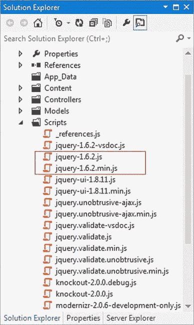

***图 2-1。**来自 ASP.NET MVC 项目的 jQuery 库*

要从微软的 Ajax CDN 引用 jQuery 库，不需要维护 jQuery 库的本地副本——可以直接引用。您可以在微软 Ajax CDN 上的`[www.asp.net/ajaxlibrary/cdn.ashx](http://www.asp.net/ajaxlibrary/cdn.ashx)`找到可用文件的列表。图 2-2 显示了你可以从微软 Ajax CDN 中使用的文件列表。

jQuery 1.7.2 的简化版本和非简化版本的 URL 如下:

`[`ajax.aspnetcdn.com/ajax/jQuery/jquery-1.7.2.min.js`](http://ajax.aspnetcdn.com/ajax/jQuery/jquery-1.7.2.min.js)`

缩小版是通过应用几种脚本缩小技术(如从代码中删除空格和注释)获得的压缩版本。缩小版是生产使用的理想选择，因为它的尺寸很小。在开发阶段可能需要调试脚本时，可以使用非精简版本。

 **注意**CDN 是位于全球关键位置的服务器网络。该网络维护要传送到客户端的文件的缓存副本。当客户端试图访问由 CDN 维护的任何文件时，离请求客户端最近的服务器满足请求。这种技术被称为*边缘缓存*，因为面向边缘的服务器提供内容。除了 Microsoft Ajax CDN，您还可以使用 Google Libraries API 来引用 jQuery 库。

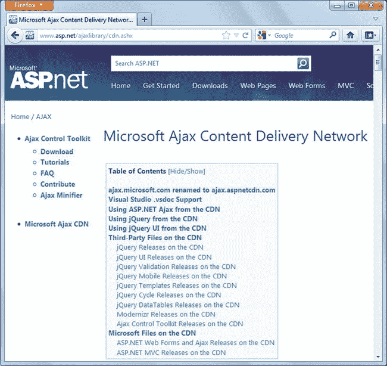

***图 2-2。**微软 Ajax CDN 上的可用文件*

无论您保留 jQuery 库的本地副本还是从微软 Ajax CDN 引用它，您都需要添加一个对它的引用，如清单 2-1 所示。

***清单 2-1。**参考 jQuery 库*

`  <!-- Referring to a local copy of the jQuery library -->

  

  <!-- Referring to the jQuery library from the Microsoft Ajax CDN -->

  `

在清单 2-1 中，第一个`<script>`标签引用了名为`Scripts`的本地文件夹中的 jQuery 库。请确保更改此路径以匹配您的项目文件夹结构。如果你使用微软 Ajax CDN 来引用 jQuery 库，你的开发机器必须有互联网连接。当然，您可以在开发期间使用 jQuery 库的本地副本，并在应用投入生产后切换到 Microsoft Ajax CDN。

现在您已经知道如何在您的 ASP.NET web 应用中引用 jQuery 库，让我们在接下来的小节中研究 jQuery 的核心特性。

### 事件处理

处理 HTML 页面元素(如按钮、列表和图像)引发的事件是客户端脚本中最常见的编程操作之一。jQuery 提供了一种简单的跨浏览器事件处理机制，允许您动态连接事件处理程序，并提供关于正在处理的事件的丰富信息。

表 2-1 列出了 web 应用中许多常用的客户端事件。

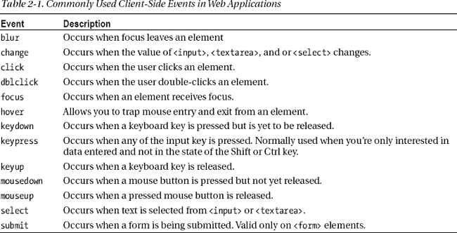

为了处理表 2-1 中的事件，jQuery 提供了一组相应的函数。这些功能有双重用途:

> *   They let you specify an event handler function that should be executed when an event occurs.
> *   They let you trigger events programmatically.

例如，要将一个名为`OnClick`的事件处理函数连接到一个 ID 为`Button1`的按钮的`click`事件，您需要编写

`$("#Button1").click(OnClick);`

另一方面，如果您希望以编程方式触发`Button1`的`click`事件，您可以编写:

`$("#Button1").click();`

当您在本节开发的示例中使用它时，这种双重目的会更加清晰。

jQuery 事件处理的一个很好的特性是，事件对象以标准的方式传递给事件处理程序，并且在所有浏览器中包含相同的属性集。传递给事件处理程序的事件对象包含几条信息，如表 2-2 中所列。

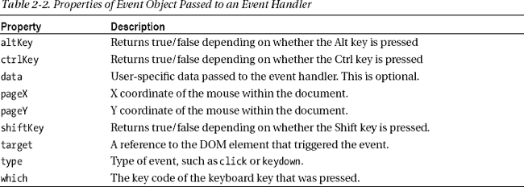

event 对象还提供了一个方便的方法`preventDefault()`,用于取消事件的默认动作。

为了理解如何使用 jQuery 处理事件，让我们开发一个 ASP.NET Web 表单应用，如图 2-3 所示。

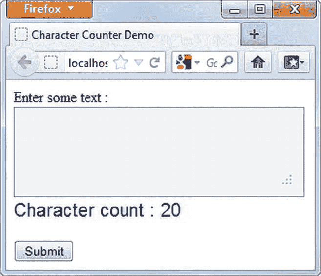

***图 2-3。**使用 jQuery 事件处理的字符计数器*

图 2-3 中的所示的 web 表单有一个`<textarea>`用于输入自由格式的文本数据。但是，您可以设置可以输入的最大字符数。在运行时，当用户开始输入时，字符计数器显示仍可输入的字符数。如果输入文本的长度超过预定义的值，您可以禁止进一步输入，或者用彩色高亮显示负字符数。当用户单击 Submit 按钮时，会要求他们确认是否要提交表单；因此，要么将表单提交给服务器，要么取消操作。

清单 2-2 显示了 web 表单的 HTML 标记。

***清单 2-2。**字符计数器表单的 HTML 标记*

`<form id="form1" runat="server">
Enter some text :
 
<textarea id="textarea" rows="3" cols="50" class="TextArea"></textarea>
 
Character counter : 

  
<asp:Button ID="submit" runat="server" Text="Submit" OnClick="submit_Click" />
 
<asp:Label ID="lblMessage" runat="server" Text=""></asp:Label>
</form>`

“提交”按钮和关联的消息标签是服务器控件。通常，标记中使用的 CSS 类驻留在样式表文件中。接下来，您需要编写 jQuery 代码，连接几个事件处理程序并使字符计数器起作用。清单 2-3 显示了为`keyup`、`blur`和`click`事件连接事件处理程序的`ready()`函数。`keyup`和`blur`事件处理程序确保在`textarea`中输入的字符数小于或等于最大长度。它们还更新相应的``元素中的字符数。

***清单 2-3。**字符计数器的事件接线*

`$(document).ready(function () {
  var eventData = {
    MaxLength: 20,
    Type: 'Remaining',
    AllowOverflow: true,
    CounterId: 'counter',
    NormalCss: 'NormalCounter',
    WarningCss:'WarningCounter'
  };
  $("#textarea").keyup(eventData, OnKeyUp);
  $("#textarea").blur(eventData,OnBlur);
  $("#textarea").keyup();

  $("#submit").click(function (event) {
    if (!confirm("Do you wish to submit the form?")) {
      event.preventDefault();
    }
  });
})`

当浏览器中加载了整个 HTML DOM 树时，jQuery 会自动调用`ready()`函数。您可以将自己的函数传递给`ready()`函数，该函数为各种元素(如`textarea`和`<button>`)连接事件处理程序。代码声明了一个变量(`eventData`)，该变量存储需要传递给事件处理程序的配置设置。一旦连接了事件处理程序，每次引发事件时，`eventData`对象会自动传递给事件处理程序。注意`eventData`是一个 JSON 对象，采用键值对的形式。键及其值由冒号(`:`)分隔，多个键值对由逗号(`,`)分隔。表 2-3 解释了`eventData`对象的每个设置的用途。

然后代码选择`<textarea>`元素。注意基于 ID 选择元素的 jQuery 方式:您需要传递前缀为`#`字符的元素 ID。`<textarea>`的`keyup`和`blur`事件分别连接到`OnKeyUp`和`OnBlur`事件处理函数。您很快就可以编写这些事件处理函数。注意，在连接事件处理程序时，代码也传递了`eventData`对象。然后代码通过调用`keyup()`函数以编程方式触发`<textarea>`的`keyup`事件。这使得 counter ``元素显示初始字符数。

提交按钮的`click`事件的事件处理程序使用不同的语法连接。代码创建了一个匿名事件处理程序(也称为*内联函数*)函数，而不是创建一个单独的函数，然后将其作为事件处理程序附加。事件处理函数接受一个参数(event ),该参数在引发`click`事件时自动传递。提交按钮的`click`事件处理程序询问用户是否提交表单。如果用户决定取消表单提交，则使用事件对象的`preventDefault()`方法取消`click`事件。

事件处理函数`OnKeyUp`()如清单 2-4 所示。

***清单 2-4。**处理`keyup`事件*

`function OnKeyUp(event) {
  var id = "#" + event.target.id;
  var counterid = "#" + event.data.CounterId;
  var text = $(id).val();
  if (text.length > event.data.MaxLength) {
    if (!event.data.AllowOverflow) {
      $(id).text(text.substring(0, event.data.MaxLength));
    }
  }
  var diff = 0;
  if (event.data.Type == 'Remaining') {
...
  }
  else {
...  }
  $(counterid).text(diff);
}`

注意如何使用`event.target.id`来检索`<textarea>`的 ID，如何使用`event.data.CounterId`来检索``的 ID。这些 id 存储在两个变量中(`id`和`counterid`)以备后用。`val()`方法返回在`<textarea>`中输入的文本，并存储在另一个局部变量(`text`)中。根据计数器的类型(`Remaining`或`Total`，代码根据`MaxLength`值检查`<textarea>`中输入的文本数据的长度。如果`Type`为`Remaining`，则检查如下:

`diff = event.data.MaxLength - $(id).val().length;
if (diff < 0) {
  $(counterid).removeClass(event.data.NormalCss);
  $(counterid).addClass(event.data.WarningCss);
}
else {
  $(counterid).removeClass(event.data.WarningCss);
  $(counterid).addClass(event.data.NormalCss);
}`

如果文本长度与`MaxLength`之差小于 0，则表明文本长度超过了最大允许长度。在这种情况下，您应该显示带有`WarningCss`类的计数器。为此，首先使用`removeClass()`方法移除`NormalCss`类，然后使用`addClass()`方法应用`WarningCss`类。如果差值大于 0，您应该通过移除`WarningCss`类来应用`NormalCss`类。

如果计数器`Type`为`Total`，则应用 CSS 类，如下所示:

`diff = $(id).val().length;
if (diff > event.data.MaxLength) {
  $(counterid).removeClass(event.data.NormalCss);
  $(counterid).addClass(event.data.WarningCss);
}
else {
  $(counterid).removeClass(event.data.WarningCss);
  $(counterid).addClass(event.data.NormalCss);
}`

如果输入的文本长度大于`MaxLength`值，则使用`removeCss()`方法移除`NormalCss`类，并使用`addClass()`应用`WarningCss`类。否则，移除`WarningCss`并应用`NormalCss`。

最后，在代码基于`Type`设置执行长度检查之后，使用`text()`方法将计数器值分配给``元素。

如果`AllowOverflow`设置为`false`，用户输入的更多文本将使用`substring()` JavaScript 函数被修剪为`MaxLength`的值。使用`text()`方法将修剪后的文本分配给`<textarea>`。

`OnBlur`()事件处理函数如清单 2-5 所示。

***清单 2-5。**处理`blur`事件*

`function OnBlur(event) {
  var id = "#" + event.target.id;
  $(id).keyup();
}`

`OnBlur()`事件处理函数只是以编程方式触发`keyup`事件。这样，即使用户使用复制粘贴技术(Ctrl+V 或快捷菜单)在`<textarea>`中输入文本，当用户退出`<textarea>`时，计数器仍然会反映正确的值。

图 2-4 显示了文本超过`MaxLength`值的 web 表单的运行示例。您还可以测试提交按钮的功能。注意，如果单击 Cancel，表单不会回发到服务器。

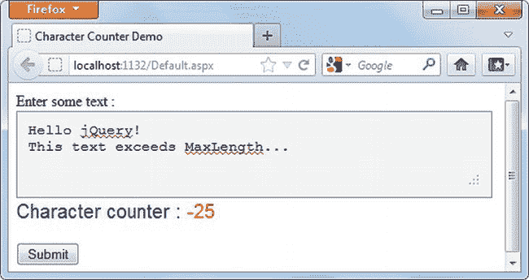

***图 2-4。**字符计数器显示警告*

在您刚刚开发的字符计数器中，您使用了`#id`语法来选择一个与特定 ID 匹配的 DOM 元素。通过这样做，您使用了 jQuery 众多选择器中的一个。下一节将介绍 jQuery 中其他一些重要的选择器。

#### 使用 bind()方法进行事件关联

在前面的例子中，您分别使用 jQuery 函数`click()`和`change()`连接了标准事件`click`和`change`的事件处理程序。在撰写本文时，jQuery 还没有包含特定于 HTML5 的事件的事件函数。例如，您在第三章中了解到的`video`元素有`play`和`pause`事件，但是 jQuery 没有内置函数来连接这些事件的事件处理程序。幸运的是，jQuery 提供了一种将事件连接到它们的处理程序的通用方法:`bind()`方法。您可以按如下方式使用它:

`$("#Button1").bind("click",OnClick);`

这行代码将`Button1`的`click`事件连接到一个名为`OnClick`的事件处理函数。`bind()`方法有两个参数。第一个参数指示您希望处理的事件，第二个参数指定事件处理函数。

### jQuery 选择器

使用客户端脚本时，您通常只需要对特定的元素执行某些任务。例如，您可能想要读取 ID 为`TextBox1`的文本框的值，或者用红色显示表格中包含负值的所有行。jQuery 选择器允许您根据特定标准匹配 HTML 元素，并选择它们进行进一步处理。因此，jQuery 选择器返回一个集合，其中包含零个或多个与选择标准匹配的元素。

jQuery 选择器可以分为以下几类:

> *   *Basic selector:* Select elements according to basic criteria such as ID, CSS class and HTML tag name.
> *   *Basic filtering:* Filter the element set according to the conditions of first occurrence, last occurrence, odd or even elements, etc.
> *   *Attribute selector:* Select elements by matching attribute values.
> *   *Sub-level filtering:* Filter the element set according to the conditions of the first sub-level, the last sub-level, *the nth sub-level, the unique sub-level, etc.*
> **   *Content filter:* Filter elements according to content.*   *Form selector:* Select form elements according to type (button, check box, etc.) and status (selected or selected).*   *Hierarchy selector:* Select elements (child elements, descendant elements, brother elements and adjacent elements) from the hierarchy.*   *Visibility filter:* Select elements according to their visibility status (visible or hidden).*

 *本书示例中经常用到的选择器将在下面的章节中讨论。

 **注意**下面几节中讨论的一些示例使用了 Northwind 数据库，这是微软为 SQL Server 开发的一个示例数据库。因此，您可以考虑将其安装在本地 SQL Server 或 SQL Server Express 实例中。您可以从 MSDN 下载中心下载 Northwind 数据库的 T-SQL 脚本。

#### 根据 ID、标签名和 CSS 类选择元素

基于 ID、标记名或 CSS 类选择 HTML 元素是客户端脚本编写中的一个常见需求。从前面几节中，您已经知道了如何通过指定 ID 来选择 HTML 元素。清单 2-6 显示了这三种类型的选择。

***清单 2-6。**使用 ID、标签名和 CSS 类来匹配元素*

`$(document).ready(function () {
  $("#myDiv").html("<h1>Hello jQuery !</h1>");
  $("div").css("background-color", "#ded8d8");
  $(".MyClass").text("We have the same CSS class!");
})`

`ready`函数中的第一行选择了一个 ID 为`myDiv`的 DOM 元素。然后，它使用 jQuery `html()`方法将所选元素的 HTML 内容设置为一些标记。第二行从页面中选择所有的`
`元素，并使用`css()`方法将它们的背景色设置为`#ded8d8`。最后，第三行代码选择应用了名为`MyClass`的 CSS 类的所有元素，并将它们的 HTML 内容设置为一个字符串。

图 2-5 显示了该页面的运行示例。

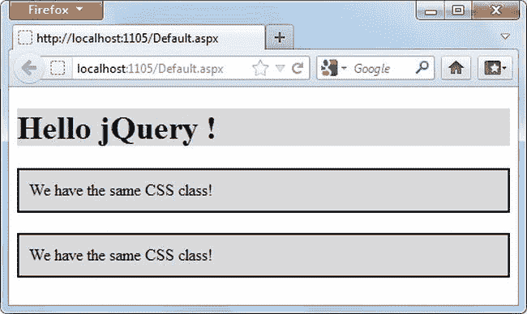

***图 2-5。**根据 ID、标签名和 CSS 类选择 HTML 元素*

注意所有的`
`元素都有相同的背景颜色，因为颜色被应用到标签名为`div`的所有 HTML 元素的`background-color`属性。类似地，CSS 类`MyClass`的两个`
`元素具有相同的文本内容。

现在，让我们基于这些知识开发一个更有意义的例子。图 2-6 显示了一个`GridView`服务器控件，其中填充了来自 Northwind 数据库`Employees`表的数据。

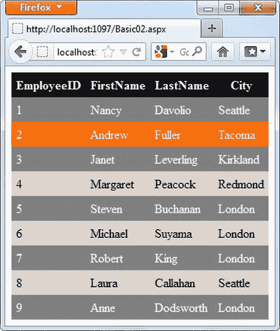

***图 2-6。** `GridView`用不同的样式显示交错的行*

`GridView`控件在浏览器中呈现为一个 HTML 表格。图 2-6 中所示的`GridView`具有以不同 CSS 样式显示的交替行。此外，标题行以另一种 CSS 样式显示。此外，当鼠标指针悬停在这些行上时，它们会显示一个突出显示的标记。单击任何一行都会在警告框中显示该行的`EmployeeID`。所有这些都是通过 jQuery 完成的。web 表单中的`<script>`块显示了清单 2-7 中的 jQuery 代码。

***清单 2-7。**用不同的样式标记奇数行和偶数行*

`$(document).ready(function () {
  $("#GridView1 th").parent().addClass("HeaderRow");
  $("#GridView1 tr:not(.HeaderRow):odd").addClass("Row");
  $("#GridView1 tr:not(.HeaderRow):even").addClass("AlternateRow");
  $("#GridView1 tr:not(.HeaderRow)").hover(function () {
    $(this).addClass('HoverRow');
  }, function () {
    $(this).removeClass('HoverRow');
  }).click(function () {
    if ($(this).hasClass("HeaderRow")) {
      alert("This is header row. Can't get EmployeeID!");
    }
    else {
      alert("You selected Employee ID :" + $("td:first", this).text());
    }
  });
});`

清单 2-7 中显示的代码使用了本节前面讨论的选择器和一些附加过滤器的组合。首先，代码为表格的标题行设置一个 CSS 类。注意来自特定`GridView`(ID 为`GridView1`)的`<th>`元素是如何被选择的。这样，即使同一个 web 表单上有多个表格，样式也只应用于`GridView1`。`parent()`方法返回一个父元素`<th>`(在本例中为`<tr>`)，并且使用`addClass()`方法将`HeaderRow` CSS 类应用于该表格行。

接下来的两行代码从表中选择所有奇数和偶数行，不包括标题行。这通过使用`:not()`、`:odd`和`:even`选择器来完成。`:not()`选择器确保不选择标题行来应用奇数和偶数样式。`:odd`和`:even`选择器分别返回奇数和偶数元素。一旦选中，CSS 类`Row`和`AlternateRow`将分别应用于它们。

接下来，使用`hover()`方法将鼠标悬停效果添加到表格行。`hover()`方法的第一个参数是当鼠标指针进入表格行时调用的函数，第二个参数是当鼠标指针离开表格行时调用的函数。在回调函数中，关键字`this`代表当前表格行。`hover()`方法函数本质上是添加和删除`HoverRow` CSS 类到考虑中的表格行。

 **注意**在任何 jQuery 事件处理程序中，关键字`this`都是指事件处理程序所附加的 DOM 元素。

注意在连接`click`事件处理程序时 jQuery 链接特性的使用。不用再次选择行，然后连接它们的`click`事件处理程序，您可以同时连接`hover`和`click`事件的事件处理程序。

`click`事件处理程序显示被点击行的`EmployeeID`。`td:first`选择器返回当前行的第一个`td`元素。在不带任何参数的情况下调用`text()`方法时，该方法返回该表列中的文本内容(在本例中为`EmployeeID`)。如果单击标题行，将显示一条错误消息。注意如何使用`hasClass()`方法来确定一行是否应用了特定的 CSS 类。

#### 根据属性值选择元素

属性选择器允许您将 HTML 元素的属性与某些标准相匹配。它不仅限于对等匹配；也有其他几种选择，如表 2-4 中所列。使用属性选择器的一般形式如下:

`<element_name>[<attribute_name> <operator> <value_to_match>]`

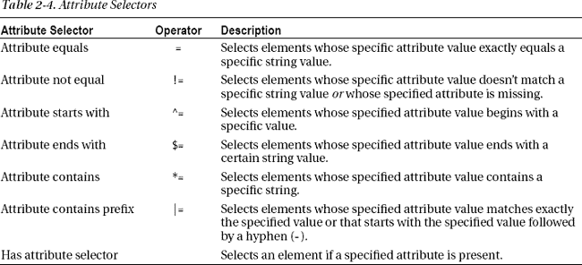

让我们考虑一些展示如何使用属性选择器的例子。

假设您有一个包含许多超链接的网页，并且您希望选择那些`href`属性正好等于`[`www.microsoft.com`](http://www.microsoft.com)`的超链接。下面的属性选择器完成了这个任务。警告框显示所选元素的总数:

`alert($("a[href = 'http://www.microsoft.com']").length);`

假设你有几个超链接:`[`microsoft.com`](http://microsoft.com)`、`[`msdn.microsoft.com`](http://msdn.microsoft.com)`和`[`www.asp.net`](http://www.asp.net)`。你只需要选择那些包含单词*微软*的超链接。以下属性包含选择器选择前两个超链接，但不选择第三个:

`alert($("a[href *= 'microsoft.com']").length);`

假设一个产品目录页面显示了许多图片。其中一些是产品图像，另一些是网站主题图像(徽标、菜单等)。还假设产品图像存储在名为`product`的文件夹中。要选择所有要处理的产品图像，您可以使用这个*属性以*选择器返回其`src`属性以*产品*开始的图像元素:

`alert($("img[src ^= 'product']").length);`

假设您正在构建一个相册 web 应用，它以各种格式显示照片，包括`.png`、`.jpg`和`.gif`。根据图像格式，您可以允许添加某些特殊效果。在这种情况下，您可能想要选择具有特定文件扩展名的图像。下面的*属性以*结尾选择器通过选择所有`src`属性以`.gif`结尾的图像来完成:

`alert($("img[src $= '.gif']").length);`

假设一个多语言网站需要用不同的语言呈现其内容。`lang`属性用于标记页面某一部分的语言。如果您希望选择所有的`
`元素，它们的`lang`属性被设置为某个值，您可以使用这个 *has 属性*选择器:

`alert($("div[lang]").length);`

现在，让我们开发一个使用属性选择器的更真实的例子，如图 2-7 所示。

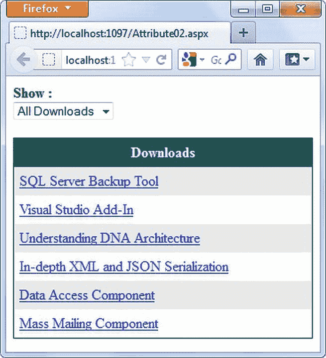

***图 2-7。**使用属性选择器过滤下载链接*

在图 2-7 中，web 表单由一个`GridView`控件组成，该控件显示可下载文件的链接。下载类别在顶部的`DropDownList`中列出。当用户选择特定类别时，只显示属于所选类别的下载。其余的都藏起来了。下载链接有特定的模式:

> *   All product download links contain the `Products` folder in UR: for example, `products/Product1Setup.exe`.
> *   The download links of all white papers are in `paper-*xxxx*` format, where *`xxxx`* is the title of the paper: for example, `Paper-Topic1.pdf`.
> *   The download links of all software components are in the form of `*xxxx*-comp.zip`: for example, `Component1-comp.zip`.

下载链接的隐藏和显示发生在客户端，使用 jQuery 属性选择器。清单 2-8 展示了这段代码的框架。

***清单 2-8。**使用属性选择器隐藏或显示下载链接*

`$(document).ready(function () {
  $("#DropDownList1").change(function () {
    switch ($("#DropDownList1").val()) {
      case "A":
      case "P":
      case "WP":
      case "C":
    }
  })
})`

`ready`函数为`DropDownList1`的`change`事件连接一个事件处理程序。正如您可能猜到的，当`DropDownList`中的选择改变时，就会引发`change`事件。`change`事件处理程序由一个 JavaScript `switch`语句组成，该语句检查所选的值。让我们讨论一下每个案例部分的内容。

如果选择的值是`"A"`，意味着所有下载，那么所有表格行的`display` CSS 属性被设置为`block`。这确保所有类型的下载(产品、组件和白皮书)都显示在网格中:

`case "A":

  $("#GridView1 tr a").parent().css("display", "block");
  break;`

如果选择的值是`"P"`(产品)，那么*属性包含*选择器(`*=`)用于匹配所有`href`属性包含字符串`"products/"`的锚元素。匹配后，将显示包含匹配超链接元素的表格行，其他行保持隐藏状态:

`case "P":
  $("#GridView1 tr a[href *= 'products/']").parent().css("display", "block");
  $("#GridView1 tr a[href |= 'Paper']").parent().css("display", "none");
  $("#GridView1 tr a[href $= '-comp.zip']").parent().css("display", "none");
  break;`

如果选择的值是`"WP"`(白皮书)，代码使用*属性包含前缀*选择器(`|=`)来选择以文本`“paper”`为前缀的超链接。注意白皮书的 URL 以`"Paper-"`开始，但是选择器只指定了`"Paper"`；这是因为在匹配元素时，*属性包含前缀*选择器自动采用连字符(`-`)。选定后，包含这些超链接的表格行将显示，而其他行将保持隐藏状态:

`case "WP":
  $("#GridView1 tr a[href *= 'products/']").parent().css("display", "none");
  $("#GridView1 tr a[href |= 'Paper']").parent().css("display", "block");
  $("#GridView1 tr a[href $= '-comp.zip']").parent().css("display", "none");
  break;`

最后，如果选择的值是`"C"`(组件)，代码使用*属性选择与组件相关的链接，以*选择器(`$=`)结束，并相应地显示和隐藏表格行:

`case "C":
  $("#GridView1 tr a[href *= 'products/']").parent().css("display", "none");
  $("#GridView1 tr a[href |= 'Paper']").parent().css("display", "none");
  $("#GridView1 tr a[href $= '-comp.zip']").parent().css("display", "block");
  break;`

#### 选择表单元素

表单选择器允许您根据 HTML `<form>`元素的类型(文本框、复选框、单选按钮等)或状态(选中、选中或禁用)来选择 HTML`<form>`元素。表 2-5 列出了各种可用的表单选择器。

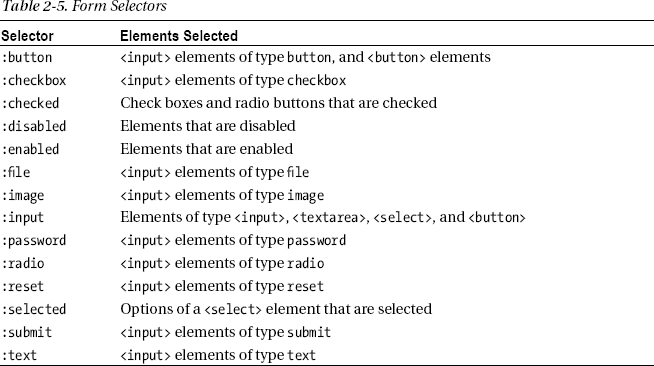

清单 2-9 显示了表 2-5 中提到的一些选择器。

***清单 2-9。**表单选择器的基本用法语法*

`$(document).ready(function () {
  $("#form1 :text").attr("disabled", "disabled");
  $("#form1 :checkbox").attr("checked", "checked");
  $("#Button1").click(function () {
    alert($("#form1 input[type='checkbox']:checked").length + " checkboxes are checked.");
    alert($("#Select1 option:selected").length + " options are selected.");
  });
});`

清单 2-9 中的第一个表单选择器选择所有文本框，并通过添加`disabled`属性禁用它们。jQuery `attr()`函数用于设置元素的属性值。`attr()`的第一个参数是属性的名称，第二个参数是它的值。在这种情况下，`disabled`属性被设置为值`disabled`，以便禁用文本框。

第二个表单选择器选择所有复选框，并通过添加`checked`属性以编程方式选中它们。

`Button1`的`click`事件处理程序选择所有选中的复选框元素。jQuery 选择器可以返回零个或多个元素。使用`length`属性可以获得所选元素的总数。在这种情况下，会出现一个警告框，显示选中的复选框总数。

最后，最后一个警告框显示从一个`<select>`元素中选择的所有选项的数量。

图 2-8 所示的 web 表单演示了表单选择器的一个更真实的用法。web 表单显示了一个包含来自 Northwind 数据库的`Employees`表的记录的`GridView`。`GridView`的每一行都有一个复选框和一个单选按钮来选择那一行。复选框列的标题中还有一个复选框，用于切换所有复选框的选择。顶部的列表框显示城市；如果在列表框中选择一个或多个城市，则只有属于所选城市的员工记录才被启用。其他记录的复选框和单选按钮被禁用。单击清除选择按钮清除列表框中的所有选择，并启用所有员工行。负责此功能的 jQuery 代码由四个事件处理函数组成:复选框的`change`事件处理函数、单选按钮的`change`事件处理函数、`list box`的`change`事件处理函数和按钮的`click`事件处理函数。这些事件处理程序连接在`ready()`函数中，接下来将会讨论。

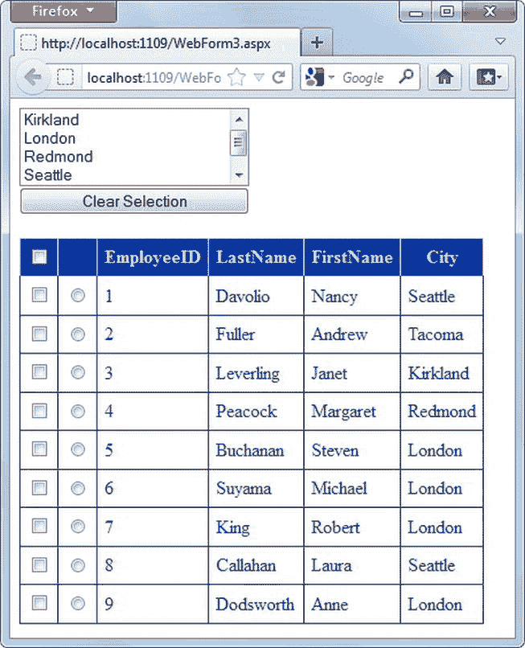

***图 2-8。** A `GridView`显示用于选择员工行的复选框和单选按钮*

清单 2-10 显示了复选框的`change`事件处理程序。

***清单 2-10。**复选框的`Change`事件处理程序*

`$("#GridView1 :checkbox[id$='chkHeader']").change(function () {
  if ($("#GridView1 :checked[id $='chkHeader']").is(":checked")) {
    $("#GridView1 :checkbox[id *='chkItem']").attr("checked", "checked");
  }
  else {
    $("#GridView1 :checkbox[id *='chkItem']").removeAttr("checked");
  }
})`

清单 2-10 中的代码连接了标题行中复选框的`change`事件处理程序。它使用以属性选择器结束的*来实现，因为在运行时，`GridView`为复选框生成唯一的 id。在生成这些唯一 ID 时，由开发人员设置的设计时 ID 被附加在唯一字符串值的末尾。例如，header 复选框的 ID 属性设置为`chkHeader`，在运行时其客户端 ID 变为`GridView1$ctl01$chkHeader`。标题复选框的`change`事件处理程序从`GridView`行中选择所有复选框，并根据标题复选框的状态切换它们的状态。通过使用 jQuery `attr()`方法添加或删除`checked`属性来切换复选框状态。*

所有单选按钮的`change`事件处理程序如清单 2-11 中的所示。

***清单 2-11。** `Change`单选按钮的事件处理程序*

`$("#GridView1 :radio[id *='radItem']").change(function () {
  var newId = this.id;
  $("#GridView1 :radio[id *='radItem']").each(function (index) {
    if (this.id != newId) {
      $(this).removeAttr("checked");
    }
  })
})`

默认情况下，放置在`GridView`中的单选按钮不是互斥的，您可以选择多个单选按钮。发生这种情况是因为`GridView`为每个单选按钮生成了不同的名称，而不是将它们视为一个组。为了解决这个问题，单选按钮的`change`事件处理程序遍历单选按钮，并取消选中除被选中按钮之外的所有按钮。为了遍历单选按钮，代码使用了 jQuery `each()`方法。`each()`方法采用一个函数，对匹配集中的每个元素执行该函数。回调函数从匹配集中接收当前元素的从零开始的索引。要取消选中一个单选按钮，使用`removeAttr()`方法删除它的`checked`属性。

显示城市的列表框的`change`事件处理程序如清单 2-12 所示。

***清单 2-12。** `Change`列表框的事件处理程序*

`$("#ListBox1").change(function () {
  $("#GridView1 :input").attr("disabled", "disabled");
  $("#ListBox1 option:selected").each(function () {
    $("#GridView1 tr:contains('" + this.value + "')").each(function () {
      $(":input", this).removeAttr("disabled");
    })
  })
})`

该事件处理程序禁用所有输入元素，包括复选框和单选按钮。然后，它选择列表框中的选项，并使用`each()`方法逐个遍历它们。`each()`块中的代码检查当前行是否包含选择的城市。使用`:contains()`选择器完成该检查。该选择器接受一个字符串，并只返回那些包含指定字符串值的行。如果在一行中找到一个城市，则使用`removeAttr()`方法删除相应复选框和单选按钮的`disabled`属性。

清除选择按钮的`click`事件处理程序如清单 2-13 所示。

***清单 2-13。** `Click`清除选择按钮*的事件处理程序

`$("#Button1").click(function (event) {
  $("#ListBox1 option").each(function () {
    $(this).removeAttr("selected");
  })
  $("#GridView1 :input").removeAttr("disabled");
  event.preventDefault();
})`

按钮的`click`事件处理程序使用`each()`方法遍历所有列表框选项，并通过移除`selected`属性逐个取消选择它们。所有的`<input>`元素都是通过删除`disabled`属性来启用的，因为现在列表框中没有城市被选中。

### 使用 jQuery 修改 DOM

到目前为止，您已经知道了如何改变现有的元素及其属性。jQuery 还允许您插入、追加、删除和替换 HTML DOM 中的元素，以便您可以修改文档结构。例如，假设您从客户端 jQuery 代码调用一个远程服务，根据服务返回的内容，您需要动态生成 HTML 标记。这些任务可以使用 jQuery 方法来完成，这些方法允许您操作 HTML DOM。表 2-6 列出了一些最常用的 DOM 操作方法。

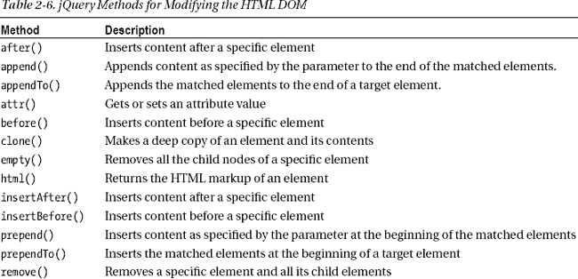

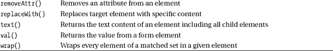

你已经熟悉了其中的一些方法，比如`val()`、`attr()`、`removeAttr()`、`text()`和`html()`。清单 2-14 显示了来自表 2-6 的其他方法的使用。

***清单 2-14。**使用 DOM 操作方法*

`$("#container").append("
Hello
");
$("
Hello
").appendTo("#container");
$("span").replaceWith("
Hello Universe!
");
$("
Hello World!
").replaceAll("div.class1");`

清单 2-14 中的第一行代码在容器元素的末尾添加了`
Hello
`。所以，如果容器是一个``元素，那么在调用`append()`方法之后，有效的标记是

`
Hello
`

 **注意**大多数浏览器都让你查看正在显示的网页的 HTML 源代码。然而，这个 HTML 源代码不包括任何在运行时使用表 2-6 中列出的 jQuery 方法动态添加的 HTML 标记。

第二行代码使用了`appendTo()`方法。该方法类似于`append()`方法，但有一点不同:`append()`在目标元素上被调用，并接受要追加的标记。`appendTo()`方法接受一个目标元素作为参数，并在目标的末尾附加指定的标记。

`replaceWith()`方法的例子用`
`元素替换了所有的``元素。比如，如果原来的标记是`Hello World!`，那么调用`replaceWith()`方法后，新的标记就是`
Hello Universe!
`。

最后，`replaceAll()`方法用 CSS 类`class1`替换所有的`
`元素，用`
Hello World!
`替换。

### jQuery Ajax 技术

在后面章节中讨论的许多 HTML5 特性要求你在客户机浏览器和服务器之间传递数据。这种数据传输可以通过两种方式完成:

> *   Submit the entire form to the server.
> *   Make Ajax requests to the server

第一种技术涉及使用`GET`或`POST`请求将整个表单提交给服务器。尽管这是一种经典技术，并且易于实现(使用提交按钮或`submit()` JavaScript 方法)，但它有一个缺点:整个页面需要刷新，这会影响 web 应用的响应能力和整体性能。难怪许多现代 web 应用倾向于使用第二种方式向服务器发送数据。

第二种技术是向服务器发出一个 Ajax 请求。使用 Ajax 的好处是不需要将所有的表单数据发送到服务器。相反，您可以只发送在给定时间点进行处理所需的数据片段。Ajax 请求返回的处理结果可用于动态更新网页。因此，Ajax 提高了 web 应用的响应能力和整体性能。

注意，虽然 Ajax 意味着使用 XML 作为数据格式，但 JSON 由于其紧凑性而比 XML 更常用。本书中大多数需要在客户机和服务器之间传输数据的例子都使用了 Ajax 和 JSON。

jQuery 提供了许多向服务器发出 Ajax 请求的方法。它们列在表 2-7 中。

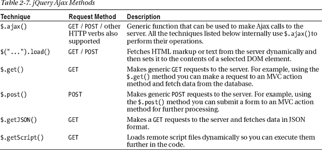

使用 jQuery Ajax 技术，您可以调用以下类型的 ASP.NET 服务器端代码:

> *   Web service (`.asmx`)
> *   Web method
> *   WCF service (`.svc`)
> *   ASP.NET MVC controller action method
> *   Web API
> *   Universal HTTP handler (`.ashx`)

尽管 jQuery Ajax 技术允许您调用 ASMX web 服务，但只要有可能，就应该避免使用它们，因为有更新的技术可用。

 **注意**从技术上讲，你可以向这里没有列出的任何服务器端资源发出 Ajax 请求。然而，在大多数情况下，最好将要从客户端调用的代码封装在所讨论的一种机制中。

对表 2-7 中列出的所有 jQuery Ajax 技术的详细讨论超出了本书的范围。下面的例子说明了`$.ajax()`函数的用法，因为它是所有其他技术的鼻祖。

本节中的例子展示了如何在 Web 表单和 MVC 应用中使用`$.ajax()`。你开发的两个应用都显示一个简单的网页，如图 2-9 所示。

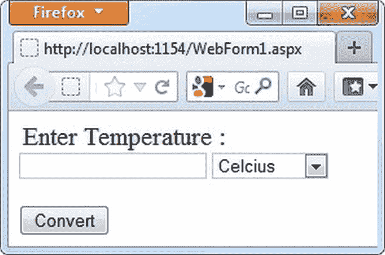

***图 2-9。**在摄氏和华氏之间转换温度的网页*

该网页允许您输入摄氏或华氏温度值，并将其转换为其他刻度。温度转换发生在 Web 窗体应用的 WCF 服务和 MVC 应用的控制器操作方法中。

#### 使用 jQuery $。Web 窗体应用中的 ajax()方法

在摄氏和华氏之间转换温度值的 WCF 服务如清单 2-15 中的所示。

***清单 2-15。** WCF 温度值转换服务*

`namespace AjaxWebForm
{
    [DataContract]
    public class TemperatureData
    {
        [DataMember]
        public decimal Value { get; set; }
        [DataMember]
        public string Unit { get; set; }
    }

    [ServiceContract]
    public interface IService
    {
        [OperationContract]
        [WebInvoke(Method = "POST",
          RequestFormat = WebMessageFormat.Json,
          ResponseFormat = WebMessageFormat.Json)]` `        TemperatureData Convert(TemperatureData t);
    }

    public class Service : IService
    {
        public TemperatureData Convert(TemperatureData t)
        {
            if (t.Unit == "C")
            {
                t.Value = (t.Value * 1.8m) + 32;
                t.Unit = "F";
            }
            else
            {
                t.Value = (t.Value - 32) / 1.8m;
                t.Unit = "C";
            }
            return t;
        }
    }
}`

`TemperatureData`类表示 WCF 服务的数据契约，包含两个数据成员属性:`Value`和`Unit`。`IService`接口表示服务的服务契约，并定义了一个方法`Convert()`。`Convert()`方法接受一个`TemperatureData`对象，并在将温度值转换为另一个刻度后返回一个`TemperatureData`对象。

请注意，`Convert()`是用一个`[WebInvoke]`属性修饰的。由于这个属性，`Convert()`变得可以从客户端 jQuery 代码中调用。`[WebInvoke]`属性的`RequestFormat`和`ResponseFormat`属性分别指定 JSON 作为请求和响应期间的通信格式。属性指定 HTTP `POST`请求可以调用`Convert()`。`Service`类实现了`Convert()`。`Convert()`方法检查传入的`TemperatureData`对象的`Unit`，并根据`Unit`将`Value`转换为另一个刻度。

可以使用 jQuery 的`$.ajax()`函数调用`Service`类的`Convert()`方法，如清单 2-16 所示。

***清单 2-16。**使用`$.ajax()`调用 WCF `Service` `Convert()`的方法*

`$(document).ready(function () {
  $("#Button1").click(function () {
    url = "Service.svc/Convert";
    data = '{"Value":"' + $("#Text1").val() + '","Unit":"' + $("#Select1").val() + '"}';
    $.ajax({
      type: "POST",
      url: url,
      data: data,
      contentType: "application/json; charset=utf-8",
      dataType: "json",
      success: OnSuccess,
      error: OnError
    })
  });
});` `function OnSuccess(results) {
  alert("Converted Temperature : " + results.Value + " " + results.Unit);
}

function OnError(err) {
  alert(err.status + " - " + err.statusText);
}`

Convert 按钮的`click`事件处理程序包含用于调用`Convert()`方法的 jQuery 代码。`$.ajax()`功能有许多可配置的设置。清单 2-14 中使用了一些常见的。`url`设置允许您指定远程资源 URL。对于 WCF 服务，URL 采用`<path_to_svc_file>/<method_name>`的形式。

`type`选项允许您指定发出请求时要使用的 HTTP 请求类型。`Convert()`方法配置了`[WebInvoke]`属性来使用`POST`方法，因此`type`就是`POST`。`data`设置表示在进行呼叫时要发送给服务器的数据(如果有)。注意数据是如何以 JSON 格式捕获的。JSON 对象采用键值对的形式:一个键和它的值由冒号(`:`)分隔，多个键值对由逗号(`,`)分隔。

`dataType`设置控制响应的数据类型(XML、JSON 等)。回想一下，`[WebMethod]`属性将`ResponseFormat`指定为 JSON，因此这里的`dataType`必须设置为 JSON 才能正确处理来自服务器的数据。

如果`Convert()`成功返回，则调用成功选项(`OnSuccess`)指定的函数。如果调用 WCF 服务时出现任何错误，将调用由错误选项(`OnError`)指定的函数。`OnSuccess()`函数是处理从 WCF 服务返回的数据的地方。`OnSuccess()`接收`Convert()`(`TemperatureData`对象)的返回值作为参数。您可以访问它的`Value`和`Unit`属性，并向用户显示一个警告框。

在`OnError()`函数中，您通常会向用户标记错误或者采取一些纠正措施。`OnError()`接收一个错误对象；您可以向用户显示它的`status`和`statusText`属性。

图 2-10 显示了 Web 表单应用的运行示例。

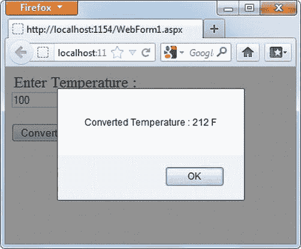

***图 2-10。**转换温度的 Web 表单应用运行示例*

#### 使用 jQuery $。MVC 应用中的 ajax()方法

使用 MVC 应用并从 jQuery 调用服务器端代码非常简单。您不需要创建一个单独的服务(当然，如果您愿意，您可以这样做)。相反，您可以将代码封装在控制器动作方法中。例如，清单 2-17 显示了封装温度转换逻辑的`Convert()`动作方法。

***清单 2-17。**`Convert()`MVC 控制器中的动作方法*

`public JsonResult Convert(TemperatureData t)
{
    if (t.Unit == "C")
    {
        t.Value = (t.Value * 1.8m) + 32;
        t.Unit = "F";
    }
    else
    {
        t.Value = (t.Value - 32) / 1.8m;
        t.Unit = "C";
    }
    return Json(t);
}`

如您所见，`Convert()`动作方法接受一个类型为`TemperatureData`的参数，并返回一个`JsonResult`。`JsonResult`类以 JSON 格式包装返回值。注意如何使用 ASP.NET MVC 的`Json()`方法返回`JsonResult`对象；该方法接受要返回的数据，并将其转换为 JSON 格式。

您可以通过编写如清单 2-18 所示的 jQuery 代码从客户端调用`Convert()` action 方法。

***清单 2-18。**通过`$.ajax()` `()`* 调用控制器动作方法

`$(document).ready(function () {
  $("#Button1").click(function () {
    url = "/Home/Convert";
    data = '{ Value: "' + $("#Text1").val() + '", Unit: "' + $("#Select1").val() + '" }';
    $.ajax({
      type: "POST",
      url: url,
      data:data,
      contentType: "application/json; charset=utf-8",
      dataType: "json",
      success: OnSuccess,
      error: OnError
    })
  });
});

function OnSuccess(results) {
  alert("Converted Temperature : " + results.Value + " " + results.Unit);
}`  `function OnError(err) {
  alert(err.status + " - " + err.statusText);
}`

这段代码类似于清单 2-16 ，有一点小小的不同:发送`POST`请求的 URL 的形式是`<controller_name>/<action_method_name>`。如果您运行 MVC 应用，您应该得到与 Web 窗体应用相同的结果。

### 总结

HTML5 特性可以用普通的 JavaScript 编程，但是使用 jQuery 这样的库可以提供更丰富的功能和易用性。jQuery 是一个流行的 JavaScript 库，让您的客户端脚本编写变得轻而易举。使用 jQuery 选择器，您可以根据复杂的条件选择 HTML DOM 元素。您还可以动态操作 HTML DOM。当您需要在客户机和服务器之间传递数据时，jQuery 可以帮上忙。jQuery Ajax 技术允许您向服务器发出请求，而无需提交整个页面。

本章概述了 jQuery 的核心特性，比如事件处理、选择器、DOM 操作和 Ajax 技术。您将在本书的剩余部分使用这些特性(以及更多特性)。掌握了这些技能，下一章是时候探索 HTML5 音频和视频 API 了。*