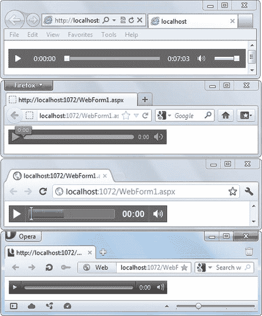
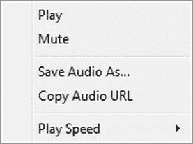
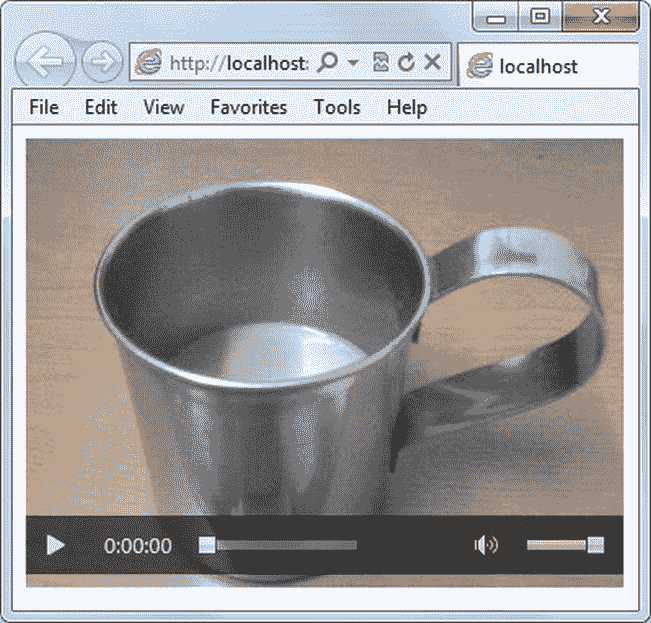
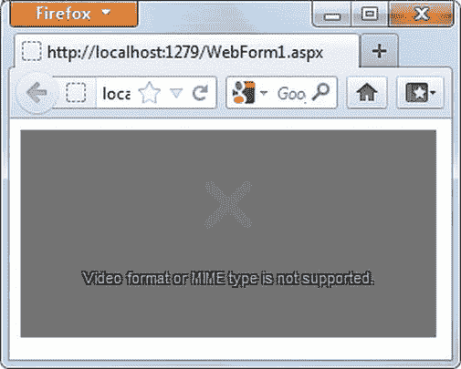
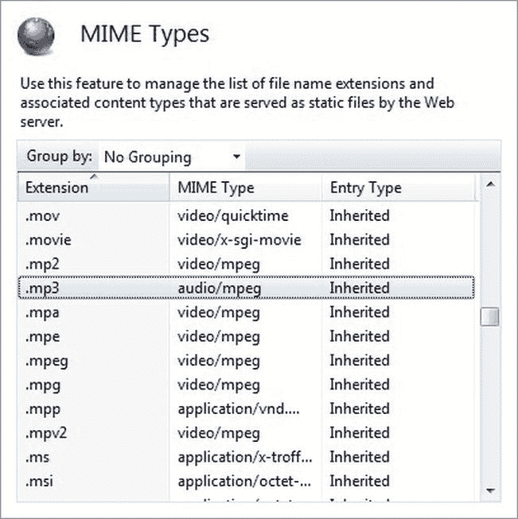
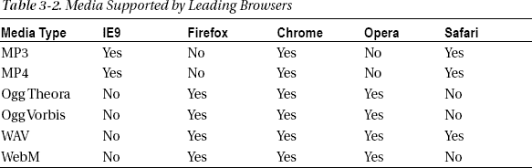
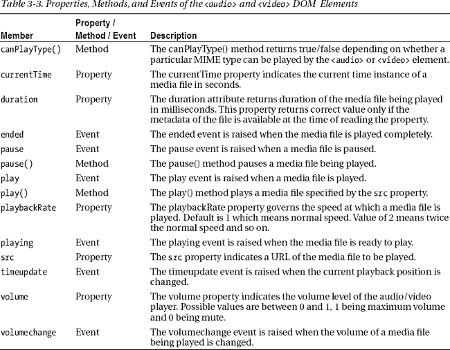
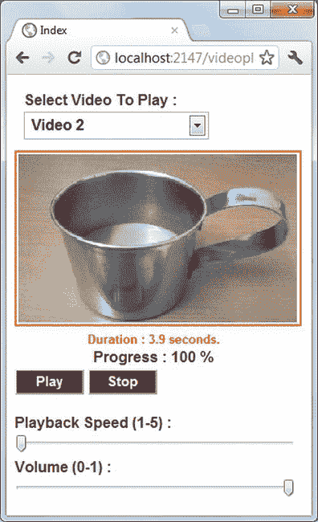
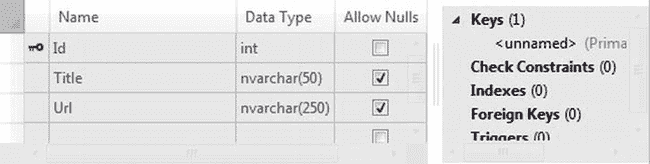
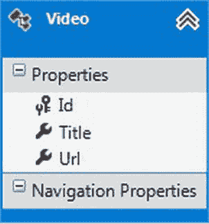

# 三、处理音频和视频

十多年前建立的网站主要是静态 HTML 页面的集合。然后是 JavaScript，网页变得更加互动和生动。然而，富媒体网站仍处于起步阶段。这些年来，情况在很大程度上发生了变化。支持音频和视频的网站并不少见。像 YouTube 这样的视频分享网站已经变得非常流行。除了这种媒体疯狂，社交网站如脸书和 Google+让你只需点击鼠标就能分享视频。底线是富媒体网站在未来几年将变得越来越普遍。

对于 HTML5 之前的 web 应用，开发人员需要依赖第三方插件来显示音频和视频文件。这是因为 HTML 4.01 没有播放媒体文件的原生支持。*原生支持*意味着 HTML 标记和浏览器可以显示媒体文件，而不需要任何外部插件或应用。HTML5 将改变这一局面:它为播放音频和视频文件提供了原生支持。不仅如此，它还公开了音频和视频 API，允许您控制媒体文件在浏览器中的播放方式。本章涵盖了使用 HTML5 的音频和视频功能所需的所有知识。具体来说，您将了解以下内容:

> *   Use `<audio>` element
> *   Use `<video>` element
> *   Media formats supported by mainstream browsers
> *   HTML5 is not supported in the browser.
> *   Create a custom video player using audio and video APIs and jQuery

### 使用<对象>标签嵌入媒体文件

在讨论特定于 HTML5 的播放音频和视频文件的方式之前，让我们先来看一下目前普遍使用的技术。尽管 HTML5 为在网页中嵌入音频和视频文件提供了本机支持，但并非所有浏览器都支持 HTML5。为了确保您的网页在这样的浏览器中正常工作，您可以使用本节中讨论的技术作为后备机制。

HTML `<object>`标签是一个通用标签，允许你在网页中嵌入对象:媒体文件，ActiveX 控件，Java 小程序，甚至 PDF 文件。然而，它更常用于显示音频和视频文件。`<object>`标签需要第三方插件来加载和播放媒体文件；您可以使用基于 Adobe Flash、Apple QuickTime 和 Microsoft Silverlight 的插件。如果目标机器没有安装所需的插件，媒体文件将拒绝播放。

下面几节说明如何使用`<object>`标签来播放音频和视频文件。

#### 嵌入音频文件

要将一个音频文件嵌入到网页中，你可以使用一个`<object>`标签，如清单 3-1 所示。

***清单 3-1。**使用`<object>`标签播放音频文件*

`<body>
<h2>Play Audio File</h2>
<object data="Media/Song.mp3" />
</body>`

`<object>`标签的`data`属性指向一个驻留在`Media`文件夹中的 MP3 音频文件。

#### 嵌入 Flash 视频文件

Adobe Flash 是在网页中嵌入视频文件的最流行的方式之一。由于它的流行，所有主流浏览器都支持 Flash 插件。您可以使用`<object>`标签在网页中嵌入 Flash 视频；清单 3-2 展示了如何操作。

***清单 3-2。**使用`<object>`标签*嵌入 Flash 视频

`<object id="flash1" data="Media/Video1.swf" type="application/x-shockwave-flash"
height="200" width="200">
  <param name="movie" value="Media/Video1.swf">
</object>`

这次的`<object>`标签播放的是 Flash 视频文件`Video1.swf`。`type`属性指定 Flash 视频的 MIME 类型(`application/x-shockwave-flash`)。

#### 嵌入 Silverlight 视频文件

微软在网页中显示媒体文件的解决方案是 Silverlight。Silverlight 被视为 Flash 的竞争对手，但因为它是一项相对较新的发明，所以在受欢迎程度和广泛使用方面落后于 Flash。然而，Silverlight 是一个灵活而强大的平台，可以使用。NET 工具，如 Visual Studio 和 Visual C#。您还可以使用 Expression Web 将现有媒体文件编码为特定于 Silverlight 的格式。清单 3-3 展示了如何使用 Silverlight 嵌入和播放视频。

***清单 3-3。**嵌入 Silverlight 媒体文件*

`<object data="data:application/x-silverlight-2"
type="application/x-silverlight-2" width="300" height="300">
  <param name="source" value="silverlightvideos/CleanTemplate.xap"/>
  <param name="background" value="white" />
  <param name="minRuntimeVersion" value="4.0.50401.0" />
  <param name="autoUpgrade" value="true" />
  <param name="enableHtmlAccess" value="true" />
  <param name="enableGPUAcceleration" value="true" />
  <param name="initparams" value='playerSettings =` `  <Playlist>
    <DisplayTimeCode>false</DisplayTimeCode>
    <EnableCachedComposition>true</EnableCachedComposition>
    <EnableCaptions>true</EnableCaptions>
    <EnableOffline>true</EnableOffline>
    <EnablePopOut>true</EnablePopOut>
    <StartMuted>false</StartMuted>
    <StartWithPlaylistShowing>false</StartWithPlaylistShowing>
    <StretchNonSquarePixels>NoStretch</StretchNonSquarePixels>
    <Items>
      <PlaylistItem>
        <AudioCodec>WmaProfessional</AudioCodec>
        <Description></Description>
        <FileSize>1349539</FileSize>
        <FrameRate>25</FrameRate>
        <Height>360</Height>
        <IsAdaptiveStreaming>false</IsAdaptiveStreaming>
        <MediaSource>silverlightvideos/Video2.wmv</MediaSource>
        <ThumbSource></ThumbSource>
        <VideoCodec>VC1</VideoCodec>
        <Width>640</Width>
      </PlaylistItem>
    </Items>
</Playlist>'/>

</object>`

注意`<object>`标签现在是如何包含许多信息的。`<param>`和`<Playlist>`元素提供了大量的数据，比如 Silverlight 压缩输出文件的路径(`.xap`)和正在播放的视频的配置。

### HTML5 音频和视频标签

在前面的章节中，您学习了 HTML5 之前的 web 应用如何使用`<object>`标签播放音频和视频文件。现在让我们把目光转向 HTML5，看看 HTML5 是如何原生支持音频和视频播放的。

HTML5 音频和视频支持分别以`<audio>`和`<video>`标记元素的形式出现。每个标签都有一组属性，可以用来配置文件的播放方式。此外，这些元素公开了可以使用 JavaScript 或 jQuery 编程的属性、方法和事件。以下部分详细讨论了`<audio>`和`<video>`元素。

#### 播放音频

HTML5 `<audio>`标签允许你在网页中嵌入和播放音频文件。在其基本形式中，`<audio>`标签看起来像清单 3-4 。

***清单 3-4。**简单使用`<audio>`标签*

`<body>
**  <audio src="Audio1.mp3" controls="controls"></audio>**
</body>`

`src`属性指向一个音频文件(`Audio1.mp3`),`controls`属性表示应该显示播放、暂停、音量等音频回放控件。图 3-1 显示了一个`<audio>`标签是如何在 IE9、Firefox、Chrome 和 Opera 中呈现的。

 **注意**并非所有的浏览器都支持所有的音频和视频格式。在本章的后面，你将学习如何在不同的浏览器中处理不同级别的支持。

***图 3-1。不同浏览器中的** `<audio>`元素*

***图 3-2。**IE9 中音频播放器的快捷菜单*

如果你右击音频播放器，所有的浏览器都会显示快捷菜单(见图 3-2 )。您可以使用快捷菜单来控制音频回放。

`<audio>`标签还提供了一些有用的属性，让您可以微调音频文件的播放方式。默认情况下，当您使用`<audio>`运行页面时，音频文件不会播放，直到您点击播放按钮。如果您希望自动播放文件，您可以添加`autoplay`属性，如下所示:

`<audio src="Audio1.mp3" controls="controls" autoplay="autoplay"></audio>`

当用户阅读网页内容时，`autoplay`属性可以方便地播放背景声音。

默认情况下，音频文件完成后不会重播。要反复播放同一个文件，可以设置`loop`属性:

`<audio src="Audio1.mp3" controls="controls" loop="loop"></audio>`

当用户倾向于长时间停留在一个页面上，并且您希望不间断地播放背景音频时,`loop`属性非常有用。

还有一个`preload`属性控制浏览器如何加载音频文件。这个属性有三个可能的值:`auto`、`metadata`和`none`。`auto`值表示网页在浏览器中加载后，整个音频文件应该立即加载。`metadata`表示仅应加载元数据信息，如音频文件的长度。最后，`none`表示该文件根本不应该被加载。在这种情况下，文件只有在浏览器中播放时才会被载入。`preload`属性的默认值因浏览器而异。如果省略了`preload`属性，结果会因浏览器而异。以下标记显示了如何使用`preload`属性:

`<audio src="Audio1.mp3" controls="controls" preload="auto" ></audio>`

使用`preload`属性，您可以控制在客户端下载多少媒体数据。例如，如果你在一个页面上显示一长串音频文件，将`preload`设置为`auto`可能会下载太多数据。在这种情况下，将`preload`设置为`metadata`会更有效。注意，如果`autoplay`属性存在，则`preload`被忽略。

#### 播放视频

HTML5 `<video>`元素让你播放视频文件。它支持与`<audio>`标签相同的属性集，并提供更多的属性。这里显示了`<video>`的基本用法:

`<video src="Video1.mp4" controls="controls"></video>`

`src`属性指向一个视频文件，而`controls`属性显示回放控制。图 3-3 显示了一个正在 IE9 中播放的视频文件。

***图 3-3。**IE9 中的`<video>`元素*

除了`autoplay`、`loop`和`preload`属性，您还可以将`muted`和`poster`属性用于`<video>`元素。`muted`属性表示正在播放的视频文件的音频输出是否应该静音。当您希望用户观看没有背景声音的视频时，可以使用此属性，如下所示:

`<video src="Video1.mp4" controls="controls" muted="muted"></video>`

`poster`属性指向一个图像文件，该文件在下载视频时显示，或者在用户点击播放按钮之前显示。您可以使用`poster`显示视频的附加信息。这里有一个例子:

`<video src="Video1.mp4" controls="controls" poster="poster.jpg" preload="none"></video>`

图 3-4 显示了动作中的`poster`属性。

***图 3-4。**使用`poster`属性*

除了到目前为止讨论的属性，你可以使用`height`和`width`属性来控制视频播放器的尺寸。

 **注意** HTML5 `<audio>`和`<video>`元素并没有对最终用户隐藏媒体文件的位置。就像图像一样，您可以通过查看网页的 HTML 源文件并获取文件 URL，或者右键单击视频播放器并选择另存为菜单选项，轻松保存正在播放的媒体文件。

### 支持的音频和视频格式

在前面的章节中，您使用了`<audio>`和`<video>`标签来显示音频和视频文件。这些标签使用起来很简单，但是作为一个网页开发者，你需要注意一个灰色区域:音频和视频*格式*。尽管 HTML5 提供了对音频和视频播放的本地支持，但这种支持并不是在所有浏览器上都是一致的。不同的浏览器对可以播放的音频和视频文件格式不一致。比如 IE9 和 Chrome 播放 MP4 文件就可以了；但是如果你试图在 Firefox 中播放它们，你会得到错误“不支持视频格式或 MIME 类型”(见图 3-5 )。

***图 3-5。**火狐无法播放 MP4 文件。*

 **注意**你可能想知道为什么不是所有的浏览器都支持所有流行的媒体格式。缺乏支持有各种原因，包括许可问题、专利问题、开放标准等等。对这些问题的详细讨论超出了本书的范围。

在研究浏览器及其支持的格式之前，有必要看一下 Web 上一些广泛使用的媒体格式，因为所有主流浏览器都支持其中一种或多种格式。表 3-1 列出了主流浏览器支持的文件格式。

注意表 3-1 中的 MIME 类型列。您必须确保您的 web 服务器具有文件扩展名和 MIME 类型的正确映射。如果这种映射不存在，web 服务器可能不会提供媒体文件，因此网页可能不会播放音频/视频。例如，在使用 Visual Studio 附带的开发 web 服务器时，您可能需要将清单 3-5 中所示的标记添加到`web.config`文件中，以便表 3-1 中提到的所有文件扩展名都能按预期工作。

***清单 3-5。**在`web.config`* 中添加 MIME)类型映射

`<system.webServer>
  <staticContent>
      <mimeMap fileExtension=".mp4" mimeType="video/mp4" />
      <mimeMap fileExtension=".ogg" mimeType="audio/ogg" />
      <mimeMap fileExtension=".oga" mimeType="audio/ogg" />
      <mimeMap fileExtension=".ogv" mimeType="video/ogg" />
      <mimeMap fileExtension=".webm" mimeType="video/webm" />
  </staticContent>
</system.webServer>`

正如你所看到的，`<system.webServer>`的`<staticContent>`子部分包含了几个`<mimeMap>`元素。每个`<mimeMap>`元素映射一个文件扩展名和它的 MIME 类型。

如果您使用的是 Internet 信息服务(IIS)的独立安装，而不是 Visual Studio 开发 web 服务器，也可以在 IIS 管理器中配置 MIME 类型。图 3-6 显示了 Windows 7 中相关的 IIS 管理器对话框。

***图 3-6。**IIS 中的 MIME 映射*

 **注**多用途互联网邮件扩展(MIME)是非文本电子邮件附件的格式规范。尽管它最初是为电子邮件系统而设计的，但现在它被广泛用于 web 上来表示 Web 资源的内容类型。

现在您对各种媒体格式有了一些了解，让我们看看不同的浏览器是如何支持它们的。表 3-2 显示了来自表 3-1 的主流浏览器对媒体类型的支持。

 **注意**最好在这些浏览器的最新版本中测试一下表 3-2 中提到的媒体支持。该规范正在发展，所有的浏览器公司都在积极努力改进和标准化它们对媒体格式的支持。

### 实现回退机制

通过上一节的讨论，您可能已经意识到，在构建 Internet web 应用时，依靠浏览器来支持特定 MIME 类型的媒体文件是不现实的。另外，当你的目标浏览器未知时，你不能保证它支持 HTML5 `<audio>`和`<video>`标签。如果目标浏览器不支持 HTML5 音频和视频播放，某种形式的回退机制是必要的，以便为用户提供替代方案。

您需要为两种情况提供回退方案:

> *   The target browser supports HTML 5 `<audio>` and `<video>` tags, but does not support specific MIME types.
> *   The target browser does not support HTML 5 `<audio>` and `<video>` tags.

要处理这些情况，您可以分别使用以下回退机制:

> *   Create media files with multiple file formats (MIME types).
> *   Use flash or Silverlight as an alternate playback mode.

以下部分详细介绍了如何实现这些技术。

#### 支持多种媒体格式

`<audio>`和`<video>`元素允许您指定多个媒体源。到目前为止，您已经使用这些标签的`src`属性来指定一个媒体文件，但是`<audio>`和`<video>`也可以使用嵌套的`<source>`元素来指定多个源文件。在运行时，根据支持的媒体类型，浏览器会选择适当的文件版本。清单 3-6 显示了一个`<video>`元素，它列出了三个来源。

***清单 3-6。**使用`<source>`元素*

`<video controls>
  <source src="media/video1.mp4" type="video/mp4" />
  <source src="media/video1.ogv" type="video/ogg" />
  <source src="media/video1.webm" type="video/webm" />
</video`

如清单 3-6 所示，每个`<source>`元素设置`src`和`type`属性。`src`属性指向一个视频文件，`type`属性表示文件的 MIME 类型。

使用`<source>`的缺点是您需要为每个音频或视频文件维护多种文件格式。这可能需要额外的媒体转换软件，从而增加项目的总成本。

 **注意**当你播放一个包含多个`<source>`元素的音频或视频文件时，浏览器使用的是哪种文件格式并不明显。一种快速简单的方法是在浏览器中右键单击`<audio>`或`<video>`元素，并从快捷菜单中选择另存为。另存为对话框显示正在播放的`<source>`元素的源文件名。

#### Flash 或 Silverlight 回退

如果您确定目标浏览器支持 HTML5，那么使用`<source>`元素的回退机制会工作得很好。然而，目标浏览器可能不理解 HTML5 `<audio>`和`<video>`元素。在这种情况下，您可以使用基于 Flash 或 Silverlight 的后备系统。清单 3-7 展示了一个使用 Flash 的例子。

***清单 3-7。**使用基于闪存的回退系统*

`<video controls>
  <source src="media/video1.mp4" type="video/mp4" />
  <source src="media/video1.ogv" type="video/ogg" />
  <source src="media/video1.webm" type="video/webm" />
  <object id="flash1" data="Media/Video1.swf" type="application/x-shockwave-flash">
    <param name="movie" value="Media/Video1.swf">
  </object>
</video>`

现在，`<video>`元素中嵌套了一个`<object>`标签。这样，如果浏览器不理解`<video>`标签，它会跳到`<object>`标签并播放 Flash 视频文件。

如果您决定提供 Silverlight 回退，您需要使用`<object>`标签嵌入 Silverlight 媒体。清单 3-8 展示了如何做到这一点。

***清单 3-8。**使用基于 Sliverlight 的后备系统*

`<video controls>
  <source src="media/video1.mp4" type="video/mp4" />
  <source src="media/video1.ogv" type="video/ogg" />
  <source src="media/video1.webm" type="video/webm" />
  <object data="data:application/x-silverlight-2"
type="application/x-silverlight-2" width="300" height="300">
    <param name="source" value="silverlightvideos/CleanTemplate.xap"/>
    ...
  </object>
</video>`

在清单 3-8 中，Silverlight 媒体是使用`<video>`元素中的`<object>`标签嵌入的。如果浏览器遇到`<video>`标签但不支持它，浏览器会跳到`<object>`标签并播放 Silverlight 视频。

如果您不想提供 Flash、Silverlight 或其他后备，那么您可以简单地包含一些 HTML 标记来通知最终用户哪里出错了，而不是一个`<object>`标记。

 **注意**为了测试 Flash 或 Silverlight 回退方案，你需要一个不支持 HTML5 `<audio>`和`<video>`元素的浏览器版本。

### 用音频和视频 API 编程

到目前为止，您一直使用静态的`<audio>`和`<video>`元素来播放音频和视频文件。HTML5 还提供了一种使用 JavaScript 播放和控制媒体文件的编程方式。为了让您对可以配置的内容有所了解，表 3-3 列出了您可以使用的`<audio>`和`<video>` DOM 元素的属性、方法和事件。注意表 3-3 只列出了`<audio>`和`<video>`的常用成员。

 **注意**您可以在`[www.w3schools.com](http://www.w3schools.com)`浏览`<audio>`和`<video>`元素的所有可用成员。该网站还为其他 HTML5 标记、属性、方法和事件提供了很好的参考。

 **注意**在尝试播放媒体文件之前，检查浏览器是否支持`<audio>`和`<video>`标签总是一个好习惯。正如在第一章中所讨论的，你可以使用 Modernizr 库来实现这个目的。示例检查如下所示:

`$(document).ready(function () {
  if (!Modernizr.audio) {
    alert("This browser doesn't support HTML5 audio!");
  }
  if (!Modernizr.video) {
    alert("This browser doesn't support HTML5 video!");
  }
});`

### 使用视频 API 创建自定义视频播放器

要查看`<video>`元素的属性、方法和事件，让我们在 ASP.NET MVC 应用中构建一个定制的视频播放器。视频播放器如图 3-7 中的所示。

***图 3-7。**一个定制的视频播放器*

图 3-7 所示的自定义视频播放器提供了一个可以播放的视频文件的下拉列表。该列表驻留在 SQL Server 数据库中，并使用 jQuery `$.ajax()`方法获取。您可以使用播放和停止按钮来播放、暂停或停止视频。(单个按钮用于播放和暂停视频。)播放速度和音量可以使用相应的范围输入控件进行设置。一旦视频开始播放，总进度百分比(%)将与视频的总时长一起显示。播放器还包括一个海报，告诉用户从下拉列表中选择一个视频文件。

#### HTML5 标记

定制视频播放器的 HTML5 标记驻留在 MVC 视图(`Index.aspx`)中，如清单 3-9 中的所示。为了清楚起见，清单 3-9 只显示了视频播放器所需的标记，而不是完整的视图。

***清单 3-9。**自定义视频播放器的 HTML 标记*

`

  Select Video To Play :  
  <select id="ddlPlayList" class="DropDownList">
  </select>

  <video id="videoPlayer" controls class="Video" poster="/content/media/poster.jpg" ></video>

   
  Progress :
  

  <input type="button" id="btnPlayPause" value="Play" class="Button" />
  <input type="button" id="btnStop" value="Stop"  class="Button"/>

 

  Playback Speed (1-5) :
  <input type="range" id="rngPlaybackRate" value="1" step="1" min="1" max="5" class="Range"/>

  Volume (0-1) :
  <input type="range" id="rngVolume" value="1" step="0.1" min="0" max="1" class="Range"/>

`

这个 HTML5 标记由六个`
`元素组成。第一个`
`包含一个`<select>`元素，显示可以播放的视频列表。

第二个`
`元素包含一个 HTML5 `<video>`标签。`<video>`元素的`id`属性被设置为`videoPlayer`，其`poster`属性指向`poster.jpg`文件。当没有文件在`videoPlayer`中播放时，最初会显示由`poster`属性指示的图像。注意，`<video>`标签的`src`属性没有被设置，因为实际的视频 URL 是从下拉列表中选择的。即使标记设置了`controls`属性，如果您愿意，也可以跳过它，因为您以编程方式控制播放和暂停操作。

第三个`
`元素显示了视频的总时长和一个进度指示器，该指示器指定了视频已播放的百分比。

第四个`
`元素包含两个按钮:播放/暂停和停止。`btnPlayPause`在播放和暂停模式之间切换。

第五个和第六个`
`元素显示视频播放速率和音量的范围选择器。注意，代表范围选择器的两个`<input>`元素的`type`属性都被设置为`range`。(你将在第五章的中了解到 HTML5 中几种新的`<input>`类型。)这些范围选择器的`min`和`max`属性表示可以选择的最小值和最大值。`step`属性表示范围可以增加或减少的步长。

由`Index.aspx`视图使用的 CSS 类驻留在应用的`Site.css`文件中。为了减少混乱，这里没有显示 CSS 类。

#### SQL Server 数据库和实体框架数据模型

该应用将可以播放的视频列表存储在 SQL Server Express 数据库中(`VideoDb.mdf`)。`VideoDb`由一个单独的表(`Videos`)组成，存储视频文件的标题和 URL。图 3-8 显示了服务器资源管理器中`Videos`表的模式。

***图 3-8。**表`Videos`的模式*

要在代码级别表示`Videos`表并从该表中获取数据，您需要使用一个实体框架数据模型。数据模型驻留在`Models`文件夹中，看起来像图 3-9 。

***图 3-9。**实体框架`Videos`表*的数据模型类

`Video`数据模型类有三个属性——`Id`、`Title`和`Url`——对应于`Videos`表中的相应列。

#### 获取视频播放列表

要在下拉列表中显示视频列表，您需要使用 jQuery 的`$.ajax()`方法从`Videos`表中获取数据。控制器类(`VideoPlayerController`)包含一个动作方法——`GetPlayList()`——返回一个`Video`对象列表。`GetPlayList()`方法和调用它的相关 jQuery 代码分别显示在清单 3-10 和清单 3-11 中。

***清单 3-10。** `GetPlayList()`动作方法*

`public JsonResult GetPlayList()
{
    VideoDbEntities db=new VideoDbEntities();
    var data = from items in db.Videos
                select items;
    return Json(data.ToArray());
}`

***清单 3-11。**使用`$.ajax`* 调用`GetPlayList()`方法

`$.ajax({
    type: "POST",
    url: '/VideoPlayer/GetPlayList',
    dataType: 'json',
    contentType: "application/json; charset=utf-8",
    success: OnSuccess,
    error: OnError
  });

function OnSuccess(playListItems) {
  for (var i = 0; i < playListItems.length; i++) {
    $("#ddlPlayList").append("<option value='" + playListItems[i].Url + "'>" +
      playListItems[i].Title +
      "</option>");
  }
}

function OnError(err) {
  alert(err.status + " - " + err.statusText);
}`

注意，`GetPlayList()`方法从`Videos`表中选择所有记录，并返回一个由`Video`对象组成的数组作为`JsonResult`。jQuery `$.ajax()`方法然后向`GetPlayList()`动作发出一个`POST`请求。成功函数`OnSuccess()`接收一个由`Video`对象组成的 JSON 数组。然后,`OnSuccess()`函数遍历这个 JSON 数组，每次迭代都使用`append()`方法将一个`<option>`元素添加到下拉列表中。视频文件的 URL 被分配给`<option>`元素的`value`属性，其标题显示在下拉列表中。

`OnError()`函数显示调用`GetPlayList()`方法时遇到的任何错误的信息。

#### 播放、暂停和停止视频

您需要处理各种客户端事件，以使视频播放器正常工作。这些事件分为两类:

> *   Events and other support elements such as play/pause and stop buttons, volume control, and drop-down list of `<video>` element.
> *   event

第一类事件可以使用您在第二章中学到的 jQuery 事件处理语法来处理。清单 3-12 显示了这一类别中的各种事件处理程序。

***清单 3-12。**处理支持元素事件*

`videoPlayer = $("#videoPlayer").get(0);

$("#ddlPlayList").change(function () {
  var extension = $(this).val();
  extension=extension.substr(extension.lastIndexOf('.') + 1)
  var mime = "";
  switch (extension) {
    case 'mp4':
      mime = "video/mp4";
      break;                        
    case 'ogv':
      mime = "video/ogg";
      break;
    case 'webm':
      mime = "video/webm";
      break;
  }
  if (videoPlayer.canPlayType(mime)) {
    $("#btnPlayPause").val("Play");
    videoPlayer.src = $(this).val();
    $("#btnPlayPause").click();
  }
  else {
    alert("Cannot play this video format!");
  }
});

$("#btnPlayPause").click(function () {
  if ($(this).val() == "Play") {
    videoPlayer.playbackRate = $("#rngPlaybackRate").val();
    videoPlayer.play();
  }
  else {
    videoPlayer.pause();
  }
});`  `$("#btnStop").click(function () {
  videoPlayer.pause();
  videoPlayer.currentTime = 0;
});

$("#rngVolume").change(function () {
  videoPlayer.volume = $(this).val();
});`

清单 3-12 中的代码在全局变量`videoPlayer`中存储了对`<video>` DOM 元素的引用。注意`get()`方法的使用，它在指定的索引处返回一个 DOM 元素。任何 jQuery 选择器都返回零个或多个匹配选择标准的元素的集合。您可以通过指定从零开始的索引，使用`get()`从集合中检索元素。在这种情况下，使用 ID 选择了`<video>`元素。自然，集合只有一个元素，因此`index`被指定为`0`。

当下拉列表中的选择改变时，下拉列表的`change`事件处理程序负责播放视频。首先，它使用`canPlayType()`方法检查`<video>`元素是否可以播放选定的视频文件。`canPlayType()`方法接受媒体文件的 MIME 类型，如果该媒体类型可以播放，则返回`true`。如果`<video>`元素能够播放所选的视频文件，那么它的`src`属性被设置为所选视频文件的 URL，并且播放/暂停按钮的`click`事件以编程方式被触发。

播放/暂停按钮的`click`事件处理程序检查它自己的值。在处理程序内部，关键字`this`指的是被点击的 DOM 元素(即播放/暂停按钮),`val()`方法返回按钮的当前值。如果值为`Play`，则`playbackRate`属性被设置为在速度范围选择器中选择的值，并调用`<video>`元素的`play()`方法。这样，视频以选定的回放速度播放。如果值为`Pause`，则调用`<video>`元素的`pause()`方法，以便暂停视频播放。

停止按钮的`click`事件处理程序将`currentTime`属性设置为`0`以指示媒体文件的开始，并调用`pause()`方法。

音量范围选择器的`change`事件处理程序通过设置`<video>`元素的`volume`属性来改变视频播放的音量。

#### 显示持续时间和进度

要显示所选视频文件的总长度及其播放进度，需要处理`<video>`元素的`timeupdate`和`loadmetadata`事件。这些事件需要与以前有所不同。像`click`和`change`这样的事件是标准的 HTML DOM 事件，并且原生包含在 jQuery 库中。然而，视频事件并非如此。因为`<video>`元素是 HTML5 中的新增元素，所以 jQuery 库没有对其事件的本地支持。因此，您需要连接事件处理程序，如清单 3-13 所示。

***清单 3-13。**使用 jQuery `bind()`方法*连接事件

`$(videoPlayer).bind("loadedmetadata", OnLoadedMetadata);
$(videoPlayer).bind("timeupdate", OnTimeUpdate);
$(videoPlayer).bind("play", OnPlay);
$(videoPlayer).bind("pause", OnPause);`

如您所见，jQuery 的`bind()`方法本质上是将事件与其处理程序绑定在一起。`bind()`方法的第一个参数是要处理的事件，第二个参数是事件处理函数。你可以在这里使用匿名函数，但是为了清晰起见清单 3-13 使用独立的 JavaScript 函数。

 **注意**在撰写本文时，jQuery 还没有包含特定于 HTML5 的事件函数，比如`play`和`pause`。这就是为什么这个例子使用了`bind()`方法。关于使用`bind()`方法进行事件连接的详细信息，请参见第二章。

您可能想知道为什么清单 3-13 中的会处理`play`和`pause`事件。这样做是因为您还可以使用快捷菜单在视频播放器中播放和暂停视频。如果用户决定使用快捷菜单而不是播放/暂停按钮来播放或暂停视频，则播放/暂停按钮的功能会变得不同步。当使用任何一种方式(按钮或快捷菜单)播放或暂停视频时，都会引发`play`和`pause`事件。通过处理这些事件，可以确保播放/暂停按钮始终反映播放器的正确状态。

事件处理函数`OnLoadedMetadata`、`OnTimeUpdate`、`OnPlay`和`OnPause`如清单 3-14 所示。

***清单 3-14。**在`bind()`方法中使用的事件处理函数*

`function OnLoadedMetadata() {
  $("#spanDuration").html("Duration : " + videoPlayer.duration.toFixed(1) + " seconds.");
}

function OnTimeUpdate() {
  var percentage = Math.floor((videoPlayer.currentTime / videoPlayer.duration * 100));
  $("#spanProgress").html(percentage + " % ");
}

function OnPlay() {
  $("#btnPlayPause").val("Pause");
}

function OnPause() {
  $("#btnPlayPause").val("Play");
}`

加载正在播放的视频文件的元数据时，会引发`loadmetadata`事件。为了显示视频的持续时间，视频的元数据必须可用；因此，`loadmetadata`事件被用来在一个``元素中显示持续时间。`duration`属性返回以秒为单位的持续时间；为了正确显示，使用 JavaScript `toFixed()`方法将其转换为固定的十进制数。

每次视频的当前播放位置改变时，都会引发`timeupdate`事件。在`<video>`元素的`currentTime`和`duration`属性的帮助下，`OnTimeUpdate()`函数计算到目前为止视频播放的百分比。如此计算的进度显示在``元素中。

`OnPlay()`事件处理程序将播放/暂停按钮的文本设置为在视频开始播放时暂停。在同一行中，`OnPause()`事件处理程序设置播放/暂停按钮的文本在视频暂停时播放。

就这样！您的自定义视频播放器已准备就绪。您可以通过在`Videos`表中添加几个条目来测试播放器，然后通过从下拉列表中选择来运行这些文件。

### 总结

在 HTML5 之前，在网页中嵌入音频和视频文件需要第三方插件，如 Flash 和 Silverlight。开发人员使用`<object>`标签在网页中嵌入 Flash 或 Silverlight 媒体。HTML5 为分别使用`<audio>`和`<video>`元素播放音频和视频文件提供了原生支持。在撰写本文时，各种浏览器所支持的音频和视频格式还没有标准化，但是我们可以希望将来所有的浏览器都会同意一套通用的媒体格式。

因为不是所有的浏览器都支持 HTML5，所以您可能需要实现一个后备方案，这样如果浏览器不理解 HTML5 `<audio>`和`<video>`元素，Flash 或 Silverlight 播放器就会接管。使用与 jQuery 结合的`<audio>`和`<video>`标签，您可以开发数据库驱动的媒体目录或播放列表。

`<audio>`和`<video>`元素允许您播放现有的媒体文件。HTML5 `<canvas>`，下一章的主题，让你在浏览器中绘制形状、文本和图像，从而为构建图形丰富的网络应用提供了大量的可能性。