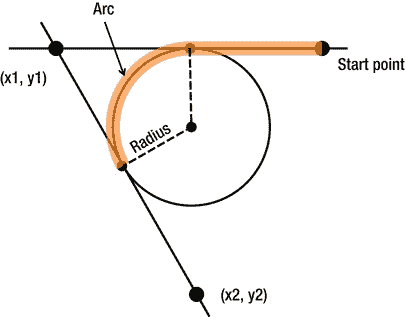

# 四、使用画布画画

Web 流行的原因之一是提供给最终用户的图形用户界面。从最终用户的角度来看，图像、动画、字体和其他交互式效果使网站更具吸引力。然而，网站开发人员在开发 HTML5 之前的 web 应用时可能会遇到的一个限制是使用客户端功能在浏览器中绘制图形。ASP.NET 开发人员一直使用`System.Drawing`名称空间在服务器上动态生成图形，然后将它们发送到客户端，但没有对在浏览器窗口中绘制图形的原生支持。

HTML5 通过提供*画布*在客户端图形渲染方面做得很好。顾名思义，画布是网页的一个矩形区域，您可以在画布 API 和 JavaScript/jQuery 的帮助下在其中执行绘制操作。在本章中，您将详细了解 HTML5 画布。具体来说，您需要查看以下内容:

> *   Draw lines, curves, paths, shapes and text on the canvas.
> *   Apply special effects such as shadow, gradient, pattern filling and transparency to drawing objects.
> *   Save the canvas state on the server for later use.

本章最后构建了一个包含您所学内容的示例应用。

### <画布>元素

如前所述，HTML5 画布是网页上的一个矩形空间，您可以在其中执行绘制操作。HTML5 画布由`<canvas>`标签表示。截至本文撰写之时，所有主流浏览器(如 Firefox、Chrome、Opera 和 Safari)的最新版本都支持`<canvas>`元素，尽管支持因所提供的画布特性而异。

您可以使用清单 4-1 中的标记在网页上放置画布。

***清单 4-1。**基本`<canvas>`元素*

`<head runat="server">
    
    
    
    
</head>
<body>
    <form id="form1" runat="server">
**      <canvas id="MyCanvas" height="200" width="200"></canvas>**
    </form>
</body>`

清单 4-1 中的标记使用一个`<canvas>`元素声明了一个 HTML5 画布。尽管它们是可选的，画布的宽度和高度也被设置来标记画布的尺寸。如果您没有为画布指定尺寸，浏览器会创建一个具有默认宽度和高度的画布。例如，如果没有指定尺寸，Firefox 和 Google 会创建一个宽 300 像素、高 150 像素的画布。`<head>`部分还包含使用 Modernizr 检查画布支持的 jQuery 代码。`<style>`部分为画布添加了一个边框，这样就可以在网页上看到它的边界。图 4-1 显示了画布的外观。

***图 4-1。**在浏览器中渲染的基本画布*

### 在画布上画画

为了在画布上绘制任何东西，您需要获得它的绘制上下文。一个*绘图上下文*是一个为在画布上绘制图形提供方法和属性的对象。对上下文属性的任何更改都将应用于后续的绘图操作。此外，您可以使用不同的上下文对象执行不同的绘图操作。

要在代码中获得对绘图上下文的引用，可以使用`<canvas>` DOM 元素的`getContext()`方法。清单 4-2 展示了如何操作。

***清单 4-2。**获取绘图上下文*

`$(document).ready(function () {
  var canvas = $("#MyCanvas").get(0);
  var context = canvas.getContext("2d");
});`

正如您在上一章中所做的，这里您使用 jQuery `get(0)`方法来获取对 id 为`MyCanvas`的`<canvas>`元素的引用。正如在第二章中提到的，jQuery 选择器返回匹配元素的集合。您可以使用`get()`方法，通过指定从零开始的索引，从集合中检索元素。在这种情况下，使用 ID 选择了`<canvas>`元素。自然，集合只有一个元素，因此`index`被指定为`0`。然后调用 canvas 对象的`getContext()`方法来检索它的绘图上下文。`getContext()`方法接受一个指示上下文类型的参数。值`2d`表示二维绘图内容(当前唯一可用的模式)。

一旦获得了绘图上下文对象，就可以在画布上绘图了。在画布上执行绘制操作时，您需要指定要绘制图形的坐标，因此您应该知道画布坐标系。指定画布坐标的单位是像素。画布的左上角有坐标(0，0)。图 4-2 举例说明画布坐标。

***图 4-2。** HTML5 画布坐标系*

该图显示了一个宽 300 像素、高 200 像素的画布。画布的原点在(0，0)。还示出了(150，100)处的另一点。

### 绘制线条

在画布上画一条线可能是你能执行的最简单的操作。要绘制一条线，您需要执行以下操作:

> *   Move the current drawing position to the desired starting point.
> *   Specify the coordinates of the end point of the straight line.
> *   Draw a line.

清单 4-3 显示了所有三种操作。

***清单 4-3。**划清界限*

`context.moveTo(10, 100);
context.lineTo(190, 100);
context.stroke();`

该代码假设`context`变量包含一个对绘图上下文的引用。要绘制起点坐标为(10，100)和终点坐标为(190，100)的直线，您可以使用绘图上下文`:` `moveTo()`、`lineTo()`和`stroke()`的三种方法。

`moveTo()`方法将当前绘图坐标移动到指定的 x 和 y 点(本例中为 10 和 100)。`lineTo()`方法指定线条的结束坐标(在本例中为 190，100)。在您调用了`lineTo()`方法之后，这条线并没有立即画出来。您通知绘图上下文，绘图操作将使用`stroke()`方法执行。来自清单 4-3 的代码产生了图 4-3 所示的行。

***图 4-3。**划清界限*

在这种情况下绘制的线采用默认宽度。但是，您可以更改正在绘制的线条的宽度，如下一节所述。

#### 改变线条宽度和宽度

在前面的示例中，您在绘制直线时使用了线宽和线帽的默认值。您可以使用`lineWidth`和`lineCap`属性更改这些默认值。

属性以像素为单位指定线条的宽度。设置`lineWidth`后绘制的所有线条在渲染时都采用新指定的宽度。

线条 *cap* 指的是如何绘制线条的末端。`lineCap`属性有三个可能的值:`butt`、`round`和`square`。默认是`butt`。图 4-4 显示了三种线尾的区别。

***图 4-4。**`butt`、`round`、`square`和*的区别

如图 4-4 中的所示，`butt`的一个`lineCap`值正好在`lineTo()`方法指定的终点坐标处结束。另一方面，`round`和`square`的`lineCap`值以等于线宽度的量扩展线，因为等于线宽度一半的附加像素被用于帽。例如，假设一条线的宽度为 10 个像素，起点(10，100)和终点(190，100)。包括起点和终点的线的长度是 180 像素。如果您指定`butt`的`lineCap`模式，则产生的线条长度正好为 180 像素。然而，使用`round`或`square`的`lineCap`模式，线的长度为 190 个像素(180 个像素+在一条线的开始处的额外 5 个像素+在结束处的额外 5 个像素)。

清单 4-4 显示了如何使用`lineWidth`和`lineCap`属性，图 4-5 显示了结果行。

***图 4-5。**不同的`lineCap`设置在动作中*

***清单 4-4。**设置`lineWidth`和`lineCap`属性*

`**context.lineWidth = 10;**

context.beginPath();
context.moveTo(20, 100);
context.lineTo(180, 100);
**context.lineCap = "butt";**
context.stroke();

context.beginPath();
context.moveTo(20, 120);
context.lineTo(180, 120);
**context.lineCap = "round";**
context.stroke();

context.beginPath();
context.moveTo(20, 140);
context.lineTo(180, 140);
**context.lineCap = "square";**
context.stroke();`

在这个清单中，使用`lineWidth`属性将要绘制的线条宽度设置为 10 像素。然后，代码通过将`lineCap`分别设置为`butt`、`round`和`square`来绘制三条线。

注意`beginPath()`方法的使用，它开始了一个新的绘图路径。(路径将在后面的章节中介绍。)在这里，可以说路径是一系列的绘制操作。如果你不调用`beginPath()`，所有的线都用你最后指定的`lineCap`重新绘制(在这个例子中是`square`)。

注意图 4-5 中的最后两行是如何将额外的像素添加到总长度中的，而第一行是根据起点和终点坐标精确绘制的。

### 绘制曲线

您可以在画布上绘制三种类型的曲线`:`弧线、二次曲线和贝塞尔曲线。这三种类型的曲线使用`arc()`、`arcTo()`、`quadraticCurveTo()`和`bezierCurveTo()`方法绘制。为了画圆和圆角矩形，画圆弧是必要的。你可以用`arc()`和`arcTo()`完成所有你需要的绘图，但是如果你需要更复杂的东西，你可以研究二次曲线和贝塞尔曲线。以下章节讨论`arc()`和`arcTo()`。

#### 弧度的快速介绍

使用圆弧时，您经常会遇到以弧度指定的角度。弧度是角度测量的标准单位，描述了圆弧的长度与其半径之比。一个弧度被定义为当一个圆的弧的长度等于该圆的半径时对着的角。因此，弧度等于(弧的长度/弧的半径)。

圆的周长由公式 2πr 给出，其中 r 是圆的半径。一整圈意味着 360°或 2πr/r—即 2π和 1 弧度=(180°/π)。要将弧度转换为度数，需要将弧度值乘以 180/π。同样，要将度数转换为弧度，需要将度数乘以π/180。

 **注**本讨论仅限于使用`arc()`和`arcTo()`方法所需的最低限度的理解。解释绘制这些曲线所涉及的数学处理超出了本书的范围。

#### 使用 Arc()方法绘制圆弧

要在画布上画一条弧线，可以使用绘图上下文的`arc()`方法。`arc()`的一般语法如下:

`context.arc(x, y, radius, start_angle, end_angle, direction)`

`arc()`方法的前两个参数表示圆弧中心的坐标。`radius`参数表示圆弧的半径。起始角度和结束角度分别是弧的起点和终点的弧度角度。最后,`direction`参数表示应该顺时针还是逆时针画圆弧。为了更好地理解这些参数，请看图 4-6。

***图 4-6。**`arc()`方法参数的图示*

清单 4-5 展示了一段使用`arc()`方法绘制弧线的代码片段。

***清单 4-5。**使用`arc()`方法*

`var canvas = $("#MyCanvas").get(0);
var context = canvas.getContext("2d");
var x = canvas.width / 2;
var y = canvas.height / 2;
var radius = 100;
var start_angle = 0.5 * Math.PI;
var end_angle = 1.75 * Math.PI;
context.arc(x, y, 75, start_angle, end_angle, false);
context.lineWidth = 20;
context.stroke();`

这段代码计算画布的中心，并使用这些坐标作为弧线的 x 和 y 坐标。注意开始和结束角度是如何使用`Math.PI`常量以弧度计算的。`direction`参数设置为`false`，表示应该顺时针方向画圆弧。图 4-7 显示了清单 4-5 中的代码如何在浏览器中呈现。

***图 4-7。**`arc()`方法在起作用*

还有一种不同的方法来画圆弧:使用`arcTo()`方法。该方法采用以下形式:

`context.arcTo(x1, y1, x2, y2, radius)`

在这个方法签名中，`x1`、`y1`、`x2`和`y2`是控制点，`radius`是圆弧的半径。确定控制点有点复杂；图 4-8 说明了。

***图 4-8。**在`arcTo()`方法中使用的坐标*

 **注意**不要太详细，*控制点*是附加在曲线上的特殊点，用来改变曲线的形状和角度。拉伸控制点会改变曲线的形状，而旋转控制点会改变曲线的角度。

在绘制圆角矩形时，`arcTo()`方法很方便。清单 4-6 展示了如何操作。

***清单 4-6。**使用`arcTo()`方法*

`var canvas = $("#MyCanvas").get(0);
var context = canvas.getContext("2d");
var x = 25;
var y = 50;
var width = 150;
var height = 100;
var radius = 20;
context.lineWidth = 10;
// top and top right corner
context.moveTo(x + radius, y);
context.arcTo(x + width, y, x + width, y + radius, radius);
// right side and bottom right corner
context.arcTo(x + width, y + height, x + width - radius, y + height, radius);
// bottom and bottom left corner
context.arcTo(x, y + height, x, y + height - radius, radius);
// left and top left corner
context.arcTo(x, y, x + radius, y, radius);
context.stroke();`

这段代码调用了`arcTo()`方法四次。第一个调用绘制矩形的上边缘和右上角。第二个调用绘制右边和右下角。第三个调用绘制底边和左下角。最后，第四个调用绘制左边缘和左上角。图 4-9 显示了圆角矩形在运行时的样子。

***图 4-9。**使用`arcTo()`方法*绘制圆角矩形

本节讨论的`arc()`和`arcTo()`方法对于绘制圆形、扇形和圆角矩形非常有用。

### 绘制路径

在前面的部分中，您学习了绘制直线和曲线。您可以结合直线和曲线来绘制路径或形状。简单地说，*路径*是一系列产生形状的绘图操作。路径可以是开放的，也可以是封闭的。封闭的路径也可以用某种颜色或图案填充。

要绘制路径，首先调用`beginPath()`方法，然后像以前一样绘制直线或曲线。要标记路径的结尾，您可以调用`stroke()`(绘制形状的轮廓)或`fill()`(绘制填充的形状)。

清单 4-7 使用`moveTo()`和`arc()`方法绘制一个笑脸。

***清单 4-7。**画一个笑脸*

`var canvas = $("#MyCanvas").get(0);
var context = canvas.getContext("2d");
context.beginPath();
//face
context.arc(100, 100, 80, 0, Math.PI * 2, false);
//smile
context.moveTo(160, 100);
context.arc(100, 100, 60, 0, Math.PI, false);
//left eye
context.moveTo(75, 70);
context.arc(65, 70, 10, 0, Math.PI * 2, true);
//right eye
context.moveTo(135, 70);
context.arc(125, 70, 10, 0, Math.PI * 2, true);
context.stroke();

context.lineWidth = 5;
context.stroke();`

总之，有四个对`arc()`方法的调用:它们分别绘制脸部、微笑、左眼和右眼的轮廓。为了实际绘制路径，代码调用了`stroke()`方法— `stroke()`绘制路径的轮廓。图 4-10 显示了浏览器中的笑脸。

您还可以绘制由某种颜色填充的闭合路径。例如，清单 4-8 绘制了一个填充蓝色的三角形。

***清单 4-8。**绘制填充形状*

`context.beginPath();
context.moveTo(50,20);
context.lineTo(50,100);
context.lineTo(150, 100);
context.closePath();
context.lineWidth = 10;
context.strokeStyle = 'red';
context.fillStyle = 'blue';
context.stroke();
context.fill();` 

***图 4-10。**画一个笑脸*

注意使用了两个至今没有使用的方法`:` `closePath()`和`fill()`。`closePath()`方法通过连接第一个绘图操作的起点和最后一个绘图操作的终点来闭合路径。因此，要画一个三角形，你只需要用`lineTo()`画两条线；调用`closePath()`绘制三角形的第三条边。到目前为止，你一直使用`stroke()`方法来绘制一个形状的轮廓。方法用一种颜色填充形状。当然，你可以用`stroke()`也可以用`fill()`搭配单一造型。`strokeStyle`和`fillStyle`属性可用于指定执行轮廓或填充操作时应使用的颜色。图 4-11 显示了运行清单 4-8 中的代码后，填充的三角形是如何呈现的。

***图 4-11。**画一个实心三角形*

***图 4-12。**画在画布上的矩形*

就像三角形一样，矩形也可以使用前面讨论的路径绘制技术来绘制。然而，画一个矩形是如此普遍需要的操作，以至于有现成的方法——`strokeRect()`和`fillRect()`——可以简化你的工作。这些方法接受矩形左上角的坐标及其宽度和高度。`strokeRect()`方法绘制矩形的轮廓，而`fillRect()`绘制填充的矩形。清单 4-9 展示了如何使用这些方法，图 4-12 展示了结果矩形。

***清单 4-9。**画一个长方形*

`var canvas = $("#MyCanvas").get(0);
var context = canvas.getContext("2d");
context.lineWidth = 5;
**context.fillRect(10,10,180,50);**
**context.strokeRect(10,80,180,50);**`

 **注意**还有一个方法——`rect()`——可以用来画矩形。但是，如果使用`rect()`，还需要调用`stroke()`或`fill()`来实际绘制矩形。`strokeRect()`和`fillRect()`方法同时执行这两个步骤。

### 绘图文本

到目前为止，您已经学会了在画布上绘制线条、曲线和形状。通常，您需要将文本作为绘图本身的一部分，并且迟早您会想要在画布上绘制文本。如您所料，绘图上下文为使用`strokeText()`和`fillText()`方法绘制文本提供了丰富的支持。此外，您可以指定用于绘制文本的字体、字体大小、对齐方式和基线。

清单 4-10 显示了如何在这些属性和方法的帮助下绘制文本。

***清单 4-10。**在画布上绘制文本*

`var canvas = $("#MyCanvas").get(0);
var context = canvas.getContext("2d");
var x = canvas.width / 2;
var y = canvas.height / 2;
context.font = "30px Arial";
context.textBaseline = "middle";
context.textAlign = "center";
context.lineWidth = 1;
context.strokeStyle = "red";
context.fillStyle = "blue";
context.strokeText("Hello Canvas!",x,y-50);
context.fillText("Hello Canvas!",x,y+50);`

这段代码使用`font`属性设置要绘制的文本的字体。请注意，为了正确绘制文本，字体大小和属性(如粗体和斜体)必须放在字体系列之前。

`textBaseLine`属性控制文本的基线。`textBaseLine`属性的一些常见值是`top`、`bottom`和`middle`。这些值影响文本相对于 y 坐标的垂直位置。例如，将`textBaseLine`属性设置为`middle`意味着文本的垂直中点对应于 y 坐标。属性控制画布上的文本对齐。`textAlign`的常用值有`left`、`right`和`center`。`textAlign`属性控制文本相对于文本的 x 位置的对齐。例如，如果 x 坐标设置为 100px，而`textAlign`设置为`center`，那么文本的中心将位于 100px。

您可以使用`strokeStyle`属性来指定文本轮廓颜色。方法用指定的`strokeStyle`在画布上绘制文本。

属性控制文本如何填充，方法用指定的 ?? 绘制文本。

图 4-13 显示了来自清单 4-10 的代码如何呈现指定的文本。

*图 4-13**。**行动中的`strokeText()`和`fillText()`方法*

 **注意**没有内置的方式将一长行文本换行为多行文本。您必须根据自己的需要编写自己的代码来分割文本。

### 绘制图像

在 HTML5 画布上绘图不限于直线、曲线、形状和文本。您也可以在画布上绘制现有的图像文件。当您希望整合比简单形状更复杂的图像时，这尤其有用。例如，考虑一下，如果您想在画布上显示公司徽标。从头开始重新创建徽标可能不是最佳选择。此外，徽标可能太复杂，无法使用可用的画布 API 来绘制。加载现有的徽标图像并将其呈现在画布上要容易得多。幸运的是，绘图上下文提供了`drawImage()`方法，它允许您在画布上绘制图像。

清单 4-11 显示了使用`drawImage()`的最简单形式。

***清单 4-11。**使用最简单的`drawImage()`方法*

`var canvas = $("#MyCanvas").get(0);
var context = canvas.getContext("2d");
var img = new Image();
$(img).load(function () {
  context.drawImage(img, 10, 20);
});
img.src = "img/html5.png";`

这段代码使用 JavaScript 代码动态创建一个图像。注意，jQuery 代码还为 image 对象的`load`事件连接了一个事件处理程序。当图像完全加载时，会引发`load`事件。除非图像被完全加载，否则不能在画布上绘制。因此，您调用了`load`事件处理程序中的`drawImage()`方法。`drawImage()`接受要绘制的图像对象以及要绘制图像的 x 和 y 坐标。然后，代码将图像的`src`属性设置为现有的图像文件(`img/html5.png`)。如果您运行清单 4-11 中的代码，您会看到画布上绘制的图像，如图 4-14 所示。

在画布上绘制图像时，有时您可能需要调整图像的大小。例如，原始图像尺寸可能大于画布尺寸，您可能希望根据画布尺寸来调整图像。为了实现这一点，您可以使用一个`drawImage()`方法的变体，它接受图像必须调整到的宽度和高度。清单 4-12 展示了这是如何做到的。

***清单 4-12。**绘制特定宽度和高度的图像*

`var canvas = $("#MyCanvas").get(0);
var context = canvas.getContext("2d");
var img = new Image();
$(img).load(function () {
  context.drawImage(img,0,0, canvas.width,canvas.height);
});
img.src = "img/html5.png";`

如您所见，除了 x 和 y 坐标，`drawImage()`方法还指定了图像的宽度和高度。在清单 4-12 中，图像的宽度和高度被设置为等于画布的宽度和高度。当然，如果没有保持宽度和高度的比例，调整后的图像可能会变形。

***图 4-14。** `drawImage()`法在行动*

在画布上绘制图像的另一种可能性是只绘制源图像的一部分，而不是整个图像。要完成这个图像裁剪，您可以使用另一种`drawImage()`方法，它获取图像切片的坐标和尺寸以及前面讨论过的其他参数。清单 4-13 说明了如何使用这个变体。

***清单 4-13。**只画图像的一部分*

`var canvas = $("#MyCanvas").get(0);
var context = canvas.getContext("2d");
var img = new Image();
$(img).load(function () {
  context.drawImage(img, 0,0,200,40,0, 0, canvas.width/2 , canvas.height/2);
});
img.src = "img/html5.png";`

`drawImage()`方法现在比以前的签名多接受四个参数。`image`参数后的两个参数表示源图像的 x 和 y 坐标(0，0 ),裁剪应从该坐标开始。接下来的两个参数表示需要在画布上绘制的来自源图像的区域的宽度(200px)和高度(40px)。最后四个参数的意义与上一个示例中的相同。图 4-15 显示了如何在画布上绘制部分图像。

***图 4-15。**使用`drawImage()`方法进行图像裁剪*

正如你所看到的，HTML5 的 logo 已经被裁剪了，只有文本 *HTML* 被绘制在画布上。就像前面 drawImage()方法的变体一样，如果没有保持宽度和高度的比例，结果图像也会失真。

### 添加特效

到目前为止，您已经学习的 canvas 方法允许您呈现普通图形。但是，您也可以为图形添加奇特且引人注目的效果，如阴影、透明度、渐变填充和图案填充。在本节中，您将学习如何操作。

要添加特殊效果，您需要设置绘图上下文的某些属性，然后调用`stroke()`或`fill()`。让我们通过一些例子来看看这是如何做到的。

#### 阴影

在画布上绘制图形时使用的一种常见效果是阴影。您可以使用绘图上下文对象的四个核心属性`:` `shadowColor`、`shadowBlur`、`shadowOffsetX`和`shadowOffsetY`为线条、曲线、形状和文本添加阴影。

属性表示阴影的颜色。`shadowBlur`属性是一个数字属性，用于配置阴影的模糊度。`shadowBlur`值越低，阴影越清晰。例如，将`shadowBlur`设置为`10`会比`5`的值给阴影增加更多的模糊度。`shadowOffsetX`和`shadowOffsetY`属性允许你控制阴影的位置。这些 x 和 y 坐标相对于显示阴影的目标图形对象。例如，如果您将`shadowOffsetX`和`shadowOffsetY`属性设置为 5 像素，那么阴影将从目标图形向右绘制 5 像素，向下绘制 5 像素。您还可以提供负数形式的`shadowOffsetX`和`shadowOffsetY`属性，以使阴影向相反的方向移动(向左和向上)。

清单 4-14 使用讨论过的阴影属性给矩形和文本添加阴影。

***清单 4-14。**使用阴影属性配置阴影*

`var canvas = $("#MyCanvas").get(0);
var context = canvas.getContext("2d");

context.shadowColor = "#808080";
context.shadowBlur = 5;
context.shadowOffsetX = 10;
context.shadowOffsetY = 10;
context.fillRect(20, 20, 150, 80);

context.shadowColor = "red";
context.shadowBlur = 15;
context.shadowOffsetX = -5;
context.shadowOffsetY = 5;
context.fillStyle = "blue";
context.textAlign = "center";
context.font = "bold 30px Arial";
context.fillText("Hello Canvas!",100,150);`

这段代码使用#808080 的阴影颜色和 10 像素的偏移量绘制了一个矩形。`blur`值为`5`。x 偏移值为`-5`，`shadowColor`为`red`。图 4-16 显示了生成的矩形和文本的外观。

***图 4-16。**给矩形和文本添加阴影*

画布上绘制的文本具有负的 x 阴影偏移值，因此阴影向左侧移动。y 阴影偏移量为正值，因此阴影向底部移动。

#### 透明度

直到现在，所有在画布上绘制的图形对象都是完全不透明的。但是，您可以使用`strokeStyle`和`fillStyle`属性更改图形对象的透明度。这些属性允许您设置图形的颜色，除了 RGB 分量之外，它还指定透明度级别。这是使用`rgba()`功能(而不是更常用的`rgb()`功能)完成的。清单 4-15 展示了如何操作。

***清单 4-15。**设置绘图对象的透明度*

`var canvas = $("#MyCanvas").get(0);
var context = canvas.getContext("2d");

context.fillStyle = "black";
context.fillRect(20, 20, 150, 80);
context.fillStyle = "rgb(255, 0, 0)";
context.fillRect(40, 40, 150, 80);

context.fillStyle = "black";
context.fillRect(20, 150, 150, 80);
context.fillStyle = "rgba(255, 0, 0,0.5)";
context.fillRect(40, 170, 150, 80);`

第一个代码块绘制了两个没有任何透明度的填充矩形。第二个代码块绘制了两个填充的矩形，第二个矩形的透明度为 50%。注意`rgba()`函数是如何使用的。`rgba()`的第四个参数 alpha 值——控制透明度。alpha 值可以在 0 到 1 之间，0 表示透明，1 表示不透明。图 4-17 显示了两组矩形是如何渲染的。

***图 4-17。**控制绘图对象的不透明度*

 **注意**在 CSS 中，一个 RGB 值可以用函数表示法格式`rgb()`和`rgba()`得到。`rgb()`使用红色、蓝色和绿色成分形成颜色。`rgba()`使用控制颜色透明度的附加组件(alpha)。

#### 渐变填充

*渐变*指定用于填充形状的颜色范围。渐变效果在开始和结束位置之间连续应用颜色范围，从而产生平滑的颜色过渡。渐变可以有两种类型`:`线性或径向。

线性渐变由两个点和每个点上的颜色定义。连接这两点的线条上的颜色根据颜色停止点而变化。

径向渐变由两个圆定义，每个圆都有一种颜色。渐变从开始的圆向结束的圆辐射，颜色是根据色阶计算的。

要用线性或径向渐变填充形状，首先需要创建相应的渐变对象，然后定义所需的色标。最后，使用设置为刚刚创建的渐变对象的`fillStyle`属性填充一个形状。

清单 4-16 展示了如何用线性渐变填充一个矩形。

***清单 4-16。**绘制线性渐变*

`var canvas = $("#MyCanvas").get(0);
var context = canvas.getContext("2d");
var linearGradient = context.createLinearGradient(0, 100, 200, 100);
linearGradient.addColorStop(0, "blue");
linearGradient.addColorStop(0.5, "green");
linearGradient.addColorStop(1, "red");
context.fillStyle = linearGradient;
context.fillRect(0, 0, 200, 200);`

这段代码使用绘图上下文的`createLinearGradient()`方法创建一个线性渐变对象。`createLinearGradient()`的前两个参数代表渐变起点的 x 和 y 坐标。类似地，最后两个参数表示终点的 x 和 y 坐标。渐变是从起点到终点绘制的。

代码添加了另外三个颜色停止点。颜色停止偏移值的范围从`0`到`1`(从渐变的开始到结束)。绘图上下文的`fillStyle`属性被设置为线性渐变对象，然后`fillRect()`被调用。图 4-18 显示了渐变填充矩形的结果。

***图 4-18。**线性渐变*

使用渐变的起点和终点，您可以更改线性渐变的绘制方式。例如，如果你分别使用(50，10)和(200，100)的开始和结束坐标创建一个线性渐变对象，产生的渐变如图 4-19 所示。

***图 4-19。**改变渐变线的坐标*

用径向渐变填充形状的过程与前面的示例类似，但有一些不同。首先，使用`createRadialGradient()`方法创建一个径向渐变对象。第二，提供起点和终点圆的圆心坐标以及它们各自的半径，而不是起点和终点坐标。清单 4-17 展示了这是如何做到的。

***清单 4-17。**绘制径向渐变*

`var canvas = $("#MyCanvas").get(0);
var context = canvas.getContext("2d");
var radialGradient = context.createRadialGradient(100, 100, 5,100, 100,100);
radialGradient.addColorStop(0, "blue");
radialGradient.addColorStop(0.5, "green");
radialGradient.addColorStop(1, "red");
context.fillStyle = radialGradient;
context.fillRect(0, 0, 200, 200);`

如您所见，`createRadialGradient()`方法有六个参数。前三个代表起始圆的坐标(100，100)及其半径(5)。接下来的三个表示末端圆的坐标(100，100)及其半径(100)。图 4-20 显示了最终的矩形。

***图 4-20。**径向梯度*

渐变从蓝色开始，然后变成绿色，然后由于`0`、`0.5`和`1`的色阶值而变成红色。

#### 图案填充

图案填充涉及用图像填充形状，通常在 x 轴、y 轴或两个轴上重复。为了使用图案填充，您使用绘图上下文的`createPattern()`方法，然后将`fillStyle`属性设置为新创建的图案。清单 4-18 展示了你如何创建一个模式。

***清单 4-18。**创建和填充图案*

`var canvas = $("#MyCanvas").get(0);
var context = canvas.getContext("2d");
var img = new Image();
$(img).load(function () {` `  var pattern = context.createPattern(img, "repeat");
  context.fillStyle = pattern;
  context.fillRect(0, 0, 200, 200);
});
img.src = "img/pattern.png";`

这段代码创建了一个`Image`对象的新实例，并将其`src`属性设置为用于图案填充的图像。`Image`的`load`事件处理程序使用绘图上下文的`createPattern()`方法创建一个图案。`createPattern()`的第一个参数是要使用的图像，第二个参数表示重复方向。重复方向的可能值为`repeat-x`(水平重复)、`repeat-y`(垂直重复)和`repeat`(两个方向重复)。然后将`fillStyle`属性设置为新创建的模式对象。最后，绘制一个填充矩形。图 4-21 显示了如何用样本图案填充矩形。

***图 4-21。**用图案填充矩形*

### 保存画布状态

到目前为止，您一直在通过在画布上执行各种绘图操作来玩画布。很多时候，你需要在绘图操作之间改变画布的状态。例如，假设您有一个画布，其中的设置如`lineWidth`和`fillStyle`被设置为某些值。现在你希望在画布上画三个矩形。然而，`lineWidth`和`fillStyle`对他们来说是不同的。在这种情况下，您为第一个矩形设置上下文属性，然后绘制该矩形。这样做会导致原始值被覆盖。重复同样的过程来绘制另外两个矩形。现在，如果您希望将画布恢复到开始绘制三个矩形之前的原始状态，您必须再次设置这些属性，因为它们会被后续的绘制操作覆盖。保存画布状态允许您在以后的某个阶段恢复它。

术语*表示*可能有点误导。这里的*画布状态*是指`strokeStyle`、`fillStyle`、`lineWidth`、`lineCap`、`shadowOffsetX`、`shadowOffsetY`、`shadowBlur`、`shadowColor`属性等设置以及其他一些设置。您可能想要存储画布设置在给定时间点的快照，以便稍后在当前浏览器会话中恢复到这些设置。为了执行这些任务，绘图上下文对象提供了两个方法`:` `save()`和`restore()`。顾名思义，`save()`方法保存画布状态，而`restore()`方法恢复先前保存的状态。

#### 使用保存()和恢复()方法

使用`save()`和`restore()`相对简单。`save()`方法将画布状态的快照推送到堆栈上，而`restore()`方法弹出画布状态的已保存快照。重要的是要记住*画布状态*并不是指画布上的实际绘制。清单 4-19 展示了如何使用`save()`和`restore()`。

***清单 4-19。**使用`save()`和`restore()`方法*

`var canvas = $("#MyCanvas").get(0);
var context = canvas.getContext("2d");
//default state
context.lineWidth = 5;
context.fillStyle = 'blue';
context.fillRect(10, 120, 150, 50);
context.save();
//change state
context.lineWidth = 10;
context.fillStyle = 'red';
context.fillRect(20, 130, 150, 50);
//restore state
context.restore();
context.fillRect(30, 140, 150, 50);`

如您所见，首先设置了画布设置，如`lineWidth`和`fillStyle`，并绘制了一个矩形。使用`save()`方法保存这些设置。接下来，将画布设置更改为新值，并绘制一个矩形。最后，在绘制第三个矩形之前，使用`restore()`恢复画布设置。图 4-22 显示保存和恢复画布状态的效果。

***图 4-22。**保存和恢复画布状态的效果*

注意在图 4-22 中，上面三个矩形的绘制没有使用`save()`或`restore()`。第三个矩形采用为第二个矩形设置的画布设置。

然而，底部的矩形使用`save()`和`restore()`。代码画完第一个矩形后，使用`save()`保存画布状态。在绘制第三个矩形之前，使用`restore()`恢复画布状态。这就是为什么第三个矩形采用恢复的设置，而不是绘制第二个矩形时使用的设置。

### 保存画布绘图

在前面的部分中，您在激活的浏览器任务中执行了图形操作。如果关闭浏览器窗口会怎样？如果您希望保存绘图以备后用，该怎么办？这就是你需要保存画布的地方。您可能希望将画布绘图保存在存储介质中，如本地存储器(在第七章中讨论)、服务器的物理文件系统或驻留在服务器上的 SQL server 数据库，以便您可以在同一或不同的浏览器会话中检索它。

为了满足这个需求，画布(不是绘图上下文！)提供了`toDataURL()`方法。然而，这种方法本身并不能在服务器上持久化数据。它返回画布绘图的 Base64 表示。您有责任使用客户端技术(如 jQuery `$.ajax()`方法)将这些 Base64 编码的数据发送到服务器。

除了保存画布绘图的内置技术之外，您还可以实现模仿保存操作的自定义技术。例如，您可以记住用户在画布上执行的所有绘图步骤。您可以不保存画布绘图，而是将这些步骤保存在服务器上，稍后重放相同的步骤来再现画布绘图。您使用的保存机制取决于您正在构建的应用的类型。下面几节主要关注保存画布绘图的内置技术。

#### 使用 toDataURL()方法

画布的`toDataURL()`方法返回绘图的 Base64 编码表示。由您决定如何处理这些 Base64 数据。一些可能性包括如下:

> *   Display canvas drawing in HTML image object.
> *   Send the Base64 encoded string to the server and save it in the database.
> *   Send the Base64 encoded string to the server and save it as an image file on the server.
> *   Save Base64-encoded strings in web memory for later retrieval.

您对画布节省技术的选择取决于应用的类型。在下面的例子中，你学习了除最后一个以外的所有技术；网络存储是第七章的主题。

 **注** Base64 编码通常用于需要将二进制数据转换为文本格式以便通过网络存储和传输的场合。Base64 通常用于对电子邮件附件进行编码，并在 XML 文档中存储二进制数据。

#### 将画布绘图保存在< img >对象中

有时，您可能希望允许用户将画布绘图保存为物理图像文件。在这种情况下，将画布绘图存储为图像会很有用。保存图像后，用户可以在图像上单击鼠标右键，然后将图形保存在本地文件系统中，就像浏览器中加载的任何其他图像一样。

如果您希望允许用户创建多个绘图而不显式保存它们，然后在画布上再次加载以前创建的绘图，也可以将画布保存为图像。在这种情况下，您可以将不同的图形保存为图像，然后使用前面讨论的`drawImage()`方法重新加载图形。

在``对象中保存画布很简单。您需要做的就是将 DOM ``元素的`src`属性分配给由`toDataURL()`方法返回的 Base64 编码的数据。清单 4-20 展示了如何做到这一点。

***清单 4-20。**将画布保存为``对象*

`var canvas = $("#MyCanvas").get(0);
var context = canvas.getContext("2d");
context.fillRect(20, 20, 160, 160);
**var data = canvas.toDataURL();**
**$("#imgCanvas").attr("src", data);**`

如清单所示，在画布上绘制了一个矩形，然后调用`toDataURL()`来检索画布绘图的 Base64 编码表示。通过设置元素的`src`属性，将这个 Base64 数据加载到一个``元素中。下面显示了一个 Base64 编码字符串示例的一部分:

`data:image/png;base64,iVBORw0KGgoAAAANSUh...`

如您所见，该字符串以图像的 MIME 类型开始。您也可以使用`toDataURL()`的变体自行指定图像类型:

`**var data = canvas.toDataURL("mage/png");**`

`toDataURL()`现在接受图像的 MIME 类型。典型值包括`image/png`和`image/jpg`。默认的图像 MIME 类型是`image/png`。

#### 在 SQL Server 中保存画布图形

将画布绘图保存在 SQL Server 数据库中需要将调用`toDataURL()`获得的 Base64 编码数据发送到服务器。您可以使用隐藏的表单字段来完成数据传输，或者更好的方法是使用 jQuery `$.ajax()`方法。清单 4-21 使用`$.ajax()`向服务器发送 Base64 编码的数据。

***清单 4-21。**使用`$.ajax()`* 向服务器发送 Base64 画布数据

`var canvas = $("#MyCanvas").get(0);
var context = canvas.getContext("2d");
context.fillRect(20, 20, 160, 160);

$('#btnSave').click(function () {
  var data = canvas.toDataURL();
  data = data.replace('data:image/png;base64,', '');
  $.ajax({
    type: 'POST',` `    url: '/SaveInSQLServer.aspx/SaveToDb',
    data: '{ "data" : "' + data + '" }',
    contentType: 'application/json; charset=utf-8',
    dataType: 'json',
    success: function (msg) {
      alert('Image data saved to SQL Server database!');
    }
  });
});`

如此处所示，按钮的`click`事件处理程序触发保存操作。在`click`事件处理程序中，`toDataURL()`被调用，Base64 编码的数据存储在一个局部变量中。您只需要将图像数据发送到服务器；因此，使用 JavaScript 的`replace()`函数删除了字符串的开头(`'data:image/png;base64,'`)。当然，如果您希望使用前面讨论的数据 URL 技术在图像元素中呈现图像，您不需要删除字符串的开头。

然后，`$.ajax()`方法向名为`SaveToDb()`的 web 方法发出一个`POST`请求。Base64 编码的图像数据作为 JSON 对象传递给服务器。`SaveToDb()` web 方法如清单 4-22 所示。

***清单 4-22。** `SaveToDb()` Web 方法*

`[WebMethod]
public static void SaveToDb(string data)
{
    ImageDbEntities db = new ImageDbEntities();
    Image img = new Image();
    img.ImageData = data;
    img.SaveDate = DateTime.Now;
    db.Images.AddObject(img);
    db.SaveChanges();
}`

`SaveToDb()`方法接收 Base64 编码的图像数据作为参数。在内部，它使用一个实体框架数据模型类(`Image`)将数据保存在一个名为`Images`的 SQL Server 表中。如果您运行这个示例并从`App_Data`文件夹中检查`ImageDb`数据库，您会发现每次单击 Save 按钮都会有一条记录被添加到`Images`表中。

#### 在服务器上将画布绘图保存为图像文件

有时，将画布绘图保存为服务器上的物理磁盘文件比将图像存储在数据库中更方便。例如，考虑这样一种情况，您希望将画布绘图作为电子邮件附件发送。在这种情况下，附加保存为物理图像文件的画布绘图更加方便，并简化了您的任务。

将画布绘图保存为服务器端图像类似于前面的技术。但是，这一次，您需要将 Base64 编码的数据转换回其二进制表示形式，然后将其保存为磁盘文件。将 Base64 编码的数据转换为其二进制形式是必要的，因为您将它保存在物理图像文件中，而不是 SQL Server 数据库中。jQuery 代码与前一个示例几乎相同，但是 web 方法需要一些修改。清单 4-23 显示了对名为`SaveAsImageFile`的 web 方法的`$.ajax()`调用。

***清单 4-23。** `$.ajax()`方法调用`SaveAsImageFile` Web 方法*

`$('#btnSave').click(function () {
  var data = canvas.toDataURL();
  data = data.replace('data:image/png;base64,', '');
  alert(data);
  $.ajax({
    type: 'POST',
    url: '/SaveAsServerSideImg.aspx/SaveAsImageFile',
    data: '{ "data" : "' + data + '" }',
    contentType: 'application/json; charset=utf-8',
    dataType: 'json',
    success: function (msg) {
      alert('Image saved on the server!');
    }
  });
});`

一旦在 web 方法中接收到 Base64 编码的数据，它就被转换成二进制形式并保存为物理文件。清单 4-24 展示了`SaveAsImageFile` () web 方法。

***清单 4-24。**将画布绘图保存为物理图像文件*

`[WebMethod]
public static void SaveAsImageFile(string data)
{
    Guid id = Guid.NewGuid();
    string path = HttpContext.Current.Server.MapPath("~/img/" + id.ToString() + ".png");
    byte[] binaryData = Convert.FromBase64String(data);
    FileStream file = new FileStream(path, FileMode.Create);
    BinaryWriter bw = new BinaryWriter(file);
    bw.Write(binaryData);
    bw.Close();
}`

这段代码使用 GUID 和`Server.MapPath()`方法生成一个随机文件名。物理文件的扩展名为`.png`。要将 Base64 编码的数据转换成二进制形式，可以使用`Convert`类的`FromBase64String()`方法。此方法接受 Base64 编码的数据，并返回一个字节数组。使用`FileStream`和`BinaryWriter`类将返回的字节数组写入物理文件。

图 4-23 显示了一个保存为图像文件的样本画布，正在 Windows 照片查看器中查看。

***图 4-23。**保存为物理图像文件后的画布绘制*

正如您在照片查看器的标题中看到的，该文件以 GUID 作为文件名，以`.png`作为文件扩展名保存。

### 使用画布绘制技术创建饼图

既然您已经熟悉了 canvas API，那么是时候开发一个示例应用了，它将您到目前为止所学的内容整合在一起。在本节中，您将开发一个 ASP.NET MVC 应用，它允许您使用 HTML5 画布创建饼图。

开发人员经常求助于第三方图表组件来满足他们的图表需求。然而，有时你会发现基于画布的图表很有用。元素是 HTML5 不可或缺的一部分，所以你不需要购买商业组件。许多第三方组件在服务器端编程方面非常丰富，但它们通常缺乏客户端编程支持。当要使用客户端代码对图表进行编程时，可以使用基于画布的图表。使用基于画布的图表还可以让您避免依赖第三方图表软件。当然，如果您的需求需要，您可以求助于第三方图表组件。

示例应用的用户界面分为两部分，如图 4-24 所示。图 4-24 的左侧显示了最终的饼状图在浏览器中的样子，右侧显示了可以输入饼状图数据的区域，例如扇区名称、数值和颜色。您还可以为图表指定标题以及渐变背景。点按“绘制图表”按钮会根据您输入的数据在画布上绘制一个饼图。单击“保存图表”按钮有两个作用，一是将饼图作为图像文件保存在服务器上，二是将饼图扇区信息保存在 SQL Server 数据库中。这样，您可以根据保存的数据重新生成饼图，并将物理图像文件用于其他目的，如作为电子邮件附件发送、嵌入文档或演示文稿。

***图 4-24。**使用 canvas API 绘制饼状图*

#### SQL Server 数据库

该应用将扇区名称及其值等饼图数据保存在 SQL Server 数据库中(`ChartDb`)。`ChartDb`数据库由两个表`:` `ChartMaster`和`ChartDetails`组成。实际的数据访问是通过实体框架进行的。`ChartMaster`和`ChartDetails`表的实体框架数据模型实际上位于 web 应用的`Models`文件夹中，如图 4-25 所示。

***图 4-25。**`ChartDb`数据库表*的实体框架数据模型

如您所见，`ChartMaster`表存储了饼图标题和物理图像文件 URL。`ChartDetails`表存储扇区信息，如名称、值和颜色。虽然这个应用不基于存储的数据重新生成图表，但是您可以很容易地做到这一点，因为数据在这些表中很容易获得。

#### MVC 控制器

ASP.NET MVC 应用只有一个控制器:`ChartController`。它包含将饼图保存为图像的代码。它还将饼图数据保存到`ChartMaster`和`ChartDetails`表中。完成这项工作的`ChartController`类的动作方法如清单 4-25 所示。

***清单 4-25。**在服务器上保存图表图像*

`[HttpPost]
public JsonResult SaveChart(string data, ChartMaster master, ChartDetail[] details)
{
    Guid id = Guid.NewGuid();
    string path = HttpContext.Server.MapPath("~/img/" + id.ToString() + ".png");
    byte[] binaryData = Convert.FromBase64String(data);
    FileStream file = new FileStream(path, FileMode.Create);
    BinaryWriter bw = new BinaryWriter(file);
    bw.Write(binaryData);
    bw.Close();

    ChartDbEntities db = new ChartDbEntities();
    master.Id = id;
    master.ImageUrl = "~/img/" + id.ToString() + ".png";
    db.ChartMasters.AddObject(master);
    foreach (ChartDetail detail in details)
    {
        detail.ChartId = master.Id;
        db.ChartDetails.AddObject(detail);
    }
    db.SaveChanges();
    return Json("Chart saved in the database!");
}`

如您所见，`SaveChart()`方法接受 Base64 格式的三个参数`:`画布绘制数据、一个`ChartMaster`对象和一个`ChartDetail`对象数组。这三个参数是从客户端 jQuery 代码发送的。

`SaveChart()`中的代码看起来应该很熟悉，因为前面的章节已经讨论了这些画布节省技术。请注意 GUID 如何实现双重目的`:`,充当图表 ID 和物理文件名。`SaveChart()`方法主要做两件事:它将饼图保存为服务器上的物理`.png`文件，并将图表数据保存在`ChartMaster`和`ChartDetails`表中。在服务器上保存图表后，`SaveChart()`以`JsonResult`对象的形式返回成功消息。

#### MVC 视图

HTML5 画布标记以及调用控制器动作的 jQuery 代码驻留在一个视图中:`Index.aspx`。索引视图的 HTML 标记如清单 4-26 所示。为了清楚起见，去掉了不需要的标记。

***清单 4-26。**`Index.aspx`*的 HTML 标记

`
<strong>Chart Title :</strong>

<input type="text" id="txtTitle" size="87" class="textbox"/>
...
<table id="tblChartData" border="1" cellpadding="5">
  <tr class="HeaderRow">
    <th>Sector Name</th>
    <th>Sector Value</th>
    <th>Color</th>
    <th>Action</th>
  </tr>
  <tr>
    <td><input type="text" id="txtName"/></td>
    <td><input type="text" id="txtValue"/></td>
    <td><input type="text" id="txtColor"/></td>
    <td><input type="button" id="btnAdd"/></td>
  </tr>
</table>
 
<input type="checkbox" id="chkGradient" />
<strong>Show Gradient</strong>
...
<strong>Gradient Color : </strong><input type="text" id="txtGradient" />
...
<input id="btnDraw" type="button" value="Draw Chart" />
<input id="btnSave" type="button" value="Save Chart" />
...
<canvas id="MyCanvas" width="600" height="500"></canvas>`

这个 HTML 标记很简单，创建了一个 600 像素宽、500 像素高的画布。“添加”、“绘制图表”和“保存图表”按钮的事件处理程序是在 jQuery 代码中连接的，接下来将对此进行讨论。

#### 添加图表数据

添加饼图数据涉及捕获扇区信息，如扇区名称、扇区值和扇区颜色。一旦捕获，扇区信息被添加到 HTML 表中(见图 4-24 )。负责向 HTML 表格添加扇区信息的 jQuery 代码如清单 4-27 所示。

***清单 4-27。**向 HTML 表格添加图表数据*

`$("#btnAdd").click(function () {
  var row = "<tr>";
  row += "<td>" + $("#txtName").val() + "</td>";
  row += "<td>" + $("#txtValue").val() + "</td>";` `  row += "<td>" + $("#txtColor").val() + "</td>";
  row += "<td>&nbsp;</td>";
  row += "</tr>";
  $("#tblChartData").append(row);
  $("#txtName").val('');
  $("#txtValue").val('');
  $("#txtColor").val('');
  $("#txtName").focus();
});`

如您所见，来自 Add 按钮的`click`事件处理程序的 jQuery 代码使用`val()`方法来检索文本框中输入的值。然后使用`append()`方法动态添加一个新的表格行。

 **注意**你可能会觉得输入扇区颜色有点乏味。本章的代码下载包括一个 JavaScript 函数，该函数在接收到焦点时自动用随机的十六进制颜色代码填充颜色文本框。为了节省空间，这里不讨论这个函数。

#### 绘制饼状图

绘制图表按钮的`click`事件处理程序负责在画布上绘制饼图。`click`事件处理程序的完整 jQuery 代码在清单 4-28 中给出。

***清单 4-28。**绘制饼状图*

`var sectorNames = Array();
var sectorValues = Array();
var sectorColors = Array();

$("#btnDraw").click(function () {
  context.save();
  if ($("#chkGradient").is(":checked")) {
    var linearGradient = context.createLinearGradient(0, 0, canvas.width, canvas.height);
    linearGradient.addColorStop(0, $("#txtGradient").val());
    linearGradient.addColorStop(1, 'white');
    context.fillStyle = linearGradient;
    context.fillRect(0, 0, canvas.width, canvas.height);
    context.restore();
  }
  else {
    context.clearRect(0, 0, canvas.width, canvas.height);
  }
  context.save();

  $("table tr:gt(1)").each(function (i, v) {
    sectorNames[i] = $(this).children("td:eq(0)").text();
  })
  $("table tr:gt(1)").each(function (i, v) {
    sectorValues[i] = parseInt($(this).children("td:eq(1)").text());` `  })
  $("table tr:gt(1)").each(function (i, v) {
    sectorColors[i] = $(this).children("td:eq(2)").text();
  })

  //draw title
  context.textAlign = "center";
  context.font = "bold 30px Arial";
  context.shadowColor = "silver";
  context.shadowOffsetX = 2;
  context.shadowOffsetY = 2;
  context.fillStyle = "black";
  context.fillText($("#txtTitle").val(), 300,50 );
  context.restore();

  //draw sectors
  var total = 0;
  for (var i = 0; i < sectorValues.length; i++) {
    total += sectorValues[i];
  }
  var angle = 0;
  for (var i = 0; i < sectorValues.length; i++) {
    context.fillStyle = sectorColors[i];
    context.beginPath();
    context.moveTo(170, 250);
    context.arc(170, 250, 150, angle, angle + (Math.PI * 2 *
    (sectorValues[i] / total)), false);
    context.lineTo(170, 250);
    context.fill();
    context.stroke();
    angle += Math.PI * 2 * (sectorValues[i] / total);
  }

  //draw legends
  var offset = 150;
  for (var i = 0; i < sectorColors.length; i++) {
    context.fillStyle = sectorColors[i];
    context.font = 'bold 12px Arial';
    context.save();
    context.shadowColor = "silver";
    context.shadowOffsetX = 2;
    context.shadowOffsetY = 2;
    context.fillRect(400, offset, 20, 15);
    context.restore();
    context.textBaseline = "middle";
    context.fillText(sectorNames[i] + ' - ' + sectorValues[i] + '%', 425, offset + 10);
    offset += 30;
  }

});`

清单 4-28 中的代码声明了三个全局数组——`sectorNames`、`sectorValues`和`sectorColors`——分别用于存储扇区名、它们的值和它们的颜色。

然后，代码通过检查渐变复选框的状态来确定是否要绘制渐变。相应地，要么绘制线性渐变，要么使用`clearRect()`方法清除画布。注意如何使用`createLinearGradient()`方法以及如何定义色标。起始色标从相应的文本框中选取，但结束色标始终是白色的。还要注意使用画布的`save()`和`restore()`方法来保存和恢复画布状态。您可以将画布设置恢复为初始值，因为您不需要为每个绘制操作都使用渐变。

接下来，使用 jQuery `each()`方法遍历所有的 HTML 表格行。这三个扇区数组是通过从各自的表格单元格中选取值来填充的。

然后使用`fillText()`方法绘制饼图的标题。注意，这个标题有一个使用`shadowOffsetX`、`shadowOffsetY`和`shadowColor`属性配置的阴影。出于前面提到的相同原因，画布状态被恢复到先前的值。

接下来，`for`循环遍历`sectorValues`数组，并使用`arc()`方法绘制饼图的扇区。请注意，角度是如何根据扇区值的总和以及正在绘制的扇区值来计算的。

最后，绘制饼图的图例。相关的`for`循环遍历`sectorColors`数组，对于每个扇区，用扇区颜色绘制一个矩形。在矩形的前面还绘制了一个标签。

#### 保存饼图

一旦在画布上绘制了饼图，就可以将其保存到数据库中。保存图表按钮的`click`事件处理程序包含 jQuery 代码，该代码在`$.ajax()`方法的帮助下调用`SaveChart()`控制器动作方法。清单 4-29 展示了这是如何做到的。

***清单 4-29。**在服务器上保存饼图*

`$('#btnSave').click(function () {
  var data = canvas.toDataURL();
  data = '"data": "' + data.replace('data:image/png;base64,', '') + '"';

  var master = '"master": {"Title" :"' + $("#txtTitle").val() + '"}';

  var details = '"details" : [';
  for (var i = 0; i < sectorNames.length; i++) {
    var sector = '{"SectorName" : "' + sectorNames[i] + '", "SectorValue":"' +
    sectorValues[i] + '", "SectorColor":"' + sectorColors[i] + '"}';
    details += sector
    if ((i+1) != sectorNames.length) {
      details += ",";
    }
  }
  details += ']';

  var finalData = '{' + data + ',' + master + ',' + details + '}';

  $.ajax({
    type: 'POST',` `    url: '/Chart/SaveChart',
    data: finalData,
    contentType: 'application/json; charset=utf-8',
    dataType: 'json',
    success: function (result) {
      alert(result);
    }
  });
});`

代码需要从客户端向服务器传递一个复杂的 JSON 对象，因为`SaveChart()`方法有三个参数。此外，其中一个参数是一组`ChartDetail`对象。清单 4-29 中的代码通过收集各种信息(比如图表标题和扇区细节)构建了一个 JSON 对象(`finalData`)。jQuery `$.ajax()`方法然后向`SaveChart()`方法发出一个`POST`请求，并传递 JSON 对象和调用。`success`函数在一个警告框中显示从服务器返回的消息。

图 4-26 显示了应用的运行示例。

***图 4-26。**应用成功运行*

正如您所看到的，如果您成功地将图表保存在服务器上，就会在一个警告框中显示一条成功消息。您可以通过检查`ChartMaster`和`ChartDetails`表中的数据是否存在来验证保存操作。

### 总结

HTML5 画布允许您使用画布 API 绘制直线、曲线、路径、形状、图像和文本。绘图上下文对象提供了执行刚才提到的绘图操作的方法和属性。您还可以为绘图对象添加花哨的装饰，如阴影、渐变和透明度。画布还允许您以编程方式保存画布状态。使用 jQuery 代码，您可以将画布绘图作为 Base64 字符串传输到服务器。在这一章中，你学习了所有这些，并且使用 canvas API、jQuery 和 ASP.NET MVC 开发了一个简单而实用的图表应用。

第三章和第四章讨论了 HTML5 的音频、视频和图形条款。吸引任何开发数据驱动 web 应用的 ASP.NET 开发者的一个领域是表单增强，比如新的输入类型和验证。下一章将剖析这些增强，并展示如何在 ASP.NET web 窗体和 MVC 应用中使用它们。