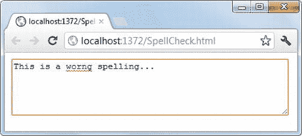

# 五、使用窗体和控件

ASP.NET 大放异彩的关键领域之一是开发数据驱动的网络应用。大多数 ASP.NET web 应用不仅仅是 HTML 页面的集合。它们涉及各种数据库任务，从简单的记录列表到复杂的数据库操作。这些任务通常包括接受用户输入，对用户输入的数据执行验证，在服务器上处理数据，最后将其保存在数据存储中。

数据输入页面通常显示一组控件，如文本框、复选框、单选按钮、下拉列表和类似的元素。这些控件包含在一个 HTML `<form>`元素中。在填写表单时，用户可以将表单及其数据提交给服务器进行处理。多年来，开发 HTML 表单变得越来越复杂，要求也越来越高。例如，许多表单需要复杂的数据格式和业务验证。他们还需要针对特定数据类型(如日期-时间和数字)的不同类型的控件。考虑到这些不断变化的需求和趋势，HTML5 对现有的`<form>`特性提供了一组增强。它还引入了一些新功能，使整个表单开发变得更加容易。本章详细介绍了 HTML5 的这些新的和增强的表单特性。具体来说，您将了解以下内容:

> *   Use the new HTML5 input type
> *   Improvements to existing controls
> *   Using the new and enhanced functions of HTML5 in ASP.NET Web forms and MVC applications
> *   Validate user input using various techniques.

### 了解 ASP.NET 的 HTML 表单

无论何时开发数据驱动的 ASP.NET 或 ASP.NET MVC 应用，应用的用户界面都分别借助于 Web 表单和视图来呈现。Web 表单和视图又使用 HTML `<form>`元素来存放页面的数据输入区域。在本章深入探讨`<form>`元素的 HTML5 特定特性之前，有必要简要讨论一下`<form>`元素如何出现在典型的 ASP.NET Web 表单和 ASP.NET MVC 应用中。

#### ASP.NET Web 表单中的<表单>元素

一个典型的 ASP.NET web 表单由一个标记有`runat`服务器的`<form>`标签组成。此外，它还承载一个或多个服务器控件，如文本框、列表和网格。最后，它提供了一种向服务器提交表单以供进一步处理的机制。清单 5-1 展示了一个简单的 web 表单，展示了这些元素在源代码视图中的样子。

***清单 5-1。**Web 表单应用中的服务器端`<form>`元素*

`<form id="form1" runat="server">
<asp:Label ID="Label1" runat="server" Text="Enter your Name : " ></asp:Label>
 
<asp:TextBox ID="TextBox1" runat="server"></asp:TextBox>
  
<asp:Button ID="Button1" runat="server" Text="Submit" />
</form>`

清单 5-1 中的`<form>`标签有两个属性:`id`和`runat`。如果您希望在服务器上处理一个 HTML 表单，它必须标有`runat`。`runat`属性只有一个可能的值:`server`。在`<form>`中有一个`Label`服务器控件、一个`TextBox`服务器控件和一个`Button`服务器控件。如果您在浏览器中运行该 web 表单，您将得到如图图 5-1 所示的显示。

***图 5-1。**显示在浏览器中的简单 web 表单*

如果您查看浏览器显示的结果页面的 HTML 源代码，它如清单 5-2 所示。

***清单 5-2。**一个网页表单的 HTML 源码*

`<form method="post" action="WebForm1.aspx" id="form1">
  

   <input type="hidden" name="__VIEWSTATE" id="__VIEWSTATE"
   value="kv16mNsClgHGNtkmN…" />
  

  

   <input type="hidden" name="__EVENTVALIDATION" id="__EVENTVALIDATION"
     value="jIRq9NWtI20O4IJRVRDv7…" />
  

  Enter your Name : 
   
  <input name="TextBox1" type="text" id="TextBox1" />` `    
  <input type="submit" name="Button1" value="Submit" id="Button1" />
</form>`

正如你所看到的，在运行时，ASP.NET 向生成的 HTML 标记添加了几个部分。注意现在`<form>`标签有了`action`和`method`属性。还要注意，所有的服务器控件都被转换成它们的等效 HTML 标记。最后，注意添加在表单顶部的`ViewState`隐藏表单字段。这种庞大的 Base64 编码的`ViewState`(为了清楚起见，清单中将其截断)是 ASP.NET 开发人员对 Web 表单的保留意见之一。

以下是关于 web 表单中使用的`<form>`标签的一些值得注意的事情:

> 典型地，一个 web 表单只有一个`<form>`标签，尽管 HTML 没有强加任何这样的限制。*   A form method is always `POST`.*   A web form is published to itself. That is, the `action` attribute of the `<form>` tag points to the same `.aspx` file.*   When using a master page, the `<form>` tag is placed in the master page file (`.master`) instead of a separate content page (`.aspx`).

#### <构成了 ASP.NET MVC 中的>元素

ASP.NET MVC 应用上下文中的`<form>`元素非常灵活。当您在视图中放置一个`<form>`元素时，ASP.NET MVC 应用有几个选项:

> *   An HTML `<form>` tag and an HTML `<input>` tag can be directly placed in a view file.
> *   HTML Assistant can be used to render `<form>` and `<input>` tags.

清单 5-3 显示了一个使用普通 HTML 标记开发的表单。

***清单 5-3。在 MVC 视图中使用普通的 HTML 标签***

`<form method="post" action="/Home/Index">
  Enter your Name : 
   
  <input name="TextBox1" type="text" id="TextBox1"/>
    
  <input type="submit" name="Button1" value="Submit" id="Button1" />
</form>`

这个`<form>`使用普通的 HTML 标记，比如`<form>`和`<input>`。注意，`<form>`标签的`action`属性指向一个控制器动作方法(`/Home/Index`)；您可以自由地将它指向任何控制器类。

清单 5-4 显示了使用 HTML 助手开发的相同表单。

***清单 5-4。**一个使用 HTML 助手渲染的`<form>`*

`<% using(Html.BeginForm("IndexWithHelpers","Home","POST")) %>
<% { %>
<%= Html.Label("Enter your Name :") %>
 
<%= Html.TextBox("txtName") %>` `  
<input type="submit" value="Submit" />
<% } %>`

如清单 5-4 所示，`<form>`标签使用`BeginForm()`方法呈现。`BeginForm()`方法的三个参数分别代表动作方法名、控制器名和表单方法。`Label`和`TextBox` HTML 助手分别呈现一个`<label>`和一个`<input>`标签。视图的结果标记与清单 5-3 中的非常匹配。

### HTML5 控件

HTML5 表单由文本和控件的组合组成。HTML5 表单的文本部分通常由字段标签、部分标题和关于表单的说明性文本组成。HTML5 标记提供了过多的控件。这些控制可大致分为以下几类:

> *   A data input control for inputting string data. Controls such as text box and `<textarea>` belong to this category.
> *   Option control, which allows you to select one or more options from a set of options. Controls such as check boxes, radio buttons and drop-down lists belong to this category.
> *   A range selector control that allows you to select a value between the minimum and maximum values.
> *   And a date selector control that allows you to select a date or part of a date (week, day, month, etc.).
> *   A color selector control that allows you to select color values.
> *   Control, rendered as a submit, reset, image, or button.
> *   Miscellaneous controls that do not belong to any of the other categories mentioned here.

HTML 4.01 提供了许多属于这些类别的控件。这里列出的大多数控件都是使用一个`<input>`元素显示的。`<input>`元素的`type`属性负责呈现所需类型的控件。

HTML5 增加了许多新的输入类型；您将在接下来的章节中了解它们。表 5-1 列出了 HTML5 中可用的输入类型，供您快速参考。还列出了一些不是`<input>`类型但在 HTML 表单中常用的控件。

下一节讨论 HTML5 引入的新输入类型。

### 使用特定于 HTML5 的输入类型

确保用户输入的数据符合预期的格式是所有数据驱动的 web 应用中的一项常见任务。传统上，开发人员使用定制的 JavaScript 代码来执行如下检查:

> *   The entered data is in the correct format: for example, email address, URL and phone number.
> *   The input data is in a certain range between the minimum and maximum values, such as age group and annual income.
> *   Date is entered in general format, and the numerical value is the effective date.

毫无疑问，通过 JavaScript 执行这样的验证是一种很好的编程实践。然而，更合理的方法是使数据输入控件能够接受所需格式或范围的数据。这样，您不需要编写任何 JavaScript 代码来验证用户输入。新的 HTML5 输入类型试图做到这一点。但是请记住，并不是所有的浏览器都支持这些新的输入类型。此外，浏览器对特定输入类型的支持可能在控件的用户界面和验证功能方面有所不同。

与 HTML5 的其他特性一样，建议您使用 Modernizr 库检查浏览器对新输入类型的支持。清单 5-5 显示了一些示例 jQuery 代码，用于检查浏览器是否支持`email`输入类型。

***清单 5-5。**检查对新输入类型的支持*

`$(document).ready(function () {
  if (!Modernizr.inputtypes.email) {
    alert("This browser doesn't support email input type of HTML5!");
  }
});`

 **注意**如果浏览器遇到无法识别的输入类型，就会呈现一个普通的文本框。在撰写本文时，Chrome 和 Opera 在支持新的输入类型方面处于领先地位。因此，下面讨论的所有输入类型都使用 Chrome 或 Opera 来说明。

请注意，不同的浏览器可能会根据输入类型执行不同的验证。例如，当您离开字段时，Firefox 会突出显示包含无效值的`<input>`字段。而 Chrome 和 Opera 则不会给出这样即时的视觉反馈。但是，所有浏览器都会在表单提交时执行验证。此时，浏览器显示第一个出错的`<input>`字段的错误消息(如果有的话),并且该输入字段获得焦点。例如，考虑一个有三个`<input>`字段的表单，其中前两个包含无效值。当提交这样的表单时，浏览器显示第一个输入字段的验证错误消息，并且第一个输入字段获得焦点。只有在第一个输入字段中输入有效值时，才会显示第二个输入字段的验证错误消息。如果有任何验证错误，表单不会被提交。

下面几节讨论 HTML5 提供的新输入类型。请记住，所有的 HTML 4.01 输入类型都是可用的，可以像以前一样使用。

#### 电子邮件地址

出于从用户注册到联系方式的各种原因，电子邮件地址通常被用在网站上。您可以使用`email`输入类型接受电子邮件地址。清单 5-6 展示了如何使用电子邮件输入类型。

***清单 5-6。**使用`email`输入类型*

`Enter your email address :
 
**<input id="email" type="email" />**
 
<input type="submit" value="Submit"/>`

如您所见，`type`属性被设置为`email`。如果你试图输入一个无效的电子邮件地址，浏览器会显示一条错误信息(参见图 5-2 )。

***图 5-2。** Chrome 在用户输入无效电子邮件地址时显示错误信息*

请注意，仅当文本框包含值时，才会显示错误消息。如果文本框为空，则不执行任何验证。这种行为类似于 ASP.NET 验证控件。

#### ・??️ 网址

将输入类型设置为`url`可以确保输入的值与 URL 模式相匹配。按如下方式使用`url`类型:

`<input id="url" type="url" />`

如果您输入一个有效的互联网 URL，如`[`www.microsoft.com`](http://www.microsoft.com)`，输入字段不会给出任何错误。输入无效的互联网 URL，如`http://microsoft%com`，会导致浏览器显示错误消息。然而，请注意，大多数浏览器中的`url`输入类型的当前实现并不执行对 URL 格式的严格检查。例如，它们允许 URL 中包含空格。

#### 数字和电话号码

数字数据通常在 web 页面中被接受，例如年龄、货币值、组织中的雇员数量等等。在这种情况下，您可以使用`number`输入类型。此外，`number`输入类型允许您指定数字的可接受范围。例如，考虑一个接受雇员当前工资的网页。下面是如何使用`number`输入类型:

`<input id="salary" type="number" />`

图 5-3 显示了 Chrome 如何将`number`输入类型显示为上下控制。

***图 5-3。**Chrome*中显示的`number`输入类型

***图 5-4。**指定了最小和最大属性的`number`输入类型*

除了将`type`属性指定为`number`之外，还可以指定最小值、最大值和`step`值。控件应该接受的最小值和最大值分别由`min`和`max`属性指定。`step`属性指示当数字增加或减少时数字的跳跃。以下标记显示了如何使用这三个属性将用户的年龄限制在 18 到 100 岁之间:

`<input type="number" min="18" max="100" step="2" />`

图 5-4 显示了试图超过最大值时显示的错误信息。

默认情况下，使用`number`输入类型只允许输入整数。如果您希望输入小数，您需要指定一个合适的`step`值，如下所示:

`<input type="number" min="10" max="50" step="0.5" />`

 **注意**`min`、`max`和`step`属性与这些输入类型一起工作:`number`、`range`、`date`、`datetime`、`datetime-local`、`month`、`time`和`week`。

要将输入字段标记为电话号码，可以使用`tel`类型。但是目前，浏览器没有对`tel`输入类型进行任何特殊的验证，因此它更像是一个标记。您可以使用这些信息来执行定制的 JavaScript 验证。清单 5-7 展示了如何操作。

***清单 5-7。**对`tel`输入类型*的自定义验证

`$("#form1").submit(function (e) {
  var flag = false;
  $("input[type='tel']").each(function (i,v) {
    var pattern = /^(\([0-9]{3}\)|[0-9]{3}-)[0-9]{3}-[0-9]{4}$/;
    var value = $(this).val();
    if (!pattern.test(value)) {
      alert("Telephone no. is invalid!");
      flag = true;
    }
  });
  if (flag) {
    e.preventDefault();
  }
});`

清单 5-7 中的代码显示了一个 jQuery `submit()`函数，它处理表单的`submit`事件。当使用提交按钮或以编程方式提交表单时，会引发`submit`事件。`submit`事件处理函数声明了一个`flag`变量，该变量指示输入的电话号码是否与某个模式匹配。

然后，jQuery 属性选择器选择所有属性设置为`tel`的输入元素。jQuery `each()`方法根据正则表达式检查每个匹配的元素，如模式变量所示。如果参数中指定的值与模式匹配，正则表达式的`test()`方法返回`true`；否则返回`false`。如果`test()`方法返回`false`，则使用警告框向用户显示一条错误消息。将`flag`变量设置为`true`表示验证错误。使用`preventDefault()`方法阻止默认动作(在本例中是表单提交)。

#### 范围选择器

有时，您需要选择(而不是输入)特定范围内的值。回想一下你在第三章中开发的定制视频播放器:你提供了改变播放器音量的工具。在这种情况下，期望用户输入音量是不合适的。相反，最好让他们从一个范围内选择一个音量级别。以下标记显示了如何使用`range`输入类型:

`<input id="range1" type="range" min="1" max="5" step="1"  />`

诸如`min`、`max`和`step`的属性与`number`输入类型的意义相同(`min`和`max`控制控件的最小和最大允许值，`step`控制值的跳跃)。图 5-5 显示了先前的范围选择器是如何在 Chrome 中显示的。

***图 5-5。**Chrome 中的范围选择器*

结果范围选择器的最小值为 1，最大值为 5，步长为 1。

#### 日期和时间

web 应用中另一种常用的数据类型是日期和/或时间。在 ASP.NET Web 表单中，`Calendar`服务器控件允许您选择日期。然而，`Calendar`最大的缺点是当选择日期时需要回发。难怪 ASP.NET 的开发人员经常在他们的 web 应用中使用基于 JavaScript 的弹出日期时间选择器。如果浏览器本身能够显示一个日期时间选择器就更好了，这就是`date`和`time`输入类型出现的地方。使用这些输入类型，您可以选择日期和/或时间。用户还可以选择完整的一周或一个月，而不是特定的一天或时间。

 **注意**在撰写本文时，Opera 是唯一一个为`date`和`time`输入类型显示弹出日期时间选择器的浏览器。Chrome 只有在输入类型为`date`时才会显示弹出的日期选择器；它为其他日期和时间类型呈现一个纯文本框。另外，`date`的显示格式也有区别。例如，Opera 以 *yyyy-MM-dd* 格式显示日期，而 Chrome 则按照机器日期格式显示。

清单 5-8 显示了所有可用的日期时间输入类型。

***清单 5-8。**日期和时间输入类型*

`<input id="dt1" type="date" />
<input id="dt2" type="time" />
<input id="dt3" type="datetime" />
<input id="dt4" type="datetime-local" />
<input id="dt5" type="week" />
<input id="dt6" type="month" />`

六种日期时间输入类型允许您分别接受日期、时间、日期和时间、本地日期和时间、周和月。日期以 *yyyy-MM-dd* 格式显示，而时间以 *hh:mm:ss* 格式显示。对于周和月，格式分别为 *yyyy-Www* 和 *yyyy-MM* 。图 5-6 显示了 Opera 如何显示这些日期时间输入类型。

***图 5-6。**戏曲显示日期时间输入类型*

如果点击图 5-6 中显示的`date`输入类型的向下箭头，会显示一个弹出的日期选择器(参见图 5-7 )。

***图 5-7。**显示弹出式日历的歌剧*

注意，您还可以使用日期的`min`和`max`属性将日期选择限制在特定的日期范围内。

#### 颜色

输入类型`color`允许您指定颜色值。回忆一下你在第四章的中开发的饼状图画布应用。在这种情况下，您在纯文本框中指定了扇区颜色。如果你的浏览器支持`color`输入类型，它可以用颜色选择器提示你，让你的工作变得容易。图 5-8 显示了 Opera 如何显示一个`color`输入类型。

***图 5-8。**歌剧中的拾色器*

使用`color`输入类型只是将`<input>`元素的`type`属性设置为`color`，如下所示:

`<input id="color1" type="color" />`

一旦用户选择了一种颜色，`<input>`字段的值将返回相应的十六进制颜色代码。例如，选择白色会返回`#ffffff`。默认情况下，拾色器默认为黑色`(#000000`。

#### 搜索

`search`输入类型用于搜索框。目前，浏览器没有为`search`输入类型提供任何特别的东西，除了一些显示变化。例如，当你开始在搜索框中输入时，Chrome 会显示一个叉号(X)(见图 5-9 )。单击 X 清除搜索框。

***图 5-9。**在 Chrome 中搜索输入类型*

现在您已经知道了哪些新的输入类型可用，以及如何在 web 页面中使用它们，是时候看看如何在 Web 表单和 MVC 视图中使用这些输入类型了。

#### 在网络表单中使用新的输入类型

在 ASP.NET 4.5 中，您可以将`TextBox`服务器控件的`TextMode`属性设置为所需的输入类型。在 ASP.NET 4.5 之前，`TextMode`属性只有两个值:`SingleLine`和`MultiLine`。然而，在 ASP.NET 4.5 中，所有新的输入类型都被支持，这在图 5-10 中很明显。

***图 5-10。**`TextMode`属性支持新的输入类型。*

在运行时，ASP.NET 框架将`TextMode`设置转换为适当的输入类型属性。注意，您也可以直接在`<asp:TextBox>`标记中设置`type`属性来获得相同的效果。但是，推荐的方式是设置`TextMode`属性。当然，没有什么可以阻止你使用一个普通的 HTML5 `<input>`标签，并为它的`type`属性设置所需的设置。但是如果您希望从服务器端代码访问文本框，那么您应该使用`TextBox`服务器控件。

如果您希望设置`min`、`max`和`step`等属性，您需要将它们直接添加到`<asp:TextBox>`标记标签中，如下所示:

`<asp:TextBox ID="TextBox1" runat="server" TextMode="Number"
min="18" max="100" step="2">
</asp:TextBox>`

 **注意**如果你使用的是 Visual Studio 2010，你可能需要安装最新的服务包才能使用新的输入类型。

#### 在 MVC 视图中使用新的输入类型

在 MVC 视图中，使用新的 HTML5 输入类型要简单一些。因为 MVC 视图直接依赖于 HTML 标记而不是服务器控件，所以您可以很容易地使用前面讨论过的`<input>`标签。如果您喜欢使用 HTML 助手而不是原始 HTML 标记，可以使用如下新的输入类型:

`<%= Html.TextBox("txtNumber","18",new {type="number",min="18",max="100"}) %>`

正如您所看到的，`TextBox`助手有三个参数:生成的`<input>`元素的名称，它的默认值，以及一个表示需要添加到元素中的附加 HTML 属性的对象。在本例中，您设置了`type`、`min`和`max`属性。

如果你的观点强烈反对某个模型，你可以用`TextBoxFor()`代替`TextBox()`，如下所示:

`<%= Html.TextBoxFor(m => m.Age, new {type="number",min="18",max="100"}) %>`

在这一行代码中，假设模型有一个名为`Age`的属性。属性显示在类型为`number`的文本框中。文本框的`min`和`max`属性分别被设置为`18`和`100`。

### 其他验证属性

在前面的小节中，您了解了 HTML5 输入类型，这些类型允许您验证输入数据的格式。除了输入类型之外，HTML5 还添加了几个其他属性，用于控制验证过程的其他一些方面。本节讨论这些技术。

#### 处理必填字段

许多数据输入表单希望在一个或多个文本框中输入值。为了执行这一要求，ASP.NET 开发人员经常使用`RequiredFieldValidator`控件。HTML5 包括一个简单的替代方法来指示强制数据输入字段。考虑以下标记:

`<input id="firstName" type="text" name="firstName" required="required"/>`

注意`<input>`元素末尾的`required`属性。这是 HTML5 表示给定字段是必填字段的方式。如果您没有为`firstName`文本框提供任何值，即使您没有编写任何验证脚本，浏览器也会显示一条错误消息并拒绝提交表单。图 5-11 显示了 Chrome 如何抛出一个错误信息。

***图 5-11。**使用`required`属性*

如您所见，试图在文本框中不输入值的情况下提交表单会产生一个错误，提示用户填写该字段。

#### 使用正则表达式的模式匹配

新的 HTML5 输入类型允许您验证一些常用的数据格式。然而，有时你需要验证一些更复杂的东西。验证这种复杂格式的常用方法是正则表达式。HTML5 也依赖它们来执行定制的模式匹配操作。让我们看看怎么做。

假设您希望接受用户的名字。名称只能包含大写或小写的字母 *A* 到 *Z* 。HTML5 `<input>`元素提供了一个`pattern`属性，该属性接受任何有效的正则表达式，并根据它验证输入的值。如果输入的值与正则表达式指定的模式不匹配，就会显示一个错误。下面一行标记显示了如何使用`pattern`属性:

`<input id="firstName" type="text" name="firstName" pattern="^\s*([a-zA-Z]+)\s*$"
required="required" />`

这个`<input>`标签的`pattern`属性被设置为一个正则表达式，只允许在文本框中输入字母字符。如果你试图输入一个数字作为名字，你会得到一个错误，如图图 5-12 所示。

***图 5-12。**使用`pattern`属性*验证数据

在输入字段中输入数字数据会产生错误，因为正则表达式只允许字母字符。默认的错误消息让用户不知道确切的格式是什么或者哪里出错了；稍后，您将学习自定义浏览器显示的错误信息。

#### 打开和关闭 HTML5 验证

当您使用新的输入类型和相关的验证技术时，表单在提交给服务器之前会被验证。但是，有时您可能希望完全跳过表单验证。在测试阶段，您可能想要测试您的服务器端验证，并且您可能想要暂时禁用 HTML5 验证。在某些情况下，不执行任何验证就提交表单可能是没问题的。例如，假设您在表单上有一个“取消”按钮或“帮助”按钮。因为这些按钮指示的操作不依赖于数据，所以您可以安全地绕过验证。

您可以在两个不同的地方关闭 HTML5 验证:

> *   At the `<form>` label layer
> *   At the submit button level

前一种方法在测试阶段很好，后一种方法适用于需要提交表单而不考虑控件值的情况。

为了关闭表单级别的验证，HTML5 提供了`novalidate`属性。在提交按钮级别，HTML5 `formnovalidate`属性完成这项工作。以下标记片段显示了如何使用这两个属性:

`<form id="form1" method="post" novalidate="novalidate"></form>
<input type="submit" formnovalidate="formnovalidate"  />`

`<form>`元素的`novalidate`属性被设置为`novalidate`。如果您提交此表单，则不会根据输入类型或模式对输入数据进行验证。

提交按钮的`formnovalidate`属性被设置为`formnovalidate`。这与`novalidate`属性具有相同的效果。

### 执行自定义验证

尽管 HTML5 输入类型以及 required 和 pattern 属性允许您验证数据，但现实世界的 web 应用仍然经常需要复杂的验证。特别是，涉及对数据库中的数据进行验证的验证超出了到目前为止讨论的技术的范围。幸运的是，HTML5 还提供了一种可以用来执行这种定制验证的技术。它包括两个步骤:

> 1.  Write a custom JavaScript function that performs custom validation.
> 2.  If the verification fails, call the `setCustomValidity()` method on the input field to inform the browser of the error.

2 是您向浏览器提供自定义错误消息的机会，这样浏览器就可以在验证失败时弹出它。为了理解这些步骤是如何工作的，请看清单 5-9 。

***清单 5-9。**自定义验证功能*

`$(document).ready(function () {
  $("#btnSubmit").click(OnSubmit);
});
function OnSubmit(evt) {
  $.ajax({
      url: '/home/ValidateCustomerID',
      type:'post',
      data: { id: $("#txtCustId").val() },
      dataType: 'json',
      async:false,
      success: function (result) {
        var textbox = $("#txtCustId").get(0);
        if (result == false) {
          textbox.setCustomValidity("Customer ID was not found in the database!");
        }
        else {
          textbox.setCustomValidity("");
        }
      }
    });
}`

清单 5-9 显示了提交按钮的`click`事件处理程序。该事件处理程序使用`$.ajax()`调用名为`ValidateCustomerID()`的控制器动作，并传递在文本框中输入的客户 ID(`txtCustId`)。如果在`Northwind`数据库的`Customers`表中找到提供的客户 ID，则`ValidateCustomerID()`动作返回`true`；否则返回`false`。注意`$.ajax()`调用的`success`功能:如果在数据库中没有找到客户 ID，那么将在文本框中调用`setCustomValidity()`方法，并显示一条定制的错误消息。提交表单时，向用户显示该错误信息。如果找到了一个客户 ID，调用`setCustomValidity()`方法，使用一个空字符串表示没有验证错误。`ValidateCustomerID()`动作如清单 5-10 所示。

***清单 5-10。** `ValidateCustomerID()`动作方法*

`public JsonResult ValidateCustomerID(string id)
{
    NorthwindEntities db = new NorthwindEntities();
    var data = from item in db.Customers
                where item.CustomerID == id
                select item;
    if (data.Count() <= 0)
    {
        return Json(false);
    }
    else
    {
        return Json(true);
    }
}`

`ValidateCustomerID()`动作使用`Northwind`数据库的实体框架数据模型来确定数据库中是否存在一个`CustomerID`值。相应地，返回一个`true`或`false`标志作为`JsonResult`。图 5-13 显示了一个带有无效客户 id 的视图运行示例。

***图 5-13。** `setCustomValidity()`法在行动*

注意清单 5-9 中关于的一件有趣的事情:`$.ajax()`调用指定了`false`的一个`async`选项值。默认情况下，`$.ajax()`向服务器发出异步请求。然而，使用这个默认行为，提交按钮提交表单，而不等待`ValidateCustomerID()`返回。当`async`选项设置为`false`时，`$.ajax()`向服务器发出同步请求而不是异步请求，并且`OnSubmit`事件处理程序等待`ValidateCustomerID()`方法完成。

### HTML5 输入类型和 ASP.NET 验证技术

虽然新的 HTML5 输入类型是对 HTML 标记的巨大补充，但有时您需要混合 HTML5 本地验证技术和 ASP.NET 验证技术。ASP.NET 网络表单和 ASP.NET MVC 分别通过服务器控件和 HTML 助手为验证提供了很好的支持。有必要研究一下这些验证技术如何适应 HTML5。以下部分讨论了 HTML5 验证技术与 ASP.NET 内置技术的各种组合。

#### HTML5 输入类型和验证控件

ASP.NET Web 窗体提供了用于执行一组常见验证任务的验证控件。这些验证控件发出执行数据验证工作的客户端 JavaScript。更重要的是，您可以将它们与 HTML5 输入类型一起使用。提交表单时，验证控件和 HTML5 输入类型执行验证。如果一个文本框的`TextMode`被设置为`Email`并且还附加了一个`RegularExpressionValidator`(见清单 5-11 )，当提交表单时，两种方案都会显示一条错误消息。

***清单 5-11。**将`TextMode`和`RegularExpressionValidator`一起使用*

`<asp:TextBox ID="TextBox3" runat="server" TextMode="Email"></asp:TextBox>

<asp:RequiredFieldValidator ID="RequiredFieldValidator3" runat="server"
ControlToValidate="TextBox3" ErrorMessage="Please enter email address"
ForeColor="Red">*</asp:RequiredFieldValidator>

<asp:RegularExpressionValidator ID="RegularExpressionValidator1" runat="server"
ErrorMessage="Invalid email address" ForeColor="Red"
ValidationExpression="\w+([-+.']\w+)*@\w+([-.]\w+)*\.\w+([-.]\w+)*"
ControlToValidate="TextBox3">*</asp:RegularExpressionValidator>`

图 5-14 显示了这在运行时是如何工作的。

***图 5-14。**验证控件和 HTML5 输入类型一起使用*

你可能想知道为什么要一起使用验证控件和 HTML5 输入类型。因为并非所有浏览器都支持 HTML5 输入类型，所以您需要使用验证控件作为后备机制。所以，总之你有以下选择:

> *   Use only HTML5-specific input types and validation attributes. If the target browser supports HTML5 input type, this method is feasible; Otherwise, no verification is performed. Use the combination of HTML5 authentication technology and ASP.NET authentication control. This method ensures that validation works in all browsers, but as mentioned earlier, there may be some redundancy in the error message. When client authentication is turned off, HTML5 authentication technology and ASP.NET authentication control are used together. In this case, if the target browser supports HTML5, HTML5 verification technology is executed; Otherwise, the form will be posted back to the server and the validation control will validate the data. Of course, in the latter case, the extra round trip to the server is costly.

#### MVC 应用中的 HTML5 输入类型和服务器端验证

将 HTML5 的新验证技术与 ASP.NET MVC 相结合的一种方法是使用 HTML5 提供客户端验证，同时使用 ASP.NET MVC 在控制器中提供服务器端验证。在这个例子中，您使用 MVC `ValidationMessage`和`ValidationSummary` HTML 助手来验证名字、姓氏和电子邮件值。清单 5-12 显示了一个简单表单的视图，该表单有三个字段:`FirstName`、`LastName`和`Email`。

***清单 5-12。**MVC 应用中的验证助手和 HTML5 输入类型*

`<% using (Html.BeginForm()) { %>
<table cellpadding="3" cellspacing="0" class="style1">
    <tr>
        <td nowrap="nowrap" width="5%">
            <%= Html.Label("First Name :")%>
        </td>
        <td width="50%">
            <%= Html.TextBox("FirstName", "", new {required="required"})%>
            <%= Html.ValidationMessage("FirstName","*")%>
        </td>
    </tr>
    <tr>
        <td nowrap="nowrap" width="5%">
            <%= Html.Label("Last Name :")%>
        </td>
        <td width="50%">
            <%= Html.TextBox("LastName", "", new {required="required"})%>
            <%= Html.ValidationMessage("LastName","*")%>
        </td>
    </tr>
    <tr>
        <td nowrap="nowrap" width="5%">` `            <%= Html.Label("Email Address :")%>
        </td>
        <td width="50%">
            <%= Html.TextBox("Email", "", new {type="email"})%>
            <%= Html.ValidationMessage("Email","*")%>
        </td>
    </tr>
</table>
<input id="Submit1" type="submit" value="Submit" />
<%= Html.ValidationSummary() %>
<%}%>`

如您所见，`Email`文本框将其类型设置为`email`。还要注意`ValidationMessage`和`ValidationSummary` MVC HTML 助手是如何显示验证错误的。HTML5 验证就发生在浏览器中。然而，MVC 验证是在控制器中执行的，如清单 5-13 所示。

***清单 5-13。**在控制器中执行验证*

`[HttpPost]
public ActionResult Index(FormCollection form)
{
  if (form["FirstName"].Length < 3 || form["firstname"].Length > 50)
  {
      ModelState.AddModelError("FirstName",
        "Invalid First Name. Must be between 3 and 50 characters.");
  }
  if (form["LastName"].Length < 3 || form["LastName"].Length > 50)
  {
      ModelState.AddModelError("LastName",
        "Invalid Last Name. Must be between 3 and 50 characters.");
  }
  if (form["Email"].Length <= 0)
  {
      ModelState.AddModelError("Email", "Please enter Email Address.");
  }
  if(!Regex.IsMatch(form["Email"],@"\w+([-+.']\w+)*@\w+([-.]\w+)*\.\w+([-.]\w+)*"))
  {
     ModelState.AddModelError("Email", "Invalid Email Address.");
  }
  return View();
}`

如您所见，`Index()`动作方法对表单数据执行验证，并相应地在`ModelState`中添加错误消息。验证助手在浏览器中显示这些模型错误(参见图 5-15 )。

***图 5-15。**MVC 控制器中的验证*

当您在客户端和服务器端都有验证逻辑时，客户端验证会在提交表单之前执行。在这个例子中，首先执行 HTML5 验证，然后才提交表单。一旦控制到达`Index()`动作方法。执行服务器端验证。

#### HTML5 输入类型和无障碍验证

*无阻碍验证*是由 ASP.NET 实现的一种技术，它使用数据注释属性和 jQuery。在这种模式下，数据模型用数据注释属性来修饰，这些属性对数据模型属性值执行验证。在运行时，ASP.NET 发出`data-*`属性，这是 HTML5 的一个特性。ASP.NET 在这些发出的`data-*`属性和 jQuery 的帮助下执行客户端验证。

`data-*`属性是定制属性，就使用语法而言，就像任何其他内置的 HTML 属性一样。但是，它们不同于内置的 HTML 属性，因为它们在元素的可视化呈现中不起任何作用。ASP.NET 4.5 Web 表单和 MVC 应用都支持无阻碍验证。我不再进一步讨论无阻碍的验证方案；可以说，如果需要的话，您可以使用无阻碍验证和 HTML5 验证技术。

 **注意**`data-*`属性是 HTML5 的一个特性。你会在《??》第六章中学会使用它们。

### 定制验证消息

到目前为止，您一直依赖浏览器来显示 HTML5 验证消息。毫无疑问，支持 HTML5 验证的浏览器在整洁地显示验证消息方面做得很好。但是，您可能想要进一步自定义它们。例如，您可能希望错误信息的字体和颜色与您的网页主题相匹配，或者您可能希望突出显示任何违反有效性规则的输入控件。HTML5 提供了两种方法来完成这种定制:

> *   Use CSS pseudo-class to customize the appearance of input fields that violate validation rules.
> *   Use JavaScript/jQuery code to customize the display mode of input field verification messages.

前一种技术适用于您希望自定义输入字段的外观，并且对更改验证消息的显示方式不感兴趣的情况。后一种方法使您可以完全控制验证消息的显示方式和位置。它包括处理输入字段的`invalid`事件处理程序和编写定制逻辑来显示验证消息。

#### 使用 CSS 伪类定制输入字段的外观

每当出现验证错误时，浏览器都会弹出一个显示验证错误消息的标注(参见图 5-2 )。虽然浏览器不允许您自定义验证消息标注的外观，但是您可以自定义当违反验证规则时输入字段的外观。诀窍是编写特定的 CSS 伪类。

 **注意**CSS*伪类*是一个基于元素状态应用于元素的类。例如，一个锚(`<a>`)标签有伪类`link`、`visited`、`hover`和`active`，它们代表超链接的相应状态。本节讨论的 CSS 伪类来自 CSS3 规范。

表 5-2 列出了可以用于 HTML5 验证的伪类。

清单 5-14 使用了表 5-2 中提到的许多 CSS 伪类来定制发生验证错误时输入字段的外观。

***清单 5-14。**定制输入字段的样本伪类*

`input:invalid {
  background-color: #ffd800;
  border: 2px solid #f00;
}
input:required {
  background-color: #ffd800;
  border: 2px solid #f00;
}
input:out-of-range {` `  color: #fff;
  background-color: #242a59;
  border: 2px solid #f00;
}`

图 5-16 显示了一个带有无效数据的网页的运行示例。

***图 5-16。**动作中的验证伪类*

请注意 Email 文本框是如何选择`input:invalid`类的，因为该字段的值不符合有效电子邮件地址的格式。同样，当年龄超过最大限制时，年龄文本框选择`input:out-of-range`类。

#### 通过代码定制验证消息

在执行验证之后，HTML DOM 为所有违反验证规则的输入字段引发一个`invalid`事件。您可以捕获`invalid`事件并编写定制代码来隐藏默认的验证消息并显示您自己的消息。在`invalid`事件处理程序中，您可以使用`ValidityState`对象来查找关于错误的更多信息。清单 5-15 展示了这是如何实现的。

***清单 5-15。**处理`invalid`事件*

`$(document).ready(function () {
  $("#txtEmail").bind("invalid", OnInvalid);
  $("#txtAge").bind("invalid", OnInvalid);
});

function OnInvalid(evt) {
  var input = evt.target;
  var validity = input.validity;

  if (validity.typeMismatch) {
    alert("Invalid email address");
  }
  if (validity.rangeOverflow) {
    alert("Age value too big");
  }
  if (validity.rangeUnderflow) {` `    alert("Age value too small");
  }
  evt.preventDefault();
}`

如您所见，jQuery `bind()`方法为两个`<input>`字段绑定了`invalid`事件处理程序。`OnInvalid()`函数通过输入字段的`validity`属性获取`ValidityState`对象。对象提供了几条关于输入字段当前有效性状态的信息。表 5-3 列出了可以使用的`ValidityState`对象的属性。

然后，代码显示一个带有自定义验证消息的警告框。通过调用事件对象的`preventDefault()`方法，浏览器的默认验证消息被取消。如果除了警告框之外，您没有使用`preventDefault()`调用来阻止默认操作，浏览器的验证错误消息标注也会显示，这在大多数情况下是不必要的。

图 5-17 显示了代码的运行示例。

***图 5-17。**来自`invalid`事件处理程序*的定制验证消息

如您所见，输入一个无效的电子邮件地址并单击 Submit 按钮会在一个警告框中显示验证错误消息，而不是浏览器的默认标注。

### 对<输入>元素的其他改进

在前面的章节中，您了解了 HTML5 中可用的新输入类型。HTML5 还通过一些特性增强了`<input>`元素:

> *   Set focus to field when loading form
> *   Use placeholders to display tips or help text
> *   Spell check the entered text.
> *   Or turn on or off the browser autocomplete function.
> *   Provide a pick list for input fields.

下面几节将讨论这些增强功能。

#### 设置自动对焦

当网页加载到浏览器中时，最好将初始焦点设置到用户应该填写的数据输入字段。您可以使用`autofocus`属性来指示输入字段应该获得焦点。以下标记显示了如何操作:

`<input id="firstName" type="text" name="firstName" autofocus="autofocus"
  required="required"/>`

这行标记声明了一个文本输入字段，该字段的`autofocus`属性被设置为`autofocus`。当您在浏览器中打开网页时，`firstName`文本框会获得焦点。

#### 使用占位符显示帮助文本

在填写电子邮件地址、URL、日期和电话号码等字段时，建议让用户知道输入数据的格式。一种方法是简单地在数据输入字段前面放置说明性文本。这种方法的缺点是标签会占用额外的屏幕空间。HTML5 占位符提供了一种向输入控件添加提示或帮助文本的优雅方式。

占位符显示为水印，一旦用户开始填充字段，它就会被删除。使用`<input>`元素的`placeholder`属性指定一个占位符。下面一行标记添加了一个占位符，告诉用户如何设置电话号码的格式:

`<input id="telephone" type="tel" placeholder="(123) 123-1234"/>`

图 5-18 显示了这个占位符在运行时的样子。

如您所见，输入字段显示了在`placeholder`属性中指定的占位符。一旦您开始键入电话号码，占位符文本就会消失。如果输入字段为空，占位符会再次出现。

***图 5-18。**显示占位符*

#### 启用拼写检查

如果您的表单接受来自用户的自由格式文本输入，您可能希望对内容启用拼写检查。例如，假设您正在开发一个允许用户发布和编辑文章的博客引擎。如果能对内容进行拼写检查就好了。这样，用户可以很容易地发现拼写错误。属性为您做了这项工作。以下是您使用它的方法:

`<textarea id="textarea1" rows="5" cols="50" spellcheck="true"></textarea>`

`spellcheck`属性是一个布尔值，可以设置为`true`或`false`。如果设置为`true`，`<textarea>`(或`<input>`)高亮显示拼写错误，如图图 5-19 所示。

***图 5-19。**为`<textarea>`* 启用拼写检查

注意不正确的拼写是如何用红色下划线突出显示的。

#### 关闭自动完成功能

大多数浏览器试图在自动完成功能的帮助下帮助用户填写数据输入表单。该功能允许用户从列表中选择一个值，而不是键入整个值。但是，有时您可能希望对输入字段禁用此功能。属性允许您这样做。以下标记显示了它的用法:

`<input id="firstName" type="text" autocomplete="off"/>`

当然，你可以将`autocomplete`设置为`on`来明确开启该功能。您还可以通过将`autocomplete`属性添加到`<form>`标签而不是单个的`<input>`标签来打开或关闭整个表单的自动完成功能:

`<form id="form1" autocomplete="off"></form>`

如果您设置了`<form>`标签的`autocomplete`属性，那么属于该表单的所有输入字段的自动完成功能都将被禁用。

#### 提供下拉列表

有时，您希望让用户手动输入一个值，或者从列表中选择一个值。对于桌面应用，组合框控件通常用于此类功能。假设您正在开发一个提供客户详细信息的订单输入页面。如果订单是由现有客户下的，让用户从列表中选择现有的详细信息而不是再次输入它们会很有帮助。您可以使用`<input>`和`<datalist>`元素的`list`属性的组合来提供这样一个列表。清单 5-16 展示了这是如何实现的。

***清单 5-16。**提供下拉列表*

`<input id="country" type="text" list="pickuplist1" />
<datalist id="pickuplist1">
  <option label="India" value="India"></option>
  <option label="USA" value="USA"></option>
  <option label="UK" value="UK"></option>
</datalist>`

如您所见，`<datalist>`元素本质上提供了一个键值对列表。`value`属性决定了做出选择时目标文本框中应该填充的内容。`label`属性作为相应值的描述。`<input>`元素的`list`属性被设置为`<datalist>`的 ID。运行时，显示一个列表，如图图 5-20 所示。

***图 5-20。**输入字段的下拉列表*

下拉列表中左边的列显示了在`value`属性中指示的值，右边的列显示了由`label`属性指定的值。

#### 设置表单的动作和方法

通常，`<form>`标签有`action`和`method`属性，分别表示表单动作和 HTTP 方法(`GET` / `POST`)。在某些情况下，您可能希望更改单个提交按钮的这些设置。您可以使用`<input>`元素的`formaction`和`formmethod`属性来实现。清单 5-17 显示了如何操作。

***清单 5-17。**使用`<input>`标签*设置表单的动作和方法

`<form action="/Home/Index" method="get">
  <input id="btnSubmit" type="submit" value="Submit"
    formaction="/Home/Index2"
    formmethod="post" />
</form>`

`<form>`标签的`action`属性设置为`/Home/Index`，其`method`属性设置为`get`。通过将`formaction`属性设置为/Home/Index2 并将`formmethod`属性设置为`post.`，您可以通过`<input>`标签覆盖这些默认值。表单上的其他提交按钮(如果有)使用表单级别指定的动作和方法。

### 设计员工数据表单

现在是时候运用 HTML5 表单特性的知识，开发一个完整的表单来处理来自 SQL Server 数据库的数据了。在本节中，您将开发一个 ASP.NET Web 窗体应用，该应用将数据插入到数据库`Northwind`的`Employees`表中，在其中更新数据，以及从其中删除数据。应用的主窗体如图图 5-21 所示。

***图 5-21。**员工数据表*

图 5-21 所示的表格，为了简单起见，没有更新`Employees`表的所有列。员工数据输入表单具有以下验证和功能:

> *   Columns `FirstName`, `LastName`, `BirthDate`, `Title` (current name), `HireDate`, `Address`, `City`, `Country` and `PostalCode` are required fields, which must be entered when adding or modifying data.
> *   The legal age for employment is assumed to be 18 years old, so there is a difference of at least 18 years between `BirthDate` and `HireDate`.
> *   Show a placeholder when all data entry fields are blank.
> *   The current designation can be entered manually or selected from the list.
> *   `PostalCode` and `HomePhone` must match the patterns of U.S. postal code and U.S. telephone number respectively.

#### 配置 FormView 控件

图 5-21 所示的表单实际上是一个`FormView`服务器控件。清单 5-18 显示了需要配置的`FormView`的重要属性。

***清单 5-18。**`FormView`控件的属性*

`<asp:FormView ID="FormView1" runat="server"
  AllowPaging="True"
  DefaultMode="Edit"
  DataKeyNames="EmployeeID"
  SelectMethod="GetEmployees"
  InsertMethod="InsertEmployee"
  UpdateMethod="UpdateEmployee"
  DeleteMethod="DeleteEmployee"
  ItemType="SampleAppWebForms.Model.Employee"
>
...
</asp:FormView>`

默认情况下，当 web 表单显示在浏览器中时，`FormView`处于编辑模式，因此您可以修改员工记录。您可以通过将`DefaultMode`属性设置为 Edit 来实现。

与依赖于`EntityDataSource`控件(或任何其他数据源控件)不同，`FormView`依赖于自定义方法来执行创建、读取、更新和删除(CRUD)操作。您可以通过将四个属性`SelectMethod`、`InsertMethod`、`UpdateMethod`和`DeleteMethod`设置为适当的方法来实现这一点。`GetEmployees()`、`InsertEmployee()`、`UpdateEmployee()`和`DeleteEmployee()`方法是在 web 表单的代码隐藏文件中编写的，将在后面讨论。

`FormView`模板被强类型化为`Employee`模型的各种属性。这就是为什么`ItemType`属性被设置为实体框架数据模型类的全限定名:`Employee`。稍后将讨论`Employee`模型以及前面提到的 CRUD 方法。

#### 使用 HTML5 输入类型和相关属性

`FormView`控件使用`EditItemTemplate`和`InsertItemTemplate`分别在编辑和插入模式下呈现数据输入表单的用户界面。这些模板在 HTML 和服务器控件标记方面几乎完全相同。清单 5-19 显示`EditItemTemplate`。为了可读性，只显示了与 HTML5 验证技术相关的标记。

***清单 5-19。**之`EditItemTemplate`之`FormView`之*

`<EditItemTemplate>
<fieldset>
  <legend>Basic Details</legend>
  <label for="FullName">Full Name :</label>
  <asp:DropDownList ... SelectedValue='<%# BindItem.TitleOfCourtesy %>'>
    ...
  </asp:DropDownList>
  <asp:TextBox ... required="required" Text="<%# BindItem.FirstName %>"
    PlaceHolder="First Name" autofocus="autofocus">...
  <asp:TextBox ... required="required" Text="<%# BindItem.LastName %>"  
    PlaceHolder="Last Name">...
  <label for="txtBirthDate">Birth Date :</label>
  <asp:TextBox ... TextMode="Date" Text="<%# BindItem.BirthDate %>"
    required="required" PlaceHolder="Birth Date" >...
</fieldset>
<fieldset>
  <legend>Employment Details</legend>
  <label for="lblEmployeeID">Employee ID :</label>
  <asp:Label ... Text="<%# BindItem.EmployeeID %>">...
  <label for="txtDesig">Current Designation :</label>
  <asp:TextBox ... required="required" Text="<%# BindItem.Title %>"
    PlaceHolder="Designation" list="lstTitles">...
  <datalist id="lstTitles"></datalist>
  <label for="txtHireDate">Hire Date :</label>
  <asp:TextBox ... TextMode="Date" Text='<%# BindItem.HireDate %>'
    required="required" PlaceHolder="Hire Date">...
</fieldset>
<fieldset>
  <legend>Contact Details</legend>
  <label for="address">Address :</label>
  <asp:TextBox ... required="required" Text="<%# BindItem.Address %>"
    PlaceHolder="Street Address">...
  <asp:TextBox ... required="required" Text='<%# BindItem.City %>'
    PlaceHolder="City" >...
  <asp:TextBox ... required="required" Text='<%# BindItem.Country %>'
    PlaceHolder="Country" >...
  <asp:TextBox ... pattern="\d{5}(-\d{4})?" Text='<%# BindItem.PostalCode %>'
    required="required" PlaceHolder="Postal Code" >...
  <label for="txtPhone">Home Phone :</label> 
  <asp:TextBox ... TextMode="Phone" Text='<%# BindItem.HomePhone %>'
    PlaceHolder="(123) 123-1234" >...
</fieldset>
<asp:Button ... Text="Save" CommandName="Update" />
<asp:Button ... ID="btnNew" Text="Add New"
  CommandName="New" formnovalidate="formnovalidate" />` `<asp:Button ... ID="btnDelete" Text="Delete"
  CommandName="Delete" formnovalidate="formnovalidate" />
</EditItemTemplate>`

仔细观察清单 5-19 中显示的标记。总共有三个`<fieldset>`元素代表表单的三个部分:基本信息、雇佣信息和联系信息。一个`<fieldset>`元素用于对相关元素进行分组。为了直观地表示分组，`<fieldset>`元素还绘制了一个包围分组元素的方框。因为这是一个编辑模式模板，所以您希望对任何字段所做的更改传播回数据库。因此，除了`EmployeeID`之外的所有字段都使用一个`BindItem`对象与数据模型绑定。`EmployeeID`是主键，所以它是只读的，因此使用了一个`Item`对象。

如果你看一下`<asp:TextBox>`元素，你会发现它们中的很多都使用 HTML5 输入类型和相关属性。`BirthDate`和`HireDate`文本框的`TextMode`属性被设置为`Date`。同样，`HomePhone`的`TextMode`值为`Phone`。`PostalCode`文本框的`pattern`属性被设置为匹配美国邮政编码的正则表达式。注意，您也可以为`HomePhone`文本框使用`pattern`属性，但是应用通过 jQuery 代码来验证电话号码。

一个文本框获得焦点，`<datalist>`就显示现有的值。使用`list`属性将`<datalist>`链接到文本框。实际的`<datalist>`项在运行时使用 jQuery 填充。

为所有必须填充的文本框设置了`required`属性。此外，它们都将自己的`Placeholder`属性设置为一些帮助文本。三个`Button`服务器控件— `btnUpdate`、`btnNew`和`btnDelete`—调用适当的动作。注意，这些按钮控件的`CommandName`属性分别被设置为`Update`、`New`和`Delete`。这样，`FormView`控件触发适当的方法。还要注意的是，`btnNew`和`btnDelete`已经设置了它们的`formnovalidate`属性，因为单击这些按钮时不需要执行数据验证。

#### 注意日期格式

`BirthDate`和`HireDate`文本框将`TextMode`设置为`Date`。正如您之前了解到的，HTML5 `date`输入类型的默认日期格式是 *yyyy-MM-dd* 。然而，`Employees`表以 *MM/dd/yyyy* 格式存储日期。为了处理这种日期格式的不匹配，您需要处理`FormView`的`DataBound`事件，并将日期从 *MM/dd/yyyy* 格式转换为 *yyyy-MM-dd* 格式。清单 5-20 显示了如何进行这种转换。

***清单 5-20。**转换日期格式*

`protected void FormView1_DataBound(object sender, EventArgs e)
{
    if(FormView1.CurrentMode == FormViewMode.Edit)
    {
        DateTime dtBirthDate= ((Employee)FormView1.DataItem).
                                               BirthDate.GetValueOrDefault();
        DateTime dtHireDate = ((Employee)FormView1.DataItem).
                                               HireDate.GetValueOrDefault();
        TextBox txtBirthDate= (TextBox)FormView1.FindControl("txtBirthDate");
        TextBox txtHireDate = (TextBox)FormView1.FindControl("txtHireDate");
        txtBirthDate.Text = dtBirthDate.ToString("yyyy-MM-dd");
        txtHireDate.Text = dtHireDate.ToString("yyyy-MM-dd");
    }
}`

这段代码检查`FormView`的`CurrentMode`是否是`Edit`，如果是，抓取被绑定的`BirthDate`和`HireDate`值。`DataItem`对象表示与`FormView`绑定的`Employee`。使用`FindControl()`方法找到显示`BirthDate`和`HireDate`的文本框。最后，使用 *yyyy-MM-dd* 格式将日期值填入文本框。

#### 编写 CRUD 方法

web 窗体代码隐藏包含四个对数据库执行 CRUD 操作的方法。这些方法如清单 5-21 所示。

***清单 5-21。**执行 CRUD 操作的方法*

`public IQueryable<Employee> GetEmployees()
{
    NorthwindEntities db = new NorthwindEntities();
    var data = from item in db.Employees
                orderby item.EmployeeID
                select item;
    return data;
}

public void InsertEmployee(Employee e)
{
    NorthwindEntities db = new NorthwindEntities();
    db.Employees.AddObject(e);
    db.SaveChanges();
}

public void UpdateEmployee(Employee e)
{
    NorthwindEntities db = new NorthwindEntities();
    var data = from item in db.Employees
                where item.EmployeeID == e.EmployeeID
                select item;

    Employee obj = data.SingleOrDefault();
    obj.TitleOfCourtesy = e.TitleOfCourtesy;
    obj.FirstName = e.FirstName;
    obj.LastName = e.LastName;
    obj.BirthDate = e.BirthDate;

    obj.Title = e.Title;
    obj.HireDate = e.HireDate;

    obj.Address = e.Address;
    obj.City = e.City;
    obj.Country = e.Country;
    obj.HomePhone = e.HomePhone;

    db.SaveChanges();
}` `public void DeleteEmployee(Employee e)
{
    NorthwindEntities db = new NorthwindEntities();
    var data = from item in db.Employees
                where item.EmployeeID == e.EmployeeID
                select item;
    Employee obj = data.SingleOrDefault();
    db.DeleteObject(obj);
    db.SaveChanges();
}`

这些 CRUD 方法很简单。`GetEmployees()`方法将`Employee`对象的集合返回给调用者。`InsertEmployee()`、`UpdateEmployee()`和`DeleteEmployee()`方法接收一个`Employee`对象作为参数。然后这个`Employee`对象被插入到数据库中，在数据库中被更新，或者从数据库中被删除。`Employee`模型类包含了`Employees`表的所有列，但是您并没有使用它们。因此，`UpdateEmployee()`分配了`Employee`对象的单个属性。`Employee`型号类别如图图 5-22 所示。

***图 5-22。** `Employee`数据模型类*

应用没有使用`Employee`类的所有属性。感兴趣的属性有`EmployeeID`、`TitleOfCourtesy`、`FirstName`、`LastName`、`BirthDate`、`Title`、`HireDate`、`Address`、`City`、`Country`、`HomePhone`。

#### jQuery Code

web 表单还需要一些 jQuery 代码来完成以下任务:

> *   From the `Employees` table
> *   Get the existing `Title` (title) to fill in the `<datalist>` item, and verify that the employee is at least 18 years old at the time of employment.
> *   Verify the phone number and American phone number format
> 
> 匹配

要填充`<datalist>`项，您需要对服务器进行 Ajax 调用，并检索所有现有的`Title`值。你可以使用`$.ajax()`方法，如清单 5-22 所示。

***清单 5-22。**用现有的`Title`值*填充`<datalist>`

`$(document).ready(function () {
  $.ajax({
    url: 'employeeform.aspx/GetTitles',
    type: 'post',
    dataType: 'json',
    contentType: "application/json; charset=utf-8",
    success: function (results) {
      for (var i = 0; i < results.d.length; i++) {
        $("#lstTitles").append("<option label='" + results.d[i] +
                                           "' value='" + results.d[i] + "'></option>");
      }
    },
    error: function (err) { alert(err.status + " - " + err.statusText); }
  });
...`

`$.ajax()`方法调用驻留在`EmployeeForm.aspx` web 表单中的 web 方法`GetTitles()`。`GetTitles()`返回现有标题的字符串数组。一旦标题被返回，就使用 jQuery `append()`方法将它们添加到`<datalist>`中。web 方法如清单 5-23 所示。

***清单 5-23。** `GetTitles()` Web 方法*

`[WebMethod]
public static string[] GetTitles()
{
    NorthwindEntities db=new NorthwindEntities();
    var data = (from item in db.Employees
                select item.Title).Distinct();
    return data.ToArray();
}`

`GetTitles()`从`Employees`表中选择不同的`Title`值，并将它们作为数组返回给调用者。图 5-23 显示了`<datalist>`在运行时的样子。

***图 5-23。** `<datalist>`使用 jQuery* 填充

为了验证雇员在被雇用时至少 18 岁，您需要找出`BirthDate`和`HireDate`之间的差异。如果这种差异大于 18 年，可以添加或更新员工记录。`HomePhone`文本框类型为`tel`(`Phone`的`TextMode`)，输入的电话号码应为有效的美国电话号码。当添加或更新记录时，会执行这两种验证。清单 5-24 显示了这是如何完成的。

***清单 5-24。**验证年龄要求和电话号码格式*

`$("input[name$='btnUpdate']").click(function (e) {
  var birthDate = ToDate($("input[name$='txtBirthDate']").val());
  birthDate.setFullYear(birthDate.getFullYear() + 18);
  var hireDate = ToDate($("input[name$='txtHireDate']").val());
  var txtBirthDate = $("input[name$='txtBirthDate']").get(0);
  if ((hireDate.getTime() - birthDate.getTime()) < 0) {
    txtBirthDate.setCustomValidity("Invalid Birth Date or Hire Date!");
  }
  else {
    txtBirthDate.setCustomValidity("");
  }

  var pattern = /^\(?(\d{3})\)?[- ]?(\d{3})[- ]?(\d{4})$/;
  var value = $("input[name$='txtPhone']").val();
  var txtPhone = $("input[name$='txtPhone']").get(0);
  if (!pattern.test(value)) {
    txtPhone.setCustomValidity("Invalid Telephone Number!");
  }
  else {
    txtPhone.setCustomValidity("");
  }
});

function ToDate(input) {
  var parts = input.match(/(\d+)/g);
  return new Date(parts[0], parts[1] - 1, parts[2]);
}`

一个以结束的 jQuery *属性选择器用于选择`btnUpdate`。这是必要的，因为更新按钮是`EditItemTemplate`的一部分，并且`FormView`为组成控件分配一个唯一的名称(例如，`FormView1$btnUpdate`)。第一个代码块主要计算`HireDate`和`BirthDate`之间的差异。如果这个差值小于 0，说明年龄小于 18 岁。如果是这样，通过调用`BirthDate`文本框上的`setCustomValidity()`方法添加一个定制的错误消息。*

第二个代码块验证电话号码。这是通过将输入的值与正则表达式进行匹配来实现的。注意`test()`的使用，它执行模式匹配。如果值与模式不匹配，`test()`方法返回`false`。在这种情况下，调用`setCustomValidity()`方法来设置定制的验证消息。

#### CSS 伪类

最后，您需要添加一些伪类来突出验证错误。这些伪类在`StyleSheet.css`中找到，并在清单 5-25 中显示。

***清单 5-25。**验证错误的伪类*

`input:invalid {
    background-color: #ffd800;
    border: 2px solid #f00;
}

input:required {
    background-color: #fff;
    border: 1px solid #ff6a00;
}`

`invalid`伪类应用于所有无效的输入字段，而`required`伪类应用于所有设置了`required`属性的输入字段。

就这样！图 5-24 显示了一个带有验证错误的 web 表单的运行示例。

请注意 web 表单是如何在提交表单时验证家庭电话字段的。家庭电话的格式必须是(123) 123-1234。但是，因为输入的电话号码的最后一部分包含 5 位数字而不是 4 位，所以会显示验证错误。

***图 5-24。**出现验证错误的员工数据输入表单*

### 设计用户注册表单

在本节中，您将开发一个显示用户注册页面的 ASP.NET MVC 应用。与您在上一节中开发的员工数据输入表单不同，用户注册页面在客户端和服务器端执行验证。客户端验证使用您在本章中学习的 HTML5 特性来执行，而服务器端验证使用数据注释属性。此外，使用`invalid`事件处理客户端验证，以便验证消息(客户端和服务器)以一致的方式显示。图 5-25 显示用户注册页面。

***图 5-25。**用户注册页面*

此页面具有以下验证和功能:

> *   The display name, email address, password, confirmation password and legal age fields must be filled in.
> *   Display name and email address cannot be duplicated.
> *   The e-mail address should be in the correct format.
> *   Password and confirmation password values must match.
> *   Blog websites must be in the correct format.
> *   The legal age must be between 18 and 100.
> *   Spelling check should be turned on in the profile text area.
> *   Display name, email address, password, blog/website and profile fields have minimum and maximum lengths.

除了最后一项，所有功能都是通过 HTML5 实现的。最后一组验证在服务器上实现。

#### 实体框架数据模型和数据标注

示例页面将用户信息存储在名为`Users`的 SQL server 表中。实体框架数据模型用于在`Users`表中添加用户数据。图 5-26 显示了`User`模型类。

***图 5-26。** `User`模特班*

要执行服务器端验证，您需要使用数据注释属性。不要用数据注释来修饰`User`模型类，建议使用元数据类。一个*元数据类*是一个包含主类各种属性的数据注释的类。然后，元数据类与主数据模型类相关联。使用元数据类的优点是它将特定于验证的元数据隔离在一个单独的类中。这样，即使由于某种原因重新生成了`User`模型类，数据注释也不会丢失。元数据类如清单 5-26 所示。

***清单 5-26。** `User`元数据类*

`public class UserMetadata
{
    [Required]
    [StringLength(50,MinimumLength=3)]
    [DisplayName("Display Name")]
    public string DisplayName { get; set; }

    [Required]
    [StringLength(250, MinimumLength = 10)]
    [DisplayName("Email Address")]
    public string Email { get; set; }

    [Required]` `    [StringLength(20, MinimumLength = 6)]
    public string Password { get; set; }

    [StringLength(50, MinimumLength = 10)]
    [DisplayName("Blog / Website")]
    public string BlogUrl { get; set; }

    [StringLength(500,ErrorMessage = "Bio size out of permissible limits.")]
    [DisplayName("Profile")]
    public string Bio { get; set; }

    [Required]
    [DisplayName("Legal Age")]
    public string Age { get; set; }

    [Required]
    [DisplayName("Yearly Income")]
    public string Income { get; set; }
}

[MetadataType(typeof(UserMetadata))]
public partial class User
{
}`

如您所见，`UserMetadata`类包含与`User`模型类匹配的属性定义。然后用数据注释属性来修饰这些属性，比如`[Required]`、`[StringLength]`和`[DisplayName]`。正如您可能已经猜到的那样，`[Required]`属性确保属性值被设置。属性让您指定字符串属性的最小和最大长度。属性用于为属性指定更友好的名称。这些名称在服务器端错误信息中使用，而不是实际的属性名称。

`UserMetadata`类是一个独立的类。为了将它与`User`模型类链接起来，您需要创建一个`User`分部类并用`[MetadataType]`属性来修饰它。

 **注意**数据注释属性在实现模型级别的通用验证标准方面做得很好。然后，ASP.NET 验证机制使用这些信息向用户提供有关验证错误的可视反馈。对数据注释属性的详细讨论超出了本书的范围。

#### 用户控制器

用户注册应用有一个控制器(`User`)，它包含两种不同的`Index()`动作方法。这些动作方法如清单 5-27 所示。

***清单 5-27。**`User`控制器*的分度动作方法

`public ActionResult Index()
{
    return View();
}`  `[HttpPost]
public ActionResult Index(User user)
{
    if (ModelState.IsValid)
    {
        UserDbEntities db = new UserDbEntities();
        db.Users.AddObject(user);
        db.SaveChanges();
        return View("Success");
    }
    else
    {
        return View("Index", user);
    }
}`

`Index()`动作方法简单明了。第二个`Index()`动作方法接受一个`User`实例，并将其添加到数据库中。注意`ModelState.IsValid`属性的使用，只有当数据模型(`User`对象)满足所有验证标准时，它才返回`true`。如果用户注册成功，将呈现成功视图。否则，将显示带有验证错误的索引视图。

`User`控制器还包含两个从 jQuery 代码调用的动作方法。这些方法检查重复的显示名称和电子邮件地址，如果发现重复，则返回`true`。清单 5-28 展示了这些动作方法。

***清单 5-28。**检查重复的显示名称和电子邮件地址*

`[HttpPost]
public JsonResult IsDuplicateEmail(string email)
{
    UserDbEntities db = new UserDbEntities();
    var data = from item in db.Users
                where item.Email == email
                select item;
    bool flag=false;
    if (data.Count() > 0)
    {
        flag = true;
    }
    return Json(flag);
}

[HttpPost]
public JsonResult IsDuplicateDisplayName(string displayname)
{
    UserDbEntities db = new UserDbEntities();
    var data = from item in db.Users
                where item.DisplayName == displayname
                select item;
    bool flag = false;
    if (data.Count() > 0)
    {` `        flag = true;
    }
    return Json(flag);
}`

`IsDuplicateEmail()`方法接受要验证的电子邮件地址，如果它已经存在于数据库中，则返回`true`。类似地，`IsDuplicateDisplayName()`接受一个显示名称，如果它已经存在，则返回`true`。注意，这两种方法在将值 it 包装成一个`JsonResult`对象后都返回`true`或`false`。

#### 在 MVC 视图中显示用户注册表单

用户注册表单是使用 MVC HTML 助手呈现的。显示表单的索引视图是用`User`类强类型化的。清单 5-29 显示了表单的标记。注意，为了节省空间，表标记和 jQuery 代码都被省略了，用省略号表示。

***清单 5-29。**使用 HTML 助手呈现用户注册表单*

`<%@ Page Language="C#" Inherits="System.Web.Mvc.ViewPage
                                                            <SampleAppMVC.Models.User>"  %>
...
  <% using (Html.BeginForm("Index","User","POST")) { %>
            <%= Html.LabelFor(model => model.DisplayName)%>
...
            <%= Html.TextBoxFor(model=>model.DisplayName,
                    new {required="required"})%>
            <%= Html.ValidationMessageFor(model=>model.DisplayName,"*")%>
...
            <%= Html.LabelFor(model=>model.Email)%>
...
            <%= Html.TextBoxFor(model=>model.Email,
                     new {required="required",type="email"})%>
            <%= Html.ValidationMessageFor(model=>model.Email,"*")%>
...
            <%= Html.LabelFor(model=>model.Password)%>
...
            <%= Html.PasswordFor(model=>model.Password,new {required="required"})%>
            <%= Html.ValidationMessageFor(model=>model.Password,"*")%>
...
            <%= Html.Label("Confirm password")%>
...
            <%= Html.Password("ConfirmPassword", "",new {required="required"})%>
            <%= Html.ValidationMessage("ConfirmPassword","*")%>
...
            <%= Html.LabelFor(model=>model.BlogUrl)%>
...
            <%= Html.TextBoxFor(model=>model.BlogUrl, new {type="url"})%>
            <%= Html.ValidationMessageFor(model=>model.BlogUrl,"*")%>
...
            <%= Html.LabelFor(model=>model.Age)%>
...` `            <%= Html.TextBoxFor(model=>model.Age,
                     new {required="required",type="number",min="18",max="100"})%>
            <%= Html.ValidationMessageFor(model=>model.Age,"*")%>
...
         <%= Html.LabelFor(model=>model.Income)%>
...
            <%= Html.TextBoxFor(model=>model.Income,
                    new {type="range",min="2",max="20",step="4"})%>
            <%= Html.ValidationMessageFor(model=>model.Income,"*")%>
...
            <%= Html.LabelFor(model=>model.Bio)%>
...
            <%= Html.TextAreaFor(model=>model.Bio,
                     new {spellcheck="true",rows="3",cols="30"})%>
            <%= Html.ValidationMessageFor(model=>model.Bio,"*")%>
...
          <input id="btnSubmit" type="submit" value="Submit" />
...
          <%= Html.ValidationSummary() %>
          

...
<%}%>`

清单 5-29 使用了许多 HTML 助手方法，比如`LabelFor`、`TextBoxFor`、`ValidationMessageFor`和`ValidationSummary`。注意 HTML5 输入类型和属性是如何在 HTML helper 方法的第二个参数中指定的。本节开头列出的验证条件是使用 HTML5 属性实现的。服务器端验证错误通过`ValidationSummary()`方法显示。验证摘要下面的`
`元素用于显示 HTML5 验证消息。

#### 检查重复的显示名称和电子邮件地址

为了确保输入的显示名称和电子邮件地址不存在于数据库中，您需要从 jQuery 代码中调用`IsDuplicateDisplayName()`和`IsDuplicateEmail()`方法，如前所述。当单击提交按钮时，使用 jQuery `$.ajax()`方法调用它们。清单 5-30 展示了如何检查重复的显示名称。

***清单 5-30。**检查重复显示名称*

`if ($("#DisplayName").val() != "") {
  var data = '{ "displayname" : "' + $("#DisplayName").val() + '"}';
  $.ajax({
    url: '/User/IsDuplicateDisplayName',
    type: 'post',
    data: data,
    dataType: 'json',
    contentType: "application/json; charset=utf-8",
    async: false,
    success: function (result) {
      var displayname = $("#DisplayName").get(0);
      if (result == true) {` `        $("#divErr").append("Duplicate Display Name! ");
      }
    },
    error: function (err) { alert(err.status + " - " + err.statusText); }
  });
}`

这段代码借助`$.ajax()`调用`IsDuplicateDisplayName()`动作方法。注意`displayname`参数是如何作为 JSON 对象传递的。如果数据库中已经存在一个显示名称，`success`方法将接收一个值`true`。在这种情况下，使用`append()`方法将一条错误消息附加到 divErr。

虽然这里没有讨论，但是检查重复的电子邮件的工作原理是相似的。

#### 比较密码和确认密码字段

确保在密码和确认密码文本框中输入的值相同很简单。清单 5-31 展示了它是如何完成的。

***清单 5-31。**验证密码和确认密码*

`if ($("#Password").val() != $("#ConfirmPassword").val()) {
  $("#divErr").append("Password mismatch! ");
}`

对文本框中输入的值进行比较，如果有任何不匹配，将向`divErr`元素添加一条错误消息。

#### 处理无效事件并显示验证错误

要显示来自输入类型的其他验证错误(`required`字段、`min` / `max`溢出、电子邮件和 URL 模式等等)，需要处理所有`<input>`元素上的`invalid`事件。清单 5-32 显示了这是如何完成的。

***清单 5-32。**处理`invalid`事件*

`$(document).ready(function () {
  $("input").bind("invalid",OnInvalid);
   ...
})

function OnInvalid(evt) {
  var input = evt.target;
  var validity = input.validity;
  if (!validity.valid) {
    if (input.id == "DisplayName")
    { $("#divErr").append("Please enter Display Name! "); }
    if (input.id == "Email")
    { $("#divErr").append("Please enter Email Address! "); }
    if (input.id == "Password")
    { $("#divErr").append("Please enter Password! "); }` `    if (input.id == "ConfirmPassword")
    { $("#divErr").append("Please enter Password Again! "); }
    if (input.id == "Age") {
      if (validity.valueMissing) {
        $("#divErr").append("Please specify age! ");
      }
      if (validity.rangeUnderflow) {
        $("#divErr").append("Age must be between 18 and 100! ");
      }
      if (validity.rangeOverflow) {
        $("#divErr").append("Age must be between 18 and 100! ");
      }
    }
  }
  evt.preventDefault();
}`

清单 5-32 中的代码将`OnInvalid()`函数绑定为`invalid`事件的事件处理程序。仔细看看`OnInvalid()`功能。它使用了`ValidityState`对象。首先，代码使用`valid`属性检查控件是否包含有效值。如果控件包含无效值，则检查其`id`属性，并在`divErr`中追加一条错误消息。注意法定年龄的验证:它使用了`valueMissing`、`rangeUnderflow`和`rangeOverflow`属性。

这就完成了用户注册页面。图 5-27 显示了页面如何响应 HTML5 验证。

***图 5-27。**由`invalid`事件处理程序*显示的 HTML5 验证

图 5-28 显示了服务器端错误的验证错误是如何显示的。

***图 5-28。**来自数据注释和 MVC 的服务器端验证*

图 5-28 中所示的错误信息来自`User`数据模型类。因为这种验证发生在服务器上，所以密码字段失去了它的值。

### 总结

大多数 ASP.NET 应用都是数据驱动的，并以某种方式涉及表单。HTML5 提供了一系列增强表单的特性，最引人注目的是新的输入类型。诸如`email`、`url`、`tel`和`date`之类的输入类型允许您在不需要任何客户端脚本的情况下对输入的数据进行验证。此外，必填字段、模式匹配、自动聚焦、占位符和拼写检查等功能可以帮助您用最少的标记和脚本开发丰富的表单。

当然，您可能仍然需要依赖服务器端验证或自定义验证作为后备机制来处理不支持 HTML5 的浏览器。HTML5 还允许您定制验证消息以及这些消息的显示方式。

Web 表单和 MVC 应用都可以使用 HTML5 表单功能。`TextBox`服务器控件的`TextMode`属性支持各种 HTML5 输入类型。MVC 应用可以使用原始的`<input>`标签或者使用 HTML 助手来呈现 HTML5 输入类型。