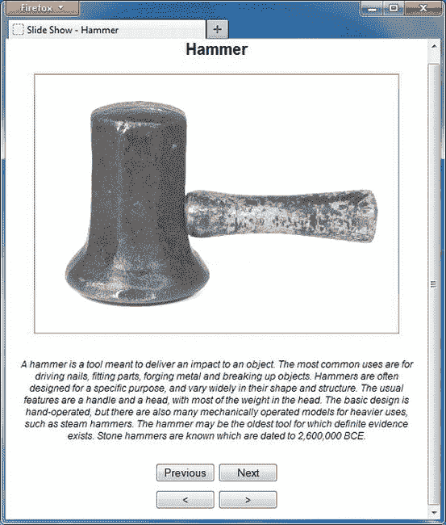

# 六、使用历史 API 和自定义数据属性

每当您在 web 应用的不同页面之间导航时，浏览器都会维护您访问过的页面的历史记录。您可以使用浏览器的后退和前进按钮浏览历史记录。JavaScript 代码可以通过`History`对象访问相同的历史。虽然`History`对象并不是 HTML5 中的新增内容，但是它有一些值得了解的增强功能。特别是在 Ajax 驱动的应用中，新的历史 API 可以证明是非常有用的。Ajax 驱动的应用通常会更改网页内容，而不会为页面中呈现的每个不同内容生成唯一的 URL。这不仅会导致书签网址和实际内容之间的不匹配，还会使搜索引擎难以跟踪内容。与其他 HTML5 APIs 相比，History API 提供了一个小的对象模型，但是当 web 应用需要同步浏览器地址栏中显示的 URL 和页面内容时，所提供的功能通常是可取的。

在讨论了传统历史管理的问题以及 HTML5 如何解决它们之后，本章继续讨论另一个有用的主题:定制数据属性，或`data-*`属性。标准 HTML 属性是由 HTML 规范预先定义的，通常会以某种方式影响元素的行为或外观。自定义数据属性是开发人员定义的属性，可用于存储元素的元数据信息。然后可以使用客户端脚本访问这些信息。

本章讨论的关键主题包括以下内容:

> *   `History` object and its HTML5 enhancement function
> *   Scenes where historical tracking may be problematic
> *   Add history entries using HTML5 history API
> *   Define custom data attributes on HTML elements (`data-*`
> *   Use plain JavaScript and jQuery to access custom data attributes

### 历史对象

每当您浏览 web 应用的页面时，浏览器都会以`History`对象的形式跟踪您的访问。你可以通过 DOM 窗口对象的`history`属性访问`History`对象。在 HTML 4.01 中，`History`对象只有一个属性和三个方法，如表 6-1 所述。

开发人员不经常使用`History`对象，因为用户通常使用浏览器的后退和前进按钮来浏览历史。然而，如果出于某种原因需要，表 6-1 中描述的属性和方法可用于以编程方式导航至历史条目。

为了演示`History`对象的用法，让我们在 ASP.NET MVC 中开发一个简单的幻灯片放映应用。幻灯片应用显示一些木工工具的图像及其描述，如图图 6-1 所示。

***图 6-1。**幻灯片放映应用的用户界面*

在图 6-1 中可以看到，页面底部有四个按钮，排列成两排。最上面一行按钮(上一页和下一页)使页面被提交回服务器，然后根据单击的按钮显示上一张幻灯片或下一张幻灯片。底部一排按钮(<和>)分别使用`History`对象来向后或向前导航。幻灯片放映应用使用的 URL 模式如下:

`[`localhost:1065/home/index/2`](http://localhost:1065/home/index/2)`

在这个 URL 中，`home`是 MVC 控制器名，`index`是处理获取幻灯片的服务器端逻辑的动作方法，`2`是正在显示的幻灯片的 ID。对于不同的幻灯片，URL 末尾的 ID 是不同的。

 **注意**您可能想知道为什么您要构建一个完整的数据库驱动的应用，只是为了说明`History`对象的几个方法。您将从这个项目开始，演示在非 Ajax 应用中使用`History`对象；然后将它转移到 Ajax 来查看出现的问题，最后您会看到`History`对象的新功能如何解决这个问题。

幻灯片放映应用将其数据存储在名为`ImageDb`的 SQL Server 数据库中。`ImageDb`数据库包含一个单独的表——`Images`——存储图像信息，比如标题、描述和图像 URL。图 6-2 显示了`Images`表的实体框架数据模型。

***图 6-2。**实体框架数据模型为`Images`表*

如图 6-2 所示，图像数据模型类有四个属性:`Id`、`Title`、`Description`和`ImageUrl`。`Id`列是`Images`表的主键。

应用的主`Controller`类(`HomeController`)只包含一个动作方法— `Index()`。`Index()`动作方法的框架如图清单 6-1 所示。为了简单起见，省略了从数据库中检索图像信息的代码。

***清单 6-1。** `Index()`动作方法*

`public ActionResult Index(int id=0)
{
    ImageDbEntities db = new ImageDbEntities();
    IQueryable<Image> data = null;
    ...
    ...
**    return View(data.SingleOrDefault());**
}`

`Index()`动作方法接受一个可选的整数参数，该参数表示一个图像 ID。如果提供了该参数，将显示具有该特定 ID 的图像；否则，显示来自`Images`表的第一幅图像。

“上一张”和“下一张”按钮将表单提交给服务器，并显示上一张或下一张幻灯片。为了浏览浏览器历史，您需要处理<和>按钮的`click`事件，并分别调用`History`对象的`back()`和`forward()`方法。清单 6-2 展示了这是如何实现的。

***清单 6-2。**调用`back()`和`forward()`方法*

`$(document).ready(function () {
  $("#btnBackward").click(function () {
    window.history.back();
  });
  $("#btnForward").click(function () {
    window.history.forward();
  });
});`

可以看到，`btnBackward`按钮的`click`事件处理程序调用了`History`对象的`back()`方法，而`btnForward`按钮的`click`事件处理程序调用了`History`对象的`forward()`方法。

要查看`back()`和`forward()`方法是如何工作的，运行应用并使用上一页和下一页按钮浏览幻灯片。然后尝试点击<和>。浏览器地址栏会根据单击的按钮反映相应的幻灯片 URL。您也可以使用浏览器的后退和前进导航按钮来验证行为。

### 了解历史跟踪问题

上一节讨论的`History`对象实际上是通过浏览器地址栏、超链接、导航菜单或代码来跟踪您访问的 URL。例如，每次在幻灯片放映应用中单击“上一个”或“下一个”按钮时，浏览器地址栏都会显示不同的 URL。这是可能的，因为您将整个表单提交给服务器。换句话说，每张幻灯片都有一个唯一的 URL。但是，可能会出现这样的情况，即页面内容和它的 URL 之间的一对一映射无法保持。考虑以下情况:

> *   You are developing an application based on Web forms, and the logic for displaying different slides is embedded in the event handlers of `click` previous and next buttons on the server side. You use a web form to display all the slides. Whenever you click the "Previous Page" or "Next Page" button, a `Image` control on the page will be updated with a new picture. Therefore, all slides have the same URL. In this case, there is no one-to-one match between the slide and URL. If Ajax technology is used, such as jquery `$.Ajax()` method or ASP.NET Ajax extension, the complete page will not be submitted to the server. Instead, you make an Ajax call to the server and retrieve the next or previous slide. In this case, there is no unique URL for each slide.

在这两种情况下，浏览器历史记录为页面中显示的所有幻灯片记录一个 URL。因为一个 URL 代表所有的幻灯片，所以用户不能为特定的幻灯片添加书签。用户可以为页面添加书签，认为正在为特定幻灯片添加书签；但是如果书签被访问，它总是显示第一张幻灯片，因为所有幻灯片都有相同的 URL。为了更清楚地理解这个问题，让我们将之前开发的幻灯片放映应用转换成 Ajax 驱动的应用，以便使用 jQuery `$.Ajax()`方法加载幻灯片，而无需刷新整个页面。

幻灯片放映应用的 Ajax 版本由一个名为`AjaxHomeController`的控制器组成，该控制器包含`Index()`动作方法，如清单 6-3 所示。

***清单 6-3。**`Index()``AjaxHomeController`*的动作方法

`public ActionResult Index()
{
    ImageDbEntities db = new ImageDbEntities();
    IQueryable<Image> data = null;
    ...
    return View(data.SingleOrDefault());
}`

这一次，`Index()`动作方法不接受图像 ID 作为参数，因为最初呈现索引视图时只调用一次`Index()`。之后，通过 Ajax 调用获取各种幻灯片。`Index()`动作方法只是从`Images`表中获取第一张图像，并将其传递给索引视图。

现在,“上一步”和“下一步”按钮不会将表单提交给服务器。相反，单击这些按钮会触发对服务器的 Ajax 调用来获取和显示幻灯片。

要显示上一张或下一张幻灯片，需要处理上一张和下一张按钮的`click`事件处理程序。这些事件处理器如清单 6-4 中的所示。

***清单 6-4。**客户端`click`上一步和下一步按钮的事件处理程序*

`$("#prev").click(function () {
  $.Ajax({
    type: "POST",
    url: "/AjaxHome/GetImage",
    data:'{ id : "' + $("#id").val() + '", direction : "P"}',
    contentType: "application/json; charset=utf-8",
    dataType: "json",
    success: OnSuccess,
    error: OnError
  })
});

$("#next").click(function () {
  $.Ajax({
    type: "POST",
    url: "/AjaxHome/GetImage",
    data: '{ id : "' + $("#id").val() + '", direction : "N"}',
    contentType: "application/json; charset=utf-8",
    dataType: "json",
    success: OnSuccess,
    error: OnError
  })
});`

上一个和下一个按钮的这些`click`事件处理程序使用 jQuery `$.Ajax()`方法来调用`GetImage()`动作方法。`GetImage()`方法需要两个参数:当前图像的 ID 和方向(`N`=下一个或`P`=上一个)。`GetImage()`然后返回一个代表上一张或下一张图像的`Image`对象。`OnSuccess()`函数简单地读取`Image`对象属性并相应地显示一张幻灯片。清单 6-5 显示了`OnSuccess()`功能。

***清单 6-5** `. OnSuccess()`功能*

`function OnSuccess(image) {
  $("#id").val(image.Id);
  $("#title").html(image.Title);
  $("#desc").html(image.Description);
  $("#img").attr("src",image.ImageUrl);
  $("#divMsg").html("History Length : " + history.length);
}`

`OnSuccess()`接收从`GetImage()`动作方法返回的`Image`对象。然后将`Title`、`ImageUrl`和`Description`分配给适当的 HTML 元素。一个`
`元素还显示了`History`对象中条目的数量来证明这一点。

使用`$.Ajax()`调用调用的`GetImage()`动作方法的框架如清单 6-6 所示。

***清单 6-6。** `GetImage()`动作方法*

`public JsonResult GetImage(int id,string direction)
{
    ImageDbEntities db = new ImageDbEntities();
    IQueryable<Image> data = null;
    ...
    return Json(data.SingleOrDefault());
}`

`GetImage()`接受图像的 ID 和方向。然后，它在指定的方向上查找下一个或上一个图像。如果没有指定方向，它将获取一个具有指定 ID 的图像。`GetImage()`的返回类型为`JsonResult`。`Json()`方法将一个`Image`对象转换成它的 JSON 等价物，并将其返回给调用者。

现在，要理解本节开始时讨论的问题，请运行新的幻灯片放映应用，并使用“上一页”和“下一页”按钮浏览幻灯片。图 6-3 显示了浏览器中显示的幻灯片 2，但是地址栏仍然显示了基本 URL。

***图 6-3。**改变当前幻灯片不会改变地址栏中的网址。*

因为您正在使用`$.Ajax()`获取幻灯片，所以浏览器地址栏不会改变 URL。完成后，尝试点击<和>按钮。即使你浏览了所有的幻灯片，你也不会前进或后退，因为浏览器在`History`对象中只有一个条目:`[`localhost:1065/Ajaxhome`](http://localhost:1065/Ajaxhome)`。

#### 对浏览器书签的影响

前一节中描述的历史跟踪问题也对书签有不适当的影响。假设用户在幻灯片 3 上，该幻灯片显示了关于扳手的信息。用户可能希望稍后重新阅读相同的信息，因此向该页面添加书签，以为幻灯片 3 已经被书签标记。但是，因为不同的幻灯片没有唯一的 URL，所以浏览器会在基本 URL ( `[`localhost:1065/Ajaxhome`](http://localhost:1065/Ajaxhome)`)中添加一个书签。下次用户访问该书签时，将显示第一张幻灯片，而不是第三张，因为服务器从数据库中为 URL 发送第一张幻灯片。

#### 对搜索引擎列表的影响

幻灯片应用也有一个缺点，没有一个网站管理员希望他们的应用有这个缺点。因为显示的所有幻灯片只有一个 URL，所以搜索引擎只捕获和列出这个 URL。如果每张幻灯片都有自己唯一的 URL(就像您之前开发的非 Ajax 版本一样)，那么搜索引擎就可以列出数据库中的所有幻灯片。为了允许用户搜索和找到唯一的信息，您需要为每条独立的信息提供一个唯一的 URL 在本例中，是每张单独的幻灯片。当前形式的幻灯片放映应用的 Ajax 版本违反了这一建议，影响了应用的搜索引擎列表。

### 解决方案

既然您已经理解了 Ajax 驱动的应用在跟踪历史、书签和搜索引擎列表方面所面临的问题，那么让我们来讨论一下可能的解决方案。前面讨论的所有问题领域的基本原因是没有唯一的 URL 来标识独立的内容片段。要解决这些问题，您需要为每条这样的信息创建唯一的 URL。就 Ajax 应用而言，有两种方法可以生成这样的 URL:

> *   Use the hash fragment in the URL
> *   Use the new HTML5 history API

#### 在 URL 中使用散列片段

这种技术包括通过在基本 URL 的末尾添加一个散列片段来生成 URL。例如，考虑以下 URL:

`[`localhost/slideshow.aspx#slideid=3`](http://localhost/slideshow.aspx#slideid=3)`

在该地址中，使用`#`将幻灯片 ID 附加在基本 URL 之后。浏览器忽略`#`之后的所有信息，不向服务器发送单独的请求。但是，这仍然是一个唯一的 URL。您可以在`#`片段中追加任意数量的键值对，就像查询字符串一样；唯一的限制是查询字符串的大小限制。一旦您创建了一个散列片段的 URL，您就可以使用标准的导航技术导航到它(例如，单击一个超链接或以编程方式调用`window.location.href`)。然后，您需要编写 JavaScript 代码来读取散列片段数据，并相应地显示页面内容。

虽然散列片段的 URL 似乎解决了这个问题，但是它们也引入了自己的问题:

> *   With the increase of the amount of data you want to transfer, processing hash fragments often becomes too complicated. Some JavaScript libraries can help you with this work, but in general, the code will become tricky for the URL of hash fragments.
> *   The website becomes too complicated to remember easily. Although most web applications don't want you to remember the URLs of individual pages (they have navigation menus), in some cases, easy-to-remember URLs are very useful. For example, consider a social networking application such as Facebook. Facebook provides a shorter profile URL, which is easier to remember than the traditional profile URL with complex ID in the query string. If you use the URL of the hash fragment, your processing logic may be tied to the hash fragment parameter. If you add, remove or change these parameters, you may need to update the code because of these changes.
> *   Although hash fragment URLs are widely used in Ajax-driven web applications, search engines may treat them differently. For example, Google expects the hash fragmented URL data to start with `#!` (a hash symbol followed by an exclamation point). Once you do this, your application is considered graspable.

 **注意**ASP.NET Ajax 扩展使用散列片段技术为多个 Ajax 请求生成 URL。`ScriptManager`服务器控件通过它的`EnableHistory`属性使你很容易生成和处理散列片段的 URL。

#### HTML5 历史 API

当需要为单个 Ajax 请求创建不同的 URL 时，HTML5 可以帮上忙。使用 HTML5 历史 API，您可以以编程方式向浏览器历史添加条目。这些以编程方式添加的 URL 条目不需要实际存在于服务器上。当您导航到通过历史 API 添加的条目时，浏览器会引发一个事件，让您有机会同步 URL 和页面内容。通过处理该事件，您可以从服务器获取相关内容并将其呈现在页面上。如果您使用 HTML5 历史 API，就没有必要使用散列片段的 URL——您可以避免所有相关的复杂性。如果用户将这样一个以编程方式添加的 URL 加入书签，并在以后导航到该 URL，则该请求将作为一个新的请求发送到服务器，您需要在服务器上处理它。

### 了解历史 API

在本章的前面，你已经了解了`History`对象(见表 6-1 )。HTML5 `History` API 本质上向传统的`History`对象添加了两个方法和一个事件。这些新方法和事件在表 6-2 中列出。

要了解如何使用新的历史 API，您可以修改之前开发的 Ajax 版本的幻灯片放映(MVC)应用。回想一下，幻灯片放映应用使用 jQuery `$.Ajax()`方法向服务器端`GetImage()` action 方法发出 Ajax 请求并检索幻灯片。还记得浏览器地址栏显示相同的基本应用 URL，即使向用户显示不同的幻灯片。为了便于理解，幻灯片放映应用的`OnSuccess()`功能在清单 6-7 中再次给出。

***清单 6-7。** `OnSuccess()`没有 HTML5 历史 API 的函数*

`function OnSuccess(image) {
  $("#id").val(image.Id);
  $("#title").html(image.Title);
  $("#desc").html(image.Description);
  $("#img").attr("src",image.ImageUrl);
  $("#divMsg").html("History Length : " + history.length);
}`

 **注意**为了您的方便，源代码下载包含了三个版本的幻灯片放映 MVC 应用。控制器名称分别为`HomeController`、`AjaxHomeController`和`HTML5HomeController`。在尝试这个例子时，您可以修改`AjaxHomeController`及其索引视图，而不是从头开始。

要使用 HTML5 历史 API，你需要修改`OnSuccess()`函数，如清单 6-8 所示。

***清单 6-8。** `OnSuccess()`功能使用`pushState()`方法添加一个历史条目*

`function OnSuccess(image) {
  $("#id").val(image.Id);
  $("#title").html(image.Title);
  $("#desc").html(image.Description);
  $("#img").attr("src", image.ImageUrl);

**  history.pushState(image, image.Title, "/HTML5Home/index/" + image.Id);**
  $("#divMsg").html("History Length : " + history.length);
}`

`OnSuccess()`函数接收由`GetImage()`动作方法返回的 JSON 对象，该对象表示来自数据库的图像。在分配了图像细节，如`Title`、`Description`和`ImageUrl`之后，使用`pushState()`方法向`History`对象添加一个条目。`pushState()`的第一个参数是您希望在`popstate`事件处理程序中访问的状态信息。这里，代码将整个`Image` JSON 对象作为状态信息传递。第二个参数是分配给这个历史条目的标题。该标题通常显示在浏览器的历史菜单或对话框中。第三个参数是与这个历史条目相关联的 URL。浏览器只是将这个 URL 放在地址栏中，而没有导航到它。此外，浏览器不会检查 URL 是否真的存在于服务器上。由您来决定 URL 应该是什么。幻灯片放映应用使用的 URL 的形式是`/index/<image_id>`。稍后您修改`Index()`动作方法来处理传递的图像 ID。

接下来，您需要处理`popstate`事件，以便当您导航到一个历史条目时，您可以根据历史状态信息生成幻灯片。这样，您可以将当前幻灯片与地址栏中显示的 URL 同步。清单 6-9 展示了如何处理`popstate`事件。

***清单 6-9。**处理`popstate`事件*

`$(document).ready(function () {
  if (!Modernizr.history) {
    alert("This browser doesn't support the HTML5 History API!");
  }
  else {
    window.onpopstate = OnPopState;
  }
...
});

function OnPopState(evt) {
  $.Ajax({
    type: "POST",
    url: "/HTML5Home/GetImage",
    data: '{ id : "' + evt.state.Id + '", direction : "" }',
    contentType: "application/json; charset=utf-8",
    dataType: "json",
    success: function (image) {
      $("#id").val(image.Id);
      $("#title").html(image.Title);
      $("#desc").html(image.Description);
      $("#img").src = image.ImageUrl;
    },
    error: OnError
  })
}`

记住，`popstate`事件是为`window`对象引发的，因此您将一个事件处理函数`OnPopState`附加到窗口。请注意如何检测对历史 API 的支持。`OnPopState`函数使用`$.Ajax()`对`GetImage()`进行 Ajax 调用。回想一下，在调用`pushState()`方法时，您将`Image` JSON 对象指定为历史状态。可以使用`evt`参数的`state`属性来检索同一个`Image` JSON 对象。然后将要获取的图像的 ID 传递给`GetImage()`方法。在成功完成 Ajax 调用后，诸如`Title`、`Description`和`ImageUrl`之类的`Image`细节被分配给各个`<form>`元素。

最后，更改`Index()`动作来处理可选的图像 ID。清单 6-10 显示了`Index()`的修改版本。

***清单 6-10。** `Index()`动作方法，现在负责可选的图像 ID*

`public ActionResult Index(int id=0)
{
    ImageDbEntities db = new ImageDbEntities();
    IQueryable<Image> data = null;
    if (id == 0)
    {
        data = (from item in db.Images` `                orderby item.Id ascending
                select item).Take(1);
    }
    else
    {
        data = from item in db.Images
                where item.Id == id
                select item;
    }
    return View(data.SingleOrDefault());
}`

`Index()`动作方法现在检查是否传递了一个图像 ID。如果是，它返回一个具有指定 ID 的图像；否则，返回数据库中的第一幅图像。

图 6-4 显示了修改后的幻灯片放映应用的运行示例。请注意浏览器地址栏是如何为每张幻灯片显示唯一的 URL 的。

***图 6-4。** HTML5 `pushState()`方法改变地址栏中的网址*

浏览器的历史菜单或对话框也列出了通过`pushState()`方法添加的 URL，如图图 6-5 所示。

***图 6-5。**浏览器的历史对话框显示通过`pushState()`方法添加的网址*

 **注意**即使提到了，也不是所有的浏览器都使用`pushState()`方法的`title`参数。例如，图 6-5 中的历史对话框显示所有 URL 的标题为“幻灯片-锤子”,即使它们的位置不同。未来版本的浏览器可能会使用此参数。

### 浏览器支持

除了 Internet Explorer 9，几乎所有主流浏览器都支持 HTML5 历史 API。与 HTML5 的任何其他特性一样，使用 Modernizr 检查浏览器是否支持历史 API 总是一个好的做法。幻灯片放映应用包括该检查，如清单 6-11 中的所示。

***清单 6-11。**使用 Modernizr 检查对历史 API 的支持*

`if (!Modernizr.history) {
    alert("This browser doesn't support HTML5 History API!");
}`

如果一个浏览器不支持 HTML5 历史 API，你的应用可能还能工作，但是它不会在历史中添加任何条目；它也不会改变地址栏。如果您希望提供某种回退，您可以求助于以下两个选项之一:

> 像在第一个非 Ajax 版本的幻灯片放映应用中一样，使用全页面刷新。*   Use the hash fragment URL technique discussed earlier.

### 自定义数据属性

HTML 标记元素使用属性来指定配置信息。例如，`<canvas>`元素的`height`和`width`属性决定了画布在浏览器中显示时的高度和宽度。HTML 元素的大多数属性都会影响用户界面或元素的视觉显示。

在开发 web 应用时，开发人员经常发现有必要向客户端浏览器发出有关元素的元数据。这样的元数据不会直接影响元素的显示。然而，元数据保存了与该元素相关的信息。

考虑一个使用定制 JavaScript 代码验证 HTML 表单的例子。当 JavaScript 代码验证表单字段时，如果任何字段包含无效值，就会显示验证错误。通常，错误消息文本直接嵌入在 JavaScript 代码中。但是，如果在部署之后要更改错误消息文本，该怎么办呢？将错误消息文本直接嵌入脚本需要编辑脚本。这相当于改变了应用的代码库。在这种情况下，如果错误消息文本与网页分开存储(比如说，存储在数据库表中)会很有帮助。在运行时，可以从数据库中检索错误消息，并发送给客户端。这些发出的消息构成了 HTML 元素的元数据。如果需要对错误消息进行任何更改，您可以更改数据库条目，应用将在下次运行时开始使用新值。

在 HTML5 之前，没有处理这种元数据信息的标准。HTML5 引入了自定义数据属性，可用于定义元素的元数据。

#### 自定义数据属性概述

HTML5 自定义数据属性是采用以下形式的特殊属性:

`data-<name>="value"`

自定义数据属性总是以`data-`开头，后跟开发人员定义的名称。例如，对于前面讨论的定制验证场景，您可以创建一个名为`data-errormessage`的定制数据属性。

开发人员定义的名称可以包含连字符(`-`)。例如，`data-customer-id`和`data-customer-name`是有效的自定义数据属性。自定义数据属性也称为`data-*`属性，因为它们遵循命名约定。一个`data-*`属性可以像任何其他 HTML 属性一样被赋值。ASP.NET 广泛使用`data-*`属性在 web 表单和 MVC 应用中提供无障碍验证。

 **注意** *无阻碍验证*是 ASP.NET 实现的一种技术，使用数据注释属性和 jQuery。在这种模式下，数据模型用数据注释属性来修饰，这些属性对数据模型属性值执行验证。在运行时，ASP.NET 基于这些数据注释属性发出`data-*`属性。客户端验证是在这些`data-*`属性和 jQuery 的帮助下执行的。

与标准的 HTML 属性不同，`data-*`属性不会影响元素的视觉外观。事实上，浏览器不会出于任何目的自动使用它们。您需要以编程方式访问它们，并对它们执行预期的逻辑。一个 HTML 元素可以定义任意数量的`data-*`属性。

尽管您可以为任何定制需求使用`data-*`属性，但是如果使用标准 HTML 属性可以达到同样的目的，您应该避免使用它们。例如，假设您希望在用户将鼠标指针悬停在某个元素上时显示该元素的工具提示。工具提示根据编程条件而变化。在这种情况下，最好使用 HTML `title`属性，而不是创建一个新的`data-*`属性。

清单 6-12 显示了一些使用自定义数据属性的 HTML 标记示例。

***清单 6-12。**使用自定义数据属性*

`<table border="1" cellpadding="3">
    <tr id='emp1' data-employeeid='1' data-title='Sales Representative'>
           <td>Nancy</td>
           <td>Davolio</td>
    </tr>
    <tr id='emp2' data-employeeid='2' data-title='Vice President, Sales'>
           <td>Andrew</td>
           <td>Fuller</td>
    </tr>
    ...
</table>`

这个清单显示了一个包含雇员数据的 HTML 表。每个表格行包含雇员的姓名，另外还有两个自定义数据属性:`data-employeeid` `and data-title`。`data-employeeid`属性存储员工的`EmployeeID`，`data-title`属性存储员工的职位。

#### 使用 JavaScript 访问自定义数据属性

现在您已经知道了什么是定制数据属性，让我们看看如何在 JavaScript 代码中访问它们。考虑一下清单 6-13 中显示的 JavaScript 代码，它说明了如何使用 JavaScript 代码访问清单 6-12 中使用的`data-*`属性。

***清单 6-13。**访问 JavaScript 代码中的`data-*`属性*

`var emp = document.getElementById('emp1');
alert('Employee ID : ' + emp.getAttribute('data-employeeid'));
alert('Title : ' + emp.getAttribute('data-title'));

emp.setAttribute('data-employeeid', '100');
emp.setAttribute('data-title', 'Senior Manager');
alert('New Employee ID : ' + emp.getAttribute('data-employeeid'));
alert('New Title : ' + emp.getAttribute('data-title'));`

这段代码使用 DOM 文档的`getElementById()`方法获取 ID 为`emp1`的表格行。然后，它使用表 DOM 元素的`getAttribute()`方法检索`data-employeeid`和`data-title`自定义数据属性的值。这些值显示在一个警告框中。此外，代码使用`setAttribute()`方法更改`data-employeeid`和`data-title`的值。更改后的值也会显示在警告框中。

尽管从清单 6-13 中获取和设置`data-*`属性的技术像预期的那样工作，但是 HTML5 提供了一种专门为访问`data-*`属性而设计的技术。HTML5 `data-*`属性通过底层 DOM 元素的`dataset`属性对您的代码可用。清单 6-14 展示了如何使用`dataset`属性来访问`data-*`属性。

***清单 6-14。**使用`dataset`属性访问`data-*`属性*

`var emp = document.getElementById('emp1');
alert('Employee ID : ' + emp.dataset.employeeid);
alert('Title : ' + emp.dataset.title);
emp.dataset.employeeid = '200';
emp.dataset.title = 'Junior Manager';
alert('New Employee ID : ' + emp.dataset.employeeid);
alert('New Title : ' + emp.dataset.title);`

要检索一个`data-*`属性值，只需对`dataset`属性使用不带`data-`的属性名。类似地，要设置一个`data-*`属性值，您可以针对`dataset`属性使用它的名称，并给它赋值。

如果自定义数据属性包含连字符(`-`)，您可以使用骆驼大小写来访问该属性。例如，要访问`data-employee-birthdate`属性，可以使用下面的代码:

`alert('Employee ID : ' + emp.dataset.employeeBirthdate);`

可以看到，属性名包含了`employee-birthdate`。但是当您使用`dataset`属性访问它时，它被称为`employeeBirthdate`。

#### 使用 jQuery 访问自定义数据属性

jQuery 库还通过提供专门处理`data-*`属性的方法来支持访问定制数据属性。清单 6-15 展示了如何使用 jQuery 来检索和分配`data-*`属性值。

***清单 6-15。**使用 jQuery 访问`data-*`属性*

`alert('Employee ID : ' + $("#emp1").data('employeeid'));
alert('Title : ' + $("#emp1").data('title'));

$("#emp1").data('employeeid', '100');
$("#emp1").data('title', 'Senior Manager');

alert('Employee ID : ' + $("#emp1").data('employeeid'));
alert('Title : ' + $("#emp1").data('title'));`

jQuery 库提供了一个`data()`方法来访问定制的数据属性。要检索一个`data-*`属性，您可以在下面的 DOM 元素上调用`data()`，并传递不带`data-`的属性名。例如，清单 6-15 使用`data('employeeid')`来检索`data-employeeid`属性的值。为了给一个`data-*`属性赋值，您调用`data()`方法并提供不带`data-`的属性名及其新值。如果自定义数据属性在名称中包含连字符(`-`)(例如`data-employee-birthdate`，您可以使用相同的 camel-case 语法来访问它，如下所示:

`alert('Title : ' + $("#emp1").data('employeeBirthdate'));`

如果不带任何参数调用`data()`，它将返回一个包含该元素的所有`data-*`属性及其值的键值对对象。清单 6-16 展示了如何使用这种`data()`方法的变体。

***清单 6-16。**使用`data()`方法获取`data-*`属性作为对象*

`var obj = $("#emp1").data();
alert('Employee ID : ' + obj.employeeid);
alert('Title : ' + obj.title);
alert('Birth Date : ' + obj.employeeBirthdate);`

如您所见，调用`data()`方法时没有任何参数。这样做将返回一个具有键值对的对象。要读取特定的`data-*`属性值，可以对返回的对象使用不带`data-`的`data-*`属性名。

 **注意**您还可以使用 jQuery `attr()`方法来获取或设置`data-*`属性。然而，最好使用`data()`,因为它是专门为处理定制数据属性而设计的。

#### 使用自定义数据属性发出验证消息

现在您已经知道了如何使用定制数据属性，让我们开发一个 Web 表单应用，演示如何借助`data-*`属性实现本节开始时讨论的验证场景。在本节中，你开发一个如图图 6-6 所示的 web 表单。

***图 6-6。**员工列表网页表单*

web 表单显示了来自`Northwind`数据库的`Employees`表中的雇员姓名以及他们的`BirthDate`和`HireDate`值。用户可以选择相应的日期，然后单击保存按钮。单击“保存”会触发验证逻辑，该逻辑会检查员工在雇用时是否至少年满 18 岁。否则，将在警告框中向用户显示一条错误消息。验证消息没有嵌入代码的任何地方；相反，它存储在一个名为`ErrorMessages`的数据库表中。`ErrorMessages`表结构简单，如其实体框架数据模型所示(图 6-7 )。

***图 6-7。**`ErrorMessages`表*的数据模型

如您所见，`ErrorMessages`表包含三列:`Id`、`ErrorCode`和`ErrorMessageText`。`ErrorCode`列包含错误的简短代码(如`INVALIDDATE`),`ErrorMessageText`列包含描述性错误消息(例如，“雇佣日期必须晚于出生日期”)。清单 6-17 显示了呈现雇员列表的`Repeater`服务器控件的`ItemTemplate`的标记。

***清单 6-17。**显示员工列表的 Web 表单标记*

`<ItemTemplate>
  <tr id='<%# Eval("EmployeeID","emp{0}") %>'
                     data-employeeid='<%# Eval("EmployeeID") %>'>
    <td><%# Eval("FirstName") %> <%# Eval("LastName") %></td>
    <td><asp:TextBox ID="txtBirthDate" runat="server" TextMode="Date"
            Text='<%# Eval("BirthDate") %>'
            data-error-invaliddate='<%# GetValidationMessage("INVALIDDATE") %>'>
           </asp:TextBox></td>
    <td><asp:TextBox ID="txtHireDate" runat="server" TextMode="Date"
             Text='<%# Eval("HireDate") %>'
             data-error-invaliddate='<%# GetValidationMessage("INVALIDDATE") %>'>
            </asp:TextBox></td>
    <td><input type="button" value="Save"/></td>
  </tr>
</ItemTemplate>`

这个标记由两个分别显示`BirthDate`和`HireDate`列值的`TextBox`服务器控件组成。这些文本框的`TextMode`属性被设置为`Date`，以便显示一个日期选择器来选择日期。每个文本框都有一个名为`data-error-invaliddate`的自定义数据属性。这个属性的值来自于`GetValidationMessage()`函数。`GetValidationMessage()`根据传递的`ErrorCode`从`ErrorMessages`台拾取`ErrorMessageText`:

`public string GetValidationMessage(string errorCode)
{
    ValidationDbEntities db = new ValidationDbEntities();

    var data = from item in db.ErrorMessages
                where item.ErrorCode == errorCode
                select item.ErrorMessageText;
    return data.SingleOrDefault();
}`

执行验证并显示验证错误(如果有的话)的 jQuery 代码驻留在 Save 按钮的`click`事件处理程序中。该代码如清单 6-18 中的所示。

***清单 6-18。**验证员工的年龄*

`$("input[value='Save']").click(function () {
  var birthDateTxtbox = $(this).closest('tr').children().eq(1).children().eq(0);
  var hireDateTxtbox = $(this).closest('tr').children().eq(2).children().eq(0);
  var birthDate = ToDate($(birthDateTxtbox).val());
  var hireDate = ToDate($(hireDateTxtbox).val());
  birthDate.setFullYear(birthDate.getFullYear() + 18);

  if ((hireDate.getTime() - birthDate.getTime()) < 0) {` `    alert($(birthDateTxtbox).data('errorInvaliddate'));
    return;
  }

  //make $.Ajax() request to update the database
  alert('Data saved!');
});`

保存按钮的`click`事件处理程序首先获取对`BirthDate`和`HireDate`输入字段的引用。`closest()`方法返回保存输入字段和保存按钮的行。`children()`方法返回表格行的所有子元素。然后，`eq()`方法返回指定索引处的表格单元格。因为输入字段在表列中，所以需要再次调用`children()`和`eq()`方法来获取相应的输入字段。

输入字段保存 yyyy-MM-dd 格式的日期值。使用定制函数`ToDate()`将这些日期转换成 JavaScript `date`对象。`ToDate()`函数看起来像这样:

`function ToDate(input) {
  var parts = input.match(/(\d+)/g);
  return new Date(parts[0], parts[1] - 1, parts[2]);
}`

`ToDate()`应该很熟悉，因为你在第五章里用过。它主要解析提供的输入值，并返回一个表示该值的 JavaScript `date`对象。

接下来，代码检查`HireDate`和`BirthDate`之间的差异，以确定雇员在被雇用时是否至少 18 岁。否则，在`data-error-invaliddate`自定义数据属性中指定的错误信息将在警告框中显示给用户。jQuery `data()`方法用于检索`data-error-invaliddate`属性的值。

虽然代码实际上没有将更改的数据保存到服务器，但是如果年龄验证成功，您可以添加该功能。在清单 6-18 中，年龄检查成功后会显示一条成功消息。

### 总结

HTML5 History API 是一个相对较小的改进领域，但它在某些情况下会派上用场。特别是，现代 web 应用广泛依赖 Ajax 技术来呈现页面内容，而无需刷新整个页面。同时，他们需要关注搜索引擎优化和用户体验。新的 HTML5 历史 API 允许您以编程方式在历史中添加条目。这样，您也可以更改浏览器地址栏中显示的 URL。当您在历史中导航时，历史 API 让您有机会将页面内容与导航到的 URL 同步。HTML5 历史 API 不仅提供了处理历史条目的标准方法，还消除了实现中的复杂性。

自定义数据属性(`data-*`)允许您嵌入关于 HTML 元素的元数据。它们不会被浏览器处理，也不会直接影响元素的行为。您可以使用 DOM 元素的`dataset`属性或 jQuery `data()`方法来访问`data-*`属性。

虽然 History API 和 custom data 属性允许您分别处理会话历史和元数据，但是也经常需要存储和检索会话数据。传统上，cookies 被用来在客户端存储这样的数据。下一章考察了所谓的 *web 存储*——在客户端本地存储和检索数据的能力。