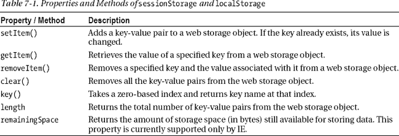
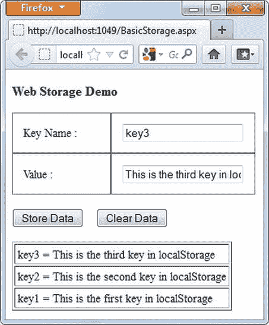
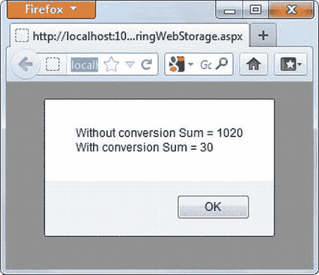
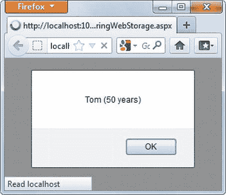
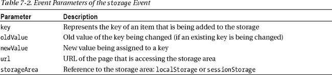
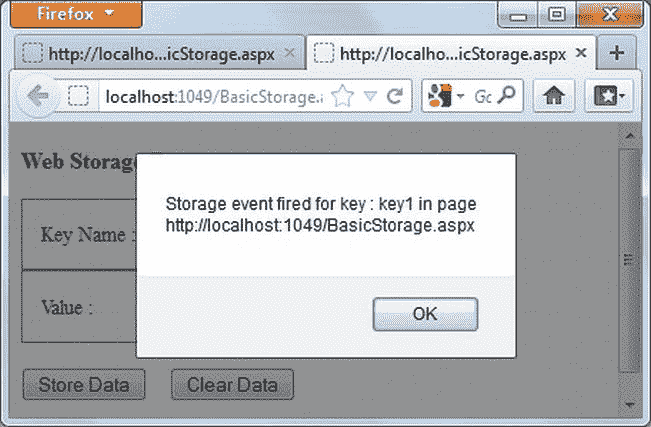
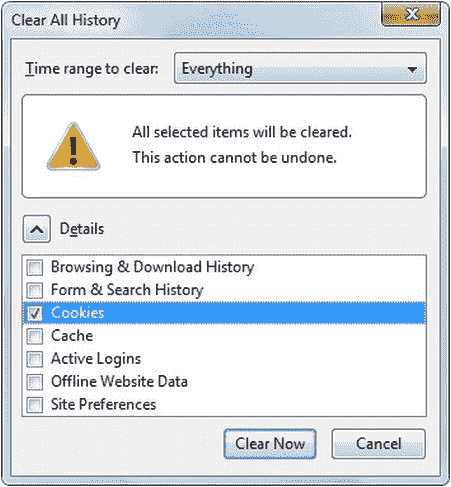
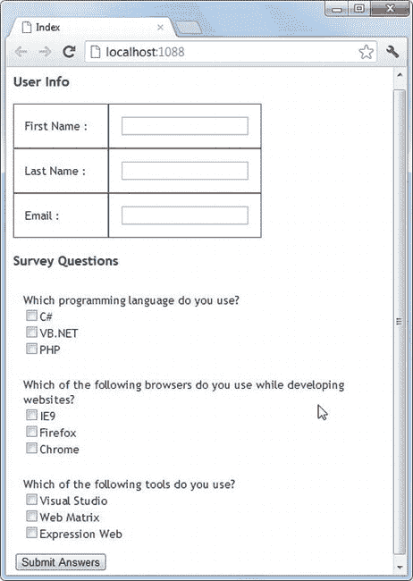
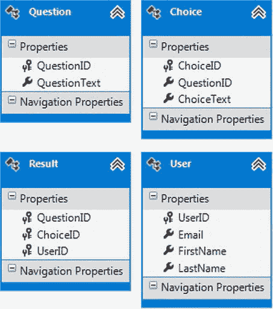
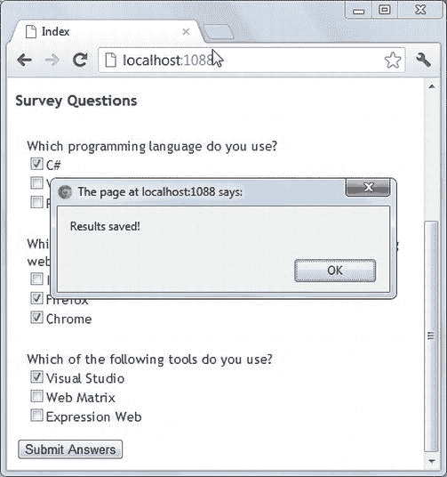

# 七、在 Web 存储器中存储数据

今天开发的大多数网站都以这样或那样的形式处理数据。自然，这些应用数据需要某种存储机制。就服务器而言，有 SQL Server 等成熟的数据库引擎。然而，在客户端存储数据可能很棘手。传统上，开发人员使用 cookie 在客户端保存数据，但是 cookie 有其自身的局限性。为了在客户端提供简化的数据存储机制，HTML5 提供了 web 存储。本章探讨了什么是 web 存储以及可以使用它的情况。具体来说，您将了解以下内容:

> *   What is web storage?
> *   Style of web storage
> *   Store items in the web store, retrieve items from it, and delete items from the web store.
> *   Storing non-string data in web storage
> *   Transfer data from the web store to the server for further processing.

### 网络存储概述

术语 *web 存储*指的是 HTML5 的客户端数据存储机制。Web 存储允许您在客户端将数据存储为键值对。W3C 建议每个源的 web 存储大小限制为 5MB(参见“Web 存储的安全性考虑”一节以了解更多关于源的信息)。但是，个别浏览器可能会稍微偏离这一限制。例如，IE8 允许高达 10MB 的网络存储。

虽然 web 存储和 cookies 都在客户端存储数据，但它们的工作方式不同。对于来自给定网站的每个请求，Cookies 都在客户机和服务器之间传递。另一方面，web 存储永远不会自动传递给服务器。如果您需要将数据从 web 存储传输到服务器端代码，您必须求助于编程方法，比如 jQuery 调用服务器端代码或隐藏的表单字段。此外，与 cookies 不同，您不能为 web 存储设置过期时间。您要么需要编写代码来删除陈旧的项目，要么依靠用户使用浏览器中的选项来删除陈旧的项目。

Web 存储有两种风格:会话存储和本地存储。这两种类型分别作为`window`对象的`sessionStorage`和`localStorage`属性公开。正如您可能已经猜到的那样，只要当前浏览器(或其选项卡)实例正在运行，会话存储就会一直存在。当您关闭浏览器实例(或选项卡)时，数据将被删除。如果您稍后再次加载网站，它将无法访问任何先前存储的数据。会话存储适合于单个事务。与会话存储不同，本地存储跨浏览器的多个实例存储数据，也存储当前会话之外的数据。

总之，在以下情况下，web 存储是不错的选择

> *   You need to store data that exceeds the cookie-based storage size limit.
> *   You don't need to pass data back and forth to the server every time you request.
> *   You don't need to set any specific expiration time for data.

但是，在以下情况下，web 存储可能不是一个好的选择

> *   You want to store a large amount of data.
> *   Your data is not easily stored as key-value pairs (such as binary data or BLOBS).
> *   The data to be stored is sensitive.

### 会话存储和本地存储对象

如前所述，`sessionStorage`和`localStorage`对象将数据存储为键值对。这两个对象具有相似的属性和方法。表 7-1 列出了它们，供您快速参考。

现在您对会话存储和本地存储有了一些了解，让我们在 Web 窗体应用中尝试这些属性和方法。

 **注意**您也可以使用普通的 HTML 页面测试`sessionStorage`和`localStorage`对象，但是在这种情况下，您必须在互联网信息服务(IIS)中托管它们。除非您的页面是网站的一部分，否则浏览器无法确定它们的原始域，因此无法为它们分配存储空间。您将在本章的后面了解这些安全限制。

### 使用 sessionStorage 和 localStorage 对象

在本节中，您将创建如图 7-1 所示的简单 web 表单。

***图 7-1。**使用`localStorage`对象的简单 web 表单*

web 表单允许您在`localStorage`对象中存储键值对。它由两个文本框组成，用户可以分别在其中输入键和值。点击存储数据按钮，将一个键及其值存储在`localStorage`对象中。底部表格中显示了所有键及其值的列表。点击清除数据按钮从`localStorage`中删除所有条目。清单 7-1 展示了两个按钮的`click`事件处理程序如何处理`localStorage`对象。

***清单 7-1。**使用`localStorage`对象*

`var storage = window.localStorage;

$(document).ready(function () {
    if (!Modernizr.localstorage) {
      alert("This browser doesn't support HTML5 Local Storage!");
    }
    $("#store").click(OnStoreClick);
    $("#clear").click(OnClearClick);
});` `function OnStoreClick(event) {
    var key = $("#keyName").val();
    var value = $("#keyValue").val();
    storage.setItem(key, value);
    $("#tblItems").empty();
    for (var i = 0; i < storage.length; i++)
    {
       $("#tblItems").append("<tr><td>" + storage.key(i) + " = " +
       storage.getItem(storage.key(i)) + "</td></tr>");
    }
}

function OnClearClick(event) {
    storage.clear();
    $("#tblItems").empty();
}`

这段代码首先在变量`storage`中存储对`localStorage`对象的引用。这样，您就不需要总是使用`window.localStorage`语法来调用`localStorage`对象的方法。另外，如果你决定测试`sessionStorage`而不是`localStorage`，你可以只修改这一行代码，其余的代码会自动使用`sessionStorage`对象。注意如何使用 Modernizr 检查对`localStorage`的支持。如果您希望检查对`sessionStorage`的支持，您可以使用`Modernizr.sessionstorage`属性。

jQuery `ready`事件处理程序用事件处理函数`OnStoreClick()`和`OnClearClick()`将两个按钮(存储数据和清除数据)的`click`事件连接起来。

`OnStoreClick()`事件处理函数使用`localStorage`对象的`setItem()`方法在`storage`对象中存储一个键值对。然后它遍历所有的键。在每次迭代中，代码使用`key()`和`getItem()`来检索一个键及其值。然后，键值对被添加到`tblItems`表中。

`OnClearClick()`事件处理函数使用`clear()`方法简单地从存储中删除所有的项目。

### 存储数字、日期和对象

虽然`localStorage`和`sessionStorage`对象允许您存储数据，但是就存储的项目的数据类型而言，它们有一个限制:所有数据都存储为字符串。即使添加数值或日期数据类型的值，它们仍会存储为普通字符串。这一点很重要，因为当您读回数据时，可能需要将其转换为适当的数据类型。在更复杂的情况下，您可能希望将对象存储在 web 存储中。显然，因为 web 存储本身只支持存储字符串数据，所以这些类型的转换是您的责任。

考虑清单 7-2 中的代码片段。

***清单 7-2。**将数字存储在`localStorage`*

`$(document).ready(function () {
  var storage = window.localStorage;
  storage["number1"] = 10;
  storage["number2"] = 20;
  var sum1 = storage["number1"] + storage["number2"];
  var sum2 = Number(storage["number1"]) + Number(storage["number2"]);` `  alert("Without conversion Sum = " + sum1 + "\r\n" +
          "With conversion Sum = " + sum2);
});`

正如你所看到的，两个数字分别用键`number1`和`number2`存储在`localStorage`中。注意，这次代码没有使用`setItem()`和`getItem()`，而是使用熟悉的字典访问语法来存储条目。`sum1`变量存储这两个键的值的和而不执行任何转换，而`sum2`通过首先使用`Number()`函数将它们转换成数字来存储它们的和。一个警告框显示`sum1`和`sum2`的值，如图 7-2 所示。

***图 7-2。**转换后添加数值*

图 7-2 确认了`localStorage`以纯文本格式存储数据，在进一步处理之前，您需要将其转换为合适的数据格式。

存储日期值类似于存储数字，因为您需要将日期字符串转换成 JavaScript `Date`对象。清单 7-3 展示了如何做到这一点。

***清单 7-3。**将日期存储在`localStorage`*

`$(document).ready(function () {
  var storage = window.localStorage;
  storage["date"] = new Date(2012,5,15);
  var date1 = storage["date"];
  try{
    alert("Without conversion Year = " + date1.getFullYear());
  }
  catch(e){
    alert("Data is not of date type!");
  }
  var date2 = new Date(storage["date"]));
  try {
    alert("With conversion Year = " + date2.getFullYear());
  }
  catch (e) {` `    alert("Data is not of date type!");
  }
});`

该代码在`localStorage`中存储一个日期。然后，它尝试访问日期中的年份部分，而不执行任何转换。这将导致错误，如警告框所示。第二次尝试将存储的字符串解析成一个`Date`对象，然后输出它的年份。你可能已经猜到了，第二次尝试给出了正确的结果。

在清单 7-3 中，日期使用默认的 JavaScript 格式存储在`localStorage`对象中(例如，2012 年 3 月 1 日 00:00:00 GMT+0530[印度标准时间])。在许多情况下，您可能使用输入字段作为日期选择器(您可以在中通过将`type`属性设置为 date 来实现)。日期选择器以 yyyy-MM-dd 格式返回日期。这种格式直接存储在`localStorage`中也是安全的，因为以后可以很容易地解析回 JavaScript `Date`对象。

存储对象起初听起来很复杂，但幸运的是大多数浏览器都支持一种简便的方法将对象转换成字符串，反之亦然。就 JavaScript 而言，对象以 JSON 格式表示；使用`JSON.stringify()`和`JSON.parse()`方法，您可以轻松地将 JSON 对象转换成字符串，并将其字符串表示解析回对象。清单 7-4 展示了如何进行这种转换。

***清单 7-4。**转换 JSON 对象*

`$(document).ready(function () {
  var storage = window.localStorage;
  var object1 = { "Name": "Tom", "Age": 50 };
  storage["object"] = JSON.stringify(object1);
  var object2 = JSON.parse(storage["object"]);
  alert(object2.Name + " (" + object2.Age + " years)");
});`

这段代码用两个属性定义了一个 JSON 对象:`Name`和`Age`。在将 JSON 对象存储到`localStorage`时，`JSON.stringify()`方法将 JSON 对象转换成它的字符串表示。从`localStorage`中检索数据时，`JSON.parse()`方法重建对象。然后警告框正确输出`Name`和`Age`属性(图 7-3 )。

***图 7-3。**处理 JSON 对象*

本例中使用的 JSON 对象包含了值汤姆的`Name`和值 50 的`Age`。产生的警告框向用户显示这些值。

### 会话存储和本地存储事件

`sessionStorage`和`localStorage`对象支持一个`storage`事件，每当底层存储区域改变时就会引发该事件。在处理这个事件时，你应该注意两件事。首先，在`window`对象上引发了`storage`事件。其次，对于除 IE 之外的大多数浏览器来说，除了改变了`storage`对象的浏览器之外，每个浏览器实例(或标签)都会触发`storage`事件。在 IE 中，浏览器的所有实例(或标签)都会引发`storage`事件。因此，如果`Example1.aspx`被加载到三个标签`Tab1`、`Tab2`和`Tab3`中，并且`Tab1`改变网络存储，`Tab2`和`Tab3`接收`storage`事件。在 IE 中，`Tab2`和`Tab3`以及`Tab1`接收`storage`事件。

`storage`事件处理器接收事件信息作为一个`StorageEvent`对象。`StorageEvent`的特性见表 7-2 。

为了检查`storage`事件是如何工作的，修改图 7-1 中的例子，如清单 7-5 中的所示。

***清单 7-5。**处理`storage`事件*

`$(document).ready(function () {
    ...
    window.addEventListener('storage', OnStorage, false);
    ...
});

function OnStorage (event) {
    alert("Storage event fired for key : " + event.key + " in page " + event.url);
    alert("Old Value - New Value : " + event.oldValue + " - " + event.newValue);
}`

注意`storage`事件处理程序是如何使用`window`对象的`addEventListener()`方法附加的。`OnStorage()`函数使用事件参数的各种属性，并将它们显示在一个消息框中。为了测试`storage`事件，在两个 Firefox 选项卡中打开同一个 web 表单。切换到第一个选项卡，并添加一个键。您应该会在另一个选项卡上看到一个警告框，如图 7-4 中的所示。

如您所见，向第一个选项卡添加一个键会通知用户第二个选项卡已经引发了`storage`事件，键名为`key1`。

***图 7-4。**添加一个键时会引发`storage`事件。*

### 手动清除 Web 存储器

如果您将键值对添加到`localStorage`中，然后关闭浏览器而不清除存储区域，数据会保留在磁盘上。如前所述，与 cookies 不同，您不能为本地存储设置特定的到期日期和时间。清除`localStorage`数据的一种方法是以编程方式为每一项调用`removeItem()`方法或调用`clear()`方法。或者，您可以使用浏览器对话框手动删除`localStorage`数据。例如，图 7-5 显示了 Firefox 中的清除所有历史对话框。

***图 7-5。**手动清除本地存储*

确保选中 Cookies 复选框并点击 Clear Now 按钮。除了 cookies，这还会删除`localStorage`数据。

### 将数据从网络存储器传送到服务器

与 cookies 不同，web 存储数据不会随着每个请求在客户机和服务器之间传递。如果您希望将 web 存储数据发送到服务器，您必须设计一种编程方式来实现。完成此任务的一些选项如下:

> *   *Hide form fields:* In this method, the data is first stored in the `localStorage` or `sessionStorage` object as usual. When submitting the form, you transfer the web stored data to a hidden form field, and then submit the form. Then, the server-side code can read this hidden field and further process the data.
> *   *Ajax call:* With this method, you send an Ajax call to the server and pass the web storage data to the server. Then, the server-side code further processes the data. In a Web forms application, you can make Ajax calls to web methods, web services or Windows Communication Foundation (WCF) services. In ASP.NET MVC application, an action method can be called by Ajax.

在下一节讨论的例子中，您使用 jQuery 来调用控制器动作方法。

### 在调查表格中使用本地存储的示例

这一节给出了一个比上一节更真实的例子，它使用了到目前为止讨论过的关于`localStorage`的所有信息。您开发了一个简单的调查表来收集用户反馈。您可能已经意识到，填写调查问卷可能不是最终用户在使用您的网站时的首要任务。他们可能会开始填写调查表，然后转到他们更感兴趣的网站的其他部分。他们甚至可能会关闭浏览器，稍后再回到您的网站。在这种情况下，当用户输入调查数据时，最好将数据保存在本地。稍后，当用户回来时，您可以重新加载持久化的数据并节省用户时间。调查应用使用 ASP.NET MVC 开发，其主视图如图 7-6 所示。

***图 7-6。**提交给用户的调查表*

如您所见，调查表由两部分组成:用户信息和调查问题。用户信息部分捕获用户的详细信息，如名字、姓氏和电子邮件。调查问题部分显示调查问题及其答案选项的列表。调查问题和选项都是从 SQL Server 数据库中提取的(`SurveyDb`)。当用户开始填写调查表时，他们的输入被存储在本地存储器中。当他们完成调查并单击 Submit Answers 按钮时，用户详细信息和调查答案将使用 jQuery `$.ajax()`方法发送到服务器，并存储在数据库中。

`SurveyDb`数据库包含四个表:`Questions`、`Choices`、`Results`和`Users`。它们的用途在表 7-3 中列出。

实际的数据访问通过实体框架数据模型进行，如图 7-7 所示。

***图 7-7。**实体框架数据模型为* `SurveyDb` *数据库表*

要从客户端访问驻留在`SurveyDb`数据库中的数据，可以使用 jQuery 代码调用某些动作方法。在控制器的所有三个动作方法中(`HomeController`)都是从 jQuery 代码中调用的。他们是`GetQuestions()`、`GetChoices()`、`SaveResults()`。当 jQuery 代码使用这些操作方法时，我们会对它们进行讨论。

当视图加载到浏览器中时，浏览器中会显示所有问题及其选项的列表。这个任务是在 jQuery `ready()`方法中完成的。`ready()`还为按钮和文本框连接事件处理程序，如清单 7-6 所示。

***清单 7-6。** `ready()`事件处理程序*

`var storage = window.localStorage;
$(document).ready(function () {` `  if (!Modernizr.localstorage) {
    alert("This browser doesn't support HTML5 Local Storage!");
  }
  $("#submit").click(SubmitData);
  $("#firstName").change(function () { storage["FirstName"] = $(this).val(); });
  $("#lastName").change(function () { storage["LastName"] = $(this).val(); });
  $("#email").change(function () { storage["Email"] = $(this).val(); });
  $("#firstName").val(storage["FirstName"]);
  $("#lastName").val(storage["LastName"]);
  $("#email").val(storage["Email"]);
  GetQuestions();
})`

为了方便起见，对`localStorage`对象的引用存储在一个全局变量`storage`中。提交答案按钮的`click`事件连接到`SubmitData()`函数。`firstName`、`lastName`和`email`文本框的`change`事件处理程序也被连接。这些`change`事件处理程序使用`val()`方法检索文本框值，并将其保存在`localStorage`中。这样，一旦用户开始在这些文本框中输入，他们的值就会自动保存在`localStorage`中。如果用户再次访问调查表，并且已经存储了`firstName`、`lastName`和`email`值，则从`localStorage`中检索这些值并填入文本框。

然后调用`GetQuestions()`函数来获取调查问题。`GetQuestions()`见清单 7-7 。

***清单 7-7。** `GetQuestions()`客户端功能*

`function GetQuestions() {
  $.ajax({
    type: "POST",
    url: "/Home/GetQuestions",
    dataType: "json",
    contentType: "application/json; charset=utf-8",
    success: function (results) {
      for (var i = 0; i < results.length; i++) {
        $("#container").append("
" +
                                  results[i].QuestionText + "
");
        $("div[data-questions-questionid]").addClass("paddedDiv");
      }
      GetChoices();
    },
    error: function (err) {
      alert(err.status + " - " + err.statusText);
    }
  })
}`

`GetQuestions()`函数使用`$.ajax()`调用`GetQuestions()`动作方法。`GetQuestions()`动作方法返回一个问题项数组。`success`处理函数遍历这个数组，每次迭代，一个`
`被动态添加到容器中。`GetQuestions()`动作方法如清单 7-8 所示。

***清单 7-8。** `GetQuestions()`动作方法*

`public JsonResult GetQuestions()
{
    SurveyDbEntities db = new SurveyDbEntities();
    var data = from item in db.Questions
                select item;
    return Json(data.ToArray());
}`

`GetQuestions()`动作方法从`Questions`表中选择所有的问题项，并将它们作为数组返回。因为要在 jQuery 代码中访问返回值，所以使用`Json()`方法将其转换为 JSON 格式，然后作为`JsonResult`返回。

注意清单 7-7 中属性的使用。正如在第六章中所讨论的那样，`data-*`属性不同于标准的 HTML 属性，因为它们是由开发人员定义的，不会以任何方式直接影响元素。所有的`data-*`属性都以前缀`data-`开头，后面是开发人员定义的属性名。一个元素可以有任意数量的`data-*`属性，您可以使用 jQuery 代码以编程方式访问这些属性。

动态生成的`
`元素定义了一个名为`data-questions-questionid`的`data-*`属性。该属性存储来自`Questions`表的问题的`QuestionID`。一个示例动态生成的`
`元素如下所示:

`
Which programming language do you use?
`

然后，`success`处理函数调用`GetChoices()`函数来填充每个问题的选项。`GetChoices()`功能如清单 7-9 中的所示。

***清单 7-9。** `GetChoices()`客户端功能*

`function GetChoices() {
  $.ajax({
    type: "POST",
    url: "/Home/GetChoices",
    contentType: "application/json; charset=utf-8",
    dataType: "json",
    success: function(results){
      for (var i = 0; i < results.length; i++) {
        $("div[data-questions-questionid='" + results[i].QuestionID + "']").append(
          " <input type='checkbox' data-choices-questionid='" +
           results[i].QuestionID +
          "' data-choices-choiceid='" + results[i].ChoiceID +
          "'/>" + results[i].ChoiceText + "");
        if (storage[results[i].ChoiceID] != null) {
          var choiceId = results[i].ChoiceID;
          $("input[data-choices-choiceid='" +
              choiceId + "']").attr('checked', 'checked');
        }
      }
      $("input[data-choices-questionid]").change(function (event) {
        var key = $(event.target).attr("data-choices-choiceid");
        if ($(event.target).is(':checked') == true) {
          storage[key] = $(event.target).attr("data-choices-questionid");
        }
        else {` `          storage.removeItem(key);
        }
      });            
    },
    error: function (err) {
      alert(err.status + " - " + err.statusText);
    }
  })
}`

`GetChoices()`函数使用`$.ajax()`方法调用`GetChoices()`动作方法。`GetChoices()`动作方法返回一个选项数组。`success`处理函数遍历返回的所有选项项，每次迭代都通过动态生成复选框向问题添加一个选项。您需要将属于一个问题的所有选项添加到该问题的`
`元素中。请注意 jQuery 选择器选择了一个`data-questions-questionid`属性等于`QuestionID`的`
`。这样，选择的复选框被添加到显示他们问题的`
`中。还要注意代码如何设置`<input>`元素的`data-choices-questionid`和`data-choices-choiceid`属性以备后用。这两个属性分别代表选择的`QuestionID`和`ChoiceID`。添加了复选框的示例`
`如下所示:

`
Which programming language do you use? 
  <input type='checkbox' data-choices-questionid='1' data-choices-choiceid='1'/>
  C#
  <input type='checkbox' data-choices-questionid='1' data-choices-choiceid='2'/>
  VB.NET
  <input type='checkbox' data-choices-questionid='1' data-choices-choiceid='3'/>
  PHP

`

添加复选框后，从`localStorage`中确定它们的选中状态，相应地，它们被选中或保持未选中状态。如果用户切换选项选择，您需要将`localStorage`与新的选择同步。这可以在动态添加的复选框的`change`事件处理程序中完成。`change`事件处理程序本质上决定一个复选框是否被选中(`:checked`选择器)，一个条目被添加到`localStorage`或者从`localStorage`中删除。当您在`localStorage`中添加一个项目时，一个`ChoiceID`充当一个键，它的`QuestionID`充当一个值。

前面讨论的`GetChoices()`函数使用的`GetChoices()`动作方法如清单 7-10 所示。

***清单 7-10。** `GetChoices()`法*

`public JsonResult GetChoices()
{
    SurveyDbEntities db = new SurveyDbEntities();
    var data = from item in db.Choices
                select item;
    return Json(data.ToArray());
}`

`GetChoices()`方法类似于`GetQuestions()`方法，但是返回来自`Choices`表的所有选择。

当用户填写调查表并点击提交答案按钮时，就会调用`SubmitData()`函数。这个函数又使用 jQuery `$.ajax()`方法调用`SaveResults()`动作方法。清单 7-11 中的代码展示了这是如何实现的。

***清单 7-11。** `SubmitData()`客户端功能*

`function SubmitData(event) {
  var data = '';
  for (var i = 0; i < storage.length; i++) {
    var key = storage.key(i);
    var value = storage[key];
    var pair = '"' + key + '":"' + value + '"';
    data = data + pair + ",";
  }
  if (data.charAt(data.length - 1) == ',') {
    data = data.substring(0, data.length - 1)
  }
  data = '{' + data + '}';
  $.ajax({
    type: "POST",
    url: "/Home/SaveResults",
    contentType: "application/json; charset=utf-8",
    data: data,
    dataType: "json",
    success: function(results){
      alert('Results saved!');
      window.localStorage.clear();
    },
    error: function (err) {
      alert(err.status + " - " + err.statusText);
    }
  })
}`

`SubmitData()`函数通过遍历键来形成来自`localStorage`的所有键值对的 JSON 表示。该函数一次向服务器发送一个由多个问题-选项对组成的 JSON 字典，而不是一次发送一个问题-选项。然后，服务器端代码需要将这个 JSON 字典数据反序列化为. NET 字典，以便进一步处理。为了理解`SubmitData()`如何将数据发送到服务器，您需要知道 JSON 键值对是什么样子的。清单 7-12 显示了一些样本 JSON 数据。

***清单 7-12。**客户端正在发送 JSON 数据*

`{
   "FirstName":"Tom",
   "LastName":"Jerry",
   "Email":"tom@somedomain.com",
   "5":"2",
   "7":"3",
   "1":"1",
   "9":"3"
  }`

如您所见，发送到服务器的 JSON 数据中有几个键。这些键在表 7-4 中描述。

注意`localStorage`是一个键值集合，每个键都需要是惟一的。`Choices`表中的每个选项都有一个唯一的`ChoiceID`。这就是为什么你把`ChoiceID`作为键，把`QuestionID`作为值。如果你反过来做，你不能为一个问题存储多个选择——最新的`ChoiceID`将覆盖先前存储的`ChoiceID`,因为两者的`QuestionID`将是相同的。

一旦`SaveResults()`成功返回，来自`localStorage`的所有数据将使用`clear()`方法移除。将测量结果保存在`Results`表中的`SaveResults()`动作方法如清单 7-13 所示。

***清单 7-13。** `SaveResults()`动作方法*

`public JsonResult SaveResults()
{
    string jsonData = string.Empty;
    using (StreamReader sr = new StreamReader(Request.InputStream))
    {
        jsonData = sr.ReadToEnd();
    }
    Dictionary<string, string> data =
   JsonConvert.DeserializeObject<Dictionary<string, string>>(jsonData);

    SurveyDbEntities db = new SurveyDbEntities();

    User usr = new User();
    usr.FirstName = data["FirstName"];
    usr.LastName = data["LastName"];
    usr.Email = data["Email"];
    db.Users.AddObject(usr);
    db.SaveChanges();

    string userEmail = data["Email"];
    int usrId = (from item in db.Users
                    where item.Email == userEmail
                    select item.UserID).SingleOrDefault();

    data.Remove("FirstName");
    data.Remove("LastName");
    data.Remove("Email");

    foreach (string str in data.Keys)
    {
        int choiceId = int.Parse(str);` `        int questionId = int.Parse(data[str]);
        Result result = new Result();
        result.QuestionID = questionId;
        result.ChoiceID = choiceId;
        result.UserID = usrId;
        db.Results.AddObject(result);
    }
    db.SaveChanges();
    return Json("success");
}`

`SaveResults()`方法有点冗长，需要仔细观察。为了将从客户端传递的 JSON 数据转换成. NET 字典，它使用了`Json.NET`库。`Json.NET`是一个流行的高性能 JSON 框架。NET 提供了在 JSON 和。网络类型。`SaveResults()`首先将请求的`InputStream`读入一个字符串变量。然后，它使用`Json.NET`库的`JsonConvert`类将 JSON 字符串转换成. NET 字典。因为`localStorage`将所有数据存储为普通字符串，所以。NET 字典使用字符串键和值数据类型(`Dictionary<string,string>`)。

 **注** `Json.NET`是一个强大的开源框架，并提供许多其他特性。然而，在本例中，您只需要将 JSON 字典转换成. NET 字典。有关`Json.NET`的更多详情，请访问`[`json.codeplex.com`](http://json.codeplex.com)`。

`SaveResults()`然后将用户信息添加到`Users`表中。检索用户的`UserID`,因为在向`Results`表添加记录时也需要它。在`Users`表中添加一条记录后，`FirstName`、`LastName`和`Email`三个键被删除，只剩下`ChoiceID`键。这样，您可以简单地运行一个`for-each`循环，并将数据添加到`Results`表中。

图 7-8 显示了成功运行调查应用的示例。

***图 7-8。**调查应用的示例运行*

您可以通过进行一些选择并关闭浏览器窗口而不保存数据来测试应用。如果您再次打开调查表，它应该会显示您之前的选择。然后，您可以提交答案并检查它们是否保存在`SurveyDb`数据库中。

#### 将数据作为隐藏表单字段传递

在您刚刚开发的调查应用中，来自客户端的数据使用 jQuery `$.ajax()`方法传递给服务器。这样做很好，因为您不需要将整个页面提交给服务器。但是，在许多情况下，您可能希望整页回发到服务器。

假设您已经将调查应用开发为非 Ajax 应用。进一步假设调查像向导一样分成三个独立的网页，每个网页显示全部问题的一个小的子集。在这种情况下，当提交最终的向导页面时，需要将存储在`localStorage`中的数据发送到服务器。应用不使用 Ajax，那么如何将 web 存储数据传递给服务器呢？一个简单的方法是使用隐藏的表单域。您可以从 web 存储中读取键值对，将它们存储在隐藏字段中，然后将页面提交给服务器进行进一步处理。

假设调查表单上的提交答案按钮导致整页回发，您可以处理它的`click`事件，并使用清单 7-14 中的客户端脚本设置一个隐藏的表单字段。

***清单 7-14。**将`localStorage`数据转移到隐藏字段*

`function OnPostback() {
  var data = '';
  for (var i = 0; i < storage.length; i++) {
    var key = storage.key(i);
    var value = storage[key];
    var pair = '"' + key + '":"' + value + '"';
    data = data + pair + ",";
  }
  if (data.charAt(data.length - 1) == ',') {
    data = data.substring(0, data.length - 1)
  }
  data = '{' + data + '}';
  $("#hiddenAnswers").val(data);
}`

清单 7-14 本质上生成了与前一个案例相同的 JSON 键值对。然而，这次 JSON 数据被分配给一个 ID 为`hiddenAnswers`的隐藏字段。在服务器端，一个操作方法处理表单回发。清单 7-15 中的显示了一个这样的实现。

***清单 7-15。**在服务器上处理回发*

`[HttpPost]
public ActionResult Index(FormCollection form)
{
    string jsonData = Request.Form["hiddenAnswers"];
    Dictionary<string, string> data =
    JsonConvert.DeserializeObject<Dictionary<string, string>>(jsonData);
    //save data here
   ...
    return Index();
}`

如您所见，`Index()`动作方法接收了一个`FormCollection`。然后像以前一样，使用`Json.NET`库检索隐藏的字段数据并将其转换成. NET 字典。一旦你有了。NET dictionary ready，您可以轻松地将调查结果存储在数据库中，就像前面讨论的`SaveResults()` action 方法一样。

### 网络存储的安全考虑

当您使用 web 存储时，了解一些安全方面的知识很重要。网络存储不是用来存储敏感、机密数据的。因此，您不应该在 web 存储器中存储敏感信息，如密码、信用卡号、社会保险号等等。

浏览器为来自相同来源的所有数据分配相同的存储空间。一个*源*意味着你正在访问的网站的方案/主机/端口的组合。比如`[`www.domain1.com`](http://www.domain1.com)`和`[`blog.domain1.com`](http://blog.domain1.com)`被 web 存储当作两个不同的原点。同理，`[`www.domain1.com`](http://www.domain1.com)`和`[`www.domain1.com`](https://www.domain1.com)`也被认为是两个不同的网站。这样，恶意代码就不能欺骗网络存储器存储大量危险的数据。这种同源策略还可以防止恶意脚本使用随机子域来存储无限量的数据。

如前所述，web 存储基于每个原点分配存储空间。但是，有人可以使用 DNS 欺骗，假装一个可信的域正在尝试访问。这样，浏览器可能会允许恶意代码访问该域的存储区域。为了防止这种攻击，您可以使用安全套接字层(SSL)。一旦 SSL 就位，用户就可以放心，他们访问的站点来自真正的域，浏览器将为来自该域的所有页面分配相同的存储空间。

### 总结

Web 存储允许您在客户机上存储数据。它不受 cookies 的限制，允许在客户机上存储合理数量的数据。两个对象`sessionStorage`和`localStorage`存储字符串数据的键值对。`sessionStorage`只能存储当前浏览器会话的数据，而`localStorage`可以跨浏览器会话存储数据。

Web 存储不会随着每个请求自动传输到服务器。您需要设计一种编程方法，比如 Ajax 调用或隐藏表单字段，将 web 存储数据发送到服务器。

Web 存储处理实时 web 应用中使用的数据。下一章深入探讨了另一个特性——离线应用——它让你可以离线使用你的 web 应用。