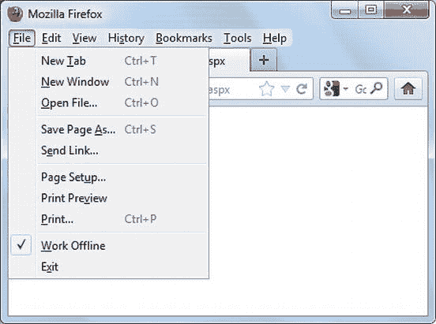
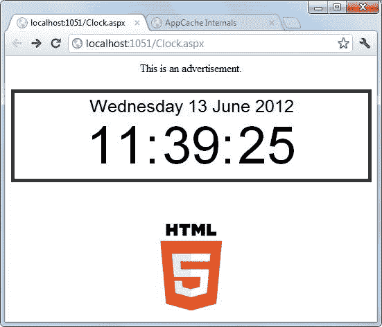
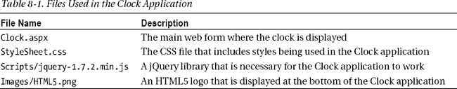
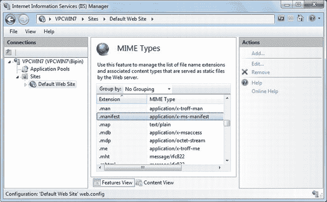
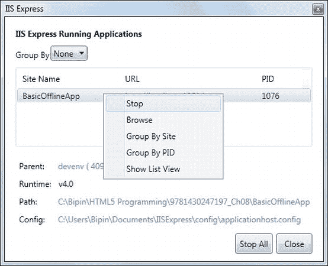
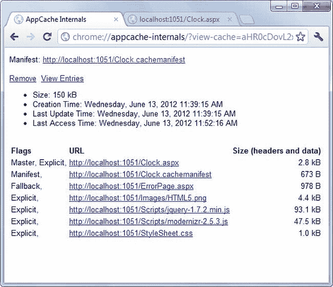
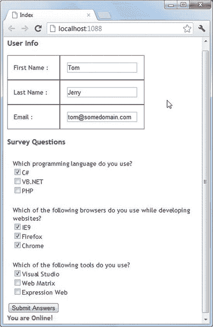

# 八、开发离线 Web 应用

Web 应用通常被视为一直连接到网络的有线应用。web 应用的这种“永远在线”的特性是其流行和快速增长的原因之一。在当今的互联网时代，当网络连接不是一件大事时，web 应用的这一特性在大多数情况下不会造成问题。但是，有时候你不能保证网络的连通性。那么应用的用户应该怎么做呢？如果他们甚至可以在没有网络连接的情况下使用您的 web 应用，那不是很好吗？这正是 HTML5 离线 web 应用所提供的。

乍一看，您可能会发现 web 应用以不连接或独立的方式运行的概念有点奇怪；但是一旦你理解了它们可以提供帮助的场景，你就会欣赏 HTML5 的这个特性。本章解释了适用于 HTML5 的脱机 web 应用的概念。具体来说，您将了解以下内容:

> *   What are offline web applications and when to use them?
> *   Cache manifest file structure
> *   Create and use cache lists in Web forms and MVC applications
> *   Use Ajax technology when the offline application wants to talk to the server.
> *   Use `applicationCache` objects and related events

### 何时使用离线应用

离线应用最适合在客户端下载应用文件后，客户端和服务器之间很少或没有通信的情况。顾名思义，离线应用是不能实时访问服务器端资源(如数据库和服务器端代码)的 web 应用。不是所有的应用都适合作为离线应用。因此，了解什么时候使用离线应用，什么时候避免使用它们是很重要的。在决定您的 web 应用是否适合脱机时，您应该考虑以下两个基本问题:

> *   Does your application depend on real-time data?
> *   How will network downtime affect your web application and its users?

假设您正在为一个体育门户构建一个显示实时板球比分的模块。显然，你的访问者将使用这个模块来查看板球比赛的最新状态。这样的模块下线是没有意义的，因为它依赖的是最新的数据。提供股票报价信息的网站也是如此。这样的 web 应用不适合作为离线应用来实现。

现在，考虑一个在线游戏。假设一旦下载，这个游戏在浏览器中运行，不需要来自服务器的数据。游戏使用的数据是在客户端创建和消费的。在这种情况下，应用不依赖于来自服务器的实时数据，因此可以作为离线应用开发。

另一个重要的考虑是网络停机时间。考虑一个销售主管使用的 web 应用。这些销售主管经常出差，通过无线互联网连接在笔记本电脑或移动设备上使用该应用。他们可能并不是一直都有网络连接；例如，他们可能会旅行到无线互联网服务提供商覆盖范围之外的偏远地区。网络连接的不可用性会妨碍他们的工作，因此开发离线应用是有意义的。另一方面，网络宕机可能不会对运营商用于某些日常任务的 web 应用产生太大影响，因此没有必要将其作为离线应用。

 **注意**术语*离线应用*并不一定表示一个网站的所有页面都可以离线工作。一个网站可能有一些需要网络访问才能运行的网页和一些脱机工作的网页。*离线应用*指的是后一种类型的网页。

### HTTP 缓存和离线应用

在深入研究离线应用的细节之前，有必要了解它们与传统的 HTTP 缓存不同。缓存网页、图像、样式表和 JavaScript 脚本文件等 web 资源并不是一项新发明。浏览器已经使用这些标准的 HTTP 缓存技术很多年了。无论何时访问网页，浏览器都会下载该网页及其相关资源，如图像和样式表，并将它们存储在缓存中。这个缓存在单独的客户机上维护。浏览器使用这种缓存是为了提高效率和性能。例如，假设您正在开发使用 jQuery 库的网页。您在所有的网页中都引用了来自微软 Ajax 内容交付网络(CDN)的 jQuery 库。如果浏览器的缓存中已经有了相同版本的 jQuery 库，就没有必要再从 CDN 上下载了。图像和样式表也是如此。

大多数时候，浏览器在后台使用传统的 HTTP 缓存。如果您希望检查浏览器是否在本地缓存中存储了文件，您可以使用浏览器的脱机模式测试该行为。几乎所有的浏览器都提供了脱机工作的选项。例如，图 8-1 显示了火狐的离线工作菜单选项。

如果您选择此菜单选项，Firefox 不会从服务器获取页面。相反，它使用本地缓存中已经存在的页面；否则，它会给出一条错误消息。

脱机工作菜单选项依赖于前面提到的标准 HTTP 缓存。通常，您不需要在服务器上编写任何代码来启用这种默认行为。如果您希望微调或禁止此行为，可以使用缓存控制头或 IIS 管理器来实现。

乍一看，传统的 HTTP 缓存可能类似于 HTML5 引入的离线应用缓存。但是，它们之间有显著的差异:

> 传统的 HTTP 缓存不需要您的任何代码或配置，除非您希望改变默认的浏览器行为。另一方面，HTML5 离线应用需要您的明确步骤。

***图 8-1。**在 Firefox 中离线工作*

> *   Traditional HTTP cache can be fine-tuned by using cache-control header. HTML5 offline applications rely on manifest files and always work offline even if the network connection is available.
> *   The traditional HTTP cache is an implicit mechanism, which does not consider how the web page should behave when the browser is offline. The development of HTML5 offline application explicitly considers the requirements of data storage and network availability.

### 构建离线应用

离线应用本质上是获取服务器资源，如网页、图像、样式表和脚本文件，并将它们存储在浏览器的本地缓存中。一旦文件在本地机器上，就不需要网络连接。当然，稍后您可能需要上线同步本地和服务器端数据。

要开发脱机应用，您需要遵循以下基本步骤:

> 1.  Create a cache manifest file.
> 2.  Add a reference to the cached manifest file to all web pages that are part of the offline application.
> 3.  Configure the web server to recognize the cache manifest file extension.
> 4.  In JavaScript code, periodically check whether the network connection with the server is available.

*缓存清单*是一个文本文件，它列出了离线应用的所有基于文件的资源。缓存清单文件中列出的资源包括要缓存的文件、要通过网络获取而不是本地缓存的文件，以及由于某种原因无法缓存文件时的替代文件。一个 ASP.NET 网络应用可能包含许多网页，其中只有少数网页被用作离线应用。因此，ASP.NET 应用和脱机应用之间没有一对一的映射。一个 ASP.NET 应用可以包括多个独立的脱机应用。每个这样的离线应用都需要自己的缓存清单。对于缓存清单的文件扩展名没有严格的要求，但是常用的是`.appcache`和`.manifest`。

仅仅创建一个缓存清单文件是不够的。属于该脱机应用的所有网页都应该引用缓存清单。这样，每当浏览器下载网页时，它就知道该网页是脱机应用的一部分。此外，缓存清单告诉浏览器页面需要哪些资源(图像、脚本文件等)，以便浏览器可以确保这些资源的可用性。

如上所述，缓存清单文件可以有任何开发人员定义的扩展名。您需要通知 IIS 您用于缓存清单文件的文件扩展名以及相关的 MIME 类型。如果没有这些信息，IIS 可能不会将缓存清单发送到浏览器，浏览器也无法缓存所需的文件。

尽管脱机应用的行为类似于独立的应用，但在它们生命周期的某个时刻，它们可能需要与 web 服务器进行交互。例如，假设您已经开发了一个 JavaScript 密集型游戏作为离线应用。这意味着最终用户在玩游戏时不需要网络连接。然而，在最后，游戏可能需要上线，以将用户的分数存储在在线帐户或个人资料中。在这种情况下，您需要检查网络连接是否可用，如果可用，则执行所需的数据传输。当然，这一步是可选的，主要取决于应用的性质。

以下部分详细分析了构建脱机应用的步骤。您开发了一个简单的基于 Web Forms 的脱机应用，它使用了您已经学习过的主题。这个离线应用在网页上显示一个 JavaScript 驱动的数字时钟(见图 8-2 )。还可以将时钟上显示的时间发送到服务器进行进一步处理。

***图 8-2。**时钟离线应用*

### 创建缓存清单

如前所述，缓存清单是一个文本文件，它列出了要缓存的文件。在这个例子中，您使用`.cachemanifest`作为文件扩展名，并学习如何通知 IIS 这个扩展名。

缓存清单文件由一个缓存清单声明组成，后跟一个或多个部分:`CACHE`、`NETWORK`和`FALLBACK`。缓存清单声明如下所示:

`CACHE MANIFEST`

所有缓存清单文件都必须以此行开头。除了`CACHE`部分，其他部分是可选的，将在下面讨论。

 **注意**缓存清单文件区分大小写。确保键入的节名和文件名与示例代码中显示的完全相同。

#### 缓存清单的缓存部分

缓存清单的`CACHE`部分列出了要在客户端缓存的所有文件。这些文件可能包括网页、图像、样式表和 JavaScript 文件。例如，时钟应用使用表 8-1 中列出的文件。

在表 8-1 中显示的文件在缓存清单中指定，如清单 8-1 所示。

***清单 8-1。缓存清单文件的** `CACHE`段*

`CACHE MANIFEST

CACHE:
Clock.aspx
img/HTML5.png
StyleSheet.css
Scripts/jquery-1.7.2.min.js`

请注意，`CACHE`部分名称后面是一个冒号(`:`)字符。要缓存的文件每行列出一个。

`CACHE`是一个*隐式的*部分。这意味着如果你没有明确指定`CACHE`，这些文件被认为属于`CACHE`部分。所以，清单 8-1 和清单 8-2 是等价的。

***清单 8-2。**隐`CACHE`节*

`CACHE MANIFEST

Clock.aspx
img/HTML5.png
StyleSheet.css
Scripts/jquery-1.7.2.min.js`

到目前为止编写的缓存清单文件传达了在`CACHE`部分指定的四个文件将被下载到本地缓存。

 **注意:**时钟应用是一个 ASP.NET Web 窗体应用；如果您将其开发为 MVC 应用，那么您将指定一个呈现相应视图的控制器动作，而不是`Clock.aspx`(例如，`Home/Index`)。

#### 缓存清单的网络部分

`CACHE`部分指定了浏览器应该缓存哪些文件以供离线使用。`NETWORK`部分做的正好相反:它列出了不应该被缓存的文件。假设您的应用除了显示页面内容之外还显示广告。它们很可能来自一个跟踪广告印象和点击的广告引擎。显然，这样的广告是无法线下存储的。如果你的离线应用使用了这样的资源，它们应该被列在`NETWORK`部分。

清单 8-3 显示了在`NETWORK`部分列出的`Ads.js`文件。

***清单 8-3。缓存清单文件的** `NETWORK`段*

`CACHE MANIFEST

CACHE:
...

NETWORK:
Scripts/Ads.js`

这样，`Ads.js`就不会缓存在离线缓存中。相反，它总是通过网络访问。

在一个大的应用中，`NETWORK`部分可能有许多候选项。有时，您甚至不知道资源需要通过网络传输。在这种情况下，您可以使用`*`通配符来通知浏览器所有没有在`CACHE`部分列出的文件都应该通过网络访问。像这样使用`*`字符:

`NETWORK:
*`

当您使用托管在不同服务器上并被您的应用引用的资源(图像、脚本等等)时,`NETWORK`部分也很有用。例如，您可能正在使用由 CDN 托管的图像和脚本文件，而不是将它们包含在您的应用中。如果您没有在`NETWORK`部分包含这些外部资源(无论是显式地还是通过使用`*`通配符)，那么，奇怪的是，当您在线时，您的应用不会加载它们。

#### 缓存清单的回退部分

缓存清单文件的`FALLBACK`部分指定了备用文件，以防资源无法缓存或无法通过网络访问。您可以将`FALLBACK`部分视为一种错误处理技术。如果原始资源不可用，您可以用其他资源替代。您可以使用`FALLBACK`部分提供替代内容或显示错误消息。例如，时钟应用使用`FALLBACK`部分来显示一个普通的错误信息(见清单 8-4 )。

***清单 8-4。缓存清单文件的** `FALLBACK`段*

`CACHE MANIFEST

CACHE:
...

NETWORK:
...

FALLBACK:
/ ErrorPage.aspx`

清单 8-4 使用`ErrorPage.aspx`作为所有不能被缓存的资源(`/`)的通用错误页面。注意`/`字符的使用:它表示对于任何不能访问的资源，应该显示`ErrorPage.aspx`。`/`和错误页面由空格分隔。

在继续下一节之前，请确保将缓存清单文件作为`Clock.cachemanifest`保存在 web 应用的根文件夹中。

### 引用 Web 表单和视图中的缓存清单

现在您已经为时钟应用创建了缓存清单，让我们看看如何在 web 表单和视图中引用它。看清单 8-5 。

***清单 8-5。**参考`Clock.aspx`* 中的缓存清单

`<%@ Page Language="C#" AutoEventWireup="true" CodeBehind="Clock.aspx.cs"
          Inherits="BasicOfflineApp.WebForm1" %>

<!DOCTYPE html>
**<html manifest="Clock.cachemanifest">**
<head runat="server">
    <link rel="stylesheet" type="text/css" href="StyleSheet.css" />
    
    
</head>
<body>
    
    <form id="form1" runat="server">
        

           

` `            

              :
              :
              
            

        

         
        

        <input id="Send" type="button" value="Send Time to Server" />
          
        
        

    </form>
</body>
</html>`

请注意以粗体显示的标记。标签包含一个指向`Clock.cachemanifest`文件的`manifest`属性。您需要在离线应用的所有 web 表单(或 MVC 视图)中添加`manifest`属性。

还要注意的是，`<head>`部分包含了对`StyleSheet.css`和 jQuery 库的引用。还有一个`<script>`块，包含负责显示时钟的 jQuery 代码(为了清楚起见，清单中没有显示该代码)。`<body>`部分使用`Ads.js`来显示广告，然后使用标记来显示时钟。回想一下，`Clock.cachemanifest`文件的`CACHE`部分包含所有这些样式表、脚本和图像文件。

来自`<body>`部分的剩余标记包括一些呈现小时、分钟和秒的``元素。时钟是使用 jQuery 代码显示的，如清单 8-6 所示。

***清单 8-6。**显示时钟的 jQuery 代码*

`$(document).ready(function () {
  if (!Modernizr.applicationcache) {
    alert("This browser doesn't support HTML5 Offline Applications!");
  }
  var months = [ "January", "February", "March", "April", "May", "June",
                          "July", "August", "September", "October",
                          "November", "December" ];
  var days= ["Sunday","Monday","Tuesday","Wednesday","Thursday","Friday","Saturday"]
  var today = new Date();
  today.setDate(today.getDate());
  $('#date').html(days[today.getDay()] + " " + today.getDate() + ' ' +
                          months[today.getMonth()] + ' ' + today.getFullYear());

  setInterval(function () {
    var seconds = new Date().getSeconds();
    $("#sec").html(( seconds < 10 ? "0" : "" ) + seconds);
  },1000);

  setInterval( function() {
    var minutes = new Date().getMinutes();
    $("#min").html(( minutes < 10 ? "0" : "" ) + minutes);
  },1000);` `  setInterval( function() {
    var hours = new Date().getHours();
    $("#hours").html(( hours < 10 ? "0" : "" ) + hours);
  }, 1000);
});`

这段代码使用`setInterval()` JavaScript 函数每隔 1000 毫秒更新一次时间。使用 JavaScript `Date`对象及其方法，当前日期也显示在时钟的顶部。注意如何使用`Modernizr.applicationcache`属性检测浏览器对离线应用的支持。

### 配置 IIS 以识别缓存清单文件

为了让脱机应用按预期工作，浏览器应该能够从 web 服务器成功下载缓存清单文件。web 服务器(IIS)使用您使用的扩展名(在本例中为`.cachemanifest`)来提供缓存清单，这一点很重要。前面提到过`.manifest`和`.appcache`是缓存清单的常用文件扩展名；要知道`.manifest`也是由。NET ClickOnce 部署，IIS 可能已经有了它的入口(参见图 8-3 )。

***图 8-3。**IIS 中配置的 MIME 类型*

考虑到这一点，您可能想要使用另一个文件扩展名(例如`.appcache`或`.cachemanifest`)来避免混淆。一旦决定了文件扩展名，您需要在 IIS 中将它的 MIME 内容类型添加为`text/cache-manifest`。这样，IIS 可以将缓存清单文件正确地提供给发出请求的浏览器。

还有一种使用 IIS 管理器的替代方法:您的 web 应用的`web.config`。您可以使用`web.config`的`mimeMap`元素配置缓存清单文件扩展名。清单 8-7 展示了如何将`.cachemanifest`文件扩展名映射到 MIME 类型`text/cache-manifest`。

***清单 8-7。**使用`web.config`* 映射 MIME 类型

`<system.webServer>
  <staticContent>
      <mimeMap fileExtension=".cachemanifest" mimeType="text/cache-manifest" />
  </staticContent>
</system.webServer>`

`<mimeMap>`元素的`fileExtension`属性指定缓存清单文件的文件扩展名，而`mimeType`属性指定缓存清单的 MIME 类型。

### 测试离线应用

现在，您已经完成了创建离线应用所需的所有步骤，让我们使用 Chrome 测试时钟应用。假设您已经在 Visual Studio 中打开了项目，请按 Ctrl+F5 运行应用。`Clock.aspx`被加载到浏览器中，如前面的图 8-2 所示。为了确保应用真正从浏览器缓存中得到服务，打开 Visual Studio 开发 web 服务器(IIS Express)并停止应用(参见图 8-4 )。

***图 8-4。** IIS Express 应用列表*

现在，刷新`Clock.aspx`。通常，在这一步您会收到一个错误，因为 web 应用已停止；但是因为浏览器已经在本地缓存了应用，`Clock.aspx`是从缓存中刷新的。

打开另一个浏览器标签，在地址栏中键入`chrome://appcache-internals`，然后按回车键。您应该会看到一个类似于图 8-5 所示的页面。

图 8-5 展示了 Chrome 如何显示离线应用的细节。您可以看到缓存清单中列出的所有文件。您也可以通过单击删除来手动清除缓存。

***图 8-5。** Chrome 显示离线申请详情*

 **注意**不同的浏览器有不同的方式展示离线应用的细节。例如，Firefox 在工具选项高级网络对话框中显示了这些细节。此外，Firefox 会在首次访问应用时通知您某个 web 应用正在请求离线存储。

### 使用 AJAX 上网

尽管脱机应用与服务器断开连接，但在应用的生命周期中，它可能需要联机并与服务器通信。假设您希望将时钟应用中显示的当前时间保存在数据库中。只有在网络连接可用的情况下，您才能这样做。判断网络连接是否可用的可靠方法是向服务器发出请求，并查看请求是否成功。jQuery `$.ajax()`方法可以有效地用于这个目的。清单 8-8 展示了如何使用`$.ajax()`周期性地 ping 服务器。

***清单 8-8。**使用`$.ajax()`* 检查网络连接是否可用

`$(document).ready(function () {
  ...
  setTimeout(CheckOnline, 5000);
});`  `function CheckOnline() {
  $.ajax({
    type: "POST",
    url: 'Clock.aspx/IsOnline',
    contentType: "application/json; charset=utf-8",
    dataType: "json",
    success: function (result) {
      if (result.d == true) {
        $("#status").html("You are Online!");
        setTimeout(CheckOnline, 5000);
      }
    },
    error: function () {
      $("#status").html("You are Offline!");
      setTimeout(CheckOnline, 5000);
    }
  });`

这段代码显示了一个函数——`CheckOnline()`——它向一个名为`IsOnline()`的 web 方法发出一个`$.ajax()`请求。web 方法返回一个布尔标志。如果`$.ajax()`方法能够成功调用`IsOnline()`，则表明网络连接可用。然后，`success`方法将`
`的内容设置为“您在线了！”如果没有网络连接，调用`IsOnline()`失败，调用`error`函数。`error`函数将`
`的内容设置为“您离线了！”您需要定期检查联机状态；因此，使用`setTimeout()`函数每 5000 毫秒调用一次`CheckOnline()`函数。

`$.ajax()`调用使用的`IsOnline()` web 方法如清单 8-9 所示。

***清单 8-9。** `IsOnline()` Web 方法*

`[WebMethod]
public static bool IsOnline()
{
    return true;
}`

`IsOnline()`方法返回`true`,表示到服务器的网络连接可用。

### 更新离线应用

一旦高速缓存清单文件被提供给浏览器，浏览器就开始使用来自高速缓存的应用文件。但是您可能需要在 web 应用被缓存后对其进行更改。在这种情况下有两种可能性:

> *   You can add or delete files in the web application and make changes to the cache manifest file.
> *   You can change one or more application files (their contents or codes), but you cannot change the cache manifest file.

当您开始使用脱机应用时，浏览器通常会检查服务器，看是否有比已缓存的文件更新的缓存清单文件。如果是，浏览器将下载新的缓存清单文件，并根据该缓存清单下载文件。这个浏览器行为处理列出的第一个场景，因为修改的缓存清单文件的时间戳不同于先前下载的缓存清单的时间戳。

然而，第二种情况有点棘手。在这种情况下，您并没有更改缓存清单文件:您更改的是组成文件，并且您希望浏览器使用这些文件的新版本。不幸的是，浏览器不检查每个组成文件的时间戳，它一直使用文件的缓存版本。要纠正这个问题，您需要更改驻留在服务器上的缓存清单文件的时间戳。有不同的方法可以做到这一点:

> *   Whenever one or more component files change, run a utility to change the timestamp of the cache manifest file (you can easily develop such a utility using the `System.IO` class).
> *   Open the cache manifest file and make pseudo changes to it (for example, add blank space and delete it; Or cut the entire contents of the file, save the file, paste the contents, and save the file back to disk), so it has a new time stamp.
> *   Maintain a version number in the cache manifest file, and change it whenever the component file changes.

在这些选项中，最后一个最容易实现。如果您计划构建一种自动方式来更新缓存清单文件，那么其他选项更合适。

假设`Clock.cachemanifest`中列出的`Clock.aspx`文件由于代码级别的修订而改变，并且您希望使用版本号作为改变缓存清单的一种方式。你可以这样做，如清单 8-10 所示。

***清单 8-10。**版本号为*的缓存清单

`CACHE MANIFEST
**# version 2.0**

CACHE:
...

NETWORK:
...

FALLBACK:
...`

请注意粗体代码。缓存清单文件将跟在`#`字符后面的内容视为注释。您可以在注释中指定版本号。每当您更改任何组成文件时，都需要更改版本号并保存修改后的缓存清单文件。这样，缓存清单的时间戳也会更改，浏览器会再次下载缓存清单及其组成文件。

 **注意**检查新版本的缓存清单文件的方式可能会有一些不同。如果由于某种原因(例如 HTTP 缓存)缓存清单文件被缓存在客户端，浏览器会检查文件是否被修改。如果是这样，用户需要手动删除离线应用文件，如前所述。

### 离线应用事件

在前面几节中，您通过创建缓存清单创建了一个脱机应用。浏览器完成了下载应用文件并将其存储在本地缓存中的所有工作。当浏览器忙于下载和缓存应用时，它会引发几个`applicationCache`对象事件。`applicationCache`是一个对象，它的属性、方法和事件可以使用 JavaScript 代码来处理。使用`applicationCache`事件，您可以跟踪离线应用生命周期的各个阶段。让我们看看`applicationCache`对象触发了什么样的事件:

> 1.  Whenever you request a web page whose `manifest` attribute points to the cached list file, the `checking` event of the `applicationCache` object is triggered. Whether the application has been cached or not, the `checking` event will be raised.
> 2.  If the browser has never cached the application before, it will download the application cache list indicated in the `manifest` attribute and start downloading the files listed in the cache list. At the same time, the `downloading` event of the `applicationCache` object is raised.
> 3.  The cache list may contain many files, and the download operation may be very long. This is why the `applicationCache` object will periodically raise a `progress` event to inform you of the progress of the download operation.
> 4.  After downloading all the files listed in the cache list, `applicationCache` object raises `cached` event. This event indicates that the entire application is now available offline.
> 5.  If you are accessing an application that has been cached, the browser will check whether the cache manifest file of the application has changed since the last download.
> 6.  If the cache list file is unchanged, there is no need to update the offline cache, and the `noupdate` event of the `applicationCache` object will be raised.
> 7.  If the cache list has changed since the last download, the browser starts downloading application files, and as before, `downloading` and `progress` events of `applicationCache` object are raised.
> 8.  When all the application files are successfully downloaded, the `updateready` event of the `applicationCache` object is triggered.
> 9.  It is also possible that the previously cached application is no longer an offline application, that is, its cache list has been deleted from the server. In this case, the browser raises the `obsolete` event of the `applicationCache` object and deletes the existing file from the cache. This application is now regarded as a application connected with *, and it needs a real-time network connection with the server to run normally.*
> 10.  If there is an error in any of the previous steps, the `error` event of the `applicationCache` object will be raised.

为了方便起见，刚才讨论的`applicationCache`对象事件在表 8-2 中列出。

为了理解如何使用这些事件，让我们将其中一些连接到时钟应用中(见清单 8-11 )。时钟应用主要使用这些事件来通知最终用户相关的操作。

***清单 8-11。**使用`applicationCache`对象事件*

`$(document).ready(function () {
  ...
  $(applicationCache).bind("checking",NotifyUser);
  $(applicationCache).bind("downloading", NotifyUser);
  $(applicationCache).bind("progress", NotifyUser);
  $(applicationCache).bind("cached", NotifyUser);
  $(applicationCache).bind("updateready", NotifyUser);
  $(applicationCache).bind("noupdate", NotifyUser);
  $(applicationCache).bind("obsolete", NotifyUser);
  $(applicationCache).bind("error", NotifyUser);
});

function NotifyUser(evt) {
  alert(evt.type);
  if (evt.type == 'updateready') {
    if (confirm('An updated version of this application is available.' +
                       'Do you wish to use the new version now?'))
    {
      applicationCache.swapCache();
    }
  }
}`

这段代码将表 8-1 中列出的`applicationCache`事件绑定到一个公共事件处理函数`NotifyUser()`。`NotifyUser()`功能显示事件类型(`checking`、`downloading`、`progress`等)。注意`if`块:如果事件类型是`updateready`，这意味着应用的更新版本是可用的。在大多数情况下，您希望用户立即使用更新的版本。实现这一点的一种方法是调用`window.location.reload()`方法。或者，您可以调用`applicationCache`对象的`swapCache()`方法。`swapCache()`用新下载的缓存替换旧的缓存，并开始使用新的缓存，而不需要像`reload()`的情况那样刷新页面。

 **注意**`applicationCache`对象还公开了一个`status`属性，该属性根据对象的状态返回一个数字状态代码(1 表示空闲，2 表示检查，等等)。然而，在大多数情况下，使用`applicationCache`对象事件比使用`status`属性提供了更多的灵活性和控制。

### ASP.NET MVC 示例:重新审视调查应用

在前面的部分中，您使用了基于 Web 窗体的时钟应用。要使用 ASP.NET MVC 创建一个离线应用，您需要遵循相同的步骤。为了完整起见，让我们将您在第七章中开发的调查应用转换为离线应用。Survey 应用可能不是脱机使用的最佳选择，但是可以考虑它的一个微小的变体。

假设一家大型软件开发公司经常招聘初级和高级软件开发人员。该公司收到了数百份感兴趣的求职者的求职申请，不可能对所有求职者进行一对一的个人面试。因此，该公司希望开发一个在线考试引擎，向考生呈现一系列单项选择、多项选择和描述性问题。考生可以在任何方便的地方参加在线考试。这种在线测试成为筛选候选人的基础。只有成功的候选人才会被邀请参加面试。在在线考试引擎的情况下，考生可能会在一个页面上停留很长时间，因为他们在思考正确的答案。这样的应用可以很好地开发成离线应用。到目前为止，您一定已经猜到了这个调查应用，尽管它并不完全是一个在线考试引擎，但它类似于这个场景。

让我们执行将调查应用转换为离线应用所需的步骤。调查应用的离线版本如图 8-6 所示。

***图 8-6。**调查应用转换为离线应用*

修改后的调查应用在外观和感觉上与原始应用几乎完全相同，只有一处不同。在“提交答案”按钮下面，您现在显示网络状态，以便用户知道调查数据是否可以保存到数据库中。

#### 创建缓存清单文件

若要开始将调查应用转换为脱机应用，请创建调查应用的副本，并在 Visual Studio 中打开它。接下来，您需要为应用创建缓存清单文件。因此，创建一个名为`Survey.cachemanifest`的文本文件，并添加清单 8-12 中的条目。

***清单 8-12。**文件`Survey.cachemanifest`文件*

`CACHE MANIFEST
# version 1.0

CACHE:
Home/Index
Content/Site.css
Scripts/jquery-1.6.2.js
Scripts/modernizr-2.0.6-development-only.js

FALLBACK:
/ Home/ErrorPage`

仔细看看这个清单。`CACHE`部分列出了四个条目:一个路由 URL、一个 CSS 文件和两个脚本文件。`FALLBACK`部分指定了一个通用错误页面:`ErrorPage`视图向用户显示一个通用错误消息。

接下来，打开索引视图，使用`manifest`属性指定缓存清单文件，如下所示:

`<html manifest="/Survey.cachemanifest">...</html>`

#### 获得问题和选择

即使将调查应用转换为脱机应用，其整体功能也保持不变。但是，因为应用依赖于存储在数据库中的问题和选择，所以您需要在客户端缓存它们。回想一下，`GetQuestions()`和`GetChoices()`函数分别调用控制器动作方法来检索问题和选择。您应该将这些数据存储到本地存储中，以便在脱机模式下也可以使用。

 **注**现实世界的调查或在线考试申请有许多问题和选择。此外，问题可能会经常变化，在客户端缓存所有问题及其选择是不切实际的。更好的方法是每次都在实时模式下获取问题和选项，然后通知用户他们可以离线。

`GetQuestions()`和`GetChoices()`功能的修改版本如清单 8-13 所示。

***清单 8-13。**在本地存储器中存储数据*

`function GetQuestions() {
  $.ajax({
     ...
**      GetChoices();**
**    },**
    error: function (err) {
**      if (storage["container"] != null) {**
**        $("#container").html(storage["container"]);**
**      }**
**      else {**
**        alert(err.status + " - " + err.statusText);**
**      }**` `    }
  })
}

function GetChoices() {
  $.ajax({
      ...
        else {
          storage.removeItem(key);
        }
      });
**      storage["container"]=$("#container").html();**
    },
    error: function (err) {
      alert(err.status + " - " + err.statusText);
    }
  })
}`

请注意粗体代码。`GetQuestions()`函数获取问题，然后调用`GetChoices()`函数。一旦`GetChoices()`成功完成，容器`
`元素就会被问题和它们的选择填充。该代码将整个动态生成的 HTML 标记存储在本地存储中。这样，即使没有网络连接，代码也可以使用问题和选择。从下一次开始，如果`GetQuestions()`由于网络不可用而无法访问数据库，调用`$.ajax()`(属于`GetQuestions()`)的错误函数将检索存储在本地存储中的 HTML 标记，并填充容器`
`元素。

#### 检查网络连接

最后，调查应用需要将答案存储在数据库中。每当单击 Submit Answers 按钮时，它都会向服务器发出一个 Ajax 调用。当用户点击提交答案时，调用`SubmitData()`函数；它调用`SaveResults()`控制器动作方法来保存测量数据。只有在有网络连接的情况下，这个 Ajax 调用才会成功。

通知用户网络连接的可用性并相应地启用或禁用提交回答按钮将是有益的。为此，您需要定期检查网络连接是否可用。清单 8-14 显示了这是如何实现的。

***清单 8-14。**启用或禁用提交答案按钮*

`$(document).ready(function () {
   ...
  setTimeout(CheckOnline, 5000);
})

function CheckOnline() {
  $.ajax({
    type: "POST",
    url: 'Home/IsOnline',
    contentType: "application/json; charset=utf-8",
    dataType: "json",
    success: function (result) {` `      if (result == true) {
        $("#status").html("You are Online!");
        $("#submit").removeAttr('disabled');
        setTimeout(CheckOnline, 5000);
      }
    },
    error: function () {
      $("#status").html("You are Offline!");
      $("#submit").attr('disabled', 'disabled');
      setTimeout(CheckOnline, 5000);
    }
  });
}`

这段代码看起来应该很熟悉:您在时钟应用中使用了类似的技术。使用`setTimeout()`方法，每五秒钟调用一次`CheckOnline()`。`CheckOnline()`然后调用`IsOnline()`控制器的动作方法。如果此调用成功，则表明网络连接可用；否则，网络不可用。相应地，通过添加或删除`disabled`属性来启用或禁用提交答案按钮。`IsOnline()`如清单 8-15 所示。

***清单 8-15。** `IsOnline()`动作方法 public JsonResult IsOnline()*

`{
   return Json(true);
}`

`IsOnline()`以 JSON 格式返回`true`。您现在可以运行调查应用，并通过在 IIS Express 中停止该应用来测试它，如前所述。

### 总结

大多数 web 应用需要一个到 web 服务器的实时网络连接才能正常运行。这种应用涉及客户端和服务器之间的大量交互。然而，一些 web 应用可以在没有到 web 服务器的活动网络连接的情况下工作。这种应用通常涉及大量的客户端功能。HTML5 让你可以轻松开发这样的离线应用。并不是每个应用都是好的候选，但是如果需要的话，您可以获得对这种离线应用的本机支持。

脱机应用的核心是一个缓存清单文件，它列出了脱机模式下需要的所有文件。如果需要，当网络连接可用时，脱机应用可以与 web 服务器连接，并传输数据或执行服务器端代码。HTML5 中引入的`applicationCache`对象表示离线应用缓存，并通过引发事件来帮助您跟踪各种应用生命周期事件。

HTML5 为您的 web 应用添加了丰富的客户端功能。另一个这样的领域是客户端文件访问。传统上，JavaScript 不能以任何方式访问本地文件。HTML5 文件 API 提供了一种处理本地文件的标准化方法。下一章将详细讨论这个特性。