# 九、使用文件 API 处理本地文件

众所周知，为了安全和隐私，浏览器不允许 web 应用篡改本地文件系统。只有当用户决定使用 file 类型的 HTML <input>元素将本地文件上传到服务器时，才在 web 应用中使用本地文件。本章的标题一开始可能会让你感到惊讶，因为术语*文件 API* 给人的印象是一个成熟的文件系统操作对象模型，就像。NET 框架。显然，HTML5 背后的人意识到了这种对象模型可能带来的安全问题。因此，文件 API 本质上是一个文件处理系统的精简版本，其中文件只能被读取，不能被修改或删除。此外，文件 API 不能读取机器上的任何随机文件。要读取的文件必须由用户明确提供。因此，在用户同意的情况下，文件 API 是读取和可选地上传本地文件的安全方式。

本章研究了文件 API 能为您做什么，以及如何在 ASP.NET web 应用中使用它。具体来说，您将了解以下内容:

> *   Class can be used as part of the file API.
> *   The technology of selecting files should be used with the file API.
> *   Use HTML5 native drag and drop
> *   Reading files with file API
> *   Upload the file to the server

### 了解文件 API

HTML5 文件 API 由一组三个对象组成(见表 9-1 )，允许你读取驻留在客户端计算机上的文件。要读取的文件必须由用户使用后面章节中讨论的支持技术之一来明确选择。一旦选中，您就可以使用 JavaScript 代码读取文件。

文件 API 的对象模型非常小，但是您可以以创造性的方式使用这三个对象，这在 HTML5 之前是不可能的(或者至少是非常困难的)。使用文件 API 的一些创造性方法如下:

> *   In traditional HTML, when you upload a file using the file field, the client does not check the file size. Only when the file arrives at the server can you check in the server-side code and accept or reject the file. Now, you can reject files that exceed a specific file size at the client.
> *   You can read the image file at the client and present a preview or thumbnail before uploading it to the server. This facility can also be used for social networking applications or photo album applications that process images.
> *   You can verify the contents of the file before uploading it to the server. For example, if your application should upload XML files, you can validate the XML documents before they reach the server. You can develop client images or file directories for users to view before uploading to the server. You can develop an album application that allows users to drag and drop image files instead of picking them up one by one.

 **注意**未来，HTML5 可能会增加对文件系统导航的支持。可在`[`dev.w3.org/2009/dap/file-system/pub/FileSystem/`](http://dev.w3.org/2009/dap/file-system/pub/FileSystem/)`获得一份规范草案。然而，在撰写本文时，主流浏览器很少或根本不支持这些特性。

#### 文件列表对象

`FileList`对象表示一列`File`对象。从网页上的文件字段(`<input type="file">`)或者通过用户将本地文件从 Windows 资源管理器拖放到网页的可拖放区域来返回`FileList`。通常，你通过一个`FileList`来访问单个的`File`对象。`FileList`对象只公开一个属性和一个方法，如表 9-2 所述。

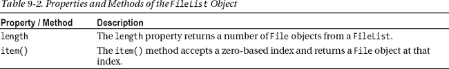

#### 文件对象

一个`File`对象代表一个文件，并提供关于它的信息，比如它的名称、大小和 MIME 类型。如果你想读取一个文件的内容，你还需要一个`File`对象。表 9-3 列出了`File`对象的属性。

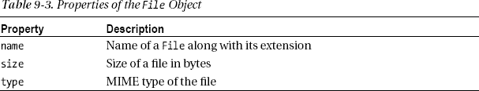

#### FileReader 对象

一个`FileReader`对象允许你读取一个`File`的内容。读取操作以异步方式执行。这样，即使非常大的文件也可以读取，而不会阻塞其他操作。`FileReader`对象可以以文本、Base64、二进制或`ArrayBuffer`的形式读取`File`内容。表 9-4 列出了负责读取文件的`FileReader`对象的方法。

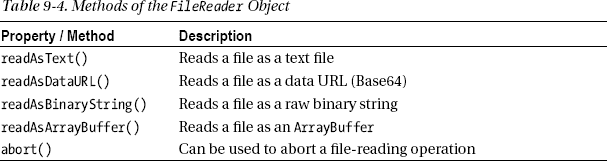

`readAsText()`方法旨在用于基于文本的文件，比如纯文本文件、CSV 文件和 XML 文件。`readAsDataURL()`方法以 Base64 格式对文件内容进行编码，并将其作为数据 URL 返回。正如在第四章中更详细描述的，您知道数据 URL 格式由 Base64 编码的数据组成，并以文件的 MIME 类型为前缀，如下例所示:

`data:image/png;base64,iVBORw0KGgoAAAANSUh…`

在二进制数据无法传输到服务器的情况下,`readAsDataURL()`方法也很方便。一种这样的情况是将文本数据发送到服务器的 jQuery `$.ajax()`方法。`readAsBinaryString()`方法将文件作为原始二进制数据读取。`readAsArrayBuffer()`方法以`ArrayBuffer`的形式读取文件内容；一个`ArrayBuffer`是固定长度的二进制数据缓冲器。

这里讨论的文件读取方法会影响`FileReader`的某些属性。然后，这些属性可用于处理文件内容或向最终用户标记错误。表 9-5 列出了这些属性。

在读取文件时，`FileReader`会引发某些事件。您可以为这些事件连接处理程序，并拦截读取操作的各个阶段。`FileReader`对象引发的事件在表 9-6 中给出。

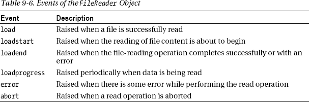

在表 9-6 中列出的所有事件中，您必须处理`load`事件，因为这是您可以访问文件内容的地方。

### 选择要与文件 API 一起使用的文件

如前所述，要使用文件 API 访问的文件必须由用户以下列方式之一明确选择:

> *   Users can use the open file dialog box displayed by the file field control to select files.
> *   Users can drag files from Windows Explorer and place them in a predefined area of the webpage.

第一种方式简单而传统。这种技术的一个变体是在页面上显示没有可见文件字段的打开文件对话框。在这种情况下，你需要耍花招来达到预期的行为。第二种方式是特定于 HTML5 的，由于对拖放的本机支持，很容易在网页中实现。

以下部分讨论了这两种选择文件的方法。请注意，HTML5 拖放功能不仅限于文件选择，还可以在应用中独立使用。

#### 使用文件字段选择文件

使用文件字段来选择一个或多个文件是选择要与文件 API 一起使用的文件的最基本技术。在 HTML5 之前，文件字段控件只允许一次选择一个文件。如果你想让允许用户选择五个文件，你必须在网页上放置五个独立的文件域控件。然而，在 HTML5 中，用户可以使用单个文件字段控件选择多个文件。这可以通过`<input>`元素的新`multiple`属性来实现。清单 9-1 展示了如何配置一个文件字段控件来选择单个或多个文件。

***清单 9-1。**文件字段控制标记*

`<input id="File1" type="file" />
<input id="File2" type="file" multiple="multiple" />`

这个清单显示了两个属性设置为`file`的`<input>`元素。注意，第二个文件字段具有`multiple`属性。当您指定`multiple`属性时，产生的打开文件对话框允许您使用标准的 Windows 技术(Ctrl/Shift 键和鼠标点击的组合)选择多个文件。

不同的浏览器会显示不同的文件字段。例如，图 9-1 显示了文件字段在 Chrome、Opera 和 Firefox 中是如何显示的。

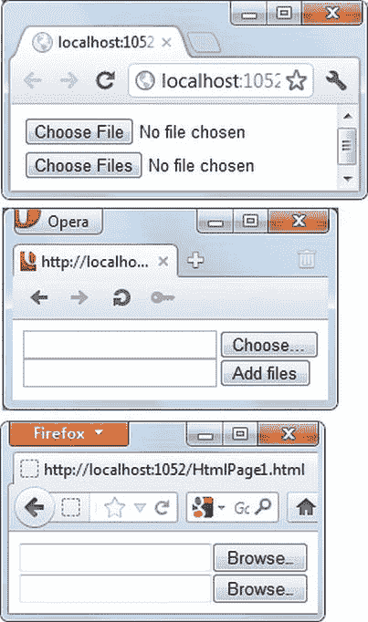

***图 9-1。**不同浏览器的文件字段*

注意 Chrome 和 Opera 如何显示带有`multiple`属性的文件字段，以表示可以选择多个文件。点击浏览器，选择文件，或者添加文件按钮打开一个标准的 Windows 打开对话框，如图图 9-2 所示。

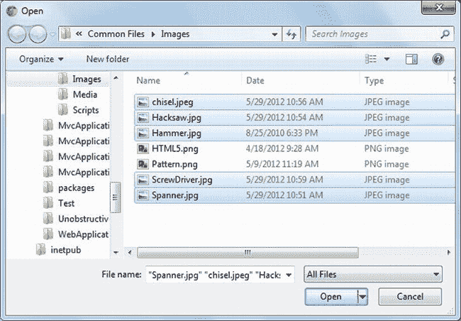

***图 9-2。**使用打开对话框选择多个文件*

注意图 9-2 显示选择了多个文件。当您选择多个文件并点按“打开文件”对话框中的“打开”按钮时，所有选定的文件会一个接一个地添加到同一个文件栏中。Firefox 和 Opera 在文件字段控件的文本框中显示所有选中的文件，而在 Chrome 中你需要将鼠标悬停在文件字段上才能看到选中文件的列表(参见图 9-3 )。

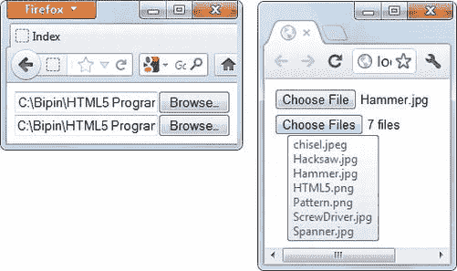

***图 9-3。**选择文件后的文件字段控件*

如果你正在开发一个基于 ASP.NET 网络表单的应用，你可以使用`FileUpload`服务器控件，而不是使用清单 9-1 中的原始标记。清单 9-2 中的标记展示了如何使用`FileUpload`服务器控件。

***清单 9-2。**使用`FileUpload`服务器控件*

`<asp:FileUpload ID="FileUpload1" runat="server" />
<asp:FileUpload ID="FileUpload2" runat="server" AllowMultiple="True" />`

这里显示的第一个`FileUpload`服务器控件允许您选择单个文件。第二个`FileUpload`服务器控件的`AllowMultiple`属性被设置为`True`，并允许您选择多个文件。

如果你正在开发一个 ASP.NET MVC 应用，你可以使用如清单 9-1 所示的普通 HTML 或者使用 HTML `TextBox`助手来呈现一个文件域。清单 9-3 展示了如何使用 HTML `TextBox`助手来呈现文件字段。

***清单 9-3。**使用`TextBox`助手渲染文件域*

`<% using (Html.BeginForm("Index","Home","POST")) { %>
<%= Html.TextBox("file1", "",new {type="file"})%>
 
<%= Html.TextBox("file2", "",new {type="file",multiple="multiple"})%>
<%}%>`

正如您所看到的，为了呈现一个文件字段，您使用了`TextBox` helper 并提供了一个`type`属性值`file`。对`TextBox`助手的第一次调用呈现了一个文件字段，只允许选择一个文件，而第二次调用设置了`multiple`属性，允许选择多个文件。

#### 使用自定义按钮选择文件

有时，出于美观的原因，使用文件字段来选择文件是不可取的。虽然您可以使用 CSS 来改变文件字段的外观，但是它的外观不能被彻底改变。例如，假设您希望在网页上显示一个图像，当用户单击该图像时，您希望提示他们选择一个或多个文件。使用文件字段是不可能的，因为即使应用了 CSS，字段的基本外观也是由浏览器控制的。

如果您希望在应用中提供这样一种选择文件的定制技术，您需要使用一个编程技巧。实际上，您需要在网页中添加一个文件字段，但要隐藏起来。当用户单击用于文件选择的自定义图形或按钮时，您通过 JavaScript 触发隐藏文件字段上的`click`事件。这样，向用户显示打开文件对话框。一旦用户选择了一个或多个文件，这些文件将被分配到隐藏文件字段。然后，您可以访问这些文件进行进一步处理。

图 9-4 显示了用于选择文件的自定义图像。

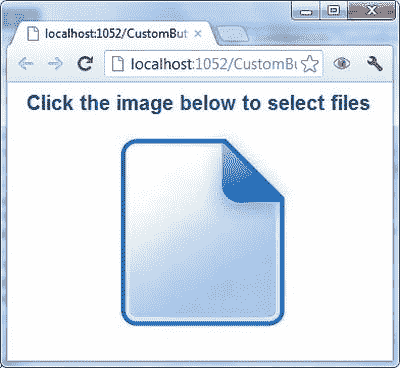

***图 9-4。**使用自定义图像按钮选择文件*

web 表单由一个`Label`控件、一个`FileUpload`控件和一个`ImageButton`控件组成。清单 9-4 展示了网络表单的标记。

***清单 9-4。**使用自定义图像提示文件选择*

`<form id="form1" runat="server">
  <asp:FileUpload ID="FileUpload1" runat="server" AllowMultiple="true"
    CssClass="hidden" />
  <asp:Label ID="Label1" runat="server" CssClass="message"
    Text="Click on the image below to select files" >
  </asp:Label>
   
  <asp:ImageButton ID="ImageButton1" runat="server"
    ImageUrl="~/img/UploadFile.jpg" />
</form>`

请注意标记中的一些内容。首先，`FileUpload`控件的`AllowMultiple`属性被设置为`True`，以允许多文件选择。其次，它的`CssClass`属性被设置为一个名为`hidden`的 CSS 类。CSS 类看起来像这样:

`.hidden {
    display:none;
}`

`hidden` CSS 类简单地将`display` CSS 属性设置为`none`，这样在运行时，`FileUpload`控件就不可见了。一个`ImageButton`控件用于向用户显示一个可点击的图像。为了捕获`ImageButton`的客户端`click`事件，并以编程方式触发`FileUpload`控件的`click`事件，您需要编写一些 jQuery 代码。清单 9-5 显示了添加到 web 表单的 jQuery 代码。

***清单 9-5。**编程触发文件字段*的`click`事件

`$(document).ready(function () {
  $("#FileUpload1").change(function (evt) {
      alert(evt.target.files.length + " file(s) were selected!");` `  });
  $("#ImageButton1").click(function (evt) {
    $("#FileUpload1").click();
    evt.preventDefault();
  });
});`

这段代码主要处理`ImageButton`控件的客户端`click`事件。在`click`事件处理程序中，它触发`FileUpload`控件(文件字段)的`click`事件。这样，向用户显示一个打开文件对话框。因为`ImageButton`控件没有任何服务器端功能，所以调用`preventDefault()`方法来取消默认操作。选择文件后，会引发文件字段的`change`事件。请注意`files`属性的使用，它允许您访问使用打开文件对话框选择的所有文件。`change`事件处理程序显示使用`files`对象的`length`属性选择的文件数量。

#### 使用拖放选择文件

从打开的文件对话框中选择文件并不是使用文件 API 抓取要读取的文件的唯一选项。一个更高级的选项允许用户从 Windows 资源管理器或桌面拖动文件，并将它们放到网页的某个区域。这种拖放选项比以前的选项需要更多的编码，因为您需要指定网页中可以放置文件的特定区域；此外，您必须处理与拖放相关的某些事件。过去，开发人员使用第三方 JavaScript 库或插件来实现拖放。然而，HTML5 提供了对拖放的本地支持。尽管实现基于拖放的文件选择比其他技术需要更多的代码，但是与传统的 HTML 相比，整个过程很简单，也很容易实现。

HTML5 中的本地拖放支持并不局限于使用文件 API。它是一个独立的特性，可以在任何需要拖放的情况下使用。在接下来的部分中，您将学习如何在网页中实现拖放。

 **注意**严格来说，使用拖放选择文件只需要抓取拖放操作即可。然而，为了完整起见，下一节将介绍如何实现拖放操作。您可以在许多情况下使用本机拖放支持来提供更好的用户体验。

### 使用拖放操作

拖放操作在桌面应用中很常见。现代 web 应用还试图利用拖放操作的便利性和强大功能来提供增强的用户体验。Web 开发人员经常求助于第三方基于 JavaScript 的库或定制技术，以便在他们的 web 应用中实现拖放行为。幸运的是，HTML5 内置了对拖放的支持。

使用拖放功能，您可以将一个 HTML 元素拖放到另一个元素上。您也可以从 Windows 资源管理器或桌面拖动文件，并将其放到网页上进行进一步处理。在拖放操作过程中，您可以将数据从源元素传递到目标元素。

实现拖放主要包括以下步骤:

> 1.  Allows you to drag one or more HTML elements from a Web page.
> 2.  Decide a drag-and-drop target to handle the drag-and-drop of draggable elements or files.
> 3.  Handling drag-and-drop related events.
> 4.  If necessary, transfer data between the drag-and-drop source and the drag-and-drop target.

#### 启用 HTML 元素的拖动

在页面中使用拖放的第一步是使一个或多个元素可拖动。通过将 HTML 元素的`draggable`属性设置为`true`可以做到这一点。例如，下面这段标记使一个`
`元素可拖动:

`
Some content
`

#### 拖放事件

将一个或多个 DOM 元素标记为可拖动只是故事的一部分。为了让您的拖放功能对最终用户更具吸引力，您需要处理某些事件。这些事件在表 9-7 中列出。

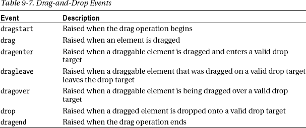

注意，*拖动源*是一个正在被拖动的元素，而*拖放目标*是一个可拖动元素将要被拖放到其上的元素。来自表 9-7 的事件如`dragstart`、`drag`和`dragend`由拖动源处理，而事件如`dragenter`、`dragleave`、`dragover`和`drop`由拖放目标处理。您可以使用 JavaScript 将事件处理程序连接到这些事件，如清单 9-6 所示。

***清单 9-6。**为拖放事件连接事件处理程序*

`$("div").each(function () {
  this.addEventListener('dragstart', OnDragStart, false);
  this.addEventListener('drop', OnDrop, false);
});`

在这段代码中，`
`元素的`dragstart`和`drop`事件分别通过`addEventListener()`方法连接到`OnDragStart`和`OnDrop`函数。

#### 在拖放操作之间传输数据

大多数时候，将某个东西拖放到另一个东西上也需要在源元素和目标元素之间传输一些数据。为了完成这个数据传输，HTML5 提供了`dataTransfer`对象。通过传递给事件处理程序的事件对象，可以在各种拖放事件中访问`dataTransfer`对象。表 9-8 列出了`dataTransfer`对象的一些重要属性和方法。

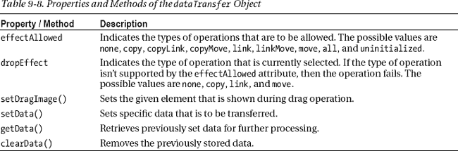

通常在`dragstart`和`drop`事件处理程序中使用`dataTransfer`对象的属性和方法。

### 实现拖放:一个购物车

现在让我们将你的知识运用到一个简单而实用的购物车网络表单中，如图 9-5 所示。

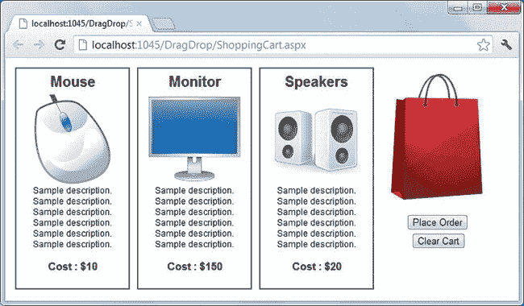

***图 9-5。**购物车网页表单*

如您所见，web 表单代表了一个简单的购物车。各种产品由放置在`Repeater`控件中的`
`元素表示。产品可以拖放到购物袋上。添加完所有需要的产品后，用户可以单击 Place Order 按钮将产品数据发送到服务器进行订购。

#### 实体框架数据模型

购物车示例将数据存储在 SQL Server Express 数据库中。为了从数据库中获取数据，应用使用实体框架数据模型，如图 9-6 所示。

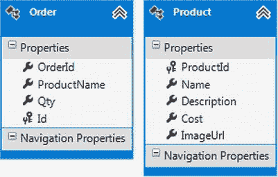

***图 9-6。**购物车数据库的实体框架数据模型*

数据模型由两个类组成:`Product`和`Order`。`Product`类捕获细节，如`ProductId`、`Name`、`Description`、`Cost`和`ImageUrl`。`Order`类捕获细节，如`OrderId`、`ProductName`和`Qty`。当然，真实世界的购物车系统会捕获更多的细节，但是这个数据模型足以说明这个主题。

#### 产品目录和购物车

产品目录是一个`Repeater`控件，它的`ItemTemplate`包含一个可拖动的`
`元素。这个`
`元素包装了所有的产品细节，比如单个产品的`Name`、`Description`和`Cost`。`Repeater`控件通过`EntityDataSource`控件接收其数据。清单 9-7 中给出了`Repeater`控件的标记。

***清单 9-7。**产品目录的标注*

`<asp:Repeater ID="Repeater1" runat="server" DataSourceID="EntityDataSource1">
  <ItemTemplate>
**      
**
          <header><%# Eval("Name") %></header>
          

           <asp:Image runat="server" ID="img1"
              ImageUrl='<%# Eval("ImageUrl") %>' />
          

          
<%# Eval("Description") %>

           
          
<%# Eval("Cost","Cost : ${0}") %>
` `          <input type="hidden" value="<%# Eval("ProductId") %>" />
      

  </ItemTemplate>
</asp:Repeater>`

注意粗体的代码。代表产品的`
`元素用设置为`true`的`draggable`属性来标记。清单 9-7 中的剩余标记实际上是使用 ASP.NET`Eval()`数据绑定表达式将`Products`表的各列与 HTML 元素绑定在一起。

#### 处理拖放事件

下一步是将拖放事件处理程序连接到各种元素。连接各种事件处理程序的 jQuery 代码如清单 9-8 所示。

***清单 9-8。**连线拖放事件处理程序*

`$(document).ready(function () {
    $("div .product").each(function () {
        this.addEventListener('dragstart', OnDragStart, false);
    });

    var cart = $("#divCart").get(0);
    cart.addEventListener('dragenter', OnDragEnter, false);
    cart.addEventListener('dragleave', OnDragLeave, false);
    cart.addEventListener('dragover', OnDragOver, false);
    cart.addEventListener('drop', OnDrop, false);
    cart.addEventListener('dragend', OnDragEnd, false);
})`

如您所见，首先使用 jQuery 选择器选择所有应用了`product` CSS 类的`
`元素(即所有产品的容器`
`元素)。然后对结果集调用`each()`方法，为`dragstart`事件添加一个事件监听器。`addEventListener()`方法将一个事件处理函数连接到一个事件。在这种情况下，`dragstart`事件由`OnDragStart`函数处理。

包含购物袋和按钮的`
`元素的 ID 为`divCart`。`divCart`元素应该处理其他事件，如`dragenter`、`dragleave`和`drop`。一系列的`addEventListener()`方法调用将事件处理函数附加到这些事件上。事件处理函数采用`On*XXXX*`的形式，其中 *XXXX* 是事件的名称。

总共有六个事件处理函数:`OnDragStart`、`OnDragEnter`、`OnDragLeave`、`OnDragOver`、`OnDrop`和`OnDragEnd`。让我们一个一个地检查它们。

##### OnDragStart

`dragstart`事件处理程序降低了被拖动元素的不透明度，这样最终用户就能得到拖动操作的视觉线索。处理`dragstart`事件的`OnDragStart`事件处理函数如清单 9-9 所示。

***清单 9-9。** `OnDragStart`事件处理函数*

`function OnDragStart(e) {
    this.style.opacity = '0.3';` `    srcElement = this;
    e.dataTransfer.effectAllowed = 'move';
    var product=$(this).find("header")[0].innerHTML;
    e.dataTransfer.setData('text/html', product);
}`

`OnDragStart`事件处理函数将拖动操作的源存储在一个全局变量`srcElement`中，因为稍后在`drop`事件处理函数中会用到它。`dataTransfer`对象的`effectAllowed`属性被设置为`move`。当用户拖动一个产品并将其放到购物袋上时，您需要将相应的产品名称传输到拖放目标。在这种情况下，产品名称被放在`<header>`元素中；因此，`find()`方法找到所有的 header 元素，然后获取 header 元素的`innerHTML`(产品名称)。`setData()`方法将产品名称设置为要通过`dataTransfer`对象传输的数据。这样，`drop`事件处理程序就知道哪个产品将被添加到购物车中。`setData()`的第一个参数表示正在传输的数据的 MIME 类型(本例中为`'text/html'`)。

##### 昂格洛夫

`OnDragOver`事件处理函数向拖放目标添加一个 CSS 类，以便向用户提供关于操作的视觉线索。`OnDragOver`函数如清单 9-10 所示。

***清单 9-10。** `OnDragOver`功能*

`function OnDragOver(e) {
    ...
    $(this).addClass('highlight');
    e.dataTransfer.dropEffect = 'move';
}`

CSS 类本质上是通过改变背景色来给拖放目标(购物袋元素)添加一个亮点。这里显示了:

`.highlight
{
    background-color:Yellow;
}`

`dataTransfer`对象的`dropEffect`属性被设置为`move`。

##### 软骨和软骨叶

`OnDragEnter`和`OnDragLeave`事件处理程序只是将`highlight` CSS 类添加到 drop target 元素中，并从其中移除。这些事件处理程序如清单 9-11 中的所示。

***清单 9-11。** `OnDragEnter`和`OnDragLeave`功能*

`function OnDragEnter(e) {
    $(this).addClass('highlight');
}

function OnDragLeave(e) {
    $(this).removeClass('highlight');
}`

##### 滴上

`OnDrop`事件处理函数是主要的事件处理程序，您可以在其中将产品名称从`DataTransfer`对象传输到购物车。`OnDrop`功能如清单 9-12 中的所示。

***清单 9-12。** `OnDrop`功能*

`function OnDrop(e) {
    ...
    srcElement.style.opacity = '1';
    $(this).removeClass('highlight');
    var count = $(this).find("div[data-product-name='" +
                e.dataTransfer.getData('text/html') + "']").length;
    if (count <= 0) {
        $(this).append("
" +
        e.dataTransfer.getData('text/html') + "
");
    }
    else {
        alert("This product is already added to your cart!");
    }
    return false;
}`

因为拖放操作已经完成，所以`drop`事件处理程序将源元素的不透明度设置回`1`。它还从目标元素中移除了`highlight` CSS 类。然后，它将被拖动的产品附加到目标元素上。

注意使用了`getData()`方法来检索之前在`OnDragStart`事件处理函数中设置的数据。还有一个检查，所以相同的产品不能添加到购物车多次。图 9-7 显示了如果同一产品被多次拖放，错误信息是如何显示给用户的。

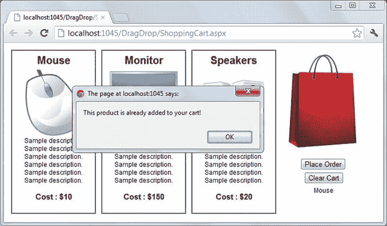

***图 9-7。**跌落后检查重复产品*

如您所见，鼠标已经被添加到购物车中。再次尝试将鼠标拖放到购物车上会出现一个警告框，其中有一条消息通知用户存在重复。

##### 不可忍受

`OnDragEnd`事件处理函数简单地从拖放目标中移除了`highlight` CSS 类，如清单 9-13 所示。

***清单 9-13。** `OnDragEnd`功能*

`function OnDragEnd(e) {
    $("div .bag").removeClass('highlight');
    this.style.opacity = '1';
}`

##### 将数据从客户端传递到服务器

要将购物车中的商品传输到服务器端代码，需要使用 jQuery `$.ajax()`方法。下单按钮的`click`事件处理程序有相关代码，如清单 9-14 所示。

***清单 9-14。**在服务器上保存订单数据*

`$("#Button1").click(function () {
    var data = new Array();
    $("div .bag div").each(function (index) {
        data[index] = "'" + this.innerHTML + "'";
    });
    $.ajax({
        type: 'POST',
        url: 'shoppingcart.aspx/PlaceOrder',
        contentType: "application/json; charset=utf-8",
        data: '{ products:[' + data.join() + ']}',
        dataType: 'json',
        success: function (results) { alert(results.d); },
        error: function () { alert('error'); }
    });
});`

如您所见，首先购物袋中的产品被存储到一个 JavaScript 数组中。这样，很容易通过连接数组元素将它们传递给服务器。通过使用`each()`方法并提取各个`
`元素的`innerHTML`来创建一个`Array`。然后，`$.ajax()`方法调用驻留在`ShoppingCart.aspx` web 表单中的 web 方法`PlaceOrder()`。web 方法如清单 9-15 所示。

***清单 9-15。** `PlaceOrder` Web 方法*

`[WebMethod]
public static string PlaceOrder(string[] products)
{
    Guid orderId = Guid.NewGuid();` `    ShoppingCartEntities db = new ShoppingCartEntities();
    foreach (string p in products)
    {
        Order order = new Order();
        order.OrderId = orderId;
        order.ProductName = p;
        order.Qty = 1;
        db.Orders.AddObject(order);
    }
    db.SaveChanges();
    return "Order with " + products.Length.ToString() +
              " products has been added!";
}`

`PlaceOrder()` web 方法将订单放入`Orders`表中。方法接受表示产品名称的字符串数组。注意`$.ajax()`如何以 JSON 格式传递`products`参数。web 方法成功完成后，`success`处理函数向最终用户显示一个警告。

要测试拖放行为，请运行 web 表单并尝试在购物袋上拖动产品。图 9-8 显示了网络表单的运行示例。

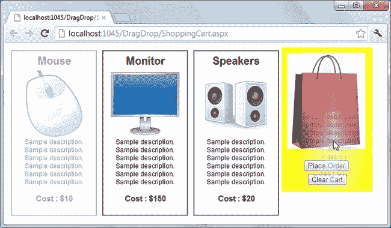

***图 9-8。**购物车 web 表单的运行示例*

请注意被拖动的产品(鼠标)是如何以较低的不透明度显示的，以及购物袋是如何突出显示的。如果您单击“下订单”按钮，所选产品将保存在数据库中。

### 拖拽文件

现在，您已经知道了如何将 HTML 元素拖放到目标元素上，让我们看看如何将文件拖放到网页上。在文件拖放的情况下，您不必担心将任何 HTML 元素标记为可拖动的，因为文件是外部实体，您可以从浏览器外部拖动它们。你需要处理掉文件。

一个页面可能包含许多能够作为放置目标的 HTML 元素。但是，如果您想要访问从 Windows 资源管理器或桌面拖放的文件，您必须“监听”指定用于该目的的已知元素。为了理解如何做到这一点，让我们开发一个 web 表单，如图 9-9 所示。

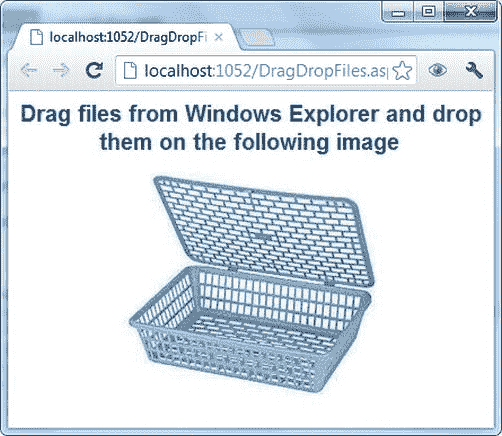

***图 9-9。**在网页表单上拖拽文件*

web 表单由一个`
`元素组成，其背景图像被设置为一个篮子的图像。您可以将文件从 Windows 资源管理器或桌面拖放到这个`
`元素上。`
`处理`drop`事件，并显示一个警告框，指示有多少文件被丢弃。清单 9-16 中的代码展示了如何处理所需的拖放事件。

***清单 9-16。**处理掉的文件*

`$(document).ready(function () {
  var container;
  container = document.getElementById("container");
  container.addEventListener("dragenter", OnDragEnter, false);
  container.addEventListener("dragover", OnDragOver, false);
  container.addEventListener("dragleave", OnDragLeave, false);
  container.addEventListener("drop", OnDrop, false);
});

function OnDragEnter(e) {
  e.stopPropagation();
  e.preventDefault();
}`  `function OnDragLeave(e) {
  e.stopPropagation();
  e.preventDefault();
}

function OnDragOver(e) {
  e.stopPropagation();
  e.preventDefault();
}

function OnDrop(e) {
  e.stopPropagation();
  e.preventDefault();
  var files = e.dataTransfer.files;
  alert(files.length + " file(s) dropped!");
}`

这段代码使用`addEventListener()`方法连接了四个事件的事件处理程序— `dragenter`、`dragover`、`dragleave`和`drop`。与购物车示例不同，函数`OnDragEnter`、`OnDragLeave`和`OnDragOver`除了调用`stopPropagation()`和`preventDefault()`方法之外，不做任何特殊的事情。jQuery `stopPropagation()`方法阻止事件在 DOM 树中冒泡，从而防止任何父处理程序收到事件通知。类似地，jQuery `preventDefault()`方法阻止了事件的默认动作。

如果您愿意，可以在这些事件处理程序中设置`dropEffect`或一个可视指示器。另外，请注意，您没有在任何地方设置`dataTransfer`对象。这是因为数据(本例中是文件)来自外部来源。注意`OnDrop`()事件处理函数:它使用`dataTransfer`对象的`files`属性来访问放在元素上的文件。然后显示使用`length`属性删除的文件数量。

要测试 web 表单，运行它:从 Windows 资源管理器中拖动几个文件，并把它们放到篮子里。一旦您删除了文件，您应该会看到一个包含已删除文件数量的警告。

### 读取文件并显示文件信息

现在您已经知道了选择文件的技术——文件字段、定制按钮和拖放——让我们看看如何使用文件 API 读取所选文件。为了理解这个过程，你开发一个类似于图 9-10 的 web 表单。

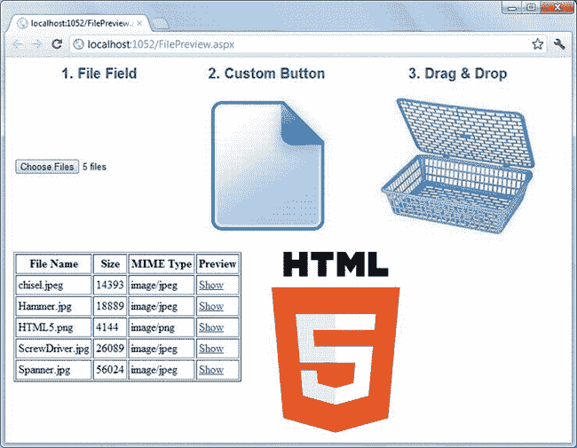

***图 9-10。**使用文件 API 读取文件*

web 表单分为两部分。顶部允许您使用所有三种技术选择图像文件。然后，所选文件的详细信息(如文件名、大小和 MIME 类型)会显示在底部的表格中。将鼠标悬停在表格每一行中提供的显示链接上，会在表格右侧显示该图像。web 表单的标记如清单 9-17 所示。

***清单 9-17。**显示图像预览的 Web 表单的标记*

`<form id="form1" runat="server">

  <table>
    <tr>
      <th>
        <asp:Label ID="Label1" runat="server" Text="1\. File Field"
                          CssClass="message">
        </asp:Label>
      </th>
      <th>
        <asp:Label ID="Label2" runat="server" Text="2\. Custom Button"
                           CssClass="message">
        </asp:Label>
      </th>
      <th>` `        <asp:Label ID="Label3" runat="server" Text="3\. Drag & Drop"
                           CssClass="message">
        </asp:Label>
      </th>
    </tr>
    <tr>
      <td>
**        <asp:FileUpload ID="FileUpload1" runat="server" AllowMultiple="True" />**
      </td>
      <td>
**        <asp:FileUpload ID="FileUpload2" runat="server" AllowMultiple="true"**
**                                   CssClass="hidden" />**
**        <asp:ImageButton ID="ImageButton1" runat="server"**
**          ImageUrl="~/img/UploadFile.jpg"/>**
      </td>
      <td>
**        

**
      </td>
    </tr>
  </table>

**  <table id="Table1" border="1" cellPadding="3"></table>**

**  **

</form>`

清单中的粗体元素对于 web 表单的功能非常重要。文件字段`FileUpload1`用于直接选择文件，而`FileUpload2`保持隐藏，当点击`ImageButton`时显示打开文件对话框。`
`元素`divBasket`是拖放目标，从 Windows 资源管理器拖动的文件可以放在这里。HTML 表`Table1`根据所选的文件使用 jQuery 动态填充。图像预览显示在`filePreview`图像元素中。

元素的各种事件被连接在文档的`ready()`事件处理程序中，如清单 9-18 所示。

***清单 9-18。**连接 HTML 元素的事件处理程序*

`var files;

$(document).ready(function () {
  $("#FileUpload1").change(OnChange);
  $("#FileUpload2").change(OnChange);

  $("#ImageButton1").click(function (evt) {
    $("#FileUpload2").click();
    evt.preventDefault();
  });

  var basket;
  basket = document.getElementById("divBasket");` `  basket.addEventListener("dragenter", OnDragEnter, false);
  basket.addEventListener("dragover", OnDragOver, false);
  basket.addEventListener("drop", OnDrop, false);
});`

这段代码声明了一个全局变量`files`，在代码的后面使用它来存储对所选文件的引用。两个文件字段控件的`change`事件连接到`OnChange`函数。类似地，`dragenter`、`dragover`和`drop`事件分别连接到`OnDragEnter`、`OnDragOver`和`OnDrop`函数。在所有这些事件处理程序中，`OnChange`和`OnDrop`非常重要，因为它们启动了生成文件表的过程。这两个事件处理程序如清单 9-19 所示。

***清单 9-19。** `OnChange`和`OnDrop`事件处理程序*

`function OnChange(evt) {
  files = evt.target.files;
  ShowFileDetails(files);
}

function OnDrop(evt) {
  evt.stopPropagation();
  evt.preventDefault();
  files = evt.dataTransfer.files;
  ShowFileDetails(files);
}`

`OnChange`事件处理函数使用文件字段控件的`files`属性获取选定的文件。注意`FileUpload1`和`FileUpload2`的`change`事件处理程序都是由`OnChange`处理的。所以，`evt.target`指的是各自的文件字段控件。`OnChange`然后调用一个助手函数`ShowFileDetails()`，它更新页面中显示的文件表。

`OnDrop`事件处理函数使用`dataTransfer`对象的`files`属性抓取文件并取消事件冒泡。然后调用`ShowFileDetails()`生成一个文件表。

注意，文件字段控件的`files`属性和`dataTransfer`对象的类型是`FileList`(参见前面的表 9-2 以快速回顾`FileList`对象)。`OnChange`和`OnDrop`事件处理程序使用的`ShowFileDetails()`函数如清单 9-20 所示。

***清单 9-20。**使用`File`对象*显示文件信息

`function ShowFileDetails(files) {
  $("#Table1").empty();
  $("#Table1").append("<tr><th>File Name</th><th>Size</th><th>MIME Type</th><th>Preview</th></
tr>");
  for (var i = 0; i < files.length; i++) {
   if (files[i].type == "image/jpeg" ||
       files[i].type == "image/png" ||
       files[i].type == "image/gif") {      
             $("#Table1").append("<tr><td>" + files.item(i).name +
                                               "</td><td>" + files[i].size +
                                               "</td><td>" + files[i].type +
                                               "</td><td><a href='#'
                                                 data-file-index='" +
                                                 i + "'>Show</a></td></tr>");` `    }
    else {
      alert("Only image files are allowed. Other files will be ignored!");
    }
  }
  $("a").hover(ShowPreview, HidePreview);
}`

`ShowFileDetails()`首先通过使用 jQuery `empty()`方法删除表中的所有行来清空表。然后，它遍历`FileList`并访问每个`File`对象来获取文件细节。因为该应用仅用于图像文件，所以会检查每个文件的扩展名。如果文件是图像文件(`.jpg`、`.jpeg`、`.png`或`.gif`)，则表格中会添加一个新行。这种检查是在`File`对象的`type`属性的帮助下完成的，该属性返回文件的 MIME 类型(`image/jpeg`、`image/png`等等)。`name`属性返回带有扩展名的文件名，但不包括路径信息。属性返回文件的大小，以字节为单位。

您可以使用典型的集合语法(`files[i]`)或使用`FileList`对象的`item()`方法来访问单个的`File`对象。显示超链接使用自定义的`data-*`属性`data-file-index`存储文件的索引。通过这种方式，您可以确定要显示哪个图像。

当您将鼠标悬停在显示链接上时，会显示实际的图像预览。jQuery `hover()`方法将两个处理函数绑定到当鼠标指针进入和离开超链接时调用的`hyperlink`元素。`ShowPreview()`和`HidePreview()`功能如清单 9-21 所示。

***清单 9-21。**显示图像预览*

`function ShowPreview(evt) {
  var reader = new FileReader();
  $(reader).bind("load",function (e) {
    var imgSrc = e.target.result;
    $("#filePreview").attr('src',imgSrc);
  });
  var fileIndex = $(evt.target).attr('data-file-index');
  reader.readAsDataURL(files[fileIndex]);
}

function HidePreview(evt) {
  $("#imgPreview").attr('src', '');
}`

`ShowPreview()`函数创建一个`FileReader`的实例。`FileReader`对象以异步方式读取文件，并在成功读取文件时引发一个`load`事件。这就是为什么在读取文件之前需要附加`load`事件的事件处理程序。使用`FileReader`对象的`readAsDataURL()`方法读取文件。`readAsDataURL()`以数据 URL (Base64 编码)的形式将文件内容提供给`load`事件处理程序。可以使用`e.target`对象的`result`属性来访问这些内容。`load`事件处理程序使用`FileReader`对象的`result`属性检索文件内容，然后将图像的`src`属性设置为图像内容。

`HidePreview()`方法只是删除图像的`src`属性。

### 上传文件到服务器

文件 API 读取的文件不一定要上传到服务器。然而，在大多数情况下，您将它们上传到服务器进行处理或存储。当然，您可以根据处理逻辑丢弃一些选定的文件，并上传选定文件的子集。就文件 API 而言，它在将文件上传到服务器的过程中不起任何作用。您有责任设计一种机制，负责将所需的文件上传到服务器。

使用文件字段控件或自定义按钮上传选定的文件很容易，因为您需要做的只是将 web 表单`POST`到服务器。在服务器端代码中，你可以访问所选择的文件，如清单 9-22 所示。

***清单 9-22。**通过`POST`网页形式上传文件*

`foreach (HttpPostedFile file in FileUpload1.PostedFiles)
{
    string fileName = file.FileName;
    fileName = Server.MapPath("~/uploads/" + fileName);
    file.SaveAs(fileName);
}`

在服务器端代码中，使用了`FileUpload`控件的`PostedFiles`集合。`PostedFiles`的每个元素都属于`HttpPostedFile`类型。`HttpPostedFile`类的`SaveAs()`方法允许你将上传的文件保存到服务器。

上传使用拖放技术选择的文件有点棘手。这是因为选择的文件不属于一个`<form>`控件，因此它们不会`POST`到服务器。您需要以编程方式将它们发送到服务器。jQuery `$.ajax()`方法在这里也派上了用场。清单 9-23 展示了如何使用`$.ajax()`上传文件。

***清单 9-23。**使用`$.ajax()`上传文件*

`function UploadFiles() {
  var data = new FormData();
  for (var i = 0; i < files.length; i++) {
    data.append(files[i].name, files[i]);
  }
  $.ajax({
    type: "POST",
    url: "UploadFiles.ashx",
    contentType: false,
    processData: false,
    data: data,
    success: function (result) {
      alert(result);
    },
    error: function () {
      alert("There was error uploading files!");
    }
  });
}`

这个清单显示了将所选文件上传到服务器的`UploadFiles()`函数。您不能将`File`对象从`FileList`直接发送到服务器；你首先需要把它们转换成`FormData` 对象。顾名思义，`FormData`对象表示应该伴随请求的表单数据。`FormData`对象的`append()`方法允许你添加你想要上传的单个文件。代码向通用处理程序`UploadFiles.ashx`发出一个`POST`请求，该处理程序负责接受发布的文件并将它们保存在服务器上。成功上传文件后，会向用户显示一条成功消息。

注意，`$.ajax()`调用将`contentType`和`processData`选项设置为`false`。您不需要提供内容类型，因为`FormData`对象默认为内容类型`multipart/form-data`。如果没有将`processData`选项设置为`false`，`$.ajax()`会自动将发布的数据转换为 URL 编码的形式，这是不希望的。

清单 9-24 展示了使用`$.ajax()`方法编辑的文件`POST`是如何在服务器端使用通用处理程序`UploadFiles.ashx`处理的。

***清单 9-24。**使用通用处理程序保存上传的文件*

`public void ProcessRequest(HttpContext context)
{
    if (context.Request.Files.Count > 0)
    {
        HttpFileCollection files = context.Request.Files;
        foreach (string key in files)
        {
            HttpPostedFile file = files[key];
            string fileName = file.FileName;
            fileName = context.Server.MapPath("~/uploads/" + fileName);
            file.SaveAs(fileName);
        }
    }
    context.Response.ContentType = "text/plain";
    context.Response.Write("File Uploaded Successfully!");
}`

通用处理程序的`ProcessRequest()`方法将发布的文件保存在服务器上。ProcessRequest()接收`HttpContext`作为参数。这可用于访问固有对象，如`Request`、`Response`和`Server`。

使用`Request.Files`集合访问上传的文件。集合中的每个元素都属于类型`HttpPostedFile`。`HttpPostedFile`类的`SaveAs()`方法允许你在服务器上保存文件。一旦保存了所有文件，就会向客户端发送一条成功消息。该消息显示在`$.ajax()`调用的`success`功能中。

### 在 ASP.NET MVC 中使用文件 API

在本节中，您将开发一个使用文件 API 的 ASP.NET MVC 应用。该应用有两个目的:将 XML 文件上传到服务器，并根据 XSD 模式验证上传的文件。

假设一个桌面应用将其数据作为 XML 文件存储在本地机器上。您需要定期将这样生成的 XML 文件上传到中央 web 服务器进行进一步处理。这种应用可以使用文件 API 来完成以下任务:

> *   Ensure that only XML files are uploaded to the server.
> *   Check whether the XML file contains specific XML tags. Although this kind of verification can't replace XSD schema verification, it can be used as the first-level verification.
> *   Displays a preview of the XML file being uploaded to the server.

您在本节开发的应用类似于图 9-11 。

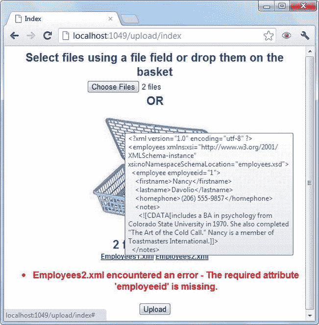

***图 9-11。【ASP.NET 上传 XML 文件的 MVC 应用***

该应用允许您使用文件字段控件或通过从 Windows 资源管理器中拖动来选择文件。选择文件后，所选文件的数量会显示在购物篮下方，同时会显示一个文件名列表作为链接。如果将鼠标悬停在文件名上，链接的工具提示中将显示文件内容的简短预览(最多 500 个字符)。单击“上传”按钮时，所有文件都会上传到服务器，并根据 XSD 模式进行验证。如果上传的 XML 文件与模式规范不匹配，则会返回一个错误。

XML 文件上传应用的工作原理与您之前开发的图像预览应用相同；因此，本节仅关注不同的领域。清单 9-25 显示了应用索引视图的标记。

***清单 9-25。**XML 文件上传应用的索引视图*

`<% using (Html.BeginForm()) { %>
  

     Select files using a field field or drop them on the basket
  

  <%= Html.TextBox("file1", "",new {type="file",multiple="multiple"})%>
  
OR

  

  

  

  <input id="upload" type="button" value="Upload" />
<%}%>`

`<form>`由一个文件字段控件和一个作为拖放目标的篮子`
`元素组成。上传按钮触发文件上传操作。连接各种事件处理程序的 jQuery 代码如清单 9-26 所示。

***清单 9-26。**为拖放事件连接事件处理程序*

`var files;
$(document).ready(OnChange);
  var basket;
  basket = document.getElementById("basket");
  basket.addEventListener("dragenter", OnDragEnter, false);
  basket.addEventListener("dragleave", OnDragLeave, false);
  basket.addEventListener("dragover", OnDragOver, false);
  basket.addEventListener("drop", OnDrop, false);

  $("#upload").click(UploadFiles);
});`

这段代码声明了一个全局变量`files`，在代码的后面使用它来存储对所选文件的引用。文件字段的`change`事件处理程序连接到`OnChange`函数。类似地，`dragenter`、`dragleave`、`dragover`和`drop`分别连接到`OnDragEnter`、`OnDragLeave`、`OnDragOver`和`OnDrop`。`OnChange`和`OnDrop`事件很重要，如清单 9-27 所示。

***清单 9-27。** `OnChange`和`OnDrop`事件处理程序*

`function OnChange(evt) {
  files = evt.target.files;
  ShowFileDetails();
}

function OnDrop(e) {
  e.stopPropagation();
  e.preventDefault();
  files = e.dataTransfer.files;
  ShowFileDetails();
}`

`OnChange`事件处理函数使用文件字段控件的`files`属性抓取选定的文件。`OnChange`然后调用一个助手函数`ShowFileDetails()`，该函数显示被选作锚元素的文件列表。

`OnDrop`使用`dataTransfer`对象的`files`属性抓取文件并取消事件冒泡。`ShowFileDetails()`是后来的称呼。

`ShowFileDetails()`函数如清单 9-28 中的所示。

***清单 9-28。** `ShowFileDetails()`功能*

`function ShowFileDetails() {
  var html = "";
  html += files.length + " files selected!";
  html += "
"
  for(var i=0;i<files.length;i++)
  {
    if (files[i].type == "text/xml") {
      html += "<a href='#' data-file-index='" + i + "'>" + files[i].name + "</a>  ";
    }
    else {
      html += "" + files[i].name + "  ";
    }
  }
  html += "
";
  $("#filecount").html(html);
  $("a").hover(ShowPreview,HidePreview);
}`

该应用仅用于上传 XML 文件，因此只能预览 XML 文件。`ShowFileDetails()`遍历选定的文件(`files`全局变量)并检查每个`File`对象的`type`属性。对于 XML 文件，type 属性返回`text/xml`；只有这样的文件名才会显示为锚点。其他文件类型显示为``元素，因此无法预览。

jQuery `hover()`方法将鼠标指针进入和离开超链接时调用的两个处理函数绑定到超链接元素。`ShowPreview()`函数负责在工具提示中显示 XML 文件的简短预览。这是通过设置相应锚元素的`title`属性来实现的。清单 9-29 显示`ShowPreview()`。

***清单 9-29。** `ShowPreview()`功能*

`function ShowPreview(evt) {
  evt.stopPropagation();
  evt.preventDefault();
  var reader = new FileReader();
  $(reader).bind("load", function (e) {
    var xmlData = e.target.result;
    if (xmlData.length > 500) {
      xmlData = xmlData.substr(0, 500);
    }
    $(evt.target).attr('title', xmlData);
  });
  var fileIndex = $(evt.target).attr('data-file-index');
  reader.readAsText(files[fileIndex]);
}`

`ShowPreview()`创建一个`FileReader`对象。因为 XML 文件本质上是文本文件，所以使用了`readAsText()`方法来读取文件。`FileReader`的`load`事件处理程序使用`result`属性访问 XML 文件内容。XML 文件可能非常大，出于预览目的，只提取文件的一部分(最多 500 个字符)。然后将底层锚元素的`title`属性设置为提取的 XML 数据。

在这种情况下,`HidePreview()`函数不会做任何特殊的事情，因为当鼠标指针离开一个超链接时，浏览器会自动隐藏工具提示。

将 XML 文件上传到服务器的任务由`UploadFiles()`函数完成，如清单 9-30 所示。

***清单 9-30。** `UploadFiles()`功能*

`function UploadFiles() {
  var data = new FormData();
  for (var i = 0; i < files.length; i++) {
    if (files[i].type == "text/xml") {
      data.append(files[i].name, files[i]);
    }
  }
  $.ajax({
    type: "POST",
    url: "/Upload/UploadFiles",
    contentType: false,
    processData: false,
    data: data,
    success: function (result) {
      $("#errors").empty();
      $("#errors").html(result);
    },
    error: function () {
      alert("There was error uploading files!");
    }
  });
}`

`UploadFile()`遍历所选文件，仅将 XML 文件追加到一个`FormData`对象。然后，`$.ajax()`方法向`Upload`控制器的`UploadFiles()`动作方法发出`POST`请求。`contentType`和`processData`选项和以前一样设置为`false`。如果有任何模式验证错误，它们会显示在一个`
`元素中。

保存和验证 XML 文件的`UploadFiles()`动作方法如清单 9-31 所示。

***清单 9-31。** `UploadFiles()`动作方法*

`[HttpPost]
public JsonResult UploadFiles()
{
    if (Request.Files.Count > 0)
    {
        HttpFileCollectionBase files = Request.Files;
        foreach (string key in files)
        {
            HttpPostedFileBase file = files[key];` `            string fileName = file.FileName;
            fileName = Server.MapPath("~/Content/Uploads/" + fileName);
            file.SaveAs(fileName);

**            XmlReaderSettings settings = new XmlReaderSettings();**
**            settings.Schemas.Add("", Server.MapPath("~/Content/Employees.xsd"));**
**            settings.ValidationType = ValidationType.Schema;**
**            settings.ValidationEventHandler += OnValidationError;**
**            XmlReader reader = XmlReader.Create(fileName, settings);**
**            while (reader.Read())**
**            {**
**            }**
**            reader.Close();**
        }
    }
    Response.ContentType = "text/plain";
    StringBuilder sb = new StringBuilder();
    sb.Append("<ul>");
    foreach (string error in errors)
    {
        sb.Append("<li>" + error + "</li>");
    }
    sb.Append("</ul>");
    return Json(sb.ToString());
}

void OnValidationError(object sender, ValidationEventArgs e)
{
    string fileName = Path.GetFileName(((XmlReader)sender).BaseURI);
    errors.Add(fileName + " encountered an error - " + e.Exception.Message);
}`

清单 9-31 中保存上传的 XML 文件的代码与前面的例子相同。粗体标记的代码负责根据 XSD 模式文件来验证 XML 文件:`Employees.xsd`。`Employees.xsd`模式文件期望 XML 标记的格式如清单 9-32 所示。

***清单 9-32。**样本 XML 文件*

`<?xml version="1.0" encoding="utf-8" ?>
<employees>
  <employee employeeid="1">
    <firstname>Nancy</firstname>
    <lastname>Davolio</lastname>
    <homephone>(206) 555-9857</homephone>
    <notes>
      <![CDATA[...]]>
  </notes>
  </employee>`

虽然这个例子使用了一个固定的模式文件，但是您可以根据条件选择一个模式文件。`XmlReader`类用于读取 XML 文档。`XmlReaderSettings`类将`Employees.xsd`附加到`XmlReader`上。当您调用`XmlReader`类的`Read()`方法时，会读取 XML 文档并根据模式对进行验证。如果有任何验证错误，就会引发`ValidationEventHandler`事件。事件处理函数`OnValidationError`将 XML 文件名和错误消息存储在一个通用列表中。

一旦所有上传的 XML 文件都通过了验证，代码就会遍历一般的错误列表，并创建一个错误消息列表。错误列表通过转换成 JSON 格式返回给 jQuery `success`函数。

要测试这个应用，运行它并尝试上传 XML 文件——一些匹配模式，一些违反模式(例如，保留一些没有`employeeid`属性的`<employee>`元素)。对于任何无效的 XML 文件，您都应该得到错误消息。

### 总结

HTML5 的文件 API 允许您读取驻留在用户本地文件系统中的文件。但是，用户必须使用文件字段控件的“打开文件”对话框或通过将文件从 Windows 资源管理器拖放到网页的预定义区域来显式选择文件。

文件 API 由三个主要对象组成:`File`、`FileList`和`FileReader`。`File`对象给出了关于文件的信息，比如它的名称、大小和 MIME 类型。`FileList`对象是`File`对象的集合，通过文件字段的`files`属性或`dataTransfer`对象的`files`属性获得。`FileReader`对象让您以异步方式读取选定的文件。

虽然拖放是 HTML5 的一个独立功能，但它可以与文件 API 结合使用，以增强用户体验。可以使用`$.ajax()`方法将选定的文件上传到服务器。

下一章介绍了另一个有趣的特性——Web 工作器——它允许您在后台运行代码。Web 工作器 就像多线程桌面应用中使用的线程，它们允许您在后台运行冗长的进程，而不会妨碍用户界面。