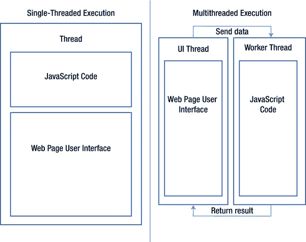
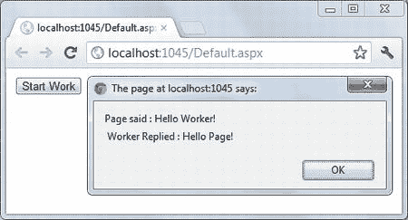
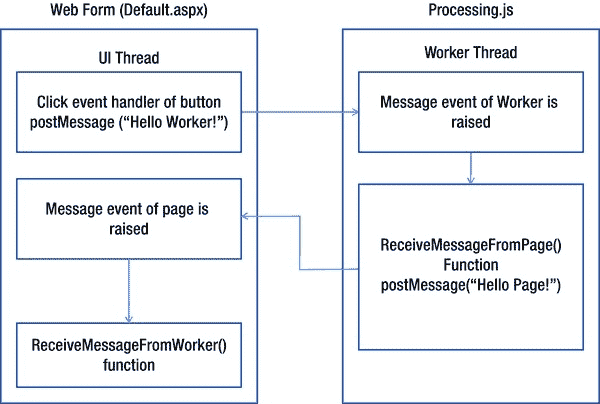
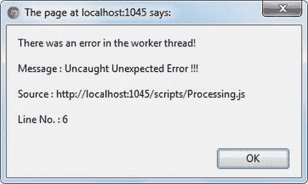
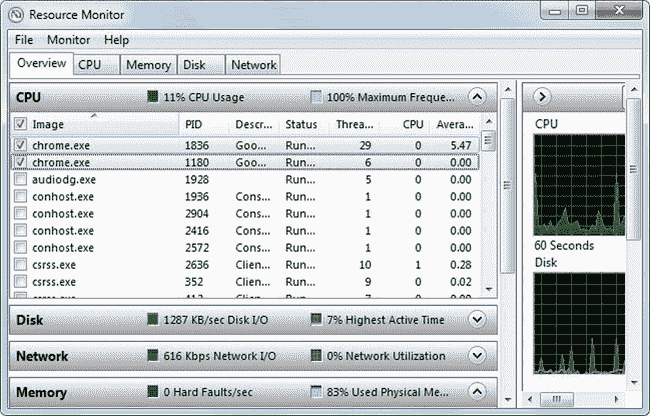
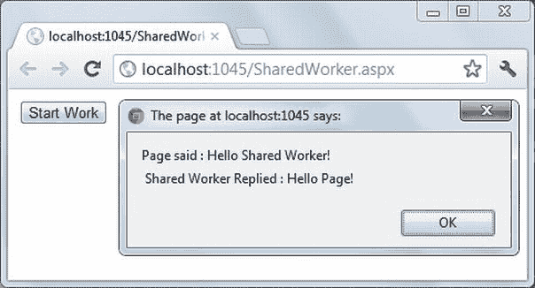
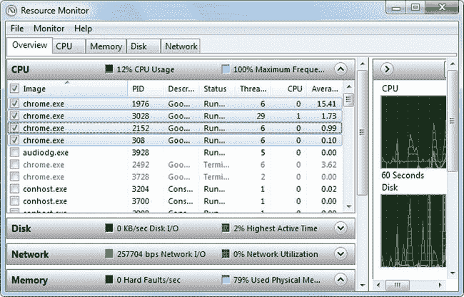
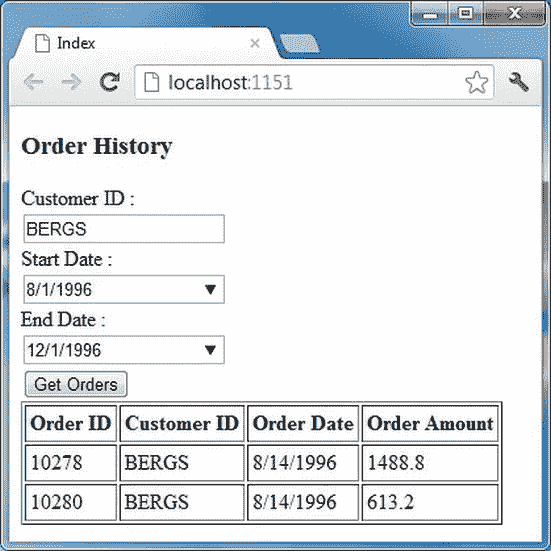
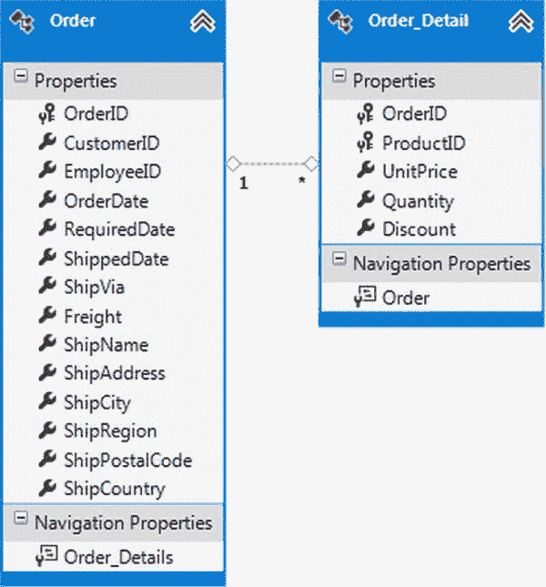

# 十、将 Web 工作器用于网页中的多线程处理

JavaScript 的创造者发明了这种语言作为开发交互式网页的辅助工具。HTML 标记本身本质上是纯静态的，缺乏任何编程能力。JavaScript 的引入弥补了这种可编程性的不足。考虑到当时的需求，JavaScript 被创建为一种简单、轻量级、易于使用的语言。

在早期，JavaScript 主要用于为静态网页添加交互性和精美的图形效果。然而，多年来情况发生了巨大变化。现代 web 应用广泛依赖 JavaScript 来完成各种任务。现代 web 应用的网页不再仅仅使用 JavaScript 来制作精美的悬停效果或动画。它非常依赖 JavaScript 进行业务验证、对服务器进行 Ajax 调用以及特定于业务领域的处理。

使用 JavaScript 的网页在前台执行脚本。这意味着只要脚本运行，用户与页面的交互就会被阻止。换句话说，用户交互和脚本运行在一个线程上。当脚本执行密集且耗时的操作时，这种方法可能会很麻烦。为了克服这个限制，HTML5 和 JavaScript 提供了 *Web 工作器* ，允许您在后台运行 JavaScript 处理。本章让你对网络工作者有一个详细的了解。具体来说，您将了解以下内容:

> *   What is web worker and how it works?
> *   网络工作者的风味
> *   Restrictions on webworkers
> *   Using web worker to Develop Multithreaded Web Pages
> *   Communication with server from worker thread

### 网页多线程概述

如果你曾经用 C#或 Visual Basic 开发过桌面应用，你很可能知道位于`System.Threading`名称空间中的`Thread`类。`Thread`类代表一个线程。一根*螺纹*是加工的最小单位。当您运行任何应用时，应用代码都在一个线程上运行。线程由操作系统处理，大多数现代编程语言都提供了封装它们的类。一个*单线程应用*在单线程中运行所有代码(包括用户界面和业务处理)。一个*多线程应用*在多个线程中运行应用代码。

多线程应用具有以下优势:

> *   It can significantly improve the user response ability of the application. This advantage is very useful when you are developing web applications. With multithreading, you can keep the user interface responsive when the script runs in the background, instead of your JavaScript code blocking user interaction.
> *   It can improve the overall performance of your application. However, this advantage depends on several other factors, such as the number of CPUs and whether the code runs locally or remotely. Although the detailed discussion of how multithreading affects the performance of applications is beyond the scope of this book, it can be said that multithreading can improve the performance of applications running on multi-processor machines instead of single-processor machines. This is because multiprocessor machines can run different threads on different processors at the same time, thus improving performance.

现在您已经对单线程和多线程应用有了基本的了解，让我们将这些概念应用到网页中。考虑清单 10-1 中显示的标记。

***清单 10-1。**在单线程中运行 UI 和 JavaScript 的网页*

`<head>
     …
    
</head>
<body>
…
      <input id="button1" type="button" value="Click" />
…
</body>`

这个标记由一个按钮和一个单击按钮时执行的 JavaScript 块组成。`ready()`函数使用 Modernizr 来检查浏览器是否支持 Web 工作器。这是通过检查 Modernizr 对象的`webworkers`属性来完成的。如果浏览器不支持 Web 工作器，则会向用户显示一条错误消息。

按钮的`click`事件处理程序首先显示一个警告框来指示处理的开始。`do` - `while`条件是这样写的，它简单地循环 10 秒。通过计算当前日期时间和循环操作开始时的日期时间之间的差值来实现循环。`do` - `while`循环旨在模拟冗长的处理过程。在现实世界的应用中，您有实际的业务处理，而不是循环。一旦退出循环，另一个警告框会标记处理结束。

如果您在浏览器中运行此网页并单击按钮，您显然会看到开始和结束警告框；但更重要的是，您会发现当循环运行时，网页的 UI 变得没有响应。在此期间，您的浏览器停止响应键盘输入和鼠标操作，如单击和滚动。这些操作可能会在`do` - `while`循环结束时排队播放，但只要循环在运行，UI 就没有响应。这个瓶颈的原因是 UI 和 JavaScript 运行在同一个线程上。因此，在任何给定时间，要么脚本可以运行，要么 UI 可以运行。

如果在自己的线程中运行 JavaScript 代码，就可以避免 UI 瓶颈。考虑图 10-1 。

***图 10-1。**网页中的单线程和多线程执行*

请看图中所示的单线程执行模型。在这种情况下，同一个线程运行 JavaScript 代码并处理用户交互。现在看看多线程执行模型。这里，UI 由一个专用线程(UI 线程)处理，JavaScript 在它自己的线程中执行。运行 JavaScript 的线程通常被称为*工作线程*，因为它的主要工作是处理。通常，工作线程不能访问 UI 级元素。然而，它可以从 UI 线程接收输入，并可以将处理结果返回给 UI 线程。在多线程模型中，UI 线程也被称为*前台线程*，工作线程被称为*后台线程*。在 HTML5 术语中，工作线程被称为 *web 工作线程*，由`Worker`对象表示。

图 10-1 只显示了一个工作线程，但是你可以生成任意多的线程。但是请记住，每个额外的线程都有开销，最终可能会降低应用的性能。在许多 web 应用中，仅仅一个工作线程就足以满足后台处理需求。

### 网络工作者的类型

HTML5 Web 工作器 有两种风格:专用的和共享的。专门的网络工作者依附于创造他们的网页。它们随着相关网页的出现而消失。它们的作用域是创建它们的网页。换句话说，专用 Web 工作器 只能由单个网页使用。一个专用的 web worker 由`Worker`对象表示。

*共享* Web 工作器 是由一个 web 页面创建的，但是一旦创建，它们就可以由同一个 web 应用中的多个 web 页面共享(也就是说，具有相同的来源)。创建 web worker 需要资源。如果您发现自己在 web 应用的许多页面中执行相同的脚本，您可能希望使用共享 Web 工作器，而不是在每个 web 页面中创建一个新线程。然而，与专用的 Web 工作器 相比，它们的编码更复杂，最好只在需要跨多个应用页面共享一个线程的情况下使用。一个共享的 web worker 由`SharedWorker`对象表示。

### 网络工作者可以访问什么，不可以访问什么

尽管 web 工作者通过在单独的线程中运行 JavaScript 处理来解决 UI 阻塞的问题，但他们也需要仔细设计 JavaScript 代码。正如前面提到的，Web 工作器 是工作线程，不能有任何 UI 级的访问。这意味着您不能访问您打算使用 Web 工作器 运行的 JavaScript 代码中的任何 DOM 元素。这意味着以下几点:

> *   Web 工作器 cannot access HTML elements from the web page.
> *   Web 工作器 cannot access global variables and JavaScript functions from Web pages.
> *   Web worker can't use `alert()` `confirm()` and other functions that need users' attention.
> *   You can't access `window`, `document`, `parent` and other objects in web-worker code.
> *   You cannot use jQuery library in web worker code.

你可能想知道为什么 web 工作者不能访问 HTML DOM。这种限制背后的主要原因是这样做不是线程安全的。例如，假设两个 Web 工作器 正在后台运行。如果两者都被允许访问 HTML DOM，那么一个 web worker 可能会意外地覆盖另一个 web worker 所做的更改。在多线程之间没有任何同步的情况下，这样的执行必然会产生不希望的结果。这就是 HTML5 Web 工作器 不允许单个工作线程访问 DOM 元素的原因。当您将数据从网页传递到 web 工作线程时，数据的副本将被发送到工作线程。每个工作线程都维护自己的本地数据。

“禁止 DOM 访问”规则的一个副作用是，您不能在 Web 工作器 中使用 jQuery 库。jQuery 库与 HTML DOM 绑定在一起，允许它将违反前面的规则。这可能有点痛苦，因为即使是像`$.ajax()`这样的方法也不能在 Web 工作器 中使用。幸运的是，您可以使用`XMLHttpRequest`对象来发出 Ajax 请求。

您可以在 web worker 代码中访问 navigator 和 location 对象。您也可以在 Web 工作器 中使用`setTimeout()`、`setInterval()`、`clearTimeout()`和`clearInterval()`方法。

?? 注第十一章中的`XMLHttpRequest`对象已涵盖。出于本章的目的，知道`XMLHttpRequest`是一个允许您向服务器端资源发出请求(GET/POST)的对象就足够了。不使用`$.ajax()`方法，你可以使用`XMLHttpRequest`对象来调用 web 方法、MVC 动作方法和通用处理程序。

### 使用网络工作者

既然你对什么是网络工作者以及他们能做什么有了一个基本的了解，让我们转换来自清单 10-1 的网页，这样它就不会阻塞 UI。这实际上要求在工作线程中运行处理逻辑(`do` - `while`循环)，以释放 UI 线程来处理用户交互。清单 10-2 展示了如何做到这一点。

***清单 10-2。**创建网络工作者*

``

这段代码在 web 表单中创建了一个全局变量`worker`。这个全局变量用于存储您在按钮的`click`事件处理程序中创建的 web worker 对象。`ready()`函数连接`btnStart`的`click`事件处理程序。在`click`事件处理程序中，代码创建了一个新的`Worker`对象。您希望在工作线程中执行的 JavaScript 代码放在一个单独的脚本文件中。包含要在`Worker`中执行的 JavaScript 代码的脚本文件(`scripts/processing.js`)的路径被传递给构造函数。

虽然不是强制性的，但通常您会对从工作线程接收处理结果感兴趣，以便了解结果。`Worker`对象的`message`事件让您可以监听工作线程发送的消息。`addEventListener()`方法将`message`事件连接到`ReceiveMessageFromWorker()`函数。`ReceiveMessageFromWorker()`是一个开发人员定义的函数，稍后将会讨论。然后代码调用`Worker`对象的`postMessage()`方法。`postMessage()`作为启动工作线程的触发器。您可以将输入数据作为参数传递给它。尽管代码将一个字符串传递给工作线程，但是数据也可以是其他形式，比如 JSON 对象。如果不想传递任何数据，可以简单地传递一个空字符串。

`ReceiveMessageFromWorker()`显示工作线程返回的处理结果，如下所示:

`function ReceiveMessageFromWorker(evt) {
  alert(evt.data);
}`

`evt.data`属性返回工作线程发送的处理结果。实际的处理(`do` - `while`循环)现在驻留在`Processing.js`脚本文件中(参见清单 10-3 )。

***清单 10-3。**在工作线程中运行的代码*

`addEventListener("message", ReceiveMessageFromPage, false);

function ReceiveMessageFromPage(evt) {
    var date = new Date();
    var currentDate = null;
    do {
        currentDate = new Date();
    }
    while (currentDate - date < 10000);
    postMessage("Page said : " + evt.data + "\r\n Worker Replied : Hello Page!" );
}`

之前，您连接了 web 页面的`message`事件处理程序来接收工作线程发送的消息。同样，您需要为`Worker`连接`message`事件处理程序，以接收 web 表单发送的消息。清单 10-3 中的`addEventHandler()`调用完成了这项工作。当 web 表单调用`Worker`对象上的`postMessage()`方法时，引发工作线程的`message`事件。在这种情况下，`Worker`的`message`事件由`ReceiveMessageFromPage()`函数处理。

`ReceiveMessageFromPage()`包含与之前相同的`do` - `while`循环。但是，请注意，没有`alert()`调用，因为工作线程不能进行用户交互。一旦`do` - `while`循环完成，工作线程调用`postMessage()`将处理结果发送回 web 表单。注意 web 表单发送的数据(“Hello Worker！”)是使用`evt.data`属性在`ReceiveMessageFromPage()`中检索的。

图 10-2 显示了一个网络表单的运行示例。

***图 10-2。** `Processing.js`运行中的一个工作线程*

web 表单传递字符串“Hello Worker！”到工作线程。工作线程通过在`evt.data`值前面加上“Page said:”和后缀“Worker reply:Hello Page！”来形成一个字符串。然后，该字符串被返回到 web 表单。web 表单中编写的`ReceiveMessageFromWorker()`函数在一个`alert()`框中显示返回值。使用 web worker 对象，当您单击“开始工作”按钮时，UI 不会被阻止。您可以自由地与页面交互，因为处理是在后台进行的。当处理完成时，会通知您并显示处理结果。

为了使 web 表单和工作线程之间的交互更加清晰，图 10-3 以图示的形式显示了该应用的工作。

***图 10-3。**网络工作者执行的图示*

如图所示，执行顺序如下:

> 1.  The user clicks the start worker button.
> 2.  `postMessage()` is a form of address, and "Hello worker!" Sent to the worker thread.
> 3.  The worker's `message` event is raised, and the `ReceiveMessageFromPage()` function handles it.
> 4.  `postMessage()` Called, and "Hello page!" Is returned to the page.
> 5.  The `message` event of the page is triggered and handled by the `ReceiveMessageFromWorker()` function.
> 6.  A warning box is displayed to the user.

### 导入外部脚本文件

在前面的示例中，整个处理逻辑包含在一个文件中。有时，您的处理逻辑可能驻留在不同的脚本文件中。在一个普通的网页中，一个或多个``

这段代码创建了一个名为`worker`的全局变量来保存`SharedWorker`引用。`ready()`函数连接开始工作按钮的`click`事件处理程序。在`click`事件处理程序中，创建了一个`SharedWorker`的实例。这个共享 web worker 应该运行的 JavaScript 文件路径(`SharedProcessing.js`)在构造函数中传递。

在使用`Worker`对象的情况下，会在该对象上引发`message`事件。然而，在`SharedWorker`的例子中，`message`事件是在`SharedWorker`实例的`port`对象上引发的。这就是为什么在`port`对象上调用`addEventListener()`方法的原因。`addEventListener()`将事件处理函数`ReceiveMessageFromWorker()`连接到`message`事件。接下来，您需要调用`port`对象的`start()`方法来启动那个端口。最后，在`port`对象上调用`postMessage()`，并向共享工作线程发送一个字符串消息。充当`message`事件处理程序的`ReceiveMessageFromWorker()`函数如下:

`function ReceiveMessageFromWorker(evt) {
  alert(evt.data);
}`

这个函数只是在一个警告框中显示由共享工作线程发回的数据。

这就完成了 web 窗体级代码。现在让我们看看`SharedProcessing.js`文件中的内容(清单 10-6 )。

***清单 10-6。**运行在共享 Web Worker 中的代码*

`var port;
addEventListener("connect", ReceiveMessageFromPage, false);

function ReceiveMessageFromPage(evt) {
    port = evt.ports[0];
    port.addEventListener("message", SendMessageToPage, false);
    port.start();
}

function SendMessageToPage(evt) {
    var date = new Date();
    var currentDate = null;
    do {
        currentDate = new Date();
    }
    while (currentDate - date < 10000);
    port.postMessage("Page said : " + evt.data +
                                  "\r\n Shared Worker Replied : Hello Page!");
}`

这段代码首先创建一个名为`port`的全局变量来保存对一个`port`对象的引用。每当一个新的`SharedWorker`对象获得对共享工作线程的引用时，就会引发`connect`事件。要从存在`SharedWorker`对象的 web 表单接收任何消息，您需要处理这个事件。`addEventListener()`方法将一个事件处理函数`ReceiveMessageFromPage()`附加到`connect`事件。

`ReceiveMessageFromPage()`事件处理函数使用`evt.ports[0]`获取传入通信的`port`对象。虽然看起来`ports`数组可能有不止一个 `port`对象，但是在当前共享 Web 工作器 的实现中，`ports`数组中总是只有一个端口；因此，您在数组索引 0 处访问了`port`对象。

`addEventListener()`方法为`port`对象的`message`事件连接了一个事件处理函数`SendMessageToPage()`。`port`对象的`start()`方法启动通信通道。

 **注意**虽然在这个例子中没有用到，`port`对象也有一个`close()`方法。此方法关闭一个端口并停止该端口上的任何进一步通信。

`SendMessageToPage()`事件处理函数包含与之前相同的处理逻辑(`do` - `while`循环)。为了将处理结果发送回 web 表单，在`port`对象上调用`postMessage()`。使用`evt.data`属性检索 web 表单发送的字符串消息，并向其追加额外的字符串数据。

如果您运行 web 表单并点击开始工作按钮，您应该会看到如图图 10-6 所示的警告框。

***图 10-6。**行动中的共享网络工作者*

图 10-6 显示共享 web worker 正在正确执行脚本。如果您希望看到使用共享 Web 工作器 对线程利用率的影响，打开资源监视器，像以前一样查看`Chrome.exe`的条目(图 10-7 )。

图 10-7 显示了当 web 表单在两个 Chrome 标签中打开时的资源监视器。对于`Chrome.exe`，总共有四个活动条目。有 29 个线程的是主浏览器窗口。每个打开的标签需要 6 个线程。因此，这两个 6 个线程的条目分别用于加载 web 表单的两个选项卡。第一次单击“开始工作”按钮时，会创建另一组 6 个线程；它们用于运行共享的 Web 工作器。如果多次单击 Start Work，线程数不会进一步增加，因为先前创建的共享工作线程会被后续请求重用。

 **注意**在共享 web worker 中运行的脚本的后续执行获得全局变量的先前状态。此外，如果一个共享 web worker 已经被一个页面使用，其他对访问同一个共享 web worker 感兴趣的页面需要等待，直到当前处理完成。

***图 10-7。**使用资源监视器观察共享工作线程*

### 与服务器通信

Web 工作者可能需要向服务器端资源发出请求才能正常工作。例如，在 web worker 中运行的脚本可能需要检索驻留在 SQL Server 数据库中的数据。为了满足这个需求，您可能会立即想到使用 jQuery `$.ajax()`方法。毕竟，在本书中，您一直在使用 jQuery 对服务器进行 Ajax 调用。但是，您不能将 jQuery 用于 Web 工作器，因为 jQuery 需要 DOM 访问。如前所述，web 工作者不能访问任何 DOM 元素。因此，如果您希望对服务器进行 Ajax 调用，您需要使用`XMLHttpRequest`对象。

清单 10-7 使用`XMLHttpRequest`来访问服务器端资源。

***清单 10-7。**使用`XMLHttpRequest`对象进行 Ajax 调用*

`function GetOrders(customerId) {
    var xhr = new XMLHttpRequest();
    xhr.open("POST", "/Home/GetOrders");
    xhr.setRequestHeader('Content-Type', 'application/json');
    xhr.onreadystatechange = function () {
        if (xhr.readyState == 4) {
            postMessage(xhr.responseText);
        }
    }
    var param = '{ "customerid": "' + customerId + '"}';
    xhr.send(param);
}`

这段代码显示了一个 JavaScript 函数——`GetOrders()`——用于从 SQL Server 中检索特定客户的订单数据。`GetOrders()`函数接受一个要检索其订单的客户 ID。

在内部，该函数创建了一个新的`XMLHttpRequest`实例。`XMLHttpRequest`对象的`open()`方法通过远程请求打开一个通信通道。`open()`方法的第一个参数是请求的类型(GET/POST ),第二个参数是远程资源的位置。在这个例子中，一个 POST 请求被发送给一个名为`GetOrders`的 MVC 动作方法。`XMLHttpRequest`对象的`setRequestHeader()`方法将请求的 MIME 内容类型设置为`application/json`。

当请求的状态改变时，`XMLHttpRequest`对象引发`onreadystatechange`事件。`onreadystatechange`事件处理函数检查`XMLHttpRequest`对象的`readyState`属性。`readyState`对象指示请求的当前状态，可以有从`0`到`4`的值。值`4`表示请求已完成。如果请求完成，您可以使用`postMessage()`方法将远程资源返回的数据发送回 web 页面。`XMLHttpRequest`对象的`responseText`属性返回远程资源的响应。在这种情况下，假设 MVC 动作方法返回 JSON 格式的数据，因此`responseText`被直接发送到 web 页面。

要发起请求，您需要调用`XMLHttpRequest`对象的`send()`方法。`send()`接受请求参数，如果有的话。因为您希望以 JSON 格式发送请求数据，所以您将客户 ID 转换为 JSON 对象，然后将其作为参数传递给`send()`。

### 使用需要服务器端数据的网络工作者

在最后一个例子中，您开发了一个 ASP.NET MVC 应用，它使用 Web 工作器 从服务器获取数据并在视图中显示出来。应用的主视图如图 10-8 所示。

***图 10-8。**订单历史应用*

订单历史应用允许用户指定客户 ID 和日期范围。然后，它从 Northwind 数据库的`Orders`和`Order Details`表中获取所有现有的订单数据，并将它们返回给视图。`Orders`和`Order Details`表的实体框架数据模型如图图 10-9 所示。

***图 10-9。**订单表实体框架数据模型*

虽然`Order`和`Order_Detail`类有几个属性。出于这个例子的目的，您只使用了其中的一些:`OrderID`、`CustomerID`、`OrderDate`、`Quantity`和`UnitPrice`。JavaScript 代码中会计算订单的总金额。

#### 订单历史视图

该视图在 HTML 表格中显示订单信息。从 SQL Server 数据库获取`Order`记录的任务是使用 web worker 完成的。视图中的 HTML 标记如清单 10-8 所示。

***清单 10-8。**订单历史视图的 HTML 标记*

`<form id="form1" runat="server">
  <h3>Order History</h3>
  
Customer ID :

  <input id="customerID" type="text" />` `  
Start Date :

**  <input id="startDate" type="date" />**
  
End Date :

**  <input id="endDate" type="date" />**
   
  <input id="getOrders" type="button" value="Get Orders" />
   
  <table id="orderTable" border="1" cellPadding="3"></table>
</form>`

订单历史视图由一个指定客户 ID 的文本框和两个日期字段组成。注意粗体标记:接受日期范围的`<input>`字段属于类型`date`。这样，能够显示弹出日期选择器的浏览器可以相应地呈现字段。单击 Get Orders 按钮触发 web worker 操作。返回的订单详细信息显示在`orderTable` HTML 表中。

#### 创建网络工作者

输入客户 ID 和选择`Order`记录的日期范围后，用户单击 Get Orders 按钮。负责创建 web worker 和执行所需脚本的 jQuery 代码包含在该按钮的`click`事件处理程序中；参见清单 10-9 。

***清单 10-9。**创建一个 Web Worker 来获取订单记录*

`var worker;
$(document).ready(function () {
…
  $("#getOrders").click(function () {
    $(this).attr("disabled", "disabled");
    $(this).val("Wait...");
    worker = new Worker("../../scripts/Processing.js");
    worker.addEventListener("message", ReceiveDataFromWorker, false);
    worker.addEventListener("error", HandleError, false);
    var settings = { "CustomerID": $("#customerID").val(),
                             "StartDate": $("#startDate").val(),
                             "EndDate": $("#endDate").val() };
    worker.postMessage(settings);
  });
});`

代码首先声明一个全局变量(`worker`)来存储对 web worker 的引用。`ready()`函数连接了获取订单按钮的`click`事件处理程序。`click`事件处理函数通过使用 jQuery `attr()`方法向按钮添加一个`disabled`属性来禁用按钮。这样做是为了防止用户多次单击按钮，从而创建多个工作线程。为了提示用户处理正在进行，使用`val()`方法将按钮的值更改为“Wait…”。

然后实例化一个新的`Worker`对象。从服务器获取数据的 JavaScript 代码驻留在`Processing.js`中，脚本文件的路径在创建`Worker`对象时指定。然后使用`addEventListener()`方法附加`message`和`error`事件的事件处理函数。简单讨论一下各自的事件处理函数`ReceiveDataFromWorker()`和`HandleError()`。

视图需要向工作线程传递三条信息:要获取其订单详细信息的客户 ID、开始日期和结束日期。`postMessage()`方法只能将一个参数传递给工作线程。因此，这些数据被分组到一个 JSON 对象中，该对象有三个属性:`CustomerID`、`StartDate`和`EndDate`。

为了开始处理，调用了`Worker`对象的`postMessage()`方法，并将 JSON `settings`对象作为参数传递给它。

#### 消息和错误事件的事件处理程序

`ReceiveDataFromWorker()`事件处理函数接收工作线程返回的订单数据。该功能如清单 10-10 中的所示。

***清单 10-10。**接收并显示订单明细*

`function ReceiveDataFromWorker(evt) {
  var data = evt.data;
  $("#orderTable").empty();
  $("#orderTable").append("<tr><th>Order ID</th><th>Customer ID</th>
  <th>Order Date</th><th>Order Amount</th></tr>");
  for (var i = 0; i < data.length; i++) {
    $("#orderTable").append("<tr>" +
                            "<td>" + data[i].OrderID + "</td>" +
                            "<td>" + data[i].CustomerID + "</td>" +
                            "<td>" + ToJSDate(data[i].OrderDate) + "</td>" +
"<td>" + data[i].OrderAmount + "</td>" +
                            "</tr>");
  }
  $("#getOrders").removeAttr("disabled");
  $("#getOrders").val("Get Orders");
}`

从工作线程接收订单数据作为数组。数组的每个元素代表一个订单，并具有属性:`OrderID`、`CustomerID`、`OrderDate`和`OrderAmount`。属性让你可以访问这个数组。

清空`orderTable` HTML 表以删除任何先前添加的行。一个`for`循环遍历 JSON 集合。随着每次迭代，一行被添加到表中，并且显示`OrderID`、`CustomerID`、`OrderDate`和`OrderAmount`属性值。

注意，与`OrderID`和`CustomerID`不同，`OrderDate`并不直接显示在表格中。`OrderDate`值首先被传递给一个助手函数—`ToJSDate()`——`ToJSDate()`的返回值显示在表格中。`OrderDate`列是数据库中的日期时间列，但是 JSON 格式没有日期数据类型。因此，当日期从服务器序列化到客户机时，它们以一种特殊的格式发送。例如，如果数据库中的`OrderDate`是`8/12/1996` (mm/dd/yyyy)，那么 JSON 等价为`/Date(839788200000)/`。`Date()`中的数字是该日期与 1970 年 1 月 1 日午夜之间的毫秒数。`ToJSDate()`助手函数将这个看起来神秘的值转换成可读的形式。`ToJSDate()`如清单 10-11 所示。

***清单 10-11。**将 JSON 日期值转换成 JavaScript 日期*

`function ToJSDate(value) {
  var pattern = /Date\(([^)]+)\)/;
  var results = pattern.exec(value);
  var dt = new Date(parseFloat(results[1]));
  return  (dt.getMonth() + 1) + "/" + dt.getDate() + "/" + dt.getFullYear();
}`

`ToJSDate()`使用正则表达式和 JavaScript `exec()`方法。`exec()`在正则表达式上被调用并接受一个参数。它根据正则表达式测试指定的值，并返回匹配的文本。然后构造一个新的 JavaScript `Date`对象，并将 mm/dd/yyyy 格式的日期字符串返回给调用者。

 **注意** JSON 没有特定的格式来表示日期和时间。当您在客户机和服务器之间序列化和反序列化日期时间数据时，这会带来困难。最近的趋势是在网络上使用 ISO 日期和时间格式(例如，Json.NET 和 Web API 使用这种格式)。在 ISO 格式中，日期和时间表示如下:YYYY-MM-DDThh:mm:ssTZD(例如，2010-08-20T19:20:10+01:00)。

在订单细节显示在 HTML 表中之后，通过删除之前添加的`disabled`属性，按钮再次被激活。按钮值再次设置为获取订单。

`error`事件的事件处理程序只是在一个警告框中显示一条错误消息，如下所示:

`function HandleError(evt) {
        var msg="There was an error in the worker thread!\r\n\r\n";
        msg += "Message : " + evt.message + "\r\n";
        msg += "Source : " + evt.filename + "\r\n";
        msg += "Line No. : " + evt.lineno;
        alert(msg);
      }`

`HandleError()`函数使用`ErrorEvent`对象的三个属性:`message`、`filename`和`lineno`显示错误消息、源文件名和错误发生的行。

#### Web Worker 中运行的代码

现在您已经完成了视图的编码，让我们转到由 web worker 执行的`Processing.js`文件。来自`Processing.js`的 JavaScript 使用`XMLHttpRequest`对象从服务器检索订单数据。清单 10-12 显示了`Processing.js`的内容。

***清单 10-12。**使用`XMLHttpRequest`* 从服务器检索数据

`addEventListener("message", ReceiveMessageFromPage, false);

function ReceiveMessageFromPage(evt) {
    GetOrders(evt.data);
}

function GetOrders(settings) {
    var xhr = new XMLHttpRequest();
    xhr.open("POST", "/Home/GetOrders");
    xhr.setRequestHeader('Content-Type', 'application/json');
    xhr.onreadystatechange = function () {
        if (xhr.readyState == 4) {
            var data = JSON.parse(xhr.responseText);
            var orderAmount = 0;
            var finalData = new Array();
            var currOrderId = data[0].OrderID;` `            for (var i = 0; i < data.length; i++) {
                if (data[i].OrderID != currOrderId || i == (data.length - 1)) {
                    if (i == (data.length - 1)) {
                        orderAmount += (data[i].Quantity * data[i].UnitPrice);
                    }
                    finalData.push({ CustomerID: data[i].CustomerID,
                                              OrderID: currOrderId,
                                              OrderAmount: orderAmount,
                                              OrderDate: data[i].OrderDate });
                    currOrderId = data[i].OrderID;
                    orderAmount = 0;
                }
                orderAmount += (data[i].Quantity * data[i].UnitPrice);

            }
            postMessage(finalData);
        }
    }
    var param = JSON.stringify(settings);
    xhr.send(param);
}`

这段代码为 web worker 的`message`事件附加了一个事件处理程序。事件处理函数`ReceiveMessageFromPage()`调用另一个函数`GetOrders()`。回想一下，视图将包含客户 ID 和日期范围的 JSON 对象传递给工作线程。这个 JSON 对象是使用`evt.data`属性获得的，并被传递给`GetOrders()`函数。

`GetOrders()`创建一个`XMLHttpRequest`的新实例，并用控制器动作方法(`Home/GetOrders`)打开一个 POST 请求。因为作为请求的一部分发送的数据是 JSON 格式的，所以`Content-Type`头被设置为`application/json`。

`onreadystatechange`事件处理函数检查`XMLHttpRequest`对象的`readyState`属性。如果`readyState`是`4`(意味着请求完成)，它处理返回的数据。使用`JSON.parse()`方法将`responseText`属性的值转换成 JSON 格式。一个`for`循环遍历订单数据，并计算每个订单的总金额。它通过将`Quantity`和`UnitPrice`值相乘来实现。

根据处理结果，用四个属性构造一个 JSON 对象:`CustomerID`、`OrderID`、`OrderDate`和`OrderAmount`。这个订单数据使用`push()`方法存储在一个数组`finalData`中。最后，在 web worker 上调用`postMessage()`方法，将`finalData`数组发送到页面。在发起请求之前，使用`JSON.stringify()`方法将 JSON 设置转换成对应的字符串。`send()`方法发出请求，并将设置传递给`GetOrders()`动作方法。

#### GetOrders()操作方法

`GetOrders()`动作方法驻留在 HomeControllerand 中，返回特定客户 ID 和日期范围的订单数据。`GetOrders()`如清单 10-13 所示。

***清单 10-13。** `GetOrders()`动作方法*

`[HttpPost]
public JsonResult GetOrders(OrderSettings settings)
{` `    NorthwindEntities1 db = new NorthwindEntities1();

var data = from item in db.Orders
                       join item2 in db.Order_Details on item.OrderID
                       equals item2.OrderID
                       where
                       item.CustomerID == settings.CustomerID
                       &&
                       item.OrderDate >= settings.StartDate
                       &&
                       item.OrderDate <= settings.EndDate
                       orderby item.OrderID ascending
                       select new { item.CustomerID, item.OrderID,item.OrderDate,
                                           item2.UnitPrice, item2.Quantity };
    return Json(data.ToArray());
}`

`GetOrders()`接受一个类型为`OrderSettings`的参数。`OrderSettings`类的属性与客户端发送的 JSON 对象的属性相匹配。这样，ASP.NET MVC 自动将传入的 JSON 对象映射到`OrderSettings`类。`OrderSettings`看起来是这样的:

`public class OrderSettings
{
    public string CustomerID { get; set; }
    public DateTime StartDate { get; set; }
    public DateTime EndDate { get; set; }
}`

然后，LINQ 到实体查询选择所有与`CustomerID`匹配且在指定日期范围内的`Order`和`Order Details`记录。该查询返回一个自定义类型，其中包含来自`Orders`表的`CustomerID`、`OrderID`和`OrderDate`属性，以及来自`Order Details`表的`Quantity`和`UnitPrice`属性。`GetOrders()`的返回类型为`JsonResult`。`Json()`方法将查询结果转换成等效的 JSON 格式。

就这样！您现在可以运行订单历史视图并测试其功能。

 **注意**在测试订单历史应用时，如果数据库在本地机器上运行，您可能会发现工作线程完成得太快，而且没有锁定 UI。为了测试和确认 UI 没有被阻塞，您可以故意在工作线程中引入一些延迟。作为添加引入延迟的虚拟`do` - `while`循环的替代方法，您可以使用`setTimeout()`函数调用`postMessage()`方法，就像这样:`var t = setTimeout(postMessage, 10000, xhr.responseText);`。

### 总结

传统的 JavaScript 代码运行在与 UI 相同的线程中。由于这种单线程的特性，当 JavaScript 代码被执行时，用户界面被阻塞。HTML5 Web 工作器 为 JavaScript 添加了多线程功能。使用 Web 工作器，您可以在后台执行脚本文件。这样，在脚本运行时，用户界面不会被阻塞。当一个脚本很长且运行时间很长时，Web 工作器 会是一个很大的帮助。 Web 工作者分为两种类型:专用的和共享的，分别由`Worker`和`SharedWorker`对象表示。网络工作者没有访问 HTML DOM 的权限。使用 Web 工作器，您可以开发响应用户需求的网页，并改善整体用户体验。

在本章中，您看到了受益于新的多线程特性的 web 应用。下一章将介绍更多允许客户机-服务器通信以及跨域通信的特性。