# 十一、使用通信 API 和 WebSocket

到目前为止，在本书中，您已经了解了不需要服务器端通信的 HTML5 特性。尽管您使用了 jQuery `$.ajax()`等技术在客户机和服务器之间发送和接收数据，但这样做并不是正在讨论的 HTML5 特性的一个组成部分。但是，在本章中，您将了解一些 HTML5 特性，这些特性是专门为促进客户端浏览器和服务器之间的通信而设计的。使用这些功能，您可以在来自同一 web 应用或不同应用的网页之间传递数据。此外，这些技术中的一些提供单向(客户端到服务器)通信，而另一些提供双向(客户端到服务器和服务器到客户端)通信。具体来说，您将了解以下内容:

> *   Cross-document messaging and cross-source resource sharing (CORS)
> *   Use the postMessage API to send data from different web applications to documents
> *   Make `GET` and `POST` requests with the new `XMLHttpRequest` level 2 function.
> *   Notify clients with events sent by the server
> *   Use Web sockets to perform two-way communication.

### 了解跨领域沟通

web 应用通常需要执行以下两种通信之一:

> *   A web page may want to communicate with another web page from the same web application.
> *   A web page may want to communicate with another web page belonging to another web application.

执行第一种类型的通信相对简单，因为浏览器对这种通信没有施加任何限制。此外，基于 JavaScript 的库(如 jQuery)很容易用于执行这种类型的通信。然而，当您希望从不同的 web 应用与网页进行通信时，事情就变得棘手了。

实现第二种通信的主要问题是，出于安全考虑，所有浏览器都禁止所谓的跨域通信(??)。如果允许跨域通信，恶意网页可能会利用这一特性对您的 web 应用造成安全威胁。

如果参与通信的双方的来源不同，则称通信为*跨域*。一个*源*由一个方案、一个主机和一个端口组成。比如考虑原点`[`www.domain1.com`](http://www.domain1.com)`。在这个 URL 中，方案是`http`，主机是`[www.domain1.com](http://www.domain1.com)`，没有指定显式端口。如果两个 URL 没有相同的来源，它们就不能互相通信。所以，`[`www.domain1.com/Page1.aspx`](http://www.domain1.com/Page1.aspx)`和`[`www.domain2.com/Page2.aspx`](http://www.domain2.com/Page2.aspx)`不能交流，因为它们的宿主不一样。同一行上，`[`www.domain1.com`](https://www.domain1.com)`和`[`www.domain1.com`](http://www.domain1.com)`因为方案不同(`http`和`https`)，所以被认为是不同的原点。但是，`[`www.domain1.com/Page1.aspx`](http://www.domain1.com/Page1.aspx)`和`[`www.domain1.com/Page2.aspx`](http://www.domain1.com/Page2.aspx)`属于同源。

仅仅因为跨域通信会带来安全威胁，并不意味着它在任何情况下都不合适。假设你正在建立一个网站网络。每个网站都是独立的，为用户提供不同的内容。然而，网站网络的成员可能想要与网络中的其他网站共享一些特征(例如，成员聊天)。这是一个跨领域交流的真实案例。幸运的是，HTML5 理解当今开发人员在实现跨域通信时所面临的问题，并为此提供了两种方法:

> *   Cross-document messaging [CORS]

让我们更详细地看看这些。

#### 跨文档消息传递

*跨域消息*是指属于不同来源的两个或多个网页之间的通信，其中一个网页嵌入或打开另一个网页。考虑这样一种情况，WebSite1 的网页声明了一个`<iframe>`，并在这个`<iframe>`中嵌入了 WebSite2 的网页。当网站 1 的网页使用`window.open()`方法打开网站 2 的网页时，也会出现类似的情况。在这两个例子中，两个网页属于不同的来源。如果他们希望彼此交流，在 HTML5 之前没有简单的标准方法。

HTML5 借助 postMessage API 促进了跨文档消息传递。这是一种标准的方法，支持跨`<iframe>`元素、选项卡和窗口的安全跨源通信。要使用 postMessage API 启用跨文档消息传递，您不需要在服务器端做任何配置。postMessage API 是安全的，不会造成安全威胁，因为您需要在 web 应用中显式地接收消息。从另一个来源的页面接收请求的网站必须明确地提供特定的页面来接受跨文档请求。因此，即使有人向您发送恶意脚本或数据，也不会有任何损害，除非您明确允许并接收这些数据。当您开发一个使用 postMessage API 的示例应用时，您会更好地理解这一点。

注意就语法而言，本章讨论的 postMessage API 与 Web 工作器 有着惊人的相似之处。这是因为他们使用相同的 HTML5 消息系统。然而，Web 工作器 的用途与 postMessage API 完全不同。

#### 跨产地资源共享(CORS)

在跨文档消息传递期间，一个文档需要一个*句柄*到另一个文档。这个句柄通常是一个`<iframe>`或窗口对象的形式。然而，在许多实际情况下，您只是想提出一个跨域的`GET`或`POST`请求。跨文档消息传递不允许您这样做。在这种情况下，你需要的是跨产地资源共享(CORS)。

与 postMessage API 不同，要启用 CORS，您只需在 web 服务器端进行少量配置。所有跨域请求都有一个源头。这个头由浏览器添加，并向 web 服务器提供请求源。应用代码不能篡改头。要接受来自不同来源的请求，应该将 web 服务器配置为具有 Access-Control-Allow-Origin HTTP 头。您可以使用 IIS 管理器或`web.config`添加该标题。图 11-1 显示了 IIS 管理器对话框，您可以在其中添加 Access-Control-Allow-Origin 头。

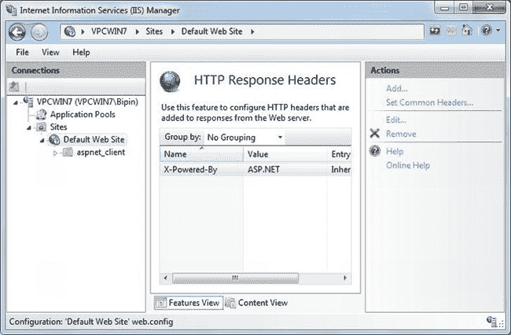

***图 11-1。**使用 IIS 管理器添加 Access-Control-Allow-Origin 报头*

Access-Control-Allow-Origin 头的值可以是`*`(允许所有域)或特定域的列表。您可以使用`web.config`文件达到同样的效果，如清单 11-1 所示。

***清单 11-1。**使用`web.config`* 添加访问控制允许起源报头

`<system.webServer>
   <httpProtocol>
     <customHeaders>
       <add name="Access-Control-Allow-Origin" value="*" />
     </customHeaders>
   </httpProtocol>
</system.webServer>`

`web.config`的`<customHeaders>`部分允许您添加自定义标题。在这种情况下，添加了 Access-Control-Allow-Origin 头，其值被设置为`*`，表示所有域都被允许。

为了实现 CORS 通信，HTML5 增强了`XMLHttpRequest`对象(这些改进统称为 *Level 2* )，以便可以进行跨域 HTTP 请求。

现在您已经对跨文档消息传递和 CORS 有了基本的了解，让我们来看看这些技术的代码级细节。

 **注意**从另一个来源获取数据而不使用任何特定技术(如跨文档消息传递或 CORS)的常见方法是 JSONP: JSON with Padding。JSONP 的工作原理是，即使浏览器不允许您进行跨域请求，它们也允许您使用指向远程资源的`<script>`标签。在这种技术中，脚本 URL 还在查询字符串中指定回调函数的名称。远程资源不是返回 JSON 数据，而是返回对这个回调函数的函数调用，并将 JSON 数据作为参数。这种技术的缺点是您必须信任远程服务器，这会带来安全威胁。

### 使用 postMessage API

为了使用 postMessage API，您需要一个目标文档窗口的句柄。目标文档接收主网页发送的数据。可选地，目标文档可以向主网页返回一个值，以指示正在执行的操作的结果。要获得此句柄，您可以使用两种常用技术中的任意一种:

> *   Use the `<iframe>` element in the main webpage and load the target webpage in `<iframe>`. Then, you can use the `contentWindow` attribute of the `<iframe>` DOM element to get the reference of the target window.
> *   Use the `window.open()` method in the main webpage. This method returns a reference to the target window object.

#### 使用带有< iframe 的 postMessage】

使用带有`<iframe>`的 postMessage API 包括使用`<iframe>`元素将目标 web 页面嵌入到主页面中，然后使用`postMessage()`方法将数据发送到目标页面。清单 11-2 显示了带有`<iframe>`元素的主 web 表单。

***清单 11-2。**使用`<iframe>`元素嵌入目标 Web 表单*

`<form id="form1" runat="server">
  
Send Data :

  <input id="txtData" type="text" /><input id="btnSend" type="button" value="Send" />
  
Data Received from Target Web Form :

  

  <h3>Target Page in IFRAME</h3>
  <iframe id="target" src="http://localhost:1052/Target.aspx">
  </iframe>
</form>`

这个清单显示了主 web 表单(`Iframe.aspx`)的标记，它使用一个`<iframe>`元素嵌入了目标 web 表单(`Target.aspx`)。注意，为了测试起见，`Iframe.aspx`和`Target.aspx`是在两个独立的 web 应用中创建的。虽然这不会使它们在真正意义上跨域，但它们仍然是跨源的，因为 Visual Studio 开发 web 服务器为不同的 web 应用分配了不同的端口号。

主 web 表单包含一个文本框，用于接受要发送到目标 web 表单的数据。Send 按钮触发一些 jQuery 代码，这些代码实际上将数据发送到目标 web 表单。`<iframe>`元素的`src`属性指向`[`localhost:1052/Target.aspx`](http://localhost:1052/Target.aspx)`。`
`元素用于输出目标 web 表单返回的数据。

目标 web 表单标记很简单，由一个`
`元素组成，该元素输出从主 web 表单接收的数据。`Target.aspx`的标记如下所示:

`<form id="form1" runat="server">
  
Data Received from Main Web Form :

  

</form>`

图 11-2 显示了运行时的主 web 表单和嵌入的目标 web 表单。

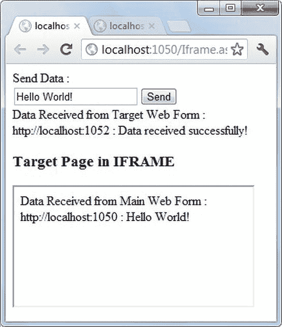

***图 11-2。**目标网页表单加载到`<iframe>`*

图 11-2 显示了主网页表单的运行示例。主 web 表单发送字符串数据“Hello World！”添加到目标 web 窗体。目标 web 表单输出数据并发回成功消息。主表单的原点以及目标 web 表单的原点也与它们各自的数据一起显示。

主 web 表单包含处理发送按钮的`click`事件的 jQuery 代码。该代码如清单 11-3 所示。

***清单 11-3。**向目标 Web 表单发送数据*

`var targetOrigin = "http://localhost:1052";
$(document).ready(function () {
  if (!Modernizr.postmessage) {
    alert("This browser doesn't support the HTML5 postMessage API!");
    return;
  }
  var targetWindow = $("#target").get(0).contentWindow;
  window.addEventListener("message", ReceiveMessage, false);
  $("#btnSend").click(function () {
    targetWindow.postMessage($("#txtData").val(), targetOrigin);
  });
});`

这段代码使用 Modernizr 库来检测浏览器是否支持 postMessage API。这是使用`Modernizr`对象的`postmessage`属性完成的。如前所述，为了将数据发送到目标 web 表单，您需要一个目标窗口的句柄。要将`window`对象附加到`<iframe>`元素，可以使用`<iframe>` DOM 元素的`contentWindow`属性。

如果您对接收目标 web 表单发送的返回值感兴趣，您需要为`message`事件连接一个事件处理程序。`addEventListener()`方法可以将一个事件处理函数——在本例中是`ReceiveMessage`——连接到主窗口的`message`事件。

发送按钮的`click`事件处理程序调用目标`window`对象上的`postMessage()`方法。`postMessage()`方法的第一个参数是您希望传递给目标 web 表单的数据。第二个参数是目标 web 表单的原点。

`ReceiveMessage`()事件处理函数如清单 11-4 所示。

***清单 11-4。**处理主 Web 窗体*中的`message`事件

`function ReceiveMessage(evt) {
  if (evt.origin != targetOrigin)
    return;
  $("#divReceived").append(evt.origin + " : " + evt.data + " ");
}`

这段代码首先检查正在接收的消息的来源是否是允许的。它使用事件参数的`origin`属性来实现。这样，其他网站(其服务被您的网站消费的网站)的开发者可以*将*的某些来源列入白名单。如果来源不属于批准的集合，您可以在进一步处理时忽略它。

为了访问目标 web 表单发送的数据，代码使用事件参数的`data`属性。使用 jQuery `append()`方法将原点和数据附加到`
`元素。

目标 web 表单包含接收主 web 表单发送的数据的 jQuery 代码。该代码如清单 11-5 所示。

***清单 11-5。**接收主网页表单发送的数据*

`var targetOrigin = "http://localhost:1050";
$(document).ready(function () {
...` `  window.addEventListener("message", ReceiveMessage, false);
});

function ReceiveMessage(evt) {
  if (evt.origin != targetOrigin)
    return;
  $("#divReceived").append(evt.origin + " : " + evt.data + " ");
  evt.source.postMessage("Data received successfully!", evt.origin);
}`

前面提到过，postMessage API 提供了一种安全的方式来进行跨文档消息传递。这里你就能明白为什么了。主页的作者不能直接访问目标网页:一切都通过目标网页的代码来完成。

清单 11-5 中的代码将一个事件处理程序`ReceiveMessage()`连接到目标窗口的`message`事件。然后，`ReceiveMessage()`事件处理函数对`origin`属性执行检查，如果数据是从预期的来源接收的，则将数据追加到`
`元素中。使用事件参数的`source`属性将成功消息发送回主 web 表单。`source`属性引用主 web 表单的`window`对象。

 **注意**除非你开发的是面向公众消费的通用服务，否则在使用 postMessage API 的应用中包含白名单机制是个好主意。如果没有这样的白名单，任何来源都可以向您的网页发送数据，并且它将由消息事件处理程序进行处理。如果你的白名单很小，你可以把它存储在一个数组中；否则，XML 文件或数据库表是更好的选择。

#### 对窗口对象使用 postMessage

将 postMessage API 用于`window`对象类似于将其用于`<iframe>`元素。唯一的区别是，您需要使用由`window.open()`方法返回的`window`引用，而不是`contentWindow`属性。清单 11-6 清楚地说明了这一点。

*清单 11-6**。**用`postMessage()`搭配`window.open()`用*

`$(document).ready(function () {
  ...
  var targetWindow = window.open(targetOrigin + "/Target.aspx");

  window.addEventListener("message", ReceiveMessage, false);

  $("#btnSend").click(function () {
    targetWindow.postMessage($("#txtData").val(), targetOrigin);
  });
});`

这段代码驻留在主 web 表单中。注意，这一次，您没有使用`<iframe>`来加载目标 web 表单，而是使用了`window.open()`方法。`open()`方法接受目标 web 表单的 URL，并返回对目标 web 表单的`window`对象的引用。一旦获得了对目标窗口的引用，它的使用方式与前面讨论的`<iframe>`示例完全相同。

### 使用 XMLHttpRequest 发出请求

一种非常常见和流行的与服务器通信的方式是`XMLHttpRequest`对象。`XMLHttpRequest`对象允许您以编程方式向 web 服务器发出 HTTP 请求，例如`GET`、`POST`、`PUT`和`DELETE`。`XMLHttpRequest`流行的主要原因是主流浏览器支持它。最初是由 Internet Explorer 引入的，但很快就被其他浏览器所吸收。今天，`XMLHttpRequest`是大多数基于 Ajax 的通信的基础。事实上，您在本书中一直使用的 jQuery `$.ajax()`方法在内部使用了`XMLHttpRequest`的功能。使用`XMLHttpRequest`，您可以向 web 服务器发出同步和异步请求，尽管异步模式更常用。

在 HTML5 之前就已存在，但随着 HTML5 的出现，它得到了改进。一些主要改进包括以下内容:

> *   You can use `XMLHttpRequest` object and CORS specification to make cross-origin request.
> *   You can use progress events to track the progress of data download and upload operations.
> *   `XMLHttpRequest` It now supports sending binary data.

总之，这些对`XMLHttpRequest`对象的改进被称为*级别 2* 。在与 Web 工作器 一起工作时，您曾短暂地使用过`XMLHttpRequest`。接下来的章节将更详细地剖析`XMLHttpRequest`对象。

#### XMLHttpRequest 的属性

在使用`XMLHttpRequest`对象之前，让我们快速看一下它的属性、方法和事件。表 11-1 列出了`XMLHttpRequest`的属性。其中一些属性是在发出请求之前设置的，而其他属性是在请求完成之后访问的。

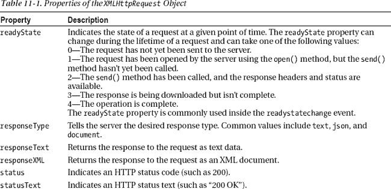

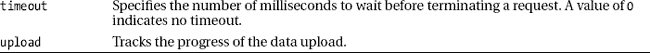

在典型的用法中，在发起请求之前设置`responseType`和`timeout`。然后跟踪请求的`readyState`，当它变成`4`(完成)时，访问`responseText`、`responseXML`、`status`和`statusText`属性。

#### XMLHttpRequest 的方法

`XMLHttpRequest`对象提供了允许您发起请求、随请求发送数据以及在请求完成前终止请求的方法。表 11-2 列出了这些方法，供您快速参考。

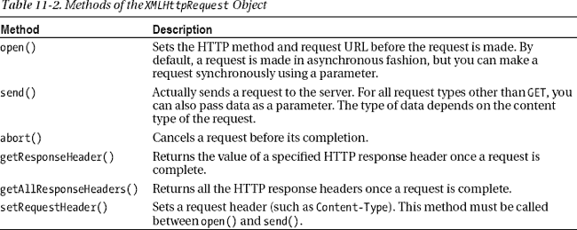

在一个典型的用法中，你先调用`open()`方法，再调用`setRequestHeader()`，然后调用`send()`来发出请求。大多数情况下，在`open()`方法中使用`GET`或`POST`动词。然而，`open()`也可以用于其他动词。例如，在使用 ASP.NET Web API 时，除了`GET`和`POST`之外，还需要通过`PUT`和`DELETE`。

`send()`可用于根据内容类型发送数据。常见的数据格式是文本和 JSON。您还可以使用`FormData`对象将数据捆绑成键值对，并发送给服务器。

#### XMLHttpRequest 事件

`XMLHttpRequest`对象的事件允许您跟踪请求并确定其状态。表 11-3 列出了这些事件。

如果您在 HTML5 之前使用了`XMLHttpRequest`,请记住开发人员主要依靠`readystatechange`事件进行任何类型的跟踪，包括请求完成和错误处理。然而，`XMLHttpRequest`级别 2 提供了特定于任务的事件，您可以使用这些事件来使您的代码更加整洁。

注意，`progress`事件是为`XMLHttpRequest`对象本身以及`XMLHttpRequest`实例的上传对象触发的。前一个事件跟踪下载数据的进度，而后一个事件跟踪上传数据的进度。通过处理`progress`事件，您可以向用户显示操作的进度，比如在进度条中。

#### 使用 XMLHttpRequest 发出请求

现在您已经知道了`XMLHttpRequest`对象的属性、方法和事件，让我们开发一个应用来演示如何使用它们。在本节中，您将开发一个基于 ASP.NET Web Forms 的应用，如图 11-3 所示。

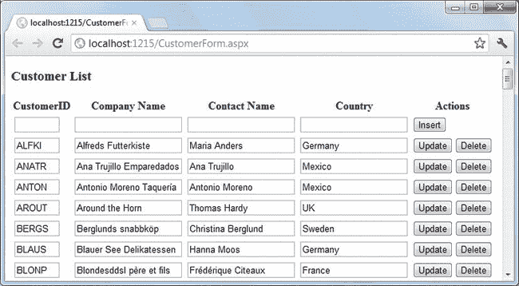

***图 11-3。**使用`XMLHttpRequest`* 开发的客户列表应用

这个 web 表单在一个 HTML 表中显示了 Northwind 数据库的`Customers`表中的所有记录。顶部的行允许用户插入新客户。可以使用更新或删除按钮分别修改或删除现有客户。通过 ASP.NET Web API 执行`SELECT`、`INSERT`、`UPDATE`、`DELETE` (CRUD)操作。Web API 控制器类公开的方法是使用`XMLHttpRequest`对象调用的。web 表单标记很简单，如清单 11-7 所示。

***清单 11-7。**客户列表 Web 表单的标记*

`<h3>Customer List</h3>
<form id="form1" runat="server">
<table id="tblCustomers">
</table>
</form>`

web 表单由一个表格组成:`tblCustomers`。根据数据库中客户记录的数量，以编程方式添加表中的行。应用所需的实体框架数据模型如图图 11-4 所示。

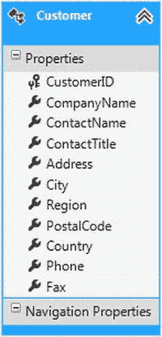

***图 11-4。**实体框架`Customers`表*的数据模型类

`Customer`数据模型类有几个属性，但是在应用中只使用了四个:`CustomerID`、`CompanyName`、`ContactName`和`Country`。

##### 开发 Web API 控制器

为了在`Customers`表上执行 CRUD 操作，您开发了一个 Web API 控制器(`CustomerController`)。Web API 控制器是一个从`ApiController`基类继承的类，包含以下方法的实现:

> *   `Get()`: indicates an http `GET` request, which requests the data item of `SELECT` and returns it to the caller.
> *   `Get(id)`: indicates an HTTP `GET` request, and `SELECT` indicates a data item returned to the caller based on the specified ID.
> *   `Post()`: It means an HTTP `POST` request to put a data item `INSERT` into the database.
> *   `Put(id)`: indicates an http `PUT` request for data items matching the specified ID in the `UPDATE` database.
> *   `Delete(id)`: indicates an http `DELETE` request, which is used for data items in the `DELETE` database.

注意，虽然这个例子需要 CRUD 功能，但是 Web API 和`XMLHttpRequest`不一定专门用于这种场景。清单 11-8 展示了`CustomerController`的`Get()`和`Post()`方法。

***清单 11-8。`CustomerController`类的** `Get()`和`Post()`方法*

`public class CustomerController : ApiController
{
    public IEnumerable<Customer> Get()
    {
        NorthwindEntities db = new NorthwindEntities();
        var data = from item in db.Customers
                    orderby item.CustomerID
                    select item;
        return data;
    }

    public void Post(Customer obj)
    {
        NorthwindEntities db = new NorthwindEntities();
        db.Customers.AddObject(obj);
        db.SaveChanges();
    }
    …
}`

`Get()`方法返回一个`Customer`项的`IEnumerable`。在里面，`Get()`选择所有的`Customer`项，并根据`CustomerID`列排序后返回给调用者。

`Post()`方法接受一个`Customer`对象作为参数。这个参数来自您稍后编写的 jQuery 代码。`Post()`使用`AddObject()`方法将提供的`Customer`对象添加到`Customers`表中。要将数据持久存储回数据库，您需要调用`SaveChanges()`。

为了从客户端成功调用 Web API，您还需要在`Global.asax`文件中添加以下路由信息:

`protected void Application_Start(object sender, EventArgs e)
{
    RouteTable.Routes.MapHttpRoute(
        name: "DefaultApi",
        routeTemplate: "api/{controller}/{id}",
        defaults: new { id = System.Web.Http.RouteParameter.Optional }
        );
}`

`MapHttpRoute()`方法将传入请求映射到 Web API 控制器类。例如，一个指向`Customer` Web API 控制器的示例 URL 是`[`localhost:1050/api/Customer`](http://localhost:1050/api/Customer)`。

##### 使用 XMLHttpRequest 调用 Web API

现在让我们编写客户端 jQuery 代码，使用`XMLHttpRequest`对象调用`Customer` Web API 控制器。jQuery 代码主要由四个函数组成:`GetCustomers()`、`InsertCustomer()`、`UpdateCustomer()`和`DeleteCustomer()`。这些函数通过调用 Web API 方法来执行各自的操作。

web 表单加载时，需要显示`Customer`数据；因此，在 jQuery `ready()`函数中调用了`GetCustomers()`函数。清单 11-9 展示了这是如何做到的。为了可读性，省略了一些代码。

***清单 11-9。**创建一个`XMLHttpRequest`对象并显示数据*

`$(document).ready(function () {
  GetCustomers();
});

function GetCustomers() {
  $("#tblCustomers").empty();
  $("#tblCustomers").append("<tr><th>…</tr>");
  var emptyRow = "<tr>";
  emptyRow += "<td><input size='5' type='text'/></td>";
  …
  emptyRow += "<td><input type='button' value='Insert'/></td>";
  emptyRow += "</tr>";
  $("#tblCustomers").append(emptyRow);

  var xhr = new XMLHttpRequest();
  xhr.open("GET", "api/Customer");
  xhr.setRequestHeader('Accept', 'application/json');
  xhr.setRequestHeader('Content-Type', 'application/json');
  xhr.onreadystatechange = function () {
    if (xhr.readyState == 4) {
      var data = JSON.parse(xhr.responseText);
      for (var i = 0; i < data.length; i++) {
        var row = "<tr>";
        row += "<td><input size='5' type='text' value='" + data[i].CustomerID +
                    "' readonly='readonly'/></td>";
        …
        row += "<td><input type='button' value='Update'/>";
        row += "<input type='button' value='Delete'/></td>";
        row += "</tr>";
        $("#tblCustomers").append(row);
      }
      $("#tblCustomers input[value='Insert']").click(InsertCustomer);
      $("#tblCustomers input[value='Update']").click(UpdateCustomer);
      $("#tblCustomers input[value='Delete']").click(DeleteCustomer);` `    }
  }
  xhr.send();
}`

这段代码声明了一个全局`XMLHttpRequest`对象，这样所有其他方法都可以使用它。在 jQuery `ready()`函数内部，调用了`GetCustomers()`函数。`GetCustomers()`首先添加表格标题和一个空行，用于接受新的`Customer`细节。

然后创建一个新的`XMLHttpRequest`对象。`XMLHttpRequest`对象的`open()`方法指定请求方法为`GET`，URL 为`api/Customer`。请注意，您不需要在 URL 中指定 Web API 方法名。基于 HTTP 动词(在本例中为`GET`，适当的 Web API 方法被自动调用。

您设置了两个请求头:`Accept`和`Content-Type`。`Accept`头主要用于 Web API，控制返回数据的格式(文本、JSON 等)。因为要访问 JSON 格式的`Customer`数据项，所以`Accept`头被设置为`application/json`。

`onreadystatechange`事件处理函数检查`XMLHttpRequest`对象的`readyState`属性。如果`readyState`是`4`(完成)，使用`JSON.parse()`方法将`responseText`解析成一个 JSON 对象。回想一下`Get()` Web API 方法返回了一个`Customer`对象的`IEnumerable`。因此，您使用一个`for`循环来遍历数据对象。每次迭代都会添加一个新的表格行。每个新表行都由填充了现有客户信息的文本框组成(例如，`data[i].CustomerID`)。

接下来，为插入、更新和删除按钮添加`click`事件处理程序。注意如何使用属性选择器将`<input>`元素的值与插入、更新和删除进行比较。相应的`InsertCustomer`、`UpdateCustomer`和`DeleteCustomer`函数被连接为事件处理程序。

一旦连接了`readystatechange`事件处理函数，就使用`XMLHttpRequest`对象的`send()`方法将请求发送到服务器。

就`XMLHttpRequest`的用法而言，`InsertCustomer()`、`UpdateCustomer()`和`DeleteCustomer()`功能类似。`InsertCustomer()`如清单 11-10 所示。其他函数遵循类似的模式。

***清单 11-10。**插入新的`Customer`*

`function InsertCustomer(evt) {
  var customerID = $(this).closest('tr').children().eq(0).children().eq(0).val();
  var companyName = $(this).closest('tr').children().eq(1).children().eq(0).val();
  var contactName = $(this).closest('tr').children().eq(2).children().eq(0).val();
  var country = $(this).closest('tr').children().eq(3).children().eq(0).val();
  var obj = { "CustomerID": customerID, "CompanyName": companyName,
                   "ContactName": contactName, "Country": country };

  var xhr = new XMLHttpRequest();
  xhr.open("POST", "api/Customer");
  xhr.setRequestHeader('Content-Type', 'application/json');
  xhr.onreadystatechange = function () {
    if (xhr.readyState == 4) {
      alert("Customer Inserted!");
      GetCustomers();
    }
  }` `  var param = JSON.stringify(obj);
  xhr.send(param);
}`

`InsertCustomer()`充当插入按钮的事件处理程序。该函数做的第一件事是获取新输入的`Customer`细节，例如`CustomerID`、`CompanyName`、`ContactName`和`Country`。观察 jQuery 选择器如何从`<input>`元素中检索值。在`InsertCustomer()`函数中，关键字`this`指的是插入按钮。jQuery `closest()`方法返回最近的周围`<tr>`元素。这样，您就到达了包含文本框的表格行。对表行调用的`children()`方法返回它包含的所有`<td>`元素。`eq()`方法基于索引返回指定的子元素，允许您到达单个`<td>`元素。另一组`children()`和`eq()`方法让您可以访问表格单元格中的`<input>`元素。

文本框中输入的值存储在本地变量中:`customerID`、`companyName`、`contactName`和`country`。使用这些值形成一个`JSON`对象。注意，`JSON`对象必须具有与`Customer`数据模型属性名称相同的键名，这样 ASP.NET 就可以将`JSON`对象映射到数据模型类。

然后创建一个新的`XMLHttpRequest`对象，并使用其`open()`方法打开一个`POST`请求。因为您正在向服务器发送 JSON 数据，所以使用`setRequestHeader()`方法将`Content-Type`头设置为`application/json`。如果`readyState`为`4`(完成)，则`readystatechange`事件处理程序向用户显示一条成功消息。再次调用`GetCustomers()`用新添加的记录刷新客户列表。

在您连接了`readystatechange`事件处理程序之后，使用`send()`将请求发送到服务器。`send()`方法将 JSON `Customer`对象的字符串表示作为其参数。这个`JSON`对象由`Customer` Web API 控制器的`Post()`方法接收。

现在，您可以运行客户列表应用，并在其上测试 CRUD 操作。您可能想知道如何使用`XMLHttpRequest`对象进行跨来源请求。幸运的是，您不需要对`XMLHttpRequest`进行任何代码级别的更改就可以进行跨来源请求。您需要做的就是确保运行另一个域的 IIS 允许 CORS 请求。如前所述，您可以使用 IIS 管理器或`web.config`来配置 CORS 报头。

#### 使用 XMLHttpRequest 上传文件

在第九章中，你学习了文件 API。在那一章中，您还学习了如何使用 jQuery `$.ajax()`方法从客户机上选择文件并上传到 web 服务器上。您可以使用`XMLHttpRequest`对象完成同样的任务。使用`XMLHttpRequest`的一个好处是它允许你通过`progress`事件跟踪上传操作。通过处理`progress`事件，您可以向用户显示某种进度指示器(比如进度条)。图 11-5 显示了一个使用上传`progress`事件的 web 表单。

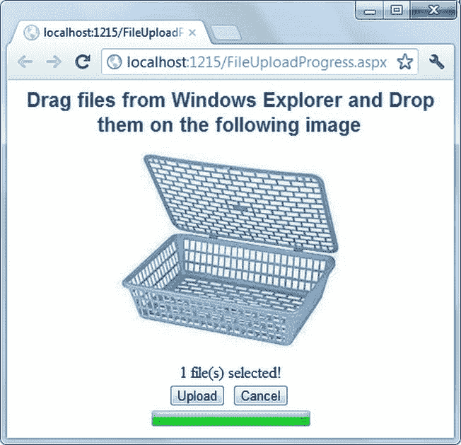

***图 11-5。**使用进度条显示文件上传的进度。*

这个 web 表单应该看起来很熟悉:你在第九章中开发了类似的东西。web 表单允许您将文件从 Windows 资源管理器或桌面拖放到暂存架图像上。然后，您可以使用上传按钮将文件上传到服务器。可以使用取消按钮取消上传操作。文件上传操作的进度显示在进度条中。

web 表单的标记很简单。唯一不熟悉的元素是 HTML5 `<progress>`元素，它在 web 表单的底部呈现一个进度条。`<progress>`元素如下所示:

`<progress id="uploadProgress" value="1" max="100"></progress>`

这个`<progress>`元素使用了两个属性:`value`和`max`。`value`属性表示操作的进度。`max`属性控制`value`属性的比例。例如，如果您希望以百分比(%)的形式显示上传进度，您需要将`max`属性设置为`100`，这样`value`属性就可以取最大值`100`。注意，`<progress>`元素本身不会自动递增。您需要以编程方式设置`value`属性，以便进度条显示正确的进度。

当您单击 Upload 按钮时，会调用一个 JavaScript 函数`UploadFiles()`，启动上传操作。`UploadFiles()`如清单 11-11 所示。

***清单 11-11。**使用`XMLHttpRequest`对象*上传文件

`var xhr = new XMLHttpRequest();

function UploadFiles() {
  var data = new FormData();
  for (var i = 0; i < files.length; i++) {
      data.append(files[i].name, files[i]);
  }
  xhr.upload.addEventListener("progress", OnProgress, false);
  xhr.addEventListener("load", OnComplete, false);
  xhr.addEventListener("error", OnError, false);
  xhr.addEventListener("abort", OnAbort, false);
  xhr.open("POST", "UploadHandler.ashx");
  xhr.send(data);
}`

这段代码声明了一个全局`XMLHttpRequest`对象(`xhr`)。`UploadFiles()`函数首先创建一个新的`FormData`对象。然后，它遍历用户选择的所有文件。文件集合包含使用拖放操作选择的`File`对象。使用`FormData`对象的`append()`方法将所有选择的文件追加到`FormData`对象。

接下来，`addEventListener()`方法连接四个事件的事件处理程序:`progress`、`load`、`error`和`abort`。注意，因为您对跟踪数据上传操作的进度感兴趣，所以处理的是`upload`对象的`progress`事件，而不是`XMLHttpRequest`对象的`progress`事件。事件处理函数`OnProgress()`、`OnComplete()`、`OnError()`和`OnAbort()`将在稍后讨论。

然后通过将`POST`指定为请求类型并将`UploadHandler.ashx`指定为 URL 来调用`XMLHttpRequest`对象的`open()`方法。`UploadHandler.ashx`是一个 ASP.NET 通用处理程序，将上传的文件保存在服务器上。最后，调用`XMLHttpRequest`对象的`send()`方法，并将`FormData`对象作为参数传递给它。

取消按钮调用`XMLHttpRequest`对象的`abort()`方法，如下所示:

`function CancelUpload() {
  xhr.abort();
}`

处理`progress`、`load`、`error`和`abort`事件的事件处理函数如清单 11-12 所示。

***清单 11-12。**处理`XMLHttpRequest`对象的事件*

`function OnProgress(evt) {
  if (evt.lengthComputable) {
    var progress = Math.round(evt.loaded * 100 / evt.total);
    $("#uploadProgress").attr("value", progress);
  }
}

function OnComplete(evt) {
  alert(evt.target.responseText);
}

function OnError(evt) {
  alert("Error Uploading File(s)!");` `}

function OnAbort(evt) {
  alert("File Upload Aborted!");
}`

`OnProgress()`事件处理函数接收一个类型为`ProgressEvent`的事件参数，该参数提供上传操作的进度信息。`lengthComputable`属性返回一个布尔值，表明操作的进度是否可以确定。`loaded`和`total`属性表示上传的字节数和要上传的总字节数。基于这两个值，计算进度百分比。使用 jQuery `attr()`方法将`<progress>`元素的`value`属性设置为这个计算值。

其他事件处理函数很简单，只是向用户显示一条消息(成功、错误或取消)。

### 使用服务器发送的事件通知浏览器

到目前为止，在本书中，您已经使用了从客户端到服务器发起通信的技术(例如，`$.ajax()`或`XMLHttpRequest`)。在这种客户端到服务器的技术中，一旦发送了请求并且从服务器接收到响应，基础通信信道就被关闭。考虑一个服务器持续执行业务操作的情况。一个网页为用户显示处理的状态。因为操作在服务器上继续进行，所以您希望定期更新该状态。你如何完成这项任务？一种常见的方法是定期轮询服务器并检索操作的状态。您可以使用像`setTimeout()`和`setInterval()`这样的函数，向服务器发出请求，试图检索操作的状态。

这种轮询技术的缺点是有太多的请求-响应周期。客户端不断发送请求，服务器不断响应每个请求。每个请求-响应周期都需要自己的通信通道，一旦周期完成，该通道就会关闭。如果服务器在有趣的事情发生时通知您，而不需要任何轮询，这不是很好吗？这就是*服务器发送的事件*允许你做的事情。

顾名思义，服务器发送的事件是由服务器调度的。如果服务器上发生任何有趣的事情，服务器会通知客户端，而不是客户端定期检查服务器的更新。服务器发送的事件使用公共通信通道发送多个通知，从而避免连续的请求-响应循环。向客户机发送通知的服务器端资源被包装在一个`EventSource`对象中。然后，`EventSource`对象的`open`、`message`和`error`事件分别用于打开通信通道、从服务器接收消息和处理错误。

让我们开发一个应用来说明如何使用服务器发送的事件。图 11-6 显示了应用的主 web 表单。

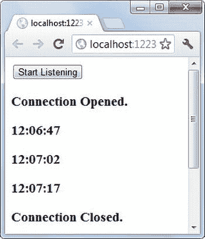

***图 11-6。**服务器发送的活动事件*

web 表单包含一个开始监听按钮。单击该按钮打开与驻留在服务器上的通用处理程序(`ClientNotifier.ashx`)的连接。通用处理程序的设计方式是，它在 1 分钟内每隔 15 秒向客户机发送一次服务器时间形式的通知。你会看到输出的时间间隔。包括通知数据在内的消息显示在一个`
`元素中。

web 表单工作背后的 JavaScript 代码如清单 11-13 所示。

***清单 11-13。**发起服务器发送的事件*

`$(document).ready(function () {
  if (window.EventSource == undefined) {
    alert("This browser doesn't support HTML5 Server Sent Events.");
    return;
  }

  $("#btnListen").click(function () {
    var source = new EventSource('ClientNotifier.ashx');
    source.addEventListener("open", function (event) {
      $('#targetDiv').append('<h3>Connection Opened.</h3>');
    },false);

  source.addEventListener("error", function (event) {
    if (event.eventPhase == EventSource.CLOSED) {
      $('#targetDiv').append('<h3>Connection Closed.</h3>');
    }
  },false);

  source.addEventListener("message",function (event) {
    $('#targetDiv').append('<h3>' + event.data + '</h3>');
  },false);
});
});`

这段代码首先检查浏览器是否支持服务器发送的事件。这是通过检查`window.EventSource`对象的存在来实现的。

然后，代码继续连接开始监听按钮的`click`事件处理程序。这个事件处理程序创建一个新的`EventSource`对象。创建`EventSource`时，发送事件的 ASP.NET 通用处理程序的路径作为参数传递。

然后为`EventSource`对象的三个事件连接事件处理程序:`open`、`message`和`error`。当浏览器第一次向服务器资源发出请求时，会引发`open`事件。当服务器发送的数据到达客户端时，引发`message`事件。如果出现错误，比如连接关闭，就会引发`error`事件。`open`和`error`事件处理程序向`targetDiv` `
`元素添加一条消息。错误处理程序使用`eventPhase`属性来决定底层连接是否关闭。`eventPhase`的可能值为`CONNECTING` ( `0`)、`OPEN` ( `1`)和`CLOSED` ( `2`)。`message`事件处理程序接收一个`event`参数，其`data`属性返回服务器发送的数据。

将事件发送到客户端的服务器端代码驻留在 ASP.NET 通用处理程序`ClientNotifier.ashx`中。该代码如清单 11-14 所示。

***清单 11-14。**向客户端发送事件*

`public void ProcessRequest(HttpContext context)
{
    HttpResponse Response = context.Response;
    DateTime startDate = DateTime.Now;
    Response.ContentType = "text/event-stream";
    while (startDate.AddMinutes(1) > DateTime.Now)
    {
        Response.Write(string.Format("data: {0}\n\n", DateTime.Now.ToString("hh:mm:ss")));
        Response.Flush();
        System.Threading.Thread.Sleep(15000);
    }
    Response.Close();
}`

该代码将`Response`的`ContentType`设置为`text/event-stream`。这样，客户端浏览器就知道这个响应属于服务器发送的事件。然后一个`while`循环迭代 1 分钟。在循环中，事件数据被成批发送到客户端。`Response.Write()`方法在响应流中写入事件数据，而`Response.Flush()`确保事件数据被直接发送到客户端，没有任何缓冲。发送到客户端的事件数据必须采用预定义的格式。示例格式如下:

`data: Hello World!\n\n`

每条事件数据都应该以`data:`开始，以两个换行符(`\n\n`结束。事件数据也可以多行格式发送:

`data: {\n
data: "CustomerID": "ALFKI",\n
data: "Country": "USA"\n
data: }\n\n`

这个标记以 JSON 格式向客户机发送数据。客户端可以解析数据来构造一个`JSON`对象。

使用`Thread.Sleep()`方法暂停操作 15 秒，以在通知之间引入延迟。除了开发人员定义的数据之外，服务器还向客户端发送唯一的事件 ID 和重试间隔。这些信息可以作为`event`参数的`id`和`retry`属性来访问。

尽管在本例中您不需要这样做，但是您可以通过调用`EventSource`对象的`close()`方法来停止接收服务器发送的事件。

 **注意**在本节讨论的例子中，服务器端处理发生 1 分钟，之后服务器终止底层连接。然而，浏览器认为存在连接问题，并在短暂的时间间隔后尝试与服务器重新连接，导致相同的逻辑再次运行。如果您不希望接收更多的事件，您需要调用`EventSource`对象的`close()`方法。

### 使用网络套接字的双向通信

通常，web 上的通信由两个不同的参与方组成:客户端和 Web 服务器。到目前为止，本章中你已经学习了两种客户机-服务器通信技术:单向通信和请求-响应通信。

服务器发送的事件使用单向通信模型。在单向通信中，一方与另一方进行通信。在服务器发送事件的情况下，服务器通过发送通知与客户机保持“对话”。这也被称为*单工*通信。单工通信的一个真实例子是无线电广播，无线电信号从无线电台发出，但电台不接收任何反馈。

postMessage API 和`XMLHttpRequest`对象使用请求-响应模型与服务器通信。在这个模型中，客户端向服务器发起请求，以触发一些处理或获取一些数据。一旦处理完成，服务器就将响应发送回客户机。基础通信信道仅在一个请求-响应周期内保持打开。如果您向服务器发送多个请求，您实际上是在多次打开和关闭通信通道。这种通信模式有时被称为*半双工*通信，因为在任何时候，客户端或服务器都在与另一方通信。当然，在 web 应用中，浏览器必须发起与服务器的通信；只有这样，服务器才可以响应。半双工通信的一个真实例子是步话机:一次只能有一个人通话。

还有第三种类型的通信——双向或*双工*通信。这种情况下，双方可以同时沟通。现实生活中的一个例子是电话:双方可以同时通话。软件应用中双工通信的一个常见应用是聊天系统，如 MSN、Yahoo！Messenger 和 Google Talk。在任何聊天系统中，两个或更多的成员可以同时互相聊天。另一个例子是多人在线游戏，多个玩家可以同时参与。就 HTML5 而言，实现双向通信的技术是 Web Sockets。

#### 了解 WebSocket

与请求-响应模型不同，WebSocket 在整个通信过程中保持底层通信通道开放。基于 WebSocket 的通信通常包括三个步骤:

> 1.  Establish a connection or handshake between client and server.
> 2.  The Web Socket server is required to listen for incoming communication.
> 3.  Send and receive data.

Web 应用使用 HTTP 协议来运行，HTTP 本质上使用请求-响应模型。普通 HTTP 不太适合执行双向通信。因此，WebSocket 需要将普通 HTTP 升级为 web socket 协议。这种升级发生在客户端和服务器之间建立连接的时候。WebSocket 是基于 TCP 的协议，仅在握手和升级过程中使用 HTTP。一旦在客户机和服务器之间建立了连接，WebSocket 通信就通过一个 TCP 连接进行。WebSocket 协议可以处理文本以及二进制数据。由于这些特性，WebSocket 协议提供了优于 HTTP 请求-响应模型的性能优势。

图 11-7 中的请求和响应头显示了升级是如何发生的。

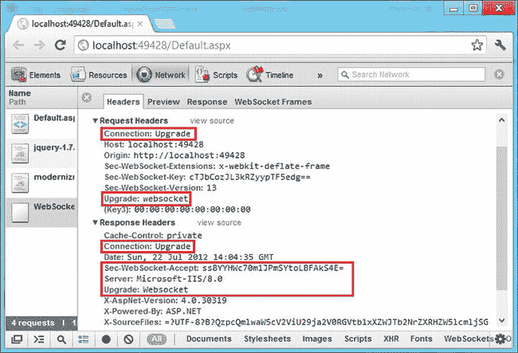

***图 11-7。**握手过程中的请求和响应，显示在 Chrome 开发者工具中*

注意请求和响应头是如何设置`Connection`和`Upgrade`头的。为了将通信从普通 HTTP 升级到 WebSocket，您需要一个能够进行这种升级的 web 服务器。Windows 8 附带的 IIS 8.0 可以接受 WebSocket 通信。如果您正在开发使用 HTML5 web Sockets 的 Web 应用，您可能需要在 IIS 8.0 中安装 WebSocket 支持。图 11-8 显示了如何使用控制面板中的“打开或关闭 Windows 功能”选项来安装 WebSocket 协议。

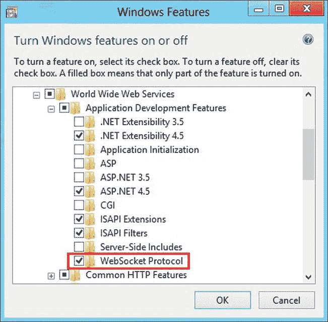

***图 11-8。**在 IIS 8.0 中启用 WebSocket 协议支持*

如果 WebSocket 协议未启用，您的 ASP.NET 应用将无法接收和响应服务器上的 Web Socket 请求。

一旦客户端和服务器之间发生握手，并且在它们之间建立了通信信道，就可以使用升级后的连接进行通信。基于 Web Socket 的应用由分成两部分的代码组成:Web Socket 服务器端代码和 Web Socket 客户端代码。WebSocket 服务器端代码驻留在 Web 服务器上，并侦听来自客户端的传入通信。当从客户端接收到通信时，WebSocket 服务器端代码处理该通信，并且通常将通信发送回客户端。如果没有来自客户端的通信，Web Socket 服务器可以继续等待，也可以终止通信通道。

虽然您可以从头开始开发 Web Socket 服务器端代码，但是很多时候您可以使用第三方服务器。例如，如果您希望在 web 应用中实现在线聊天，您可以使用第三方或开源聊天服务器，并根据需要开发客户端网页。

注意，HTML5 将自己限制在开发 WebSocket 客户端。不同的 web 服务器和服务器端技术可能有自己开发 Web Socket 服务器的方式。WebSocket 客户端和 WebSocket 服务器现在可以相互通信并传输数据。Web Socket 客户端使用 HTML5 `WebSocket`对象向 Web Socket 服务器发送数据，并从 Web Socket 服务器接收数据。

#### web socket 对象

HTML5 `WebSocket`对象提供了属性、方法和事件，您可以使用它们来开发 WebSocket 客户端应用。表 11-4 显示了它们，供您快速参考。

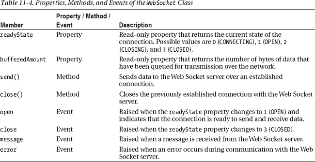

当您创建一个`WebSocket`的实例时，您需要提供将客户端连接到 Web Socket 服务器的端点 URL。从表 11-4 中可以看出，`WebSocket`使用的数据发送和接收模式与早期的技术相似。一旦建立了连接，你就可以在需要的时候使用`send()`发送数据。同时，`message`事件处理函数继续接收服务器发送的消息。

#### 在 ASP.NET 使用 WebSocket

如前所述，在开发 WebSocket 应用时，您有两段不同的代码:WebSocket 客户端和 WebSocket 服务器。Web Socket 客户端是使用 JavaScript 和 HTML5 `WebSocket`对象开发的。因此，这段代码遵循相同的编码模式，不管您的 web 服务器软件是什么。然而，当您开发 Web Socket 服务器时，您需要使用 Web 服务器软件提供的框架和您正在使用的服务器端框架。就 ASP.NET 而言，IIS 8 和某些。NET framework 类一起允许您开发一个 WebSocket 服务器。

为了理解客户端和服务器端代码是如何结合在一起的，让我们开发一个简单的回显服务器，它会回显客户端发送给它的任何内容。虽然 Echo 服务器不像聊天应用那样执行同步双向通信，但它确实说明了 Web Socket 客户机和服务器是如何交互的。充当 web Socket 客户端的 Web 表单如图图 11-9 所示。

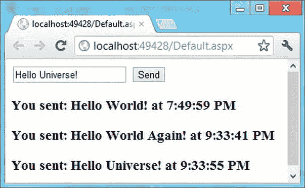

***图 11-9。**充当 Web Socket 客户端的 Web 表单*

如您所见，Web Socket 客户端 Web 表单由一个文本框和一个按钮组成。用户在文本框中输入一些数据，然后单击发送按钮。位于 IIS 8.0 上的 WebSocket 服务器侦听传入的通信，接收客户端发送的数据，并将其回显给客户端。回显的数据通过将它附加到一个`
`元素显示在 web 表单上。

 **注意**虽然你可以使用安装在 Windows 7 上的 Visual Studio 2012 开发这个应用，但是你将无法运行和测试它。要运行该示例，您需要安装了 IIS 8.0 的 Windows 8。如果尚未启用 WebSocket 协议，您还必须在 IIS 8.0 中启用它。

#### 开发 Echo 服务器

在开发 Web Socket 客户端之前，我们先来开发服务器部分。您将 Echo 服务器开发为 ASP.NET 通用处理程序(`.ashx`)。通用处理程序的工作是触发监听代码。清单 11-15 展示了这是如何做到的。

***清单 11-15。**使用通用处理程序启动 Echo 服务器*

`public class WebSocketGenericHandler : IHttpHandler
{
    public void ProcessRequest(HttpContext context)
    {
        if (context.IsWebSocketRequest)
        {
            context.AcceptWebSocketRequest(EchoServer);
        }
    }
    …
}`

这段代码显示了一个通用处理程序——`WebSocketGenericHandler`——它触发 Web Socket 服务器。通用处理程序的`ProcessRequest()`方法首先检查传入的请求是否是 WebSocket 请求。这是通过检查`HttpContext`对象的`IsWebSocketRequest`属性来实现的。该属性与 IIS 8.0 WebSocket 模块协同工作，如果传入请求是 WebSocket 请求，则返回`true`。WebSocket 请求不同于普通的 HTTP 请求，它不使用`http://`协议，而是使用`ws://` (WebSocket)协议。例如，对该通用处理程序的 WebSocket 请求如下所示:

`ws://localhost:49428/WebSocketGenericHandler.ashx`

如果`IsWebSocketRequest`返回`true`，则调用`HttpContext`的`AcceptWebSocketRequest()`方法。这个方法有一个参数——`user`函数，它提供了一个监听和响应客户端请求的函数。在这种情况下，`EchoServer`函数包含侦听传入数据并将其回显给客户端的逻辑。提供给`AcceptWebSocketRequest()`方法的`user`函数应该是一个异步函数，如清单 11-16 所示。

***清单 11-16。** EchoServer 异步函数*

`public async Task EchoServer(AspNetWebSocketContext context)
{
    WebSocket socket = context.WebSocket;
    while (true)
    {
        ArraySegment<byte> buffer = new ArraySegment<byte>(new byte[1024]);
        WebSocketReceiveResult result = await
        socket.ReceiveAsync(buffer, CancellationToken.None);
        if (socket.State == WebSocketState.Open)
        {
            string userMessage = Encoding.UTF8.GetString(buffer.Array, 0, result.Count);
            userMessage = "You sent: " + userMessage + " at " +  
            DateTime.Now.ToLongTimeString();
            buffer = new ArraySegment<byte>(Encoding.UTF8.GetBytes(userMessage));
            await socket.SendAsync(buffer, WebSocketMessageType.Text,
                                                    true, CancellationToken.None);
        }
        else
        {
            break;
        }
    }
}`

`EchoServer()`方法被标记为`async`，表示其中的代码以异步方式运行。`async`方法是一种执行长时间运行的操作而不阻塞主线程的便捷方式。在本例中，Echo 服务器应该持续监听传入的请求，也就是说，是一个长时间运行的操作。`EchoServer()`返回一个`Task`对象。`Task`类充当异步代码的包装器。`EchoServer()`接收一个`AspNetWebSocketContext`类型的参数。`AspNetWebSocketContext`类通过`WebSocket`属性给你访问`WebSocket`的权限。`WebSocket`类是 HTML5 `WebSocket`对象的服务器端对应物。然后开始一个无休止的`while`循环，这样 Echo 服务器就可以连续监听传入的请求。

要接收传入的数据，可以使用`WebSocket`类的`ReceiveAsync()`方法。这个方法和`await`操作符一起被调用。`await`操作符表示调用方法的执行将被暂停，直到等待的任务完成。在这种情况下，等待的任务是接收传入的数据，并将其存储在一个`ArraySegment`，一个字节数组中。接收操作的结果存储在一个`WebSocketReceiveResult`对象中。

如果`WebSocket`是打开的，如`State`属性所示，接收到的数据将使用`SendAsync()`方法回显给客户端。在将消息发送回客户端之前，您需要在消息中添加一个日期时间戳。如果`State`属性具有除了`Open`之外的任何值，则`while`循环退出，从而终止服务器。

 **注意**`System.Net.WebSockets`和`System.Web.WebSockets`名称空间包含处理服务器端 WebSocket 编程的类。中异步编程的详细讨论。NET 和使用 WebSocket 类超出了本书的范围。请参考 MSDN 文档以了解有关这些主题的更多信息。

#### 开发 Web Socket 客户端

既然您已经完成了 Echo 服务器，那么让我们开发向 Echo 服务器发送数据和接收回显消息的客户机 web 表单。清单 11-17 显示了使用 HTML5 `WebSocket`对象的 jQuery 代码。

***清单 11-17。**使用 HTML5 `WebSocket`对象*

`var socket;
$(document).ready(function () {
    if (!Modernizr.websockets) {
      alert("This browser doesn't support HTML5 Web Sockets!");
      return;
    }
    socket = new WebSocket("ws://localhost:49428/WebSocketGenericHandler.ashx");
    socket.addEventListener("open", function (evt) {
        $("#divHistory").append('<h3>Connection Opened with the Echo server.</h3>');
    }, false);
    socket.addEventListener("message", function (evt) {
        $("#divHistory").append('<h3>' + evt.data + '</h3>');
    }, false);
    socket.addEventListener("error", function (evt) {
        $("#divHistory").append('<h3>Unexpected Error.</h3>');
    }, false);
    …
});`

这段代码声明了一个名为`socket`的全局变量来保存对一个`WebSocket`对象的引用。jQuery `ready()`方法首先检查客户端浏览器是否支持 HTML5 WebSocket。它使用 Modernizr 的`websockets`属性来实现。

然后通过传递`WebSocketGenericHandler.ashx`的 URL 创建一个`WebSocket`实例。注意 URL 是如何使用`ws://`而不是`http://`的。接下来，使用`addEventListener()`方法连接三个事件的事件处理程序— `open`、`message`和`error`。在`message`事件处理程序中，使用`evt.data`属性检索 Echo 服务器发送的数据。然后回显的数据被附加到一个`
`元素中。其他事件处理程序在`
`元素中输出指定的消息。

当您点击发送按钮时，来自客户端的数据被发送到服务器。发送按钮的`click`事件处理程序如下所示:

`$("#btnSend").clickhow(function () {
    if (socket.readyState == WebSocket.OPEN) {
        socket.send($("#txtMsg").val());
    }
    else {
        $("#divHistory").append('<h3>The underlying connection is closed.</h3>');
    }
});`

`click`事件处理程序检查`WebSocket`对象的`readyState`属性。如果是`OPEN`，`click`事件处理程序调用 WebSocket 实例的`send()`方法。文本框中输入的文本作为参数传递给`send()`。虽然在这个应用中没有使用，但是您可以通过调用`WebSocket`对象的`close()`方法来关闭底层连接:

`socket.close();`

就这样！现在，您可以运行 web 表单，并通过向服务器发送消息来测试 Echo 服务器。

 **注**视窗通讯基金会(WCF)在。NET Framework 4.5 也支持 WebSocket。为此，在 WCF 中添加了两个新绑定:`NetHttpBinding`和`NetHttpsBinding`。关于 WCF 如何支持 WebSocket 的详细讨论超出了本书的范围。有关更多详细信息，请参考 MSDN 文档。

### 总结

Web 应用经常需要与服务器通信。尤其是在 Ajax 驱动的应用中，需要在没有整页回发的情况下与服务器通信。HTML5 提供了几种实现客户机-服务器通信的方法。postMessage API 允许您执行跨文档消息传递，通过这种方式，您可以将数据发送到不同来源的网页。`XMLHttpRequest`是客户端和服务器之间基于 Ajax 通信的基础。`XMLHttpRequest`级别 2 允许您监控数据上传和下载操作的进度。它还允许通过 CORS 进行跨来源通信。

典型的 web 通信使用请求-响应模型。如果需要从服务器到客户端的单向通信，可以使用服务器发送的事件。这样，服务器可以通知客户端服务器上发生的事情。WebSocket 提供客户端和服务器之间的全双工通信。Windows 8 附带的 IIS 8.0 为 WebSocket 协议提供了服务器端支持。那个。NET framework 还提供了一组使用 WebSocket 的类。

下一章将探讨在某些类型的 web 应用中有用的另一个特性:地理定位。使用地理定位，您可以确定用户的地理位置，并相应地更改 web 应用的响应方式。