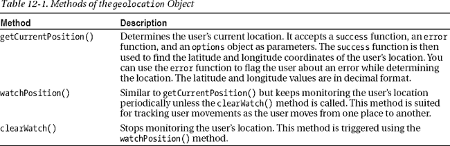
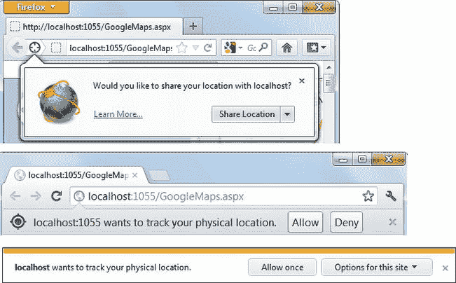
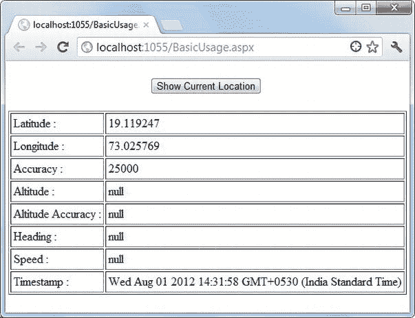
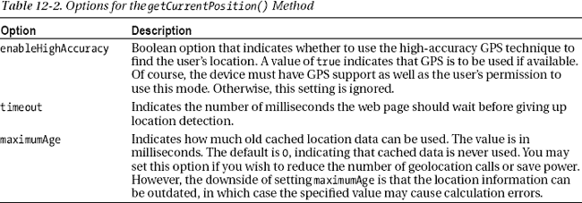
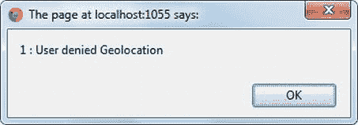
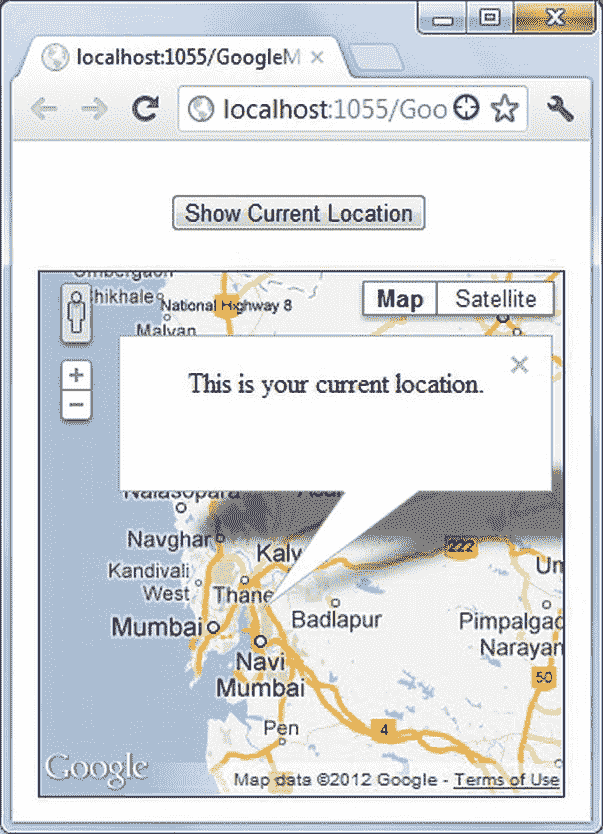
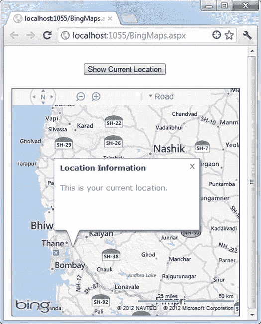
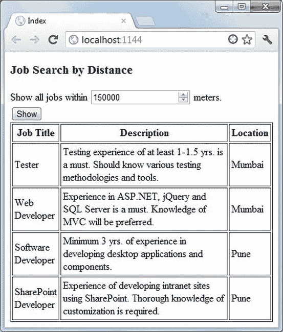
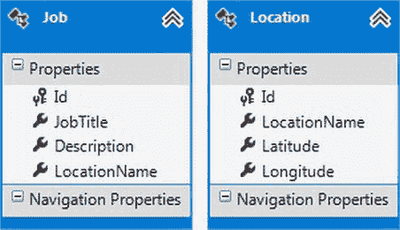

# 十二、使用地理定位 API 查找位置

今天的大多数 web 应用并不关心你从哪里访问它们。无论您的地理位置如何，它们在浏览器中呈现的内容都是相同的。但是，如果您将这些信息提供给 web 应用，它们可以对其进行创新性的使用。例如，一个社交网络应用可以推荐和你在同一个地方的朋友。用户位置信息也可以在工作门户中使用，以建议用户地理位置附近的工作。

跟踪用户位置的想法并不新鲜，但起初并没有找到这些信息的标准方法。幸运的是，多年来，一种标准化的方法——地理定位——已经发展到可以满足这种需求。地理定位 API 允许您通过使用各种位置源(如 IP 地址、全球定位系统(GPS)、全球移动通信系统(GSM)和通用分组无线业务(GPRS))来查找用户的位置。严格来说，地理定位 API 不是 HTML5 的一部分。然而，它通常与 HTML5 特性和技术一起使用。本章向您详细介绍了地理定位 API。具体来说，您将了解以下内容:

> *   What is geolocation?
> *   Use geolocation API to find and track user location
> *   Integrate geolocation API with Google Maps and Bing Maps
> *   Use geolocation API to present specific location data to users.

### 经纬度坐标系概述

为了传达用户的地理位置，您需要一个标准系统，该系统能够被参与该过程的所有各方所理解。在日常生活中，位置信息以城市、州、国家等形式表示。然而，这些信息对于计算来说用处不大。比如看两个城市名，分不清两者的距离。这就是使用地理坐标系统指定位置的原因。地理定位 API 使用的系统由纬度和经度坐标组成。

纬度坐标指定地球表面上一点的南北位置。纬度相同的点像平行于赤道的圆圈一样东西走向。纬度是从赤道的 0 度到两极的 90 度(北或南)的角度。

经度坐标指定了地球表面上一点的东西位置。经度相同的点位于从北极到南极的直线上。经度是一个角度，在本初子午线的 0°到向东或向西的 180°之间变化。

纬度和经度坐标以十进制/分钟/秒(DMS)格式或十进制度数指定。例如，在 DMS 格式中，孟买的纬度是 18 55 ' N，经度是 72 54 ' E，在十进制格式中，同样的坐标分别表示为 18.91667 和 72.9。正十进制数表示东北位置，而负十进制数表示西南位置。地理定位 API 使用十进制格式的纬度和经度值。

### 位置信息的来源

地理定位 API 并不规定从哪里获取位置信息。根据您使用的设备类型，位置信息的来源可能会有很大不同。例如，台式计算机可能使用 IP 地址作为信息源，而移动电话可能使用基于 GPS 的位置信息。位置信息的常见来源包括:

> *   Ip address
> *   全球（卫星）定位系统
> *   无线网络
> *   Mobile phone (GSM or CDMA)

这些位置源将在以下章节中简要讨论。

#### IP 地址

使用用户用来访问 web 应用的 IP 地址可能是确定用户位置的最古老的方法。通过这种技术，由互联网服务提供商(ISP)分配给用户的 IP 地址被用来检测请求的来源。这种技术只是猜测，而不是精确的结果，因为 ISP 可能位于远离用户实际位置的地方，因此，您不能依赖这种技术提供的位置信息。

除了被广泛使用之外，这种技术还提供了 IP 检测和位置查找逻辑发生在服务器端代码中的优势。客户端浏览器根本不在画面中。然而，由于它缺乏精确性，您不能在需要更高精确度的情况下使用这种技术。

#### 全球定位系统

您可以使用来自全球各地的 GPS 卫星站的信号来确定用户的确切位置。虽然 GPS 比其他技术提供更精确的位置信息，但它不太适合封闭或室内位置。使用 GPS 的另一个缺陷是相关的更高的电池消耗，这可能需要用户频繁地给设备充电。

#### Wi-Fi

使用 Wi-Fi 技术，通过计算 Wi-Fi 接入点和用户之间的距离来确定用户的位置。这种技术在封闭和室内位置工作良好，并给出准确的结果。然而，它也有一个缺点，那就是并非所有地方都有 Wi-Fi 接入。特别是在农村地区，Wi-Fi 连接的可用性通常很差，位置信息可能变得不可用。

#### 手机(GSM 或 CDMA)

这项技术利用手机信号塔和用户之间的距离来确定用户的位置。这项技术只适用于移动电话，并且只适用于移动站可用的区域。结果相当准确，可以用于专门为移动电话开发的应用。

 **注意**地理定位 API 使用的具体技术是由使用地理定位 API 的设备和软件决定的，而不是由地理定位 API 本身决定的。

### 地理定位应用编程接口

地理位置 API 允许您执行三个操作:在给定时间点查找用户的位置，在用户从一个地方移动到另一个地方时跟踪用户的位置，以及停止跟踪用户的位置。API 封装在一个`geolocation`对象中，该对象是浏览器窗口的`navigator`对象的一个属性。这三项任务借助三种方法来完成:
、`watchPosition()`、`clearWatch()`。这三种方法在表 12-1 中描述。

看着表 12-1 ，你可能想知道这些结果如何使最终用户受益。地理定位 API 仅仅给你用户的位置。如何以创新的方式使用这些数据取决于你。考虑以下情况，地理定位 API 在这些情况下非常有用:

> *   Travel companies can use the location to provide a list of nearby pick-up points.
> *   The application can suggest driving directions to the user according to the location information.
> *   A work portal can only present those jobs that are within the distance specified by the user.
> *   E-commerce websites can use location information to suggest freight to users. Real estate applications can customize search results according to the location of users.
> *   Museums, theaters, assembly halls and other institutions can calculate the approximate travel time from the user's location to the meeting place.

#### 地理定位和用户隐私

用户的地理位置被视为私人信息，用户需要提供明确的批准，浏览器才能将数据发送到服务器进行进一步处理。每当您访问使用地理定位 API 的网页时，浏览器会通知您将要与该页面共享您的位置信息，并提示您确认此操作。例如，图 12-1 展示了 Firefox、Chrome 和 IE9 是如何提示用户确认使用地理定位 API 的。

***图 12-1。**浏览器请求允许向服务器发送位置信息*

如您所见，除非用户明确授权在 web 上传输他们的位置，否则 Web 应用无法使用地理定位 API。用户可以使用浏览器选项随时撤销此权限。

在某些情况下，您可能还想将用户的位置信息发送给第三方系统。作为一个好的实践，最好让用户知道这样的共享。

### 使用地理定位 API 获取用户位置

现在您已经对地理定位 API 的功能有了基本的了解，让我们开发一个简单的基于 Web 表单的应用，演示如何使用`getCurrentPosition()`方法找到用户的位置。应用的主 web 表单如图 12-2 所示。

***图 12-2。**使用`getCurrentPosition()`方法*找到用户的位置

web 表单由一个按钮和一个表格组成。点按“显示当前位置”按钮会用位置信息填充表格。请注意，一些表格单元格包含未定义的值，表明这些信息不可用。

负责检索位置信息的 jQuery 代码在清单 12-1 中给出。

***清单 12-1。**检索用户的位置信息*

`$(document).ready(function () {

  if (!Modernizr.geolocation) {
    alert("This browser doesn't support the Geolocation API.");
    return;
  }

  $("#btnShowCurrent").click(function () {
    var options = {
      enableHighAccuracy: false,
      timeout: 5000,
      maximumAge: 3000
    };
    window.navigator.geolocation.getCurrentPosition(OnSuccess, OnError, options);
  });

});`

这段代码显示了`ready()`函数，它检查浏览器是否支持地理位置 API。这是使用`Modernizr`对象的`geolocation`属性完成的。然后代码将一个事件处理函数连接到 Show Current Location 按钮的`click`事件。

`click`事件处理函数定义了一个`options`对象，有三种设置:`enableHighAccuracy`、`timeout`和`maximumAge`。该对象指定了`getCurrentPosition()`方法要使用的选项。这三个选项的重要性在表 12-2 中描述。

清单 12-1 中的代码然后调用`geolocation`对象的`getCurrentPosition()`方法。这个方法接受三个参数:一个在成功检索地理位置数据时调用的`success`函数，一个在检索地理位置信息时出错时调用的`error`函数，以及一个`options`对象。指定`error`函数和`options`对象是可选的。

充当成功回调的`OnSuccess()`函数如清单 12-2 中的所示。

***清单 12-2。** `OnSuccess()`回调函数*

`function OnSuccess(position) {
  var html = "";
  html += "<tr><td>Latitude : </td>";
  html += "<td>" + position.coords.latitude + "</td></tr>";
  html += "<tr><td>Longitude : </td>";
  html += "<td>" + position.coords.longitude + "</td></tr>";
  html += "<tr><td>Accuracy : </td>";
  html += "<td>" + position. coords.accuracy + "</td></tr>";
  html += "<tr><td>Altitude : </td>";
  html += "<td>" + position. coords.altitude + "</td></tr>";
  html += "<tr><td>Altitude Accuracy : </td>";
  html += "<td>" + position. coords.altitudeAccuracy + "</td></tr>";
  html += "<tr><td>Heading : </td>";
  html += "<td>" + position. coords.heading + "</td></tr>";
  html += "<tr><td>Speed : </td>";
  html += "<td>" + position. coords.speed + "</td></tr>";
  html += "<tr><td>Timestamp : </td>";
  html += "<td>" + new Date(position.timestamp).toString() + "</td></tr>";
  $("#tblInfo").append(html);
}`

`OnSuccess()`接收一个`position`对象，该对象提供关于用户位置的信息，包括纬度和经度。这些属性中的大多数(除了时间戳)都可以在`position`对象的`coords`属性中获得。`position`对象给出的信息在表 12-3 中列出。

并非所有设备都具备表 12-3 中讨论的所有属性。例如，台式计算机不提供属性，如`speed`和`heading`。四个属性`latitude`、`longitude`、`accuracy`、`timestamp`在所有设备上都可用；不保证支持其他属性。如果属性没有可用数据，则返回`null`。

清单 12-2 中的代码读取各种属性，并将这些值添加到一个 HTML 表(`tblInfo`)中。如果在查找用户位置时出现错误，则调用`OnError()`函数。`OnError()`如清单 12-3 所示。

***清单 12-3。** `OnError()`功能显示错误信息*

`function OnError(err) {
  alert(err.code + " : " + err.message);
}`

`OnError()`函数非常简单。传递给函数的`err`对象有两个属性，它们提供了关于错误的更多信息:`code`和`message`。可能的错误代码有`1` ( `PERMISSION_DENIED`)、`2` ( `POSITION_UNAVAILABLE`)和`3` ( `TIMEOUT`)。`message`属性给出了一个描述性的错误消息。图 12-3 显示了使用地理定位 API 的权限被拒绝时的错误消息。

***图 12-3。**使用地理定位 API 的权限被拒绝后的错误消息*

图 12-3 显示了一个警告框中的`code`和`message`属性。当然，您可以检查`code`属性，并为每个错误代码显示一条更友好的消息。

### 通过地图应用使用地理定位 API

地理定位 API 的一个常见用途是将地图服务与 web 应用集成在一起。这种集成对于显示用户相对于一组其他位置的位置、建议驾驶路线以及计算两个地方之间的距离是有用的。Google Maps 和 Bing Maps 地图服务很受欢迎，通常由开发人员在 web 应用中使用。使用这些服务包括以下步骤:

> 1.  Get the API key from the service provider (Google or Bing).
> 2.  Refers to the map API library, which allows you to program map services in web pages.
> 3.  在你的 ASP.NET 网络应用中嵌入地图。
> 4.  Integrate map service with geolocation API, and customize the map according to your needs.

Google Maps 和 Bing Maps 要求您拥有一个 API 密钥，以便在您的 web 应用中使用它们的地图服务。API 密钥是为一个帐户分配的，您可以从相应的网站获取 API 密钥。本节稍后讨论的示例假设您已经从地图服务提供商处获得了有效的 API 密钥。

Google Maps 和 Bing Maps 允许您使用供应商开发的基于 JavaScript 的 API 对地图进行编程。您需要在 web 页面中添加对这个 JavaScript 库的引用，以使用它的特性。这些库提供的功能包括显示地图上的特定位置、设置地图的缩放级别、显示位置的标注等等。本节中的示例使用了库的一些基本特性。

使用 JavaScript 库，您可以轻松地将地图嵌入到自己的网页中。例如，您可以在`
`元素中显示地图。

地理位置 API 和地图服务相互独立。但是，您可以集成它们以提供更好的用户体验。例如，与其显示一个固定位置的地图并期望用户放大或缩小他们的位置，不如默认地图突出显示用户的位置。

 **注意**Google Maps API 和 Bing Maps API 提供了许多你可以在网络应用中使用的可编程特性。对这些特性的详细讨论超出了本书的范围。本章使用 Google Maps 和 Bing Maps 只是为了说明地理定位 API 与地图服务的集成。您可以访问地图服务提供商的网站(`[`developers.google.com/maps`](https://developers.google.com/maps)`和`[www.microsoft.com/maps/developers/web.aspx](http://www.microsoft.com/maps/developers/web.aspx)`)获取完整的文档。

#### 将地理定位 API 与谷歌地图集成

在本节中，您将学习如何将地理定位 API 与 Google Maps 集成。图 12-4 显示了你开发的 web 表单。

***图 12-4。**将地理定位 API 与谷歌地图整合*

如您所见，web 表单由一个按钮和一个保存地图的`
`元素组成。当页面加载到浏览器中时，默认情况下，地图以孟买为中心。如果单击“显示当前位置”,将显示一个标注，指向用户的当前位置。

要开发这个应用，您需要在标记中引用 Google Maps JavaScript 库。清单 12-4 显示了这是如何做到的。

***清单 12-4。**参考谷歌地图 API 库*

`<html>
  <head>
  …` `**  
    …
    <input type="button" id="btnShowCurrent" value="Show Current Location" />
    …
    

    …
</html>`

粗体显示的标记行指的是 Google Maps API 库。URL 包括两个强制查询字符串参数:`key`和`sensor`。`key`查询字符串参数指定了一个 API 键。因为密钥可能会根据使用的 Google 帐户而改变，所以它不会嵌入到标记中。相反，密钥存储在`web.config`文件的`<appSettings>`部分，并在`<%=`和`%>`块中检索。`GoogleMapsAPIKey`是`<appSettings>`部分中键的名称。`sensor`查询字符串参数指示运行此 web 应用的设备是否使用传感器(如 GPS 定位器)来确定用户的位置。

清单 12-4 中的其他标记很简单，包括一个呈现显示当前位置按钮的`<input>`标签和一个充当地图容器的`
`。

当页面加载到浏览器中时，使用 Google Maps API 显示孟买的 jQuery 代码如清单 12-5 所示。

***清单 12-5。**使用谷歌地图 API 显示地图*

`var map;
var defaultPos;

$(document).ready(function () {
  …
  defaultPos = new google.maps.LatLng(18.916667, 72.9);
  var mapOptions = {
    center: defaultPos,
    zoom: 8,
    mapTypeId: google.maps.MapTypeId.ROADMAP
  };
  map = new google.maps.Map($("#divMap").get(0), mapOptions);

  $("#btnShowCurrent").click(function () {
    window.navigator.geolocation.getCurrentPosition(OnSuccess, OnError);
  });
});`

这段代码从声明两个名为`map`和`defaultPos`的全局变量开始。`map`变量保存对 Google 地图对象的引用，而`defaultPos`变量保存地图上的默认位置。`ready()`方法处理程序通过传递孟买的纬度和经度来创建一个由 Google Maps API 提供的`LatLng`对象。这个`LatLng`对象作为地图的默认中心。然后，代码创建一个包含地图配置设置的`mapOptions`对象。`center`选项定义了地图的中心坐标。`zoom`设置影响地图的缩放级别。缩放值越大，地图越放大。`mapTypeId`设置控制显示的地图类型。`mapTypeId`的值可以从`ROADMAP`、`SATELLITE`、`HYBRID`和`TERRAIN`等常量中分配。`ROADMAP`的值表示显示二维地图。然后通过将 DOM 引用传递给充当地图容器的`
`元素和地图选项来构造一个`Map`对象。这将在`
`元素中显示一幅以孟买为中心的地图。

代码还显示了显示当前位置按钮的`click`事件处理函数。`click`事件处理程序调用`geolocation`对象上的`getCurrentPosition()`方法，并在参数中传递两个回调函数——`OnSuccess()`和`OnError()`。`OnSuccess()`和`OnError()`如清单 12-6 所示。

*清单 12-6**。** `OnSuccess()`和`OnError()`回调函数*

`function OnSuccess(position) {
  var curPos = new google.maps.LatLng(position.coords.latitude,
                       position.coords.longitude);
  map.setCenter(curPos);
  var callout = new google.maps.InfoWindow();
  callout.setContent("This is your current location.");
  callout.setPosition(curPos);
  callout.open(map);
}

function OnError(err) {
  alert(err.message);
  map.setCenter(defaultPos);
  var callout = new google.maps.InfoWindow();
  callout.setContent("This is the default location.");
  callout.setPosition(defaultPos);
  callout.open(map);
}`

`OnSuccess()`使用由`coords`对象提供的`latitude`和`longitude`属性创建一个新的`LatLng`对象。这个`LatLng`对象代表用户的位置。然后使用`map`对象的`setCenter()`方法设置新`LatLng`对象的中心。要向用户显示指向用户位置的标注，可以使用 Google Maps API 提供的`InfoWindow`对象。`InfoWindow`对象的`setContent()`方法表示标注的内容。`InfoWindow`对象的`setPosition()`方法控制放置标注的位置。最后，`InfoWindow`对象的`open()`方法显示指定`map`对象上的标注。

`OnError()`类似于`OnSuccess()`,但是在检索用户位置时发生错误时被调用。`OnError()`向用户显示一条错误消息，并在默认位置显示一个标注(本例中为 Mumbai)。

#### 将地理定位 API 与 Bing 地图集成

将地理定位 API 与 Bing 地图集成的过程类似于 Google 地图。但是，这一次，您需要使用 Bing Maps API 和相应的 API 键。下面一行标记显示了如何在网页中引用 Bing Maps API:

``

请注意，Bing 地图文档将这个库称为 Ajax controlm，但它实际上是一个 JavaScript 库，可以使用普通的`<script>`标记来引用，如图所示。这一次，API 键没有添加到库的 URL 中。相反，API 键是在映射选项中指定的，如清单 12-7 所示。

***清单 12-7。**使用 Bing 地图 API 显示地图*

`$(document).ready(function () {
  …
  defaultPos = new Microsoft.Maps.Location(18.916667, 72.9);
  var mapOptions = {
    credentials: '<%= ConfigurationManager.AppSettings["BingMapsAPIKey"] %>',
    center: defaultPos,
    mapTypeId: Microsoft.Maps.MapTypeId.road,
    zoom: 8
  };
  map = new Microsoft.Maps.Map($("#divMap").get(0), mapOptions);
  …
});`

这个清单类似于前面的例子。这里，代替`LatLng`对象，使用`Location`对象来表示地图位置。地图选项包括`credentials`、`center`、`zoom`、`mapTypeId`。`credentials`设置保存存储在`web.config`文件的`<appSettings>`部分的 Bing 地图 API 密钥。其他设置显而易见，无需解释。

这次的`OnSuccess()`和`OnError()`函数使用一个`Infobox`对象来显示位置标注。这些功能如清单 12-8 中的所示。

***清单 12-8。**使用必应地图 API 的`Infobox`对象*

`function OnSuccess(position) {
  var curPos = new Microsoft.Maps.Location(position.coords.latitude,
                        position.coords.longitude);
  var calloutOptions = {title: "Location Information",
                                    description: "This is your current location."};
  var callout = new Microsoft.Maps.Infobox(curPos, calloutOptions);
  map.entities.push(callout);
}

function OnError(err) {
  alert(err.message);
  var calloutOptions = {title: "Location Information",
                                    description: "This is the default location."};
  var callout = new Microsoft.Maps.Infobox(defaultPos, calloutOptions);
  map.entities.push(callout);
}`

基于用户的位置创建一个新的`Location`对象。`calloutOptions`对象保存标注中显示的标题和描述。通过传递期望的位置(在本例中是用户的位置)和`calloutOptions`对象来创建一个`Infobox`对象。最后，通过调用`entities`对象的`push()`方法并将`Infobox`作为参数传递来显示标注。图 12-5 显示必应地图中的一张地图。

***图 12-5。**必应地图显示一个`Infobox`*

如您所见，点击显示当前位置按钮打开了`Infobox`。`title`设置控制`Infobox`的标题，`description`设置控制其内容。

### 使用地理定位 API 呈现特定位置的数据

地理定位 API 并不局限于地图应用。您可以以创新的方式使用它，为您的 web 应用添加位置感知功能。在本节中，您将开发一个 ASP.NET MVC 应用，它根据用户的位置显示职位空缺。该应用由一个类似于图 12-6 的视图组成。

***图 12-6。**基于用户位置搜索工作*

该视图顶部有一个数字`<input>`字段。用户可以指定以米为单位的距离，以表明只列出指定距离内的作业。当用户点击 Show 按钮时，使用地理定位 API 捕获他们的位置；根据用户的位置和指定的距离，仅显示位于指定距离范围内的职务公告。例如，如果用户的位置是孟买，并且指定的距离是 150000 米(150 公里)，那么将显示来自孟买和浦那的工作发布，因为这两个位置在指定的 150 公里范围内。班加罗尔和钦奈的职位发布将不会显示，因为这些位置不在指定范围内。

该应用使用两个表——`Jobs`和`Locations`——分别存储职位发布和位置、坐标。这些表格的实体框架数据模型如图图 12-7 所示。

***图 12-7。**实体框架数据模型`Jobs`和位置表*

`Jobs`表存储`JobTitle`、`Description`和`LocationName`，而`Locations`表存储`LocationName`、`Latitude`和`Longitude`。清单 12-9 中显示了执行查找用户位置和获取相关职位发布的代码。

***清单 12-9。**根据用户位置和距离查找招聘信息*

`$(document).ready(function () {
…
  $("#btnShow").click(function () {
    window.navigator.geolocation.getCurrentPosition(function (position) {
      var lat1 = position.coords.latitude;
      var long1 = position.coords.longitude;
      var distance = $("#txtDistance").val();
      var data = '{ "lat1" : "' + lat1 + '","long1":"' + long1 +
                          '","distance":"' + distance + '"}';
      $.ajax({
        type: "POST",
        url: '/home/GetJobs',
        data: data,
        contentType: "application/json; charset=utf-8",
        dataType: "json",
        success: function (jobs) {
          $("#tblJobs").empty();
          $("#tblJobs").append("<tr><th>Job Title</th><th>Description</th><th>Location</th></tr>");
          for (var i = 0;i<jobs.length;i++)
          {
            $("#tblJobs").append("<tr><td>" + jobs[i].JobTitle + "</td><td>" +
            jobs[i].Description + "</td><td>" + jobs[i].LocationName +
                                             "</td></tr>");
          }
        },
        error: function (err) {
          alert(err.status + " - " + err.statusText);
        }
      });` `    });
  });
});`

这段代码显示了显示按钮的`click`事件处理函数。它首先使用`geolocation`对象的`getCurrentPosition()`方法检索用户的位置。这一次，`success`函数与`getCurrentPosition()`调用一起提供，而不是作为一个单独的函数。用户位置的纬度和经度值存储在本地变量`lat1`和`long1`中。使用来自变量和`<input>`字段的值形成一个带有三个键的 JSON 对象，这三个键是`lat1`、`long1`和`distance`。

接下来，使用 jQuery `$.ajax()`方法向`GetJobs()` action 方法发出一个 Ajax 请求。`GetJobs()`返回零个或多个`Job`对象，稍后会讨论。`$.ajax()`方法的`success`函数接收`GetJobs()`返回的`Job`对象。然后，它遍历 jobs 数组，并将作业添加到 HTML 表中。该表包含`Job`对象的`Title`、`Description`和`LocationName`属性。

`$.ajax()`方法的错误处理函数在一个警告框中显示错误消息。基于用户位置和指定距离返回相关作业的`GetJobs()`动作方法如清单 12-10 所示。

***清单 12-10。** `GetJobs()`动作方法*

`[HttpPost]
public JsonResult GetJobs(double lat1, double long1, double distance)
{
    JobsDbEntities db = new JobsDbEntities();
    var data = from item in db.Jobs
                select item;
    List<Job> selectedJobs = new List<Job>();

    foreach(Job job in data)
    {
        var temp = from item in db.Locations
                    where item.LocationName==job.LocationName
                    select item;

        double lat2 = (double)((Location)temp.SingleOrDefault()).Latitude;
        double long2 = (double)((Location)temp.SingleOrDefault()).Longitude;

        if (GetDistance(lat1, long1, lat2, long2) <= distance)
        {
            selectedJobs.Add(job);
        }
    }
    var finalData = from obj in selectedJobs
                    orderby obj.LocationName
                    select obj;
    return Json(finalData);
}`

来自家庭控制器的`GetJobs()`动作方法采用三个类型为`double`的参数。`lat1`和`long1`参数代表用户所在位置的纬度和经度。`distance`参数代表用户指定的距离。然后，该方法遍历所有可用的职位发布。通过每次迭代，确定工作位置的纬度和经度。 `GetDistance()`辅助方法确定用户位置(`lat1`、`long2`)和作业位置(`lat2`、`long2`)之间的距离。如果`GetDistance()`返回的距离小于或等于用户指定的距离，则职位发布被添加到`Job`对象的通用`List`中。在过滤后的职位发布发送给用户之前，`selectedJobs`通用`List`在`LocationName`上排序。最后，使用`Json()`方法将`Job`对象的排序列表以 JSON 格式发送给调用者。确定用户位置和工作位置之间距离的`GetDistance()`方法如清单 12-11 所示。

***清单 12-11。**查找用户位置和工作位置之间的距离*

`private double GetDistance(double lat1,double long1,double lat2,double long2)
{
    GeoCoordinate point1 = new GeoCoordinate(lat1, long1);
    GeoCoordinate point2 = new GeoCoordinate(lat2, long2);
    double distance = point1.GetDistanceTo(point2);
    return distance;
}`

这段代码使用了来自`System.Device.Location`名称空间(位于`System.Device.dll`程序集中)的`GeoCoordinate`类。`GeoCoordinate` s 代表一个地点的地理坐标。`GeoCoordinate`构造函数接受一个位置的纬度和经度。`GeoCoordinate`类的`GetDistance()`方法返回该点和参数中指定的另一个点之间的距离。然后，以米为单位的距离被返回给调用者。

注意，为了简单起见，这段代码从表中检索所有的行，然后逐个遍历它们。更复杂的解决方案是计算最大纬度和经度值，然后只检索在该范围内的行。

 **注**此。就属性而言，NET Framework 的`GeoCoordinate`类类似于地理定位 API 的`coords`对象。`GeoCoordinate`使用哈弗辛公式计算距离。该公式将地球视为球形而非椭球形，并且不使用高度来计算距离。在计算长距离时，哈弗辛公式引入了小于 0.1%的误差。

### 使用地理定位应用接口追踪移动

在前面的例子中，您使用了`geolocation`对象的`getCurrentPosition()`方法来获取用户的当前位置。当您希望在调用方法时知道用户的位置，并且对持续跟踪用户不感兴趣时，这种方法非常有用。但是，在某些情况下，当用户从一个地方移动到另一个地方时，您需要一直监视用户的位置。例如，您可能想要监视用户从一个位置向另一个位置移动的距离，并且您可能想要定期通知用户到目标位置的剩余距离。在这种情况下，您可以使用`geolocation`对象的`watchPosition()`方法。这种方法在语法上类似于`getCurrentPosition()`；但与`getCurrentPosition()`不同的是，它每隔一段时间就会调用`success`函数。连续调用`success`函数的确切间隔由设备控制。只有当用户的位置改变时，才会调用`success`回调函数。因此，在台式计算机上，`getCurrentPosition()`和`watchPosition()`的行为方式相同，因为计算机的位置不会改变。

如果基于某种条件，您希望停止监视用户的位置，该怎么办？`watchPosition()`方法返回一个数字，该数字的作用类似于调用`watchPosition()`的句柄。你可以将这个数字传递给`clearWatch()`方法来停止监视用户的位置。清单 12-12 中的代码展示了如何使用`watchPosition()`和`clearWatch()`。

*清单 12-12**。**使用`watchPosition()`和`clearWatch()`方法*

`var watchId;
function StartWatch() {
  watchId = window.navigator.geolocation.watchPosition(OnSuccess, OnError);
}

function StopWatch() {
  window.navigator.geolocation.clearWatch(watchId);
};`

这段代码定义了一个名为`watchId`的全局变量来存储`watchPosition()`返回的手表句柄。`StartWatch()`函数调用`geolocation`对象的`watchPosition()`方法，并像以前一样传递`OnSuccess`和`OnError`回调函数。返回的数字句柄存储在`watchId`变量中。`StopWatch()`调用`geolocation`对象的`clearWatch()`方法，并将`watchId`作为参数传递，以清除该监视。

### 总结

地理定位 API 允许您根据纬度和经度找到用户的地理位置。`navigator`对象的`geolocation`对象属性公开了负责检索用户位置的方法。`getCurrentPosition()`方法返回用户的当前位置。在调用`clearWatch()`方法之前，`watchPosition()`方法会一直监视那个位置。

使用地理位置 API，您可以构建基于用户位置显示数据的位置感知 web 应用。您还可以将地理定位 API 与谷歌地图和必应地图等地图服务集成在一起。

您已经了解了 HTML5 所有突出的可编程特性。尽管作为一名 web 开发人员，您的核心重点是可编程特性，但有时您也需要使用级联样式表(CSS)来设计 web 应用的样式。CSS3 提供了这方面的最新信息。下一章将介绍一些新的和改进的特性。