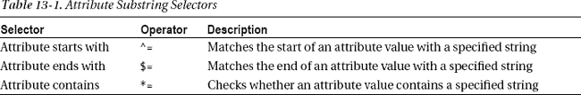
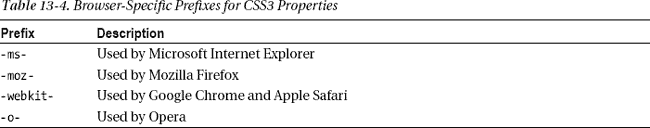

# 十三、使用 CSS3 设计 Web 表单和视图的样式

作为一名希望利用 HTML5 能力的 ASP.NET 开发人员，您最感兴趣的领域是 HTML5 的可编程特性。然而，作为开发真实世界的专业 web 应用的一部分，您还需要研究这些 web 应用的样式方面。当涉及到设计 web 表单和视图的样式时，层叠样式表(CSS)是事实上的标准，CSS3 增加了许多增强功能，使得样式更好。CSS3 不是 HTML5 的一部分，但是它们一起发展，很好地互补。

CSS3 规范将对 CSS 2.1 的改进分成了所谓的*模块*。CSS3 中大约有 50 个模块。将改进和添加的内容分组到模块中的想法是，浏览器供应商可以决定在他们的产品中实现哪些模块。当一个模块被实现时，开发者也知道他们可以使用哪些特性。因为 CSS3 仍然是一个不断发展的规范，这种模块化的方法使得浏览器供应商能够以一种渐进的方式支持和改进 CSS3 的特性。

CSS3 增加了许多新功能，包括圆角边框、web 字体、阴影、透明度和变换等。本章详细介绍了一些开发人员经常需要的重要 CSS3 特性，因为它们在设计网页样式时经常用到。使用这些特性，您可以更好地美化 web 表单和视图。具体来说，您将了解以下内容:

> *   Use CSS3 selector
> *   Use custom fonts automatically downloaded by clients.
> *   Use rounded corners, shadows, gradients and transparency enhancement boxes.
> *   Use transitions and transformations
> *   Media query for different devices

本章最后介绍了如何使用 Modernizr 来应用特定于 CSS3 的特性。

### CSS3 选择器

在第二章中，您了解了 jQuery 选择器，它允许您选择元素，以便在 jQuery 代码中进一步操作。CSS 选择器做完全相同的工作，不同的是它们为选择元素是为了应用样式。事实上，jQuery 选择器是基于 CSS 选择器的思想。CSS3 为 CSS 中已经存在的选择器添加了许多新的选择器。本节介绍一些重要的。

如果您过去使用过 CSS，那么您可能已经熟悉了选择器的概念。考虑下面的 CSS 类:

`#mydiv{ border: 2px #f00 solid; }`

这个类使用了 *ID 选择器*，并应用于 ID 属性为`mydiv`的 DOM 元素。另外两个常用的 CSS 选择器是元素选择器和类选择器。一个*元素选择器*选择特定标签名称的所有元素，而一个*类选择器*选择所有属性`class`被设置为特定 CSS 类名的元素。以下示例显示了这两个选择器:

`div{ border: 2px #f00 solid; }
.myclass{ border: 2px #f00 solid; }`

第一个 CSS 类使用一个元素选择器来选择所有的`
`元素，并对它们应用指定颜色和宽度的边框。第二个类选择所有属性设置为`myclass`的 DOM 元素，并对它们应用指定颜色和宽度的边框。

 **注**除了刚才讨论的选择器，CSS 2.1 还提供了其他几个，但本章不讨论。这里我们只关注 CSS3 中新添加的选择器。

下面几节中讨论的 CSS3 新添加的选择器可以分为四类:

> *   *Attribute-substring selector:* Allows you to select an attribute value to specify a string.
> *   *The beginning, end or element containing the specified string; Structural pseudo-class:* allows you to select elements, such as specific sub-elements, according to their structural positions.
> *   *Element state pseudo-class:* allows you to select elements in a specific state, such as enabled, disabled or selected elements.
> *   *Other pseudo-classes: provided by*

以下部分详细讨论了每组选择器。

#### 属性-子串选择器

属性-子字符串选择器允许您选择属性值以指定字符串开头、结尾或包含指定字符串的 DOM 元素。这三个选择器在表 13-1 中列出。

让我们用一个例子来说明这三个属性-子串选择器。假设您有一个包含多个超链接的网页。其中一些指向 URL，一些指向电子邮件地址，如下所示:

`<a href="http://www.microsoft.com">Go to Microsoft's website.</a>
<a href="mailto:contact@somedomain.com">Contact us here.</a>`

现在假设您希望以红色显示所有以`http://`开头的超链接，以蓝色显示所有以`mailto:`开头的超链接。您可以使用属性子字符串选择器来实现这一点:

`a[href^="http://"] {
  color:red;
  font-size:30px;
}
a[href^="mailto:"] {
  color:blue;
  font-size:30px;
}`

这些类中使用的 CSS 选择器使用`^=`操作符将锚元素的`href`属性的开始与特定的字符串相匹配。第一个选择器选择所有以`http://`开头的超链接，并将它们的颜色设置为红色；另一个选择器选择所有以`mailto:`开头的超链接，并将它们的颜色设置为蓝色。图 13-1 显示了这些链接在浏览器中的样子。

***图 13-1。**“属性以”选择器开始动作*

现在，进一步假设同一个页面包含某些 PDF 文件的 URL，并且您希望用绿色呈现这些超链接。在这种情况下，您可以使用如下所示的“属性结尾”选择器:

`a[href$=".pdf"] {
  color:green;
  font-size:30px;
}`

“属性结束于”选择器使用`$=`操作符将属性值的结尾与指定的字符串匹配。在这个例子中，`href`属性值的结尾与`".pdf"`相匹配，所有匹配标准的超链接都以绿色显示。匹配超链接的示例如下:

`<a href="downloads/ebook.pdf">Download eBook here.</a>`

进一步扩展这个想法，您还可以显示包含(而不是以)特定文本开始或结束的超链接。例如，要用橙色显示所有包含单词 *google* 的超链接，可以使用

`a[href*="google"] {
  color:orange;
  font-size:30px;
}`

如您所见，`*=`操作符检查每个超链接元素的`href`属性，查看它是否包含单词 *google* 。如果是这样，超链接的颜色将设置为橙色。下面是一个匹配超链接的示例:

`<a href="http://www.somedomain.com/google/api">…</a>`

指定的字符串可以位于属性值的开头、结尾或两者之间的任何位置。

#### 结构伪类

有时，您希望根据元素在 DOM 树中的结构位置对元素应用样式。例如，您可能希望对表格的第一行和最后一行应用某种样式。在这种情况下，结构化伪类就派上了用场。表 13-2 列出了结构伪类。

让我们看一些使用结构伪类的例子。假设您希望以某种颜色显示 HTML 表格的最后一行。您可以使用`:last-child`伪类来实现，如下所示:

`tr:last-child {
  background-color:#808080;
  font-size:20px;
}`

这个 CSS 选择器选择作为其父元素的最后一个子元素的所有`<tr>`元素(即`<table>`元素),并对它们应用指定的背景颜色和字体大小。图 13-2 显示了应用了样式的表格的外观。

***图 13-2。**使用`:last-child`伪类*样式的表格的最后一行

处理表格时的一个常见要求是用不同的颜色显示交替行。这可以通过使用`:nth-child`选择器来实现。以下 CSS 选择器对表格的奇数行和偶数行应用不同的样式:

`tr:nth-child(odd) {
  background-color:#fff;
}
tr:nth-child(even) {
  background-color:#808080;
}`

这里，所有奇数行具有背景色`#fff`，所有偶数行具有背景色`#808080`。结果表格如图图 13-3 所示。

***图 13-3。**使用`:nth-child`伪类*应用了不同样式的奇数行和偶数行

`odd`和`even`关键字分别表示奇数行和偶数行。您也可以指定行号:例如，`tr:nth-child(2) {…}`。编号从 1 开始。

类型选择器类似于子选择器，但是它们适用于指定类型的兄弟，而不是子。考虑这样一种情况，您有许多`
`元素，并且您希望第一段的第一个字母以特定的方式显示。因为所有的`
`元素都是彼此的兄弟，所以使用一个类型伪类。对于这种特殊情况，您可以如下使用`:first-of-type`:

`p:first-of-type::first-letter {
  font-size:50px;
  float:left;
  line-height:1;
  margin-right:5px;
}`

该`:first-of-type`选择器选择第一个`
`元素。然后，双冒号(`::`)语法使用`::first-letter`伪元素选择该段落的第一个字母，并应用指定的样式。图 13-4 显示了段落的外观。

***图 13-4。**使用`:first-of-type`选择器选择第一段内容*

注意，特定的样式只应用于第一段的第一个字母，因为使用了:`first-of-type`伪类。其他`
`元素不受样式的影响。

 **注意**在 CSS3 之前，伪类和伪元素的前缀都是冒号(`:`)。为了区分它们，CSS3 用单冒号(`:`)给伪类加前缀，用双冒号(`::`)给伪元素加前缀。这使您能够快速识别出`:first-of-type`是一个伪类，而`::first-letter`是一个伪元素。

#### 元素状态伪类

元素状态伪类在处理表单字段时非常有用，因为它们根据状态选择元素。例如，假设您希望对所有选中的复选框应用特定的样式，或者以特定的方式显示禁用的元素。这些伪类在表 13-3 中列出。

为了理解如何使用元素状态伪类，考虑以下选择器:

`input[type="text"]:enabled { background:#fff; }
input[type="text"]:disabled { background:#808080; }
input:checked { border:2px #f00 solid; }`

当应用于类型为`text`的输入元素时，`:enabled`伪类返回所有已启用的文本框，并对它们应用指定的样式。类似地，`:disabled`伪类选择所有被禁用的文本框，并应用指定的样式。`:checked`伪类选择所有的复选框，并按照指定给它们添加一个边框。图 13-5 展示了这些伪类的作用。

***图 13-5。**`:enabled``:disabled``:checked`动作中的伪类*

#### 杂项伪类

本节讨论的 CSS 伪类不属于前面讨论的任何类别。这些伪类包括否定伪类(`:not()`)和一般的兄弟组合子伪类。

当您希望选择不匹配特定条件的元素时，可以使用 negation 伪类。例如，假设一个表单包含几个`<input>`元素。在所有这些`<input>`元素中，只有一个是`submit`类型的；其余均为`text`、`checkbox`和`radio`类型。如果希望将样式应用于除提交按钮之外的所有`<input>`元素，可以使用如下所示的`:not()`伪类来实现:

`input:not([type="submit"]) {
  background-color:#808080;
}`

该选择器选择`type`属性不是`submit`的元素。这些元素的背景颜色被设置为`#808080`。

一般的兄弟组合子由两个简单的选择器组成，用波浪符号(`~`)分隔。它选择第一种类型的元素之前的第二种类型的元素。两个元素必须有相同的父元素，但是第二个元素不必紧接在第一个元素之前。例如，假设您有一个包含其他元素如`<ul>`、`<input>`和``的`
`元素，如下所示:

`

  <ul>
    <li>One</li>
    <li>Two</li>
  </ul>

<ul>
  <li>Three</li>
  <li>Four</li>
</ul>`

您希望将样式应用于出现在`
`元素之后并出现在`
`中任何位置的`<ul>`兄弟元素。您可以使用以下 CSS 规则来实现这一点:

`div ~ ul {
  background-color:#ff6a00;
}`

图 13-6 显示了最终的结果。

***图 13-6。**通用兄弟组合器*

如您所见，第一个`<ul>`是`
`的子节点，而不是兄弟节点，因此指定的样式没有应用于它。第二个`<ul>`是`
`元素的兄弟，所以通用兄弟组合器选择它并应用指定的背景颜色。

### 特定于浏览器的属性前缀

如前所述，CSS3 规范仍在发展中，不同的浏览器供应商对它们的支持程度也各不相同。目前，浏览器实现的特定于 CSS3 的特性分为两大类:完全符合规范的特性，以及已经实现但还不完全符合规范的特性。为了区分这两种类型，浏览器供应商对属于第二类的特性使用他们自己的前缀。这些前缀在表 13-4 中列出。

考虑一个名为`rotate`的 CSS 类，如下所示:

`.rotate
{
  border-radius: 25px;
  -ms-transform: rotate(10deg);
}`

CSS 类使用了两个 CSS3 属性:`border-radius`和`-ms-transform`。`border-radius`属性没有附加前缀，这表明它的特性是完整的。另一方面，`transform`属性使用`-ms-`前缀，表示应该使用特定于 Internet Explorer 的功能不完整的实现。在后面讨论的一些例子中，你可以使用表 13-4 中列出的特定于浏览器的前缀。

 **注意**你可以使用 Modernizr 在 JavaScript 代码中检测浏览器对 CSS3 特性的支持，就像其他 HTML5 特性一样。然而，Modernizr 并没有为所有 CSS3 特性提供检测属性。

### 使用网络字体

通过恰当地使用字体，你可以使你的网页吸引人并且易于阅读。不幸的是，web 开发人员和设计人员不得不满足于一小部分字体，以确保他们的 web 应用在运行于各种操作系统的所有浏览器上看起来都是一样的。如果您在网页中使用的字体没有与操作系统捆绑在一起，则不能保证客户端机器安装了相同的字体。因此，您的网页在最终用户看来可能与在您的机器上不同。这就是为什么 web 开发人员和设计人员经常限制自己使用众所周知的 web 安全字体，这种字体可能在各种计算机系统上都可用；这些字体包括 Arial、Verdana 和 Times New Roman。

CSS3 提供了一种新的使用字体的方式，叫做*网络字体*。使用此功能，您可以在网站上承载网页使用的非标准字体。然后使用`@font-face` CSS3 规则声明一个自定义字体定义。在运行时，客户端浏览器从样式表中读取自定义字体定义，并将字体下载到客户端机器。然后，该字体将用于您的网页。每个想要使用非标准字体的网站都必须在网站的样式表中定义它。

#### 网络字体格式

尽管 CSS3 让你在网页中使用非标准字体变得很容易，但是还有一个地方需要解决:字体文件格式。就像媒体文件一样，字体文件包括多种字体，并且对于这些格式没有一个 web 标准。表 13-5 列出了目前使用的字体文件格式。

因为 web 字体没有单一的标准文件格式，并且开发人员可能需要在其网站上托管多种文件格式，所以一些网站提供这些文件格式的字体供下载。一个流行的网站是 Font Squirrel ( `[www.fontsquirrel.com](http://www.fontsquirrel.com)`)，它提供了所谓的`@font-face`工具包——这些文件格式的字体集。图 13-7 显示了名为 Magenta 的字体松鼠下载页面。

***图 13-7。**从字体松鼠网站*下载`@font-face`工具包

您可以选择下载字体格式。默认情况下，会选择 TIF、EOT、WOFF 和 SVG 格式。下载的`@font-face`工具包(一个 Zip 文件)包含所有的字体格式、许可信息和一个演示 HTML 页面。

除了从网站下载一个`@font-face`工具包，然后上传到你自己的网站，还有一个选择:Google Web Fonts。谷歌网络字体提供了在你的网页中使用的网络表单，无需下载。你所需要做的就是在你的网页中添加一个样式表引用，就像 Google Web Font 网站上所指示的那样(`[www.google.com/webfonts](http://www.google.com/webfonts)`)。在运行时，Google Web 字体网站会自动检测浏览器，并以支持的格式向其发送字体。图 13-8 显示了谷歌网页字体网站。

***图 13-8。**谷歌网页字体网站*

在接下来的部分中，你将学习如何使用`@font-face`工具包文件以及 Google Web Fonts 网站。

#### 使用@font-face 规则

现在你知道了什么是 web 字体以及如何获得它们，让我们看看如何在网页中使用它们。假设您已经下载了前面示例中提到的洋红色字体。要使用 web 字体，需要在样式表文件中创建一个自定义字体定义。这里显示了一个字体定义示例:

`@font-face
{
font-family: MyWebFont;
src: url('Fonts/Magenta_BBT-webfont.ttf'),
     url('Fonts/Magenta_BBT-webfont.eot'),` `     url('Fonts/Magenta_BBT-webfont.svg'),
     url('Fonts/Magenta_BBT-webfont.woff');
}`

`@font-face`规则从定义一个名为 MyWebFont 的字体系列开始。字体系列名称可以是开发人员定义的任何名称。如果您有多个`@font-face`规则，每个规则应该有一个唯一的字体系列名称，以避免歧义。然后`src`属性使用`url()`函数指向字体文件所在的一个或多个 URL。在这个例子中，所有的字体文件都位于一个名为`Fonts`的文件夹中。对于您希望支持的每种字体格式，您必须指定一个 URL。

一旦您使用`@font-face`定义了一个自定义字体定义，您就可以在其他 CSS 规则中使用该字体。例如，下面的 CSS 规则将 MyWebFont 用于`<h1>`标记:

`h1 {
    font-family: 'MyWebFont';
    font-size:40px;
    text-align:center;
}`

如您所见，在 CSS 规则中，您可以像使用任何其他标准字体一样使用自定义字体。在这种情况下，`font-family`属性被设置为`MyWebFont`，并且`font-size`和`text-align`属性也被设置。图 13-9 显示了浏览器中的顶层标题。

***图 13-9。** `@font-face`应用于页面标题*

即使本地机器没有特定的字体，网页也可以用该字体显示文本，因为`@font-face`提供了字体文件的位置。

如果你使用的是 Google Web Fonts 中的字体，那么你不需要用`@font-face`来定义字体，因为已经为你定义好了。您所要做的就是参考 Google Web Fonts 提供的样式表，然后在 CSS 规则中使用字体系列名称。例如，如果单击字体 Peralta 的“快速使用”按钮，您会看到一个样式表引用链接和一个字体系列名称(Peralta)。有了这些信息，您可以按如下方式定义 CSS 规则:

`h2 {
    font-family:'Peralta';
    font-size:20px;
    text-align:center;
}`

在这里，您为`<h2>`元素创建一个 CSS 规则，并将字体系列指定为 Peralta。然后，您可以引用网页中的样式表，如下所示:

`    <link href='http://fonts.googleapis.com/
     css?family=Peralta' rel='stylesheet' type='text/css'>
    <link rel="stylesheet" type="text/css" href="StyleSheet.css" />` 

***图 13-10。**使用谷歌网络字体中的网络字体*

请注意，在您自己的样式表(`StyleSheet.css`)中使用 Peralta 字体定义之前，您应该参考 Google Web Fonts 提供的样式表。图 13-10 显示了`<h2>`标题在浏览器中的样子。

如您所见，副标题是使用 Google Web Fonts 提供的 Peralta 字体显示的。

在前面的例子中，您使用了第三方提供的字体(字体松鼠或谷歌)，但是如果需要，您也可以通过为它们生成一个`@font-face`工具包来使用自己的字体。字体松鼠网站允许你上传自己的字体来生成自己的`@font-face`工具包。一旦为这样的字体生成了`@font-face`工具包，你就可以在你的网页中使用它们了，正如本节所讨论的。

### 圆角、阴影、渐变和透明度

应用于网页中 DOM 元素的最常见的效果之一是将它们放在一个框中。边框、边框宽度和样式、颜色等框属性是使用各种 CSS 属性配置的。CSS3 提供了一些功能，可以帮助您进一步增强框的布局。这些很酷的新增功能很可能会成为你最常用的 CSS3 特性。使用它们，您可以执行以下操作:

> *   A box that adds rounded corners to DOM elements.
> *   Add a shadow to the box.
> *   Set multiple images as the background.
> *   Add a gradient fill to the background.

让我们看看如何将这些特性应用于 DOM 元素。

#### 圆角

每当您使用边框属性在元素周围放置一个框时，默认情况下，该框会出现尖角。您可以使用`border-radius`属性将带有尖角的框变成带有圆角的框。使用`border-radius`，您可以指定一个圆的半径，该圆的周长决定了拐角的圆角。下面的 CSS 规则显示了如何使用`border-radius`属性:

`.boxRoundedCorders {
    padding:15px;
    background-color:#d0bdbd;
    border: 2px solid #071394;
**    border-radius: 25px 25px 25px 25px;**
}`

`border-radius`按左上、右上、右下和左下的顺序设置矩形四个角的圆的半径。虽然这个例子将每个圆的半径设置为 25px，但这不是必需的。您可以指定不同的半径值，相应的角(左上、右上、右下或左下)将相应地改变其曲线。

也可以使用椭圆而不是圆来控制曲线。这样，平曲线和竖曲线可以不同。为此，您需要如下设置各个角的边界半径:

`.boxRoundedCorders2 {
    padding:15px;
    background-color:#d0bdbd;
    border: 2px solid #071394;
**    border-top-left-radius: 25px 15px;**
**    border-top-right-radius: 25px 15px;**
**    border-bottom-left-radius: 50px 40px;**
**    border-bottom-right-radius: 50px 40px;**
}`

这一次，单个属性— `border-top-left-radius`、`border-top-right-radius`、`border-bottom-left-radius`和`border-bottom-right-radius`—分别指定椭圆的水平和垂直半径。图 13-11 显示了放置在`
`元素中的两个 ASP.NET`FormView`服务器控件，这些元素应用了`boxRoundedCorners`和`boxRoundedCorners2` CSS 类。

***图 13-11。** `FormView`带圆角的控件*

第一个`FormView`的边框都具有 25px 的相等半径，如在`border-radius`属性中指定的。第二个`FormView`的顶角半径分别为 25px、15px，底角半径分别为 50px、40px。

#### 阴影

CSS3 允许你给文本框和文本添加阴影。`box-shadow`和`text-shadow`属性分别控制框阴影和文本阴影。您可以为这两种类型的阴影指定水平偏移、垂直偏移、模糊量和颜色。

下面的 CSS 规则使用了刚刚讨论过的`box-shadow`和`text-shadow`属性:

`.shadow {
    padding:15px;
    background-color:#d0bdbd;
    border: 2px solid #071394;
    border-radius: 25px 25px 25px 25px;
**    box-shadow: 5px 5px 5px #808080;**
**    text-shadow: 2px 2px 2px #808080;    **
}`

如您所见，`box-shadow`指定了 5px 的水平和垂直偏移。正偏移量意味着阴影相对于长方体向右下方下降，而负值意味着阴影向左上方下降。`box-shadow`属性指定模糊量为 5px。值越大，阴影越模糊。最后，阴影颜色被指定为`#808080`(灰色)。

`text-shadow`属性类似，将水平和垂直偏移量指定为 2px。模糊值也设置为 2px。图 13-12 显示了结果框。

***图 13-12。**给文本框和文本添加阴影*

注意，`text-shadow`并不是所有的浏览器都支持(例如 IE9)，但是`box-shadow`在所有主流浏览器中都有很好的支持。

默认情况下，框阴影放置在框的外部。您可以使用关键字`inset`来改变这种行为，如下所示:

`box-shadow: 5px 5px 5px #808080 inset;`

当你在最后添加`inset`关键字时，阴影出现在框内而不是框外(图 13-13 )。

***图 13-13。**添加`inset`关键字*后的阴影

#### 图像背景

在前面的例子中，CSS 规则为盒子的背景使用了一种颜色。您可以使用背景图像来代替指定背景颜色。CSS3 中的新特性是能够在一个背景中使用多个图像。例如，您可以使用四个不同的图像，并将它们放置在框的左上、右上、左下和左下区域。当然，图像所占据的实际面积取决于图像的大小。考虑以下 CSS 规则:

`.imageBackground {
    padding:15px;
    font-size:20px;
    border: 2px solid #071394;
    border-radius: 25px 25px 25px 25px;
**    background-image: url('img/RedFlower.png'), url('img/BlueFlower.png');**
**    background-position: left top, right bottom;**
**    background-repeat: no-repeat, no-repeat;**
    height:300px;
}`

这个 CSS 规则使用`background-image`属性来指定两个图像 URL:`RedFlower.png`和`BlueFlower.png`。这两个图像的位置由`background-position`属性控制。对于`background-image`属性中的每个图像 URL，在`background-position`属性中必须有一个条目。在这个例子中，`RedFlower.png`放在盒子的左上角，`BlueFlower.png`放在右下角。

您还需要指定`background-repeat`属性。在本例中，因为您没有水平或垂直重复图像，所以您将`background-repeat`设置为`no-repeat`。图 13-14 显示了最终的盒子背景。

***图 13-14。**使用多张图片作为盒子背景*

`RedFlower.png`出现在左上角，`BlueFlower.png`出现在右下角。

#### 渐变

在第四章的中，你学会了在画布上绘制渐变——线性和径向。CSS3 提供了绘制渐变背景的方法。您可以使用两个 CSS 函数来实现这一点:`linear-gradient()`和`radial-gradient()`。他们分别用线性和径向渐变绘制方框背景。在撰写本文时，`linear-gradient()`和`radial-gradient()`还没有被一些浏览器完全实现，所以您需要将它们与前面讨论过的浏览器前缀(`-ms-`、`-moz-`、`-webkit-`等等)一起使用。下面的 CSS 规则展示了如何使用`linear-gradient()`:

`.linearGradient {
    padding:15px;
    background-color:#d0bdbd;
    border: 2px solid #071394;
    background: -moz-linear-gradient(left, yellow, white);
    background: -webkit-linear-gradient(left, yellow, white);
    background: -o-linear-gradient(left, yellow, white);
}`

以`-moz-`为前缀的函数针对 Firefox，以`-webkit-`为前缀的函数针对 Chrome 和 Safari，以`-o-`为前缀的函数针对 Opera。该函数的第一个参数指定绘制渐变的起始边缘。`Left`表示从左侧开始绘制渐变，直到到达方框的右侧。如果指定`top`，渐变的方向是从上到下。第二个和第三个参数指定渐变的开始和结束颜色。图 13-15 显示了这种渐变效果。

***图 13-15。**绘制线性渐变*

示例渐变从黄色开始，逐渐渐变为白色。您也可以将起点(第一个参数)指定为角度。例如，`0deg`、`90deg`、`180deg`、`270deg`分别表示左、下、右、上。这些值之间的任何角度都会相应地移动拐角处的起点。此外，您可以为渐变指定一系列颜色，而不仅仅是开始和结束颜色:

`-webkit-linear-gradient(left, orange, yellow, white);`

在这个例子中，指定了三种颜色:橙色、黄色和白色。所以，渐变一开始是橙色，然后变成黄色，最后渐变为白色。

绘制径向渐变类似于绘制线性渐变。唯一的区别是，渐变不是从一个边缘开始，到另一个边缘结束，而是从中心开始，到框的边界结束。下面的 CSS 规则展示了如何使用`radial-gradient()`:

`.radialGradient {
    padding:15px;
    background-color:#d0bdbd;
    border: 2px solid #071394;
**    background: -moz-radial-gradient(circle, yellow, white);**
**    background: -webkit-radial-gradient(circle, yellow, white);**
**    background: -o-radial-gradient(circle, yellow, white);**

}`

`radial-gradient()`函数的第一个参数表示渐变中心的起始位置。最常见的值是`center`，表示盒子的中心是起点。另外两个参数代表渐变的开始和结束颜色，就像`linear-gradient()`一样。图 13-16 显示了径向梯度。

***图 13-16。**使用`radial-gradient()`功能绘制径向渐变*

请注意，本节仅讨论梯度函数的基本用法。这些函数提供了更复杂的绘制和微调渐变的方式。可以在网上多看看(比如`[`developer.mozilla.org/en-US/docs/CSS/CSS_Reference`](https://developer.mozilla.org/en-US/docs/CSS/CSS_Reference)`)。

#### 透明度

除了显示背景，您还可以控制框的不透明度。CSS3 提供了两种方法来处理元素的不透明度:`rgba()`函数和`opacity`属性。`rgba()`函数将红色、绿色和蓝色值指定为数字以及控制元素不透明度的 alpha 值。`r`、`g`和`b`数字取 0 到 255 之间的值；`alpha`参数可以是 0 到 1 之间的任意值，其中 0 表示完全透明，1 表示完全不透明。下面的 CSS 规则展示了如何使用`rgba()`:

`.transparency {
    padding:15px;
**    background-color:rgba(10,200,0,0.3);**
    border: 2px solid #071394;
}`

该函数将红色、绿色和蓝色分量分别指定为`10`、`200`和`0`。`alpha`参数被指定为`0.3`。图 13-17 显示了应用透明度 0.3 时一个盒子的样子。

***图 13-17。**使用`rgba()`功能*设置盒子的透明度

在图中，第二个框使用`rgba()`进行样式化。请注意，由于`0.3`的透明度`alpha`值，背景不会通过第一个框显示，但会通过第二个框显示。

您可以使用`opacity`属性代替`rgba()`来获得类似的效果:

`.transparency2 {
    padding:15px;
    background-color:#ffd800;
    opacity:0.75;
    border: 2px solid #071394;
}`

`opacity`属性取 0 到 1 之间的任何值，就像前面讨论的`alpha`参数一样。图 13-18 显示了结果框。

***图 13-18。**使用`opacity`属性*设置透明度

使用`rgba()`和`opacity`属性有一些不同。`rgba()`仅使背景颜色透明，而`opacity`使元素内的背景、边框和文本透明。如果您希望以编程方式控制不透明度(而不是背景颜色)，那么`opacity`属性也很方便(比如，通过使用 jQuery `css()`方法)。这样，在不知道或不接触背景颜色的情况下，您可以设置`opacity`属性并获得所需的透明度级别。以下代码行显示了如何做到这一点:

`$("<jQuery_selector>").css("opacity", "0.75");`

这段代码使用 jQuery `css()`方法将 jQuery 选择器匹配的所有元素的不透明度设置为`0.75`。

### 使用过渡和变换添加效果

专业网站经常通过添加爵士乐和吸引人的效果来增加页面的趣味。CSS3 提供了两种技术，允许你给你的网页添加酷炫的效果:过渡和变换。CSS3 过渡允许您在元素从一个 CSS 规则过渡到另一个 CSS 规则时向元素添加效果。另一方面，CSS3 变换通过添加旋转或倾斜元素等效果来改变元素的外观。

#### 过渡

CSS 伪类如`:hover`允许您在用户以特定方式与元素交互时更改应用于元素的样式规则。例如，使用`:hover`伪类，您可以在用户将鼠标指针悬停在元素上时更改元素的外观。伪类的限制是它们将元素的外观从一种状态切换到另一种状态。您无法控制元素在“即将改变”和“已改变”阶段之间的外观。这意味着你不能在 CSS 规则改变期间添加动画效果。

CSS3 过渡是填补这一空白的手段。考虑下面的 CSS 规则，它们定义了在`normal`和`hover`状态下`
`元素的样式:

`.employeeData {
    padding:15px;
    background-color:#f3f3f3;
    border: 2px solid #071394;
}` `.employeeData:hover {
    color:#682020;
    background-color:#ff6a00;
    font-weight:bold;
}`

在`employeeData`中指定的 CSS 属性在`
`处于正常状态时应用(用户没有将鼠标悬停在其上)，而在`employeeData:hover`中指定的 CSS 属性在用户将鼠标悬停在`
`上时应用。目前，使用这些 CSS 规则不会给`
`添加任何过渡效果。要添加过渡效果，需要修改`employeeData`规则，如下所示:

`.employeeData {
    ...
    -moz-transition: color 3s,background-color 3s;
    -webkit-transition: color 3s,background-color 3s;
    -o-transition: color 3s,background-color 3s;
}`

修改后的`employeeData`规则使用以特定于浏览器的前缀为前缀的`transition`属性。`transition`属性由一个逗号分隔的属性列表组成，这些属性包含在过渡效果和播放过渡效果的持续时间(以秒为单位)中。在这个例子中，`color`和`background-color`属性在三秒钟内从它们的旧值变为新值。图 13-19 显示了`
`在转换前后的样子。

***图 13-19。**鼠标悬停时应用转场*

在没有`transition`属性的情况下，当悬停开始时，`
`的背景颜色立即从`#f3f3f3`变为`#ff6a00`，当鼠标离开`
`时，从`#ff6a00`变为`#f3f3f3`。然而，随着`transition`的到位，背景颜色的相同变化在三秒钟内发生，而不是立即发生，从而产生动画效果。

 **注意**你还可以给转场效果添加其他细节，比如定时功能。在`[www.w3.org/TR/css3-transitions](http://www.w3.org/TR/css3-transitions)`和`[`developer.mozilla.org/en-US/docs/CSS/CSS_transitions`](https://developer.mozilla.org/en-US/docs/CSS/CSS_transitions)`可以阅读更多。

#### 变换

在从一种样式过渡到另一种样式的过程中，过渡会添加效果。另一方面，变换使用旋转、倾斜和缩放等效果来改变元素的外观。考虑以下 CSS 规则:

`.rotate {
    padding:15px;
    margin:20px;
    background-color:#f3f3f3;` `    border: 2px solid #071394;
    -ms-transform:rotate(5deg);
    -moz-transform:rotate(10deg);
    -webkit-transform:rotate(10deg);
    -o-transform:rotate(10deg);
}`

该规则使用以供应商前缀为前缀的`transform`属性将元素旋转 10 度。`rotate`函数接受元素旋转的角度。正数表示顺时针方向旋转，负数表示逆时针方向旋转。图 13-20 显示了最终的`
`。

***图 13-20。**使用`transform`属性*旋转元素

可以看到，`
`元素和其中的`FormView`顺时针旋转了 10 度。

您还可以添加倾斜效果，并分别使用`skew()`和`scale()`功能更改缩放比例。您也可以一起使用多个函数，如下面的 CSS 规则所示:

`.skew {
    padding:15px;
    margin:20px;
    background-color:#f3f3f3;
    border: 2px solid #071394;
    -ms-transform:skew(10deg) scale(0.9);
    -moz-transform:skew(10deg) scale(0.9);
    -webkit-transform:skew(-10deg) scale(0.9);
    -o-transform:skew(10deg) scale(0.9);
}`

该规则使用了`skew()`函数和`scale()`函数。`skew()`以度为单位获取一个角度，指定元素倾斜的程度。`scale()`获取一个数字，指示元素应该收缩或拉伸多少。例如，`2`的缩放值意味着元素被拉伸到其原始大小的两倍。您也可以使用`scaleX()`和`scaleY()`功能分别控制 x 和 y 缩放值。图 13-21 显示了结果元素。

***图 13-21。倾斜**和缩放效果应用于一个元素*

您也可以一起使用变换和过渡，如以下 CSS 规则所示:

`.myclass {
    -moz-transition: all 3s;
    -webkit-transition: all 3s;
    -o-transition: all 3s;
}

.myclass:hover {
    -ms-transform:rotate(10deg);
    -moz-transform:rotate(10deg);
    -webkit-transform:rotate(10deg);
    -o-transform:rotate(10deg);
}`

`.myclass:hover`规则使用`rotate()`函数来转换元素。`.myclass`规则使用`transition`属性来指定来自`:hover`伪类的所有属性都应该被激活三秒钟。这样，当您将鼠标指针悬停在`
`上时，`
`会顺时针旋转 10 度。

 **注意**你可以在`[`developer.mozilla.org/en-US/docs/CSS/transform`](https://developer.mozilla.org/en-US/docs/CSS/transform)`阅读更多变换技巧。

### 使用媒体查询来定位不同的设备

随着智能手机和平板电脑等移动设备的使用增加，越来越多的人通过移动设备访问网站。这种情况下的一个问题是，为桌面浏览器设计的网页在移动浏览器上看起来不像预期的那样。例如，在桌面浏览器中看起来非常漂亮的带有圆滑动画效果的悬停菜单在移动浏览器中可能无法正确显示，并且可能会出现重叠和不相称的情况。处理用户通过桌面计算机和移动设备访问 web 应用的传统方法是开发 web 应用的两个版本——普通版本和移动版本。尽管这种方法可行，但缺点是您需要维护 web 应用的两个不同版本。

当您将 web 应用定位到移动设备时，CSS3 提供了一些帮助。对*媒体查询*的支持允许您检测请求设备的某些特性，并相应地应用样式规则。这样，您就不需要针对不同的设备创建不同版本的网站。您可以通过两种方式动态更改应用于页面元素的样式:

> *   If the requesting device meets certain criteria, you can attach different style sheets (`.css`) to the page.
> *   You can change CSS rules according to the requesting device.

 **注意**这本书不是关于为移动设备开发网站，因此讨论媒体查询只是为了让你熟悉 CSS3 的这个新特性。更多详情见`[www.w3.org/TR/css3-mediaqueries](http://www.w3.org/TR/css3-mediaqueries)`。

通常，媒体查询使用以下参数来更改应用于页面或元素的样式规则:

> *   Minimum and maximum width of browser window (`min-width` `max-width`)
> *   Width of device screen (`max-device-width`)
> *   Screen orientation (horizontal or vertical: `orientation`)
> *   Height of equipment screen (`device-height`)

#### 使用媒体查询更改样式表

使用前面讨论的媒体查询和设备属性，可以在运行时将不同的样式表附加到网页上。假设您有两个样式表`Desktop.css`和`Mobile.css`，分别包含当目标是桌面或移动设备时使用的 CSS 样式规则。如果网页是用最小宽度为 800 像素的设备(如果设备的屏幕至少有这么宽，很可能是台式电脑)来浏览的，你就想把`Desktop.css`附加到网页上。同样，如果屏幕宽度最大为 480 像素(手机的典型值)，那么您希望附加`Mobile.css`。您可以通过参考如下样式表来完成此任务:

`<link rel="stylesheet" type="text/css"
media="(min-device-width:800px)" href="Desktop.css" />
<link rel="stylesheet" type="text/css"
media="(max-width:480px) and (orientation:portrait)" href="Mobile.css" />`

第一个`<link>`元素告诉浏览器，如果设备的最小宽度是 800 像素，它应该将`Desktop.css`附加到页面上。第二个`<link>`元素表示，如果这个设备的最大宽度为 480 像素，并且使用纵向模式，浏览器应该将`Mobile.css`附加到页面上。

注意在第二个`<link>`元素中使用了`and`操作符来检查多个条件。您还可以使用`all`、`not`和`only`关键字:`all`表示样式表适用于所有媒体类型，`not`否定查询结果，`only`对旧浏览器隐藏样式表。尽管旧的浏览器会忽略这样的样式表，但支持 CSS3 媒体查询的浏览器会处理以`only`开头的媒体查询，就好像`only`关键字不存在一样。

如果您没有测试该页面的移动设备，您可以将`min-device-width`属性更改为高于桌面屏幕分辨率的值，然后在桌面浏览器中查看该页面。因为没有一个`<link>`元素符合标准，所以浏览器不会应用样式表，导致 HTML 元素的普通默认呈现。然后将`min-device-width`更改为小于屏幕分辨率的值，再次查看页面。浏览器应该按照`Desktop.css`中定义的样式规则显示 HTML 元素。

#### 使用媒体查询更改样式规则

在前面的示例中，您根据设备属性在运行时更改了整个样式表。如果两个样式表不同，这种方法很有效。但是，如果只需要针对不同的设备调整一些 CSS 规则，那么可以将它们放在一个样式表中。在这种情况下，您需要在样式表中使用一个`@media`块。以下示例说明了如何使用`@media`模块:

`@media (min-device-width: 800px) {
    body {
        background-color:blue;
        color:white;
    }
}

@media (max-width: 480px) and (orientation:portrait) {
    body {
        background-color:red;
        color:white;
    }
}`

第一个`@media`块为最小屏幕宽度为 800 像素的设备分组 CSS 规则。第二个`@media`块为最大宽度为 480 像素、纵向的设备分组 CSS 规则。该样式表通常附加到网页上:

`<link rel="stylesheet" type="text/css" href="StyleSheet.css" />`

如果在台式计算机上运行带有此样式表的网页，应该会看到网页背景被涂成蓝色。在手机上，背景是红色的。

### 使用 Modernizr 应用 CSS3 特有的特性

如前所述，CSS3 是一个不断发展的规范。并非所有的浏览器都支持所有的 CSS3 特性。如果您知道您的 web 应用将被现代浏览器使用，您可以使用它们都支持的 CSS3 特性。这种方法的优点是，您可以在自己的 web 应用中使用大量的 CSS3 特性。然而，缺点是非常旧的浏览器可能无法按预期显示您的网页。解决这个问题的方法是创建不同的 CSS 类来封装传统的和特定于 CSS3 的属性。在运行时，根据浏览器是否支持特定的 CSS3 功能，将特定于 CSS3 的类或具有传统属性的类应用于元素。但是这样做需要更多的工作，因为它涉及到创建多个 CSS 类，并根据目标浏览器提供的支持级别在运行时应用它们。

为了帮助您完成这项工作，您可以使用 Modernizr 库。在本书中，您一直在使用 Modernizr 来检测 HTML5 的特性。同一个 Modernizr 库还允许您检测对 CSS3 特性的支持。让我们看看怎么做。

使用 Modernizr 的网页使用一个``

在运行时，Modernizr 库修改 HTML5 文档的`<html>`标签，以包含所有支持的 HTML5 和 CSS3 特性以及给定浏览器不支持的特性。以下来自样本 HTML5 文档的`<html>`标签显示了这是如何发生的:

`<html class=" js flexbox canvas canvastext webgl **no-touch** geolocation
postmessage websqldatabase indexeddb hashchange history draganddrop websockets
rgba hsla multiplebgs backgroundsize borderimage borderradius boxshadow
textshadow opacity cssanimations csscolumns cssgradients cssreflections
csstransforms csstransforms3d csstransitions fontface generatedcontent **video**
**audio** localstorage sessionstorage **webworkers** applicationcache svg inlinesvg
smil svgclippaths">`

在这个标记中，Modernizr 向`<html>`标签添加了一个`class`属性。属性`class`的值是一个字符串，包含由空格分隔的 CSS 类。每个类代表一个 HTML5 或 CSS3 特性。给定浏览器不支持的功能以`no-`为前缀。例如，这个标记包括一个`no-touch`类，表示不支持触摸事件。简单的特性名称(如`video`、`audio`和`webworkers`)表明它们受浏览器支持。

 **注意**添加了`class`属性的`<html>`标签在网页的 HTML 源代码中是不可见的，因为它是由 Modernizr 以编程方式添加的。你需要在 Chrome 开发者工具之类的工具中检查页面。

现在，假设页面上有一个`
`元素，您希望设置它的`background-color`、`text-align`、`padding`、`border`和`border-radius` CSS 属性。其中，`border-radius`是特定于 CSS3 的，而其他的是传统的 CSS 属性。如本章前面所讨论的，属性允许你创建圆角边框。您可以创建三个 CSS 类，如下所示:

`.div {
  background-color: #d3a584;
  padding: 10px;
  text-align: center;
}
.borderradius .div {
  border: 2px #f00 solid;
  border-radius: 25px;
}
.no-borderradius .div {
  border: 2px #f00 solid;
}`

一个 CSS 类包含无论是否支持`border-radius`都要应用的 CSS 属性，另一个包含支持`border-radius`时要应用的 CSS 属性，第三个包含不支持`border-radius`时要应用的 CSS 属性。注意，第二个(`borderradius`)和第三个(`no-borderradius` ) CSS 类名与来自`<html>`标签的相应类名相同。`borderradius`类设置`border`和`border-radius`属性，而`no-borderradius`类只设置`border`属性。一旦创建了 CSS 类，就可以在`
`元素上使用它们，如下所示:

`
Hello World!
`

在运行时，`div` CSS 类被应用于`
`元素。此外，根据是否支持`border-radius`属性，应用两个类中的一个(`borderradius`或`no-borderradius`)。图 13-22 显示了 Chrome 中网页的运行示例。

***图 13-22。** Modernizr 在 Chrome 中应用了`borderradius` CSS 类。*

如你所见，因为 Chrome 支持`border-radius`属性，来自`div`和`borderradius` CSS 类的 CSS 属性被应用到`
`元素。

### 总结

CSS 是将样式规则应用于网页的事实上的标准。CSS3 为 CSS 2.1 增加了许多新特性，使其对 web 开发人员更具吸引力和实用性。本章介绍了 CSS3 的一些重要特性。

使用 CSS3，您可以通过使用`@font-face`创建自定义字体定义来在网页中使用非标准字体。在运行时，字体文件在客户端下载，并用于显示网页的文本。CSS3 的另一个很好的改进是能够给盒子布局添加花哨的装饰，比如阴影、渐变和透明。您还可以使用过渡和变换来添加效果。

随着移动和手持设备变得越来越普遍，通过移动设备访问网站的情况也越来越多。使用介质查询，您可以检测设备属性，如宽度和方向。然后，您可以对网页或元素应用不同的样式规则，以确保它们在目标设备上看起来很棒。

毫无疑问，HTML5、JavaScript 和 CSS3 一起将改变人们开发和使用 web 应用的方式。势头已经开始，在未来你会看到这些技术获得越来越多的接受和广泛使用。这本书试图给你所有必要的技能来驾驭 HTML5 浪潮，并利用这种未来技术的力量。