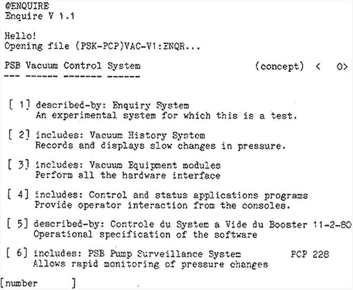
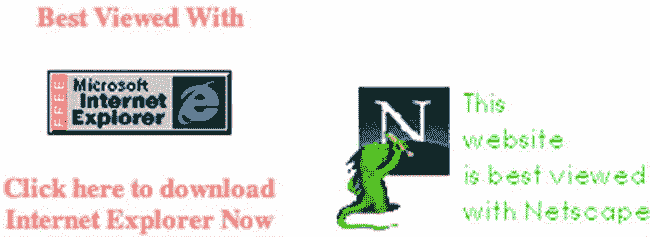

# 一、欢迎来到 HTML5

在这一章中，我将深入探究 HTML 的历史以及 HTML5 是如何产生的。我将谈论 HTML 从一个简单的提案一直到其当前版本的演变，包括相关技术的回顾。我还将介绍 HTML5 是什么，它的范围，它与以前版本的不同之处，以及它如何与其他技术相结合。

HTML5 是什么？

自 1989 年以来，超文本标记语言(HTML)一直伴随着我们。HTML 之前的版本只为内容定义了标记:列表、段落、标题、表格等等。然而，HTML5 定义了更多。它有新的内容标签(如`<audio>`和`<video>`)，但它也定义了复杂的交互，如拖放，新的网络接口，如服务器事件，甚至有新的异步功能，如 web workers。HTML5 之前的 HTML 规范也定义了 SGML 中的标签(稍后会详细介绍)，但是 HTML5 规范只根据注释内容和预期行为来定义标签。因为 HTML5 是一套新的高级 web 技术的重要组成部分，很多时候你会在网络上或流行媒体上看到一些文章，错误地包含了 HTML5 中与 HTML 无关的技术。

那么 HTML5 到底是什么？为什么 HTML5 定义的不仅仅是标签？HTML5 是怎么来的？为什么 HTML5 标准在定义和范围上与以前的标准有如此大的不同？为了回答这些问题，我将首先快速回顾一下 HTML 最初是如何出现的。

HTML 的简史

HTML 的起源可以追溯到 1989 年。那时，网上分享信息最常见的方式是通过电子邮件、新闻组新闻组和公共 FTP 站点。电子邮件和新闻组使人们直接相互交流变得容易，FTP 站点为人们提供了访问文件集的途径。主要问题是，所有这些形式的信息共享都需要不同的软件，以及一定水平的技能才能真正在互联网上导航——尽管那时的互联网比现在小得多。

蒂姆·伯纳斯·李在 1989 年提出了一个更好的解决方案。当时他在欧洲核研究组织(其法语缩写 CERN，即欧洲核研究委员会)工作，他敏锐地意识到需要一种更好的方式来在线共享信息。尤其是，Berners-Lee 需要解决在线共享技术文档的问题。CERN 产生了大量的技术文档，从准备出版的核物理论文到内部政策文档，他们需要一个适用于所有这些不同用例的解决方案。

伯纳斯·李发现自己试图同时解决两个问题:

*   他需要一个解决方案，提供一种可视化格式化 CERN 科学家产生的信息的方法。这种信息可以采取文件的形式，如发表的论文以及在实验中观察到的数据。
*   他需要一个能够处理交叉引用并嵌入图形和其他媒体的解决方案。CERN 的许多文件包括图表和图形，并相互引用，或引用其他内部数据源，甚至外部文件和数据源。

幸运的是，伯纳斯-李已经有了一些解决这些问题的经验。早在 1980 年，当他还是 CERN 的一名承包商时，他已经建立了一个名为 ENQUIRE 的原型系统，提供了该组织所需的一些功能，但未能很好地扩展。然而，它使用了一个非常重要的关键概念:超文本。

输入超文本

超文本 是一种引用其他信息的文本，用户可以激活它来立即访问这些信息。这包括同一文档中包含的信息以及外部文档或其他数据源中的信息。这些链接被称为*超链接*??。在大多数现代计算机中，超文本显示在屏幕上，超链接通过用鼠标点击或(在触摸屏的情况下)用手指轻击来激活。术语 *超媒体*是超文本概念的延伸，不仅包括超链接，还包括图形、音频、视频和其他信息源。

超媒体的概念已经存在很长时间了。1945 年，美国工程师兼发明家万尼瓦尔·布什为《大西洋月刊》写了一篇名为《正如我们所想》的文章。作为论文的一部分，布什提出了一种“记忆扩展器”或“memex”，一种人们可以用来存储所有个人信息来源的设备:书籍、唱片、相册等等。memex 将通过使用一组书签向人们提供对他们所有信息的访问，并且可以根据需要进行扩展。

 **提示**你可以在*大西洋*的网站`www.theatlantic.com/magazine/archive/1945/07/as-we-may-think/303881/`上阅读“我们可能认为的”。

1960 年，Ted Nelson 创立了 Project Xanadu ,试图建立一个能够存储多种版本文档的文字处理系统，让用户能够以非顺序的方式浏览这些文档。他将这些不连续的路径称为“拉链式列表”，并假设通过使用这些拉链式列表，可以在一个他称之为“串并”的过程中从其他文档的片段形成新文档 1963 年，尼尔森创造了术语*超文本*和*超媒体*，这两个术语首次发表在他的论文《复杂信息处理:复杂、变化和不确定的文件结构》(可在`http://dl.acm.org/citation.cfm?id=806036`获得)。当时 Nelson 使用超文本来指代可编辑的文本，而不是基于文本的交叉引用，所以这个术语从 Nelson 第一次创造它开始就有了一些语义上的变化。


1962 年，美国工程师和发明家道格拉斯·恩格尔巴特开始研究他的“在线系统”或“NLS”NLS 是第一个包括当今可用的大多数现代计算机功能的系统:一个指点设备、窗口、用于呈现不同种类数据的独立程序、按相关性组织的信息、超媒体链接等等。1968 年 12 月，Englebart 在旧金山的秋季联合计算机会议上演示了 NLS。这次演示是开创性的，不仅因为它首次同时展示了所有这些正在使用的现代功能，还因为它使用了最先进的视频会议技术来展示 Englebart 使用的 NLS 用户界面。因为这个演示在范围上是如此具有突破性，所以它经常被称为“所有演示之母”

 **提示**该演示可以在斯坦福大学的网站`http://web.stanford.edu/dept/SUL/library/extra4/sloan/MouseSite/1968Demo.html`上看到。

Berners-Lee 在超文本概念的基础上建立了 ENQUIRE。在 ENQUIRE 中，一个给定的文档由一个名为“卡”的信息页面表示，它实际上是一个超链接列表，定义了文档包括的内容、使用方法、描述以及作者。激活这些链接可以很容易地跟踪它们，使用户能够浏览整个网络的文件。



图 1-1 。ENQUIRE 的截图

在这方面，ENQUIRE 类似于图书馆卡片目录系统的在线版本，不幸的是需要大量的工作来保持更新。

ENQUIRE 也没有解决文档可视化格式的需求。然而，CERN 已经以文档标记语言的形式使用了一种可能的解决方案。

输入标记语言

*文档标记语言*是一种编程语言，它提供了一种对文档进行注释(或“标记”,就像编辑对正在审阅的文档进行标记)的方式，使得注释在语法上不同于主要内容文档。基于注释的目的，标记语言分为三大类:

*   *表示*标记语言用来描述文档应该如何呈现给用户。大多数现代文字处理器使用嵌入在文档中的二进制代码形式的表示标记。表示性标记通常是为特定的程序或显示方法设计的，因此并不意味着人类可读。
*   过程化的标记语言提供注释，说明文档的内容应该如何处理，通常是在印刷的布局和排版环境中。过程标记语言最常见的例子之一是 PostScript。
*   *描述性的*标记语言被用来用对文档内容的描述来注释文档。描述性标记没有给出内容应该如何处理或显示的任何指示；这是留给处理代理的。

文档标记语言已经存在了几十年。第一种广为人知的文档标记语言是由计算机科学家 William Tunnicliffe 在 1967 年提出的，但是 IBM 研究员 Charles Goldfarb 通常被称为现代标记语言的“父亲”,因为他在 1969 年发明了 IBM 通用标记语言(GML) 。戈德法布负责推动 IBM 将 GML 纳入其文档管理解决方案。GML 最终发展成为标准通用标记语言(SGML ，它在 1986 年成为 ISO 标准(ISO 8879:1986 信息处理-文本和办公系统-标准通用标记语言),由 Goldfarb 担任委员会主席。

SGML 不是一种你可以直接使用的语言；相反，它是一种“元语言”——一种用于定义其他语言的语言。在这种情况下，SGML 用于定义标记语言，然后这些语言可用于描述文档。具体来说，SGML 要求标记语言描述文档的结构和内容属性(相对于描述如何处理文档)，并且严格定义标记语言，以便可以构建遵循相同规则的处理和查看软件。由 SGML 定义的语言被称为“SGML 应用”(不要与在计算机上运行并执行任务的应用相混淆)。常见的 SGML 应用包括 XML(可扩展标记语言)和 DocBook(为技术文档设计的标记语言)。

CERN 一直使用名为 SGMLguid) 的 SGML 应用来标记其文档，Berners-Lee 认识到 SGMLguid 与超文本的结合可能是他解决 CERN 文档管理问题所需的解决方案。

超文本标记语言诞生了

1989 年末，Berners-Lee 提出了一个以超文本和简单标记语言为基础的试验项目。Berners-Lee 设想超链接将成为将所有不同文档联系在一起的关键功能:

超文本是一种链接和访问各种信息的方式，就像一个由节点组成的网络，用户可以随意浏览。潜在地，超文本为许多大类的存储信息，如报告、笔记、数据库、计算机文档和在线系统帮助，提供了单一的用户界面。

摘自 1990 年 11 月 12 日的“万维网:超文本项目提案”

该提案概述了一个简单的客户机/服务器网络协议，用于新的文档“网络”,以及它们将如何一起工作，将信息从服务器传输到浏览客户机。伯纳斯-李将新协议称为“超文本传输协议”或 HTTP。该项目获得批准，伯纳斯-李和他的团队开始研究最终成为万维网的东西。

在为新的文档系统创建了客户机和服务器软件之后，Berners-Lee 发表了第一个文档，该文档定义了一组基本的标记，这些标记可用于标记将要包含在新的在线文档 web 中的文档。这份名为“HTML 标签”的文档定义了 18 个标签，它们可以用来标记文档的内容，新的 web 客户端可以解析并显示它们。几乎所有的标记都来自 SGMLguid，只有一个例外:anchor 标记。锚标签是对新系统如此重要的超文本链接功能的实现。

 **提示**你可以在`www.w3.org/History/19921103-hypertext/hypertext/WWW/MarkUp/Tags.html`阅读 W3C 历史档案中的原始“HTML 标签”文档。

第一个文档是一个简单的标签列表，描述了如何使用它们来描述文档的内容。后来，随着“超文本标记语言(HTML)”(`www.w3.org/MarkUp/draft-ietf-iiir-html-01.txt`)作为提交给 互联网工程任务组(IETF)的工作草案的出版，这些标签在 1993 年正式成为 SGML 应用。该草案到期，同年晚些时候由戴夫·拉格特撰写的题为“HTML+(超文本标记格式)”的竞争草案紧随其后。

开放和协作

蒂姆·伯纳斯·李致力于保持 HTML 定义过程的开放性和协作性，利用许多参与者的知识和经验。这些早期的合作不仅为通过公共合作设计的整个 web 技术生态系统的创建铺平了道路，也为维护项目的核心小组的创建铺平了道路。

浏览器大战

在致力于定义 HTML 的同时，蒂姆·伯纳斯·李也在开发第一个可以利用新的网络文档的软件。1991 年，Berners-Lee 为 NeXTStep 平台发布了第一款网络浏览器“WorldWideWeb”。其他程序员对开发他们自己的 web 浏览器有着浓厚的兴趣，所以 1993 年 Berners-Lee 向公众发布了一个名为 `libwww`的可移植 C 库，这样任何人都可以开发 web 浏览器。(在此之前，该库是作为更大的万维网软件应用的一部分提供的。)

至此，在多个平台上已经有了几个实验性的 web 浏览器项目。其中一些是简单的基于文本的浏览器，可以在任何终端上使用，比如 Lynx 浏览器。其他的是当时图形桌面中使用的图形应用。

最受欢迎的图形应用之一是 Mosaic，由伊利诺伊大学的国家超级计算应用中心(NCSA) 开发。Marc Andreesen 和 Eric Bina 于 1992 年底开始了 Mosaic 的工作，并于 1993 年发布了第一个版本。

1994 年，安德里森离开 NCSA，成立了一家名为马赛克通信的公司，在那里他们用全新的代码构建了一款新的浏览器。新浏览器被称为网景导航器(最终马赛克通信更名为网景通信)。

实际的马赛克代码库本身是由一家名为 Spyglass，Inc .的公司从 NCSA 获得许可的。Spyglass 从未对代码做任何事情，1995 年微软从他们那里获得了代码许可，对其进行了修改，并将其重命名为 Internet Explorer。

网景公司和微软公司都开始扩展他们浏览器的功能，增加新的 HTML 标签和其他功能。网景于 1995 年在 Navigator 中加入了 JavaScript(代号“mocha”，最初发布时为“LiveScript”)。微软很快在 1996 年推出了他们自己版本的同一种语言，称为 JScript，以避免商标问题。

Netscape Navigator 和 Internet Explorer 对相同的功能有完全不同的实现，也有它们自己的专有功能。给定的 HTML 文档可能在 Navigator 中以一种方式呈现，而在 Internet Explorer 中呈现时看起来完全不同。即使简单的 HTML 标记在两种浏览器中也会产生明显不同的视觉效果，任何更高级的尝试都是不可能的。

这为所谓的浏览器大战埋下了伏笔。任何为 Web 制作内容的人都必须做出选择:选择支持单个浏览器，或者花费大量资源尝试同时支持两个浏览器(在许多情况下，这意味着制作同一内容的两个不同版本，每个浏览器一个版本)。常见的是只针对一种浏览器进行优化的网站，用图形表示选择，如图 1-2 所示。



图 1-2 。浏览器大战中的图片

通过将 Internet Explorer 作为 Windows 操作系统的标准部分，微软轻松赢得了第一轮浏览器大战。这给了 Internet Explorer 一个巨大的安装基础，人们没有理由为 Netscape 付费。到 1999 年，Internet Explorer 占据了万维网浏览器使用量的 96%。网景通信被美国在线收购，网景导航器(当时叫网景通信器)被封存。

浏览器大战:网景反击

AOL 开源了 Netscape Communicator 代码库，并将其委托给新成立的非营利组织 Mozilla Foundation 。作为一个开源项目，Mozilla 基金会继续在 Navigator 代码基础上进行构建，并获得了相当大的发展势头，为浏览器添加了新功能，包括电子邮件和 HTML 编辑功能。2002 年末，该套件的一个精简版被创建出来，最初被命名为 Phoenix，然后是 Firebird，后来(由于项目命名冲突)被命名为 Firefox。Firefox 继续成功挑战了 Internet Explorer 在浏览器市场的垄断地位，这被许多人称为第二轮浏览器大战。

救援标准

打击网络碎片化意味着让各方坐到谈判桌前，就每个人都可以建立的技术标准达成一致。标准为浏览器制造商和内容创作者提供了一个共同的基础:

*   通过将标准作为制造过程的一部分，浏览器制造商将为网络提供一个可预测的平台。
*   通过将标准作为编码实践的一部分，内容创建者可以确信他们的内容将在所有浏览器上一致地呈现。

1994 年 10 月，这正是蒂姆·伯纳斯·李所做的，这一举动唤起了他保持网络开放和协作的愿望。他离开了 CERN，成立了万维网联盟(W3C) ，，这是一个致力于网络技术的标准组织。该联盟由任何想要参与定义和维护网络技术标准的人组成:最终包括微软、苹果、脸书和谷歌的公司；像 NASA 和国家标准技术研究所这样的政府组织；像斯坦福大学和牛津大学这样的大学；像欧洲核子研究中心这样的研究机构；以及非营利组织，如 Mozilla 基金会和电子前沿基金会。

W3C 标准进程从发布标准的工作草案开始。然后，联合体成员可以对草案发表意见，草案可能会经历相当大的演变。一旦草稿固化，候选人推荐就会发布。从实施的角度审查候选推荐标准——实施和使用标准的难度有多大。一旦实施者有了发言权，草案就进入了建议状态。提议的建议将提交给 W3C 顾问委员会进行最终批准。一旦获得最终批准，该标准就获得了 W3C 官方推荐标准的地位。

标准不会在一夜之间解决浏览器战争。浏览器制造商实施这些标准花了一段时间。微软尤其支持“拥抱和扩展”的哲学，在这种哲学中，他们同意标准，但也继续增加他们自己的专有技术，试图使 Internet Explorer 成为一个更有吸引力的 web 开发平台。不过，最终，对跨所有浏览器的一致行为的需求取得了胜利，标准为胜利提供了蓝图。

HTML 的持续发展

HTML 标准最初由 IETF 维护，IETF 于 1995 年将 HTML 2.0 标准发布为 RFC 1866。

 **注**“RFC”代表“征求意见”，这意味着发布了文档，并邀请利益相关者对其进行评论，作为持续审核流程的一部分。

W3C 在 1996 年接管了 HTML 标准。1997 年，W3C 发布了 HTML 3.2 标准。这个版本正式否决了几个供应商特定的功能，并进一步稳定了浏览器制造商和内容创作者的标准。在不到一年的时间里，W3C 发布了 HTML 4.0。这个版本的 HTML 将标准推向了纯语义标记的方向:许多可视化标签，比如那些创建粗体或斜体标签的标签，都被弃用，取而代之的是级联样式表(CSS ) 。W3C 在 1999 年发布了 HTML 4.1，它本质上是 HTML 4.0 ，做了一些小的编辑和修改。在 2000 年 HTML 4.1 因为一个 ISO 标准:ISO/IEC 15445:2000。

所有这些 HTML 版本都被定义为 SGML 应用。每个标签及其属性都是使用 SGML 规则定义的，如清单 1-1 中的所示。

***清单 1-1*** 。HTML 4.1 中 UL 标签的 SGML 定义

```html
<!ELEMENT UL - - (LI)+               -- unordered list -->
<!ATTLIST UL
  %attrs;                            -- %coreattrs, %i18n, %events -->
<!ELEMENT OL - - (LI)+               -- ordered list -->
<!ATTLIST OL
  %attrs;                            -- %coreattrs, %i18n, %events -->
```

随着标准的发展，内容创建者必须越来越严格地遵循这些标准，以保证跨浏览器的一致行为。

XHTML 的兴衰

2008 年，一个新的 SGML 应用被提出，它将提供一个更小、更易管理的 SGML 指令子集。被称为可扩展标记语言，或 XML，它也是用来定义数据标记语言的。HTML 4 标准很快被翻译成 XML，产生了 XHTML。XHTML 1.0 标准于 2000 年发布。

XHTML 旨在使 HTML 语言更加模块化和可扩展。XHTML 语法比普通 HTML 更严格，XHTML 标记中的错误将导致呈现代理发布错误并停止，而不是恢复到基本行为并继续。然而，由于缺乏对旧内容的向后兼容性和浏览器支持，XHTML 从未被广泛采用。

WHATWG 的形成和 HTML5 的创建

到 2004 年，W3C 开始致力于 XHTML 2.0。然而，联盟的一些成员认为基于 XML 的方向不是 web 技术应该遵循的正确方向。Mozilla 基金会和 Opera 软件在 2004 年 6 月向 W3C 提交了一份立场文件。本文将 web 应用作为一个整体来关注:如何构建它们，它们应该采用什么技术，与现有 web 浏览器的向后兼容性，等等。这篇论文包括了一个 Web 表单的规范草案，作为指导的例子。你可以在 W3C 网站上的`www.w3.org/2004/04/webapps-cdf-ws/papers/opera.html`阅读这篇论文。这篇论文提出的问题比它回答的要多，但是总的来说，它指向了一个不同于 W3C 目前的基于 XML 的解决方案的方向。最终 W3C 投票否决了这份文件，选择继续使用 XML 解决方案。

许多利益相关者强烈地感受到以本文提出的整体方式来看待 web 应用，因此成立了一个小组来专注于 web 应用标准的创建。名为网络超文本应用技术工作组(WHATWG) ，的成员包括来自苹果公司、Mozilla 基金会和 Opera 软件公司的个人。最初，他们为 web 应用标准创建了一个草案，其中涵盖了该团队认为对于创建丰富的交互式 Web 应用非常重要的所有特性，包括:

*   新的语义标记标签用于常见的内容模式，如页脚、侧栏和引用。
*   新的状态管理 0074 和数据存储功能。
*   本机拖放交互。
*   新的网络功能，如服务器推送事件。

这个新标准最终与 Web Forms 标准(同样由 WHATWG 制定)合并，合并后的标准被重新命名为 HTML5 。这就是 HTML5 标准不是 SGML 应用的原因，也是它不仅仅包含标记的原因:它旨在为创建 web 应用提供更好的工具。

2007 年，W3C 的 HTML 小组采用了 WHATWG 的 HTML5 规范，并开始向前推进。这两个组织都继续维护他们自己版本的相同标准。根据双方协议，W3C 维护 HTML5 的规范标准。WHATWG 的标准被认为是一种“生活标准”，因此它永远不会完整，而且会不断发展。这样，W3C 的标准就像是 WHATWG 标准的快照。

W3C HTML5 标准

W3C 的 HTML5 标准在`www.w3.org/TR/html5/Overview.html`可用。这是 W3C 的官方建议。

WHATWG 生活标准

WHATWG HTML 标准位于`https://html.spec.whatwg.org/multipage/index.html`。

HTML5 特性

因为 HTML5 被设计成能够创建丰富的交互式 web 应用，所以它规定的不仅仅是标记标签——尽管它也涵盖了这些。

新标签

HTML5 标准为标记文档指定了许多新的标签。新的 sectioning 标记提供了指示常见设计模式(如页脚和导航组件)的方法，并为屏幕阅读器提供了改进的语义信息。新的分组标签提供了指示内容组(如图表)的方法。当然，HTML5 包括新的音频和视频标签，可以像嵌入图像一样轻松地将多媒体嵌入到 web 应用中。HTML5 还包括一整套新的交互元素，用于实现常见的设计模式，如对话框和渐进式披露。

由于包含了 Web 表单规范，HTML5 还包含了许多新的表单元素，包括数据列表(可过滤的下拉列表)、指示器和进度条以及滑块。HTML5 还指定了几个新的表单属性，允许与表单进行更丰富的交互。现在，通过简单的属性，您可以在表单域中指定占位符文本，或者指示在页面加载时哪个表单域应该具有焦点(处于活动状态)。

帆布

HTML5 指定了新的`canvas`特性，一种以编程方式在网页上绘图的方式。`canvas`还包括文本、图层混合和图像处理功能。

JavaScript API

HTML5 标准包括一组新的 JavaScript API，为 web 应用添加更多功能。客户端/服务器通信有了新的 API，包括服务器将事件推送到网页的能力，以及保护跨文档和域通信的新方法。还有在浏览器中本地存储数据、拖放交互和多线程的特性。

相关标准

有一系列与 HTML5 交互的相关标准，由 W3C 维护，但在技术上不是 HTML5 标准的成员。这些功能包括地理定位、设备定位和 WebGL。

摘要

在这一章中，我讲述了 HTML 的历史以及 HTML5 是如何产生的，包括:

*   底层技术的起源，
*   浏览器大战，还有
*   标准的诞生。

我还介绍了 HTML5 标准及其相关标准的总体构成。

历史够了！下一章将深入新的 HTML5 元素，包括`audio`和`video`元素。