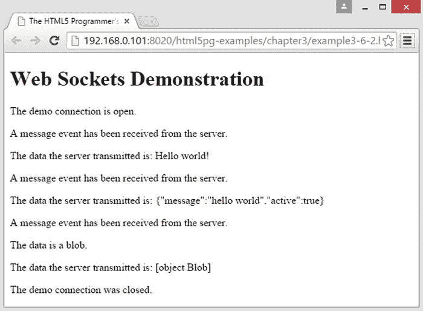

# 三、HTML5 API

正如在第一章中提到的，HTML5 标准不同于以前的 HTML 标准，因为它不仅仅是标记语言的定义。由于该标准旨在成为创建 web 应用和网页的平台，因此它引入了许多旨在简化应用构建的新特性:浏览器与服务器通信的新方式、存储和检索数据的新方式、对常见用户交互(如拖放)的支持等等。

像新的`audio`和`video`标签一样，这些新的网络应用功能在过去已经使用大量的 JavaScript 程序甚至浏览器插件实现了。现在，有了 HTML5，浏览器制造商直接在他们的浏览器中实现它们。

所有这些新特性都可以在 JavaScript 程序中使用，所以浏览器制造商提供了使用脚本访问它们的接口。这些接口通常采用 JavaScript 对象和方法的形式。HTML5 标准也定义了这些接口，因此 JavaScript 对象和方法在所有实现该标准的浏览器中以相同的方式出现和运行(假设它们完全正确地实现了该标准)。

这些接口被称为应用编程接口 。如果你曾经在浏览器中编写过脚本，你可能已经熟悉了最常见的 API 之一:文档对象模型(DOM )。DOM 是一个 API，用于访问当前在浏览器中呈现的文档。任何获取浏览器中元素引用的方法(如`getElementById`)都是 DOM API 的一部分，任何访问事件模型的方法(如`addEventListener`)也是如此。该浏览器还发布了用于访问内部浏览器功能(如浏览历史)的`Navigator` API。另一个常用的 API 是`XMLHttpRequest`构造函数，它是浏览器网络通信系统的一个接口，允许您与服务器进行异步通信。

 **注意**术语 *API* 有相当广泛的应用，从库和框架到网络服务(包括许多可以用浏览器异步访问的 web 服务)，甚至是单个应用中对象之间的内部接口。

在这一章中，我将介绍 HTML5 规范中定义的新 API。我将采用一种实用的方法来研究 API，重点关注特性的支持程度以及可以用它来做什么，并提供大量的例子来作为您自己的 web 应用的起点。

服务器发送的事件

维持价

**混合**

Internet Explorer 不支持此 API。所有其他浏览器都完全支持。

WHATWG 生活水平:`http://www.whatwg.org/specs/web-apps/current-work/multipage/comms.html#server-sent-events`

W3C 草案:`http://dev.w3.org/html5/eventsource/`

假设您正在构建一个简单的股票行情应用。您有一个服务器资源，它发布了获取股票值所需的 API，所以很容易就可以开始了。但是如何更新股票价值呢？服务器如何让您的客户端应用知道股票的价值已经改变？

这可能是服务器发送事件的典型用例:服务器需要通知客户端发生了一些事情。因为 HTTP 作为一种标准只定义了无状态通信，因此只有客户机可以向服务器发起请求，如果客户机不首先请求，服务器就无法向客户机发送消息。服务器发送的事件是 HTML5 解决这个问题的方式之一，在从服务器到客户端的单向通信的特定情况下。

在过去，人们将简单的轮询计时器写入他们的脚本，这实质上是询问服务器“有什么新东西吗？”上一个定时器，如清单 3-1 所示。

 **注意**本节中的例子需要从服务器上运行，而不是直接从文件系统中加载。

***清单 3-1*** 。轮询脚本示例

```html
<!DOCTYPE HTML>
<html>
  <head>
    <title>The HTML5 Programmer’s Reference</title>
  </head>
  <body>
  <script>

// This is a mock API that simply returns the same JSON structure
// every time the URL is requested. This JSON structure has a single
// property, isChanged, which is set to false.
var strUri = ’./example3-1.json’;

// This is how often we’ll query the mock API, in milliseconds.
var timerLength = 1000;

/**
 * Fetch an update from a web service at the specified URL. Initiates an
 * XMLHttpRequest to the service and attaches an event handler for the success
 * state.
 * @param {string} strUrl The URL of the target web service.
 */
function fetchUpdates(strUrl) {
  // Create and configure a new XMLHttpRequest object.
  var myXhr = new XMLHttpRequest();
  myXhr.open("GET", strUrl);
  // Register an event handler for the readyStateChange event published by
  // XMLHttpRequest.
  myXhr.onreadystatechange = function() {
    // If readyState is 4, request is complete.
    if (myXhr.readyState === 4) {
      handleUpdates(myXhr.responseText);
    }
  };
  // Everything is configured. Send the request.
  myXhr.send();
}

/**
 * Handle an update from the mock API. Parses the JSON returned by the API and
 * looks for changes.
 * @param {string} jsonString A JSON-formatted string.
 */
function handleUpdates(jsonString) {
  // Parse the JSON string.
  var jsonResponse = JSON.parse(jsonString);
  if (jsonResponse.isChanged) {
    // Handle changes here, probably by checking the structure to determine
    // what changed and then route the change to the approprate part of the app.
    console.log(’change reported.’);
  } else {
    console.log(’no changes reported.’);
  }
}

// Everything is all set up: we have a function for fetching an update and a
// function to handle the results of an update query. Now we just have to kick
// off everything. Using setInterval, we will call our fetchUpdates method every
// timerLength milliseconds. We can cancel the timer by calling the
// cancelInterval(pollTimer) method.
var pollTimer = setInterval(fetchUpdates.bind(this, strUri), timerLength);
  </script>
  </body>
</html>
```

这个例子在开始轮询过程之前做了大量的设置。首先定义模拟 API 的 URL，这只是您在文件系统上创建的一个文件。您还可以定义轮询模拟 API 的频率。然后创建一个获取更新的函数。这是您将使用计时器调用的方法，它向模拟服务发起`XMLHttpRequest` (简称 XHR)。XHR 将在与服务器通信时发布`readyStateChange`事件。通过查看 XHR 对象的`readyState`属性，您可以知道查询处于什么状态:仍在与服务器对话，还是已经结束对话，或者即使发生了错误。因此，向 XHR 对象添加一个事件处理程序，每次发生`readyStateChange`事件时都会调用它。在这种情况下，您使用内联函数来保持代码简单，尽管您可以在代码块之外定义它并通过名称引用它。事件处理程序检查`readyState`属性，如果它处于正确的状态，它就调用`handleResponse`函数。该函数接受从模拟 API 获取的 JSON 格式的字符串，并对其进行相应的处理。

这是一个非常简单的例子，但是它演示了使用定时器定期轮询 web 服务的基本原理。使用方法`setInterval`和`cancelInterval`很容易启动和停止定时器。如果您的应用需要多个计时器，您可以构建一个构造函数，用方便的方法来创建、启动、停止、暂停和释放它们。您可以围绕创建和管理计时器快速构建大量代码。

如果你仔细想想，简单的计时器并不是处理这个问题的好方法。如果出现暂时的网络问题，并且对`fetchUpdates`的一个调用花费了超过一秒钟的时间，该怎么办？在这种情况下，对`fetchUpdates`的另一个调用将在第一个调用返回之前执行，导致对服务器的两个活动和挂起的调用。根据网络条件，第二个呼叫可能会在第一个呼叫之前返回。这种情况被称为*竞争条件，*，因为两个未决调用实质上是在竞争看哪一个先完成。

幸运的是，这种竞争状况很容易修复:与其让计时器不顾外部限制发出请求，不如改变`handleUpdates`方法，这样它做的最后一件事就是调度对`fetchUpdates`的下一次调用。这样，你就不会有一个以上的调用发生，并且消除了竞争条件。脚本会如清单 3-2 中的所示改变(周围的 HTML 保持不变)。

***清单 3-2*** 。从清单 3-1 的示例中删除竞争条件

```html
// This is a mock API that simply returns the same JSON structure
// every time the URL is requested. This JSON structure has a single
// property, isChanged, which is set to false.
var strUri = ’./example3-1.json’;

// This is how often we’ll query the mock API, in milliseconds.
var timerLength = 1000;

// Reference to the currently active timer.
var pollTimeout;

/**
 * Fetch an update from a web service at the specified URL. Initiates an
 * XMLHttpRequest to the service and attaches an event handler for the success
 * state.
 * @param {string} strUrl The URL of the target web service.
 */
function fetchUpdates(strUrl) {
  // Create and configure a new XMLHttpRequest object.
  var myXhr = new XMLHttpRequest();
  myXhr.open("GET", strUrl);
  // Register an event handler for the readyStateChange event published by
  // XMLHttpRequest.
  myXhr.onreadystatechange = function() {
    // If readyState is 4, request is complete.
    if (myXhr.readyState === 4) {
      handleUpdates(myXhr.responseText);
    }
  };
  // Everything is configured. Send the request.
  myXhr.send();
}

/**
 * Handle an update from the mock API. Parses the JSON returned by the API and
 * looks for changes, and then initiates the next query to the mock service.
 * @param {string} jsonString A JSON-formatted string.
 */
function handleUpdates(jsonString) {
  // Parse the JSON string.
  var jsonResponse = JSON.parse(jsonString);
  if (jsonResponse.isChanged) {
    // Handle changes here, probably by checking the structure to determine
    // what changed and then route the change to the approprate part of the app.
    console.log(’change reported.’);
  } else {
    console.log(’no changes reported.’);
  }
  // Schedule the next polling call.
  pollTimeout = setTimeout(fetchUpdates.bind(this, strUri), timerLength);
}

// Initiate polling process. 
fetchUpdates(strUri);
```

与前一版本相比，该脚本的变化以粗体显示。这个版本的代码消除了竞争条件，因为在任何给定的时间只有一个对`fetchUpdates`的调用是活动的。但是，您现在可能会以不可预知的速度轮询服务器。

围绕这些问题进行编程也是可能的，但是处理好所有的边缘情况可能是困难的，并且您将会得到大量的代码，而这些代码仅仅是为了智能地处理对 web 服务的轮询。

理想情况下，这种通信应该是浏览器的一个特性，这就是新的服务器发送事件特性的作用。服务器发送事件让浏览器处理连接到服务器和轮询事件的所有细节，并让您留下基于计时器的轮询脚本和它们带来的所有问题。服务器发送的事件为您提供了一种打开到服务器的通道的方式，然后将事件侦听器附加到该通道，以处理服务器将发布的各种事件类型。浏览器会为您处理所有其他事情。

要使用服务器发送的事件，您不仅需要一个可以打开 web 服务通道并处理该通道上发生的事件的客户端；您还需要一个能够正确处理传入频道订阅并发布正确格式化的事件的服务器。

客户端设置

服务器发送的事件规范在全局上下文中定义了一个新的构造函数`EventSource`，您可以使用它来创建到服务器的新连接:

```html
var serverConnection = new EventSource(targetUrl);
```

构造函数返回一个`EventSource`对象，它是一个连接的接口，浏览器将维护这个连接到由`targetUrl`指定的服务器资源。浏览器将为您处理所有的连接维护和轮询—您所要做的就是监听来自服务器的事件。

当服务器向连接发布事件时，服务器资源将发布从`EventSource`对象分派的事件。像任何 DOM 事件一样，您可以使用`addEventListener`方法将事件处理程序附加到`EventSource`对象。

默认情况下，`EventSource`接口将发布三种事件类型:

*   `open`:首次打开连接，网络通信初始化时发布。用于初始化连接。最多触发一次，如果浏览器无法建立到指定服务的连接，则根本不会触发。
*   `message`:服务器发送新消息时发布。
*   `error`:如果连接中出现错误(例如连接超时)，则发布。

当一个事件被调度时，`EventSource`将调用为该事件类型注册的事件处理函数。这个函数将被调用，使用一个`event`对象作为参数，这个`event`对象将有一个`data`属性，包含从服务器发送的数据。清单 3-3 展示了如何创建一个新的`EventSource`对象并给它附加事件监听器。

***清单 3-3*** 。存根 EventSource 事件处理程序和订阅

```html
/**
 * Handles message events published by the EventSource.
 * @param {EventSourceEvent} event
 */
function handleMessage(event) {
  // Handle message.
  console.log(’A message was sent from the server: ’, event.data);
}

/**
 * Handles error events published by the EventSource.
 * @param {EventSourceEvent} event
 */
function handleError(event) {
  // Handle an error.
  console.error(’An error happened on the EventSource: ’, event.data);
}

/**
 * Handles an open event published by the EventSource.
 * @param {EventSourceEvent} event
 */
Function handleOpen(event) {
  // Handle the open event.
  console.log(’The connection is now open.’);
}

// Create a new connection to the server.
var serverConnection = new EventSource(targetUrl);

// Attach event handlers.
serverConnection.addEventListener(’message’, handleMessage);
serverConnection.addEventListener(’error’, handleError);
serverConnection.addEventListener(’open’, handleOpen);
```

现在，每当由`strUrl`指定的资源发布事件时，就会调用`handleMessage`事件处理程序。如果连接出现错误，浏览器将发布一个`error`事件，并调用`handleError`事件处理程序。请注意，您可以配置您的服务器来发布自定义事件类型，并且可以用完全相同的方式为它们添加事件处理程序(请参见下一节“从服务器发送事件”)。

要关闭到服务器的连接，调用`EventSource`对象上的`close`方法:

```html
serverConnection.close();
```

这将通知浏览器停止轮询服务器并关闭连接。然后，您可以将 EventSource 对象设置为`null`以将其从内存中删除。一旦连接被关闭，就无法重新打开。

从服务器发送事件

为了让服务器发送的事件工作，服务器上需要有一个资源，它知道如何处理来自浏览器的传入轮询请求，以及如何根据需要正确发布事件。服务器资源可以用任何语言编写——Java、PHP、JavaScript、C++等等。资源必须用`text/event-stream` MIME 类型来响应轮询请求。响应由多行`key: value`对组成，由一个双换行结束。有效密钥如下:

*   `data`:指定一行发送给客户端的任意数据，客户端将接收它作为`event`对象的数据属性。
*   `event`:指定与此服务器发送的事件相关联的任意事件类型。这将导致一个同名的事件从活动的`EventSource`对象中被调度，从而允许从服务器中触发`open`、`message`和`error`之外的任意事件。如果未指定事件类型，该事件将仅触发`EventSource`上的`message`事件。
*   `id`:指定与事件序列关联的任意 ID。在事件流上设置一个 ID 使浏览器能够跟踪最后触发的事件，如果连接断开，它将向服务器发送一个`last-event-ID` HTTP 头。
*   `retry`:指定在浏览器为下一个事件重新查询服务器之前的毫秒数。默认设置为`3000`(三秒)。这使得服务器资源能够抑制浏览器查询并防止自己被淹没。

例如，服务器发送的基本事件如下所示:

```html
data: arbitrary line of text\n\n
```

这个事件将触发相关联的`EventSource`对象上的`message`事件，并调用`message`事件处理程序(假设已经注册了一个)。消息事件处理程序接收的`event`对象将有一个`data`属性，它将包含服务器发送的文本(在前面的例子中，它将是“任意文本行”)。

您也可以发送多行事件，只需用一个双换行来终止事件:

```html
data: arbitrary line of text\n
data: another arbitrary line of text\n\n
```

在这种情况下，`event.data`属性将被设置为“任意文本行\ n 另一个任意文本行”。事件数据可以是任何文本:HTML、CSS、XML、JSON 等等。

多个事件类型也可以包含在一个服务器发送的事件中。回到股票报价器的原始示例，这里有一个显示两只不同股票的更新的事件:

```html
event: update\n
data: {\n
data: "ticker":"GOOG",\n
data: "newval":"559.89",\n
data: "change":"+0.05"\n
data: }\n
event: update\n
data: {\n
data: "ticker":"GOOGL"\n
data: "newval":"571.65"\n
data: "change":"+1.09"\n
data: }\n\n
```

这个服务器发送的事件将触发对象`EventSource`上的两个`update`事件。每次调用`update`事件处理程序时，都会调用一个包含该事件数据的`event`对象。第一个事件的数据将是以下 JSON 格式的文本:

```html
{
  "ticker":"GOOG",
  "newval":"559.89",
  "change":"+0.05"
}
```

第二个事件的数据是以下 JSON 格式的文本:

```html
{
  "ticker":"GOOGL",
  "newval":"571.65",
  "change":"+1.09"
}
```

原点限制

服务器发送的事件受制于相同的源策略，因此来自一个源的页面不能订阅来自另一个源的事件流。特别是，事件流通常发布在与标准网页不同的 TCP 端口上，因此，发布在标准端口(如端口 80)上的网页不可能订阅发布在不同端口上的事件流，即使它来自同一服务器。只有从与事件流相同的源提供服务的客户端才能访问该事件流。

如果您想使用服务器发送的事件，您将需要一个足够灵活的 web 服务器来服务基于 HTML 的客户端(及其所有依赖的资源，如 CSS、JavaScript、图像等)。)并发布事件流。这使得 PHP、JSP 或 ColdFusion 等服务器集成脚本语言成为构建依赖于服务器发送事件的应用服务器的主要候选语言，因为您可以用集成脚本语言编写事件流，并使用相同的 web 服务器为客户端提供服务。还可以很容易地配置大多数 web 服务器，将对特殊 URL 的请求路由到不同的资源，使得从同一服务器发布常规 web 内容和事件流成为可能。这种实现的细节超出了本书的范围，但是这是对服务器发送事件的一个重要限制。

在下面的例子中，您将选择一个更简单的解决方案:构建一个服务器，它可以在充当事件流的同时为客户端 HTML 文件提供服务。由于 HTML 客户机文件和事件流都来自同一个来源，所以订阅不会有问题。

安全性

就像任何处理网络通信的技术一样，在使用服务器发送的事件构建应用时，注意安全性是一个好主意。不要在未加密的连接上发送敏感信息(如密码)，因为服务器事件是以纯文本形式发送的。如果你需要发送敏感信息，你至少应该使用 HTTPS。

如前所述，服务器发送的事件受到同源策略的限制，因此脚本不能从不同于自己的网络资源订阅事件流。此外，EventSource 事件处理程序接收的事件对象将有一个 origin 属性，您可以检查该属性以验证服务器事件是否来自您期望的来源，如清单 3-4 所示。

***清单 3-4*** 。从服务器发送的事件中检查事件来源

```html
// The EventSource object.
var serverConnection;

/**
 * Handle an event published on an EventSource object.
 * @param {EventSourceEvent} event
 */
function messageHandler(event) {
  if (event.origin !== ’https://www.myexample.com’) {
    // Something bad has happened, stop listening for events and surface a warning to the user.
    serverConnection.close();
    alert(’Warning: Server event received from wrong network resource.’);
    return;
  }
  // Handle event here.
}

// Initiate subscription to event stream and register event handler.
serverConnection = new EventSource(targetUrl);
serverConnection.addEventListener(’message’, messageHandler);
```

在这个代码片段中，您将检查浏览器所报告的事件的来源。然而，这不是一个万无一失的检查，因为它可能会被欺骗，但是它是您可以添加到您的应用中的又一层安全性。

一个示例应用

要构建一个功能性的示例应用，您需要一个服务器资源，它可以以预期的格式发送事件，还可以为订阅事件流的客户端提供服务。如上所述，您可以使用任何语言来构建这个服务器资源，但是为了与本书中的其他示例保持一致，请使用 JavaScript。您可能习惯于在浏览器中使用 JavaScript。您也可以在服务器上使用它，就像任何其他脚本引擎一样。作为独立脚本引擎的 JavaScript 最流行的实现是 Node.js 框架，它已经被移植到多个操作系统。Node.js 框架提供了一个快速的 JavaScript 解释器和一个 API 框架，用于访问文件系统、网络堆栈和服务器上的其他资源。

 **提示**如果你从未使用过 Node.js，你可以在`http://nodejs.org`了解更多。

要运行这个示例，您需要一个安装了 Node.js 的服务器。您将构建一个简单的脚本，既充当事件流，又服务于事件客户端。正如你在清单 3-5 中看到的，用 Node.js 构建一个简单的 HTTP 服务器非常容易。

***清单 3-5*** 。用 JavaScript 编写的简单事件流服务器

```html
// Include the modules needed to build the server.
var http = require(’http’);
var sys = require(’sys’);
var fs = require(’fs’);

// Use the http.createServer method to create a server listening on port 8030.
// The server will call the handleRequest method each time a request is
// received.
http.createServer(handleRequest).listen(8030);

/**
 * Handle an incoming request from the server.
 * @param {Object} request The request headers.
 * @param {Object} resource A reference to the server resource that received
 * the request.
 */
function handleRequest(request, resource) {
  // Incoming requests to our server will be to one of two URLs.
  // If the request is for /example3-5-events we should send our SSE.
  // If the request is for /example3-5.html, we should serve the example client.
  if (request.url == ’/example3-5-events’) {
    // Initialize an event stream.
    sendSSE(request, resource);
  } else if (request.url == ’/example3-6.html’){
    // Send the client.
    resource.writeHead(200, {’Content-Type’: ’text/html’});
    resource.write(fs.readFileSync(’example3-6.html’));
    resource.end();
  }
}

/**
 * Initializes an event stream and starts sending an event every 5 seconds.
 * @param {Object} request
 * @param {Object} resource
 */
function sendSSE(request, resource) {
  // Initialize the event stream.
  resource.writeHead(200, {
    ’Content-Type’: ’text/event-stream’,
    ’Cache-Control’: ’no-cache’,
    ’Connection’: ’keep-alive’
  });

  // Send an event every 5 seconds.
  setInterval(function() {
    // Randomly generate either 0 or 1.
    var randNumber = Math.floor(Math.random() * 2);
    // If the random number is 1, set isChanged to true. Otherwise, set it to
    // false.
    var isChanged = (randNumber === 1) ? true : false;
    resource.write(’data: ’ + ’{"isChanged":’ + isChanged + ’}\n\n’);
  }, 5000);
}
```

如果你请求`example3-6.html`，它将服务于 HTML 客户端(你将在清单 3-6 中定义)，如果你请求`example3-5-events`，它将启动一个事件流，每五秒将一个事件推送到客户端。该事件将是一个简单的 JSON 格式的字符串，带有一个随机设置为`true`或`false`的`isChanged`属性。要运行此服务器，请使用以下命令:

```html
node example3-5server.js
```

这个服务器的 HTML 客户端只需要将`EventSource`初始化到正确的 URL，如清单 3-6 中的所示。

***清单 3-6*** 。服务器发送的事件客户端

```html
<!DOCTYPE HTML>
<html>
  <head>
    <title>The HTML5 Programmer’s Reference</title>
    <style>
#changeme {
  width: 300px;
  height: 300px;
  border: 1px solid black;
  overflow: auto;
}
    </style>
  </head>
  <body>
    <h1>Server-sent Events Demonstration</h1>
    <div id="changeme"></div>
  <script>
// The URL for our event stream. Note that we are not specifying a domain or
// port, so they will default to the same ones used by the host script.
var strUri = ’/example3-5-events’;
// Get a reference to the DOM element we want to update.
var changeMe = document.getElementById(’changeme’);

// Create a new server-side event connection and register an event handler for
// the ’message’ event.
var serverConnection = new EventSource(strUri);
serverConnection.addEventListener(’message’, handleSSE, false);

/**
 * Handles a server-sent event by parsing the JSON in the data and handling
 * any changes.
 * @param {EventSourceEvent} event The event object from the event source.
 */
function handleSSE(event) {
  // Parse the JSON string.
  var jsonResponse = JSON.parse(event.data);
  // Create a new element to append to the DOM.
  var newEl = document.createElement(’div’);
  if (jsonResponse.isChanged) {
    newEl.innerHTML = ’Change reported.’;
  } else {
    newEl.innerHTML = ’No changes reported.’;
  }
  // Append the new element to the DOM.
  changeMe.appendChild(newEl); 
}
  </script>
  </body>
</html>
```

这个客户端为事件流的 URL 启动一个新的`EventSource`,然后为它附加一个消息事件处理程序。每次服务器发布事件时，都会调用消息事件处理程序，解析事件数据，并将结果附加到 DOM 中。这个客户端比您之前的轮询示例简单得多，因为现在所有的细节都由浏览器处理。不需要初始化一个`XMLHttpRequest`对象，不需要管理你自己的定时器——你所要做的就是初始化一个`EventSource`对象并注册事件处理程序。

服务器发送的事件只允许从服务器到浏览器的单向通信。关于全双工通信，请参见 WebSocket 章节。

WebSockets

维持价

**好的**

所有现代浏览器都支持 WebSockets。

WHATWG 生活水平:`https://html.spec.whatwg.org/multipage/comms.html#network`

W3C 草案:`http://www.w3.org/TR/websockets/`

WebSockets 通过在客户机和服务器之间提供全双工通信建立在服务器发送的事件上:不仅服务器可以向客户机发送任意信息，客户机也可以将任意信息传输回服务器。此外，WebSockets 不受同源策略的约束，这使得来自一个源的脚本无法与来自不同源的页面进行交互。

浏览器中的 WebSocket JavaScript API 在全局上下文中表现为一个新的 WebSocket 构造函数，它返回一个 WebSocket 对象:

```html
var mySocket = new WebSocket(url, protocols);
```

`url`参数指定 WebSocket 兼容服务的有效 URL。WebSockets 有自己的通信协议，不同于我们一直看到的超文本传输协议(HTTP )。WebSocket 协议由`ws://`(标准 WebSocket 连接)或`wss://`(安全 WebSocket 连接)指定。在构建 WebSocket 时，任何指定不同协议(如`http`或`https`)的尝试都会导致错误。

可选的`protocols`参数可以是单个协议字符串，也可以是指定由服务器实现的一个或多个子协议的协议字符串数组。(本文中的*协议*是一组关于数据如何在客户端和服务器之间传输的规则。)该参数不改变浏览器用来创建和维护与服务器的连接的整体网络协议；相反，它允许您为通过该连接发送和接收信息指定可接受的数据格式。这使得单个服务器能够实现向客户端传输数据和从客户端接收数据的多种方式。例如，您可以实现一个服务器，该服务器同时实现服务器发送的事件协议(使用为该 API 指定的键/值对)和以文本形式发送 JSON 格式的字符串的协议。然后，您的客户端可以指定它期望的协议。如果未指定协议，服务器将不得不选择默认协议。如果指定的协议在服务器上不可用，服务器将拒绝连接。

连接到服务器:在 WebSocket 握手中

web 浏览器使用握手过程创建与服务的双向连接。当您使用构造函数创建一个新的 WebSocket 时，浏览器将立即向 URL 中指定的主机发送一个简单的`GET`查询。该查询将包含指定浏览器试图创建 WebSocket 连接(与发出简单的 HTTP 请求相反)所需的所有标头。例如，假设你在`example.com`访问网站，他们正在宣传他们新的基于 WebSocket 的聊天服务。(聊天服务是 WebSockets 的一个常见用例，因为它需要发送和接收消息。)单击链接登录聊天服务，应用启动。

在后台，浏览器将尝试连接到聊天服务。假设服务也托管在位于 URL `ws://www.example.com/chat`的同一个域`example.com`上，JavaScript 套接字创建可能看起来像这样:

```html
var mySocket = new WebSocket(’ws://www.example.com/chat’, [’chat’, ’json’]);
```

得到的请求和它的头看起来像这样:

```html
GET /chat HTTP/1.1
Host: example.com:8000
Upgrade: websocket
Connection: upgrade
Origin: http://www.example.com
Sec-WebSocket-Key: dGhlIHNhbXBsZSBub25jZQ==
Sec-WebSocket-Protocol: chat, json
Sec-WebSocket-Version: 13
```

第一行是一个简单的`GET`请求。请求的“chat”部分是可选的，但是允许单个服务器发布许多 WebSocket 服务。

头部包含与服务器建立 WebSocket 连接所需的信息。具体来说，`Sec-WebSocket-Key`头包含一个惟一的标识符，客户机希望服务器在它的响应中以特定的方式使用这个标识符。`Sec-WebSocket-Protocol`头包含构造函数中指定的子协议。在这种情况下，客户端指定它知道`’chat’`和`’json’`协议。

服务器将获取头中的信息，并制定一个响应，可能如下所示:

```html
HTTP/1.1 101 Switching Protocols
Upgrade: websocket
Connection: Upgrade
Sec-WebSocket-Accept: s3pPLMBiTxaQ9kYGzzhZRbK+xOo=
Sec-WebSocket-Protocol: chat
```

`Sec-WebSocket-Accept`头的值取决于客户端发送的`Sec-WebSocket-Key`头的值。客户机知道期望从服务器得到一个特定的值，如果指定了一个不同的值(或者根本没有指定)，客户机就知道服务器不能处理 WebSocket 连接。`Sec-WebSocket-Protocol`报头表示服务选择了`’chat’`协议进行通信。

 **注意**web socket 协议在 RFC 6455“web socket 协议”中有定义，你可以在`https://tools.ietf.org/html/rfc6455`阅读。该文档指定了整个协议，包括处理`Sec-WebSocket-Key`报头以创建`Sec-WebSocket-Accept`值的细节。

握手完成后，客户端和服务器将使用特殊的数据帧协议相互通信。该协议允许客户端和服务器轻松地相互发送任意信息。

从服务器接收信息

在客户端，与服务器的交互是事件驱动的:当与服务器发生通信时，特定的事件被发布在相关联的 WebSocket 连接对象上。

*   `error`:当 WebSocket 无法连接到服务器，或者失去连接时，在 connection 对象上发布一个`error`事件。
*   `open`:当 WebSocket 第一次成功连接指定的服务时，在 connection 对象上发布`open`事件。此事件表示套接字已准备好发送和接收数据。
*   `close`:当 WebSocket 关闭时，无论是由于一个错误还是因为客户端故意关闭了连接，都会在连接对象上发布一个`close`事件。
*   `message`:当服务器通过连接发送信息时，浏览器会在连接对象上发布消息事件。该事件将包含从服务器传输的数据。

清单 3-7 使用假想的聊天服务展示了这些事件的一些存根事件处理程序。

***清单 3-7*** 。Web 套接字的存根事件处理程序

```html
// Create a new WebSocket connection to the chat service.
var chatUrl = ’ws://www.fgjkjk4994sdjk.com/chat’;
var validProtocols = [’chat’, ’json’];
var chatSocket = new WebSocket(chatUrl, validProtocols);

/**
 * Handles an error event on the chat socket object.
 */
function handleError() {
  console.log(’An error occurred on the chat connection.’);
}

/**
 * Handles a close event on the chat socket object.
 * @param {CloseEvent} event The close event object.
 */
function handleClose(event) {
  console.log(’The chat connection was closed because ’, event.reason);
}

/**
 * Handles an open event on the chat socket object.
 * @param {OpenEvent} event The open event object.
 */
function handleOpen(event) {
  console.log(’The chat connection is open.’);
}

/**
 * Handles a message event on the chat socket object.
 * @param {MessageEvent} event The message event object.
 */
function handleMessage(event) {
  console.log(’A message event has been sent.’);

  // The event object contains the data that was transmitted from the server.
  // That data is encoded either using the chat protocol or the json protocol,
  // so we need to determine which protocol is being used.
  if (chatSocket.protocol === validProtocols[0]) {
    console.log(’The chat protocol is active.’);
    console.log(’The data the server transmitted is: ’, event.data);
    // etc...
  } else {
    console.log(’The json protocol is active.’);
    console.log(’The data the server transmitted is: ’, event.data);
    // etc...
  }

// Register the event handlers on the chat socket.
chatSocket.addEventListener(’error’, handleError);
chatSocket.addEventListener(’close’, handleClose);
chatSocket.addEventListener(’open’, handleOpen);
chatSocket.addEventListener(’message’, handleMessage);
```

在本例中，您创建了一组简单的事件处理程序，每种事件类型一个，然后在 connection 对象上注册这些处理程序。如果你愿意，你可以运行这个例子。域`fgjkjk4994sdjk.com`不存在，所以首先浏览器会在连接上发布一个`error`事件，然后是一个`close`事件。在控制台中，你会看到类似于图 3-1 的东西。


图 3-1 。在 Chrome 中运行清单 3-7 的结果

在关闭的事件处理程序`handleClose`中，检查`event`对象的`reason`属性，查看是否指定了关闭的原因。该属性可能存在，也可能不存在，具体取决于发生的错误和为连接指定的子协议。

`handleMessage`事件处理程序非常简单，但是演示了如何检查活动的子协议，以及如何访问服务器传输的数据。我们习惯于通过 HTTP 进行简单的基于文本的通信(就像服务器发送的事件一样)，但是 WebSockets 也可以传输二进制数据。您可以通过 WebSocket 传输任意二进制数据；例如，您可以发送和接收图像。

在 JavaScript 中，使用*二进制大型对象* (也称为*blob*)或*数组缓冲区*来表示二进制数据。这两种都是 JavaScript 中的有效数据类型:`Blob`表示 blobs，`ArrayBuffer`表示数组缓冲区。这两种类型的区别在于数据的使用方式。如果你正在处理一个永远不会改变的原始数据块(比如一幅图像)，那么最好用一个`Blob`来表示。如果您需要处理数据(查看数据的一部分，或者甚至修改它)，最好使用`ArrayBuffer`来表示。这两者都是 JavaScript 中的数据类型，所以很容易检查从服务器传输的信息是否是这种格式。下面是对`handleMessage`事件处理程序的更新，演示了对`Blobs`和`ArrayBuffers` 的检查:

```html
/**
 * Handles a message event on the chat socket object.
 * @param {MessageEvent} event The message event object.
 */
function handleMessage(event) {
  console.log(’A message event has been sent.’);

  // The event object contains the data that was transmitted from the server.
  // That data is encoded either using the chat protocol or the json protocol,
  // so we need to determine which protocol is being used.
  if (chatSocket.protocol === validProtocols[0]) {
    console.log(’The chat protocol is active.’);

    // Check the data type of the incoming data.
    if (event.data instanceof Blob) {
      console.log(’The data is a Blob.’);
    }
    if (event.data instanceof ArrayBuffer) {
      console.log(’The data is an ArrayBuffer.’);
    }

    console.log(’The data the server transmitted is: ’, event.data);
    // etc...
  } else {
    console.log(’The json protocol is active.’);
    console.log(’The data the server transmitted is: ’, event.data);
    // etc...
  }

}
```

这里，您在`chat`子协议部分添加了检查，以确定数据是 Blob 还是`ArrayBuffer`。您也可以在`json`子协议部分进行类似的检查；可以用 JSON 格式编码`Blobs`和`ArrayBuffers`(通常使用 Base64 编码)。

 **注意**关于处理斑点的更多细节，见`https://developer.mozilla.org/en-US/docs/Web/API/Blob`，关于使用数组缓冲区的更多细节，见`https://developer.mozilla.org/en-US/docs/Web/JavaScript/Reference/Global_Objects/ArrayBuffer`。

向服务器发送信息

您也可以使用 WebSocket 将信息传输到服务器。每个 WebSocket 连接对象都有一个`send`方法，您可以使用它将信息立即传输到服务器。您应该确保只在触发了`open`事件之后发送信息，否则信息可能会丢失。因此，您经常会在 WebSocket 应用中看到一种模式，其中`open`事件处理程序启动应用的初始化，以保证在连接可用之前不会发生任何事情。

`send`方法只有一个参数:要发送的数据，如下所示:

```html
var mySocket = new WebSocket(url);
mySocket.send(’hello world!’);
```

有效的数据类型有`Strings`、`Blobs`和`ArrayBuffers`。

关闭连接

connection 对象有一个`close`方法,可以用来在您完成连接时关闭与服务器的连接。调用这个方法将立即导致客户端向服务器发送一个`close`请求，这又将关闭连接。然后，客户端将在连接对象上调度一个`close`事件。无法重新打开已关闭的 WebSocket 连接对象。

一个示例 WebSocket 应用

与服务器发送的事件一样，您将需要一个能够处理 WebSocket 连接的服务器，以便构建一个正常运行的示例。从头开始构建这样的服务器是一项相当困难的任务，因为服务器必须知道如何将 HTTP 连接升级到 WebSocket 连接，以及如何根据 WebSocket 协议发送和接收数据。幸运的是，您可能不需要从头开始构建一个。有许多开源项目致力于创建可以在项目中使用的 WebSocket 服务器。对于示例 WebSocket 应用，您将使用 Node.js 构建一个简单的 WebSocket 服务器，这是一个用于服务器的 JavaScript 框架。Node.js 提供了一个快速的 JavaScript 解释器以及用于访问文件系统、网络堆栈和其他服务器技术的库。

您将使用 WebSocket-Node，而不是从头开始构建服务器，这是 Node.js 中 WebSocket 协议的开源实现。要安装该模块，请使用节点程序包管理器 npm:

```html
npm install websocket
```

这将为您安装模块。如果没有，请查看项目主页上的安装说明。

一旦安装了 WebSocket-Node，您就可以使用它来为您的示例构建一个服务器。最简单的 WebSocket 例子是一个服务器，它简单地回显客户机发送的任何内容。清单 3-8 显示了使用 WebSocket-Node 库构建一个服务器是多么简单。

***清单 3-8*** 。一个简单的 WebSocket 服务器

```html
// Include the modules needed to build the server.
var WebSocketServer = require(’websocket’).server;
var http = require(’http’);
var currentConnection;

// Define the subprotocol name for the WebSocket connection.
var subProtocol = ’echo’;

/**
 * Handles a request event on the WebSocket server.
 * @param {Object} request
 */
function handleRequest(request) {
  currentConnection = request.accept(subProtocol, request.origin);
  currentConnection.on(’message’, handleMessage);
}

/**
 * Handles a message event on a socket connection.
 * @param {Object} message The message event object.
 */
function handleMessage(message) {
  // Echo back whatever was received.
  if (message.type === ’utf8’) {
    currentConnection.sendUTF(message.utf8Data);
  } else if (message.type === ’binary’) {
    currentConnection.sendBytes(message.binaryData);
  }
}

// Create a simple server that always returns 404 (not found) to any request.
// (We’re only going to use it to upgrade to the WebSocket protocol.)
var simpleServer = http.createServer(function(request, response) {
    response.writeHead(404);
    response.end();
});
simpleServer.listen(8080);

// Create a WebSocket server based on the simple server.
var socketServer = new WebSocketServer({
    httpServer: simpleServer,
    autoAcceptConnections: false
});

// Register the request event handler.
socketServer.on(’request’, handleRequest);
```

这个例子基于一个简单的 HTTP 服务器创建了一个 WebSocket 服务器。每当 socket 服务器收到连接请求时，就会在该对象上调度一个`request`事件。在`handleRequest`事件处理程序中，通过接受请求建立一个 WebSocket 连接，然后为`message`事件注册一个事件处理程序。每当客户端向服务器发送消息时，就会在连接对象上调度一个`message`事件。您的`handleMessage`事件处理程序只是简单地回显接收到的任何数据。

将该脚本保存在名为`example3-8-server.js`的文件中。要运行它，输入`node example3-8-server.js`。

 **提示**如果不想自己搭建服务器，有一个简单的 echo 服务器运行在`ws://echo.websocket.org`。使用它作为 URL，不要指定协议。请注意，如果您以这种方式运行该示例，它将证明 WebSocket 没有绑定到单一来源策略，因为原始页面将从本地服务器提供服务，但是 web socket 服务器在完全不同的域上。

接下来，您需要构建一个可以利用服务器的客户机。您的客户端应该尝试发送各种类型的数据，并显示从服务器返回的任何内容。清单 3-9 显示了一个连接到你的服务器并运行一系列测试的客户端。

***清单 3-9*** 。一个 WebSocket 演示类

```html
<!DOCTYPE HTML>
<html>
  <head>
    <title>The HTML5 Programmer’s Reference</title>
  </head>
  <body>
    <h1>WebSockets Demonstration</h1>
    <div id="display"></div>
    <script>
function WebSocketDemo() {

  /**
   * The URL for the WebSocket server. There is a simple echo server running at
   * ws://echo.websocket.org/ if you don’t have a local server running.
   * @private {string}
   */
  this.demoUrl_ = ’ws://localhost:8080/’;

  /**
   * The protocol used by the server. If using the server at echo.websocket.org
   * set this to null, as it does not have a protocol.
   * @private {string|Array<string>}
   */
  this.subProtocol_ = ’echo’;

  /**
   * @private {WebSocket}
   */
  this.demoSocket_ = null;

  /**
   * A reference to the DOM element to use for displaying messages.
   * @private {HtmlElement}
   */
  this.display = document.getElementById(’display’);

  /**
   * Displays a message on the page.
   * @param {string} messageText A simple string of text.
   * @param {*=} opt_messageData An optional set of data to append to the text
   * string.
   * @private
   */
  this.displayMessage_ = function(messageText, opt_messageData) {
    var messageData = opt_messageData ? opt_messageData : ’’;
    var newParagraph = document.createElement(’p’);
    newParagraph.innerText = messageText + messageData;
    this.display.appendChild(newParagraph);
  };

  /**
   * Handles an error event on the demo socket object.
   * @private
   */
  this.handleError_ = function() {
    this.displayMessage_(’An error occurred on the demo connection.’);
  };

  /**
   * Handles a close event on the demo socket object.
   * @private
   */
  this.handleClose_ = function() {
    this.displayMessage_(’The demo connection was closed.’);
  };

  /**
   * Handles an open event on the demo socket object.
   * @private
   */
  this.handleOpen_ = function() {
    this.displayMessage_(’The demo connection is open.’);

    // Now that the socket is open, we can send data.
    this.sendDataAndClose_();
  };

  /**
   * Handles a message event on the demo socket object.
   * @param {MessageEvent} event The message event object.
   * @private
   */
  this.handleMessage_ = function(event) {
    this.displayMessage_(’A message event has been received from the server.’);
      // Check the data type of the incoming data.
      if (event.data instanceof Blob) {
        this.displayMessage_(’The data is a blob.’);
      }
      if (event.data instanceof ArrayBuffer) {
        this.displayMessage_(’The data is an ArrayBuffer.’);
      }
      this.displayMessage_(’The data the server transmitted is: ’, event.data);
  };

  /**
   * Initializes the demo by creating a new connection and registering event
   * handlers.
   * @private
   */
  this.initDemo_ = function() {
    // Open the socket.
    this.demoSocket_ = new WebSocket(this.demoUrl_, this.subProtocol_);

    // Register the event handlers on the demo socket.
    this.demoSocket_.addEventListener(’error’, this.handleError_.bind(this));
    this.demoSocket_.addEventListener(’open’, this.handleOpen_.bind(this));
    this.demoSocket_.addEventListener(’message’,
 this.handleMessage_.bind(this));
    this.demoSocket_.addEventListener(’close’, this.handleClose_.bind(this));
  };

  /**
   * Sends data to the server, then closes the socket.
   * @private
   */
  this.sendDataAndClose_ = function() {
    // Send a text string.
    this.demoSocket_.send(’Hello world!’);

    // Send a JSON-formatted string.
    var testObject = {
      message: ’hello world’,
      active: true
    };
    var testObjectString = JSON.stringify(testObject);
    this.demoSocket_.send(testObjectString);

    // Send a Blob.
    var testBlob = new Blob([’some data’]);
    this.demoSocket_.send(testBlob);

    // Done! Demo over. Close the socket after waiting for a few seconds for
    // all of the messages to be sent and received. You might need to adjust
    // this depending on the speed of your connection.
    setTimeout(function() {
      this.demoSocket_.close();
    }.bind(this), 5000);
  };

  /**
   * Runs the demonstration.
   */
  this.run = function() {
    this.initDemo_();
  };
}

// Create the demo and run it.
var myDemo = new WebSocketDemo();
myDemo.run();

    </script>
  </body>
</html>
```

在本例中，您已经将演示封装在一个类构造函数中。尽管您只运行了一次演示，但这是在构建这样的复杂连接时可以遵循的一个好模式，因为它有助于封装它们的功能。这也意味着，如果您愿意，可以很容易地一次实例化多个连接。

以前在全局范围内的所有函数或变量都被移到了这个类中。您还添加了一个新方法`sendDataAndClose_` ，它演示了发送各种类型的数据，然后在五秒钟的延迟后关闭连接。`open`事件处理程序调用`sendDataAndClose_`，所以除非连接就绪，否则不会发送任何数据。服务器发送的任何内容都将显示在页面上。

运行这个例子，它将产生一个类似于图 3-2 中截图的结果。



图 3-2 。运行的结果清单 3-9

您还可以通过为`this.subProtocol_`指定无效的子协议值，在 WebSocket 连接中引发错误:

```html
/**
 * The protocol used by the server. If using the server at echo.websocket.org
 * set this to null, as it does not have a protocol.
 * @private {string|Array<string>}
 */
this.subProtocol_ = ’invalid protocol’;
```

WebSocket 服务器将不执行升级，套接字连接将失败。

跨文档信息/网络信息

维持价

**好的**

所有现代浏览器都支持这些功能。

WHATWG 生活水平:`http://www.whatwg.org/specs/web-apps/current-work/multipage/web-messaging.html#crossDocumentMessages`

W3C 草案:`http://www.w3.org/TR/webmessaging/`

当 web 浏览器制造商开始采用 JavaScript 时，人们很快意识到安全性将是一个重要的问题。早期，Netscape 引入了同源策略，它规定一个脚本只能访问与自己同源的 DOM 内容。如果没有这个策略，来自任何域的恶意脚本都可以在您的浏览器上运行，然后读取并修改浏览器可以访问的所有数据:呈现的页面、历史记录、cookies，甚至保存的密码。

同源策略没有明确的标准，但它主要基于 RFC 6454 “网络起源概念”(你可以在`http://tools.ietf.org/html/rfc6454`阅读这个 RFC。)粗略地说，如果两个资源的协议(HTTP，HTTPS)、主机(例如，`www.example.com`)和端口(默认为端口 80)都匹配，则这两个资源具有相同的来源。

 **注意** Internet Explorer 在其来源确定中不包括端口。相反，它使用资源所属的安全区域。

同源策略是 web 应用安全性的基石，它被浏览器严格执行。不幸的是，这给构建利用不同域甚至子域上的多种资源的 web 应用带来了困难(例如，`www.example.com`将具有与`services.example.com`不同的来源，尽管它们都具有相同的根域`example.com`)。因此，web 开发人员创造了许多不同的变通办法，有些比其他的更为粗糙。

Web 消息传递，也称为跨文档消息传递，是 HTML5 提供在同源策略内工作的安全方法的方式之一，同时允许来自不同源的资源之间的安全通信。具体来说，该特性允许一个框架中的脚本使用可以随意触发的事件与另一个框架中的脚本进行通信。

规范在浏览器的`window`对象上创建了新方法`postMessage`。您使用这个方法向目标框架发送一条消息，这又导致在那个`window`中触发一个`message`事件。目标框架中的事件处理程序可以捕获事件并接收消息。

`postMessage`方法有两个参数:

*   `message`:您想要传输到目标框架的信息。
*   `origin`:您期望目标框架中资源具有的原点。如果目标框架中的资源没有指定的原点，则不会调度该事件。

目标框架在收到消息时会调度一个`message`事件。得到的`event`对象将有两个重要的属性:

*   `Event.data`:该属性将包含从另一个窗口发送的消息。
*   `Event.source`:该属性包含发送窗口的原点。您应该始终仔细检查消息来源的来源，以防止意外捕获和处理来自意外(可能是恶意)来源的事件。

要创建一个例子，你需要两个页面，你应该称之为主页面(清单 3-10 )和目标页面(清单 3-11 )。主页将包含一个加载目标页面的 iframe。

***清单 3-10*** 。跨域消息传递，主页面

```html
<!DOCTYPE html>
<html>
  <head>
    <title>The HTML5 Programmer’s Reference</title>
  </head>
  <body>
    <h1>Cross-Domain Messaging</h1>
    <iframe src="example3-8.html" id="targetFrame"></iframe>
    <p><button id="clickme">Click to send a message to the iframe.</button></p>
    <script>
// Message to send to the target window.
var strMessage = "This is a message sent from the main window.";

// Reference to the button.
var clickme = document.getElementById("clickme");

// Reference to the target frame.
var targetFrame = document.getElementById("targetFrame");

// Add a click event handler to the button.
clickme.addEventListener("click", function() {
  // Send a message to the target frame.
  targetFrame.contentWindow.postMessage(strMessage, "*");
});

/**
 * Handle a cross domain message.
 * @param {Event} event The event object from the cross domain message.
 */
function handleMessage(event) {
  // Create a message and show it to the user using an alert.
  var strAlert = "Message event in the main window!\nThe message was:\n";
  strAlert += event.data;
  alert(strAlert);
}

// Register the handleMessage event handler on the window.
window.addEventListener("message", handleMessage, false);
    </script>
  </body>
</html>
```

***清单 3-11*** 。跨域消息传递，目标页面

```html
<!DOCTYPE html>
<html>
  <head>
    <title>The HTML5 Programmer’s Reference</title>
  </head>
  <body>
    <h1>Target iframe</h1>
    <script>
/**
 * Handles message events dispatched to this window.
 * @param {Event} event The event object from the cross domain message.
 */
function handleMessage(event) {
  // Create a message and show it to the user using an alert.
  var strAlert = "Message event in target iframe!\nThe message was:\n";
  strAlert += event.data;
  alert(strAlert);

  // Post a message back to the parent frame.
  window.top.postMessage("This is a message from the target iframe.", "*");
}

// Register the message event handler on the window.
window.addEventListener("message", handleMessage, false);
    </script>
  </body>
</html>
```

若要运行此示例，请将两个页面保存在同一目录中。将目标页面保存在名称“example3-8.html”下。当您将主页加载到浏览器中时，它会将目标页面加载到 iframe 中。通过单击文本“单击向 iframe 发送消息”来运行示例

加载时，两个文档都将`message`事件处理程序绑定到它们的`window`对象。当您单击按钮时，父文档使用`postMessage`向 iframe 发送一条消息。这触发了 iframe 中的一个`message`事件，该事件由`handleMessage`事件处理器处理。这将向事件数据发出警报，然后向父文档发回一条消息。这又触发了父窗口中的`message`事件，该事件调用那里的`handleMessage`事件处理程序，并导致第二个警告发生。

在这个例子中，您没有利用这个特性的主要目的，即从不同来源的资源发送消息。如果你有不止一个来源，我鼓励你尝试这个例子。将页面上传到不同的源(确保相应地改变 iframe 的 URL ),看看结果是否如预期的那样工作。

注意，在这个例子中，您没有在对`postMessage`的调用中指定目标原点，也没有在事件处理程序中检查原点。这本身就不安全，我强烈建议不要在产品代码中这样做。您在这里这样做只是因为这是一个示例，具体的域信息将根据您提供文件的方式而有所不同。我鼓励您修改这些脚本，以便它们正确地指定目标源，并根据您的特定环境检查源源。此外，尝试将它们设置为不同的值，以引起原点冲突，这样您就可以自己看到结果。

网络存储

维持价

**优秀**

所有现代浏览器都支持这些特性，并且在最近的三个版本中都有。

WHATWG 生活水平:`http://www.whatwg.org/specs/web-apps/current-work/multipage/webstorage.html`

W3C 草案:`http://www.w3.org/TR/webstorage/`

我已经提到过超文本传输协议是无状态的。这在一定程度上意味着服务器独立于其他请求处理来自客户端的每个请求。因此，没有内置的机制来跨网页加载或重新加载维护数据。例如，如果应用的第一页是一个登录表单，并且用户成功登录，那么当用户在站点的其余部分导航时，就没有机制来维护该会话。或者，如果您正在构建一个购物车应用，就没有办法将用户的选择从一个页面传递到另一个页面。

当然，这导致了糟糕的用户交互，所以在 1995 年——在网络历史的早期——网景公司的雇员 Lou Montulli 创建了一个规范，允许小块数据在浏览器和服务器之间使用特殊的 HTTP 请求进行通信。这些片段将存储在客户机中，但是服务器可以根据需要请求它们。Montulli 将这些小块数据称为“神奇的 Cookie”，这就是术语 *HTTP Cookie* 的由来。Cookies 支持 web 上的有状态通信，并迅速成为 web 应用的基石。然而，HTTP cookie 有点笨重。它们的大小非常有限(在大多数浏览器中为 4KB ),并且很难用 JavaScript 直接管理。

HTML5 引入了 Web 存储的概念，作为 HTTP Cookies 的替代。Web 存储允许在浏览器中存储更多的数据(在除 Internet Explorer 之外的所有浏览器中，每个源最多 5MB，Internet Explorer 允许每个源 10MB)。Web 存储也有一个非常简单的键/值 API，使得它很容易与 JavaScript 一起使用。与 HTTP Cookies 不同，Web 存储完全由浏览器控制，服务器不能直接访问内容。如果您想与服务器共享 Web 存储数据，您的脚本必须将数据传输到服务器。

Web 存储定义了两种不同形式的存储:会话存储和本地存储。顾名思义，会话存储只存储当前浏览器会话的数据。当用户关闭浏览器时，会话存储的内容将被清除。另一方面，本地存储是永久性的。一旦您将数据存储在本地存储中，即使用户关闭浏览器或重启计算机或设备，它也会一直保存在本地存储中，直到您将其删除。

像 HTTP Cookies 一样，Web 存储也受来源的限制。来自给定来源的脚本只能访问该来源的 Web 存储。不允许跨来源访问。与 HTTP Cookies 不同，您不能为 Web 存储数据设置到期日期或指定路径。

方法和语法

Web 存储在全局上下文中定义了两个新对象:`sessionStorage` 和`localStorage` 。他们都有相同的方法:

*   `getItem(key)`:返回与指定键相关的数据。
*   `removeItem(key)`:删除与指定键相关的数据。
*   `setItem(key, data)`:用指定的键将数据存储在存储器中。
*   `clear()`:清除所有内容的存储。

使用网络存储非常简单，如清单 3-12 所示。

***清单 3-12*** 。使用 Web 存储

```html
<!DOCTYPE html>
<html>
  <head>
    <title>The HTML5 Programmer’s Reference</title>
  </head>
  <body>
    <h1>localStorage Example</h1>
    <script>
// Check to see if we’ve visited this page before.
var myValue = localStorage.getItem("test");
if (myValue == null) {
  alert(’This is the first time you loaded this page! Now reload this page.’);
  localStorage.setItem("test", "true");
} else {
  alert(’You have loaded this page before!’);
}
    </script>
  </body>
</html>
```

这个例子首先测试你以前是否访问过这个页面。如果没有，它会在本地存储中存储一些数据。当您重新加载页面时，数据应该仍然存在。

Web 存储的一个主要限制是它只能存储原语(文本、数字和布尔值)。更复杂的数据如数组或对象不能存储在 Web 存储器中。但是，如果需要的数据可以被格式化为 JSON 字符串，那么它可以被序列化，然后被存储。检索之后，可以解析 JSON 字符串，并恢复数据结构以供使用。编写函数来处理这一点并不困难:

```html
/**
 * Serializes and stores an object in session storage under the specified key.
 * @param {string} key The key to store the data under.
 * @param {Object} value The object to serialize and store.
 */
function setSessionObject(key, value) {
  sessionStorage.setItem(key, JSON.stringify(value));
}

/**
 * Retrieves, deserializes, and returns the object stored in session
 * storage under the specified key.
 * @param {string} key The key that the object was stored under.
 * @return {Object} The restored object.
 * /
function getSessionObject(key) {
  var value = sessionStorage.getItem(key);
  return value && JSON.parse(value);
}
```

这里的`setSessionObject`包装了`sessionStorage.setItem`方法，而`getSessionObject`方法包装了`sessionStorage.getItem`方法。您也可以很容易地为`localStorage`创建类似的函数。但是如果`sessionStorage`和`localStorage`都有`getObject`和`setObject`方法，而不必使用单独的函数，这不是很好吗？幸运的是，由于 JavaScript 及其继承模型的可扩展性，这很容易做到。

在不详细研究原型继承的情况下，这里有个秘密:`sessionStorage`和`localStorage`对象都继承自`Storage`抽象对象。这意味着原型对象上对`Storage`可用的任何方法对`sessionStorage`和`localStorage`都可用。所以你所要做的就是把你的新方法添加到`Storage`:

```html
/**
 * Serializes and stores an object in web storage under the specified key.
 * @param {string} key The key to store the data under.
 * @param {Object} value The object to serialize and store.
 */
Storage.prototype.setObject = function(key, value) {
  this.setItem(key, JSON.stringify(value));
};

/**
 * Retrieves, deserializes, and returns the object stored in web storage under
 * the specified key.
 * @param {string} key The key that the object was stored under.
 * @return {Object} The restored object.
 */
Storage.prototype.getObject = function(key) {
  var value = this.getItem(key);
  return value && JSON.parse(value);
};
```

同样，不要太在意语法，只要记住`sessionStorage`和`localStorage`都是`Storage`的“孩子”,所以你对`Storage`所做的任何改进也可以用于它的孩子。

清单 3-13 展示了新方法的使用。

***清单 3-13*** 。使用自定义存储方法

```html
<!DOCTYPE html>
<html>
  <head>
    <title>The HTML5 Programmer’s Reference</title>
  </head>
  <body>
    <h1>Web Storage Example</h1>
    <script>
/**
 * Serializes and stores an object in web storage under the specified key.
 * @param {string} key The key to store the data under.
 * @param {Object} value The object to serialize and store.
 */
Storage.prototype.setObject = function(key, value) {
  this.setItem(key, JSON.stringify(value));
};

/**
 * Retrieves, deserializes, and returns the object stored in web storage under
 * the specified key.
 * @param {string} key The key that the object was stored under.
 * @return {Object} The restored object.
 */
Storage.prototype.getObject = function(key) {
  var value = this.getItem(key);
  return value && JSON.parse(value);
};

// Create a simple test object.
var myObject = {
  test: true
};

// Create a simple test array.
var myArray = [1, ’two’, true];

// Check session storage for the stored data.
if (sessionStorage.getItem(’myObject’) == null) {
  // First time here, so store the data.
  sessionStorage.setObject(’myObject’, myObject);
  sessionStorage.setObject(’myArray’, myArray);
  alert(’Data stored. Reload the page to validate.’);
} else {
  // We have been here before. Get values from storage and test them.
  var newObject = sessionStorage.getObject(’myObject’);
  var newArray = sessionStorage.getObject(’myArray’);
  alert(myObject.test === newObject.test); // should alert true.
  alert(myArray[1] === newArray[1]); // should alert true.
}
    </script>
  </body>
</html>
```

这个例子的第一步是用你的新方法扩展`Storage`。接下来，创建一个对象和一个数组来测试新方法。当您加载页面时，它检查存储的值，如果不存在，它使用您的新方法存储对象和数组。如果有，它会用你的新方法得到它们，然后测试看值是否相同。

隐私和网络存储

在浏览器中存储大量永久数据的可能性引发了严重的隐私问题。尽管 Web 存储受单一来源策略的限制，但可用于设置第三方 HTTP Cookies 的相同技术也可用于设置第三方 Web 存储数据。虽然所有浏览器都为用户提供了对他们存储的 HTTP Cookies 的大量控制，但大多数浏览器还没有将这些功能扩展到 Web 存储。事实上，网络存储是用来创建所谓的 Evercookies 的方法之一(你可以在`http://samy.pl/evercookie/`阅读关于 Evercookies 的内容)。

与 HTTP Cookies 一样，您不应该认为 Web 存储是安全的。不要在 Web 存储器中存储任何敏感信息，如密码。

大多数浏览器都实现了某种形式的隐私浏览。没有标准规定“隐私浏览”需要什么，但在大多数情况下，这意味着所有客户端存储仅限于当前会话。这包括网络存储。如果用户正在使用浏览器的隐私浏览功能，当用户关闭该标签时，使用 Web 存储器存储的任何数据都将被清除，即使您使用`localStorage`存储了这些数据。因此，不能保证当用户下次返回你的应用时，你存储在`localStorage`中的内容还会在那里，所以如果你的应用严重依赖于`localStorage`，请记住这一点。

拖放

维持价

**优秀**

所有现代浏览器都支持这些特性，并且至少在最近的三个版本中都支持。

WHATWG 生活水平:`http://www.whatwg.org/specs/web-apps/current-work/multipage/dnd.html`

W3C 草案:`http://www.w3.org/TR/html5/editing.html#dnd`

图形界面中最常见的交互之一是将元素从一个地方拖放到另一个地方。不幸的是，没有简单的方法来实现这种与 HTML 和 JavaScript 的基本交互。您可以这样做，但是这非常困难，需要大量的脚本，或者使用现有的库，比如 jQuery UI(参见`http://jqueryui.com/draggable/`中的例子)。

现在，HTML5 规范为浏览器带来了原生的拖放交互。该流程由事件驱动，遵循以下简单步骤:

*   将一个或多个对象声明为可拖动的，并附加所需的事件处理程序。
*   将`drop`事件处理程序附加到目标元素。
*   当用户拖动项目并将它们放到目标上时，会触发各种事件并调用您的处理程序。

该规范包括几个新事件、一个用于 HTML 元素的`draggable`属性和一个用于在事件间安全通信的`dataTransfer`对象。

通常有两个原因可以解释为什么你想要在你的应用中构建一个拖放交互。最简单的(也可能是最常见的)是当拖放操作表示应用将要执行的另一个过程时。在这种情况下，被拖动的项目和它们被放置的目标本身并不重要——它们只是用户界面中的元素。根据拖放操作的结果，幕后还会发生其他事情。这方面的一个例子是购物车系统的界面。您将页面中的商品拖到购物车中，但是您正在拖动的东西和目标购物车只是任意的 HTML 元素，它们的样式已经被用户识别。在幕后，数据是基于拖放操作进行操作的:购物车的数据结构随着商品的添加或删除而改变，等等。

另一种情况是被拖动的项目和/或它们被放置的目标本身很重要。在这种情况下，被拖动的内容实际上很重要，因为它本身会被处理。这方面的一个例子是可视剪贴板，您可以在其中突出显示文档中的文本，然后将其拖动到剪贴板。文本实际上是通过拖放过程从 DOM 中的一个地方转移到另一个地方的。

HTML5 拖放规范很容易处理这两种情况，我将在我的示例中展示这两种情况。在深入研究这些之前，先详细了解一下这个过程。

`draggable`属性

拖放规范的第一个组件是新的`draggable`属性。这个属性被设置在 DOM 中任何你想拖动的 HTML 元素上。如果一个元素的`draggable`属性设置为`true`，如果用户在指针位于该元素上时按住鼠标按钮，然后移动指针，浏览器将从该元素启动一个拖放序列。

可以将`draggable`属性设置为`true`(表示该项可拖动)、`false`(表示该项不能用于启动拖动序列)或`auto`(表示应用浏览器的默认规则)。

例外情况是 DOM 中任何地方的选定文本，包括表单字段，如`input`和`textarea`字段。选定的文本总是可以启动拖动序列。

拖放事件

有几个新的拖放事件:

*   `dragstart`:从被拖动的元素调度。
*   `dragenter`:当一个可拖动的项目被拖动到任何元素中时，从该元素调度。
*   `dragover`:从任何一个元素连续调度，只要一个可拖动的项目在它上面。请注意，无论可拖动项是否在移动，此事件都会连续触发。
*   `dragleave`:当一个可拖动的项目离开它的边界时，从一个元素调度。
*   `drag`:从整个拖动序列中被拖动的元素调度。像`dragover`一样，不管指针是否被移动，这个事件都会被连续触发。
*   `dragend`:从鼠标释放时被拖动的元素调度。
*   `drop`:当用户通过释放鼠标按钮将可拖动的项目放到元素上时，从元素调度。

像其他 DOM 事件一样，您可以将拖放事件的事件处理程序添加到任何所需的元素中。但是请记住，拖放事件只会在拖动序列正在进行时触发。

拖放事件的一个重要特点是如何指定放置目标。HTML5 规范定义了一个`dropzone`属性作为 draggable 属性的对应物。`dropzone`属性应该指出哪些元素是有效的放置目标。`dropzone`属性没有被广泛实现，所以你必须通过操作事件来指示有效的拖放目标。

一般来说，DOM 中的大多数元素不应该是有效的放置目标，所以`dragover`事件的默认动作是取消放置。因此，为了指示一个有效的拖放目标，您必须通过调用事件处理程序中的`event`对象上的`preventDefault()` 方法来取消`dragover`事件的默认动作。

`dataTransfer`对象

拖放拼图的最后一块是`dataTransfer`对象。所有的拖放事件都可以用标准的事件处理程序来处理，这些事件处理程序将接收一个`event`对象作为参数。拖放的`event`对象的属性之一是`dataTransfer`对象。该对象用于控制拖放助手的外观(在拖放操作中跟随光标的幻影视觉元素)，指示拖放过程正在做什么，并轻松地将数据从`dragstart`事件传输到`drop`事件。

`dataTransfer`对象有以下方法:

*   `Event.dataTransfer.addElement(HtmlElement)`:指定拖动序列的源元素。这会影响到`drag`和`dragend`事件的触发位置。通常情况下，您可能不需要改变这一点。
*   `Event.dataTransfer.clearData(opt_DataType)`:清除与特定`DataType`相关的数据(见该列表中的`setData`)。如果未指定`DataType`，所有数据将被清除。
*   `Event.dataTransfer.getData(DataType)`:获取与特定`DataType`相关的数据(见`setData`，下一步)。
*   `Event.dataTransfer.setData(DataType, data)`:将指定的`data`与`DataType`关联。有效的`DataTypes`取决于浏览器。Internet Explorer 只支持`text`和`url`的`DataTypes`。其他浏览器支持标准 MIME 类型，甚至任意类型。`data`必须是一个简单的字符串，但也可以是 JSON 格式的序列化对象。
*   `Event.dataTransfer.setDragImage(HtmlElement, opt_offsetX, opt_offsetY)`:将拖动辅助图像设置为指定的 HTML 元素。默认情况下，辅助图像的左上角位于鼠标指针的下方，但是可以通过指定可选参数`opt_offsetX`和`opt_offsetY`进行偏移，以像素为单位。这种方法在 Internet Explorer 中不可用，而且显然永远也不会出现——参见`http://connect.microsoft.com/IE/feedback/details/804304/implement-datatransfer-prototype-setdragimage-method`。

`dataTransfer`对象还具有以下属性:

*   `Event.dataTransfer.dropEffect`:拖放序列正在执行的拖放效果。有效值为`copy`、`move`、`link`和`none`。该值在`dragenter`和`dragover`事件中根据用户通过鼠标动作和修饰键的组合(例如，Ctrl-拖动、Shift-拖动、Option-拖动等)所请求的交互来自动初始化。).这些依赖于平台。只有由`effectAllowed`(见下一页)指定的值才会真正启动拖放序列。
*   `Event.dataTransfer.effectAllowed`:该拖放序列允许哪些`dropEffects`。有效值及其允许的效果如下:
    *   `copy`:允许复制`dropEffect`。
    *   `move`:允许移动`dropEffect`。
    *   `link`:允许链接`dropEffect`。
    *   `copyLink`:允许复制和链接`dropEffect`。
    *   `copyMove`:允许复制和移动`dropEffect`。
    *   `linkMove`:允许链接和移动`dropEffect`。
    *   `all`:所有`dropEffects`都是允许的。这是默认值。
    *   `none`:不允许`dropEffects`(该物品不能被丢弃)。
*   `Event.dataTransfer.files`:包含数据传输中所有可用文件的列表。只有将文件从桌面拖到浏览器时，才会有值。
*   `Event.dataTransfer.types`:包含所有已经添加到`dataTransfer`对象中的`DataTypes`的列表，按照添加的顺序排列。

拖放 API 示例

清单 3-14 产生了可以想象的最简单的东西:一组可以拖放到单个目标上的可拖动的盒子。当箱子被放在目标上时，一个计数器会增加显示箱子被放的次数。

***清单 3-14*** 。一个简单的拖放界面

```html
<!DOCTYPE html>
<html>
  <head>
    <title>The HTML5 Programmer’s Reference</title>
    <style>
.draggable {
  margin: 5px;
  width: 100px;
  height: 100px;
  background-color: #ccc;
  border: 1px solid #000;
  display: inline-block;
}

.target {
  border: 10px solid #000;
  width: 315px;
  height: 100px;
  margin-left: 5px;
  margin-top: 50px;
}

.target.over {
  border: 10px solid green;
}
      </style>
  </head>
  <body>
    <div class="draggable" draggable=’true’></div>
    <div class="draggable" draggable=’true’></div>
    <div class="draggable" draggable=’true’></div>
    <div class="target"></div>
    <script>

// Get a reference to the drop target.
var dropTarget = document.querySelector(’.target’);

// Add a dragenter event handler to the drop target.
dropTarget.addEventListener(’dragenter’, function(event) {
  // Add the ’over’ CSS class to the drop target. This lets the user know that
  // they have dragged something over a valid drop target.
  this.classList.add(’over’);
}, false);

// Add a dragleave event handler to the drop target.
dropTarget.addEventListener(’dragleave’, function(event) {
  // Remove the ’over’ CSS class.
  this.classList.remove(’over’);
}, false);

// Add a dragover event handler to the drop target.
dropTarget.addEventListener(’dragover’, function(event) {
  // Prevent the default event action.
  event.preventDefault();
}, false);

// A counter that indicates how many times something has been dropped onto the
// drop target.
var counter = 1;

// Add a drop event handler to the drop target.
dropTarget.addEventListener(’drop’, function(event) {
  // Update the counter and remove the ’over’ CSS class.
  this.innerHTML = counter;
  this.classList.remove(’over’);
  counter++;
}, false);
    </script>
  </body>
</html>
```

在脚本中，您所做的只是在放置目标上注册了`dragenter`、`dragleave`、`dragover`和`drop`事件处理程序。在`dragenter`上，你给元素添加一个 CSS 类，在`dragleave`上，你移除 CSS 类。这给出了用户已经成功地将元素拖动到可以接收它的目标上的视觉反馈。然后阻止`dragover`事件的默认动作，以阻止 drop 事件。在 drop 事件处理程序中，更新目标元素的`innerHTML`并增加计数器。您还删除了视觉反馈 CSS 类，因为此时您将终止拖放序列，并且不会触发`dragleave`事件。

这个例子在 Internet Explorer 和 Chrome 中运行良好。它在 Firefox 中根本不起作用。这是因为 Firefox 要求通过指定一些数据(任何数据)在`dragstart`上初始化`dataTransfer`对象。要更新你的脚本，你必须给每个可拖动的元素添加一个`dragstart`事件处理程序，并在其中设置一些任意的数据，这样 Firefox 就会从这些元素中启动拖动序列。清单 3-15 对脚本进行了必要的修改(周围的 HTML 和 CSS 保持与清单 3-14 中的相同)。

***清单 3-15*** 。拖放脚本更新了以在 Firefox 中工作

```html
// Get a reference to all of the draggable objects.
var draggables = document.querySelectorAll(’.draggable’);

// On each draggable element intialize the dataTransfer object on dragstart so
// Firefox will initiate drag events with them.
for (var i = 0; i < draggables.length; i++) {
  currEl = draggables[i];
  currEl.addEventListener(’dragstart’, function(event) {
    event.dataTransfer.setData(’text’, ’anything’);
  }, false);
};

// Get a reference to the drop target.
var dropTarget = document.querySelector(’.target’);

// Add a dragenter event handler to the drop target.
dropTarget.addEventListener(’dragenter’, function(event) {
  // Add the ’over’ CSS class to the drop target. This lets the user know that
  // they have dragged something over a valid drop target.
  this.classList.add(’over’);
}, false);

// Add a dragleave event handler to the drop target.
dropTarget.addEventListener(’dragleave’, function(event) {
  // Remove the ’over’ CSS class.
  this.classList.remove(’over’);
}, false);

// Add a dragover event handler to the drop target.
dropTarget.addEventListener(’dragover’, function(event) {
  // Prevent the default event action.
  event.preventDefault();
}, false);

// A counter that indicates how many times something has been dropped onto the
// drop target.
var counter = 1;

// Add a drop event handler to the drop target.
dropTarget.addEventListener(’drop’, function(event) {
  // Update the counter and remove the ’over’ CSS class.
  this.innerHTML = counter;
  this.classList.remove(’over’);
  counter++;
}, false);
```

您会注意到代码使用`querySelectorAll`来获取对所有可拖动元素的引用。然后，它在一个`for`循环中遍历所有这些元素，并对每个元素应用`dragstart`事件监听器。(另一种方法是将 dragstart 事件处理程序委托给包含它的元素。)现在元素在 Firefox 中是可拖动的，这个例子在那个浏览器中的工作方式和在其他浏览器中一样。

实际上，您可能会为拖放序列初始化数据。我之前提到过一个可视剪贴板的例子，你可以在清单 3-16 中看到。

***清单 3-16*** 。可视剪贴板

```html
<!DOCTYPE html>
<html>
    <head>
        <title>The HTML5 Programmer’s Reference</title>
        <style>
p {
  margin-bottom: 0;
}
div#dropTarget {
  width: 300px;
  height: 300px;
  border: 10px solid black;
}
div#dropTarget.over {
  border: 10px solid green;
}
.draggable {
  width:100px;
  height: 100px;
  background-color: #ccc;
}
        </style>
    </head>
    <body>
      <p>Type some text here, then highlight it and drag it to the clipboard below.</p>
      <textarea id="dragSource"></textarea>
      <p>Clipboard</p>
      <div id="dropTarget"></div>
      <script>
// Get references to our drag source and drop target.
var dragSource = document.getElementById(’dragSource’);
var dropTarget = document.getElementById(’dropTarget’);

// Add a dragstart event handler to the dragsource element.
dragSource.addEventListener(’dragstart’, function(event) {
  // Initialize the dataTransfer object with the current text.
  event.dataTransfer.setData(’text’, this.value);
}, false); 

// Add a dragenter event handler to the target.
dropTarget.addEventListener(’dragenter’, function(event) {
  // Add the ’over’ CSS class to the element.
  this.classList.add(’over’);
}, false);

// Add a dragleave event handler to the target.
dropTarget.addEventListener(’dragleave’, function(event) {
  // Remove the ’over’ CSS class from the element.
  this.classList.remove(’over’);
}, false);

// Add a dragover event handler to the target.
dropTarget.addEventListener(’dragover’, function(event) {
  // Prevent the default action of the dragover event.
  event.preventDefault();
}, false);

// Finally, add a drop event handler to the target.
dropTarget.addEventListener(’drop’, function(event) {
  // Append the text in the dataTransfer object to the clipboard.
  this.innerHTML = event.dataTransfer.getData(’text’);
  // Remove the ’over’ CSS class from the element.
  this.classList.remove(’over’);
}, false);
      </script>
    </body>
</html>
```

在本例中，您已经创建了一个简单的`textarea`，您可以在其中输入一些文本。然后，您可以突出显示该文本，并将其拖到剪贴板。在幕后，代码在`dragstart`事件期间将文本设置为`dataTransfer`对象上的数据，然后从`drop`事件上的`dataTransfer`对象获取文本。

这个例子在几乎所有的浏览器中都运行良好，除了 Firefox 再次出现了一个小问题。当你将文本拖放到剪贴板区域时，Firefox 会在`drop`上触发一个默认动作，试图将页面的 URL 更新为被拖放的文本。为了防止这种情况，您需要在`drop`事件处理程序中调用`event.preventDefault()` 。通过添加这一行，该示例将在所有浏览器中运行相同。

作为最后一个例子，考虑将可拖动项的移动限制到特定区域的需要。你不想让它离开一个包含元素。或者，您可能希望将运动限制在单个轴上。不幸的是，HTML5 拖放 API 没有为这个相当常见的用例提供现成的解决方案，但是您可以使用它提供的工具构建一个。

问题的核心是你没有办法用 JavaScript 来限制鼠标指针。这有道理；用 JavaScript 操纵鼠标指针动作会带来很大的安全风险。拖放序列的设置方式，指针走到哪里，辅助图像就跟到哪里，所以如果不能限制指针，就不能限制辅助图像的位置。

这意味着你要做的第一件事是使用`dataTransfer.setDragImage()` 删除默认的助手图像，这意味着这个例子不能在 Internet Explorer 中工作，因为它没有实现那个方法。但是这个例子确实可以在其他浏览器中工作，并且它是一个很有价值的例子来演示一些更复杂的与 API 的交互。

下一步是构建您自己的助手映像，可以根据需要对其进行操作。一旦做到这一点，它只是一个听事件的问题。

清单 3-17 提供了完整的例子。

***清单 3-17*** 。将拖放限制在特定区域

```html
<!DOCTYPE html>
<html>
    <head>
        <title>The HTML5 Programmer’s Reference</title>
        <style>
.container {
  width:200px;
  height:500px;
  border: 1px solid #000;
  position: relative;
}
#dragTarget {
  height: 20px;
  background-color: #ccc;
}
.drag-helper {
  opacity: 0.5;
  position: absolute;
  width: 200px;
  height: 20px;
  background-color: #ccc;
}
.hidden {
  display: none;
}
        </style>
    </head>
    <body>
      <div class="container">
        <div id="dragTarget" draggable="true">Drag me!</div>
      </div>
      <div id="helper" style="width: 1px;height: 1px;"></div>
      <script>
// Get references to the drag target and container.
var dragTarget = document.getElementById(’dragTarget’);
var dragContainer = document.querySelector(’.container’);

// This variable will hold the new helper when we build it.
var dragHelper;

// Add a dragstart event handler to the drag target.
dragTarget.addEventListener(’dragstart’, function(event) {
  // Initialize the dataTransfer object for Firefox.
  event.dataTransfer.setData(’text’, ’Fix for Firefox’);

  // Replace the default drag image with a small, transparent DIV.
  var dragImage = document.getElementById(’helper’);
  event.dataTransfer.setDragImage(dragImage, 0, 0);

  if (dragHelper == null) {
    // Create our own drag helper by cloning the target element. Note that when
    // we clone the element we need to do some cleanup, like removing the clone’s
    // id attribute (so we do not introduce duplicate ids even temporarily) and
    // making not draggable.
    dragHelper = this.cloneNode(true);
    dragHelper.id = ’’;
    dragHelper.classList.add(’drag-helper’);
    dragHelper.draggable = false;
    dragContainer.appendChild(dragHelper);
  } else {
    // We’ve already created a clone, so let’s just use it.
    dragHelper.classList.remove(’hidden’);
  }
}, false);

// Add a dragover event handler to the drag container.
dragContainer.addEventListener(’dragover’, function(event) {
  // Prevent the default action of the event.
  event.preventDefault();

  // Move the helper to the desired location.
  if (event.clientY < 485) {
    dragHelper.style.top = event.clientY + ’px’;
  }
}, false);

// Add a dragend event handler to the target.
dragTarget.addEventListener(’dragend’, function(event) {
  // Dragging is done, so hide the clone.
  dragHelper.classList.add(’hidden’);
}, false);

// Add a drop event to the drag container.
dragContainer.addEventListener(’drop’, function(event) {
  event.preventDefault();
}, false);
      </script>
    </body>
</html>
```

您将在`dragstart`事件处理程序中完成所有的设置。首先是对 Firefox 的修复，否则这个例子就不能在那个浏览器中运行。然后，通过获取对一个小的透明`div`的引用并将其用作新的辅助图像来隐藏默认的辅助图像。接下来，克隆目标元素，将克隆的元素设置为新的助手，并将其添加到 DOM 中。

在您的`dragover`事件处理程序中，您所要做的就是将辅助对象移动到期望的位置。请记住，由于`dragover`事件在整个拖动过程中持续触发，您应该尽可能保持其事件处理程序的轻量级。这就是为什么您使用对拖动辅助对象的缓存引用，这样您就不必在每次事件触发时都查询它。当你使用这个例子时，你会注意到，因为你只监听包含元素中的`dragover`事件，当你将指针移出该元素时，助手将停止移动。您可以将`dragover`事件处理程序委托给`body`元素，这将允许用户从页面上的任何地方移动元素。

您将自定义助手隐藏在您的`dragend`事件处理程序中。这样做是为了无论用户在哪里释放鼠标按钮，助手都将被隐藏。这是`dragend`事件的常见用法。

如上所述，这个例子在 Internet Explorer 中不起作用，所以尽管这个例子很有趣，但对于大多数情况来说并不实用。不幸的是，也没有办法填充`setDragImage`方法。因此，如果这是您需要的交互类型，并且您必须支持 Internet Explorer，您可能需要寻找除 HTML5 原生拖放 API 之外的另一种解决方案。

Web Worker s

维持价

**好的**

所有现代浏览器都支持这些特性，并且至少在最近两个版本中都支持。

WHATWG 生活水平:`http://www.whatwg.org/specs/web-apps/current-work/multipage/workers.html`

W3C 草案:`http://dev.w3.org/html5/workers/`

对基于网络的应用最大的批评之一是速度:它们不够快，尤其是在移动设备上。尽管我是 web 技术(以及用这些技术构建应用)的粉丝，但速度确实是一个合理的问题。

web 应用运行缓慢的原因有很多，但其中一个主要问题是在 web 浏览器中运行的脚本一次只能做一件事。例如，考虑从服务器获取和解析(或者操作)一个大文件的常见例子。使用`XMLHttpRequest` 很容易建立一个异步请求，它将加载文件，然后在准备好的时候执行一个回调函数。在回调函数被调用之前，您的脚本可以执行其他任务。但是一旦回调函数开始执行，当它以您指定的方式处理数据时，一切都必须等待。你的脚本不能更新用户界面或响应用户交互或任何事情。这对用户来说是非常令人沮丧的。

web 浏览器的异步环境帮助我们创建了响应速度更快的 web 应用，但仍然不允许我们同时执行多项任务。HTML5 规范解决了 Web Workers 的这一限制，它使我们能够同时创建和操作多个独立的任务。

在引擎盖下，Web 工作者让我们能够访问现代浏览器及其主机系统的多线程功能。一个*线程*是执行一个特定任务所需的操作系统和程序资源的组合，并通过启动、暂停、停止和处理其完成来管理该任务的状态。在具有多个处理器内核的现代硬件上运行的现代操作系统可以同时处理多个线程。当您创建一个新的 Web Worker 时，浏览器会为该任务生成一个单独的线程，它与主浏览器线程同时执行。

多线程是一个强大的工具，像所有强大的工具一样，它也有一些危险。网络工作者有一些旨在减少这些危险的重要限制:

*   Web Worker 运行在自己独立的 JavaScript 上下文中。它不能直接访问任何其他执行上下文中的任何内容，比如其他 Web Workers 或主 JavaScript 线程。
*   Web Worker 上下文和主 JavaScript 线程之间的通信是通过一个类似于 Web 消息传递所使用的`postMessage`接口来完成的。这使您能够将数据传入和传出 Web Worker 上下文，但是因为所有上下文都是独立的，所以在上下文之间传递的任何数据都是复制的，而不是共享的。
*   Web Worker 无法访问 DOM。Web 工作者可以使用的 DOM 方法只有`atob`、`btoa`、`clearInterval`、`clearTimeout`、`dump`、`setInterval`和`setTimeout`。
*   Web Workers 受相同来源策略的约束，因此您不能从不同于原始脚本的来源加载 worker 脚本。

这些都是严格的限制(特别是缺少对 DOM 的访问权限)，但是它们有助于使 Web Workers 成为您使用的更安全的工具。如果您曾经用其他语言构建过多线程应用，您可能对该功能中固有的所有危险都很熟悉:并发性、安全性等等。由于他们的限制，网络工作者大多没有这些危险。

Web Workers 的另一个重要特征是，您必须自己管理您的员工。您负责创建它们、启动它们、停止它们，以及在它们的任务完成后处置它们。因为 Web Workers 消耗主机系统资源，所以正确管理它们以避免影响整个系统的性能非常重要。

创建网络工作者

创建和管理 Web Workers 遵循三个基本步骤:

1.  创建新的 Web Worker。
2.  将一个`message`事件处理程序附加到新的 worker，假设您希望它传达结果。您还应该附加一个`error`事件处理程序，以便您的脚本可以对 worker 执行期间发生的任何错误做出反应。
3.  通过向 worker 实例发布消息来启动它。这将导致 worker 开始运行，并且还会在其中触发一个`message`事件，这样 worker 就可以处理您刚刚发布的消息。

第一步很简单。Web Workers 规范在全局上下文中创建新的`Worker`构造函数。通过为它指定一个 JavaScript 程序来加载和执行，您创建了一个`Worker`的新实例:

```html
var myNewWorker = new Worker(’my-new-worker.js’);
```

文件`’my-new-worker.js’`必须是有效的 JavaScript 文件，一旦创建了 worker，它就会被加载。

Worker 实例`myNewWorker`将发布`message`和`error`事件，这样您就可以为这些事件附加事件处理程序。清单 3-18 显示了带有存根函数的基本模式。

***清单 3-18*** 。Web Worker 的存根错误和消息事件处理程序

```html
/**
 * Handles an error event from web worker.
 * @param {WorkerErrorEvent} event The error event object.
 */
function handleWorkerError(event) {
  // Handle the error here.
  console.warn(’Error in web worker: ’, event.message);
}

/**
 * Handles a message event from a web worker.
 * @param {WorkerMessageEvent} event The message event object.
 */
function handleWorkerMessage(event) {
  // Handle the message here.
  console.log(’Message from worker: ’, event.data);
}

// Create a new worker.
var myNewWorker = new Worker(’my-new-worker.js’);

// Register error and message event handlers.
myNewWorker.addEventListener(’error’, handleWorkerError);
myNewWorker.addEventListener(’message’, handleWorkerMessage);
```

在这个基本示例中，有一些简单的函数来处理`error`和`message`事件，这些事件只是在 JavaScript 控制台中显示结果。您使用`Worker`实例`myNewWorker`上的`addEventListener`方法将它们注册为处理程序。请注意，您应该总是在启动 worker 之前注册事件处理程序。如果您启动 worker，然后注册事件处理程序，在完成注册的几毫秒内可能会发生一些事情，您可能会错过一条消息或一个错误。

要启动 worker，只需使用`postMessage`方法向它发布一条消息:

```html
myNewWorker.postMessage(’start’);
```

当您将消息发送到 worker 实例时，它将开始执行脚本，并且还将在 worker 的执行上下文中为开始消息触发一个`message`事件。(注意，虽然`Worker.postMessage`方法类似于用于 Web 消息传递的`window.postMessage`方法，但是它没有后者的可选域参数。)

在网络工作者内部

在 Web Worker 内部，脚本的环境与主执行上下文略有不同。如前所述，Web Worker 不能访问 DOM，因此任何访问`window`对象或其子对象(比如`document`对象或 DOM 中的任何元素)的尝试都将失败。Web Workers 可以访问以下标准属性和方法:

*   DOM 方法`atob`、`btoa`、`clearInterval`、`clearTimeout`、`dump`、`setInterval`和`setTimeout`。
*   `XMLHttpRequest`构造函数，因此 Web 工作者可以执行异步网络任务。
*   `WebSocket`构造函数，因此 Web Workers 可以创建和管理 WebSockets(在撰写本文时，Firefox 没有为 Web Workers 启用`WebSocket`;不过，这个功能正在实现中，你可以在`https://bugzilla.mozilla.org/show_bug.cgi?id=504553`跟踪它的状态
*   `Worker`构造函数，因此 Web Workers 可以产生自己的 Workers(被称为*子 workers* )。截至本文撰写之时，Chrome 和 Safari 还没有为 Web Workers 实现`Worker`构造函数。在`https://code.google.com/p/chromium/issues/detail?id=31666`的 Chrome 和`https://bugs.webkit.org/show_bug.cgi?id=22723`的 Safari 的 WebKit 都有一个 bug。从版本 10 开始，Internet Explorer 支持子工作器。
*   `EventSource`构造函数，因此 Web 工作者可以订阅服务器发送的事件流。这似乎是一个非标准特性，但是在撰写本文时，似乎在所有主流浏览器中都可以使用。
*   `Navigator`属性的特殊子集，可通过`navigator`对象获得:
    *   `navigator.language`:返回浏览器当前使用的语言。
    *   `navigator.onLine`:返回一个布尔值，表示浏览器是否在线。
    *   `navigator.platform`:返回表示主机系统平台的字符串。
    *   `navigator.product`:返回当前浏览器名称的字符串。
    *   `navigator.userAgent`: Returns the user agent string for the browser.

        这些属性的实现因浏览器而异，因此最好将所需的`Navigator`信息从主线程传递给 Web Worker。

*   在`location`对象上可用的`Location`属性的特殊子集:
    *   `location.href`:Web Worker 正在执行的脚本的完整 URL。
    *   `location.protocol`:Web Worker 正在执行的脚本的 URL 的协议方案，包括最后的“:”。
    *   `location.host`:Web Worker 正在执行的脚本的 URL 的主机部分(主机名和端口)。
    *   `location.hostname`:Web Worker 正在执行的脚本的 URL 的主机名部分。
    *   `location.port`:Web Worker 正在执行的脚本的 URL 的端口部分。
    *   `location.pathname`:首字母“`/`”，后跟 Web Worker 正在执行的脚本的路径。
    *   `location.search`:Web Worker 正在执行的脚本的 URL 的参数(如果有的话)，后跟首字母“`?`”。
    *   `location.hash`:Web Worker 正在执行的脚本的 URL 的片段标识符(如果有的话)，后面是首字母“`#`”。
*   还有一个方法`location.toString()`简单的返回`location.href`。

Web Worker 执行上下文还有一个新的可用方法:`importScripts`。`importScripts`方法采用逗号分隔的一个或多个 JavaScript 文件名列表，这些文件名将按顺序加载和执行。例如，这一行

```html
importScripts(’script1.js’, ’script2.js’, ’subdirectory/script3.js’);
```

将按顺序加载并执行指定的三个脚本。相对 URL 被解析为相对于创建 Web Worker 实例时指定的脚本的 URL。`importScripts`方法也受相同起源策略的约束，因此您不能从为 Web Worker 实例的父脚本提供服务的不同起源导入脚本。

`importScripts`方法是一个阻塞方法，这意味着每个脚本都将按顺序加载和执行，并且在最后一个脚本完成加载和执行之前，工人不会继续下一行。如果其中一个脚本由于网络问题而无法加载，或者加载了但由于内部错误而无法运行，Web Worker 将停止执行并发布一个`error`事件。

用`importScripts`加载的脚本在与 Web Worker 相同的上下文中执行。他们不能访问 DOM，但是他们可以访问上面列出的所有标准属性和方法以及`importScripts`方法，所以导入的脚本可以导入其他脚本。

当 Web Worker 启动时，它遵循以下步骤:

*   它从头到尾执行脚本，包括任何异步任务(比如`XMLHttpRequest`调用)。
*   如果其执行的一部分是注册一个`message`事件处理程序，那么它将进入一个等待传入消息的循环。它收到的第一条消息将是发布来启动工作进程的消息。工作线程将保持等待模式，直到您手动终止它，或者它自己终止。
*   如果没有注册`message`事件处理程序，工作线程将自动终止。

这是很重要的一点:如果您的 Web Worker 注册了一个`message`事件处理程序，它将永远处于等待模式，除非您终止它。同样，因为 Web 工作线程消耗系统资源，所以您应该确保终止任何不需要的工作线程。您可以通过以下两种方式之一解雇员工:

*   可以在 Worker 实例:`myWebWorker.terminate();`上调用`terminate`方法。
*   Web Worker 可以通过调用它的`close`方法:`self.close();`来终止自己。

这两种方法都会立即停止工作进程。

一个网络工作者的简单例子

清单 3-19 扩展了清单 3-18 中的存根示例。

 **注意**本节中的例子需要从服务器上运行。

***清单 3-19*** 。创建 Web Worker

```html
<!DOCTYPE html>
<html>
    <head>
        <title>The HTML5 Programmer’s Reference</title>
    </head>
    <body>
      <h1>Web Workers</h1>
      <div id="message-box"></div>
      <script>
// Get a reference to the target element.
var messageBox = document.getElementById(’message-box’);

/**
 * Handles an error event from web worker.
 * @param {WorkerErrorEvent} event The error event object.
 */
function handleWorkerError(event) {
  console.warn(’Error in web worker: ’, event.message);
}

/**
 * Handles a message event from a web worker.
 * @param {WorkerMessageEvent} event The message event object.
 */
function handleWorkerMessage(event) {
  messageBox.innerHTML = ’Message received from worker: ’ + event.data;
}

// Create a new worker.
var myNewWorker = new Worker(’web-worker.js’);

// Register error and message event handlers on the worker.
myNewWorker.addEventListener(’error’, handleWorkerError);
myNewWorker.addEventListener(’message’, handleWorkerMessage);

// Start the worker.
myNewWorker.postMessage(’begin’);
      </script>
    </body>
</html>
```

和前面一样，创建两个事件处理程序，一个用于错误事件，一个用于消息事件。错误事件处理程序只是将错误记录到控制台，而消息事件处理程序将消息文本附加到 DOM。然后创建一个新的 Web Worker，在其上注册您的事件处理程序，最后，向它发布一条消息来启动它。

清单 3-20 显示了工人本身的代码。

***清单 3-20*** 。一个简单的 Web Worker 脚本

```html
/**
 * Handles a message event from the main context.
 * @param {WorkerMessageEvent} event The message event.
 */
function handleMessageEvent(event) {
  // Do something with the message.
  console.log(’Worker received message:’, event.data);

  // Send the message back to the main context.
  self.postMessage(’Your message was received.’);
}

// Register the message event handler.
self.addEventListener(’message’, handleMessageEvent);
```

这个 Web Worker 创建一个消息事件处理程序，将消息记录到控制台。然后，它将确认消息发送回父线程，并在执行上下文中注册事件处理程序。

当您运行这个示例时，它将来回传递消息，但不会展示 Web Workers 的真正威力，即它们与主线程同时执行。

常见使用案例

Web Worker 允许您以这样一种方式重新构造应用，即您有一个处理 UI 的主线程，而任何其他密集型或异步操作都由 Web Worker 线程处理。好的例子包括:

*   异步活动:因为 Web Workers 可以访问`XMLHttpRequest`构造函数以及 WebSockets 和`theimportScripts`方法，所以它们可以用来加载和解析数据，或者(甚至更好)将大量数据发送回服务器。
*   计算密集型活动:任何需要大量计算的工作都是网络工作者的理想选择。密码学是一个很好的例子，游戏的物理引擎也是。
*   图像处理:如果你有大量来自 canvas 元素的数据需要处理，你可以利用 Web Workers 来处理这些数据。
*   分而治之:我已经提到过使用 Web Workers 来处理大量数据。如果您可以将所讨论的数据分成更小的部分，那么您可以给每个部分一个自己的 Web Worker 来处理，从而使事情进行得更快。

摘要

在这一章中，我介绍了几个 HTML5 JavaScript APIs。使用这些新的 API，您的应用可以:

*   与服务器进行更高效、更安全的通信。您的应用现在可以订阅服务器发送的事件流，甚至可以使用 WebSockets 建立与服务器的双向通信，而不仅仅是依赖于`XmlHttpRequest`。您还可以使用跨文档消息传递来实现脚本来源之间更安全的通信。
*   在客户端更高效地存储信息。使用新的 Web 存储特性，您的应用可以轻松地存储和检索信息，包括序列化的对象和数据结构。
*   使用新的拖放 API 高效地实现拖放交互。拖放项目是一种非常常见的用户交互隐喻，现在使用新的 API 更容易实现。
*   创建和管理线程。使用 Web Workers，您的应用现在可以是多线程的。

使用这些新的 API，您的应用可以更高效、更易于使用，也更易于创建和维护。

在下一章中，你将深入了解 HTML5 最激动人心的特性之一:`canvas`元素。