# 四、画布

当 HTML5 首次公布时，最令人兴奋的功能可能是新的`canvas`元素——页面上的一个区域，您可以使用绘图上下文 API 中的各种命令在其上绘制位图图形。这意味着第一次有了用 JavaScript 创建动态图形的官方方法。

元素最初由苹果公司在 2004 年创建，作为 WebKit 的专有附加物。它后来被其他浏览器制造商采用，然后被 W3C 作为 HTML5 的一部分。今天，`canvas`在现代浏览器中享有广泛的支持。

维持价

**优秀**

至少在最近的三个版本中，所有的现代浏览器都支持`canvas`元素和本章涵盖的所有特性。

WHATWG 生活水平:`http://www.whatwg.org/specs/web-apps/current-work/multipage/the-canvas-element.html`

W3C 草案:`http://www.w3.org/html/wg/drafts/2dcontext/html5_canvas_CR/`

`Canvas`绘图模式

如果你熟悉图形库，你可能听说过术语*即时模式*和*保留模式*来描述事物如何在屏幕上呈现。在即时模式呈现中，图形在 API 调用启动时呈现，绘图上下文不存储任何有关图形的内容。

在保留模式呈现中，对 API 的调用不会立即在屏幕上呈现。相反，API 的结果存储在由库维护的内部模型中，从而允许库在绘制所有内容时进行各种优化。

`canvas`标签以即时模式呈现:只要调用 API，结果就会呈现在屏幕上，而`canvas`不会存储任何关于刚刚绘制的内容的信息。如果你想重画同样的东西，你将不得不再次发出同样的命令。

`Canvas`绘图上下文

元素可以像其他 HTML 元素一样通过 DOM 访问。然而，每个`canvas`元素都公开了一个或多个绘图上下文，这些上下文可以用来以各种方式在`canvas`上绘图。目前，标准中规定的并且浏览器支持的唯一上下文是二维(或 *2d* )上下文。

2d 上下文公开了一个令人印象深刻的 API，用于在`canvas`元素上绘制直线、曲线、形状、文本等等。每个`canvas`都有一个坐标系，原点(0，0)在左上角。2d 绘图上下文使用一个虚构的笔隐喻作为其基本的绘图功能，因此在`canvas`上绘图的命令类似于“将笔移动到这些坐标，然后绘制这个东西”另外，画东西和填东西或者划东西是分开的概念，是由分开的命令来执行的。当您第一次绘制路径时，它不会显示在屏幕上，您必须应用填充或描边才能使它可见。这是为了提高效率，因为这样你可以画一个由许多部分组成的复杂路径，然后一次性描边或填充整个东西。

首先，画一条简单的线。语法非常简单，如清单 4-1 中的所示。

***清单 4-1*** 。`canvas`的基本绘图语法

```html
<!DOCTYPE html>
<html>
    <head>
        <title>The HTML5 Programmer’s Reference</title>
        <style>
canvas {
  border: 1px solid #000;
  width: 200px;
  height: 200px;
}
        </style>
    </head>
    <body>
      <canvas id="myCanvas"></canvas>
      <script>
var myCanvas = document.getElementById(’myCanvas’);
var myContext = myCanvas.getContext(’2d’);
myContext.moveTo(0, 0);
myContext.lineTo(200, 200);
myContext.strokeStyle = ’#000’;
myContext.stroke();
      </script>
    </body>
</html>
```

这个例子在页面上有一个基本的`canvas`元素。它使用 CSS 给出了`canvas`的尺寸和边框，这样你就可以看到它了。该脚本获取对`canvas`元素的引用，然后使用该引用获取绘图上下文。然后它使用`moveTo`方法将笔移动到`canvas`的左上角，然后指示上下文在(200，200)处画一条线(作为路径)到右下角。最后，它将描边样式设置为黑色，并指示上下文描边路径。

图 4-1 显示的结果有些出乎意料。

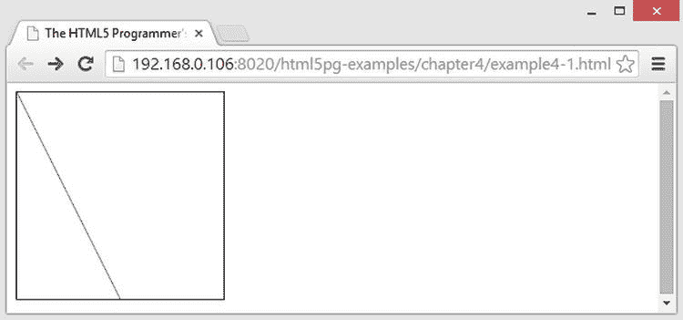

图 4-1 。清单 4-1 的结果

你期望直线从 0，0 到 200，200。。。事实上它做到了。一个`canvas`元素的默认大小是 200 像素高 400 像素宽。您使用 CSS 来指定`canvas`的尺寸，这只是让`canvas`调整其纵横比，而不是实际减少其默认宽度。这给我们带来了一个重要的细节:在一个`canvas`中，坐标系不一定与屏幕像素相对应。

这是画布的一个常见错误，它的发生是因为我们都被训练使用 CSS 来改变 HTML 元素的外观。但是，对于`canvas`元素，您需要使用它的`width`和`height`属性来指定它的尺寸。清单 4-2 将这些添加到标记中。

***清单 4-2*** 。指定画布元素的宽度和高度

```html
<!DOCTYPE html>
<html>
    <head>
        <title>The HTML5 Programmer’s Reference</title>
        <style>
canvas {
  border: 1px solid #000;
}
        </style>
    </head>
    <body>
      <canvas id="myCanvas" width="200" height="200"></canvas>
      <script>
var myCanvas = document.getElementById(’myCanvas’);
var myContext = myCanvas.getContext(’2d’);
myContext.moveTo(0, 0);
myContext.lineTo(200, 200);
myContext.strokeStyle = ’#000’;
myContext.stroke();
      </script>
    </body>
</html>
```

如您所见，这从 CSS 规则中移除了宽度和高度声明，而是使用`width`和`height`属性将尺寸直接应用于`canvas`元素。然后它绘制并描边路径，结果如预期，如图图 4-2 所示。

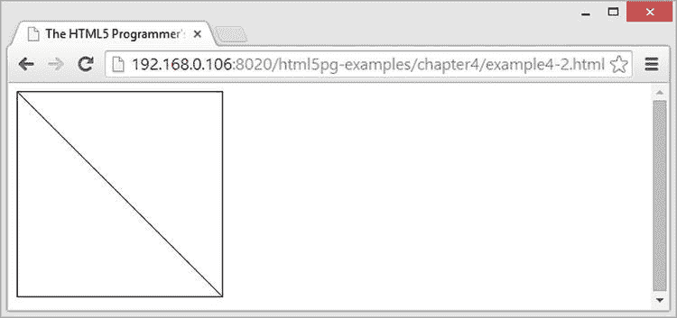

图 4-2 。小小的胜利

如您所见，`canvas`现在真正是 200 像素乘 200 像素，并且您的线条完全按照您的预期绘制。

`canvas`标签不是自动结束的，所以结束标签是强制的。您可以在`canvas`标签中包含替代内容，如果浏览器不支持`canvas`元素，就会呈现替代内容。你可以很容易地扩展这个简单的例子，使其包含一些老浏览器的替代内容，如清单 4-3 所示。

***清单 4-3*** 。不支持 Canvas 的浏览器的替代内容

```html
<!DOCTYPE html>
<html>
    <head>
        <title>The HTML5 Programmer’s Reference</title>
        <style>
canvas {
  border: 1px solid #000;
}
        </style>
    </head>
    <body>
      <canvas id="myCanvas" width="200" height="200">Did You Know: Every time
        you use a browser that doesn’t support HTML5, somewhere a kitten
        cries. Be nice to kittens, upgrade your browser!
      </canvas>
      <script>
var myCanvas = document.getElementById(’myCanvas’);
var myContext = myCanvas.getContext(’2d’);
myContext.moveTo(0, 0);
myContext.lineTo(200, 200);
myContext.strokeStyle = ’#000’;
myContext.stroke();
      </script>
    </body>
</html>
```

如你所见，我们都应该为小猫着想。

现在，您已经对 canvas 标签和绘图上下文有了一个基本的概念，接下来将深入研究可用的绘图命令。

基本绘图命令

`Canvas`提供一组绘图命令，可用于构建复杂图形。大多数绘图命令用于构建路径。事实上，`canvas`只包含一个形状原语的命令:矩形。你将不得不使用更简单的曲线组合来构建任何其他形状。

给定一张图纸`Context`，基本曲线为:

*   `Context.lineTo(x, y)`:从当前笔位置到指定坐标画一条线。
*   `Context.arc(x, y, radius, startAngle, endAngle, anticlockwise)`:以`(x, y)`为圆心，以指定的半径画一个圆弧。`startAngle`和`endAngle`参数是以弧度表示的开始和结束角度，可选的`anticlockwise`参数是一个布尔值，指示曲线是否应该逆时针绘制(默认为`false`，因此默认情况下圆弧是顺时针绘制的)。
*   `Context.quadraticCurveTo(cp1x, cp1y, x, y)`:画一条二次曲线，从当前笔的位置开始，到坐标`(x, y)`结束，控制点在`(cp1x, cp1y)`。
*   `Context.bezierCurveTo(cp1x, cp1y, cp2x, cp2y, x, y)`:从当前笔的位置开始，到坐标`(x, y)`结束，用`(cp1x, cp1y)`指定控制点 1，用`(cp2x, cp2y)`指定控制点 2，绘制一条贝塞尔曲线。
*   `Context.rect(x, y, width, height)`:从`(x, y)`开始画一个指定宽度和高度的矩形。

使用两个简单的命令来声明路径:

*   `Context.beginPath()`:开始新的路径定义。路径闭合前的所有曲线都将包含在路径中。
*   `Context.closePath()`:结束路径定义，从当前笔位置到路径起点画一条直线，关闭路径。

路径本身是看不见的。你必须告诉`canvas`要么抚摸它们，要么填满它们:

*   `Context.strokeStyle` :该属性定义了调用 stroke 方法时，在当前路径上描边的样式。该属性可以接受任何有效的 CSS 颜色字符串(例如，`’red’`、`’#000’`或`’rgb(30, 50, 100)’`)、渐变对象或图案对象。
*   `Context.stroke()` :用`Context.strokeStyle`中指定的样式对当前路径进行描边。
*   `Context.fillStyle` :该属性定义了调用`fill`方法时填充到当前路径中的样式。该属性可以接受 CSS 颜色字符串、渐变对象或图案对象。
*   `Context.fill()` :用`Context.fillStyle`中指定的样式填充当前路径。
*   `Context.lineWidth` :该属性定义应用于路径的笔画粗细。默认为 1 个单位。
*   `Context.lineCap` :该属性定义线条如何封顶。有效值包括:
    *   `butt`:线端被切成方形，并精确地终止于指定的端点。这是默认值。
    *   `round`:线条末端是圆形的，稍微超过指定的端点。
    *   `square`:在线条末端加一个宽度等于线条宽度、高度为线条宽度一半的方框，使线条末端呈方形。
*   `Context.lineJoin` :该属性定义连接线如何连接在一起。有效值包括:
    *   `bevel`:接头是斜的。
    *   接头是斜接的。
    *   `round`:关节呈圆形。

清单 4-4 给出了`lineCap`属性的示例。

***清单 4-4*** 。线帽

```html
<!DOCTYPE html>
<html>
    <head>
        <title>The HTML5 Programmer’s Reference</title>
        <style>
canvas {
  border: 1px solid #000;
}
        </style>
    </head>
    <body>
      <canvas id="myCanvas" width="200" height="200">Did You Know: Every time
        you use a browser that doesn’t support HTML5, somewhere a kitten
        cries. Be nice to kittens, upgrade your browser!
      </canvas>
      <script>
// Get the context we will be using for drawing.
var myCanvas = document.getElementById(’myCanvas’);
var myContext = myCanvas.getContext(’2d’);
myContext.lineWidth = 20; 

// Set up an array of valid ending types.
var arrEndings = [’round’, ’square’, ’butt’];
var i = 0, arrEndingsLength = arrEndings.length;

for (i = 0; i < arrEndingsLength; i++){
  myContext.lineCap = arrEndings[i];
  myContext.beginPath();
  myContext.moveTo(50 + (i * 50), 35);
  myContext.lineTo(50 + (i * 50), 170);
  myContext.stroke();
}
      </script>
    </body>
</html>
```

本例使用`canvas`绘制粗线，以更好地说明线帽。和往常一样，首先获取目标`canvas`的绘图上下文，并为绘图设置`lineWidth`。然后利用一个行结束值的数组，遍历数组为每个值画一条线，如图图 4-3 所示。

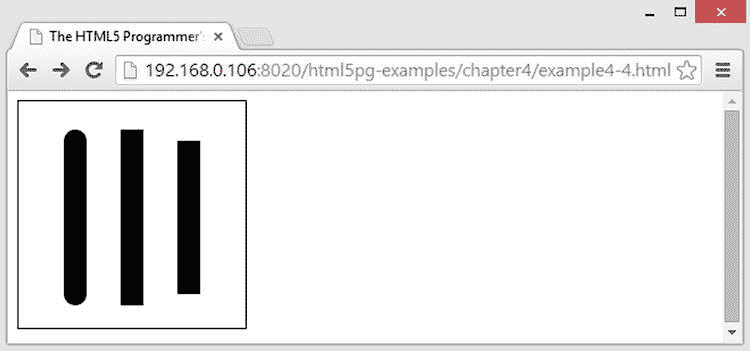

图 4-3 。帆布线帽

你可以看到圆形和方形的帽线比实际的线端多一点。有时，如果你的划水需要特别紧，这会产生奇怪的效果。如果是这种情况，只需减少一点路径的长度，以解决额外的行程。

清单 4-5 展示了`lineJoin`属性的各种值。

***清单 4-5*** 。线条连接

```html
<!DOCTYPE html>
<html>
    <head>
        <title>The HTML5 Programmer’s Reference</title>
        <style>
canvas {
  border: 1px solid #000;
}
        </style>
    </head>
    <body>
      <canvas id="myCanvas" width="200" height="200">Did You Know: Every time
        you use a browser that doesn’t support HTML5, somewhere a kitten
        cries. Be nice to kittens, upgrade your browser!
      </canvas>
      <script>
// Get the context we will be using for drawing.
var myCanvas = document.getElementById(’myCanvas’);
var myContext = myCanvas.getContext(’2d’);
myContext.lineWidth = 20; 

// Set up an array of valid ending types.
var arrJoins = [’round’, ’miter’, ’bevel’];
var i = 0, arrJoinsLength = arrJoins.length;

for (i = 0; i < arrJoinsLength; i++){
  myContext.lineJoin = arrJoins[i];
  myContext.beginPath();
  myContext.moveTo(55, 60 + (i * 60));
  myContext.lineTo(95, 20 + (i * 60));
  myContext.lineTo(135, 60 + (i * 60));
  myContext.stroke();
}
      </script>
    </body>
</html>
```

与前面的例子相似，清单 4-5 使用一个有效连接值的数组来提供这个演示的结构。它循环遍历数组，并绘制出每个数组的一个例子，如图图 4-4 所示。

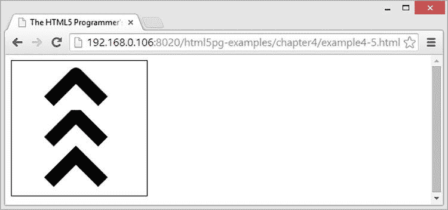

图 4-4 。画布线条连接

你可以看到`round`接头在接头的钝角侧提供了一个稍微圆的盖子，而`miter`接头在钝角侧稍微成方形。

清单 4-6 显示了在弧线上使用笔画属性。

***清单 4-6*** 。随机圆发生器

```html
<!DOCTYPE html>
<html>
    <head>
        <title>The HTML5 Programmer’s Reference</title>
        <style>
canvas {
  border: 1px solid #000;
}
        </style>
    </head>
    <body>
      <canvas id="myCanvas" width="200" height="200">Did You Know: Every time
        you use a browser that doesn’t support HTML5, somewhere a kitten
        cries. Be nice to kittens, upgrade your browser!
      </canvas>
      <script>
// Get the context we will be using for drawing.
var myCanvas = document.getElementById(’myCanvas’);
var myContext = myCanvas.getContext(’2d’);

// Create a loop that will draw a random circle on the canvas.
var cycles = 10,
    i = 0;
for (i = 0; i < cycles; i++) {
  var randX = getRandomIntegerBetween(50, 150);
  var randY = getRandomIntegerBetween(50, 150);
  var randRadius = getRandomIntegerBetween(10, 100);
  myContext.beginPath();
  myContext.arc(randX, randY, randRadius, 0, 6.3);
  randStroke();
}

/**
 * Returns a random integer between the specified minimum and maximum values.
 * @param {number} min The lower boundary for the random number.
 * @param {number} max The upper boundary for the random number.
 * @return {number}
 */
function getRandomIntegerBetween(min, max) {
  return Math.floor(Math.random() * (max - min + 1)) + min;
}

/**
 * Returns a random color formatted as an rgb string.
 * @return {string}
 */
function getRandRGB() {
  var randRed = getRandomIntegerBetween(0, 255);
  var randGreen = getRandomIntegerBetween(0, 255);
  var randBlue = getRandomIntegerBetween(0, 255);
  return ’rgb(’ + randRed + ’, ’ + randGreen + ’, ’ + randBlue + ’)’;
}

/**
 * Performs a randomized stroke on the current path.
 */
function randStroke() {
  myContext.lineWidth = getRandomIntegerBetween(1, 10);
  myContext.strokeStyle = getRandRGB();
  myContext.stroke();
}
      </script>
    </body>
</html>
```

在本例中，您在`canvas`上创建了十个随机的圆，每个圆位于一个随机的位置，具有随机的半径、线宽和描边颜色。`getRandomIntegerBetween`功能可以轻松获得您需要的号码。你也有一个`randStroke`功能，用随机的宽度和颜色描绘当前路径。结果如图 4-5 所示。

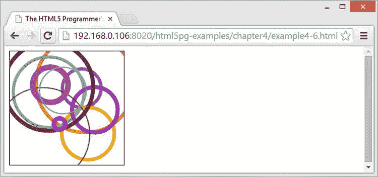

图 4-5 。清单 4-6 的结果

我之前提到过`canvas`也可以画矩形。命令很简单:

*   `Context.fillRect(x, y, width, height)`:在指定坐标绘制一个指定宽度和高度的矩形，用当前填充样式填充。
*   `Context.strokeRect(x, y, width, height)`:在指定坐标处，用当前笔画样式绘制一个指定宽度和高度的矩形。
*   `Context.clearRect(x, y, width, height)`:清除任何其他图形的指定矩形区域。

清单 4-7 展示了矩形的绘制。

***清单 4-7*** 。在画布上绘制矩形

```html
<!DOCTYPE html>
<html>
    <head>
        <title>The HTML5 Programmer’s Reference</title>
        <style>
canvas {
  border: 1px solid #000;
}
        </style>
    </head>
    <body>
      <canvas id="myCanvas" width="200" height="200">Did You Know: Every time
        you use a browser that doesn’t support HTML5, somewhere a kitten
        cries. Be nice to kittens, upgrade your browser!
      </canvas>
      <script>
// Get the context we will be using for drawing.
var myCanvas = document.getElementById(’myCanvas’);
var myContext = myCanvas.getContext(’2d’);

// Set a stroke style and stroke a rectangle.
myContext.strokeStyle = ’green’;
myContext.strokeRect(30, 30, 50, 100);

// Set a fill style and fill a rectangle.
myContext.fillStyle = ’rgba(200, 100, 75, 0.5)’;
myContext.fillRect(20, 20, 50, 50);

// Clear a rectangle.
myContext.clearRect(25, 25, 25, 25);
      </script>
    </body>
</html>
```

在这个例子中，你没有做任何花哨的事情，只是描边、填充和清除矩形。结果就像你预期的那样(图 4-6 )。

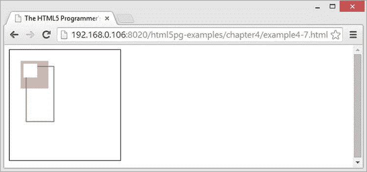

图 4-6 。长方形——耶！

渐变和图案

你已经看到了`canvas`如何设置不同的笔画和填充样式，我提到过这些样式可以是任何有效的 CSS 颜色字符串(例如`green`或`rgba(100, 100, 100, 0.3)`)。此外，`canvas`可以定义用于填充和描边路径的`gradient`和`pattern`对象。

梯度

`Canvas`可以创建线性和径向渐变:

*   `Context.createLinearGradient` `(x, y, x1, y1)`:创建一个线性渐变，从坐标`(x, y)`开始，到坐标`(x1, y1)`结束。返回一个可用作描边或填充样式的`Gradient`对象。
*   `Context.createRadialGradient` `(x, y, r, x1, y1, r1)`:创建由两个圆组成的径向渐变，第一个以`(x, y)`为中心，半径`r`，另一个以`(x1, y1)`为中心，半径`r1`。返回一个可用作笔画或填充样式的`Gradient`对象。
*   `Gradient.addColorStop` `(position, color)`:给`Gradient`增加一个色标。位置参数必须介于 0 和 1 之间；它定义了色标渐变中的相对位置。您可以向特定的`Gradient`添加任意数量的色标。

清单 4-8 显示了一个简单的三停止渐变被用来描边矩形。

***清单 4-8*** 。三站坡度

```html
<!DOCTYPE html>
<html>
    <head>
        <title>The HTML5 Programmer’s Reference</title>
        <style>
canvas {
  border: 1px solid #000;
}
        </style>
    </head>
    <body>
      <canvas id="myCanvas" width="200" height="200">Did You Know: Every time
        you use a browser that doesn’t support HTML5, somewhere a kitten
        cries. Be nice to kittens, upgrade your browser!
      </canvas>
      <script>
// Get the context we will be using for drawing.
var myCanvas = document.getElementById(’myCanvas’);
var myContext = myCanvas.getContext(’2d’);

// Create a gradient object and add color stops.
var myGradient = myContext.createLinearGradient(0, 0, 200, 200);
myGradient.addColorStop(0, ’#000’);
myGradient.addColorStop(0.6, ’green’);
myGradient.addColorStop(1, ’blue’);

// Set the stroke styles and stroke some rectangles.
myContext.strokeStyle = myGradient;
myContext.lineWidth = 20;
myContext.strokeRect(10, 10, 110, 110);
myContext.strokeRect(80, 80, 110, 110);
      </script>
    </body>
</html>
```

这个例子创建了一个线性的`gradient`对象并添加了三个色标，然后用它作为两个矩形的描边样式。结果如图图 4-7 所示。

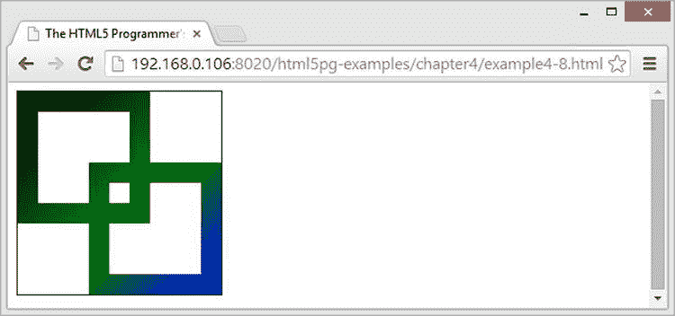

图 4-7 。线性梯度

模式

`Canvas`还支持图案作为填充或描边样式的概念:

*   `Context.createPattern` `(Image, repeat)`:创建可用作填充或描边样式的`Pattern`对象。`Image`参数必须是任何有效的`Image`(详见下一节“图像”)。`repeat`参数指定图案图像如何重复。必须是下列之一:
    *   `repeat`:水平和垂直平铺图像。
    *   `repeat-x`:仅水平重复图像。
    *   `repeat-y`:仅垂直重复图像。
    *   `no-repeat`:完全不重复图像。

清单 4-9 展示了使用一个简单的图像作为模式。

***清单 4-9*** 。创建图案

```html
<!DOCTYPE html>
<html>
    <head>
        <title>The HTML5 Programmer’s Reference</title>
        <style>
canvas {
  border: 1px solid #000;
}
        </style>
    </head>
    <body>
      <canvas id="myCanvas" width="200" height="200">Did You Know: Every time
        you use a browser that doesn’t support HTML5, somewhere a kitten
        cries. Be nice to kittens, upgrade your browser!
      </canvas>
      <script>
// Get the context we will be using for drawing.
var myCanvas = document.getElementById(’myCanvas’);
var myContext = myCanvas.getContext(’2d’);

// Create a new image element and fill it with a kitten.
var myImage = new Image();
myImage.src = ’http://www.placekitten.com/g/50/50’;

// We can’t do anything until the image has successfully loaded.
myImage.onload = function() {
  // Create a pattern with the image and use it as the fill style.
  var myPattern = myContext.createPattern(myImage, ’repeat’);
  myContext.fillStyle = myPattern;
  myContext.fillRect(5, 5, 150, 150);
};
      </script>
    </body>
</html>
```

此示例创建一个新的`image`元素，并将其 URL 设置为一个占位符图像服务。在继续之前，您必须等待图像完成加载，因此您为它附加了一个`onload`事件处理程序，在其中您创建了`pattern`，并将其用作矩形的填充样式。

结果看起来和你预期的一样可爱，如图图 4-8 所示。

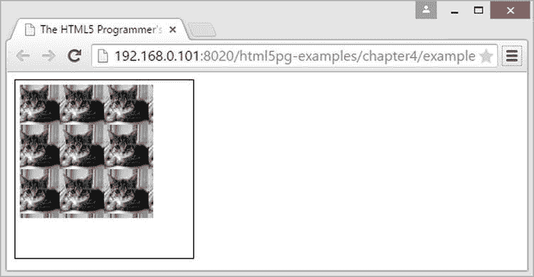

图 4-8 。一只小猫作为图案

图像

元素还可以加载和操作图像。一旦图像被加载到`canvas`中，您也可以使用绘图命令在其上绘图。

`canvas`元素可以将这些来源用于图像:

*   一个`img`元素，
*   一个视频元素，以及
*   另一个`canvas`元素。

`Canvas`有一种绘制图像的方法，但它可以接受许多不同的参数，因此具有多种功能:

*   `Context.drawImage` `(CanvasImageSource, x, y)`:在坐标`(x, y)`处从`CanvasImageSource`处画出图像。
*   `Context.drawImage(CanvasImageSource, x, y, width, height)`:在坐标`(x, y)`绘制图像，将图像缩放到指定的`width`和`height`。
*   `Context.drawImage(CanvasImageSource, sliceX, sliceY, sliceWidth, sliceHeight, x, y, width, height)`:用`sliceWidth`和`sliceHeight`从`(sliceX, sliceY)`开始的矩形指定的图像区域进行切片，然后在`x`、`y`处的`canvas`上绘制该切片，将切片缩放到指定的`width`和`height`。

清单 4-10 展示了`drawImage`的基本功能。

***清单 4-10*** 。在画布上绘制图像

```html
<!DOCTYPE html>
<html>
    <head>
        <title>The HTML5 Programmer’s Reference</title>
        <style>
canvas {
  border: 1px solid #000;
}
        </style>
    </head>
    <body>
      <canvas id="myCanvas" width="200" height="200">Did You Know: Every time
        you use a browser that doesn’t support HTML5, somewhere a kitten
        cries. Be nice to kittens, upgrade your browser!
      </canvas>
      <script>
// Get the context we will be using for drawing.
var myCanvas = document.getElementById(’myCanvas’);
var myContext = myCanvas.getContext(’2d’);

// Create a new image element and fill it with a kitten.
var myImage = new Image();
myImage.src = ’http://www.placekitten.com/g/150/150’;

// We can’t do anything until the image has successfully loaded.
myImage.onload = function() {
  myContext.drawImage(myImage, 25, 25);
};
      </script>
    </body>
</html>
```

在这个例子中，你所做的就是为一个占位符图像创建一个新的`img`元素。一旦图像加载完毕，在你的`canvas`上绘制，如图图 4-9 所示。

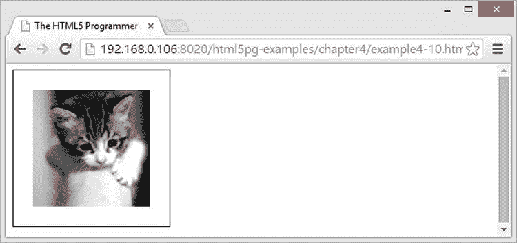

图 4-9 。画在画布上的图像

清单 4-11 演示了在画布上缩放图像。

***清单 4-11*** 。用画布缩放图像

```html
<!DOCTYPE html>
<html>
    <head>
        <title>The HTML5 Programmer’s Reference</title>
        <style>
canvas {
  border: 1px solid #000;
}
        </style>
    </head>
    <body>
      <canvas id="myCanvas" width="200" height="200">Did You Know: Every time
        you use a browser that doesn’t support HTML5, somewhere a kitten
        cries. Be nice to kittens, upgrade your browser!
      </canvas>
      <script>
// Get the context we will be using for drawing.
var myCanvas = document.getElementById(’myCanvas’);
var myContext = myCanvas.getContext(’2d’);

// Create a new image element and fill it with a kitten.
var myImage = new Image();
myImage.src = ’http://www.placekitten.com/g/50/50’;

// We can’t do anything until the image has successfully loaded.
myImage.onload = function() {
  myContext.drawImage(myImage, 25, 25, 50, 150);
};
      </script>
    </body>
</html>
```

这个例子给你一个 100 像素乘 100 像素的占位符，但是当你在`canvas`上画它的时候，你把它缩放到 50 像素×150 像素，如图图 4-10 所示。

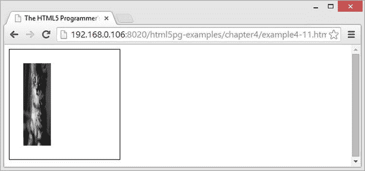

图 4-10 。在画布中缩放图像

最后，清单 4-12 显示了在`canvas`上切片一个更大的图像并缩放切片。

***清单 4-12*** 。对`canvas`上的图像进行切片和缩放

```html
<!DOCTYPE html>
<html>
    <head>
        <title>The HTML5 Programmer’s Reference</title>
        <style>
canvas {
  border: 1px solid #000;
}
        </style>
    </head>
    <body>
      <canvas id="myCanvas" width="200" height="200">Did You Know: Every time
        you use a browser that doesn’t support HTML5, somewhere a kitten
        cries. Be nice to kittens, upgrade your browser!
      </canvas>
      <script>
// Get the context we will be using for drawing.
var myCanvas = document.getElementById(’myCanvas’);
var myContext = myCanvas.getContext(’2d’);

// Create a new image element and fill it with a kitten.
var myImage = new Image();
myImage.src = ’http://www.placekitten.com/g/300/300’;

// We can’t do anything until the image has successfully loaded.
myImage.onload = function() {
  myContext.drawImage(myImage, 25, 25, 150, 150, 0, 0, 150, 50);
};
      </script>
    </body>
</html>
```

这里你加载了一个 300px × 300px 的占位符图像，但是从`(25, 25)`开始只截取了它的 75px × 75px 部分。然后你把这个切片渲染到`canvas`中，缩放到 150 像素×50 像素。结果相当失真，如图图 4-11 所示。

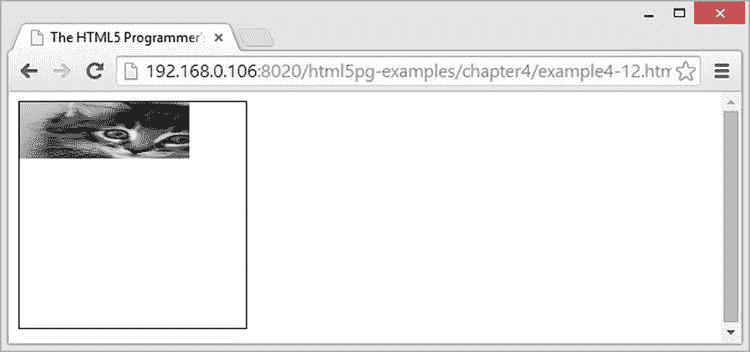

图 4-11 。可怜的小猫

保存 `Canvas`内容

一旦你在`canvas`上画了一幅画，你可能想以某种方式保存它。这将包括获取图像数据，并将其传输到服务器，从服务器可以重建和显示图像数据。`canvas` API 确实提供了保存渲染位图的方法:

*   `Context.toDataUrl(opt_type, opt_quality)`:将渲染后的位图转换成数据 URI。数据 URIs 是一种将数据直接嵌入网页的方式，定义在 RFC 2397 中，您可以在`http://tools.ietf.org/html/rfc2397`阅读。有效类型包括`image/png`(默认)、`image/jpeg`和(对于 Chrome 和基于 Chrome 的浏览器，`image/webp`)。如果类型是`image/jpeg`或`image/webp`，可以提供一个可选的 0 到 1 之间的第二参数来表示质量。此方法返回编码为数据 URI 的渲染位图，然后您可以将它传输回服务器，甚至在同一页面的其他地方使用。

请注意，如果您已经将一个来自不同于宿主页面的图像加载到`canvas`中，或者如果您已经将一个图像从您的硬盘加载到`canvas`中，这个方法将抛出一个安全错误。这样做是为了防止通过粗心或恶意脚本泄漏信息。

正文

除了绘图和图像，`canvas`元素还可以呈现文本。文本呈现的方法和属性如下:

*   `Context.fillText` `(textString, x, y, opt_maxWidth)`:用当前填充样式填充从`(x, y)`开始的`canvas`上的`textString`。如果指定了可选的`maxWidth`参数，并且呈现的文本将超过该宽度，浏览器将尝试以这样的方式来呈现文本，以使其适合指定的宽度(例如，如果可用，使用压缩的字体，使用较小的字体大小，等等)。).
*   `Context.measureText` `(textString)`:测量使用当前样式渲染指定的`textString`时的宽度。返回一个`TextMetrics`对象，该对象的 width 属性包含值。
*   `Context.strokeText` `(textString, x, y, opt_maxWidth)`:以当前笔画风格从`(x, y)`开始在`canvas`上划`textString`。如果指定了可选的`maxWidth`参数，并且呈现的文本将超过该宽度，浏览器将尝试以这样的方式来呈现文本，以使其适合指定的宽度(例如，如果可用，使用压缩的字体，使用较小的字体大小，等等)。).
*   `Context.font` :设置文本渲染的字体。允许任何有效的 CSS 字体字符串。
*   `Context.textAlign` :按指定对齐文本。有效值包括:
    *   `left`:左对齐文本。
    *   `right`:右对齐文本。
    *   `center`:文本居中。
    *   `start`:将文本从当前语言环境的起始端对齐(即，从左到右的语言靠左，从右到左的语言靠右)。这是默认值。
    *   `end`:将文本在当前语言环境的结束端对齐。
*   `Context.textBaseline` :为指定的文本设置基线。有效值包括:
    *   `alphabetic`:对文本使用正常的字母基线。这是默认值。
    *   `bottom`:基线是 em 方块的底部。
    *   `hanging`:对文本使用悬挂基线。
    *   `ideographic`:使用字符体的底部(假设它们突出于字母基线之下)。
    *   `middle`:文本基线是 em 方块的中间。
    *   `top`:文本基线是 em 方块的顶部。

清单 4-13 展示了在`canvas`上绘制文本是多么容易。

***清单 4-13*** 。在画布上呈现文本

```html
<!DOCTYPE html>
<html>
    <head>
        <title>The HTML5 Programmer’s Reference</title>
        <style>
canvas {
  border: 1px solid #000;
}
        </style>
    </head>
    <body>
      <canvas id="myCanvas" width="200" height="200">Did You Know: Every time
        you use a browser that doesn’t support HTML5, somewhere a kitten
        cries. Be nice to kittens, upgrade your browser!
      </canvas>
      <script>
// Get the context we will be using for drawing.
var myCanvas = document.getElementById(’myCanvas’);
var myContext = myCanvas.getContext(’2d’);

// Draw some text!
myContext.font = ’35px sans-serif’;
myContext.strokeStyle = ’#000’;
myContext.strokeText(’Hello World’, 0, 40);
myContext.textAlign = ’center’;
myContext.fillStyle = ’rgba(200, 50, 25, 0.8)’;
myContext.fillText(’HTML5’, 100, 100);
      </script>
    </body>
</html>
```

这个例子对`canvas`上的一些文本进行描边和填充。字体足够大，可以显示字母边缘的实际笔划，如图图 4-12 所示。

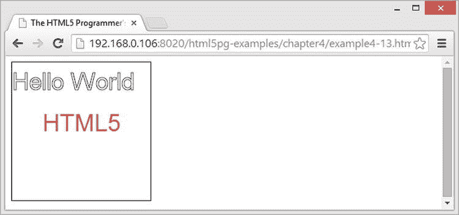

图 4-12 。呈现在画布上的文本

阴影

`canvas`元素也可以根据其上绘制的元素投射阴影。这通常用于文本，但也适用于形状和路径。如果你已经熟悉 CSS 阴影，那么`canvas`阴影的参数将会非常熟悉:

*   `Context.shadowBlur`:虚化效果的大小。默认值为 0。
*   `Context.shadowColor`:阴影的颜色。可以是任何有效的 CSS 颜色字符串。默认为`’rgba(0, 0, 0, 0)’`。
*   `Context.shadowOffsetX`:阴影的 x 轴偏移量。默认值为 0。
*   `Context.shadowOffsetY`:阴影的 y 轴偏移量。默认值为 0。

清单 4-14 演示了在一些文本上投射阴影。

***清单 4-14*** 。投影

```html
<!DOCTYPE html>
<html>
    <head>
        <title>The HTML5 Programmer’s Reference</title>
        <style>
canvas {
  border: 1px solid #000;
}
        </style>
    </head>
    <body>
      <canvas id="myCanvas" width="200" height="200">Did You Know: Every time
        you use a browser that doesn’t support HTML5, somewhere a kitten
        cries. Be nice to kittens, upgrade your browser!
      </canvas>
      <script>
// Get the context we will be using for drawing.
var myCanvas = document.getElementById(’myCanvas’);
var myContext = myCanvas.getContext(’2d’);

// Add some shadow!
myContext.shadowOffsetX = 2;
myContext.shadowOffsetY = 2;
myContext.shadowBlur = 2;
myContext.shadowColor = "rgba(0, 0, 0, 0.8)";

// Draw some text!
myContext.font = ’35px sans-serif’;
myContext.strokeStyle = ’#000’;
myContext.strokeText(’Hello World’, 0, 40);
myContext.textAlign = ’center’;
myContext.fillStyle = ’rgba(200, 50, 25, 0.8)’;
myContext.shadowOffsetX = 4;
myContext.shadowOffsetY = 4;
myContext.fillText(’HTML5’, 100, 100);
      </script>
    </body>
</html>
```

这个例子简单地给清单 4-13 中的代码添加了阴影。它增加了两个不同的阴影偏移量，一个很近，一个很远，如图图 4-13 所示。

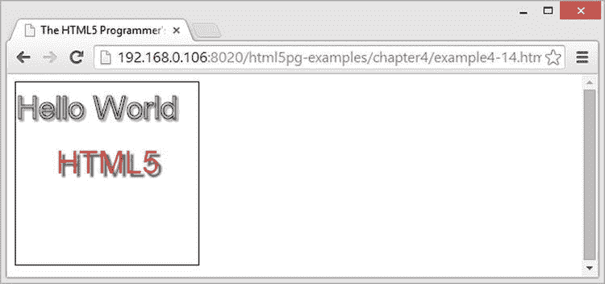

图 4-13 。画布上呈现的阴影

保存绘图状态

`canvas` API 提供了一种存储绘图上下文当前状态信息的方法。信息存储在一个堆栈中，您可以根据需要从堆栈中推入和拉出状态。可存储的绘图上下文属性如下:

*   `globalAlpha`的当前值
*   电流`strokeStyle`和`fillStyle`
*   `lineCap`、`lineJoin`、`lineWidth`和`miterLimit`中的当前线路设置
*   `shadowBlur`、`shadowColor`、`shadowOffsetX`和`shadowOffsetY`中的当前阴影设置
*   在`globalCompositeOperation`中设置的当前合成操作
*   当前剪辑路径
*   已应用于绘图上下文的任何转换

这些值共同构成了绘图状态。保存和恢复状态的方法很简单:

*   `Context.save()`:拍摄当前绘图状态的快照，并将值保存在堆栈中。
*   `Context.restore()`:从堆栈中删除最近存储的绘图状态，并将其恢复到上下文中。

绘图状态保存在先进先出堆栈中。save 和 restore 方法是访问堆栈和其中存储的状态的仅有的两种方法。

清单 4-15 提供了一个有点做作的保存和恢复绘图状态的演示。

***清单 4-15*** 。保存和恢复绘图状态

```html
<!DOCTYPE html>
<html>
    <head>
        <title>The HTML5 Programmer’s Reference</title>
        <style>
canvas {
  border: 1px solid #000;
}
        </style>
    </head>
    <body>
      <canvas id="myCanvas" width="200" height="210">Did You Know: Every time
        you use a browser that doesn’t support HTML5, somewhere a kitten
        cries. Be nice to kittens, upgrade your browser!
      </canvas>
      <script>
// Get the context we will be using for drawing.
var myCanvas = document.getElementById(’myCanvas’);
var myContext = myCanvas.getContext(’2d’);

// Create an array of colors to load into the stack.
var allTheColors = [’#ff0000’, ’#ff8800’, ’#ffff00’, ’#00ff00’, ’#0000ff’,
    ’#4b0082’, ’#8f00ff’];

// Load the colors and stroke style into the stack.
for (var i = 0; i < allTheColors.length; i++) {
  myContext.strokeStyle = allTheColors[i];
  myContext.lineWidth = 30;
  myContext.save();
}

// Restore colors from the stack and draw.
for (var i = 0; i < 8; i++) {
  myContext.restore();
  myContext.beginPath();
  myContext.moveTo(0, ((30 * i) + 15));
  myContext.lineTo(200, ((30 * i) + 15));
  myContext.stroke();
}
      </script>
    </body>
</html>
```

本示例以编程方式创建一组具有不同颜色和特定线宽的绘图状态。然后它一次恢复一个状态，并画一条线。

您会注意到每一行的 y 坐标都是基于循环索引的。每条线的描边宽度为 30 个单位:线上 15 个单位，线下 15 个单位。如果你只是从`(0, 0)`到`(200, 0)`画第一条线，然后描边，你不会看到笔画的前 15 个单元。将每一行下移 15 个单位可确保您将看到第一行和后续每一行的完整笔画宽度。

合成

到目前为止，在你所有的`canvas`例子中，当你在`canvas`上绘制多个项目时，它们只是一个在另一个之上。`canvas` API 提供了在绘制时组合项目的能力，这使您能够进行一些相当复杂的操作。

每当你在`canvas`上绘制一个新元素时，合成器会查看已经存在于`canvas`上的内容。这个当前内容被称为*目的地*??。新内容被称为*源*。然后合成器根据当前活动的合成器参照目的地绘制源。

合成器是使用当前上下文的`globalCompositeOperation`属性指定的。可用的合成器如下:

*   `source-over`:在目标内容上绘制源内容。这是默认的合成器。
*   `source-atop`:源内容仅在与目标内容重叠的地方绘制。
*   `source-in`:仅在源内容和目标内容重叠的地方绘制源内容。其他一切都是透明的。
*   `source-out`:源内容仅在不与目标内容重叠的地方绘制。其他一切都是透明的。
*   `destination-over`:源内容绘制在目的内容的下面。
*   `destination-atop`:源内容仅保留在与目标内容重叠的地方。目标内容绘制在源内容的下方。其他一切都是透明的。
*   `destination-in`:源内容只保留在与目的内容重叠的地方。其他一切都是透明的。
*   `destination-out`:源内容只保存在不与目的内容重叠的地方。其他一切都是透明的。
*   `copy`:仅绘制目标内容。其他一切都是透明的。
*   `lighter`:当目标内容和源内容重叠时，通过将两个内容的值相加来确定颜色。
*   `xor`:目标内容正常呈现，除非它与源内容重叠，在这种情况下，两者都呈现为透明。

要指定合成器，只需将`Context.` `globalCompositeOperation`设置为所需的值:

```html
var myCanvas = document.getElementById(’myCanvas’);
var myContext = myCanvas.getContext(’2d’);
myContext.globalCompositeOperation = ’lighter’;
```

清单 4-16 提供了一种查看不同合成器的方法。

***清单 4-16*** 。画布合成器演示

```html
<!DOCTYPE html>
<html>
    <head>
        <title>The HTML5 Programmer’s Reference</title>
        <style>
canvas {
  border: 1px solid #000;
}
        </style>
    </head>
    <body>
      <canvas id="myCanvas" width="200" height="200">Did You Know: Every time
        you use a browser that doesn’t support HTML5, somewhere a kitten
        cries. Be nice to kittens, upgrade your browser!
      </canvas>
      <br>
      <select id="compositor">
        <option value="source-over" selected>source-over</option>
        <option value="destination-atop">destination-atop</option>
        <option value="destination-in">destination-in</option>
        <option value="destination-out">destination-out</option>
        <option value="destination-over">destination-over</option>
        <option value="source-atop">source-atop</option>
        <option value="source-in">source-in</option>
        <option value="source-out">source-out</option>
        <option value="copy">copy</option>
        <option value="lighter">lighter</option>
        <option value="xor">xor</option>
      </select>
      <button id="toggle-triangle">Toggle Triangle</button>
      <script>
// Get the context we will be using for drawing.
var myCanvas = document.getElementById(’myCanvas’);
var myContext = myCanvas.getContext(’2d’);

// Get references to the form elements.
var mySelector = document.getElementById(’compositor’);
var toggleTriangle = document.getElementById(’toggle-triangle’);

/**
 * Draws the example shapes with the specified compositor.
 */
function drawExample() {
  // First set the compositing to source-over so we can guarantee drawing the
  // first shape.
  myContext.globalCompositeOperation = ’source-over’;
  myContext.clearRect(0, 0, 200, 200);
  myContext.beginPath();

  // Draw the circle first.
  myContext.arc(60, 100, 40, 0, 7);
  myContext.fillStyle = ’#ff0000’;
  myContext.fill();

  // Change the compositing to the chosen value.
  myContext.globalCompositeOperation = mySelector.value;

  // Draw a rectangle on top of the circle.
  myContext.beginPath();
  myContext.fillStyle = ’#0000ff’;
  myContext.rect(60, 60, 80, 80);
  myContext.fill();
}

/**
 * Whether or not to show the triangle.
 * @type {boolean}
 */
var showTriangle = false;

/**
 * Shows or hides the triangle.
 */
function showHideTriangle() {
  if (showTriangle) {
    myContext.fillStyle = ’#00ff00’;
    myContext.beginPath();
    myContext.moveTo(40, 80);
    myContext.lineTo(170, 100);
    myContext.lineTo(40, 120);
    myContext.lineTo(40, 80);
    myContext.fill();
  } else {
    drawExample();
  }
}

// Draw the example for the first time.
drawExample();

// Add a change event handler to the selector to redraw the example with the
// chosen compositor.
mySelector.addEventListener(’change’, function() {
  showTriangle = false;
  drawExample();
}, false); 

// Add a click event handler to the toggle button to show or hide the triangle.
toggleTriangle.addEventListener(’click’, function() {
  showTriangle = showTriangle ? false : true;
  showHideTriangle();
}, false);
      </script>
    </body>
</html>
```

这个示例创建了一个简单的选择字段，其中包含所有可用的合成器可供选择。当您选择合成器时，形状将重新绘制。第一个形状(红色圆圈)将总是用`source-over`绘制。第二个形状(蓝色方块)将使用新选择的合成器绘制。您可以打开和关闭绿色三角形，以查看它将如何与第一次合成的结果合成。

合成器适用于任何可以在`canvas`上绘制的东西，甚至是图像，如清单 4-17 所示。

***清单 4-17*** 。合成照片

```html
<!DOCTYPE html>
<html>
    <head>
        <title>The HTML5 Programmer’s Reference</title>
        <style>
canvas {
  border: 1px solid #000;
}
        </style>
    </head>
    <body>
      <canvas id="myCanvas" width="200" height="200">Did You Know: Every time
        you use a browser that doesn’t support HTML5, somewhere a kitten
        cries. Be nice to kittens, upgrade your browser!
      </canvas>
      <script>
// Get the context we will be using for drawing.
var myCanvas = document.getElementById(’myCanvas’);
var myContext = myCanvas.getContext(’2d’);

// Create a new image element and fill it with a kitten.
var myImage = new Image();
myImage.src = ’http://www.placekitten.com/g/150/150’;

// We can’t do anything until the image has successfully loaded.
myImage.onload = function() {
  // Create a simple gray linear gradient and set it to the fill style.
  var myGradient = myContext.createLinearGradient(25, 25, 25, 175);
  myGradient.addColorStop(0.1, ’#000’);
  myGradient.addColorStop(1, ’rgba(200, 200, 200, 1)’);
  myContext.fillStyle = myGradient;

  // Draw a square that almost fills the region where the image will be rendered
  // and fill it with the gradient.
  myContext.beginPath();
  myContext.rect(30, 30, 140, 140);
  myContext.fill();

  // Set the compositor to lighter.
  myContext.globalCompositeOperation = ’lighter’;

  // Draw the kitten.
  myContext.drawImage(myImage, 25, 25);
};
      </script>
    </body>
</html>
```

本示例创建一个简单的线性渐变并将其用作正方形的填充样式，然后使用较亮的合成器在其上合成一只小猫的图像。结果示例如图 4-14 所示。

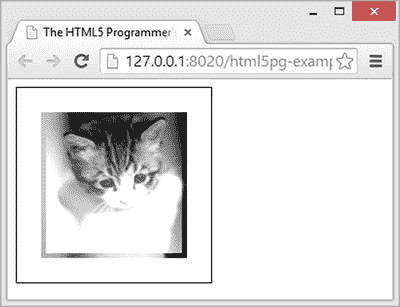

图 4-14 。将渐变与图像合成的结果

使用带有渐变、图案和图像的合成器，你可以用你的`canvas`图创建一些非常复杂的效果。

剪辑

您可以将`canvas`的绘图区域限制在您定义的任何闭合路径上。这被称为 ?? 削波。通过首先在`canvas`上绘制一条路径，然后调用`Context.clip()`方法来创建一个裁剪区域，这将把绘制限制在那个区域。您仍然可以描边和填充路径，也可以创建新的路径或其他绘图。可见性将被限制在剪辑区域。

有三种方法可以重置裁剪区域:

*   您可以定义一个包含整个`canvas`的路径，然后剪切到该路径。
*   可以用不同的剪辑区域恢复到以前的绘图状态。
*   您可以通过调整大小来重置整个`canvas`。

清单 4-18 演示了创建一个裁剪区域来限制绘图。

***清单 4-18*** 。创建一个裁剪区域

```html
<!DOCTYPE html>
<html>
    <head>
        <title>The HTML5 Programmer’s Reference</title>
        <style>
canvas {
  border: 1px solid #000;
}
        </style>
    </head>
    <body>
      <canvas id="myCanvas" width="200" height="200">Did You Know: Every time
        you use a browser that doesn’t support HTML5, somewhere a kitten
        cries. Be nice to kittens, upgrade your browser!
      </canvas>
      <script>
// Get the context we will be using for drawing.
var myCanvas = document.getElementById(’myCanvas’);
var myContext = myCanvas.getContext(’2d’);

// Create a square clipping area.
myContext.beginPath();
myContext.rect(50, 50, 50, 50);
myContext.clip();

// Draw a large circle in the canvas and fill it. Only the portion within
// the clipping area will be visible. myContext.beginPath();
myContext.arc(75, 75, 100, 0, 7);
myContext.fillStyle = ’red’;
myContext.fill();
      </script>
    </body>
</html>
```

这个简单的例子首先使用`rect`方法创建一个正方形路径，然后将其设置为剪辑区域。然后它画了一个大圆并用红色填充，但是唯一可见的区域是在裁剪区域内，如图图 4-15 所示。

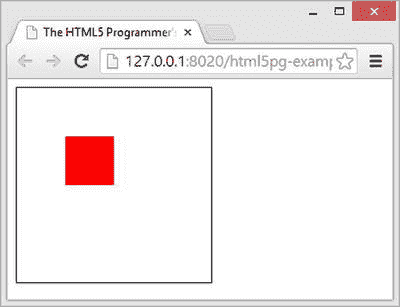

图 4-15 。剪裁的效果

转换

`canvas` API 包含了一组改变图形在`canvas`上呈现方式的方法:旋转它们，缩放它们，甚至任意改变，如反射或剪切。这些变化被称为*变换*??。设置转换后，将以指定的方式修改更多的图形。`canvas` API 为一些常见的转换提供了一套简化方法:

*   `Context.translate` `(translateX, translateY)`:将`canvas`的原点从当前位置移动到距离当前原点`translateX`单位的新 x 位置和距离当前原点`translateY`单位的新 y 位置。
*   `Context.rotate` `(angle)`:以弧度为单位将`canvas`绕原点旋转指定角度。
*   `Context.scale` `(scaleX, scaleY)`:水平`scaleX`和垂直`scaleY`缩放`canvas`单位。

此外，您可以使用变换方法指定任意变换矩阵:

*   `Context.transform(scaleX, skewX, skewY, scaleY, translateX, translateY)`: Transform the `canvas` by applying a transformation matrix specified as:

    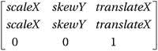。

`rotate`、`translate`和`scale`的简写方法都映射到转换矩阵，从而调用转换方法。比如`Context.translate(translateX, translateY)`映射到`Context.transform(1, 0, 0, 1, translateX, translateY)`，`Context.scale(scaleX, scaleY)`映射到`Context.transform(scaleX, 0, 0, scaleY, 0, 0)`。

 **注意**如果你是线性代数爱好者，所有的`canvas`变换都是仿射变换。

关于`canvas`转换，需要记住的重要一点是，它们会影响整个`canvas`——一旦转换被实现，它会影响从该点开始绘制的所有内容。`Canvas`当你应用两个不同的变换时，第二个变换的结果会基于第一个变换。如果您不仔细管理活动转换并根据需要重置它们，这可能会导致一些意想不到的结果。您可以通过以下三种方式之一重置转换:

*   指定一个称为“单位变换矩阵”的特殊变换，它对绘图没有影响。您可以使用变换方法:`Context.transform(1, 0, 0, 1, 0, 0)`指定该矩阵。
*   恢复先前保存的绘图状态，这会将转换设置为该状态的转换。
*   通过调整大小重置整个`canvas`。

在探索一些更复杂的转换之前，先看一些简单的例子。清单 4-19 演示了一个简单的`translate`转换:

***清单 4-19*** 。简单的平移变换

```html
<!DOCTYPE html>
<html>
    <head>
        <title>The HTML5 Programmer’s Reference</title>
        <style>
canvas {
  border: 1px solid #000;
}
        </style>
    </head>
    <body>
      <canvas id="myCanvas" width="200" height="200">Did You Know: Every time
        you use a browser that doesn’t support HTML5, somewhere a kitten
        cries. Be nice to kittens, upgrade your browser!
      </canvas>
      <script>
// Get the context we will be using for drawing.
var myCanvas = document.getElementById(’myCanvas’);
var myContext = myCanvas.getContext(’2d’); 

/**
 * Draws a 100x100 square at (0, 0) in the specified color. Indicates the origin
 * corner with a small black square.
 * @param {string} color A valid CSS color string.
 */
function drawSquare(color) {
  myContext.fillStyle = color;
  myContext.beginPath();
  myContext.rect(0, 0, 100, 100);
  myContext.fill();
  myContext.fillStyle = ’#000’;
  myContext.beginPath();
  myContext.rect(0, 0, 5, 5);
  myContext.fill();
}

// Draw a square, fill it with red.
drawSquare(’rgba(255, 0, 0, 0.5)’);

// Translate the canvas.
myContext.translate(20, 40);

// Draw the same square again, fill it with blue.
drawSquare(’rgba(0, 0, 255, 0.5)’);

// Translate the canvas again.
myContext.translate(50, -20);

// Draw the same square again, fill it with green.
drawSquare(’rgba(0, 255, 0, 0.5)’);

      </script>
    </body>
</html>
```

这个例子(将构成接下来几个例子的基础)创建了一个在`canvas`的原点画一个正方形的简单方法。该函数用指定的颜色填充正方形(或者您可以传入任何有效的`fillStyle`)。为了帮助跟踪原点，该函数还在原点处的正方形的角上创建一个小的后凹口。

首先，它在原点画一个正方形，并把它涂成红色。然后它翻译`canvas`，并绘制一个蓝色方块。最后，它再次翻译`canvas`并绘制一个绿色方块。结果如图图 4-16 所示。

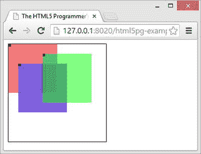

图 4-16 。清单 4-18 的结果

如你所见，平移导致`canvas`的原点按照指定移动。

接下来，清单 4-20 在这个例子的基础上应用了旋转和变换:

***清单 4-20*** 。在平移上叠加旋转

```html
<!DOCTYPE html>
<html>
    <head>
        <title>The HTML5 Programmer’s Reference</title>
        <style>
canvas {
  border: 1px solid #000;
}
        </style>
    </head>
    <body>
      <canvas id="myCanvas" width="200" height="200">Did You Know: Every time
        you use a browser that doesn’t support HTML5, somewhere a kitten
        cries. Be nice to kittens, upgrade your browser!
      </canvas>
      <script>
// Get the context we will be using for drawing.
var myCanvas = document.getElementById(’myCanvas’);
var myContext = myCanvas.getContext(’2d’);

/**
 * Draws a 100x100 square at (0, 0) in the specified color. Indicates the origin
 * corner with a small black square.
 * @param {string} color A valid CSS color string.
 */
function drawSquare(color) {
  myContext.fillStyle = color;
  myContext.beginPath();
  myContext.rect(0, 0, 100, 100);
  myContext.fill();
  myContext.fillStyle = ’#000’;
  myContext.beginPath();
  myContext.rect(0, 0, 5, 5);
  myContext.fill();
}

// Draw a square, fill it with red.
drawSquare(’rgba(255, 0, 0, 0.5)’);

// Translate the canvas.
myContext.translate(20, 40);

// Rotate the canvas 45 degrees (about 0.785 radians).
myContext.rotate(0.785);

// Draw the same square again, fill it with blue.
drawSquare(’rgba(0, 0, 255, 0.5)’);

// Translate the canvas again.
myContext.translate(50, -20);

// Rotate the canvas 45 degrees (about 0.785 radians).
myContext.rotate(0.785);

// Draw the same square again, fill it with green.
drawSquare(’rgba(0, 255, 0, 0.5)’);
      </script>
    </body>
</html>
```

它使用和以前一样的平移，但是在绘制新的方块之前也增加了一个旋转。结果如图 4-17 所示。

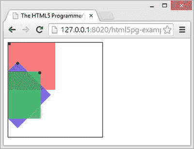

图 4-17 。旋转和平移

这里你可以看到同样的平移和旋转。你可以看到每个方块都绕着它的原点旋转。

最后，你可以看看清单 4-21 中的一些比例变换。

***清单 4-21*** 。缩放和平移变换

```html
<!DOCTYPE html>
<html>
    <head>
        <title>The HTML5 Programmer’s Reference</title>
        <style>
canvas {
  border: 1px solid #000;
}
        </style>
    </head>
    <body>
      <canvas id="myCanvas" width="200" height="200">Did You Know: Every time
        you use a browser that doesn’t support HTML5, somewhere a kitten
        cries. Be nice to kittens, upgrade your browser!
      </canvas>
      <script>
// Get the context we will be using for drawing.
var myCanvas = document.getElementById(’myCanvas’);
var myContext = myCanvas.getContext(’2d’);

/**
 * Draws a 100x100 square at (0, 0) in the specified color. Indicates the origin
 * corner with a small black square.
 * @param {string} color A valid CSS color string.
 */
function drawSquare(color) {
  myContext.fillStyle = color;
  myContext.beginPath();
  myContext.rect(0, 0, 100, 100);
  myContext.fill();
  myContext.fillStyle = ’#000’;
  myContext.beginPath();
  myContext.rect(0, 0, 5, 5);
  myContext.fill();
}

// Draw a square, fill it with red.
drawSquare(’rgba(255, 0, 0, 0.5)’);

// Translate the canvas.
myContext.translate(20, 40);

// Scale the canvas.
myContext.scale(1, 1.5);

// Draw the same square again, fill it with blue.
drawSquare(’rgba(0, 0, 255, 0.5)’);

// Translate the canvas again.
myContext.translate(50, -20);

// Scale the canvas again.
myContext.scale(1.5, 1);

// Draw the same square again, fill it with green.
drawSquare(’rgba(0, 255, 0, 0.5)’);
      </script>
    </body>
</html>
```

同样，这个例子建立在清单 4-19 的之上，并使用相同的函数和翻译。这次在画第二个和第三个方块之前增加了一个缩放平移，如图图 4-18 所示。

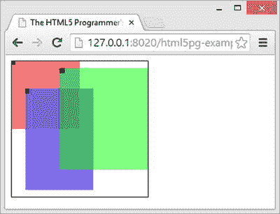

图 4-18 。缩放和平移

如果仔细观察，您会发现蓝色正方形的原点标记根据您对其应用的缩放变换而略微拉长。如果你比较绿色方块和红色方块的原点标记，你会发现前者的大小是后者的两倍。

对于一个更实际的例子，考虑创建元素的动态反射。转换很容易，如清单 4-22 所示。

***清单 4-22*** 。简单的文字反映

```html
<!DOCTYPE html>
<html>
    <head>
        <title>The HTML5 Programmer’s Reference</title>
        <style>
canvas {
  border: 1px solid #000;
}
        </style>
    </head>
    <body>
      <canvas id="myCanvas" width="200" height="200">Did You Know: Every time
        you use a browser that doesn’t support HTML5, somewhere a kitten
        cries. Be nice to kittens, upgrade your browser!
      </canvas>
      <script>
// Get the context we will be using for drawing.
var myCanvas = document.getElementById(’myCanvas’);
var myContext = myCanvas.getContext(’2d’);

// Draw some text!
myContext.font = ’35px sans-serif’;
myContext.fillStyle = ’#000’;
myContext.fillText(’Hello World’, 10, 100);

// Set a reflection transform.
myContext.setTransform(1, 0, 0, -1, 0, 0);

// Set a slight scale transform. 
myContext.scale(1, 1.2);

// Draw the text again with the transforms in place and a light gray fill style.
myContext.fillStyle = ’rgba(100, 100, 100, 0.4)’;
myContext.fillText(’Hello World’, 10, -85);
      </script>
    </body>
</html>
```

该示例绘制一些文本，然后对`canvas`应用反射变换和缩放变换，然后用浅灰色重新绘制相同的文本。结果如图 4-19 中的所示。

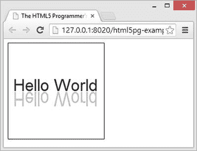

图 4-19 。文本反射

您甚至可以使用渐变作为反射文本的填充样式，从而产生从上到下渐变的阴影

动画

API 没有为动画提供任何本地支持。它没有为其内容增加动画效果的方法，而且正如您所看到的，一旦内容被渲染，它也没有提供引用内容的方法。然而，`canvas`提供的绘图工具是如此的低级和高效，以至于你可以用`canvas`通过单独绘制每个动画帧来创建动画。

正如你将在第五章的的“动画计时”中看到的，大多数基于 JavaScript 的动画是在计时循环中完成的，用`canvas`制作动画也没什么不同。事实上，为了简化动画示例，您将使用您在清单 5-5 中构建的 DrawCycle 构造函数。这将允许你创建一个绘制周期管理器，使用`requestAnimationFrame`来最大化你的动画的效率。关于`requestAnimationFrame`的详细信息，参见第五章中的“动画计时”。

要使用`canvas`制作动画，您必须单独绘制动画的每一帧，清除帧之间的`canvas`(如果需要，保存/恢复动画状态)。清单 4-23 说明了这个循环。

***清单 4-23*** 。用画布制作动画

```html
<!DOCTYPE html>
<html>
    <head>
        <title>The HTML5 Programmer’s Reference</title>
        <style>
canvas {
  border: 1px solid #000;
}
        </style>
    </head>
    <body>
      <canvas id="myCanvas" width="500" height="500">Did You Know: Every time
        you use a browser that doesn’t support HTML5, somewhere a kitten
        cries. Be nice to kittens, upgrade your browser!
      </canvas>
      <script src="drawcycle.js"></script>
      <script>
// Get the context we will be using for drawing.
var myCanvas = document.getElementById(’myCanvas’);
var myContext = myCanvas.getContext(’2d’);

// Set the stroke style.
myContext.strokeStyle = ’#000’;

// Create a new draw cycle object that we can use for our animation.
var myDrawCycle = new DrawCycle();

/**
 * Draws a circle of specified radius at the specified coordinates.
 * @param {number} x The x-coordinate of the center of the circle.
 * @param {number} y The y-coordinate of the center of the circle.
 * @param {number} rad The radius of the circle.
 */
function drawCircle(x, y, rad) {
  myContext.beginPath();
  myContext.moveTo(x + rad, y);
  myContext.arc(x, y, rad, 0, 7);
  myContext.stroke();
}

// Counter for the x-coordinate. 
var x = 0;

/**
 * Animates a circle from one corner of the canvas to another. Used as an
 * animation function for the draw cycle object.
 */
function animateCircle() {
  if (x < 500) {
    myContext.clearRect(0, 0, 500, 500);
    drawCircle(x, x, 10);
    x++;
  } else {
    myDrawCycle.stopAnimation();
  }
}

// Add the animation function to the draw cycle object.
myDrawCycle.addAnimation(animateCircle);

// Begin the animation.
myDrawCycle.startAnimation();
      </script>
    </body>
</html>
```

如上所述，在制作任何动画之前，您将加载您的绘制周期构造函数。有关绘制循环构造器如何工作的详细信息，请参见第五章。本示例创建一个新的绘制循环实例，并使用它来管理动画计时。

首先创建一个在指定位置画圆的函数。然后创建实际的动画函数，在每个循环中在新的位置画圆。然后，用绘制周期注册动画函数，并开始动画。这个例子简单地从`canvas`的一个角到另一个角制作了一个圆的动画。

因为你必须在`canvas`上分别绘制每一帧，而且因为动画帧的计时如此之快，你将很快碰到效率极限。要制作复杂的动画，您通常需要一个框架来帮助您管理效率，提供基本的动画功能，如运动、弹跳和摩擦的物理功能，并使创建和管理单个动画更加容易。

互动

由于`canvas`是 DOM 中的一个元素，用户可以像其他 DOM 元素一样与它交互。一个`canvas`元素将调度所有常见的 DOM 事件，如鼠标事件和触摸事件；您可以像附加任何其他元素一样附加事件处理程序。然而，`canvas`不分派任何新的事件，也不提供访问任何内部绘制的东西的方法。

使用鼠标事件，创建一个允许用户在`canvas`上绘图的应用是非常容易的，如清单 4-24 所示。

***清单 4-24*** 。用鼠标在画布上绘图

```html
<!DOCTYPE html>
<html>
    <head>
        <title>The HTML5 Programmer’s Reference</title>
        <style>
canvas {
  border: 1px solid #000;
  cursor: crosshair;
}
        </style>
    </head>
    <body>
      <canvas id="myCanvas" width="500" height="500">Did You Know: Every time
        you use a browser that doesn’t support HTML5, somewhere a kitten
        cries. Be nice to kittens, upgrade your browser!
      </canvas>
      <script>
// Get the context we will be using for drawing.
var myCanvas = document.getElementById(’myCanvas’);
var myContext = myCanvas.getContext(’2d’);
myContext.strokeStyle = ’#000’;

// Whether or not the mouse button is being pressed.
var isMouseDown = false;

// Add a mousedown event listener that will set the isMouseDown flag to true,
// and move the pen to the new starting location.
myCanvas.addEventListener(’mousedown’, function(event) {
  myContext.moveTo(event.clientX, event.clientY);
  isMouseDown = true;
}, false);

// Add a mouseup event handler that will set the isMouseDown flag to false.
myCanvas.addEventListener(’mouseup’, function(event) {
  isMouseDown = false;
}, false);

// Add a mousemove event handler that will draw a line to the current mouse
// coordinates. 
myCanvas.addEventListener(’mousemove’, function(event) {
  if (isMouseDown) {
    window.requestAnimationFrame(function() {
      myContext.lineTo(event.clientX, event.clientY);
      myContext.stroke();
    });
  }
}, false);
      </script>
    </body>
</html>
```

要在`canvas`上绘图，您希望当用户按下鼠标按钮时开始绘图，当用户松开鼠标按钮时停止绘图。因此，您需要 mousedown 和 mouseup 事件处理程序来设置一个标志，指示鼠标按钮的状态。mousedown 事件处理程序还将笔移动到新的位置，这样您就不会意外地从最后一个停止点到新的起点绘制一条线。然后，您需要一个 mousemove 事件处理程序，该处理程序绘制一条指向当前鼠标指针坐标的线，假设用户按住鼠标按钮。为了保持效率，使用`requestAnimationFrame`方法；关于这种方法如何工作的详细信息，请参见第五章的中的“动画计时”。最后，使用 CSS 将光标变为`canvas`元素的十字准线。

当你使用这个例子时，你会注意到它没有画在光标的正中间。相反，它绘制在光标的右下角附近。mousemove 事件处理程序从 DOM 传递给它的事件对象接收坐标，这些坐标有一点偏差，因为光标本身的大小是非零的。为了说明这一点，您所要做的就是将坐标偏移几个像素——准确地说，是光标宽度和高度的一半。新的事件处理程序如下所示:

```html
// Add a mousemove event handler that will draw a line to the current mouse
// coordinates, with a slight offset.
myCanvas.addEventListener(’mousemove’, function(event) {
  if (isMouseDown) {
    window.requestAnimationFrame(function() {
      myContext.lineTo(event.clientX - 7, event.clientY - 7);
      myContext.stroke();
    });
  }
}, false);
```

现在，该示例将直接绘制在十字线下。

摘要

本章深入探讨了 HTML5 `canvas`元素。它涵盖了所有重要功能，包括:

*   绘制形状和线条
*   绘图文本
*   对图像使用`canvas`元素
*   剪裁和遮罩
*   转换
*   带有`canvas`元素的基本动画
*   处理用户与`canvas`元素的交互

HTML5 `canvas`元素为直接在网页上绘图提供了一个相当低级但灵活的 API。它在桌面和移动浏览器中也享有广泛的支持，这使它成为移动应用的一个很好的候选。

在第五章中，你会看到一些与 HTML5 相关的 JavaScript APIs，但它们不是规范的直接组成部分。