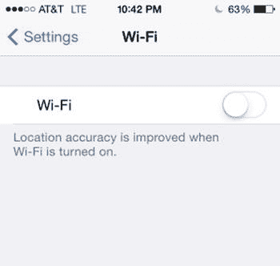
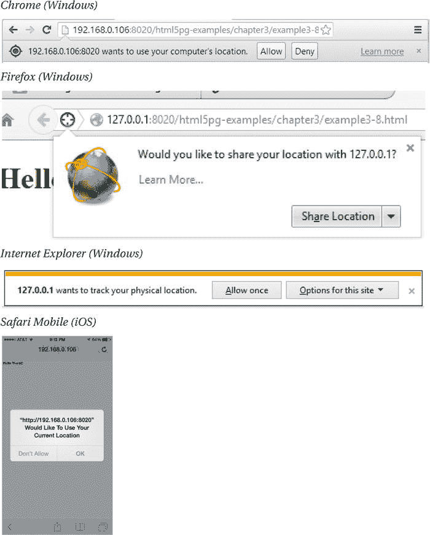
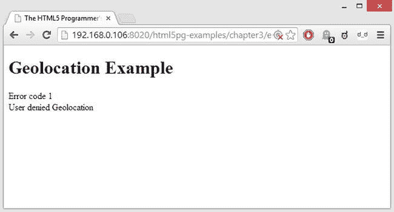
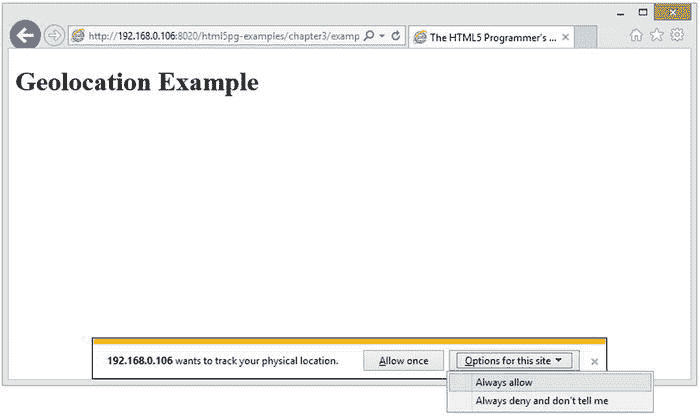
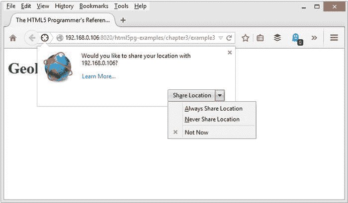
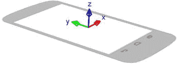
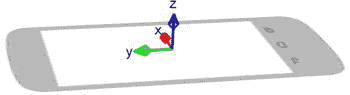
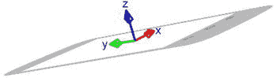
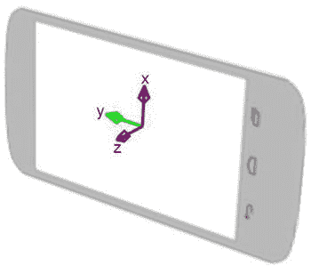

# 五、相关标准

HTML5 标准涵盖了大量内容，但它并不是 W3C 开发的唯一新的 web 技术。有一系列技术也是对网络平台的增强，但不属于 HTML5 的范畴。在这一章中，我将介绍一些更令人兴奋的新技术，特别关注为移动设备设计的技术。

地理位置〔??〕

维持价

**优秀**

所有现代浏览器都支持这些特性，并且在最近的三个版本中都有。

W3C 推荐:`http://www.w3.org/TR/geolocation-API/`

地理定位是确定托管浏览器的设备的物理位置的能力，通常是根据纬度和经度。地理定位对于移动设备非常重要，它与地图应用、提醒、紧急应答器甚至游戏(如 Ingress 参见`https://www.ingress.com/`。

设备可以使用多种技术来确定您的位置:

*   **GPS 卫星** **:** 几乎所有现代智能手机和其他移动设备都有能够与全球定位系统卫星通信的收发器。
*   **蜂窝塔** **:** 使用三角测量算法，可以根据蜂窝设备与蜂窝塔的通信来确定其位置(大致)。
*   **Wi-Fi 地图** **:** Wi-Fi 接入点往往非常固定且范围有限，因此只需带着支持 Wi-Fi 的设备四处行驶，就可以创建 Wi-Fi 接入点的“地图”。使用这样的地图，人们可以根据给定设备的范围内有哪些 Wi-Fi 接入点来确定该设备的大致位置。
*   **蓝牙映射** **:** 类似 Wi-Fi 映射；最适合近距离地理定位。
*   **IP 地址映射** **:** 对于非移动设备，可以根据其外部 IP 地址确定其位置。一些公司提供 IP 地址映射服务。

所有这些方法都不精确，并且有它们自己的局限性，但是当一起使用时，它们可以提供设备的精确位置。但是，不能保证它们将返回设备的实际位置，或者以有用的准确度返回。

不过，当它们配合良好时，就有可能相当精确地定位设备。这就是为什么当你的 Wi-Fi 关闭时，大多数移动设备会警告你地理定位的准确性会受到影响。例如，当你关闭 iPhone 上的 Wi-Fi 无线电时，iOS 会警告你，你的定位精度会降低，如图图 5-1 所示。



图 5-1 。iOS 定位精度

隐私考虑

显然，地理定位有严重的隐私问题。定位和跟踪设备——以及携带设备的人——是一项强大的功能。因此，所有浏览器都实现了警告系统，通知用户他们的位置将被跟踪。当你的应用第一次访问地理定位 API 时，浏览器会通知用户并给他们阻止定位的选项。这些警告旨在引起注意，但因浏览器而异(图 5-2 )



图 5-2 。来自各种浏览器的地理位置警告

在所有的浏览器中，你的脚本都会暂停并等待用户对对话框做出响应。如果用户选择允许地理定位，脚本将继续。如果用户决定阻止地理定位，API 将抛出一个错误。

当您构建支持地理定位的应用时，考虑用户的隐私和安全需求非常重要:

*   您应该只在需要时请求位置数据。这对于隐私/安全和移动设备电池寿命都很重要，因为地理位置查询会激活移动设备中的多个无线电，因此会非常消耗电池。
*   您应该只请求满足您特定目的所需的足够的地理位置信息。
*   您应该仅将该信息用于特定目的，并且一旦达到目的，您应该从内存中清除地理位置数据。
*   您应该小心您的应用如何共享和传输地理位置数据。地理位置数据在任何网络上的任何传输都应该是安全的，以防止未经授权的访问。
*   如果您的应用需要将地理位置数据发送到服务器进行进一步处理，那么您应该更加小心服务器软件处理和存储数据的方式，牢记物理安全和法律后果。

这些似乎是显而易见的准则，事实上它们是处理任何敏感信息的基本准则。但是当你忙于编码时，很容易忽略这些简单的想法，所以一定要从一开始就把它们包含在你的工作中。

你也应该对你的用户透明，你的应用收集和处理地理位置数据。你应该告诉他们:

*   你收集什么数据；
*   你为什么收集它；
*   您是否共享或传输数据，以及您采取了哪些安全措施来保护该通信；和
*   您是否存储数据，以及您采取什么安全措施来保护存储。如果您确实存储了这些信息，您应该告诉他们您如何保护这些信息，以及用户如何从您的存储中删除他们的信息。

如果可能的话，您还应该为用户提供一种选择退出应用地理定位功能的方式。当然，有时这是不实际的，但是为用户提供一种控制这种特性的方法将对建立信任有很大帮助。

地理定位 API

地理定位 API 指定了一个新的`navigator.geolocation`对象。这个对象有三个新方法来访问浏览器和托管设备 的地理定位功能。由于解析设备的位置可能需要未知的时间量(脚本将第一次暂停，并在继续之前等待用户响应许可对话框，然后必须查询各种定位方法，每个方法可能需要未知的时间量)，这些方法是异步的，并提供了注册成功和错误回调函数的方法。

 **提示**你可以使用承诺(在移动浏览器中得到很好的支持)来帮助简化异步动作的代码。参见附录 A 中关于承诺的部分。

*   `navigator.geolocation.getCurrentPosition` `(successCallback, errorCallback, PositionOptions)`:成功返回位置时调用`successCallback`，出错时调用`errorCallback`。当调用`successCallback`时，它将接收一个`Position`对象作为参数，当调用`errorCallback`时，它将接收一个`PositionError`对象作为参数。
*   `navigator.geolocation.watchPosition` `(successCallback, errorCallback, PositionOptions)`:立即返回一个`PositionWatch`标识，然后每次设备位置变化时调用`successCallback`函数。如果尝试解析位置失败，则调用`errorCallback`。当调用`successCallback`时，它将接收一个`Position`对象作为参数，当调用`errorCallback`时，它将接收一个`PositionError`对象作为参数。
*   `navigator.geolocation.clearWatch` `(PositionWatch)`:停止由`PositionWatch`值指定的`watchPosition`呼叫。

此外，API 定义了三个新的对象模板:`PositionOptions`对象、`Position`对象和`PositionError`对象。`PositionOptions`对象为`getCurrentPosition`和`watchPosition`方法提供了一个接口来微调查询和结果，如下所示。

```html
PositionOptions = {
  // Specifies whether the query should return the most accurate location possible
  boolean enableHighAccuracy,
  // The number of milliseconds to wait for the device to return a location
  number timeout,
  // The number of milliseconds a cached value can be used.
  number maximumAge
}
```

`Position`对象定义了在成功解析主机设备的位置时将由`getCurrentPosition`和`watchPosition`方法返回的响应，如下所示。

```html
Position = {
  object coords : {
    // The latitude in decimal degrees.
    number latitude,
    // The longitude in decimal degrees.
    number longitude,
    // The altitude in meters above nominal sea level.
    number altitude,
    // The accuracy of the latitude and longitude values, in meters.
    number accuracy,
    // The accuracy of the altitude value, in meters.
    number altitudeAccuracy,
    // The current heading of the device in degrees clockwise from true north.
    number heading,
    // The current ground speed, in meters per second.
    number speed,
  },
  // The time when the location query was successfully created.
  date timestamp
}
```

注意，根据浏览器对地理定位标准的实现和主机设备的能力，用于`altitude`、`accuracy`、`altitudeAccuracy`、`heading`和`speed`的值可以作为`null`返回。

`PositionError`对象定义了如果用户拒绝允许地理定位，或者如果设备无法解析其位置时将返回的响应，如下所示。

```html
PositionError = {
  // The numeric code of the error (see table below).
  number code,
  // A human-readable error message.

  string message
}
```

`PositionError.code`的有效代码为整数，如表 5-1 所示。

表 5-1 。有效`PositionError`代码

| 

密码

 | 

常数

 | 

描述

 |
| --- | --- | --- |
| Zero | `UNKNOWN_ERROR` | 由于未知错误，设备无法解析其位置。 |
| one | `PERMISSION_DENIED` | 应用没有使用地理定位服务的权限，通常是由于用户拒绝权限。 |
| Two | `POSITION_UNAVAILABLE` | 设备无法解析其位置，因为服务不可用。(通常在各种所需的无线电被停用时返回，例如当移动设备处于“飞行模式”时) |
| three | `TIMEOUT` | 设备无法在`PositionOptions.timeout`指定的超时限制内解析其位置。 |

使用这个 API 最简单的例子是做一个简单的位置查询 并显示所有返回的值，如清单 5-1 所示。

***清单 5-1*** 。地理定位 API 的基本查询

```html
<!DOCTYPE html>
<html>
    <head>
        <title>The HTML5 Programmer’s Reference</title>
    </head>
    <body>
      <h1>Geolocation Example</h1>
      <div id="locationValues">
      </div>
      <div id="error">
      </div>
      <script>
/**
 * The success callback function for getCurrentPosition.
 * @param {Position} position The position object returned by the geolocation
 *     services. 
 */
function successCallback(position) {
  console.log(’success’)
  // Get a reference to the div we’re going to be manipulating.
  var locationValues = document.getElementById(’locationValues’);

  // Create a new unordered list that we can append new items to as we enumerate
  // the coords object.
  var myUl = document.createElement(’ul’);

  // Enumerate the properties on the position.coords object, and create a list
  // item for each one. Append the list item to our unordered list.
  for (var geoValue in position.coords) {
    var newItem = document.createElement(’li’);
    newItem.innerHTML = geoValue + ’ : ’ + position.coords[geoValue];
    myUl.appendChild(newItem);
  }

  // Add the timestamp.
  newItem = document.createElement(’li’);
  newItem.innerHTML = ’timestamp : ’ + position.timestamp;
  myUl.appendChild(newItem);

  // Enumeration complete. Append myUl to the DOM.
  locationValues.appendChild(myUl);
}

/**
 * The error callback function for getCurrentPosition.
 * @param {PositionError} error The position error object returned by the
 *     geolocation services.
 */
function errorCallback(error) {
  var myError = document.getElementById(’error’);
  var myParagraph = document.createElement(’p’);
  myParagraph.innerHTML = ’Error code ’ + error.code + ’\n’ + error.message;
  myError.appendChild(myParagraph);
}

// Call the geolocation services.
navigator.geolocation.getCurrentPosition(successCallback, errorCallback);
      </script>
    </body>
</html>
```

首先，这个例子创建了一个成功的回调函数，它枚举了`Position`对象的属性。这样做的时候，它会将它们添加到一个无序列表中，这个列表会附加到 DOM 中，这样您就可以看到它了。错误回调的行为与此类似，只是它不生成列表，而是简单地更新一个段落的内容。

第一次运行这个示例时，您的浏览器应该提示您获得访问地理位置 API 的权限。第一次通过时，拒绝权限，这样您就可以看到错误情况是什么样子了。图 5-3 显示了在 Chrome 中生成的页面。



图 5-3 。Chrome 中列表 5-1 的错误情况

您可以看到错误处理程序是用错误代码 1 调用的。错误消息的实际文本因浏览器而异(例如，Internet Explorer 11 使用错误消息“此站点无权使用地理定位 API。”)但是错误码是一样的。

地理定位规范没有定义必须呈现给用户的权限模型，这就是为什么每个浏览器都有不同的做法。说明书只是说，

未经用户明确许可，用户代理不得向网站发送位置信息。用户代理必须通过用户界面获得许可，除非他们与用户有预先安排的信任关系，如下所述。用户界面必须包括文档 URI 的主机组件。通过用户界面获得的并且在当前浏览会话之后(即，在浏览上下文被导航到另一个 URL 的时间之后)被保留的那些权限必须是可撤销的，并且用户代理必须尊重被撤销的权限。

一些用户代理将具有预先安排的信任关系，不需要这样的用户界面。例如，当网站执行地理定位请求时，网络浏览器将呈现用户界面，而当使用位置信息来执行 E911 功能时，VOIP 电话可能不呈现任何用户界面。

因此，用户如何授予或拒绝地理位置许可、该决定被记住多长时间以及用户如何在以后改变主意，都取决于浏览器制造商来决定和实现。

例如，在 Internet Explorer 中，用户会看到一个弹出窗口，允许他们选择一些有趣的选项，如图 5-4 所示。



图 5-4 。Internet Explorer 中的地理位置许可选项 11

如果用户选择“允许一次”或“总是允许”，脚本将继续运行，浏览器将尝试解析客户端的位置。“允许一次”选项可能应该读作“允许此浏览会话”，因为该权限一直有效，直到用户关闭并重新启动浏览器。此时，重新访问页面会重新提示用户。选项“Always allow”如你所料地起作用:一旦用户选择了它，他们将不再被提示许可。“总是拒绝且不要告诉我”选项在此时以及用户每次访问该页面时拒绝权限。他们永远不会被重新提示权限，他们可以撤销此决定的唯一方法是打开 Windows 的 Internet 选项对话框，选择“隐私”选项卡，然后单击“位置”部分中的“清除站点”按钮，这将清除授予或拒绝所有站点的所有永久权限。

Firefox 呈现给用户的是完全不同的交互，如图图 5-5 所示。



图 5-5 。火狐 29 中的地理位置许可选项

如果用户选择“共享位置” ，脚本将继续运行，浏览器将尝试解析客户端的位置。但是，与 Internet Explorer 不同的是，此权限不适用于当前的浏览器会话，而仅适用于当前对网站的访问。重新加载页面将立即再次提示用户权限。用户不必重启浏览器。“总是共享位置”选项授予共享位置的永久权限，而“从不共享位置”则作为页面权限的永久拒绝。选择“不是现在”或单击弹出窗口右上角的×图标，或单击弹出窗口之外的任何地方，将关闭弹出窗口，而不授予或拒绝权限，并将使您的应用挂起。可以通过点击 URL 旁边的“目标”图标来重新打开弹出窗口，但这并不一定是显而易见的。这种行为是有意的；参见相关的 Bugzilla bug，`https://bugzilla.mozilla.org/show_bug.cgi?id=675533`，获取解释。

只有在 iOS 上的 Safari Mobile 中，权限弹出窗口才是真正的模态弹出窗口，需要用户做出响应，除非他们做出选择，否则不能被取消。在所有其他情况下，用户可以忽略(在 Firefox 中完全忽略)弹出窗口，让您的脚本等待执行回调。更糟糕的是，处于这种未定义状态的时间不计入您可能用`PositionOption.timeout`指定的任何超时——只有在用户授予权限并且浏览器开始尝试解析位置后，计时器才开始运行。

为了解决这个问题，您需要实现一个全局超时计时器，该计时器在脚本访问地理位置 API 时开始运行。如果用户授予(或拒绝)权限，我们的常规回调应该发生，这个全局计时器应该被取消。如果用户不授予(或拒绝)权限，全局计时器应该执行一个回调来做一些事情—例如，将浏览器重定向到一个错误页面，向用户解释他们需要做什么才能继续。或者，如果您的应用不需要 GPS，全局计时器回调应该取消成功和错误回调，您的应用可以继续。

很容易将这样的全局计时器添加到清单 5-1 的中，如清单 5-2 中的所示。

***清单 5-2*** 。注册全局超时

```html
<!DOCTYPE html>
<html>
    <head>
        <title>The HTML5 Programmer’s Reference</title>
    </head>
    <body>
      <h1>Geolocation Example</h1>
      <div id="locationValues">
      </div>
      <div id="error">
      </div>
      <script>
// Create the variable that will hold the timer reference.
var globalTimeout = null;

/**
 * The success callback function for getCurrentPosition.
 * @param {Position} position The position object returned by the geolocation
 *     services.
 */
function successCallback(position) {
  // Check the state of the global timeout. If it is null, the application has
  // timed out and we should not continue. If it isn’t null, the timeout timer
  // is still running, so we should cancel it and continue.
  if (globalTimeout == null) {
    return;
  } else {
    clearTimeout(globalTimeout);
  }

  // Get a reference to the div we’re going to be manipulating.
  var locationValues = document.getElementById(’locationValues’);

  // Create a new unordered list that we can append new items to as we enumerate
  // the coords object.
  var myUl = document.createElement(’ul’);

  // Enumerate the properties on the position.coords object, and create a list
  // item for each one. Append the list item to our unordered list.
  for (var geoValue in position.coords) {
    var newItem = document.createElement(’li’);
    newItem.innerHTML = geoValue + ’ : ’ + position.coords[geoValue];
    myUl.appendChild(newItem); 
  }

  // Add the timestamp.
  newItem = document.createElement(’li’);
  newItem.innerHTML = ’timestamp : ’ + position.timestamp;
  myUl.appendChild(newItem);

  // Enumeration complete. Append myUl to the DOM.
  locationValues.appendChild(myUl);
}

/**
 * The error callback function for getCurrentPosition.
 * @param {PositionError} error The position error object returned by the
 *     geolocation services.
 */
function errorCallback(error) {
  // Check the state of the global timeout. If it is null, the application has
  // timed out and we should not continue. If it isn’t null, the timeout timer
  // is still running, so we should cancel it and continue.
  if (globalTimeout == null) {
    return;
  } else {
    clearTimeout(globalTimeout);
  }
  var myError = document.getElementById(’error’);
  var myParagraph = document.createElement(’p’);
  myParagraph.innerHTML = ’Error code ’ + error.code + ’\n’ + error.message;
  myError.appendChild(myParagraph);
}

/**
 * The callback to execute if the whole process times out, specifically in the
 * situation where a user ignores the permissions pop-ups long enough.
 */
function globalTimeoutCallback() {
  alert(’Error: GPS permission not given, exiting application.’);
  globalTimeout = null;
}

// Call the geolocation services.
navigator.geolocation.getCurrentPosition(successCallback, errorCallback);

// Start the timer for the global timeout call.
globalTimeout = setTimeout(globalTimeoutCallback.bind(this), 5000);
      </script>
    </body>
</html>
```

这个例子做的第一件事是定义一个`globalTimeout`变量，它将保存计时器的标识符，当它启动地理定位请求时，计时器将启动。接下来，注意在`successCallback`和`errorCallback`函数中，它检查了`globalTimeout`变量的状态。如果变量是`null`，全局超时已经过期，代码不应该继续执行那些函数。如果不是`null`，定时器仍然是活动的，所以代码应该取消它并继续。

接下来，它提供了一个`globalTimeoutCallback`函数 ，简单地向用户发出一条消息。在实际的应用中，您可能希望在这里做一些更有用的事情——例如，将用户重定向到另一个页面。代码还将`globalTimeout`变量设置为`null`，这样，如果任何一个回调以某种方式被执行，它们将不会继续通过初始的全局超时检查。

最后，它在调用地理位置 API 后立即设置运行 的计时器。计时器设定为五秒钟。当您加载此页面时，您将看到以下内容之一:

*   如果您已经永久拒绝了对该页面的地理位置许可，那么`errorCallback`将会执行并且全局计时器将会被取消。将不显示任何权限弹出窗口。
*   如果您已经永久地允许了对页面的地理位置许可，那么`successCallback`将会执行，全局计时器将会被取消。将不显示任何权限弹出窗口。
*   如果您尚未永久授予或拒绝权限，将显示权限弹出窗口。您可以选择在全局超时计时器过期之前授予或拒绝权限，在这种情况下，将执行适当的回调，全局计时器将被取消。或者您可以什么都不做，等待全局计时器超时。发生这种情况时，将会出现警告消息。

在任何情况下，都不能以编程方式强制用户选择权限。他们必须通过浏览器提供的对话框进行权限选择。

从用户交互的角度来看，这有点令人遗憾，因为这意味着你的应用会让浏览器显示一个你无法控制的通知。一些用户可能会发现这令人担忧，并选择拒绝许可，甚至完全关闭浏览器，永远不返回您的应用。如果你已经向你的用户公开了你的应用是如何收集和存储地理位置信息的，他们会为这种互动做好准备，并且更愿意给予许可，因为他们知道你的应用将如何处理这些数据。

动画定时

维持价

**好的**

所有现代的浏览器都支持这些特性，并且在最近的两个版本中都有。

W3C 候选推荐:`http://www.w3.org/TR/animation-timing/`

动画计时标准旨在帮助您构建基于 JavaScript 的可视化动画。如果您曾经尝试过使用 JavaScript 手工制作动画，您可能对绘制周期的简单模式很熟悉:

*   创建一个 draw 函数，负责增量地“绘制”动画项目:定位元素、更改元素属性、在一个`canvas`元素上绘制等等。每次调用这个函数时，它都会产生一个完整的动画“帧”，就像您正在手工绘制动画帧，然后在电影中放映一样。
*   每隔几毫秒调用一次 draw 函数。

JavaScript 绘制周期通常使用计时器实现，计时器每隔几毫秒调用一次绘制函数。在清单 5-3 中可以看到一个例子。

***清单 5-3*** 。基于定时器的绘制周期的 JavaScript 实现

```html
<!DOCTYPE html>
<html>
    <head>
        <title>The HTML5 Programmer’s Reference</title>
        <style>
#target-element {
  width: 100px;
  height: 100px;
  background-color: #ccc;
  position: absolute;
  top: 100px;
  left: 0px;
}
        </style>
    </head>
    <body>
      <h1>Simple Animation Example</h1>
      <div id="target-element"></div>
      <script>
// Get a reference to the element we want to move.
var targetEl = document.getElementById(’target-element’);

// Create a variable to keep track of its position.
var currentPosition = 0;

/**
 * Draws the animation by updating the position on the target element and incrementing
 * the position variable by 1.
 */
function draw() {
  if (currentPosition > 500) {
    // Stop the animation, otherwise it would run indefinitely.
    clearInterval(animInterval);
  } else {
    // Update the element’s position.
    targetEl.style.left = currentPosition++ + ’px’;
  }
}

// Initiate the animation timer.
var animInterval = setInterval(draw, 17);
      </script>
    </body>
</html>
```

这个例子使用一个 JavaScript 定时器来更新页面上一个 div 的位置。更新之间的间隔是 17 毫秒。这不是一个任意的数字。大多数显示器的刷新频率是 60Hz，因此大多数浏览器都试图将屏幕重绘频率限制在 60Hz 以内。每秒 60 个周期大约是 17 毫秒。再快一点，你就会丢失“帧”

根据运行本示例所使用的浏览器和系统，这个动画可能看起来很流畅，也可能有点不流畅。那是因为这是一个动画的蛮力方法，没有考虑到浏览器如何重绘页面。它只是命令屏幕更新，浏览器必须尽最大努力。此外，不能保证动画更新之间的时间是 17 毫秒。`setInterval`方法只是将更新添加到浏览器的 UI 队列中，如果浏览器忙于做其他事情(比如调整窗口大小，或者可能在后台获取和呈现其他内容)，这很容易陷入困境，从而延迟屏幕呈现。

总的来说，这种方法扩展性不好。随着动画数量和复杂性的增加，以及它们所在的页面的复杂性和交互能力的增加，这些基于定时器的动画队列变得越来越低效。

动画计时规范通过提供一个新的计时器:`requestAnimationFrame`解决了基于 JavaScript 的计时器的问题。从语法上来说，这个方法的使用类似于现有的 JavaScript 定时器方法`setInterval`和`setTimeout`。然而，在幕后，这种新方法与浏览器的屏幕管理算法紧密相连。因此，`requestAnimationFrame`有一些重要的好处:

*   用`requestAnimationFrame`排队的动画被浏览器优化成一个回流/重画周期。
*   使用`requestAnimationFrame`排队的动画可以很好地播放来自其他来源的动画，比如 CSS 过渡。
*   浏览器将停止不可见的浏览器标签中的动画。这在移动设备上非常重要，因为密集的动画会快速消耗电池电量。

该规范在全局上下文中创建了两个新方法:

*   `requestAnimationFrame(callback)`:请求将功能`callback`作为下一个动画周期的一部分执行。回调将接收一个时间戳作为参数。像`setTimeout`和`setInterval`，`requestAnimationFrame`返回一个可以用来停止循环的标识符。
*   `cancelAnimationFrame(identifier)`:取消标识符标识的动画帧请求。

将清单 5-3 更新为使用`requestAnimationFrame` 很容易，如清单 5-4 所示。

***清单 5-4*** 。清单 5-3 使用`requestAnimationFrame`重写

```html
<!DOCTYPE html>
<html>
    <head>
        <title>The HTML5 Programmer’s Reference</title>
        <style>
#target-element {
  width: 100px;
  height: 100px;
  background-color: #ccc;
  position: absolute;
  top: 100px;
  left: 0px;
}
        </style>
    </head>
    <body>
      <h1>Simple requestAnimationFrame Example</h1>
      <div id="target-element"></div>
      <script>
var targetEl = document.getElementById(’target-element’);
var currentPosition = 0;

/**
 * Updates the position on the target element, the increments the position
 * counter by 1.
 */
function animateElement() {
  // Stop the animation, otherwise it would run indefinitely.
  if (currentPosition <= 500) {
    requestAnimationFrame(animateElement);
  }
  // Update the element’s position.
  targetEl.style.left = currentPosition++ + ’px’;
}

// Initiate the animation timer.
animateElement();
      </script>
    </body>
</html>
```

这个例子更新了`animateElement`函数来使用`requestAnimationFrame`。每次调用该方法时，它都会更新元素的位置并递增位置计数器。它还安排自己通过`requestAnimationFrame`再次呼叫。一旦元素到达 500 像素的位置，动画就会停止。

使用动画计时构建绘制周期管理器也很容易。绘制周期管理器将允许你注册动画函数(如清单 5-4 中的`animateElement`函数)，并开始、停止和暂停绘制周期。清单 5-5 展示了一个简单的绘制周期管理器。

***清单 5-5*** 。拉伸循环管理器

```html
<!DOCTYPE html>
<html>
    <head>
        <title>The HTML5 Programmer’s Reference</title>
        <style>
.animatable {
  width: 100px;
  height: 100px;
  background-color: #ccc;
  position: absolute;
  top: 110px;
  left: 0px;
}
#elementTwo {
  top: 220px;
}
        </style>
    </head>
    <body>
      <h1>Simple Animation Framework Example</h1>
      <div class="animatable" id="elementOne"></div>
      <div class="animatable" id="elementTwo"></div>
      <button id="startAnimation">Start Animation</button>
      <button id="togglePause">Toggle Pause</button>
      <button id="stopAnimation">Stop Animation</button>
      <button id="registerOne">Register Animation One</button>
      <button id="unregisterOne">Unregister Animation One</button>
      <button id="registerTwo">Register Animation Two</button>
      <button id="unregisterTwo">Unregister Animation Two</button>
      <script>

// Get references to the elements we will be animating, and create position
// tracking variables for them.
var elementOne = document.getElementById(’elementOne’);
var elOnePosition = 0;
var elementTwo = document.getElementById(’elementTwo’);
var elTwoPosition = 0;

/**
 * Animates Element One by incrementally updating its left position. Animation
 * stops at 500px.
 */
function animateElementOne() {
  if (elOnePosition <= 500) {
    elementOne.style.left = elOnePosition++ + ’px’;
  } else {
    // Done animating, so remove this animation from the draw cycle manager.
    myCycle.removeAnimation(animateElementOne);
    // Reset the counter so we can animate again. The function can be
    // re-registered and will work as before.
    elOnePosition = 0;
  }
}

/**
 * Animates Element Two by incrementally updating its left position. Animation
 * stops at 500px. 
 */
function animateElementTwo() {
  if (elTwoPosition <= 500) {
    elementTwo.style.left = elTwoPosition++ + ’px’;
  } else {
    // Done animating, so remove this animation from the draw cycle manager.
    myCycle.removeAnimation(animateElementTwo);
    // Reset the counter so we can animate again. The function can be
    // re-registered and will work as before.
    elTwoPosition = 0;
  }
}

/**
 * Creates a draw cycle object that will repetitively draw animation functions.
 * @constructor
 * @returns {Object} A new draw cycle object.
 */
var DrawCycle = function() {
  var newCycle = {
    /**
     * The identifier for the current animation frame loop.
     * @type {Number}
     */
    animationPointer: null,

    /**
     * @type {Boolean}
     */
    isPaused: false,

    /**
     * The array of animation callbacks.
     * @type {!Array.<Function>}
     */
    arrCallbacks: [],

    /**
     * Starts the animation cycle.
     */
    startAnimation: function() {
      // Like other JavaScript timers, requestAnimationFrame sets the execution
      // context of its callbacks to the global execution context (the window
      // object). We need the execution context to be ’this’, the newCycle
      // object we’re creating. By using the bind method (which exists on
      // Function.prototype) we are able to override the default execution
      // context with the one we need.
      this.animationPointer = window.requestAnimationFrame(this.draw.bind(this));
    },

    /**
     * Stops the animation cycle.
     */
    stopAnimation: function() {
      window.cancelAnimationFrame(this.animationPointer);
    },

    /**
     * Pauses the invocation of the animation functions each draw cycle. If set
     * to true, the animation functions will not be invoked. If set to false,
     * the functions will be invoked.
     * @type {Boolean}
     */
    pauseAnimation: function(boolPause) {
      this.isPaused = boolPause;
    },

    /**
     * Adds an animation function to the draw cycle.
     * @param {Function}
     */
    addAnimation: function(callback) {
      if (this.arrCallbacks.indexOf(callback) == -1) {
        this.arrCallbacks.push(callback);
      }
    },

    /**
     * Removes an animation function from the draw cycle.
     * @param {Function}
     */
    removeAnimation: function(callback) {
      var targetIndex = this.arrCallbacks.indexOf(callback);
      if (targetIndex > -1) {
        this.arrCallbacks.splice(targetIndex, 1);
      }
    },

    /**
     * Draws any registered animation functions (assuming they are not paused)
     * and then kicks off another animation cycle.
     * You should not need to call this method directly.
     * @private
     */
    draw: function() {
      if (!this.isPaused) {
        var i = 0, arrCallbacksLength = this.arrCallbacks.length;
        for (i = 0; i < arrCallbacksLength; i++) {
          this.arrCallbacks[i]();
        }
      }
      this.startAnimation();
    }
  };
  return newCycle;
};

// Create a new draw cycle object.
var myCycle = new DrawCycle();

// Register a callback for the Start Animation button that starts the animation
// cycle.
var startAnimation = document.getElementById(’startAnimation’);
startAnimation.addEventListener(’click’, function() {
  myCycle.startAnimation();
}, false);

// Register a callback for the Pause Animation button that pauses/unpauses the
// animation cycle.
var pauseAnimation = document.getElementById(’togglePause’);
pauseAnimation.addEventListener(’click’, function() {
  myCycle.pauseAnimation(!myCycle.isPaused);
}, false);

// Register a callback for the Stop Animation button that stops the animation
// cycle.
var stopAnimation = document.getElementById(’stopAnimation’);
stopAnimation.addEventListener(’click’, function() {
  myCycle.stopAnimation();
}, false);

// Register a callback for the Register Animation One button that adds the
// animation function for element one to the draw cycle object.
var registerOne = document.getElementById(’registerOne’);
registerOne.addEventListener(’click’, function() {
  myCycle.addAnimation(animateElementOne);
}, false); 

// Register a callback for the Unregister Animation One button that removes the
// animation function for element one from the draw cycle object.
var unregisterOne = document.getElementById(’unregisterOne’);
unregisterOne.addEventListener(’click’, function() {
  myCycle.removeAnimation(animateElementOne);
}, false);

// Register a callback for the Register Animation Two button that adds the
// animation function for element two to the draw cycle object.
var registerTwo = document.getElementById(’registerTwo’);
registerTwo.addEventListener(’click’, function() {
  myCycle.addAnimation(animateElementTwo);
}, false);

// Register a callback for the Unregister Animation Two button that removes the
// animation function for element two from the draw cycle object.
var unregisterTwo = document.getElementById(’unregisterTwo’);
unregisterTwo.addEventListener(’click’, function() {
  myCycle.removeAnimation(animateElementTwo);
}, false);
      </script>
    </body>
</html>
```

此示例创建一个构造函数，为您提供一个新的绘制周期对象，该对象为处理动画提供了一个简化的 API。主要的 API 方法有:

*   `addAnimation(animationFunction)`:注册绘图循环的动画功能。每次绘制周期运行时，`animationFunction`将被调用。
*   `removeAnimation(animationFunction):`取消绘制循环的动画功能。
*   `startAnimation()`:开始动画绘制循环。当被调用时，这个方法将使用对象的`draw`方法作为回调来调用`requestAnimationFrame`，从而启动一个单独的循环。该方法存储循环的标识符，以便以后需要时可以取消它。
*   `stopAnimation()`:停止动画绘制循环。当被调用时，这个方法用由`startAnimation`存储的标识符调用`cancelAnimationFrame`。
*   `pauseAnimation(boolPause)`:暂停或不暂停调用已注册的动画功能。绘制周期仍在运行，但没有调用任何动画功能。

使用这个动画 API 很简单:

1.  使用构造函数创建绘制循环的新实例。
2.  注册一个或多个动画回调，您希望在每个绘制周期调用它们。
3.  开始动画循环。

当你调用`startAnimation` 时，它从浏览器请求一个动画帧，用`draw`方法作为回调。浏览器在适当的时候调用`draw`方法。`draw`方法调用所有注册的动画函数(假设动画没有暂停)，从而完成一个循环。然后它调用`startAnimation`开始新的周期。

您可以根据需要动态添加新的动画功能；它们将在下一个绘制周期自动调用。您也可以根据需要移除动画功能。每个动画方法还会在完成时将其自身从绘制循环中移除，并重置其计数器。您可以在此时重新注册动画功能，动画将再次出现。注意，即使没有注册动画函数，绘制周期也会继续运行，所以当你移除最后一个动画函数时，你也应该确保调用`stopAnimation`方法 。

选择器

维持价

**优秀**

所有现代浏览器都支持这些特性，并且在最近的四个版本中都有。

W3C 候选人推荐:`http://www.w3.org/TR/selectors/`

新的选择器标准提供了访问 DOM 中元素的新方法。以前，访问 DOM 中元素的主要方式是使用`getElementById`方法、使用遍历或者两者的组合。有了新的选择器标准，您可以基于元素的 CSS 选择器直接访问元素。

选择器标准从 jQuery 等流行的 JavaScript 框架中得到启示，这些框架大量使用了选择器。如果您熟悉 jQuery、Prototype、Dojo 或任何其他使用选择器的 JavaScript 库，您会发现新的选择器 API 非常熟悉。

选择器标准定义了元素抽象类的两个新方法:

*   `querySelector(cssSelectorList)`:返回对第一个元素的直接引用，该元素匹配指定的逗号分隔的`cssSelectorList`中的所有 CSS 选择器。如果没有匹配，返回`null`。
*   `querySelectorAll(cssSelectorList)`:返回一个`NodeList`对象，该对象包含所有在逗号分隔的`cssSelectorList`中指定的 CSS 选择器的匹配。如果没有匹配的元素，返回一个没有成员的`NodeList`。

 **注意** `NodeList`对象看起来很像数组，因为它们有可以通过数字索引访问的成员元素，以及一个反映成员数量的`length`属性。然而，`NodeList`对象直接从`Object`原型继承，而不是从`Array`原型继承，所以它们没有任何您可能会想到的数组方法(例如`Array.forEach`)。

使用新的选择器 API，您可以轻松地获得对 DOM 元素的直接引用，而不需要大量遍历，也不需要在标记中添加只用于 JavaScript 选择器的 id。这可以帮助您保持标记和 JavaScript 代码的整洁。此外，您会发现自己经常在 JavaScript 和 CSS 中使用相同的选择器，因为您需要设计样式的元素通常也是脚本需要访问的元素。

我在书中的例子中一直使用选择器 API。下面是一些其他的例子，可以帮助说明这个 API 有多么强大:

*   属性选择器:`[attribute=value]`允许您根据 DOM 元素的指定属性来定位它们。这在选择分配了数据属性的元素时特别有用。您也可以使用模式匹配:
    *   `[att^=’val’]`选择属性以字母“val”开头的元素
    *   `[att$=’lue’]`选择其`att`属性以字母“lue”结尾的元素
    *   `[att*=’val’]`选择其`att`属性包含字母“val”的元素
*   元素状态伪类允许您根据状态伪类定位 DOM 元素。特别有用的是`:enabled`(选择启用的表单域)、`:disabled`(选择禁用的表单域)和`:checked`(选择选中的复选框和单选按钮)。
*   否定伪类 : `not(selector)`以不匹配指定选择器的 DOM 元素为目标。
*   结构化伪类允许您根据 DOM 元素在 DOM 结构中的位置来定位它们。特别有用的是:
    *   `:nth-child(n)`选择其父元素的第 n 个子元素
    *   `:nth-last-child(n)`选择其父元素的第 n 个子元素，从最后一个子元素开始向后计数
    *   `:nth-of-type(n)`选择其类型的第 n 个兄弟元素
    *   `:nth-last-of-type(n)`选择其类型的第 n 个兄弟元素，从最后一个兄弟元素开始向后计数
    *   `:last-child`选择父元素的最后一个子元素
    *   `:first-of-type`和`:last-of-type`选择其类型的第一个或最后一个同级元素
    *   `:only-child`选择其父元素的唯一子元素

因为`querySelector`和`querySelectorAll`方法是元素方法，所以可以在任何元素上使用它们。这将匹配选择器的搜索限制在该元素的后代，如清单 5-6 中的所示。

***清单 5-6*** 。将选择器查询限制到包含元素

```html
<!DOCTYPE html>
<html>
    <head>
        <title>The HTML5 Programmer’s Reference</title>
    </head>
    <body>
      <p class="selectme">This has the selectme class, but will not be clickable.</p>
      <div class="noselect">
        <p class="selectme">This has the selectme class, but will not be clickable.</p>
      </div>
      <div class="selectable">
        <p class="selectme">This has the selectme class, and will be clickable.</p>
      </div>
      <script>
// Get a reference to the containing element we want to search.
var selectable = document.querySelector(’.selectable’);

// Get a reference to the paragraph.
var targetPar = selectable.querySelector(’.selectme’);

// Give the target paragraph an event handler for the click event.
targetPar.addEventListener(’click’, function() {
  alert(’I was clicked!’);
});
      </script>
    </body>
</html>
```

这个简单的例子将所需选择器的搜索限制在指定的`div`元素。这相当于使用选择器`".selectable .selectme"`。这种技术对于选择事件目标的后代特别有用。

设备方向

维持价

**穷**

该 API 仅在具有必要硬件的设备上有用，这些设备通常是移动设备。移动浏览器对这个 API 的支持相当不错，除了 Internet Explorer Mobile，它根本没有实现这个 API。Internet Explorer 11 支持 API，Chrome 和 Firefox 也支持，但 Safari 不支持。

W3C 工作草案:`http://www.w3.org/TR/orientation-event/`

大多数移动和手持设备都包含灵敏的陀螺仪，使设备能够知道自己在空间中的方向。设备定向 API 为主机设备提供了一个标准 API，以便与基于浏览器的应用共享这些信息。

 **注意**这个特殊的标准已经经历了频繁的变化，以响应行业反馈。因此，大多数浏览器制造商都没有全面实施。我在新闻发布时展示了该标准的当前版本，因为我认为这是一个值得报道的重要特性，尽管它还处于草案状态。

该标准指定了一组在窗口对象上触发的新事件，以及结果事件对象上的新数据属性。通过为这些事件注册事件侦听器，您可以访问这些数据属性。

`compassneedscalibration`事件

根据标准，`compassneedscalibration`事件在`window`对象上触发,“当用户代理确定用于获取方位数据的罗盘需要校准时”然而，没有说明用户代理应该做什么来校准自己，或者如何与开发人员或最终用户沟通。出于这个原因，这个事件目前在 Firefox 中被禁用(参见`https://bugzilla.mozilla.org/show_bug.cgi?id=738121`)。其他移动用户代理可能会触发这个事件，尽管我从未见过它发生。

像任何其他事件一样，您只需在`window`对象上为它注册一个事件处理程序，如下面的代码片段所示:

```html
window.addEventListener(’compassneedscalibration’, function(event) {
  alert(’Your compass needs calibration. Wave your device in a figure-8 motion.’);
}, false);
```

`deviceorientation`事件

根据该标准，`deviceorientation`事件在`window`对象上触发“每当发生显著的方向变化”，但是将“显著变化”的定义留给浏览器制造商。实际上，这个事件似乎会定期在`window`对象上触发，甚至对于完全静止在桌子上的设备也是如此。

`deviceorientation`事件的事件对象是一个`DeviceOrientationEvent`对象，它具有以下属性:

*   `DeviceOrientationEvent.alpha`:旋转的阿尔法角度。
*   `DeviceOrientationEvent.beta`:旋转的β角。
*   `DeviceOrientationEvent.gamma`:旋转的伽玛角度。

如果你熟悉欧拉角，那么阿尔法角、贝塔角和伽马角就是 Z-X'-Y "类型的泰特-布赖恩角。为了形象化这些角度，想象一个设备平放在桌子上，如图图 5-6 所示。



图 5-6 。平放在桌子上的装置

围绕 z 轴旋转将使 x 轴和 y 轴平移旋转量，如图图 5-7 所示。



图 5-7 。绕 z 轴旋转

由此产生的角度被称为*阿尔法角度*。

围绕 x 轴旋转将使 z 轴和 y 轴平移旋转量，如图图 5-8 所示。



图 5-8 。绕 x 轴旋转

由此产生的角度被称为*β角*。

最后，绕 y 轴旋转会使 x 轴和 z 轴平移旋转量，如图图 5-9 所示。



图 5-9 。绕 y 轴旋转

由此产生的角度被称为*伽玛角度*。

如何使用这些角度的明确示例是根据 gamma 和 beta 角度在屏幕上移动 DOM 元素。因为角度从正到负变化，您可以简单地将角度的舍入值添加到相关纵坐标的当前值:对于 x 纵坐标，您使用伽马角度，对于 y 纵坐标，您使用β角度。设备倾斜得越多，角度越大，坐标上的增量越大，元素移动得越快，如清单 5-7 所示。

***清单 5-7*** 。在屏幕上移动球

```html
<!DOCTYPE html>
<html>
    <head>
      <meta name="viewport" content="width=device-width, user-scalable=no">
        <title>The HTML5 Programmer’s Reference</title>
        <style>
#container {
  position: absolute;
  top: 220px;
  left: 50px;
  width: 204px;
  height: 204px;
  border: 1px solid red;
}
#ball {
  width: 10px;
  height: 10px;
  position: absolute;
  top: 0px;
  left: 0px;
  background-color: red;
  border-radius: 50%;
}
        </style>
    </head>
    <body>
      <h1>Device Orientation Demonstration</h1>
      <ul>
        <li>Alpha: <span id="alpha"></span></li>
        <li>Beta: <span id="beta"></span></li>
        <li>Gamma <span id="gamma"></span></li>
        <li>y-pos <span id="ypos"></span></li>
        <li>x-pos <span id="xpos"></span></li>
      </ul>
      <div id="container">
        <div id="ball"></div>
      </div>
      <script>
// Get references to the various DOM elements we will be manipulating.
var alpha = document.getElementById(’alpha’);
var beta = document.getElementById(’beta’);
var gamma = document.getElementById(’gamma’);
var ypos = document.getElementById(’ypos’);
var xpos = document.getElementById(’xpos’);
var ball = document.getElementById(’ball’);

// Initialize x and y coordinates.
var yposit = 0;
var xposit = 0;

/**
 * Handles a deviceorientation event on the window object.
 * @param {DeviceOrientationEvent} event A standard device orientation event.
 */
function handleDeviceOrientation(event) {
  // Update the DOM with the raw event data.
  alpha.innerHTML = event.alpha;
  beta.innerHTML = event.beta;
  gamma.innerHTML = event.gamma;
  // Use the raw data to get x and y coordinates for the ball.
  xposit = getCoord(event.gamma, xposit);
  xpos.innerHTML = xposit;
  yposit = getCoord(event.beta, yposit); 
  ypos.innerHTML = yposit;
  ball.style.top = yposit + ’px’;
  ball.style.left = xposit + ’px’;
}

/**
 * Increments a coordinate based on an angle from the device orientation event.
 * @param {number} angle The orientation angle.
 * @param {number} coord The coordinate to increment.
 */
function getCoord(angle, coord) {
  // First, get a delta value from the angle.
  var delta = Math.round(angle);
  var tempVal = coord + delta;
  // Limit the incremented value to between 0 and 194.
  if (tempVal > 0) {
    coord = Math.min(194, tempVal);
  } else {
    coord = 0;
  }
  return coord;
}

// Register the event handler.
window.addEventListener(’deviceorientation’, handleDeviceOrientation, false);
      </script>
    </body>
</html>
```

此示例在屏幕上显示原始事件数据，并使用该原始事件数据来确定元素在屏幕上的坐标。在这种情况下，它会限制元素的位置，使其保持在其包含元素的内部。

`devicemotion`事件

`devicemotion`事件定期在`window`对象上触发，并产生一个`DeviceMotionEvent`类型的事件。`DeviceMotionEvent`有四个属性:`acceleration`(其值代表设备沿 x、y 和 z 轴的加速度，单位为米/秒平方)、`accelerationIncludingGravity`(包括地球重力影响的加速度值，如果有的话)、`rotationRate`(α、β和γ角度的旋转速率，单位为度/秒)和`interval`(该信息从硬件刷新的频率，单位为毫秒)。总的来说,`DeviceMotionEvent`的模式如下所示:

```html
object DeviceMotionEvent = {
  object acceleration: {
    number x,
    number y,
    number z
  },
  object accelerationIncludingGravity: {
    number x,
    number y,
    number z
  },
  object rotationRate: {
    number alpha,
    number beta,
    number gamma
  }
  number interval
}
```

你可以很容易地显示这些值，如清单 5-8 所示。

***清单 5-8*** 。显示`devicemotion`事件的值

```html
<!DOCTYPE html>
<html>
    <head>
      <meta name="viewport" content="width=device-width, user-scalable=no">
        <title>The HTML5 Programmer’s Reference</title>
    </head>
    <body>
      <h1>Device Motion Demonstration</h1>
      <ul>
        <li>acceleration:
          <ul>
            <li id="accX">x: <span class="current"></span>,<br>
              max: <span class="max"></span></li>
            <li id="accY">y: <span class="current"></span>,<br>
              max: <span class="max"></span></li>
            <li id="accZ">z: <span class="current"></span>,<br>
              max: <span class="max"></span></li>
          </ul>
        </li>
        <li>accelerationIncludingGravity:
          <ul>
            <li id="aigX">x: <span class="current"></span>,<br>
              max: <span class="max"></span></li>
            <li id="aigY">y: <span class="current"></span>,<br>
              max: <span class="max"></span></li>
            <li id="aigZ">z: <span class="current"></span>,<br>
              max: <span class="max"></span></li>
          </ul>
        </li>
        <li>rotationRate:
          <ul>
            <li id="rrAlpha">alpha: <span class="current"></span>,<br>
              max: <span class="max"></span></li>
            <li id="rrBeta">beta: <span class="current"></span>,<br>
              max: <span class="max"></span></li>
            <li id="rrGamma">gamma: <span class="current"></span>,<br>
              max: <span class="max"></span></li>
          </ul>
        </li>
      </ul>
      <script>
// Create a data structure to store the references to the various DOM elements
// we will be manipulating, as well as associated maximum values. The structure
// also includes an interface method for processing incoming data and mapping
// it to the correct DOM elements.
var motionValues = {
  acceleration : {
    x : {
      domCurr : document.querySelector(’#accX .current’),
      domMax : document.querySelector(’#accX .max’),
      maxVal : 0
    },
    y : {
      domCurr : document.querySelector(’#accY .current’),
      domMax : document.querySelector(’#accY .max’),
      maxVal : 0
    },
    z : {
      selector : ’#accZ’,
      domCurr : document.querySelector(’#accZ .current’),
      domMax : document.querySelector(’#accZ .max’),
      maxVal : 0
    }
  },
  accelerationIncludingGravity : {
    x : {
      domCurr : document.querySelector(’#aigX .current’),
      domMax : document.querySelector(’#aigX .max’),
      maxVal : 0
    },
    y : {
      domCurr : document.querySelector(’#aigY .current’),
      domMax : document.querySelector(’#aigY .max’),
      maxVal : 0
    },
    z : {
      selector : ’#accZ’,
      domCurr : document.querySelector(’#aigZ .current’),
      domMax : document.querySelector(’#aigZ .max’),
      maxVal : 0
    }
  },
  rotationRate : {
    alpha : {
      domCurr : document.querySelector(’#rrAlpha .current’),
      domMax : document.querySelector(’#rrAlpha .max’),
      maxVal : 0
    },
    beta : {
      domCurr : document.querySelector(’#rrBeta .current’),
      domMax : document.querySelector(’#rrBeta .max’),
      maxVal : 0
    },
    gamma : {
      selector : ’#accZ’,
      domCurr : document.querySelector(’#rrGamma .current’),
      domMax : document.querySelector(’#rrGamma .max’),
      maxVal : 0
    }
  },

  /**
   * Processes an acceleration value object of a specific type. The values are
   * enumerated and mapped to their associated DOM elements for display.
   * @param {string} valueType The type of the value object, one of
   *     ’acceleration’, ’accelerationIncludingGravity’, or ’rotationRate’.
   * @param {object} valueObject The object containing the acceleration data.
   */
  processValues : function(valueType, valueObject) {
    // First, get a reference to the subproperty of the motionValues object we
    // will be manipulating.
    var mvRef = this[valueType];
    // Enumerate the valueObject and process each property.
    for (property in valueObject) {
      // Convenience references to the current values we’re working with.
      var currMVRef = mvRef[property];
      var currVal = valueObject[property];
      // Update the DOM to display the current value.
      currMVRef.domCurr.innerHTML = currVal;
      // If the current value is larger than the last stored maximum value,
      // update the stored max value to match and display it in the DOM.
      if (currVal > currMVRef.maxVal) {
        currMVRef.maxVal = currVal;
        currMVRef.domMax.innerHTML = currVal;
      }
    }
  }
};

/**
 * Handles a devicemotion event on the window object.
 * @param {DeviceMotionEvent} event A standard device motion event object.
 */
function handleDeviceMotion(event) {
  motionValues.processValues(’acceleration’, event.acceleration);
  motionValues.processValues(’accelerationIncludingGravity’,
      event.accelerationIncludingGravity);
  motionValues.processValues(’rotationRate’, event.rotationRate);
}

// Register the event handler.
window.addEventListener(’devicemotion’, handleDeviceMotion, false);
      </script>
    </body>
</html>
```

因为有许多值要显示，而且由于有了`DeviceMotionEvent`模式，许多数据都是专门构造的，清单 5-8 通过创建一个具有相似模式的对象来开始这个例子。对于每个单独的属性，它存储一个显示其当前值的元素的 DOM 引用，一个显示所达到的最大值的元素的 DOM 引用，以及最大值本身。它还包括一个简单的接口方法，将`DeviceMotionEvent`子属性映射到对象中相关联的子属性，并更新 DOM 以反映新信息。

为了使用这个例子，你需要移动你的设备。这些值是加速度的，加速度是速度的变化率(而速度是位置的变化率)。为了看到可观的价值，你需要相当快地移动你的设备。沿着不同的运动轴摇动你的设备就足够了。小心握紧你的手机，以免不小心把它扔了。将为您记录各个轴上的最大加速度值，以便您在移动设备后可以看到它们。您也可以旋转设备来查看旋转速度。

web GL(web GL)

维持价

**好的**

所有现代桌面浏览器至少在最近两个版本中都支持这些特性，只有 Internet Explorer 例外，它从版本 11 开始才支持这些特性。移动支持很差，因为 iOS 的移动 Safari 目前不支持 WebGL，尽管苹果已经承诺在 iOS 版本 8 中提供全面支持。

规格:`http://www.khronos.org/webgl/`

Web Graphics Library (WebGL) 是一个 API，用于在 HTML `canvas`元素中绘制复杂的 2d 和 3d 图形。WebGL API 在给定的`canvas`元素上呈现为绘图上下文，就像你在第四章中探索的标准绘图上下文一样。就像标准的`canvas`绘图上下文一样，WebGL 绘图上下文可以通过一个扩展的 API 在 JavaScript 中访问。许多 WebGL 任务，如图像处理，被委托给主机系统的图形处理单元，而不是由系统的主 CPU 处理，因此提供了显著的速度提升。

与本书中涉及的大多数其他标准不同，WebGL 标准不是由 W3C 或 WHATWG 维护的。该标准由非营利技术联盟 Khronos Group 维护。这种语言本身基于 OpenGL 语言，是 2009 年 Mozilla 在 3d 渲染方面的实验的产物。WebGL 目前的稳定版本是 1.0.2。WebGL 2 的工作始于 2013 年。

初始化 WebGL 绘图上下文非常类似于在`canvas`元素中初始化标准绘图上下文，如清单 5-9 所示。

***清单 5-9*** 。初始化 WebGL 绘图上下文

```html
<!DOCTYPE html>
<html>
    <head>
        <title>The HTML5 Programmer’s Reference</title>
        <style>
canvas {
  border: 1px solid #000;
}
        </style>
    </head>
    <body>
      <canvas id="myCanvas" width="200" height="200">Did You Know: Every time
        you use a browser that doesn’t support HTML5, somewhere a kitten
        cries. Be nice to kittens, upgrade your browser!
      </canvas>
      <script>
var myCanvas = document.getElementById(’myCanvas’);
var myGlContext = myCanvas.getContext(’webgl’);
      </script>
    </body>
</html>
```

这个例子使用了`getContext`方法，就像你在第四章中所做的一样。不同之处在于，它没有为 2d 绘图上下文提供参数`’2d’`，而是提供了`’webgl’`参数来指定 WebGL 绘图上下文。你可以很容易地将它扩展成一个函数，它甚至提供了一个根据需要初始化上下文的地方，如清单 5-10 所示。

***清单 5-10*** 。WebGL 初始化函数

```html
<!DOCTYPE html>
<html>
    <head>
        <title>The HTML5 Programmer’s Reference</title>
        <style>
canvas {
  border: 1px solid #000;
}
        </style>
    </head>
    <body>
      <canvas id="myCanvas" width="200" height="200">Did You Know: Every time
        you use a browser that doesn’t support HTML5, somewhere a kitten
        cries. Be nice to kittens, upgrade your browser!
      </canvas>
      <script>
/**
 * Returns a WebGL drawing context on a specified canvas element. If opt_setup
 * is provided and set to true, this method also performs some basic
 * initialization on the context.
 * @param {!Element} targetCanvas The reference to the desired canvas element.
 * @param {boolean} opt_setup Whether or not to perform additional setup on the
 *     context.
 * @return {Object} The WebGL drawing context, or null if WebGL is not supported
 *     or was otherwise unavailable.
 */
function initWebGLOnCanvas(targetCanvas, opt_setup) {
  // If opt_setup was not specified, set it to false. In JavaScript, null and
  // undefined are == to each other and nothing else, so:
  if (opt_setup == null) {
    opt_setup = false;
  }

  // Try and get the context.
  var glContext = targetCanvas.getContext(’webgl’);
  if (glContext == null) {
    // Try falling back to an experimental version, works on some older browsers.
    glContext = targetCanvas.getContext(’experimental-webgl’);
    if (glContext == null) {
      // We were unable to get a WebGL context. Provide a warning diagnostic
      // message on the console, in case anyone is looking.
      console.warn(’WebGL is not supported in this browser.’);
    }
  }

  // If there is a context and setup was requested, do the setup.
  if ((opt_setup === true) && (glContext != null)) {
    // Set the clear color to black (rgba).
    glContext.clearColor(0.0, 0.0, 0.0, 1.0);
    // Initialize the depth function so that objects that are closer in
    // perspective hide things that are further away.
    glContext.depthFunc(glContext.EQUAL);
    // Enable depth testing.
    glContext.enable(glContext.DEPTH_TEST);
    // Clear both the color and the depth buffer.
    glContext.clear(glContext.COLOR_BUFFER_BIT|glContext.DEPTH_BUFFER_BIT);
  }
  return glContext;
}

var myCanvas = document.getElementById(’myCanvas’);
var myGLContext = initWebGLOnCanvas(myCanvas, true);
      </script>
    </body>
</html>
```

这个示例扩展了初始化函数，以检测获取 WebGL 上下文是否有问题，并回退到较旧浏览器上存在的较旧语法。如果根本无法获取上下文，就会向控制台输出一个警告。运行此示例将在浏览器中产生一个黑色方块。

在撰写本文时，Firefox 正在 WebGL 初始化过程中将大量 Windows、MacOS、Linux 和 Android 图形驱动程序列入黑名单。如果你有这些驱动，Firefox 默认情况下不会初始化一个 WebGL 绘图上下文。如果您在 Firefox 中运行这个示例，并且在控制台中看到警告消息，那么您的设置很可能被列入黑名单。有关如何覆盖该块的详细信息和说明，请参见`https://wiki.mozilla.org/Blocklisting/Blocked_Graphics_Drivers`。另一种选择是使用具有不太脆弱的 WebGL 实现的浏览器(Chrome 的 WebGL 实现相当稳固)。

 **注意**直到最近，iOS 上的 Safari Mobile 还不支持 WebGL。Safari 8.1 引入了完整的 WebGL 支持。

WebGL 是一种广泛的语言，完全涵盖它以及您可以用它做的一切超出了本书的范围。如果你想了解更多，请查看 Brian Danchilla 的《HTML5 的 WebGL 入门》。

挽救（saving 的简写）

维持价

**优秀**

所有现代浏览器都支持 SVG，并且至少支持最近的三个版本。

W3C 推荐:`http://www.w3.org/TR/SVG11/`

可缩放矢量图形(SVG) 是一种用于创建光栅图形、矢量图形和文本的图形格式。使用 SVG 可以轻松地对图形对象(在 SVG 中定义的和从外部文件导入的，如常规图像文件)进行分组和操作。

大多数图形格式(如可移植网络图形[PNG]格式)由二进制数据组成。SVG 图形是使用 XML 标记定义的，因此可以使用简单的文本编辑器轻松创建，就像网页一样。因为 SVG 图形是在 XML 标记中定义的，所以内容可以很容易地被扫描和索引。这使得 SVG 比其他图形格式更容易访问。

如上所述，SVG 标记可以像`canvas`元素一样生成光栅图形。它还可以生成矢量图形，矢量图形是由包括点、线和曲线的数学函数定义的图形。光栅图形和矢量图形的主要区别在于矢量图形比光栅图形的缩放性更好。因此，SVG 定义的矢量图形是移动应用的最佳选择，因为它们在任何分辨率和大小下都保持清晰。

与 WebGL 一样，SVG 是一个大型标准，全面介绍它超出了本文的范围。

摘要

在这一章中，我探索了一些 JavaScript APIs，它们不是 HTML5 标准的一部分，但经常与 HTML5 特性结合使用。他们中的许多人也有令人兴奋的移动用途。

*   地理定位 API 让您的 JavaScript 应用能够访问移动设备的地理定位功能。您可以使用这个 API 来编写激动人心的新的位置感知移动应用。我还介绍了使用地理定位时重要的隐私考虑事项。
*   动画计时通过提供与浏览器窗口绘制直接相关的新计时器，提供了制作平滑动画的工具。
*   选择器 API 提供了一种使用 CSS 选择器轻松访问 DOM 元素的方法。
*   设备定位 API 让您的 JavaScript 应用能够访问移动设备的定位特性。您可以使用这个 API 来创建响应宿主移动设备移动的应用。
*   最后，我简要介绍了两项激动人心的新技术，WebGL 和 SVG。

使用这些具有 HTML5 特性的 API 将使您能够在各种设备上构建激动人心的动态应用。

在第六章中，你将深入 HTML5 的实际开发，包括从头开始构建一个完整的 HTML5 手机游戏。