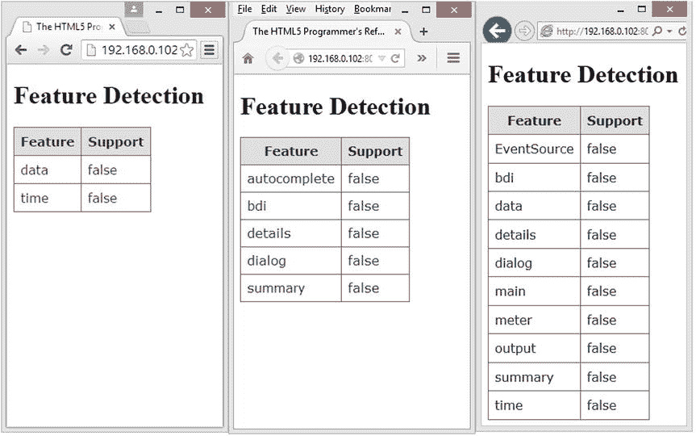
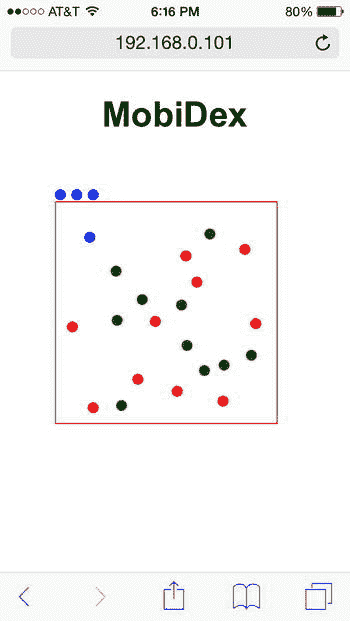

# 六、实用 HTML5

现在我已经介绍了 HTML5 及其相关技术，是时候用它们来构建一些东西了。这一章将集中讨论如何使用 HTML5。它将涵盖浏览器兼容性问题，包括功能检测、polyfills 和 shims，以及设计用于 HTML5 的库。最后，你将从头到尾完成一个完整的 HTML5 项目。

我将从定义项目的需求开始，找出如何最好地实现它，然后按方法分解实现方法。

浏览器支持

使用 HTML5 的最大障碍是浏览器支持。如果你正在做一个必须支持很多旧浏览器的项目，你将很快遇到主流浏览器不支持的问题。这对于桌面浏览器来说尤其是个问题；Internet Explorer 直到版本 9 才支持 HTML5 的基本语义标签。移动浏览器很好地实现了 HTML5 特性，因为它们往往来自更新的代码库。然而，即使是移动浏览器也有支持问题。例如，许多运行早于版本 4 的 Android 操作系统的手机将拥有不支持几个现代功能的浏览器。

您的应用如何处理浏览器支持是一个重要的决定。您可以决定只支持每个浏览器的最新版本。这将保证您的应用可以访问最广泛的 HTML5 特性，但可能会将那些停留在旧浏览器或操作系统上的用户拒之门外。

更常见的是，要求您的应用支持至少几个修订版的浏览器版本。这意味着您的用户将试图在可能不支持您需要的 HTML5 特性的浏览器中使用您的应用。在这种情况下，您必须选择您的应用应该如何运行，但是最初的选择将基于检测该特性是否受支持。使用脚本来确定给定的特性是否受支持被称为“特性检测”，您可以轻松地测试大多数 HTML5 特性。

特征检测速成班

特性检测是 HTML 开发者的一个重要工具，它允许你根据当前浏览器的能力定制你的应用。根据相关功能的实现方式，有多种功能检测技术，例如，作为现有对象的属性或方法，或者作为新元素类型。

检测 JavaScript 属性和方法

许多新的 HTML5 JavaScript APIs 被实现为现有对象的新属性或方法，如`window`、`document`或`navigator`。如果你试图在不支持这些特性的浏览器中访问这些特性，JavaScript 引擎会产生一个错误，你的脚本会嘎然而止，如清单 6-1 所示。

***清单 6-1*** 。调用不存在的方法

```html
<!DOCTYPE html>
<html>
    <head>
        <title>The HTML5 Programmer’s Reference</title>
    </head>
    <body>
    <h1>Feature Detection</h1>
      <script>
// Attempt to invoke a fake method foo() on the window object
window.foo()
      </script>
    </body>
</html>
```

当您运行这个示例时，它将产生一个错误，如果您打开浏览器的 JavaScript 控制台，就可以看到这个错误。如果这是在一个更大的脚本中，它将使整个脚本停止，这是一个非常灾难性的结果。

当您试图访问一个不存在的属性时，结果会稍微微妙一些。简单地读取一个不存在的属性将返回`undefined`的值，但实际上不会使脚本崩溃，如清单 6-2 所示。

***清单 6-2*** 。访问不存在的属性

```html
<!DOCTYPE html>
<html>
    <head>
        <title>The HTML5 Programmer’s Reference</title>
    </head>
    <body>
    <h1>Feature Detection</h1>
      <script>
// Attempt to access a fake property bar on the window object
alert(window.bar);
      </script>
    </body>
</html>
```

如果您运行这个脚本，它将完美地工作，并且警告弹出窗口将包含文本“undefined”该脚本不会抛出错误，并将继续运行。然而，在 JavaScript 中，`undefined` 是一个特定的值和它自己的数据类型，所以如果你试图进一步操作它(就像你访问一个真实的属性一样)，结果可能会令人惊讶，如清单 6-3 所示。

***清单 6-3*** 。`undefined`到底是什么？

```html
<!DOCTYPE html>
<html>
    <head>
        <title>The HTML5 Programmer’s Reference</title>
    </head>
    <body>
    <h1>Feature Detection</h1>
      <script>
// Compare undefined with basic data types
alert(window.bar + 5);
alert(window.bar + ’ is its own data type’);
alert(window.bar == true);
alert(window.bar == false);
if (window.bar) {
  alert(’undefined is equal to true’);
}
if (!window.bar) {
  alert(’undefined is equal to false’);
}
if (window.bar == null) {
  alert(’undefined and null are equal’);
}
if (!(window.bar === null)) {
  alert(’undefined and null are not strictly equal’);
}
      </script>
    </body>
</html>
```

当您运行这个脚本时，您会发现`undefined`不太适合处理数字；即使是简单的加法运算也会产生值`NaN`(表示“不是一个数字”)。虽然`undefined`不存在，但它有一个字符串值“未定义”并且当`undefined`不等于`true`或`false`时，出于流量控制的目的，它被评估为`false`。最后，您可以使用类型转换或“弱”相等操作符(`==`)和严格相等操作符(`===`)来测试`undefined`和`null`如何彼此相等。弱相等运算符会自动解决操作数之间的类型差异，而严格相等运算符则不会。在`undefined`和`null`的情况下，当使用弱运算符时，这两个值彼此相等，但是由于它们具有不同的基本数据类型，因此它们无法通过严格的相等测试。

 **提示** `undefined` vs. `null` :重要的是要记住，虽然这些行为可能违反直觉，但它们实际上是由 ECMAScript 标准很好地定义的，并且是该语言的实际特征。请记住，`undefined`作为一个值是指任何没有被赋值的属性，而`null`是指故意缺少值。

为了充分解释这些行为，我必须深入讨论 JavaScript 数据类型以及该语言如何为弱等式运算符`==`解决数据类型差异，这超出了本章的范围。不管怎样，清单 6-3 展示了一种检测 JavaScript 对象上属性存在的方法，并给出了可预测的结果。如清单 6-4 所示，该方法也适用于检测方法，并且不会抛出错误。

***清单 6-4*** 。检测 JavaScript 对象上的属性和方法

```html
<!DOCTYPE html>
<html>
    <head>
        <title>The HTML5 Programmer’s Reference</title>
    </head>
    <body>
    <h1>Feature Detection</h1>
      <script>
// To check for a method foo() on the window object, check to see if it is
// defined
if (window.foo) {
  alert(’Method foo() is available’);
} else {
  alert(’Method foo() is not available’);
}

// To check for a property bar on the window object use the same test.
if (window.bar) {
  alert(’Property bar is available’);
} else {
  alert(’Property bar is not available’);
}
      </script>
    </body>
</html>
```

当您运行清单 6-4 时，它将显示`window.foo()`和`window.bar`都不可用，并且脚本不会抛出任何错误。使用这种方法很容易检测出真正的 HTML5 特性，如清单 6-5 所示。

***清单 6-5*** 。检测 HTML5 JavaScript APIs

```html
<!DOCTYPE html>
<html>
    <head>
        <title>The HTML5 Programmer’s Reference</title>
    </head>
    <body>
    <h1>Feature Detection</h1>
      <script>
if (window.postMessage) {
  alert(’The postMessage feature is available on this browser!’);
} else {
  alert(’The postMessage feature is not available on this browser’);
}

if (window.localStorage) {
  alert(’The localStorage feature is available on this browser!’);
} else {
  alert(’The localStorage feature is not available on this browser’);
}
      </script>
    </body>
</html>
```

当您运行此示例时，您将发现`postMessage`和`localStorage`功能在您的浏览器上是否可用。

同样的方法也用于检测新的 HTML5 事件接口，比如新的设备运动和方向事件。不是直接检查事件处理程序(如`ondevicemotion`)的存在，而是检查事件接口是否存在(如清单 6-6 中的`window.DeviceMotionEvent`)。

***清单 6-6*** 。检测对事件接口的支持

```html
<!DOCTYPE html>
<html>
    <head>
        <title>The HTML5 Programmer’s Reference</title>
    </head>
    <body>
    <h1>Feature Detection</h1>
      <script>
if (window.DeviceMotionEvent) {
  alert(’This browser supports the device motion API!’);
} else {
  alert(’This browser does not support the device motion API.’);
}
      </script>
    </body>
</html>
```

检测对新 HTML5 元素的支持

有两种主要方法来检测对新元素的支持:

*   创建元素的实例，然后测试预期属性和方法的结果。如果浏览器不知道如何实现元素，那么期望的属性将是`undefined`。这个测试对于像`canvas`和`video`这样的元素很有用，它们实现了自己独特的属性和方法。
*   创建元素的实例，然后测试它实现的接口。如果浏览器不知道如何实现元素，它将实现`HTMLUnknownElement`接口(详见下文)。该测试对于不实现唯一属性和方法的元素(如结构元素)很有用。

清单 6-7 展示了第一种方法。

***清单 6-7*** 。检测对画布元素的支持

```html
<!DOCTYPE html>
<html>
    <head>
        <title>The HTML5 Programmer’s Reference</title>
    </head>
    <body>
    <h1>Feature Detection</h1>
      <script>

// Test for canvas support.
var testCanvas = document.createElement(’canvas’);
if (testCanvas.getContext) {
  alert(’This browser supports the canvas element!’);
} else {
  alert(’This browser does not support the canvas element.’);
}

// We are done with the test element, so delete it.
testCanvas = null;

      </script>
    </body>
</html>
```

这个例子创建了一个`canvas`元素，然后测试是否存在`getContext`方法。如果浏览器知道如何正确实现`canvas`元素，方法就会出现，否则就是`undefined`。

 **提示**创建用于测试的元素而不将它们附加到 DOM 是一件相当安全的事情。这些元素存在于内存中(因此会占用物理内存空间)，但不是 DOM 的一部分，不会影响文档的其余部分。因为它们占用内存，所以当不再需要它们时，最好通过将它们的引用设置为 null 来删除它们。

检测预期的属性和方法仅适用于实现基本元素属性和方法之外的唯一属性或方法的元素。像`article`或`aside`这样没有实现唯一属性或方法的元素呢？答案就在 HTML 标准定义的界面层次结构中。

HTML 标准定义了一个名为`HTMLElement` 的基本接口，它具有一组所有 HTML 元素共有的属性和方法:`title`、`lang`、`focus`、`blur`等等。该标准还定义了一组继承自它的子接口，如`HTMLDivElement`、`HTMLTitleElement`等。大多数受支持的元素都继承自这些子接口，因此共享`HTMLElement`接口的基本属性和方法。该标准还为不支持的元素定义了一个名为`HTMLUnknownElement`的子接口。您可以使用`document.createElement`创建任意元素；如果元素不受支持，它将从`HTMLUnknownElement`接口继承。

确定一个特定元素实现哪个接口很简单，只需检查元素的`toString`方法。当你在一个元素上调用那个方法时，它将输出它实现的接口的名称，如清单 6-8 所示。

***清单 6-8*** 。确定 HTML 元素实现的接口

```html
<!DOCTYPE html>
<html>
    <head>
        <title>The HTML5 Programmer’s Reference</title>
    </head>
    <body>
    <h1>Feature Detection</h1>
      <script>

// Create a div.
var myDiv = document.createElement(’div’);
alert(myDiv.toString());

// Create a fake element.
var myFake = document.createElement(’itsafake’);
alert(myFake.toString());

// Delete elements now that they are no longer needed.
myDiv = myFake = null;
      </script>
    </body>
</html>
```

这个例子创建了两个元素，一个`div`和一个假元素，然后调用每个元素的`toString`方法。如您所见，`itsafake`元素实现了`HTMLUnknownElement`接口。这给了你一个测试不受支持元素的简单方法，如清单 6-9 所示。

***清单 6-9*** 。测试支持的元素

```html
<!DOCTYPE html>
<html>
    <head>
        <title>The HTML5 Programmer’s Reference</title>
    </head>
    <body>
    <h1>Feature Detection</h1>
      <script>

// Test for support for the article element.
var myArticle = document.createElement(’article’);
if (myArticle.toString().indexOf(’HTMLUnknownElement’) > -1) {
  alert (’This browser does not support the article element.’);
} else {
  alert(’This browser supports the article element.’);
}

// Create a fake element and test for support. 
var myFake = document.createElement(’itsafake’);
if (myFake.toString().indexOf(’HTMLUnknownElement’) > -1) {
  alert(’This browser does not support the itsafake element’);
} else {
  alert(’This browser supports the itsafake element’);
}

myArticle = myFake = null;
      </script>
    </body>
</html>
```

在这个例子中，通过检查每个元素的`toString`方法返回的值中是否存在子串`’HTMLUnknownElement’`，来测试对`article`元素和`itsafake`元素的支持。

检测对新元素属性的支持

HTML5 还定义了一组全新的属性，可以应用于元素，比如`placeholder`或`draggable`。检测对这些属性的支持很简单:只需创建一个元素并设置所需的属性，然后测试该属性是否保持其值。设置值时，一定要设置为合适的类型；一些属性(比如`autocomplete`和`placeholder`)将期望字符串作为值，而其他属性(比如`autofocus`和`draggable`)将需要布尔值。如果在测试中设置了不正确的类型，就会产生假阴性。清单 6-10 展示了使用这种技术来测试对`input`元素上`placeholder`属性的支持。

***清单 6-10*** 。测试属性支持

```html
<!DOCTYPE html>
<html>
    <head>
        <title>The HTML5 Programmer’s Reference</title>
    </head>
    <body>
    <h1>Feature Detection</h1>
      <script>

// Test for support for the new placeholder attribute on input elements.
var testPlaceholderText = ’Test placeholder text’;
var testInput = document.createElement(’input’);
testInput.setAttribute(’placeholder’, testPlaceholderText);
if (testInput.placeholder === testPlaceholderText) {
  alert (’This browser supports the placeholder attribute on input elements’);
} else {
  alert (’This browser does not support the placeholder attribute on input elements’);
}

// To prove the method works, test for an attribute we know doesn’t exist.
testInput.setAttribute(’fakeattr’, testPlaceholderText);
if (testInput.fakeattr === testPlaceholderText) {
  alert (’This browser supports the fakeattr attribute on input elements’);
} else {
  alert (’This browser does not support the fakeattr attribute on input elements’);
}

// We are done with the test element, so delete it.
testInput = null;

      </script>
    </body>
</html>
```

这个示例还演示了在不支持属性的情况下它会失败(在这种情况下，您只需虚构一个属性并对其进行测试)。

显然，这种技术要求目标对象实现一个`setAttribute`方法。因此，它不能用于检测`window`或`navigator`元素上的特征，因为它们没有`setAttribute`方法。

构建功能检测脚本

现在您已经知道如何测试各种 HTML5 特性，您可以构建一个测试所有特性的脚本。首先创建一个构造函数，当调用该函数时，它将运行特性检测测试并返回一个包含所有结果的对象。每个结果将是对象上的一个命名属性，根据对该特性的支持设置为`true`或`false`。该对象还将有三个方便的方法:

*   `getTests` :这个方法将返回一个按字母顺序排列的所有被测试特性的数组。
*   `getTestResults` :该方法将返回一个数组，其中包含所有被测试特性的所有结果。单个结果将由一个对象组成，该对象的`feature`属性被设置为该特性的名称，而`isSupported`属性将被设置为`true`或`false`，这取决于该特性是否受支持。
*   `getFailedTestResults` :该方法将返回一个数组，其中包含所有测试失败的特性的所有结果，这些特性在当前浏览器中不受支持。

清单 6-11 给出了检测脚本的完整清单。

***清单 6-11*** 。HTML5 功能检测脚本

```html
<!DOCTYPE html>
<html>
    <head>
        <title>The HTML5 Programmer’s Reference</title>
        <style>

table {
  font-family: verdana,arial,sans-serif;
  color: #333;
  border-width: 1px;
  border-color: #666;
  border-collapse: collapse;
}
th {
  border-width: 1px;
  padding: 8px;
  border-style: solid;
  border-color: #666;
  background-color: #dedede;
}
td {
  border-width: 1px;
  padding: 8px;
  border-style: solid;
  border-color: #666;
  background-color: #fff;
}

        </style>
    </head>
    <body>
    <h1>Feature Detection</h1>
    <table id="supported">
      <tr><th>Feature</th><th>Support</th></tr>
    </table>
      <script>

/**
 * Detects support for various HTML5 features.
 * @constructor
 * @returns {Object} An object with properties for each feature, each
 *     set to true or false depending on support.
 */
function DetectHTML5Support() {
  var returnVal = {};

  // Test for HTML5 APIs on the window object.
  var apisToTest = [’EventSource’, ’postMessage’, ’sessionStorage’,
      ’localStorage’, ’Worker’, ’requestAnimationFrame’,
      ’cancelAnimationFrame’, ’DeviceMotionEvent’, ’DeviceOrientationEvent’];
  for (i = 0; i < apisToTest.length; i++) {
    var currApi = apisToTest[i];
    returnVal[currApi] = (window[currApi] != undefined);
  }

  // Test for HTML5 APIs on the navigator object.
  var apisToTest = [’geolocation’]; 
  for (i = 0; i < apisToTest.length; i++) {
    var currApi = apisToTest[i];
    returnVal[currApi] = (navigator[currApi] != undefined);
  }

  // Test for HTML5 APIs on the document object.
  var apisToTest = [’querySelector’, ’querySelectorAll’];
  for (i = 0; i < apisToTest.length; i++) {
    var currApi = apisToTest[i];
    returnVal[currApi] = (document[currApi] != undefined);
  }

  // Test for suport for the new HTML5 elements.
  var unsupported = ’HTMLUnknownElement’;
  var elementsToTest = [’article’, ’aside’, ’nav’, ’footer’, ’header’,
      ’section’, ’figure’, ’figcaption’, ’main’, ’bdi’, ’data’, ’mark’,
      ’ruby’, ’rp’, ’rt’, ’time’, ’wbr’, ’dialog’, ’details’, ’summary’,
      ’datalist’, ’meter’, ’output’, ’progress’, ’audio’, ’canvas’, ’video’];
  for (i = 0; i < elementsToTest.length; i++) {
    var currItem = elementsToTest[i];
    var testEl = document.createElement(currItem);
    returnVal[currItem] = (testEl.toString().indexOf(unsupported) == -1);
    testEl = null;
  }

  // Test for support for new input properties that are booleans.
  var propsToTest = [’autofocus’, ’draggable’];
  var inputEl = document.createElement(’input’);
  // For variety we’ll use Array.forEach to run these tests instead of an
  // explicit for loop.
  propsToTest.forEach(function(currProp) {
    var testValue = true;
    inputEl.setAttribute(currProp, testValue);
    returnVal[currProp] = (inputEl[currProp] === testValue);
  }, this);

  // Test for support for new input properties that are strings.
  propsToTest = [’autocomplete’, ’placeholder’];
  propsToTest.forEach(function(currProp) {
    var testValue = ’testval’;
    inputEl.setAttribute(currProp, testValue);
    returnVal[currProp] = (inputEl[currProp] === testValue);
  }, this);
  inputEl = null; 

  /**
   * Returns a sorted array of all features that were tested for.
   * @returns {Array.<string>}
   */
  returnVal.getTests = function() {
    // Get all of the properties and methods we’ve added to returnVal and
    // sort them.
    var allPropsAndMethods = Object.keys(this).sort();

    // This list will contain all the properties and methods, but we only want
    // properties, so filter out the methods.
    var allTests = [];
    allPropsAndMethods.forEach(function(currItem) {
      if (typeof this[currItem] != ’function’) {
        allTests.push(currItem);
      }
    }, this);

    return allTests;
  };

  /**
   * Returns an array consisting of all test results. Each result is an object
   * with the feature property set to the name of the test and the isSupported
   * property set to true or false, depending on the support for that feature.
   * @returns {Array.<Object>}
   */
  returnVal.getTestResults = function() {
    var tests = this.getTests();
    var allResults = [];
    tests.forEach(function(currTest) {
      var currResult = {
        feature: currTest,
        isSupported: this[currTest]
      };
      allResults.push(currResult);
    }, this);
    return allResults; 
  };

  /**
   * Returns an array of test results for all failed tests. Each result is an
   * object as described in getResults.
   * @returns {Array.<Object>}
   */
  returnVal.getFailedTestResults = function() {
    var tests = this.getTests();
    var failures = [];
    tests.forEach(function(currTest) {
      if (!this[currTest]) {
        var currResult = {
          feature: currTest,
          isSupported: this[currTest]
        };
        failures.push(currResult);
      }
    }, this);
    return failures;
  };

  // Return the object with all the results.
  return returnVal;
}

// Test for supported features.
var supportedFeatures = new DetectHTML5Support();

// Fill the table with support information.
var supportTable = document.getElementById(’supported’);
var allResults = supportedFeatures.getFailedTestResults();
allResults.forEach(function (currTest) {
  var newRow = document.createElement(’tr’);
  var featureCell = document.createElement(’td’);
  var supportCell = document.createElement(’td’);
  featureCell.innerHTML = currTest.feature;
  supportCell.innerHTML = currTest.isSupported;
  newRow.appendChild(featureCell);
  newRow.appendChild(supportCell);
  supportTable.appendChild(newRow); 
});

      </script>
    </body>
</html>
```

该脚本将相似的测试组合在一起，以便根据您的需要更容易地添加或删除测试。在每种情况下，您都将一组要测试的内容定义为简单字符串的数组，这些字符串是要测试的特性的名称:API 的名称、元素的名称或属性的名称。然后每个部分遍历数组，应用适当的测试并记录结果。注意，在这些测试中，你利用了这样一个事实:在 JavaScript 中，你可以通过点符号(`Object.property`)或括号符号(`Object[’property’]`)来访问属性，如第二章中所解释的。

该脚本通过调用构造函数运行测试并获得新的结果对象来演示检测过程，然后使用`getFailedTestResults`方法获取不支持的特性列表并构建一个表来显示它们。(您可以很容易地修改它，使用`getTestResults`方法来查看所有结果。)如果你在不同的浏览器中运行这个，你会看到不支持的变化，特别是如果你可以使用旧版本的浏览器。。。或者 Internet Explorer，如图图 6-1 所示。



图 6-1 。Chrome、Firefox 和 Internet Explorer 中特征检测脚本的结果

如您所见，即使在现代浏览器中，对某些功能的支持仍然缺失。尤其可悲的是，Firefox 和 Internet Explorer 都不支持`dialog`、`summary`或`details`元素；火狐不支持`autocomplete`属性；而且 Internet Explorer 不支持服务器发送的事件。

使用损坏或缺失的 HTML5 实现

这就把我们带到了下一个问题:既然您可以检测出 HTML5 支持哪些特性，那么您该如何处理这些信息呢？您希望使用服务器发送的事件，但 Internet Explorer 不支持它们。你想使用自动完成，但是 Firefox 不知道怎么做。或者很大一部分用户停留在较旧的系统上，因此您需要支持广泛的遗留浏览器。

坏消息是，对于实现中断或缺失的问题，没有“一刀切”的解决方案。好消息是许多 HTML5 特性可以用 JavaScript 模仿。以这种方式再现缺失特征的脚本被称为*填补*。

以网络存储功能为例(参见第三章中的“网络存储”部分)。旧的浏览器将没有可用的`localStorage`或`sessionStorage`方法，但是您仍然可以使用 HTTP Cookies 在客户机上存储信息。通过使用 HTML Cookies 作为存储机制，您可以在旧浏览器中实现`localStorage`和`sessionStorage`。像这样的解决方案可以让你在任何浏览器上使用网络存储。

不幸的是，并不是所有的东西都可以用垫片完全复制。需要访问底层硬件的特性，比如需要访问主机设备的加速度计和陀螺仪的设备定位 API(参见第五章中的“设备定位”部分)，无法用 JavaScript 再现。

回到本节开始时提出的问题，很明显，如果您知道不支持什么，您可以根据需要加载 shim 脚本来重现这些特性。为此，您必须按需动态加载 JavaScript 文件。这项技术相当简单:只需使用`document.createElement`创建一个脚本元素，然后将 source 属性设置为所需脚本的 URL。当脚本元素被附加到 DOM 后，浏览器将加载并执行脚本。清单 6-12 展示了使用这种技术和特征检测脚本。

***清单 6-12*** 。基于特征支持动态加载垫片

```html
<!DOCTYPE html>
<html>
    <head>
        <title>The HTML5 Programmer’s Reference</title>
    </head>
    <body>
      <script src="../js-lib/detect-support.js"></script>
      <script>
/**
 * Dynamically load a script.
 * @param {string} srcUrl The URL of the script file to load.
 */
function loadScript(srcUrl) {
  var newScript = document.createElement(script);
  newScript.src = srcUrl;
  document.querySelector(’head’).appendChild(newScript);
}

// Test for supported features.
var supportedFeatures = new DetectHTML5Support();

if (!supportedFeatures.localStorage) {
  // The Web Storage is not supported, so load a shim.
  loadScript(’../js-lib/webstorage-shim.js’);
}
      </script>
    </body>
</html>
```

此示例将功能检测脚本保存为一个单独的文件，并单独加载它。然后它创建了一个简单的函数，可以根据需要动态加载脚本。最后，它会检测对 Web 存储特性的支持，如果不支持，它会加载一个假想的填充脚本来再现 Web 存储方法。

不幸的是，这个简单的技术没有考虑到两个重要的问题。首先，该技术不允许在脚本加载时出现错误。如果没有找到脚本文件怎么办？如果应用是移动应用，用户掉线了怎么办？你的脚本需要考虑这些情况。幸运的是，当脚本元素遇到错误时，它会发布一个`error`事件，您可以为其注册一个事件处理程序。

这种技术没有考虑的第二个问题是填充程序需要时间来加载。这可能只需要几秒钟，但是在加载完脚本并且方法可用之前，您不会想继续运行脚本。否则，您可能会在填充该特性之前访问它，这可能会导致您的应用出现严重错误。与错误条件一样，当脚本元素加载时，它会发布一个您可以监听的事件。不幸的是，事件类型因浏览器而异。对于 Chrome、Firefox、Opera 和 Safari，该事件是一个`load`事件，你可以为它注册一个事件处理程序。

然而，对于 Internet Explorer ，该事件是一个`readystatechange`事件。当`readystatechange`事件触发时，脚本元素的`readyState`属性的值发生变化，新值指示加载脚本的阶段:

*   `uninitiated`:这是默认状态；脚本元素不执行任何操作。
*   `loading`:脚本已经开始下载到浏览器，但是还没有完成。
*   `loaded`:脚本已经完全下载到浏览器。
*   `interactive`:脚本已经完全下载，但还不能使用。
*   `complete`:脚本已经可以使用了。

更复杂的是，Internet Explorer 并不总是为加载过程的每个阶段分派`readystatechange`事件。您应该对`loaded`和`complete`状态最感兴趣，而 Internet Explorer 可能只发布其中的一个或两个，所以您的`readystatechange`事件处理程序将需要检查这两个状态，如果其中一个发生，处理程序将需要完成它的工作，然后注销自己，这样如果浏览器触发另一个`readystatechange`事件，它就不会被再次调用。

清单 6-13 展示了一个新的`loadScript`方法，它提供了一种在加载过程中注册成功和错误回调的方法。

***清单 6-13*** 。在继续之前，等待加载一个垫片

```html
<!DOCTYPE html>
<html>
    <head>
        <title>The HTML5 Programmer’s Reference</title>
    </head>
    <body>
      <script src="../js-lib/detect-support.js"></script>
      <script>
/**
 * Dynamically loads a script and invokes an optional callback.
 * @param {string} srcUrl The URL of the script file to load.
 * @param {function=} onLoadCallback An optional function to call when the
 *     script is loaded.
 * @param {function=} onErrorCallback An optional function to call if the script
 *     fails to load.
 */
function loadScript(srcUrl, onLoadCallback, onErrorCallback) {

  // Create a script tag.
  var newScript = document.createElement(’script’);

  // Apply the load callback, if one was provided.
  if (onLoadCallback) {
    if (newScript.readyState) {
      // Internet explorer.
      newScript.onreadystatechange = function() {
        if (newScript.readyState == ’loaded’ ||
            newScript.readyState == ’complete’) {
          newScript.onreadystatechange = null;
          onLoadCallback.call();
        }
      };
    } else {
      // Every other browser in the universe.
      newScript.onload = onLoadCallback;
    }
  }

  // Apply the error callback, if one was provided.
  if (onErrorCallback) {
    newScript.onerror = onErrorCallback;
  }

  newScript.src = srcUrl;
  document.querySelector(’head’).appendChild(newScript);
}

// Test for supported features.
var supportedFeatures = new DetectHTML5Support();

if (!supportedFeatures.localStorage) {
  // The Web Storage is not supported, so load a shim.
  loadScript(’../js-lib/webstorage-shim.js’,
      initApplication,
      handleScriptLoadError);
} else {
  // Web Storage was supported, so continue with the application.
  initApplication();
}

/**
 * Handles an error during a script load.
 */
function handleScriptLoadError() {
  console.log(’Script failed to load.’);
  // Etc.
}

/**
 * Hypothetical function for initializing the application.
 */
function initApplication() {
  console.log(’Application continues...’);
  // Etc. 
}
      </script>
    </body>
</html>
```

新的`loadScript`函数现在接受`onLoadCallback`和`onErrorCallback`参数。脚本加载完成后调用`onLoadCallback`函数，脚本加载失败时调用`onErrorCallback`函数。这两个参数都是可选的，但是您很可能需要它们。该脚本像以前一样检查 Web 存储支持，如果存在，就继续执行。如果没有，它加载垫片，然后在加载完成时继续。

如果您只需要一个 HTML5 特性，这是很好的，但是您的项目可能需要验证对多个特性的支持。为了使这变得更容易，您可以创建一个简单的注册表，其中包含您需要的所有特性的名称，以及如果不支持它们，可以加载的垫片的路径:

```html
Object featureRegistryEntry {
  string ’featureName’,
  string ’shim’
}

Array featureRegistry[featureRegistryEntry]
```

然后，该注册表成为代码中管理所有所需功能的单一位置，随着应用的变化和增长，添加或移除功能变得更加容易。

然而，这意味着您将检查多个特征，并且可能加载多个垫片。每个填充程序可能需要不同的加载时间，在所有填充程序都完成加载之前，您不会希望脚本继续运行。更复杂的是，其中一个脚本可能由于某种原因无法加载。为了跟踪正在加载的内容以及成功和失败的内容，您需要构建一个加载队列。这个队列可以是一个简单的数据结构，它有一个简单的成功条件布尔值(默认情况下设置为`true`，但是一旦脚本加载失败，您就会将其设置为`false`)和一个数组，该数组由当前加载的每个脚本的条目组成:

```html
Object loadQueue {
  boolean ’noErrorsOccurred’,
  Array.<boolean> ’queue’
}
```

每次脚本开始加载时，它都会向`loadQueue.queue`添加一个条目。实际的条目本身并不重要，因为我们只关心所有脚本何时完成加载，而不是特定脚本何时完成或者它们完成的顺序。在这种情况下，进入队列的条目将是一个简单的`true`值。当脚本加载完成时，您将从队列中删除一个条目。如果此时队列是空的，那么您知道所有的脚本都完成了。

当单个脚本元素加载过程完成时，它将调用成功回调或失败回调。在加载失败的情况下，将`loadQueue.noErrorsOccurred`值设置为`false`。这样，当队列为空时，您将知道调用哪个最终回调。

 **提示**这个简单的加载队列数据结构可以作为一个正式的类重新编写，使用添加和删除项目以及设置错误状态的方法，类似于你在第三章的“动画计时”一节中对`DrawCycle`类所做的。

清单 6-14 展示了这些技术。

***清单 6-14*** 。使用队列加载多个垫片并跟踪过程

```html
<!DOCTYPE html>
<html>
    <head>
        <title>The HTML5 Programmer’s Reference</title>
    </head>
    <body>
      <script src="../js-lib/detect-support.js"></script>
      <script>
// Create a registry of HTML features that we need and shims to apply if they
// are not present. The registry will be an array of objects; each object will
// consist of a feature name and a path to a shim to apply if that feature is
// not supported.
var featureRegistry = [
  {
    ’featureName’ : ’localStorage’,
    ’shim’ : ’../js-lib/webstorage-shim.js’
  },
  {
    ’featureName’ : ’requestAnimationFrame’,
    ’shim’ : ’../js-lib/animationframe-shim.js’
  }
];

/**
 * Dynamically loads a script and invokes an optional callback.
 * @param {string} srcUrl The URL of the script file to load.
 * @param {function=} onLoadCallback An optional function to call when the
 *     script is loaded.
 * @param {function=} onErrorCallback An optional function to call if the script
 *     fails to load.
 */
function loadScript(srcUrl, onLoadCallback, onErrorCallback) {

  // Create a script tag.
  var newScript = document.createElement(’script’);

  // Apply the load callback, if one was provided.
  if (onLoadCallback) {
    if (newScript.readyState) {
      // Internet explorer.
      newScript.onreadystatechange = function() {
        if (newScript.readyState == ’loaded’ ||
            newScript.readyState == ’complete’) {
          newScript.onreadystatechange = null;
          onLoadCallback.call();
        }
      };
    } else {
      // Every other browser in the universe.
      newScript.onload = onLoadCallback;
    }
  }

  // Apply the error callback, if one was provided.
  if (onErrorCallback) {
    newScript.onerror = onErrorCallback;
  }

  newScript.src = srcUrl;
  document.querySelector(’head’).appendChild(newScript);
}

/**
 * Verifies all features in the registry and applies shims as needed.
 * @param {function=} onLoadCallback An optional callback function. If no shims
 *     were loaded this callback will be invoked immediately, otherwise it will
 *     be invoked after all shims have successfully loaded.
 * @param {function=} onErrorCallback An optional callback function which will
 *     be invoked if even one of the shim scripts fails to load.
 */
function verifyAllFeatures(onLoadCallback, onErrorCallback) {

  // Create loading queue. This queue consists of an error condition boolean
  // and a simple array of entries.
  window.loadQueue = {
    ’noErrorsOccurred’ : true,
    ’queue’ : []
  };

  // Flag for all feature support.
  var allFeaturesSupported = true;

  featureRegistry.forEach(function(currFeature) {
    if (!supportedFeatures[currFeature.featureName]) {
      // A feature is not supported.
      allFeaturesSupported = false;

      // Add an entry to the loading queue.
      window.loadQueue.queue.push(true);

      /**
       * Callback function that is invoked when the shim script is loaded.
       * Removes an entry from the loading queue and if the queue is then empty
       * invokes one of the callbacks. If the queue is in an error condition,
       * the error callback is invoked. Otherwise, the load callback is invoked.
       */
      var handleThisLoad = function() {
        // Remove entry from the loading queue.
        window.loadQueue.pop();

        // If the queue is empty, all scripts are loaded and we can invoke the
        // callback.
        if (window.loadQueue.queue.length === 0) {
          // Check for error condition.
          if (window.loadQueue.noErrorsOccurred) {
            // Everything loaded, so call the load callback, if one was
            // provided.
            if (onLoadCallback) {
              onLoadCallback.call();
            }
          } else {
            // At least one of the scripts failed to load, so call the error
            // callback, if one was provided.
            if (onErrorCallback) {
              onErrorCallback.call();
            }
          }
        }
      };

      /**
       * Callback function that is invoked when the shim script fails to load.
       * Places the load queue in an error state and removes an entry. If the
       * queue is then empty it invokes the final error callback.
       */
      var handleThisError = function() {
        // Immediately put the load queue into an error condition.
        window.loadQueue.noErrorsOccurred = false;

        // Remove entry from the loading queue.
        window.loadQueue.pop();

        // If the queue is empty, we need to invoke the error callback, if one
        // was provided.
        if (window.loadQueue.queue.length === 0 && onErrorCallback) {
          onErrorCallback.call();
        }
      };

      // Call the loadScript function with our custom handlers.
      loadScript(currFeature.shim, handleThisLoad, handleThisError);
    }
  }, this);
  if (allFeaturesSupported && onLoadCallback) {
    onLoadCallback.call();
  }
}

// Test for supported features.
var supportedFeatures = new DetectHTML5Support();
verifyAllFeatures(initApplication, handleScriptLoadError);

/**
 * Handles an error during a script load.
 */
function handleScriptLoadError() {
  console.log(’A script failed to load.’);
  // Etc. 
}

/**
 * Hypothetical function for initializing the application.
 */
function initApplication() {
  console.log(’Application continues...’);
  // Etc.
}
      </script>
    </body>
</html>
```

在这个例子中，您首先创建要检查的测试和要加载的垫片的注册表。您还添加了一个执行以下操作的`verifyAllFeatures`函数:

1.  它检查每个功能的支持。
2.  对于每个不支持的功能,它执行以下操作:
    1.  它向加载队列添加一个条目。
    2.  它为这个脚本创建一个加载回调函数，从加载队列中删除一个条目，如果队列为空，则调用最后一个回调函数。如果队列处于错误状态，则调用的最后一个回调是错误回调，否则是加载回调。
    3.  它为这个脚本创建一个错误回调函数，该函数立即将队列设置为错误状态。然后，它从队列中删除一个条目，如果队列是空的，它调用最后一个错误回调。
    4.  最后，它用新创建的回调函数调用`loadScript`函数。
3.  如果所有特性都被支持，它调用`initApplication`函数继续应用。

运行时，该脚本将验证注册表中指定的所有功能，并根据结果调用适当的回调。

这种技术有一个主要缺点:对于每个所需的填充程序，它将生成一个单独的脚本标记，从而生成 HTTP 请求。如果你有几个垫片加载，这本身就可以导致你的应用明显的延迟。如果任何一个垫片是资源密集型的，那将会进一步降低它的速度。让这个问题变得复杂的是，你通常只需要为老版本的浏览器添加垫片，这些浏览器通常只运行在老版本的硬件上，有老版本的操作系统，所以它们已经受到了资源的限制。这对于系统资源非常有限的移动应用来说尤其成问题。

如果您需要垫片，您对此无能为力，您应该加载它们以便您的应用可以工作。帮助缓解这个问题的一个方法是确保在用户界面中提供正在加载的反馈，这样用户就知道应用并没有冻结。另一种减少加载垫片费用的方法是将其分散开来。到目前为止，在所有这些例子中，你已经一次测试了所有的特性。然而，使用像这样的动态技术的一个好处是，您可以在需要的时候测试特性。毕竟，如果用户从未进入应用中需要某个特定特性的部分，就没有必要为该特性加载填充程序。如果填充程序是一个大文件或者是资源密集型的，这一点尤其重要。

你可以很容易地添加一个新函数来检查注册表中的单个特性，如清单 6-15 所示。

***清单 6-15*** 。用于检查单个特征的功能

```html
/**
 * Checks a single feature and applies a shim if needed.
 * @param {string} featureName The name of the feature to check.
 * @param {function=} onLoadCallback An optional function to call when the shim
 *     is loaded.
 * @param {function=} onErrorCallback An optional function to call if the shim
 *     fails to load.
 * @return {boolean} True if the feature was supported natively, or false if
 *     the feature was not supported and a shim was applied.
 */
function verifyFeature(featureName, onLoadCallback, onErrorCallback) {
  var returnVal = true;
  featureRegistry.forEach(function(currFeature) {
    if ((currFeature.featureName === featureName) &&
        !supportedFeatures[currFeature.featureName]) {
      loadScript(currFeature.shim, onLoadCallback, onErrorCallback);
      returnVal = false;
    }
  });
  return returnVal;
}

// Test for supported features.
var supportedFeatures = new DetectHTML5Support();

// Verify the Animation Timing feature.
if (verifyAllFeatures(’requestAnimationFrame’, initApplication,
    handleScriptLoadError)) {
  initApplication();
}

/**
 * Handles an error during a script load.
 */
function handleScriptLoadError() {
  console.log(’A script failed to load.’);
  // Etc.
}

/**
 * Hypothetical function for initializing the application.
 */
function initApplication() {
  console.log(’Application continues...’);
  // Etc. 
}
```

该功能通过`featureRegistry`运行，直到找到与所需特征相对应的条目。然后，它检查支撑，并在需要时应用垫片。对于这个函数，如果不需要填充程序，它将返回`true`而不是调用回调函数本身。这为回调的调用方式提供了更大的灵活性，允许您根据特性支持调用不同的函数。

浏览器支持、功能检测和垫片的在线资源

既然您可以检测特征并根据需要加载垫片，那么您需要加载垫片。为 HTML5 特性构建垫片的范围从简单的(结构元素垫片)到中等的(在 HTTP Cookies 上实现 Web 存储特性)到极其复杂的(实现 Web 套接字)。好消息是已经为大多数 HTML5 特性编写了垫片。

我能用吗

位于`www.caniuse.com`的“我能使用数据库 吗”可能是研究浏览器支持和填补 HTML5 特性以及 CSS3 和高级 JavaScript 特性的最重要的资源。该网站有最新的浏览器支持表，表明对相关功能的支持程度，包括浏览器支持该功能的时间。还包括全球支持百分比、可视化支持数据的各种方式、相关规范的链接、文章、垫片和出色的定制编码测试套件。

实现现代化

位于`www.modernizr.com`的 Modernizr 是一套功能检测脚本，用于检测对 HTML5 和 CSS3 功能的支持。Modernizr 还使用 YepNope ( `www.yepnopejs.com`)实现垫片的动态加载；但是，他们建议动态地将服务器上所需的垫片合并到一个文件中，从而节省 HTTP 响应(就应用效率而言，这是非常昂贵的)。Modernizr 在他们的 wiki 上也有一个专门为 HTML5、CSS5 和 JavaScript 函数填充的页面，位于`https://github.com/Modernizr/Modernizr/wiki/HTML5-Cross-Browser-Polyfills`。

HTML5 岩石

位于`www.html5rocks.com`的 HTML5 Rocks 网站 ，是关于 HTML5、CSS3 和 JavaScript 特性的文章的重要资源。文章包括教程、最佳实践、垫片等。

websim

位于`http://afarkas.github.io/webshim/demos`的 Webshim 库 是一个多填充库，可以在旧浏览器上实现几个 HTML5 特性。

示例项目:MobiDex ，一款移动灵巧的益智游戏

灵巧拼图是历史上最古老的拼图之一。灵巧拼图最简单的版本是一个放在手掌中的小板子，上面有一个滚珠轴承或大理石。拼图的目标是引导球从一个位置到另一个位置，而不让它通过板上的洞落下。其他灵巧拼图包括迷宫和多球游戏，目标是让球停在特定的地方，要么得分，要么完成一幅画。

使用 HTML5 技术，特别是设备运动和动画计时 API，您可以轻松地在移动设备上实现灵巧拼图的版本。你的灵巧拼图，称为 MobiDex(移动灵巧)，将由一个正方形游戏场组成。在游戏区域内，你将绘制一个“球”,当用户倾斜他们的设备时，这个球将被激活。您还将在游戏场地中绘制一组目标以及一组障碍。玩家将有有限的机会收集所有的目标，同时避免障碍。每当玩家遇到障碍，就会失去一次机会。如果他们能在用完“生命”之前收集到所有的目标，他们就赢得了游戏。

像这样的游戏表面上听起来很简单，但仔细想想，它其实非常复杂。像这样的项目中最大的困难之一是成功地捕获所有的需求，这样你就对你面前的任务有了一些概念。因为这个项目是一个游戏，所以从用户的角度来定义项目是有意义的。从用户的角度定义以用户为中心的项目的一个很好的工具是一种叫做“用户故事”的技术用户故事 是一个简单的陈述，它从用户的角度描述了一个单一的特性。用户故事类似于用例，但是更小更紧凑，通常定义一个单一的特性，而不是一个工作流。用户故事的典型模式是这样的:

*作为一个<类型的用户>，我想要<的功能>，以便<想要的目标>。*

该模式不是一成不变的，可以修改以适用于给定的项目。例如，在你的项目中只有一种类型的用户(玩家)，所以真的没有必要在每个用户故事中重复。偶尔指定的功能是它自己的目标，所以不需要期望的目标子句。

 **提示**用户故事是敏捷软件开发中经常使用的技术。

游戏的一组用户故事如下:

*   作为一名玩家，我希望游戏有一个明确的竞技场，所以我知道边界是什么。
*   我希望游戏有一个“球”来响应我的设备的倾斜运动，这样我就可以玩游戏了。
*   我希望“球”永远不要离开比赛场地。
*   我希望游戏在场上有一组目标让我捡起来，这样我就能赢得游戏。
*   当我用“球”接触目标时，我希望目标从比赛场地消失，这样我就知道还剩下多少个目标。
*   我希望游戏在场上有一组障碍，这样游戏才具有挑战性。
*   我希望目标和障碍物不要在一个上面，这样我就可以成功地收集所有的目标而不需要碰到障碍物。
*   我想有有限的机会收集所有的目标，同时避免障碍，使游戏更具挑战性。
*   每次我的“球”碰到障碍物，我都会失去一次机会。
*   我希望游戏能清楚地显示我何时撞上了障碍物。
*   我希望能够看到我还有多少机会赢得这场比赛。
*   我希望游戏能告诉我是赢了还是输了。
*   我希望游戏结束后能够重启，这样我就可以继续玩了。

这些用户故事定义了一组要构建的特性:目标、障碍、球、剩余机会数量的指示器、玩家期望的交互等等。

您将需要以下功能:

*   能够显示运动场、球、障碍物、目标等的 UI。
*   一种生成目标和障碍物随机集合的方法。目标和障碍物之间的唯一区别是颜色，所以你应该能够编写一组代码来生成两者。
*   在屏幕上移动球的方法。这将不得不使用设备定向 API，类似于我们在第五章的清单 5-7 中所做的。但是，在您的例子中，我们不希望`deviceorientation`事件驱动屏幕的重绘；我们想使用动画计时 API 中的`requestAnimationFrame`。
*   一种确定球与目标和障碍物之间碰撞的方法。有几种方法可以做到这一点；最简单的方法是跟踪每个目标和障碍物的坐标，并随着游戏的进行将它们与球的坐标进行比较。
*   指示坐标的统一方式——您可以为此创建一个简单的类，然后根据需要实例化它。
*   一种初始化和重置游戏的方式，以便可以重播。

比赛场地 UI

首先，构建运动场用户界面。你要做的第一个决定是用来实现游戏 UI 的技术。你可以使用画布，但你并不真的需要。你的游戏有一个相当简单的界面；你所需要做的就是展示一个游戏场和一些物品在上面。您可以使用 HTML 和 CSS 轻松实现您需要的内容。这也有速度相当快的优点，这很好，因为这个游戏的目标是移动设备。

首先在屏幕上画一个简单的运动场。在该区域内，您将布置球、障碍物、目标和游戏结束信息。在字段上方，您将显示剩余生命的数量。您还将在运动场上方添加一个标题。基本标记如清单 6-16 中的所示。

***清单 6-16*** 。MobiDex 游戏区的标记

```html
<h1>MobiDex</h1>
<div id="remaining-balls"></div>
<div id="container-field">
  <div id="game-field"></div>
  <div id="ball"></div>
  <div id="gameover" class="hidden"></div>
</div>
```

如你所见，有一个生命容器，一个球，游戏结束信息(可用于输赢)，以及一个绘制目标和障碍的区域。

为了提高效率，保持简单的样式。从一个 200 像素宽 200 像素高的字段开始。在字段周围绘制一个简单的 1 像素边框(因此，根据 CSS box 模型，字段的尺寸实际上需要为 202 像素宽，202 像素高)。该字段将被绝对定位在屏幕上，这允许您相对于它的坐标原点绝对定位它内部的元素。

“球”以及目标和障碍物将是 div 元素。为了统一，它们都是 10 像素宽乘 10 像素高。球是蓝色的，目标是绿色的，障碍是红色的。给他们 50%的`border-radius`，让他们看起来都很圆。

每当玩家遇到障碍时，就会损失一个球。他们剩余的球数将显示在比赛场地上方的分区中。

其中一个用户故事详细说明了这样一个要求，即游戏必须让玩家清楚地知道他们何时遇到了障碍。当然，你会从剩余球的显示中移除一个球，但是玩家的眼睛会盯着比赛场地，可能不会注意到这一点。让玩家知道他们何时撞上了障碍物的一个简单方法是在碰撞过程中改变游戏场地的背景颜色。这很简单；它只需要向容器中添加一个 CSS 类。

最后，您将在 message 上为游戏提供一些样式，并为其提供不同的背景颜色:一种代表赢，一种代表输。

清单 6-17 显示了整个游戏的 CSS 结果。

***清单 6-17*** 。用于 MobiDex 游戏场的 CSS

```html
body {
  font-family: arial, helvetica, sans-serif;
}

h1 {
  text-align: center;
}

#remaining-balls {
  height: 10px;
  left: 50px;
  position: absolute;
  top: 109px;
}

#container-field {
  border: 1px solid red;
  height: 202px;
  left: 50px;
  position: absolute;
  top: 120px;
  width: 202px;
}

#game-field {
  height: 202px;
  left: 0px;
  position: absolute;
  top: 0px;
  width: 202px;
}

#ball,
.life {
  background-color: blue;
  height: 10px;
  left: 0px;
  position: absolute;
  top: 0px;
  width: 10px;
}

#gameover {
  border-radius: 5px;
  font-size: 2em;
  font-weight: bold;
  margin-left: 10px;
  margin-right: 10px;
  margin-top: 80px;
  padding: 5px 0;
  position: relative;
  text-align: center;
}

.obstacle,
.target {
  height: 10px;
  position: absolute;
  width: 10px;
}

.obstacle {
  background-color: red;
}

.target {
  background-color: green;
}

#ball,
.life,
.obstacle,
.target {
  border-radius: 50%;
}

.hidden {
  display: none;
}

.winner {
  background-color: rgb(116, 216, 94);
}

.loser {
  background-color: rgb(255, 85, 85);
}

.collision {
  background-color: rgba(215, 44, 44, 0.4);
}
```

当你渲染游戏场地时，包括样本目标和障碍物，结果看起来会像图 6-2 。



图 6-2 。一个 MobiDex 游戏的示例渲染图

生成障碍和目标

可能最容易的开始是生成障碍和目标。从高层次来说，您需要为每个障碍物和目标随机生成一组坐标。这并不难做到，但如果你只是产生随机数，很有可能你的一些障碍和目标会非常接近，如果不是正好在另一个上面的话。这违反了你的一个用户故事，它规定目标和障碍不应该在彼此之上。因此，你需要一种方法来检测新生成的障碍物或目标何时与现有障碍物或目标发生碰撞。这与您需要确定球是否与障碍物或目标碰撞的功能相同，因此这个代码路径可以实现两个目的。

既然你在处理坐标，创建一个简单的`Coordinate`类，你可以在整个过程中使用，如清单 6-18 所示。

***清单 6-18*** 。一个简单的`Coordinate`类

```html
/**
 * Coordinate class.
 * @param {number} xOrd The x ordinate of the coordinate.
 * @param {number} yOrd The y ordinate of the coordinate.
 * @constructor
 */
function Coordinate(xOrd, yOrd) {
  this.x = xOrd;
  this.y = yOrd;
}
```

这个简单的类记录了 x 和 y 值(分别对应于 CSS 属性`left`和`top`)。你可以只保存一个对元素本身的引用，并在需要的时候获取左侧和顶部的 CSS 属性，但是这些属性实际上是带有单位的字符串(例如，`"5px"`)，所以你需要将它们重新转换为数字，以便根据冲突检测的需要相互比较。因为这些数字是我们自己生成的，所以您可以存储它们并在需要时随时使用，不需要解析。

您需要一种方法来生成上下边界之间的随机数。最初你可能会认为 0 到 200 之间的任何值都是可行的，因为比赛场地是 200 × 200。然而，这并没有考虑元素的宽度和高度；如果你将一个 10 × 10 的格放在`(200, 200)`处，它将会在比赛场地之外。为了避免不小心碰到比赛场地外的目标或障碍物，请将随机数限制在 10 到 190 之间的整数。清单 6-19 显示了一个实用函数。

***清单 6-19*** 。用于在两个边界之间生成随机整数的效用函数

```html
/**
 * Returns a random integer between the specified minimum and maximum values.
 * @param {number} min The lower boundary for the random number.
 * @param {number} max The upper boundary for the random number.
 * @return {number}
 */
getRandomIntegerBetween_ = function(min, max) {
  return Math.floor(Math.random() * (max - min + 1)) + min;
};
```

要生成新的`Coordinate`，执行如下操作:

```html
var target = new Coordinate(getRandomIntegerBetween(10, 190), getRandomIntegerBetween(10, 190));
```

您可以将`Coordinates`存储在数组中，一个用于目标，一个用于障碍物。这样你就可以比较新的`Coordinates`来确定它们是否太接近现有的。

比较`Coordinates`

为了检测冲突，你需要一个`Coordinate`来检查，以及一个`Coordinates`数组来检查它。如果`Coordinate`太靠近数组中的任何一个坐标，你可以返回一个碰撞。

但是，什么决定了“太近”？有几种方法可以确定这一点，但对于你的简单游戏来说，你可以检查目标`Coordinate`的给定纵坐标(x 或 y)是否在你正在检查的`Coordinate`的定义范围内。该范围由灵敏度值定义。所以给定一个目标`Coordinate` (x.t，y.t)和一个原始`Coordinate` (x.o，y.o)和一个灵敏度 s:

```html
(x.o - s) < x.t < (x.o + s)
(y.o - s) < y.t < (y.o + s)
```

如果两个不等式都成立，目标`Coordinate`与原始`Coordinate`足够接近，以至于它们的相关元素在视觉上发生碰撞。当然，这只是一个近似值，但是对于如此小的元素来说，应该是可行的。

清单 6-20 显示了一个执行这个检查的函数。

***清单 6-20*** 。检查目标坐标和现有坐标数组之间的冲突

```html
/**
 * Check to see if the specified coordinates collide with an existing set of
 * coordinates.
 * @param {Coordinate} coordinate The coordinate to check.
 * @param {number} sensitivity The sensitivity for a collision. If coordinates
 *     are within sensitivity distance of a target coordinate, a collision
 *     will be registered.
 * @param {Array.<Coordinate>} arrTargetCoords An array of target coordinates
 *     to check against.
 * @return {number} The index of the member of the target coordinates array
 *     that is being hit, or -1 if no collision is detected.
 */
checkCollision_ = function(coordinate, sensitivity, arrTargetCoords) {
  // Loop through each target coordinate and compare the provided values.
  for (var i = 0; i < arrTargetCoords.length; i++) {
    var currObstacle = arrTargetCoords[i];
    var xcoll = false;
    var ycoll = false;

    // If the provided x coordinate is within range of the obstacle coordinate,
    // then there is an x collision.
    if (((currObstacle.x - sensitivity) < coordinate.x) &&
        (coordinate.x < (currObstacle.x + sensitivity))) {
      xcoll = true;
    }

    // If the provided y coordinate is within range of the obstacle coordinate,
    // Then there is a y collision.
    if (((currObstacle.y - sensitivity) < coordinate.y) &&
        (coordinate.y < (currObstacle.y + sensitivity))) {
      ycoll = true;
    }

    // If there is both an x and a y collision, then return true.
    if (xcoll && ycoll) {
      return i;
    }
  }
  return -1; 
};
```

该函数采用一个`Coordinate`、一个灵敏度值和一个数组`Coordinates`进行检查。然后，它遍历数组中的每个`Coordinate`，并确定是否发生了冲突。

既然有了检查冲突的方法，就可以构建一个函数来生成一个数组`Coordinates`。你的游戏将需要两个`Coordinates`阵列，一个用于目标，一个用于障碍。在为任一数组生成新的`Coordinates`时，在检查冲突时，您需要检查两个数组。

此时，您应该开始考虑如何封装这些函数以及将要生成的数据。创建一个简单的类构造器很容易，它包含你到目前为止已经构建的函数，并添加目标和障碍的数组，如清单 6-21 所示。

***清单 6-21*** 。`MobiDex`类的开端

```html
/**
 * Creates a new game. Assumes that the required DOM elements are present.
 * @constructor
 */
function MobiDex() {

  /**
   * Array of obstacle coordinates.
   * @type {Array.<Coordinate>}
   * @private
   */
  this.arrObstacles_ = [];

  /**
   * Array of target coordinates.
   * @type {Array.<Coordinate>}
   * @private
   */
  this.arrTargets_ = [];

  /**
   * The number of obstacles to draw on the game field.
   * @type {number}
   * @private
   */
  this.numberOfObstacles_ = 10;

  /**
   * The number of targets to draw on the game field.
   * @type {number}
   * @private
   */
  this.numberOfTargets_ = 10; 

  /**
   * Checks to see if the specified coordinates collide with an existing set of
   * coordinates.
   * @param {Coordinate} coordinate The coordinate to check.
   * @param {number} sensitivity The sensitivity for a collision. If coordinates
   *     are within sensitivity distance of a target coordinate, a collision
   *     will be registered.
   * @param {Array.<Coordinate>} arrTargetCoords An array of target coordinates
   *     to check against.
   * @return {number} The index of the member of the target coordinates array
   *     that is being hit, or -1 if no collision is detected.
   * @private
   */
  this.checkCollision_ = function(coordinate, sensitivity, arrTargetCoords) {
    // Loop through each target coordinate and compare the provided values.
    for (var i = 0; i < arrTargetCoords.length; i++) {
      var currObstacle = arrTargetCoords[i];
      var xcoll = false;
      var ycoll = false;

      // If the provided x coordinate is within range of the obstacle coordinate,
      // then there is an x collision.
      if (((currObstacle.x - sensitivity) < coordinate.x) &&
          (coordinate.x < (currObstacle.x + sensitivity))) {
        xcoll = true; 
      }

      // If the provided y coordinate is within range of the obstacle coordinate,
      // Then there is a y collision.
      if (((currObstacle.y - sensitivity) < coordinate.y) &&
          (coordinate.y < (currObstacle.y + sensitivity))) {
        ycoll = true;
      }

      // If there is both an x and a y collision, then return true.
      if (xcoll && ycoll) {
        return i;
      }
    }
    return -1;
  };

  /**
   * Generates a set of random coordinates and adds them to the provided array.
   * Tries to avoid duplicating too closely any previously-generated
   *     coordinates.
   * @param {number} numberOfCoords The number of coordinates to generate.
   * @param {Array} targetArray The array to fill with the new coordinates.
   * @private
   */
  this.generateCoords_ = function(numberOfCoords, targetArray) {
    for (var i = 0; i < numberOfCoords; i++) {
      var newCoord = new Coordinate(this.getRandomIntegerBetween_(10, 190),
          this.getRandomIntegerBetween_(10, 190));
      while (this.checkCollision_(newCoord, 15,
            this.arrObstacles_.concat(this.arrTargets_)) > -1) {
        newCoord.x = this.getRandomIntegerBetween_(10, 190);
        newCoord.y = this.getRandomIntegerBetween_(10, 190);
      }
      targetArray.push(newCoord);
    }
  };

  /**
   * Returns a random integer between the specified minimum and maximum values.
   * @param {number} min The lower boundary for the random number.
   * @param {number} max The upper boundary for the random number.
   * @return {number}
   * @private
   */
  this.getRandomIntegerBetween_ = function(min, max) {
    return Math.floor(Math.random() * (max - min + 1)) + min;
  };
};

/**
 * Coordinate class.
 * @param {number} xOrd The x ordinate of the coordinate.
 * @param {number} yOrd The y ordinate of the coordinate.
 * @param {Element} element A reference to the DOM element for these
 *     coordinates.
 * @constructor
 */
function Coordinate(xOrd, yOrd, element) {
  this.x = xOrd;
  this.y = yOrd;
  this.element = element;
}
```

新的`MobiDex`类有你的`getRandomIntegerBetween`和`checkCollision`方法，以及障碍物和目标的数组。它也有应该产生的障碍和目标的数量的常数。

该类还有一个新方法:`generateCoords`。这个方法有两个参数:一个数字(要生成的`Coordinates`的数字)和一个目标数组，用它生成的`Coordinates`填充。该方法使用`checkCollisions`方法自动检查现有目标和障碍物阵列的碰撞。如果检测到碰撞，则生成一个新的`Coordinate`并检查碰撞。该过程继续，直到新的`Coordinate`不与任何现有的`Coordinates`碰撞。

这足以生成目标和障碍物，并在界面中绘制它们。为此，你将添加一个新方法到类中，`drawGameField`，如清单 6-22 中的所示。

***清单 6-22*** 。`drawGameField`方法和相关属性

```html
/**
 * Reference to the ’gamefield’ DOM element.
 * @type {Element}
 * @private
 */
this.gameField_ = document.getElementById(’game-field’);

/**
 * Initializes the obstacles and targets and draws the UI.
 * @private
 */
this.drawGameField_ = function() {
  // Clear the game field.
  this.gameField_.innerHTML = ’’;

  // Fill up the obstacle and target arrays with random coordinates.
  this.generateCoords_(this.numberOfObstacles_, this.arrObstacles_);
  this.generateCoords_(this.numberOfTargets_, this.arrTargets_);

  // Create a div that can be used as a template for cloning.
  var templateDiv = document.createElement(’div’);

  // Add the obstacles to the playing field.
  this.arrObstacles_.forEach(function(currCoord) {
    var newObstacle = templateDiv.cloneNode();
    newObstacle.classList.add(’obstacle’);
    newObstacle.style.left = currCoord.x + ’px’;
    newObstacle.style.top = currCoord.y + ’px’;
    this.gameField_.appendChild(newObstacle);
  }, this);

  // Add the targets to the playing field.
  this.arrTargets_.forEach(function(currCoord) {
    var newTarget = templateDiv.cloneNode();
    newTarget.classList.add(’target’);
    newTarget.style.left = currCoord.x + ’px’;
    newTarget.style.top = currCoord.y + ’px’;
    this.gameField_.appendChild(newTarget);
  }, this);
};
```

这里，您已经向该类添加了两个新项目。第一个是对游戏字段 DOM 元素的引用，因为您将在整个游戏中使用它。(因为这个类会变得相当大，所以这个例子，以及以后的例子，将只显示你添加到类中的内容，而不是每次都重复所有的内容。在本章的最后，我将提供一个完整的、有组织的学习清单；您也可以下载示例。)

 **提示**你的 DOM 结构相当简单。每次需要时获取元素引用不一定是性能问题，但是引用是不会改变的，所以您还不如获取引用并存储它以备后用。您将在整个课程中使用这一技巧。

第二种是`drawGameField`方法，清空游戏场，生成目标和障碍`Coordinates`的数组，然后在游戏场上绘制。您已经使用了创建模板元素并为每个新的`Coordinate`克隆它的技术。

 **提示**如果您在一次又一次地创建同一种元素，那么创建这样的模板元素并克隆它通常比重新创建每个元素更快。各种测试和结果见`http://jsperf.com/clonenode-vs-createelement-performance/32`。

在`drawGameField`方法中还需要做一件事，那就是抽取剩余球的初始数量。为此，你将创建一个通用函数，你可以在任何时候调用它来更新用户界面的这一部分，因为当与障碍物发生碰撞时你会需要它(见清单 6-23 )。

***清单 6-23*** 。`updateRemainingBalls`法

```html
/**
 * Reference to the ’remaining-balls’ DOM element.
 * @type {Element}
 * @private
 */
this.remainingBalls_ = document.getElementById(’remaining-balls’);

/**
 * The number of balls remaining.
 * @type {number}
 * @private
 */
this.balls_ = 3;

/**
 * Updates the number of remaining balls displayed.
 * @private
 */
this.updateRemainingBalls_ = function() {
  // Clear the current lives.
  this.remainingBalls_.innerHTML = ’’;
  // Create a template that we can clone and use multiple times.
  var lifeTemplate = document.createElement(’div’);
  lifeTemplate.classList.add(’life’);
  // Add an element for each life.
  for (var i = 0; i < this.balls_; i++) {
    var currLife = lifeTemplate.cloneNode();
    currLife.style.left = (i * 15) + ’px’;
    this.remainingBalls_.appendChild(currLife); 
  }
};
```

这里您添加了两个新的常量:对`remaining-balls` DOM 元素的引用(再次缓存以备将来使用)和每场比赛开始时的球总数。您可以在`drawGameField`方法的末尾添加对此方法的调用。

`deviceorientation`事件处理程序

您将需要使用设备运动 API 的`deviceorientation`事件来实际检测移动设备方向的变化，并使用它来计算将球移动到哪里。`deviceorientation`事件连续触发，因此为了提高效率，它的事件处理程序应该尽可能精简。例如，您不想在事件处理程序中进行任何 DOM 操作(这应该在绘制周期中完成，我将在下一节中讨论)。

事件处理程序应该做两件事:

*   它应该确定球的新坐标，并将该信息存储在类中，并且
*   它应该检查新坐标上的冲突，并将该信息存储在类中。

然后，绘制循环实际上可以更新球的位置，并对已经发生的任何碰撞做出反应。这意味着事件处理程序只做一些算术并存储结果，这是非常有效的。

我将从第五章的例子 5-7 中借用一点代码，根据`deviceorientation`事件公布的欧拉角计算一个新的`Coordinate`。清单 6-24 显示了新方法及其相关属性。

***清单 6-24*** 。`deviceorientation`事件处理器

```html
/**
 * The current coordinate of the ’ball’.
 * @type {Coordinate}
 * @private
 */
this.currCoordinate_ = new Coordinate(0, 0);

/**
 * The index of the obstacle that the ball is currently colliding with.
 * @type {number}
 * @private
 */
this.currentObstacleIndex_ = -1;

/**
 * The index of the target that the ball is currently colliding with.
 * @type {number}
 * @private
 */
this.currentTargetIndex_ = -1; 

/**
 * Gets an ordinate based on a Euler Angle.
 * @param {number} angle The orientation angle that is inducing the change.
 * @param {number} ord The previous value of the ordinate.
 * @return {number} The new value of the ordinate.
 * @private
 */
this.getOrd_ = function(angle, ord) {
  var delta = Math.round(angle - (angle * 0.3));
  var tempVal = ord + delta;
  if (tempVal > 0) {
    ord = Math.min(192, tempVal);
  } else {
    ord = 0;
  }
  return ord;
};

/**
 * Handles a deviceorientation event from the window.
 * @param {DeviceOrientationEvent} event The device orientation event object.
 * @private
 */
this.handleDeviceOrientation_ = function(event) {
  // Get the x and y positions and update the current coordiate with them.
  this.currCoordinate_.x = this.getOrd_(event.gamma, this.currCoordinate_.x);
  this.currCoordinate_.y = this.getOrd_(event.beta, this.currCoordinate_.y);

  // Check for collisions.
  this.currentObstacleIndex_ = this.checkCollision_(this.currCoordinate_, 10,
      this.arrObstacles_);
  this.currentTargetIndex_ = this.checkCollision_(this.currCoordinate_, 10,
      this.arrTargets_);
};
```

这段代码添加了一些新的常量:球的当前位置`Coordinate`，您将使用事件处理程序来操作它；以及当前正在碰撞的障碍物和目标的索引。您正在使用`checkCollision`方法来确定碰撞，就像您在生成障碍物和目标时所做的一样。

 **注意**这里的`getOrd`方法中的 delta 计算已经针对 Safari Mobile 发布的欧拉角进行了优化。您可能需要为您的特定浏览器/平台组合调整计算。

抽奖周期

使用你在第五章中构建的`DrawCycle`类，通过`requestAnimationFrame`来简单管理绘制周期。

绘制循环方法需要做三件事:

*   通过`deviceorientation`事件处理程序将球定位在`currCoordinate`属性中存储的`Coordinate`处。
*   检查是否与障碍物发生碰撞，如果发生碰撞:
    *   将碰撞类添加到容器中，
    *   从用户的剩余号码中移除一个球并更新显示，以及
    *   如果没有更多的球，以失败结束游戏。
*   检查是否与目标发生碰撞，如果发生了碰撞，
    *   隐藏目标元素，并
    *   检查是否所有元素都已收集完毕——如果是，以胜利结束游戏。

处理障碍物碰撞有点复杂，因为在绘制周期的多次迭代中，您可能会与同一个障碍物发生碰撞(例如，想象玩家非常小心，并且非常缓慢地移动球，因此它与障碍物碰撞了大约一秒钟)。无论球与障碍物碰撞了多长时间，与障碍物的碰撞只能从用户的总球数中移除一个球。为了防止类似的问题，当碰撞第一次发生时，存储当前处于碰撞中的障碍物的引用。然后在随后的绘制循环中，忽略与同一元素的进一步碰撞。当碰撞结束时，您将清除引用。

当与目标发生碰撞时，您需要隐藏游戏场上相关的目标元素。最简单的方法是在用`drawGameField`方法生成元素时，在元素的`Coordinate`中存储一个 DOM 引用。这将需要对该方法以及`Coordinate`类进行修改，如清单 6-25 中的所示。

***清单 6-25*** 。绘制周期、关联的类属性以及对类方法的更新

```html
 /**
 * Reference to the ’gameover’ DOM element.
 * @type {Element}
 * @private
 */
this.domGameOver_ = document.getElementById(’gameover’);

/**
 * Reference to the ’gamefield’ DOM element.
 * @type {Element}
 * @private
 */
this.gameField_ = document.getElementById(’game-field’);

/**
 * Reference to the ball DOM element.
 * @type {Element}
 * @private
 */
this.ball_ = document.getElementById(’ball’);

/**
 * The number of targets that have been collected.
 * @type {number}
 * @private
 */
this.collectedTargets_ = 0; 

/**
 * Reference to the current obstacle during a collision event. Stored between
 * draw cycles to prevent firing multiple collisions.
 * @type {Coordinate}
 * @private
 */
this.currObstacle_ = new Coordinate(0, 0);

/**
 * Initializes the obstacles and targets and draws the UI.
 * @private
 */
this.drawGameField_ = function() {
  // Clear the game field.
  this.gameField_.innerHTML = ’’;

  // Fill up the obstacle and target arrays with random coordinates.
  this.generateCoords_(this.numberOfObstacles_, this.arrObstacles_);
  this.generateCoords_(this.numberOfTargets_, this.arrTargets_);

  // Create a div that can be used as a template for cloning.
  var templateDiv = document.createElement(’div’);

  // Add the obstacles to the playing field.
  this.arrObstacles_.forEach(function(currCoord) {
    var newObstacle = templateDiv.cloneNode();
    newObstacle.classList.add(’obstacle’);
    newObstacle.style.left = currCoord.x + ’px’;
    newObstacle.style.top = currCoord.y + ’px’;
    this.gameField_.appendChild(newObstacle);
  }, this);

  // Add the targets to the playing field.
  this.arrTargets_.forEach(function(currCoord, index) {
    var newTarget = templateDiv.cloneNode();
    newTarget.classList.add(’target’);
    newTarget.style.left = currCoord.x + ’px’;
    newTarget.style.top = currCoord.y + ’px’;
    this.gameField_.appendChild(newTarget);
    // Store a reference to the new element in the array, we will need it
    // later.
    currCoord.element = newTarget;
    this.arrTargets_.splice(index, 1, currCoord);
  }, this);

    // Update the lives displayed.
  this.updateRemainingBalls_();
};

/**
 * Draws the screen for the game: positions the ’ball’ and updates the number
 * of lives as necessary. Registered in the draw cycle.
 * @private
 */
this.drawScreen_ = function() {
  // Move the "ball."
  this.ball_.style.top = this.currCoordinate_.y + ’px’;
  this.ball_.style.left = this.currCoordinate_.x + ’px’;

  // Check for obstacle collisions.
  if (this.currentObstacleIndex_ > -1) {
    // Yes, there is a collision active. Check to see if it is a new
    // collision.
    var obstacle = this.arrObstacles_[this.currentObstacleIndex_];
    if ((this.currObstacle_.x != obstacle.x) &&
        (this.currObstacle_.y != obstacle.y)) {
      // It is a new collision.
      // Add the collision class to the game field.
      this.gameField_.classList.add(’collision’);
      // Store the current obstacle for the next check.
      this.currObstacle_ = obstacle;
      // A collision with an obstacle costs a life.
      this.balls_--;
      this.updateRemainingBalls_();
      // If we’re out of lives, the game is over.
      if (this.balls_ <= 0) {
        this.gameOver_(false);
      }
    }
  } else {
    // There is no collision active.
    // Remove the collision class from the game field.
    this.gameField_.classList.remove(’collision’);
    // Clear the current obstacle cache.
    this.currObstacle_ = new Coordinate(0, 0);
  }

  // Check for target collisions.
  if (this.currentTargetIndex_ > -1) {
    // A target has been hit! Get the reference to the DOM element.
    var hitEl = this.arrTargets_[this.currentTargetIndex_].element;
    // If the element is not hidden, we need to hide it.
    if (!hitEl.classList.contains(’hidden’)) {
      hitEl.classList.add(’hidden’);
      // Increment the collected targets counter.
      this.collectedTargets_++;
      // If that was the last target, the game is won!
      if (this.collectedTargets_ >= this. numberOfTargets_) {
        this.gameOver_(true);
      }
    }
  }
};

/**
 * Ends the game. 
 * @param {boolean} isWon Whether the game was won or lost.
 * @private
 */
this.gameOver_ = function(isWon) {
  if (isWon) {
    this.domGameOver_.classList.remove(’loser’);
    this.domGameOver_.classList.add(’winner’);
    this.domGameOver_.innerHTML = ’Winner!’;
  } else {
    this.domGameOver_.classList.remove(’winner’);
    this.domGameOver_.classList.add(’loser’);
    this.domGameOver_.innerHTML = ’Try Again!’;
  }
  this.domGameOver_.classList.remove(’hidden’);
  };
};

/**
 * Coordinate class.
 * @param {number} xOrd The x ordinate of the coordinate.
 * @param {number} yOrd The y ordinate of the coordinate.
 * @param {Element=} element A reference to the DOM element for these
 *     coordinates.
 * @constructor
 */
function Coordinate(xOrd, yOrd, element) {
  this.x = xOrd;
  this.y = yOrd;
  this.element = element;
}
```

对`drawGameField`方法的更改被加粗，以便于查看(方法的其余部分与之前相同)。您还更新了`Coordinate`类，以包含一个可选的元素属性，如果元素是目标，您可以使用该属性来存储对这些坐标处的元素的引用。

`drawScreen`方法的行为如前所述，如果用户赢了或输了游戏，就调用`gameOver`方法。`gameOver`方法在 DOM 元素上显示游戏，并更新其内容和样式以反映输赢。

初始化游戏

`MobiDex`类缺少了一些东西:

*   您需要注册`deviceorientation`事件处理程序。
*   您需要实例化一个`DrawCycle`对象并启动动画。
*   您需要在类上发布一个公共方法，可以调用该方法来启动游戏。
*   你需要有一种方法来重置游戏，以便它可以再次运行。

您可以使用相同的公共方法来启动和重新启动游戏，因为这两个代码路径几乎是相同的。主要区别在于，前两个动作(创建`DrawCycle`对象和注册事件处理程序)应该只做一次，即游戏第一次启动时。因此，您必须将它们分解成一个单独的方法，并且只调用该方法一次。

要重置游戏，您需要将几个职业属性恢复为默认值。要玩这个游戏，你需要画出游戏场地，然后开始抽签循环，如清单 6-26 所示。

***清单 6-26*** 。游戏初始化

```html
/**
 * Whether or not the game has been initialized.
 * @type {boolean}
 * @private
 */
this.isInitialized_ = false;

/**
 * The draw cycle object for the game.
 * @type {DrawCycle}
 * @private
 */
this.drawCycle_ = new DrawCycle();

/**
 * Start the game. Initializes data structures, draws the UI, and starts the
 * animation cycle.
 */
this.startGame = function() {
  // Reset the game variables.
  this.reset_();

  // Hide the game over message.
  this.domGameOver_.classList.add(’hidden’);

  // Draw a random game field.
  this.drawGameField_();

  if (!this.isInitialized_) {
    this.init_();
  }

  // Start the draw cycle.
  this.drawCycle_.startAnimation();
};

/**
 * Resets game variables to their base state.
 * @private
 */
this.reset_ = function() {
  this.balls_ = 3;
  this.arrObstacles_ = [];
  this.arrTargets_ = [];
  this.collectedTargets_ = 0;
  this.currCoordinate_ = new Coordinate(0, 0);
  this.currentObstacleIndex_ = -1;
  this.currentTargetIndex_ = -1;
};

/**
 * Initialize the game for the first time.
 * @private
 */
this.init_ = function() {
  // Register the device orientation event handler on the window object.
  window.addEventListener(’deviceorientation’,
      this.handleDeviceOrientation_.bind(this),
      false);

  // Add the draw method to the draw cycle.
  this.drawCycle_.addAnimation(this.drawScreen_.bind(this));

  this.isInitialized_ = true;
};
```

现在这个类上有一个公共方法，`startGame`，当你想开始一个新游戏时，可以调用它，不管是第一个还是后续的游戏。如果需要，这个方法初始化游戏，更新默认值，绘制游戏区域，并开始动画。

假设您已经在文件`mobidex.js`中保存了`MobiDex`和`Coordinate`类，现在您可以将它们加载到您的 HTML 文档中，如清单 6-27 中的所示。

***清单 6-27*** 。完成的游戏

```html
<!DOCTYPE html>
<html>
    <head>
      <meta name="viewport" content="width=device-width, user-scalable=no">
        <title>The HTML5 Programmer’s Reference</title>
        <style>
// [...]
        </style>
        <script src="../js-lib/drawcycle.js"></script>
        <script src="../js-lib/mobidex.js"></script>
    </head>
    <body>
      <h1>MobiDex</h1>
      <div id="remaining-balls"></div>
      <div id="container-field">
        <div id="game-field"></div>
        <div id="ball"></div>
        <div id="gameover" class="hidden"></div>
      </div>
      <script>
// Create a new instance of the game.
var myGame = new MobiDex();

// Attach an event handler to the game over message so that the user can restart
// the game.
document.getElementById(’gameover’).addEventListener(’click’, function() {
  myGame.startGame();
}, false);

// Start the game. 
myGame.startGame();
      </script>
    </body>
</html>
```

再次为了节省空间，你省略了 CSS，它没有改变。它不仅创建了一个新的 MobiDex 实例并启动了游戏，它还满足了您的最后一个要求:用户可以点击元素上的游戏并启动一个新游戏。

附加练习

这只是 MobiDex 游戏的开始。以下是您可以进行的一些修改:

*   添加评分:对每个目标奖励一分。在随后的回合中继续得分。第一次失败以最终得分结束游戏。将最终分数保存在本地存储器中。
*   添加一个计时器:给游戏添加一个全局计时器，在屏幕上倒计时。玩家必须在计时器结束前完成尽可能多的回合。在本地存储中保存最多的回合数。
*   添加自定义:添加滑块自定义增量计算，使球移动得更快或更慢。添加滑块来控制障碍物和/或目标的数量。将自定义保存在本地存储中。

完整的列表

清单 6-28 提供了完整的`MobiDex`和`Coordinate`类。

***清单 6-28*** 。MobiDex 和 Coordinate 类的完整列表

```html
/**
 * Creates a new game. Assumes that the required DOM elements are present.
 * @constructor
 */
function MobiDex() {

  /**
   * Whether or not the game has been initialized.
   * @type {boolean}
   * @private
   */
  this.isInitialized_ = false; 

  /**
   * Reference to the ’gameover’ DOM element.
   * @type {Element}
   * @private
   */
  this.domGameOver_ = document.getElementById(’gameover’);

  /**
   * Reference to the ’gamefield’ DOM element.
   * @type {Element}
   * @private
   */
  this.gameField_ = document.getElementById(’game-field’);

  /**
   * Reference to the ball DOM element.
   * @type {Element}
   * @private
   */
  this.ball_ = document.getElementById(’ball’);

  /**
   * Reference to the ’remaining-balls’ DOM element.
   * @type {Element}
   * @private
   */
  this.remainingBalls_ = document.getElementById(’remaining-balls’);

  /**
   * The current coordinate of the ’ball’.
   * @type {Coordinate}
   * @private
   */
  this.currCoordinate_ = new Coordinate(0, 0);

  /**
   * The index of the obstacle that the ball is currently colliding with.
   * @type {number}
   * @private
   */
  this.currentObstacleIndex_ = -1;

  /**
   * The index of the target that the ball is currently colliding with.
   * @type {number}
   * @private 
   */
  this.currentTargetIndex_ = -1;

  /**
   * Reference to the current obstacle during a collision event. Stored between
   * draw cycles to prevent firing multiple collisions.
   * @type {Coordinate}
   * @private
   */
  this.currObstacle_ = new Coordinate(0, 0);

  /**
   * Array of obstacle coordinates.
   * @type {Array.<Coordinate>}
   * @private
   */
  this.arrObstacles_ = [];

  /**
   * Array of target coordinates.
   * @type {Array.<Coordinate>}
   * @private
   */
  this.arrTargets_ = [];

  /**
   * The number of targets that have been collected.
   * @type {number}
   * @private
   */
  this.collectedTargets_ = 0;

  /**
   * The number of ’lives’ remaining.
   * @type {number}
   * @private
   */
  this.balls_ = 3;

  /**
   * The draw cycle object for the game.
   * @type {DrawCycle}
   * @private
   */
  this.drawCycle_ = new DrawCycle();

  /**
   * The number of obstacles to draw on the game field.
   * @type {number}
   * @private
   */
  this.numberOfObstacles_ = 10; 

  /**
   * The number of targets to draw on the game field.
   * @type {number}
   * @private
   */
  this.numberOfTargets_ = 10;

  /**
   * Start the game. Initializes data structures, draws the UI, and starts the
   * animation cycle.
   */
  this.startGame = function() {
    // Reset the game variables.
    this.reset_();

    // Hide the game over message.
    this.domGameOver_.classList.add(’hidden’);

    // Draw a random game field.
    this.drawGameField_();

    if (!this.isInitialized_) {
      this.init_();
    }

    // Start the draw cycle.
    this.drawCycle_.startAnimation();
  };

  /**
   * Resets game variables to their base state.
   * @private
   */
  this.reset_ = function() {
    this.balls_ = 3;
    this.arrObstacles_ = [];
    this.arrTargets_ = [];
    this.collectedTargets_ = 0;
    this.currCoordinate_ = new Coordinate(0, 0);
    this.currentObstacleIndex_ = -1;
    this.currentTargetIndex_ = -1;
  };

  /**
   * Initialize the game for the first time.
   * @private
   */
  this.init_ = function() {
    // Register the device orientation event handler on the window object.
    window.addEventListener(’deviceorientation’,
        this.handleDeviceOrientation_.bind(this),
        false);

    // Add the draw method to the draw cycle.
    this.drawCycle_.addAnimation(this.drawScreen_.bind(this));

    this.isInitialized_ = true;
  };

  /**
   * Initializes the obstacles and targets and draws the UI.
   * @private
   */
  this.drawGameField_ = function() {
    // Clear the game field.
    this.gameField_.innerHTML = ’’;

    // Fill up the obstacle and target arrays with random coordinates.
    this.generateCoords_(this.numberOfObstacles_, this.arrObstacles_);
    this.generateCoords_(this.numberOfTargets_, this.arrTargets_);

    // Create a div that can be used as a template for cloning.
    var templateDiv = document.createElement(’div’);

    // Add the obstacles to the playing field.
    this.arrObstacles_.forEach(function(currCoord) {
      var newObstacle = templateDiv.cloneNode();
      newObstacle.classList.add(’obstacle’);
      newObstacle.style.left = currCoord.x + ’px’;
      newObstacle.style.top = currCoord.y + ’px’;
      this.gameField_.appendChild(newObstacle);
    }, this); 

    // Add the targets to the playing field.
    this.arrTargets_.forEach(function(currCoord, index) {
      var newTarget = templateDiv.cloneNode();
      newTarget.classList.add(’target’);
      newTarget.style.left = currCoord.x + ’px’;
      newTarget.style.top = currCoord.y + ’px’;
      this.gameField_.appendChild(newTarget);
      // Store a reference to the new element in the array, we will need it
      // later.
      currCoord.element = newTarget;
      this.arrTargets_.splice(index, 1, currCoord);
    }, this);

      // Update the lives displayed.
    this.updateRemainingBalls_();
  };

  /**
   * Handles a deviceorientation event from the window.
   * @param {DeviceOrientationEvent} event The device orientation event object.
   * @private
   */
  this.handleDeviceOrientation_ = function(event) {
    // Get the x and y positions and update the current coordiate with them.
    this.currCoordinate_.x = this.getOrd_(event.gamma, this.currCoordinate_.x);
    this.currCoordinate_.y = this.getOrd_(event.beta, this.currCoordinate_.y);

    // Check for collisions.
    this.currentObstacleIndex_ = this.checkCollision_(this.currCoordinate_, 10,
        this.arrObstacles_);
    this.currentTargetIndex_ = this.checkCollision_(this.currCoordinate_, 10,
        this.arrTargets_);
  };

  /**
   * Draws the screen for the game: positions the ’ball’ and updates the number
   * of lives as necessary. Registered in the draw cycle.
   * @private
   */
  this.drawScreen_ = function() {
    // Move the "ball."
    this.ball_.style.top = this.currCoordinate_.y + ’px’;
    this.ball_.style.left = this.currCoordinate_.x + ’px’;

    // Check for obstacle collisisons.
    if (this.currentObstacleIndex_ > -1) {
      // Yes, there is a collision active. Check to see if it is a new
      // collision.
      var obstacle = this.arrObstacles_[this.currentObstacleIndex_];
      if ((this.currObstacle_.x != obstacle.x) &&
          (this.currObstacle_.y != obstacle.y)) {
        // It is a new collision.
        // Add the collision class to the game field.
        this.gameField_.classList.add(’collision’);
        // Store the current obstacle for the next check.
        this.currObstacle_ = obstacle;
        // A collision with an obstacle costs a life.
        this.balls_--;
        this.updateRemainingBalls_();
        // If we’re out of lives, the game is over.
        if (this.balls_ <= 0) {
          this.gameOver_(false); 
        }
      }
    } else {
      // There is no collision active.
      // Remove the collision class from the game field.
      this.gameField_.classList.remove(’collision’);
      // Clear the current obstacle stored in the this.
      this.currObstacle_ = new Coordinate(0, 0);
    }

    // Check for target collisions.
    if (this.currentTargetIndex_ > -1) {
      // A target has been hit! Get the reference to the DOM element.
      var hitEl = this.arrTargets_[this.currentTargetIndex_].element;
      // If the element is not hidden, we need to hide it.
      if (!hitEl.classList.contains(’hidden’)) {
        hitEl.classList.add(’hidden’);
        // Increment the collected targets counter.
        this.collectedTargets_++;
        if (this.collectedTargets_ >= this.arrTargets_.length) {
          this.gameOver_(true);
        }
      }
    }
  };

  /**
   * Updates the number of remaining balls displayed.
   * @private
   */
  this.updateRemainingBalls_ = function() {
    // Clear the current lives.
    this.remainingBalls_.innerHTML = ’’;
    // Create a template that we can clone and use multiple times.
    var lifeTemplate = document.createElement(’div’);
    lifeTemplate.classList.add(’life’);
    // Add an element for each life.
    for (var i = 0; i < this.balls_; i++) {
      var currLife = lifeTemplate.cloneNode();
      currLife.style.left = (i * 15) + ’px’;
      this.remainingBalls_.appendChild(currLife);
    }
  };

  /**
   * Check to see if the specified coordinates collide with an existing set of
   * coordinates.
   * @param {Coordinate} coordinate The coordinate to check.
   * @param {number} sensitivity The sensitivity for a collision. If coordinates
   *     are within sensitivity distance of a target coordinate, a collision
   *     will be registered.
   * @param {Array.<Coordinate>} arrTargetCoords An array of target coordinates
   *     to check against.
   * @return {number} The index of the member of the target coordinates array
   *     that is being hit, or -1 if no collision is detected.
   * @private
   */
  this.checkCollision_ = function(coordinate, sensitivity, arrTargetCoords) {
    // Loop through each target coordinate and compare the provided values.
    for (var i = 0; i < arrTargetCoords.length; i++) {
      var currObstacle = arrTargetCoords[i];
      var xcoll = false;
      var ycoll = false;

      // If the provided x coordinate is within range of the obstacle coordinate,
      // then there is an x collision.
      if (((currObstacle.x - sensitivity) < coordinate.x) &&
          (coordinate.x < (currObstacle.x + sensitivity))) {
        xcoll = true;
      }

      // If the provided y coordinate is within range of the obstacle coordinate,
      // Then there is a y collision.
      if (((currObstacle.y - sensitivity) < coordinate.y) &&
          (coordinate.y < (currObstacle.y + sensitivity))) {
        ycoll = true;
      }

      // If there is both an x and a y collision, then return true.
      if (xcoll && ycoll) {
        return i;
      }
    }
    return -1;
  };

  /**
   * Gets an ordinate based on a Euler Angle.
   * @param {number} angle The orientation angle that is inducing the change.
   * @param {number} ord The previous value of the ordinate.
   * @return {number} The new value of the ordinate.
   * @private
   */
  this.getOrd_ = function(angle, ord) {
    var delta = Math.round(angle - (angle * 0.3));
    var tempVal = ord + delta;
    if (tempVal > 0) {
      ord = Math.min(192, tempVal);
    } else {
      ord = 0;
    }
    return ord;
  };

  /**
   * Generates a set of random coordinates and adds them to the provided array.
   * Tries to avoid duplicating too closely any previously-generated
   *     coordinates.
   * @param {number} numberOfCoords The number of coordinates to generate.
   * @param {Array} targetArray The array to fill with the new coordinates.
   * @private
   */
  this.generateCoords_ = function(numberOfCoords, targetArray) {
    for (var i = 0; i < numberOfCoords; i++) {
      var newCoord = new Coordinate(this.getRandomIntegerBetween_(10, 190),
          this.getRandomIntegerBetween_(10, 190));
      while (this.checkCollision_(newCoord, 15,
            this.arrObstacles_.concat(this.arrTargets_)) > -1) {
        newCoord.x = this.getRandomIntegerBetween_(10, 190);
        newCoord.y = this.getRandomIntegerBetween_(10, 190);
      }
      targetArray.push(newCoord);
    }
  };

  /**
   * Returns a random integer between the specified minimum and maximum values.
   * @param {number} min The lower boundary for the random number.
   * @param {number} max The upper boundary for the random number.
   * @return {number}
   * @private
   */
  this.getRandomIntegerBetween_ = function(min, max) {
    return Math.floor(Math.random() * (max - min + 1)) + min;
  };

  /**
   * Ends the game.
   * @param {boolean} isWinner Whether the game was won or lost.
   * @private
   */
  this.gameOver_ = function(isWon) {
    this.drawCycle_.stopAnimation();
    if (isWon) {
      this.domGameOver_.classList.remove(’loser’);
      this.domGameOver_.classList.add(’winner’);
      this.domGameOver_.innerHTML = ’Winner!’;
    } else {
      this.domGameOver_.classList.remove(’winner’);
      this.domGameOver_.classList.add(’loser’);
      this.domGameOver_.innerHTML = ’Try Again!’;
    }
    this.domGameOver_.classList.remove(’hidden’);
  };
};

/**
 * Coordinate class.
 * @param {number} xOrd The x ordinate of the coordinate.
 * @param {number} yOrd The y ordinate of the coordinate.
 * @param {Element} element A reference to the DOM element for these
 *     coordinates.
 * @constructor
 */
function Coordinate(xOrd, yOrd, element) {
  this.x = xOrd;
  this.y = yOrd;
  this.element = element; 
}
```

摘要

在这一章中，我已经讨论了在实际项目中使用 HTML5。我讲述了:

*   特征检测，
*   动态响应不同级别的 HTML5 支持，以及
*   研究 HTML5 支持和定位垫片的在线资源。

你还从零开始构建了一个完整的 HTML5 手机游戏，从用户故事开始，到工作代码结束。

本书的讨论章节到此结束。接下来的章节都是 HTML5 特性的参考章节，从 HTML5 元素参考开始。