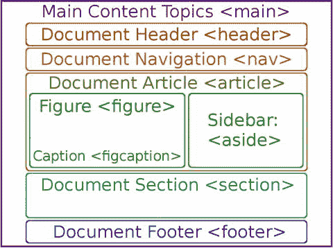

# 十、HTML5 语义：定义语义文档

接下来，让我们介绍 HTML5 中新的“语义”标签，这些标签允许开发人员在他们的 HTML5 设计中更合理地定义内容层次。这是通过页眉、页脚、章节、图表、标题、边栏和导航面板来实现的。它们允许您将文档内容组织成逻辑部分。语义是对单词含义的研究，所以这些标签之所以具有语义是因为它们定义了内容，所以搜索引擎可以在语义上“看到”文档设计(即智能地)。

在这一章中，我将介绍语义标签，它实现了新的 HTML5 语义文档组织范例。标签的名称定义了它们所代表的 HTML5 文档的功能区域。语义标签的例子包括

<header>和

<footer>标签、

<figure>和

<figcaption>标签、

<section>、

<article>、

<main>、

<nav>、

<aside>、<details>、<summary>、<mark>和<time>标签。</time></mark></summary></details></aside>

</nav>

</main>

</article>

</section>

</figcaption>

</figure>

</footer>

</header>

## HTML5 语义内容组织

本章涵盖了 HTML5 中的语义内容组织功能。在 HTML5 之前，开发人员使用

标签或其他标签，以及一个类或 id 参数，例如`<div id="header">`，为文档元素创建他们的描述性(语义)名称。由于开发者没有使用标准化的语义标签，W3C 替他们做了，这样搜索引擎机器人(算法)就可以开始实现 Web 3.0，也就是语义搜索。根据 W3C:语义网允许数据在应用、企业和社区之间共享和重用。表 10-1 显示了语义内容组织标签，这些标签都是 HTML5 中新增的，分类为主要文档节、功能文档节、多媒体功能图和面向细节的文档特征。

表 10-1。

Thirteen HTML Semantic Organization Tags

<colgroup><col> <col></colgroup> 
| 组织标签 | 内容组织标签用法 |
| --- | --- |
| 页眉 | 指定文档的标题信息 |
| 页脚 | 指定文档的页脚信息 |
| 部分 | 指定文档的节信息 |
| 主要的 | 文件的指定主要内容 |
| 导航 | 导航；通常是锚定标签的集合 |
| 文章 | 指定文档的文章信息 |
| 在旁边 | 与周围文本相关的侧栏内容 |
| 数字 | 文档的指定图形和新媒体 |
| figcaption(快照标题) | 指定文档的节信息 |
| 细节 | 用户可以显示或隐藏的指定附加详细信息 |
| 摘要 | 指定文档的节信息 |
| 标记 | 文档的指定图形和新媒体 |
| 时间 | 指定了图形媒体的图形标题 |

有趣的是，在 HTML5 之前有一些标签碰巧是语义性的，尽管它们当时并没有被特别设计成语义性的。其中包括

<form>、，以及 

</form>

让我们来看看逻辑部分中的这些语义标签，如表 10-1 所示，从 HTML5 <部分>、<页眉>和<页脚>部分标签开始。它们定义了桌面出版中使用的广泛的高级文档区域，以保存参考信息和其他辅助信息，这些信息通常在主要(中心或中间)文档内容区域中使用上标或下标数字绑定到这些区域。

图 10-1 给出了一个语义文档结构的例子，其中显示了一些最重要的语义标签。



图 10-1。

An example of a semantic HTML5 document structure

### HTML5 分段标签:逻辑地对内容进行分段

sectional】标签和更专业的

<header>和

<footer>标签在语义上定义了文档中的标准区域，这样搜索引擎就知道你在文档设计中做了什么。

<section>标签用于更一般的文件分割。

<header>和

<footer>用于特定的介绍性信息和脚注。</footer>

</header>

</section>

</footer>

</header>

#### SECTION 标签:定义文档节

标签用于定义文档中任何种类的部分，例如一章。如果没有 and

<footer>语义标签，也可以用来定义页眉和页脚。标签是和标签的子标签。例如，它是、、

和六个标题标签的父标签。

</footer>

没有等级规则，所以标签可以有子标签，标签也可以有子标签。这使得语义内容设计更加灵活。

让我们在内容设计中使用标签和一个 id 值，内容设计包含外国汽车和国内汽车的部分。下文详述了第九章中使用的标题标签示例:

```html
<!DOCTYPE html><html>
<head><title>Exotic and Domestic Cars</title></head>
<body>
 <section id="exotic">
  <h1>Exotic Car Document</h1>
   <p>Top Level Keywords Relating to Exotic Cars from Every Nation</p>
  <h2>Exotic European Cars</h2>
   <p>Next Level Keywords Relating to Exotic Cars from European Union</p>
  <h3>Exotic European Sports Cars</h3>
   <p>Next Level Keywords Relating to Exotic European Sports Cars</p>
 </section>
 <section id="domestic">
  <h1>Domestic Car Document</h1>
   <p>Top Level Keywords Relating to Domestic Cars from Every Nation</p>
  <h2>Domestic European Cars</h2>
   <p>Next Level Keywords Relating to Domestic Cars from European Union</p>
  <h3>Domestic European Sedans</h3>
   <p>Next Level Keywords Relating to Domestic European Sedans</p>
 </section>
</body>
</html>

```

接下来，让我们看看一种特殊类型的节标记，称为标记。该标签专门在文档设计的顶部或“标题”提供信息。

#### HEADER 标签:定义文档的介绍性内容

标签定义了文档的介绍性内容。如果没有

<nav>语义标签，它也可以用来定义导航(用户界面)元素。

<header>标签不能用作

<footer>、

<address>或其他

<header>标签的子标签。然而，一个文档中可以使用多个

<header>标签。

<header>元素(标签)通常包含一个标题标签(例如

# 标签)和一个段落

标签，还可能包含一个图像，如徽标、图片或类似的视觉品牌元素。

</header>

</header>

</header>

</address>

</footer>

</header>

</nav>

让我们使用一个标签来定义汽车内容设计示例的标题。该示例现在在 HTML5 内容层次结构中的下面使用欧洲和美国汽车的部分。我更改了节 id 以反映这一新的设计更改，如以下 HTML5 标记所示:

```html
<!DOCTYPE html><html>
<head><title>Exotic and Domestic Cars</title></head>
<body>
 <header>
  <h1>Exotic Cars Unleashed!</h1>
   <p>Top Level Keywords Relating to Exotic Cars from Every Nation</p>
 </header>
 <section id="european">
  <h2>Exotic European Cars</h2>
   <p>Next Level Keywords Relating to Exotic Cars from European Union</p>
  <h3>Exotic European Sports Cars</h3>
   <p>Next Level Keywords Relating to Exotic European Sports Cars</p>
 </section>
 <section id="american">
  <h2>Exotic American Cars</h2>
   <p>Next Level Keywords Relating to Domestic Cars from North America</p>
  <h3>Exotic American Sports Cars</h3>
   <p>Next Level Keywords Relating to Exotic North American Sports Cars</p>
 </section>
</body>
</html>

```

接下来，让我们看看一种特殊类型的节标签，称为

<footer>标签。此标签在文档设计的底部或“底部”提供信息。通常是脚注或其他参考信息来进一步定义或标识主要文档内容。</footer>

#### 脚注标记:引用内容的脚注信息

标签定义了文档的脚注和类似的参考内容。一个文档中可以使用多个

<footer>标签。

<footer>元素通常包含版权、作者联系信息或对其他用作资源的文档的引用。</footer>

</footer>

让我们使用一个

<footer>标签来定义汽车内容设计示例的页脚。页脚引用标识文档内容来源的信息，如下面的 HTML5 标记所示:</footer>

```html
<!DOCTYPE html><html>
<head><title>Exotic and Domestic Cars</title></head>
<body>
 <header>
  <h1>Exotic Cars Unleashed!</h1>
   <p>Top Level Keywords Relating to Exotic Cars from Every Nation</p>
 </header>
 <section id="european">
  <h2>Exotic European Cars</h2>
   <p>Next Level Keywords Relating to Exotic Cars from European Union</p>
  <h3>Exotic European Sports Cars</h3>
   <p>Next Level Keywords Relating to Exotic European Sports Cars</p>
 </section>
 <section id="american">
  <h2>Exotic American Cars</h2>
   <p>Next Level Keywords Relating to Domestic Cars from North America</p>
  <h3>Exotic American Sports Cars</h3>
   <p>Next Level Keywords Relating to Exotic North American Sports Cars</p>
 </section>
 <footer>
  <h4>Exotic Car Article Article, Contact and Sources:</h1>
   <p>Blog’s Author: Wallace Jackson</p>
   <p>Author e-mail: <a href="mailto: wj@email.com">Wallace Jackson</a></p>
   <p>Blog’s Source: Magazine or Book Resources and Links would go here</p>
 </footer>
</body>
</html>

```

接下来，让我们看看 HTML5 语义标签，它允许您定义文档“区域”，比如主文档主题、文档中的文章、信息侧栏和导航栏。

### HTML5 内容类型语义定义标签

表 10-1 中接下来的四个标签定义了其他文档区域——文章、侧栏、导航 UI 和文档的顶层(主要区域)——使用为文档区域命名的标签，这就是新 HTML5 文档语义的全部内容！您需要正确而精确地使用这些标签，使您的 HTML5 文档与 Web 3.0(语义 Web)兼容。搜索引擎吸收语义优化的内容，这是通过使用 HTML5 这一重要章节中的标签来实现的。

#### 主标签:定义文档内容的顶层

标签定义了文档的最顶层。单个文档中只使用一个

<main>标签。此

<main>标签不能用作

<nav>、

<header>、

<footer>、

<article>或

<aside>的子标签，因为它定义了文档的顶层。

<main>元素需要包含独特的信息和设计元素，不能在任何其他 HTML 文档中重复。</main>

</aside>

</article>

</footer>

</header>

</nav>

</main>

</main>

让我们使用这个

<main>标签来定义汽车内容设计示例的顶层。主标签在文档的顶部有一个开始标签(在标签之前)，在文档的底部有一个结束标签(在

<footer>标签之后)，这样你的整个文档就包含(定义)在这个

<main>标签语义结构中了。下面的 HTML5 标记显示了这样一个例子:</main>

</footer>

</main>

```html
<!DOCTYPE html><html>
<head><title>Exotic and Domestic Cars</title></head>
<body>
 <main>

  <header>
   <h1>Exotic Cars Unleashed!</h1>
    <p>Top Level Keywords Relating to Exotic Cars from Every Nation</p>
  </header>
  <section id="european">
   <h2>Exotic European Cars</h2>
    <p>Next Level Keywords Relating to Exotic Cars from European Union</p>
   <h3>Exotic European Sports Cars</h3>
    <p>Next Level Keywords Relating to Exotic European Sports Cars</p>
  </section>
  <section id="american">
   <h2>Exotic American Cars</h2>
    <p>Next Level Keywords Relating to Domestic Cars from North America</p>
   <h3>Exotic American Sports Cars</h3>
    <p>Next Level Keywords Relating to Exotic North American Sports Cars</p>
  </section>
  <footer>
   <h4>Exotic Car Article Article, Contact and Sources:</h1>
    <p>Blog’s Author: Wallace Jackson</p>
    <p>Author e-mail: <a href="mailto: wj@email.com">Wallace Jackson</a></p>
    <p>Blog’s Source: Magazine or Book Resources and Links would go here</p>
  </footer>
 </main>

</body>
</html>

```

接下来，让我们看看

<nav>标签，它包含了 HTML5 文档或应用的用户界面设计(文档导航 HTML5 元素)。我还推荐使用 CSS 来设计文档导航标签的样式。</nav>

#### NAV 标签:为文档定义导航 UI

<nav>标签定义了文档导航区域的用户界面，通常使用 </nav>

让我们将

<nav>标签添加到当前示例中，如下面的 HTML5 标记所示:</nav>

```html
<!DOCTYPE html><html>
<head><title>Exotic and Domestic Cars</title></head>
<body>
 <main>

  <header>
   <h1>Exotic Cars Unleashed!</h1>
    <p>Top Level Keywords Relating to Exotic Cars from Every Nation</p>
  </header>
  <nav>

   <a http://www.web-address.com/car-info.html>CAR INFO</a>
   <a http://www.web-address.com/our-team.html>OUR TEAM</a>
   <a http://www.web-address.com/buy-cars.html>BUY CARS</a>
  </nav>

  <section id="european">
   <h2>Exotic European Cars</h2>
    <p>Next Level Keywords Relating to Exotic Cars from European Union</p>
   <h3>Exotic European Sports Cars</h3>
    <p>Next Level Keywords Relating to Exotic European Sports Cars</p>
  </section>
  <section id="american">
   <h2>Exotic American Cars</h2>
    <p>Next Level Keywords Relating to Domestic Cars from North America</p>
   <h3>Exotic American Sports Cars</h3>
    <p>Next Level Keywords Relating to Exotic North American Sports Cars</p>
  </section>
  <footer>
   <h4>Exotic Car Article Article, Contact and Sources:</h1>
    <p>Blog’s Author: Wallace Jackson</p>
    <p>Author e-mail: <a href="mailto: wj@email.com">Wallace Jackson</a></p>
    <p>Blog’s Source: Magazine or Book Resources and Links would go here</p>
  </footer>
 </main>

</body></html>

```

接下来，让我们看看标记，它在文档中创建特定主题的文章。

#### 文章标签:在 HTML5 文档中定义文章

标签定义了文档中的一篇文章。文章是独立于其他文档内容的独特的专有内容。可以在一个文档中使用多个

<article>标签。</article>

让我们将汽车示例中的标签更改为标签，通过使用以下标记将其转换为杂志:

```html
<!DOCTYPE html><html>
<head><title>Exotic and Domestic Cars Today</title></head>
<body>
 <main>

  <header>
   <h1>Exotic Cars Magazine: Current Exotic Car Articles</h1>
    <p>Top Level Keywords Relating to Exotic Cars from Every Nation</p>
  </header>
  <nav>
   <a http://www.web-address.com/car-info.html>CAR INFO</a>
   <a http://www.web-address.com/our-team.html>OUR TEAM</a>
   <a http://www.web-address.com/buy-cars.html>BUY CARS</a>
  </nav>
  <article>

   <h2>Exotic European Cars: Maintaining a Lead Over US Manufacturers</h2>
    <p>Next Level Keywords Relating to Exotic Cars from European Union</p>
   <h3>Exotic European Sports Car Round-Up</h3>
    <p>Next Level Keywords Relating to Exotic European Sports Cars</p>
  </article>

  <article>

   <h2>Exotic American Cars: Gaining on the Domination of European Cars</h2>
    <p>Next Level Keywords Relating to Domestic Cars from North America</p>
   <h3>Exotic American Sports Car Round-Up</h3>
    <p>Next Level Keywords Relating to Exotic North American Sports Cars</p>
  </article>

  <footer>
   <h4>Exotic Car Article Article, Contact and Sources:</h1>
    <p>Blog’s Author: Wallace Jackson</p>
    <p>Author e-mail: <a href="mailto: wj@email.com">Wallace Jackson</a></p>
    <p>Blog’s Source: Magazine or Book Resources and Links would go here</p>
  </footer>
 </main>

</body>

</html>

```

接下来，让我们看看

<aside>标签，它在文档中创建信息侧栏。</aside>

#### 旁白标签:在文档中定义信息侧栏

标签定义了文档中的信息侧边栏。侧边栏内容必须与其相邻的内容相关。可以在一个文档中使用多个

<aside>标签。</aside>

让我们将汽车示例中的标签更改为标签，通过使用以下标记将它转换为杂志:

```html
<!DOCTYPE html><html>
<head><title>Exotic and Domestic Cars Today</title></head>
<body>
 <main>
  <header>
   <h1>Exotic Cars Magazine: Current Exotic Car Articles</h1>
    <p>Top Level Keywords Relating to Exotic Cars from Every Nation</p>
  </header>
  <nav>
   <a http://www.web-address.com/car-info.html>CAR INFO</a>
   <a http://www.web-address.com/our-team.html>OUR TEAM</a>
   <a http://www.web-address.com/buy-cars.html>BUY CARS</a>
  </nav>
  <article>
   <h2>Exotic European Cars: Maintaining a Lead Over US Manufacturers</h2>
    <p>Next Level Keywords Relating to Exotic Cars from European Union</p>
   <h3>Exotic European Sports Car Round-Up</h3>
    <p>Next Level Keywords Relating to Exotic European Sports Cars</p>
   <aside>

    <h4>Sidebar: Top Selling European Sports Cars</h4>
     <p>Next Level Keywords Relating to Top Selling European Sports Cars</p>
   </aside>

  </article>
  <article>
   <h2>Exotic American Cars: Gaining on the Domination of European Cars</h2>
    <p>Next Level Keywords Relating to Domestic Cars from North America</p>
   <h3>Exotic American Sports Car Round-Up</h3>
    <p>Next Level Keywords Relating to Exotic North American Sports Cars</p>
  </article>
  <footer>
   <h5>Exotic Car Article Article, Contact and Sources:</h1>
    <p>Blog’s Author: Wallace Jackson</p>
    <p>Author e-mail: <a href="mailto: wj@email.com">Wallace Jackson</a></p>
    <p>Blog’s Source: Magazine or Book Resources and Links would go here</p>
  </footer>
 </main></body></html>

```

接下来，我们来看看如何在 HTML5 中使用图形和图形标题。

### HTML5 语义新媒体图形定义标签

表 10-1 中显示的下两个标签允许您使用图和图标题从语义上定义新的媒体元素。

#### 插图和插图标题标签:添加带标题的图像

标签用于定义多媒体。嵌套了一个

<figcaption>标签来定义新媒体素材的标题。</figcaption>

让我们使用这两个标记来定义跑车内容的标题图像，如下面的 HTML5 标记所示:

```html
<!DOCTYPE html><html>
<head><title>Exotic and Domestic Cars Today</title></head>
<body>
 <main>
  <header>
   <h1>Exotic Cars Magazine: Current Exotic Car Articles</h1>
    <p>Top Level Keywords Relating to Exotic Cars from Every Nation</p>
  </header>
  <nav>
   <a http://www.web-address.com/car-info.html>CAR INFO</a>
   <a http://www.web-address.com/our-team.html>OUR TEAM</a>
   <a http://www.web-address.com/buy-cars.html>BUY CARS</a>
  </nav>
  <article>
   <h2>Exotic European Cars: Maintaining a Lead Over US Manufacturers</h2>
    <p>Next Level Keywords Relating to Exotic Cars from European Union</p>
   <h3>Exotic European Sports Car Round-Up</h3>
    <p>Next Level Keywords Relating to Exotic European Sports Cars</p>
   <aside>
    <h4>Sidebar: Top Selling European Sports Cars</h4>
     <p>Next Level Keywords Relating to Top Selling European Sports Cars</p>
   </aside>
  </article>
  <article>
   <h2>Exotic American Cars: Gaining on the Domination of European Cars</h2>
    <p>Next Level Keywords Relating to Domestic Cars from North America</p>
   <h3>Exotic American Sports Car Round-Up</h3>
    <p>Next Level Keywords Relating to Exotic North American Sports Cars</p>
  <figure>

   
   <figcaption>Figure 1\. Image of Popular American Sports Car</figcaption>

  </figure>

  </article>
  <footer>
   <h5>Exotic Car Article Article, Contact and Sources:</h1>
    <p>Blog’s Author: Wallace Jackson</p>
    <p>Blog’s Source: Magazine or Book Resources and Links would go here</p>
  </footer>
 </main></body></html>

```

如果您想将图片文本放在图像或视频的上面，而不是下面，您也可以将子标签放在父标签内，在或<video>标签之前。在新的媒体元素下面添加标题是为图像或视频添加标题的标准方式。您也可以使用带有您的

<audio>标签的标题，但是一定要包括 controls 参数，以便有一些东西(播放-暂停-倒带传输)可以作为标题！</audio></video> 

接下来，让我们看看最后几个语义标签，它们添加了各种细节元素，包括弹出信息、摘要、文本标记和系统时间。

### HTML5 语义文档详细定义标签

表 10-1 中的最后四个标签允许你定义语义 HTML5 文档的细节元素。其中包括开发人员用来定义交互式弹出窗口小部件的<细节>标签，这些小部件允许用户深入文档的语义内容。还有一个子<摘要>标签与<细节>标签一起使用。最后，<标记>标记“标记”文本，而<时间>标记允许您显示系统日期和时间。

#### 详细信息和摘要标签:添加弹出信息

<details>标签与<summary>标签一起用于定义弹出信息，允许用户“向下钻取”更多信息。点击<summary>标签中提供的信息来切换<details>标签中的显示或隐藏功能。<details>标签有一个名为 open 的参数，表示 open=“真”,相当于默认状态下<details>元素的“显示”状态。如果 open 参数不存在，这等同于 open="false "，隐藏状态是默认状态；用户必须点击<summary>标签的文本来“取消隐藏”或打开<details>元素。</details></summary></details></details></details></summary></summary></details>

让我们在跑车内容部分添加一个

<details>标签及其<summary>子标签。让它包含一个弹出窗口小部件，标记为点击这里查看我们的特色文章列表！。当用户单击它时，出现两个<文章>元素的列表，如下面的 HTML5 标记示例所示:</summary></details>

```html
<!DOCTYPE html><html>
<head><title>Exotic and Domestic Cars Today</title></head>
<body>
 <main>
  <header>
   <h1>Exotic Cars Magazine: Current Exotic Car Articles</h1>
    <p>Top Level Keywords Relating to Exotic Cars from Every Nation</p>
    <details>

     <summary>Click Here For the List of Our Featured Articles!</summary>

     <p>Exotic European Cars: Maintaining the Lead Over US Manufacturers</p>
     <p>Exotic American Cars: Gaining on the Domination of European Cars</p>
    </details>

  </header>
  <nav>
   <a http://www.web-address.com/car-info.html>CAR INFO</a>
   <a http://www.web-address.com/our-team.html>OUR TEAM</a>
   <a http://www.web-address.com/buy-cars.html>BUY CARS</a>
  </nav>
  <article>
   <h2>Exotic European Cars: Maintaining the Lead Over US Manufacturers</h2>
    <p>Next Level Keywords Relating to Exotic Cars from European Union</p>
   <h3>Exotic European Sports Car Round-Up</h3>
    <p>Next Level Keywords Relating to Exotic European Sports Cars</p>
   <aside>
    <h4>Sidebar: Top Selling European Sports Cars</h4>
     <p>Next Level Keywords Relating to Top Selling European Sports Cars</p>
   </aside>
  </article>
  <article>
   <h2>Exotic American Cars: Gaining on the Domination of European Cars</h2>
    <p>Next Level Keywords Relating to Domestic Cars from North America</p>
   <h3>Exotic American Sports Car Round-Up</h3>
    <p>Next Level Keywords Relating to Exotic North American Sports Cars</p>
  <figure>

   
   <figcaption>Figure 1\. Image of Popular American Sports Car</figcaption>

  </figure>
  </article>
  <footer>
   <h5>Exotic Car Article Article, Contact and Sources:</h1>
    <p>Blog’s Author: Wallace Jackson</p>
    <p>Blog’s Source: Magazine or Book Resources and Links would go here</p>
  </footer>
 </main>
</body></html>

```

接下来，我们来看看最后两个语义标签，<mark>和<time>。如果其他遗留标签已经升级了新的语义特性或功能，我将在以后的章节中介绍这些内容。</time></mark>

#### 标记和时间标签:添加更多信息

标签突出了重要的文本。标签定义了人类可读的时间值。在 Firefox 中，<mark>标签将黄色应用到<mark>和</mark>标签中的文本。这些标签可以用在我们的汽车示例中，如下所示:</mark>

```html
<!DOCTYPE html><html>
<head><title>Exotic and Domestic Cars Today</title></head>
<body>
 <main>
  <header>
   <h1>Exotic Cars Magazine: Current Exotic Car Articles</h1>
    <p>Top Level Keywords Related to <mark>Exotic Cars</mark> worldwide</p>
    <details>
     <summary>List of Our Articles Released at <time>10:00</time></summary>
     <p>Exotic European Cars: Maintaining the Lead Over US Manufacturers</p>
     <p>Exotic American Cars: Gaining on the Domination of European Cars</p>
    </details>
  </header>
  <nav>
   <a http://www.web-address.com/car-info.html>CAR INFO</a>
   <a http://www.web-address.com/our-team.html>OUR TEAM</a>
   <a http://www.web-address.com/buy-cars.html>BUY CARS</a>
  </nav>
  <article>
   <h2>Exotic European Cars: Maintaining the Lead Over US Manufacturers</h2>
    <p>Next Level Keywords Relating to Exotic Cars from European Union</p>
   <h3>Exotic European Sports Car Round-Up</h3>
    <p>Next Level Keywords Relating to Exotic European Sports Cars</p>
   <aside>
    <h4>Sidebar: Top Selling European Sports Cars</h4>
     <p>Next Level Keywords Relating to Top Selling European Sports Cars</p>
   </aside>
  </article>
  <article>
   <h2>Exotic American Cars: Gaining on the Domination of European Cars</h2>
    <p>Next Level Keywords Relating to Domestic Cars from North America</p>
   <h3>Exotic American Sports Car Round-Up</h3>
    <p>Next Level Keywords Relating to Exotic North American Sports Cars</p>
  <figure>

   
   <figcaption>Figure 1\. Image of Popular American Sports Car</figcaption>
  </figure>

  </article>
  <footer>
   <h5>Exotic Car Article Article, Contact and Sources:</h1>
    <p>Blog’s Author: Wallace Jackson</p>
    <p>Blog’s Source: Magazine or Book Resources and Links would go here</p>
  </footer>
 </main>
</body>
</html>

```

在这一点上，你应该回过头来看看图 10-1 所示的图表，它可视化了本章示例中使用的一些语义标签。

## 摘要

在这一章中，您了解了 HTML5 最近添加的新语义标签支持，包括

<main>、

<nav>、

<header>、

<footer>、

<article>、

<section>、

<aside>、

<figure>、

<figcaption>、<details>、<summary>、<mark>和<time>标签。在下一章中，您将看到 HTML5 标签，这些标签支持在 HTML5 文档和应用中发布基于文本的内容。</time></mark></summary></details></figcaption>

</figure>

</aside>

</section>

</article>

</footer>

</header>

</nav>

</main>