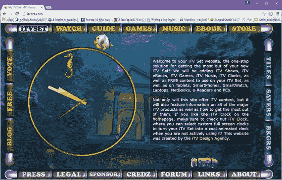

# 十六、HTML5 位置：文档布局和文本跨度

让我们来谈谈 HTML5 中允许开发人员对元素进行分组并控制内容位置的标签。我们还将讨论一些标签，这些标签允许对分组的元素进行样式化，就像它们是一个单一的功能单元一样。这些标签包括分部

标签和跨度标签。这些标签本身什么也不做；它们必须被定型。

本章着眼于 HTML5 中实现高级内容设计技术的强大标签。我们从标签开始，因为它只影响文本元素，然后我们进展到更复杂和更强大的标签。和标记没有 HTML5 参数，因为它们使用 CSS3 设置样式。本章没有表格，只有 HTML5 标记示例。

## 定义文本跨度:使用 SPAN 标签

标签用来将 HTML5 文档中的行内元素分组。标签本身并不提供视觉效果，它必须使用 CSS3 进行样式化或者使用 JavaScript 进行操作。因此，标签为开发人员提供了一种添加外部访问的方式，以便能够挂钩到使用起始标签和结束标签封装的文本内容、图像或文档部分。

下面的 HTML5 标记示例使用标记和全局 HTML5 样式参数来为句子的一部分着色:

```html
<p>Ferrari's come in a <span style="color:red">Ferrari Red</span> color</p>

```

标签和标记之间的主要区别在于标签是内嵌使用的(在其他标签的内部)，而

标签创建块构造或深度嵌套的 HTML5 标记构造(看起来像 HTML5 标记的块，因此得名“块级构造”)。

HTML5 中的标记没有本地或本机参数；但是，有一些全局 HTML5 参数通常与标签一起使用。其中包括一个 id 或一个 class 参数，用于访问，使用外部 CSS3 定义，以及 title 标签，允许鼠标悬停弹出窗口附加到跨越的文本元素。以下是使用上一个示例中的 HTML5 标记的这些参数的示例:

```html
<p>The Ferrari La Ferrari Model will usually come painted in the
  <span id="myspan" title="This text will pop-up when you mouse-over span">
    Ferrari Red color
  </span>, unless you order it in some custom (other than red) color.</p>

span#myspan { color:red; } /* Externalized CSS3 linked via a .CSS file */

```

span 也可以和 imagery 一起使用！这在使用事件处理程序参数时尤其有用。用一个配置为使用 onMouseDown、onMouseOut 和 onDblClick 的标签包围标签，以允许您的用户单击一个图像并将法拉利图像变为蓝色，双击一个图像将法拉利图像变为黄色，然后将鼠标从图像上移开，以恢复默认的红色法拉利图像。这是在以下 HTML5 标记中完成的:

```html
<p>Click image to see a Blue Ferrari, Double-Click for a Yellow Ferrari:</p>
  <span onMouseDown="document.ferrarigif.src='blueferrari.gif'"
        onMouseOut="document.ferrarigif.src='redferrari.gif'"
        onDblClick="document.ferrarigif.src='yellowferrari.gif'">
    
  </span>

```

将与语言相关的参数 dir(文本方向)和 lang(语言定义)与标签一起使用也是有用的，因为主要用于影响文本元素，这些元素受语言和文本方向的影响。

您可以通过以下 HTML5 标记使用 dir 参数来更改中的文本方向:

```html
<p>Ferrari comes in a standard <span dir="ltr">Ferrari Red</span> color</p>

```

您还可以通过使用配置来定义文本范围中使用的语言。假设法拉利在意大利非常性感，如以下 HTML5 标记所示:

```html
<p>Ferrari's are considered <span lang="it">Molto Sexy</span> in Italy</p>

```

接下来，让我们看一下标签，以及如何使用这个标签来构建复杂的 HTML5 文档设计，将 HTML5 结构封装在已经分配了 id 或 class 参数的标签中。首先，让我们看看在 CSS3 应用中使用 id 参数和 class 参数的区别，标记广泛地利用了这两个参数。

## id、名称和类别的使用

随着 HTML5 在用于识别设计元素(标签)的三个不同参数方面的发展，通常会有一些混乱。这些是 id、名称和类。我试图在本章的这一节中阐明这些标签中的每一个最适合做什么，因为

和在很大程度上依赖于这些标签来识别它们以进行外部处理，因为这两个标签本身不做任何事情。

### 标识符:为 JavaScript 和片段使用一个 id

id 参数是标识符的缩写；更准确地说，它是片段标识符的简称。它允许您使用一个 URL 加上一个散列符号(或井号)" # "片段名称转到文档的特定部分。这是通过 URL 和 id="fragment-id-value "参数中使用的值之间的#字符来完成的。这是一个片段 URL 的示例:

```html
http://www.website-name-here.com/webpage-name.html#fragment-id-value

```

它是使用

标签:

在 HTML5 标记中创建的

```html
<p id=fragment-id-value>This is a paragraph of text you want to jump to</p>

```

在您当前所在的同一文档中，仅使用片段 id 值引用它，在

```html
<a href="#fragment-id-value">Click here to go to this fragment/section</a>

```

值得注意的是，对于任何 XHTML、HTML 或 HTML5 文档，一个 id 名称只能使用一次。重复的 id 标记会导致页面验证失败，并且在 JavaScript 中使用 id 时会产生负面影响。除了定义文档片段导航之外，id 参数对于定义使用 JavaScript 处理的文档元素也很重要。对 CSS 等非标准应用使用 id 可能会对此产生潜在的干扰，因此对 CSS3 选择器定义使用 class 参数。

CSS3 可以通过使用井号(#)来选择 Id 以对它们应用单独的样式，但是 JavaScript 也依赖于 id，因为它使用了。js 外部化的 JavaScript。

出于这个原因，我建议将这三个不同的赋值参数的用法分离为它们最常用的用法:用于 JavaScript 和片段导航的 id；CSS3 选择器指定的类；以及表单、服务器和数据库使用的名称(远程数据服务器访问)。这样，您就不会搞不清使用参数的目的了！

### 类:使用类对 CSS3 选择器进行分类

就像用于 CSS3 一样，class 也可以用于 JavaScript 编程。class 参数与 id 参数非常不同，因为 class 可以在同一个 HTML 文档中多次使用。内容(元素、标签、标记)和表现(CSS 样式)的分离使得 CSS 支持的 HTML5 如此强大。开发人员不了解他们可以使用类的全部范围，因为许多人已经习惯于使用(简单得多的)id。

值得注意的是，使用相同的 class 参数，不仅类可以被多次使用，而且在 HTML5 元素(tag)中可以使用多个类名称！下面是一个使用 HTML 标记和 CSS 定义的例子:

```html
<p>Ferrari automobile's are considered to be:
  <span lang="it" class="left2right asexycolor">Molto Sexy</span>
   in most parts of Italy!
</p>
--------------------------CSS3 Selector Definition Below-----------------
.left2right { direction: ltr; }
.asexycolor { color:     red; }

```

第一段代码是有效的 HTML 它显示了在单个类参数中使用两个单独的类，使用空格来分隔两个类名。如果使用有效，这种技术可以大大减少 CSS3 样式表的数据量。值得注意的是，您可以在同一个 HTML5 元素上同时使用 id 和类，以最佳方式引用 JavaScript (id)和 CSS3 样式表(class)。

### 名称:命名表单、控件和 UI 元素

name 属性最常用于在表单提交中发送数据，以及将不同的表单组件与表单连接在一起，正如您在第十五章中广泛观察到的。由于参数约定略有不同，不同的控件对这些相似的(名称和 id)参数的响应也有所不同。

您可以拥有多个具有不同 id 属性的单选按钮，但需要使用相同的 name 参数值来正确定义它们的分组，以便用户只能选择一个选项。

最终，只要正确实现了类和 id，使用 name、id 还是 class 完全取决于您，并且在测试时，HTML5 在所有不同的浏览器上都能同样工作！关于如何以及何时利用这些参数，这实际上只是个人选择的问题。

## 定义文档区域:使用 DIV 标签

division

标签的用法很像 span 标签，除了它定义的区域是一个正方形区域，称为块，而不是一个线(或内嵌)区域，通常用文本来定义。我经常使用标签将图像和动画“缝合”在一起，以创造无缝的用户体验。与语义标签不同，(和)标签对搜索引擎来说是不可见的，并且只与它们周围的内容的定位和样式有关，并不影响内容本身。您应该将这些设计(定位、样式和对齐)标签与语义标签结合使用，以获得视觉上令人惊叹且语义上准确的 HTML5 结果。

### 显示特性:块、内嵌和无

正如我前面提到的，in 是一个内嵌标签，

是一个块标签。这些恰好描述了 CSS3 的 display 属性，该属性也可以设置为 none，从而对 HTML5 呈现引擎完全隐藏该标签(元素)。这与 hidden 属性不同，hidden 属性呈现元素在设计中占据的空间，但使其不可见(透明)。none display 属性实际上将该元素从设计中完全删除，因此为了确保语义标签不会影响视觉设计，可以将它们的 display 属性设置为 none！

还有与列表和表格相关的自定义显示类型，以及一些混合类型，如 flex 和 run-in，它们在块和内嵌之间架起了桥梁，实现了高级样式。

除了 division 之外，使用该块显示属性的元素示例包括段落

标签、页眉

<header>标签、页脚

<footer>标签、节

<section>标签、标题 1-6

# 到

###### 标签以及表单

<form>标签。</form>

</section>

</footer>

</header>

使用内嵌显示属性的元素示例(除此之外)包括锚点

默认为 none display 属性的一些元素的例子包括脚本

### Division 或 DIV 标签:核心属性

标签定义了 HTML5 文档的一部分。这是通过使用标签在块级别对元素进行分组，然后使用 CSS3 样式定义在容器内格式化这些元素来实现的。事实上，元素最常用作 HTML5 视觉设计的通用容器，CSS3 在其中对齐、定位、z 顺序、显示/隐藏、淡入淡出、为该部分中包含的所有 HTML5 内容分配效果和样式。

让我们使用标签为前面的示例添加背景色，如下面的 HTML5 标记所示:

```html
<div style="background-color:yellow">

 <p>Click image to see Blue Ferrari, Double-Click for Yellow Ferrari:</p>
  <span onMouseDown="document.ferrarigif.src='blueferrari.gif'"
        onMouseOut="document.ferrarigif.src='redferrari.gif'"
        onDblClick="document.ferrarigif.src='yellowferrari.gif'">
   
  </span>
 <p>Everything in this document division will have yellow behind it!</p>

</div>

```

这将在交互式图像上方和下方的所有段落文本以及图像本身的后面突出显示黄色。正如您所看到的，您已经通过使用标记作为一个 division 容器，为所有这些包含的文档元素添加了一个全局样式。

对元素进行样式化的更常见的方法是使用 class 参数为其分配一个类名，如下所示:

```html
<div class="example">
 <p>Click image to see Blue Ferrari, Double-Click for Yellow Ferrari:</p>
  <span onMouseDown="document.ferrarigif.src='blueferrari.gif'"
        onMouseOut="document.ferrarigif.src='redferrari.gif'"
        onDblClick="document.ferrarigif.src='yellowferrari.gif'">
   
  </span>
 <p>Everything in this document division will have yellow behind it!</p>
</div>
------------
div.example { background-color :yellow; position: absolute;
              top: 108px; left: 120px; width: 500px; height: 500px;
              z-index: -1; opacity: 0.5; border: solid 1px #000000; }
.example    { background-color: yellow; }

```

上面的代码添加了背景色，定位，设置 50%的透明度，设置背景中的 z 索引，并在分割线周围绘制一个单像素的纯黑色边框。我还展示了一个例子，说明带有 class="example "的任何元素是如何以黄色作为背景色的，以显示类的强大功能。

虽然这不是一本 CSS3 的书，但我在这一章和第十八章中向你展示了一些 CSS3，因为有必要向你展示 CSS3 和 HTML5 标记之间的这座物质桥梁，并向你展示某些标签，如< div >、< style >、< link >和< span >如何与 CSS3 协同工作。

值得注意的是，标签在浏览器(或操作系统)中呈现时的默认行为是在元素之前和之后放置一个换行符。这可以由使用 CSS3 的开发人员来更改，而且经常如此。事实上，接下来要看的是我如何使用标签和 CSS3 无缝地将标签素材缝合在一起，用于我的多媒体相关 HTML5 内容生产管道。

### 无缝图像拼接:结合 CSS3 使用 DIVs

既然我们已经看了一些不太高级的例子，我应该给你看一个更高级的例子。让我们看看如何使用 div 来组装 iTVset.com 站点的各种图像和动画组件，以及覆盖 JavaScript 时钟元素，所有这些都是使用标签完成的。JavaScript 包含在第十七章中，CSS3 包含在第十八章中。图 16-1 显示了我们接下来要看的 HTML5 标记的结果。这是使用 CSS3 样式表进行样式化的，我们将在后面探讨。



图 16-1。

使用 DIVs 和 CSS3 拼接在一起的 HTML5 设计

正如您在下面的 HTML5 标记中看到的，我使用了包含标签的标签，使用 class 属性来处理这些标签，使用 id 属性来引用 JavaScript。第十九章中介绍了<画布>标签(id=“时钟”)。

```html
<div class="c">
  
  
  
</div>
<div class="d">
  
  \
</div>
<div class="h"></div>
<div class="tx"></div>
<div class="p"><p>TEXT CONTENT FOR THE HTML5 DOCUMENT IS IN HERE</p></div>
<div class="j"></div>
<div class="s"></div>
<div class="bu"></div>
<div class="t">
  
    <!-- TOP UI LINKS ANCHOR TAG MARKUP -->
</div>
<div class="l">
  
    <!-- LEFT UI LINKS ANCHOR TAG MARKUP -->
  
</div>
<div class="r">
  
    <!-- RIGHT UI LINKS ANCHOR TAG MARKUP -->
  
</div>
<div class="b">
  
    <!-- BOTTOM UI LINKS ANCHOR TAGS MARKUP -->
  
</div>
<div class="time">
  <canvas id="clock" width="500" height="500"></canvas>
</div>

```

为了创建您在图 16-1 中看到的内容，我使用 CSS3 为不包含< img >标签的< div >标签定义了背景图像属性。我使用绝对定位，并通过使用 top、left、width 或 height 属性来定义精确的像素位置。我使用 fixed 和 no-repeat 属性控制图像拼贴，使用带有这些名称的 CSS3 属性控制不透明度、背景颜色和边框。您可以查看 DIV classname 以了解 CSS3 定位和加载每个图像区域的内容。

```html
div.time {position:absolute;top:108px;left:120px;width:500px;height:500px;}
div.p    {position:absolute;top:-216px;left:694px;width:446px;height:400px;}
div.tx   { position:absolute; top:150px; left:680px; width:460px;
           height:400px; background-color:#000; opacity:0.35;
           border:solid 1px #ccc; }
div.c    { position:absolute;top:48px;left:0px;width:1280px;height:624px; }
div.c img.c2 {position:absolute;left:0px;width:270px;height:80px;top:0px; }
div.c img.c3 {position:absolute;left:270px;width:640px;height:80px;top:0px;}
div.c img.c4 {position:absolute;left:910px;width:370px;height:80px;top:0px;}
div.d    { position:absolute;top:128px;left:0px;width:1280px;height:544px; }
div.d img.c5 {position:absolute;left:0px;width:1280px;height:480px;top:0px;}
div.d img.c6 { position:absolute; left: 0px; width: 1280px; height: 64px;
               top:480px; }
div.s    {position:absolute; left:0px; width:1280px; height:56px; top:608px;
          background: no-repeat; background-image: url(s.png); }
div.h    {position:absolute; left:0px width:1280px; height:128px; top:128px;
          background: fixed no-repeat; background-image: url(sy.gif); }
div.j    { position:absolute; left:176px; width:96px; height:720px; top:0px;
           background: fixed no-repeat; opacity: 0.6;
           background-image: url(jy.gif); }
div.bu   { position:absolute; left:525px; width:44px; height:720px; top:0px;
           background: fixed no-repeat; opacity: 0.4;
           background-image: url(bu.gif); }
div.t    { position:absolute; top:0px; left:0px; width:1280px; height:48px;
           background-image: url(bk1.png); }
div.t img.tp1 { position:absolute;left:18px;width:56px;height:45px;top:2px;}

div.t img.tp2 { position: absolute; left: 1187px; width: 56px; height: 45px;
                top:2px; }
div.l    { position: absolute; top: 0px; left: 0px; width: 64px;
           height: 652px; background-image: url(bkg7.jpg); }
div.l img.lt1 { position: absolute; left: 18px;width: 45px; height: 56px;
                top: 64px;}
div.l img.lt2 { position: absolute; left: 18px; width: 45px;
                height: 56px; top: 594px; }
div.b    { position: absolute; top: 664px; left: 0px; width: 1280px;
           height: 48px; background-image: url(bk7.png); }
div.b img.bt1 { position: absolute; left: 18px; width: 56px;
                height: 45px;top: 3px; }
div.b img.bt2 { position: absolute; left: 1187px; width: 56px;
                height: 45px; top: 3px; }

```

接下来，让我们看看 JavaScript 

## 摘要

本章讲述了在 HTML5 和早期版本中定义区域的标记，包括和标记。下一章关注 HTML5 JavaScript