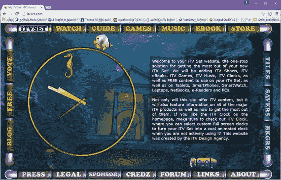

# 十七、HTML5 脚本：使用 JavaScript

现在我们来讨论 HTML5 中的

在本章中，您将看到 HTML5 中的

## 使用 JavaScript:html 5 脚本标签

表 17-1。

Six HTML5 <script> Tag Parameters

<colgroup><col> <col></colgroup> 
| 脚本标记参数 | 脚本标记参数的用法 |
| --- | --- |
| 异步(HTML5 中的新功能) | 指定 JavaScript 将异步执行；这是用于外部脚本的 |
| 字符集 | 指定外部 JavaScript 文件中使用的字符集编码 |
| 推迟 | 指定当页面完成解析时将执行 JavaScript 这仅适用于外部 JavaScript 文件 |
| 科学研究委员会 | 定义 JavaScript 的源文件 |
| 类型 | 定义 JavaScript 媒体(MIME)类型 |
| xml:空格(无 HTML5) | 确定保留空白(XHTML) |

对于在浏览器中禁用 JavaScript 的用户，或者拥有不支持客户端 Java 脚本的浏览器或操作系统的用户，包含

<noscript>元素非常重要。</noscript>

### JavaScript 执行:解析同步

有几种方法可以执行外部 JavaScript 呈现 HTML5 标记和 CSS3 样式之前，呈现 HTML5 标记和 CSS3 样式之后，以及呈现 HTML5 标记和 CSS3 样式期间。使用表 17-1 中的参数控制 JavaScript 执行与 HTML5 和 CSS3 标记解析的同步。

如果 async 和 defer 参数都不存在，那么在浏览器继续解析您的标记之前，JavaScript 是第一个获取和执行的素材。该“第一”参数未在表 17-1 中显示。它只是通过不在<脚本>标签中设置任何参数来设置，因此这是 JavaScript 处理的默认方式(首先)。这是因为 JavaScript 经常需要设置 HTML5 渲染环境和文档结构；因此，JavaScript 需要在任何其他元素被呈现到系统内存之前被执行到内存中。如果从编程的角度考虑，这是非常合理的，因为 JavaScript 在 HTML5 标记之前处理，而 html 5 标记在样式化之前处理！

如果 HTML5 中的新异步参数出现在

如果在

### JavaScript 格式:MIME 类型和字符集

表 17-1 中的其他参数处理数据格式，它定义了 JavaScript 代码本身。JavaScript MIME 类型(现在称为媒体类型)应该是以下组合之一:text/jscript、text/javascript 或 text/ecmascript。这些类型中的任何一种都可以在当今广泛使用的所有流行浏览器和操作系统上运行(Mozilla Firefox、Google Chrome、Apple Safari 和 Opera)。这三种类型中最常用的是 text/javascript MIME 类型，因为它最清楚、最简单地定义了。JS 文件。

如果您正在创建一个应用，您可以用单词 application 替换单词 text。如果您有兴趣查看媒体类型的完整列表，请访问以下 URL:

```html
http://www.iana.org/assignments/media-types/media-types.xhtml

```

以下三种也是有效的常用 MIME 类型:application/x-javascript、application/ecmascript 和 application/javascript。

在 HTML5 中，字符集通常被指定为 UTF-8，除非您所在的国家使用自定义字符集，在这种情况下，您使用支持非罗马字符(如亚洲字符)的 UFT-16。

### 内嵌 JavaScript 代码:使用脚本标签

既然我已经在第四章第四章中向您展示了如何外部化 JavaScript 代码素材，那么让我们看看如何使用一个<脚本>标签来添加 JavaScript 逻辑，以运行第十六章的< canvas id="clock > HTML5 标记中引用的时钟。这样，您使用 CSS3 和 class 参数，并使用 id 参数通过 document.getElementById('clock ')引用 JavaScript 打电话。JavaScript 代码位于<脚本>标签内，如以下 HTML5 标记示例所示:

```html
<script type="text/javascript" charset="UTF-8">

var hour_hand=null, minute_hand=null, second_hand=null, ctx=null,
    degrees=0, clock_face=null, clock_face=null, HEIGHT=500, WIDTH=500;
function init_itv() {
var canvas = document.getElementById('clock');
  if(canvas.getContext('2d') )       {
    ctx = canvas.getContext('2d');
    hour_hand = new Image();
    hour_hand.src = 'hour_hand.png';
    minute_hand = new Image();
    minute_hand.src = 'minute_hand.png';
    second_hand = new Image();
    second_hand.src = 'second_hand.png';
    clock_face = new Image();
    clock_face.src = 'clock_face.png';
    clock_face.onload = imgLoaded;    }
  else                              {
    alert("Canvas not supported!"); }
}
function clearCanvas() { ctx.clearRect(0, 0, HEIGHT, WIDTH); }
function imgLoaded()   { setInterval(draw, 500);             }
function getRequiredMinuteAngle(currentTime) {
  return Math.floor(((360/60) * currentTime.getMinutes()),0); }
function getRequiredHourAngle(currentTime)   {
  return Math.floor(((360/12) * currentTime.getHours()),0);   }
function getRequiredSecondAngle(currentTime) {
  return Math.floor(((360/60) * currentTime.getSeconds()),0); }
function draw()  {
  var currentTime = new Date();
  clearCanvas();
  ctx.drawImage(clock_face, 0, 0);
  ctx.save();
  ctx.translate(HEIGHT/2, WIDTH/2);
  rotateAndDraw(minute_hand, getRequiredMinuteAngle(currentTime));
  rotateAndDraw(hour_hand, getRequiredHourAngle(currentTime));
  rotateAndDraw(second_hand, getRequiredSecondAngle(currentTime));
  ctx.restore();    
}
function rotateAndDraw(image, angle)  {
  ctx.rotate(angle * (Math.PI / 180));
  ctx.drawImage(image, 0-HEIGHT/2, 0-WIDTH/2);
  ctx.rotate(-angle * (Math.PI / 180));
}

</script>

```

标签中所有函数访问的全局变量首先在顶部声明，局部变量在每个函数的顶部(内部)声明。如果你想学习 JavaScript，一定要从 Apress 获得一个好的 JavaScript 标题，因为这本书只关注 HTML5 标记，没有涉及 JavaScript 或 CSS3 的任何重要细节。</根>/

图 17-1 显示了在< canvas >标签内运行的时钟 JavaScript(在第十九章中有所涉及)，并使用类似< canvas id="clock" >的 canvas 标签内的 id 参数进行引用。



图 17-1。

JavaScript document.getElementById('clock'); wired to <canvas id="clock"> HTML5 element to create iTVset.com clock

正如你在 

## 隐藏 JavaScript:做还是不做？

当 HTML 浏览器首次出现时，并不是所有的浏览器都支持 JavaScript，正如现在并不是所有的浏览器都支持 WebGL2(见第十九章)。过去有一个惯例，将 JavaScript 隐藏在带有 HTML 注释的<脚本>标签中，因此 JavaScript(外部或内联)元素对于不理解该元素的解析引擎来说似乎是空的。理解 JavaScript 的 HTML 引擎会忽略这些注释，并正确地处理(编译和执行)JavaScript 代码。标记被解析，而代码被编译和执行(或者处理，用一个术语来说)。

### HTML 注释:使用隐藏 JS 代码

十多年来一直沿用的惯例是将 JavaScript 代码隐藏在 HTML 注释中，就像这样:

```html
<script>
        <!--
             JAVASCRIPT CODE
         -->
</script>

```

现在在 HTML5 社区中有一种讨论，认为这是不必要的，甚至是不可取的，因为 JavaScript 已经被接受为 HTML 事实上的标准语言，而且因为有这么多不同版本的 XHTML 和 HTML 可以解析注释和符号，并且可能会曲解它们。目前的共识似乎是取消这种做法，不在脚本中使用任何注释。

### XHTML 注释:使用隐藏 JS 代码

对这种约定的一些讨论表明，为了正确地支持 XHTML，您应该使用不同形式的注释，包括在不同类型的(以 XML 为中心的)注释约定中使用[CDATA [code-here] ]代码封装方法。这看起来像下面这样:

```html
<script>
        //<![CDATA[
                   JAVASCRIPT CODE
        //]]>
</script>

```

我对所有这些的看法是，如果你正在为 HTML5(现在是遗留代码，正如你将在第二十三章看到的)或 HTML 5.1 开发，你不应该担心 XHTML 1.x 或 HTML 2/3/4 解析引擎。由于廉价 HTML5 设备的广泛扩散，它们太老了，不用担心支持问题。

## 摘要

本章讨论了