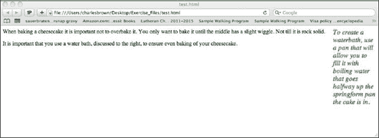
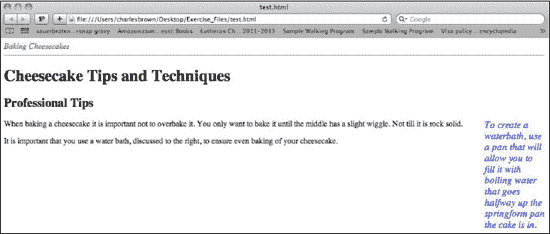
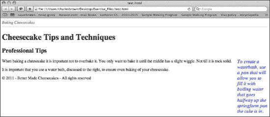
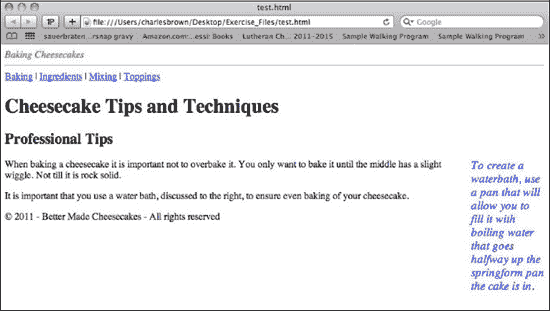
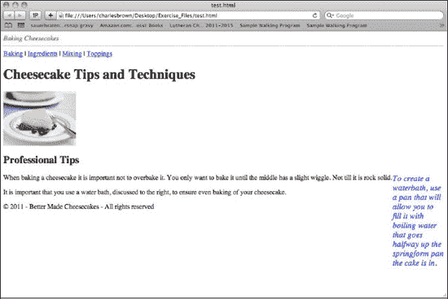
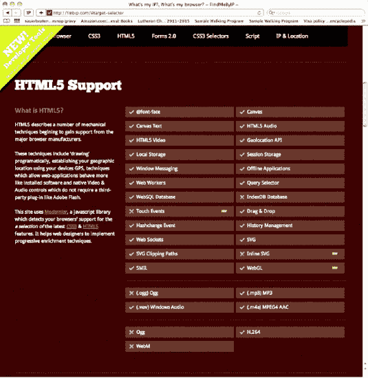
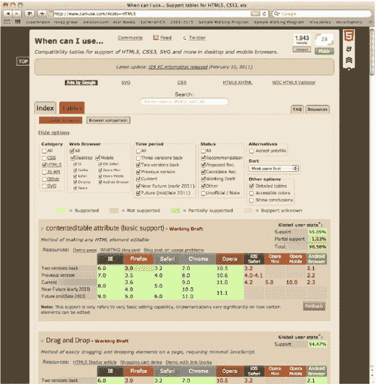
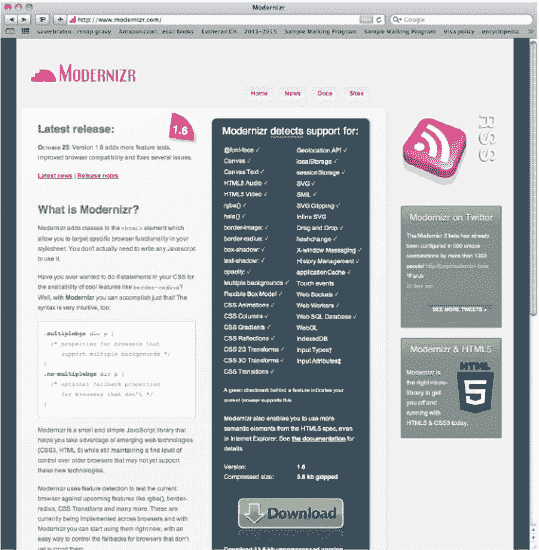

# 一、HTML5 页面结构

2004 年，一群来自苹果、Opera 和 Mozilla 的开发人员对 HTML 和 XHTML 的发展方向感到不满。作为回应，他们成立了一个名为网络超文本应用技术工作组(WHATWG)的组织。他们在 2005 年以 Web 应用 1.0 的名义发布了他们的第一个提议。2006 年，万维网联盟(W3C)决定正式支持 WHATWG，而不是继续开发 XHTML。2007 年，W3C 以 HTML5 的名称重新发布了新规范。

虽然人们认为最终规格要到 2022 年才会公布，但现在正在重新考虑这个时间表。在 2009-2010 年，人们对 HTML5 的兴趣激增，因此，越来越多的浏览器和设备支持它。

第一章将介绍 HTML5 规范中的许多新结构。此外，它将检查那些将支持新 HTML5 结构的设备。

### 解决方案 1-1:在 HTML5 中创建 DOCTYPE

因为 HTML 有几个版本，所以浏览器需要一个 DOCTYPE 类型来告诉它使用的是哪个版本，以及如何正确地呈现它。

在这个解决方案中，您将学习如何正确地为 HTML5 创建 DOCTYPE。

#### 涉及到什么

在传统的 HTML 或 XHTML 文档中，DOCTYPE 标记可能如下所示:

`<!DOCTYPE html PUBLIC "-//W3C//DTD XHTML 1.0 Transitional//EN" "http://www.w3.org/TR/xhtml1/DTD/xhtml1-transitional.dtd">`

DOCTYPE 有许多变体。

HTML5 将 DOCTYPE 简化为:

`<!DOCTYPE html>`

#### 如何建造它

1.  打开您选择的 HTML 或文本编辑器。对于本章中显示的例子，我们使用 Dreamweaver CS5。不要使用文字处理器，因为这可能会嵌入 HTML 无法识别的额外字符。
2.  If necessary, start a new HTML document and give it the name and location of your choice.

    如果您使用像 Dreamweaver 这样的 HTML 编辑器，您可能会得到如下所示的代码:

    `<!DOCTYPE html PUBLIC "-//W3C//DTD XHTML 1.0 Transitional//EN"
     "http://www.w3.org/TR/xhtml1/DTD/xhtml1-transitional.dtd">
    <html >
         <head>
              <meta http-equiv="Content-Type" content="text/html; charset=UTF-8" />
              <title>Untitled Document</title>
         </head>
          <body>
         </body>
    </html>`

    如果您的代码看起来与上面的有些不同，现在不要担心。

3.  按如下方式更改 DOCTYPE 标签:`<!DOCTYPE html>`

#### 专家提示

不要在 DOCTYPE 标记前留下任何空格。空格可能会导致浏览器呈现 HTML5 代码时出错。

### 解决方案 1-2:在 HTML5 中创建字符编码声明

不同的语言使用不同的字符集。这个标签声明使用哪个字符集。大多数语言最常用的字符集是 UTF-8。

在这个解决方案中，您将学习如何正确格式化 HTML5 中的字符集。

#### 涉及到什么

在大多数 HTML 文档中，您会在开头看到以下标记:

` <meta http-equiv="Content-Type" content="text/html; charset=UTF-8" />`

HTML5 现在已经将这个标签简化为:

`<meta charset="UTF-8" />`

#### 如何建造它

在解决方案 1-1 所示的`<!DOCTYPE html>`标签下，键入以下内容:

`<meta charset = "UTF-8" />`

#### 专家提示

虽然 UTF-8 在大多数情况下都可以工作，但是许多开发人员发现使用 ISO-8859-1 作为字符集提供了更多的灵活性。另一种字符集 UTF-16 有时会导致错误的字符，在某些情况下，会导致应用无法正常运行。

### 解决方案 1-3:将文档分成多个部分

在 HTML 中，将文档细分为不同部分的唯一真正方法是使用`
`标签。HTML5 提供了一些新的选项。

在这个解决方案中，您将学习如何使用新的 HTML5 标记来创建不同的文档节。在后续的解决方案中，我们将讨论其他结构分割元素。

#### 涉及到什么

HTML `
`标签成功地将文档分成几个部分。但是单词`
`在标识文档的各个部分时没有什么意义。HTML5 提供了几个新的结构元素，将文档分成有意义的部分。

这些元素中的第一个是`<section></section>`标签。该元素表示文档的任何逻辑部分。这可能意味着产品描述、章节、讨论等等。虽然它的功能类似于`
`标签，但它提供了一种更具描述性和内容敏感性的方式来划分文档。

当在 HTML5 中创建一个部分时，就像在 HTML 中使用`
`标签一样，可以使用 id 或 class 属性。因为这两个属性可以应用于任何 HTML5 元素，所以它们被称为全局属性。每个 id 必须是唯一的，就像在 HTML 中一样，并且可以多次使用类来调用预定义的脚本或格式。

所有 HTML5 元素都有三种类型的属性:global，是所有元素共有的；特定于元素(仅适用于该元素)和事件处理程序内容属性(将根据文档中的内容触发)。随着你在本书中的进展，将会讨论其中的许多问题。

#### 如何建造它

假设您正在创建一个关于制作芝士蛋糕的文档。以下是`<section></section>`元素的典型用法。

`<section id="mixing">
     <h2>The proper way to mix ingredients</h2>
     
When using a stand-mixer, it is important that you do not over-mix the ingredients<.../p>
</section>
<section id="baking">
     <h2>Proper baking techniques</h2>
     
 It is important that you bake your cheesecake using a lot of moisture in the oven…

</section>`

#### 专家提示

本章中显示的`<section></section>`元素和后续结构元素的目的不是替换 HTML `
`标签。如果你把你的文档分成逻辑文档部分，使用`<section></section>`元素或者一个结构元素。然而，如果你只是为了格式化而分割文档，那么使用< div >标签是合适的。

### 解决方案 1-4:使部分文档可分发

越来越重要的是使页面的全部或部分内容可分发。例如，论坛讨论、博客、读者评论等等都可能成为分发或联合的对象。

在这个解决方案中，我们将讨论新的 HTML5 元素,`<article></article>`,它比传统的 HTML 更容易实现。

#### 涉及到什么

这个结构标签的目的不是作为将文档分成几个部分的另一种方式。相反，它用于标识文档中您希望独立于文档其余部分并可从文档其余部分分发的部分。

由于`<article></article>`元素是独立的，它可以有自己的部分和子部分。

您可以通过用`<article></article>`元素包围任何元素来使其可分发。

#### 如何建造它

使用解决方案 1-3 中显示的示例，您可以按如下方式分发芝士蛋糕说明。

`<article>
     <section id="mixing">
          <h2>The proper way to mix ingredients</h2>
          
When using a stand-mixer, it is important that you do not over mix the ingredients…

     </section>
     <section id="baking">
          <h2>Proper baking techniques</h2>
          
 It is important that you bake your cheesecake using a lot of moisture in the oven…

     </section>
</article>`

#### 专家提示

将`<article></article>`元素视为独立的文档，而不是更大文档的一部分。这样，当它被分发时，它将是完全可读和可理解的。

### 解决方案 1-5:创建旁白

如果想在传统的 HTML 中创建一个边讨论，你使用`
`标签并正确使用层叠样式表(CSS)进行适当定位。HTML5 通过提供一个新的结构元素`<aside></aside>`使这个过程变得更加容易。像`<section>`元素一样，它提供了一种更具描述性的文档分段方式。

在这个解决方案中，您将学习如何使用`<aside></aside>`元素。

#### 涉及到什么

通常，您可能想要创建通常称为边栏讨论的内容。图 1-1 显示了一个用`<aside></aside>`标签完成的例子。

**图 1-1。**使用`<aside></aside>`元素

当然，这也可以通过使用`
`元素来完成。然而，`<aside>` < /aside >元素的使用提供了更有意义的结构描述。

#### 如何建造它

上一节中显示的示例是用以下代码构建完成的:

`<aside style="font-size:larger;font-style:italic;color:blue;float:right;width:120px;">
     To create a water bath, use a pan that will allow you to fill it with boiling water that goes halfway up the springform pan in which the cake is placed.
</aside>

     When baking a cheesecake, it is important not to over bake it. You only want to bake it until the middle has a slight wiggle, not until it is rock solid.

     It is important that you use a water bath, discussed at the right, to ensure even baking of your cheesecake.

`

#### 专家提示

`<aside></aside>`元素的放置至关重要。在上面的例子中，它作为主文档的一部分。但是，如果您希望侧边栏特定于某个部分，那么您必须将它放在该部分中。如果您使用的是`<article></article>`元素，这一点尤其重要，这样侧边栏就可以发布其余的相关资料。

### 解决方案 1-6:创建标题

使用结构化的`<header></header>`元素创建一个文档或章节标题。也可以包含`<h1>`到`<h6>`；虽然，正如你将在本章后面看到的，它们由`<hgroup></hgroup>`元素更好地服务。您还可以使用它来帮助放置徽标和章节目录。

在这个解决方案中，您将看到一个使用`<header></header>`元素的例子。

#### 涉及到什么

`<header></header>`元素是创建文档和章节介绍的一种简单方法。图 1-2 显示了添加到我们例子中的`<header></header>`元素。

**图 1-2。**使用`<header></header>`元素

注意，在这个例子中，`
`元素用于绘制水平线。这不是任何形式的要求。

#### 如何建造它

以下代码用于创建图 1-2 中所示的文档。

`<header>
     
          Baking Cheesecakes
     

</header>
<aside style="font-size:larger;font-style:italic;color:blue;float:right;width:120px;">
     To create a water bath, use a pan that will allow you to fill it with boiling water that goes halfway up the spring form pan in which the cake is placed.
</aside>

     When baking a cheesecake, it is important not to over bake it. You only want to bake it until the middle has a slight wiggle, not until it is rock solid.

     It is important that you use a water bath, discussed at the right, to ensure even baking of your cheesecake.

`

您可以使用`<header></header>`结构元素作为对文档中大多数其他结构元素的介绍。

#### 专家提示

不能在`<footer>`、`<address>`或其他`<header>`元素中使用`<header></header>`元素。如果这样做，结果将是不正确的渲染。

### 方案 1-7:分组< h1 >到< h6 >元素

在某些情况下，您可能希望将`<h1>`到`<h6>`元素组合在一起。例如，您可能想要创建一个使用`<h1>`元素的部分标题。然后，在它的正下方，放置一个使用了`<h2>`元素的副标题。在 HTML5 中，您可以将`<h1>`和`<h2>`元素组合到一个名为`<hgroup>`的新结构元素中。

在这个解决方案中，您将看到一个使用`<hgroup></hgroup>`元素的例子。

#### 涉及到什么

结构上的`<hgroup></hgroup>`让你能够显示你正在将标题(`<h1>`到`<h6>`)组合在一起，以满足替换标题和副标题的需要。

添加到解决方案 1-6 的示例中，会出现一个`<hgroup>`，如图 1-3 中的所示。

**图 1-3。**使用<h 组></h 组>元素

在这种情况下，`<h1>`和`<h2>`标题在`<hgroup>`中使用。

#### 如何建造它

在图 1-3 所示的例子中，使用了以下代码。：

`<header>
      
          Baking Cheesecakes
     
     

</header>
<hgroup draggable="true">
     <h1>Cheesecake Tips and Techniques</h1>
     <h2>Professional Tips</h2>
</hgroup>
<aside style="font-size:larger;font-style:italic;color:blue;float:right;width:120px;">
     To create a water bath, use a pan that will allow you to fill it with boiling water that goes halfway up the spring form pan in which the cake is placed.
</aside>

     When baking a cheesecake, it is important not to over bake it. You only want to bake it until the middle has a slight wiggle, not until it is rock solid.

It is important that you use a water bath, discussed at the right, to ensure even baking of your cheesecake.
`

注意，我们将`<hgroup>`元素放在了`<header></header>`元素的下面。虽然这不是必需的，但是这是一个很好的实践。你可以在 HTML5 文档的任何部分使用`<hgroup>`元素。

#### 专家提示

在一个构建良好的 HTML5 文档中，`<hgroup></hgroup>`元素是将各种标题和副标题联系在一起的好方法。如果您正在使用`<article></article>`元素，这一点尤其正确。这样你就可以确信，任何标题及其相关的子标题都将作为一个整体移动。

### 解决方案 1-8:创建页脚

顾名思义，`<footer></footer>`元素将为 HTML5 文档创建一个页脚——该文档的一个结构部分。页脚可以包含版权信息、作者信息、引用、隐私政策等等。

在这个解决方案中，您将检查`<footer></footer>`元素是如何工作的。

#### 涉及到什么

您可以使用结构化的`<footer></footer>`元素为 HTML5 文档或该文档中的任何部分创建页脚。

基于解决方案 1-3，`<footer>`元素的结果显示在图 1-4 中。

**图 1-4。**使用`<footer></footer>`元素

版权符号“&copy”以及任何关于权利和所有权的文本都放在页脚中。

#### 如何建造它

在图 1-4 中，使用了以下代码:

`<header>
      
          Baking Cheesecakes
     
     

</header>
<hgroup draggable="true">
     <h1>Cheesecake Tips and Techniques</h1>
     <h2>Professional Tips</h2>
</hgroup>
<aside style="font-size:larger;font-style:italic;color:blue;float:right;width:120px;">
     To create a water bath, use a pan that will allow you to fill it with boiling water that goes halfway up the spring form pan in which the cake is placed.
</aside>

     When baking a cheesecake, it is important not to over bake it. You only want to bake it until the middle has a slight wiggle, not until it is rock solid.

It is important that you use a water bath, discussed at the right, to ensure even baking of your cheesecake.

<footer> &copy; 2011 - Better Made Cheesecakes - All rights reserved </footer>`

`<footer></footer>`元素既可以用于整个 HTML5 文档，就像这里一样，也可以用于文档内的结构划分。

#### 专家提示

在<标题>元素或另一个`<footer>`元素中不能使用`<footer>`元素。这将导致不正确的渲染。

### 解决方案 1-9:在 HTML5 文档中创建导航

大多数网站都有导航链接。链接，不管是超链接还是某种按钮，通常都通过使用一个`
`元素与文档的其余部分分开。同样，除了它是一个分区之外，它并没有将该部分标识为专门用于导航。在 HTML5 中，您现在可以在标记中标识用于导航帮助的部分。

在本节中，您将了解新的结构化 HTML5 元素:`<nav></nav>`。

#### 涉及到什么

结构元素`<nav></nav>`可以用来创建一个容器来保存整个 HTML5 文档或文档中任何部分的导航元素。

结果如图 1-5 所示。

**图 1-5。**使用`<nav></nav>`元素

这为导航部分提供了自己的标记，使其更容易识别。

#### 如何建造它

以下代码用于图 1-5 。所示的导航链接仅用于说明目的，没有任何功能。

`<header>
      
          Baking Cheesecakes
     
     

</header>
<nav>
     <a href="/Baking/" target="_blank">Baking</a> |
     <a href="/ingredients/" target="_blank">Ingredients</a> |
     <a href="/mixing/" target="_blank">Mixing</a> |
     <a href="/toppings/" target="_blank">Toppings</a>
</nav>
<hgroup draggable="true">
     <h1>Cheesecake Tips and Techniques</h1>
     <h2>Professional Tips</h2>
</hgroup>
<aside style="font-size:larger;font-style:italic;color:blue;float:right;width:120px;">
     To create a water bath, use a pan that will allow you to fill it with boiling water that goes halfway up the spring form pan in which the cake is placed.
</aside>

     When baking a cheesecake, it is important not to over bake it. You only want to bake it until the middle has a slight wiggle, not until it is rock solid.

It is important that you use a water bath, discussed at the right, to ensure even baking of your cheesecake.

<footer> &copy; 2011 - Better Made Cheesecakes - All rights reserved </footer>`

如您所见，文档中的导航元素现在有了自己易于识别的标记。它们可以放在整个 HTML5 文档中，如此处所示，也可以放在文档的任何部分中。

#### 专家提示

你并不局限于图 1-5 中所示的超链接。在`<nav></nav>`容器元素中，您可以放置任何您想要的导航工具。

第二个技巧是不要在`<footer>`元素中使用`<nav></nav>`容器。虽然没有严格禁止，但这可能会导致不正确的呈现。

### 解决方案 1-10:插入图形

在网页中插入照片、插图、图表等是相当常见的。到目前为止，开发者可以在任何需要的地方插入一个``元素。现在，您可以使用 HTML5 中新的`<figure></figure>`元素，使用标记来指定图片应该放在哪里。

在这个解决方案中，您将看到一个使用`<figure></figure>`元素的例子。

#### 涉及到什么

结构元素`<figure></figure>`可以用来创建一个容器来保存 HTML5 文档或文档中任何部分的说明性元素。

结果如图 1-6 所示。

**图 1-6。**使用`<figure></figure>`元素

文档中的说明性元素现在有了自己的易于识别的标记。它可以用于文档的任何子部分。

#### 如何建造它

以下代码用于图 1-6 。所示的导航链接仅用于说明目的，没有任何功能。

`<header>
      
          Baking Cheesecakes
     
     

</header>
<nav>
     <a href="/Baking/" target="_blank">Baking</a> |
     <a href="/ingredients/" target="_blank">Ingredients</a> |
     <a href="/mixing/" target="_blank">Mixing</a> |
     <a href="/toppings/" target="_blank">Toppings</a>
</nav>
<hgroup draggable="true">
     <h1>Cheesecake Tips and Techniques</h1>
    <figure>
        
    </figure>
     <h2>Professional Tips</h2>
</hgroup>
<aside style="font-size:larger;font-style:italic;color:blue;float:right;width:120px;">
     To create a water bath, use a pan that will allow you to fill it with boiling water that goes halfway up the spring form pan in which the cake is placed.
</aside>

     When baking a cheesecake, it is important not to over bake it. You only want to bake it until the middle has a slight wiggle, not until it is rock solid.

It is important that you use a water bath, discussed at the right, to ensure even baking of your cheesecake.

<footer> &copy; 2011 - Better Made Cheesecakes - All rights reserved </footer>`

很容易识别照片的位置，因为它现在使用`<figure></figure>`元素拥有自己的容器标记。

#### 专家提示

随着新的`<figure>`元素而来的是另一个新的 HTML5 元素，叫做`<figcaption> </figcaption>`。将它放在`<figure>`元素中，如下所示:

`<figure>
     
     <figcaption>One of our many cheesecakes</figcaption>
 </figure>`

如果你把`<figcaption>`元素放在图片下面，如上面的例子所示，它会出现在右边。如果你把它放在上面，它会出现在左边。

### 解决方案 1-11:浏览器兼容性

本章中显示的数字来自 Safari 版本 5.0.3 和 Mozilla Firefox 版本 3.6.13。虽然它可以在所有流行的浏览器上运行，但 HTML5 的兼容性既不一致也不通用。

在本解决方案中，我们讨论如何测试浏览器兼容性，如果不兼容，如何纠正不兼容性。

#### 涉及到什么

虽然大多数流行浏览器的当前版本能够很好地处理最新的 HTML5 规范，但对于较旧的浏览器来说却不是这样。特别值得关注的是版本 9 之前的 Internet Explorer 版本。

#### 如何建造它

最喜欢的一个网站是:`[www.findmebyip.com](http://www.findmebyip.com)`。

如图 1-7 所示，该网站将测试你的浏览器对 HTML5 的兼容性。

**图 1-7。**一个`[www.findmebyip.com](http://www.findmebyip.com)`的例子

如你所见，HTML5 的大部分功能在这款浏览器上都运行良好。根据您的浏览器或浏览器版本，您可能会得到不同的结果。

另一个网站`[www.caniuse.com](http://www.caniuse.com)`，展示了一组全面的表格，讨论了各种浏览器与 HTML5 的兼容性。该位置如图 1-8 所示。

**图 1-8。** HTML5 兼容性列于`[www.caniuse.com](http://www.caniuse.com)`

`[www.caniuse.com](http://www.caniuse.com)`的一大特色是能够过滤信息并聚焦于你所关注的元素。还有许多与这个网站相关的讨论和教程。

使用最广泛的 HTML5/CSS 资源站点之一是`[www.modernizr.com](http://www.modernizr.com)`。该位置如图 1-9 所示。

**图 1-9。**首页`[www.modernizr.com](http://www.modernizr.com)`

该网站提供了一个强大的可下载 JavaScript 库，可以调整 HTML5 和 CSS3 代码以适应特定的浏览器。这个项目是开源的，因此完全免费。大多数使用 HTML5 的开发人员使用这个库作为检查和调整代码的手段。

#### 专家提示

因为 HTML5 标准正在发展，我们强烈建议您不要完全修改现有的网站。相反，随着更新变得必要，开始逐渐采用 HTML5 中的元素。

### 总结

在本章中，我们研究了一种更精确的创建 HTML 标记的方法，而不是大量的新功能。例如，现在可以使用诸如`<section>`、`<nav>`、`<figure>`等元素，而不是简单地使用通用的`
`元素。早期清晰的标记有助于以后更好的控制和功能。

后续章节将研究这一新功能。从第二章的开始，你将开始看到这种增加的功能的可能性。