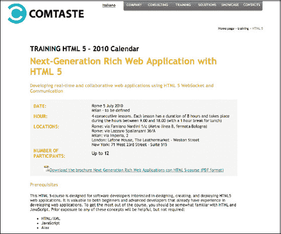

# 三、HTML5 结构和语义元素

“语义网”这个术语绝对不是新的。万维网的创始人蒂姆·伯纳斯·李第一次使用了这个词，他谈到了万维网向一种环境的转变，在这种环境中，发布的文档与以可解释的格式指定其语义上下文的信息和数据相关联。

使用 HTML5，在万维网的这个方面已经做了很多工作，并且已经引入了大量的新元素来为网页提供更好的定义和结构。然而，还有更多因素需要解决。

在这一章中，我们将重点介绍使用微数据、图形容器和 side 元素为 web 页面创建语义结构的技术和元素。

### 了解微数据

HTML5 引入了使用微数据在网页中定义自定义语义的可能性。

微数据使您能够通过使用由名称-值对和现有内容组成的语法，在 web 页面中指定机器可读的定制元素。

代表主题的自定义元素称为项目。分配给这些项目的值是它们的属性。为了使这些定制元素有效，您需要定义一个定制词汇表，其中包括表示主题的命名属性列表。

例如，如果您想要创建表示用户主题的微数据，您必须在微数据词汇表中定义它的属性。这个词汇表将包括属性声明，比如名字、姓氏、地址和社会保险号。

若要创建项，请使用 itemscope 属性。若要定义项目的属性，请使用 itemprop 属性。

特别是，itemscope 属性是与 HTML 元素关联的元素，它允许您定义元素的范围。itemscope 属性可以与任何有效的 HTML 元素相关联:

`

 
Name:Marco.

 
Last Name: Casario.

 
Photo:  

 
Address: Via Lazzaro Spallanzani.

Social Security Number: 000-0000-000.

`

在本例中，我们定义了一个具有五个属性的项目:

*   名字
*   姓
*   照片
*   地址
*   社会保险号

通过使用这种结构，可以创建您想要的所有项目。您还可以将多个属性与具有相同名称和不同值的项目相关联:

`

 
Name:Marco.

 
Last Name: Casario.

 
Photo:  

 
Address: Via Lazzaro Spallanzani.

 
Address: Via Ludovico di Breme .

Social Security Number: 000-0000-000.

`

但是，在创建项目之前，您需要创建自定义词汇表，以便能够定义元素的有效属性。因此，词汇表应是一个带有描述的属性列表，如表 3.1 所示。

**表 3.1。**用户微数据词汇

<colgroup><col align="left" valign="top" width="30%"> <col align="left" valign="top" width="65%"></colgroup> 
| **属性** | **描述** |
| :-- | :-- |
| 名字 | 用户的名称。必选。 |
| 姓 | 用户的姓氏。必选。 |
| 地址 | 用户的地址。 |
| 照片 | 用户的 PNG、GIF 或 JPG 格式的图像。 |
| 社会保险号 | 用户的有效社会保险号。必选。 |

自定义词汇表与 itemtype 属性的元素相关联:

`

 
Name:Marco.

 
Last Name: Casario.

 
Photo:  

 
Address: Via Lazzaro Spallanzani.

Social Security Number: 000-0000-000.

`

分配给 itemtype 属性的值被标识为统一资源定位器(URL)。事实上，在上面的例子中，itemtype 属性指向 URL: `[`www.my-vocabulary.org/user`](http://www.my-vocabulary.org/user)`。

词汇表还允许您为打算使用相同结构描述相同主题的开发人员提供指导。

此外，微观数据的另一个重要方面与搜索引擎有关。事实上，谷歌等搜索引擎旨在向用户呈现最有用、最丰富的搜索结果。这些信息不会影响页面的内容，但可以让搜索引擎理解来自网页的信息，并更好地呈现出来。因此，微数据也被用作一种方法，使网页更便于搜索引擎搜索。

微数据是以结构化方式执行 HTML 内容标记的三种方法之一。(另外两种方法是微格式和 RDFs。)

### 解决方案 3-1:使用 itemprop 和 itemscope 属性

HTML5 引入的微数据是一种为内容分配标签的方式，以便描述特定类型的信息。

在这个解决方案中，您将创建一个包含带有 HTML5 微数据的食谱的网页。

#### 涉及到什么

要使用微数据语法创建一个元素，基本上需要向标准 HTML 标记声明三个属性:

*   *项目范围:*用于创建项目的布尔属性
*   *itemprop:* 用于向一个项目或该项目的一个后代添加属性
*   *itemtype:* 用于定义自定义词汇

在这个解决方案中，我们将使用 Google 为我们想要描述的项目定义的自定义词汇表。在 URL: `[www.data-vocabulary.org/](http://www.data-vocabulary.org/)`:有一些自定义词汇已经被知名的搜索引擎定义和认可。

*   事件
*   组织
*   人
*   秘诀
*   产品
*   回顾
*   审核-汇总
*   面包屑
*   提供
*   报价汇总

因此，您所要做的就是将 itemtype 属性指向 URL: `[www.data-vocabulary.org/](http://www.data-vocabulary.org/)`并添加元素类型。在这个例子中，您将使用定义一个食谱的微数据，您可以在这个地址:`[www.data-vocabulary.org/Recipe/](http://www.data-vocabulary.org/Recipe/)`找到它。

有效属性在表 3-2 中指定。

**表 3-2。**菜谱微数据属性

<colgroup><col align="left" valign="top" width="20%"> <col align="left" valign="top" width="75%"></colgroup> 
| **属性** | **描述** |
| :-- | :-- |
| 名字 | 包含菜肴的名称。必选。 |
| 配方类型 | 菜的种类。例如，开胃菜、主菜或甜点。 |
| 照片 | 正在准备的菜肴的图像。 |
| 出版者 | 配方以 ISO 8601 `([`www.iso.org/iso/date_and_time_format`](http://www.iso.org/iso/date_and_time_format)`日期格式发布的日期。 |
| 摘要 | 描述菜肴的简短摘要。 |
| 回顾 | 对这道菜的评论。可以包含嵌套的审阅信息。 |
| 准备时间 | 以 ISO 8601 时间长度格式准备菜肴食谱所需的时间长度。可以使用 min 和 max 作为子元素来指定时间范围。 |
| 烹饪时间 | 以 ISO 8601 持续时间格式烹饪这道菜所需的时间。可以使用 min 和 max 作为子元素来指定时间范围。 |
| totalTime(总时间) | 以 ISO 8601 时间格式准备和烹饪一道菜所花费的总时间。可以使用 min 和 max 作为子元素来指定时间范围。 |
| 营养 | 关于食谱的营养信息。可以包含以下子元素:食用量、卡路里、脂肪、饱和脂肪、不饱和脂肪、碳水化合物、糖、纤维、蛋白质和胆固醇。这些元素不是食谱微格式的明确组成部分，但是 Google 会识别它们。 |
| 说明 | 做这道菜的步骤。可以包含子元素指令，可用于注释每个步骤。 |
| 产量 | 食谱生产的数量(例如，服务的人数、份数等等。 |
| 佐料 | 食谱中使用的一种配料。可以包含子项的名称(配料名称)和数量。用这个来识别单独的成分。 |
| 作者 | 食谱的创造者。可以包含嵌套的人员信息。 |

#### 如何建造它

当您想要使用微数据创建新元素时，首先要做的是指定它将引用的自定义词汇表。在这个解决方案中，我们将使用 Google 在 URL: `[www.data-vocabulary.org/Recipe/](http://www.data-vocabulary.org/Recipe/)`定义的词汇表，其有效属性是在表 3-2 中指定的属性。

使用 itemtype 属性指定词汇:

`<section itemtype="http://www.data-vocabulary.org/Recipe">`

要创建一个新元素，您所要做的就是使用 Boolean itemscope 属性:

`<section itemscope itemtype="http://www.data-vocabulary.org/Recipe">`

现在，您可以为 Recipe type 元素声明由自定义微数据词汇表标识的属性。

首先声明菜谱的名称、成品菜肴的照片以及菜谱的作者:

`<h1 itemprop="name">
Ciabatta Bread
</h1>

<a itemprop="author" href="http://groups.google.com/group/alt.bread.recipes
/browse_thread/thread/ad0e477790ef4f03/a644f520f4b3cd48?rnum=2#">Author's original URL</a>.

 
`

还可以通过指定评论属性来插入对菜肴的评论:

`
Ciabatta is an Italian white bread made with wheat flour and yeast. The loaf is somewhat elongated, broad, and flattish. Its name is the Italian word for slipper. There are many variations of Ciabatta.
Ciabatta in its modern form was developed in 1982\. Since the late 1990s, it has been popular across Europe and the United States. It is widely used as a sandwich bread.
From Wikipedia http://en.wikipedia.org/wiki/Ciabatta
`

每个食谱都需要配料，所以使用配料属性来指定它们:

`<h3 itemprop="ingredients">
<ul>
<li>1 1/2 cups water </li>
<li>15 grams of salt </li>
<li>1 teaspoon sugar </li>
<li>1 tablespoon olive oil </li>
<li>3 1/4 cups all-purpose flour </li>
<li>20 grams of fresh yeast </li>
</ul>
</h3>`

为了插入 Recipe 对象的元素，我们使用了一个无序列表，并为 H3 元素声明了 itemprop 属性。事实上，可以为任何 HTML 元素声明 itemprop 属性。

现在添加说明，这次使用编号列表:

`<h4 itemprop="instructions">Instructions
<ol>
  <li>In Kitchen Aid style mixer, mix all ingredients roughly until combined with paddle. Let it rest for 10 minutes. </li>
  <li>With the paddle (I prefer the hook to prevent the dough from crawling into the guts of the mixer), beat the living hell out of the batter. It will start out like pancake batter but, in anywhere from 10 to 30 minutes, it will set up and work like a very sticky dough. If it starts climbing too soon, then switch to the hook. </li>
  <li>You'll know it's done when it separates from the side of the bowl and starts to climb up your hook/paddle, just coming off the bottom of the bowl. (I mean this literally about the climbing—I once didn't pay attention, and it climbed up my paddle into the greasy inner workings of the mixer. It was not pretty!) Anyway, it will definitely pass the windowpane test. </li>
  <li>Place into a well-oiled container, and let it triple! It must triple! For me, this takes about 2.5 hours.
    Empty onto a floured counter (scrape if you must, however you got to get the gloop out), and cut into 3 or 4 pieces. </li>
  <li>Spray with oil and dust with lots of flour. Let it proof for about 45 minutes, which gives you enough time to crank that oven up to 500°F.
    After 45 minutes or so, the loaves should be puffy and wobbly; now it's iron fist, velvet glove time. </li>
  <li>Pick up and stretch into your final Ciabatta shapes (~10" oblong rectangles), and flip them upside down. This redistributes the bubbles, so that you get even bubbles throughout. Then place the loaves on parchment or a heavily-floured peel. </li>
  <li>Try to do it in one motion and be gentle. It might look like you've ruined them completely, but the oven spring is immense on these things. </li>
  <li>Bake at 500°F until they are 205°F in the center (about 15-20 minutes), rotating 180-degrees half way through. Some people like to turn the oven down to 450°F after 10 minutes—whatever floats your boat. I usually bake in 2 batches.</li>
</ol>
</h4>`

您还可以指定估计的烹饪时间:

`

Cook Time: 50 minutes approximately

`

通过在浏览器中打开该文件，您将获得如图 3-1 所示的结果。

**图 3-1。**使用微数据的配方网页

除非用户打开页面的源代码，否则他或她不会注意到由于微数据而产生的任何差异。然而，你所做的是为你的网页创建一个健壮的语义结构，搜索引擎肯定会欣赏它。

以下是该示例的完整源代码:

`<!DOCTYPE HTML>
<html>
<head>
<meta http-equiv="Content-Type" content="text/html; charset=UTF-8">
<title>Solution 3-1: Using the itemprop and itemscope</title>
</head>

<body>

<section itemscope itemtype="http://www.data-vocabulary.org/Recipe">

<h1 itemprop="name">
Ciabatta Bread
</h1>

<a itemprop="author" href="http://groups.google.com/group/alt.bread.recipes/browse_thread
/thread/ad0e477790ef4f03/a644f520f4b3cd48?rnum=2#">Author's original URL</a>.

 

 Ciabatta is an Italian white bread made with wheat flour and yeast. The loaf is somewhat elongated, broad, and flattish. Its name is the Italian word for slipper. There are many variations of Ciabatta.
Ciabatta in its modern form was developed in 1982\. Since the late 1990s, it has been popular across Europe and the United States. It is widely used as a sandwich bread.
From Wikipedia http://en.wikipedia.org/wiki/Ciabatta

<h3 itemprop="ingredients"> <ul>
<li>1 1/2 cups water </li>
<li>15 grams of salt </li>
<li>1 teaspoon sugar </li>
<li>1 tablespoon olive oil </li>
<li>3 1/4 cups all-purpose flour </li>
<li>20 grams of fresh yeast </li>
</ul>
</h3>

 Cook Time: 50 minutes approximately

<h4 itemprop="instructions">Instructions <ol>
  <li>In Kitchen Aid style mixer, mix all ingredients roughly until combined with paddle. Let it rest for 10 minutes. </li>
  <li>With the paddle (I prefer the hook to prevent the dough from crawling into the guts of the mixer), beat the living hell out of the batter. It will start out like pancake batter but in anywhere from 10 to 30 minutes it will set up and work like a very sticky dough. If it starts climbing too soon, then switch to the hook. </li>
  <li>You'll know it's done when it separates from the side of the bowl and starts to climb up your hook/paddle, just coming off the bottom of the bowl. (I mean this literally about the climbing—I once didn't pay attention, and it climbed up my paddle into the greasy inner workings of the mixer. It was not pretty!) Anyway, it will definitely pass the windowpane test. </li>
  <li>Place into a well-oiled container and let it triple! It must triple! For me, this takes about 2.5 hours.
    Empty onto a floured counter (scrape if you must, however you got to get the gloop out), and cut into 3 or 4 pieces. </li>
  <li>Spray with oil and dust with lots of flour. Let it proof for about 45 minutes, which gives you enough time to crank that oven up to 500°F.
    After 45 minutes or so, the loaves should be puffy and wobbly; now it's iron fist, velvet glove time. </li>
  <li>Pick up and stretch into your final Ciabatta shapes (~10" oblong rectangles), and flip them upside down. This redistributes the bubbles, so that you get even bubbles throughout. Then place the loaves on parchment or a heavily-floured peel. </li>
  <li>Try to do it in one motion and be gentle. It might look like you've ruined them completely, but the oven spring is immense on these things.   </li>
  <li>Bake at 500°F until they are 205°F in the center (about 15-20 minutes), rotating 180-degrees half way through. Some people like to turn the oven down to 450°F after 10 minutes—whatever floats your boat. I usually bake in 2 batches.</li>
</ol>
</h4>

</section>

</body> </html>`

#### 专家提示

包括谷歌在内的一些搜索引擎通常不会显示不可见的用户元素，比如元标签。然而，这并不意味着搜索引擎完全忽略这些信息。

在某些情况下，向搜索引擎提供更详细的信息是有用的，即使我们不想让访问者看到这些信息。例如，如果我们允许用户在网站上为我们的食谱打分，平均分数是 8 分，那么用户(而不是搜索引擎)会认为这个分数是基于 1 到 10 分的范围。在这种情况下，您可以使用 meta 元素来指定这个方面，如下所示:

`

   Rating: 8
   <meta itemprop="best" content="10" />

`

在这段代码中，meta 标记指定了在页面中看不到的附加信息，但是这些信息有助于搜索引擎理解分级系统是基于 1 到 10 的范围。属性的值是使用 content 属性指定的。

### 解决方案 3-2:创建自定义词汇表

使用微数据的优势在于，它允许您在 web 页面中创建 HTML 标准元素中没有的自定义元素。

您需要创建一个自定义词汇表，以便您将创建的结构能够定义名称-值对组，供其他开发人员重用，并被搜索引擎识别。

自定义词汇表只是自定义属性的列表，您创建它来定义某些元素，这些元素将作为其他开发人员和搜索引擎设计人员的技术文档。

即使这不是一个强制性的练习，也强烈建议你创建一个自定义词汇表。

#### 涉及到什么

正如您在前面的解决方案中已经看到的，Google 为一些定制元素提供了一些定制词汇表。已经被定义并被搜索引擎识别的定制词汇可以在 URL: `[www.data-vocabulary.org/](http://www.data-vocabulary.org/)`获得。

要创建自定义词汇表，您所要做的就是记录定义元素的属性，发布 web 页面，并使用 itemtype 属性指向它。

#### 如何建造它

创建自定义词汇表意味着创建一个 HTML 页面，记录定义自定义元素结构的属性。在本解决方案中，您将创建一个自定义词汇表来描述培训课程。

因此，创建一个新网页，然后发布到远程服务器:

`<!DOCTYPE HTML>
<html>
<head>
<meta http-equiv="Content-Type" content="text/html; charset=UTF-8">
<title>Solution 3-2: Creating a custom vocabulary</title>
</head>

<body>
<h1>
Course
</h1>

When course information is marked up in web pages, use the following information in a course.

To see an example, go to the <a href="http://www.comtaste.com/en/html-5-training.htm">Comtaste Training page</a>: http://www.comtaste.com/en/html-5-training.htm

<h2>
Course Properties
</h2>
<table width="100%" border="1" cellspacing="2" cellpadding="2">
  <tr>
    <th scope="col">Properties</th>
    <th scope="col">Description</th>
  </tr>
  <tr>
    <td>name</td>
    <td>The title of the course. Required.</td>
  </tr>
  <tr>
    <td>subtitle</td>
    <td>A short summary describing the course.</td>
  </tr>
  <tr>
    <td>summary</td>
    <td>A short description of the course.</td>
  </tr>
  <tr>
    <td>description</td>
    <td>A detailed description of the course and subjects.</td>
  </tr>
  <tr>
    <td>date</td>
    <td>The published dates.</td>
  </tr>
  <tr>
    <td>hour</td>
    <td>The total duration of the course. </td>
  </tr>
  <tr>
    <td>location</td>
    <td>The location of the course.</td>
  </tr>
  <tr>
    <td>students</td>
    <td>The maximum number of students per course.</td>
  </tr>
  <tr>
    <td>prerequisites</td>
    <td> The skill required to participate to the course (if needed).</td>
  </tr>
  <tr>
    <td>objectives</td>
    <td>A short description of what you'll learn.</td>
  </tr>
  <tr>
    <td>HDrequirements</td>
    <td>Hardware and software requested for this course.</td>
  </tr>
  <tr>
    <td>book</td>
    <td>A list of course assets.</td>
  </tr>
  <tr>
    <td>outline</td>
    <td>The complete outline of the course.</td>
  </tr>
  <tr>
    <td>price</td>
    <td>The price of the course.</td>
  </tr>
  <tr>
    <td>instructor</td>
    <td>The name of the instructor that will lead the course.</td>
  </tr>
</table>
</body>
</html>`

因为是简单的 HTML 文件，所以可以用常用的 web 浏览器打开，如图图 3-2 所示。

**图 3-2。**记录课程元素属性的自定义词汇表页面

为了使用词汇表，在将 HTML 页面发布到远程 URL 后，必须使用 itemtype 属性指定地址:

`
`

要查看使用课程元素微数据的 HTML 页面示例，您可以访问这个 URL: `[www.comtaste.com/en/html-5-training.htm](http://www.comtaste.com/en/html-5-training.htm)`，如图 3-3 所示。

**图 3-3。**课程微数据页面

#### 专家提示

Google 为开发者提供了一个有趣的工具，丰富的代码片段测试工具:`[www.google.com/webmasters/tools/richsnippets](http://www.google.com/webmasters/tools/richsnippets)`。

你可以插入一个有效的 URL 来检查 Google 是否能正确解析你的结构化数据标记并显示在搜索结果中，如图图 3-4 所示。

**图 3-4。**丰富的代码片段测试工具正在运行

### 解决方案 3-3:了解链接类型和关系

从 HTML 的第一个版本开始，链接就使得简单的文本页面易于导航。然而，HTML5 引入了一个新概念:链接关系。链接关系让你不仅能告诉浏览器你所指向的页面或资源，还能告诉你为什么要指向它。

链接关系可以分为两类:

*   *外部资源链接:*指向浏览器处理的资源的所有链接，如样式表、快捷图标、pingback 服务器等
*   *超链接:*链接到其他文档的简单链接

#### 涉及到什么

本质上，在 HTML5 中创建链接关系需要三个标签:

在页面的`<head>`中使用`<link` >元素

使用`<a>`元素

使用一个`<area>`元素

要确定哪些链接类型适用于链接或区域元素，必须在空格上拆分元素的`rel`属性:

`<a href="myTag/html5" rel="tag">html5</a>`

在这个代码示例中，我们创建了一个标记链接。

`<a>`和`<area>`元素上的`rel`属性控制元素创建什么类型的链接。属性的值必须是一组空格分隔的标记。

`rel`属性没有默认值。如果省略该属性，或者用户代理无法识别该属性中的任何值，则该文档与目标资源没有特定的关系，只是两者之间有一个超链接。

#### 如何建造它

使用链接关系非常简单。这里不提供代码示例，而是用 HTML5 提供的新的`rel`值列表来查看一个表，这样更有用。

表 3-3 总结了可用于`rel`属性的链接类型。

**表 3-3** 。新的 HTML5 链接类型

<colgroup><col align="left" valign="top" width="25%"> <col align="left" valign="top" width="75%"></colgroup> 
| **属性** | **描述** |
| :-- | :-- |
| 档案馆 | 提供记录、文档或其他历史资料的链接。

一个例子就是:
`<a href="/archive" rel="archives">My Blog's Archive</a>` |
| 作者 | 定义一个页面的超链接，该页面提供关于最近的 article 元素的作者、定义超链接的元素的祖先(如果有)或整个页面的附加信息。

例如:
`This article has been written by <a href="http://www.linkedin.com/in/marcocasario" rel="author">Marco Casario</a>` |
| 外部 | 指示超链接指向网站外部的资源。 |
| 第一个、最后一个、上一个、下一个和上一个 | 指示超链接指向当前页面出现的序列中的第一个、最后一个、上一个或下一个资源。

up 值表示与当前文档相比的“父”文档(在层次结构中)。

例如:

`<a href="/firstArticle.htm" rel="first">First Part</a>
   <a href="/nextArticle.htm" rel="next">Read the next article</a>
   <a href="/lastArticle" rel="last">Last part of this series</a>` |
| 图标 | 定义表示页面或站点的图标，当在用户界面中表示页面时，用户代理应该使用该图标。

尺寸属性给出了可视媒体图标的尺寸。
比如:
`<link rel=icon href="mac.icns" sizes="128x128 512x512">
<link rel=icon href="gnome.png" type="image/png">` |
| 许可证 | 表示引用的文档提供版权许可条款，根据这些条款提供当前文档的主要内容。 |
| nofollow(无跟踪) | 表示该链接未经该页面的原作者或出版商认可，或者包含指向引用文档的链接主要是因为与这两个页面有关联的人员之间的商业关系。

该关键字不创建超链接。相反，它注释由元素创建的任何其他超链接。 |
| 诺弗罗 | 指示在跟随链接时不会泄露推荐人信息。

该关键字不创建超链接，但是注释该元素创建的任何其他超链接。 |
| 广播 | pingback 系统是一种当其他网站链接到博客时自动通知该博客的方式。

它允许你在有人链接到他们的文档时得到通知。

例如:

`<link rel="pingback" href="pingback server url">.`
更多信息参见 Pingback 1.0 规范
`[`hixie.ch/specs/pingback/pingback-1.0`](http://hixie.ch/specs/pingback/pingback-1.0)` |
| 预取 | 指示抢先获取和缓存指定的资源可能是有益的，因为用户很可能需要该资源。 |
| 搜索 | 表示引用的文档提供了一个专门用于搜索文档及其相关资源的界面。

查看此链接了解更多信息:`[www.opensearch.org/Specifications/OpenSearch/1.1#Autodiscovery_in_HTML.2FXHTML](http://www.opensearch.org/Specifications/OpenSearch/1.1#Autodiscovery_in_HTML.2FXHTML)` |
| 补充报道 | 指示引用的文档如果被检索，将在二级浏览上下文中显示(如果可能)，而不是在当前浏览上下文中显示。 |
| 标签 | 指示引用文档表示的标签应用于当前文档。 |
| 帮助 | 链接到上下文相关的帮助页面。 |

#### 专家提示

当考虑网页的语义时，你不能避免考虑你的选择对搜索引擎优化(SEO)的影响。

事实上，拥有一个网页链接之间关系的语义表也有助于它们在传统搜索引擎上的定位。

谷歌没有隐藏它——恰恰相反:它鼓励在你的网页中使用语义和结构。

使用上一页、下一页、最后一页和第一页的关系，同时改进搜索和存档，意味着你可以通过将搜索引擎流量导向更连贯的内容，帮助搜索引擎正确地索引你网站的页面。

标签关系在对页面进行分类时非常有用，它通过给文档分配一个更广泛接受的类别，因此比旧的元关键字系统更有用，也更受重视。

外部关系允许你指定一个链接为“外部”，这实际上意味着告诉搜索引擎分配一个不同的权重(可能是一个较低的值)给那个特定的链接，而不是指向你的网站页面的链接。

### 解决方案 3-4:标题和 h 组元素

在印刷中，标题是以清晰和直接的方式传达文章和章节标题信息的基本元素。从 HTML 的早期版本开始，这也是 Web 上的一个明显需求。标题总是代表网页的一个重要的语义元素。搜索引擎也让这个标签变得重要起来。

图 3-5 显示了一个典型的网页示例，它使用标题来传达课程的标题和副标题:

**图 3-5** 。HTML 标题的经典用法

然而，当我们看这一页时，我们注意到除了标题之外还有一个副标题:

> *主标题:*培训 html 5–2011 日历
> 
> *标题:*使用 HTML5 的下一代富 Web 应用
> 
> *字幕:*使用 HTML5 WebSocket 和通信开发实时协作 web 应用

对于以前版本的 HTML，我们只能使用`<h1>`到`<h6>`标签来区分标题和定义页面结构。如果你在图 3-5 中查看网页的源代码，你会看到下面的 HTML 代码:

`<h2>TRAINING HTML5 - 2011 Calendar</h2>

<h1>Next-Generation Rich Web Application with HTML5</h1>

<h4>Developing real-time and collaborative web applications using HTML5 WebSocket and Communication</h4>`

您可以看到通过`<h1>`、`<h2>`和`<h4>`标签指定的三个头，但是从语义的角度来看，这段代码并不完全正确。实际上，副标题和主标题并不是页面的章节；相反，它们只是副标题和额外的信息。

HTML5 引入了新的标签来避免这个问题:`<header>`和`<hgroup>`。

#### 涉及到什么

header 元素通常用于包含部分的标题，即 h1–h6 元素或 hgroup 元素。

元素包含了一节的标题。当标题有多个级别时，如副标题、可选标题或标语，它作为包装器对一组 h1-h6 元素进行分组:

`<header>
  <hgroup>
    <h1>Title</h1>
    <h2>Subheading</h2>
  </hgroup>
</header>`

利用这个结构，我们创建了一个带有标题(`<h1>`)和副标题(`<h2>`)的部分标题的语义表示。

还可以创建使用标题内容的嵌套部分内容元素:

`<header>
  <hgroup>
    <h1>Course Title</h1>
    <h2>Course Subtitles</h2>
  </hgroup>
  <section>
<h3>Course Features</h3>
<section>
<h4>Prerequisites</h4>
    
This HTML5 course is designed for software developers interested in designing, creating, and deploying HTML5 web applications.

        <h4>Overview</h4>
        
HTML5 is the next major milestone in HTML, and it is not just another incremental enhancement; it represents an enormous advance for modern web applications.

</section>
</section>
</header>`

#### 如何建造它

最初，`<header>`和`<hgroup>`标签的使用可能会令人困惑，但是你所要做的就是记住:

*   `<hgroup>`只能包含一组`<h1>`到`<h6>`元素
*   `<header>`可以包含一个`<h1>`到`<h6>`元素或者一个`<hgroup>`

在本解决方案中，您将使用标题创建一个描述培训课程的页面，提供有关标题、副标题、简短描述的信息，以及有关日期、地点、参与者人数和持续时间的详细信息。

在下面的代码中，sectioning 内容元素中的第一个 heading 内容元素成为该节的标题。

以下是解决方案的完整代码:

`<!DOCTYPE HTML>
<html>
<head>
<meta http-equiv="Content-Type" content="text/html; charset=UTF-8">
<title>Solution 3-4: The header and hgroup elements</title>
<link href="Solution_3_9781430233862.css" rel="stylesheet">

</head>

<body>

<header class="training">
  <hgroup>
<h3>TRAINING HTML5 - 2011 Calendar</h3>
<h1>Next-Generation Rich Web Application with HTML5</h1>
<h4>Developing real-time and collaborative web applications using HTML5 WebSocket and Communication</h4>
  </hgroup>
</header>
<section>
<table width="100%" border="0" class="training">
<tr>
<td>
Rome TBC 
Milan TBC
</td>
</tr>
 <tr>
<td class="caption_schede"><h4>HOUR:</h4></td>
<td>
4 consecutive lessons. Each lesson has a duration of 8 hours, and it takes place during the hours between 9:00 a.m. and 6:00 p.m. (with a 1-hour break for lunch)
</td>
 </tr>
<tr>
<td class="caption_schede"><h4>LOCATIONS:</h4></td>
<td>
Rome: via Famiano Nardini 1/c (Metro linea B, fermata Bologna) 
Rome: via Lazzaro Spallanzani 36/A 
Milan: via Imperia, 2 
 </tr>
 <tr>

<td class="caption_schede"><h4>NUMBER OF PARTICIPANTS:</h4></td> <td>Up to 12</td>
 </tr>

</table>
</section>

</body>
</html>`

您可能会注意到这个 HTML 文件与一个外部 CSS 文件相关联，该文件应用了带有`<link>`标签的简单样式格式。你会在有本章源代码的文件夹里找到`Solution_3_9781430233862.css`文件。

上述文件在浏览器中渲染的最终结果如图图 3-6 所示。

**图 3-6。**页面结构使用了<头>和<组>元素。

### 解决方案 3-5:将图像与其标题连接起来

传统上，每个图像都与一个标题相关联，标题可以是该图像的简短文本描述或图例。

在印刷出版行业，图像/标题对不仅仅是一种最佳实践:例如，这本书就使用了这种方法。

HTML 引入了两个新的语义元素，允许您通过将文本与充当图例的图像相关联来获得这个结果。

#### 涉及到什么

允许您将标题与图像相关联的元素是`<figure>`和`<figcaption>`。

`<figure>`标签是图像的容器:

`<figure>
  
</figure>
The <figcaption> is the text associated with the image that acts as a caption:
<figure>
  
<figcaption>Marco Casario as seen on TV !</figcaption>
</figure>`

也可以在一个标题中嵌套多个图像:

`<figure>
  
  
<figcaption>Marco Casario as seen on TV !</figcaption>
</figure>`

使用`<figure>`和`<figcaption>`标签的一个好处是，你可以通过外部或内部样式表对它们应用 CSS，就像你对任何其他容器标签所做的一样。

#### 如何建造它

使用 HTML5，仔细规划网页的结构是非常重要的。有了提供给您的所有新标签，您可以为每个元素赋予明确的语义值。

这个规划阶段对图像也很重要。

在这个解决方案中，您将通过将文本指定为图像的标题来创建一个包含图片、姓名和角色的简单名片。然后你会应用一些简单的样式表，只是为了提高最终的效果，如图图 3-7 所示。

**图 3-7。**页面结构使用了`<header>`和`<hgroup>`元素

让我们从声明容器图形开始，在这里您将声明图像:

`<figure>

</figure>`

这张图片是从 LinkedIn 服务器加载的。使用`<figcaption>`标签添加标题:

`<figure>

  <figcaption class="profile-header">Marco Casario - CTO Comtaste </figcaption>
</figure>`

我们使用了一个` `来发送标题的文本作为一个新的段落；否则它会出现在图像旁边。

现在，您可以创建样式表来重新创建边框效果，定义边距，并设置图像的背景色:

`img
{
padding:2px;
border:1px solid #e6e6e6;
background-color:#fff;
}`

最后，为容器和标题文本添加样式:

`figure, figcaption {
         display: block;
         background-color:#ddf0f8;
         border:1px solid #666;
                text-align: center;

}
figcaption {
        font-face: Arial;
               font-size: 12px;
               font-style: italic;

        background-color:#ddf0f8;
        padding:2px;
        min-height:10px;
        margin:0 0 3px;
        border:1px solid #FFF

        }`

以下是该解决方案的完整代码:

`<!DOCTYPE HTML>
<html>
<head>
<meta http-equiv="Content-Type" content="text/html; charset=UTF-8">
<title>Solution 3-4: Connecting images with their captions </title>

</head>

<body>

<figure>

  <figcaption class="profile-header">Marco Casario - CTO Comtaste </figcaption>
</figure>

</body>
</html>`

### 解决方案 3-6:添加切线内容

HTML5 引入了一系列新的标签，这些标签有助于更精确地定义网页的语义结构。根据 W3C，在这些标签中，有一个标签表示与构成文档主要文本流的内容无关的内容。这个新元素，`<aside>`标签，允许您将附加文本(切线)关联到一篇文章或整个页面。

#### 涉及到什么

从`<aside>`标签的定义开始，我们可以推断出它有两个特征:它与主要内容相关，但只是间接相关。也可以脱离主要内容单独考虑。

为了更好地理解标签的用法，让我们回到印刷出版行业。图 3-8 显示了一个例子，在这个例子中，侧边栏元素被定义在两条水平规则中，为主文章的运行文本提供额外的信息。

**图 3-8。**右边的元素给文章增加了切题的内容。这是一个使用 side 元素的完美环境。来源:`[www.bbc.co.uk/news/uk-12614995](http://www.bbc.co.uk/news/uk-12614995)`

#### 如何建造它

在这个解决方案中，您将创建一个 article 元素，它将包含来自 LinkedIn 的 Marco Casario 的个人资料中的信息，并且您将添加两个 aside 元素——一个与文章相关联，一个与页面相关联。

首先插入文章的语义元素:

`<article>
<h1>
Marco Casario Profile
</h1>

Marco has been passionate about information technology since he was little more than a child and used to program games in BASIC for the Commodore 64 before dedicating himself, while still very young, to innovative projects for the web using Flash and Director.
In 2001, he began to collaborate with Macromedia Italy. Since then, he has produced and headed a long series of presentations, conferences, and articles, which you can find listed in detail in his blog (casario.blogs.com), which currently receives several thousand unique visits every day.

In 2005, Marco founded Comtaste (www.comtaste.com), a company dedicated to exploring new frontiers in RIAs and the convergence between the web and the world of mobile devices. MobyMobile (www.mobymobile.com) and YouThruBiz (www.youthrubiz.com) are representative of their recent work.
          

          

          Another example of Marco's achievements is that he is founder of the biggest worldwide Yahoo Flash Lite UG and of www.augitaly.com, a reference point for the Italian community of Adobe users in which he carries out the role of Channel Manager for the section dedicated to Flex (www.augitaly.com/flexgala.)
          

          

          Speaking Engagements:

FATC New York
TAC Singapore
Adobe MAX (Europe and US)
FlashOnTheBeach Brighton
FlexCamp London
MultiMania Belgium
FITC Amsterdam
360Flex
AJAXWorld Conference NY city
O'Reilly Web 2.0 Summit Berlin
Adobe MAX 2007
... and many others

      </article>`

你需要在这个内容的侧框中添加文本。这个横向框的位置和样式将由 CSS 语句定义。首先，在文章中插入一个旁白元素:

`<article>
<h1>
Marco Casario Profile
</h1>

Marco has been passionate about information technology since he was little more than a child and used to program games in BASIC for Commodore 64 before dedicating himself, while still very young, to innovative projects for the web using Flash and Director.
In 2001, he began to collaborate with Macromedia Italy. Since then, he has produced and headed a long series of presentations, conferences, and articles, which you can find listed in detail in his blog (casario.blogs.com), which currently receives several thousand unique visits every day.

<aside>
 <h4 id="quote">Marco is an Adobe Certified Instructor for Flex 3 and AIR (ACI) and an Adobe Certified Expert for LiveCycle Platform, Flash, and Dreamweaver.

<a href="http://casario.blogs.com">
Visit his personal blog !</a>

</h4>
</aside>

In 2005, Marco founded Comtaste (www.comtaste.com) a company dedicated to exploring new frontiers in RIAs and the convergence between the web and the world of mobile devices. MobyMobile (www.mobymobile.com) and YouThruBiz (www.youthrubiz.com) are representative of their recent work.
          

          

          Another example of Marco's achievements is that he is founder of the biggest worldwide Yahoo Flash Lite UG and of www.augitaly.com, a reference point for the Italian community of Adobe users in which he carries out the role of Channel Manager for the section dedicated to Flex (www.augitaly.com/flexgala.)
          

          

          Speaking Engagements:

FATC New York
TAC Singapore
Adobe MAX (Europe and US)
FlashOnTheBeach Brighton
FlexCamp London
MultiMania Belgium
FITC Amsterdam
360Flex
AJAXWorld Conference NY city
O'Reilly Web 2.0 Summit Berlin
Adobe MAX 2007
... and many others

</article>`

插入另一个旁白元素，但这次是在文章之外。这样，内容将与整个页面相关联:

`<aside>
<h4>He is author of the following books:</h4>
<ul>
<li>HTML5 Solutions: Essential Techniques for HTML5 Developers (Apress)
</li><li>Flex 4 Cookbook (O'Reilly)
</li><li>Professional Flash Catalyst (Wrox)
</li><li>AIR Cookbook (O'Reilly)
</li><li>Advanced AIR Applications (FOED)
</li><li>The Essential Guide to AIR with Flash CS4 (FOED)
</li><li>Flex Solutions: Essential Techniques for Flex 3 Developers (FOED)
</li></ul>

</aside>`

外部 side 元素包含元素列表；也就是作者所有的书。

现在您所要做的就是创建 CSS 语句来添加一些格式和定位。

创建一个样式块，并将 aside 元素的样式插入到文章中:

``

保存文件并在浏览器中打开它。带有两个侧面元素的最终结果显示在图 3-9 中。

**图 3-9。右边的框为文章添加了更多的内容，而底部的列表引用了整个页面。**

side 元素在 web 页面的语义方面非常有用。此外，搜索引擎能够更好地索引使用这些新 HTML5 标签的页面。

### 总结

尽管自从 HTML 诞生以来，关于使用语义 HTML 的讨论就一直存在，但只有 HTML5 在这一领域实现了重大改进。

现在可以使用特定的 HTML5 标签来表达隐含的含义，而不是像<`div>`和``这样的 HTML 标签。事实上，HTML5 中引入了大量新元素，为网页提供了更好的定义和结构。

在本章中，您已经学习了如何使用这些技术和元素，通过微数据和词汇表为 web 页面创建语义结构，这允许您通过使用由名称-值对和现有内容组成的语法，在 web 页面中指定机器可读的自定义元素。自定义词汇表使您创建的结构能够定义名称-值对组，该组可以被其他开发人员重用，并且可以被搜索引擎识别。在本章中，您还学习了链接类型和关系。这些不仅可以让你向浏览器显示你所指向的页面或资源，还可以显示你为什么要指向它。接下来，我们介绍了 figure 容器，它将文本与作为图例的图像相关联。最后，您学习了`aside`元素。这个元素表示与内容无关的内容，它构成了文档的主要文本流。

在第四章中，你将学习所有 web 应用中使用的表单。