# 四、HTML5 表单

表单是任何需要用户输入的 web 应用的重要组成部分。

自从最初用 HTML 2.0 规范创建以来，表单已经允许我们使网页具有交互性。事实上，通过表单控件，用户可以与各种类型的信息交互并插入这些信息，然后这些信息可以被发送到服务器进行处理。

HTML 4 提供了非常基本的表单控件，通常是文本字段，大部分交互发生在服务器端。对插入到表单控件中的数据类型进行验证是使用 HTML 4 在服务器端执行操作的一个经典例子，除非使用 JavaScript 或 AJAX 框架。

有了今天的 HTML5 表单，可以更快、更有效地开发具有高级终端用户体验的应用。不幸的是，浏览器的兼容性差别很大，并不是所有新的表单元素都被支持。图 4-1 说明了在不同的浏览器和操作系统中对一些新的 HTML5 表单元素的支持:

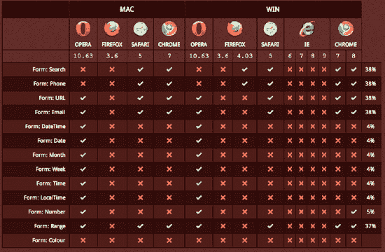

***图 4-1** 。由`[www.findmebyip.com/litmus/](http://www.findmebyip.com/litmus/)`发布的网页设计师 HTML5 & CSS3 清单。清单显示了浏览器对一些新的 HTML5 表单元素的支持。*

久而久之，浏览器支持将会越来越符合 HTML 规范，所以在我们让每个人都能看到我们的表单之前，我们需要的只是耐心。

### 了解新的输入类型

HTML5 表单引入了一组新的工具，使得表单开发更加容易和丰富。

以下是 HTML5 引入的一些新表单元素:

*   keygen 元素
*   输出元件
*   进度元素
*   仪表元件
*   电子邮件输入类型
*   url 输入类型
*   日期选择器元素
*   时间、日期时间、月和周元素
*   数字输入类型
*   搜索输入类型
*   范围输入类型
*   电话输入类型
*   颜色输入类型

除了输入类型之外，HTML5 还引入了几个可以在表单中使用的新属性，比如 list、autofocus、placeholder、required、multiple、pattern、autocomplete、min 和 max 以及 step。

甚至表单元素声明的语法也随着 HTML5 而改变。事实上，现在您可以在页面的任何位置声明一个表单元素，并通过使用元素的 form 属性与表单对象相关联:

`<form id="myForm" />
<input type="text" form="myForm" />`

在这个例子中，文本输入是在表单标记(称为表单所有者)之外声明的，但是它仍然与具有表单属性的`myForm`表单相关联。

在下面的解决方案中，我们展示了新 HTML5 表单的潜力。

### 解决方案 4-1:使用电子邮件输入类型

`<input type="email">`标签创建了一个表单元素，它期望从用户那里接收一个有效的电子邮件地址。表单控件显然不会验证电子邮件地址是否实际存在，只有当用户插入到字段中的文本使用了有效的语法时才会验证。

从用户的角度来看，在 HTML 表单中使用这种输入类型并不会改变外观。事实上，该元素在浏览器中呈现为普通的文本输入(除了 Opera，它在文本字段旁边使用一个电子邮件图标，如图 4-2 所示)。

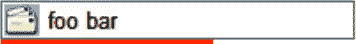

**图 4-2。**Opera 浏览器在邮件输入类型中增加了一个小图标。

发生变化的是验证操作改为在浏览器的后台执行，如果电子邮件地址未通过验证，将返回一个错误。这种验证因浏览器而异。以 Opera 为例，在输入中包含*@*就足以让它被接受；而在 Safari、Chrome 和 Firefox 中，你至少需要输入*@-。-(符号@前后的一个字符和一个句点后跟一个字符)。

#### 涉及到什么

要使用新的电子邮件输入类型，使用以下标记就足够了:

`<input type="email" />`

表 4-1 显示了该输入类型的有效属性列表。

**表 4-1。**电子邮件输入类型所接受的有效属性

<colgroup><col align="left" valign="top" width="20%"> <col align="left" valign="top" width="60%"></colgroup> 
| **属性** | **描述** |
| :-- | :-- |
| 名字 | 包含与此元素关联的名称/值对的名称，用于提交表单。 |
| 有缺陷的 | 设置禁用的控件。 |
| 类型 | 指定其 input 元素是一个控件，用于编辑元素值中给定的电子邮件地址或电子邮件地址列表。 |
| 形式 | 所有表单元素的容器。 |
| 自动完成 | 存储用户输入的值。 |
| 自（动）调焦装置 | 一旦元素被加载，就将焦点放在元素上。 |
| 最大长度 | 元素的最大允许值长度。 |
| 目录 | 指定该元素表示禁用的控件。 |
| 模式 | 指定用于检查值的正则表达式。 |
| 只读的 | 表示其值不应被编辑的控件。 |
| 需要 | 指定元素是否是必需的。 |
| 大小 | 元素所表示的控件要显示的选项数。 |
| 占位符 | input 元素中显示的文本(旨在帮助用户向控件中输入数据)。 |
| 多个的 | 允许您为一个输入元素指定多个电子邮件或文件值。 |
| 价值 | 包含电子邮件地址或电子邮件地址列表。 |

#### 如何建造它

下面的代码示例演示如何使用新的电子邮件输入类型:

`<!DOCTYPE html>
<html>
  <head>
    <title>
     Solution 4-1: Using the email input type
    </title>
  </head>`

`  <body>

<form id="myForm">
<fieldset>
  <legend>Solution 4-1: Using the email input type</legend>

      <label for="name">Name</label>
      <input id="name" name="name" type="text"/> 
      <label for="email">Email</label>
      <input id="email" name="email" type="email"/> 
      <input type="submit" value="Submit"/>
</fieldset>
</form>
</body>
</html>`

在创建标签表单之后，已经声明了一个`fieldset`标签。这个元素指定了一组表单控件，可以根据第一个`legend`元素给出的公共名称进行分组。

在代码示例中，`fieldset`的名称是:

`<legend>Solution 4-1: Using the email input type</legend>`

然后，为用户名和电子邮件地址声明一个输入文本。对于这两种输入类型，`label`元素通过`for`属性关联，引用输入的 id:

`<label for="name">Name</label>
<input id="name" name="name" type="text"/> 
<label for="email">Email</label>
<input id="email" name="email" type="email"/> `

表单以一个提交数据的按钮结束。

如果您在 Opera 12 中打开该文件，并且为电子邮件地址插入了一个无效值，那么当单击提交按钮时，将会返回一条错误消息并且表单不会被提交，如图图 4-3 所示。

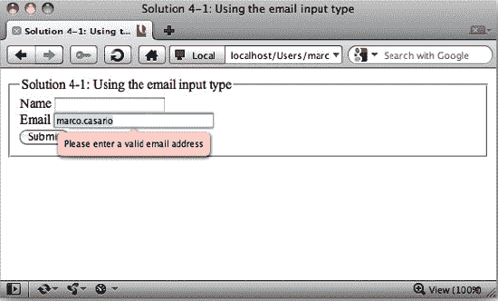

**图 4-3。**如果电子邮件地址无效，Opera 会显示一条错误消息。

如果用户插入有效的电子邮件地址，将不会出现任何消息，表单将被提交。

在 Firefox、Internet Explorer 和 Chrome 中，不会向用户显示任何错误信息。

为了得到错误消息，我们必须等待这些浏览器的未来版本(或使用 JavaScript)才能使用这个有趣的特性，它最终将允许我们在客户端而不是服务器端验证客户端电子邮件地址。

#### 专家提示

触摸屏移动设备(如 iPhone、iPad 和 Android OS 设备)的用户在使用电子邮件输入类型浏览网页时会有一个惊喜。

对于其中一些设备，浏览器能够识别新的 HTML5 输入类型，设备会改变屏幕键盘来帮助用户进行这种输入。这意味着更好的用户体验！

事实上，这些设备在输入文本时会在主屏幕上显示带有@和句点符号的虚拟键盘，如图图 4-4 所示。

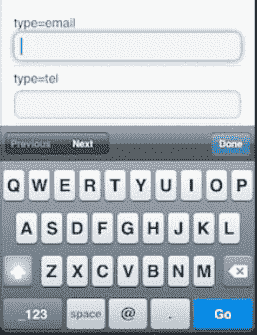

**图 4-4。**iPhone 和 iPad 浏览器支持新的电子邮件输入类型，它显示了一个支持电子邮件的虚拟键盘。

### 解决方案 4-2:使用 URL 输入类型

如今，用户越来越频繁地在表单中插入网址。无论是他或她的个人网站、博客或 LinkedIn 帐户的 URL，到目前为止，这个元素通常是通过简单的文本输入来管理的。HTML5 现在引入了一种新的输入类型，通过遵守互联网地址标准来管理这种类型的文本。

目前，对 URL 输入元素的支持相当糟糕。例如，在 Opera 浏览器中，它似乎是唯一能够识别新标签的 web 浏览器，但这个元素只得到部分支持。下面是它的作用:

*   Opera 会自动添加`http://`后缀，即使你只是插入一个短格式的地址，比如`[www.comtaste.com](http://www.comtaste.com)`。
*   它显示了最近访问过的网站列表(从浏览历史)。
*   与电子邮件输入类型不同，这种类型的输入不进行验证。
*   iPhone 上的 Safari 会动态显示屏幕键盘上的“`.com`”按钮。
*   不支持这种输入类型的浏览器会将该元素视为普通的文本输入。

#### 涉及到什么

要创建一个 URL 输入元素，您所要做的就是指定标签输入的属性`type`:

`<input type="url" />`

这样，URL 类型将用于包含 URL 地址的输入字段。

控件接受的数据类型是绝对 URI(统一资源标识符)。

*注意:人们经常互换使用术语 URI 和 URL(统一资源定位器)。你需要知道的是，URL 是 URI 协议的子集，比如`http://`、`ftp://`和`mailto:`。因此，所有的网址都是 URIs。*

#### 如何建造它

从上一个解决方案中提供的示例开始，向 HTML 页面添加一个 URL 类型的输入控件。

以下是完整的代码:

`<!DOCTYPE html>
<html>
  <head>
    <title>
     Solution 4-2: Using the URL input type
    </title>
  </head>

  <body>

<form id="myForm">
<fieldset>
  <legend>Solution 4-2: Using the URL input type</legend>

      <label for="name">Name</label>
      <input id="name" name="name" type="text"/> 
      <label for="email">Email</label>
      <input id="email" name="email" type="email"/> 

      <label for="blog">Blog</label>
      <input id="blog" name="blog" type="url"/> 

      <input type="submit" value="Submit"/>

</fieldset>
</form>

</body>
</html>` 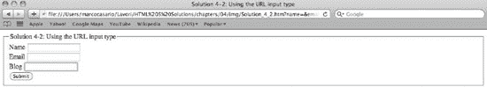

**图 4-5。** Safari 不支持 URL 输入类型，它呈现为简单的文本输入。

当你用 Chrome、Internet Explorer 或 Safari 打开该文件时，与简单的文本字段相比，你不会注意到任何区别，如图图 4-5 所示。

### 解决方案 4-3:使用数字微调控件

与数字打交道总是比你想象的要复杂。例如，用户可以很容易地在期望接收数字的文本字段中插入不需要的值。

一个经典的例子是电子商务网站中的数量字段。当您挑选要购买的商品并点击“添加到购物车”按钮时，系统还会要求您输入要购买的商品数量。有些网站有一个简单的数量文本字段，如图图 4-6 所示。

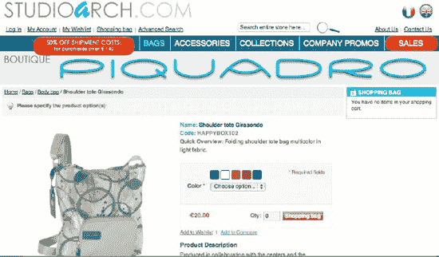

**图 4-6。**数量字段需要一个简单的文本输入。

用户可以在这个字段中插入任何值，那么如果用户错误地插入了一个字母或一个无效的符号会发生什么呢？

应用必须在客户端或服务器端对其进行验证，以避免传递电子商务系统拒绝的无效信息(或者发送和开具不正确数量的发票)。

有些网站，比如 Amazon，通过使用组合框控件来解决无效数据类型输入的问题，如图图 4-7 所示。

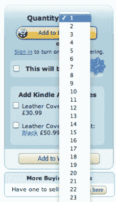

**图 4-7。** Amazon 允许用户从组合框中插入数量。

HTML5 通过向工具库中添加微调控件来帮助开发人员。

一个*微调控件*是一个带有上下箭头的文本输入控件。结果是一个单行的文本输入，可以旋转显示文本字段中的每个数字，如图图 4-8 所示:

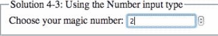

**图 4-8。**微调控件，由 Google Chrome 呈现

用户可以单击箭头来更改他或她想要放入表单的数值。

通过使用这个表单元素，用户在填写表单时不会出错，因为提供的数字都是有效的。

不支持这种新标签的浏览器将组件呈现为一个简单的文本字段。

#### 涉及到什么

尽管您看到的控件具有内置的导航机制，允许用户更改文本字段中的数值(不能直接编辑)，但开发人员不必做任何事情。

您需要做的就是使用 number 值作为这个输入的类型属性，以便继承所有这些函数:

`<input type="number" />`

数值的增减机制会自动起作用。

有些属性允许您自定义控件。这些属性允许您设置最大值和最小值以及用于增加和减少机制的单位。这些具体特性在表 4-2 中列出。

**表 4-2。**数字输入类型接受的有效属性

<colgroup><col align="left" valign="top" width="20%"> <col align="left" valign="top" width="60%"></colgroup> 
| **属性** | **描述** |
| :-- | :-- |
| 最大 | 一个浮点数，包含要在输入标记中使用和显示的最大数值。 |
| 部 | 一个浮点数，包含要在输入标记中使用和显示的最小数值。 |
| 步骤 | 包含元素值的增量单位。 |
| 价值 | 表示数字的字符串。 |

*注意:使用这些属性，开发人员可以决定数字输入元素的行为方式，以及哪些值将从控件传递到服务器。*

#### 如何建造它

创建 spinner 控件所涉及的大部分工作都是由浏览器及其对该标签的支持级别来完成的。

开发人员所要做的就是插入一个数字类型的输入。

这里有一个例子:

`<!DOCTYPE html>
<html>
  <head>
    <title>
     Solution 4-3: Using a spinner control for numbers
    </title>
  </head>
  <body>`

`<form id="myForm">
<fieldset>
  <legend>Solution 4-3: Using a spinner control for numbers</legend>
      <label>Choose your magic number: </label>
      <input type="number" min="0" max="100" step="1" value="1"/>
</fieldset>
</form>

</body>
</html>`

我们创建了一个具有以下属性的数字类型输入控件:

`min="0"
max="100"
step="1"`

这意味着当用户单击向上或向下箭头时，值将增加或减少一个单位(步长=1)，但他或她不能插入任何小于零或大于 100 的值。

该控件的呈现方式取决于浏览器。在图 4-9 中，我们展示了 Safari(左)和 Opera(右)如何显示这个对象。

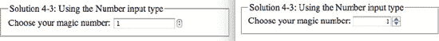

**图 4-9。**数字输入类型，由 Safari(左)和 Opera(右)呈现

然而，一些平板电脑的浏览器表现不同。图 4-10 显示了基于 Android 2.2 的 7 英寸三星 Galaxy Tab 使用的浏览器如何将输入控件呈现为简单的文本输入。但是，它会动态显示数字屏幕键盘:

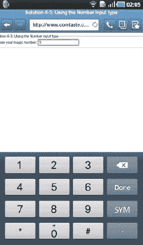

**图 4-10。**数字输入类型，由三星 Galaxy Tab 平板电脑呈现

#### 专家提示

对于数字输入类型，有几个有趣的方法可以和 JavaScript 一起使用。它们是:

> `stepUp(n)`:将字段的值增加 n
> 
> `stepDown(n)`:将字段值减少 n
> 
> `valueAsNumber`:返回元素的值，解释为数字

### 解决方案 4-4:使用范围输入类型向表单添加滑块

HTML5 提供的另一个用来处理数字和表单的有趣组件是滑块。

一个*滑块组件*是一个表单控件，允许用户沿着一个或两个轴在有限的范围内调整值。用户通过在对应于一系列值的轨道端点之间滑动图形滑块来选择值。

与微调器一样，该控件也有助于避免错误。

滑块在 web 应用中非常受欢迎，尤其是在配置器中，如图 4-11 所示的 Kayak.com 网站页面。

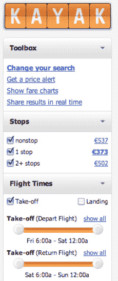

**图 4-11。**滑块控件用于帮助用户在一系列值中进行选择。

用户与 thumb 对象交互来更改输入中的数值。以 Kayak.com 为例，用户更改航空旅行的出发时间。

HTML5 之前的 Slider 创建包括为元素的用户界面设计图形元素，以及用 JavaScript 编写控件的行为逻辑。有了 HTML5，这个控件现在是浏览器的原生控件，包括与键盘用户可访问性相关的所有方面(见第十二章)。

#### 涉及到什么

在表单中创建滑块控件的标记非常简单。您只需要将范围指定为输入类型及其属性:

` <input type="range" min="1" max="10" step="1" value="6"/>`

与数字输入类型一样，这些属性允许您设置最小和最大值以及用于增加和减少函数的单位。

表 4-3 列出了这些具体的属性。

**表 4-3。**范围输入类型接受的有效属性

<colgroup><col align="left" valign="top" width="10%"> <col align="left" valign="top" width="70%"></colgroup> 
| **属性** | **描述** |
| :-- | :-- |
| 最大 | 它是一个浮点数，包含要在输入标记中使用和显示的最大数值。 |
| 部 | 它是一个浮点数，包含要在输入标记中使用和显示的最小数值。 |
| 步骤 | 包含用作元素值的增量或减量的单位。 |
| 价值 | 表示数字的字符串。 |

许多浏览器的最新版本都支持这种新的输入类型:Opera、Safari、Chrome 和 Internet Explorer。

#### 如何建造它

开发人员也不需要为这个解决方案做太多工作。或者，您可以使用`<input>`标记并将`range`值赋给`type`属性。浏览器会完成剩下的工作。

下面是一个完整的例子:

`<!DOCTYPE html>
<html>
  <head>
    <title>
     Solution 4-4: Adding a slider to your form with the range input type
    </title>
  </head>

  <body>

<form id="myForm">
<fieldset>
  <legend>Solution 4-4: Adding a slider to your form with the range input type</legend>

      <label>Choose your magic number: </label>
      <input type="range" min="1" max="10" step="1" value="1"/>

       
</fieldset>
</form>

</body>
</html>`

当你在浏览器中打开这个例子时，会出现如图图 4-12 所示。

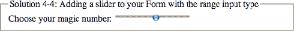

**图 4-12。**范围输入类型，由 Chrome 浏览器呈现

控件输入的交互性由浏览器自动应用，用户可以使用 thumb 元素来更改值。

#### 专家提示

HTML5 中有一个新元素可以让你显示计算结果:`<output>`。例如，该元素可用于显示用户在滑块中选择的数值。

在下面的示例中，我们已经更改了解决方案的代码，因此每当用户移动滑块时，选定的值都会显示在`<output>`元素中:

`<form id="myForm">
<fieldset>
  <legend>Solution 4-4: Adding a slider to your Form with the range input type</legend>

      <label>Choose your magic number: </label>
      <input type="range" min="1" max="10" step="1" value="6"
             onchange="myOutput.value=this.value"/>

       

       <label>This is the selected value: </label>
       <output name="myOutput"> 6 </output>

</fieldset>
</form>`

在`<input type="range">`标签中，我们在`onchange`事件中添加了以下语句，每次用户移动滑块中的 thumb 元素时都会触发该事件:

`<input type="range" min="1" max="10" step="1" value="6"
       onchange="myOutput.value=this.value"/>`

`myOutput`是在下面一行中声明的输出元素的名称:

`<output name="myOutput"> 6 </output>`

奇怪的是，iPhone、iPad 和 Android 等移动设备中的浏览器目前不支持这种表单控件；他们将其呈现为一个简单的文本框。

键盘不会为了数字输入而动态改变。

### 解决方案 4-5:发送多个文件

通过使用表单，特别是使用`<input type = file>`，已经可以将任何类型的文件从你的计算机发送到一个使用旧版本 HTML 的远程服务器。

然而，这个表单控件有一个限制，一次只能发送一个文件。如果用户想要上传一个相册并发送几张照片，开发人员必须使用其他技术，如 Flash 或 JavaScript 来提供这一功能。

现在，有了 HTML5 和附加的属性，不使用任何外部语言就可以管理一切。

#### 涉及到什么

HTML5 为文件输入类型引入了一个新属性`multiple`，以提高文件上传的可用性。Multiple 是一个布尔属性，指示是否允许用户指定多个值。它是在标记输入标签内联指定的:

`<input type="file" multiple />`

Safari、Chrome、Firefox、Internet Explorer 和 Opera 的最新版本都支持该属性。

输入控件将根据浏览器呈现，具有简单的文本输入，在侧边具有用于选择文件的按钮(例如 Opera)，或者只有一个按钮(例如 Chrome 和 Safari)。

如果多重属性是用“添加文件”文本声明的，Opera 也会改变按钮的标签，正如你在图 4-13 和图 4-14 中看到的。

**图 4-13。**按钮的标签，在 Opera 中显示，当设置了 multiple 属性时改变

**图 4-14。**Opera 中文件输入类型的按钮标签，如果未指定 multiple 属性

其他浏览器，如 Chrome，使用与简单文件输入类型相同的按钮标签。但是，它们为用户指定了所选文件的数量(而不是它们的文件名，就像 Opera 和 Firefox 一样)，如图 4-15 所示。

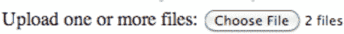

**图 4-15。** Chrome 渲染多属性的文件输入类型，具有相同的按钮标签，但指定了所选文件的数量

要进行多重选择，用户在点击选择文件或添加文件按钮后，使用 SHIFT 或 CTRL 或 CMD 键。

#### 如何建造它

从技术角度来看，允许用户上传多个文件的唯一需要注意的事情是在标记文件输入类型的声明中添加 multiple 属性。

下面是一个完整的例子:

`<!DOCTYPE html>
<html>
  <head>
    <title>
     Solution 4-5: Sending multiple files
    </title>
  </head>

  <body>

<form id="myForm">
<fieldset>
  <legend>Solution 4-5: Sending multiple files</legend>

      <label>Upload one or more files:</label>

       <input type="file" name="multipleFileUpload" multiple />

       

</fieldset>
</form>

</body>
</html>`

#### 专家提示

用户选择的文件必须发送到服务器，并使用服务器端语言进行处理。一些编程语言，比如 PHP，需要在标签的 name 属性中添加括号来发送多个文件:

`<input name="filesUploaded[]" type="file" multiple />`

通过这样做，PHP 将构造一个数组数据类型，它将包含服务器上上传的文件。如果不指定括号，编程语言将按顺序处理文件，并且只提供脚本中的最后一个文件。

### 解决方案 4-6:使用数据列表组件创建类似建议的自动完成功能

在这个时代，任何用户都喜欢自动完成系统来帮助简化他们的 web 体验。

在过去，创建这样一个系统并不是一件简单的事情。这可能需要几个小时的工作。您可以通过搜索 Web 找到各种免费或付费的解决方案和库。

HTML5 引入了新的`<datalist>`标记。此标记表示一组选项元素，这些元素代表其他控件的预定义选项。因此，它可以与表单控件(如文本输入)相关联。当控件获得焦点时，它会在填充数据时向用户提供一个预定义选项的列表，并允许用户自己键入内容。

旧的浏览器，或者那些不支持数据列表的浏览器，将呈现一个简单的文本字段。

#### 涉及到什么

要将一个`<datalist>`标签与一个`<input>`控件相关联，可以使用一个列表属性:

`<input list="food" name="food"/>
<datalist id="food">

</datalist>`

在上面的代码片段中，list 属性通过`<datalist>`标签的 id 将`<input>`元素链接到`<datalist>`标签。

一旦将 datalist 元素与输入控件相关联，就可以指定当用户选择该输入时将建议的值。要指定这些值，可以在`<datalist>`标签中使用`<option>`标签:

`<input list="food" name="food"/>
<datalist id="food">

<option value="Spaghetti Aglio e Olio"> <option value="Lasagne">
<option value="Fusilli al pesto">
<option value="Rigatoni alla Carbonara">

</datalist>`

没有其他需要键入的内容。浏览器会完成剩下的工作。

#### 如何建造它

下面是如何使用 datalist 元素的完整示例:

`<!DOCTYPE html>
<html>
  <head>
    <title>`
`     Solution 4-6: Creating a suggest-like autocomplete with the data list component
    </title>
  </head>

  <body>

<form id="myForm">
<fieldset>
  <legend>Solution 4-6: Creating a suggest-like autocomplete with the data list
 component</legend>

  <label> Enter your favorite movies: 
  <input type="text" name="movies" list="movies"/>
  <datalist id="movies">
   <option value="Star Wars">
   <option value="The Godfather">
   <option value="Goodfellas">
  </datalist>
 </label>

 

  <label> This is your favorite movie:
  <output name="myOutput" onforminput="this.value=movies.value" />
  </label>

 

</fieldset>
</form>

</body>
</html>`

数据列表与文本输入相关联:

`<input type="text" name="movies" list="movies"/>
  <datalist id="movies">
   <option value="Star Wars">
   <option value="The Godfather">
   <option value="Goodfellas">
  </datalist>`

当用户在文本输入控件中插入一个值时，支持这个新标记的浏览器会在输入控件的正下方弹出一个菜单，其中包含数据列表中建议的值。图 4-16 显示了在 Opera 中实现的这一功能。

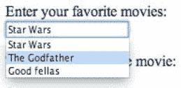

**图 4-16。**建议选项显示在输入文本框的正下方。

此外，当用户从菜单中选择一个值时，该值将显示在与`onforminput`事件的以下语句相关联的输出元素中:

`<output name="myOutput" onforminput="this.value=movies.value" />`

当表单接收到用户输入时，执行`onforminput`事件。最终结果如图 4-17 所示。

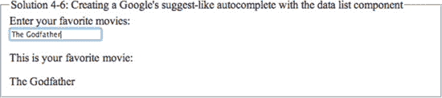

**图 4-17。**当用户选择其中一个选项时，该值被写入输出元素。

#### 专家提示

为了使你的代码兼容旧的浏览器和那些不支持 datalist 的浏览器，你可以使用`<select>`标签。

这样，该标记将只在不支持 datalist 元素的浏览器中显示:

`  <label> Enter your favorite movies: 
  <input type="text" name="movies" list="movies"/>
  <datalist id="movies">

  <label> or select one from the list:
  <select name="movies">
   <option value="Star Wars">
   <option value="The Godfather">
   <option value="Goodfellas">
  </select>
   </label>

  </datalist>
 </label>`

### 解决方案 4-7:验证表单控件

在本章的第一个解决方案中，我们向您展示了如何使用内置机制来验证电子邮件输入类型。这个函数是 HTML5 的新功能。

当您处理表单时，数据验证无疑是一个重要的方面，可能需要付出相当多的努力。我们经常求助于混合验证系统。使用 JavaScript 或 AJAX 框架(如 JQuery、Dojo 和 MooTools)，您可以进行客户端验证，并且可以使用服务器端语言(PHP、Python、Java 等)开发服务器端验证过程。

由于 HTML5 中插入了新的属性，您可以将一些数据验证功能委托给浏览器，并减少这类操作所需的工作量(至少从客户端来说)。

#### 涉及到什么

一些表单控件继承了验证系统，而无需编写任何代码。在解决方案 4-1 中，我们展示了电子邮件类型文本输入的验证机制如何通过仅声明标记来自动工作:

`<input type="email" />`

这同样适用于 URL 和数字标记、`<input type="url">`和`<input type="number">`。

但是，有一个属性可以用来指定表单中是否存在必填字段，不能留空。

要请求这种验证，您需要在输入控件中使用`required`:

`  <input type="text" required />`

该属性是布尔型的。指定时，元素是必需的。

支持此属性的浏览器会显示一条错误消息或在产生错误的字段上插入一个红色边框，并且不会提交表单。

#### 如何建造它

对于这个解决方案，通过为三个字段中的两个添加`required`属性来修改解决方案 4-2 中的代码。

以下是完整的代码:

`<!DOCTYPE html>
<html>
  <head>

    <title>`
`     Solution 4-7: Validating form controls
    </title>

  </head>

  <body>

<form id="myForm">
<fieldset>
  <legend>Solution 4-7: Validating form controls </legend>

      <label for="name">Name</label>
      <input id="name" name="name" type="text" placeholder="Insert your first name" required
 /> 
      <label for="email">Email</label>
      <input id="email" name="email" type="email" placeholder="Insert your email" required
 /> 

      <label for="blog">Blog</label>
      <input id="blog" name="blog" type=url placeholder="Insert your blog"/> 

      

       <input type="submit" value="Submit"/>
      

</fieldset>
</form>

</body>
</html>`

如果您打开文件并尝试发送两个必填字段中没有任何数据的表单，如果必填字段为空，浏览器将不允许您提交表单，您将获得如图图 4-18 所示的结果。

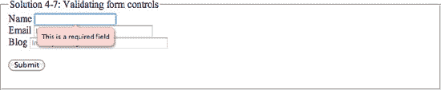

**图 4-18。**浏览器显示必填字段(Opera)的错误消息。

表单可用性的一个重要方面是，必填字段必须为用户提供可视或文本提示，告知他们所需的数据。一种惯例是在必填字段旁边插入一个星号(*)。

通过使用伪类`:valid`、`:invalid`、`:optional`和`:required`，你可以用 CSS 添加一些文本和图形线索。

如果表单元素的值在提交它所属的表单之前分别是必需的或可选的，那么它就是`:required`或`:optional`。

你可以通过阅读这篇文章进一步了解这个话题:`[www.w3.org/TR/css3-ui/#pseudo-validity](http://www.w3.org/TR/css3-ui/#pseudo-validity)`。你所要做的就是使用这些伪类使字段更加稳定。通过添加一个`

    <title>
     Solution 4-7: Validating form controls
    </title>

  </head>

  <body>
<form id="myForm">
<fieldset>
  <legend>Solution 4-7: Validating form controls </legend>

      <label for="name" class="required">Name</label>
      <input id="name" name="name" type="text" placeholder="Insert your first name" required
/> 
      <label for="email" class="required">Email</label>
      <input id="email" name="email" type="email" placeholder="Insert your email" required
/> 

      <label for="blog">Blog</label>
      <input id="blog" name="blog" type="url" placeholder="Insert your blog"/> 

      

       <input type="submit" value="Submit"/>
      

</fieldset>
</form>

</body>
</html>`

在新的样式块中，我们声明了两个 CSS 语句。第一个作用于所需的类，并用伪类`:after`在选择器后添加文本；在我们的例子中，标签元素旁边的一个*:

`   #myForm .required:after { content: " * "; color:red;}`

另一方面，第二条语句在输入标记上使用所需的伪类，将背景色改为红色:

`   #myForm input:required { background:red; }`

代码中唯一需要更改的是标记标签，您需要使用属性类将`:required`类与该标签相关联，因此它将插入*:

`<label for="name" class="required">Name</label>
      <input id="name" name="name" type="text" placeholder="Insert your first name" required
/> 
      <label for="email" class="required">Email</label>
      <input id="email" name="email" type="email" placeholder="Insert your email" required /> `

一旦你保存了文件并在浏览器中执行它，你会看到 CSS 伪类被应用到如图图 4-19 所示的字段中。

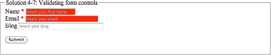

**图 4-19。**格式样式显示在输入字段中(显示在 Opera 中)。

#### 专家提示

默认情况下，将自动应用 HTML5 中字段的内置验证机制。但是，在某些情况下，有必要使用 JavaScript 来创建更复杂、更健壮的验证例程。

在这种情况下，有必要覆盖浏览器的默认验证系统。

`novalidate`属性指定表单在提交时不应被验证:

`<form id="myForm" novalidate>
<fieldset>
  <legend>Solution 4-7: Validating form controls </legend>

      <label for="name" class="required">Name</label>
      <input id="name" name="name" type="text" placeholder="Insert your first name" required`
` /> 
      <label for="email" class="required">Email</label>
      <input id="email" name="email" type="email" placeholder="Insert your email" required
/> 

      <label for="blog">Blog</label>
      <input id="blog" name="blog" type="url" placeholder="Insert your blog"/> 

      

       <input type="submit" value="Submit"/>
      

</fieldset>
</form>`

您可以在表单级别指定该属性，如上例所示，或者在下面的`<input>`类型中指定:文本、搜索、URL、电话、电子邮件、密码、日期选择器、范围和颜色。

### 解决方案 4-8:使用正则表达式创建自定义输入类型

正则表达式提供了一种强大、简洁和灵活的方法来匹配文本字符串，例如特定的字符、单词或字符模式。正则表达式是用正规语言编写的，可以被正则表达式处理器解释，正则表达式处理器是一个程序，它或者作为解析器生成器，或者检查文本并识别与提供的规范相匹配的部分。详见维基百科:`[`en.wikipedia.org/wiki/Regular_expression`](http://en.wikipedia.org/wiki/Regular_expression)`。

HTML5 允许您检查用户的输入，并将输入值与正则表达式进行匹配。

#### 涉及到什么

在以前版本的 HTML 中使用正则表达式需要编写的代码如下:

`<input type="text" name="ssn"
onblur="if (!^\d{3}-\d{2}-\d{4}$this.value) alert(this.title+'\nAn error occurred. Please verify your data.');" title="The Social Security Number"/>`

在 input 元素的`onblur`事件上，执行一个 JavaScript 语句。它控制应用于字段中数据的模式，如果验证不成功，它会提供一条错误消息。

HTML5 提供了一个新的属性，允许您通过正则表达式将字符模式与文本输入相关联，以验证字段中插入的数据。这个标记非常简单:

`<input type="text" name="ssn" pattern="(!^\d{3}-\d{2}-\d{4}$"`

pattern 属性中指定的值必须与本文档中描述的 JavaScript 模式产品相匹配:`[www.ecma-international.org/publications/files/ECMA-ST/ECMA-262.pdf](http://www.ecma-international.org/publications/files/ECMA-ST/ECMA-262.pdf)`。

*注意:匹配 JavaScript 模式意味着用于该属性的正则表达式语言与 JavaScript 中使用的相同，只是模式属性必须匹配整个值——而不仅仅是任何子集。(这似乎暗示了^(？:在模式的开头，a )$在结尾。)*

为了向用户提供模式的描述，或者在输入无效值时在字段上提供错误报告，您可以使用属性`title`:

`<input type="text" name="ssn"
pattern="(!^\d{3}-\d{2}-\d{4}$"
title="The Social Security Number" />`

#### 如何建造它

在下面的解决方案中，我们使用正则表达式来验证美国邮政编码:

` (\d{5}([\-]\d{4})?)`

这个表达式被插入到文本输入的`pattern`属性中。以下是完整的代码:

`<!DOCTYPE html>
<html>
  <head>
    <title>
     Solution 4-8: Creating custom input types using regular expressions
    </title>

  </head>

<body>

<form id="myForm">
<fieldset>
  <legend>Solution 4-8: Creating custom input types using regular expressions</legend>

<label> Insert a valid American Zip code:
<input type="text" name="ssn"
pattern="(\d{5}([\-]\d{4})?)"
title="Zip Code" />
</label>

<input type="submit" value="Check Zip code" /> 

</fieldset>
</form>

</body>
</html>`

当您在支持模式属性的浏览器(如 Opera)中执行该文件时，单击表单的提交按钮，您将获得如图图 4-20 所示的结果。

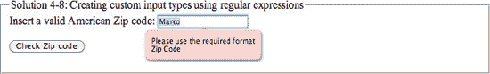

**图 4-20。**使用正则表达式模式的文本输入中显示的错误消息。

浏览器提供了对与属性模式中指定的正则表达式相匹配的数据的有效性的控制。如果失败，它将返回一条错误消息。

#### 专家提示

还不是所有的浏览器都支持这个强大的属性。幸运的是，有一个库填补了这个空白:Google 的 Web Forms 2，你可以在下面的地址找到它:`[`github.com/westonruter/webforms2`](https://github.com/westonruter/webforms2)`。

正如网站上所描述的，该项目是 WHATWG Web Forms 2.0 规范的跨浏览器实现。如果库在加载时意识到浏览器与一些新的 HTML5 函数不兼容，比如 pattern 属性，它会应用自己的方法。

您需要使用 Script 标记导入 JavaScript wbforms2_src.js 库来使用该库:

``

同样重要的是，webforms9781430233862.css 和 webforms2-msie.js 与 webforms2.js 或 webforms2-p.js(无论您决定使用哪个)位于同一目录中。

该实现已经过测试，应该可以在以下浏览器中工作:

*   Mozilla Firefox 1.0.8
*   Mozilla Firefox 1.5.0.9
*   Mozilla Firefox 2
*   Internet Explorer 6
*   Internet Explorer 7
*   野生动物园 2.0.4
*   Safari 3 (Windows)
*   Opera 9(本地实验实现)

### 解决方案 4-9:在输入字段中设置占位符文本

可用性是 web 应用，尤其是表单的一个微妙且非常重要的方面。当用户输入数据时，开发人员试图通过最小化错误的可能性来使用户对表单的体验尽可能平滑。一个简单但有效的技巧是在输入字段中放置文本，为用户提供提示。

图 4-21 显示了 Opera 搜索栏中的“使用 Google 搜索”提示文本。

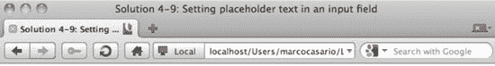

**图 4-21。**Opera 搜索栏使用“用谷歌搜索”文本作为对用户的提示。

即使在过去创建这种功能很简单，您仍然必须使用 JavaScript。

HTML5 引入了一个与输入控件相关联的新的智能属性，它可以在输入字段中插入文本，但是如果字段获得焦点，文本就会消失；如果字段失去焦点，文本就会重新出现。所有这些都是在没有 JavaScript 代码的情况下完成的。

#### 涉及到什么

允许您实现该功能的属性是`placeholder`。在 web 表单中使用占位符文本非常容易:

`<input type="text" placeholder="Insert your first name"/>`

不支持该属性的浏览器将会忽略它，并且在字段中不显示任何内容。

该属性仅允许您管理简单文本—不允许换行(LF)或回车(CR)字符，因此您不能使用 HTML 标记或图像。

#### 如何建造它

在这个解决方案中，我们对解决方案 4-2 的代码做了一些小小的修改，在输入字段中添加了`placeholder`属性:

`<!DOCTYPE html>
<html>
  <head>
    <title>
     Solution 4-9: Setting placeholder text in an input field
    </title>
  </head>

  <body>`

`<form id="myForm">
<fieldset>
  <legend>Solution 4-9: Setting placeholder text in an input field</legend>

      <label for="name">Name</label>
      <input id="name" name="name" type="text" placeholder="Insert your first name"/> 
      <label for="email">Email</label>
      <input id="email" name="email" type="email" placeholder="Insert your email"/> 

      <label for="blog">Blog</label>
      <input id="blog" name="blog" type="url" placeholder="Insert your blog"/> 

</fieldset>
</form>

</body>
</html>`

#### 专家提示

如果您阅读了关于这个属性的规范(在这个 URL: `[www.w3.org/TR/html5/common-input-element-attributes.html#the-placeholder-attribute](http://www.w3.org/TR/html5/common-input-element-attributes.html#the-placeholder-attribute)`)，您将会了解到一个可用性建议是将`title`属性用于更长的提示或其他建议文本。

### 解决方案 4-10:创建日期和时间控件

日期和时间经常在表单中使用。如果你想一想我们使用这些数据的频率，用不了多久就会意识到，它们的准确有效使用可以帮助决定整个网站的成败。你觉得我夸张了？

考虑预订航班。您在该查询的典型表单中插入的信息是:出发机场、到达机场、出发日期、返回日期以及出发和返回航班的首选时间。

所以想象一下，拥有一个可以帮助用户准确插入日期和时间信息的表单，减少甚至排除错误的可能性，是多么重要。

我最喜欢使用的预订航班的网站之一是 Kayak.com，它有一个非常高效的航班搜索系统(被大多数旅游网站使用)。从图 4-22 中，您可以看到一旦选择了出发或返回字段，一个日期选择器就会出现在您的表单顶部，并允许您选择日期。

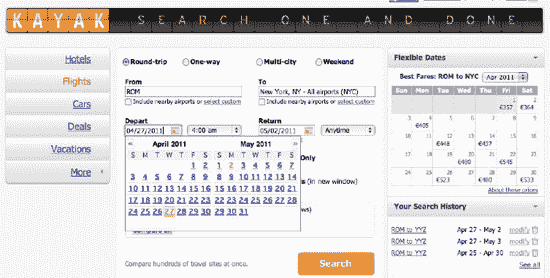

**图 4-22。**日期选择器允许用户从日历中插入日期，以避免键入错误。

此外，还必须考虑到日期格式会因国家而异。美国和英国等盎格鲁-撒克逊国家使用月-日-年格式，而大多数欧洲国家使用日-月-年格式。

Web 开发人员在使用 JavaScript 控件开发日期选择器函数时会考虑到这些问题，这些控件可以在最常见的 AJAX 框架中找到(或者从 Web 上的各种 JavaScript 库中找到)。

HTML5 引入了一系列标记来处理日期，将管理日期和时间的艰巨任务留给了浏览器。

#### 涉及到什么

HTML5 引入了许多不同的输入类型来处理日期/时间选择器:

`<input type="date" />
<input type="time" />`

日期类型创建一个带有内置机制的日期选择器，通过浏览日历来选择数据，如图图 4-23 所示。

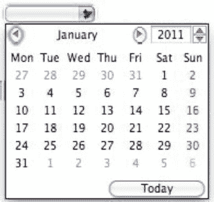

**图 4-23。**一个日期控件，由浏览器呈现(显示在 Mac OSX Safari 中)

包含小时、分钟和秒分隔符的输入类型时间文本输入如图 4-24 所示。

**图 4-24。**一个时间控件，由浏览器呈现(显示在 Mac OSX Safari 中)

还有其他处理日期和时间的控件。

`timedate`类型表示将元素的值设置为表示全球日期和时间(带时区信息)的字符串的控件。

此外，您可以允许用户选择一个值，即一个`month`或一个`week`，而不是一个完整的日期。事实上，有周和月输入类型:

`<input type="month" />
<input type="week" />`

#### 如何建造它

下面是一个完整的例子，它使用了 HTML5 提供的所有日期和时间输入类型:

`<!DOCTYPE html>
<html>
  <head>
    <title>
     Solution 4-10: Creating Date and Time Controls
    </title>

  </head>`

` <body>

<form id="myForm">
<fieldset>
  <legend>Solution 4-10: Creating Date and Time Controls</legend>

<label> Choose a date from the Date Picker control:
<input type="date" />
</label>

<label>Select a time:
<input type="time" />
</label>

<label>Select a date and a time:
<input type="datetime" />
</label>

<label>Select a month:
<input type="month" />
</label>

<label>Select a week:
<input type="week" />
</label>

</fieldset>
</form>

</body>
</html>`

### 总结

所有的 web 应用都使用表单。事实上，表单是任何需要用户输入的 web 应用的重要组成部分。

HTML 版本 4 提供了相当基本的表单控件，大部分是文本字段。此外，大多数交互都发生在服务器端。插入到表单控件中的数据类型的验证是 HTML 4 中在服务器端执行的操作的一个经典例子，除非它们使用 JavaScript 或 AJAX 框架。

在这一章中，你已经了解了使用 HTML5 表单，现在可以更快更有效地开发具有高级终端用户体验的应用。在第五章中，你将学习如何使用新的 HTML5 音频和视频标签在网页中嵌入视频。