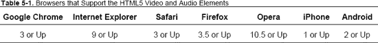
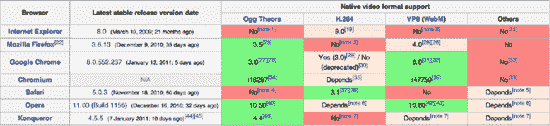
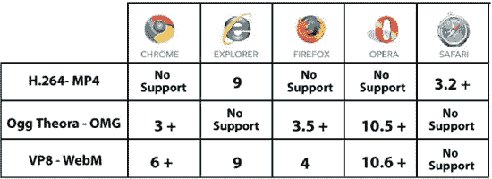
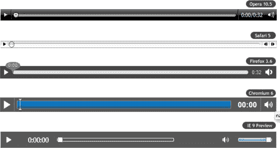
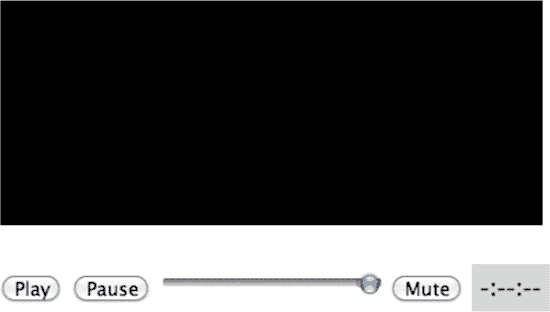
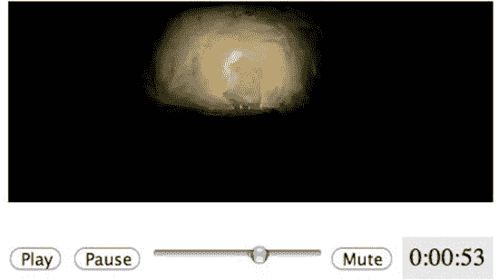
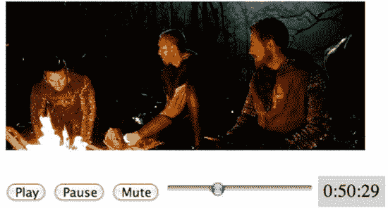
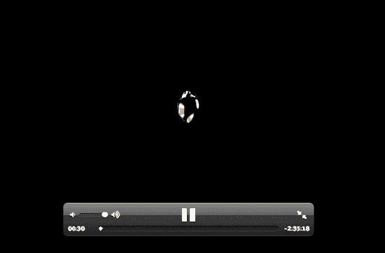

# 五、HTML5 媒体元素：音频和视频

今天，网络真正走向了多媒体。音频和视频已经成为我们每天在网上浏览的内容不可或缺的一部分。由于多媒体内容的带宽和压缩技术的不断发展，现在在移动设备上观看电视节目或舒适地坐在电视机前观看电影已经很常见，这要归功于支持苹果或谷歌电视技术的设备。

此外，大多数电视网络在其网站上提供免费或收费的内容，更不用说 YouTube 和类似的视频分享网站的流行了。

尽管多媒体内容的可用性很高，但在 HTML5 之前，并没有在 Web 上传送多媒体的开放标准。事实上，多媒体内容在 Web 上的交付曾经(现在仍然)委托给第三方插件，如 QuickTime、Windows Media Player、Flash Player 和 Real Player。

一开始是一片混乱。插件的不均衡可用性导致那些想要在网站上发布视频的人以不同的格式提供视频，这些格式可以在最常见的播放器上使用。

多种格式意味着在网站上发布时使用不同的视频编解码器对同一视频进行编码。视频编解码器是能够对数字视频进行视频压缩和/或解压缩的软件。压缩通常采用有损数据压缩方法。“有损”是指软件通过丢失原始源的一些信息来压缩数据。在维基百科上阅读更多关于视频编解码器的信息:`[`en.wikipedia.org/wiki/Video_codec`](http://en.wikipedia.org/wiki/Video_codec)`。

这是插件之间的一场真正的战争，在 2005 年到 2006 年间，一个插件脱颖而出:Adobe Flash Player。

Adobe Flash Player 是一种插件，在早年非常流行，90%的联网机器都安装了这种插件。在被 Adobe 收购之前，Macromedia 在 Flash Player 7 中插入了 Flash 视频格式，没过多久，业内的大公司就采用了这种格式，这样几乎任何人都可以播放基于 Flash 的视频。

Flash Video 是一种容器文件格式，用于使用 Adobe Flash Player 版本 6–10 通过互联网传送视频。Flash 视频内容也可以嵌入到 SWF 文件中。

有两种不同的视频文件格式称为 Flash 视频:FLV 和 F4V。FLV 文件中的音频和视频数据的编码方式与 SWF 文件中的相同。Adobe Flash Player 支持这两种格式，它们目前由 Adobe Systems 开发。FLV 最初是由 Macromedia 开发的。

这种格式已经迅速成为网络上嵌入式视频的首选格式。Flash 视频格式的著名用户包括 YouTube、Hulu、Google Video、Yahoo！视频、Metacafe、Reuters.com 和许多其他新闻提供商。

*注意:虽然 Flash Player 和 Flash Video 格式非常受欢迎和支持，但 Apple 决定不支持 iOS 设备(iPhone、iPad 和 iPod Touch)使用它。相反，这些设备支持 HTML5。*

*如果你想进一步研究这个话题，可以从苹果公司首席执行官在`[www.apple.com/hotnews/thoughts-on-flash/](http://www.apple.com/hotnews/thoughts-on-flash/)`发表的“关于 Flash 的想法”和 Adobe 首席执行官在`[blogs.wsj.com](http://blogs.wsj.com)/digits/2010/04/29/live-blogging-the-journals-interview-with-adobe-ceo/`的回复开始。*

有关 Flash 视频的更多信息，请访问维基百科:`[`en.wikipedia.org/wiki/Flash_Video`](http://en.wikipedia.org/wiki/Flash_Video)`。

在这个非凡的发展时期，HTML 提供了两个标签来允许人们在网页中插入外部插件可以使用的内容:标签`<object>`和标签`<embed>`。

HTML5 引入了一种用于传送多媒体内容的本地开放标准。因为语言规范仍在定义中，所以只在表 5-1 中列出的浏览器版本中支持这些新标签。

当前的问题不是采用 HTML5 引入的新标记，因为 HTML5 是编解码器使用的标准定义(见图 5-1 )。相反，问题是 Ogg Theora、H.264 和 VP8/WebM 是目前视频元素支持的唯一格式。其中哪些会在未来得到浏览器的普遍支持？这个问题我们还没有答案。

目前在这个问题上有很大的争论和不同的观点。讨论最多的是谷歌的立场，谷歌收购了 On2 Technologies，并开源了 VP8/WebM 视频编解码器。2011 年 1 月，谷歌也宣布将从 Chrome 上移除对 H.264 编解码器的支持，但苹果和微软仍将继续支持这一编解码器。

*注:On2 Technologies 生产以下视频编解码器:VP3、VP4、VP5、VP6、VP7 和 VP8。Ogg Theora 源自 On2 Technologies 向公众发布的专有 VP3 编解码器。*

本质上，一场建立下一个视频编解码器的新战役已经开始。和往常一样，我们只能拭目以待。

**图 5-1** 网络上视频编解码器的现状及其浏览器支持。(*来源:*维基百科，`[`en.wikipedia.org/wiki/HTML5_video`](http://en.wikipedia.org/wiki/HTML5_video)`)

在本章中，我们将介绍如何使用新的 HTML5 标记来处理音频和视频多媒体内容的解决方案。

### 解决方案 5-1:在网页中嵌入视频

有了 HTML5，在网页上发布视频变成了真正简单的操作。我们借助第三方插件让视频在 HTML 页面中可访问的时代即将结束。

像这样的代码可能会成为遥远的记忆:

`<object width="640" height="480">
<param name="movie" value="your_video.swf">
<embed src="your_video.swf" width="500" height="500">
</embed>
</object>`

最终用户将不再需要为了观看视频而下载额外的插件或者更新到他们已经安装的插件的正确版本。也不会因为某些第三方插件的不稳定性而导致浏览器崩溃。

让我们看看 HTML5 的变化。

#### 涉及到什么

随着新的`<video>`标签的引入，我们所要做的就是在网页中声明这个标记，指定要加载的视频，浏览器将完成剩下的工作(假设它支持视频元素):

`<video src="your_video.ogg" />`

`src`属性包含要在页面中显示的媒体资源(视频或音频)的地址。在上面的代码示例中，我们要求它加载 Ogg Theora 格式的视频。

即使该代码本身足以使视频可用，也最好使用宽度和高度属性来指定视频容器的尺寸:

`<video width="640" height="360"
src="your_video.mp4" />`

如果不设置这些值，浏览器将使用原始视频资源的尺寸。

视频标签支持的其他属性包括:

*   *preload:* 告诉浏览器在页面加载时预加载视频内容。这样，用户在播放视频时就不必等待视频加载。
*   *自动播放:*告诉浏览器一旦视频可用就自动播放。您需要小心使用这个属性，因为您并不总是确定用户是否想看视频。如果用户通过移动设备连接，这一点尤其正确，因为带宽更贵。
*   *循环:*视频一结束就重新执行。
*   *控件:*如果指定，它告诉浏览器显示一组内置控件，如播放、停止、暂停和音量。
*   *poster:* 指定用户代理(浏览器)在没有视频数据可用时可以显示的图像文件。

#### 如何建造它

下面的代码示例演示如何在网页中导入和显示视频:

`<!DOCTYPE html>
<html>
  <head>
    <title>
     Solution 5-1: Embedding a video in a web page
    </title>

  </head>

 <body>
   <h1>Comtaste's Showreel</h1>` `    <video width="640"  height="360"
    src="comtaste_showreel.mp4" autoplay />

</body>
</html>`

如果在浏览器中打开这个例子，视频会立即执行，占据 640 像素宽，800 像素高的空间，如图图 5-2 所示。

**图 5-2。**视频会在网页中自动播放。

*注意:如果您想尝试这个加载远程视频的解决方案，您可以使用下面的代码:*

`*<video width="640"  height="360" src="http://www.youtube.com/demo/
google_main.mp4" autoplay />*`

如果用户在不支持视频标签的浏览器中打开 HTML 文件，将显示一个空白页面。因此，在发生这种情况时，最好在页面中提供替代内容。使用 poster 属性显示可能是视频帧的图像(作为图像捕获)。它可以是本地的，也可以来自网络上的其他地方。

让我们将该属性添加到视频标签中:

`<video width="640" height="360"
src="comtaste_showreel.mp4" autoplay
poster="../img/Figure_5_3.png"> Video is not supported in this browser! </video>`

如果视频没有加载，浏览器会显示海报属性中指定的图像，如图图 5-3 所示。

**图 5-3。**浏览器显示海报属性中指定的图像。

如果未指定 poster 属性，并且浏览器无法加载视频，则默认情况下将显示电影的第一帧。

#### 专家提示

对于移动 Apple iOS 设备(iPhones、iPod Touches 和 ipad)和 Android 设备，HTML5 视频支持存在一些问题:

*   如果使用 poster 属性，iOS 将忽略视频元素。苹果已经声明在 iOS 4.0 中修复了这个 bug。
*   iOS 只支持 H.264 格式。如果使用`<source>`标签(见下一个解决方案)，它只会识别第一种视频格式。
*   另一方面，Android 设备不支持浏览器的本地控件，因此会忽略它们。此外，操作系统会对用于指定视频容器的 type 属性感到有点困惑。

### 解决方案 5-2:检测跨浏览器的视频支持

在这一章的前面，我们已经讨论了网络上可用的各种视频格式。

HTML5 的第一个规范规定浏览器对视频元素的支持必须基于两种格式:Ogg Vorbis(用于音频)和 Ogg Theora(用于视频)。这一声明在苹果和诺基亚等巨头中引起了不小的轰动，以至于 WSC 从规范中删除了对音频和视频格式的任何引用。

这个选择显然导致了网络上的格式混乱。MPEG4 (H.264)、Ogg Theora、AVI 和 VP8/WebM 都准备发动战争，希望成为未来的标准。就连浏览器也开始站队了。图 5-4 总结了各种浏览器对视频容器的支持:

*   Opera 支持 Ogg Theora，未来还会支持 WebM。
*   Chrome 支持 Ogg Theora 和 WebM。(它最近宣布不再支持 H.264。)
*   Firefox 支持 Ogg Theora，未来还会支持 WebM。
*   Safari 支持 H.264。
*   Internet Explorer 支持 H.264 和 WebM。

**图 5-4。**浏览器对视频容器的支持

在当前情况下，很容易理解为什么有必要进行检查来验证加载页面的浏览器，并选择要加载的视频格式的正确版本。

#### 涉及到什么

有多种技术可以验证加载页面的浏览器支持哪种视频格式。这个解决方案使用了来自`[www.modernizr.com](http://www.modernizr.com)`的 Modernizr JavaScript 库，我们在第一章中介绍过。

我们还可以使用这个视频库的本地函数来验证它对视频标签和编解码器的支持。这里有一个例子:

`if (Modernizr.video) {
 if (Modernizr.video.webm) {
 // Support the WebM
}
else if (Modernizr.video.ogg)
{
// Support the Ogg Theora + Vorbis
} else if (Modernizr.video.h264){
// Support the H.264 video + AAC audio }
}`

基本上，该库通过测试视频元素的`canPlayType`属性来执行视频支持验证。

然后，浏览器返回三个值之一:

*   *空字符串:*不支持。
*   *可能是字符串:*不确定不支持。
*   *大概字符串:*支持容器和编解码器的组合。

#### 如何建造它

要创建一个验证视频标签支持并加载正确代码的 HTML 页面，请使用一种与前面的解决方案类似的机制，但有一些小的不同。

以下是使用 Modernizr 库检测跨浏览器视频支持的完整代码:

`<!DOCTYPE html>
<html>
  <head>
    <title>
     Solution 5-2: Detecting Video support across browser
    </title>

  

  </head>

<body>

<h1>Comtaste's Showreel</h1>

  

<h1> This is an HTML5 Video Element </h1>
    <video width="640"  height="360"
src="comtaste_showreel.mp4" autoplay poster="../img/Figure_5_3.png" />

  

</body>
</html>`

注意:在撰写本文时，Modernizr 库的最新版本是 1.7，但是这个解决方案也适用于旧版本。

我们在代码中创建了两个 div:一个包含支持`<video>`标签的浏览器的代码(id 等于#video)，另一个包含其他浏览器的代码(id 等于#no-video)。我们还插入了一个带有 CSS 语句的样式块，以隐藏带有命令 display: `none`的必要 DIV。

在第一个 DIV(id # video)块中，我们插入了`<video>`标签，而在第二个块中，我们将使用 Kroc Camen 编写的技术，它不使用 JavaScript，只需要两种视频编码:一个 Ogg 文件和一个 MP4 文件。

这种技术基于一种假设，即如果不支持 HTML5 视频，将使用 Adobe Flash 来代替。

这种方法与 HTML4、HTML5(有效标记)和 XHTML 1 兼容，当用作 application/XHTML+XML 时也能工作。

在 Kroc Camen 的“人人视频”中，可以了解更多关于这种使用 HTML5 视频的无 JavaScript 方法的信息。你可以在`[`camendesign.com/code/video_for_everybody`](http://camendesign.com/code/video_for_everybody)`找到这篇文章。

在第二个 DIV(如果浏览器不支持 video 标记，将加载该 DIV)中，插入以下代码:

`<!-- fallback to Flash: -->
        <object width="640" height="360" type="application/x-shockwave-flash"
 data="__FLASH__.SWF">
                <!-- Firefox uses the `data` attribute above, IE/Safari uses the param
below -->
                <param name="movie" value="comtaste_showreel.SWF" />
                <param name="flashvars" value="controlbar=over&amp;image=
comtaste_showreel.JPG&amp;file=comtaste_showreel.mp4" />
                <!-- fallback image. note the title field below, put the title of the
video there -->
                
        </object>`

#### 专家提示

对于如何处理网络上的视频，还有其他的解决方案。在`[`github.com/etianen/html5media`](https://github.com/etianen/html5media)`有一个非常成功的项目是 HTML5media 项目。

这个项目通过使用 HTML5 多媒体播放器来检测对视频标签和视频格式的双重支持。它支持 H.264 (MP4)和 Ogg Theora 格式。

如果浏览器不支持 HTML5 视频标签，它会使用 Adobe Flash Player 来提供与原始视频相同的功能。这也是我们使用 Flowplayer JavaScript 库(`[`flowplayer.org`](http://flowplayer.org))`)的原因。

要在所有主流浏览器中启用 HTML5 视频标签，您只需调用 jQuery 库和文档头中的脚本:

`
`

然后，您可以使用以下代码将视频插入到 HTML 页面中:

`<video src="video.mp4" autoplay autobuffer></video>`

其他相同主题的库有:`[`mediaelementjs.com/`](http://mediaelementjs.com/)`和`[`videojs.com/`](http://videojs.com/)`。

### 解决方案 5-3:创建自定义视频控制器

任何多媒体元素，无论是音频还是视频，都必须为用户提供使用传统的播放、停止、暂停和音量控制按钮与内容进行交互的选项。HTML5 有一个在屏幕视频控制器上本地呈现上述按钮的属性。

但是，创建自定义控件按钮是可能的(通常也是更可取的),以便它们与发布视频的网站的图形相匹配。

音频和视频元素是 HTML5 DOM 媒体元素的一部分，它提供了一个强大且非常易于使用的 API 来控制电影回放。在本解决方案中，我们将了解如何向视频添加自定义控件。

#### 涉及到什么

在视频内容中插入一个视频控件很简单。事实上，`<video>`标签有一个 controls 属性，它利用了浏览器的内置控件。您需要做的只是在标签中指定属性，以在视频上显示控制器:

`<video width="640" height="360" src="comtaste_showreel.mp4" controls />`

每个浏览器都将使用自己的图形来设计视频控件。例如，在图 5-5 中，您可以看到 Safari 中用于视频控制的图形。

**图 5-5。**Safari 渲染的视频控件

这种差异会让许多设计师感到惊讶，因为他们想要控制视频控件的外观和感觉，使它们与网站的图形相匹配。

在图 5-6 中，你可以看到所有其他主流浏览器中用于视频控件的图形。

**图 5-6。**主流浏览器如何渲染视频控件

但是，您可以使用自己的图形创建自定义视频控件，并决定提供哪些功能。例如，您可以编写一个功能来同步视频中的字幕并用视频控制器激活它们，或者编写一个功能来允许用户从一个书签跳到另一个书签，以查看他或她最感兴趣的片段。

因为你是用 JavaScript 写视频控制器功能的人，所以真的可以随心所欲。

为此，您必须使用 HTML5 媒体属性和您可以监听的 DOM 事件，例如加载进度、媒体播放、媒体暂停和媒体播放完成。例如，对于播放视频的功能，有以下属性:

*   *media.paused:* 如果回放暂停，则返回 true 否则为假。
*   *media.ended:* 如果回放已经到达媒体资源的结尾，则返回 true。
*   *media . defaultplaybackrate[= value]:*返回当用户不在媒体资源中快进或倒退时的默认回放速率。
*   *媒体。playbackRate [ = value ]:* 返回当前播放速率，其中 1.0 为正常速度。
*   *Media.played:* 返回一个`TimeRanges`对象，代表浏览器已经播放的媒体资源的范围。
*   *Media.play():* 将 media.paused 属性设置为 false，加载媒体资源并在必要时开始播放。如果播放已经结束，它将从头开始播放。
*   *Media.pause():* 将 media.paused 属性设置为 true，在必要时加载媒体资源。
*   *Media.volume:* 获取或设置视频音轨的音量。它采用范围从 0.0(无声)到 1.0(最大声)的浮点值。
*   *Media.muted:* 使视频静音。
*   *Media.currentTime:* 以秒为单位返回当前播放位置，用浮点数表示。

有关媒体属性和事件的完整列表，请参阅下页:`[`www.whatwg.org/specs/web-apps/current-work/multipage/video.html`](http://www.whatwg.org/specs/web-apps/current-work/multipage/video.html)`。

通过使用这些方法和几行 JavaScript，您可以创建一个简单的视频控制器:

`if (video.paused)
{
        video.play();
 }`

这个条件控制视频是否暂停，如果暂停，它用`play()`方法执行视频。另一方面，如果视频已经结束，我们必须通过操作`currentTime`属性回到开始，然后再次播放它:

`if (video.paused)
{
   video.play();
 } else if (video.ended)
{
video.currentTime=0;
video.play();
}`

基本上，契约是用几行代码完成的。让我们看看如何创建一个完整的示例。

#### 如何建造它

首先创建两个 DIV 块。第一个将包含视频元素，第二个将包含视频控件。

然后创建一个新文件，并在一个 DIV 块中添加一个`<video>`标记，并为其分配一个等于`video_container`的 id。id 很重要，因为稍后您将使用 JavaScript 和 CSS 访问它。

以下是代码片段:

`

<video width="320" height="176" src="comtaste_showreel.mp4" />

`

它加载一个 MPEG 格式的视频，大小为 320×176 像素。

插入第二个 DIV 块，它将包含用于播放、暂停、音量、静音和计时的视频控件。为此，请为播放、暂停和静音按钮使用`<button>`标签，然后使用滑块来控制音量。关于视频播放时间的信息包含在一个标签中:

`

<button id="btn_play"> Play </button>

<button id="btn_pause"> Pause </button>

<input type="range" min="0" max="1" step="0.1" id="volume">

<button id="btn_mute"> Mute </button>

<label id="time">-:--:--</label>

`

在这种情况下，注意标记的 id 属性的名称也很重要，因为稍后您将需要它们来引用 JavaScript 中的对象。

网页用户界面的最终结果如图图 5-7 所示。

**图 5-7。**视频元素及其自定义视频控制器

现在你要写视频控制器的逻辑。插入一个脚本块，并在网页加载后立即启动事件处理程序。在事件处理程序中，定义包含视频元素的全局变量和包含视频控制器引用的局部变量:

`

</head>

<body>

<video width="320" height="176" src="comtaste_showreel.mp4" />

<button id="btn_play"> Play </button>

<button id="btn_pause"> Pause </button>

<input type="range" min="0" max="1" step="0.1" id="volume">

<button id="btn_mute"> Mute </button>

</body>
</html>`

#### 专家提示

video 元素公开了一个事件，该事件允许您跟踪视频执行的剩余时间。

当当前回放位置作为正常回放的一部分改变时，执行`timeupdate`事件。

让我们添加一个标记标签，它将包含视频播放时的计时。

在 DIV 块中插入以下代码:

`<button id="btn_play"> Play </button>

<button id="btn_pause"> Pause </button>

<input type="range" min="0" max="1" step="0.1" id="volume">

<button id="btn_mute"> Mute </button>

<**label id="time">-:--:--</label>**

`

我们将使用 JavaScript 在标签中插入视频执行小时、分钟和秒的值。

为视频元素的`timeupdate`事件添加一个事件处理程序。在 window 对象的 onload 事件的函数中插入以下代码行:

`video.addEventListener('timeupdate', updateTime, false);`

然后声明`updateTime`方法，该方法将小时/分钟/秒值写入我们在网页视图中创建的`<label>`中:

`function updateTime()
{
                        var sec= video.currentTime;
                        var h = Math.floor(sec/3600);
                        sec=sec%3600;
                        var min =Math.floor(sec/60);
                        sec = Math.floor(sec%60);

                        if (sec.toString().length < 2) sec="0"+sec;                         if (min.toString().length < 2) min="0"+min;

                        document.getElementById('time').innerHTML = h+":"+min+":"+sec;

}`

该函数的唯一任务是将`currentTime`(以秒为单位)分割成单独的小时/分钟/秒字符串，然后通过`innerHTML`方法将其写入 id 等于时间的标签中:

`document.getElementById('time').innerHTML = h+":"+min+":"+sec;`

然后添加一点 CSS 来使标签字段更好看:

``

最终结果如图图 5-8 所示。

**图 5-8。**视频元素及其工作视频控制器

### 解决方案 5-4:预加载视频

通过互联网传送媒体有两种主要方法:

*   流动
*   渐进式下载

对这两种方法之间差异的讨论超出了本解决方案的范围。我们需要知道的是，第一种方法，即流式传输，使用一个服务器和一个协议来允许用户在整个视频长度内查看视频的任何部分，而不必等待视频加载。

另一方面，第二种方法使用 HTTP 标准协议来传输文件。在这种情况下，用户不能跳到尚未加载的视频部分。

因此，对于以渐进式下载方式交付的视频，管理预加载操作非常重要。这允许你在后台加载视频，即使用户还没有执行电影。

#### 涉及到什么

video 元素有一个 preload 属性，允许您在后台加载视频。您只需在 video 标记中声明它，并指定它可以具有的三个值之一:

*   *auto(默认值):*页面一加载就开始下载视频文件。
*   *无:*不开始下载视频文件。
*   *元数据*:建议浏览器预取资源元数据，如大小、持续时间等。

然而，你必须非常注意如何使用这个属性。事实上，这个属性告诉浏览器在页面加载时就开始下载视频文件。即使用户从不执行视频，在后台页面也会要求加载，浪费了宝贵的带宽。

下面是如何使用属性的示例:

`    <video width="640" height="360"
src="comtaste_showreel.mp4" autoplay
preload
poster="../img/Figure_5_3.png" />`

注意，iOS 上的 Safari 浏览器会忽略 preload 属性，从不预加载视频。

#### 如何建造它

为此解决方案创建一个新文件，从插入要预加载的视频开始:

`<!DOCTYPE html>
<html>
  <head>
    <title>
     Solution 5-4:  Preloading a video
    </title>

</head>

<body>

<video width="320" height="176" preload` `       src="comtaste_showreel.mp4"  />

</body>
</html>`

因为 auto 值是默认值，所以不必写 preload="auto "。

然而，在本例中，我们指定浏览器根本不应该预加载视频:

`    <video width="640"  height="360"
src="comtaste_showreel.mp4" autoplay
preload="none"
poster="../img/Figure_5_3.png" />`

#### 专家提示

有些浏览器支持`autobuffer`属性，在不使用`autoplay`时使用，它会强制在后台下载视频。iOS 上的 Safari 浏览器忽略预加载属性，从不预加载视频。如果`autoplay`和`autobuffer`都被使用，那么`autobuffer`被忽略。

由于`autobuffer`属性在 Firefox 4 中不再存在，并且`preload`属性在 Firefox 3.5 和 3.6 中也不存在，如果您想要完整下载一个视频，您需要在 video 元素中同时使用`preload attribute set to "auto"`和`autobuffer`:

`<video autobuffer preload="auto" width="640" height="360"
src="comtaste_showreel.mp4" />`

请注意这种方法，因为即使用户永远看不到视频，也会下载视频，从而耗尽带宽。如果您希望视频仅在用户实际播放时才被下载，您必须省略`preload`或`autobuffer`属性。

### 解决方案 5-5:为视频创建自定义搜索栏

每个像样的视频控制器还提供了通过搜索栏跳到电影中特定点的选项，以及管理音量、播放和暂停视频的功能。

YouTube 允许用户通过在视频控制器的播放和暂停按钮上拖动拇指，使用搜索栏快速跳过视频，如图图 5-9 所示。

**图 5-9。**YouTube 使用的搜索栏

通过使用 video 元素的一些属性并编写几行 JavaScript，也可以用 HTML5 创建这种类型的函数。

#### 涉及到什么

我们将使用两个属性和一个事件来创建一个搜索栏:`currentTime`和`duration`属性，以及`timeupdate`事件。

我们已经在之前的解决方案中讨论过这些属性，但这里有一个快速提醒:

*   属性返回当前时间，以秒为单位，作为一个浮点值。
*   `duration`属性以浮点值的形式返回以秒为单位的实际持续时间。如果持续时间未知，则返回 NaN 如果视频是流式的，则返回 Infinite
*   无论当前位置如何变化，都会执行`timeupdate`事件。

通过将这些属性与滑块控件相关联，您可以为用户提供从视频的一部分跳到另一部分的选项。

对于滑块控件，使用 HTML5 的新输入类型`range`，它使用浏览器的内置特性:

`<input type="range" step="any" id="seekbar">`

当`timeupdate`事件被执行时，这个输入元素将更新它的值，因为它将被绑定到视频的时间值。

让我们看看它是如何工作的。

#### 如何建造它

对于这个解决方案，让我们以我们在前一个解决方案中创建的示例为例，您将向其中添加一个滑块控件，该控件将充当视频元素的搜索栏。

首先添加本例中唯一的新用户界面元素:slider。

在 id 等于`video_controller`的 DIV 块中，在静音按钮和包含视频时序的标签之间添加一个`range`输入类型:

`

<button id="btn_play"> Play </button>

<button id="btn_pause"> Pause </button>

<button id="btn_mute"> Mute </button>

<input type="range" step="any" id="seekbar">

<label id="time">-:--:--</label>

`

我们还没有处理`max`属性，该属性允许我们为这个 input 元素的 slider 控件指定最高值。我们将使用 JavaScript 为这个属性赋值。

但是首先，让我们处理代码的脚本块。

首先，将下面几行 JavaScript 代码添加到对象窗口的 onload 事件中。

使用 document 对象的`getElementById`方法创建一个包含滑块引用的局部变量:

`var seekbar = document.getElementById('seekbar');`

在 slider 控件的 change 事件和 video 元素的`timeupdate`和`durationchange`上声明三个事件处理程序:

`video.addEventListener('timeupdate', updateTime, false);
video.addEventListener('durationchange', initSeekBar, false);
seekbar.addEventListener('change', changeTime, false);`

因此，onload 事件上的函数如下所示:

`window.onload = function(){

        video = document.getElementsByTagName("video")[0];` `        var btn_play = document.getElementById("btn_play");

        var btn_pause = document.getElementById("btn_pause");

        var btn_mute = document.getElementById("btn_mute");

        var seekbar = document.getElementById('seekbar');

        btn_play.addEventListener('click', doPlay, false);

        btn_pause.addEventListener('click', doPause, false);

        btn_mute.addEventListener('click', doMute, false);

        video.addEventListener('timeupdate', updateTime, false);

    video.addEventListener('durationchange', initSeekBar, false);

    seekbar.addEventListener('change', changeTime, false);`

现在让我们通过将滑块的`min`和`max`属性与视频元素的`startTime`和`duration`属性相关联来设置它们。特别是，将`min`属性设置为 0，将`max`属性设置为`duration`。我们将此语句写在`initSeekBar()`事件处理程序上，当执行视频的`durationchange`事件时会调用该处理程序:

`function initSeekBar() {
  seekbar.min = 0;
  seekbar.max = video.duration;
}`

为了确保当用户移动滑块的拇指时视频改变其定时，并且搜索栏与视频的定时同步，我们必须在事件处理程序上编写代码，以便它们分别在视频的`updateTime`事件和滑块控件的`change`事件上执行。我们用`addEventListener`方法注册了具有以下功能的事件处理程序:

`seekbar.addEventListener('change', changeTime, false);
video.addEventListener('timeupdate', updateTime, false);`

在第一个视频的名为`updateTime()`的事件处理程序中，我们将滑块控件的值与视频的`currentTime`相关联:

`function updateTime()
{
  seekbar.value = video.currentTime;
}`

而在第二个事件处理程序`changeTime`上，我们做了相反的事情，这意味着我们将视频的`currentTime`与滑块的值相关联:

`function changeTime() {
  video.currentTime = seekbar.value;
}`

保存文件并在浏览器中打开。你会看到滑块控件与视频完全同步，如果你拖动滑块，你会看到视频的当前时间相应改变，如图 5-10 所示。

**图 5-10。**搜索栏与视频元素的当前时间完美同步。

为了清楚起见，下面是这个例子的完整代码:

`<!DOCTYPE html>
<html>
  <head>
    <title>
     Solution 5-5: Browsing the video with a seek bar
    </title>

</head>

<body>

<video width="320" height="176" src="comtaste_showreel.mp4"  />

<button id="btn_play"> Play </button>

<button id="btn_pause"> Pause </button>

<button id="btn_mute"> Mute </button>

<input type="range" step="any" id="seekbar">

<label id="time">-:--:--</label>

</body>
</html>`

#### 专家提示

有一种情况，上面写的例子不能正确工作。事实上，如果视频是流式的，`duration`属性将变成无穷大，视频将从等于 0 的`startTime`开始执行。因此，我们必须更改代码，使其在这种情况下也能正常工作。

视频的`startTime`属性来拯救。它通常返回 0，但对于流式视频，它可能会返回不同的值。

因此，我们必须在代码中做两处修改。第一个是在`initSeekBar()`事件处理程序中，与`min`和`max`属性有关:

`function initSeekBar() {
  seekbar.min = video.startTime;` `  seekbar.max = video.startTime + video.duration;
}`

基本上，`min`属性的值不再为零；相反，它继承包含在`startTime`属性中的值，而`max`值等于`startTime`加上包含在`duration`属性中的值。

第二个变化是在事件处理程序`updateTime()`中，我们将使用另一个属性:`buffered`属性。它返回一个包含一个`length`属性、`start()`和`end()`方法的`TimeRanges`对象。

我们通过访问`buffered`属性中最后一个范围的结束时间来获取缓冲数据的位置。

如下更改`updateTime()`处理程序中的代码:

`function updateTime()
{
  var bufferPosition = video.buffered.end(video.buffered.length-1);
  seekbar.min = video.startTime;
  seekbar.max = bufferPosition;
  seekbar.value = video.currentTime;

}`

### 解决方案 5-6:使用多源视频元素

当前浏览器对各种视频容器和格式的支持如下:

*   Safari 可以读取任何兼容 H.264/AAC/MP4 格式的视频。
*   微软还没有说明对 WebM 的支持是原生的，还是在 Internet Explorer 中可单独安装的组件中提供。在任何情况下，它都支持 H.264/AAC/MP4 格式。
*   Google 支持 WebM 编解码器，它已经宣布未来版本的 Android 将支持 WebM 格式。它最近还表示，截至 2011 年 3 月，Chrome 将不再支持 H.264 编解码器。
*   火狐、Opera、Chrome 都支持 Ogg/Theora/Vorbis 格式。

在这种丰富多彩的场景中，有必要以不同的格式发布视频，以便能够保证尽可能多的用户使用视频。

然后将由浏览器来理解它能够再现这些格式中的哪一种。

#### 涉及到什么

这些步骤将帮助您提高视频被用户执行的可能性:

*   以下列格式编码您的视频:在 MP4 容器中编码 WebM (VP8 + Vorbis)、H.264 视频和 AAC 音频，在 Ogg 容器中编码 Theora 视频和 Vorbis 音频。
*   从一个`<video>`元素声明这三个视频文件，并退回到一个基于 Flash 的视频播放器(参见解决方案 5-1 )。

为了使浏览器能够理解它需要加载哪种视频格式，可以使用 source 元素，如下所示:

`<video controls autoplay>
 <source src="comtaste_showreel.ogv">
 <source src="comtaste_showreel .mp4">
 Sorry, your browser does not support the Video element
</video>`

浏览器将读取第一个视频源，并尝试加载和播放`comtaste_showreel.ogv`。如果它不能播放，它将尝试下一个源元素。

默认情况下，浏览器还会试图以一种它无法再现的格式加载视频。这将是对带宽的巨大浪费。为了节省宝贵的带宽，您可以指定每个视频的 MIME 类型。MIME 类型传达正在使用哪个视频容器，但是它不提供关于正在使用的编解码器的任何信息。因此，在源的`type`属性中，还需要指定编解码器。

通过这样做，浏览器不需要下载视频，因为它知道是否支持该 MIME 类型:

`<video controls>
 <source src="comtaste_showreel.ogv" type="video/ogg;codecs='theora, vorbis'">
 <source src="comtaste_showreel.mp4" type="video/mp4; codecs="avc1.42E01E, mp4a.40.2”'>
Sorry, your browser does not support the Video element
</video>`

#### 如何建造它

下面是一个完整的代码示例，它使用 source 标记向浏览器公开不同的视频格式:

`<!DOCTYPE html>
<html>
  <head>
    <title>
     Solution 5-7:  Using multiple source video elements
    </title>

  </head>

 <body>

      <video controls autoplay >

<source src="comtaste_showreel.webm" type='video/webm; codecs="vorbis,vp8"' />
<source src="comtaste_showreel.ogv" type='video/ogg;codecs="theora, vorbis"'>
 <source src="comtaste_showreel.mp4" type='video/mp4; codecs="avc1.42E01E, mp4a.40.2"'>` `      Your browser does not support the new HTML5 video element
      </video>

  </body>

</html>`

注意使用双引号的编解码器参数。这意味着属性值必须使用单引号:

`<source src="comtaste_showreel.webm" type='video/webm; codecs="vorbis,vp8"' />`

#### 专家提示

使用移动设备进行导航正变得越来越流行。越来越多的 web 开发人员使用 CSS 优化他们的设计，这样他们的网站就可以在比标准笔记本电脑屏幕分辨率更低的设备上使用。因此，视频提供商也有必要考虑谁将在手持设备上使用他们的内容，因为更高的质量可能是不可取的功能-就加载视频所消耗的带宽而言。

HTML5 提供了`media`属性，该属性在 video 元素的`source`属性中声明。该属性向浏览器询问媒体将被再现的屏幕尺寸。根据响应，视频标签能够发送针对不同屏幕分辨率优化的不同文件:

`<video controls autoplay >
<source src="comtaste_showreel_mobile.ogv"
type='video/ogg;codecs="theora, vorbis"'
media="(min-device-width:480px)">`

这样，浏览器会被询问最小设备宽度是否为 480px。如果是，那么它会加载在编码阶段针对移动设备优化的`comtaste_showreel_mobile.ogv`视频。

*注意:你可以在`[`www.whatwg.org/specs/web-apps/current-work/multipage/video.html`](http://www.whatwg.org/specs/web-apps/current-work/multipage/video.html)`阅读更多关于`media`属性的内容。*

### 解决方案 5-7:全屏打开视频

近年来，网络上的视频质量有了显著提高。由于高性能带宽的可用性不断增加，今天多媒体内容正在互联网上传播，质量与电视相当。

YouTube 已经列出了大量高清质量的视频，如图 5-11 所示。

**图 5-11。** YouTube 允许你选择想要加载的视频质量。

有了这种质量，就可以全屏观看视频，就像我们在笔记本电脑上观看视频一样，只是现在我们是在网上观看这些视频。

Flash Player 的几个版本已经提供了以全屏模式再现视频的可能性。HTML5 和它的 video 元素也提供了获得相同效果的方法。

#### 涉及到什么

一些浏览器已经在视频控制器上提供了一个按钮来原生切换到全屏，例如 Safari 5.0 和 iOS 3.2 及更高版本。另一方面，其他浏览器通过右键菜单来支持全屏模式，如 Firefox 3.6。

您可以使用`webkitSupportsFullscreen`布尔属性验证当前视频是否能够以全屏模式播放，并且您可以使用`webkitEnterFullscreen()`方法以全屏模式启动视频。您要做的第一件事是检查浏览器是否支持全屏模式:

`if (video.webkitSupportsFullscreen)
    {
    }`

然后执行视频元素的`webkitEnterFullscreen()`方法:

`video.webkitEnterFullscreen();`

若要退出视频的全屏模式，请按 Esc 键返回到普通视图，就像使用 Flash Player 一样。

#### 如何建造它

创建全屏视频功能非常容易。

首先创建用户界面元素，在我们的示例中，它只是一个视频元素和一个简单的按钮:

`

<video width="320" height="176" src="comtaste_showreel.mp4" id="myVideo" autoplay />

 
<button type="button" id="btn_fullscreen" style="visibility:hidden">
Go Fullscreen
</button>`

加载页面时，该按钮将不可见。事实上，指定一个 CSS 元素使按钮不可见:

`style="visibility:hidden".`

只有在检查了浏览器支持该功能后，您才能使该按钮可见。

现在，您可以插入一个 JavaScript 块，将事件处理程序与以全屏模式启动视频的按钮的单击相关联，但前提是检查浏览器是否支持该功能。当执行视频的`loadedmetadata`事件时，或者当浏览器知道媒体资源的持续时间和尺寸时，执行该检查。事实上，`webkitSupportsFullscreen`属性在电影元数据完全加载之前是无效的。

在 window 对象的 onload 事件中编写以下语句:

`

</head>
<body>

 

<video width="320" height="176"  src="comtaste_showreel.mp4" id="myVideo" autoplay  />

      

     <button type="button" id="btn_fullscreen"  style="visibility:hidden">
     Go Fullscreen
     </button>

</body>
</html>`

图 5-12 显示了点击全屏按钮后的全屏视频。

**图 5-12。**全屏模式下的视频。

#### 专家提示

如果你想知道哪些视频播放器支持全屏模式，可以访问这个网页:`[`praegnanz.de/html5video/`](http://praegnanz.de/html5video/)`。

### 解决方案 5-8:对视频应用遮罩

你经常会看到视频出现在网络上非矩形或不连续的区域。沃达丰出版了这种情况的最早的例子之一，后来变得很有名；视频展示了在未来手环中播放的电影(见图 5-13 )。

**图 5-13。**沃达丰视觉手环中播放的蒙面视频

视觉效果引人注目，并利用了新的 Flash Player 功能，该功能支持视频的 alpha 通道。alpha 通道只不过是充当视频蒙版的图像。这个特殊的图像定义了视频出现的唯一活动区域。

通过使用基于 WebKit 引擎的浏览器的特定属性并应用图像作为遮罩，也可以用 HTML5 重新创建类似的效果。

WebKit ( `[`webkit.org/`](http://webkit.org/)`)是一个开源的网页浏览器引擎。WebKit 也是 Safari、Dashboard、Mail 和许多其他 OS X 应用使用的 Mac OS X 系统框架版本的名称。Chrome 也是基于 WebKit 的。

目前，只有 Safari 和 Chrome 的最新版本支持这种解决方案。

#### 涉及到什么

允许我们指定使用哪个图像作为遮罩的属性是:`-webkit-mask-box-image`。

WebKit 的所有特定属性都以`-webkit-`为前缀。还有 CSS 的 WebKit 属性。目前，这些属性仍然不是 WSC 所描述的 HTML5 标准的一部分，但在不久的将来，它们可能会被添加进来。

`-webkit-mask-box-image`属性直接在视频标签中指定:

`<video src = "comtaste_showreel.mp4" autoplay
 -webkit-mask-box-image: url(yourMaskImage.png) ;">`

`url()`参数在指定图像的属性中指定。

遮罩图像通常是与视频尺寸相同的 PNG 文件。显示视频的图像区域必须是透明的；要隐藏视频的区域需要是不透明的。

#### 如何建造它

要创建遮罩并将其应用于视频，只需使用特定的标签和遮罩图像。

创建遮罩图像(也称为视频的 alpha 通道)是一项非常简单的任务。可以使用任何图形工具，如 Photoshop、Illustrator、Fireworks 等。有许多在线教程提供了如何执行此操作的分步指导。在这个例子中，我们使用了之前创建的图像，您可以在本章提供的示例的源代码中找到该图像。

一个简单且制作精良的视频教程发布在 Adobe TV 上:`[`tv.adobe.com/watch/photoshop-for-video/straight-alpha-channels/`](http://tv.adobe.com/watch/photoshop-for-video/straight-alpha-channels/)`。

以下是完整的解决方案:

`<!DOCTYPE html>
<html>
<head>
    <title>
     Solution 5-9:  Masking  a video
    </title>
</head>
<body>

    

    <video src = "comtaste_showreel.mp4" autoplay
    style = "position:relative ; top: -325px ;
    -webkit-mask-box-image: url(maskImage.png) ;" />

</body>
</html>`

我们已经使用一个图像为视频创建了一个框架(digitalScreenImage.jpg)。为了确保将作为帧的视频元素准确地放置在图像的正确高度，我们通过 CSS 使用了相对定位。事实上，我们在 video 标记中声明了 style 属性，方法是将 video 元素放在距离浏览器上边缘 325 像素的位置，这样它就可以留在图像中。最后，我们应用了带有`-webkit-mask-box-image`属性的遮罩图像:

`    <video src = "comtaste_showreel.mp4" autoplay
    style = "position:relative ; top: -325px ;
    -webkit-mask-box-image: url(maskImage.png) ;" />`

你现在所要做的就是保存文件，并在基于 WebKit 的浏览器中执行它，如谷歌 Chrome 或 Safari，以查看应用于视频的遮罩。

#### 专家提示

除了`-webkit-mask-box-image`属性，基于 WebKit 的浏览器还有另一个固有属性，允许您将图形效果应用于视频。事实上，可以通过使用`-webkit-box-reflect`属性来添加视频的反射。

倒影是视频元素的副本，可以出现在视频的左侧、右侧、上方或下方。可以自定义视频和倒影之间的偏移空间。该属性被声明为 style 属性的一个属性，如下面的代码片段所示:

`<video src = "comtaste_showreel.mp4" autoplay
    style = "position:relative ; top: -325px ; "-webkit-box-reflect: below 0px;"
/  >`

这段代码在视频下面添加了一个反射效果。

### 解决方案 5-9:使用音频元素

音频是一种多媒体元素，也常用于网络。就像视频内容一样，音频在过去也因缺乏开放的网络传输标准而遭受损失。这就是为什么在网络上使用音频内容过去是、现在仍然是委托给第三方插件的原因。

QuickTime、Windows Media Player、Flash Player 和 Real Player 是开发人员用来播放音频内容的最常用插件。最后，Flash Player 再次被宣布为获胜者。随着市场渗透率接近 99%的计算机连接到互联网，Flash 保证任何网站都可以发布与此格式兼容的音频内容。

通过使用 Flash Player，可以播放以下格式的音频:AIFF、WAV 和 MP3。

现在 HTML5 引入了一个`<audio>`标记，允许你插入音频元素，而不必分发任何第三方插件。

就格式而言，HTML5 规范对音频编解码器或容器格式没有任何限制。

MP3、AAC 或 OGG 音频文件都可以。变化的是各种浏览器对这些格式的支持。为了保证尽可能广泛的兼容性，通过`source`属性提供相同音频元素的不同格式是一个很好的实践。然后，将由浏览器选择它可以播放的第一个列出的源。

#### 涉及到什么

`<audio>`标签继承了`<video>`标签的大部分属性和事件。事实上，要插入一个音频元素，您需要做的就是声明标签并指定`src`属性:

`<audio controls autoplay src="audio.mp3">`

可用于该标记的属性有:

*   src:包含源代码的本地或远程 URL。
*   autoplay:指定文件加载后是否播放。
*   loop:指定文件是否应该重复播放。
*   controls:指定浏览器是否应显示其默认媒体控件。
*   preload:指定音频是否必须由页面预加载。它接受以下值:`none`、`metadata`和`auto`。
*   play():播放音频。
*   pause():暂停音频。
*   canPlayType():告知给定的 MIME 类型是否可以播放。
*   buffered():指定音频缓冲部分的开始和结束时间。

因为并非所有设备和浏览器都支持所有类型的音频，所以最好列出尽可能多的`<source>`元素:

`     <audio controls autoplay >
<source src="mySong.aac" type="audio/mp4">
<source src="mySong.oga" type="audio/ogg">
<source src="mySong.mp3" type="audio/mp3">
</audio>`

指定向浏览器声明 MIME 类型的 type 属性也很重要。

通过这样做，浏览器可以识别它是否能够在不加载文件的情况下播放该格式。

#### 如何建造它

以下是如何使用音频元素的示例:

`<!DOCTYPE html>
<html>
  <head>
    <title>
     Solution 5-10: Using the Audio element
    </title>

  </head>   
 <body>

      <audio controls autoplay >
<source src="your_audio.aac" type="audio/mp4">
<source src="your_audio.oga" type="audio/ogg">
<source src="your_audio.mp3" type="audio/mp3">

      Your browser does not support the new HTML5 audio element` `      </audio>
  </body>

</html>`

我们声明了一个音频元素，为此我们使用了浏览器的本地音频控制器，一旦用户加载网页，它就会自动播放(见图 5-14 )。

**图 5-14。**原生音频控制器，由 Opera 浏览器渲染

相同的音频文件以不同的格式编码，以允许所有浏览器播放。为此，我们使用 source 标记来声明不同的格式:

`     <audio controls autoplay >
<source src="your_audio.aac" type="audio/mp4">
<source src="your_audio.oga" type="audio/ogg">
<source src="your_audio.mp3" type="audio/mp3">`

浏览器从第一个声明的格式开始识别它能够播放的格式。一旦它知道它可以执行哪个文件，它将停止加载其他格式。

### 总结

如今，媒体元素在网络上非常流行。这就是为什么全新的 HTML5 音频和视频标签备受关注。虽然在网页中嵌入视频非常容易，但在本章中，您已经了解到作为开发人员您面临两个不同的问题:视频元素使用的编解码器的标准定义和浏览器对视频编解码器的采用。Ogg Theora、H.264 和 VP8/WebM 是目前视频元素支持的唯一格式。此外，每个浏览器只支持其中一种视频编解码器，这使得开发人员的日子不好过。

在本章中，您已经学习了如何在网页上嵌入和播放视频、自定义视频控制器以及以不同格式发布视频，以保证视频可供尽可能多的用户使用。您还学习了如何以全屏幕格式打开视频，以及如何对视频应用遮罩。

在下一章中，你将学习 HTML5 canvas 绘图 API，它为你直接在网页和应用中绘图提供了许多可能性。