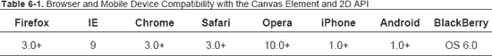
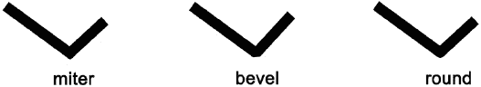

# 六、HTML5 绘图 API

HTML5 的一个很酷的特性是，你可以选择动态渲染 2D 形状和位图图像，因为它现在有自己的本地绘图 API。对于 HTML 来说，这是一个巨大的进步，因为 HTML 从创建之初就一直保持着相当的静态和局限。现在那些日子已经过去了，一个新的可能性领域出现了，来处理在 HTML 页面本身中创建的图形。现在可以构建形状、图形、动画甚至游戏，而无需依赖任何外部插件(如 Flash)。这在开发网页和应用时带来了巨大的价值，但在与移动设备兼容时更是如此。

绘图 API 是新的 HTML5 canvas 元素的一部分，它为 2D 绘图提供了一个 API。最近，通过 HTML5 的 WebGL 支持进行 3D 绘图的可能性似乎即将实现。在撰写本文时，很少有浏览器与 3D 绘图兼容，但在不久的将来，它很可能会成为 HTML5 选项的一部分。

所有支持 HTML5 的主流浏览器都与 canvas 元素兼容，因此也与 2D 绘图 API 兼容。然而，当涉及到 Internet Explorer 时，HTML5 兼容性要到 9.0 版本才能实现。画布元素和 2D API 的浏览器和移动设备兼容性如表 6-1 所示。

*注意:Internet Explorer 7 和 Internet Explorer 8 与 HTML canvas 元素不兼容。然而，可以通过使用“ExplorerCanvas”扩展来克服这个问题并在 IE 中提供画布支持。你可以在 Google Code 上下载这个扩展，地址:`[`excanvas.sourceforge.net/`](http://excanvas.sourceforge.net/)`。你只需要包含下面的 JavaScript 代码:*

`*<!--[if IE]><![endif]-->*`

### 解决方案 6-1:如何使用 canvas 元素的绘图 API 在 HTML5 中绘图

canvas 元素是一个可以添加到 HTML5 页面的矩形区域，它提供了各种各样的图形可能性，因为您可以通过其 2D 绘图 API 控制每个像素。canvas 元素本身没有绘图功能；您将在其中创建的所有内容都将使用 JavaScript 语言以编程方式绘制。

在这个解决方案中，我们将定义一个 canvas 元素并准备好使用它，以便您可以利用它的绘图 API。

#### 涉及到什么

设置能够在 HTML5 中绘图的基础和背景非常简单。你只需要定义一个画布元素，`<canvas></canvas>`。canvas 标记非常简单，只有三个属性:宽度、高度(以像素为单位)和一个标识您正在哪个画布上绘图的 ID。

`<canvas id="canvasID" width="300" height="200"></canvas>`

您可以在 HTML5 页面中放置画布，并像处理任何其他标签一样对其应用 CSS。

您的`<canvas>`最初是空的——一个普通的区域——除非您通过 CSS 给它加上边框或背景色。然而，它不会出现在页面上，直到你在里面画了什么东西。画布只是一个普通的矩形，它将构成一个环境，您可以在其中绘制图形、制作动画等等。

要使用画布并在其中绘图，您需要使用 JavaScript。如果你已经用 ActionScript 3 或 Java 之类的语言编程绘图，你会发现这里有很多相似之处。

一旦创建了画布，您需要做的第一件事就是访问它。您可以像对文档对象模型(DOM)的任何其他元素那样做:

`var myCanvas=document.getElementById("canvasID");`

然后，您可以访问画布呈现上下文，它提供了对绘图 API 及其方法的访问。为了检索上下文对象，canvas 元素使用 DOM 方法`getContext()`，该方法只有一个参数:上下文的类型。在撰写本文时，2D 的上下文是唯一可用的。我们预计在未来几年，3D 环境将在最流行的浏览器中可用，但是，现在我们必须使用 2D 版本。

`var context=myCanvas.getContext('2d');`

现在您已经有了画布并可以访问它的 context 对象，您可以开始使用绘图 API 及其方法在 HTML 页面中创建一些好的艺术品了。

#### 如何建造它

首先用您最喜欢的代码编辑器创建一个新的 HTML5 页面:

1.  创建一个空白 HTML5 页面。`<!DOCTYPE HTML>
    <html>
    <head>
    <meta http-equiv="Content-Type" content="text/html; charset=utf-8">
    <title>solution 6-1/title>
    </head>
    <body>
    </body>
    </html>`
2.  通过将 canvas 标签插入页面来创建画布，并以像素为单位设置其宽度和高度。(如果不设置任何尺寸，在任何浏览器中都会默认为 300×150。)`<canvas id="myCanvas" width="300" height="200"></canvas>`
3.  Give it a one-pixel grey border through CSS, as shown in Figure 6-1. `<canvas id="myCanvas" width="300" height="200" style="border:solid 1px #ccc;"></canvas>` 

    **图 6-1。**带有单像素边框的普通画布

    在你画之前，画布是一个普通的区域，但是你可以像在任何其他 HTML 元素上一样使用 CSS 属性，它会应用背景颜色、图像、笔触等等。

4.  Now you can add fallback content that you might want to show for non-supported browsers. An example of fallback content where canvas is not browser-supported is shown in Figure 6-2. `<canvas id="myCanvas" width="300" height="200" stye="border:solid 1px #ccc;">
    Your browser doesn't support the HTML5 canvas element.
    
    </canvas>` 

    **图 6-2** 来自非 canvas 兼容浏览器的回退内容

    注意:Canvas 没有辅助功能。您可以在某种程度上使用回退内容来掩盖这个问题，但它不会完全做到这一点。

5.  用 JavaScript 通过 DOM 访问画布。``
6.  Retrieve your canvas context object. ``

    您还可以优化代码，并在一行中访问画布上下文，如下所示:

    `var context= document.getElementById('myCanvas').getContext('2d');`

    现在你的画布已经可以在 2D 的背景下绘制了。以下是该示例的完整代码:

    `

    <!DOCTYPE HTML>
    <html>
    <head>
    <meta http-equiv="Content-Type" content="text/html; charset=utf-8">
    <title>solution 6-1</title>
    </head>
    <body>
    <canvas id="myCanvas" width="300" height="200" style="border:solid 1px #ccc;">
                Your browser doesn't support support the HTML5 canvas element.  
                
    </canvas>
    </body>
    </html>`

#### 专家提示

在同一个页面上可以有几个`<canvas>`元素，但是每个画布上不能有多个上下文。因此，如果您试图从画布中检索另一个上下文对象，实际上您将重置它。

``

第一个上下文变量现在将返回 null，您可以通过另一个上下文变量访问画布上下文。

### 解决方案 6-2:使用路径和坐标

现在您已经设置了画布和绘图上下文，让我们看看如何在其中实际绘图。canvas drawing API 为您提供了使用几乎所有图形程序通用的工具进行绘制的选项:笔画、填充、渐变、线条、图元、弧线或贝塞尔曲线。画布绘制是基于矢量图形的；实际绘图是用矢量完成的。然而，一旦绘制完成，它就变成了位图格式，您可以在像素级别与它进行交互。当要在里面画画时，你会处理路径。

这是一个非常简单的 API，它提供了几种方法来允许你绘制自定义的形状。

#### 涉及到什么

当使用路径绘图时，该过程分为两个主要步骤:

1.  定义路径，即路径在画布中的起点、终点及其样式(颜色、线宽、strokestyle、fillstyle 等)。这涉及到使用画布的坐标系。
2.  Render it by adding its stroke and/or fill.

    我们先来看看 canvas 元素的坐标系，了解如何在其中绘制路径。

##### 画布坐标系

画布是一个 2D 网格，其坐标基于常规的 2D 坐标系:垂直 Y 轴、水平 X 轴和位于 x=0，y=0 的原点。

画布的坐标总是由像素决定的。原点“0，0”位于左上角，像素值随着沿 x 轴和 y 轴的移动而增加。回想一下解决方案 6-1，当你定义一个画布时，你给了它一个高度和一个宽度(如果没有，这个值默认为 300×150 像素)。绘图网格的尺寸由画布标签大小值决定。

每当您想要在上下文中放置一个元素时，您首先必须给出它在画布上的位置。你可以通过传递 x 和 y 值来实现，如图 6-3 中的所示。正的 x 值将向右移动，正的 y 值将向下移动。

**图 6-3** 一个画布的坐标系和一个点(7，6)的坐标和位置。

##### 绘制路径

在 HTML5 中使用路径绘图包括绘制形状的大致轮廓(可以是任何形状)。当它结束时，您将通过定义它的笔画和/或填充颜色使它出现在上下文中。一旦你的路径完成，你的形状被渲染，如果你想画另一个形状，只要用一个新的路径重新开始。值得注意的是，每个画布只能有一个路径，因此创建一个路径将自动关闭前一个路径(如果有的话)。

创建路径时，可以连接多个子路径并绘制复杂的形状。您可以使用不同的方法来构造每个子路径:`lineTo()`、`quadraticCurveTo()`、`bezierCurveTo()`和`arc()`。每个连续子路径的终点成为上下文网格上的新起点，这将一直持续到您最终关闭路径。

路径绘制过程始终遵循以下顺序:

1.  通过调用`beginPath()`方法启动路径。
2.  使用`MoveTo(x,y)`方法定义您想要在画布网格中开始路径的坐标，并传递您想要开始路径的 x 和 y 坐标。(使用`arc,`，您将把这些坐标作为方法本身的参数传递，并且您不需要使用`MoveTo())`。
3.  使用 API 的方法来绘制您的形状，并根据您的需要添加尽可能多的子路径。每次添加子路径时，必须使用`MoveTo()`方法定义前一个子路径的最后一个点的坐标。
4.  使用`closePath ()`方法结束路径。这将完成形状。(如果您在上述步骤中使用的方法完成了路径，那么`closePath ()`方法什么也不做。)
5.  最后，调用`stroke ()`或`fill()`方法给你的形状添加一个笔画或填充，或者两者都添加。注意，如果你使用的是`fill()`方法，它会自动关闭路径，然后填充形状，所以在这种情况下没有必要调用`closePath()`方法。

*提示:尽管 canvas 上下文默认为一个新子路径，但是在创建每个新路径之前使用`beginPath()`方法是一个很好的实践。*

2D API 提供了以下方法在画布上绘制路径。同样，记住实际的绘制是在画布上下文中完成的。

*   *Drawing a line path.* You will define the starting point of your line with the `moveTo()` method and pass the coordinate of the ending point of your line by using the `lineTo()` method (see Figure 6.4).

    *方法* : context.lineTo(x，y)；

    

    **图 6-4** 绘制一条直线路径

*   *Drawing a Bezier curve.* A Bezier curve is normally defined by a starting point, an end point, and two control points. You set the starting point with the `moveTo()` method. You then have to add the coordinates of the two control points and of the ending point as parameters of the `bezierCurveTo()` method (see Figure 6.5).

    *方法*:context . beziercurveto(control point 1x，controlPoint1Y，controlPoint2X，controlPoint2Y，endPointX，endPointY)；

    

    **图 6-5** 绘制一条贝塞尔曲线

*   *Drawing a quadratic curve.* Here you only have one control point, which will define the required curve by creating two invisible tangents connected to the starting point and the ending point, as shown in Figure 6.6. Thus, the parameters of the `quadraticCurveTo()` method will be the coordinates of the control point and the ending point. The starting point is, like the other paths, defined through the `MoveTo()` method.

    *方法*:context . quadratic curveto(control pointx，controlPointY，endingPointX，ending pointy)；

    

    **图 6-6** 绘制二次曲线

*   *Drawing an arc.* You need to provide first the x and y coordinates of the center of your arc on the canvas context, then the starting angle and ending angle of your arc (they are set in radians), and finally whether you want to draw it counter-clockwise (true) or not (false), as shown in Figure 6-7.

    *方法*:圆弧(中心，圆心，半径，起始角，终止角，逆时针；

    

    **图 6-7** 画圆弧

##### 为你的形状设置样式

有几个画布上下文属性可让您对形状、线条和笔画应用自定义样式。

###### 线条属性和样式

*   *Line join style.* If you want to draw a shape with several subpaths, there is a line property that addresses the rendering of the line connections: `lineJoin`. Paths can have three possible line joins: `miter`, `round`, or `bevel`, as shown in Figure 6-8. By default, it's set to `miter`. 

    **图 6-8** 线连接

*   *Line width style.* You can also set the width of your line with the `lineWidth` property. The size should be given in pixels. By default, it's set to 1, and shown in Figure 6-9. 

    **图 6-9** 线条宽度样式

*   *线条结束样式:*你也可以通过`lineCap`属性在任何画布线条的末端添加一个线帽。线条可以有三种不同的帽样式:`butt`、`round`或`square,`，如图图 6-10 所示。默认情况下，它被设置为`butt`线帽样式。

你可能会注意到，这两种发型看起来很相似。这是因为`butt`属性添加的是垂直于线条方向的平边，而`square`值添加的是一个长度为线条宽度、宽度为线条一半的矩形。

**图 6-10** 线条末端样式

#### 如何建造它

为了了解如何在画布 API 中使用路径和坐标，我们将向您展示如何绘制 *friendsofED* 徽标(参见图 6-11 )，因为它需要使用不同种类的路径来呈现您在解决方案 6-1 中已经创建的画布。

**图 6-11***的朋友们摆出了*的标志

1.  创建一个空白的 HTML5 页面，并添加一个宽和高为 500 像素、ID 为“`myCanvas`”的画布。您应该为没有支持 HTML5 canvas 元素的浏览器的用户添加一些后备内容。`<!DOCTYPE html>
    <html lang="en">
    <head>
    <meta charset="UTF-8" />
    <title>solution 6-2/title>
    </head>
     <body onload="drawLogo()">
     <canvas id="myCanvas" width="500" height="200">Your browser does not have support for HTML 5
    Canvas.</canvas>
      </body></html>`
2.  从现在开始，一切都用 JavaScript 来完成。您需要编写一个包含绘图过程代码的`drawLogo()`函数。(在这个解决方案中，我们将脚本包含在`<head>`标签页面中，但是您也可以选择将您的脚本具体化，如下所示:`)`。您要做的第一件事是创建对画布及其上下文的访问。`
     </head>`

    这里你又开始了一个新的路径，然后你定义了制作这个多曲线形状所需的子路径，然后你调用了`stroke()`方法。现在您已经有了所有的形状，您可以关闭您的函数和脚本。

5.  To have your shape rendered when the page loads, add a call to the ‘`drawLogo()`' function on the page load in the body tag. `<body onload="drawLogo()">`

    这是该示例的完整代码:

    `<!DOCTYPE html>
    <html lang="en">
    <head>
    <meta charset="UTF-8" />
    <title>solution 6-2</title>
    
     </head>
     <body onload="drawLogo()">
       <canvas id="myCanvas" width="300" height="300" style="border:solid 1px #ccc"></canvas>
     </body>
    </html>`

#### 专家提示

当你想制作更复杂的形状时，用贝塞尔曲线绘图会变得非常乏味，因为这涉及到你所画内容的计算。避免这种情况的一种方法是用任何矢量图形程序绘制图形，然后以 SVG 格式导出文件。然后，您可以用任何代码编辑器打开它，查看曲线的坐标。然后，您可以在 JavaScript 代码中轻松使用它们。

此外，如果您正在使用 Adobe Illustrator，有一个很棒的插件可以帮您省去所有的辛苦工作。它被称为 AI2Canvas，它允许您将文件直接导出为 HTML5 文件，其中包含 Canvas 元素和相应的 JavaScript 代码。它还会转换颜色和渐变。当然，您可能想要重新编写代码来优化它，但是这是一个与设计人员一起工作并避免繁重计算的很好的插件。你可以在这里下载插件:`[`visitmix.com/labs/ai2canvas/`](http://visitmix.com/labs/ai2canvas/)`。

### 解决方案 6-3:绘制形状:矩形和圆形

在这个解决方案中，您将看到如何使用 HTML5 绘图 API 绘制圆形和矩形。我们已经在解决方案 6-2 中介绍了自定义形状路径的使用，现在您将看到 API 为特定形状提供的方法。

#### 涉及到什么

圆，或者我们应该说是弧，和矩形的特定方法也使用画布路径。这意味着它遵循您在解决方案 6-2 中看到的相同程序:

1.  设置上下文画布网格上的坐标
2.  设置填充和描边的样式
3.  Applying the fill and/or stroke to complete the process and render the drawing.

    我们已经在解决方案 6-2 中提到，每个画布一次只有一条路径，所以你只需为每个圆形或矩形创建一条新路径，就像你为每个自定义形状所做的那样。这些将通过 canvas 元素的 context 对象呈现，就像在画布中绘制的任何其他东西一样。先说长方形。

##### 绘制矩形

与 SVG 不同，HTML5 canvas 只知道如何绘制一种基本形状——矩形。所有其他形状必须通过组合一个或多个路径来创建。有四种不同的方法允许你在画布上画一个矩形；你选择的方法取决于你的目标。

您可以使用`rect()`方法，它接受这些参数:矩形左上角的画布上下文网格上的 x 和 y 位置，以及矩形的期望宽度和高度。语法如下:

`rect(x, y, rectangle width,  rectangle height);`

*   `rect()`方法实际上给绘图上下文路径添加了一个矩形路径。您不需要在这里调用`beginPath()`方法，因为`rect()`方法本身就可以做到这一点。然后`stroke()`或`fill()`方法将在上下文中呈现它。
*   您可以通过调用`fillRect()`方法直接绘制填充矩形，该方法采用与`rect()`方法相同的参数。这就像是将`rect()`和`fill()`方法合二为一。`fillRect(x, y, rectangle width,  rectangle height);`
*   调用`StrokeRect()`方法会直接画一个描边矩形。它采用与前两种方法相同的参数。`strokeRect(x,y,rectangle width, rectangle height);`
*   最后一种方法是`clearRect()`。首先，此方法不绘制矩形，而是从另一个形状中减去一个矩形。(如果你熟悉 Illustrator，就像使用‘探路者’工具的减法选项一样)。`clearRect()`采用与`rect()`方法相同的参数。`clearRect(x,y, rectangle width, rectangle height);`

##### 画圆

对于圆，您需要使用我们在解决方案 6-2 中使用的圆弧方法，然后绘制一个起始角度为 0，结束角度为 2×π弧度的圆弧，绘制一个完整的圆弧。

画圆弧的方法是`arc()`，它采用以下参数:

1.  画布网格上圆心的 x，y 坐标
2.  以弧度指定的开始角度和结束角度值。因为要画一个圆，所以从 0 开始，到 2×pi(相当于 360 度的弧度)结束
3.  A Boolean parameter indicating whether you want to draw your arc counter-clockwise (true) or not (false). In the case of a circle, it will work either way of course, so you can set it to either of these `arc(x center coordinate, y center coordinate, 0,Math.pi*2,true)`

    当它创建一个路径时，`arc()`方法将只设置你想要画的圆形。要渲染它，你必须调用`stroke()`或`fill()`方法，这取决于你的需要。(由于你在这里画了一个完整的圆弧，所以`closePath()`的方法就没必要了)。

#### 如何建造它

为了演示这个解决方案，您将通过编程绘制一个圆形和两个矩形，如图 6-12 所示。内部矩形将是一个正方形，填充和描边。这是一个非常基本的绘图，但它涵盖了与这两个形状相关的方法。请记住，绘图 API 本身很简单，但这并不意味着你不能用它来绘制复杂的东西——远非如此。这完全取决于你如何通过将几个简单的形状相加来构建复杂的形状。以下代码的结果将如下所示:

**图 6-12** 绘制复杂形状

1.  打开一个基本的空 HTML5 页面，如解决方案 6-1，有一个画布和访问其绘图上下文。`<!DOCTYPE HTML>
    <html>
    <head>
    <meta http-equiv="Content-Type" content="text/html; charset=utf-8">
    <title>solution 6-3</title>
    </head>

    <body>
    <canvas id="shapes" width="300" height="300" style="border:solid 1px #ccc"></canvas>
    </body>
    </html>`
2.  Create a `drawShapes()` function that will be called on the load page event. The first thing to do is to access your canvas and its context object. `
    </head>
    <body onLoad="drawShapes()">
            <canvas id="shapes" width="300" height="300" style="border:solid 1px #ccc"></canvas>
    </body>
    </html>`

#### 专家提示

如果您不熟悉 JavaScript 或用其他语言(如 ActionScript 或 Java)以编程方式绘图，一开始可能会有点困惑。Canvas Console 是一个很棒的在线工具，可以帮助你尝试 Canvas 绘图 API 的所有方法并熟悉它们的使用(见图 6-13 )。这个工具是由领先的 HTML5 和 CSS 专家约翰·奥尔索普编写的，它可以让你在上下文中绘制任何东西，并立即看到结果。它还有一个包含所有方法和属性的小备忘单。你可以在这个地址试试:`[`westciv.com/tools/canvasConsole/`](http://westciv.com/tools/canvasConsole/)`

**图 6-13** 帆布控制台

### 解决方案 6-4:用纯色填充形状

在前两个解决方案中，我们讨论了绘制自定义和基本形状。您只使用了默认的线条和填充样式，默认的填充颜色是黑色。我们现在将探索绘图 API 的选项来填充您的绘图，您将看到如何添加一些纯色。

#### 涉及到什么

首先让我们看看如何简单地用基本颜色填充你的形状。

##### 设置 *fillStyle* 属性

要填充 HTML5 画布形状，需要使用画布上下文的`fillStyle`属性。有了它，你可以定义特定的颜色来填充你的形状。然后`fill()`方法，或者在矩形情况下的`fillRect()`,将应用这个属性，并使用您定义的样式呈现您的形状。

颜色属性可以通过参考其 RGB 颜色值来定义:

`canvasContext.fillStyle = "rgb(255,0,255)";`

或其十六进制值:

`canvasContext.fillStyle = "0xcccccc";`

如果在没有定义任何`fillStyle`的情况下调用`fill()`方法，那么将应用默认颜色，黑色。

*注意:正如你在解决方案 6-3 和 6-4 中看到的，形状，无论是否自定义，都是由画布上下文路径的子路径组成的。由于每个画布只有一个路径，调用`fill()`方法会自动关闭路径。这意味着，如果您的子路径组合没有连接自己，该路径将关闭，并将最后一个端点与起始路径点连接起来，并填充该区域。因此，您应该小心您希望这发生在哪里，但它也可以节省您一些绘图代码。例如，要画一个填充的三角形，你只需要画两条线，在渲染的时候，API 会创建最后一条线来封闭路径。*

##### 混合颜色

当您用纯色填充形状时，绘图 API 还会将 alpha 混合值添加到可以使用的混合中。代替我们上面讨论的`rgb()`属性，您必须使用属性`rgba()`，其中‘a’代表 alpha 值，是最后一个参数。alpha 值从 0(无透明度；即纯色)到 1(100%或完全透明)。这在图 6-14 中进行了说明。

**图 6-14** 两个矩形重叠，每个矩形的 alpha 值为 0.5

##### 填充笔画

您还可以使用`strokeStyle`属性，然后调用`stroke()`方法，为在画布上下文中绘制的形状和文本的笔画设置纯色填充，这将根据您定义的样式(大小、颜色等)呈现形状的笔画。

与`fillStyle`一样，`fillStroke`颜色属性可以参照其 RGB 颜色值来定义:

`canvasContext.fillStroke="rgb(255,0,255)";`

或其十六进制值:

`canvasContext.fillStroke="0xcccccc";`

*注意:如果你为一个形状设置了填充和描边，在`stroke()`之前调用`fill()`。否则，填充将覆盖一半的笔画。*

#### 如何建造它

在上一个解决方案中，您在画布中绘制了几个形状。你现在将填充一些纯色。

1.  打开前面的解决方案代码。您将拥有一个 300 x 300 像素的 HTML5 页面。加载时，您已经在其中绘制了几个形状:矩形内的一个圆。`<!DOCTYPE HTML>
    <html>` `<head>
    <meta http-equiv="Content-Type" content="text/html; charset=utf-8">
    <title>solution 6-4/title>
    </head>
    <body on load=drawShapes()>
    <canvas id="myCanvas" width="300" height="300"></canvas>
    </body>
    </html>`
2.  从访问画布的上下文对象开始，添加 JavaScript 代码并编写绘制形状的函数。``

    和前面的解决方案一样，在加载页面时调用`drawShapes()`函数来加载画布上下文。(或者，您可以在脚本末尾调用它，结果也是一样的。).结果见图 6-15 。

    `<body onload=drawShapes()>` 

    **图 6-15** 填充素色的形状

    这是该示例的完整代码:

    `<!DOCTYPE HTML>
    <html>
    <head>
    <meta http-equiv="Content-Type" content="text/html; charset=utf-8">
    <title>solution 6-4</title>
    
    </head>

    <body onLoad="drawShapes()">
    <canvas id="myCanvas" width="300" height="300"></canvas>
    </body>
    </html>`

#### 专家提示

到目前为止，我们一直在处理非常简单的形状组合，除了绘图之外没有任何真正的目的。然而，当您开始构建更复杂的画布并以交互方式使用它们时，您将不得不非常小心代码的性能。绘图可能相当耗费处理器资源，一旦你在画布上画了某样东西，你就不能真正把它从其他被画的对象中分离出来；也就是说，您正在创建单个位图图形。因此，任何改变都意味着重新绘制。因此，在某些情况下，将 CSS 和绘图 API 结合起来是有益的。

如果你已经画了一个背景，比如说，你知道你不想在每次交互时改变，通过 CSS 把它作为画布的背景图像是一个好主意。因此，您的上下文将只重绘必须更改的内容，并为您的应用节省一些渲染开销。

### 解决方案 6-5:使用渐变填充形状

现在我们知道了如何绘制填充纯色的形状，让我们看看如何用渐变填充它们。

#### 涉及到什么

与任何标准绘图程序一样，API 提供了两种类型的渐变:线性和径向。

##### 使用线性渐变

要用 HTML5 Canvas 创建线性渐变，需要调用`createLinearGradient()`方法，这需要四个参数通过创建一条不可见的线来定义渐变的方向(参见图 6-16 )。

`var myGradient=context.createLinearGradient(lineStartingPointX, lineStartingPointY,
 lineEndingPointX, lineEndingPointY);` 

**图 6-16** 一个线性渐变

一旦你创建了你的渐变方向并设置了它的坐标，你可以使用`addColorStop`属性插入它的颜色。您可以根据需要向渐变中添加任意数量的颜色，并使用以下方法使用两个参数“偏移”和“颜色值”来创建微妙的渐变填充形状和笔画:

`myGradient.addColorStop(offset value, color1);
myGradient.addColorStop(offset value, color2);`

##### 使用径向渐变

要用 HTML5 画布创建径向渐变，您将使用`createRadialGradient()`方法。

它有以下六个参数，如表 6-2 所列:

`var gradient=context.createRadialGradient(startCircleX, startCircleY, startCirlceRadius,
 endCircleX, endCircleY, endCirleRadius);`

**表 6-2。**createaradialgradient()方法的参数和值

<colgroup><col align="left" valign="top" width="30%"> <col align="left" valign="top" width="50%"></colgroup> 
| **参数** | **值** |
| :-- | :-- |
| startCircleX | 第一个渐变圆的 x 坐标 |
| startCircleY | 第一个渐变圆的 y 坐标 |
| startcirclrceradius | 第一个渐变圆的半径，以弧度为单位 |
| endCircleX | 第二个渐变圆的 x 坐标 |
| endCircleY | 第二个渐变圆的 y 坐标 |
| endCirleRadius | 第二个渐变圆的半径，以弧度为单位 |

这些参数是定义渐变位置和渐变的两个假想圆的坐标和半径。就像线性渐变一样，你可以用`addColorStop`方法添加任意多的颜色来满足你的需求。

图 6-17 径向梯度

你可以在图 6-17 中看到一个半圆形状的两种颜色的径向渐变的例子，以及渐变参数中定义的两个不可见的圆。渐变从半径为 40 像素的第一个圆开始，向半径为 300 像素的第二个圆径向移动，根据颜色的偏移值(0 和 1)部署颜色。定义该径向梯度的代码如下:

`        var gradient=context.createRadialGradient(350,310,40,350,310,300);
        gradient.addColorStop(0,"#6699cc");  //light blue color
        gradient.addColorStop(1,"#cee7fa");  //darker blue color`

##### 用渐变填充笔画

以同样的方式，你可以用渐变填充你的形状的笔画，方法是用渐变定义`Fillstyle`，然后使用`strokeFill()`方法。以下示例将使用渐变填充方形笔画。

`gradient=context.createLinearGradient(20, 120, 160, 120);
gradient.addColorStop(0, "rgb(0, 0, 0)"); // black color
gradient.addColorStop(1, "rgb(255, 255, 255)"); // white color
context.strokeStyle=gradient;
context.rect(10, 10,200,200);
context.stroke();`

#### 如何建造它

1.  和其他解决方案一样，从在 HTML5 页面中设置画布开始。加载后，调用函数`drawGradientShapes()`，该函数将包含用于绘制两个填充了渐变的形状的 JavaScript。`<!DOCTYPE HTML>
    <html>
    <head>
    <meta http-equiv="Content-Type" content="text/html; charset=utf-8">
    <title>solution 6-5</title>
    </head>
    <body onLoad="drawGradientShapes()">
    <canvas id="myCanvas" width="300" height="300" style="border:solid 1px #ccc"></canvas>
    </body>
    </html>`
2.  现在来看 JavaScript 部分和`drawGradientShapes()`函数。首先，访问您的画布及其上下文对象。然后继续绘制自定义形状。``

**图 6-18。**填充渐变的自定形状

这是该示例的完整代码:

`<!DOCTYPE HTML>
<html>
<head>
<meta http-equiv="Content-Type" content="text/html; charset=utf-8">
<title>solution 6-5</title>

</head>
<body onLoad="drawGradientShapes()">
        <canvas id="myCanvas" width="300" height="300" style="border:solid 1px #ccc">
    Your Browser doesn't support HTML5 Canvas !
    </canvas>
</body>
</html>`

### 解决方案 6-6:在画布上绘制文本

canvas drawing API 允许您在 canvas 元素中操作和绘制文本。在本解决方案中，我们将向您展示如何做到这一点。

#### 涉及到什么

绘制文本与绘制形状和路径没有太大区别。它遵循类似的过程，除了不是首先描述路径或形状，而是通过属性 font 指定想要使用的字体和字体大小，然后用 stroke 和/或 fill 方法呈现文本。

我们之前看到的所有渲染样式，颜色、渐变等等，可以像应用于任何其他形状一样应用于文本。CSS 样式也可以用于通过画布 id 绘制的文本。

管理画布中的文本不像使用 CSS 管理常规文本那样可定制。但是，让我们看看您可以使用的几个属性。

##### 字体属性

在画布中绘制的文本继承了`<canvas>`元素本身的字体大小和样式(如果有的话),但是您可以通过在绘图上下文中设置 font 属性来覆盖它们。

您可以在那里定义的字体属性与您在 CSS 中设置的属性相同——字体样式、字体粗细、字体大小和字体系列。语法如下:

`context.font="bold 14px Arial" ;`

默认字体是 10 像素的无衬线字体。

##### 对齐文本属性

您可以设置`textAlign`属性来对齐画布上下文中的文本。对齐是相对于您为文本建立的 x 和 y 位置设置的。它可以有以下值:left、right、start(默认值)、 end 和 center。开始和结束属性基于画布标记的文本方向，从左到右或从右到左。

##### 文本基线属性

无需深入解释，假设文本对齐基于包含文本的行框，并且每个行框都有基线。(通过打开下面的 HTML5 规范链接，您可以看到表示这一点的图形。)基线决定了文本在行框中的位置，其值可以是:顶部、悬挂、中间、字母(默认)、表意和底部。

对于基于拉丁文的字母，最有可能只使用顶部、底部、中间和字母。如果您必须处理其他字母，您可以参考 HTML5 规范网页上的完整基线描述:

`www.whatwg.org/specs/web-apps/current-work/multipage/the-canvas-element.html#dom-context-2d
-textbaseline`

理解画布上的文本呈现被视为与任何其他路径相同的方式是很重要的。因此，可以描边和填充文本，并且所有呈现样式都可以应用于文本，就像它们应用于任何其他形状一样。也就是说，正如您可能期望的那样，文本绘制例程遵循与任何路径相同的过程:

1.  定义您的文本样式。或者，与其他形状一样，您可以指定`fillStyle`、`strokeStyle`、`lineStyle`和`lineWidth`属性，它们的应用方式与其他形状相同。
2.  Call the `strokeText()`, or `fillText()` method to render the text on the canvas.

    这两个方法都有三个参数:画布上文本的 x 和 y 坐标，以及要绘制的字符串。正如您所猜测的，`strokeText()`将只绘制字体的笔画，`fillText()`将绘制填充的文本。

    `context.fillText(x,y,"string");
    context.strokeText(x,y,"string");`

*注意:你可能知道，CSS3 现在提供了`@font-face`属性，允许你从远程位置加载特定的字体。通过 CSS 设置画布字体属性，您可能会尝试将它用于您的画布文本。然而，当您调用`fillText()`或`strokeFill()`方法时，画布上的绘制必须立即发生，浏览器通常不会在上下文呈现时从其位置加载字体。所以最有可能的是，它将会回到默认字体。*

每当你想在画布上使用文字时，有几件事必须要考虑。首先，画布中呈现的任何内容都是不可访问的，文本也是如此。实际上，在其中绘制的文本也是不可选择的。您可能会尝试使用 canvas fallback 内容来克服这个问题，但它并不真正适合这种需求。

#### 如何建造它

1.  创建一个带有 canvas 元素的基本 HTML5 页面。`<!DOCTYPE html>
    <html>
    <head>
    <meta charset="utf-8">
    <title>solution 6-6/title>
    
    </head>
    <body>
    <canvas width="500" height="300" id="myCanvas" style="border:1px solid #ccc"></canvas>`
2.  在页面的顶部，添加一个 JavaScript 标签并编写一个`drawText()`函数，该函数将包含用于在画布中呈现文本的代码。与前面的解决方案一样，首先要访问画布及其渲染上下文。``
3.  You can start to draw your text inside your function. First, define your text styles. `context.strokeStyle = "#993300";
    context.fillStyle=" #ffff09";
    context.font="bold 80px arial";
    context.textAlign="center";
    context.lineWidth="5";
    context.lineJoin="round";`

    您已经设置了字体、字体大小、文本笔划和填充颜色。这里您将基线保留为默认值。

4.  Call the methods to draw the actual stroked and filled text and close your function. `context.strokeText("TML5",220,90);
    context.fillText("HTML5",220,90);
    }`

    在绘制时，必须同时绘制描边和文本填充，才能获得描边文本。

5.  在页面的 body 标签中加载页面时调用函数。`<body onLoad="drawText()">`
6.  结果将如图 6-19 所示:

**图 6-19** 。背景填充文本

这是该示例的完整代码:

`<!DOCTYPE html>
<html>
<head>
<meta charset="utf-8">
<title>solution 6-6</title>

</head>
<body onLoad="draw_text()">
        <canvas id="myCanvas" width="500" height="300" style="border:1px solid #ccc"></canvas>
</body>`

#### 专家提示

您可能会发现 canvas 元素中的文本可能性有点有限。优秀的 JavaScript 开发人员 Jim Studt 创建了一个有趣的 JavaScript 插件，名为“canvas text”，它扩展了 canvas 上下文并添加了一些额外的方法来处理文本。它将以下方法添加到画布中:

*   `context.drawText / context.drawTextRight / context.drawTextCenter`:这将在该位置(基线)以指定的字体和大小绘制文本。
*   `context.measureText`:返回文本的宽度。
*   `context.fontAscent / ctx.fontDescent`:返回从基线的上升/下降。

拥有这些额外的方法增加了操纵文本大小和位置的可能性。例如，它们在应用的动态渲染中非常有用。您可以了解关于这些方法的更多信息，并阅读文档，网址:`[`jim.studt.net/canvastext/`](http://jim.studt.net/canvastext/)`

### 解决方案 6-7:使用相对字体大小在画布上绘制文本

每当你添加文本，你必须设置它的大小。它可以以像素为单位固定，但也可以像处理 CSS 一样相对地设置它。

#### 涉及到什么

就像页面上的其他元素一样，`<canvas>`有一个基于你在 CSS 中定义的字体大小。这和你在处理你的 HTML4 页面时所习惯的没有什么不同。让我们简单回顾一下相对字体大小的概念，以理解它在 canvas 中是如何工作的。

##### 字体大小、em 和相关文本内容

有两种方法可以设置 HTML 页面中的字体大小，一种是以像素(px)或磅(pt)为单位的绝对值，另一种是相对值，即“em”值..

Em 为你提供了相对于父元素设置字体大小的可能性。在 CSS 中，这对于根据呈现媒体调整样式非常有用。

您可以为画布文本使用 em 值。这是什么意思？给字体指定一个 em 大小就是根据其父元素的字体大小按比例指定其大小。因此，如果您的画布字体设置为 10 px，然后您绘制一个大小为 2 em 的文本，该文本将是画布上没有定义特定字体大小的任何其他文本的两倍大。

`context.font="2em Arial";
context.fillText("Arial with a 2em size", 100, 50);`

现在，如果你想完全摆脱绝对值，你将不得不设置父元素字体大小为%(你的画布)，你将有一个完整的文本相对渲染。如今，尤其是随着智能手机和平板电脑的出现，如果你希望你的网络内容可以在任何平台上使用，照顾不同的配置是至关重要的。

#### 如何建造它

1.  Create a basic HTML5 page, and add a canvas element to it. `<!DOCTYPE HTML>
    <html>` `<head>
    <meta http-equiv="Content-Type" content="text/html; charset=utf-8">
    <title>solution 6-7/title>
    </head>
    <body onLoad="drawText()">
    <canvas id="textCanvas" width="400" height="300" style="font-size:100%"></canvas>
    </body>
    </html>`

    添加 canvas 元素时，将 CSS 字体大小设置为 100%。因此，您的画布字体大小将根据父画布调整字体大小。

2.  现在，您可以添加 JavaScript 代码来绘制文本。在这里，您将编写一个`drawText()`函数，它将在页面加载时被调用，以便在浏览器中加载页面时立即呈现您的文本。正如在前面的解决方案中看到的，您将首先通过 DOM 访问您的画布，然后通过它的上下文对象进行绘制。然后你将开始定义和绘制你的文本。``

    你现在可以关闭你的功能。加载页面时，您应该会看到以下视觉效果:

**图 6-20** 用相对字体大小绘制的文本

这是该示例的完整代码:

`<!DOCTYPE HTML>
<html>
<head>
<meta http-equiv="Content-Type" content="text/html; charset=utf-8">
<title>solution 6-7</title>

</head>
<body onLoad="drawText()">
<canvas id="textCanvas" width="400" height="300" style="font-size:100%"></canvas>
</body>`

#### 专家提示

如果你想让你的字体大小调整到客户端浏览器的默认值，就像你在 HTML4 中做的那样；也就是说，在 CSS 文件中将页面的默认字体大小设置为 100%。画布作为一个子元素，现在将基于这个值设置它的字体大小。

### 解决方案 6-8:将形状保存为 PNG 文件

假设您使用 canvas 和 drawing API 在 HTML5 中制作了一个小应用，用户可以在其中生成一些自定义结果(例如，通过绘图应用生成自定义图形或设计)，并且您希望他或她能够保存它。canvas 对象提供了一个方法，可以让您将 canvas 上下文转换成 PNG 格式的文件。(也有其他图像格式，但是 PNG 是唯一一种支持 HTML5 规范的格式，所以我们将重点讨论它。)

#### 涉及到什么

要从画布中检索图像数据，您将使用 canvas 对象的`toDataURL()`方法。

调用时，该方法返回一个 URL，其中包含以 PNG 文件形式表示的画布内容。

`var canvas=document.getElementById('myCanvas');
var imageDate=canvas.toDataURL();`

检索到的`dataUrl`的内容将以`data:image/png;base64`的格式返回，并且是您的 PNG 图像数据的 base64 字符串。如果画布没有像素(即。它的高度和宽度都是空的)，那么这个方法只返回字符串`data`。然后，您可以检索并保存它。

#### 如何建造它

1.  用画布创建一个 HTLM5 页面，就像你在本章中对其他解决方案所做的那样。`<!DOCTYPE html>
    <html lang="en">
     <head>
      <meta charset="UTF-8" />
      <title>solution 8-1/title>
     </head>
     <body onload="init()">
       <canvas id="canvas" width="400" height="400"></canvas>
    </body>
      </html>`
2.  Add a button in the body of your page with the call to the function `saveCanvas` on its click event. `   <button onclick="saveCanvas();">Save PNG</button>`

    HTML5 本身也就这么多了。对于这个解决方案，从现在开始您将只处理 JavaScript。

    因为您希望您的画布和上下文可用于您将要编码的几个函数，所以从定义它们各自的变量开始。然后，在一个单独的函数中检索画布和上下文对象，加载页面时将调用该函数。最后，您将调用一个函数(您将在此之后编写该函数)来处理绘制一个简单的形状，并且您将调用`drawShape()`。

    `
</head>
 <body onload="init()">
   <canvas id="canvas" width="400" height="400"></canvas>
   <button onclick="saveCanvas();">Save as PNG</button>
   

 </body>
</html>`

saveImage.php 电码:

`<?php
if(isset($GLOBALS["HTTP_RAW_POST_DATA"])){
        $imageData=$GLOBALS['HTTP_RAW_POST_DATA'];
        $filteredData=substr($imageData,strpos($imageData,",")+1);
        $unencodedData=base64_decode($filteredData);
        $fp=fopen('canvas.png','wb');
        if(fwrite($fp,$unencodedData)){
                fclose($fp);
                echo 'ok';
        }
}
?>`

download.php 电码:

`<?php
$fsize=filesize('canvas.png');
header('Content-Disposition:attachment;filename="canvas.png"');
header('Content-type:application/force-download');
header('Content-type:image/png');
header('Content-length:'.$fsize.'');
readfile('canvas.png');
?>`

### 总结

如您所见，HTML5 canvas drawing API 提供了广泛的可能性，允许您直接在网页和应用中进行绘制。您可以使用路径绘制基本或复杂的形状，使用颜色和渐变，以及绘制文本。结合所有这些功能，您无需使用任何第三方插件就可以创建出色的 web 内容。

在下一章，你将看到如何进一步使用 HTML5 画布绘制 API。您将能够操纵画布上下文中的元素来创建强大的 web 内容，并直接使用 HTML5 为其添加交互性和动画。