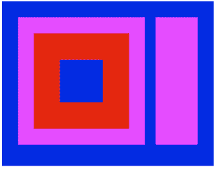
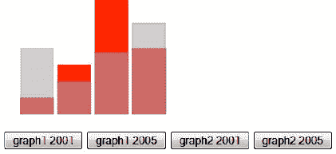
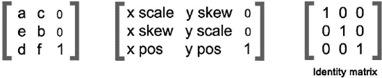
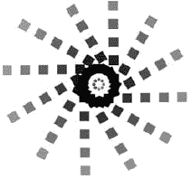
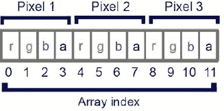
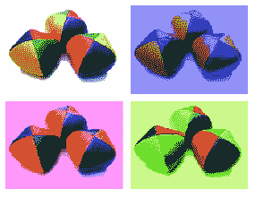
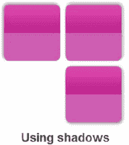

# 七、HTML5 画布

* * *

我们在前一章中看到了如何使用 HTML5 画布绘制 API。我们现在将更深入地操作 canvas，看看它如何用于动态渲染图形、游戏图形或其他视觉图像。正如您之前所了解的，canvas 是一个矩形区域，您可以将它添加到 HTML5 页面中，并且可以使用它通过几种可用的方法来呈现和操作图形。在这一章中，你将看到你能用 canvas 和它的其他 API 做什么。

苹果最初创建 canvas 元素是为了使用 Mac OSX WebKit 在 Safari 浏览器中制作 dashboard widgets。后来它被其他浏览器采用，并最终成为 WHATWG (Web 超文本应用技术工作组，`[`whatwg.org/html`](http://whatwg.org/html)`)接受的标准。

在第六章中，我们介绍了如何使用 canvas 元素绘制形状和文本。然而，你可以做的不仅仅是用画布绘制静态位图。canvas 元素为 HTML 提供了广泛的可能性——您可以渲染图形并使其具有交互性、处理图像、制作动画、构建游戏等等。

在 canvas 元素出现之前，每当您想在 HTML4 中这样做时，您都必须依赖第三方专有插件，如 Flash、Silverlight 等。现在，您可以通过 canvas 元素在 HTML5 文档中使用所有这些功能。

通过 canvas 元素可以实现很多事情，我们不可能在一章中涵盖所有内容。尽管如此，在这一章中，你将看到如何使用 canvas 元素在浏览器中轻松地添加丰富的图形。我们涵盖了 canvas 元素的以下方面:

*   画布 API 概述
*   如何检测画布元素和画布文本支持
*   基于屏幕的标准坐标系和变换
*   如何在画布中操作像素
*   如何对图形元素应用阴影和模糊
*   如何使用 canvas 元素构建动画

### 解决方案 7-1:了解 canvas APIs

如前一章所见，canvas 元素是一个矩形区域，允许您在 web 浏览器中动态呈现图形和位图图像。因此，它提供了广泛的图形可能性，允许您控制其内容的所有像素，并以多种方式操纵它们。当我们谈论渲染图形时，我们首先必须指出画布本身没有绘制或渲染功能，并且您将在其中渲染的一切都将通过使用 JavaScript 代码来实现。

#### 涉及到什么

你可以在你的 HTML5 页面中声明一个`<canvas>`元素，如第六章中的所示，如下所示:

`<canvas id="aCanvas" width="640", height="480">
Your browser doesn't support the canvas element!
</canvas>`

这将声明一个宽 640 像素、高 480 像素、ID 为“aCanvas”的`<canvas>`元素。您的画布的任何子元素都将被您的浏览器视为后备内容，只有当您的浏览器不兼容画布时，它才会显示。HTML5 规范建议您的回退内容尽可能匹配您的画布内容。

要在画布上做任何事情，首先需要访问`<canvas>`元素，并从那里访问它的绘图上下文对象，在那里进行实际的绘图和像素处理。如前所述，您将使用 JavaScript 代码完成所有这些工作。由于 canvas 元素可以通过 DOM 获得，就像任何其他元素一样，您将通过它的“id”属性来访问 canvas:

`var  canvas=document.GetElementbyId('aCanvas');`

您还可以通过编程方式添加画布，方法是使用 JavaScript 直接将画布插入 DOM，然后添加到页面:

`<head>

</head>`

这将产生完全相同的结果:一个 640 像素乘 480 像素的画布，ID 为“a canvas”。

> *提示:设置画布的宽度和高度会自动重置整个画布元素。如果在运行一个应用的过程中，你需要清空你的画布，只需要重新设置它的高度和宽度就可以很容易做到。*

在撰写本文时，HTML5 规范中只支持 2D 上下文，所以我们将只讨论这个上下文。然而，值得注意的是，通过 WebGL 支持，3D 上下文的使用已经取得了广泛的进展，这显示了在 canvas 元素中处理 3D 图形的巨大前景。我们期待它很快也能上市，开启新的和令人惊叹的 HTML5 可能性。

通过使用从 DOM 中检索的 canvas 对象的`getContext()`方法，获取对 2D 上下文的引用，如下所示:

`var context=canvas.getContext('2d');`

然后，通过其上下文，您可以使用其绘图 API 中可用的工具集，例如:

*   变换(包括缩放和旋转)
*   阴影
*   复杂的形状，包括贝塞尔曲线和圆弧(见第六章

关于可用的 2D 上下文 API 方法的完整列表和概述，请参考这个有用的 canvas 2D 上下文备忘单:`[`www.nihilogic.dk/labs/canvas_sheet/HTML5_Canvas_Cheat_Sheet.pdf`](http://www.nihilogic.dk/labs/canvas_sheet/HTML5_Canvas_Cheat_Sheet.pdf)`

需要理解的重要一点是，画布使用即时模式渲染器。这意味着，当您调用一个方法在画布中进行绘制时，浏览器将在继续下一行代码之前立即呈现该更改。因此，无论何时您想要在画布上更改任何内容，您都必须重新发出在画布上使用的所有绘图命令，即使更改只影响一个元素。也就是说，canvas 元素提供了两种方法，让您可以随时存储和重置画布的状态。(画布绘制状态是已应用的所有样式、剪辑和变换值的快照。)

*   *save():* 这将保存当前的样式、剪辑和变换值。
*   *restore():* 这将把样式和转换值重置为您上次在上下文中调用`save()`方法时的值。如果你还没有保存任何东西，那么这个方法就没有任何作用。

例如，假设您在画布上下文上画了一个圆，其`strokeStyle`设置为灰色，然后您在上下文上调用`save()`方法，并用白色`strokeStyle`画另一个圆。如果您随后调用`restore()`，两个圆圈都将有一个灰色的笔划，并且您上次保存画布状态时定义的所有样式属性现在都将被恢复。请记住，我们处于即时呈现模式，浏览器会在浏览代码的过程中呈现更改。在处理 canvas 转换方法时，我们将更清楚地看到如何使用这些信息。

#### 如何建造它

1.  Create a canvas in a regular HTML5 page:
    `<!DOCTYPE HTML>
    <html>
    <head>
    <meta http-equiv="Content-Type" content="text/html; charset=utf-8">
    <title>Canvas</title>
    
    </head>
    <body>
    </body>
    </html>`

    这里您正在创建一个名为`init()`的函数，它将使用 JavaScript 从头开始创建您的画布。画布大小为 500 x 500，有 1 个像素的灰色边框。使用`window.onLoad=init;`，您可以告诉页面在加载完成后运行`init`函数并添加画布。为什么要使用这个全局事件处理程序，而不是仅仅用`onLoad`将代码添加到 body 标签中？这两种方式都可以，但是如果你想在几个页面中重复使用相同的 JavaScript 代码(通过从单独的源调用)，`window.onLoad=init;`将更具适应性。

    您也可以使用以下代码实现相同的结果(我们在这个解决方案代码中使用了它):

    `<!DOCTYPE HTML>
    <html>
    <head>
    <meta http-equiv="Content-Type" content="text/html; charset=utf-8">
    <title>solution 7-1</title>
    
    </head>
    <body>
    <canvas id="canvas" width="500" height="500" style="border:solid 1px #ccc"></canvas>
    </body>
    </html>`

    根据你的需要，你可以使用任何一种可能性，后者更简单，对于简单的画布来说绰绰有余。

2.  Retrieve the canvas context, and get the access to the API set of tools by adding the following in your `init()` function after having defined or retrieved your canvas object:
    `var context=canvas.getContext('2d');`

    从现在开始，您可以访问 canvas context API 可用的所有方法。

3.  With a new `draw()` function, draw three differently-sized rectangles and use the `save()` and `restore()` methods to set their respective styles:
    `function draw(){
            context.fillStyle='#000099';
            context.fillRect(0,0,200,155);
            context.save();

            context.fillStyle=#FF66FF';
            context.globalAlpha=.6;
            ccontext.fillRect(15,15,120,120);
            context.save();
            context.fillStyle='#993333';
            context.globalAlpha=1;
            context.fillRect(30,30,90,90);

    }`

    这段代码绘制了三个简单的矩形，一个蓝色的，一个较小的粉红色的，alpha 值为 0.6(正如你在解决方案 6-4 中看到的，颜色混合，使它们看起来更紫)，一个栗色的，alpha 值为 1。在绘制了前两个形状之后，您分别保存了画布上下文状态，如果需要的话，一个接一个地存储它们以供将来使用。

4.  Add two other simple rectangles, and set their styles by restoring the states you previously saved.
    `    context.restore();
        context.fillRect(145,15,40,120);

        context.restore();
        context.fillRect(55,55,40,40);
    }`

    这将首先恢复之前保存的状态，然后绘制一个矩形。应用于该形状的设置是在您刚刚恢复的状态中定义的:alpha 为 0.6，粉红色为`fillStyle`。

    然后再次调用`restore()`方法，它将恢复到您刚才应用的状态之前的状态；即原始状态值(您保存的第一个值)，呈现另一个蓝色形状。

5.  Close your `draw()` function, and call it in the `init()` function.
    `function init(){
            var canvas=document.getElementById('canvas');
            draw();
    }`

    加载你的页面会产生如图 7-1 所示的结果。

    

    **图 7-1。**使用`save()`和`restore()`方法绘制的形状

    以这种方式使用`save()`和`restore()`方法，虽然不实际，但提供了对其结果的简单理解。当你必须处理像素变换和交互性时，它们的效用就更加明显了，这一点你将在本章后面看到。这也清楚地显示了画布是如何通过顺序处理命令来处理图形渲染的。

    此示例的完整代码如下所示:

    `<!DOCTYPE HTML>
    <html>
    <head>
    <meta http-equiv="Content-Type" content="text/html; charset=utf-8">
    <title>solution 7-1</title>
    
    </head>
    <body>
    <canvas id="canvas" width="500" height="500" style="border:solid 1px #ccc"></canvas>
    </body>
    </html>`

#### 专家提示

每个画布只能有一个上下文。这意味着一旦你在上面画了东西，如果你要做任何改变，即使是对许多元素中的一个元素，整个场景都要被重画。有时，使用几个画布作为层，一个在另一个之上，以便只重画特定事件所需的内容，这可能会很有趣。

您可以在一个小示例中看到这一概念，在该示例中，您绘制了两个基本的重叠图形，并更改了每个图形的值，而不必通过使用单独的层来重绘另一个图形。(这里我们不会费心去画刻度值，只会用一个普通的图形。)

1.  在常规`
`元素中创建两个高度和宽度相同的画布。
    
2.  The two canvases are here, but right now they are just next to another like any regular HTML element. To make them overlap each other, you'll use CSS to position them and set their z-index. You can either put this directly in your HTML5 page inside a `` tag, or in an external CSS file. In this example, let's just have everything on the same page for code readability.
    `#graphs{
            position:relative;
            width:500px;
            height:220px;
    }
    #first_layer{
            z-index: 1;` `        position:absolute;
            left:20px;
            top:0px;
    }

    #second_layer{
            z-index: 2;
            position:absolute;
            left:20px;
            top:0px;
    }`

    要分别修改两个画布，请在画布下方添加一些按钮来调出不同的值:

    `<button id="graph1" onClick="drawGraph(context,data,'#ccc')">graph1 -  2001</button>` `<button id="graph2" onClick="drawGraph(context,data2,'#ccc')">graph1 - 2005</button>
    <button id="graph3" onClick="drawGraph(context2,data3,'red')">graph2 -  2001</button>
    <button id="graph4 onClick="drawGraph(context2,data4,'red')">graph2 - 2005</button>`

    现在添加您的 JavaScript 代码来定义您的`drawGraph()`函数。首先检索两个画布及其各自的上下文区域，然后定义您将需要的变量:

    ``

首先，该函数将使用`clearRect()`方法清除上下文，在空白画布上开始，然后它将使用所需的值绘制图形。因此，每次你点击一个按钮，它只会用你想要的值重新绘制选中的图形，如图 7-2 所示。当然，您可以在一个层中实现相同的视觉效果，但这意味着要重新绘制每个事件的所有内容，甚至是具有相同值的其他图形。根据您的需要，您可以使用任何一种方法。使用多个画布作为层可以增强动画和游戏的性能，这有助于提高您的应用在移动浏览器上的性能。

**图 7-2。**使用多个画布作为图层的图形

### 解决方案 7-2:检测画布和画布文本支持

每当您想要交付 web 内容时，确保兼容性是首要任务。尽管 HTML5 获得了主流浏览器的进一步支持，但所有浏览器(尤其是旧版本)都不支持 canvas 元素。另外，有些支持 canvas，但仍然不支持 canvas 文本 API。

处理浏览器不支持 canvas 的情况的基本方法是在你的`<canvas></canvas>`标签中添加后备内容，正如你在第六章中看到的，尽可能匹配你的 canvas 内容。然而，这可能并不总是准确的，并且您可能会受到限制，因为回退内容不能提供您的画布所做的一切，例如交互式内容。因此，您可能希望在加载页面时动态检查浏览器支持，并提供比依赖 canvas 标记的后备内容更符合您需求的其他内容。您甚至可以选择相应地修改整个页面，并创建一个合适的替代页面来确保更好的用户体验。例如，您可以用 JavaScript 编写一个替代内容，它比简单的图像或纯文本更匹配您的画布内容。

#### 涉及到什么

检查浏览器是否支持 canvas 元素的一种简单方法是在检索 canvas 对象及其上下文时进行。如果浏览器不支持 canvas 元素，那么当通过 DOM 检索 canvas 对象时，您将只有一个基本的对象，没有任何特定于 canvas 的内容。所以如果你试图调用`getContext()`方法，它不会返回任何函数。您可以编写一小段代码来实现这一点:

`        var canvas=document.getElementById('canvas');
if(!!canvas.getContext){

}`

因此，如果浏览器不支持 canvas 元素，您可以添加任何替代元素。否则，就像往常一样检索画布上下文。

`else{
        var context=canvas.getContext('2d');
}`

如果你的浏览器支持 canvas 元素，并不一定意味着它支持 canvas text API。因此，如果您想在画布上绘制任何文本，也需要检查这一点。遵循相同的过程:调用特定于 canvas text API 的方法，并查看它返回的内容。如果它不返回任何函数，那么它就不被支持。

`if(!!context.fillText){
        //the Canvas text API is supported and you can proceed with your code
}
else{
        // you can add an alternative text, or add any other element to replace it through
 the DOM.
}`

#### 如何建造它

1.  创建两个简单的函数来检查 canvas 和 canvas 文本支持。首先，编写一个`canvasSupport`函数。原理是创建一个画布，通过 DOM 访问它的上下文对象。如前所述，如果 canvas 元素不受支持，canvas 对象将无法调用`getContext()`方法，它将返回一个未定义的值。然后你可以使用 JavaScript 双负技巧将返回值强制转换为布尔值(真或假):如果为真，则意味着定义了上下文，并且支持画布；否则就不是了。
    `function canvasSupport(){
            return !!document.createElement("canvas").getContext;
    }`
2.  通过从画布上下文调用`fillText()`方法，创建一个函数来检查画布文本支持。如果你的浏览器不支持它，它将返回一个未定义的值，而不是一个函数。同样，您将返回值强制转换为布尔值。
    
3.  在加载页面事件上调用您的函数:`window.onload=init;

    function init(){

            if(canvasSupport){

                    // proceed with the use of the canvas APIs

                    If(canvasTextSupport){
                            //proceed with your code using the Canvas text API
                    }
            }

            else{
                    //add any alternative you wish in complement of the fallback content if you
     wish.
            }
    }`
4.  现在看一下前面的例子，在这个例子中，您使用了几个画布作为层，以交互的方式显示图形。您仍然希望没有 HTML5 兼容浏览器的用户能够看到您的图表，因此您只需编写一个小的替代程序，让他们能够看到您不同图表的图片。在这里，他们不会看到 HTML5 中图形的超级拼版，但他们仍然会有经典的按钮和图像。这段代码只会在不兼容的浏览器上加载，如下:
    `<!DOCTYPE HTML>
    <html>
    <head>
    <meta http-equiv="Content-Type" content="text/html; charset=utf-8">
    <title>solution 7-2</title>
    
    
    </head>

    <body>
    

        <canvas id="first_layer" width="500" height="200" ></canvas>
        <canvas id="second_layer" width="500" height="200"></canvas>
    

    

    <button id="graph1" onClick="drawGraph(context,data,'#ccc','graph1')">graph1 2001</button>` `<button id="graph2" onClick="drawGraph(context,data2,'#ccc','graph2')">graph1 2005</button>
    <button id="graph3" onClick="drawGraph(context2,data3,'red','graph3')">graph2 2001</button>
    <button id="graph4" onClick="drawGraph(context2,data4,'red','graph4')">graph2 2005</button>
    

    </body>
    </html>`

#### 专家提示

如果不想自己写函数检查浏览器支持，可以用 Modernizr。它是一个开源的 JavaScript 库，检测对许多 HTML5 特性(如地理定位、视频、本地存储等)以及 CSS3 的支持。由于页面上的元素很有可能比画布上的元素多，所以您可以使用它来处理您可能需要的各种支持检测。

至于画布和画布文字，真的很简单。首先包括库(在撰写本文时，我们使用的是最新版本):

`

if (Modernizr.canvas) {

   var c=document.createElement('canvas');
   c.setAttribute('width', '500');
   c.setAttribute('height','500');
   c.setAttribute('id', 'canvas');   var context=c.getContext('2d');

}

else{

        //no canvas support
        var alt_canvas=document.createElement("div");
        alt_canvas.setAttribute('width', '500');
        alt_canvas.setAttribute('height','500');
        alt_canvas.setAttribute('id', 'alt_canvas');
        document.body.appendChild(alt_canvas);

}`

…对于画布文本支持:

`if (Modernizr.canvastext) {
// draw your text
        context.fillStyle="#000";
        context.font="bold 15px Arial";
        context.fillText("Some text drawn in your canvas.",20,40);
} else {
//no canvas text support
        var alt_canvas_text=document.createElement("div");
        alt_canvas_text.setAttribute('width', '500');
        alt_canvas_text.setAttribute('height','40');` `        alt_canvas_text.setAttribute('id', 'alt_canvas_text');
        document.body.appendChild(alt_canvas);
        document.getElementById('alt_canvas_text').innerHTML="Some alternative text."
}`

您可以从以下地址下载 Modernizr 的最新版本以及用户文档:`[`www.modernizr.com/`](http://www.modernizr.com/)`。

### 解决方案 7-3:理解标准的基于屏幕的坐标系和画布变换

HTML5 canvas 还提供了允许你进行变换操作的方法，比如缩放、旋转、平移，甚至变换矩阵操作，它们都是关于 canvas 坐标系的。事实上，当您在画布上下文上执行变换时，您正在根据您的目标(重新缩放、移动形状等)变换整个上下文的坐标系，而不是在其上绘制的内容。在这个解决方案中，您将看到如何操纵坐标系来实现这一点。

#### 涉及到什么

您可以在画布上下文上执行一些转换操作。它们中的每一个都需要修改上下文的坐标。流程是先修改坐标系，然后照常在上面画。简而言之，你修改的不是上下文的内容，而是上下文本身。

*   *Scaling* *canvas objects:* You achieve this by using the `scale()` method, which scales the canvas context itself; that is, the x and y-axis coordinates. This method takes two parameters: the scale factor in the horizontal direction, and the scale factor in the vertical direction. Those scale values are based on the unit size of 1: `scale(1,1)` will keep the same scale as the original, values larger than 1 will increase it, and values smaller than 1 will decrease it. The values must always be positive.
    `context.scale(scaleX,scaleY);`

    *注意:要获得比例缩放值，必须给出相等的 scaleX 和 scaleY 值。*

*   *平移画布对象:*如果你想移动画布上绘制的形状或任何东西，首先使用`translate()`方法。它会将画布及其原点移动到网格中的另一个点，这个点是通过两个参数定义的。第一个参数是画布在水平轴上移动的量(以像素为单位)。第二个参数是它在纵轴上向上或向下移动的量。这个点就是新的原点(0，0)，无论你画什么都以它为原点。
    
*   *旋转画布对象*:`rotate()`方法将上下文旋转到其参数给定的角度。角度值以弧度为单位。
    `context.rotate(angle);`
*   *使用转换矩阵:*`transform()`方法将改变转换矩阵以应用其参数给定的矩阵，如下所示:
    `context.transform(a,b,c,d,e,f);`

这些参数对应于图 7-3 中所示的矩阵变换值。

**图 7-3。**矩阵转换值

> *注意:只有对应于 a、b、c、d、e 和 f 的值可以修改。当一个矩阵没有引起变换时，你就有了所谓的“单位矩阵”*

也可以用`setTransform(a,b,c,d,e,f)`的方法。它将当前变换重置为单位矩阵(参见图 7-3 ，然后用其参数调用`transform()`方法。

您还可以通过变换矩阵执行旋转、缩放和平移。好处是你可以一次全部执行。另一方面，如果您不熟悉 2D 矩阵系统，那么依次使用其他特定方法可能会更安全。

在应用任何变换之后，你可能想要回到原始坐标系进行下一次绘图或操作(除非你只是真的喜欢思维练习！).这就是画布的`save()`和`restore()`方法最有用的地方。(参见解决方案 7-1，了解`save()`和`restore()`方法)。在使用任何变换方法之前，您可以通过`save()`方法保存画布状态来保留原始坐标系。然后，完成变换后，您只需从变换前阶段恢复画布状态，然后使用原始的常规坐标系执行任何新操作。我们建议您对想要执行的每个转换都使用这个过程。否则，它会很快变得复杂，因为每次转换都要重新定义坐标。

#### 如何建造它

要了解如何使用坐标系统的变换，让我们使用所有变换方法创建一些绘图。此示例旨在展示这是如何工作的，而不是创建一个可用的绘图。

1.  首先创建一个基本的 HTML5 页面，用一个画布和一个 onload 事件函数来检索画布及其上下文。
    `<!DOCTYPE HTML>
    <html>
    <head>
    <meta http-equiv="Content-Type" content="text/html; charset=utf-8"><title>solution 7-3/title>
    
</head>
<body>
<canvas id="canvas" width="500" height="500"></canvas>
</body>
</html>`

#### 专家提示

如果您想要从图像的中心旋转图像，您首先需要转换上下文以移动原点。然后应用旋转并相应地绘制图像，如下所示:

`var img=new Image();
img.src='yourImagePath.jpg';

img.onload=function(){
        context.translate(img.width/2, img.height/2);
        context.rotate(90*Math.PI/180); // here we apply a 90 degres rotation
        context.drawImage(img,-img.width/2,-img.height/2,img.width, img.height);
}`

### 解决方案 7-4:像素操作

正如您在前面了解到的，画布 API 提供了让您操纵画布内任何像素的方法。您看到了您可以绘制形状并对它们应用变换，但是也有一些方法允许您在画布上一个像素一个像素地绘制或应用变化。

#### 涉及到什么

您可以通过使用`ImageData`对象来实现对画布上像素的操作。它表示您选择的画布上下文区域的当前状态的像素数据。它有以下属性:以像素为单位的宽度和高度，以及“data”——一个包含图像数据的每个像素的颜色分量的`canvasPixelArray`元素；即红色、绿色、蓝色和 alpha(每个值从 0 到 255)。像素从左到右和从上到下排序。通过这些图像对象数据，您将能够在画布上执行逐像素操作。

对于像素操作，canvas API 提供了三种方法来执行以下操作:

*   *Creating image data:* Call the `createImageData()` method, which takes 2 parameters: width, and height of your image data in pixels. It will create a set of transparent black pixels that you can then manipulate by assigning values to the data `canvasPixelArray`.

    如果我们要做一个像素阵列的表示，它看起来会像图 7-5 所示的图像。

    

    **图 7-5。**像素阵列

    `var canvas=document.getElementById('canvas');
    var context=canvas.getContext('2d');
    var imagedata=context.createImageData(canvas.width,canvas.height);`

    这将创建一个包含整个画布上下文的像素数据的`imagedata`对象。

    > *注意:您可以在创建图像数据时指定坐标，以选择画布上下文的特定区域。默认情况下，它们被设置为 0，0，因此如果您只给定画布的宽度和高度作为参数，您的图像数据将覆盖整个画布。*

    `var canvasPixelArray=imagedata.data;`

    现在你可以通过`canvasPixelArray`访问每一个像素，你可以开始随心所欲地操作它。因为每个像素有四个颜色值(红色、绿色、蓝色和 alpha)，所以滚动数组并为每个像素设置颜色值。

    以下代码将为 imagedata 对象的每个像素分配以下 RGBA 值:255、200、125 和 150。

    `        for (var i=0;i< canvasPixelArray.length;i+=4) {

                    canvasPixelArray [i]=255             // red channel
                    canvasPixelArray [i+1]=200;        // green channel
                    canvasPixelArray [i+2]=125;        // blue channel
                    canvasPixelArray [i+3]=150;  // alpha channel

            }`
*   *Retrieving a pixel array* : You can also retrieve the pixel array from an existing canvas through the `getImageData()` method.

    它有四个参数——要检索的区域的 x 和 y 位置以及宽度和高度(以像素为单位)。

    `context.getImageData(x,y,width,height);`

    使用这种方法，您可以通过`drawImage()`方法访问您在画布上绘制的形状的像素数组，或者您在画布上下文中添加的图像的像素数组。然后你可以做任何种类的像素操作来创建像滤镜这样的东西。

*   *在上下文上绘制图像数据:*一旦你创建了一个`imageData`对象并对其进行了任何类型的像素操作，你就可以通过调用`putImageData()`方法在上下文上绘制你的`imagedata`。它有三个参数:imagedata 对象及其 x 和 y 坐标。

`Context.putImageData(imagedata,0,0);`

#### 如何建造它

为了查看像素操作的实际示例，我们将拍摄一张照片，并对其应用基本的颜色过滤器，然后在画布上的原始照片旁边显示操作后的版本，如图 7-6 所示。(这个例子是为了可读性，并没有特别优化。)

**图 7-6** 。通过像素操作应用了不同颜色滤镜的照片

为此，请遵循以下步骤:

1.  用画布创建一个基本的 HTML5 页面。
    `<!DOCTYPE HTML>
    <html>
    <head>
    <meta http-equiv="Content-Type" content="text/html; charset=utf-8">
    <title>solution 7-4/title>
    </head>
    <body>
    <canvas id="canvas" width="500" height="500"></canvas>
    </body>
    </html>`
2.  然后，在您的`<head></head>`标签中，检查画布支持，并在加载页面时加载一个图像。
    
3.  当图像加载完成后，访问画布上下文，将照片添加到画布的左上角(原点)。然后通过调用`getImageData()`方法并传递画布上的照片坐标及其宽度和高度来获取照片的 imagedata 对象。通过这样做，imagedata 对象将只获得画布这个区域的像素数据。
    `function imageLoaded(evt){

            context=document.getElementById('canvas').getContext('2d');
            originalPic=evt.target;
            context.drawImage(originalPic,0,0);
            var imgd=context.getImageData(0,0, originalPic.width,originalPic.height);

            applyBluefilters(imgd);
            applyRedfilters(imgd);
            applyGreenfilters(imgd);

    }`
4.  Now that you have your photo's pixel data available, create some custom methods to apply basic color filters to them.
    `function applyBluefilters(img){

            var pixelsArray=img.data;
            for(var i=0;i<pixelsArray.length;i+=4){

                    img.data[i]=img.data[i]/2;
                    img.data[i+1]=img.data[i+1]/2;
                    img.data[i+2]=img.data[i+2]*2.5;
                    img.data[i+3]=img.data[i+3];

    }

            context.putImageData(img,170,0);
    }`

    这里首先检索包含像素数据的数组。对于每个像素，首先获取其红色、绿色、蓝色和 alpha 值，并根据需要重新分配新值。为了实现这种蓝色滤镜效果，减少红色和绿色的值，并加入更多的蓝色。完成后，在上下文上绘制新的 imagedata。

5.  根据您想要实现的效果，通过调整每个像素的 RGB 值来创建应用红色和绿色滤镜的方法。
    ??`        }

            context.putImageData(img,0,170);
    }

    function applyGreenfilters(img){

            var pixelsArray=img.data;

            for(var i=0;i<pixelsArray.length;i+=4){

            r=img.data[i]*3;
            g=img.data[i+1]/2;
            b=img.data[i+2]/2;
            a=img.data[i+3];
            img.data[i]=r;
            img.data[i+2]=b;
            img.data[i+3]=a;
            r=img.data[i]/2;
            g=img.data[i+1]*4;
            b=img.data[i+2]/2.5;
            a=img.data[i+3];

            img.data[i]=r;
            img.data[i+1]=g;
            img.data[i+2]=b;
            img.data[i+3]=a;

            }
            context.putImageData(img,170,170);
    }
    </script>`
6.  在你的图像上调用你的自定义方法`loadEvent()`。
    

这里显示了这个例子的完整代码。(您需要将图像“`pic.jpg`”放在同一个文件夹中。)

`<!DOCTYPE HTML>
<html>
<head>
<meta http-equiv="Content-Type" content="text/html; charset=utf-8">
<title>solution 7-4</title>

</head>
<body>
<canvas id="canvas" width="500" height="500"></canvas>
</body>
</html>`

#### 专家提示

操纵像素会降低性能。如果你多次使用你的画布上下文的同一个 imagedata，并且你需要恢复它(在一个帧事件，鼠标事件，或者在一个循环中，等等)，你可以使用`toDataUrl`方法代替`putImageData()`(见第六章，解决方案 6-8 关于这个方法的更多细节)。

`savedImagedata=new Image()
savedImagedata.src=canvas.toDataURL("image/png");`

每当您需要恢复它时，请使用以下代码:

`context.drawImage(savedImagedata,x,y) ;`

### 解决方案 7-5:应用阴影和模糊

canvas API 还提供了在画布上绘制的任何东西(形状、路径、文本、图像等等)上创建漂亮的模糊阴影效果的方法。

#### 涉及到什么

正如您到目前为止所了解的关于 canvas API 的大部分内容一样，向您绘制的元素添加阴影意味着在绘制时将这些效果应用到 canvas 上下文本身，从而将其应用到您正在绘制的内容。canvas API 提供了与阴影相关的上下文属性，可以让你定义它的颜色、位置和模糊程度。(如果你熟悉用 CSS 应用阴影效果，你会发现自己在这里非常熟悉的领域。):

*   *shadowColor:* 这个属性设置上下文阴影的颜色。创建上下文时，它是透明的黑色。
    `context.shadowColor="#333";`
*   *shadowOffsetX* :该属性返回并设置水平阴影偏移量，以像素为单位。`context.shadowOffsetX=5;`
*   *shadowOffsetY:* 该属性返回并设置垂直阴影偏移量，以像素为单位。
    `context.shadowOffsetY=5;`
*   *shadowBlur:* 这个属性返回并设置模糊等级。其值必须大于 0。
    `context.shadowBlur=10;`

设置上下文阴影属性后，它们将应用于您在画布上绘制的任何内容，直到您重置它们。

#### 如何建造它

要查看如何在上下文中应用模糊阴影，让我们绘制简单的形状，圆角矩形，并在画布中对它们应用不同的阴影。它应该给出如图 7-7 所示的结果:

**图 7-7。**使用阴影

1.  用画布创建一个基本的 HTML5 页面。首先在加载时检查画布支持，然后访问画布上下文。
    ??`<title>solution 7-5/title>

    
    </head>
    <body>
    <canvas id="canvas" width="300" height="340">
    Your browser doesn't support HTML5 Canvas !
    </canvas>
    </body>
    </html>`
2.  Now create a custom method to draw rounded squares using paths.
    `function drawRoundRect(x,y,width,height,radius){

      context.beginPath();
      context.moveTo(x +radius, y);
      context.lineTo(x+width-radius, y);
      context.quadraticCurveTo(x+width, y, x + width,y+radius);
      context.lineTo(x+ width, y+height-radius);
      context.quadraticCurveTo(x+width,y+height, x+width-radius, y+height);
      context.lineTo(x+radius, y+height);
      context.quadraticCurveTo(x,y+height, x, y+height-radius);
      context.lineTo(x,y+radius);
      context.quadraticCurveTo(x, y,x+radius,y);
      context.closePath();

      //defining the gradient fill
      gradient=context.createLinearGradient(x+width/2, y,x+width/2, y+height);
      gradient.addColorStop(0., "rgb(218, 51, 163)");
      gradient.addColorStop(0.5, "rgb(167, 0, 118)");
      gradient.addColorStop(0.5, "rgb(192, 69, 160)");
      gradient.addColorStop(1.0, "rgb(192, 64, 163)");
      context.fillStyle=gradient;

      //defining the stroke color
        context.strokeStyle="#B3B3B3";

       //rendering the shape on the context` `  context.stroke();
      context.fill();

    }`

    该函数接受这些参数:正方形在画布网格上的 x 和 y 位置，它的宽度和高度，以及要应用的圆角半径。它使用二次曲线路径来创建圆角。你也可以用“类似 web 2.0”的渐变填充你的形状。

3.  Create a custom method to apply blurred shadows to your context. By doing this, you can re-use it several times.
    `function applyShadow(r,g,b,a,posX,posY,blur){

            context.shadowColor='rgba('+r+','+g+','+b+','+a+')';
            context.shadowOffsetX=posX;
            context.shadowOffsetY=posY;
            context.shadowBlur=blur;

    }`

    这些参数是阴影颜色的红色、绿色、蓝色和 alpha 值，它相对于在上下文中绘制的元素的水平和垂直位置，以及高斯模糊级别。

4.  When you apply shadow properties to your context, they will then apply to anything you draw on it. Thus you will make a small custom method to reset those values to default in case you want to draw anything without a shadow.
    `function resetShadow(){

      context.shadowColor='rgba(0,0,0,0)';
      context.shadowOffsetX=0;
      context.shadowOffsetY=0;
      context.shadowBlur=0;

    }`

    默认的上下文阴影颜色是透明的黑色，所以你只需要重置它。

5.  现在使用这些方法，通过改变上下文阴影属性，用不同的阴影参数绘制形状。然后，画一些没有任何阴影的文字。
    ??`                applyShadow(102,102,102,.8,2,2,10);
                    drawRoundRect(140,140,100,100,10);

                    resetShadow();

                    context.fillStyle='#333';
                    context.font='Bold 22px Arial';
            context.fillText('Using shadows',60, 275);

            }

    }`

因为这是一个简单的例子，当调用`init()`函数时只需画出你的形状。

首先定义上下文阴影属性，使第一个形状为深灰色，alpha 值为 0.8，位置为–2，模糊度为 5。然后画出你的第一个圆角正方形。因为您希望下一个方块有不同的阴影，所以再次调用自定义的`applyShadow()`方法，为上下文阴影设置一个新值，并绘制第二个方块。对你的最后一个方块使用相同的程序。

因为您希望您的文本没有任何阴影，所以调用`resetShadow()`方法，它会将所有值重置为 0。然后，您可以使用阴影绘制文本。

此示例的完整代码如下所示:

`<!DOCTYPE HTML>
<html>
<head>
<meta http-equiv="Content-Type" content="text/html; charset=utf-8">
<title>solution 7-5</title>

</head>
<body>
<canvas id="canvas" width="300" height="340">
Your browser doesn't support HTML5 Canvas !
</canvas>
</body>
</html>`

#### 专家提示

画阴影真的很消耗处理能力。因此，我们建议如果你想达到一个平滑的效果，不要在动画中大量使用它。

### 解决方案 7-6:制作画布动画

canvas 的一个真正令人兴奋的特性是能够在 canvas 内部创建动画，使您的绘图移动。最大的优点是它让你可以直接在你的 HTML 页面中创建动画，而不需要依赖第三方插件。这是全新的吗？不完全是。在 HTML4 中，使用 CSS 和/或 SVG 结合 JavaScript 创建动画已经成为可能。你可以在网上找到一些惊人的例子。然而，有了画布的绘图 API，实现这一点变得容易得多，并且它有一些非常令人兴奋的可能性。

canvas 元素中的动画暗示了什么？如果你喜欢动画，你很可能听说过翻页书。如果没有，它们是一叠代表动画不同状态的图画(例如，一个人走路)，你拿在手上，当你快速翻阅页面时，翻页书通过创造连续动作的幻觉使其内容移动。这就是你如何用 canvas 元素创建动画的方法；也就是说，通过在一段时间内用不同的内容(形状、图像或任何可以在画布上绘制的内容)重复重绘画布。

#### 涉及到什么

让我们来看看在画布上制作动画的步骤:

1.  设置一个循环，以规定的时间间隔重复。
2.  在每个间隔:

    *   在画布上用新的位置、形状等绘制出您需要的任何动画。
    *   在画布上绘制图形。
    *   清理画布。(显然，如果你不清理你的画布，每隔一段时间，每幅新的画都会叠加在另一幅上。)
    *   重复循环。
3.  如果你想让你的动画停止，只需清除间隔。(你也可以有一个无限循环。)

您可能已经猜到，处理画布的计时和重绘意味着使用 JavaScript。原理相当简单:创建一个循环间隔，并在指定的时间间隔重新绘制画布。

要执行上述过程，您可以使用 JavaScript 定时事件，具体来说，就是以下方法:

*   *setInterval(callback，time)方法:* `setInterval`每隔一定时间调用一个函数，以毫秒为单位定义，作为第二个参数。这可用于定期更新画布元素上所绘制内容的位置、颜色和/或样式。
*   *clear interval(回调，时间)方法:* `clearInterval()`清除间隔。

这里有一个例子:

`var context;
var canvas;
var posX=0;
var posY=0;
window.onload=init;

function init(){
        canvas=document.getElementById('canvas')
        context=canvas.getContext('2d');
        setInterval(drawShape,20); // calls the drawShape() function every 20 milliseconds.

}

function drawShape(){

        if(posX<=canvas.width-30){
                clearContext();
                ctx.fillRect(posX++,posY,30,30);
        }
        else{
                clearInterval(drawShape,20);
        }
}

function clearContext(){
        context.clearRect(0,0,canvas.width,canvas.height);
}`

在这个小例子中，我们每隔 20 毫秒用一个新的 x 位置重画一个正方形，方法是在每个新的时间间隔增加 x 位置并清除上下文，这样就给人一种它向右移动的错觉。因为我们希望正方形在到达画布右侧时停止移动，所以我们在每个循环间隔检查它的位置，当它到达边缘时，我们清除间隔。

*   *setTimeout(回调，时间)和 clearTimeout(回调，时间)方法:*这些方法用于在给定的时间后调用一个函数。下面的代码将具有与前面的例子相同的视觉效果，但是它使用了不同的方法:
    `function init(){
            canvas=document.getElementById('canvas')
            context=canvas.getContext('2d');
            drawShape();

    }

    function drawShape(){

            if(posX<=canvas.width-30){
                    clearContext();
                    context.fillRect(posX++,posY,30,30);
                    setTimeout(drawShape,20); // will call the drawShape function in 20
     millisecond` `        }
    }

    function clearContext(){
            context.clearRect(0,0,canvas.width,canvas.height);
    }`
*   *SetTimeOut() method:* This can be used if you want to set several timings in your animation, as you can check how much time has passed once the function is called. This lets you to plan your animation based on time rather than on positions if needed. To clear the delay set by `setTimeOut()`, use the `clearTimeOut()` method.

    *注意:在所有方法中，时间都是以毫秒为单位定义的(1000 毫秒=1 秒)。*

更新画布上下文渲染是在 HTML5 中构建动画所需要做的。之后，更多的是关于你如何用你的代码和我们提到的不同的 API 图形工具来管理它。

#### 如何建造它

要构建一个球在画布上移动并检测墙壁碰撞的简单动画，请遵循以下步骤。

1.  用画布创建一个基本的 HTML5 页面。
    `<!DOCTYPE HTML>
    <html>
    <head>
    <meta http-equiv="Content-Type" content="text/html; charset=utf-8">
    <title>solution 7-6</title>

    <body>
    <canvas width="500" height="250" id="canvas">
    Your browser doesn't support the HTML5 Canvas element !
    </canvas>
    </body>
    </html>`
2.  检查画布支持，并在页面加载时通过 DOM 访问画布及其上下文。您还可以定义代码动画所需的变量。
    ??`window.onload=init;

    function init(){

            if(!!document.getElementById('canvas').getContext){

             canvas=document.getElementById('canvas');
             context=canvas.getContext('2d');

            }
            else{
             //add anything you want for non-compliant browsers
            }
    }`
3.  写一个函数来画你的球。当你想让它在画布上移动时，将其坐标设置为参数:
    `         function drawBall(x,y){

                    context.beginPath();
                    context.arc(x,y,20, 0, Math.PI*2, true);
                    context.fillStyle="red";
                    context.fill();

             }`
4.  Write a function to clear the context. As the animation in the canvas is redrawing the context with each new step, you need to reset your canvas to a blank area each time:
    `   function clearContext(){

             context.clearRect(0,0,canvas.width,canvas.height);
         }`

    要清除上下文，在整个画布区域使用`clearRect()`方法。(记住`clearRect`清除所有像素的指定区域。)

5.  Now you are ready to bring in some animation. For this, use the `setInterval` method to call an `animate()` function containing the new position of your ball on each new frame. As you want your animation to start when the page loads, add it in your `init()` function.
    `function init(){

            if(!!document.getElementById('canvas').getContext){

             canvas=document.getElementById('canvas');
             context=canvas.getContext('2d');`

    设定间隔(动画，20)；

    `   }
    }`

    这将每 20 毫秒调用一次`animate()`函数。

6.  现在让我们看看你需要改变的不同变量，以确保你的球在画布上移动。首先，设置`xpos`和`ypos`变量，它们将在每个新的间隔定义球坐标。还要定义一个速度变量，一个`dirX`变量，用来设置球在 x 轴上的方向，一个`dirY`用来设置球在 y 轴上的方向。

`var xpos=50;
var ypos=50;
var speed=3;
var dirX=1;
var dirY=1;`

在开始时，你的球将被放置在(50，50)点上，它的速度将为每帧 3 个像素，并从那里下降。

现在，您已经拥有了编写`animate()`函数使您的球移动的所有元素:

`function animate(){

        clearContext();

        xpos+=speed;
        ypos+=speed;
        drawBall(xpos,ypos);
}`

你要做的第一件事是通过调用你为此目的编写的小函数来清空你的画布。现在，您可以通过将速度值添加到球的最后位置来设置球的新 x 和 y 位置。使用`drawBall()`函数用这些新值重画你的球。现在，在每个间隔，球的 x 和 y 坐标将增加 3 个像素，如果您加载页面，球将从画布的左上角开始，无限期地沿对角线下落。当它到达画布的边缘时，它就会消失。

现在我们希望球从画布边缘弹开。为此，在您的`animate()`函数中添加一个简单的碰撞测试。这非常简单，你只需检查你的球的最后位置，看看它是否到达画布区域坐标(减去球的半径)。如果是这样，通过将方向变量乘以-1 来改变方向。

`if (xpos>=canvas.width-20 || xpos<=20){
        dirX*=-1;
}
 if(ypos>=canvas.height-20 || ypos<20){
        dirY*=-1;
}`

现在，您可以通过将速度乘以方向变量来设置球的方向。您的`animate()`函数将完成这些任务:清除上下文、检查碰撞、更改 x 和/或 y 方向(如果需要的话)、在画布区域为您的球设置新坐标，最后使用新坐标在画布上绘制球。

`function animate(){

        clearContext();
        if (xpos>=canvas.width-20 || xpos<=20){
         dirX*=-1;
        }
        if(ypos>=canvas.height-20 || ypos<20){
         dirY*=-1;
        }

        xpos+=speed*dirX;
        ypos+=speed*dirY;
        drawBall(xpos,ypos);
}`

不要忘记关闭您的脚本标签。

`</script>
</head>`

此示例的完整代码如下所示:

`<!DOCTYPE HTML>
<html>
<head>
<meta http-equiv="Content-Type" content="text/html; charset=utf-8">
<title>solution 7-6</title>

</head>

<body>
<canvas width="500" height="250" id="canvas">
Your browser doesn't support the HTML5 Canvas element !
</canvas>
</body>
</html>`

#### 专家提示

画布上的动画是一门非常宽泛的学科，要学的东西很多。然而，如果你想开始用 canvas 制作动画，这里有几个小技巧会对你非常有用。

重绘画布会消耗大量的 CPU 周期，所以在使用移动浏览器时，你必须考虑到这一点。这里有一些你可以做的事情来优化你的动画(或者你的游戏)。

在解决方案 7-1 中，你看到了使用几个画布作为层是可能的。嗯，对动画更有用。例如，如果您的动画只有一个正在变化的绘制元素，那么只重新绘制这个元素会非常有益，这样可以避免执行不必要的任务。这对于游戏也是相关的。

要清除上下文，有一个简单的技巧可以节省另一个绘制操作:如果您重置画布的宽度和高度，它会立即清除它。

在某些情况下，可以使用缓冲技术来避免画布闪烁，例如，在同一屏幕位置创建两个画布，并在绘制完成后使用 visibility 属性显示缓冲区。

### 总结

正如您所看到的，HTML5 canvas 及其 API 提供了一种新的、强大的方式来创建引人入胜的 web 内容和应用，同时本机增加了用户体验。事实上，你现在可以使用和操作图像和渐变；直接在 HTML 页面中绘制、转换和动画化内容，并随时更新，从简单的应用到游戏，为您提供无限的编码可能性。

在下一章，你将学习如何使用 HTML5 通信 API。