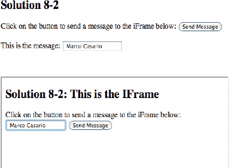
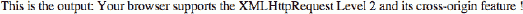

# 八、HTML5 通信 API

在本书的这一点上，已经很清楚 HTML5 提供了许多新的工具来创建应用，这些应用以一种更本地的方式与服务器交互。

在这一章中，我们将探讨避免浏览器沙箱安全限制的技术和解决方案，并使用一种新技术来创建从不同域进行通信的文档(跨文档消息传递)，这涉及到 postMessage API 的使用。你将学习什么是跨源资源共享(CORS)以及如何使用它。很简单，CORS 是一种浏览器技术规范，它定义了 web 服务为来自相同起源策略下的不同域的沙箱脚本提供接口的方式。

接下来，我们探索客户机和服务器之间实时通信的新方法，这些方法允许您找出服务器开始与客户机交互的位置。这是由于服务器发送事件规范，该规范指示 API 打开 HTTP 连接以接收来自服务器的推送通知。

最后，我们将讨论 XMLHttpRequest Level 2 中的最新特性。

*注意:XMLHttpRequest (XHR)是 web 浏览器脚本语言(如 JavaScript)中可用的 API。它用于将 HTTP 或 HTTPS 请求直接发送到 web 服务器，并将服务器响应数据直接加载回脚本。数据可能以 XML 文本或纯文本的形式从服务器接收(来自维基百科`[`en.wikipedia.org/wiki/XMLHttpRequest`](http://en.wikipedia.org/wiki/XMLHttpRequest)` )* 。

### 了解后期消息 API

浏览器中加载的所有 web 应用都受浏览器沙盒安全性的影响，沙盒安全性是一种用于在受限环境中运行应用的安全机制。

这意味着，如果有人试图利用浏览器执行恶意代码，浏览器沙箱会阻止这些代码对主机造成损害。

这就是为什么 web 应用不能创建、修改或读取主机文件系统上的文件或任何信息。此外，它们不能加载和访问不同位置的页面上的脚本，这些页面不使用相同的协议、端口号和主机域。

当然，您可以通过各种技术来克服这种限制。一种是使用 web 服务器代理——不是直接对 web 服务进行 XMLHttpRequest 调用，而是对 web 服务器代理进行调用。然后，代理将请求传递给 web 服务，并将响应数据传递回客户端应用。

但是，使用 HTML5 和新的 postMessage API，您现在可以启用跨源通信，这样您的 web 应用就可以使用一种受控的机制来启用跨站点脚本，而无需使用任何类型的变通方法。

根据`[`dev.w3.org/html5/postmsg/`](http://dev.w3.org/html5/postmsg/)`，后消息语法如下:

`window.postMessage(message, targetOrigin [, ports ])`

消息参数包含要发布的消息，`targetOrigin`表示为了调度事件，`otherWindow`的来源必须是什么，`ports`属性可以选择包含给定窗口的端口数组。

如果目标窗口的原点与给定的原点不匹配，则消息被丢弃。这可以防止信息泄露。

要向目标发送消息，不考虑来源，将目标来源设置为`"*"`。要将消息仅限制到相同来源的目标，而不需要显式声明来源，请将目标来源设置为`"/"`。

这里有一个实际的例子来解释这种机制:想象一个场景，其中,`hostPage.htm` web 页面包含一个 iframe 元素，该元素包含`embeddedPage.htm`页面。`hostPage.htm`页面中的一个脚本调用了`embeddedPage.htm`页面的窗口对象上的`postMessage()`，然后一个消息事件在该对象上执行，并被标记为来自`hostPage.htm`页面的窗口。

这将是在`hostPage.htm`页面中编写的代码:

`var element = document.getElementsByTagName('iframe')[0];
element.contentWindow.postMessage('Hello postMessage API', 'http://www.mydomain.com/');`

当调用`postMessage()`时，一个消息事件被分派到目标窗口。此接口具有公开数据属性的类型消息事件，该属性返回消息的数据。

您可以使用`addEventListener()`为消息事件注册一个事件处理程序:

`window.addEventListener('message', messageHandler);
function messageHandler(e)
{
   alert(e.data);
}`

在`messageHandler`事件处理程序中，我们只显示一个警告窗口，其文本包含在数据属性中。但是，最好检查您收到的邮件是否来自预期的域。为此，可以使用 origin 属性，该属性返回消息的来源:

`if (e.origin == 'http://www.mydomain.com/') {`

然后我们可以检查消息文本:

`if (e.data == 'Hello postMessage API') {`

最后，通过使用 source 属性，您可以决定是否将消息发送回最初发送消息的 HTML 页面，该属性返回源窗口的`WindowProxy`:

`      e.source.postMessage('Hello', e.origin);
    } else {
      alert(e.data);
    }
  }`

### 确保邮件后通信的安全

这种跨站点脚本的新方法非常强大和有用，但是它可能会使服务器暴露于攻击之下。这就是为什么小心谨慎地使用 postMessage API 非常重要的原因:

不要在包含任何机密信息的消息中的`targetOrigin`参数中使用`*`:

`window.postMessage('I'm sending confidential information', '*');`

相反，请指定一个域，否则无法保证消息只传递给目标收件人:

`window.postMessage('I'm sending confidential information', 'http://www.mydomain.com/');`

始终检查 origin 属性，以确保只接受来自预期接收消息的受信任域的消息:

`if (e.origin == 'http://www.mydomain.com/')
{
// whatever
 }`

甚至:

`if (e.origin !== 'http://www.mydomain.com/')
    return;`

这样，您可以避免其他页面出于恶意目的欺骗此事件。

为了更加安全，请检查接收到的数据是否是预期的格式:

`if (e.origin == 'http://www.mydomain.com/')
{
if (e.data == 'Hello postMessage API')
  {

  }
}`

尽量避免使用`innerHTML`或`outerHTML`来注入接收到的数据消息，因为该消息可能包含一个脚本标签并立即执行。相反，使用`textContent`属性来编写消息字符串。

### 解决方案 8-1:检查邮件 API 浏览器支持

postMessage API 允许您找到一种跨浏览器窗口传递基于文本的消息的方法。iframes、窗口和弹出窗口之间可以进行通信。以下浏览器支持邮件后 API:

1.  Internet Explorer 8.0 以上
2.  火狐 3.0 以上版本
3.  Safari 4.0 以上版本
4.  谷歌浏览器 1.0+
5.  Opera 9.5+版本

不管支持与否，检查加载页面的浏览器的 API 兼容性仍然是一个最佳实践，特别是因为如果不支持 postMessage API，应用可能会暴露出严重的问题。

#### 涉及到什么

为了能够执行支持检查，使用 JavaScript `typeof`操作符，它允许您检查其操作数的数据类型。表 8-1 显示了运算符类型返回的可能值列表。

**表 8-1。** JavaScript 运算符的数据类型

<colgroup><col align="left" valign="top" width="20%"> <col align="left" valign="top" width="60%"></colgroup> 
| **数据类型** | **描述** |
| :-- | :-- |
| 数字 | 表示一个数字 |
| 线 | 表示一个字符串 |
| 布尔 | 表示布尔值 |
| 目标 | 表示一个对象 |
| 空 | 表示为空 |
| 不明确的 | 表示未定义 |
| 功能 | 表示一个函数 |

使用`typeof`操作符非常简单；您只需将命令放在您想要检查的变量之前，它将自动返回其数据类型:

`var num = 1;
var str = "Hello HTML5";
alert( typeof num );   // it returns number
alert( typeof str );   // it returns string`

为了检查 postMessage API 的浏览器支持，让我们创建一个条件来确保 postMessage 的`typeof`不会返回一个未定义的值。

#### 如何建造它

要检查浏览器对 postMessage API 的支持，您只需在编写使用新 API 的函数之前，在脚本块中插入以下 JavaScript 条件:

`if (typeof window.postMessage != 'undefined')
{
alert ('The postMessage API is supported');
}`

此代码必须位于页面的脚本块之间，如以下示例所示:

`<!DOCTYPE HTML>
<html>
   <head>
   <title>Solution 8-1: Checking for postMessagi API browser support  </title>
     

  </head>
  <body>` `    <h2>Solution 8-1: Checking for postMessageAPI browser support </h2>

<input type="button" value="Check for postMessage support!" onclick="postMessageSupport()" />

  </body>
</html>`

为了检查对 postMessage API 的支持，您可以简单地点击按钮输入类型，JavaScript 函数将被执行。

### 跨文档信息传递和 CORS

在前面的段落中，我们讨论了加载到浏览器中的所有 web 应用如何受到其沙箱安全性的影响。这意味着浏览器不允许访问主机服务器之外的资源。如果一家公司有一个大型网站，包括几个运行特定活动的子域，如托管应用、数据库或部门数据，这可能是一个问题。

这就是为什么开发人员试图找到克服这一限制的方法。最流行的方法之一是创建服务器端代理，但是开发人员社区要求一种原生的跨域请求方法。

这导致 W3C 在许多浏览器中引入了一种新的方法来解决这个问题。它通常被称为 CORS，或跨源资源共享。

CORS 是一种浏览器技术规范，它定义了 web 服务为来自相同起源策略下的不同域的沙箱脚本提供接口的方式。

这种方法提供了自定义 HTTP 头的使用，它告诉浏览器如何与服务器通信。这样，浏览器和服务器就有足够的信息来判断请求或响应是否会失败。

想象以下场景:一个资源有一个简单的文本资源驻留在`www.domainA.com`，它包含字符串“你好，CORS！”，并且您希望`www.domainB.com`能够访问它。如果服务器决定请求应该被允许，服务器返回一个与`Access-Control-Allow-Origin`头结合的响应给`www.domainA.com`。

基本上，`Access-Control-Allow-Origin`头返回相同的原点。(如果是公共资源，它将返回通配符*。)

此跨源共享标准用于为以下项目启用跨站点 HTTP 请求:

1.  跨站点方法中 XMLHttpRequest API 的调用
2.  Web 字体(用于 CSS 中@font-face 中的跨域字体使用),以便服务器可以部署 TrueType 字体，这些字体只能跨站点加载并由允许这样做的网站使用

在本章中，您将使用 CORS 创建跨文档消息传递(解决方案 8-2)和跨源 XMLHttpRequest(解决方案 8-6)。

### 解决方案 8-2:在窗口和 iframes 之间发送消息

在上一节中，我们讨论了跨文档消息传递和 postMessage APIs，以及它们如何允许我们在不同的资源之间实现跨来源的通信。

在这个解决方案中，我们将展示如何让 iframe 与它的主机网页通信，主机网页将被有意地发布在不同的域上。

#### 涉及到什么

您将用来创建父页面和不同域上发布的 iframe 之间的通信的对象是`postMessage()`方法。

该方法的语法有三个参数:消息、`targetOrigin`的 URL 和端口。

`window.postMessage('Hello postMessage API', 'http://www.mydomain.com/');`

当调用`postMessage()`方法时，在目标窗口中调度一个消息事件。此接口有一个公开数据属性的事件类型消息，该属性返回消息的数据。

您可以使用`addEventListener()`为消息事件注册一个事件处理程序:

`window.addEventListener('message', messageHandler);
function messageHandler(e)
{
   alert('This is the origin of the message received: ' + e.origin + ' /n And this is the message: ' + e.data);
}`

在`messageHandler`事件处理程序中，我们简单地显示了一个警告窗口，其文本包含在数据属性中。但是，最佳做法是使用 origin 属性检查您接收的消息是否来自预期的域，该属性返回消息的来源:

`if (e.origin == 'http://www.mydomain.com/')
{
alert('This is the origin of the message received: ' + e.origin + ' /n And this is the message: ' + e.data);
} else {
  // prevent from receiving this message as the target origin does not match !
}`

让我们通过一个例子来讨论这个解决方案。

#### 如何建造它

首先，你需要提供一个很好的应用上下文描述。首先，下载在以下域发布的`Solution_8_2.html`文件:`[`casario.blogs.com`](http://casario.blogs.com)`，在文件夹(`[`casario.blogs.com/files/Solution_8_2.html`](http://casario.blogs.com/files/Solution_8_2.html)`)中。

这个保存为`chatIframe.html,`的文件充当 iframe 的容器。该文件发布在域`[`www.comtaste.com`](http://www.comtaste.com)`的演示文件夹:`[`www.comtaste.com/demo/chatIframe.html`](http://www.comtaste.com/demo/chatIframe.html)`中。

您将创建的示例允许在不同域上发布的两个文件进行通信。

让我们处理第一个文件——充当 iframe 容器的文件。从主体中声明的几个用户界面元素开始:

`  <body>
    <h2>Solution 8-2</h2>`

插入一条消息，并点击按钮向下面的 iframe 发送消息:

`          

          <input type="text" id="message" value="This message is contained within the main
window" style="width: 350px" /> <button id="sendBtn"> Send Message </button>
          

      
   

<iframe id="chatFrame" src="http://www.comtaste.com/demo/chatIframe.html" style=
"height:640px; width:480px" />
      

  </body>`

您声明了一个文本输入和一个按钮，允许用户向页面上的 iframe 发送消息。

然后从以下 URL 加载 iframe:`[www.comtaste.com/demo/chatIframe.html](http://www.comtaste.com/demo/chatIframe.html)`。

您必须使包含在文本输入消息中的消息在用户点击`sendBtn`按钮时被发送，因此插入一个脚本块并声明前两个事件处理程序:

`

  </head>
  <body>
    <h2>Solution 8-2</h2>
          Click on the button to send a message to the iFrame below:
          <button id="sendBtn"> Send Message </button>

          
This is the message:
          <input type="text" id="message" value="This message is contained within the main
 window" style="width: 350px" />
          

      
   
       <iframe id="chatFrame" src="http://www.comtaste.com/demo/chatIframe.html"
 style="height:480px; width:640px" />
      

  </body>
</html>`

现在我们可以转到 iframe 中加载的文件的代码:`chatIframe.html`。

代码几乎相同。唯一真正的区别是在全局变量`targetURL`中，这次它必须包含 URL，在这个 URL 上，`Solution_8_2.html`页面部件作为一个值被发布:

`var targetURL = 'http://casario.blogs.com';`

代码的其余部分保持不变，因为我们创建的通信是双向的，从父级(`Solution_8_2.html`)到子级(`chatIframe.html`)。

这里是在域`[www.comtaste.com](http://www.comtaste.com)`上发布的`chatIframe.html`文件的完整代码:

`<!DOCTYPE HTML>
<html>
   <head>
   <title>Solution 8-2 </title>
     

  </head>
  <body>
    <h2>Solution 8-2: This is the IFrame</h2>

        Click on the button to send a message to the iFrame below:
          <input type="text" id="message" value="This message is sent from the chatIFrame
file" width="300px" />
          <button id="sendStatus">Send Message </button>`
`  </body>
</html>`

为了测试解决方案，您可以在不同的域上发布这两个文件。您需要记住的唯一事情是通过指定您的域来更改这两个文件的`targetURL`全局变量的值。

图 8-1 显示了两个网页之间交换消息的最终结果。

**图 8-1。**两个网页之间交换的消息

### 解决方案 8-3:使用服务器事件技术编写实时 web 应用

使用 HTTP 协议的客户机和服务器之间的通信实现了请求-响应模型。该模型允许您从客户端发送消息，向服务器发送 HTTP 请求，并等待来自服务器的 HTTP 响应。在这种通信中，不可能知道服务器从哪里开始与客户机交互。

有了 HTML5，通信模型有了额外的新的强大功能来创建实时 web 应用。

#### 涉及到什么

服务器发送事件规范定义了一个 API，用于打开 HTTP 连接以接收来自服务器的推送通知。引入新的 EventSource 接口来实现规范，使服务器能够通过 HTTP 或使用专用的服务器推送协议将数据推送到网页。

使用`EventSource(url)`构造函数非常简单。它只接受一个参数，即 URL 参数，该参数指定要连接的 URL:

`var sourceURL = new EventSource('yourServerSideScript');`

现在可以在`onmessage`事件上注册一个事件监听器了:

`sourceURL.onmessage = function (event) {
  // whatever you want
};`

服务器端的消息使用文本/事件流 MIME 类型发送:

`data: This is the first message.
data: This is the second message
data: it has two lines.`

使用这种新方法进行客户端/服务器通信，而不是使用 iframe 或`XMLHttpRequest`对象(AJAX 基于此)的方法，有助于节省便携式设备的电池使用。您可以在`at [www.w3.org/TR/eventsource/#eventsource-push](http://www.w3.org/TR/eventsource/#eventsource-push)`部分找到更多信息。

**无连接推送和其他功能**

在受控环境中运行的用户代理，例如绑定到特定运营商的移动手机上的浏览器，可以将连接管理卸载到网络上的代理。在这种情况下，出于一致性的目的，用户代理被认为包括手机软件和网络代理。

建立连接后，移动设备上的浏览器可能会检测到它位于支持网络上，并请求网络上的代理服务器接管连接的管理。这种情况的时间表可能如下:

*   浏览器连接到远程 HTTP 服务器，并请求作者在 EventSource 构造函数中指定的资源。
*   服务器偶尔会发送消息。
*   在两个消息之间，浏览器检测到它处于空闲状态，除了与保持 TCP 连接活动有关的网络活动之外，它决定切换到睡眠模式以省电。
*   浏览器与服务器断开连接。
*   浏览器联系网络上的服务，并请求该服务，即“推送代理”，保持连接。
*   “推送代理”服务联系远程 HTTP 服务器，并请求作者在 EventSource 构造函数中指定的资源(可能包括 Last-Event-ID HTTP 头，等等)。
*   浏览器允许移动设备进入睡眠状态。
*   服务器发送另一条消息。
*   “推送代理”服务使用 OMA push 等技术将事件传送到移动设备，移动设备唤醒的时间只够处理事件，然后返回睡眠状态。

这可以减少总的数据使用量，因此可以节省大量电能。

#### 如何建造它

为了能够看到运行中的`EventSource()`构造函数，您必须使用任何服务器端语言创建一个服务器端文件:您可以使用 Java、Python、PHP 或任何其他 web 编程语言。在这个解决方案中，我们调用了一个 PHP 文件来读取包含一些信息的文本文件。一旦服务器端脚本读取了这些信息，它们就会通过`EventSource()`发送到客户端，并被插入到 web 页面的一些列表项中。

通过在正文中添加元素开始创建 HTML 页面:

`<body>
    <h2>Messages sent from the Server</h2>
          <ul id="responseMessages">

          </ul>
  </body>`

您只有一个标题和一个无序列表，它将由我们的事件源填充。现在，您可以插入脚本块，该脚本块将在窗口的 load 事件上有一个事件侦听器:

`window.addEventListener("load", init, false);`

在`init()`事件处理程序中，我们首先使用`getElementById()`方法创建一个对列表元素的引用，并创建一个将文本插入 HTML 列表的函数:

`function init() {

var myList = document.getElementById ('msgList');

function msgHandler (message)
{
var elementLI = document.createElement ('li');

elementLI.innerHTML = message;

if (myList.children.length)
{
myList.insertBefore (elementLI, myList.firstChild);
}
else
{
myList.appendChild (elementLI);
}

for (var i = 10, j = myList.children.length; i < j; i++)
{
myList.removeChild (myList.children [i]);
}
}`

您可以开始创建 EventSource 对象。

如果浏览器支持 EventSource，则调用构造函数:

`if (typeof (window.EventSource) !== 'undefined')
{
var source = new EventSource ('sse.php');`

在这个阶段，浏览器解析在指向 PHP 文件`sse.php`的`url`属性中指定的 URL。

您需要做的就是管理 EventSource 对象的`onmessage`事件，该事件在服务器每次向客户端返回消息时被调用:

`source.onmessage = function (event)
{
                        var msgSplit = event.data.split ('\n');
                        if (msgSplit.length == 2) {
                            msgHandler ('<a target="_blank" href="mailto:' + msgSplit [1] +
 '/">' + msgSplit [0] + '</a>');
                            return ;
                        }
                        else if (msgSplit.length == 3) {
                            msgHandler ('<a target="_blank" href="mailto:' + msgSplit [1] +
 '" title="' + msgSplit [2] + '"/">' + msgSplit [0] + '</a>');
                            return ;
                        }

                        msgHandler (event.data);
                    };
                }
                else
                {
                    msgHandler ('Your browser does not support the EventSource Interface');
                }`

以下是 HTML 页面的完整代码:

`<!DOCTYPE HTML>
<html>
   <head>
     

  </head>
  <body>
    <h2>Messages sent from the Server</h2>
          <ul id="msgList">

          </ul>
  </body>
</html>`

#### 专家提示

Opera 浏览器使用事件源接口作为 HTML 元素:

`<event-source id="es" src="youServerSideScript" />`

这个元素被添加到网页的 header 标签之间。一旦创建了 HTML 元素，就可以使用`getElementBy`来访问它:

`document.getElementById("es")`

并用`addEventListener`方法在其中注册事件监听器。

### 解决方案 8-4:使用消息通道在不同的浏览上下文中运行代码

随着新的 HTML5 跨文档消息传递规范的引入，现在可以使运行在不同浏览上下文中的独立代码段直接通信。这要归功于渠道信息。

这种技术意味着通道被实现为两端各有一个端口的双向管道。异步消息在一个端口发送，在另一个端口传递，反之亦然。消息作为 DOM 事件传递。

#### 涉及到什么

创建渠道消息很简单。首先，您需要使用`MessageChannel()`构造函数，一旦实例化，它将返回一个新的`MessageChannel`对象和两个新的`MessagePort`对象。事实上，每个通道都有两个消息端口:

`channel = new MessageChannel()
channel.port1
channel.port2`

端口 1 和端口 2 返回第一个和第二个`MessagePort`对象。通过一个端口发送的数据被另一个端口接收，反之亦然。

*提示:要了解更多关于`MessagePort,`的信息，请访问 t`[www.whatwg.org/specs/web-apps/current-work/multipage/comms.html#messageport](http://www.whatwg.org/specs/web-apps/current-work/multipage/comms.html#messageport)`??。*

*每个`MessagePort`物体都可以与另一个物体纠缠在一起(对称关系)。每个`MessagePort`对象还有一个名为端口消息队列的任务源，它最初是空的。可以启用或禁用端口消息队列，但它最初是禁用的。一旦启用，端口就不能再被禁用(尽管队列中的消息可以被移动到另一个队列或一起删除，这具有相同的效果)*。

*当用户代理创建一个由脚本的全局对象所有者拥有的新的`MessagePort`对象时，它必须实例化一个新的`MessagePort`对象，并让其所有者成为所有者*。

当调用`MessageChannel()`构造函数时，它必须运行以下算法:

*   创建一个新的属于 Window 对象的`MessagePort`对象(在 JavaScript 中，它对应于 global 对象)，让 port1 成为那个对象。
*   创建一个新的属于 Window 对象的`MessagePort`对象(在 JavaScript 中，它对应于 global 对象)，让 port2 成为那个对象。
*   缠绕端口 1 和端口 2 对象。
*   实例化一个新的`MessageChannel`对象，让通道成为该对象。
*   设通道对象的端口 1 和端口 2 属性为端口 1 和端口 2。
*   返回频道。

#### 如何建造它

在这个简单的示例中，您将看到如何创建一个消息通道来与 postMessage API 一起使用。

1.  实例化`MessageChannel()`构造函数:`var myChannel = new MessageChannel();`
2.  使用`postMessage()`方法向第二个端口 port2 发送消息，而 port1 保持为本地端口:`window.postMessage('This is my blog !', '[`casario.blogs.com`](http://casario.blogs.com)', [myChannel.port2]);`
3.  为了接收消息，人们监听消息事件:

`channel.port1.onmessage = handleMessage;
function handleMessage(event) {
  if (event.origin !== "http://casario.blogs.com")
    return;
// event.data returns "This is my blog !"
}`

本质上，在消息通道中，您必须处理两个 onmessage 事件—每个端口一个:

1.  `MessageChannel.port1.postMessage`将调用 MessageChannel.port2.onmessage
2.  `MessageChannel.port2.postMessage`将调用 MessageChannel.port1.onmessage

### 解决方案 8-5:使用 XMLHttpRequest Level 2 上传文件

这个对象无疑是开启 Web 2.0 革命的对象之一。实际上，它是使用 AJAX 作为客户机/服务器通信技术的应用所基于的对象。

微软在 1999 年引入了 XMLHttpRequest，为微软 Outlook Google adopted 程序提供了一个高度交互的用户界面，但是作为一个网络应用。

只是在 object 创建服务(如 Gmail 和谷歌地图)之后，它才变得非常流行，我们开始见证一场真正的网络应用革命。

为什么这个物体如此特别？因为它带来了独立于浏览器在 HTTP 和 HTTPS 协议上执行对 web 服务器的资源请求的可能性。在这个请求中，可以用 GET 或 POST 变量的形式发送信息，就像用表单发送数据一样。

客户端和服务器之间的请求是异步的，这意味着不需要等待它完成来执行其他操作，这些操作以几种方式混合了网页的典型数据流。

事实上，该流程通常一次包含两个步骤——用户请求(链接、表单或刷新)和服务器响应，然后会产生新的用户请求。

2006 年，W3C 终于认识到 XMLHttpRequest 的重要性，并成立了一个工作组来标准化这个浏览器对象提供的 API。

XMLHttpRequest Level 2 是定义一个改进的`XMLHttpRequest`对象规范的新成果。对象规范支持的新特性之一是上传文件的可能性，因为 XMLHttpRequest Level 2 对象的 send 函数可以将文件或 BLOB 对象作为参数。

blob(代表二进制大对象或基本大对象)是在数据库管理系统中作为单个实体存储的二进制数据的集合。斑点通常是图像、音频或其他多媒体对象。

它还创造了向与创建 XMLHttpRequest 的浏览器文档不在同一个域的 URL 发送或检索数据的可能性(CORS 方法，在本章开始时已经讨论过)。

#### 涉及到什么

使用 XMLHttpRequest 级别 2 对象类似于同一对象的早期版本。

事实上，您所要做的就是调用`XMLHttpRequest()`构造函数:

`var req = new XMLHttpRequest();`

此时，可以用对象的`-Open()`方法打开请求，或者用`send()`方法发送请求:

`req.open('GET', 'http://www.comtaste.com/', true);`

`open()`方法的第三个参数指定异步处理请求(当设置为 true 时)。

为了检查事务是否成功，您创建了一个事件处理函数对象，并将其分配给请求的`onreadystatechange`属性。如果一切顺利，请求不包含错误，HTTP 状态返回 200。如果出现错误，将显示一条错误消息:

`req.onreadystatechange = function (e) {
  if (req.readyState == 4) {
     if(req.status == 200)
      alert(req.responseText);
     else
      alert ("Error loading page.");
  }
};
req.send(null);`

以下是`XMLHttpRequest`对象的主要属性:

*   readyState:验证对象的状态，值可以从 0 到 4:
    *   0 =未初始化:对象存在，但尚未实例化。
    *   1 =打开:对象是打开的。
    *   2 =已发送:请求已发送。
    *   3 =接收:数据正在到达目的地。
    *   4 =已加载:操作完成。
*   responseText:以文本格式返回 HTTP 请求的结果。
*   responseXML:以 XML 格式返回 HTTP 请求的结果。
*   Status:返回事务的状态；包含几个类似于 web 服务器的成功和错误消息编号，如 404(找不到文件)、500(内部服务器错误)等。

以下是主要方法:

*   abort:预先终止 HTTP 请求。
*   getResponseHeaders:返回请求的头。
*   打开:打开请求。
*   发送:发送请求。
*   setRequestHeader:设置请求的头。

#### 如何建造它

XMLHttpRequest Level 2 规范为`send()`方法提供了接受文件对象参数的能力。这允许您将二进制数据异步传输到服务器。

使用 HTML5 表单数据，您可以选择要发送到服务器的文件。`formData`对象创建了一组键/值对，可以与`XMLHttpRequest`对象的`send()`方法一起使用。

尽管`FormData`旨在发送表单数据，但它可以独立于表单使用，以传输数据:

`var formElement = document.getElementById("fileInput");
var formData = new FormData(formElement);
var xhr = new XMLHttpRequest();
xhr.send(formData);`

在上面的例子中，我们创建了一个`formData`对象，它包含插入到表单元素中的值，id 等于`fileInput`(在我们的例子中，是一个输入文件)。这个`formData`对象然后被传递给`XMLHttpRequest`对象的`send()`方法。

如果表单的编码类型设置为"`multipart/form-data`"，则传输数据的格式与表单的`submit()`方法发送数据的格式相同:

`  <form enctype="multipart/form-data">`

对于这个解决方案，您将创建一个简单的表单，它使用`post`方法发送只有一个输入文件元素的数据:

`   <form enctype="multipart/form-data" method="post">
  <label>Select a file to upload:</label>
  <input type="file" name="myFile" id="myFile" required>
  </form>`

用户选择并添加到表单中的文件将被传递到一个`formData`对象上，因此插入一个脚本块并创建一个 JavaScript 函数，该函数将在单击一个按钮时执行:

``

通过添加`<output>`元素和一个调用`sendForm()` JavaScript 函数的链接对文件进行最后的润色，我们已经在表单一章中讨论过了。以下是网页的完整代码:

`<!DOCTYPE HTML>
<html>
   <head>
   <title>Solution 8-5: Using XMLHttpRequest Level 2  </title>
     

  </head>
  <body>

   <form enctype="multipart/form-data" method="post">

  <label>Select a file to upload:</label>
  <input type="file" name="myFile" id="myFile" required>
</form>

<output name="result" id="result" />

<a href="javascript:sendForm()">Upload File</a>

 </body>
</html>`

#### 专家提示

使用`formData`对象，可以在运行时添加数据，也可以发送普通的、非文件的、多部分/表单数据值。事实上，通过使用`append()`方法，您可以通过调用这个方法将字段注入到`formData`对象中:

`var myData = new FormData();
myData.append("firstName", "Marco");
myData.append("lastName", "Casario");
myData.append("file", myFile.files[0]);
var xhr = new XMLHttpRequest();
xhr.open("POST", "submitForm.php");
xhr.send(myData);`

我们在这段代码中创建了一个`formData`对象，包含三个值:名为“firstName”和“lastName”的字段，以及一个从文件输入类型(myFile.files[0])获取的文件数据。

### 解决方案 8-6:检查 XMLHttpRequest 级跨源浏览器支持

XMLHttpRequest Level 2 引入的最重要的新发展之一是可以克服该对象以前版本的限制:只能与相同的源服务器通信。

另一方面，新的 XMLHttpRequest Level 2 对象支持 CORS，这一点我们已经在本章中讨论过，它允许您的 web 页面与不同来源的服务进行通信。因此，这个特性在许多应用环境中变得至关重要，但是您必须确保浏览器支持它。

一些浏览器已经支持 XMLHttpRequest Level 2，但它还远未被普遍采用。表 8-2 详细说明了浏览器对 XMLHttpRequest 级的支持。

**表 8-2。** XMLHttpRequest 二级浏览器支持

<colgroup><col align="left" valign="top" width="25%"> <col align="left" valign="top" width="60%"></colgroup> 
| **浏览器** | **版本** |
| :-- | :-- |
| 微软公司出品的 web 浏览器 | 尚不支持(它支持`XDomainRequest`对象。) |
| 火狐浏览器 | 03.05.00 |
| 谷歌 Chrome | 02.00.00 |
| 歌剧 | 尚不支持 |
| 旅行队 | 04.00.00 |

从这个表中可以看出，在使用 XMLHttpRequest Level 2 之前，必须确保加载网页的浏览器支持这个对象。这将允许您使应用更加健壮，并避免奇怪的浏览器行为。

#### 涉及到什么

为了能够检查浏览器是否支持跨源通信，您将使用`withCredentials`属性。此属性控制凭据标志，该标志包含一个布尔值。当跨来源请求中包含用户凭据时，此值返回 true。当它们被排除在跨来源请求之外并且 cookies 在其响应中被忽略时，它返回 false 。该属性的默认值为 false。

与解决方案 8-1 一样，在这种情况下，您还将创建一个条件来检查 XMLHttpRequest 的`withCredentials`属性是否返回未定义的值:

`if (typeof xhr.withCredentials != 'undefined') {}`

如果这个条件返回 false，并且浏览器因此不支持`withCredentials`属性，我们的应用将相应地运行。

#### 如何建造它

为了创建这个解决方案，您将添加一个事件侦听器，它将在 web 页面的 load 事件发生时检查浏览器是否支持跨原点功能。控件的结果将在输出元素上写入文本。

因此，插入`addEventListener`方法，该方法将在您接下来编写的`init`函数中注册加载事件:

`window.addEventListener("load", init, false);`

`init()`事件处理程序首先实例化 XMLHttpRequest 对象，并创建一个对 id 为 result 的输出元素的引用:

`var output = document.getElementById("result");
var xhr = new XMLHttpRequest();`

此时，它将检查 XMLHttpRequest 对象的`withCredentials`属性，查看该属性返回的值是否未定义:

`if (typeof xhr.withCredentials != 'undefined')
{
}`

现在，您可以在输出元素中写入条件的结果。以下是该解决方案的完整代码:

`<!DOCTYPE HTML>
<html>
   <head>
   <title>Solution 8-6: Checking for the XMLHttpRequest Level 2 cross-origin browser support
</title>
     

  </head>
  <body>
    <h2>Solution 8-6: Checking for the XMLHttpRequest Level 2 cross-origin browser support
</h2>

    <output name="result" id="result"> This is the output: </output>

  </body>
</html>`

你可以在图 8-2 中看到结果。网页已经载入谷歌 Chrome 9.0。

**图 8-2。** Chrome 9.0 支持跨原点 XMLHttpRequest 属性。

#### 专家提示

为了确保所有浏览器都能够使用跨原点特性，您可以在解决方案的代码中添加一个 else if 条件，以便在另一个浏览器不支持时使用`XdomainRequest`对象(受 Internet Explorer 支持)。

根据 MSDN 文档(`[`msdn.microsoft.com/en-us/library/cc288060(v=vs.85).aspx`](http://msdn.microsoft.com/en-us/library/cc288060(v=vs.85).aspx)):`),`XDomainRequest`对象是一个安全、可靠、轻量级的数据服务，它允许任何页面上的脚本匿名连接到任何服务器并交换数据。当跨站点安全性不成问题时，开发人员可以使用`XDomainRequest`对象。

您可以按如下方式更改前面的语句:

`if ("withCredentials" in xhr)
{
output.value += " Your browser supports the XMLHttpRequest Level 2 and its cross-origin
 feature !";
xhr.open(method, url, true);
} else if (typeof XDomainRequest != 'undefined')
{
output.value += " Your browser supports the XDomainRequest and its cross-origin feature !";
 xhr = new XdomainRequest();
xhr.open(method, url);
  } else {`
`    output.value += " Cross-origin XMLHttpRequest not supported by your browser.";
xhr = null;
 }
         }`

### 总结

新的 HTML5 通信 API 是为希望创建协作和数据密集型应用的开发人员提供可靠方法的重要一步。

在本章中，您学习了一些技术和解决方案，通过创建从不同域进行通信的文档(跨文档消息传递)来避免浏览器沙箱安全限制。您已经使用 postMessage API 和跨来源资源共享(CORS)方法为来自同一来源策略下的不同域的沙盒脚本提供了接口。

您还了解了如何在客户机和服务器之间创建实时通信，以使用服务器发送的事件规范找到服务器开始与客户机交互的位置，该规范指示 API 打开 HTTP 连接以接收来自服务器的推送通知。您还阅读了 XMLHttpRequest Level 2 的概述。