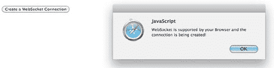
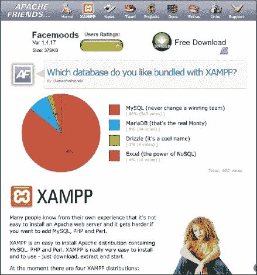
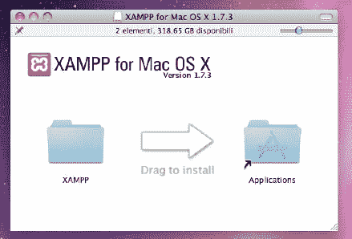
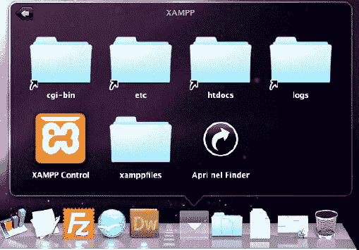
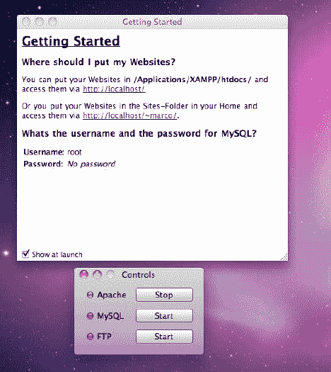
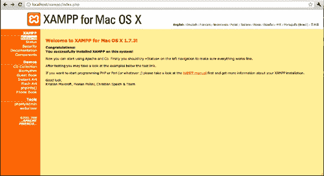
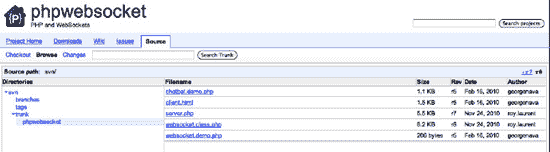
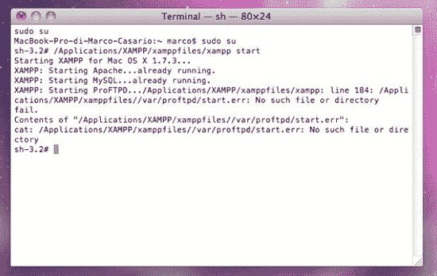
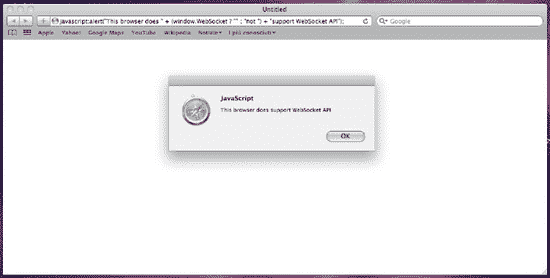

# 九、HTML5 WebSocket

WebSocket 是一种通过单一传输控制协议(TCP)套接字提供双向全双工通信通道的技术。它被设计为在 web 浏览器和 web 服务器中实现，但是它可以被任何客户端或服务器应用使用。WebSocket 应用编程接口(API)正由 W3C ( `[`dev.w3.org/html5/websockets/`](http://dev.w3.org/html5/websockets/)`)标准化，WebSocket 协议正由 IETF ( `[www.ietf.org/](http://www.ietf.org/)`)标准化。由于除 80 之外的端口的普通 TCP 连接经常被家庭环境之外的管理员阻塞，所以它可以被用作克服这些限制并提供类似功能(具有一些额外的协议开销)的方法，同时在单个 TCP 端口上多路复用几个 WebSocket 服务。

使用 WebSocket，您将能够通过浏览器在服务器和客户端之间创建双向、永久和实时的连接。在本章中，您将学习如何建立与服务器的 WebSocket 连接，以及如何将数据立即推送到客户端。通过这样做，与使用基于 XMLHttpRequest 的 AJAX 请求的方法相比，您将最终解决需要将数据推送到客户端的实时 web 应用的低延迟问题。

### 解决方案 9-1:检查 WebSocket 浏览器支持

WebSocket 是可能真正导致 web 应用开发革命的新奇事物之一。模拟实时客户机-服务器通信的旧方法及其相关的 HTTP 协议开销将慢慢消失。

像往常一样，因为这是一项新功能，所以在创建复杂的应用之前，你必须确保你的浏览器支持这个 API。目前，已经测试支持 WebSocket 的浏览器如下:

*   铬 4.0
*   火狐 4.0 测试版
*   Opera 10.7 以上
*   Safari 5.0.2
*   iOS 4.2(移动 Safari)
*   安卓 2.3(代号姜饼)

因为你不能忽视使用其他浏览器或这些浏览器的旧版本的用户，所以你需要为 WebSocket 应用配备一个嗅探器来检查支持。

请参见下面的解决方案。

#### 涉及到什么

就像解决方案 9-1 一样，使用`typeof` JavaScript 操作符来检查支持。该运算符检查其操作数的数据类型。

表 9-1 显示了由`typeof`操作符返回的可能值列表。

**表 9-1。**type of 运算符返回的可能数据类型

<colgroup><col align="left" valign="top" width="40%"> <col align="left" valign="top" width="50%"></colgroup> 
| **数据类型** | **描述** |
| :-- | :-- |
| 数字 | 表示一个数字 |
| 线 | 表示一个字符串 |
| 布尔 | 表示布尔值(通常表示为真和假，或 1 和 0) |
| 目标 | 表示一个对象 |
| 空 | 表示空 |
| 不明确的 | 表示未定义 |
| 功能 | 表示一个函数 |

使用`typeof`操作符非常简单:您所要做的就是将命令放在您想要检查的变量之前，它会自动返回数据类型:

`var num = 1;
var str = "Hello HTML5";
alert( typeof num );   // it returns number
alert( typeof str );   // it returns string`

要检查浏览器支持，创建一个条件以确保 WebSocket 的`typeof`不会返回未定义的值。

#### 如何建造它

要检查浏览器是否支持`postMessage`，您只需在编写使用新 API 的函数之前，将以下 JavaScript 条件插入脚本块中:

`if (window.WebSocket) {
  alert("WebSockets is supported in your browser.");
}`

您也可以使用 JavaScript 运算符来获得相同的结果:

`if ("WebSocket" in window) {
  alert("WebSockets is supported in your browser.");
}`

该代码必须被页面脚本块包围，如下例所示:

`<!DOCTYPE HTML>
<html>
   <head>
   <title>Solution 9-1: Checking for WebSocket  browser support  </title>
     

  </head>
  <body>
    <h2>Solution 9-1: Checking for WebSocket browser support </h2>

  </body>
</html>`

#### 专家提示

这里有两个 web 服务可以用来检查你的浏览器是否支持 WebSocket:

`http://jsconsole.com/?WebSocket
http://websockets.org/`

这些链接将报告 WebSocket 支持，如图图 9-1 所示。

**图 9-1。** WebSocket 支持报告

### 解决方案 9-2:建立 WebSocket 连接

WebSocket 允许您在客户端和服务器之间建立一个开放的连接。

要创建这种类型的客户机-服务器通信，您所要做的就是使用 WebSocket 对象及其 API 的方法，这样，一旦 web 服务器上的数据发生变化，它就可以向客户机发送请求，而不必进行轮询。

#### 涉及到什么

WebSocket 对象用于建立套接字服务器连接。对象的构造函数有两个参数，url 和协议:

*   *url* 指定要访问的 url。它接受协议为 ws:或 wss:的 URL。ws:是 WebSocket 连接的协议。wss:用于安全的 WebSocket 连接。
*   *协议*是可选的，它包含一个字符串或一个字符串数组。

以下是如何建立 WebSocket 连接的示例:

`var myWS = new WebSocket("ws://www.comtaste.com/socket");`

一旦创建了 WebSocket 构造函数，就可以访问`readyState`属性来获得连接的状态。`readyState`属性的值如表 9-2 所示。

**表 9-2。**的`readyState`值

<colgroup><col align="left" valign="top" width="20%"> <col align="left" valign="top" width="15%"> <col align="left" valign="top" width="55%"></colgroup> 
| **值** | **数值** | **描述** |
| :-- | :-- | :-- |
| 连接 | Zero | 连接尚未建立。 |
| 打开 | one | WebSocket 连接已建立，通信是可能的。 |
| 结束的 | Two | 连接正在通过结束握手。 |
| 关闭的 | three | 连接已关闭或无法打开。 |

WebSocket 只有两个方法，`send()`和`close()`:

*   *`send(data)`* 使用连接传输数据。
*   *`close()`* 关闭客户端和服务器之间的连接。

如果连接期间没有发生错误，它将执行 open 事件，此时您的应用准备好使用以下语法向服务器发送数据:

`myWS.send("Hello WebSocket connection !");`

服务器能够在任何时候使用相同的过程发回消息。

若要截获服务器收到的消息，请使用 message 事件来传输带有包含消息的数据属性的事件对象。

让我们看看如何创建一个完整的示例。

#### 如何建造它

这个解决方案的 web 页面只有一个按钮，它将启动一个 JavaScript 方法来检查浏览器是否支持 WebSocket API。下面是按钮元素的声明:

`<body>
 <h2>Solution 9-1: Checking for WebSocket browser support </h2>

 
<button id="socketBtn"> Create a WebSocket Connection </button>
`

打开一个脚本块，并将事件处理程序附加到页面的 load 事件:

`
</head>
<body>
 <h2>Solution 9-1: Checking for WebSocket browser support </h2>

 
 <button id="socketBtn"> Create a WebSocket Connection </button>

</body>
</html>`

通过点击 socketBtn 按钮，应用将尝试创建一个与本地服务器的套接字连接，但只有在它检查了浏览器支持 WebSocket API 之后，如图 9-2 所示。

**图 9-2。**浏览器 WebSocket API 支持消息

#### 专家提示

为了测试您刚刚创建的示例，您的服务器上必须有一个套接字服务器端组件。有许多可以在网上找到，我们提供了一步一步的说明，如何安装一个解决方案 9-4。

但是，与此同时，您可以使用`pywebsocket`，您可以从以下地址下载:

*   `[`code.google.com/p/pywebsocket/`](http://code.google.com/p/pywebsocket/)`
*   `[`chemicaloliver.net/internet/getting-started-web-sockets-using-pywebsocket-mod_python-and-apache-in-ubuntu/`](http://chemicaloliver.net/internet/getting-started-web-sockets-using-pywebsocket-mod_python-and-apache-in-ubuntu/)`
*   `[www.travisglines.com/web-coding/how-to-set-up-apache-to-serve-html5-websocket-applications-with-pywebsocket](http://www.travisglines.com/web-coding/how-to-set-up-apache-to-serve-html5-websocket-applications-with-pywebsocket)`

这是一个创建于`Python`的开源套接字服务器，旨在为 Apache HTTP 服务器 mod_pywebsocket 提供 WebSocket 扩展。

首先从`pywebSocket`项目页面下载`mod_pywebsocket-x.x.x.tar.gz`文件。

按照以下说明安装和使用套接字服务器:

解压`mod_pywebsocket-x.x.x.tar.gz`文件，指向`/src`目录(`pywebsocket` - `x.x.x/src/`)

从终端外壳运行:

`sudo python setup.py build`

然后键入:

`sudo python setup.py install`

然后，通过以下方式阅读文档:

`sudo mod_pyWebSocket`

这将把它安装到您的 Python 环境中。

`pyWebSocket`带有示例代码，您可以在/src/example 文件夹中找到。您可以通过运行此示例来测试服务器。

为了启动服务器，转到`pyWebSocket-x.x.x/src/mod_pyWebSocket`文件夹并运行以下命令:

`sudo python standalone.py -p 8000 -w /example/`

这将启动服务器监听端口 8000，并使用您的`echo_wsh.py`所在的-w 选项指定的处理程序目录。

### 解决方案 9-3:处理 WebSocket 事件

一旦创建了 WebSocket 构造函数，应用将尝试在服务器和客户端之间建立套接字连接。但是，如果希望操作顺利进行，则有必要检查连接是否已成功建立。此外，一旦建立了套接字连接，您将需要在远程服务器发送或接收消息时收到通知。

这就是为什么有必要创建事件处理程序来满足这些需求。

在这个解决方案中，您将看到 WebSocket 提供了哪些事件，以及如何在您的应用中使用它们。

#### 涉及到什么

在前面的解决方案中，您看到了如何通过创建 WebSocket 构造函数来建立套接字服务器连接:

`  var ws = new WebSocket("ws://localhost/echo");`

但是在这样做的时候，您不知道客户端和服务器之间的连接是否已经成功打开，也不能对可能发生的任何错误做出反应。

这就是为什么一旦创建了构造函数，就必须为套接字连接创建事件处理程序:帮助您查看是否发生了任何错误，连接是否已正确建立，或者接收服务器发送的消息。

您可以使用的事件列表及其描述在表 9-3 中提供:

**表 9-3。** WebSocket 事件

<colgroup><col align="left" valign="top" width="40%"> <col align="left" valign="top" width="50%"></colgroup> 
| **事件** | **描述** |
| :-- | :-- |
| 打开 | 建立套接字连接时会发生此事件。 |
| 消息 | 当客户端从服务器接收数据时，会发生此事件。 |
| 错误 | 当通信中出现任何错误时，就会发生此事件。 |
| 关闭 | 连接关闭时会发生此事件。 |

让我们看看使用套接字连接的 web 应用是如何管理这些事件的。

#### 如何建造它

从上一个解决方案的代码开始，其中包括一个按钮，该按钮启动一个 JavaScript 方法来检查浏览器是否支持 WebSocket API。如果浏览器支持此功能，将使用`send()`方法创建一个 WebSocket 连接:

`function establishSocket()
{
   if ("WebSocket" in window)
{
var ws = new WebSocket("ws://localhost/echo");`

在这里，插入新代码来管理当客户端和服务器之间的连接已正确打开并且没有发生错误时执行的第一个事件:

`ws.onopen = function()
     {
        ws.send("Message to send");
        alert("Socket connection established. The Message is being  sent...");
     };`

现在您已经确定连接已经成功打开，您可以使用 WebSocket 的`send()`方法向服务器发送消息。

然后添加三个事件处理程序:一个用于管理从服务器接收消息的消息事件，第二个用于关闭事件，第三个用于处理错误事件以提供错误机制。

`ws.onmessage = function (evt)
     {
        var received_msg = evt.data;
        alert("Message is received...");
     };
     ws.onclose = function()
     {

        alert("Socket connection is being closed...");
     };`

如果在连接过程中出现任何类型的错误，就会执行 error 事件，该事件应该单独处理。在这个事件处理程序中，您可以查看`readyState`属性的值是(1) OPEN 还是(2) CLOSING，如果是，就在 WebSocket 对象上执行一个名为 error 的简单事件。

`         ws.onerror = function(evt)
         {
                alert ('The following error occurred: ' + error);
         }`

以下是网页的完整代码:

`<!DOCTYPE HTML>
<html>
   <head>
     <title>Solution 9-3: Handling WebSocket events</title>
    
</head>
<body>
 <h2>Solution 9-3: Handling WebSocket events   </h2>

  <button id="socketBtn"> Create a WebSocket Connection </button>

</body>
</html>`

### 解决方案 9-4:使用带有 WebSocket API 的 WebSocket 服务器

为了能够创建套接字连接，您需要在服务器上安装一些元素。您需要的是一个套接字服务器，它可以与客户机建立连接，并等待来自客户机的消息和服务器发送的消息。

在这个解决方案中，我们将通过必要的步骤来设置一个本地服务器和一个 PHP 套接字服务器，以测试一个使用 WebSocket API 的真实套接字连接。

#### 涉及到什么

要创建一个完整的示例，您必须在机器上安装一个 PHP 套接字服务器。因此，您需要将它安装在您的远程服务器上，或者设置一个本地服务器来安装所有必需的模块。

您可以使用一些网络工具来帮助完成这项任务。XAMPP 就是这样一个工具。

XAMPP(见图 9-3 )是一个免费的、易于安装的 Apache 发行版，包含 MySQL、PHP 和 Perl。XAMPP 非常容易使用——只需下载、解压并启动。

**图 9-3** 。XAMPP 主页

目前，有四种 XAMPP 发行版:

*   Linux 的 XAMPP
*   Windows 的 XAMPP
*   XAMPP 换麦克·OS X
*   索拉里斯的 XAMPP

根据您选择的服务器版本，安装阶段会略有不同。无论如何，在你的机器上安装 XAMPP 还是很简单的。

对于 Mac，安装是通过打开名为`XAMPP Mac OS X 1.7.3.dmg`的 DMG 镜像来完成的。你所需要做的就是将 XAMPP 文件夹拖放到你的应用文件夹来安装软件及其所有模块，如图 9-4 所示。

**图 9-4** 。只需将 XAMPP·DMG 的文件拖到 Mac 上的应用文件夹中就可以安装服务器了。

你需要大约 320 MB 的磁盘空间来安装它。安装完成后，打开应用文件夹，然后打开 XAMPP 控件，启动 XAMPP，如图 9-5 所示。

**图 9-5。**XAMPP 控制

你必须启动你需要的服务。在这种情况下，你只需要启动 Apache(也可以启动 MySQL 和 ProFTPD)，如图图 9-6 所示。

**图 9-6。**启动 Apache

要检查您的本地 web 服务器是否已启动并运行，请打开浏览器并键入以下 URL: `[`localhost`](http://localhost).`开始页面将显示欢迎消息:

`Welcome to XAMPP for Mac OS X 1.7.3!
Congratulations:
You successfully installed XAMPP on this system!`

Mac OS X 的 XAMPP 打开屏幕如图 9-7 所示。

**图 9-7。**XAMPP for Mac OS X 起始页

XAMPP 的起始页提供了检查已安装软件状态的链接和一些小的编程示例。

至于 socket 服务器，你可以安装`phpwebsocket`，这是一个开源项目，你可以从下面的地址下载:`[`code.google.com/p/phpwebwocket/`](http://code.google.com/p/phpwebwocket/)`。当你去项目的源`[`code.google.com/p/phpwebsocket/source/browse/#svn/trunk/%20phpWebSocket`](http://code.google.com/p/phpwebsocket/source/browse/#svn/trunk/%20phpWebSocket)`时，你需要这个项目的三个文件，你可以将它们复制到 web 服务器，如图图 9-8 所示。

*   `server.php`
*   `websocket.class.php`
*   `websocket.demo.php`

**图 9-8。**将 phpwebsocket 文件复制到 web 服务器

除了`phpwebsocket`，您还可以决定安装:

*   jWebSocket (Java)
*   web-socket-ruby (ruby)
*   套接字 IO 节点(node.js)
*   NodeJS(多个 WebSocket 服务器使用的服务器端 JavaScript 框架)
*   Kaazing WebSocket 网关(基于 Java 的 WebSocket 网关)
*   mod _ pyweb socket(Apache HTTP 服务器的基于 Python 的扩展)
*   Netty(包含 WebSocket 支持的 Java 网络框架)
*   wsproxy (WebSockets 到通用 TCP 套接字代理)
*   `websocket` (Python)

如有必要，您可以通过打开`server.php`文件并更改`$master`变量中的值来更改本地主机的地址和要使用的端口:

`$master = WebSocket("localhost",12345);`

通过遵循这些简单的步骤，您将能够使用 WebSocket API 创建一个到 socket 服务器的真正连接。

#### 如何建造它

一旦服务器已经用 PHP 建立了套接字服务器，从客户端的角度来看，与解决方案 9-3 中创建的例子相比，几乎没有什么变化。

事实上，您可以从该代码开始，做一些小的补充。特别是，插入两个新的用户界面元素:一个按钮和一个文本输入，这将允许网页的用户向服务器发送消息:

`<body>
<h2>Solution 9-4: Using a WebSocket server with the WebSocket API   </h2>

<input type="text" value="Insert a message to send" id="message" />
<button id="messaggeBtn"> Send message! </button>
 

</body>`

另一方面，在脚本块中，将连接字符串更改为套接字服务器:

`ws = new WebSocket("ws://localhost:8000/socket/server.php");`

然后添加一个函数，处理发送用户在输入文本中插入的消息，其 id 等于 message。通过点击带有事件监听器的按钮来调用该方法，事件监听器连接到`init()`功能中的按钮:

`function init()
        {

                establishSocket();

                document.getElementById ('messageBtn').addEventListener('click',
 sendMsg,true);

        }

function sendMsg()
{

    var text = document.getElementById('message').value;     if(text=="")
{
        alert('Please enter a message');
        return ;
    }
    try{
        ws.send(text);

    } catch(exception){
        alert('Error:' + exception);
    }

}`

我们在`init()`函数中调用`establishSocket()`函数，它将进行套接字连接。

另一方面,`sendMsg()`方法获取文本输入中插入的文本的值，如果它是空的，它将产生一个警告。它将使用 WebSocket 的`send()`方法向服务器发送消息。通过在 JavaScript 语句中插入`try()` … `catch()`来调用`send()`，这将允许我们管理可能发生的任何错误:

`   try{
        ws.send(text);

    } catch(exception){
        alert('Error:' + exception);
    }`

通过这几行代码，我们向 open socket 服务器发送了一条消息。在结束解决方案之前，您还必须管理套接字连接的关闭。

这就是我们使用 WebSocket API 的`close()`方法的原因，单击一个简单的按钮就会调用该方法:

`function closeConnection()
        {
        ws.close();
     }`

将最后一部分添加到您的代码中，它由调用`closeConnection()`方法来关闭连接的链接组成。在主体中插入一个调用 JavaScript 函数的`<a>`元素:

`
<a href="javascript:closeConnection()">Close socket connection</a>
`

你完蛋了。要测试代码并查看它的运行情况，记住您必须用命令行激活`phpwebsocket`套接字服务器。如果您使用的是 Windows 版本，则可以通过 XAMPP 控件点击“shell”按钮来访问 Shell。对于 Mac，您打开终端外壳窗口并键入:

`sudo su`

使用此命令，您已经以 root 用户身份登录。

如果 XAMPP 没有启动，调用以下命令:

`/Applications/XAMPP/xamppfiles/xampp start`

Mac OS X 终端外壳窗口如图 9-9 所示。

**图 9-9。**Mac OS X 的终端外壳窗口

在这一点上，对于 Windows 和 Mac 来说，这个过程没有改变。下面是启动套接字服务器的命令:

`php -q yourPath\server.php`

WebSocket 服务器现在已经启动。

您可以从`http://localhost`开始执行这个解决方案的示例代码。

以下是该解决方案的完整代码:

`<!DOCTYPE HTML>
<html>
   <head>
     <title>Solution 9-4: Handling WebSocket events</title>

    
</head>
<body>
<h2>Solution 9-4: Using a WebSocket server with the WebSocket API   </h2>

<input type="text" value="Insert a message to send" id="message" /> <button id=
"messaggeBtn"> Send message! </button>

&nbsp;

<a href="javascript:closeConnection()">Close socket connection</a>

</body>
</html>`

#### 专家提示

为了给这个简单的应用增加一点用户友好性，您可以确保消息不仅通过单击按钮发送到套接字服务器，而且在按下 Return 或 Enter 键时发送。

这个结果很容易获得。只需管理 input 元素的`onkeypress`事件，并将其与一个事件处理程序相关联，该事件处理程序只需使用包含在`keycode`属性中的数值(对应于值 13)来检查用户是否按下了 Return 或 Enter。

从输入文本开始，在代码中插入这些小改动:

`<input type="text" value="Insert a message to send" id="message" onkeypress=
"onkey(event)" /> <button id="messaggeBtn"> Send message ! </button>`

现在在文件的脚本块中插入`onkey()`函数:

`function onkey(event)
         {
         if(event.keyCode==13)
         { sendMsg();
         }
         }`

保存并加载完成的文件。

检查您的浏览器是否支持 WebSocket 的另一种快速方法是在浏览器的地址栏中键入以下 JavaScript 命令，而不是 URL:

`javascript:alert("This browser does " + (window.WebSocket ? "" : "not ") + "support
 WebSocket API");`

通过执行该命令，我们将立即知道是否支持 WebSocket，如图图 9.10 所示。

**图 9-10。**Safari 网络浏览器支持 WebSocket API。

### 总结

WebSocket 是 HTML5 中引入的最重要的新 API 之一。越来越多的，网络提供的应用允许我们与世界各地的人们实时协作。

使用 WebSocket，您将能够通过浏览器在服务器和客户端之间创建双向、永久和实时的连接。一旦建立了 WebSocket 连接，服务器就可以立即将数据推送到客户端。例如，这就是为什么与基于 XMLHttpRequest 的 AJAX 请求相比，WebSocket 解决了低延迟问题。

在本章中，您已经学习了使用 WebSocket 的基础知识。你还可以做更多的事情。喜欢玩它！