# 十一、HTML5 本地存储

在过去的十年里，我们经历了一场网络革命:每个人都想在互联网上出现，我们现有的大多数应用都从桌面转移到了网络上。虽然这听起来很棒，但我们现在处于移动时代，我们不仅在工作场所使用台式电脑工作；我们也用笔记本电脑在火车上工作，用平板电脑在飞机上工作，或者用智能手机在任何其他地方工作。

当然，你不能依赖 24/7 不间断的连接:并非所有的航班上都有 Wi-Fi，你可能会在穿越隧道时失去 4G 连接，而且有些地方你不会有 Wi-Fi 接入，或者充其量只能得到断断续续的连接。离线阅读静态网页非常容易，但是像 Gmail 这样的网络应用，你最喜欢的 RSS 阅读器，或者任何其他对你的工作至关重要的应用呢？

历史上，所有现有的将 web 应用离线的尝试要么是特定于浏览器的，要么是依赖于第三方插件(Adobe Flash、Adobe AIR、Google Gears 等等)。这就是 HTML5 试图解决的问题。

在本章中，您将学习如何创建和提供一个清单文件来启用 HTML5 离线存储支持，并理解`ApplicationCache`对象和事件流。

### 解答 11-1:了解偶尔连接的应用

偶尔连接的应用是基于这样的想法，即用户必须能够继续使用 Internet 应用工作，即使是在暂时与网络断开连接或远程资源不可用的情况下。为此，应用必须全部或部分缓存在您的设备上。此外，如果需要，脱机时保存在本地的任何用户数据都必须在连接再次可用时进行同步。

注意:在线时使用 HTML5 缓存机制也有利于你的应用。它将加载得更快，因为大多数资源将是本地的。

为了说明上面的描述，假设一名销售人员正在使用 CRM(客户关系管理)应用:在现场拜访客户时，他希望能够通过使用平板电脑上现有的 CRM 应用的一部分来收集他们的需求，平板电脑比传统的笔记本电脑轻得多，不需要互联网连接。当他回到办公室时，他希望数据通过网络自动同步，这样他就可以在台式计算机上继续业务流程。

这是一个简单的例子，但是你现在可以很容易地想象偶尔连接的应用在不久的将来会有多重要。

#### 涉及到什么

要使用 HTML5 中的两种离线功能，您需要执行以下操作:

*   使用支持 HTML5 离线应用缓存和本地存储的浏览器
*   声明一个清单文件来告诉哪些文件应该被缓存
*   管理连接更改(最终)

让我们先来看看浏览器对应用缓存和本地存储的支持，分别显示在表 11-1 和表 11-2 中。很难确定哪个浏览器支持哪些功能，因为这些功能会定期更新。你可以从 http://caniuse.com 的[这样的网站上获得这类信息，或者更好的是，你可以使用检测你当前浏览器支持的功能的网站，如 http://html5test.com/的](http://caniuse.com)[或 http://www.modernizr.com/的](http://html5test.com/)[来查看。](http://www.modernizr.com/)

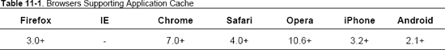

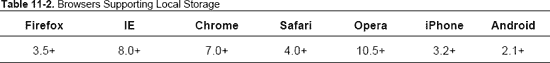

你会发现这两个功能都适用于大多数浏览器的当前版本，只有一个重要的例外——Internet Explorer(甚至是版本 9)仍然不支持应用缓存。

你会在解决方案 11-3 中看到清单文件到底是做什么的，所以剩下的唯一事情就是如何检测网络状态。在存储数据之前，您可能想知道用户是否在线。例如，这对于决定是在本地(客户端)存储值还是将值发送到服务器非常有用。为此，您可以使用 HTML5 API 的`navigator.onLine`属性。这是一个维护真/假值的属性(对于 online 为真；false 表示脱机)，并将执行联机和脱机事件。您可以通过执行以下操作为这些事件注册侦听器:

*   使用`window`、`document`或`document.body`上的`addEventListener`
*   将`document`或`document.body`上的`.ononline`或`.onoffline`属性设置为 JavaScript 函数对象
*   在`<body>`标签上指定`ononline="..."`或`onoffline="..."`属性

同样，行为和支持取决于浏览器:大多数支持通过浏览器的菜单切换到“脱机工作模式”，而有些不能检测物理网络状态的变化。Chrome 不支持。

我们来看一个简单的例子。

#### 如何建造它

首先创建一个新的 HTML5 页面来测试 navigator 对象的 online 属性。

1.  Create the following HTML5 page: `<!DOCTYPE HTML>

    <html>

    <head>
            <meta http-equiv="Content-Type" content="text/html; charset=utf-8">
            <title>Understanding the Occasionally Connected Applications - Testing Network
     Status</title>
        
    </head>

    <body onload=”init();”>
    
Network Status: 

    </body>
    </html>`

    当从远程 web 服务器启动此页面，并且您可以访问网络时，网络状态应该显示为“在线”然后使用浏览器的菜单切换到“脱机工作”，状态将变为“脱机”

2.  Test which element the event is sent back to. After the first `
` tag, add the following code: `
Received by the body: 

    
Received by the window: 
`

    然后，在`setInterval`之后添加 JavaScript 部分:

    `bdy = document.getElementById("bodyStatus");
    document.body.setAttribute("ononline", "bdy.innerHTML = \"online\"");
    document.body.setAttribute("onoffline", "bdy.innerHTML = \"offline\"");

    win = document.getElementById("windowStatus");
    window.addEventListener("online", function(){win.innerHTML="online"}, false);
    window.addEventListener("offline",function(){win.innerHTML="offline"}, false);`

    您现在可以通过切换到离线工作模式来测试不同的浏览器，如 Internet Explorer、Firefox 或 Opera。注意他们的行为有何不同。

    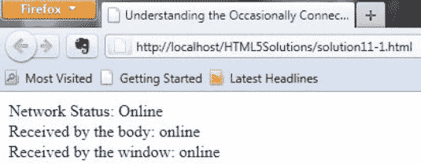

    **图 11-1。**测试导航器对象的在线属性

*注意:目前，我不建议依赖 navigator.onLine 属性，因为它在不同的浏览器中实现得很差:你不想知道用户是否通过菜单手动切换到离线模式，但你想知道他的互联网连接何时会断开。那么最好在清单中使用现有的回退机制(参见解决方案 1-3 ),或者使用 JavaScript 实现您自己的机制。*

### 解决方案 11-2:检查 HTML5 存储支持

如前所述，许多离线存储功能已经存在。当然，最著名的是 Cookies，它在网络早期就已经存在了；然而，它们极其有限。Cookies 是存储在本地文本文件中的键值对字符串，随着每个 HTTP 请求发送到同一个域名，它们被发送到服务器。其他流行的尝试包括 Google Gears(用于 Internet Explorer 和 Firefox 的插件)、user data(IE 专用)或本地共享对象(Flash 播放器插件)。然而，所有这些都依赖于浏览器或插件。HTML5 试图通过实现自己的离线存储功能来解决这个问题。

在本解决方案中，您将了解如何检查您的浏览器是否支持这一新功能，以及如何使用它。

#### 涉及到什么

HTML5 中有几个可用的存储 API(webSQL、File 和 Local)，但我们将重点关注本地存储(也称为“Web 存储”或“DOM 存储”)。本地存储允许您在浏览器会话之间存储数据，在选项卡之间共享数据，并防止数据丢失。数据作为字符串(键值对，因此您需要序列化您的复杂值)存储在存储对象中，并且与 cookies 不同，永远不会传输到远程 web 服务器(除非您手动发送)。

要在本地存储器中存储数据，您可以使用`localStorage.setItem`:

`localStorage.setItem("name", "Cyril Hanquez")`

或者，您可以使用方括号语法:

`localStorage["age"] = 38`

或者，如果您愿意，也可以使用点符号:

`localStorage.country = "Belgium"`

同样，您可以使用`getItem`来检索数据:

`localStorage.getItem("name")`

或者，您也可以使用方括号语法:

`localStorage["age"]`

或者，您可以使用点符号:

`localStorage.country`

您可以执行的其他操作包括:

*   使用`localStorage.removeItem("age")`删除数据
*   使用`localStorage.clear()`清除所有存储数据
*   用`localStorage.length`获取存储在本地存储器中的键/值对的数量
*   使用`localStorage.key(0)`获取特定索引处的键的名称

*注意:存储属性自动与脚本运行所在的域相关联。这意味着`[`google.com`](http://google.com)`不能访问`[`yahoo.com`](http://yahoo.com)`的存储。*

长期存储`localStorage`还有一个变种叫做`sessionStorage`，它只维护当前浏览器窗口或标签中的存储。(它主要是出于安全目的。)

默认情况下，每个源获得 5 兆字节的存储空间。如果你想要更多的空间，浏览器通常会向用户请求更多的空间。然而，目前没有一个浏览器支持这一点。

现在让我们看看如何检查本地存储支持。

#### 如何建造它

创建下面的 HTML5 页面，它将查找`window.sessionStorage`和`window.localStorage`:

`<!DOCTYPE HTML>

<html>

<head>
        <meta http-equiv="Content-Type" content="text/html; charset=utf-8">
        <title>Checking for HTML5 Storage support</title>

        

</head>

<body onload="RunTest();">

<h3>Checking for HTML5 Storage support</h3>

Session Storage: not supported

Local Storage: not supported

</body>
</html>`

运行这个例子会告诉你你的浏览器是否支持本地和会话存储，如图 11-2 所示。

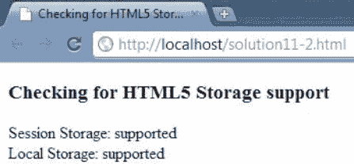

**图 11-2。**检查本地和会话存储

您也可以通过使用 Modernizr JavaScript 库并检查`sessionstorage`和`localstorage`属性来获得相同的结果:

`<!DOCTYPE HTML>

<html>

<head>
        <meta http-equiv="Content-Type" content="text/html; charset=utf-8">
        <title>Checking for HTML5 Storage support (alternate)</title>

        

</head>

<body onload="RunTest();">

<h3>Checking for HTML5 Storage support (alternate)</h3>

Session Storage: not supported

Local Storage: not supported
` `</body>
</html>`

您应该会得到与第一个示例完全相同的结果。

为了理解本地存储和会话存储之间的区别，让我们构建一个简单的例子。

首先创建一个新的 HTML5 页面来测试 navigator 对象的 online 属性。

1.  创建下面的 HTML5 表单页面来编码一个键/值对`<!DOCTYPE HTML>
    <html>
     <head>
      <title>HTML5 localStorage/sessionStorage</title>
     </head>
     <body>
     <h1>HTML5 localStorage/sessionStorage</h1>

      <form name="entryForm">

        

         

             <label>value: <textarea style="vertical-align:text-top" name="data" cols="20" rows="5"></textarea></label>
         

         

          <label>Name: <input name="name"></label>
         

      </form>

     </body>
    </html>`
2.  现在，在表单末尾添加一些按钮，对本地或会话存储进行基本操作`

          <input type="button" value="get local Item" onclick="getItem('local')">
          <input type="button" value="set local Item" onclick="setItem('local')">
          <input type="button" value="remove local Item" onclick="removeItem('local')">
         

         

          <input type="button" value="get session Item" onclick="getItem('session')">
          <input type="button" value="set session Item" onclick="setItem('session')">
          <input type="button" value="remove session Item" onclick="removeItem('session')">
    
`
3.  在显示存储值/对`

         <h2>Items</h2>` `<table id="items_tbl"></table>
         

         <label><input type="button" value="clear localStorage" onclick="clearStorage('local')"></label>
         

          

         <label><input type="button" value="clear sessionStorage"
    onclick="clearStorage('session')"></label>
         

       
`的按钮后添加一个表格
4.  在项目表``后添加需要的 JavaScript 函数
5.  通过调用 showAll 函数`<body onload="showAll()">`在页面加载时显示现有的键/值对

通过测试这个示例，您将看到当您在同一个浏览器中打开或关闭一个新的选项卡或窗口时，存储在 localeStorage 中的值/对仍然存在，但是存储在 sessionStorage 中的值/对甚至不会传递到另一个选项卡。

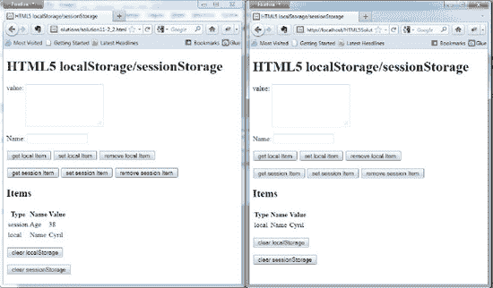

**图 11-3。**了解本地存储和会话存储的区别

*注意:除非 localStorage，否则当文件在本地运行时，sessionStorage 是不存在的，除非使用 Chrome 浏览器。所以一定要使用网络服务器测试你的代码。*

### 解决方案 11-3:为你的页面声明一个清单

清单文件是一个简单的文本文件，位于您的 web 服务器上，其中包含一个 URL 列表，这些 URL 指向您希望脱机使用的资源。

当您第一次请求包含对清单文件的引用的 HTML 文件时，您的浏览器将读取它，下载指定的资源(HTML、CSS、JavaScript、图像、视频等)，并将它们存储在本地缓存中。对同一 HTML 文件的任何后续请求都将首先从缓存中加载资源(即使您在线)，然后检查是否有新版本并更新应用缓存。完整的事件流将在下一个解决方案中详述。请注意，根据您的浏览器和安全级别，您可能会收到一个警告(按域或不按域),要求允许在本地存储数据。

*注意:重要的是要记住，即使资产(例如图像)已经更新，只有在页面重新加载时才能看到最新版本。*

#### 涉及到什么

首先，您需要使用`<html>`元素上的 manifest 属性指向页面中的 manifest 文件。

`<!DOCTYPE HTML>

<html manifest="./myAppCache.manifest">

<body>
...
</body>

</html>`

清单文件可以位于 web 服务器上的任何位置，但是它必须使用 MIME 类型 text/cache-manifest。您可能需要配置您的 web 服务器。对于 Apache，您可以在 conf 文件夹的`mime.types`文件中添加以下条目:

`text/cache-manifest     .manifest`

*注意:在应用的每个页面中放置一个指向相同缓存清单的清单属性是一个最佳实践。*

现在一切都已正确配置，您必须使用正确的语法编写清单文件。

#### 如何建造它

清单中的行以 CR、LF 或 CRFL 结尾，但文本必须是 UTF-8 编码的。

1.  The first line of a cache manifest begins with CACHE MANIFEST, and then the file is divided into three parts:
    *   *显式段:*使用头缓存
    *   *回退部分:*使用报头回退
    *   在线白名单部分:使用头部网络

    如果缓存清单中没有定义节头，默认情况下，所有列出的资源都属于显式节。散列符号`(#)`用于插入注释。下面是一个基本的缓存清单:

    `CACHE MANIFEST

    # this is a basic cache manifest
    index.html
    solution11-9781430233862.css
    #version 1`

    在这个例子中，两个文件`index.html`和`solution11-9781430233862.css`在第一次请求时存储在本地，然后任何后续请求，无论是在线还是离线，都将从缓存中获取它们。

    *注意:指向清单文件的 HTML 文档隐式地包含在缓存中，但是，由于通常有多个入口点，所以将它们都列在缓存清单文件中会更方便。*

2.  The FALLBACK section entries define substitutions for resources that haven't been cached for whatever reason. Fallback files are automatically included in the cache.

    让我们看看下面的例子:

    `CACHE MANIFEST

    # a cache manifest with a fallback section
    index.html
    solution11-9781430233862.css

    FALLBACK:
    # while offline, visitor number is replaced by ------
    counter.js      counter_offline.js
    #version 2`

    当用户在线时，从缓存中取出`index.html`和`solution11-9781430233862.css`；计数器`(counter.js`在网络上是可达的。

    当用户离线时，`index.html`和`solution11-9781430233862.css`也被从缓存中取出，但是计数器(`counter.js`)不可访问，因此它被离线版本(`counter_offline.js`)所替代。

3.  All requests to files or paths included in the NETWORK section must not be cached and are only accessible using the network, even if a matching cached resource is found. `CACHE MANIFEST

    # a cache manifest with all 3 sections

    NETWORK:
    HTML5_logo.jpg

    FALLBACK:
    # while offline, visitor number is replaced by ------
    counter.js      counter_offline.js

    CACHE:
    index.html
    counter.js
    solution11-9781430233862.css
    #version 3`

    在第三个例子中，我们明确地告诉浏览器不要缓存图片，所以当离线时，它将显示一个损坏的图像占位符。您还注意到，我们颠倒了各部分的顺序，因此您可以看到对全局机制完全没有影响。

*注意:通过 SSL 提供的页面上的缓存限制被缓存清单覆盖，因此通过`https`提供的页面可以脱机工作。*

### 解决方案 11-4:使用应用缓存对象

`window.applicationCache`对象给出缓存状态的信息，并触发与之相关的事件。

#### 涉及到什么

`applicationCache`有一个属性 status，表示六个可能选项中缓存的状态，如表 11-3 所示。

**表 11-3。**六州

<colgroup><col align="left" valign="top" width="50%"> <col align="left" valign="top" width="45%"></colgroup> 
| **数值** | **状态** |
| :-: | :-: |
| Zero | 未缓存 |
| one | 闲置的 |
| Two | 检查 |
| three | 下载 |
| four | 更新就绪 |
| five | 废弃 |

让我们来定义这些缓存状态:

<colgroup><col align="left" valign="top" width="15%"> <col align="left" valign="top" width="60%"></colgroup> 
| 0。 | *未缓存状态:*这是不存在缓存清单时的默认状态。 |
| **1。** | *空闲状态:*这是最典型的状态，它意味着应用或网页有一个缓存清单，所有指定的资源都是最新的并存储在缓存中。 |
| **2。** | *检查状态:*当浏览器正在读取清单文件时，缓存被置于此状态。 |
| **3。** | *下载状态:*当从服务器下载清单中指定的新的或更新的资源并保存在缓存中时，缓存进入该状态。 |
| **4。** | *UPDATEREADY 状态:*当清单文件已经被更新，并且新的或更新的资源现在在缓存中可用时，缓存处于这种状态。 |
| **5。** | *过时状态:*如果曾经有一个有效的缓存，但是现在清单文件丢失了，那么缓存就进入这种状态。即使缓存中有资源，也将从网络上下载这些资源。 |

这些状态中的大多数都有关联的事件。我们将在下一个解决方案中讨论这一点。

#### 如何建造它

对于此解决方案，我们将构建一个显示 applicationCache 状态的简单页面。

1.  创建下面的 HTML5 页面`<!DOCTYPE HTML>
    <html>
     <head>
      <title> HTML5 ApplicationCache Object</title>
     </head>
     <body>

     </body>
    </html>`
2.  Add the following JavaScript code in the header section to check the value of the applicationCache `

    Call the init() function in the body of the page.

    <body onload="init()">`

    如果您运行此页面，它将显示未缓存，因为尚未指定清单。

3.  创建一个名为 myCache.manifest 的空文件，只需键入 CACHE MANIFEST 即可创建一个简单的清单。默认情况下，指向清单文件的文档是隐式包含的，所以让我们在文件`<html manifest="myCache.manifest">`中添加对它的引用

现在，如果您再次运行该页面，您将看到状态现在将显示为 IDLE:由于您指定了一个存在的清单文件，它会自动缓存调用页面并更新 applicationcache 状态。

### 解决方案 11-5:应用缓存事件

在解决方案 11-3 中，我们简要描述了如何提供清单文件。然而，没有什么是神奇的，所以让我们详细看看不同的场景。

#### 涉及到什么

在前面的解决方案中，我们提到大多数状态都有关联的事件。表 11-4 列出了常见事件及其相关的缓存状态。

**表 11-4。**与缓存状态相关的常见事件

<colgroup><col align="left" valign="top" width="50%"> <col align="left" valign="top" width="45%"></colgroup> 
| **事件** | **缓存状态** |
| :-: | :-: |
| `onchecking` | 检查 |
| `ondownloading` | 下载 |
| `onupdateready` | 更新就绪 |
| `onobsolete` | 废弃 |
| `oncached` | 闲置的 |
| `onprogress` | - |
| `onerror` | - |
| `onnoupdate` | - |

我们现在将详细描述事件流。

1.  一找到清单属性，浏览器就在`applicationCache`对象上执行`onchecking`事件。即使已经读取了缓存清单，也总是会执行此事件。
2.  第一次读取清单时，会发生以下情况:
    *   执行一个`ondownloading`事件，清单文件中指定的所有资源开始下载。
    *   下载时，浏览器会定期执行一个`onprogress`事件，该事件包含有多少文件已经下载以及有多少文件仍在队列中的信息。
    *   如果一切都下载成功，那么浏览器执行最后的`oncached`事件，离线应用被完全缓存。您的应用现在处于空闲状态。
3.  例如，如果已经从另一个页面读取了清单，那么所有需要的资源都必须在缓存中，但是您仍然需要检查自上次以来清单是否发生了更改。
    *   如果缓存清单相同，那么浏览器将执行一个`onnoupdate`事件，就这样。您的应用将处于空闲状态。
    *   如果缓存清单发生了变化，浏览器会执行一个`ondownloading`事件，所有的资源都会被重新下载。
    *   下载时，浏览器会定期执行一个`onprogress`事件，该事件包含关于已经下载了多少文件以及还有多少文件在队列中的信息。
    *   所有东西都下载成功后，这次浏览器执行一个`onupdateready`事件。这意味着缓存已经更新，但是新版本还没有使用！您需要告诉用户重新加载页面以显示最新版本。
4.  如果流程中出现问题，浏览器就会执行一个`onerror`事件并停止。
5.  您还可以使用`applicationCache.update()`以编程方式强制浏览器再次检查清单。然后，您可以使用`applicationCache.swapCache()`强制切换到新版本的缓存，但是这里仍然需要手动重新加载页面。

#### 如何建造它

现在让我们构建一个在屏幕上显示事件流的例子。

1.  创建下面的 HTML5 页面`<!DOCTYPE HTML>
    <html>
     <head>
      <title> HTML5 ApplicationCache Event</title>
     </head>
     <body>` `/body>
    </html>`
2.  添加以下 JavaScript 代码来监听不同的 applicationCache 事件``
3.  create an empty file called myCache.manifest and just type CACHE MANIFEST to create a simple manifest And add a reference to it in our file `<html manifest="myCache.manifest">`

    现在运行该页面并对其进行处理，例如，更改清单文件的名称以抛出错误等…

    要实现屏幕截图中的结果，您可以执行以下操作:

    *   第一次启动页面。
    *   在您的 web 服务器上，将文件 myCache.manifest 重命名为 myCache2.manifest:当您刷新页面时，它应该显示应用缓存错误，因为在 html 页面中对清单的引用没有改变。
    *   现在将 manifest 文件重命名回他原来的名字:刷新页面应该会显示截图(图 11-4 )。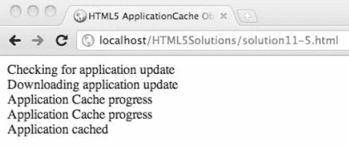

    ***图 11-4。**应用缓存事件*

#### 专家提示

您可以通过执行以下操作来监视`updateready`事件，从而强制刷新页面:

`// Check if the cache manifest has been updated.

if (window.applicationCache.status == window.applicationCache.UPDATEREADY) {
        // Swap the applicationCache
        window.applicationCache.swapCache();
        // force a reload the page
        window.location.reload();
} else {
       // Manifest didn't changed.
}`

### 解决方案 11-6:删除本地缓存

在处理缓存清单时，您真的会感到头疼。您还将不得不处理浏览器和 web 服务器的缓存机制，在某些时候，您可能只想重新开始并清除缓存。

#### 涉及到什么

目前，你不能使用`applicationCache`对象来做这件事。您需要直接在浏览器中清除缓存。然而，清除普通缓存是不够的——你必须找到通常隐藏在浏览器菜单和选项中的选项。

#### 如何清除缓存

为了清空缓存，让我们首先`use`解决方案 11-2 的第二个例子，并在本地缓存中存储一些信息(见图 11-5 )。

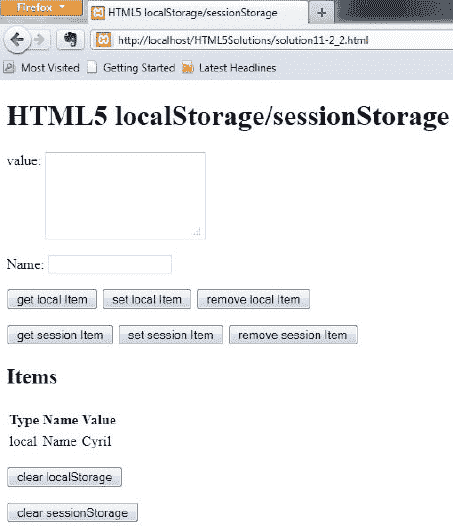

**图 11-5。**在本地存储器中存储项目

现在，让我们尝试查找并清除最常见浏览器的应用缓存。

在 Firefox 中(参见图 11-6 ):

*   On Windows:

    工具选项高级网络离线存储

*   On OSX:

    火狐偏好高级网络离线存储

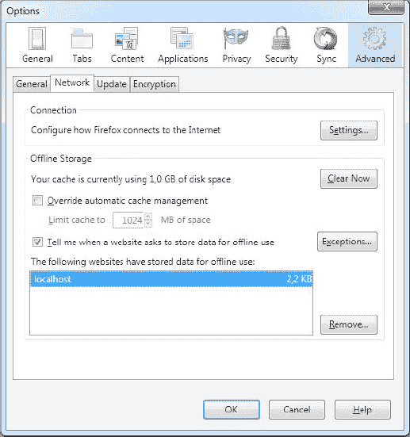

**图 11-6。**火狐 3 离线存储菜单

在铬合金中(参见图 11-7 ):

了解 Chrome 中不同种类的缓存的最佳方式是使用内置的开发工具。要启用它们，单击菜单中的工具开发人员工具。然后在工具栏中选择 Resources，您将可以访问各种存储和缓存的详细视图，从 Cookies 到应用缓存。

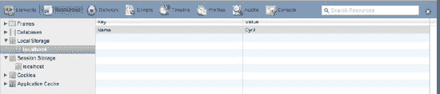

**图 11-7。**谷歌 Chrome 10 资源开发工具

歌剧中(见图 11-8 ):

*   On Windows:

    菜单设置首选项高级存储

    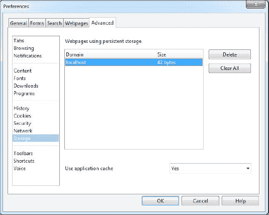

    **图 11-8。**Opera 11.10 持久存储菜单

在 Safari 中(参见图 11-9 ):

和谷歌浏览器一样，你必须启用开发者工具。为此，在设置菜单中，选择首选项高级，然后单击菜单栏中的显示开发。然后，在菜单中，点击开发显示网页检查器，并点击存储。

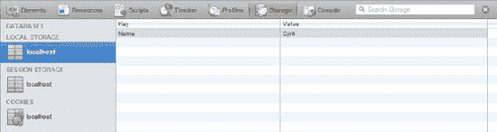

**图 11-9。**Safari 5 存储开发工具

目前没有简单的方法来检查移动浏览器的缓存，但是大多数浏览器只有一个选项来清除缓存，即清除所有类型的缓存。

### 总结

这种 HTML5 本地存储功能为开发人员创造了新的机会，可以在多种平台和设备上运行丰富的应用——用户甚至可以离线工作，并在连接时同步，而不依赖于任何专有技术。鉴于不断增长的移动市场和浏览器对这一功能的更多支持，HTML5 本地存储将是最有用的新规范之一。