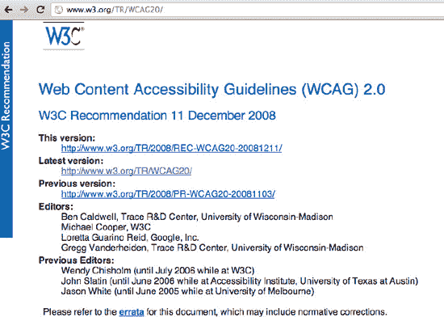
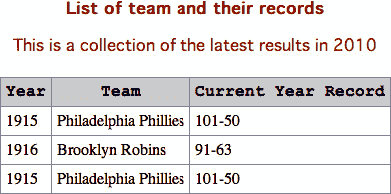
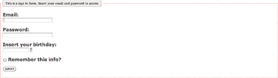
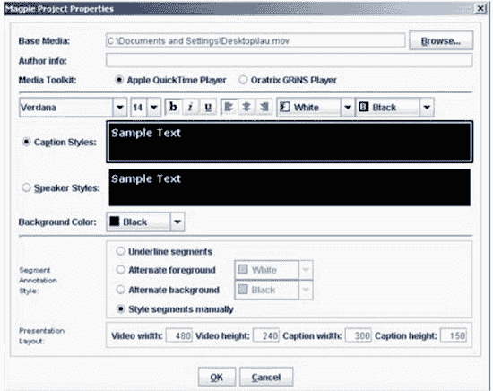

# 十二、HTML5 辅助功能

web 应用的可访问性是一个非常热门的话题。不仅使用网络的残疾人数量每天都在增加，处境困难的人浏览网络的环境也在增加。使用键盘而不是鼠标填写 web 表单，使用基于触摸的设备在屏幕上拖动对象，或者在手机上使用来自慢速 UMTS 连接(`[`en.wikipedia.org/wiki/UMTS`](http://en.wikipedia.org/wiki/UMTS)`)的多媒体元素，这些都是残疾人必须面对的经常性障碍。使应用具有可访问性的原因和实现这一点的技术并不涵盖影响访问 Web 的所有残疾，包括视觉、听觉、身体、语言、认知和神经残疾。相反，它涉及到为那些在访问网络时遇到某些困难的人改善访问。

### 可达性的四个原则

指南和成功标准是围绕以下四个原则组织的，这四个原则为任何人访问和使用 Web 内容奠定了必要的基础。任何想要使用 Web 的人都必须拥有以下内容:

1.  **Perceivable:** Information and user interface components must be presentable to users in ways they can perceive.

    这意味着用户必须能够感知所呈现的信息(不可能所有的感官都看不见)。

2.  **Operable:** User interface components and navigation must be operable.

    这意味着用户必须能够操作界面(界面不能要求用户不能执行的交互)。

3.  **Understandable:** Information and the operation of user interface must be understandable.

    这意味着用户必须能够理解信息以及用户界面的操作(内容或操作不能超出他们的理解)。

4.  **Robust:** Content must be robust enough that it can be interpreted reliably by a wide variety of user agents, including assistive technologies.

    这意味着随着技术的进步，用户必须能够访问内容(随着技术和用户代理的发展，内容应该保持可访问性)。

有许多首字母缩略词涉及到这个问题:W3C、WCAG、WAI、ATAG(创作工具可访问性指南)和 UAAG(用户代理可访问性指南)。让我们试着澄清一下，因为有时事情看起来可能比实际情况更复杂。

万维网联盟(W3C)和网络无障碍倡议(WAI)于 2008 年 12 月 11 日发布了第二版网络内容无障碍指南(WCAG)。

这些指南的目的是解释如何通过定义可访问性级别来使残疾人能够访问 web 内容。在实践中，联盟希望让所有的网络用户获得相同的信息和使用相同的功能。

### WCAG 的目的

网站内容可访问性指南(WCAG)是一系列网站可访问性指南的一部分，旨在帮助开发人员使内容具有可访问性，主要针对残疾用户，但也针对所有用户代理，包括高度受限的设备，如移动设备。

这组指南由 W3C 维护(图 12-1 ):

**图 12-1。**W3C 网站上的 WCAG 规范页面

指导方针的三个层次如下。

#### 第 1 级:设计原则、指南和成功标准的概述

第 1 级介绍了新 WCAG 协议(第二代可访问性指南)、可访问性的四项原则、与技术无关的 13 项指南、每项指南的规定和示例定义，以及最终附录。

#### 第 2 级:特定技术清单

2 级旨在支持一般准则。它包括一系列文档和清单，有助于定义用于符合新 WCAG 协议规范的技术信息。

#### 第三级:特定技术的应用信息

第 3 级包括代码示例、屏幕截图和其他技术信息。这些例子包括:

##### 通用技术

*   HTML 和 XHTML 的使用技巧
*   级联样式表(CSS)技术
*   服务器端脚本技术
*   客户端脚本技术
*   可缩放矢量图形(SVG)技术
*   同步多媒体集成语言技术(SMIL)
*   可扩展标记语言(XML)技术

因此，通过学习和应用 WCAG 中描述的最佳实践，您可以使 web 应用具有可访问性。

对话中还有一个问题需要补充:用于更新网页内容的软件。网络上的大多数内容都是使用开发工具(如内容管理系统，或 CMS)创建的。该软件通常决定内容的访问方式和程度，因此它在创建符合 WCAG 的内容方面发挥着重要作用。因此，对这些工具的开发者来说，遵循 WCAG 规范是一个基本要求，以使他们的软件更加通用，更适合创建可访问的内容。

创作工具可访问性指南，或 ATAG，就是带着这些需求诞生的。

另一方面，用户代理可访问性指南(UAAG)指导用户代理的开发，它打破了不同能力的个人(视觉、听觉、心理、认知和神经残疾)的可访问性障碍。用户代理包括浏览器、媒体播放器和所有执行 web 内容呈现和解析的软件。

### 解决方案 12-1:使用导航元素创建跳转链接

来自维基百科(`[`en.wikipedia.org/wiki/Screen_reader`](http://en.wikipedia.org/wiki/Screen_reader)`):屏幕阅读器是一个软件应用，它试图识别和解释屏幕上显示的内容(或者更准确地说，发送到标准输出，无论视频监视器是否存在)。然后，这种解释通过文本到语音转换、声音图标或盲文输出设备重新呈现给用户。屏幕阅读器是一种辅助技术(AT ),通常与屏幕放大镜等其他辅助技术结合使用，可能对盲人、视障人士、文盲或有学习障碍的人有用。

残障人士(例如使用屏幕阅读器上网的人)有不同的用户需求。有些人可能希望快速跳到网页的特定部分，而其他人可能会等待屏幕阅读器按顺序阅读页面内容。

前一种用户类型可以利用屏幕阅读器提供的快捷方式(“跳过链接”)来快速确定他们可以跳过的内容；屏幕阅读器还可以根据请求提供某些元素，比如导航元素、内容、页眉、页脚等等。显然，开发人员必须设计页面，以便能够向屏幕阅读器提供这些提示。

让我们看看如何用 HTML5 创建这些函数。

#### 涉及到什么

大多数网页可以简化为以下逻辑结构:页眉、页脚、导航菜单、主体、列等等。

在 HTML4 中，这种结构通常使用 DIV 标签创建，并与 id 属性相关联:

`<body>

  

  

  

</body>`

在本例中，我们创建了以下页面结构:页眉、正文、菜单、页面内容、右侧栏和页脚。内容被插入到这个结构中，然后用 CSS 语句格式化。

由于 HTML4 中缺少描述页面逻辑划分的语义，所以大量使用 DIV 块是必要的。

为了允许使用跳转链接进行快速导航，有一些技巧。跳转链接用于使使用辅助技术的人不必收听整个页面，而不仅仅是他们感兴趣的内容。这种方法在 WCAG 的 Checkpoint 13.6 中也有讨论:“组相关链接，识别组(对于用户代理)，并且在用户代理这样做之前，提供绕过组的方法。”

一种方法使用可见的跳转链接，而其他方法使用隐藏的跳转链接。不管采用什么方法，跳过链接的概念都是基于

下面是一个 skip 链接的实际例子，它允许屏幕阅读器从导航菜单跳到主要内容:

`

  

<ul>

<a href="#main_content">skip to main content</a>

<li>Menu links</li>
<li>Menu links</li>
<li>Menu links</li>
  ...
</ul>

  
` `
  
Content

  

`

另一个跳过链接导航的例子是由许多内容丰富的门户网站实现的，它创建了一个实际的菜单来快速导航到页面的各个部分:

`

<strong>Welcome to XYZ Portal</strong>
Skip directly to: <a href="#main">Main Content</a>,
<a href="#nav">Navigation menu</a>,
<a href="#news">News section</a>.
<a href="#video">Video section</a>.

`

有了 HTML5，这种方法彻底改变了。HTML5 引入了一整套新元素，使得构建网页变得更加容易。

你已经在第三章中看到了 HTML5 的结构和语义元素。现在，您将使用这些元素在网页中创建快速导航功能，而无需创建特定的跳转链接。

目前并非所有的屏幕阅读器都能识别 HTML5 的新语义元素，例如导航标记。然而，生产这种软件的公司正与 W3C 密切合作来提供这种支持。

#### 如何建造它

通过使用新的`<nav>`标签，浏览器现在有了一个标准的 HTML 元素来指定导航内容。因此，通过创建跳转链接来让用户快速跳转到页面某一部分的旧方法已经过时了。

使用新的`<nav>`元素，现在可以为屏幕阅读器指定页面内的导航内容，正如 HTML5 规范中的注释所解释的:

用户代理(如屏幕阅读器)的目标是那些可以从最初呈现时忽略的导航信息中受益的人，或者那些可以从导航信息立即可用中受益的人，他们可以使用该元素作为一种方式来确定页面上最初跳过和/或根据请求提供的内容。

当屏幕阅读器软件识别出`<nav>`元素时，它将能够为用户提供跳过导航部分的方法。

在同一个页面中可以使用多个`<nav>`元素。在下一个例子中，有两个`<nav>`元素。第一个让用户连接到外部网页，而第二个设计用于在页面内导航:

`<!DOCTYPE html>

<html>

    <head>

    <title>
     Solution 12-1: Creating skip links with the nav element
    </title>

    </head>
<body>

        <header>

            <h1>Solution 12-1: Creating skip links with the nav element </h1>

        </header>

 <nav>
  <ul>
   <li><a href="http://casario.blogs.com">My Blog</a></li>
   <li><a href="http://it.linkedin.com/in/marcocasario">My LinkedIn Profile</a></li>
   <li><a href="http://twitter.com/#!/marcocasario">My Twitter</a></li>
  </ul>
 </nav>

  <header>
   <h1>Stop using custom skip links!</h1>
   
And start using the semantic HTML5 tags.

  </header>

  <nav>
   <ul>
    <li><a href="#navtag">The NAV tag</a></li>
   </ul>
  </nav>

   <section id="navtag">
    <h1>The Nav tag</h1>
    <h3>From the W3C NAV specs</h3>
    

    A section with navigation links.
    

   </section>

    </body>
</html>`

不是页面上的所有链接组都需要在一个`<nav>`元素中。只有由主要导航块组成的部分才适合于`<nav>`元素。特别是，页脚通常会有一个指向网站各种页面的链接列表，比如服务条款、主页和版权页面。对于这种情况，单独的页脚元素就足够了，不需要`<nav>`元素。

#### 专家提示

说到菜单和跳转链接，HTML5 规范中有一个新元素需要考虑:`<menu>`。

可以使用`<menu>`元素代替`<nav>`元素进行导航。情况是这样的:`<menu>`用于命令列表，它是一个交互元素，有几种可能专门用于 web 应用:

`<menu type='toolbar'>
  <menu type='list' label='File' >
     <command label='New'/>
     <command label='Save'/>
     <command label='Close'/>
  </menu>
  <menu type='list' label='Edit'>
      <command label='Cut'/>
      <command label='Copy'/>
<command label='Paste'/>
  <menu>
</menu>`

你可以把菜单元素想象成一个经典的桌面应用菜单系统。

### 解决方案 12-2:创建可访问的表格数据

表格是一种用于以表格格式表示数据的工具。然而，在过去，它们常常被用来控制页面布局。这种使用给网页的可访问性带来了很多问题，因为辅助技术可能会获得非常混乱的结果。特别是，屏幕阅读器等辅助工具的用户可能会发现很难导航带有用于布局的表格的页面。

另一方面，HTML 表格对于显示多维数据是必要的(正如 W3C 规范所提供的)。

为了使一个表具有高度的可访问性，我们必须确保它有必要的格式来优雅地转换，并且它也可以被诸如屏幕阅读器之类的设备读取。

这就是一些特定属性可以发挥作用的地方。如果明智地使用，这些属性使得任何人都可以访问表中的数据。

#### 涉及到什么

设计可访问的数据表需要特别注意一系列属性的使用，这允许用户代理以最佳方式理解和解释表本身的内容和结构。

每个表格必须提供有关其包含的数据的信息。这些信息对于辅助技术的用户导航这些表格至关重要，因为它们将如何被读取和解释。

这就是为什么 HTML5 有一个`<caption>`标签，它将一个标签与表格关联起来；summary 属性不显示在标准的 web 浏览器上，但提供了用户代理可以阅读的文本，描述了表格本身的内容、结构和用途:

`<table summary="Last season records">
<caption>
  <strong>List of team and their records</strong>
  
This is a collection of the latest results in 2010

 </caption>`

根据定义，每个表都可以表示一个或多个维度的数据。因此，有必要将每行的读数与相应的列相关联。这是保证用户正确阅读信息的唯一方法，例如，使用屏幕阅读器工具导航的用户。

事实上，范围属性、id 和头对允许识别头以及它们和单元之间的关系，这允许更容易地查阅数据:

`<tr>
    <th id="year">Year</th>
    <th id="team">Team</th>
    <th id="record" abbr="Record">Current Year Record</th>
  </tr>
  <tbody>
  <tr>
   <td headers="year">1915</td>
   <td headers="team">Philadelphia Phillies</td>
   <td headers="record">101-50</td>
  </tr>
  </tbody>`

这种关联为单元格中的每个值提供了准确的列，这对于屏幕阅读器非常有用，因为它们可以在读取列中包含的数据之前随时读取列的标题。

现在让我们构建一个完整的示例。

#### 如何建造它

记住屏幕阅读器是如何工作的。它并不像您想象的那样读取屏幕，而是读取 HTML 页面的底层源代码。这就是为什么使用提供表所包含数据的信息的属性和特性来使表格数据可访问是很重要的。

您可以从以下解决方案中了解如何做到这一点:

`<!DOCTYPE html>
<html>
    <head>
    <title>
     Solution 12-2: Creating accessible tabular data
    </title>` `</head>
<body>

<table summary="Last season records">
<caption>
  <strong>List of teams and their records</strong>
  
This is a collection of the latest results in 2010

 </caption>
 <thead>
 <tr>
    <th id="year">Year</th>
    <th id="team">Team</th>
    <th id="record" abbr="Record">Current Year Record</th>
  </tr>

  <tbody>
  <tr>
   <td headers="year">1915</td>
     <td headers="team">Philadelphia Phillies</td>
     <td headers="record">101-50</td>

  </tr>
  <tr>
    <td headers="year">1916</td>

     <td headers="team">Brooklyn Robins</td>

     <td headers="record">91-63</td>

  </tr>
  <tr>
       <td headers="year">1915</td>

     <td headers="team">Philadelphia Phillies</td>

     <td headers="record">101-50</td>
  </tr>
</tbody>
</table>

</body>
</html>`

现在给这个表添加一些样式，只是为了从视觉的角度使它更令人愉快。创建一个 CSS 文件，您可以在其中为表格和单元格创建样式选择器:

`/* CSS Document */

table {
border-top: 1px solid #999;
border-left: 1px solid #999;

border-collapse:collapse;
}` `th, td {
padding: 5px;
border-right: 1px solid #999;
border-bottom: 1px solid #999;
}

caption {
font-family:Geneva, Arial, Helvetica, sans-serif;
color:#993333;
padding-bottom: 5px;
}

th {
background-color:#cccccc;
font-family:"Courier New", Courier, mono;
}`

将此文件另存为 table.css。现在要将 css 应用到页面，首先导入它，并在 head 标记中包含 style 标记:

`<!DOCTYPE html>
<html>
    <head>
    <title>
     Solution 12-2: Creating accessible tabular data
    </title>

<link href="table.css" rel="stylesheet" />
    </head>`

现在表格的格式如图 12-2 所示。

**图 12-2。**可访问的表格数据继承样式。

#### 专家提示

HTML5 引入了一个新的控件来表示数据:`<datagrid>`。

`<datagrid>`元素是表格、树和列表的容器。它允许您选择行、列和单元格，并在客户端的浏览器中直接执行折叠行/列、对网格排序以及与数据交互等操作:

`<datagrid>
<table summary="Last season records">
  <tr>
   <td headers="year">1915</td>
     <td headers="team">Philadelphia Phillies</td>
     <td headers="record">101-50</td>

  </tr>
  <tr>
    <td headers="year">1916</td>

     <td headers="team">Brooklyn Robins</td>

     <td headers="record">91-63</td>

  </tr>
  <tr>
       <td headers="year">1915</td>

     <td headers="team">Philadelphia Phillies</td>

     <td headers="record">101-50</td>
  </tr>
</table>

</datagrid>`

`DataGridDataProvider`接口表示对象必须实现的接口，以用作`<datagrid>`元素的定制数据视图。您可以使用`DataGridDataProvider`从数据库加载数据，`XmlHttpRequest`，或者 JavaScript 代码可以与之对话的任何东西。

### 解决方案 12-3:创建可访问的表单

我们已经在第四章中深入讨论了表单的重要性，你也看到了它们是如何成为让用户与网站互动的工具的。一个好的表单设计不仅在可访问性方面很重要，对可用性本身也很重要。事实上，表单中的设计和构造错误会降低应用的可理解性，甚至导致用户放弃页面，从而损害应用的良好效果。

因此，制作一个好的表单是网页设计师必须面对的一项极其困难的任务。

HTML5 为 HTML `<input>`元素的 type 属性引入了 13 个新值:search、tel、url、email、datetime、date、month、week、time、datetime-local、number、range 和 color。这些已经允许屏幕阅读器识别和传输更正确的数据给用户。

通过其他小的调整，比如使用键盘导航表单的可能性，可以极大地改善用户体验。

#### 涉及到什么

一旦创建了可访问的表单，大部分工作将由辅助技术本身来完成。

第一个调整是用一个清晰的、解释性的标题，让用户立即明白他或她正在填写的是什么类型的表单。除了标题之外，对请求信息的原因提供一个简短的解释，或者简单地指定一些字段是否是必填的，几乎总是有用的。这就是为什么我们可以使用`<legend>`标签来表示其余内容的标题:

`<form id="thisform">
    <legend>This is a sign in form. Insert your email and password to access:</legend>
</form>`

此外，尤其是当表单很长并且包括几个输入时，要填写的一组连贯的字段是另一个重要的选择。混淆数据是混淆用户的一个很好的方法。事实上，有一个<`fieldset>`标记，它表示一组表单控件，这些控件可以有选择地分组到一个公共名称下:

`<form id="thisform">
 <fieldset name="signin">`

另一个有用的考虑是用键盘快捷键(用`accesskey`属性)导航表单并明确地将输入类型与标签关联起来的可能性:

`
<label for="name" accesskey="N" >Name:</label> 
<input type="text" id="name" name="name" tabindex="2" />
`

#### 如何建造它

下面的示例显示了一个可访问的表单:

`<!DOCTYPE html>

<html>

    <head>

    <title>
     Solution 12-3: Creating accessible form
    </title>

    </head>
<body>

<form id="thisform">
 <fieldset name="signin">

    <legend>This is a sign in form. Insert your email and password to access:</legend>` `
<label for="email" >Email:</label> 

  <input type="email" id="email" name="email" tabindex="1" autofocus />

   
<label for="password" accesskey="P" >Password:</label> 

  <input type="text" id="password" name="password" tabindex="2" />

  
<label for="name" accesskey="D" >Insert your birthday:</label> 

  <input type="date" id="date" name="date" tabindex="3" />

  
<input type="checkbox" id="remember" name="remember" tabindex="4" />

  <label for="remember">Remember this info?</label>

  
<input type="submit" value="submit" tabindex="5" />

</fieldset>

</form>

</body>
</html>`

为了使表单更加美观，可以添加 CSS 语句。为此，创建一个外部 CSS 文件，我们将其保存为`form.css`，并插入以下代码:

`#thisform label {
font-family:Verdana, Arial, Helvetica, sans-serif;
font-size:1.2em;
font-weight: bold;
color:#666666;
}

#password, #email {

width: 200px;

}
#thisform legend {
                font-weight: bold;
                font-size: 90%;

                color: #666;
                background: #eee;

                border: 1px solid #ccc;

                border-bottom-color: #999;

                border-right-color: #999;` `padding: 4px 10px;

                }

#thisform fieldset {

                border: 1px dotted #ff0000;
                padding: 5px 20px 10px 10px;

                }`

再次保存文件。现在打开您在此解决方案中创建的 HTML 文件。要将样式文件应用于表单，您可以导入它，并在头部声明一个`<link>`标记:

`<head>
    <title>
     Solution 12-3: Creating accessible form
    </title>
<link href="form.css" rel="stylesheet" />
    </head>`

保存文件，在浏览器中执行 HTML 文件，查看最终结果，如图图 12-3 所示:

**图 12-3。**格式化且可访问的表单

### 解决方案 12-4:使用视频元素的字幕和注释

视频元素提出了无障碍领域的问题。例如，有些残疾用户听不到声音。要被所有用户认为是可访问的，视频必须伴有等效的文本替换。甚至 WCAG 也描述了视频文本替代品的重要性。

对于有听觉障碍的人来说，字幕或文本转录无疑是有用的，但对于没有快速连接的用户来说也是如此。因此，开发人员可以选择以下操作之一:

*   在发布视频的页面的 HTML 代码中直接插入视频内容的简短摘要。
*   在 HTML 中插入完整的语音文本，并带有一个链接，用于下载带有完整语音文本的文本文件。
*   在视频中插入字幕。

最终的选择取决于开发人员，而且显然还取决于视频的重要性、视频本身的时长以及制作字幕的技术难度。

要制作字幕，必须使用字幕软件，该软件允许开发人员以所需的格式(QuickTime、Windows Media Player、Real Player 或 Flash)导出字幕文件，并将其发布到网络上。开发人员也可以编写程序代码，使文本与视频序列自动同步。使用 HTML5 和新的 video 元素，可以通过同步文本和视频来创建这种功能。

#### 涉及到什么

给视频添加字幕有多种方法。您可以编写 JavaScript 代码，以编程方式将外部文本文件与视频同步，或者您可以使用一个可用的软件程序来为您完成大部分工作。

第一个重要的区别与隐藏式字幕和开放式字幕有关:

*   开放字幕是视频序列的一部分，不能关闭。
*   隐藏字幕是视频序列的基础，因为它们位于不同的文件中，并且可以由用户打开和关闭。

这两种方法都不是优选的，但是隐藏式字幕通过提供语言选择、打开和关闭字幕以及用于搜索字幕文本的索引系统，允许用户有更多的定制选项。

一旦决定了嵌入视频的字幕类型，你就必须选择软件。根据国家无障碍媒体中心(NCAM)指南(`[`ncam.wgbh.org/invent_build/web_multimedia/tools-guidelines`](http://ncam.wgbh.org/invent_build/web_multimedia/tools-guidelines)`)的建议，这些是最常见的添加字幕的软件程序:

*   喜鹊:为 QuickTime、Windows Media、Real player 和 Flash 多媒体添加字幕和视频描述的免费软件。
*   CCforFlash:一个免费的 Flash 组件，可用于显示 Flash 视频和音频内容的标题。
*   ccPlayer 和 ccMP3Player:整合了 CCforFlash 组件的免费播放器；对于希望为 Flash 视频或音频添加标题的非 Flash 作者非常有用。
*   CaptionKeeper:将电视隐藏字幕数据转换为网络流格式的软件。
*   NCAM QA Favelet:帮助开发者识别网页易访问性问题的工具。
*   STEP:针对 Section 508 法规遵从性确定错误优先级的简单工具(STEP)。

在这个解决方案中，我们使用了 MAGpie Media Access Generator，这是一个免费的创作工具，用于在多媒体环境中创建字幕和音频描述信息。它允许您处理以下格式:QuickTime、Windows Media、Real、Flash、MP4 和 3GP 源文件。

注意:Mac 用户:MAGpie 是一个基于 Java 的应用，需要 QuickTime Java 才能正常运行。不幸的是，Apple 已经弃用了 QuickTime Java 接口，并且不再提供对它的支持。因此，喜鹊将不再在 Mac 上运行。

您可以在以下地址下载喜鹊:`[`ncam.wgbh.org/invent_build/web_multimedia/tools-guidelines/download-magpie`](http://ncam.wgbh.org/invent_build/web_multimedia/tools-guidelines/download-magpie)`

#### 如何建造它

通过为字幕使用 MAGpie，您可以从文本文件导入字幕或手动插入语音文本。您可以将文本与视频序列同步，然后以所需的格式导出字幕文件。

执行此操作的过程非常简单。一旦你安装了喜鹊，打开它。

然后从文件新建菜单中打开一个新项目，在初始窗口中选择要加字幕的视频。现在，系统会要求您选择想要使用的视频格式。您可以通过选择“Apple QuickTime Player”来选取 QuickTime 格式，而对于 RealPlayer 和 Windows Media Player 格式的视频，请选择“Oratrix GRiNS Player”。

现在，您必须指定您希望字幕显示的样式，然后插入视频文件的宽度和高度。

如果字幕文本是手动插入的，从 Magpie 窗口的轨道属性菜单中选择字幕，并将字幕插入该字段。

如果文本来自外部文件，使用“轨道导入轨道”菜单导入文本。

要使文本与视频同步，请使用工具栏上的按钮，通过插入字幕的开头和结尾来开始视频。

通过这几个步骤，你已经将字幕与视频同步了。现在需要将字幕导出为可以由 HTML5 — MP4 的视频对象播放的格式。

在 MAGpie 文件属性菜单中，您可以检查您是否选择了“Apple QuickTime Player ”,并通过从“导出”菜单中选择“QuickTime SMIL 1.0”来导出数据。当你点击 OK 按钮，喜鹊生成 2 个文件:一个 TXT 文件和一个 SMIL 扩展名的文件。

SMIL 代表同步多媒体集成语言，它支持交互式视听演示的简单创作。SMIL 通常用于将流式音频和视频与图像、文本或任何其他媒体类型集成在一起的“富媒体”(多媒体)演示。SMIL 是一种简单易学的类似 HTML 的语言，许多 SMIL 演示文稿都是使用简单的文本编辑器编写的。

要测试字幕的功能，请打开您用 QuickTime player 导出的 SMIL 文件并开始播放视频。

MAGpie 创建的文本文件包含字幕的样式数据、同步数据和字幕文本。最终结果如图图 12-4 所示。

**图 12-4。**喜鹊属性菜单

#### 专家提示

说到字幕，Bruce Lawson 在 Dev 上发表了一篇有趣的文章。歌剧网站:`[`dev.opera.com/articles/view/accessible-html5-video-with-javascripted-captions/`](http://dev.opera.com/articles/view/accessible-html5-video-with-javascripted-captions/)`。这篇文章展示了一种动态添加字幕到视频对象的方法。

它使用了新的 HTML5 特性，允许任何元素拥有自定义数据属性，并将数据传递给脚本:

``

这是从第一秒开始到第二秒`6`的字幕。

该解决方案需要一些 JavaScript 知识，但是值得研究，因为它在许多上下文中都很方便。

### 解决方案 12-5:使用 ARIA 项目

当开发一个网站或 web 应用，并试图使其具有可访问性时，你很快就会意识到 HTML 不是为编写这类应用而创建的。开发 HTML 是为了提供一种通过具有特定标识和功能的元素来导航文档的方法(因此是超文本语言),在大多数情况下，这些元素是按顺序进行的。HTML 是根据一次点击、一页 web 应用的概念创建的，这意味着在网站内导航的每一次点击都对应于对服务器的请求，然后对请求进行处理，并将响应返回给客户端。然而，对于 web 应用来说，事情最近有些变化。

首先是 Flash Player，然后是 JavaScript 和 AJAX，一次点击、一页的模式被一页的应用方法所改变。这意味着用户可以在应用中导航，而不需要更新整个页面的所有内容，例如一个表中的所有数据。事实上，应用会在后台自动更新页面内容以响应用户事件，维护页面中固定的用户界面元素。导航是在 web 应用中定义的“状态”之间进行的，而不是在页面之间。

事实上，大部分工作都委托给了客户机而不是服务器，这与过去的情况相反。

除了更加用户友好之外，这种方法还最大限度地减少了服务器请求，这些请求针对应用严格必需的数据进行了优化。web 应用的行为类似于装载在容器(即用户代理)中的桌面应用。

不幸的是，并非所有闪光的都是金子。

事实上，这种新的基于事件的系统对于辅助技术来说经常是一个问题，辅助技术期待旧的请求-响应模型。

页面的状态——即 AJAX 框架提供给用户的定制用户界面组件及其属性——对于辅助技术是不可用的。此外，由于不再有每次点击都加载一个新页面的请求-响应模型，浏览器的后退按钮通常会受到影响。

为了解决这类问题，W3C 正在进行一个名为 WAI-ARIA 的项目。基本上，ARIA 在浏览器中提供了解析系统的实现，该解析系统能够识别与网页的 HTML 元素相关联的某些属性，这些属性向辅助技术“解释”与它们相关联的角色和功能。这使得页面的内容对于那些看不到当某个事件被触发时会发生什么的人来说是清楚的。

该项目仍然是一个工作草案，还没有在最后的建议阶段。尽管如此，我们已经可以使用它的功能，所以在 web 应用中使用 ARIA 不会有负面影响。领先的浏览器和屏幕阅读器已经开始支持这个项目。

例如，Opera 9.5、Firefox 1.5 和 Internet Explorer 8 已经开始实现 ARIA 规范；而 WebKit 浏览器，如 Safari 和 Chrome，正在努力在即将到来的版本中支持 ARIA 规范。

就辅助技术而言，Jaws 7.1、Zoomtext 9、Windows Eyes 5.5 等也都支持 ARIA。

#### 涉及到什么

ARIA 项目可以在以下情况下帮助辅助技术:

*   与服务器的静默后台交互
*   自定义组件(小部件)的键盘导航
*   在应用或小部件的状态之间导航
*   页面结构中角色的定义

ARIA 项目扩展并添加了开发人员在标记中声明的一系列属性，这些属性由浏览器和辅助技术解释。

##### 与服务器的静默后台交互

对于屏幕阅读器来说，应用在后台加载数据和更新用户界面元素的上下文是最难解释的。ARIA 提供了一组新的属性来声明页面中的特殊区域，并在情况发生变化时警告用户代理。

这些属性是:

> aria-live :这个属性指定一个元素将被更新，它描述了用户代理、辅助技术和用户可以从 live 区域期望的更新类型。它接受 off(该区域不是实时的)、礼貌(通知用户更新，但通常不中断当前任务)和 assertive(更新紧急传达给用户)值:
> 
> `
          role="contentInfo"
>          aria-live="assertive" > This is a live region.
> 
`
> 
> **aria-atomic** :表示辅助技术是否会向用户呈现全部或部分改变的区域。它接受 true 或 false 作为值:
> 
> `
          role="contentInfo"
>          aria-live="assertive"
>           aria-atomic="true" > This is a live region.
> 
`
> 
> **aria-relevant** :表示一个地区内有哪些变化是相关的。它接受表 12-1 中列出的值。
> 
> **表 12.1。**咏叹调——相关价值观
> 
> <colgroup><col align="left" valign="top" width="35%"> <col align="left" valign="top" width="60%"></colgroup> 
> | **值** | **描述** |
> | :-- | :-- |
> | 添加内容: | 元素节点被添加到活动区域内的 DOM 中。 |
> | 移除: | 活动区域中的文本或元素节点将从 DOM 中移除。 |
> | 文本: | 文本被添加到活动区域的任何 DOM 子代节点中。 |
> | 全部: | 相当于所有值的组合；“添加删除文本”。 |
> | 附加文本(默认): | 相当于值的组合，“附加文本” |
> 
> **aria-busy:** 表示元素是否正在更新。它接受值 true 或 false

比我们想象的更多的是，用户使用键盘在应用中移动。因此，必须支持这一点，并且不要将应用链接到依赖于特定设备(如鼠标)的事件(例如，翻转事件)。

在这方面，ARIA 将其支持扩展到了`tabindex`属性，该属性允许您使用 Tab 键为页面上的对象分配导航顺序。以前在 HTML 中支持这个属性，但是只支持`a`、`area`、`button`、`object,`、`input`、`select`和`textarea`属性。在这方面，ARIA 扩展了对`tabindex`属性的支持，该属性允许您为页面中的任何可见元素分配导航顺序:

`

  <h3 id="radio_btn">Choose your favorite movie:</h3>

  <ul class="radiogroup"
      id="rg1"
      role="radiogroup"
      aria-labelledby="radio_btn">

    <li id="r1"
      tabindex="1"
      role="radio">
      Matrix
    </li>
    <li id="r2"
        tabindex="2"
        role="radio">` `Inception
    </li>
    <li id="r3"
        tabindex="3"
        role="radio">
     Avatar
    </li>
    <li id="r4"
        tabindex="5"
        role="radio">
     Blade Runner
    </li>
    <li id="r5"
        tabindex="4"
        role="radio" >
     The silent of the lambs
    </li>
  </ul>
  
`

在这个例子中，我们将一个`tabindex`关联到一个 UL 的 LI 元素，它模拟了一个单选按钮组组件。

ARIA 的`tabindex`属性也接受负值，允许您排除对象，但仍然通过使用键盘从导航中以编程方式接收焦点。

##### 在应用或小工具的状态间导航

页面或组件的状态传达了关于该对象的特定信息。例如，一个页面可以有一个登录状态，该状态根据登录的用户加载某些用户界面元素。此外，单选按钮组件可以有一个在用户选择对象时启动的选定状态。

ARIA 提供了一组状态和属性，可以在各种上下文中使用，以便在应用的生命周期中为用户代理和屏幕阅读器提供特定的信息。例如，ARIA 提供了一些特定于接收用户输入和处理用户操作的通用用户界面元素的属性:

*   空气-自动完成
*   aria-已检查(州)
*   aria-禁用(州)
*   aria-扩展(州)
*   空气-haspopup
*   aria-隐藏(状态)
*   aria-无效(州)
*   空气标签
*   咏叹调级别
*   咏叹调多线
*   咏叹调-多选
*   咏叹调取向
*   aria-pressed(状态)
*   aria-只读
*   aria-必需的
*   aria-选定(州)
*   阿里索
*   空值最大值
*   阿莱瓦明
*   阿里-瓦努阿图
*   aria-value text-空值文字

使用前面的例子，您可以使用`aria-checked`属性指出默认情况下列表中的哪个对象已经被选中。(通过添加一点 JavaScript 代码，您可以显示该对象的选定状态的图像。)

`

  <h3 id="radio_btn">Choose your favorite movie:</h3>

  <ul class="radiogroup"
      id="rg1"
      role="radiogroup"
      aria-labelledby="radio_btn">

    <li id="r1"
      tabindex="1"
      role="radio"
      aria-checked="false">
      Matrix
    </li>
    <li id="r2"
        tabindex="2"
        role="radio"
        aria-checked="false">
      Inception
    </li>
    <li id="r3"
        tabindex="3"
        role="radio"
        aria-checked="false">
     Avatar
    </li>
    <li id="r4"
        tabindex="5"
        role="radio"
        aria-checked="true">
     Blade Runner
    </li>
    <li id="r5"
        tabindex="4"
        role="radio"
        aria-checked="false">
     The silence of the lambs
    </li>
  </ul>
  

The following element therefore has a selected state:
<li id="r4"
        tabindex="5"
        role="radio"
        aria-checked="true">
     Blade Runner
    </li>`

##### 在页面结构中定义角色

HTML5 增加了新的标签来定义页面的语义结构(见第一章和第三章)。ARIA 还为页面和小部件定义了属性子集，以帮助定义它们的结构。这些属性被称为“角色”其中包括地标角色，即作为导航地标的页面区域；和小部件角色，它们或者代表独立的用户界面小部件，或者是更大的复合小部件的一部分。

标志性角色包括:

*   应用
*   旗帜
*   补充的
*   内容信息
*   形式
*   主要的
*   航行
*   搜索

小组件角色包括:

*   警报
*   alertdialog(警报对话框)
*   按钮
*   检验盒
*   对话
*   网格栏
*   环
*   原木
*   选取框
*   menu item-功能表项目
*   菜单项复选框
*   菜单项收音机
*   选择权
*   进度条控件
*   收音机
*   卷动条
*   滑块
*   旋转按钮
*   状态
*   标签
*   tabpanel(仪表板)
*   文本框
*   计时器
*   工具提示
*   树项
*   组合框
*   格子
*   列表框
*   菜单
*   菜单条
*   选项按钮组
*   小报记者
*   树
*   树格栅

#### 如何建造它

下面是实现 ARIA 项目某些功能的完整示例:

`<!DOCTYPE html>

<html>

    <head>` `<title>
     Solution 12-5: Using the ARIA project
    </title>

    </head>
<body>

  <h3 id="radio_btn">Choose your favorite movie:</h3>

  <ul class="radiogroup"
      id="rg1"
      role="radiogroup"
      aria-labelledby="radio_btn">

    <li id="r1"
      tabindex="1"
      role="radio"
      aria-checked="false">
      Matrix
    </li>
    <li id="r2"
        tabindex="2"
        role="radio"
        aria-checked="false">
      Inception
    </li>
    <li id="r3"
        tabindex="3"
        role="radio"
        aria-checked="false">
     Avatar
    </li>
    <li id="r4"
        tabindex="5"
        role="radio"
        aria-checked="true">
     Blade Runner
    </li>
    <li id="r5"
        tabindex="4"
        role="radio"
        aria-checked="false">
     The silence of the lambs
    </li>` `</ul>
  

    </body>

</html>`

#### 专家提示

ARIA 项目不仅会得到用户代理的支持。事实上，Adobe 也已经开始在 Flash Player 中支持这个项目。在这篇来自 Adobe 博客(`[`blogs.adobe.com/accessibility/2010/03/flash_player_and_flex_support.html`](http://blogs.adobe.com/accessibility/2010/03/flash_player_and_flex_support.html)`)的可访问性部分的文章中，我们读到:

这些升级扩展了 Flash Player 对通过 Microsoft Active Accessibility interface(MSAA)实现的辅助功能的现有支持，并将在所有三种主要操作系统(Windows、Mac 和 Linux)上实现辅助功能。Flash Player 将采用 Linux 基金会的 IAccessible2 和 W3C 的 WAI-ARIA 规范来满足用户和开发人员的需求，并简化与辅助技术供应商的互操作性。此外，还计划对免费开源的 Flex 软件开发工具包(SDK)进行增强，包括对 Flex 数据网格等复杂组件的改进，以及添加对 WAI-ARIA 的支持，以简化定制用户界面组件的开发。这些改进预计将从 Adobe Flash Player 的下一个主要版本(继 Flash Player 10.1 之后)以及 Flex SDK 的第一个连续版本开始。

### 总结

对于 web 开发来说，可访问性是一个非常重要的“社会”问题。当 web 应用或网站设计良好且开发完善时，所有用户都可以平等地访问信息和功能。

HTML5 提供了供开发人员使用的新元素、属性和特性，以使内容更易于访问。在这一章中，你已经学会了如何避免使用跳转链接的方法，如何创建更易访问的表格数据和表单，以及如何将字幕与新的 HTML5 视频元素同步。此外，HTML5 支持正在进行的集成 WAI-ARIA 的过程，即解决方案 12-5 中讨论的可访问的富互联网应用套件。这里有一个有用的资源来了解更多关于新的 HTML5 辅助功能支持特性:`[`html5accessibility.com/`](http://html5accessibility.com/)`。