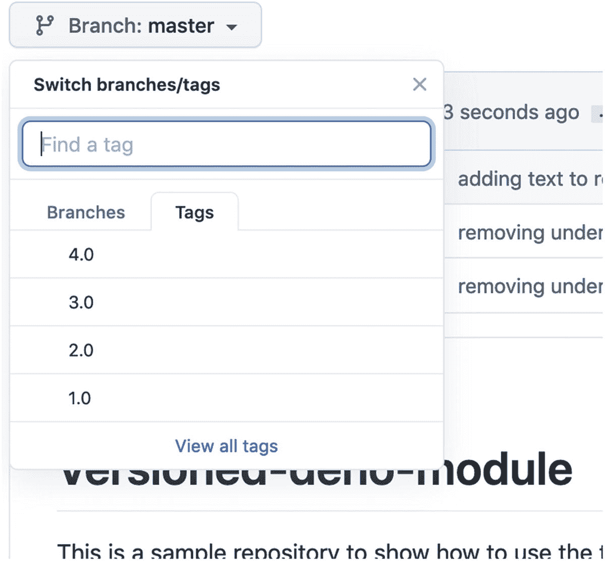
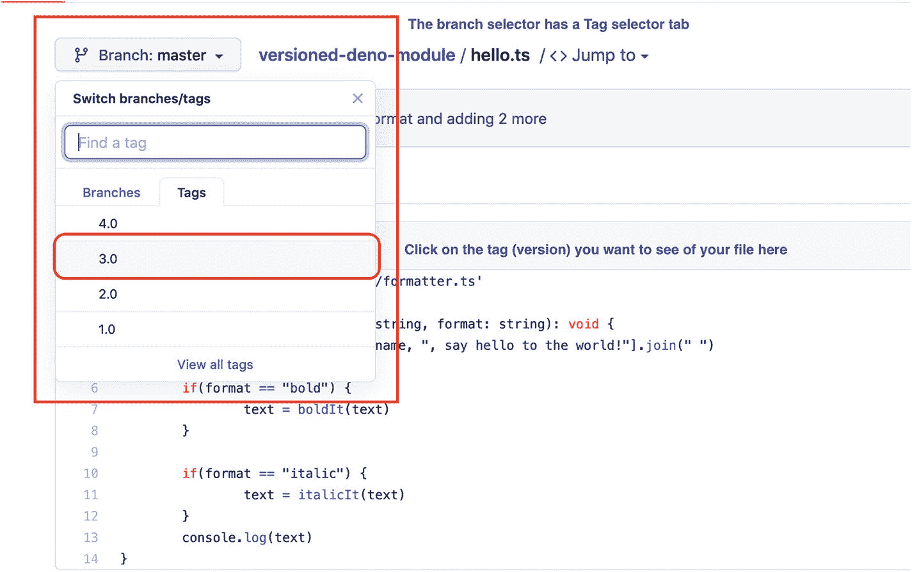
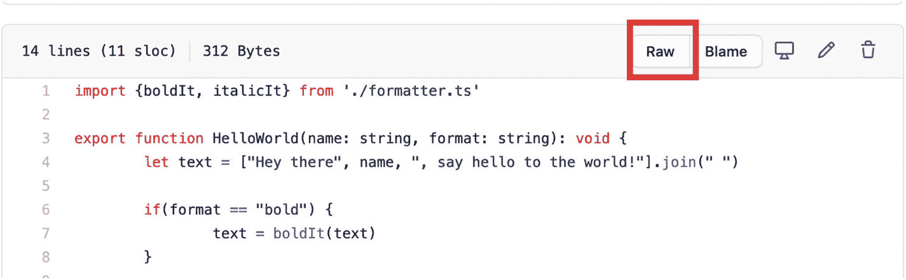

# 四、不再有 NPM

可以说，这是 Deno 引入后端 JavaScript 领域的最有争议的变化:缺少包管理器。老实说，这并不是说他们放弃了对 NPM 的支持，如果你不知道的话，它实际上是 Node.js 的包管理器。这是说他们完全放弃了包管理器的概念，让后端开发人员像浏览器一样处理依赖关系。

这是一个好方法吗？会不会打破整个生态系统，让 Deno 社区崩溃？我现在不告诉你；你得自己去阅读和观察！

这一章有很多东西要解开，我们开始吧，好吗？

## 处理外部模块

首先:外部模块仍然是一个东西，仅仅因为没有包管理器，并不意味着它们会消失；你还是要和他们打交道。这不仅仅是关于你自己的外部模块；毕竟，任何自尊的语言(或者在这种情况下更确切地说是运行时)都不能希望开发人员在每次开始新项目时突然决定重新发明轮子。存在外部开发的模块，您应该利用这一事实。

这就是为什么 Deno 放弃了`require`函数，并采用 ES 模块标准来导入模块。这对你来说意味着什么？嗯，你可能已经见过这种语法了；这并不新鲜，如果你来自前端或者过去使用过 TypeScript，你会看到它，现在你可以写了

```js
import functionname from 'package-url'

```

根据您需要从模块中提取的内容，`functionname`是其中之一，`package-url`是一个文件的完全合格的 URL 或本地路径，**包括它的扩展名**。没错；Deno 和 Node 的创造者 Ryan 决定放弃他在 Node 时代给我们的那个小小的语法方糖，因为现在*你可以直接导入 TypeScript 模块*。

你没看错。感谢 TS 现在是 Deno land 的一等公民，你再也不用担心为了导入而编译你的模块；您只需直接链接到它们，Deno 的内部组件会处理剩下的事情。

至于被导入的`functionname`,也有几种方式来编写，这取决于你在寻找什么以及模块如何导出它的函数。

如果您只是想从模块中导入一些函数，您可以直接提到它们:

```js
import _ from "https://deno.land/x/deno_lodash/mod.ts";

```

或者您甚至可以使用析构来直接指定您正在寻找的方法名:

```js
import { get, has} from "https://deno.land/x/deno_lodash/mod.ts";

```

这允许您保持当前名称空间的干净，谁知道您可能会导入和不使用多少名称。这也是让其他人清楚地了解您希望从外部库的使用中获得什么的好方法。

我们还可以做其他事情，比如在赋值期间使用`as`关键字重命名导入，或者使用`*`字符将整个名称空间直接导入到我们自己的名称空间中(如清单 [4-1](#PC4) 所示)。

```js
import * as MyModule from './mymodule.ts'
import { underline } from "https://deno.land/std@v0.39.0/fmt/colors.ts"

Listing 4-1Importing modules by renaming or by destructuring assignment

```

还要注意在我前面的两个例子中，我是如何从外部 URL 导入的。这是至关重要的，因为这是第一次后端 JavaScript 运行时允许我们这样做。我们引用的不是带有这些 URL 的本地模块，而是可能在我们控制范围之外的东西，是其他人在某个地方发布的东西，我们现在正在使用。

这是 Deno 不需要包管理器的关键。它不仅允许您从任何 URL 导入模块，而且还会在您第一次执行时将它们缓存在本地。这些都是自动为你做的，所以你真的不需要担心。

### 处理包裹

现在，我知道你在想什么:“从偏僻的地方导入模块？谁来确保我得到我需要的版本？如果网址关闭会发生什么？”

这些都是非常有效的问题，事实上，当公告发布时，我们都问过自己，但是不要担心，有答案！

#### 从偏僻的地方进口

如果您来自 Node.js，那么没有集中的包存储库这个事实听起来可能有点可怕。但是如果你仔细想想，一个分散的存储库消除了任何由于技术问题而不可用的可能性。相信我，在 npm 的最初几天，有时整个注册中心都会停机，如果你不得不将某些东西部署到生产环境中并依赖它，那么你就有麻烦了。

当然，现在已经不是这样了，但它也确实是一个私有的仓库，有一天可能会被关闭，这将影响到所有的项目。相反，Deno 试图从一开始就消除这个潜在的问题，并决定选择浏览器路线。毕竟，如果你曾经写过一些前端代码，或者曾经检查过一个网站的代码，你会注意到页面顶部的`script`标签，本质上是从不同的位置导入第三方代码。

而且就像浏览器一样，Deno 也会缓存那些库，这样你就不用每次执行脚本的时候都下载了；事实上，除非您特别使用`--reload`标志，否则您将不必再下载它们。默认情况下，这个缓存位于`DENO_DIR`中，如果没有在系统中定义为环境变量，可以在终端上使用`deno info`命令进行查询。例如，清单 [4-2](#PC5) 显示了我的本地系统中该命令的输出。

```js
DENO_DIR location: "/Users/fernandodoglio/Library/Caches/deno"
Remote modules cache: "/Users/fernandodoglio/Library/Caches/deno/deps"
TypeScript compiler cache: "/Users/fernandodoglio/Library/Caches/deno/gen"

Listing 4-2Output from the deno info command

```

现在，到目前为止，这至少听起来很有趣，但是考虑一个有数百个(如果不是更多的话)文件的大项目，这些文件从不同的位置导入模块。如果出于某种原因，它们中的一些突然改变位置(也许它们被迁移到不同的服务器上)，会发生什么呢？然后，您必须逐个文件地更新来自 import 语句的 URL。这与理想相差甚远，这就是 Deno 提供解决方案的原因。

类似于 Node.js 项目中的`package.json`文件，您可以在单个文件中导入所有内容；让我们称之为`deps.ts`，并从该文件中导出项目中需要的任何内容。这样，从你所有的文件中，你可以导入`deps.ts`文件。这种模式将保留一个集中的依赖项列表，这是对从任何地方直接导入 URL 的原始想法的巨大改进。清单 [4-3](#PC6) 展示了一个例子，展示了`deps.ts`文件的样子，以及如何从另一个文件中使用它。

```js
//deps.ts
export * as MyModule from './mymodule.ts'
export {underline} from "https://deno.land/std@v0.39.0/fmt/colors.ts"

//script.ts
import {underline} from './deps.ts'
console.log(underline("This is underlined!"))

Listing 4-3Centralizing the imports into a single file

```

#### 包版本呢？

在这里，版本控制也是一个值得关注的问题，因为在导入时，您只是指定了文件的 URL，而不是它的版本。还是你？再看清单[4-3](#PC6)；在那里，您可以看到第二个导出语句在 URL 中包含了一个版本。

这就是在基于 URL 的方案中处理版本控制的方式。当然，这不是来自 URL 或 HTTP 的一些晦涩难懂的特性；这只是在包含版本的 URL 下发布您的模块，或者使用某种形式的负载平衡规则从 URL 解析版本，并将请求重定向到正确的文件。

在发布 Deno 模块的同时，真的没有标准或硬性要求让你去实现；您必须确定的是提供某种版本控制方案。否则，你的用户将无法锁定一个特定的版本，相反，他们将总是下载最新的版本，不管它是否适合他们。

Caution

如您所见，Deno 的打包方案比 Node 的要简单得多，这是在前端复制一种已经使用多年的方法的有效尝试。也就是说，大多数后端语言都有一个更明确、也可能更复杂的打包系统，所以如果你希望与他人共享你的代码，就要转而使用 Deno，你必须记得以某种方式将版本包含在 URL *的一部分*中，否则你将为你的消费者提供非常糟糕的服务。

虽然这听起来可以理解，但现在的问题是:您真的必须拥有自己的 web 服务器，并以允许您将版本控制方案添加到 URL 中的方式配置它，以便您可以以合理的方式为 Deno 模块提供服务吗？不，你没有。事实上，如果你允许的话，已经有一个平台可以帮你做到这一点:GitHub。 <sup>[1](#Fn1)</sup>

如果你不熟悉它，GitHub 允许你发布你的代码并免费与他人分享；它与被称为 Git 的版本控制系统一起工作，在许多地方它几乎是一个行业标准。他们甚至有一个企业版，所以你甚至可以把它用于你公司的内部仓库。

关于 GitHub 有趣的事情是，他们使用包含 Git 标签或 Git 提交散列的 URL 方案来发布你的内容。尽管提交散列并不像人们所希望的那样“对人友好”(即`b265e725845805d0c6691abbe7169f1ada8c4645`)，但是您绝对可以使用标记名作为包的版本。

为了解释这一点，我创建了一个简单的公共存储库 <sup>[2](#Fn2)</sup> ，并使用四个不同的标签将一个简单的“HelloWorld”模块的四个不同版本发布到 GitHub 中，如图 [4-1](#Fig1) 所示。



图 4-1

GitHub 上示例模块的标签列表

现在，为了创建标签，你所要做的就是使用清单 [4-4](#PC7) 中的`git tag`命令。

```js
//... write your module until you're done with its 1st version
$ git add <your files here>
$ git commit -m <your commit message here>
$ git tag 1.0 //or however you wish you name your versions
$ git push origin 1.0

Listing 4-4Using Git to tag your module’s code

```

一旦这一切结束，代码被推送，你就可以进入 GitHub，选择模块的主文件，从屏幕左上象限的分支选择器中选择你想要包含的标签，如图 [4-2](#Fig2) 所示。



图 4-2

选择您想要的文件版本

一旦你选择了标签(版本)，你就可以点击对角的“Raw”按钮(页面代码部分的右上角)；这将在没有任何来自 GitHub 的 UI 的情况下打开文件，如果您查看 URL，您会看到版本已经是它的一部分(如果您找不到它，请查看图 [4-3](#Fig3) )。



图 4-3

在 GitHub 上获取我们文件的原始 URL

这样做会打开一个类似于 [`https://raw.githubusercontent.com/deleteman/versioned-deno-module/` `4.0` `/hello.ts`](https://raw.githubusercontent.com/deleteman/versioned-deno-module/4.0/hello.ts) 的 URL(注意粗体部分是 GitHub 添加标签名的地方；您可以更改它来引用其他版本，而不必更改任何其他内容)，然后您可以在代码中使用它来导入代码。

在这个过程中有两点需要注意:

1.  注意在图 [4-3](#Fig3) 的代码顶部，我是如何导入一个本地文件的。该文件也会被版本化，因此您不必担心可能存在的任何本地依赖性；如果链接到主模块文件的正确版本，它们都会被正确引用。

2.  在这个过程中，您实际上是将您的 Deno 模块发布到一个免费使用的 CDN 中，该 CDN 肯定会一直可用。不需要配置它或支付任何费用，只需担心你的代码和其他任何东西。事实上，由于 GitHub 的所有其他特性，您还获得了一些东西，比如当用户想要报告问题时的票证管理，当其他人想要为您的模块做贡献时的拉式请求控制，等等。尽管有其他的选择，你也可能有自己喜欢的 CDN，但在这种情况下，使用 GitHub 可能是一箭双雕的好方法。

##### 锁定依赖项的版本

理解 Deno 如何处理包的版本很大一部分是理解如何锁定它们。您看，对于任何打包方案，您都希望锁定依赖项的版本，以确保无论您在哪里部署代码，您都将始终使用相同的代码。否则，当部署到生产环境时，您可能会因为下载具有重大更改的模块的新版本而遇到问题。

这实际上是一个非常普遍的情况，没有经验的开发者认为链接到最新版本的包总是最好的；毕竟， *latest* 总是意味着“更多的 bug 被修复，更多的特性被发布。”当然，这是一种非常幼稚且有潜在危险的方法；毕竟，谁知道问题中的模块会随着时间的推移如何发展，以及哪些特性会被删除。依赖树的一个关键方面是它需要是幂等的，也就是说无论你部署它多少次，最终结果(也就是你得到的代码)总是一样的。

为了实现这个目标，Deno 提供了`--lock`和`--lock-write`标志。第一个标志让您指定锁文件驻留的位置，而第二个标志告诉解释器也将所有与锁相关的信息写入磁盘。这是你如何使用它们。

为了第一次创建锁文件，您必须使用两者，如下面的代码片段所示:

```js
$ deno run --lock=locks.json --lock-write script.ts

```

这一行的执行将生成一个 JSON 文件，其中包含树中所需的所有外部依赖项的校验和和版本信息。清单 [4-5](#PC9) 展示了该文件的一个例子。

```js
{
    "https://deno.land/std@v0.39.0/fmt/colors.ts": "e34eb7d7f71ef64732fb137bf95dc5a36382d99c66509c8cef1110e358819e90"
}

Listing 4-5Lockfile sample

```

将该文件作为存储库的一部分，您现在可以安全地部署到生产环境中，并告诉 Deno 对所有正在部署的依赖项始终使用完全相同的版本，如下面的代码片段所示:

```js
$ deno run --reload --lock-file=locks.json script.ts

```

注意，我在这里添加了一个新的标志:`--reload`。这是告诉 Deno 重新加载它的缓存，或者换句话说，使用`locks.json`文件作为指导重新下载依赖项。当然，这需要在部署后完成；脚本的后续执行不应该使用`--reload`标志。所以你可以做一些我在清单 [4-6](#PC11) 中展示的事情，不要把更新缓存和代码的实际执行混在一起。

```js
# Right after deployment
$ deno cache --reload --lock=locks.json deps.ts

# Executing your script

$ deno run --lock=locks.json script.ts

Listing 4-6Splitting the actions of updating the cache and executing the code

```

这里首先要注意的是，在第一行，我只是更新了缓存，没有执行一行代码。事实上，我甚至没有引用我的脚本文件；我引用的是依赖文件(`deps.ts`)。这里的第二个细节是，虽然我已经更新了缓存，但我仍然告诉 Deno 用 lockfile 执行脚本，但是为什么呢？

这是因为还有一件事可能出错，这个 lockfile 特性背后的团队也为您提供了一种检查它的方法:如果自从您上次在开发环境中使用它以来，您试图部署的模块版本的代码发生了变化，该怎么办？

有了一个为你控制一切的中央模块库(例如，阿拉 NPM)，这不会是一个问题，因为版本会自动更新，但这不是这里的情况。有了 Deno，我们给模块开发者每一盎司的自由去做他们想做的任何事情，当然包括更新代码而不自动改变版本号。

如果与没有提供锁文件的缓存更新操作(即没有使用`--lock`标志的`deno cache --reload`)相混合，将导致本地缓存与您过去开发时使用的缓存不完全一样。换句话说，您刚刚部署的机器的本地缓存中的代码与本地缓存中的代码并不完全相同，而且应该是相同的(至少是你们共享的模块的代码)。

这就是校验和发挥作用的地方。还记得清单 [4-5](#PC9) 中的散列吗？该代码将用于在执行脚本时检查该文件本地版本的哈希。如果两个散列不匹配，您将得到一个错误，脚本将不会被执行(如清单 [4-7](#PC12) 所示)。

```js
Subresource integrity check failed --lock=locks.json
https://deno.land/std@v0.39.0/fmt/colors.ts

Listing 4-7Integrity error for one of the dependencies

```

清单 [4-7](#PC12) 中显示的错误清楚地表明了 lockfile 中的一个依赖项存在完整性问题，然后给出了它的 URL。在这种情况下，它显示了颜色模块的问题。

#### 进行实验:使用导入贴图

到目前为止，显示的所有内容都可以在 Deno 的当前发布版本中开箱即用。但是对于这个特性，我们将不得不使用`--unstable`标志，因为这还没有完全完成，并且是一个实验性的特性。

导入映射允许您重新定义处理导入的方式。还记得我之前提到的`deps.ts`文件吗？还有另一种简化导入的方法，这样你就不必到处使用 URL，那就是定义这些 URL 和你可以使用的特定关键字之间的映射。

让我用一个例子来解释一下:在 Deno 标准模块的格式化模块中，有两个子模块，colors(我在本章的一些例子中使用过)和 printf。因此，如果您想使用它们，您必须使用两者的全限定 URL 将它们导入到您的代码中。但是有了导入地图，还有另外一种方法；您可以定义一个 JSON 文件，在其中创建我之前提到的映射，类似于清单 [4-8](#PC13) 。

```js
{
   "imports": {
      "fmt/": "https://deno.land/std@0.55.0/fmt/"
   }
}

Listing 4-8Example of an import map file

```

这样，您就可以使用清单 [4-9](#PC14) 中的代码行导入这两个模块的任何一个导出函数。

```js
import red from "fmt/colors.ts"
import printf from "fmt/printf.ts"

Listing 4-9Taking advantage of the import map

```

当然，这只有在您将`--unstable`标志与`--importmap`结合使用时才有效，如下所示:

```js
$ deno run --unstable --importmap=import_map.json myscript.ts

```

如果您来自 Node，那么这种方法一定非常熟悉，因为它与您处理`package.json`文件的方式非常相似。

您还可以使用 import map 做其他有趣的事情，例如通过将模块的无扩展版本映射到特定版本，或者为所有本地导入添加前缀，来消除向导入添加扩展的需求。参见清单 [4-10](#PC16) 中的例子。

```js
//import_map.json
{
"imports": {
  "fmt/": "https://deno.land/std@0.55.0/fmt/",
  "local/": "./src/libs/",
  "lodash/camelCase": "https://deno.land/x/lodash/camelCase.js"
  }
}

//myscript.ts
import {getCurrentTimeStamp} from 'local/currtime.ts'
import camelCase from 'lodash/camelCase'
import {bold, red} from 'fmt/colors.ts'

console.log(bold(camelCase("Using mapped local library: ")), red(getCurrentTimeStamp()))

Listing 4-10Using import mapping to simplify imports from your scripts

```

在清单 [4-10](#PC16) 的代码中，我们有几个导入映射可以提供什么的例子:

1.  将 URL 缩短为简单前缀的简化方法

2.  一种通过直接映射到模块的首选版本来消除扩展的方法

3.  一种简化本地文件夹结构的方法，通过将一个短前缀映射到我们目录结构中一个潜在的长路径

使用导入映射的唯一缺点，除了它还不是 100%稳定的明显事实之外，就是因为这个原因，像 VS Studio 这样的 ide 和它的插件不会考虑它，因此当实际上没有导入时会显示丢失导入的错误。

## 结论

第四章到此结束；希望到现在为止，您已经认识到缺少集中的模块库实际上并不是一件坏事。有一些简单的变通方法，提供了许多其他系统(如 NPM)为节点开发人员提供的功能，还可以让您对自己的模块做任何想做的事情。

当然，这也带来了额外的风险，即让开发人员随心所欲地使用他们的模块，所以如果您打算与 Deno 社区共享您的工作，请考虑这一点，并在发布您的工作之前采取所有可能的预防措施。

下一章将介绍 Deno 的标准库、一些最有趣的模块，以及如何在 Deno 代码中重用节点社区中其他人的工作，而不必重新发明轮子。

<aside aria-label="Footnotes" class="FootnoteSection" epub:type="footnotes">Footnotes [1](#Fn1_source)

[T2`https://github.com`](https://github.com)

  [2](#Fn2_source)

[T2`https://github.com/deleteman/versioned-deno-module`](https://github.com/deleteman/versioned-deno-module)

 </aside>