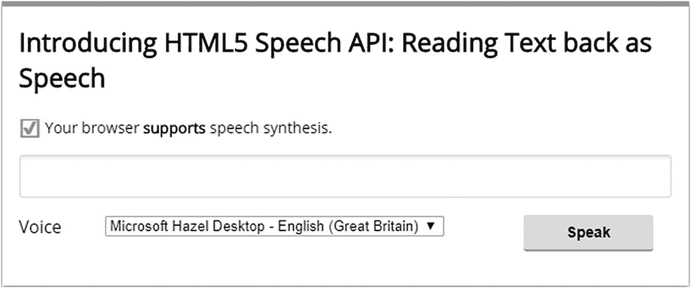
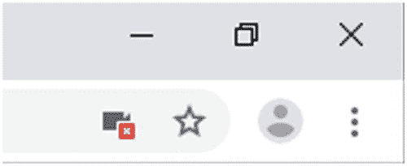
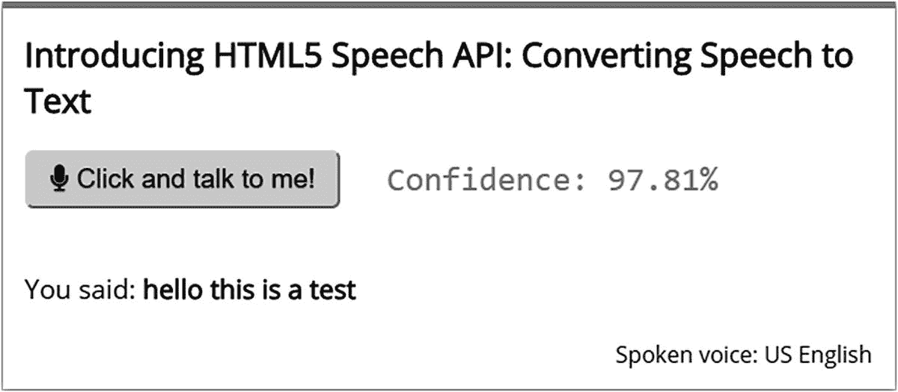
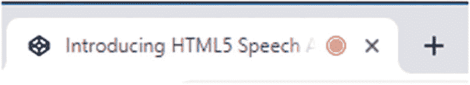
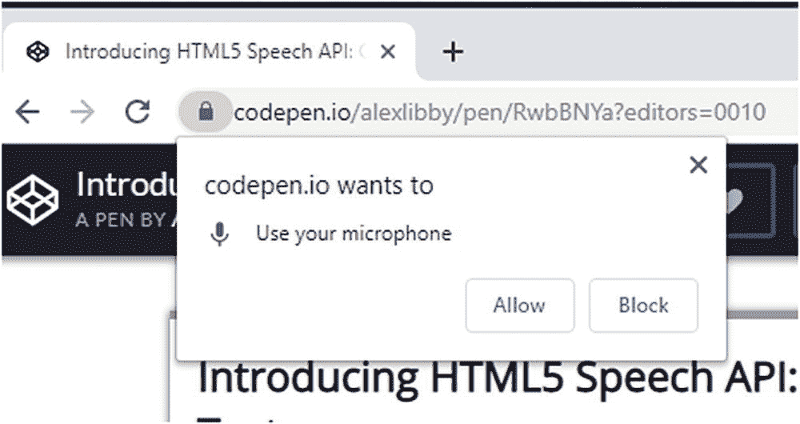
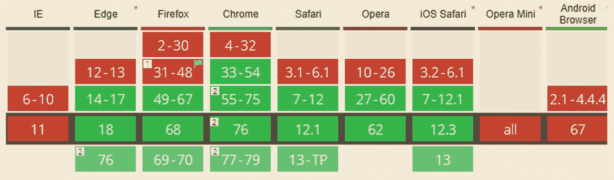
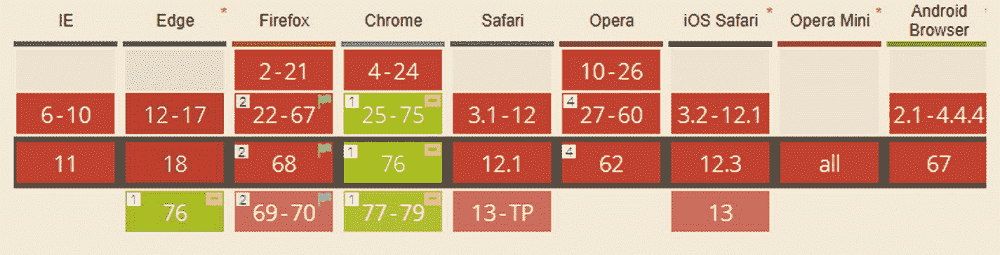

# 一、入门指南

## API 简介

> *“嘿 Alexa，几点了…？”*

在一个智能助理(SA)设备的时代，我敢打赌，这些话在世界范围内每天都会被说上几十次——无论在哪里；智能助手变得非常受欢迎。事实上，Juniper Research 预测，智能助理的数量将从 2018 年底的 25 亿增加到 2023 年的 80 亿。想象一下——通过语音改变电视频道(**已经成为可能**，仅这一项就有望在未来五年内增长 120%)或者只是做一些平凡的事情，比如从亚马逊之类的网站重新订购商品。

但是我跑题了。智能助手很棒，但是如果我们可以用它们来控制我们在线网站或应用的功能会怎么样呢？“怎么会？”我听到你问了。好吧，我来介绍一下 HTML5 语音 API 它使用与智能助手相同的原理，将语音转换为文本，反之亦然。它现在可以在浏览器中使用，尽管还有些实验性。

最初创建于 2012 年，但现在才真正全面投入使用，这种实验性的 API 可以通过语音的力量来执行各种不同的任务。如何使用它来将产品添加到购物车并支付它们——所有这些都通过语音远程完成？加入语音功能为我们打开了一些真正的可能性。在本书的整个过程中，我们将详细探索其中的一些，向您展示我们如何很好地使用这个 API。在我们这样做之前，有一点家务我们必须先处理。在我们继续这个 API 的旅程之前，让我们先把这个覆盖掉。

如果你想深入了解这个 API 是如何构建的，以及浏览器厂商必须遵循的标准，那么看看 W3C 在 [`https://wicg.github.io/speech-api/`](https://wicg.github.io/speech-api/) 为这个 API 制定的指导方针。当心——这会导致枯燥无味的阅读！

## 设置我们的开发环境

我很确定没有人喜欢 admin，但是在这个例子中，在使用 API 之前，我们必须执行几个任务。

别担心，它们很简单。这是我们需要做的:

*   该 API 只能在安全的 HTTPS 环境中工作(是的，甚至不要尝试在 HTTP 下运行它——它不能工作——这意味着我们需要一些安全的网络空间来用于我们的演示。有几种方法可以实现这一点:
    *   最简单的是使用 CodePen([`https://www.codepen.io`](https://www.codepen.io))——你将需要创建一个帐户来保存工作，但如果你还没有一个可以使用的帐户，注册是免费的。

    *   你有其他项目可以临时使用的网络空间吗？只要它能在 HTTPS 的统治下得到保障，那么这将对我们的演示起作用。

    *   如果您碰巧是使用 MS tech stack 的开发人员，您可以创建一个 ASP.Net 核心 web 应用，选择“为 HTTPS 配置”,并在运行该应用时，在提示信任自签名证书时单击“确定”。这将很好地适用于本书中的演示。

    *   你可以试着运行一个本地的网络服务器——网上有很多。我个人最喜欢的是 MAMP PRO，可从 [`https://www.mamp.info`](https://www.mamp.info) 买到。这是一个在 Windows 和 Mac 上运行的付费选项；这使得生成我们需要使用的 SSL 证书变得轻而易举。或者，如果您安装了 Node.js 之类的程序，那么您可以使用一个本地 web 服务器( [`https://github.com/lwsjs/local-web-server`](https://github.com/lwsjs/local-web-server) )，或者创建自己的程序。您需要为它创建一个证书，并将其添加到您的证书库中——创建证书的简便方法在 [`https://bit.ly/30RjAD0`](https://bit.ly/30RjAD0) 中有所介绍。

*   下一个重要任务是准备一个合适的麦克风——毕竟，没有麦克风我们显然走不远！你可能已经有一个了；如果没有，几乎任何麦克风都可以正常工作。我个人倾向于使用麦克风/耳机组合，就像通过 Skype 通话一样。你应该可以通过亚马逊或者当地的音像店买到相对便宜的。

**注意一点**如果你是笔记本电脑用户，那么你可以使用笔记本电脑内置的任何麦克风。缺点是接收效果不会很好——你可能会发现自己不得不非常前倾才能获得最好的接收效果！

*   对于我们所有的演示，我们将使用一个中心项目文件夹——出于本书的目的，我将假设您已经创建了一个名为 speech 的文件夹，它存储在您的 C: drive 的根目录下。确切的位置并不重要；如果您选择了不同的位置，那么当我们来完成演示时，您需要相应地调整位置。

太棒了。现在没有了管理员，我们可以专注于有趣的事情了！HTML5 Speech API(或“API”)由两部分组成:第一部分是 **SpeechSynthesis API** ，它负责将任何给定的文本作为语音复述出来。第二，相比之下——套用一句话——**演讲识别 API** 做的和它名字里说的差不多。我们可以说出一个短语，如果它与预先配置好的文本相匹配，它就可以执行我们在收到该短语时分配的任何数量的任务。

我们可以深入了解它们是如何工作的，但我知道你渴望深入了解，对吗？绝对的。所以事不宜迟，让我们快速演示两次，这样在本书后面的项目中使用 API 之前，您就可以了解它是如何工作的。

不要担心这意味着什么——我们绝对会在每次练习后详细研究代码！我们将依次研究这两者，首先从 SpeechSynthesis API 开始。

## 实现我们的第一个示例

尽管这两种 API 都需要一点配置才能工作，但它们相对容易设置；两者都不需要使用任何特定的框架或外部库来进行基本操作。

为了理解我的意思，我用 CodePen 做了两个快速演示——它们演示了入门所需的基础知识，并将形成我们将在本书后面的项目中使用的代码。让我们依次看一下每一个，从使用 SpeechSynthesis API 将文本作为语音读回开始。

### 将文本作为语音回读

我们的第一个练习将保持简单，并使用 CodePen 来托管我们的代码；为此，如果您想保存您的工作以供将来参考，您需要创建一个帐户。如果你以前没有用过 CodePen，那么不要担心——它是免费注册的！这是开始使用 API 的好方法。在随后的演示中，我们将使用一些更具本地特色的东西。

本书示例中使用的所有代码都可以在本书附带的代码下载中找到。我们将在大多数演示中混合使用 ECMAScript 2015 和普通 JavaScript 如果您想使用 ECMAScript 的新版本，可能需要进行调整。

Reading Back Text

假设你已经注册了，现在有一个可以使用的 CodePen 帐户，让我们开始创建我们的第一个例子:



图 1-1

我们完整的文本到语音转换演示

1.  首先，打开你的浏览器，然后导航到 [`https://codepen.io`](https://codepen.io) ，用你的账户信息登录。完成后，点击左边的笔来创建我们的演示。

2.  我们需要为这个演示添加标记——为此，继续将以下代码添加到 HTML 窗口:

    ```html
    <link href="https://fonts.googleapis.com/css?family=Open+Sans&display=swap" rel="stylesheet">

    <div id="page-wrapper">
      <h2>Introducing HTML5 Speech API: Reading Text back as Speech</h2>
      <p id="msg"></p>
      <input type="text" name="speech-msg" id="speech-msg">
      <div class="option">
        <label for="voice">Voice</label>
        <select name="voice" id="voice"></select>
        <button id="speak">Speak</button>
      </div>
    </div>

    ```

3.  如果我们现在运行它，我们的演示将看起来非常普通——更不用说它实际上不会像预期的那样工作了！我们可以轻松解决这个问题。让我们首先添加一些基本的风格，使我们的演示更像样。有几个样式要添加进去，所以我们将一个块一个块地做。在每个块之间留一条线，当你把它加入到演示中:

    ```html
    *, *:before, *:after { box-sizing: border-box; }

    html { font-family: 'Open Sans', sans-serif; font-size: 100%; }

    #page-wrapper { width: 640px; background: #ffffff; padding: 16px; margin: 32px auto; border-top: 5px solid #9d9d9d; box-shadow: 0 2px 10px rgba(0,0,0,0.8); }

    h2 { margin-top: 0; }

    ```

4.  我们需要添加一些样式来表明我们的浏览器是否支持 API:

    ```html
    #msg { font-size: 14px; line-height: 22px; }
    #msg.not-supported strong { color: #cc0000; }
    #msg > span { font-size: 24px; vertical-align: bottom; }
    #msg > span.ok { color: #00ff00; }
    #msg > span.notok { color: #ff0000; }

    ```

5.  接下来是声音下拉菜单的样式:

    ```html
    #voice { margin: 0 70px 0 -70px; vertical-align: super; }

    ```

6.  对于 API 来说，我们需要有一种输入文本的方法来将它转换成语音。为此，添加以下样式规则:

    ```html
    input[type="text"] { width: 100%; padding: 8px; font-size: 19px;
    border-radius: 3px; border: 1px solid #d9d9d9; box-shadow: 0 2px 3px rgba(0,0,0,0.1) inset; }

    label { display: inline-block; float: left; width: 150px; }

    .option { margin: 16px 0; }

    ```

7.  样式的最后一个元素是演示右下角的 Speak 按钮:

    ```html
    button { display: inline-block; border-radius: 3px; border: none; font-size: 14px; padding: 8px 12px; background: #dcdcdc;
    border-bottom: 2px solid #9d9d9d; color: #000000; -webkit-font-smoothing: antialiased; font-weight: bold; margin: 0; width: 20%; text-align: center; }

    button:hover, button:focus { opacity: 0.75; cursor: pointer; }
    button:active { opacity: 1; box-shadow: 0 -3px 10px rgba(0, 0, 0, 0.1) inset; }

    ```

8.  有了合适的样式，我们现在可以把注意力转移到添加胶水上了。我不是指字面上的意思，而是比喻意义上的！我们需要添加的所有代码都在 CodePen 的 JS 窗口中；我们首先检查我们的浏览器是否支持 API:

    ```html
    var supportMsg = document.getElementById('msg');

    if ('speechSynthesis' in window) {
      supportMsg.innerHTML = '<span class="ok">☑</span> Your browser <strong>supports</strong> speech synthesis.';
    } else {
      supportMsg.innerHTML = '<span class="notok">☒</span> Sorry your browser <strong>does not support</strong> speech synthesis.';
      supportMsg.classList.add('not-supported');
    }

    ```

9.  接下来，我们定义三个变量来存储对演示中元素的引用:

    ```html
    var button = document.getElementById('speak');
    var speechMsgInput = document.getElementById('speech-msg');
    var voiceSelect = document.getElementById('voice');

    ```

10.  当使用 API 时，我们可以使用各种不同的声音来回放语音——我们需要在使用它们之前将它们加载到我们的演示中。为此，继续添加以下几行:

    ```html
    function loadVoices() {
      var voices = speechSynthesis.getVoices();

      voices.forEach(function(voice, i) {
        var option = document.createElement('option');
        option.value = voice.name;
        option.innerHTML = voice.name;
        voiceSelect.appendChild(option);
      });
    }

    loadVoices();

    window.speechSynthesis.onvoiceschanged = function(e) {
      loadVoices();
    };

    ```

11.  我们开始演示的真正内容——这是我们看到我们添加的文本被转换成语音的地方！为此，在前一个块之后留下一行，并添加以下代码:

    ```html
    function speak(text) {
      var msg = new SpeechSynthesisUtterance();
      msg.text = text;

      if (voiceSelect.value) {
        msg.voice = speechSynthesis.getVoices()
    .filter(function(voice) {
          return voice.name == voiceSelect.value;
          })[0];
      }

      window.speechSynthesis.speak(msg);
    }

    ```

12.  我们快到了。最后一步是添加一个事件处理程序，当我们点击 Speak 按钮时，这个事件处理程序触发从文本到语音的转换:

    ```html
    button.addEventListener('click', function(e) {
      if (speechMsgInput.value.length > 0) {
        speak(speechMsgInput.value);
      }
    });

    ```

13.  继续保存您的工作。如果一切正常，我们应该会看到类似于图 1-1 所示的截图。

试着输入一些文本，然后点击语音按钮。如果一切按预期进行，那么你会听到有人向你复述你的话。如果你从下拉列表中选择一个声音，你会听到你的话带着口音说回来；根据你输入的内容，你会得到一些非常有趣的结果！

这个演示的完整版本可以在本书附带的代码下载中找到——它在`readingback`文件夹中。

在这个阶段，我们现在已经有了基本的设置，允许我们的浏览器读回我们想要的任何文本——当然这听起来可能还是有点机械。然而，当使用一个仍然是实验性的 API 时，这是可以预料的！

除此之外，我敢打赌你的脑海中有两个问题:这个 API 是如何工作的？更重要的是，即使它在技术上仍然是一个非官方的 API，它仍然可以安全使用吗？不要担心——这些问题以及更多问题的答案将在本章稍后揭晓。让我们首先更详细地探讨一下我们的演示是如何工作的。

#### 了解发生了什么

如果我们仔细看看我们的代码，你可能会觉得它看起来有点复杂——但实际上，它非常简单。

我们从一些简单的 HTML 标记和样式开始，在屏幕上显示一个输入框，用于播放内容。我们还有一个下拉菜单，我们将使用它来列出可用的声音。真正神奇的事情发生在我们使用的脚本中——首先执行检查，看看我们的浏览器是否支持 API，并显示合适的消息。

假设您的浏览器支持 API(过去 3-4 年的大多数浏览器都支持)，那么我们为页面上的各种元素定义一些占位符变量。然后，在用结果填充下拉菜单之前，我们(通过`loadVoices()`函数)遍历可用的声音。特别值得注意的是对`loadVoices()`的第二次调用；这是必要的，因为 Chrome 异步加载它们。

值得注意的是，额外的声音(以“Chrome…”开头)是作为与谷歌交互的 API 的一部分添加的，因此只出现在 Chrome 中。

如果我们跳到演示的结尾，我们可以看到按钮元素的事件处理程序；这将调用`speak()`函数，该函数创建一个新的`SpeechSynthesisUtterance()`对象的发声，作为一个发言请求。然后它会检查以确保我们选择了一种声音，这是通过使用`speechSynthesis.getVoices()`功能完成的。如果选择了一种声音，那么 API 会将该声音排队，并通过 PC 的扬声器以音频的形式呈现出来。

好吧，我们继续。我们已经探索了如何将文本呈现为语音的基础。然而这只是故事的一半。如何将口头内容转换成文本？我们可以通过使用 SpeechRecognition API 来做到这一点——这需要更多一点的努力，所以让我们进入两个演示中的第二个，看看让我们的笔记本电脑说话涉及到什么。

### 将语音转换为文本

通过我们电脑的扬声器(甚至是耳机)来表达内容的能力当然是有用的，但是有一点局限性。如果我们可以让浏览器使用我们的声音来执行一些事情，会怎么样？我们可以使用两个语音 API 中的第二个来实现。我来介绍一下 SpeechRecognition API！

这个姊妹 API 允许我们对着任何连接到 PC 的麦克风说话，让我们的浏览器执行任何方式的预配置任务，从简单的转录任务到搜索离您给定位置最近的餐馆。我们将在本书的后面探索如何在项目中使用这个 API 的一些例子，但是现在，让我们实现一个简单的演示，这样您就可以看到 API 是如何工作的。

当处理使用语音识别 API 的演示时，我不推荐使用 Firefox 尽管 Mozilla Developer Network (MDN)站点上的文档表明它是受支持的，但事实并非如此，您很可能会在控制台日志中出现“speech recognition is not a constructor”错误。

“What Did I Say?”

让我们继续下一个练习:

1.  我们首先浏览到 [`https://www.codepen.io`](https://www.codepen.io) ，然后点击笔。确保您已经使用在第一个练习中创建的帐户登录。

2.  我们的演示使用了字体 Awesome 作为麦克风图标，您将很快看到它的使用——为此，我们需要添加两个 CSS 库的引用。继续并点击设置➤ CSS。然后在对话框底部的备用槽中添加以下链接:

    ```html
    https://use.fontawesome.com/releases/v5.0.8/css/fontawesome.css
    https://use.fontawesome.com/releases/v5.0.8/css/solid.css

    ```

3.  接下来，切换到 HTML 窗格，添加以下标记，这将构成我们演示的基础:

    ```html
    <link href="https://fonts.googleapis.com/css?family=Open+Sans&display=swap" rel="stylesheet">

    <div id="page-wrapper">
      <h2>Introducing HTML5 Speech API: Converting Speech to Text</h2>

      <button>
        <i class="fa fa-microphone"></i> Click and talk to me!
      </button>
      <div class="response">
        <span class="output_log"></span>
      </div>

      <p class="output">You said: <strong class="output_result"></strong></p>
      <span class="voice">Spoken voice: US English</span>
    </div>

    ```

4.  就其本身而言，我们的标记肯定不会赢得任何风格方面的奖项！为了解决这个问题，我们需要添加一些样式，使我们的演示看起来像样。为此，将以下规则添加到 CSS 窗格中，从一些基本规则开始，为我们的演示设置容器的样式:

    ```html
    *, *:before, *:after { box-sizing: border-box; }
    html { font-family: 'Open Sans', sans-serif; font-size: 100%; }

    #page-wrapper { width: 640px; background: #ffffff; padding: 16px; margin: 32px auto; border-top: 5px solid #9d9d9d; box-shadow: 0 2px 10px rgba(0,0,0,0.8); }

    h2 { margin-top: 0; }

    ```

5.  接下来是我们需要设计通话按钮的规则:

    ```html
    button { color: #0000000; background: #dcdcdc; border-radius: 6px; text-shadow: 0 1px 1px rgba(0, 0, 0, 0.2); font-size: 19px; padding: 8px 16px; margin-right: 15px; }
    button:focus { outline: 0; }

    input[type=text] { border-radius: 6px; font-size: 19px; padding: 8px; box-shadow: inset 0 0 5px #666; width: 300px; margin-bottom: 8px; }

    ```

6.  我们的下一个规则利用字体 Awesome 在通话按钮上显示一个合适的麦克风图标:

    ```html
    .fa-microphone:before { content: "\f130"; }

    ```

7.  一旦输出被转录，下一组规则将对输出进行样式化，以及置信度和所使用的声音特征:

    ```html
    .output_log { font-family: monospace; font-size: 24px; color: #999; display: inline-block; }
    .output { height: 50px; font-size: 19px; color: #000000; margin-top: 30px; }

    .response { padding-left: 260px; margin-top: -35px; height: 50px}
    .voice { float: right; margin-top: -20px; }

    ```

8.  好了，我们有了标记，看起来还不错。少了什么？啊，是的，让这一切工作的脚本！为此，继续将以下代码添加到 JS 窗格中。我们有一大块代码，所以让我们从一些变量声明开始，一个块一个块地分解它:

    ```html
    'use strict';

    const log = document.querySelector('.output_log');
    const output = document.querySelector('.output_result');

    const SpeechRecognition = window.SpeechRecognition || window.webkitSpeechRecognition;
    const recognition = new SpeechRecognition();

    recognition.interimResults = true;
    recognition.maxAlternatives = 1;

    ```

9.  接下来是触发麦克风的事件处理程序。留下一个空行，然后添加以下代码:

    ```html
    document.querySelector('button').addEventListener('click', () => {
      let recogLang = 'en-US';
      recognition.lang = recogLang.value;
      recognition.start();
    });

    ```

10.  当使用语音识别 API 时，我们触发了许多我们必须响应的事件；第一个识别我们何时开始说话。继续将下面几行添加到我们的 CodePen 演示的 JS 窗格中:

    ```html
    recognition.addEventListener('speechstart', () => {
      log.textContent = 'Speech has been detected.';
    });

    ```

11.  留下一个空行，然后添加这些行——这个事件处理程序负责识别和记录我们对麦克风说的任何话，并计算准确性的置信水平:

    ```html
    recognition.addEventListener('result', (e) => {
      log.textContent = 'Result has been detected.';

      let last = e.results.length - 1;
      let text = e.results[last][0].transcript;

      output.textContent = text;

      log.textContent = 'Confidence: ' + (e.results[0][0].confidence * 100).toFixed(2) + "%";
    });

    ```

12.  我们差不多完成了，但是还需要添加两个事件处理程序——它们负责在我们完成时关闭识别 API，并在屏幕上显示任何可能出现的错误。留下一行然后放入下面的代码:

    ```html
    recognition.addEventListener('speechend', () => {
      recognition.stop();
    });

    recognition.addEventListener('error', (e) => {
      output.textContent = 'Error: ' + e.error;
    });

    ```

13.  至此，我们完成了代码编辑。继续并点击保存按钮来保存我们的工作。

这个演示的完整版本可以在本书附带的代码下载中找到——它在`whatdidIsay`文件夹中。

在这一点上，我们应该可以运行我们的演示了，但是如果您这样做，很可能您不会得到任何响应。怎么会这样原因很简单，我们必须在浏览器中授权使用我们电脑的麦克风。可以通过网站证书细节中的设置条目来激活它，但这不是最干净的方法。有一种更好的方法来提示访问，我将在下一个练习中演示。

### 允许使用麦克风

使用 Speech API 时，有一件事我们必须记住——出于安全原因，默认情况下对麦克风的访问是禁用的；在使用它之前，我们必须明确地启用它。

这很容易做到，尽管具体步骤会因浏览器而异——它涉及到在我们的演示中添加几行代码来请求访问麦克风，并根据提示更改设置。我们将在下一个练习中看到如何做到这一点，假设您使用 Chrome 作为浏览器。

Adjusting Permissions

让我们开始设置权限:

1.  点击它。确保选择了“总是允许[`https://codepen.io`](https://codepen.io)……”选项。然后单击完成。

2.  刷新窗口。图标将变为纯黑色，不显示禁止的十字符号。

1.  首先，在 Chrome 中浏览麦克风设置，你可以通过`chrome://settings/content/microphone`进入。确保“访问前询问…”的滑块位于右侧。

2.  在单独的选项卡中，切换回您在上一个练习中创建的 CodePen 中的 SpeechRecognition API 演示。寻找这一行:

    ```html
    const output = document.querySelector('.output_result');

    ```

3.  在它下面留一行空白，然后加入这个代码:

    ```html
    navigator.mediaDevices.getUserMedia({ audio: true }).then(function(stream) {

    ```

4.  向下滚动代码，直到到达末尾。然后添加这一小块代码:

    ```html
      })
    .catch(function(err) {
      console.log(err);
    });

    ```

5.  接下来，单击 JS 窗格最右边的下拉箭头。当它弹出的时候，你会看到一个关于 Tidy JS 的条目。单击它可以正确地重新格式化代码。

6.  Save the update and then refresh the page. If all is well, you will see an icon appear at the end of the address bar (Figure 1-2).

    

    图 1-2

    麦克风支持已被添加，但被禁用…

尝试点击“点击和我说话！”按钮，然后对着麦克风说话。如果一切正常，我们应该会看到类似于图 1-3 所示的屏幕截图，其中显示了口语测试短语的结果，以及置信度。



图 1-3

对着我们的麦克风说话的结果…

交谈时，您是否注意到红点/圆圈是如何出现在浏览器窗口选项卡中的(如背页图 1-4 所示)？这表示麦克风处于活动状态，将录制任何语音。



图 1-4

红点表示活跃的麦克风

如果我们点击“点击和我说话！”按钮，这个红色的圆形图标将会消失，表示麦克风已经关闭。在我们之前的演示中，我们利用了`navigator.mediaDevices.getUserMedia()`来实现这一点——这是我们在任何实现语音的站点都必须做的事情，因为我们不能确定用户是否已经启用了他们的麦克风！

如果你想了解更多关于使用`navigator.mediaDevices.getUserMedia()`的知识，在 Mozilla 开发者网站 [`https://developer.mozilla.org/en-US/docs/Web/API/MediaDevices/getUserMedia`](https://developer.mozilla.org/en-US/docs/Web/API/MediaDevices/getUserMedia) 上有一篇有用的文章。

### 设置访问:一种替代方法

然而(就像生活中的许多事情一样)，有一种不同的方式来破解这个难题；它不需要代码，但是它不是一个干净的方法。这涉及到像我们以前一样设置正确的权限，但这次是去一个我们知道可以使用麦克风的站点。

Enabling the Microphone: An Alternative Method

这种方法假设使用 Chrome，尽管 Firefox 和其他浏览器也可能使用类似的方法:



图 1-5

从浏览器请求访问麦克风

1.  在单独的选项卡中，浏览到`chrome://settings/content/siteDetails?site=https%3A%2F%2Fcodepen.io`，然后确保麦克风的条目设置为“询问”。

2.  返回到运行 CodePen 演示的选项卡，并刷新窗口。您应该会看到一个提示，如图 1-5 所示。

在最后几页中，我们做了三个练习。重要的是要注意，当使用这个 API 时，需要做一些额外的工作。除了发起对 API 的请求之外，我们还必须添加代码来启用对麦克风的访问。稍后我们将再次讨论使用它的主题(和安全含义),但是现在，让我们更详细地回顾一下我们在前两个练习中使用的代码。

#### 打破我们的代码

和前面的文本到语音转换演示一样，我们从一些基本的标记和样式开始，给我们一个按钮，我们可以用它来激活记录我们的声音，以及两个占位符槽，用于转换后的文本和置信度。

然而，神奇之处在于我们添加的 JavaScript 代码。我们首先在标记中定义对`.output_`元素的引用。接下来，我们定义`window.SpeechRecognition``as a reference to the API`；请注意，我们将它设置为 OR 语句，以确保涵盖那些仍然需要供应商前缀支持的浏览器。作为其中的一部分，我们还设置了两个属性:`recognition.interimResults`设置为 true，以便在从语音转换成文本时显示文本。另一个是`recognition.maxAlternatives`，设置为 1，当语音识别服务识别出它时，最多显示一个备选单词。

值得注意的是，我们的大部分 JavaScript 代码将被封装在一个`navigator.mediaDevices.getUserMedia()`块中，所以一旦我们启用了对麦克风的访问，它就会运行。

然后，我们的代码包含一组事件处理程序，以识别不同的事件:第一个事件是通过单击“单击并和我说话！”按钮。这将设置要使用的语言(美国英语)并启动识别服务。第二个事件处理程序`speechstart`，负责识别我们何时开始说话，并记录任何说话的内容。最后两个(`result`和`error`)在我们停止讲话或出现错误时被触发，比如对麦克风的访问被阻止。在这个扩展演示的最后部分，我们将探索启用麦克风的几个选项；我们讨论代码路径如何对用户更好。

好吧，我们继续。现在我们已经了解了这两个 API，是时候深入研究一些理论了，看看这些 API 是如何工作的！我们将在下一章更详细地检查每个 API，但是现在，让我们回答两个关键问题:这些 API 支持得如何(我能提供后备支持吗)？如何管理远程访问他人麦克风的安全隐患？

### 允许浏览器支持

回想一下本章的开头——还记得我提到的“实验 API”这个词吗？是的，不得不说，这些 API 还没有达到官方的地位。然而，在你跑到山上思考“我让自己进来是为了什么？”，没有听起来那么糟糕！让我解释一下我的意思。

诚然，该 API 仍处于试验阶段——我们可以通过仔细的研究来考虑这一点，并在我们只是增强现有服务而不是取代它的基础上工作。首先，我们的第一站应该是像 CanIUse.com 这样的网站；快速检查表明，SpeechSynthesis API 具有出色的支持，至少在桌面上是如此(图 1-6 )。



图 1-6

语音合成 API 的浏览器支持

相比之下，对语音识别 API 的支持就不那么先进了，如图 1-7 所示。



图 1-7

浏览器对语音识别 API 的支持

来源:[`cani use . com/# search = speech`](https://caniuse.com/%2523search%253Dspeech)

我们可以清楚地看到，对语音合成 API 的支持没有那么先进，但是图表隐藏了一个秘密:Safari 确实支持这两种 API！虽然像 CanIUse.com 这样的网站是一个很好的起点，但它的准确性取决于它所基于的信息。尽可能多地检查每个浏览器供应商的支持确实是值得的；否则，我们可能会将未来的财务信息建立在不准确的信息上。

现在，我听到你问，“移动呢？”对这两种 API 的支持仍在开发中；虽然它尚未扩展到所有平台，但它涵盖了 Android(Chrome 和 Firefox)和三星的主要平台。

既然我们知道了每个浏览器提供的支持级别，那么那些不支持任何一种 API 的浏览器呢？有没有后备方案或我们可以使用的其他替代方案…？

#### 提供后备支持

在讨论结束时，这两个问题的答案并不像我们希望的那样简单。让我解释一下我的意思。

这个问题的核心在于重要的一点——语音合成 API 依赖于使用谷歌的神经人工智能能力来解码文本，并以选定的风格将文本作为语音返回。那么这对我们意味着什么呢？对谷歌合成 API 的依赖意味着支持将仅限于较新的浏览器；这涵盖了除 IE 之外的所有最新的桌面浏览器。对于那些支持移动设备的人来说，它只适用于 Android 的 Chrome 或 Firefox，三星互联网和两个较小的专业浏览器。

目前，从严格意义上来说，确实没有合适的退路。虽然对一些人来说这可能令人失望，但有一种观点认为，在浏览器支持方面，我们应该向前看，而不是向后看。IE 不支持语音合成 API 对很多人来说并不奇怪；那些不支持该 API 的移动平台(如 Android 浏览器)加起来占总使用量的 5%左右，因此这可以放心地打折扣。同样有一种观点认为，我们不应该依赖 API 来获得我们站点或应用的核心功能；语音提供应该增强基本服务，而不是取代它。

如果我们切换到语音识别 API，支持就是另一回事了——支持仍然处于初级阶段。它仅限于桌面支持的 Edge、Firefox 和 Chrome 的最新版本；移动世界的大部分支持都落在了 Android 平台的 Chrome 上。同样的观点也适用于展望未来；诸如语音之类的 API 应该被看作是一种逐渐增强体验的工具。

谈到渐进式改进，我们可以考虑几个选项。这些是

*   responsive voice–这是一项商业服务，可从 [`https://responsivevoice.com`](https://responsivevoice.com) 获得；它提供了额外的支持，如更好的导航可访问性，但这需要每月 39 美元的价格，这将需要考虑到任何运营成本。

*   Annyang 是 Tal Ater 的免费库，旨在让语音识别 API 更容易使用；这是在麻省理工学院许可下从 [`https://www.talater.com/annyang/`](https://www.talater.com/annyang/) 获得的。

但是这些方法的缺点是它们只能逐步增强已经支持 API 的浏览器所提供的服务；这为我们应该鼓励人们尽可能使用更新的浏览器的观点增加了额外的份量！

### 了解安全问题

在本章的过程中，我们已经第一次了解了 Speech API，并了解了它的基本工作原理。然而，我确信(和任何新技术一样)有一个迫切的问题我们还没有问:安全和隐私呢？随着现在生效的全欧洲范围的 GDPR 立法的存在，隐私问题已经成为突出的问题；这并不比使用语音 API 更重要。

主要考虑的是在使用语音 API 时获得使用麦克风的许可；过去，每当在不安全的 HTTP 环境中发出请求时，都会出现这种情况。曾几何时，这是不必要的，但可疑的网站开始利用广告和诈骗。因此，谷歌(现在还有其他公司)强制要求在 HTTPS 安全的环境中使用 API，并且使用麦克风的许可必须由用户明确给出。

如果您想了解这方面的技术原因，详细信息请参见关于此漏洞的官方错误报告，该报告列在 [`https://bugs.chromium.org/p/chromium/issues/detail?id=812767`](https://bugs.chromium.org/p/chromium/issues/detail%253Fid%253D812767)

作为一个用户，在一个完全安全的网站上，在音频被捕获之前，你可能只被要求一次许可；在页面刷新之前，同一会话中的后续使用将使用相同的权限。对于一些人来说，这可能被视为一个漏洞，因为一个安全的网页可以有效地记录任何内容，一旦它被授权。这是由于 Chrome API 与谷歌交互的事实，所以不会停留在你的浏览器范围内！

那么，我们能做些什么来帮助维护我们的安全和隐私呢？使用 API 时，我们需要记住几件事:

*   尽管 Chrome 中使用语音识别 API 的任何页面都可以与谷歌进行交互，但发送给谷歌的唯一信息是音频记录、网站的域、默认浏览器语言和网站的当前语言设置(不发送 cookies)。如果在不同的浏览器中使用语音识别 API，它不会与 Google 交互。

*   如果您正在使用语音识别 API，请确保您没有创建任何包含敏感信息的事件处理程序，这些信息可能会被发送到 Google。理想情况下，这些信息应该存储在本地，发送的任何命令实际上都是打开访问的钥匙。

*   整个页面都可以访问音频捕获的输出，因此，如果您的页面或站点受到威胁，可以读取音频实例中的数据。这使得我们有责任确保访问安全(这已经成为许多网站的默认设置)，同时也确保我们在适当安全和更新的服务器上使用高质量的证书。

*   API(尤其是语音识别 API)仍然处于不断变化的状态；谷歌的角色有可能在未来某个时候发生变化或被终止。在 W3C 正式认可在浏览器中使用 API 之前，任何东西都不能被认为是官方的。

*   此时，我建议仔细检查你网站的分析，探索哪些浏览器支持这个 API。如果有足够的需求，那么你可以考虑开始添加功能，但正如前面提到的，我强烈建议采取谨慎和有分寸的方法，以便为客户保持良好的体验。

好吧，确实有些值得思考的东西！希望这不会让你分心；与任何新技术一样，拥抱它很重要，但要采取有分寸的方法，而不是盲目地投入！在本书的整个过程中，我们将更详细地挖掘 API，并在许多示例项目中使用它，这样您就能感受到它在实际环境中的用法。想象一下:使用 API 将产品添加到购物车中并为其付款，而这一切都用您的声音来完成，怎么样？

## 摘要

在现代智能助手(如亚马逊的 Alexa)的时代，创建可以使用语音控制的网络应用的能力开辟了一些真正有趣的可能性。我们同样必须考虑如何最好地利用 API，尤其是在用户最关心隐私的时候！在本章的过程中，我们已经开始详细了解语音 API 让我们花点时间更详细地回顾一下我们所学的内容。

我们首先介绍了语音合成和识别 API，然后快速看一下开始使用这些 API 进行开发需要什么。

然后，我们继续实现我们的第一个例子——我们从读回文本作为语音开始，然后切换到使用语音识别 API 创建一个例子。然后，我们简要讨论了如何为这两个 API 中的第二个启用对麦克风的访问，然后探讨了在使用 API 时提供支持以及考虑隐私和安全的一些问题。

唷！伙计们，我们才刚刚开始。希望你已经准备好真正投入到细节中！接下来，我们将更详细地了解 API，同时创建一个更实用的示例，并探索如何为不同的语言提供更多的支持。就像有人用荷兰语说的那样，Laten we doorgaan，或者让我们继续干吧！