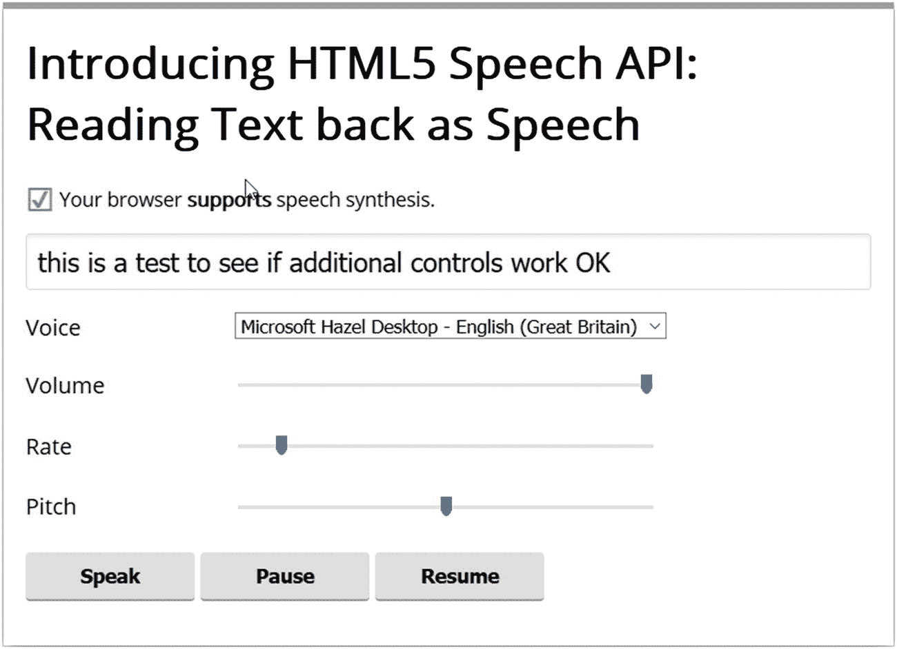
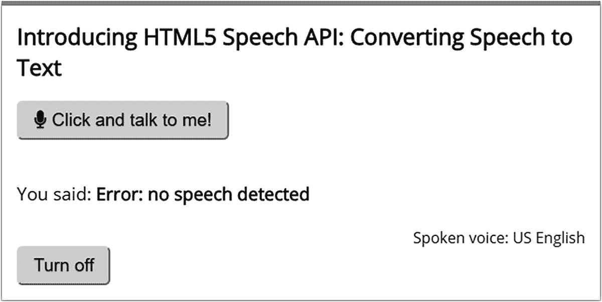
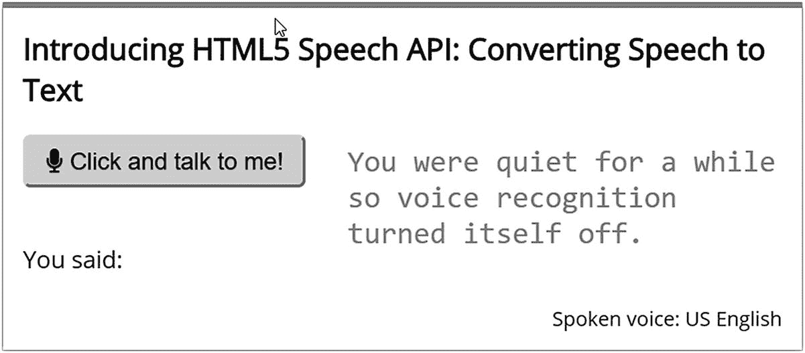
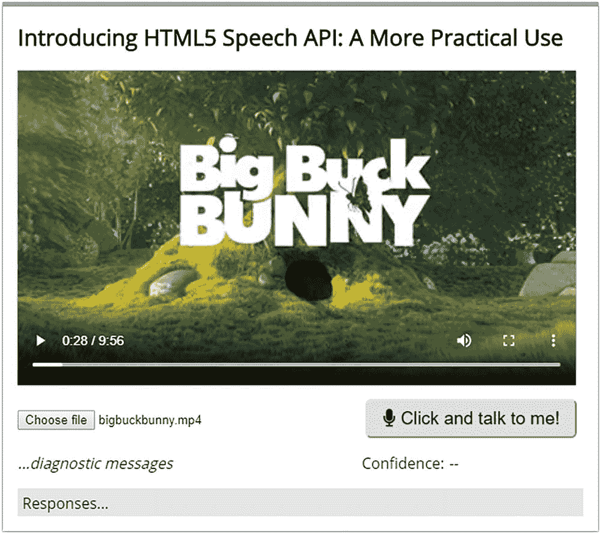
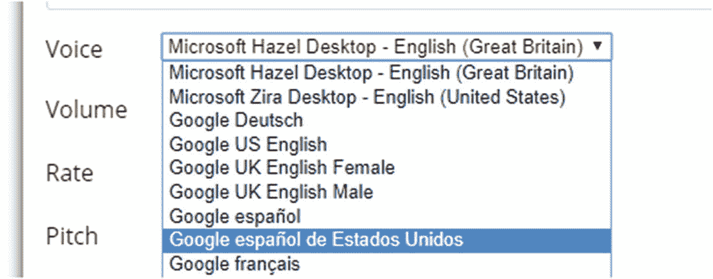
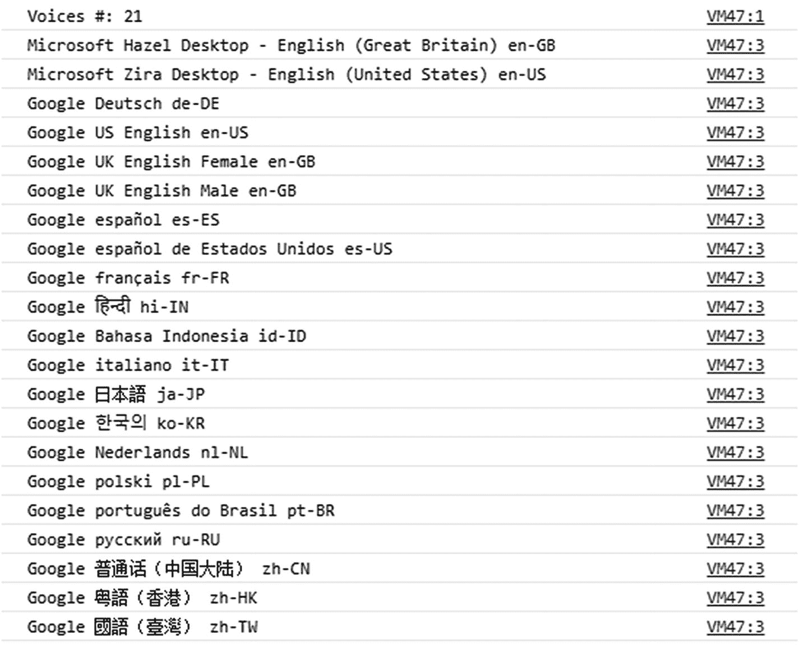
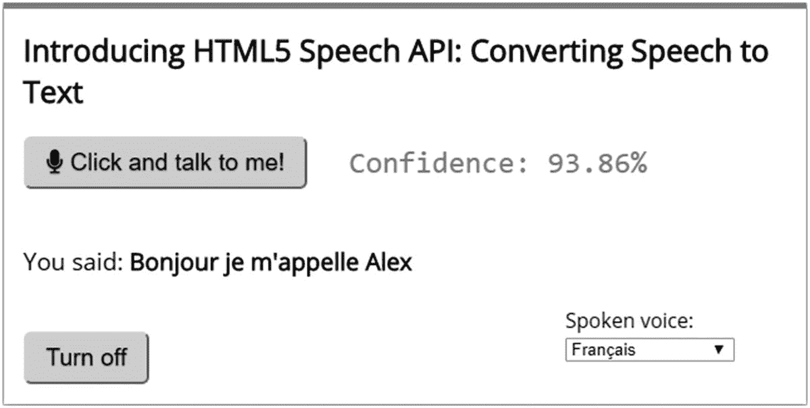

# 二、更详细地探索 API

## 理解 API 术语

> *“太好了！我的电脑现在可以说话并识别我的声音。但是我在代码中看到的 SpeechSynthesisUtterance 关键字是什么意思…？”*

这是个很好的问题。既然您已经看到了运行中的 API，我敢打赌您一定很想了解它是如何结合在一起的，对吗？我们只是触及了让我们的电脑说话或识别我们声音的基础。我们能做的还有很多！

在本章的课程中，我们将在使用它(或它们——取决于你如何看待它)之前，深入研究 API 背后的一些理论，以创建一些更实用的东西。与此同时，我们还将赋予我们的代码一点国际风味——是的，我们不局限于只说英语！在本章的后面，一切将变得更清楚，但是现在，让我们从把语音识别 API 分解成它的组成部分开始。

## 探索语音合成 API

回头看看我们为第一个演示创建的代码，我们的 PC 将一些示例文本作为语音回放。乍一看，似乎我们需要相当多的代码来实现这一点，对吗？如果我说你只用一行代码就能做到这一点，会怎么样？

是的，你没听错。该演示的关键围绕这一行代码:

```html
window.speechSynthesis.speak(msg);

```

在这里我们调用对`speechSynthesis`的调用，并要求它说出`msg`的值。就其本身而言，这是行不通的，但是如果我们稍微改变一下，变成这样:

```html
speechSynthesis.speak(new SpeechSynthesisUtterance('Hello, my name is [insert your name here]'))

```

当在浏览器控制台中执行时，它会工作得很好(如果你使用 Firefox，你可能需要允许在控制台中粘贴)。继续，把你的名字放进去，试一试！然而，除了这个简单的一行程序之外，我们还可以用 API 做更多的事情。我在代码中看到的这个`SpeechSynthesisUtterance()`或者对`getVoices()`的调用是怎么回事？一个是对象，另一个是方法。让我们更深入地了解一下这个 API 是如何工作的。

### 分解 API

语音识别 API 的核心是语音合成接口；这是我们进入语音服务的界面。我们可以使用许多方法来控制活动，但在此之前，我们必须首先定义`SpeechSynthesisUtterance`对象。这个对象代表一个语音请求，我们向其中传递一个字符串，浏览器应该大声读出:

```html
const utterance = new SpeechSynthesisUtterance('Hey')

```

一旦定义好了，我们就可以用它来调整单个的语音属性，比如表 2-1 中列出的那些，更完整的列表在本书后面的附录中。

表 2-1

SpeechSynthesisUtterance 对象的属性

<colgroup><col class="tcol1 align-left"> <col class="tcol2 align-left"></colgroup> 
| 

财产

 | 

目的

 |
| --- | --- |
| 话语速率 | 设置速度，接受[0.1 和 10]之间的值，默认为 1。 |
| 话语.音调 | 设置间距，接受[0 和 2]之间的值，默认为 1。 |
| 话语量 | 设置音量，接受[0 和 1]之间的值，默认为 1。 |
| 话语.郎 | 设置语言(值使用当前最佳实践 47 [BCP47]语言标记，如 en-US 或 it-IT)。 |
| 话语.文本 | 您可以将它作为属性传递，而不是在构造函数中设置它。文本最多可包含 32767 个字符。 |
| 话语声音: | 设置声音(下面会详细介绍)。 |

如果我们把这些放在一个简单的例子中，我们可以在一个控制台会话中运行(不要忘记按照指示添加我们的名字！)，它看起来会像这样:

```html
const utterance = new SpeechSynthesisUtterance('Hey, my name is [insert your name here]')
utterance.pitch = 1.5
utterance.volume = 0.5
utterance.rate = 8
speechSynthesis.speak(utterance)

```

然后我们可以使用`speak(), pause(), resume(),`或`cancel()`方法来控制`SpeechSynthesis`对象。

在我们的下一个练习中，我们将充分利用这个额外的功能，并扩展我们从第一章开始的原始演示，以包括对返回的语音提供更好控制的选项，作为我们的下一个演示。当我们完成后，我们的演示将看起来像图 2-1 所示的截图。



图 2-1

我们更新的语音合成演示，增加了控件

我们要做的改变相对来说比较简单，但是很好的说明了我们如何开始开发我们的原创。让我们更详细地了解一下需要什么。

## 改进我们的演讲合成演示

在我们的下一个练习中，我们将添加三个滑块来控制音量、音高和速率等级别，以及暂停和继续朗读内容的按钮。

Adding Functionality

让我们开始添加演示所需的额外标记:

本演示所需的所有代码都在本书附带的代码下载中的`updating speechsynthesis`文件夹中。

1.  我们将从浏览回你在 CodePen 中创建的演示开始，回到第一章——在那里，确保你登录，这样我们可以保存对演示的更改。

2.  首先，寻找这段代码:

    ```html
    <div class="option">
      <label for="voice">Voice</label>
      <select name="voice" id="voice"></select>
      <button id="speak">Speak</button>
    </div>

    ```

3.  紧接在这个块的下面(并且在关闭页面包装器`<div>`之前)，插入下面的代码——这增加了音量、速率和音调水平的滑块:

    ```html
    <div class="option">
      <label for="volume">Volume</label>
      <input type="range" min="0" max="1" step="0.1" name="volume" id="volume" value="1">
    </div>
    <div class="option">
      <label for="rate">Rate</label>
      <input type="range" min="0.1" max="10" step="0.1" name="rate" id="rate" value="1">
    </div>
    <div class="option">
      <label for="pitch">Pitch</label>
      <input type="range" min="0" max="2" step="0.1" name="pitch" id="pitch" value="1">
    </div>

    ```

4.  接下来，查找这一行代码，并将其从标记中的当前位置删除:

    ```html
    <button id="speak">Speak</button>

    ```

5.  向下滚动到标记的末尾，在紧接结束的`</div>`之前添加以下三行，突出显示:

    ```html
      <button id="speak">Speak</button>
      <button id="pause">Pause</button>
      <button id="resume">Resume</button>
    </div>

    ```

6.  标记就绪后，我们需要对样式进行一些调整；否则，元素将无法在页面上正确显示。为此，继续注释掉或删除`#voice`样式规则中突出显示的代码行:

    ```html
    #voice { /*margin-left: -70px;*/ margin-right: 70px; vertical-align: super; }

    ```

7.  我们添加的范围滑块也需要调整。继续将它添加到`input[type="text"]`规则的下面，在该规则之后留一个空行:

    ```html
    input[type="range"] { width: 300px; }

    ```

8.  是时候添加 JavaScript 代码，为我们的新按钮和范围控件注入活力了。查找`button`变量声明，然后添加下面突出显示的代码:

    ```html
    var button = document.getElementById('speak');
    var pause = document.getElementById('pause');
    var resume = document.getElementById('resume');

    ```

9.  接下来，留下一个空行，然后添加以下声明——这些是我们用来调整音量、速率和音高的每个范围滑块的缓存引用:

    ```html
    // Get the attribute controls.
    var volumeInput = document.getElementById('volume');
    var rateInput = document.getElementById('rate');
    var pitchInput = document.getElementById('pitch');

    ```

10.  向下滚动，直到看到`onvoiceschanged`事件处理程序。然后在其下方留下一个空行，并添加这个新的错误处理程序:

    ```html
    window.speechSynthesis.onerror = function(event) {
      console.log('Speech recognition error detected: ' + event.error);
      console.log('Additional information: ' + event.message);
    }

    ```

11.  下一个块是`speak()`函数——在里面，寻找`msg.text = text`,然后留下一个空行，并添加这些赋值:

    ```html
    // Set the attributes.
    msg.volume = parseFloat(volumeInput.value);
    msg.rate = parseFloat(rateInput.value);
    msg.pitch = parseFloat(pitchInput.value);

    ```

12.  我们快完成了。滚动到 JS 代码部分的末尾，然后留下一个空行，并添加这两个事件处理程序。第一个负责暂停语音内容:

    ```html
    // Set up an event listener for when the 'pause' button is clicked.
    pause.addEventListener('click', function(e) {
      if (speechMsgInput.value.length > 0 && speechSynthesis.speaking) {
        speechSynthesis.pause();
      }
    });

    ```

13.  当单击 resume 按钮时，第二个事件处理程序被触发——为此，在前一个处理程序后留一个空行，并添加以下代码:

    ```html
    // Set up an event listener for when the 'resume' button is clicked.
    resume.addEventListener('click', function(e) {
      if (speechSynthesis.paused) {
        speechSynthesis.resume();
      }
    });

    ```

14.  我们已经完成了代码添加。请确保保存您的工作。如果一切正常，我们应该会看到类似于本练习开始时显示的屏幕截图。

尝试运行演示程序，在文本框中添加一些内容，然后改变控件。稍加练习，就能产生一些有趣的效果！我们的代码现在开始成形，并给了我们可以使用的更完整的东西。让我们更详细地快速回顾一下我们对代码所做的更改。

### 剖析我们的代码

我们通过添加一些标记来创建合适的范围滑块来控制音量、音高和速率设置——在所有情况下，我们都使用标准的输入元素并将它们标记为 HTML5 范围类型。随后，我们添加了两个新按钮，用于暂停和恢复语音内容。

真正的奇迹出现在我们加入剧本的时候。我们首先添加对我们创建的两个新按钮的引用；这些分别被分配了 id`pause`和`resume,`。

接下来，我们创建了对三个范围滑块的引用；这些分别被称为`volumeInput`、`rateInput,`和`pitchInput`、??。然后，我们在`speak()`函数中添加声明，以捕捉为这些范围滑块设置的值，然后根据需要将它们分配给`SpeechSynthesisUtterance`对象。然后，我们添加了三个新的事件处理程序来结束演示——第一个用于将生成的任何错误呈现到控制台，第二个用于在计算机说话时暂停内容，第三个用于在用户单击恢复按钮时恢复内容。

这很简单，对吧？这只是我们可以做出的改变的一部分。妹子 API 呢，语音识别？正如我们很快会看到的，这一个需要一个不同的思维定势来做出改变。让我们更详细地看看我们可以做出的一些改变，以增强整体体验。

## 探索语音识别 API

我们已经探索了如何让浏览器说话，但是如何识别我们说的话呢？在我们在第一章中创建的演示中，我们遇到了诸如`navigator.mediaDevices.getUserMedia()`、`speechstart`事件处理程序和`recognition.interimResults`这样的术语。他们都是做什么的？

第一个严格来说不是 SpeechRecognition API 的一部分；我们用它来控制从浏览器中对麦克风的访问。然而，另外两个确实是 API 的一部分；与 SpeechSynthesis API 不同，这不是一个我们可以在控制台中作为一行程序运行的 API。相反，在使用这个 API 时，我们需要指定一些设置——最关键的一点是在我们做任何事情之前允许访问麦克风！

### 分解 API

SpeechRecognition API 的核心是 SpeechRecognition 接口；这控制对浏览器中语音识别界面的访问。我们首先必须定义对此的引用；一旦就位，我们就可以使用这行代码创建 API 接口的实例:

```html
const recognition = new SpeechRecognition();

```

值得注意的是，在 Chrome 中，这个 API 利用一个基于远程服务器的识别引擎来处理所有请求。这意味着它不能离线工作——为此，我们必须使用不同的浏览器，比如 Firefox。

然后，我们可以为设置指定合适的值，如`interimResults`或`maxAlternatives`，以及合适的事件处理程序来停止或启动语音服务。让我们更详细地看看其中的一些设置；这些在表 2-2 中列出。

表 2-2

SpeechRecognition API 的属性

<colgroup><col class="tcol1 align-left"> <col class="tcol2 align-left"></colgroup> 
| 

财产

 | 

财产用途

 |
| --- | --- |
| 演讲认知。语法 | 返回并设置 SpeechGrammar 对象的集合，这些对象代表 SpeechRecognition API 的当前实例可以理解的语法。 |
| 演讲识别。lang | 返回并设置当前演讲人识别的语言。如果未指定，则默认为 HTML lang 属性值，或者用户代理的语言设置(如果也未设置)。 |
| 演讲识别。连续 | 控制是为每个识别返回连续的结果，还是只返回一个结果。默认为 single(或 false)。 |
| 演讲认知. interim 结果 | 控制是否应该返回中期结果(true)或不返回(false)。临时结果是尚未最终确定的结果(例如，speechrecognitionresult . is final 属性为 false)。 |
| speech recognition . max alternatives | 设置每个结果提供的最大备选项数。默认值为 1。 |
| SpeechRecognition.serviceURI | 指定当前语音识别用来处理实际识别的语音识别服务的位置。默认值是用户代理的默认语音服务。 |

一旦我们为`SpeechRecognition`对象定义了我们选择的设置，我们就可以使用三种方法来控制它。我们可以`start()`服务，`stop()`它，或者`abort()`引用一个当前的`SpeechRecognition`对象，就像我们在本章前面所做的语音合成演示一样。

本书末尾的附录中提供了 API 命令的完整列表。

然而，与语音合成 API 不同，以完全相同的方式定制体验的选项并不多；尽管如此，我们仍然可以实现一些改变来改善体验。记住这一点，让我们来看看我们可以增加我们的原始演示。

## 更新我们的演讲识别演示

当使用 SpeechSynthesis API 演示时，我们能够从 API 中添加一些额外的属性来帮助微调用户体验；SpeechRecognition API 的情况并非如此。相反，我们将采取不同的策略；我们将添加一些额外的错误管理功能和更好的控制来使用`navigator.mediaDevices.getUserMedia()`自动关闭麦克风。

Expanding the Options

出于本练习的目的，我们将在更小的块中检查每个变更；任何视觉变化的屏幕截图将在适当的时候显示。

本演示的代码可以在本书附带的代码下载中找到——在`updating speechrecognition`文件夹中查找。

让我们开始吧:

1.  首先，在 CodePen 网站上浏览到您在第一章中创建的语音识别——确保您也登录了，这样您就可以保存您的更改。

2.  接下来，查找这一行代码，并在它下面添加以下内容(突出显示)，在新代码后面留下一行:

    ```html
    recognition.interimResults = true;
    recognition.maxAlternatives = 1;
    recognition.continuous = true;

    ```

3.  我们要实现的第一个变化是开始改进错误处理——目前，我们正在逐字逐句地排除错误消息，这看起来不太好。通过一些修改，我们可以使它更友好，所以继续修改错误事件处理程序，如下所示:

    ```html
    recognition.addEventListener("error", e => {
      if (e.error == "no-speech") {
        output.textContent = "Error: no speech detected";
      } else { output.textContent = "Error: " + e.error;  }
    });

    ```

值得注意的是，如果以后需要，我们可以用其他错误代码来扩展它。



图 2-3

我们更新的语音识别演示

1.  第三个也是最后一个变化是对麦克风的关闭施加更多的控制——有时我们可能想要控制它何时关闭，而不是让它看起来有自己的想法！幸运的是，对此的更改非常简单——首先是在我们的 HTML 标记中添加一个元素，如下所示:

    ```html
    <p class="output">You said: <strong class="output_result"> </strong></p>
    <button id="micoff">Turn off</button>

    ```

2.  第二个变化需要我们添加一个新的事件处理程序——我们可以控制何时关闭麦克风，而不是依赖语音识别 API 自动关闭或试图转录它听到的不是故意的语音。为此，查找这行代码:

    ```html
    recognition.continuous = true

    ```

    然后留下一个空行，放入下面的代码:

    ```html
    document.getElementById("micoff").addEventListener("click", () => {
      stream.getTracks().forEach(function(track) { track.stop() });
      console.log("off");
    });

    ```

3.  我们已经做了所有需要的改变。继续保存您的工作成果。如果一切正常，我们应该会看到类似于图 2-3 所示的截图，在这里我们可以看到我们改进的错误处理。

1.  The second change will be an auto turn-off for the speech recognition engine – after all, we don’t necessarily want our microphone to stay enabled if we’re not using it for a period of time, right? For this change, look for the `speechend` event handler, then leave a blank line, and add in this function:

    ```html
    recognition.onspeechend = function() {
      log.textContent = 'You were quiet for a while so voice recognition turned itself off.';
      stream.getTracks().forEach(function(track) { track.stop() });
      console.log("off");
    }

    ```

    We can see the result of this change in Figure 2-2.

    

    图 2-2

    增加了自动关闭功能

如果您尝试单击“关闭”按钮关闭麦克风，请耐心等待，红色指示灯可能需要几秒钟才会消失！

在研究这个演示的代码时，我对使用语音识别 API 时可以触发的事件的明显交叉数量感到震惊。

正是由于这个原因，尽管我们没有像语音合成 API 那样多的配置选项可以调整，但语音识别 API 中不同的事件处理程序仍然会使我们出错！记住这一点，让我们更详细地看看我们刚刚完成的演示中的代码。

### 理解代码

在过去的几页中，我们采用了不同的方法来开发我们的原始演示，这一次，我们通过增加或改善整体体验来扩展它，而不是简单地添加更多选项。让我们花点时间更详细地回顾一下我们对原始演示所做的更改。

我们从更新错误事件处理程序开始，在那里我们检查了`no-speech`错误属性，并向用户返回了一个更容易接受的消息。我们的下一个变化实现了一个自动关闭选项——在使用语音识别 API 时，我们必须记住一点(我们不希望它在没有控制的情况下运行！)

我们做的最后一个改变是改变自动关闭功能——自动关闭是一个有用的功能，但有时我们可能希望控制这种情况何时发生。这是特别有用的，有助于防止我们的麦克风自动录制东西，这是不应该共享的！

好了，我们该继续前进了。我们已经探索了如何实现语音识别和合成 API 的基础知识；是时候让它们有更实际的用途了！为了展示我们如何将它们结合在一起，我们将创建一个简单的视频播放器，可以通过语音控制；它会用声音确认我们要求的任何动作，而不是在屏幕上显示消息。这将使用我们创建的两个演示中的原则。让我们深入研究一下，看看这是如何工作的。

## 创造一个更实际的例子

在下一个练习中，我们将为使用 HTML5 `<video>`元素的视频播放器添加基本的语音功能。

我们现在将着重于添加播放和暂停命令，但是我们可以在以后很容易地添加额外的命令，例如增加音量或静音。完成后，看起来会像图 2-4 所示的截图。



图 2-4

我们的声控视频播放器

在您设置演示时，仔细看看一些函数和处理程序——希望您能从以前的演示中认出一些元素！记住这一点，让我们开始我们的演示。

Adding Speech Capabilities to Video

下一个演示有几个要求:你需要确保你有一个合适的视频可用(MP4 格式可以；代码下载里有个例子视频如果没有合适的)。我们将建立一个 CodePen 会话，因此在继续之前，请确保您已经浏览了位于 [`https://codepen.io`](https://codepen.io) 的网站并已登录:

1.  我们将开始添加我们需要作为演示基础的标记——为此，继续将`HTML.txt`文件的内容从`practical example`文件夹复制到右侧的 HTML 窗格中。

2.  接下来，让我们添加一些基本的样式，这样我们至少可以让我们的演示看起来像模像样——为此，继续将`CSS.txt`文件的内容添加到 CSS 窗格中。

3.  我们现在可以把注意力转向真正重要的部分——我们的剧本！有一个很好的块要添加，所以我们将一个块一个块地做，从一些变量声明开始。继续在 JS 窗格的顶部添加以下代码行:

    ```html
    "use strict";

    const log = document.querySelector(".output_log");
    const output = document.querySelector(".output");
    const confidence = document.querySelector(".confidence em");

    // Simple function that checks existence of s in str
    var userSaid = function(str, s) {
      return str.indexOf(s) > -1;
    };

    ```

4.  下一个代码块负责将我们选择的视频加载到我们的视频播放器中——这样我们就可以在发出命令时准备好播放。留下一个空行，然后添加以下代码:

    ```html
    video_file.onchange = function() {
      var files = this.files;
      var file = URL.createObjectURL(files[0]);
      video_player.src = file;
    };

    ```

5.  接下来的部分有点棘手——我们需要允许用户请求访问他们的麦克风。为此，我们使用`navigator.mediaDevices.getUserMedia`；我们将首先添加这个结构。留下一个空行，然后添加这个方法调用:

    ```html
    navigator.mediaDevices
      .getUserMedia({ audio: true })
      .then(function(stream) {

    ...add in code here...

    }).catch(function(err) {
      console.log(err);
    });

    ```

6.  有了这些，我们现在可以开始添加操作语音识别 API 所需的各种组件；我们首先需要定义 API 的一个实例。继续添加，替换文本`...add in code here...` :

    ```html
    const SpeechRecognition = window.SpeechRecognition || window.webkitSpeechRecognition;
    const recognition = new SpeechRecognition();

    ```

7.  接下来是我们的第一个事件处理程序，我们将使用它来调用对麦克风的访问。为此，在 SpeechRecognition API 声明后留下一行，然后添加以下代码:

    ```html
    document.querySelector("button").addEventListener("click", () => {
      let recoglang = "en-US";
      recognition.lang = recoglang;
      recognition.continuous = true;
      recognition.start();
    });

    ```

8.  我们现在需要添加事件处理程序，负责在我们开始说话时打开 API，或者在适当的时候关闭它；在前一个处理程序后留出一行空白，然后添加以下代码:

    ```html
    recognition.addEventListener("speechstart", e => {
      log.textContent = "Speech has been detected.";
    });

    recognition.addEventListener("speechend", e => {
      recognition.stop();
    });

    recognition.onspeechend = function() {
      log.textContent =
        "You were quiet for a while so voice recognition turned itself off.";
        stream.getTracks().forEach(function(track) {
          track.stop();
        });
      console.log("off");
    };

    ```

9.  下一个模块是真正神奇的地方——它通过将我们的口头命令转换成它能识别的东西并翻译成适当的命令来控制我们的视频播放器。在前一个事件处理程序后留下一行，然后放入以下代码:

    ```html
    // Process the results when they are returned from the recogniser
    recognition.onresult = function(e) {
    // Check each result starting from the last one

    for (var i = e.resultIndex; i < e.results.length; ++i) {
    var str = e.results[i][0].transcript;

    console.log("Recognised: " + str);
    // If the user said 'video' then parse it further
    if (request(str, "video")) {
    // Play the video
    if (request(str, "play")) {
    video_player.play();
    log.innerHTML = "playing video...";
    } else if (request(str, "pause")) {
    // Stop the video
    video_player.pause();
    log.innerHTML = "video paused...";
    }
    }
    }
    confidence.textContent =
    (e.results[0][0].confidence * 100).toFixed(2) + "%";
    };

    ```

10.  我们快完成了。要添加的最后一个事件处理程序将负责一些基本的错误捕获。继续添加这个事件处理程序，在前一个块之后留出一行空白:

    ```html
    recognition.addEventListener("error", e => {
      if (e.error == "no-speech") {
        log.textContent = "Error: no speech detected";
      } else {
        log.textContent = "Error: " + e.error;
      }
    });

    ```

11.  保存您的工作。如果一切正常，我们应该会看到类似于本练习开始时显示的屏幕截图。

尝试使用“选择文件”按钮选择一个视频，然后说“视频播放”开始播放——是的，这有点小花招，但它确实提供了一个有效的观点。谁说你总是要按下按钮才能启动一个东西？是的，我绝对会认为自己是一个老派方法的粉丝，但总有一天，一个人必须适应…！

如果你仔细看看这个演示中的代码，你会发现它使用了我们在早期演示中已经见过的术语；总的来说，大部分现在应该开始看起来熟悉了！但是有一个例外——我没有看到结果的事件处理程序；我看到的这个`.onresult`句柄是什么…？

### 详细研究代码

啊哈！对于我们跟踪 API 最终输出的方式来说，这是一个重要的改变！它的工作方式与我们之前使用的结果事件处理程序类似，但是有一点不同:该事件处理程序只被调用一次。我将很快解释我的意思，但是首先，让我们更详细地检查我们的代码。我将把重点放在 JavaScript 上，因为使用的 CSS 和 HTML 是非常标准的，应该是不言自明的。

我们从声明一些变量开始，这些变量用于存储对标记中元素的引用，并帮助在我们的口头输入中查找文本(稍后将详细介绍)。然后，我们继续创建一个基本函数，将我们选择的视频加载到我们的视频播放器中，准备根据命令播放它。

下一个模块是我们演示真正关键的开始——在声明 API 实例之前(取决于我们使用的浏览器),我们初始化对`navigator.getUserMedia()`的调用以允许访问我们的麦克风。

然后，我们添加了一个事件处理程序，用各种属性初始化我们的 API 实例——lang 被设置为 US English 和 continuous，以防止 API 在打开之前关闭过快。接下来出现了三个事件处理程序来响应语音——`speechstart`在 API 检测到语音内容时启动，`speechend`将终止它，`onspeechend`将识别 API 是否安静并自动关闭。

我们演示的真正重点是接下来——这里我们使用了`onresult`。这与我们之前使用的 result 事件处理程序不同，它不会触发一次(result 会)，而是在每次我们说话并且 API 检测到我们停止说话时触发。我应该指出，这是**而不是**完全停止说话，更多的是我们发出的每个命令之间的停顿！该函数使用 for 循环解析结果，将每个结果依次分配给 str，然后根据听到的内容执行适当的视频命令。因此，如果我们说“播放视频”，它会单独搜索每个单词。根据它听到的内容，它会检测到我们说了视频，因此它会检查我们是否说了播放或暂停。如果我们说播放(正如我们在这里所做的)，它会暂停视频并在屏幕上显示确认。

好吧，让我们开始吧！尽管我们到目前为止做的许多演示可能都是英文的，但有一件事我们应该牢记在心:对不同语言的支持呢？在一个全球互联的时代，我们不能假设人们只会说英语(或者实际上只会一种语言！).我们绝对应该考虑增加对不同语言的支持；值得庆幸的是，使用语音 API 时，我们可以轻松做到这一点。让我们深入了解一下我们需要做些什么来更详细地添加多语言支持。

## 走向多语言

在一个理想的世界里，如果我们都说同一种语言就太好了——毕竟，我们可以和不同国家的人交流，不会有误解……但是那会很无聊！

用不同的语言和别人说话是有道理的；拥抱不同的文化和语言为假期或旅行增添了额外的元素。这同样适用于阅读文本，例如在博物馆里找到的文本；当然，你可能不太懂，但你仍然会对这个国家过去的历史有所了解。

但是我跑题了。回到现实，我们已经讨论了如何将语音转换成文本，反之亦然。那么其他语言呢？我们并不都说英语(或者实际上是同一种语言)，那么这在两种 API 中是如何工作的呢？

### 探索对语言的支持

使用语音识别或语音合成 API 的好处之一是它支持其他语言——有许多不同的选项可供我们使用。正如我们很快会看到的，确切的数字将取决于我们使用的浏览器；这可能多达 21 个，也可能少到只有 3 个！

我们已经在第一章创建的语音合成演示中提到了语言支持——还记得那个演示中显示的相当有趣的名字列表吗？我们可以在图 2-5 中看到它的摘录。



图 2-5

可用于语音合成 API 的语言(摘录)

为了实现这一点，我们创建了一个`loadVoices()`函数来遍历每个语言选项，然后将它添加到下拉菜单中。然后，在将更改应用到 SpeechRecognition 对象之前，我们使用了`getVoices()`方法来选择我们选择的语言。

如果您想知道我们是如何做到这一点的，请尝试在您的浏览器控制台中运行这个简单的示例——我建议您在一个 CodePen 演示的控制台日志中运行它，这样您就可以触发对麦克风的访问:

```html
console.log(`Voices #: {speechSynthesis.getVoices().length}`);
speechSynthesis.getVoices().forEach(voice => {
  console.log(voice.name, voice.lang)
});

```

在这一点上，值得注意的是，这应该在大多数现代浏览器中工作。你*可能*会发现，尽管你在 SpeechSynthesis API 中使用这段代码时会遇到跨浏览器的问题——在 Chrome 的一些旧版本中，我们使用的原始代码无法运行。

它在 Firefox 和 Edge 中运行良好(对于那些 Mac 用户来说，可能还有 Safari)；相反，在使用之前，您可能会发现必须使用回调来显示列表。获取声音以显示列表:

```html
const voiceschanged = () => {
  console.log(`Voices #: ${speechSynthesis.getVoices().length}`);
  speechSynthesis.getVoices().forEach(voice => {
    console.log(voice.name, voice.lang)
  })
}
speechSynthesis.onvoiceschanged = voiceschanged

```

不过你可能会发现，使用 Chrome 时返回的语言数量有所不同——以“Google…”开头的额外语言只有在网络连接有效的情况下才可用。在图 2-6 中完整显示了该列表的副本。



图 2-6

API 中支持的语言列表

否则会减少；Edge 目前显示三个，Firefox 显示两个。可以说，这只是使用语音 API 时需要考虑的另一点！

相比之下，在语音合成 API 中添加语言支持变得更加有趣——我们不仅可以选择语言，甚至可以设置方言！这确实需要更多的工作来实现。在下一个练习中，我们将很快看到如何实现这一点。

### 设置自定义语言

如果我们在使用语音识别 API 时需要设置语言支持，我们必须采取不同的策略——不是简单地从 API 调用列表，而是*向*提供一个列表。这实际上采取了双数组的形式。这解释起来有点复杂，所以请原谅我；我将使用下一个练习中的摘录。

我们从数组开始，注意到不是所有的条目都相等吗？好吧，在你说话之前，我指的是数字，不是里面的文字！在大多数情况下，我们只有语言和 BCP47 代码(比如 af-ZA)，但是在最后一个例子中，我们有三个值:

```html
var langs =
    [['Afrikaans',       ['af-ZA']],
     ['Bahasa Indonesia',['id-ID']],
     ['Bahasa Melayu',   ['ms-MY']],
     ['Català',          ['ca-ES']],
     ['Čeština',         ['cs-CZ']],
     ['Deutsch',         ['de-DE']],
     ['English',         ['en-AU', 'Australia'],
...
(abridged for brevity)

```

BCP47 或最佳当前实践 47 是用于识别人类语言的 IEFT 国际标准，例如德语的 de-DE。如果你想了解更多，那就去维基百科的 [`https://en.wikipedia.org/wiki/IETF_language_tag`](https://en.wikipedia.org/wiki/IETF_language_tag) 找一篇好的介绍文章。

然后，我们使用这样的结构遍历数组:

```html
for (var i = 0; i < langs.length; i++) {
  select_language.options[i] = new Option(langs[i][0], i);
}

```

将它放入一个对象中，我们可以从中选择默认显示的项目(在本例中为英语):

```html
select_language.selectedIndex = 6;

```

这本身不会对 API 产生任何影响；为了让它工作，我们需要增加一个功能。在高层次上，我们再次遍历数组，但是这一次挑选出方言值(在这种情况下，来自第二列的值)，然后将它们添加到一个`<select>`下拉框中。然后，我们需要设置可见性，这样，如果我们选择一种有多种方言的语言，方言下拉列表就会相应地显示或隐藏。希望这将开始有一些意义；要了解这在实践中是如何工作的，让我们快速进入下一个练习，在这里我们将看到这段代码如何融入我们的演示中。

Allowing for Languages in Speech Recognition

在下一个练习中，我们需要回到我们在第一章中创建的语音合成演示——为了保留您之前代码的副本，我建议您登录 CodePen 并点击 Fork 按钮。我们的演示将从您准备好编辑 HTML 代码开始，因此在继续本演示中的步骤之前，请确保您已经到了这一步。

尽管我们将要做的一些改变很简单，但其他的更复杂。我建议你一定要为这本书下载一份代码副本；所有内容都将保存在`language support`文件夹中。

假设您在那里，让我们开始更新我们的演示:



图 2-7

对我们的演示说法语的结果

1.  第一个变化确实出现在我们的 HTML 标记中，所以请查找这一行并将其注释掉:

    ```html
    <span class="voice">Spoken voice: US English</span>

    ```

2.  接下来，将这个块直接插入到它的下面:

    ```html
    <span class="voice">
      Spoken voice and dialect:
        <div id="div_language">
          <select id="select_language" onchange="updateCountry()">
    </select>
          <select id="select_dialect"></select>
        </div>
      </span>

    ```

3.  我们现在需要调整新的下拉列表的位置——为此，在 CSS 窗格的底部添加下面的 CSS 样式:

    ```html
    .voice { float: right;  margin-top: -20px; }

    ```

4.  但是真正的变化是在我们的 JavaScript 代码中(当然！)–为此，继续从代码下载中打开一个`JS.txt`文件的副本，然后查找这行代码:`var langs =`(大约在第 7 行)。

5.  复制它和下面的行，直到(包括)这一行后面的右括号:

    ```html
      select_dialect.style.visibility = list[1].length == 1 ? 'hidden' : 'visible';
    }

    ```

6.  将代码下载中的 JavaScript 内容粘贴到这一行之后，在它和您的新块之间留一行:

    ```html
    const output = document.querySelector(".output_result");

    ```

7.  好的，下一个变化:向下滚动直到你看到这个事件处理程序的开始:

    ```html
    document.querySelector("button").addEventListener("click", ()

    ```

8.  注释掉该函数中的`let recoglang = "en-US"`，替换为:

    ```html
    recognition.lang = select_dialect.value;

    ```

9.  向下滚动，直到看到这一行:`output.textContent = text;`

10.  接下来，添加一个空行，然后放入这行代码，在右括号和圆括号之前:

    ```html
    log.textContent = "Confidence: " + (e.results[0][0].confidence * 100).toFixed(2) + "%";

    ```

11.  此时，我们应该已经完成了所有的代码更改；继续保存您的工作。

12.  尝试运行演示。如果一切正常，我们应该有类似于图 2-7 所示的截图。试着把声音换成不同的语言，然后说点什么——希望你或你的朋友能知道足够多的单词来说些有意义的话！

从演示中可以看出，这说明我确实懂一些法语；我的西班牙语也还过得去，虽然和我的水平相差甚远！除此之外，我们还在这个演示中添加了一个非常重要的特性，值得我们更详细地了解一下——让我们花点时间来更详细地了解一下它是如何工作的。

### 打破我们的代码

如果我们仔细看看我们刚刚编写的代码，您可能会发现一个奇怪的地方——如果您没有发现，也不要担心，因为它不会立即显现出来！我会给你一个开始的线索:它与我们赋予语言的价值有关——它不是你最初可能期望的那样…

好吧，我跑题了。回到我们的演示，我们首先注释掉原始文本，指出使用了哪种语言；我们用两个下拉菜单替换了它，一个用于语言，另一个用于方言。然后我们引入大量代码，首先建立一个数组`langs`,存储语言和方言值。接下来我们用一个`for`循环遍历第一组值，并将每个值插入到`select_language`下拉列表中。然后，我们为语言和方言属性设置了两个默认值——在本例中是英语。

接下来是`updateCountry()`函数——它看起来有点复杂，但不难理解。我们只是清除了方言下拉列表(`select_dialect`)，然后用第二列数据中的值填充它(在本例中，我们有前面谈到的 BCP47 值)。

剩下的变化很小——我们将来自`select_dialect`下拉列表的输出值重新分配给`recognition.lang`,并在`output_log` span 元素中添加了一个置信度声明。有道理？嗯，会的，如果只有一个困扰的问题。为什么我们看起来像是在设置方言值，而不是语言值…？

### 语言和方言的区别

如果我把这一部分的主题作为一个问题问你，希望你会说语言是我们会说的东西，方言实际上是那种语言的地区变体…或者类似的东西！然而，如果我说，至少在这个 API 的上下文中，这两者实际上是同一个事物的两个部分，并且在某些情况下是相同的，你会感到非常困惑！什么给了…？

答案就在五个字里——bcp 47。这是我之前提到的国际标准，我们可以看到 pt-BR 或葡萄牙语的巴西方言等代码。但是真正的诀窍在于*我们如何在代码中利用这一点——尽管我们选择了语言和方言(后者可用)，但直到我们选择了那个*方言*值，我们才得到实际使用的值。*

例如，如果我们选择葡萄牙语方言，我们将得到 pt-BR；这是 lang 属性进行语音识别所需的值。实际上，在通过方言下拉列表选择真正的语言用于我们的演示之前，我们使用语言下拉列表来过滤我们的选择。

好吧，我们继续。在我们进入构建项目的实际乐趣之前，我们还需要探索一个特性！正如我希望你已经从演示中看到的，语音识别发展得很好，但它并不完美。可能有些时候，我们会想伸出援助之手。我给你介绍一下`SpeechRecognition.Grammars`。

## 利用语法对象

在本章的整个过程中，我们已经更详细地探索了语音 API，涵盖了诸如添加多语言支持、对何时可以使用麦克风提供更好的控制，以及当我们在使用 API 时遇到错误时细化返回的内容等功能。

然而，可能有些情况下我们需要这种帮助——这就是 SpeechRecognition API 的语法部分可以发挥作用的地方。然而，这个特性有点奇怪，而且可能会带来一些麻烦。为什么？

许多人发现它最多令人困惑，或者实际上没有做他们原本期望它做的事情。一部分原因可能是因为最初的规范是什么时候写的；这是在单词识别率没有现在这么好的时候完成的，所以它需要一些东西来提供可以被描述为提升的东西。

因此，对`SpeechGrammarList`界面的支持很差——目前只有 Chrome 支持。它还利用了 JSpeech 语法格式(或 JSGF ),这种格式已经从大多数浏览器中删除了。因此，除非绝对必要，否则我不建议使用该功能，并且请注意，使用该功能需要您自担风险，并且它很可能会在未来被删除。

如果你想了解技术细节和关于移除提议的讨论，请访问 W3C GitHub 网站 [`https://github.com/w3c/speech-api/pull/57`](https://github.com/w3c/speech-api/pull/57) 和 [`https://github.com/w3c/speech-api/pull/58`](https://github.com/w3c/speech-api/pull/58) 。

## 摘要

当使用语音 API 时，我们可以使用许多选项；当我们在第一章第一次介绍 API 时，我们已经介绍了其中的一些。在本章的课程中，我们在我们所学的基础上增加了额外的选项。让我们花点时间回顾一下我们所学的内容。

我们通过创建演示来更详细地探索语音合成和语音识别 APIs 在向每个演示添加功能之前，我们首先介绍了每个 API 中可用的更多选项。

接着，我们看了看如何在使用 API 时添加多语言支持。我们探讨了每个 API 背后的基本原则以及如何设置自定义语言。紧接着是一个演示，然后探索设置语言和方言属性之间的区别，以及两者如何相互作用以给出我们想要的语言设置。

然后我们看了一下语音语法界面，结束了这一章。我们讨论了如何使用它，但是有计划在将来放弃对它的支持；我们讨论了为什么会出现这种情况的一些原因，以及它在实践中如何影响或不影响您的代码。

唷！涵盖了很多，是吧？嗯，节奏不会慢下来——事情会变得越来越有趣！在接下来的几章中，我们将实现一些示例项目来说明如何在实际环境中使用 API。这将涵盖从留下口头审查反馈到自动化部分或全部购买过程的任何事情；我们真的只是被我们的想象力所限制！首先，我们将从一些相对较新的网站开始。例如，使用 API 开发聊天机器人怎么样？翻到下一页，了解我们如何开始与您的网站进行适当的对话…