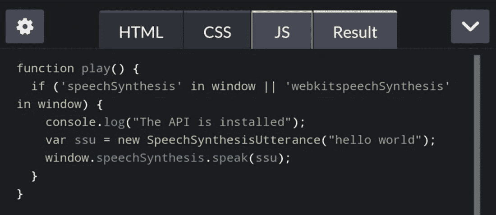

# 三、支持移动设备

> *“Juniper Research 预测，智能助理的数量将从 2018 年底的 25 亿增加到 2023 年的 80 亿，增长两倍。”*

还记得第一章第一章开头的那段令人震惊的话吗？考虑到移动使用现在已经超过了桌面，这是一个强大的组合！但是——我听到你说:“这两个事实的意义是什么？”好吧，让我全部透露。

到目前为止，在前面的章节中，你可能已经注意到使用桌面作为我们的环境。这本身没有错，但它忽略了一个关键点:使用移动设备怎么样？鉴于越来越多的人使用智能设备购买产品，那么在使用 Web 语音 API 时考虑移动设备是绝对有意义的。

在本章的课程中，我们将看一下我们在前面章节中创建的一些演示，并探索如何在移动设备上使用它们。根据您目前所看到的，您可能认为这不应该是一个问题，因为大多数最新的浏览器都支持桌面上的 API，对吗？嗯，事情并不像看上去的那样——做好做决定的准备。

## 支持语音合成 API

是的，最后一个评论可能看起来有点有趣，但是我们将做出一些决定，关于我们如何在移动环境中使用 API！让我解释一下我的意思，首先从语音合成(图 3-1 )开始，说明在更流行的移动平台上对 API 的支持程度。


图 3-1

支持语音合成 API 来源:CanIUse.com

哎哟！这看起来不如台式机好，对吧？授予的覆盖范围不像标准桌面用户那样广泛，但是由于有太多不同的可用平台，支持不那么一致也就不足为奇了！然而，这并不像看起来那么糟糕——要理解为什么取决于我们对一个关键问题做出有意识的决定:我们希望在多大程度上支持谷歌浏览器？

### 分解数字

为了理解最后一个问题的答案，我们应该首先看看谁支持这个 API 以及这个浏览器的当前使用情况。表 3-1 显示了从图 3-1 中呈现的信息的更详细版本，其中我们可以看到哪些更流行的浏览器支持该 API。

表 3-1

支持移动设备上的语音合成 API

<colgroup><col class="tcol1 align-left"> <col class="tcol2 align-left"> <col class="tcol3 align-left"></colgroup> 
| 

移动浏览器

 | 

支持？

 | 

截至 2019 年 12 月的使用百分比

 |
| --- | --- | --- |
| iOS 浏览器 | 是 | Two point eight nine |
| 迷你歌剧 | 不 | One point one seven |
| 安卓浏览器 | 不 | Zero |
| 歌剧手机 | 不 | Zero point zero one |
| 安卓版 Chrome 浏览器 | 是 | Thirty-five point one six |
| 安卓火狐 | 是 | Zero point two three |
| 适用于 Android 的 UC 浏览器 | 不 | Two point eight eight |
| 三星互联网 | 是 | Two point seven three |
| 手机 QQ 浏览器 | 是 | Zero point two |
| 百度浏览器 | 不 | Zero |
| KaiOS 浏览器 | 是 | Zero point two |

显而易见，谷歌 Chrome 的使用率远远超过了所有其他浏览器的总和，几乎是 3 比 1！因此，它提出了我们应该支持谁的问题，特别是对于任何最低可行产品(或 MVP)。

由于所有其他浏览器制造商都不支持移动设备上的 API，或者该浏览器的使用率远低于 5%，所以专注于 Chrome 是有意义的。要真正把重点放在家里(好像这是必要的！)，我们可以看到图 3-2 中使用了多少 Chrome。


图 3-2

截至 2019 年 12 月的 Chrome 使用情况来源:CanIUse.com

削减对如此多浏览器的支持似乎有些过激，但在当今世界，我们需要务实:我们有资源或时间为所有不同的浏览器开发吗？对 Chrome 的支持远远超过其他浏览器，因此专注于这款浏览器并仅在收入足够大以保证部署资源的情况下包括其他浏览器是有商业意义的(例如对于非常大的客户)。

## 支持语音识别 API

我们已经探索了对语音合成 API 的支持。它和它的姐妹——语音识别 API 相比如何？

嗯，乍一看，支持并不是那么好——在某些方面，这并不是一个真正的冲击，因为这个 API 比语音合成 API 更复杂，所以支持没有那个 API 那么先进。我们可以在背面的图 3-3 中看到流行移动平台的概要。


图 3-3

支持移动设备上的语音识别 API 来源:CanIUse.com

乍一看，主要的区别是对这个 API 的任何支持还没有达到完全批准的状态(而另一个 API 已经达到了)；这只是意味着我们在使用这个 API 时需要使用前缀`-webkit`。我们很快就会看到，这没什么大不了的；然而真正的问题在于使用浏览器的人数！为了理解我的意思，让我们深入下去，更详细地看看这些数字，就像我们对语音合成 API 所做的那样。

### 理解数字

如果我们看看谁支持语音识别 API 的细节，我们会看到使用每个浏览器的人数和以前一样多。不过这一次，每个浏览器对 API 的支持比支持语音合成 API 的少 25%(允许使用供应商前缀，并且一个浏览器需要手动启用)。我们可以看到表 3-2 中列出的结果。

表 3-2

支持移动设备上的语音识别 API

<colgroup><col class="tcol1 align-left"> <col class="tcol2 align-left"> <col class="tcol3 align-left"></colgroup> 
| 

移动浏览器

 | 

支持？

 | 

截至 2019 年 12 月的使用百分比

 |
| --- | --- | --- |
| iOS 浏览器 | 不 | Two point eight nine |
| 迷你歌剧 | 不 | One point one seven |
| 安卓浏览器 | 不 | Zero |
| 歌剧手机 | 不 | Zero point zero one |
| Android 版 chrome*(使用 webkit 前缀)* | 是–部分 | Thirty-five point one six |
| 安卓火狐 | 不 | Zero point two three |
| 适用于 Android 的 UC 浏览器 | 不 | Two point eight eight |
| 三星互联网*(使用 webkit 前缀)* | 是–部分 | Two point seven three |
| QQ 浏览器*(使用 webkit 前缀)* | 是–部分 | Zero point two |
| 百度浏览器*(使用 webkit 前缀)* | 是–部分 | Zero |
| KaiOS 浏览器*(使用 webkit 前缀)* | 可以启用 | Zero point two |

那么 Chrome 在这个列表中脱颖而出就不足为奇了，就像它在语音合成 API 中的表现一样。如果我们将鼠标悬停在 CanIUse.com 网站的数字上，我们将看到与之前显示的结果相同的结果！

对表 3-2 中显示的数字的检查表明，集中精力开发谷歌 Chrome 是非常明智的；任何花在其他浏览器上的时间都应该只给大客户，在那里收入机会可以证明所需要的努力是值得的！既然我们已经看到了这两个 API 的数字，那就有必要花点时间总结一下为什么我们应该考虑只为 Chrome 开发:

*   Chrome 是最受欢迎的，所以我们将通过专注于这款浏览器获得最大的曝光率，我们可以在移动和桌面环境中重用相同的核心功能。

*   如果(但愿不会)我们遇到任何问题，我们应该很快看到它们出现，然后可以更快地决定停用或暂停语音选项。在使用率低得多的浏览器上很难发现问题，我们可能不会像在 Chrome 上那样很快发现问题。

好了，鉴于 Chrome 的受欢迎程度和支持水平，我们已经概述了关注 Chrome 的理由；是时候实际一点了！在我们这样做之前，关于本章中的演示，有几点我们需要掩盖；这是为了确保您在测试每次练习的结果时获得最佳效果。

### 几个先决条件

在本章的过程中，我们将重温一些我们在 CodePen 中创建的来自前面章节的练习，目的是使它们适合在移动设备上显示，比如你的手机。

我们当然可以创建新的演示——这种方法没有错，但更有益的方法是看看如何轻松地将现有的演示应用到移动平台上。考虑到这一点，有几点需要注意:

*   代码可以在我们在桌面上创建的笔内编辑，但是为了在测试我们的演示时获得最佳效果，它应该在手机上显示。

*   为了每个演示的目的，也为了证明我们之前的讨论，我们将只使用 Chrome 鉴于 Chrome 的使用水平远远高于所有其他浏览器，使用最流行的浏览器是有意义的！

*   我们将像以前一样使用本书的代码下载——在开始本章的演示之前，请确保您手头有一份副本。

记住这一点，让我们开始开发一些代码，从检查浏览器对 API 的支持开始。

## 检查对 API 的支持

我们的第一个演示将有助于确定所选的浏览器是否支持 APIs 值得指出的是，如果我们决定只使用 Chrome(如前所述),那么这个测试似乎有点多余！

不过，还是值得一跑；我们不仅检查支持，而且我们还将使用不同的方法来实现相同的结果。这两种方法都没有比另一种更好的理由；每一种都可以正常工作，您可以选择在自己的项目中使用哪一种。

Establishing Support for Speech APIs

我们将从检查语音合成 API 开始，但是代码也将与语音识别 API 一起工作(只需在代码中将单词“Synthesis”的所有实例替换为“Recognition”，然后保存并运行它)。

要确定浏览器是否支持 API，请执行以下步骤:

1.  接下来，打开来自`HTML.txt`的代码的副本，并将内容粘贴到我们的笔的 HTML 窗格中。

2.  Once saved, we can test the results – for this, go ahead and browse to your CodePen from your cell phone, then make sure you have Editor View displayed, and hit the Console button. We don’t need to do anything. If your browser supports either API, then we will see confirmation of this in the CodePen console, as shown in Figure 3-5.

    

    图 3-5

    证明我们的手机支持 API

1.  我们首先从代码下载中提取一个`checksupport`文件夹的副本，并将其保存到我们的项目区域。

2.  接下来，继续浏览至 [`https://codepen.io`](https://codepen.io) 的 CodePen。然后使用你在第一章中使用的账户信息登录。

3.  On the left, choose Create ➤ Pen. Then copy and paste the contents of `JS.txt` into the JS pane of our Pen – make sure you save the Pen! If all is well, we should have something akin to the screenshot shown in Figure 3-4.

    

    图 3-4

    在 CodePen 的 JS 窗格中输入的代码

太棒了！我们已经确认我们的移动浏览器可以支持 API(是的，我假设你已经使用了 Chrome！).

这意味着我们现在可以继续前进，并开始调整我们以前的练习，以在移动设备上显示。在此之前，我想快速浏览一下一个小技巧:计算出可用的视区。是的，我知道你可能会问这和语音 API 有什么关系，但是这是有原因的；请忍耐，我会解释一切。

## 确定可用空间

任何花时间为移动设备设计的人无疑会意识到页面上可用空间的限制——这是一个老问题，当视窗区域如此之小时，提供什么。

这在使用语音 API 时尤其重要——我们必须注意显示元素需要多少空间，例如语音合成 API 所需的输入字段，或者使用语音识别 API 时显示转录文本所需的空间。

这就是使用代码计算出视窗区域可能有所帮助的地方——不仅是为了确定我们在代码中有多少空间，而且也是为了设置 Chrome 的响应视图以适应手机的可用空间。让我们更详细地看看这在现实中意味着什么，以及它们如何帮助语音 API。

### 使用代码设置可用空间

由于空间非常珍贵，我们需要计算出我们能够使用多少空间。我们可以使用 JavaScript 自动获取值，而不是试图猜测值或通过反复试验来计算。

这对于在多种设备上进行测试来说是非常好的，因此当涉及到为语音 API 布局元素时，我们可以感受到我们将不得不使用多少空间。为此，您可以使用我在 CodePen 中设置的 [`https://codepen.io/alexlibby/pen/MWYVBGJ`](https://codepen.io/alexlibby/pen/MWYVBGJ) 功能。

顺便说一句，不要忘记添加正确的元标签——你将需要这样的东西:`<meta name="viewport" content="width=device-width, initial-scale=1.0">`

### 配置 Chrome 的响应模式

此外，我们可以使用这些值来帮助设置 Chrome 的响应模式(官方称之为移动仿真模式)。不言而喻，没有两个手机会有相同的空间或视窗，所以为了帮助这一点，我们可以设置自己的自定义区域。让我们在下一个练习中了解一下。

Setting up Viewports in Chrome

如果你想练习这些步骤，下一个练习可以在 Chrome for mobile 或 desktop 上进行；最终你需要在 Chrome 中设置它，以在测试中获得最佳效果。我们可以使用以下步骤设置视窗:

1.  单击左侧的下拉菜单，并选择编辑➤添加自定义设备…

2.  在设备名称字段中，输入您的手机或所选移动设备的品牌和型号。

3.  下面是三个字段–在左边输入宽度，在中间输入高度，右边的字段保持不变。确保使用代理字符串设置为移动。

4.  点击添加。现在，在测试语音 API 时，您可以将它设置为您选择的视窗区域。

1.  启动 Chrome，浏览到一个站点——我假设我们将使用 CodePen，它非常适合测试响应视图。

2.  接下来，我们需要启用响应模式，这可以使用 Ctrl+Shift+I (Windows 和 Linux)或 Cmd+Shift+I (Mac)来完成。

3.  At the top of the resized page will be an option to choose a different viewport; it will look something akin to the screenshot shown in Figure 3-6.

    

    图 3-6

    Chrome 的响应模式选项

这只是使用 Speech APIs 时要考虑的一个小方面——我们在这里只涉及了两个方法，并没有探究返回值的一些奇怪之处。但是，它应该会给你一个很好的提示，告诉你可能会有多少空间，这样你就可以设置一个简单的方法来分配空间和测试特性，而不必完全在移动设备上工作或使用 BrowserStack 之类的外部服务。

这并不是说我们应该忽略 BrowserStack 之类的服务，它们执行一个有用的功能——这是为了让这个小技巧在开发期间，在完成正确的测试之前发挥作用！

好吧，让我们回到 API 的话题上。既然我们有了一个快速而简单的方法来计算出可用的视口区域，那么是时候让我们进入 API，看看它们是如何在移动设备上工作的了！我怀疑你可能在想我们必须做出很多改变，对吗？如果不是对 API 本身，至少对样式，肯定…？

嗯，我不想让人失望，但答案是否定的——如果我们对自己的造型很小心，那么我们应该不需要太多的调整。让我们通过改编本书前面的两个 CodePen 演示来测试这个理论，看看它是如何工作的。

## 实现语音合成 API

还记得第一章中的这个演示(如图 3-7 所示)吗？


图 3-7

我们最初的语音合成 API 演示来自第章第一部分

这是一个简单的演示，展示了我们如何实现语音合成——它允许我们在输入字段中输入任何我们希望的文本，然后在要求计算机将文本呈现为语音之前，调整语音和音高等设置。

希望你还有第一章第一章的版本保存为钢笔——你有吗？如果没有，我建议你使用来自`readingback`演示的代码再次设置它；以后的演示也会用到它！

假设你已经重新设置了它，或者有你之前创建的版本的链接，试着在你的手机上运行它。如果您在输入栏中输入了内容，请点击“朗读”;你应该会发现 Chrome 会把它还原成语音。

问题是用户界面看起来不是很好，不是吗？这是和以前一样的代码，但是这一次我们需要来回滚动——这是一种让人厌烦的方式！具有讽刺意味的是，这整个设置是我提倡只使用 Chrome 的原因之一，至少在不久的将来是这样。我们不需要接触语音合成 API 所需的任何 JavaScript，而是可以专注于调整我们的标记和样式，以更好地适应可用空间。为了理解我的意思，让我们来测试一下，并调整演示以更好地适应您的手机，作为下一个练习的一部分。

### 适应手机的设计

在下一个练习中，我们将重复使用第一章中的一个演示(我知道，这并不是很久以前的事，尽管看起来可能不是这样！).我们将进行一些调整，以确保它更好地适应有限的可用空间，同时确保功能仍按预期运行。准备好进去看看了吗？

Speaking on a Mobile

让我们按照以下步骤继续更新我们的演示:


图 3-8

我们更新的语音合成 API，运行在手机上

1.  我们将首先在 [`https://codepen.io`](https://codepen.io) 浏览到 CodePen，然后使用你在第一章中使用的相同账户信息登录。

2.  切换到 HTML 窗格。然后把页面标题周围的`<h1>`标签改成`<h3>`。

3.  接下来，切换到 CSS 窗格，并在该窗格的底部添加以下 CSS 修改:

    ```html
    /* ADAPTATIONS FOR MOBILE */
    h3 { margin: 0; }
    #page-wrapper { width: 350px; margin: 13px auto; padding: 5px 16px; }
    #voice { vertical-align: super; width: 320px; margin-left: -3px; }
    button { width: 28%; }
    input[type="text"] { padding: 2px 5px; font-size: 16px; }

    ```

4.  保存笔。如果一切正常，我们应该看到我们的演示的风格已经更新；我们可以在图 3-8 的截图中看到证据。

虽然这是一个过于简单的演示，但它表明如果我们足够勇敢，只在 Chrome 上工作，那么就没有必要改变与语音合成 API 相关的核心功能！我们所要做的只是调整一些样式，让可视 UI 更好地适应可用空间，而核心 JavaScript 代码保持不变。

不过，还有一件小事，那就是……*德国*被选为我们的默认声音了吗？的确是；在移动设备中使用语音合成 API 的一个奇怪之处在于，与在标准桌面上看到的声音相比，您可能会发现您选择了不同的声音作为默认声音。如果我们点击下拉菜单，我们可以看到德国确实是默认的，如图 3-9 所示。


图 3-9

手机上的默认语音不同…

在这一点上，我敢打赌，你们中的一些人可能会问，“语音识别 API 怎么样？”假设我们选择只使用 Chrome，我们需要做什么样的改变呢？这些都是很好的问题，我很高兴地告诉大家，当涉及到更新我们的代码时，我们可以在这里应用相同的原则。为了理解我的意思，让我们深入了解一下这些变化的更多细节。

## 实现语音识别 API

尽管对语音识别 API 的支持没有那么先进，但我们完全可以应用同样的变化。如果我们要在手机上运行谷歌 Chrome 的原始演示版本，图 3-10 显示了它的样子。


图 3-10

我们在手机上的原始语音识别演示

不太好，是吧？试着点击一下，跟我说话！按钮，对着电话的麦克风说些什么。它会在屏幕上呈现一些东西，但不容易阅读，对不对？不过最棒的是，为了让这个演示更好地工作，我们只需要对我们的样式做最小的改动。我们的下一个练习将更详细地探讨这些变化是什么。

### 适应移动应用

在我们刚刚完成的前一个练习中，我们看到了如何调整我们的设计，以使语音合成 API 更好地适应可用空间，并且我们不必更改任何用于创建该功能的 JavaScript 代码。重要的是，我们也可以将相同的原理用于语音识别 API。让我们在下一个练习中探索这意味着什么。

Recognizing Speech on a Mobile

好的，让我们按照以下步骤继续:


图 3-11

使用 API 在手机上识别语音

1.  我们将首先在 [`https://codepen.io`](https://codepen.io) 浏览到 CodePen，然后使用你在第一章中使用的相同账户信息登录。

2.  切换到 HTML 窗格，然后将页面标题周围的`<h1>`标签改为`<h3>`。

3.  接下来，切换到 CSS 窗格，并在该窗格的底部添加以下 CSS 修改:

    ```html
    /* ADAPTATIONS FOR MOBILE */
    h3 { margin: 0 0 20px 0; }

    #page-wrapper { width: 350px; }

    .voice { float: right; margin-top: 5px; }

    .response { padding-left: 0px; margin-top: 0px; height: inherit; }

    .output_log { font-size: 20px; margin-top: 5px; }

    ```

4.  保存笔。如果一切正常，我们应该看到我们的演示的风格已经更新；我们可以在背页的图 3-11 中看到这一点的证据，其中口语单词已经被呈现，并且 API 由于不活动而被关闭。

稍等片刻。有些选择器看起来很眼熟，对吧？是的，这确实是正确的，尽管如果你仔细观察在中定义的属性，会发现有一些不同。

我不确定这是纯粹的偶然还是设计(老实说，桌面版本最先出现！)，但这表明尽管对这两种 API 的支持在不同的浏览器中并不平等，但基本的 JavaScript 代码在这两种情况下都保持不变。

虽然它确实假设我们只使用 Chrome——虽然你们中的一些人可能会担心这似乎限制了我们的选择，但值得记住的是，API(在撰写本文时)仍处于不断变化的状态，即使它们在现阶段运行得相当好。在这个阶段限制功能是完全可以接受的，因为我们正在提供一个新功能，而且我们可以更容易地监控新功能的使用情况。

好吧，我们继续。我们已经单独讨论了这两个 API，但是把它们放在一起怎么样呢？没问题，这是我们将在本书后面的项目中做得更多的事情，但是现在，让我们看看在为移动环境编码时这可能是如何工作的。

## 把它放在一起:一个实际的例子

在这一章中，我们已经看到了 API 在移动设备上是如何工作的，如果我们乐于使用 Chrome，这可以减少我们需要做的 JavaScript 修改量！

是时候将这两个 API 结合起来进行本章的另一个演示了——为此，我们将设置一个小应用来告诉我们我最喜欢的城市之一哥本哈根的时间。在这个演示中，我们将使用两个 API——语音识别 API 来请求它告诉我们时间，语音合成 API 给我们响应。让我们开始吧，看看如何更详细地设置我们的演示。

如果你想使用不同的城市，那么你需要改变时区——维基百科有一个广泛的合适时区列表，在 [`https://en.wikipedia.org/wiki/List_of_tz_database_time_zones`](https://en.wikipedia.org/wiki/List_of_tz_database_time_zones) 。

Getting Time

要创建我们的演示，请遵循以下步骤:


图 3-12

我们的实际例子

1.  保存后，我们可以测试结果——为此，请从手机上浏览到 CodePen 演示，然后确保显示编辑器视图，并点击控制台按钮。

2.  我们不需要做任何事。如果您的浏览器支持任一 API，那么我们将在 CodePen 控制台中看到确认，如图 3-12 所示。

1.  我们首先从代码下载中提取一个`practicalexample`文件夹的副本，并将其保存到我们的项目区域。

2.  接下来，继续浏览到 [`https://codepen.io`](https://codepen.io) 的 CodePen，然后使用你在第一章中使用的相同账户信息登录。

3.  在左侧，选择“创建➤钢笔”。

4.  我们需要添加几个外部库来帮助演示，为此，单击设置➤ CSS，然后在对话框底部的槽中添加这两个链接:

    [`https://use.fontawesome.com/releases/v5.0.8/css/fontawesome.css`](https://use.fontawesome.com/releases/v5.0.8/css/fontawesome.css)

    [`https://use.fontawesome.com/releases/v5.0.8/css/solid.css`](https://use.fontawesome.com/releases/v5.0.8/css/solid.css)

5.  接下来，在同一个对话框中单击 JavaScript–这一次，添加此链接，这将有助于获得我们所选城市的正确时间:

    [`https://cdn.jsdelivr.net/npm/luxon@1.21.3/build/global/luxon.min.js`](https://cdn.jsdelivr.net/npm/luxon%25401.21.3/build/global/luxon.min.js)

6.  点击保存并关闭。然后将`JS.txt`的内容复制粘贴到我们笔的 JS 窗格中。

7.  接下来，打开来自`HTML.txt`的代码的副本，并将内容粘贴到我们的笔的 HTML 窗格中。

8.  继续对 CSS.txt 文件做同样的事情，将它粘贴到 CSS 窗格中。

    确保您点击了保存按钮或按 Ctrl+S(或 Cmd+S)来保存您的工作！

在最后一个练习中，我们将两个早期演示的代码放在一起，并修改了 UI，使我们能够获取和显示时间。虽然代码现在应该开始变得更熟悉了，但还是值得花点时间更详细地浏览一下代码，看看 API 如何在移动环境中协同工作。

### 详细剖析代码

再看一下我们在这个演示中使用的 JavaScript 当然涉及到相当多的内容，但大部分都不是新的。它是从我们在本书前面创建的两个演示中提取的。这同样适用于所使用的 CSS 和标记；虽然我们删除了一些不需要的元素(比如输入字段)，但是剩下的都是标准的 HTML，直接来自相同的两个演示。

真正神奇的是我们使用的 JavaScript 在检查我们的浏览器是否支持合成 API 之前，我们通过定义一些变量来缓存元素。理想情况下，我们会在这里包含对识别 API 的检查，但是考虑到我们使用的是 Chrome，我们也会在这里得到同样的正面响应。

接下来是我们以前用过的相同的`loadVoices()`函数；这将从浏览器中获取可用的声音，并将它们加载到下拉框中。然后我们用`onerror`事件来捕捉任何问题；这将在控制台日志区域显示任何内容。然后，我们用`speak()`函数完成这个演示的第一部分，这个函数是我们在前面的演示中创建的，并在我们的实际例子中重用。

该代码块的后半部分用于语音识别 API 第一个函数是一个新函数，它使用 Luxon 时间库来获取我们选择的城市(在本例中是哥本哈根)的当前时间。在将时区切换到哥本哈根并相应地重新格式化时间之前，我们使用`luxon.DateTime.local()`设置初始时间值。

然后，我们继续将语音识别 API 的一个实例定义为一个对象，然后分配一些属性，比如是否显示`interimResults`，是否有多个选择，或者是否将 API 设置为运行`continuously`。

接下来是 click 事件处理程序——虽然我们的代码会自动触发麦克风，但我们仍然需要它来启动识别 API，以及设置语言(这里它被设置为`en-GB`，但如果需要，我们可以将其设置为任何适当的值)。然后我们有和以前一样的事件处理程序，用于`speechstart`、`speechend`、`onspeechend,`和`error`。唯一改变的处理程序是`result`——大部分保持不变，但我们添加了一个块来分割转录的文本，然后确定我们是否说出了单词“Copenhagen ”,如果是这样，就做出相应的响应。

## 使用移动设备:附录

我们在本章中构建的演示非常简单——如果有人认为生活很简单，实现 API 是轻而易举的事情，这是可以理解的！但是事情并不总是像它们看起来的那样；在我们进入下一章之前，我想留给你一个想法。

在为这本书做研究时，我的初衷是创建一个可以在移动设备上工作的语音控制视频播放器——毕竟，我们为桌面做了一个，所以这应该只是一个调整风格的问题，对吗？嗯，答案是肯定的，也可能是否定的

组装演示非常容易——大部分工作已经在前面完成了，所以我重用了代码并关闭了一些关于关闭服务的选项。然而，语音识别在手机上的工作方式似乎有所不同——是的，Chrome 确实受到支持，但我怀疑不是每个浏览器(支持 API)都提供相同的*一致水平的*支持！我可以在手机上播放视频演示，但它会很快停止识别服务，或者可能引发网络错误。

我认为这可能是由于 CodePen 的工作方式和它的频繁刷新——演示在桌面上运行良好，因此指出了环境中某个地方的潜在问题！这一点需要记住——您需要彻底测试您的解决方案，以确保它们如客户预期的那样工作。

你可以看到我在 CodePen 创建的视频 demo，在[`https://codepen.io/alexlibby/pen/xxbpOBN`](https://codepen.io/alexlibby/pen/xxbpOBN)；如果你需要一个视频样本，试着从 [`https://file-examples.com/index.php/sample-video-files/sample-mp4-files/`](https://file-examples.com/index.php/sample-video-files/sample-mp4-files/) 下载一个。

## 摘要

提到“使用移动设备工作”，你可能会让任何开发人员不寒而栗——如果没有额外的移动平台，跨桌面工作已经够难的了！不过，语音 API 是功能性问题较少的一个领域。在本章的整个过程中，我们已经探索了如何使现有的代码适应移动设备，假设我们乐于根据所使用的浏览器类型来限制暴露。我们已经在本章中讨论了一些重要的主题，所以让我们休息一下，回顾一下我们所学的内容。

我们首先检查了当前对语音合成和识别 API 的支持水平，然后才理解限制接触 Chrome 在短期内有什么意义。然后，我们讨论了如何确定您选择的移动浏览器是否确实支持 API，然后探索了一个快速技巧来计算可用的屏幕空间以及这对 API 的重要性。

接下来，我们进行了两个原始演示(每个 API 一个),并将其转换为在移动平台上工作，然后才理解我们必须做出什么样的改变才能让它们运行。然后，我们通过更新一个更实际的例子来结束这一章，最后，我们思考了如何在移动设备上使用 API。

唷！理论现在结束了。娱乐时间到了！在这一点上，我们开始使用一些示例项目。用你的声音来寻找附近的餐馆，询问时间，甚至支付产品费用怎么样？这些只是我们将在即将到来的项目中介绍的三个技巧；我们将从给出反馈这一至关重要的任务开始，以及我们如何对一个古老的问题进行新的阐述……感兴趣吗？请继续关注我，因为我会反馈我们如何使用 API(是的，这绝对是双关语！)下一章。