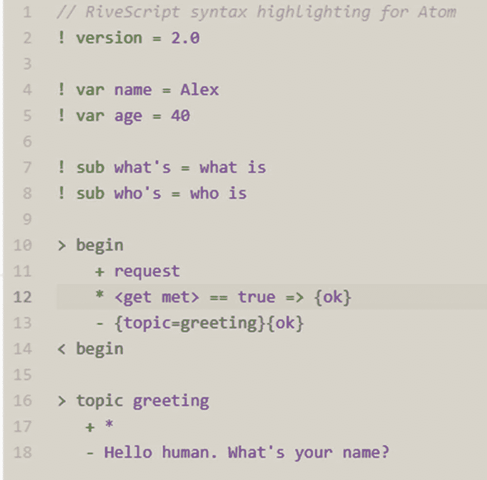
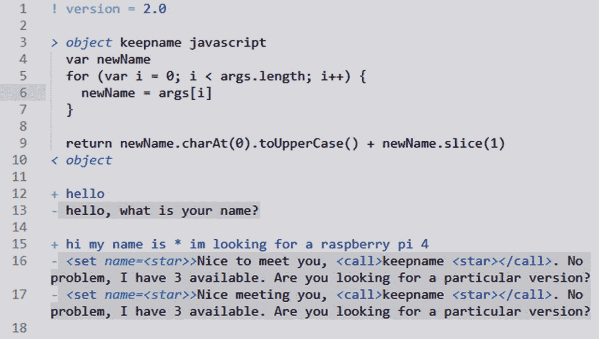
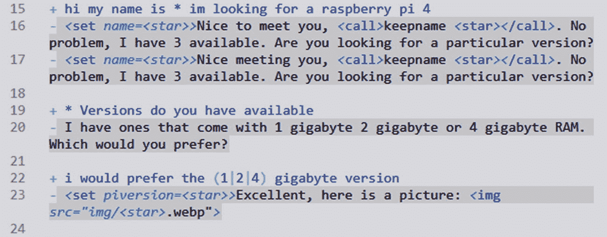
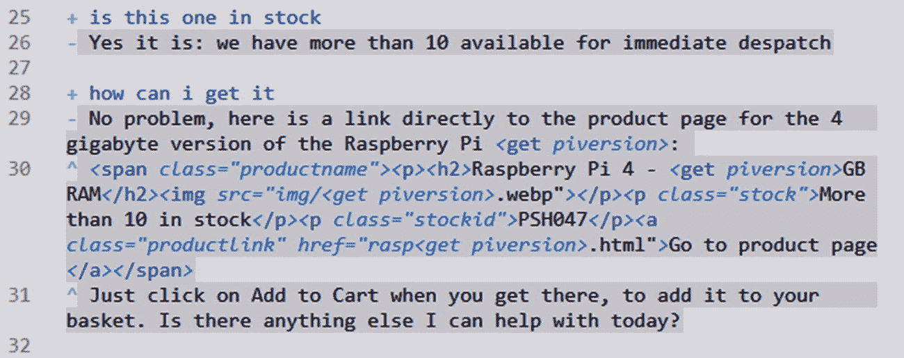
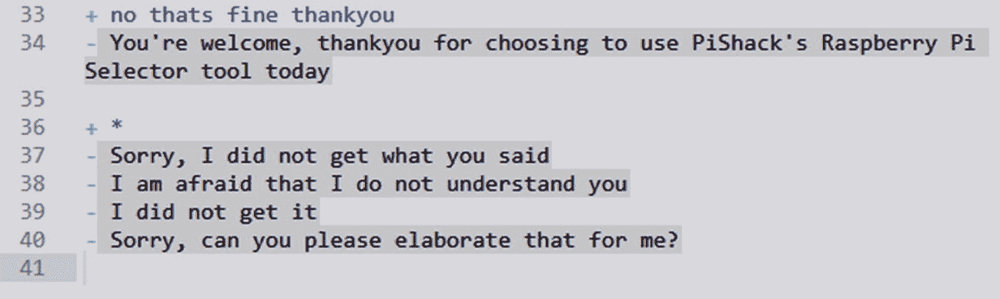
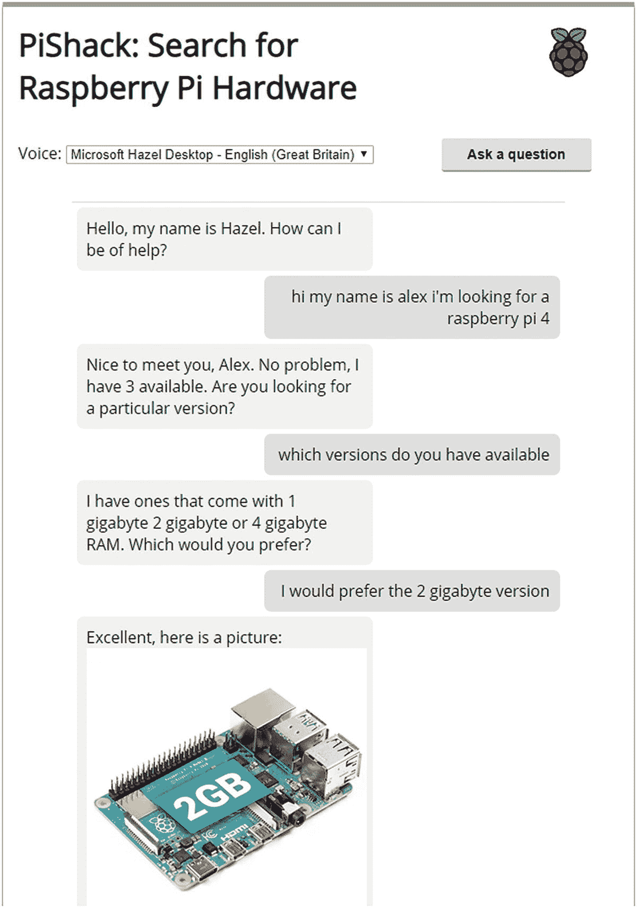
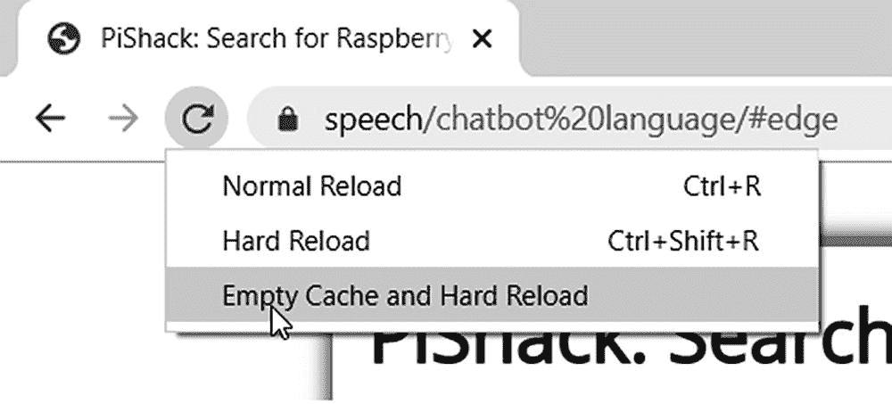
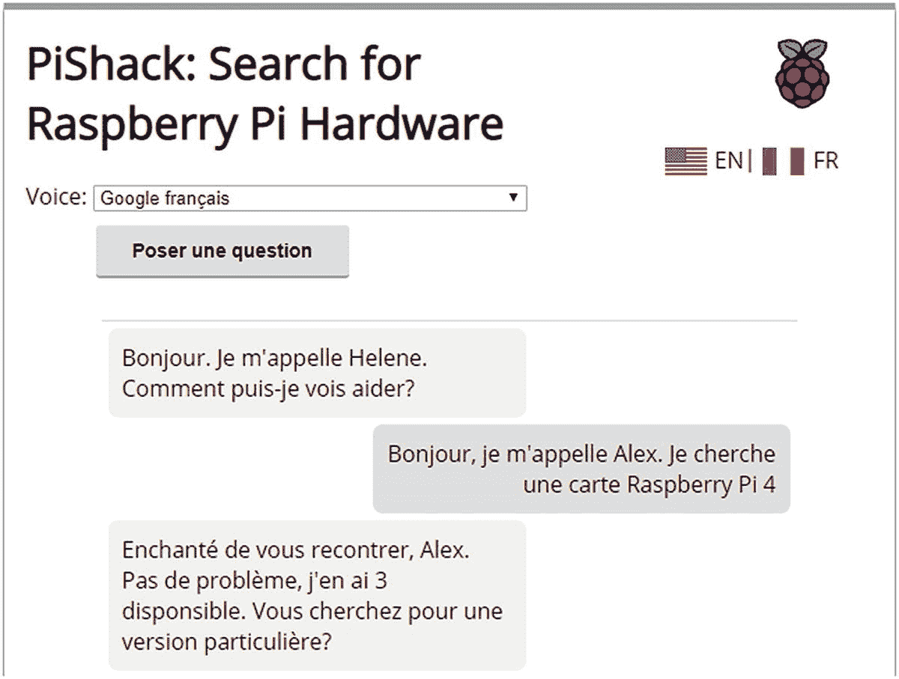

# 四、组合 API：构建聊天机器人

在上几章的课程中，我们已经详细研究了 Speech API，并使用它建立了一些基本的语音功能示例。然而，这仅仅是开始，我们还可以做更多的事情！利用 API 为我们提供了许多创新的想法，这还是在我们对提供给客户的功能进行个性化之前。

在本书的剩余部分，我们将充分利用 API 来构建各种项目，展示我们如何添加语音功能。这将包括从留下语音反馈到结账过程自动化部分等功能。不过现在，我们将把这两个 API 结合在一起，构建一个简单的聊天机器人，它将响应一些基本短语，并在屏幕上显示结果。我相信有人曾经说过，我们必须从某个地方开始，所以没有比设置场景和探索如何使用聊天机器人对我们有益的更好的地方了。

## 为什么要使用聊天机器人？

那么，我们为什么要使用聊天机器人呢？是什么让他们如此特别？

传统上，公司有客户服务团队，他们可能会处理各种不同的请求，从安排退款到帮助诊断您的互联网接入问题。这将成为一种昂贵的资源使用，尤其是当客户可能经常问同样类型的问题时！只要小心，我们可以创建一个聊天机器人来为我们处理这些问题，这有助于将员工从需要人工干预的更复杂的查询中解放出来。

这是好事吗？好吧，可以，也可以不可以。聊天机器人可以被设置成允许针对特定任务进行基于上下文的对话；虽然这让员工可以处理更复杂的请求，但如果聊天机器人没有配置为最佳体验，同样会导致问题！从某种意义上说，如果我们决定使用机器人，我们应该更加重视让客户感觉特别——它们可以很好地完成日常任务，但如果他们觉得我们对机器人的使用不够完美，我们会被视为廉价并让客户却步。这一点尤其重要，因为 Gartner 等重量级公司预测，到 2020 年，30%的浏览将由使用无屏幕设备的用户完成。这意味着聊天机器人的使用将会增加，特别是在社交媒体领域——毕竟，在哪里最有可能找到人，特别是如果他们需要抱怨糟糕的服务？

### 构建聊天机器人时需要考虑的事项

好的，我们已经决定我们需要建立一些东西，但是它应该是什么，它应该为谁服务？

这些都是好问题；构建一个机器人不应该被视为省钱的借口，而是可以帮助增加现有人员，让他们承担更高要求或更复杂的查询。不过，我们考虑哪个利基市场并不重要。我们应该将一些最佳实践视为构建 bot 的第一步:

*   你的顾客或用户会希望只由真人来服务吗？

*   您的用例是否更适合替代渠道——例如网站或本地应用？

*   你如何让终端用户知道他们在和一个机器人或者一个真人聊天？对话可能会从前者开始，但有时可能需要将它们交给一名现场代理。

*   机器人需要处理多少任务？您的机器人可能会收集各种信息，但理想情况下应该负责处理每个流中的一两个项目——这是一个质量超过数量的问题！

*   机器人会对您的环境产生多大影响——自动化少量任务是否会为您的公司带来真正的好处，或者回报是否不值得付出努力？

在这一点上，您可能认为我们稍微偏离了使用语音 API 的主题，但这是有充分理由的:如果基本对话不是最佳的，那么添加语音功能就没有什么意义！重要的是，不仅要考虑要使用的声音和他们是否可以选择使用哪个等话题，还要考虑对话是否自然，是否包含正确的短语，以及我们的回答是否符合客户在与我们的聊天机器人互动时会使用的短语。

### 机器人的缺点

创造一个机器人，尤其是一个会说话的机器人，是件好事，但他们可能会有一个潜在的缺点——他们只能模拟人类的互动。一个机器人的好坏取决于它的配置；从功能上来说，它可能是完美的，但如果使用的短语和术语选择不当，那么这只会让人们望而却步！

他们是否会说话并不重要，事实上，如果他们的谈话不自然，增加语音功能只会让客户更加沮丧。任何依靠语音交互来完成在线任务的人都会特别感受到这一点。这意味着，作为使用我们在本书中探索的语音 API 创建东西的一部分，我们绝对需要考虑一些主题，如使用正确的声音，以及在配置我们的机器人时正确的术语或措辞。

这是一个值得进行大量研究的领域——你能承担的越多越好！作为其中的一部分，了解可用的机器人类型很重要，因为这不仅会影响我们如何构建它们，还会影响它们的语音功能。机器人有各种各样的伪装，但可以大致分为两种不同的类型。让我们依次看一下它们，并更详细地看一下它们是如何相互叠加的。

## 不同类型的聊天机器人

为了帮助理解和最小化使用机器人的缺点，我们可以将它们大致分为两个不同的组:**事务型**(或无状态)和**会话型**(有状态)。这对我们意味着什么？嗯，有一些关键的区别:

*   事务性或无状态机器人不需要历史记录——每个请求都被视为离散的，机器人只需要理解用户的请求就可以采取行动。事务型机器人非常适合自动化快速任务，我们期待简单的结果，例如检索当前的互联网带宽使用情况。

*   对话式或状态式机器人依靠历史和信息收集来完成任务。在这种情况下，机器人可以提出问题，解析响应，并根据用户的响应确定下一步行动。这种类型的 bot 非常适合自动化更长、更复杂的任务，这些任务有多种可能的结果，但可以在构建过程中预测到。

考虑到这一点，让我们把它变成更实际的东西。我们已经指出，每种机器人类型更适合某些任务；表 4-1 显示了这些任务的一些示例。

表 4-1

bot 类型的一些实例

<colgroup><col class="tcol1 align-left"> <col class="tcol2 align-left"></colgroup> 
| 

bot 的类型

 | 

一些实际应用的例子

 |
| --- | --- |
| **交易机器人** | 交易型机器人无法记住之前与用户的交互，也无法与用户保持长时间的对话:Alexa 关灯、播放歌曲或启动/解除室内警报通过短信确认预约谷歌助手检查和报告天气 |
| **对话机器人** | 对话机器人维护对话的状态，并在对话之间传递信息:在餐厅预订——机器人需要知道聚会的规模、预订时间和座位偏好，以便进行有效的预订进行多问题调查采访用户以报告问题 |

唷！我们几乎已经到了开始建造我们自己的工厂的时候了。我保证！我知道看起来我们已经讨论了很多理论，但这很重要:增加语音功能只是成功的一半。决定性因素(用一个战斗术语？)是我们需要做的，以确保当我们的机器人说话时，它看起来很自然，并且对我们的客户和我们的初始需求都有预期的效果。

如果你想更深入地研究构建聊天机器人背后的理论，在*聊天机器人杂志*网站上有一篇很棒的文章，网址是 [`https://chatbotsmagazine.com/how-to-develop-a-chatbot-from-scratch-62bed1adab8` c](https://chatbotsmagazine.com/how-to-develop-a-chatbot-from-scratch-62bed1adab8c) 。

好了，我们终于完成了理论。让我们转向更实际的问题吧！我们将构建一个简单的例子，在屏幕上同时呈现口头和视觉上的响应；和任何项目一样，让我们从设置本章将要构建的背景开始。

## 设置背景

我的一个朋友给我发了一封电子邮件，提出了一个相当有趣的请求:

> *“嘿，亚历克斯，你知道我在网上开了一家小公司，卖覆盆子酱包，对吧？嗯，我真的想添加一些东西来帮助我的客户更容易找到工具包！我知道你喜欢尝试新东西。想帮我创造点什么吗？如果可以的话，我很想让它有所创新。有想法吗？”*

好吧，我承认:那是一个虚构的朋友，但除此之外，这正是我喜欢做的事情！如果这是一个真实的请求，我的第一反应将是创建一个聊天机器人，我们可以在其中添加语音功能。出于本书的目的，我们将保持简单，仅限于搜索不同的 Raspberry Pi 第 4 版电路板。同样的原则也可以用于搜索其他相关产品(我们将在本章末尾更多地讨论这一点)。

我们将为我虚构的朋友 Hazel(是的，这个名字在早期的演示中应该很熟悉)构建一个聊天机器人，他经营着一家名为 PiShack 的公司。我们的演示将主要基于文本，但包括一些简单的元素，如在我们的对话中显示图像和基本的 HTML 标记。聊天机器人将用于查找 Raspberry 4 板产品，然后在屏幕上显示选择的产品，并向客户提供链接和基本股票信息。

### 保持事物在范围内

与任何项目一样，我们需要定义应该包括什么的参数，以帮助保持事情在正轨上。

谢天谢地，这对于我们的演示来说非常简单；我们将进行一次基本对话，引导客户从三种板类型中选择一种。根据他们的选择，我们将显示该电路板类型的图像，以及零件号和库存可用性。然后，我们将模拟显示一个虚拟产品页面的链接；对于本演示，我们将不包括产品页面。可以说，这可以链接到现有项目中的任何页面，因为这只是一个标准链接-确切的链接可以生成，这取决于我们的客户的反应。

好吧，记住这一点，让我们继续。现在我们已经设置好了场景，我们需要构建我们演示的各种元素，这样我们就可以更详细地看到它们是如何组合在一起的。

## 构建我们的演示

对于我们的演示，我选择保持简单，强调除非必要，否则不要使用额外的工具。有几个原因:第一个原因是，为我们的聊天机器人引入依赖关系可能会引入与我们项目中的其他元素不兼容的软件。

有几十个不同的聊天机器人库可用，但我决定在这个项目中使用的是 RiveScript。可从 [`https://www.rivescript.com/`](https://www.rivescript.com/) 获得，它是一种开源脚本语言，有许多不同的语言解释器，如 Python，Go，或者，在我们的情况下，JavaScript。虽然这是个人的选择，但是使用这个库有几个好处:

*   它(解释器，而不是库)是用纯 JavaScript 编写的，所以依赖性很小；如果需要，可以在 Node.js 下运行一个版本，尽管对于简单的使用来说这不是必需的。

*   它的语法非常容易学习——您可以非常快速地整理一个基本的配置文件，从而有更多的时间来微调与聊天机器人交互的触发器和响应。

*   它不是由要求您在线编辑 XML 文件或复杂配置的大型商业公司制作的——您需要的只是一个文本编辑器和您的想象力！

*   它是开源的，所以如果需要可以修改；如果您有问题，那么其他开发人员可能会帮助提供修复，或者您可以根据自己的需要进行调整。

*   它可以托管在内容交付网络(或 CDN)链接上，以便从本地点快速访问；以这种方式交付的内容也将被缓存，这使得它更快。如果需要，我们还可以在 CDN 链路无法运行时提供本地备用方案。

在这一点上，有必要问一个问题:我还可以使用什么其他选项？有几十种，但是许多依赖于复杂的 API 或者必须在线管理。这不一定是一件坏事，但是当开始使用聊天机器人，特别是 Web 语音 API 时，它确实增加了一层额外的复杂性！除此之外，让我们花一点时间来更详细地介绍一些现在或将来可能感兴趣的替代方案。

### 可用的替代工具

在为这本书进行研究时，我遇到了几十种不同的工具和库，它们提供了构建聊天机器人的能力——我选择在我们即将构建的演示中不使用其中的许多工具和库，主要是因为它们已经有一段时间没有更新了，涉及复杂的设置，必须在线设置，或者被绑定到一个专有产品中，如果情况发生变化，很难摆脱这些工具和库。

也就是说，我确实遇到了一些有趣的例子，它们设置起来并不复杂，值得一试:

*   wit . ai-可从 [`https://wit.ai/`](https://wit.ai/) 获得，这个脸书拥有的平台是开源的，易于设置和使用。它有各种可用的集成，包括 Node.js，因此可以很好地与语音识别和合成 API 一起工作。

*   BotUI–这是一个简单易用的框架，可从 [`https://botui.org/`](https://botui.org/) 获得；它处理每个触发器/响应的结构比 RiveScript 更严格，需要将每一对都构建到主代码中，而不是配置文件中。

*   如果你曾经花时间为 CMS 系统开发代码，那么你肯定听说过 WordPress。位于 [`https://botpress.io/`](https://botpress.io/) 的 Botpress 将自己描述为“聊天机器人的 WordPress”，在这里任何人都可以为聊天机器人创建和重用模块。这是一个混合产品，虽然主要是开源的，但它也有针对更多企业级需求的许可，因此这将是未来发展的一个好方法。这个库还有一个可视化编辑器，在与 Node.js 集成之前，可以很容易地构建初始的 chatbot 触发器和响应。

需要注意的重要一点是，将语音 API 集成到聊天机器人中不太可能是简单的“轻触开关”或设置配置参数的事情。任何这样的整合都需要努力——多少取决于我们使用的聊天机器人库！

好了，设置的下一步是为我们的文本编辑器添加语法高亮支持。RiveScript 提供了一些更流行的插件，如 Sublime Text 或 Atom。在进入更紧迫的问题之前，让我们赶快把这件事解决掉吧！

如果你使用一个更专业的编辑器或者一个没有在 [`https://www.rivescript.com/plugins#text-editors`](http://www.rivescript.com/plugins%2523text-editors) 中列出的编辑器，那么请随意跳到下一节；这不会影响演示的操作方式。

## 添加文本编辑器支持

虽然我们在编辑 RiveScript 文件时几乎可以使用任何语法荧光笔(毕竟它们只是纯文本文件)，但添加一个专用的荧光笔绝对有助于使您的代码更容易阅读。

RiveScript 为更受欢迎的编辑提供了几个，分别是[`https://www.rivescript.com/plugins#text-editors`](http://www.rivescript.com/plugins%2523text-editors)；这包括 Atom、Sublime Text 和 Emacs。图 4-1 展示了在安装了插件的 Atom 中运行代码时的样子(见下页)。



图 4-1

文本编辑器中 RiveScript 语法的屏幕截图

我相信你会同意，这当然有助于阅读(并随后理解)代码！假设你已经安装了一个合适的语法荧光笔(本章后面的截图将展示 Sublime 文本中的例子)，让我们继续并完成剩下的准备过程。

## 将工具放置到位

对于我们的下一个项目，我们将需要利用一些额外的工具来帮助开发和运行。让我们看看我们需要什么:

*   我们将需要一些网络空间，已经使用 HTTPS 访问安全-你可以使用测试服务器上的网络空间或安装一个本地网络服务器，如 MAMP 专业为此目的。这个 web 服务器特别擅长创建 SSL 证书；您将需要一些东西来允许 Web 语音 API 正确运行！这是一个商业产品，从 [`https://www.mamp.info`](https://www.mamp.info) 开始提供，适用于 Windows 和 Mac 平台。如果你更喜欢手动操作，那么我建议你试试 Daksh Shah 的脚本，可以在他的 GitHub repo 的 [`https://github.com/dakshshah96/local-cert-generator/`](https://github.com/dakshshah96/local-cert-generator/) 找到。这包含安装 Linux 和 Mac 证书的说明；使用“为 windows 安装证书”在线搜索有关如何为 Windows 安装证书的文章。

*   为了方便起见，我们将为这一章建立一个项目文件夹——出于本书的目的，我将假设你称它为 speech，并且它在你本地 PC 的硬盘上。如果您使用不同的方法，请根据需要调整演示中的步骤。

*   我们将用来构建聊天机器人的主要工具是 RiveScript 库，可从 [`https://www.rivescript.com/`](https://www.rivescript.com/) 获得。这是一种用于编写聊天机器人的基于 JavaScript 的语言，它有各种不同的接口，很容易学习。该库以 CDN 格式提供，也可以使用 Node.js 安装——为了简单起见，我们将在演示中使用前者。

Note

为了这个演示的目的，我将假设项目区域被设置为在`https://speech/`下工作；如果您的环境不同，或者您更喜欢继续使用 CodePen，那么演示可以在这种环境下工作；使用本地设置会给你更多的控制。

好了，有了这三个管理任务，让我们继续，开始构建我们的演示！

## 构建我们的聊天机器人

我们的演示将包含相当多的代码，所以我们将通过两个练习把它们放在一起；在我们继续第二部分之前，这将给你一个休息的机会。第二部分将负责用我们选择的问题和答案来配置聊天机器人；在此之前，让我们先来看看如何设置我们的聊天机器人的功能。

Building the Chatbot, Part 1: The Functionality

我们演示的第一步是获得 RiveScript 的最新副本——可以从 [`https://www.rivescript.com`](https://www.rivescript.com) 获得。出于本练习的目的，我们将使用从`unpkg.com`获得的 CDN 版本，它已经在 HTML 标记文件中设置好了。

Node.js 也有一个版本——详情请见 [`https://www.rivescript.com/interpreters#js`](https://www.rivescript.com/interpreters%2523js) 。

让我们继续构建演示的第一部分:

1.  我们将从本书附带的代码下载中提取一个`chatbot`文件夹的副本开始；将它保存到我们项目区域的根目录。

2.  在该文件夹中，在`js`子文件夹中创建一个新文件，将其另存为`script.js`。

3.  我们将使用它来为我们的聊天机器人设置功能，为此我们将有相当多的代码。不要担心，我们会一条一条来！我们首先声明将在整个演示中使用的全局变量，并初始化 RiveScript 的一个实例:

    ```html
    let bot = new RiveScript();

    const message_container = document.querySelector('.messages');
    const form = document.querySelector('form');
    const input_box = document.querySelector('input');
    const question = document.querySelector('#help');
    const voiceSelect = document.getElementById('voice');

    ```

4.  接下来，漏掉一行，然后添加以下函数和函数调用——它们负责将声音加载到我们的演示中:

    ```html
    function loadVoices() {
      var voices = window.speechSynthesis.getVoices();

      voices.forEach(function(voice, i) {
        var option = document.createElement('option');
        option.value = voice.name;
        option.innerHTML = voice.name;
        voiceSelect.appendChild(option);
      });
    }

    loadVoices();

    // Chrome loads voices asynchronously.
    window.speechSynthesis.onvoiceschanged = function(e) {
      loadVoices();
    };

    ```

5.  接下来的两个函数完成了我们演示的第一部分——第一个函数负责基本的错误处理，而第二个函数负责在请求时发出声音。添加上一步下面的代码，中间留一个空行:

    ```html
    window.speechSynthesis.onerror = function(event) {
      console.log('Speech recognition error detected: ' + event.error);
      console.log('Additional information: ' + event.message);
    };

    function speak(text) {
      var msg = new SpeechSynthesisUtterance();
      msg.text = text;

      if (voiceSelect.value) {
        msg.voice = speechSynthesis.getVoices().filter(function(voice) {
          return voice.name == voiceSelect.value;
        })[0];
      }

      speechSynthesis.speak(msg);
    }

    ```

6.  现在，我们继续设置和配置我们的聊天机器人——我们从声明一个常量来导入我们的触发器和响应开始。下一行需要放在 speak()函数之后，中间留一个空行:

    ```html
    const brains = [ './js/brain.rive' ];

    ```

7.  接下来，继续添加这个事件处理程序——它管理任何使用聊天机器人的人提交的每个问题:

    ```html
    form.addEventListener('submit', (e) => {
      e.preventDefault();
      selfReply(input_box.value);
      input_box.value = “;
    });

    ```

8.  我们现在需要在屏幕上呈现每个问题(或触发)和适当的回答——这是下面两个函数的责任:

    ```html
    function botReply(message){
      message_container.innerHTML += `<div class="bot">${message}</div>`;
      location.href = '#edge';
    }

    function selfReply(message){
      var response;

      response = message.toLowerCase().replace(/[.,\/#!$%\^&\*;:{}=\-_`~()]/g,"");
      message_container.innerHTML += `<div class="self">${message}</div>`;
      location.href = '#edge';

      bot.reply("local-user", response).then(function(reply) {
        botReply(reply);
        speak(reply);
      });
    }

    ```

9.  本演示的脚本部分已经接近尾声；我们还要添加两个函数和一个事件处理程序。在上一个步骤之后留出一行空白，然后添加以下内容:

    ```html
    function botReady(){
      bot.sortReplies();
      botReply('Hello, my name is David. How can I be of help?');
    }

    function botNotReady(err){
      console.log("An error has occurred.", err);
    }

    question.addEventListener("click", function() {
      speak("hello. my name is David. How can I be of help?");
      bot.loadFile(brains + "?" + parseInt(Math.random() * 100000)).then(botReady).catch(botNotReady);
    });

    ```

10.  现在，继续保存文件，我们可以暂时将其最小化，然后进入本演示的下一部分。

在这个阶段，我们有一个半完整的演示，但是如果我们现在运行它，它不会做很多事情！这样做的原因是，我们还有一部分需要添加:我们聊天机器人的问题和答案。尽管设置这一部分相对简单，但仍有大量代码需要完成。让我们深入了解一下细节。

### 配置我们的聊天机器人

为了让我们的聊天机器人可以运行，我们将使用 RiveScript 库；它为各种语言提供了不同的解释器，比如 Python、Go 或 JavaScript。

这是一种很容易学习的语言，尽管它有一个怪癖，需要一点时间来适应:我们预先配置机器人的所有问题都必须是小写的！谢天谢地，在屏幕上显示它们时，这不是问题；我将在下一个演示结束时解释更多，但让我们把注意力集中在如何配置我们的聊天机器人并准备好使用。

Building the Chatbot, Part 2: The Functionality

让我们通过添加聊天机器人缺少的问题和答案来完成我们的演示。我们将在每个模块中添加内容，但为了有助于编辑，我还会在不同的地方添加截图，以便您可以检查进度:

1.  首先创建一个空白文件，将其作为`brain.rive`保存在我们在本演示的第一部分中创建的 chatbot 文件夹的`js`子文件夹中。

2.  在文件的顶部，继续添加这一行——这将强制 RiveScript 编译器使用 2.0 版的 RiveScript 规范:

    ```html
    ! version = 2.0

    ```

3.  我们的文件包含了一个简单的 RiveScript 函数，我们用它来确保我们客户的名字是大写的(在本章的后面会有更多的介绍)。留下一行然后加入下面的代码:

    ```html
    > object keepname javascript
      var newName
      for (var i = 0; i < args.length; i++) {
        newName = args[i]
      }

      return newName.charAt(0).toUpperCase() + newName.slice(1)
    < object

    ```

4.  接下来，我们开始添加每个陈述(成对出现-一个问题和一个答案)。你会注意到每个都以+或-开头；前者是问题或触发器，而–表示回应。继续添加第一个，客户可以向机器人问好并收到适当的响应:

    ```html
    + hello
    - hello, what is your name?

    ```

5.  接下来的三个陈述有点复杂，这一次，顾客说出他们的名字，并说出他们想要什么:

    ```html
    + hi my name is * im looking for a raspberry pi 4
    - <set name=<star>>Nice to meet you, <call>keepname <star></call>. No problem, I have 3 available. Are you looking for a particular version?
    - <set name=<star>>Nice meeting you, <call>keepname <star></call>. No problem, I have 3 available. Are you looking for a particular version?

    ```

此时，如果一切正常，我们的 brain.rive 文件中应该有以下代码，如图 4-2 所示。



图 4-2

brain.rive 文件的第一部分

让我们继续下一部分:

1.  列表中的下一个问题包含一个条件语句，这一次，我们将询问客户更喜欢查看哪个版本:

    ```html
    + * versions do you have available
    - I have ones that come with 1 gigabyte 2 gigabyte or 4 gigabyte RAM. Which would you prefer?

    ```

2.  在接下来的一对陈述中，客户确认他们想要看到哪个版本；我们展示该产品的适当图像:

    ```html
    + i would prefer the (1|2|4) gigabyte version
    - <set piversion=<star>>Excellent, here is a picture: .webp">

    ```

让我们暂停一下。如果一切顺利，图 4-3 显示了我们现在应该拥有的代码，作为我们`brain.rive`文件的下一部分。



图 4-3

brain.rive 文件的第二部分

让我们继续添加代码:

1.  接下来是一个简单的问题——这一次，我们要查看所需产品是否有货:

    ```html
    + is this one in stock
    - Yes it is: we have more than 10 available for immediate despatch

    ```

2.  接下来的部分是最复杂的部分，在这里，我们建立了一些关于产品的简要细节和一个链接，让客户可以直接导航到该产品的产品页面:

    ```html
    + how can i get it
    - No problem, here is a link directly to the product page for the 4 gigabyte version of the Raspberry Pi <get version>:
    ^ <span class="productname"><p><h2>Raspberry Pi 4 - <get piversion>GB RAM</h2>.webp"></p><p class="stock">More than 10 in stock</p><p class="stockid">PSH047</p><a class="productlink" href="rasp<get piversion>.html">Go to product page</a></span>
    ^ Just click on Add to Cart when you get there, to add it to your basket. Is there anything else I can help with today?

    ```

在图 4-4 中，我们可以更清楚地看到我们的代码应该是什么样子。



图 4-4

brain.rive 文件中的下一个代码块

1.  然后，我们以两个问题结束——第一个承认不需要进一步的帮助，第二个是一个通用的总括问题，以防我们的聊天机器人在理解问题时出现问题:

    ```html
    + no thats fine thankyou
    - You're welcome, thankyou for choosing to use PiShack's Raspberry Pi Selector tool today

    + *
    - Sorry, I did not get what you said
    - I am afraid that I do not understand you
    - I did not get it
    - Sorry, can you please elaborate that for me?

    ```

我们可以在图 4-5 中看到 brain.rive 文件的最终部分。



图 4-5

brain.rive 文件的最后一部分



图 4-6

我们完成的聊天机器人，在对话的开始

1.  此时，继续保存文件，我们现在可以测试结果了！为此，浏览至`https://speech/chatbot`，点击提问，开始输入信息，如图 4-6 摘录所示。

当您测试您的演示时，您可能会发现使用 RiveScript 的一个特殊的怪癖 brain.rive 文件被缓存，如果您随后对其进行更改，这将使您更难确定您运行的是一个更新的版本！有一个快速的技巧可以帮助你做到这一点，尽管它只在你使用 Chrome 的时候有效。只需点击并按住 reload 按钮，强制其显示一个清除缓存的选项，并执行硬重新加载，如图 4-7 所示。



图 4-7

使用 Chrome 执行硬重新加载

好了，我们完成了构建，现在我们应该有了一个工作聊天机器人的基础，它可以发出每个响应并在屏幕上显示出来。我们在本书的前面已经看到了用于前者的大部分代码。然而，这个演示展示了一些有用的观点，所以让我们深入研究一下这个代码。

## 详细研究代码

如果我们仔细看看我们刚刚创建的演示中的代码，我可以想象您的第一反应会是什么——哎呀！是的，代码看起来确实有点复杂，但实际上它比乍看起来要简单。让我们从 HTML 标记开始，一块一块地把它拆开。

### 剖析我们的 HTML 标记

这个文件中的大部分内容相当简单——一旦定义了对 CSS 样式文件的引用，我们就设置一个`#page-wrapper` div 来包含我们所有的内容。然后我们创建一个`.voicechoice`部分来放置允许我们选择使用哪种语言的下拉菜单，以及询问问题的初始按钮。

接下来是`.chat`部分，我们用它来呈现我们与机器人的对话；消息呈现在`.messages <div>`元素中。然后我们有一个表单来提交每个问题，最后引用 RiveScript 库和我们的自定义`script.js`文件。

### 拆开 script . js:Web 语音 API

我们已经介绍了演示中最简单的部分，即标记。这是事情变得更有趣的地方！`script.js`和`brain.rive`文件是最神奇的地方——在前者中，我们将语音/音频代码与我们的聊天机器人功能相结合，而在后者中，我们为我们的聊天机器人存储各种问题和回答。让我们打开`script.js`文件的副本，更详细地看看我们的聊天机器人演示是如何工作的。

在定义一系列变量之前，我们首先将 RiveScript 的一个实例初始化为一个对象，以缓存 HTML 标记中的各种元素。我们代码中的第一个函数`loadVoices()`，负责调用语音合成 API 来获取我们将在代码中使用的各种声音，比如英语(英国)。值得注意的是，我们*指定引用*来调用这个函数两次；这是为了允许一些旧的浏览器(特别是 Chrome)，它们要求我们异步加载下拉菜单。大多数情况下，我们会简单的调用`loadVoices()`；对于那些需要它的浏览器，下拉列表将使用来自`window.SpeechSynthesis`接口的`onvoiceschanged`事件处理程序来填充。

继续，我们创建的下一个函数是`onerror`事件处理程序，同样来自于`window.SpeechSynthesis`接口；这是对使用接口时出现的任何错误的基本概括。现在，我们简单地呈现使用`event.error`和`error.message`给出的错误类型。值得注意的是`event.error`会给出一个具体的错误代码，比如音频捕获。任何`error.message`语句都应该由我们作为开发者来定义；该规范没有定义要使用的确切措辞。

错误代码列表可在 MDN 网站 [`https://developer.mozilla.org/en-US/docs/Web/API/SpeechRecognitionError/error`](https://developer.mozilla.org/en-US/docs/Web/API/SpeechRecognitionError/error) 获得。

这部分代码分解的最后一个功能是`speak()`——这是我们表达内容的地方！首先初始化一个新的`SynthesisUtterance`实例，然后定义要使用的文本(例如，来自机器人的响应)，以及应该使用的声音。假设没有发现问题，那么就由 API 使用`speechSynthesis.speak(msg)`语句来说。

唷！我们已经完成了演示的大部分，尽管还有一部分:配置我们的机器人！我建议在这个阶段休息一下——也许去喝一杯或者呼吸一些新鲜空气。一旦你准备好继续，让我们继续探索用于配置我们的机器人更详细的语句。

## 了解我们的机器人是如何配置的

尽管大部分神奇的事情发生在我们的`script.js`文件中，但是如果没有 bot 配置文件`brain.rive`，我们的演示将是不完整的。

快速浏览一下这个文件，我们应该能认出一些元素——毕竟，它的大部分看起来像纯文本，开头是一些基本的 JavaScript 代码，对吗？是的，你这么说是对的，但是 RiveScript 有一些不寻常的字符关键字，我们需要在这段代码中注意。让我们从代码的顶部开始，一点一点地浏览它——在我们这样做之前，现在是一个快速了解 RiveScript 如何工作的好机会。

### 探索 RiveScript 如何工作:概述

我们使用 RiveScript 创建的任何配置都存储为`.rive`文件。`.rive`文件的一个共同特征是，你会看到大多数行以感叹号、加号或减号开头，箭头和括号会出现几次，就像我们的例子一样。这很重要，因为它们定义了所使用的语句类型。表 4-2 中列出了我们在示例中使用的方法。

表 4-2

brain.rive 中使用的特殊字符类型

<colgroup><col class="tcol1 align-left"> <col class="tcol2 align-left"></colgroup> 
| 

性格；角色；字母

 | 

目的

 |
| --- | --- |
| +或加号 | 这表示来自用户的触发问题。 |
| *或星形 | 这充当了一个占位符来接受来自用户的数据，比如一个名字或者像“哪个版本…”或者“什么版本…”这样的问题(就像我们的例子一样)。 |
| -或者负号 | 这充当了机器人对用户的响应。 |
| ( )和&#124;或括号和管道符号 | 当一起使用时，这表示一种选择——rive script 将以类似于星号占位符的方式处理它接收到的内容，但这一次，我们将选择限制在三个选项中的一个，即 1、2 或 4。 |
| ^或箭头 | 这是一个换行符，在这种情况下，响应最好在多行中提供。 |
| ！或者感叹号 | 这表示一个 RiveScript 指令，比如指定使用哪个版本的规范。 |

在大多数情况下，我们可能会使用加号或减号(如我们的例子)。考虑到这一点，让我们更详细地逐一探究这些语句。

### 详细剖析 brain.rive 文件

我们从`! version=2.0`开始，它告诉 RiveScript 我们正在开发库的 2.0 规范；如果这被设置为一个较低的数字(例如，早期版本)，那么我们的代码就有可能无法按预期工作。

现在，我们将跳转到第 12 行，在那里我们有`+ hello`——我们将很快回到`> object...< object`标签中的代码。第 12 行的代码应该是不言自明的；此时，用户将输入 hello 作为我们的初始触发器，机器人将对此做出相应的响应。

下一个街区更有趣一点。这里，我们使用`+`符号指定了一个触发问题；在这个例子中，我们使用了星星。星号是用户给定的一段特定文本的占位符——例如，如果他们使用了名称标记，那么给定的文本将等同于`"hi my name is Mark im looking for a raspberry pi 4."`。这本身很简单，但是看看响应:我看到的`<call>`标记是什么？那么`<set name=....>`代码又是怎么回事呢…？

前者是对 RiveScript/JavaScript 函数的调用。还记得我在本节开始时说过要跳过的代码吗？这就是这个函数的代码——我们用它来确保不管传递给它什么名字，它总是以首字母大写的形式出现在屏幕上。值得注意的是，RiveScript 在触发器中使用时将始终以小写形式格式化变量；我们使用这个函数来显示更适合用户的东西。

接下来的三个问题遵循类似的原则，其中触发器文本是小写的，我们在这三个问题的第一个中使用了一个星号占位符。不过有一个例外:管道和支架的使用。这里我们指定了一些可以被识别的选项；与星号不同的是，任何东西都可能与陈述相匹配，唯一允许的匹配将是数字`1`、`2,`或`4`。然后，我们利用`<star>`占位符中匹配的数字来设置一个名为`piversion`的变量(我们稍后会用到)，作为插值标签的一部分，为所选版本的 Raspberry Pi 板显示适当的图像。

继续前进，下一个街区是最大的——它看起来很吓人，但实际上，它并没有那么复杂！有两件事需要注意:首先，我们`<get piversion>`并使用它在屏幕上的一小块 HTML 标记中呈现产品名称和图像。第二种是使用`^`或帽子符号；这允许我们将来自 bot 的响应分成几行。我相信你可以想象，像我们这样的一段文字如果组合成一行，看起来会很糟糕。这使我们更容易在屏幕上观看。

然后，我们以两个触发器结束–最后一个触发器来自客户，确认这是他们唯一需要帮助的事情，以及来自机器人的适当确认。最后一个触发器是一个通用的总括触发器，如果出现问题，它就会发挥作用:这很可能是因为用户输入了与我们预先编写的响应不匹配的内容。我们提供了许多可供机器人使用的替代方案；如果它需要在与用户的对话中使用它，它会依次自动选择一个。

唷！这是一个冗长的解释。如果你能走到这一步，那就太好了！在这个演示中有很多内容要介绍，但是希望它向您展示了在使用自动聊天机器人时，我们如何利用 Speech API 来添加额外的维度。我们只是触及了可能的表面，更不用说我们应该考虑的了；后者有几个要点，让我们暂停一下喘口气。去喝杯咖啡或饮料，让我们继续深入一些领域，在这些领域中，我们可以将我们的演示开发成一个功能更加完整的示例。

## 更进一步

在本章的过程中，我们构建了一个简单的聊天机器人，允许我们从三个 Raspberry Pi 4 板中选择一个，并询问它们的可用性以及如何购买。这是一个直截了当的请求，但是正如您可能已经看到的，还有一些改进的空间！

在这种情况下，我们应该如何调整体验呢？一个领域是我们用过的触发问题；它们有些僵硬，感觉不像我们演示中那样自然或直观。这是需要考虑的一个方面。以下是一些帮助你开始的想法:

*   添加多语言支持–虽然英语被广泛使用，但并不是每个人都会说英语！由于文化差异，它也引入了误解的风险；能够用客户的母语交谈消除了这种风险，让他们感到更受欢迎。

*   让它成为一个双向的过程——我们关注的只是视觉上和口头上呈现我们的回答，但是如何让你也可以用语言表达你的问题呢？这将特别吸引那些可能有障碍的人，在那里使用键盘将是困难的或不可能的。

    在本书的后面部分，当我们构建 Alexa 的(简单)克隆时，我们会看到类似的东西。

*   微调使用的短语——我们使用的短语是有目的的，但我认为还有改进的空间。例如，我们可能会将某些单词缩写，如“我是”缩写成“我是”，但我们的聊天机器人不允许这样做！当然，这可能更多地与我们如何配置聊天机器人有关，但不要忘记，我们在聊天机器人中放入的内容最终会影响它作为语音输出的方式。

*   包括其他产品——重要的是要考虑我们如何才能最好地做到这一点，以及语音合成配置所需的变化；这种改变需要使得将来添加其他产品变得更加容易，并且最大限度地减少麻烦。

我确信，为了开发我们的项目，我们能够或者可能想要做更多的事情，但是现在，我想把注意力集中在一个特别的变化上:增加语言支持。

网络语音 API 的一个伟大之处在于，我们不以任何方式仅限于英语。我们完全可以添加对多种不同语言的支持！为了证明这一点，在我们的下一个演示中，我们将通过添加法语支持来更新原始聊天机器人。让我们更详细地看看需要做哪些更改来实现这次更新。

## 添加语言支持

对于这个演示，我们将使用原始聊天机器人的现有副本，但添加了语言支持-我选择了法语，因为我会说法语。我们可以很容易地修改代码以使用不同的语言，或者根据需要使用多种语言。我们将通过几个步骤来更新我们的代码。让我们更详细地看看需要什么。

这个演示使用了 [`www.gosquared.com/resources/flag-icons/`](http://www.gosquared.com/resources/flag-icons/) 的旗帜图标——如果你喜欢使用不同的东西，你也可以使用你自己的。

### 更新我们的演示

为了更新我们的演示，我们需要进行四项更改:

1.  第一个是更新我们的标记和样式，以便我们添加我们使用的每个国家的旗帜——在本例中，是美国英语和法语。

2.  我们需要基于设置一个变量来更新语音合成配置，以接受我们的语言选择。

3.  接下来是翻译——我们必须创建一个翻译成每种新语言的`brain.rive`配置文件的版本，并重新配置我们的`script.js`文件以适当地导入每个版本。

4.  所需的最后一项更改是添加事件处理程序，根据需要将`SpeechSynthesisUtterance.lang`设置为我们选择的语言。

考虑到这一点，让我们开始设置我们的演示吧！如前所述，我们将增加法语语言支持——如果您愿意，可以随意将其更改为另一种语言，但您需要手动更新`brain.rive`文件中的翻译文本。

Adding Language Support

开始之前，我们需要做几件事:

1.  从本章前面的原始演示中复制一个您创建的`chatbot`文件夹，并将其作为`chat language`保存在我们的项目文件夹的根目录下。

2.  从本书附带的代码下载副本中，解压`brain config`文件夹，并将内容复制到`chat language`文件夹下的`js`子文件夹中。这些包含了我们的`brain.rive`文件的更新版本，有英语和法语版本。

3.  从相同的代码下载中，继续提取`img`文件夹——将其保存在`chat language`文件夹中`img`文件夹的顶部。这将添加我们将在演示中使用的两个旗帜图标。

一旦你完成了这个，继续这些步骤:

1.  我们需要做的第一组改变是在我们的标记中——我们将引入两个标志作为语言选择器。打开`index.html`，查找从`<button id="help"...`开始的代码行，然后在它之前添加该代码块:

    ```html
    <section class="flags">
      <span class="en-us">EN</span>|
      <span class="fr-fr">FR</span>
    </section>

    ```

2.  接下来，将 disabled 属性添加到`<button>`标签中，如下所示:

    ```html
    <button id="help" disabled>Ask a question</button>

    ```

3.  继续保存此文件-保持打开状态，但现在可以将其最小化。

4.  在这一点上，切换到`scripts.js`文件——我们在这里做了一些改变，从定义一些额外的变量开始。在第一行代码之后，添加如下声明:

    ```html
    let bot = new RiveScript();
    let langSupport, intro, brains;

    ```

5.  接下来，我们需要缓存更多的元素作为变量——为此，继续添加以下四行代码，紧跟在`const question =...`行之后:

    ```html
    const voiceSelect = document.getElementById('voice');
    const english = document.querySelector(".en-us");
    const french = document.querySelector(".fr-fr");
    const voice = document.querySelector(".voicechoice");

    ```

6.  现在我们引入了多语言支持，我们不能硬编码我们的初始问候。相反，我们将把它们作为变量提供，所以在前面的代码块之后留下一行，并添加这两个声明:

    ```html
    const enIntro = "Hello. my name is Hazel. How can I be of help?";
    const frIntro = "Bonjour. Je m'appelle Hélène. Comment puis-je vois aider?";

    ```

7.  向下滚动直到到达`speak()`功能。到目前为止，该语言被隐式设置为`'en-us'`；这需要改变！为此，查找`speakSynthesis.speak`语句，然后修改该函数的最后一部分，如下所示:

    ```html
        })[0];
      }

      msg.lang = langSupport;

      speechSynthesis.speak(msg);
    }

    ```

8.  接下来，删除以`const brains = [...`开头的行，替换为:

    ```html
    function setLanguage(langUsed, selIndex, langIntro) {
      voiceSelect.selectedIndex = selIndex;
      langSupport = langUsed;
      intro = langIntro;
      brains = [ './js/brain-' + langSupport + '.rive' ];
      question.disabled = false;
    }

    ```

9.  我们现在需要添加两个函数来处理当我们点击标志时会发生什么——为此，留下一行，然后放入下面的代码:

    ```html
    english.addEventListener("click", function() {
      setLanguage('en-us', 3, enIntro);
      question.innerHTML = "Ask a question";
    });

    french.addEventListener("click", function() {
      setLanguage('fr-fr', 8, frIntro);
      question.innerHTML = "Poser une question";
    });

    ```

10.  在我们完成编辑这个文件之前，还有两个变化要做——下一个变化是改变`botReady()`函数。向下滚动到它，然后按照下面突出显示的内容进行编辑:

    ```html
    function botReady(){
      bot.sortReplies();
      botReply(intro);
    }

    ```

11.  最后要做的改变是相似的——这里我们需要改变我们称呼开场白的方式。向下滚动到问题事件处理程序，然后根据指示更新`speak()`调用:

    ```html
    question.addEventListener("click", function() {
      speak(intro);
      bot.loadFile(brains + "?" + parseInt(Math.random() * 100000)).then(botReady).catch(botNotReady);
    });

    ```

12.  保存文件-我们现在可以最小化它。

13.  接下来，启动`styles.css`文件，并在文件末尾添加以下样式:

    ```html
    /* flags */
    section.flags {
      width: 150px;
      float: right;
      margin-top: -30px;
    }

    section.flags img { vertical-align: middle; padding-right: 5px;}

    section.flags img:hover { cursor: pointer; }

    button { width: 30%; padding: 10px 15px; }

    ```

14.  At this point, go ahead and save the file – we can now test the results! For this, browse to `https://speech/chatbot`, then click Ask a question, and start to enter information as shown in the extract in Figure 4-8.

    

    图 4-8

    我们更新的演示，现在有法语语言支持

唷！又一个怪物演示！这看起来很多，但实际上大部分代码都是一次性的修改；这将是我们需要适应转换成使用不同语言的代码。

一旦完成，接下来就是简单地添加标志(和它的标记)，潜在的一点样式，以及每个附加标志所需的事件处理程序。诚然，我们的代码可以写得更有效，以自动识别新的标志并正确处理它们，但嘿，我们必须从某处开始！

### 剖析代码

好吧，改变一下策略，我们在最新的更新中涵盖了很多变化，那么这些变化是如何适应的呢？乍一看，看起来我们确实做了一些改动，但实际上，我们的演示并没有什么异常复杂的地方。也就是说，让我们花点时间更详细地回顾一下我们所做的更改。

我们从添加标志标记开始；这是标准的 HTML，用来在聊天机器人的右边显示旗帜图标。我们为此添加了一个容器——将来我们可以很容易地添加更多的行，这些行指向我们想要添加到演示中的任何附加标志。同时，我们为按钮添加了一个禁用的属性——这是为了防止人们在点击其中一个标志之前使用它。

接下来，我们添加了一些额外的变量，其中一些将用于缓存页面上的新标志元素。然后我们添加了两个最重要的变化——第一个是敬礼。我们不能将这些硬编码到我们的演示中，所以我们需要将适当的文本作为变量传入(在本例中是`enIntro`和`frIntro`)。我们接着在这行字里加上:`msg.lang = langSupport`；这阻止了`SpeechSynthesis`界面默认假设语言支持是美国英语，当点击我们选择的标志时将会是任何语言。

接下来的三个变化更加重要——这里我们设置了一个通用的 setLanguage()函数，将`voiceSelect`下拉菜单更改为我们选择的语言(对于法语，它选择 Google French，依此类推)。然后，我们为 SpeechSynthesis 接口设置适当的 BCP47 代码(例如，`"fr-fr"`代表法语)，并使用它来定义我们应该使用哪个大脑配置文件(在本例中，应该是`brain-fr-fr.rive`)。如果一切正常，我们就从“提问”按钮中删除 disabled 属性，这样我们的客户就可以使用它了。

接下来的两个事件处理程序调用我们刚刚定义的`setLanguage()`函数，我们将适当的 BCP47 代码、要使用的语音索引和我们的开场白传递给它。与此同时，我们还更新了“提问”按钮上的文本，根据选择的按钮，文本可以是英语，也可以是法语。虽然它们的工作方式相似，但我们已经设置它们为所选语言传递适当的值——对于我们决定添加到演示中的任何其他语言，这些值都是重复的。

剩下的两个变化非常简单——因为我们不能硬编码开场白，我们必须将文本作为变量传入。这里我们使用了一个通用的 intro 变量，在演示的前面，我们已经将特定语言变量的文本传递给了这个变量。

## 摘要

聊天机器人是一项肯定会存在的技术——研究表明，它们的使用将在未来几年内呈爆炸式增长，因此确保它们尽可能有效并且客户参与度不会因此下降非常重要！我们已经讨论了一些要点，关于如何在使用聊天机器人时添加语音合成 API 来提供额外的优势；让我们花点时间来回顾一下我们在这一章中学到了什么。

在为本章的项目演示做准备之前，我们从一些基本的理论开始，比如为什么我们应该使用聊天机器人，可以使用的不同类型，以及使用它们的一些缺点。我们花了一点时间来构建我们的演示的各种元素，然后讨论了一些我们将来可能会考虑使用的替代方案。

然后，我们进入了构建我们的机器人的重要阶段——在运行构建和配置我们的机器人的主要步骤之前，我们首先添加了文本编辑器语法支持。构建完成后，我们详细研究了我们创建的代码，包括完成使我们的 bot 正确运行的配置文件。然后，我们总结了这一章，看看我们可以做些什么来改进我们的机器人，特别强调在我们的演示中添加额外的语言支持。

唷！当然是通过聊天机器人的短暂停留之旅！当我们试着构建一个 Alexa 克隆时，我们将在后面重新讨论本章涉及的一些主题，但是让我们做一些要求稍微低一点的事情。你遇到过多少次在网站上留下反馈的请求？通常这可能是通过电子邮件，甚至是评论部分。不过，我们有可能必须以书面形式提供反馈。太老套了。如果我们可以口头上做，然后让网站把它转换成文本呢？是的，这看起来像是极度的懒惰，但是，嘿，我完全支持创新！好奇吗？好吧，听我说，我将在下一章揭示一切。