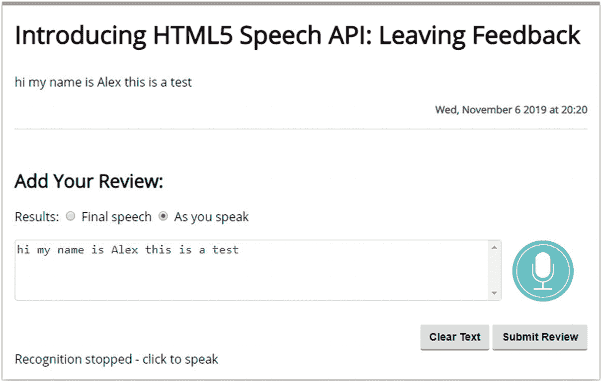
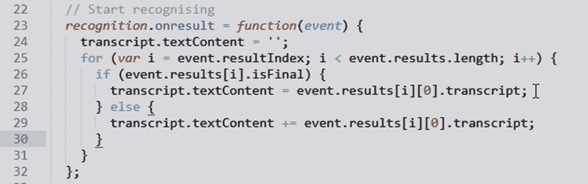
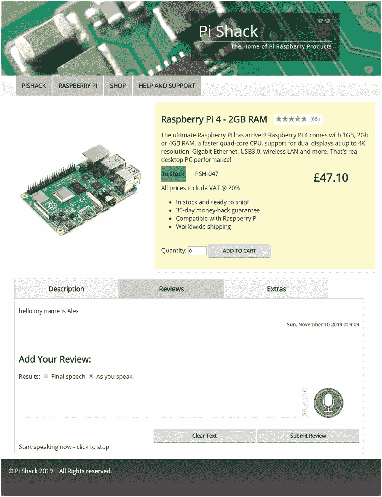
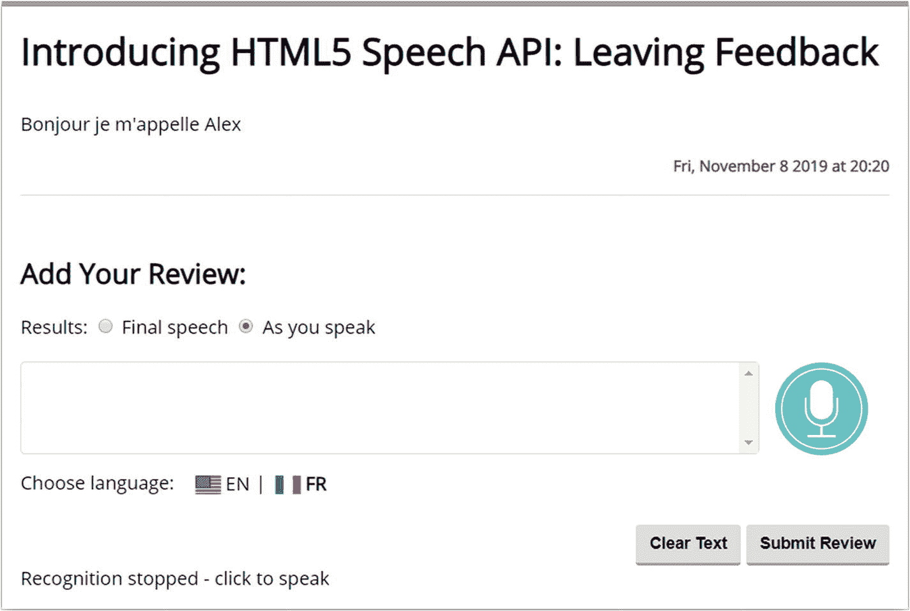
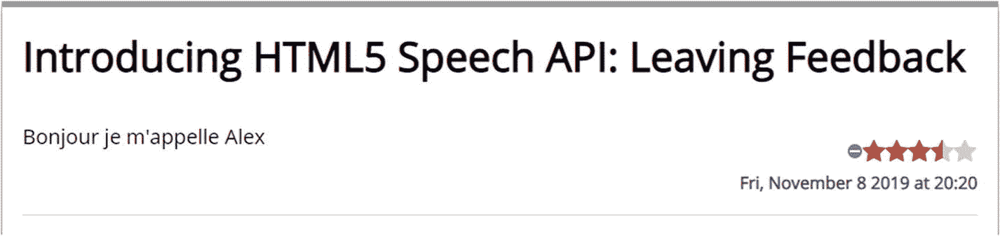

# 五、项目：留下评论反馈

你多久会觉得有必要留下关于购物体验的反馈？希望你至少这样做过一次；虽然我怀疑是否有人会发现它并对此做些什么，但这种怀疑还是存在的。

不管你留下了什么样的反馈，你都有可能必须输入你的评论；如果你能用你的声音做到这一点会怎么样？是的，虽然看起来很新奇，但这是展示使用语音 API 的完美方式。在这一章中，我们将建立一个基本的产品页面，并添加语音反馈功能，它会自动将我们的评论转录成书面文本。

## 设置场景

你浏览时遇到的几乎每一个电子商务网站都会有某种形式的反馈机制——它可能是专门建立的事情，或者是由合作伙伴或供应商作为第三方服务提供的东西。冒着听起来乏味的风险，它是如何提供的几乎无关紧要。任何在互联网上进行交易的公司都应该提供某种形式的机制；否则，他们很可能会很快失去客户！

在大多数情况下，反馈表格通常是你必须打出你的回答的表格——这没有错，但这是一种老派的做事方式。事实上，有人可能会问，“还有什么其他选择？”你可以使用调查问卷，但最终，提供的定性反馈同样重要，如果不是更重要的话！

如果我们能把事情颠倒过来，口头上提供给他们，会怎么样？是的，你没听错——与其花时间费力地把它打出来，不如让我们口头表达出来。听起来很复杂，对吧？嗯，也许不是。我们已经介绍了语音识别 API 形式的基本工具。让我们来看看设置它需要什么，以及它如何成为一个真正强大的工具。

### 保持事物在范围内

为了让这个项目成功，你可能会想我们需要很多额外的工具，对吗？错，我们不需要任何！在我解释原因之前，让我们快速了解一下我们将在这个项目中包括哪些内容，以及哪些内容将超出范围:

*   我们将把我们的演示限制在记录和转录口头反馈，然后在屏幕上呈现出来——后者将带有适当的日期和时间戳。

*   我们的演示最初将侧重于用英语记录反馈，但在本章的后面，我们将着眼于提供对至少一种其他语言的支持。

*   我们不会将我们的评论中留下的任何内容记录到数据库或通过电子邮件提交；这超出了本演示的范围。

考虑到这一点，让我们来看看我们演示的架构，更详细地了解一下其中涉及的内容。

## 构建我们的演示

在前一节的开始，我做了一个看起来很大胆的声明，我们不需要任何额外的软件来设置我们的反馈:是时候兑现这个承诺了！好吧，开始了。

在某种意义上，我们不需要任何额外的软件——核心功能可以通过使用语音识别 API 来提供，并使用标准功能来配置它，以记录和转录口语内容。然而，如果我们确实想做一些事情，比如记录反馈供以后阅读，那么是的，我们显然需要一个合适的存储系统和适当的中间件来解析和存储内容。然而，这超出了本书的范围——我们将重点关注如何将内容转录并呈现在屏幕上。

## 建立我们的评论小组

现在我们已经介绍了我们架构的基本部分，让我们开始构建我们的演示——我们将首先关注构建核心审查面板，然后在本书的后面部分探索如何添加多语言支持。

值得注意的是，我们将主要关注使我们的演示工作所需的 JavaScript 所有的 HTML 和 CSS 样式都将预先配置，直接来自本书附带的代码下载。

Building the Review Panel

本章项目的第一步是构建评论面板，但在开始之前，我们需要做一件事。继续从本书附带的代码下载中提取 reviews 文件夹的副本——保存到我们的项目区域。

准备就绪后，让我们开始编写演示代码:

如果您在演示过程中遇到任何问题，那么在本书附带的代码下载中有一个完成版本——它在 reviews 文件夹中，在 finished version 子文件夹下。

1.  我们首先打开一个新文件，然后将它作为`scripts.js`保存到`reviews`文件夹中的`js`子文件夹中。

2.  我们有一大块代码要添加，我们将一个块一个块地添加——第一个是一组引用 DOM 中各种元素的变量，再加上一个我们在说话时用作占位符的变量:

    ```html
    var transcript = document.getElementById('transcript');
    var log = document.getElementById('log');
    var start = document.getElementById('speechButton');
    var clearbtn = document.getElementById('clearall-btn');
    var submitbtn = document.getElementById('submit-btn');
    var review = document.getElementById('reviews');
    var unsupported = document.getElementById('unsupported');
    var speaking = false;

    ```

3.  接下来，我们需要设置脚本的基本框架——我们用它来确定我们的浏览器是否支持语音识别 API。在变量后留一个空行，然后添加这个块:

    ```html
    window.SpeechRecognition = window.SpeechRecognition || window.webkitSpeechRecognition || null;

    if (window.SpeechRecognition === null) {
      unsupported.classList.remove('hidden');
      start.classList.add('hidden');
    } else {
      ...add code in here...
    }

    ```

4.  我们现在可以开始添加我们的演示代码了——我们从初始化和配置语音识别 API 的实例开始。继续用下面的代码替换`...add code in here...`行:

    ```html
    var recognition = new window.SpeechRecognition();

    // Recogniser doesn't stop listening even if the user pauses
    recognition.continuous = true;

    ```

5.  现在已经初始化了 API 的一个实例，我们可以开始响应事件了。第一个是 onresult 处理程序；为此，在步骤 3 中的代码后留下一行，然后添加这个事件处理程序:

    ```html
    // Start recognising
    recognition.onresult = function(event) {
      transcript.textContent = ";
      for (var i = event.resultIndex; i < event.results.length; i++) {
        if (event.results[i].isFinal) {
          transcript.textContent = event.results[i][0].transcript;
        } else {
          transcript.textContent += event.results[i][0].transcript;
        }
      }
    };

    ```

6.  接下来，我们需要为任何出错的情况设置陷阱——为此，在 onresult 处理程序后留出一行空白，然后添加以下代码:

    ```html
    // Listen for errors
    recognition.onerror = function(event) {
      log.innerHTML = 'Recognition error: ' + event.message + '<br />' + log.innerHTML;
    };

    ```

7.  我们现在正处于本演示最重要的部分之一——开始和停止记录我们的反馈的方法！我们还要添加两个事件处理程序，所以让我们添加第一个，它将在我们开始或停止记录时触发。在第 5 步的代码后留一行空白，然后添加:

    ```html
    start.addEventListener('click', function() {
      if (!speaking) {
        speaking = true;
        start.classList.toggle('stop');

        recognition.interimResults = document.querySelector('input[name="recognition-type"][value="interim"]').checked;
        try {
          recognition.start();
          log.innerHTML = 'Start speaking now - click to stop';
        } catch (ex) {
          log.innerHTML = 'Recognition error:' + ex.message;
        }
      } else {
        recognition.stop();
        start.classList.toggle('stop');
        log.innerHTML = 'Recognition stopped - click to speak';
        speaking = false;
      }
    });

    ```

8.  第二个事件处理程序负责提交我们转录的记录作为反馈——为此，在开始处理程序后留出一行空白，并放入以下代码:

    ```html
    submitbtn.addEventListener('click', function() {
      let p = document.createElement('p');
      var textnode = document.createTextNode(transcript.value);
      p.appendChild(textnode);
      review.appendChild(p);

      let today = dayjs().format('ddd, MMMM D YYYY [at] H:HH');
      let s = document.createElement('small');
      textnode = document.createTextNode(today);
      s.appendChild(textnode);
      review.appendChild(s);

      let hr = document.createElement('hr');
      review.appendChild(hr);
      transcript.textContent = ";
    });

    clearbtn.addEventListener('click', function() {
      transcript.textContent = ";
    });

    ```

9.  We’re almost there. All that remains is to save our code, so go ahead and do that now. Once done, fire up your browser, and then browse to `https://speech/reviews/`. If all is well, we should see something akin to the screenshot in Figure 5-1.

    

    图 5-1

    我们已完成的审查系统

现在，我们应该有了一个工作演示，我们可以对着麦克风说话，识别语音 API 将其转录为书面内容。虽然看起来我们已经写了相当多的代码，但基本原理和我们在第一章第一次见到的一样，并在第二章第三章开始发展。为了理解我的意思，让我们深入到代码中，更详细地了解它是如何结合在一起的。

## 详细分解代码

我相信有人曾经说过，我们必须从某个地方开始——没有比为我们的演示预先配置的 HTML 标记更好的地方了。

如果我们仔细看看，不应该有任何异常复杂的东西；这个演示使用标准的 HTML 和 CSS 来构建我们的基本表单页面。除此之外，让我们快速查看一下为我们设置的更详细的内容。

### 探索 HTML

核心部分以一个用于评论的空

开始，后面是不支持的 div，如果浏览器不支持 API，我们用它来通知。

接下来，我们设置“添加您的评论”部分，为此，我们有两个单选按钮，`#final`和`#interim`。这些分别控制 API 是在最后还是在我们说话的时候呈现转录的代码。然后我们有了我们的`#transcript`文本区域，我们把它设置为只读；单击`start`按钮后，我们开始在这里添加内容。

完成后，单击开始按钮将关闭麦克风。然后我们有习惯的 submit 按钮，它将内容发布到屏幕上的 reviews div 中。这是通过调用 DayJS 库来完成的——它用于格式化每个评论中发布的日期。当我们剖析这个演示的脚本时，我们将很快回到这个问题。

### 探索 JavaScript

相比之下，我们的 JavaScript 代码显然更复杂——这可能会让您望而却步，但不用担心。这不是我们以前没有用过的东西，至少在 API 的范围内是这样的！让我们更详细地分解代码，看看它们是如何组合在一起的。

我们首先在标记中声明对各种元素的引用，然后调用`window.SpeechRecognition`来确定我们的浏览器是否支持 API。如果呈现为 null，我们会显示一条措辞恰当的消息；否则，我们首先将 API 的一个实例初始化为识别。同时，我们将`.continuous`属性设置为 true，以防止 API 在一段时间后或在不活动的情况下停止监听。

我们使用的第一个事件处理程序(也可以说是最重要的)是`onresult`——它负责记录我们所说的内容。重新审视这一点很重要，特别是`event.results[i][0].transcript`的使用。

我们可以在图 5-2 中看到这个功能的截图。



图 5-2

我们演示中的 onResult 函数

一旦我们遍历了所有的`results`，任何包含内容的都将作为类型为`SpeechRecognitionResultList`的对象返回；这包含了`SpeechRecognitionResult`对象，使用 getter 属性可以像访问数组一样访问这些对象。

第一个`[0]`返回位置`0`处的`SpeechRecognitionResult`——这实际上是最终答案，应该呈现在屏幕上。然而，如果已经设置了`speechRecognition.maxAlternatives`属性，我们将会看到存储在`SpeechRecognitionAlternative`对象中的替代项。在我们的例子中，没有设置 maxAlternatives 属性，所以屏幕上显示的只是最终答案。

相比之下，下一个事件处理程序很简单——这里我们截取`onerror`,并呈现屏幕上生成的任何错误，以及相应的消息。

这可能从无演讲到中止演讲——你可以在 Mozilla MDN 网站 [`https://developer.mozilla.org/en-US/docs/Web/API/SpeechRecognitionError/error`](https://developer.mozilla.org/en-US/docs/Web/API/SpeechRecognitionError/error) 上看到完整的列表。

接下来，我们有三个事件处理器中的第一个，用于记录、转录和`submit`(或显示)我们的反馈。第一个是 start，连接在麦克风按钮上；我们计算出我们是否已经在说话。如果没有，我们就激活麦克风，然后再决定是显示中期结果还是最终文章。然后我们运行一个`try...catch`块，在其中我们运行`recognition .start()`来开始记录我们的讲话。完成后，我们停止语音识别 API 并将样式翻转回来，准备再次开始记录。

第二个事件处理程序与`submitbtn`相关，允许我们将屏幕上的内容提交到反馈区域。我们首先使用`createElement('p')`动态创建一个段落，然后将`transcript.value`的内容分配给它。然后，我们使用 DayJS 库计算并格式化记录的日期——我们当然可以使用标准的 JavaScript，但是使用 JavaScript 时，日期操作可能会很笨拙！

如果你想了解更多关于这个库的信息，可以在 [`https://github.com/iamkun/dayjs`](https://github.com/iamkun/dayjs) 下载 DayJS 库。

然后，在我们添加一个动态生成的水平规则元素以将其与下一个评论反馈分开之前，使用`review.appendChild(s)`将这些内容和抄本的内容一起添加到 DOM 中的评论区域。在第三个也是最后一个事件处理程序中，我们使用`clearbtn`来触发清空脚本文本区域的内容，这样就可以准备好记录下一个评论了。

现在，我们有了一个工作演示，这很好，但是在一个更现实的环境中，比如一个产品页面，托管怎么样呢？如果我们已经正确地计划了我们的演示，这应该是将代码复制到更大的模板中的问题，我们不应该对代码做太多的修改。让我们开始吧，看看会发生什么…

## 将其添加到产品页面

对于我们的下一个演示，我们将把评论演示合并到一个新生的 Raspberry Pi 零售商的基本产品页面中——我创建了一个非常基本的页面，它肯定不会赢得任何奖项，但应该足以看到我们的评论小组在更实际的环境中工作！让我们进去看看。

Demo: Merging the Review Panel

在我们开始之前，我们需要在您的文本编辑器中打开 reviews demo 和 product page demo 的源文件夹——两者的副本都在本书附带的代码下载中的 merge 文件夹中。

出于演示的目的，我将使用文件夹名`productpage`和`reviews`来区分原始的源演示。

在继续这些步骤之前，请确保两个文件夹都已在文本编辑器中打开:



图 5-3

合并后的审查小组

1.  我们需要做的第一个更改是 reviews 文件夹中的 index.html 文件——请注意这一行:`<div id="reviews">`

2.  从这一行复制到(并包括)`<div id="log">Click the microphone to start speaking</div>`。然后将它粘贴到 productpage 文件夹中的`index .html`文件中的这一行-`<h1>Product Reviews</h1> –`下面。

3.  接下来，从 productpage 文件夹的`index.html`文件中删除这一行:

    ```html
    <p>Insert reviews block here</p>

    ```

4.  我们的评论小组使用 DayJS 库来格式化发布评论的日期——为此，我们需要将调用转移到 DayJS 库。继续将下面的代码行:

    ```html
    <script src="https://cdnjs.cloudflare.com/ajax/libs/dayjs/1.8.16/dayjs.min.js"></script>

    ```

    添加到 productpage 文件夹中脚本文件的调用之上:

    ```html
    <script src="js/scripts.js"></script>

    ```

5.  我们现在需要更新样式以允许添加审查面板——为此，继续将所有样式从审查版本的`styles.css`文件复制到 productpage 文件夹的 CSS 文件中。

6.  我们快完成了。继续将 reviews 文件夹中的`scripts.js`文件的内容复制到 productpage 文件夹中的`scripts.js`文件的顶部。

7.  我们需要为我们的麦克风按钮复制整个 mic.png 图像–将`img`文件夹从 reviews 文件夹复制到 productpage 文件夹。

8.  最后一步是删除这两行:

    ```html
    <h1>Product Reviews</h1>
    <p>Insert reviews block here</p>

    ```

9.  继续保存文件，我们现在可以预览我们的结果。为此，请浏览至`https://speech/productpage/`。如果一切正常，我们应该会看到类似于图 5-3 所示的截图。

不幸的是，这个截屏没有做到公平——为了感受一下它在实际中是如何工作的，我建议运行本书附带的代码下载中的演示。它位于 productpage 文件夹中，理想情况下应该作为一个安全的 URL 运行。所有代码都不应该是陌生的；虽然合并后的版本会有点粗糙，但它给了我们一个优化代码的绝佳机会，比如 CSS 样式！

好吧，我们继续。我们已经建立了我们的审查系统；在这一点上，我们应该有一些东西，让我们可以用英语记录反馈，并以适当的方式显示在屏幕上。问题是，在现代互联网时代，不是每个人都说英语！这意味着我们的演示只有在英语市场或客户可以将英语作为第二语言的市场中才真正有效。

幸运的是，这很容易解决——我们已经在前一章中使用了 how 的一些原则！考虑到这一点，让我们深入研究，看看我们需要做些什么来让我们的复习系统接受和转录不仅仅是英语…

## 添加语言支持

在这个我们应该拥抱不同文化的现代，对母语不是英语的顾客表示支持是很重要的。然而，添加对额外语言的支持可能是一把双刃剑——从技术上来说，添加支持可能非常容易，但是应该选择支持哪些语言呢？

答案(部分)将取决于谷歌的支持——如果客户使用 Chrome，它会提供支持。谷歌(根据 BCP47 协议)支持的国家列表可在 [`https://cloud.google.com/speech-to-text/docs/languages`](https://cloud.google.com/speech-to-text/docs/languages) 获得。但这还不是结束，我们还应该问更多的问题，包括:

*   我们的客户在使用哪些浏览器？这一点很重要，因为这在很大程度上取决于你的客户使用的浏览器:如果是 Chrome(或最新版本的 Edge)，那么支持会相当好——谷歌提供了一系列不同的语言作为这种支持的一部分。然而，如果你的客户更喜欢 IE 或 Safari，那么提供语言支持将是一个争论点，因为这两种浏览器都不支持 API！

*   如果我们决定不提供对特定语言的支持，我们如何避免疏远客户？很明显，一种只有少数用户使用的语言不会因为经济可行性而被增加；然而，如果那个客户恰好是你的主要收入来源呢？是不是“谁喊得最响，谁先被听到”？是的，我知道这是一个极端的例子，但它表明了优先级是关键！

*   假设我们增加了对更多语言的支持，您是否有足够的资源来支持使用该功能的客户？毕竟，如果他们不厌其烦地用他们自己的语言留下反馈，如果我们只能用英语回复，这多少会破坏这个选项的整个目的。是的，我们可以使用 Google Translate 这样的服务，但是这是一个很差的替代品，无法提供来自团队真实成员的回复！

正如我们所看到的，简单地在技术上增加支持只是难题的一部分；为了解决这个问题(并为我们的客户提供最好的支持)，我们必须考虑全局。我们已经谈到了一些我们可能会问的问题，所以现在是我们讨论技术问题的时候了。让我们深入研究并考虑我们需要添加或修改的代码，以使我们的审查系统能够适应更多的语言。

### 更新演示

对于我们的下一个演示，我们将添加对讲法语的客户的支持，我们可以添加任何数量的不同语言，但法语恰好是我会说的一种语言！(好吧，已经有一段时间我不得不全职说了，不过我跑题了……)

我们需要对我们的演示进行一些更改，概括来说，如下所示:

*   我们需要找到合适的旗帜图标——在我们的演示中，我们将使用在第三章中已经有的图标。然而，如果你想尝试不同的语言，那么像 [`https://www.gosquared.com/resources/flag-icons/`](https://www.gosquared.com/resources/flag-icons/) 这样的网站将是一个很好的开始。

*   我们将需要添加标记和样式来托管这些标志——请记住，如果我们要添加的不仅仅是法语，我们可能需要考虑重新定位元素，以腾出额外的空间，或者改变样式以使它们正确匹配。

*   当我们使用语音识别 API 时，我们需要改变配置选项，这样它就不会硬编码为默认的美国英语，而是可以根据请求接受其他语言。

*   我们需要添加事件处理程序，以允许客户选择语言并相应地更新 API 配置选项。

这可能看起来很多，但在现实中，改变是非常容易的。为了理解我的意思，让我们开始更新我们的演示。

Adding Language Support

我们需要做的第一个改变是我们的标记:



图 5-4

我们更新的演示，有法语选项

1.  我们将首先打开一个`index.html`的副本，然后寻找这个块:

    ```html
    <div class="button-wrapper">
      <div id="speechButton" class="start"></div>
    </div>

    ```

2.  紧接在它的下面，为我们的标志插入下面的代码:

    ```html
    <section class="flags">
      <span class="intro">Choose language:</span>
      <span class="en-us">EN</span>|
      <span class="fr-fr">FR</span>
    </section>

    ```

3.  继续保存文件-我们可以关闭它，因为不需要它。接下来，打开`scripts.js`，然后向下滚动到这一行:

    ```html
    var unsupported = document.getElementById('unsupported');

    ```

4.  在它的正下方，继续添加这些变量声明——确保在`const french...`语句之后留出一行空白:

    ```html
    var speaking = false;
    var chosenLang = 'en-us';
    const english = document.querySelector("span.en-us");
    const french = document.querySelector("span.fr-fr");

    ```

5.  向下滚动几行。然后在`recognition.continuous = true`下面，继续添加这一行:

    ```html
    recognition.lang = chosenLang;

    ```

6.  接下来，寻找`clearbtn`事件处理程序——在它下面留一个空行，然后添加这个事件处理程序，负责将英语设置为我们选择的语言:

    ```html
    english.addEventListener("click", function() {
      recognition.lang = 'en-us';
      english.style.fontWeight = 'bold';
      french.style.fontWeight = 'normal';
    });

    ```

7.  我们又添加了一个事件处理程序——这个负责设置法语，当被选中时:

    ```html
    french.addEventListener("click", function() {
      recognition.lang = 'fr-fr';
    english.style.fontWeight = 'normal';
    french.style.fontWeight = 'bold';
    });

    ```

8.  继续保存该文件，因为不再需要它，所以可以在此时将其关闭。一旦关闭，打开`styles.css`，在样式表的底部添加以下规则:

    ```html
    /* CSS Changes */
    span.intro {
    padding-right: 10px;
    vertical-align: baseline;
    }

    /* flags */
    section > span.en-us,
    section > span.fr-fr {
    padding: 2px 5px 0 0;
    }

    section > span.en-us > img,
    section > span.fr-fr > img {
    vertical-align: middle;
    padding: 3px;
    }

    section > span.en-us > img:hover,
    section > span.fr-fr > img:hover {
    cursor: pointer;
    }

    ```

9.  保存并关闭该文件。至此，我们现在可以测试结果了！为此，浏览至`https://speech/reviewslang`，点击提问，开始输入信息，如图 5-4 摘录所示。

看看修改我们的演示让我们说法语有多容易？最棒的是 SpeechRecognition API 支持许多不同的语言，所以我们可以很容易地支持更多的语言。

重要的是要注意，我们已经对这个演示中需要的东西进行了硬编码；如果我们要添加更多的语言，优化我们的代码是值得的，这样我们可以更有效地重用现有的样式。也就是说，在这个演示中，为了支持额外的语言，做了一些重要的更改，所以让我们花点时间来更详细地浏览一下代码。

### 剖析代码

在最后几页的过程中，我们对代码做了一些修改。第一个是添加适当的标记，作为我们选择的标志(在这个例子中，包括美国英语和法语)的脚手架。然后我们切换到`scripts.js`文件并添加了一些变量——两个用于帮助配置 API ( `speaking`和`chosenLang`)，两个作为对 DOM 中元素的引用:`english`和`french`。

接下来，我们必须改变 API 实例的默认语言——因为我们现在不能使用默认的`'us-en'`(或美国英语)，我们需要告诉它应该使用哪种语言。为此，我们将 c `hosenLang`的值赋给`recognition.lang`；默认设置为`'en-us'`(因此保持现状)。然而，现在可以通过使用接下来的两个事件处理程序对`english`和`french`进行更新。这里我们将`recognition.lang`设置为`'en-us'`或`'fr-fr'`，这取决于点击了哪个标志；我们还将屏幕上的`EN`或`FR`文本设置为粗体，并取消选择其他标志的文本。

然后，我们对演示进行了一些简单的样式更改，以考虑到旗帜的存在。这些完全适合放在`transcript` textarea 元素之下，但是如果我们要添加更多的元素，那么我们可能要考虑对 UI 更广泛的影响，并移动一些其他元素以便更好地适合。

好吧，让我们改变策略。在本章的过程中，我们已经利用语音识别实现了一个有用的反馈机制的开端，它可以适用于任何希望为客户提供评论机会的网站。这是一个很好的方式来获得意见，我们可以用它来帮助改善我们的报价，但它可能会带来一些我们需要考虑的问题。这么说吧，如果我们不小心的话，它们可能会回来咬我们！为了理解我的意思，让我们更详细地看看更广阔的图景。

## 留下评论:附言

与任何新技术一样，经常会有一些缺点——毕竟，这仍然是相对较新的技术，在标准最终确定之前肯定会有变化！尽管如此，有三点值得我们特别注意:

*   我们需要考虑的第一件事是客户可能会有什么反应，特别是如果他们有糟糕的体验！作为任何 UX 设计的一部分，我们应该考虑实施一些内部规则。例如，如果顾客在他们的评论中使用亵渎的话会怎么样？如果他们有不太完美的经历，他们可能会觉得有理由表达自己的观点，但我们显然不希望我们的评论中充斥着令人讨厌的词语！

*   第二个要考虑的问题是垃圾邮件——是的，这可能看起来有点奇怪，但是随着技术的发展，技术上没有什么可以阻止人们向你的反馈机制发送垃圾邮件！这是否会成为现实，只有时间能告诉我们，但是当你为你的网站实现一个声音激活的审查系统时，这是值得考虑的事情。

*   对谷歌支持某些浏览器功能的依赖将是一个问题——不是因为谷歌很可能很快就会倒闭，而是因为他们可能希望开始将目前免费提供的支持货币化。这确实意味着，在支持方面，我们在某种程度上受谷歌的支配；可能会有一个时候，一种语言可能不被支持，所以我们将不得不迅速作出反应，以尽量减少任何问题，如果支持被删除。

简而言之，在这些问题上我们可能无能为力，但我们可以建立一些保护。例如，我们可能会要求用户必须登录才能留下评论或内置一些东西来监控特定单词的实例，我们可以在转录我们的内容时尝试过滤掉这些单词。

还有，那个支持？嗯，我们硬编码了我们的条目来证明我们的演示作品，但是这不是很有效。相反，我们可以使我们的代码更加动态——它可以搜索配置文件中存在的任何条目。根据找到的内容，它会遍历这些内容并自动构建内容。这意味着，只要存在诸如标志之类的媒体，我们需要做的就是打开或关闭支持；我们的代码将自动计算出支持哪些语言，并向我们的网页添加适当的条目。

好了，这一章我们就要结束了，但是还有一件事需要考虑——进一步开发我们的解决方案怎么样？当然，这完全取决于你的要求和你的想象力的创造性；首先，让我们来看看一些想法，看看如何添加到您的解决方案中，以帮助您的客户提升体验。

## 更进一步

好了，我们已经建立了一个基本的演示，它允许我们用英语或法语交谈，并让它以书面形式转录和发布我们的评论。问题是“下一步去哪里？”嗯，我们可以做一些事情。让我们来看看:

*   One element that is clearly missing from our demo is a rating – this is a good opportunity to allow customers to provide an objective figure, in addition to qualitative feedback. We could simply implement a suitable mechanism, such as the RateIt plugin from [`https://github.com/gjunge/rateit.js`](https://github.com/gjunge/rateit.js), but what about doing this verbally? How we achieve this will depend on the structure used, but it should be possible to provide the rating verbally and for it to be translated into the appropriate star rating. As an example, adding a rating could look like the example screenshot shown in Figure 5-5.

    

    图 5-5

    我们的模拟评级明星

*   我们的演示允许我们在页面上发布评论，但这只是故事的一部分——我们绝对应该考虑使用这些反馈，并在适当的时候对客户做出回应。然而，后者意味着我们至少需要一种联系方式，比如电子邮件地址。我们如何实现这一目标？一种方法可能是鼓励客户注册一个帐户，这样我们就可以获得该电子邮件地址——这当然会对 GDPR 等隐私立法产生影响，这是我们需要考虑的。

*   如果支持客户反馈管理的资源是一个问题，那么我们可以考虑使用一个 API，如 Google Translate，至少将我们转录的内容转换成英语或我们的母语(如果不是英语)。这是有代价的——我们只能希望了解谷歌翻译提供了什么，因为机器翻译的内容并不完美！

这只是让你开始的几个想法——如果我们运营的网站类型适合这样的额外服务，我们甚至可以考虑添加额外服务，如头像！不言而喻的是，如果我们添加额外的选项，那么这些需要经过彻底的测试，以确保它们提供价值，而不是作为一个噱头出现在我们的客户面前。

## 摘要

客户反馈对任何企业都是至关重要的，无论业务规模有多大——最终，我们企业的成功将取决于我们收到的意见，以及我们如何回应或采取什么行动来改进自己。显然，让反馈过程尽可能简单很重要——还有什么比留下口头评论更好的方式呢？在本章中，我们已经介绍了实现这一目标的基本步骤；让我们花点时间更详细地回顾一下我们所学的内容。

我们首先介绍了这一章的主题，然后快速设置场景并确定我们将如何确定范围和构建我们的演示。然后，我们继续构建表单，在探索代码如何详细工作之前，同时注意与前面章节的相似之处。

然后，在深入研究语言支持主题之前，我们看了看如何将这一点融入到更真实的示例中——我们讨论了修改演示所需的步骤，然后探讨了关于提供口头反馈的缺点以及我们可以在何处开发项目来为客户引入新功能的一些最终要点。

好吧，我们不会就此罢休；是时候进入我们的下一章了！请举手，你们中有多少人拥有智能助手，比如谷歌助手、Siri 或亚马逊 Alexa？微软的联合创始人之一比尔·盖茨曾经说过，语音和演讲将成为网络界面的标准部分——随着 Siri、Alexa 和谷歌助手的出现，他没有错！我们已经有了很多技术来为网站构建一个简单的 Alexa 版本。对什么感兴趣？不要走开，我将在下一章揭示更多。