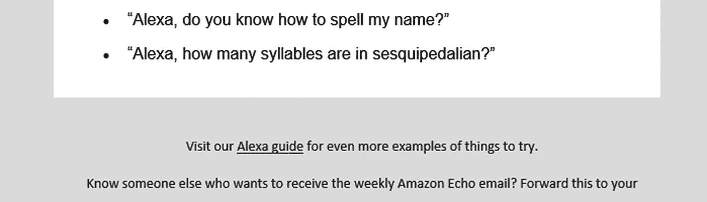

# 六、项目：构建 Alexa

> *“阿列克谢，几点了…？”*

对你们中的一些人来说，我敢打赌这是一个在你们家太常见的短语——我怀疑这不是如果的问题，而是有多少个！

在过去的几年里，亚马逊 Alexa 或谷歌助手等智能助手(或 SAs)的增长呈爆炸式增长；我们不得不通过搜索网站、报纸或书籍来获取信息碎片的日子已经一去不复返了。事实上，微软的联合创始人之一比尔·盖茨曾经说过，他相信语音和语音输出将成为[网络]界面的标准部分——随着 Siri、Alexa 和谷歌助手的出现，他没有错！

这让我想到——我们已经了解了智能助理的两项核心技术，即语音合成和识别。我们能否建造一些东西来模仿 Alexa 等助手的工作方式？它可能没有硬件等效物那么强大，但它可以使用这两种 API 来创建一些有用的东西。只要我们使它模块化，那么我们就可以添加功能，以帮助它在未来发展成更有价值的东西。

记住这一点，在本章的课程中，我们将利用语音识别和合成 API 来创建一个简单的 Alexa 风格的语音助手；我们将学习如何使它模块化，这样就很容易添加更多的技能来帮助扩展它的功能。

## 设置场景

我们的下一个项目将是一个更简单的项目——这是一个放松的机会，因为我知道本书后面的内容会很密集！让我给你介绍一下 Rachel——她会告诉你当地的时间，纽约的时间(稍后会有更多的介绍),天气预报等等。

我们将从一些简单的任务开始，说明在中添加功能是多么容易。让我们首先更详细地看一下我们将如何设计我们的演示。

## 构建我们的演示

我们已经了解了这个项目核心的两个 APIs 现在，他们应该开始看起来有点熟悉了。然而，对于这个项目，我们将添加一个小的转折。

我们将利用一个库来为我们做一些工作，而不是手工硬编码语音识别和合成 API。这是我们将利用的少数几个选项之一，所以让我们来完整地看一下这个列表:

*   ann yang——这个库是我们在本书中使用的语音识别 API 的包装器；可从 [`https://www.talater.com/annyang/`](https://www.talater.com/annyang/) 获得。

*   speech kitt–这是一个与 annyang 协同工作的 GUI，可以从 [`https://github.com/TalAter/SpeechKITT`](https://github.com/TalAter/SpeechKITT) 下载。GUI 库已经有几年的历史了，但是它提供了对 annyang 的原生支持，并且仍然可以很好地满足我们的需求。

    如果你想知道 GUI 库中对 KITT 的引用，这个库是以 80 年代的美剧《霹雳游侠》命名的。你甚至可以在 SpeechKITT 的 GitHub 页面上看到男主角大卫·霍索夫的照片！

*   luxon–用于日期和时间，以及时区支持；这可从 [`https://moment.github.io/luxon/index.html`](https://moment.github.io/luxon/index.html) 得到。

*   open weather map——我们提出的请求之一与获取天气有关；为此，我们将使用 [`https://openweathermap.org/`](https://openweathermap.org/) 提供的 API。

*   pix abay——如果你碰巧已经有了一个智能助手，这可能是你在这样的演示中不会看到的；毕竟智能助手是不能显示图片的，除非你恰好配置了智能助手使用你的 PC 作为显示机制！我们把它放在这里是为了探索如何使用像 Pixabay 这样的服务来显示图像；我们将在本章的后面更多地讨论这是否是正确的方法。

*   jQuery——这是一种必要的邪恶。我们利用它来解决 SpeechKITT GUI 的局限性。我们将在这一章的后面探讨更多的原因。

    另外，我会推荐让 JSON 编辑器在线网页( [`https://jsoneditoronline.org/`](https://jsoneditoronline.org/) )在你的浏览器中打开；这是一个很棒的 JSON 编辑器，对于浏览我们使用的一些服务返回的原始数据很有用。

我们的演示将展示一些简单的请求；我们可以以此为基础添加更多使用不同 API 的特性。这是我们将在本章后面探讨的内容，但是现在，让我们继续编写我们的演示程序。

## 构建我们的演示

就编码我们的演示而言，与以前的项目相比，这看起来就像是在公园里散步！就结构而言，我们的演示将非常简单——除了演示所需的一些标记和样式之外，将只添加一个元素。这将动态完成，并将用于触发我们发出的所有请求。

在我们看一下我们编写的代码将如何使我们的演示变得生动之前，让我们继续努力并设置好标记。

### 创建标记

我们的第一个任务是为这个小演示设置标记——这个非常简单。我们甚至不需要为麦克风触发器提供占位符，因为 SpeechKITT GUI 会为我们动态创建占位符。让我们从我们的标记开始，更详细地研究一下代码。

Setting Up The Markup

要设置标记，请执行以下步骤:

1.  此时，您可以关闭任何打开的文件。给自己留一个打开的空白文件，准备开始下一个练习，这个练习很快就会开始。

1.  我们将开始为我们的项目创建一个新文件夹——在我们的项目区域的根目录下保存为`rachel`。

2.  接下来，继续为我们的基本标记创建一个新文件；添加以下代码:

    ```html
    <!DOCTYPE html>
    <html>
    <head>
      <title>Introducing HTML5 Speech API: Building an Alexa Clone</title>
      <link href="https://fonts.googleapis.com/css?family=Open+Sans
    &display=swap" rel="stylesheet">
    </head>
    <body>
      <div id="page-wrapper">
        <h2>Introducing HTML5 Speech API: Building an Alexa-style Smart Assistant</h2>
        <section>
            Rachel's voice: <select name="voice" id="voice"></select>
        </section>
      </div>
      <script src="js/annyang.min.js"></script>
      <script src="js/speechkitt.min.js"></script>
      <script src="js/jquery.min.js"></script>
      <script src="js/luxon.min.js"></script>
      <script src="js/scripts.js"></script>
    </body>
    </html>

    ```

3.  将文件另存为`index.html`–我们现在可以关闭它。下一个练习将负责添加脚本功能。

4.  我们还有最后一步要做——我们需要从本书附带的代码下载中复制一些 JavaScript 文件和 CSS 样式。继续提取以下文件的副本，并将它们放入我们之前创建的`rachel`文件夹下的子文件夹中:
    *   `styles.css`–放入新的`css`子文件夹

    *   下面放入一个新的`js`子文件夹:`annyang.js`、`jquery.min.js`、`luxon.min.js,`和`speechkitt.min.js`

我们现在已经有了标记——代码没有什么复杂或不寻常的地方。我们简单地建立了我们的基本框架，并包含了一些 JavaScript 和 CSS 文件；当我们开始开发使我们的演示变得生动的脚本时，奇迹就会出现。

### 让我们的演示栩栩如生

在我们开始添加 JavaScript 代码之前，我们需要做一件小事——在 [`https://home.openweathermap.org/users/sign_up`](https://home.openweathermap.org/users/sign_up) 注册一个免费账户。

这将需要几个小时才能被 OpenWeather 的团队激活；一旦你从 OpenWeather 团队那里收到一封带有密钥的欢迎邮件，你就可以认为它已经设置好了。在陷入代码开发之前，您可能需要考虑这一点！假设您已经注册，并收到电子邮件确认您的帐户现在是活跃的，让我们开始我们的演示。

Demo: Adding Functionality

要设置我们的演示，请遵循以下步骤:

1.  下一个任务是在一个不同的地方表达时间——我选择了纽约，那里恰好是阿普瑞斯出版社的所在地。继续在上一步之后插入下面的代码，中间留一个空行:

    ```html
    // Rachel, what time is it in New York?
    var timeinnewyork = function() {
      var NYTime = luxon.DateTime.local().setZone('America/New_York').toLocaleString(luxon.DateTime.TIME_WITH_LONG_OFFSET);
      speak("The time in New York is " + NYTime);
    }

    ```

2.  我们已经讨论了两个不同地点的时间，但是日期呢？没问题，代码如下:

    ```html
    // Rachel, what is today's date?
    var DateNow = function() {
      var localdate = luxon.DateTime.local().toLocaleString(luxon.DateTime.DATE_SIMPLE);
      speak("The date is " + localdate);
    }

    ```

3.  我喜欢一个好的笑话，所以只有看我们是否能在这个演示中包括一对夫妇才是明智的；如果你有一个真正的 Alexa，那么我敢肯定你会看到电子邮件建议你问它一个笑话！下面是第一个:

    ```html
    // Rachel tell a funny joke:
    var telljoke = function() {
      speak("Why do we tell actors to break a leg? Because every play has a cast");
    }

    ```

4.  下一个笑话似乎更适合我们设计师和开发人员，至少从字体类型的使用来看；继续在上一步的代码之后添加这段代码，中间留一个空行:

    ```html
    var tellsecondjoke = function() {
      speak('Helvetica and Times New Roman walk into a bar. The bar tender shouts "Get Out of here - we don\'t serve your type!"');
    }

    ```

5.  另一个明显要问 Rachel 的问题是天气——出于演示的目的，我将它硬编码为我最喜欢的度假目的地之一，或者哥本哈根市。为此，在步骤 9 的代码后添加一个空行，然后放入以下代码:

    按照本练习的开始，您需要用 OpenWeather 中的 API 密钥替换<insert your="" app="" id="" here="">。</insert>

1.  首先，我们需要为我们的脚本创建一个新文件——为此，在我们在前一个练习中创建的`rachel`文件夹下的`js`子文件夹中创建`scripts.js`。

2.  我们现在可以开始添加代码了。有很多内容需要讨论，我们将一个块一个块地讨论。第一个块负责加载 Rachel 的声音——在`scripts.js`文件的顶部添加以下代码:

    ```html
    const voiceSelect = document.getElementById('voice');

    function loadVoices() {
      var voices = window.speechSynthesis.getVoices();

      voices.forEach(function(voice, i) {
          var option = document.createElement('option');
          option.value = voice.name;
          option.innerHTML = voice.name;
          voiceSelect.appendChild(option);
      });
    }

    loadVoices();

    // Chrome loads voices asynchronously.
    window.speechSynthesis.onvoiceschanged = function(e) {
      loadVoices();
    };

    ```

3.  加载了 Rachel 的声音后，我们现在可以让她说话，并在出现任何错误时进行标记。在上一步之后留一行空白，然后加入这个函数来管理基本的错误处理:

    ```html
    window.speechSynthesis.onerror = function(event) {
      console.log('Speech recognition error detected: ' + event.error);
      console.log('Additional information: ' + event.message);
    };

    ```

4.  下一个函数让 Rachel 说话——继续在前一个函数之后添加以下代码，中间留一个空行:

    ```html
    function speak(text) {
      var msg = new SpeechSynthesisUtterance();
      msg.text = text;

      if (voiceSelect.value) {
        msg.voice = speechSynthesis.getVoices().filter(function(voice) {
          return voice.name == voiceSelect.value;
        })[0];
      }
      speechSynthesis.speak(msg);
    }

    ```

5.  We come to the interesting part – now that Rachel can talk, it’s time she said something! The first example will be to articulate the current time:

    ```html
    // Rachel, what time is it now?
    var timeNow = function() {
      var localtime = luxon.DateTime.local().toLocaleString(luxon.DateTime.TIME_SIMPLE);
      speak("The time is " + localtime);
    }

    ```

    无论你住在世界的哪个地方，提到的时间都是当地时间。


图 6-1

我们的最终结果——见到“瑞秋”的所有荣耀…

1.  下一个函数负责从维基百科获取一些示例数据——碰巧的是，我收到了一封来自亚马逊的电子邮件，为我的 Alexa 建议了这个主题！在前一个函数下留一个空行，然后添加这段代码——注意 url 值应该在一行上，而不是跨两行，如下所示:

    ```html
    // Rachel, Wikipedia "artificial intelligence"
    var wikipedia = function() {
      $.ajax({
        method:'GET',
        crossDomain: true,
        url: 'https://en.wikipedia.org/api/rest_v1/page/summary
        /Artificial_intelligence',
        dataType: "json",
        async: true,
        success: function(response){
          speak("Here is the extract from Wikipedia on artificial intelligence: " + response.extract);
        }
      });
    }

    ```

2.  对于最后一个选项，我们将在本章的后面回到这个选项——现在添加它，很快一切就会变得清晰:

    ```html
    // Rachel, show me a picture of...
    var flickr = function() { console.log("This to follow"); }

    ```

3.  这个练习快结束了。最后一部分负责初始化 annyang 和 SpeechKITT。像以前一样留一个空行，然后输入下面的代码:

    ```html
    if (annyang) {
      var commands = {
        'Rachel what time is it': timeNow,
        'Rachel tell a joke': telljoke,
        'Rachel tell another joke': tellsecondjoke,
        'Rachel what time is it in New York': timeinnewyork,
        'Rachel what is the weather like in Copenhagen': weather,
        'Rachel wikipedia artificial intelligence': wikipedia,
        'Rachel show me a picture of some orchids': flickr
      }

      // Add our commands to annyang, then tell KITT to use annyang:
      annyang.addCommands(commands);
      SpeechKITT.annyang();

      // Define a stylesheet for KITT to use
      SpeechKITT.setStylesheet('css/styles.css');

      // Render KITT's interface
      SpeechKITT.vroom();
    }

    $(document).ready(function() {
      $("#skitt-ui").insertAfter($("h2"));
    });

    ```

4.  继续保存文件，我们现在可以预览我们的工作结果了！在浏览器中浏览到`https://speech/rachel/`；如果一切正常，我们应该会看到类似于图 6-1 中的截图。

```html
// Rachel, what is the weather in Copenhagen?
var weather = function() {
  var yourappid = "<INSERT YOUR APP KEY HERE>";

  $.ajax({
    method:'GET',
    crossDomain: true,
    url: 'https://api.openweathermap.org/data/2.5/weather
?q=copenhagen,dk&appid=' + yourappid,
    dataType: "json",
    async: true,
    success: function(response){
      speak("The temperature in Copenhagen is currently: " + parseInt(response.main.temp - 273.15) + " degrees");
    }
  });
}

```

在这一阶段，我们现在有了一个功能演示——Rachel 活了过来，能够响应一些简单的请求。尽管我们所使用的代码并不特别复杂，并且现在应该相对熟悉了，但是我们的演示强调了一些我们应该更仔细考虑的要点。在此之前，让我们深入了解一下代码的更多细节。

## 破解密码

与本书前面的一些演示(以及那些即将到来的演示)相比，这个演示看起来就像在公园里散步一样！我们已经能够重用早期项目中的一些代码，即语音合成 API 其余的来自我们在本章前面介绍的 annyang 库。

这段代码的主要焦点在 scripts.js 文件中——在这里，我们首先缓存对标记中使用的`voice`下拉菜单的引用，然后调用`loadVoices()`函数将来自 Google 的声音加载到这个下拉元素中。和以前一样，我们还加入了`onvoiceschanged`功能——一些早期版本的 Chrome 会异步加载语音，这只能通过这种方法来实现。(在 Chrome 的最新版本中，这个问题会变得不那么严重，所以为了兼容，这个功能已经包含在内了。)

接下来，我们使用`onerror`事件处理程序实现了一些基本的错误检查——这使用`error`代码和`message`属性将任何错误的细节呈现到控制台区域。然后我们定义了`speak()`函数，它与前面的练习相同；这里我们设置了一个新的`SpeechSynthesisUtterance()`实例，在调用`.speak()`来表达文本之前，将传递到函数中的文本分配给它，并设置要使用的声音。

至此，我们有了一组函数。让我们跳到 annyang 的初始化函数，从这行代码开始:`if (annyang) {`。在这里，我们设置了 annyang 的实例，并告诉它使用 SpeechKITT GUI 和我们指定的`styles.css`样式表。

值得注意的是，SpeechKITT 使用`.vroom()`方法启动；这是对这个 GUI 的灵感的引用，可以很容易地用做同样事情的`render()`代替。

我们现在有了一个基本的配置——如果我们回到大约第 40 行(`var timeNow = function() {`)，我们可以看到几个简单函数中的第一个，每次 annyang 识别到请求时都会调用这些函数，比如这个(图 6-2 )。


图 6-2

安阳要调用的第一个函数

如果我说“瑞秋，现在几点了？”，annyang 将调用这个`timeNow()`函数并显示响应，这将是您所在地方的当地时间。函数调用是在脚本末尾的`var commands = {...}`对象中定义的——当 annyang 确定某个函数调用与用户的响应相匹配时，就会执行这些函数调用。

好吧，我们继续。我会说，这是解释的结束，但如果只是！事实上，该项目揭示了一些需要进一步探索的问题和领域；让我们从第一个开始，这是一个造型上的挑战。如果您运行过 annyang 的示例演示(显示在 [`https://github.com/TalAter/SpeechKITT`](https://github.com/TalAter/SpeechKITT) 作为一个单独的演示)，您会注意到触发器位于屏幕底部，这并不总是符合人们的需要！这是由于配置问题(或限制——取决于您的观点)。让我们开始吧，我会解释一切。

### 解决造型问题

在我们的项目中，我确信你已经注意到了 jQuery 在脚本文件底部的少量使用，并且之前我提到这是一种“必要的邪恶”——这是有充分理由的，所以让我解释一下我的意思。

如果我们使用 SpeechKITT 网站提供的原始 CSS 样式运行我们的演示，您会发现麦克风触发器位于屏幕的左下角。

单独使用 CSS 来移动它是没有用的——这个特殊的元素是动态生成的，所以为了正确地移动它，我们需要使用 JavaScript 或 jQuery！为了方便起见，我在这个实例中使用了 jQuery 来做这项工作；这使它非常整洁，尽管这是以导入一个大型库为代价的。不过，这是否对你有用是另一回事。这将取决于您是否已经在使用 jQuery。如果不是，那么纯 JavaScript 将是更好的选择，尽管这样做的代码不是很简洁！我们可以在图 6-3 中看到问题的根源，其中麦克风元件在我们的控制台中突出显示。


图 6-3

原始 SpeechKITT 演示中的麦克风触发器

然而，做一个简单的元素移动并不是它的结束——我们还需要做一些其他的改变，这样我们才能按照我们想要的那样设计我们的演示。我们做的其他改动都是 CSS 相关的。没有特定的顺序，他们是

*   我们删除了原始演示中的两个媒体查询，它们碍事，影响了用于设计演示的特定格式。我确信媒体的提问是有用的，但是原始演示中的提问不适合这个特殊的例子，所以无论如何都需要修改！

*   然后我们删除了这条规则——原因有点复杂:

```html
#skitt-ui {  display: block !important; }

```

我不喜欢使用！重要的指令，因为它经常被错误地使用和滥用！如果可以的话，我希望至少去掉其中一个——反对`#skitt-ui`的那个更有可能。

我们还需要修改一个模块——在`#skitt-ui`规则中，删除了以下条目(突出显示):

```html
#skitt-ui {
  height: 50px;
  display: inline-block;
  background-color: #2980B9;
  z-index: 200;
  border-radius: 25px;
  outline: none;
     position: fixed;
     bottom: 20px;
     left: 20px;
  border: none;
  box-shadow: rgba(0,0,0,0.2) 0px 4px 8px;
  cursor: default;
  font-family: Lato, Helvetica, Arial, sans-serif;
  font-size: 16px
}

```

做出这些改变意味着我们可以有效地将麦克风触发器重新定位在屏幕上的任何位置，而不用担心它的位置！

好吧，让我们改变策略。到目前为止，我们已经探索了如何添加一些口头示例，在这些示例中，我们可以向用户口头表达回应，例如当前时间或天气。

不过，我们确实需要做出选择:视觉内容呢？是的，这不是你对标准 Alexa 的期望(尽管不是不可能)，但当我们在浏览器中工作时，我们可以考虑是否要在屏幕上显示内容。这是我们将在下一个项目中更多利用的东西，但是现在，展示一些简单的东西怎么样，比如说一个像 Flickr 或者 Pixabay.com 这样的网站？

## 添加新功能

既然 Rachel 已经设置好并可以运行了，我们可以添加各种不同的特性。唯一的限制因素是我们的想象力和我们是否能让它为我们服务。

这确实提出了一个好问题:我们应该添加什么样的功能？在大多数情况下，人们可能会认为它们应该只是口头上的——这确实取决于我们想要模仿一个真正的智能助理的程度(不，我也不是指人类中的一员！)另一方面，也可以说这并不适用，因为你可以创造各种各样的技能，而不全是基于口头的。选择，选择…

除此之外，在我们的下一个练习中，我们将使用一点诗意的许可，并假设我们可以利用我们的电脑屏幕以及接受口头输入。我们将展示一张图片库中的随机图片。这将是兰花(这碰巧是我最喜欢的花，但你可以使用任何类别，如汽车，相机，人，等等。).雷切尔将从图片库网站上调出一系列图像，并在屏幕上随机显示一张。让我们更详细地看看我们需要做的更改。

Adding An Image

要添加图片选项，请执行以下步骤:

1.  我们将从编辑我们的`script.js`文件开始——我们已经有了一个占位符函数，所以继续寻找这行代码:


图 6-4

显示来自 Pixabay 的图片作为附加功能

1.  删除注释，然后加入以下代码:

    ```html
    // Rachel, show me a picture of some orchids

    var pixabay = function() {
      var API_KEY = '<INSERT APP ID HERE>’;
      var URL = "https://pixabay.com/api/?key=" + API_KEY + "&q=" + encodeURIComponent('orchids');

      $.getJSON(URL, function(data){
        function getRandomInt(max) {
          return Math.floor(Math.random() * Math.floor(max));
        }

        if (parseInt(data.totalHits) > 0) {
          var randomImg = getRandomInt(20);
          console.log(randomImg);
          $("<div class="imgPreview"></div>").insertAfter($("#skitt-ui"));
        } else {
          console.log('No hits');
        }
      });
    };

    ```

2.  保存文件–我们不需要它保持打开状态，因此您可以关闭它。

3.  接下来，切换到`styles.css`文件，一直滚动到底部。

4.  继续，放入以下代码，然后保存文件:

    ```html
    /* Additions to allow for image */
    .imgPreview { margin-left: auto; margin-right: auto; display: block; width: 300px; margin-top: 20px; }

    .imgPreview img { width: 300px; }

    ```

5.  我们现在可以预览我们更改的结果，为此，浏览到`https://speech/rachel`，然后单击白色麦克风。对着麦克风清晰地说出“瑞秋，给我看看一些兰花的照片”。如果一切正常，我们应该会看到一个随机的图像出现，类似于图 6-4 中的截图。

```html
console.log("This to follow");

```

一个很好的，容易做的改变。当然，并不是所有的改变都这么简单，但是只要有一点创造力，我相信我们可以找到更多可以用类似方式添加的东西！

也就是说，它确实突出了关于这段代码的模块化本质以及添加新特性是多么容易的几个有用点。记住这一点，让我们更详细地回顾一下这段代码，看看我们是如何对我们的演示进行这一更改的。

### 详细研究代码

为了让这个演示运行，我需要选择一个具有可用 API 的图片库——我确实考虑过 Flickr，但是他们当前的 API 并不容易添加到我们的演示中！我选择了 Pixabay，因为他们的更简单；它们可能没有 Flickr 那么多图片，也没有 Flickr 那么出名，但这对于本演示来说并不重要。

当我们在本章开始设置 Rachel 时所做的第一个改变；这是为了添加到命令中以执行返回我们的图像的函数:

```html
var commands = {
  ...
  'Rachel show me a picture of some orchids': pixabay
};

```

为了允许代码在那时继续工作，我们在中放置了一个占位符函数，它向控制台呈现一条消息。然而，在本练习中，我们用一个 URL 替换了控制台日志消息，该 URL 将构成我们对 Pixabay 的请求的基础——正在编码的类别，以允许在 URL 中使用引号。

然后，我们使用 AJAX 调用来获取图像列表——它可以返回任意数量的 URL，但是只要它至少返回一个，我们就选择 1 到 20 之间的一个随机数，并使用它来显示返回的 JSON 对象的 largeImageURL 属性。然后用它在屏幕上创建一个空的 div 元素，在里面我们渲染我们选择的图像。

好吧，我们继续。到目前为止，我们的演示一直在美国英语操作。这完全没问题，但不是每个人都说英语；包含对其他语言的支持怎么样？值得庆幸的是，这相对容易做到——这意味着要做一些改变，所以让我们深入了解一下。

## 添加对不同语言的支持

在使用语音识别或合成 API 时，我们已经在一些早期项目中看到，添加语言支持相对简单。是的，可能会有一些变化，但没有太繁重。这同样适用于我们在本章中使用的 annyang 库。

对于我们的下一个演示，我将让 Rachel 开始说法语(主要是因为这是我会说的语言，所以我可以检查它是否有效)——如果您喜欢使用不同的语言，请随时相应地更新文本。

Adding Support For Languages

我们需要做一些更改，所以让我们开始吧:


图 6-6

我们最新的法语版《瑞秋》

1.  好的，继续保存然后关闭文件；我们现在可以预览结果。启动浏览器，然后浏览至`https://speech/rachel-language`。如果一切正常，我们应该会看到如图 6-6 所示的截图，其中麦克风符号已经被点击，准备发言。

1.  接下来是`weather()`函数——为此，按照指示替换`speak...`行:

    ```html
    speak("La température à Copenhague est maintenant : " + parseInt(response.main.temp - 273.15) + " degrees");

    ```

2.  我们需要类似于`wikipedia()`函数的东西——继续修改它，如下所示:

    ```html
    success: function(response){
      speak("Voici l'extrait de Wikipedia sur l'intelligence artificielle: " + response.extract);
    }

    ```

3.  最后一个变化是修改 var commands ={…}块中给出的名称——为此，我们将使用 Hélène，因为这更像法语。用 Hélène 替换单词 Rachel 的每个实例，这样就有了:

    ```html
      var commands = {
        'Hélène quelle heure est-il': timeNow,
    'Hélène raconte une blague': telljoke,
    'Hélène raconte une autre blague': tellsecondjoke,
    'Hélène quelle heure est-il à New York': timeinnewyork,
    'Hélène quel temps fait-il à Copenhague': weather,
    'Hélène wikipedia intelligence artificielle': wikipedia,
    'Hélène montre-moi une photo d\'orchidées': flickr
      }

    ```

4.  我们快完成了。我们需要检查或更改的最后两件事是语言和确保我们已经本地化了 annyang 库。滚动到`scripts.js`库的底部，寻找这一行:

    ```html
    // Add our commands to annyang
    annyang.addCommands(commands);

    ```

5.  继续添加这个`.setLanguage`命令，就在那一行的下面:

    ```html
    annyang.setLanguage('fr-FR');

    ```

6.  最后一个变化是本地化我们的 speechKITT 库——为此，关闭 scripts.js(现在我们已经完成了),然后打开`speechKITT`

    `.min.js.`

7.  Find this line: `u="What can I help you with?"` Replace it as indicated:

    ```html
    u="Qu\'est-ce que je peux vous aider?"

    ```

    You can see a screenshot of how it should look in Figure 6-5.

    

    图 6-5

    更新 speechKITT.min.js 文件...

    我建议进行搜索和替换——这会容易得多！

1.  首先，复制现在已经完成的`rachel`文件夹，并在我们的项目区域的根目录下保存为`rachel-language`。

2.  我们需要做的第一个改变是替换`speak(text)`函数——为此，用下面的代码替换现有的版本:

    ```html
    function speak(text) {
      var msg = new SpeechSynthesisUtterance();
      msg.text = text;
      msg.lang = 'fr-fr';

      speechSynthesis.speak(msg);
    }

    ```

3.  接下来，向下滚动一点，直到看到 timeNow 函数——将`speak...`行替换为:

    ```html
    speak("Le temps est maintenant " + localtime);

    ```

4.  我们需要为`timeinnewyork`函数做一些类似的事情——继续用下面的代码替换`speak...`行:

    ```html
    speak("TLe temps à New York est maintenant " + NYTime);

    ```

5.  The `dateNow` function also needs to be updated – for this, replace the `speak...` line with this line of code:

    ```html
    speak("Le date aujourd'hui est " + localdate);

    ```

    我们现在将跳过这两个笑话函数，我将在本练习结束时解释更多内容。

现在，我们有了一个演示。让我们尝试运行 Pixabay 命令，看看 Rachel 如何响应。按理说，我们应该得到一些兰花的随机图像，当然…？这个假设没有错。这是完全有效的，只是这一次，我们得到的是绝对……零的平方根。怎么回事？

### 破解密码

我们的演示看起来不工作有一个很好的原因——这看起来有点疯狂，但实际上我们的代码没有任何问题！是的，我知道这看起来有点奇怪，但是请相信我:代码在语法上是有效的。在我揭示根本原因之前，让我们快速掩盖我们为本地化我们的演示所做的更改。

我们的演示有四个不同的地方需要改变。我们的第一个变化是替换了`speak(text) {`函数，这样它将返回法语语音，而不是原来的美国英语。然后，我们将每个`speak()`函数调用更新为法语版本，然后将每个命令修改为类似的法语版本。我们最后的更改组是更新 annyang 和 speech kitt——我们应用了`setLanguage`命令来告诉 annyang 响应法语命令，并更新 speechKITT.min.js 以法语显示本地化的提示文本。

现在，当代码完全有效时，缺少声音，为什么事情看起来不工作？嗯，这是语音识别 API 的一个怪癖:它发现某些单词很难理解和正确表达，所以会保持沉默。这种情况下的罪魁祸首是法语名称 Hélène 的使用——解决方法是删除它，并用不同的名称替换它。在这种情况下，我会建议像“亚历克斯”这样的名字；在你找到有效的方法之前，这很大程度上是一个反复试验的过程。代码的其余部分工作正常，因此只需删除“Hélène”就可以了。

至于这是否是一个 bug，这是有争议的——更多的是因为 API 仍然是一项正在进行的工作，所以在它完全成熟并能够表达这些错误的词语之前，仍然需要一些技术开发。这也解释了为什么当你更新完这个演示时，你可能会使用两三个名字——原始演示中的“Rachel ”,这个演示中的“Hélène ”,以及你选择用来替换它的任何名字！

好吧，我们继续。我们已经探索了如何使用 annyang 来简化语音识别 API 的实现(并作为手动硬编码的替代方案)。接下来去哪里？我们可以做一些事情来帮助进一步改进和开发我们的代码，所以让我们花一点时间来探索如何更详细地更新它。

## 提高性能

希望现在，如果你已经更新了演示，我们有一个 Rachel 的工作版本，本地化为法语使用(或者你自己的语言，如果你选择使用其他语言)。这是一个简单的演示，展示了使用不同于英语的语言是多么容易——然而，我们的演示揭示了一些我们应该考虑纠正的事情！让我们更详细地看看:

*   我们的演示使用了五个不同的脚本文件，包括我们创建的核心文件——这有点过分了！如果可以的话，我们绝对应该考虑减少对库的依赖:一个快速的方法是将 scripts.js 末尾的 jQuery 代码改为普通的 JavaScript。(我用 jQuery 只是为了方便！)

*   如果您仔细看看我们演示的法语版本的代码，您会发现我没有更新这两个笑话条目。这是故意的；我选择的笑话不太可能翻译成法语，所以我们应该考虑用法语笑话或其他完全不同的东西来代替它们。这是很重要的一点——很明显，对于一个默认语言是美国英语的工具来说，不是所有的东西都能以同样的方式翻译成不同的语言！

*   我绝对会考虑合理化用于调用 OpenWeather 和 Wikipedia 的 JSON 代码；核心代码在功能上是相同的，但是返回的响应当然是不同的。这是一个很好的例子，我们可以模块化这个特殊的选项，以便在多个命令之间共享，如果我们决定添加更多使用它的命令。

*   我们应该使用 annyang 吗？我知道这听起来可能很疯狂(考虑到这一章是关于使用它的)，但是它的使用是有代价的。我们当然可以合并我们的小文件，但是我们应该考虑这样做是否值得，或者我们是否应该手动编写代码并放弃使用 annyang。

*   我们的代码中有一点小差错。你发现哪里了吗？如果仔细观察，我们已经指定了一个函数来调用纽约的时间。问题是它是基于 GMT+5 的——这对英国(我所在的地方)来说没问题，但对法国来说就不行了！这是我们在本地化应用时需要考虑的因素；我们不仅需要改变语言，还需要确保我们的功能也有意义。

*   在我们的演示中，我们还使用了 Pixabay 图片库——这在技术上没有任何问题，但这是我们应该使用的东西吗，因为智能助理将做的大多数事情都可能是口头的。当然，我们可以说他们能做的一些事情依赖于使用个人电脑或笔记本电脑。我想这完全取决于你想要多接近地模仿一个真实的设备！

这只是我们需要考虑改变的一些事情，我相信你会发现更多！这确实表明，在像我们这样的演示中，我们不能简单地依赖于本地化代码时更新文本。我们还需要考虑因为我们的国家发生了变化而导致价值观发生变化的方面(比如时区)。这也意味着，如果您的目标国家倾向于以不同的方式做事(例如，使用更多的移动设备)，那么这也需要纳入我们的演示中。

好吧，我们继续。假设我们做了这些改变，下一步是哪里？这种功能完全可以扩展。让我们来看看一些想法，以帮助你开始。

## 更进一步

“啊哈，接下来是哪里？”我想知道。就像他们说的，世界是我们的。我不知道这句话是从哪里来的，但正如它所暗示的，我们可以自由地添加各种不同的功能，只要我们能编写出技术上可行的东西。

为了帮助解决这个问题，我查阅了过去 6 个月里收到的几封电子邮件，寻找我们如何能够扩展我们所能提供的内容的想法。这里列出了一些想法，让你的创意源源不断:



图 6-7

来自亚马逊的(部分)电子邮件

*   播放当地电台——这并不容易；如果您可以获得您最喜欢的广播电台在线播放器的 URL，您可以远程发出请求，并使用一点 JavaScript 来自动点击您可能遇到的任何播放按钮。

*   找到离你最近的超市/当地商店——这可能需要依靠谷歌的 API，但是如果你想避免使用那个庞然大物，你可以使用浏览器中已经可用的地理定位 API，为你硬编码值。一旦进入，使用哈弗辛公式(我们将在下一章看到它的使用)来计算距离就很简单了。它可能不那么漂亮，但它至少允许您编写一些代码来证明它是有效的！

*   找到一个包含 X 的食谱，其中 X 是你最喜欢的食物——为此，我建议向谷歌发出一个请求，看看它会返回什么，或者你可以尝试使用一个服务，如 Spoonacular API ( [`https://spoonacular.com/food-api`](https://spoonacular.com/food-api) )，就像我们在下一章中如何使用 API 一样。

*   把浏览器中页面元素的背景色换成不同的颜色(模拟把光线换成不同的颜色)——好吧，这个很简单，但最重要的是原理！它的灵感来自于你现在能买到的一系列智能灯泡，比如飞利浦 Hue 系统；你可以在 [`https://mdn.github.io/web-speech-api/speech-color-changer/`](https://mdn.github.io/web-speech-api/speech-color-changer/) 看到如何实现的演示。

*   数一个单词的音节——是的，这的确来自亚马逊发来的一封电子邮件；图 6-7 为(部分)截图。

这听起来可能不寻常，但实际上，这并不困难——我们可以使用类似的函数来计算我们选择的单词的音节数:

```html
function new_count(word) {
  word = word.toLowerCase();
  if(word.length <= 3) { return 1; }
  word = word.replace(/(?:[^laeiouy]es|ed|[^laeiouy]e)$/, ");
  word = word.replace(/^y/, ");
  return word.match(/[aeiouy]{1,2}/g).length;
  }

console.log(new_count('sesquipedalian'));  // the answer is 5

```

如果你想知道倍半句是什么意思，它在这个上下文中有点讽刺意味。它可以表示有很多音节，在这里非常贴切！

*   一个更复杂的功能是尝试将产品添加到亚马逊的网络购物车中——这确实涉及到注册他们的一个 APIs 如果你很好奇，可以看看 [`https://docs.aws.amazon.com/AWSECommerceService/latest/DG/AddingItemstoaCart.html`](https://docs.aws.amazon.com/AWSECommerceService/latest/DG/AddingItemstoaCart.html) 上的文档了解更多细节。

希望这能让你有所思考——我们真的只是被我们的想象力和我们想走多远所限制！做到这一点的关键是尽可能保持模块化——如果我们考虑更改 commands 块以接受来自 JSON 文件的命令，那么我们可以保持核心代码不变，继续编辑 JSON 文件以进行任何更新。

## 摘要

智能助手的创建看起来似乎是一个复杂的过程，但实际上，核心技术的设置非常简单！在本章的过程中，我们已经探索了如何使用语音 API 来创建一个智能助理的工作(如果不是基本的)版本——我们已经为它分配了许多功能，但在未来可以随时添加它们。在本章中，我们已经谈到了一些有趣的概念，所以让我们花点时间来回顾一下我们所学的内容。

我们首先为这一章设置场景，并探索如何构建我们的演示；我们提到了使用一个替代的语音库，为我们的演示提供一点变化。

接下来是构建过程，我们添加了标记和脚本，让它变得栩栩如生；然后我们把它拆开，才理解最初阻止我们的演示阐明任何反应的花絮。然后，在讨论如何为我们的演示添加语言支持之前，我们继续探索如何添加新的功能，以添加图像为例。然后，我们简要介绍了我们应该做出的一些重要更改，以及如何将我们的演示开发成更有用的产品应用，从而结束了这一章。

休息吧！是的，这是一个简单的章节，但故意如此。一个怪物马上就要来了！我们的下一章将探讨在使用语音 API 时，如何使用一些 API 服务来获取数据。有人要吃的吗？我将在下一章解释这个请求，以及更多内容…