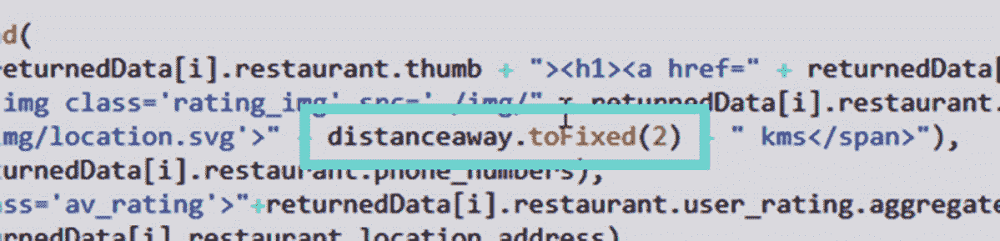
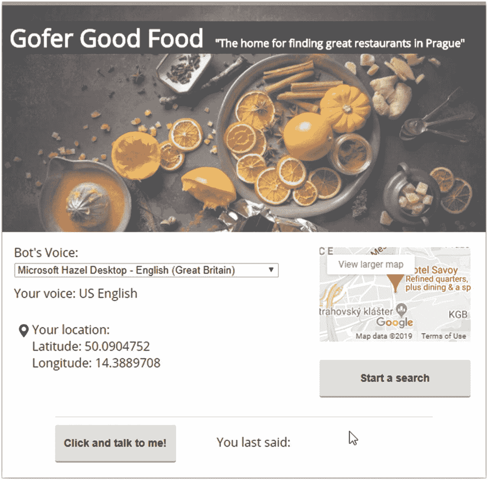
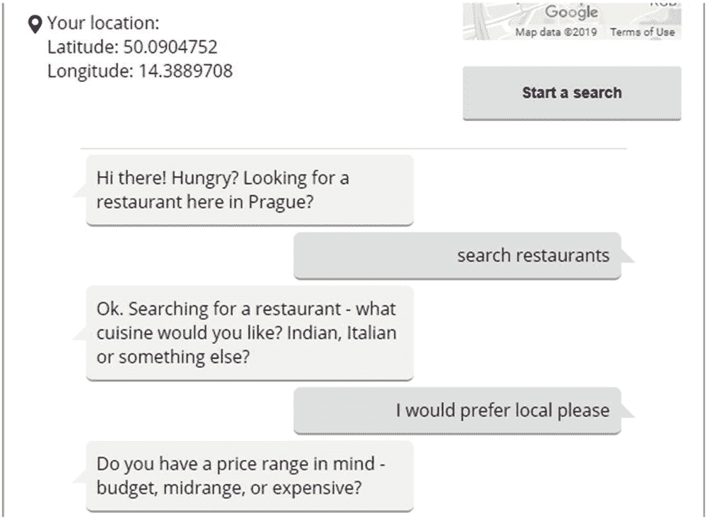
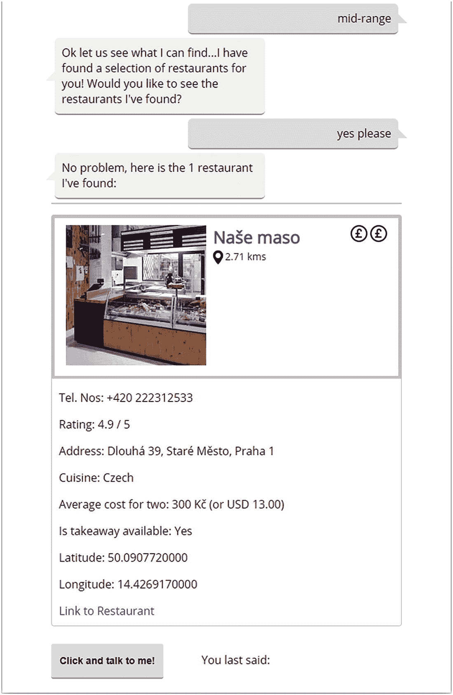
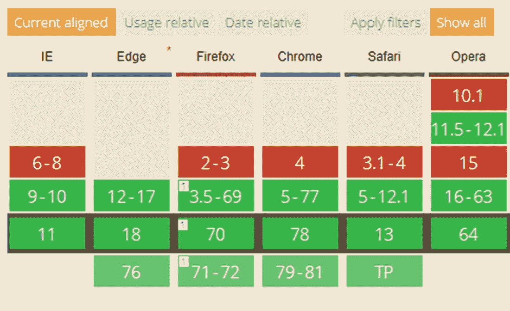
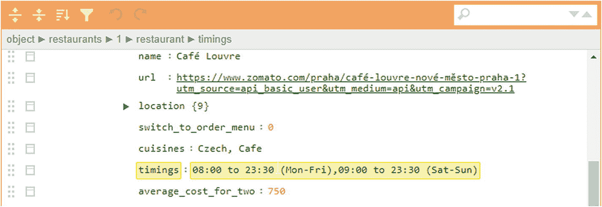

# 七、项目：寻找餐馆

> *“这些编码弄得我都饿了……肯定是时候了，对吧……？”*

是的，该吃点东西了！我不想呆在家里，我想出去。麻烦的是，去哪里？我喜欢什么样的食物？我们可以在网上看看，但那太老套了。为什么不简单地让我们的电脑告诉我们附近哪家餐馆供应我们喜欢的食物？

是的，我们可以使用 Speech APIs 和 Zomato 餐馆搜索服务的强大功能来为我们完成这项工作。在本章的过程中，我们将探索如何将 API 与其他服务一起使用，以创建一些创新的应用来帮助满足这种渴望，并让您为更多的编码做好准备。

## 设置场景

在为第三章的 Raspberry Pi 板演示做研究的时候，它让我想到，*我们能不能使用语音 API 来创建一个更有用的应用，动态地获取它的源代码？*好的，答案几乎肯定是“如何”，而不是“如果”,而是“听我说”。一切很快就会明朗。

如果我们再看一下那个演示的代码，你会发现它大部分都是硬编码的；毕竟，这更多的是关于语音 API，而不是找到一项以我最喜欢的两种食物命名的技术…但是我跑题了！为了使使用语音 API 更加有用，我们应该尝试将它绑定到一个数据源，比如 JSON 或 SQL。

这恰好是我们下一个项目的主题。在本章中，我们将创建一个简单的应用，在捷克共和国美丽的城市布拉格寻找合适的就餐地点。为什么是布拉格？嗯，在我开始写这本书之前，我碰巧在假期参观了它——这是一个如此美丽的城市，有华丽的建筑，当然，还有很多餐馆可以去。

好了，记住这一点，我们需要开始构建我们的应用；第一步是设置我们将在演示中包含的参数，所以让我们深入了解一下，更详细地了解一下。

## 设定我们项目的参数

与任何项目一样，我们需要设定我们将包含的最小可行产品的界限，至少对于本书来说是这样。

这对这个演示特别重要，因为它有潜力发展成更大的东西；与此同时，我们需要意识到，它不会是生产就绪，但至少会给我们机会开发更适合生产使用的东西。

因此，记住这一点，让我们为我们的演示设置场景。请允许我向您介绍“Gofer Good Food”，这是一个概念验证机器人应用，用于在布拉格及其周边地区寻找优秀的餐厅。这种应用可以由当地旅游局免费下载；为了方便起见，我们将创建一个桌面版本的初始 MVP 来探索它是如何工作的。幸运的是，在本书的前面，我们已经使用了我们需要的技术之一。除了语音 API 之外，让我们来看看完整的功能列表:

*   我们将使用 Zomato.js API 来查找我们的餐馆——尽管我们以布拉格为例，但同样的原则也适用于 API 支持的任何城市或地区。

*   搜索阶段的所有响应都是基于音频的——这既包括我们寻找合适餐厅的请求，也包括我们应用的响应。

*   任何显示餐厅详细信息的回答(如地图、电话号码等)。)将呈现在屏幕上。

*   我们将利用一个服务来提供一个基本的地图工具，显示我们在城市中的位置(我们将在本章的后面把它扩展到餐馆)。

*   使用货币转换过程来显示您选择的货币的当地价格-对于本书，我们将保持美元，但原则对于其他货币将是相同的。

*   我们将使用经度和纬度值计算出您的位置，并使用这些值计算出您选择的餐厅距离您有多远。

太好了！我们有很多可以开始的地方——我确信我们可以提出更多的想法来进一步发展这一点。我们将在这一章的后面谈到一些观点。现在，我们将继续为我们的应用确定业务逻辑，但在此之前，我们需要掩盖一些重要的事情:围绕我们的概念证明将如何工作设定预期。

## 设定期望

在这一点上，我大概能听到你这样说的声音:*“啊哦，你所说的……期望……是什么意思？*“这是一个合理的问题，但我们称此演示为概念验证是有充分理由的。我再解释一下。

在本书有限的篇幅内，我们永远也不能指望做一个像《正义》这样的全尺寸演示；事实上，我们可以很容易地填满一整本书的页面！我们还有一个额外的复杂性，即正在使用的两种核心技术(聊天机器人框架和语音 API)有点像粉笔和奶酪——两者都不提供对彼此的本地支持，但只要稍加劝说，它们就可以一起工作。

这确实意味着事情可能不是 100%完美的——但如果是，那么生活将会很无聊，对吗？我是那种相信把船推出去看看事情能走多远的人；是的，我们可能会发现它们不起作用，但我们不知道，直到我们尝试！

考虑到这一点，我强烈建议以开放的态度对待这个项目 Speech APIs 在不同的框架下都能很好地工作，所以这在很大程度上是一个判断某件事情是否可行以及可以走多远的问题。下一个项目将不会是生产就绪，但应该给我们提供了很多机会来进一步发展这一原则，使之更加成熟，真正的人可以使用！

好了，警告够了。让我们将注意力转移到确定这个应用的业务逻辑上，这样我们就可以看到它在现实中是如何工作的，以及在以后的日子里我们可能有机会在哪里进行开发。

## 确定业务逻辑

为了这个项目的目的，当涉及到确定返回给我们的用户的餐馆时，我们可以要求所有方式的细节——事情是这样的，一旦你问了一个，这是问其他人的相同过程！

考虑到这一点，我们将重点问两个问题:第一个是顾客想要哪种菜肴，第二个是价格范围。通过这种方式，我们可以保持相当大的选择范围，并为您日后扩展提供了一个很好的机会。我们将从通过一个按钮发起请求开始，但使用一个单独的按钮来启用每个响应的麦克风——后者将保持在更靠近应用底部的位置，以便不会模糊我们客户的结果(这是 UX 风格的原因，而不是技术原因！)

好吧，我们继续。既然我们已经解决了我们将要做的基本问题，那么是时候了解技术并解决我们将如何为我们的演示提供动力了。我们已经利用了这个应用所需的两个关键 API，但是我们还需要其他 APIs 让我们更详细地看看我们的项目需要使用的工具。

## 设计我们的项目

我们可以使用各种不同的工具来完成这个项目，所有这些工具都有各自的特点或缺点，但出于演示的目的，我选择使用以下服务:

*   zomato——他们整理了全球数千家餐厅的详细信息，并提供了一个基于 API 的服务，我们可以从中获得详细信息，如菜肴、典型价格、评论等。我们将利用他们的免费 API，来获取我们的应用所需的细节。数据采用 JSON 格式——为了方便起见，我们将使用 jQuery 来消费和呈现数据。我们同样可以使用普通的 JavaScript。

    **注意**使用这个 API 确实需要在 [`https://developers.zomato.com/api`](https://developers.zomato.com/api) 注册他们的服务；这是免费的，只要你保持在他们的日常使用率的范围内。

*   rive script–我们在第三章中利用了这一点；这一次，我们将使用语音合成和识别 API 来实现双向语音。

*   谷歌地图——虽然我个人并不喜欢使用谷歌，但它确实提供了很好的地图服务；我们可以将它嵌入到我们的演示中，这样我们就可以看到我们在布拉格的位置。

*   我们将在 [`https://www.exchangerate-api.com/`](https://www.exchangerate-api.com/) 使用免费的货币转换器 API，将当地货币转换为美元——如果我们愿意，我们可以对此进行硬编码，但是添加 API 调用将使事情变得更有趣！

*   我们还将利用 SessionStorage API 来临时存储来自餐馆搜索的值，以便我们的机器人可以使用它们。这样做有逻辑上的原因；我们将在本章末尾更详细地探讨这一点。

*   作为奖励——如果空间允许——我们将简要介绍一下在显示电话号码时使用点击呼叫的方法。大多数手机会自动这样做，但如果我们采取一些简单的步骤来正确地重新格式化电话号码，我们可以增加我们的机会。

在这一点上，我们需要注意一些限制:

*   对于 Zomato API，我们将在本地托管 JSON 文件的副本。唯一的原因是速度:JSON 文件超过 6500 行，非常庞大！别担心。我们就不修改了。我将在项目结束时解释切换到使用 Zomato 托管的版本需要做哪些更改。

*   我们的托管版本将只使用返回的前 20 个名称；我们将在这一章的后面讨论扩展它需要什么样的改变。

好了，现在我们知道了将要使用的技术，是时候开始写代码了！为了使事情变得简单，我们将把它分成几个阶段:第一个阶段是设置我们需要的基本文件和文件夹，所以让我们更详细地看一下所涉及的内容。

## 设置初始标记和样式

我们很快就会看到，这个演示中有相当多的代码。出于演示的目的，我们将跳过 HTML 标记和样式；这是标准代码，基于我们在之前的演示中使用的代码。相反，我们将把注意力完全集中在关键部分，即 JavaScript 上，看看需要什么来使我们的应用按预期运行。

Setting Up The Basics

在进入代码的真正内容之前，我们需要掩盖一些事情。让我们更详细地看看这个:

1.  我们使用了 Freepik 从 Flaticon 网站 [`https://www.flaticon.com/free-icon/placeholder-filled-point_58960`](https://www.flaticon.com/free-icon/placeholder-filled-point_58960) 下载的地理定位 SVG 我已经将它包含在代码下载中。如果您想使用替代方案，请相应地修改代码。

2.  我建议准备一个 JSON 编辑器——在 [`https://onlinejsoneditor.com/`](https://onlinejsoneditor.com/) 有一个很棒的在线编辑器。Zomato 生成的 JSON 文件非常大，所以有一些可以让我们过滤数据的东西将是一个很大的帮助！

3.  您将需要我们在本练习开始时提到的来自 Zomato 的 API 密匙。

1.  我们首先从本书附带的代码下载文件夹中提取一个`zomato`文件夹的副本——然后保存在我们的项目区域。

    如果您在本章的后续演示中看到任何对“迷你项目区域”的引用，它们指的是这个 zomato 文件夹。

好了，有了这些，让我们开始演示吧。

## 初始化我们的项目

让我们的演示运行所需的大部分工作将是创建我们的脚本文件——这将涵盖语音 API 和我们对 Zomato 数据的调用。

Initializing The Project

第一步是为我们的代码建立一个空白文件——打开您的文本编辑器，然后创建一个新文件，并在继续这些步骤之前，将其保存为迷你项目文件夹的`js`子文件夹中的`script.js`:

1.  现在，我们已经设置了初始声明——继续并保存文件。

2.  保持文件打开，因为我们将在下一个练习中继续。

1.  我们有相当多的代码要添加——第一部分将设置基本函数，并添加一些变量声明。继续，按照指示添加以下代码:

    ```html
    /*jshint esversion: 6 */

    (function () {
      "use strict";

      let bot = new RiveScript();

      const message_container = document.querySelector('.messages');
      const question = document.querySelector('#help');
      const voiceSelect = document.getElementById('voice');
      const mylat = document.querySelector("span.lat");
      const mylon = document.querySelector("span.lon");
      const output = document.querySelector(".output_result");

      var cuisineType = sessionStorage.getItem("cuisine");
      var rating = sessionStorage.getItem("priceRange");
      var restCount = 0;
      var takeaway = "";

      /****************************************************/
    }());

    ```

2.  Next, we will add in a simple function to take care of working out where we are located in Prague. Leave a blank line after the takeaway variable declaration, and then add in the following code:

    ```html
      mylat.innerHTML = "50.0904752";
      mylon.innerHTML = "14.3889708";

        /*function getLocation() {
        navigator.geolocation.getCurrentPosition((loc) => {
          mylat.innerHTML = loc.coords.latitude;
          mylon.innerHTML = loc.coords.longitude;
        })
      }

      getLocation();*/

    ```

    你会注意到这被注释掉了——这是故意的。我们将在本章后面揭示原因。

乍一看，你可能会认为只有四个步骤似乎是一个非常短的练习！这是一个很好的观点，但嘿，我们需要从某个地方开始，我相信你不会感谢我跳进深水区，对不对？不要担心——我们还有很多代码要写。让我们进入下一部分，我们开始让我们的机器人和我们说话。

### 让我们的机器人说话

好吧，最后一个评论可能听起来像是我们在鼓励一个顽劣的孩子继续胡作非为，但这与事实相去甚远！实际上，下一个演示是让我们的应用具有说话的能力。这是一个两阶段的过程，我们定义我们的应用应该如何说话；“说什么”在后面的演示中出现。

Adding Speech Capabilities

记住这一点，让我们开始吧:

1.  在前一个程序块末尾的注释行之后，保留一行空白，然后添加这个函数——它会负责将声音加载到我们的演示中:

    ```html
     function loadVoices() {
        var voices = window.speechSynthesis.getVoices();

        voices.forEach(function(voice, i) {
          var option = document.createElement('option');
          option.value = voice.name;
          option.innerHTML = voice.name;
          voiceSelect.appendChild(option);
        });
      }

      loadVoices();

    ```

2.  我们需要添加第二个函数——对于 Chrome 的某些版本，语音必须异步加载，所以添加这个事件处理程序:

    ```html
    // Chrome loads voices asynchronously.
    window.speechSynthesis.onvoiceschanged = function(e) {
      loadVoices();
    };

    ```

3.  下一个函数负责在浏览器控制台中呈现错误消息，如果我们的应用在操作过程中抛出错误消息的话。为此，留出一个空行，然后添加以下代码:

    ```html
    window.speechSynthesis.onerror = function(event) {
      console.log('Speech recognition error detected: ' + event.error);
      console.log('Additional information: ' + event.message);
    };

    ```

4.  接下来是应用这一部分的关键所在——在这里，我们根据代码中的请求，清晰地表达我们的机器人提供的每条消息。为此，在`onerror`事件处理程序下面添加以下代码:

    ```html
    function speak(text) {
        var msg = new SpeechSynthesisUtterance();
        msg.text = text;

        if (voiceSelect.value) {
          msg.voice = speechSynthesis.getVoices().filter(function(voice) {
            return voice.name == voiceSelect.value;
          })[0];
        }

        speechSynthesis.speak(msg);
      }

    ```

    本节的其余部分将切换到我们需要为我们的机器人添加的代码——我们将从声明一个对用于配置机器人的`brain.rive`文件的引用开始。为此，在前一个函数的右括号后面添加接下来的三行，中间留一个空行:

    ```html
    const brains = [
      './js/brain.rive'
    ];

    ```

5.  我们之前已经看到了接下来的两个函数，尽管是第一个函数的简单版本——我们需要添加代码来处理我们的机器人如何在屏幕上呈现响应。继续在 brains const 声明下面添加以下代码:

    ```html
    function botReply(message){
      if (message.indexOf("No problem") != -1) {

        $.when(getRestaurants()).then(function() {
          restCount = sessionStorage.getItem("restCount");
          message = "No problem, here is the " + restCount + " I've found:";
          message_container.innerHTML += `<div class="bot">${message}</div>`;
        }).then(function(){
          $(".here").css("display", "block");
          output.textContent = "";
        });
      } else {
        message_container.innerHTML += `<div class="bot">${message}</div>`;
      }

      location.href = '#edge';
    }

    ```

6.  接下来，我们需要添加在与机器人交互时，负责在屏幕上呈现我们的响应的函数:

    ```html
    function selfReply(message){
      var response;

      response = message.toLowerCase().replace(/[.,\/#!$%\^&\*;:{}=\-_`~()]/g,"");

      if (response.indexOf("No problem") != 1) {
        restCount = sessionStorage.getItem("restCount");
        message = "No problem, here is the " + restCount + " I've found:";
      }

      message_container.innerHTML += `<div class="self">${message}</div>`;
      location.href = '#edge';

      bot.reply("local-user", response).then(function(reply) {
        botReply(reply);
        speak(reply);
      });
    }

    ```

7.  有了这两个函数，我们需要再添加三个来管理我们的机器人的初始化——第一个是这个:

    ```html
    function botReady(){
      bot.sortReplies();
      botReply('Hi there! Hungry? Looking for a restaurant here in Prague?');
    }

    ```

8.  第二个负责如果机器人无法初始化会发生什么:

    ```html
    function botNotReady(err){
      console.log("An error has occurred.", err);
    }

    ```

9.  我们的机器人不能自动初始化(我们稍后会解释原因)——为了解决这个问题，我们需要为 Start a search 按钮添加一个事件处理程序。为此，继续添加以下代码:

    ```html
    question.addEventListener("click", function() {
      speak("Hi there! Hungry? Looking for a restaurant here in Prague?");
      bot.loadFile(brains + "?" + parseInt(Math.random() * 100000)).then(botReady).catch(botNotReady);
    });

    /****************************************************/

    ```

10.  我们已经完成了这一部分。继续保存代码。让文件保持打开状态，因为我们将很快继续下一部分。

好了，我们完成了第一部分，但还有很多要做！现在，我们应该已经有了基本的容器函数，以及我们的初始变量和让我们的机器人说话过程的第一部分。

这个项目的下一部分是事情变得有点复杂的地方——在我们可以让我们的机器人说出它发现了什么之前，我们必须首先让它找到一些可以谈论的东西！是的，下一部分是我们去挖掘符合我们标准的餐馆的细节。让我们深入研究一下，更详细地了解一下其中的机制。

### 获取餐厅详细信息

下一部分将变得更加有趣——我们可以真正开始展示语音 API 如何与我们可以消费的其他服务协同工作。

在接下来的几页中，我们将使用前面提到的 Zomato 服务获取所选餐馆的详细信息，并将结果组合成可以在屏幕上显示的格式。

Searching For Restaurants

让我们从添加代码开始:

1.  我们需要添加的第一部分负责计算纬度和经度两点之间的距离，这样我们就可以指出餐馆离我们现在的位置有多远。为此，在前一个事件处理程序下面留一个空行，然后添加这个函数:

    ```html
    function distance(lat1, lon1, lat2, lon2) {
      var p = 0.017453292519943295;    // Math.PI / 180
      var c = Math.cos;
      var a = 0.5 - c((lat2 - lat1) * p)/2 +
              c(lat1 * p) * c(lat2 * p) *
              (1 - c((lon2 - lon1) * p))/2;

      return 12742 * Math.asin(Math.sqrt(a)); // 2 * R; R = 6371 km
    }

    ```

2.  接下来是本部分的关键部分——给 Zomato 打电话，获取符合我们选择标准的餐馆的详细信息。为此，我们要添加一个有点长的函数，所以我们将把它分成几个部分；先添加这部分:

    ```html
    function getRestaurants() {
      $.ajax({
        method:'GET',
        crossDomain: true,
        url: 'js/restaurants-prague.json',
        dataType: "json",
        async: true,
        headers: {
          "user-key": "c697ba51c6b29523f885bb3a8b279c93"
        },
        success: function(response){

    < ADD IN CODE HERE >

        }
      });
    }
    /***************************************************/

    ```

3.  我们现在可以添加三个代码块来完成这项工作——第一个代码块用于根据我们的选择标准过滤 JSON 文件。继续操作，插入以下代码行，替换上一步中的`<ADD IN CODE HERE>`注释:

    ```html
    /* filter on cuisine type and user rating */
    var returnedData = $.grep(response.restaurants, function (element, index) {
      return ((element.restaurant.cuisines == cuisineType) && (element.restaurant.price_range == rating));
    });

    ```

4.  下一个代码块负责将找到的餐馆数量存储为 sessionStorage 值——这用于更新从我们的机器人返回的响应。继续在 grep 函数下面添加这几行代码，中间留一行空白:

    ```html
    // Work out how many restaurants and store in session Storage
    restCount = (returnedData.length == 1 ? "1 restaurant" : returnedData.length + " restaurants");
    sessionStorage.setItem('restCountValue', restCount);

    ```

5.  接下来是演示这一部分的真正内容——在这里，我们从经过过滤的 JSON 数据中检索各种值，并将它们呈现在屏幕上。这采用了一组嵌套的 for…语句的形式——继续在上一步之后添加以下代码，中间留一个空行:

    ```html
      for(var i=0; i<returnedData.length; i++){
        var distanceaway = distance(mylat.innerHTML, mylon.innerHTML, returnedData[i].restaurant.location.latitude, returnedData[i].restaurant.location.longitude);

        for(var x=0; x<returnedData[i].restaurant.highlights.length; x++){
          if (returnedData[i].restaurant.highlights[x] == "Takeaway Available") {
            takeaway = "Yes";
          }
        }

        var newDiv = $("<div class="card">");
          newDiv.append(
            $("<div class='card-body'>").append(
            $("<span>").html("<h1><a href=" + returnedData[i].restaurant.menu_url + ">"+returnedData[i].restaurant.name+"</a></h1><span class="distance">" + distanceaway.toFixed(2) + " kms</span>"),
            $("<p>").html("Tel. Nos: " + returnedData[i].restaurant.phone_numbers),
            $("<p>").html("Rating: <span class="av_rating">" + returnedData[i].restaurant.user_rating.aggregate_rating + " / 5 </span>"),
         $("<p>").text("Address: " + returnedData[i].restaurant
         .location.address),
         $("<p>").text("Cuisine: " + returnedData[i].restaurant.
          cuisines),
         $("<p>").text("Average cost for two: " + returnedData[i].restaurant.average_cost_for_two + " " + returnedData[i].restaurant.currency + " (or USD " + amt + ")"),

         $("<p>").text("Is takeaway available: " + takeaway),
         $("<p>").text("Latitude: " + returnedData[i].restaurant
         .location.latitude),
         $("<p>").text("Longitude: " + returnedData[i].restaurant
         .location.longitude),
         $("<p>").html("<a href=" + returnedData[i].restaurant.url + ">Link to Restaurant</a>")
       )
     );
     $(".here").append(newDiv);

      // reset
      distanceaway = 0;
    }

    ```

6.  唷！那是一些功能，是吧？不要担心，我们已经完成了这一部分。我们还需要添加一个部分来完成这个文件。继续保存您到目前为止所做的工作——您可以保持文件打开，因为我们很快就会回来添加剩余的代码。

好的，我们进展不错。这个文件的大部分代码已经完成。在切换到配置我们的机器人之前，我们还有一部分要做，那就是添加语音识别 API。

我们将使用它向应用口述我们的选择——这意味着我们现在可以简单地说话，应用会将其翻译成书面文本，而不是输入文本(就像我们在本书前面的演示中所做的那样)。让我们深入研究一下如何将早期演示中的代码重用到更实用的东西中。

### 添加语音输入功能

对于 script.js 文件的最后一部分，我们需要添加代码，以允许我们的机器人识别来自我们的口头命令；希望您能认出早期演示中的大部分代码，尽管我们已经将它重新用于我们的应用中！

实际上，语音识别 API(和它的姐妹，语音合成 API)的大部分基本框架不太可能随着项目的不同而发生巨大的变化；它可能看起来有所不同，但是如果仔细观察代码，您会看到出现了相同的结构，例如 speechstart 和 result。记住这一点，让我们看看如何重用早期演示中的代码来完成项目的这一部分。

Adding Speech

好了，让我们继续为 script.js 文件添加最后一部分代码:

1.  我们将在前面的注释下留出一个空行，然后添加这个`getUserMedia`调用:

    ```html
    navigator.mediaDevices.getUserMedia({ audio: true }).then(function(stream) {

    <ADD CODE IN HERE >

        }).catch(function(err) {
        console.log(err);
      });

    ```

2.  接下来，留下一个空行，然后用这些变量和属性声明:

    ```html
    const SpeechRecognition = window.SpeechRecognition || window.webkitSpeechRecognition;
    const recognition = new SpeechRecognition();

    recognition.interimResults = false;
    recognition.maxAlternatives = 1;
    recognition.continous = true;

    ```

    替换短语`<ADD CODE IN HERE>`
3.  接下来是负责管理语音识别服务或在事件发生时做出响应的事件处理程序。第一个是当我们点击`Click and talk to me!`按钮时启动服务:

    ```html
    document.querySelector("section.speech > button") .addEventListener("click", () => {
      let recogLang = "en-US";
      recognition.lang = recogLang.value;
      recognition.start();
    });

    ```

4.  我们需要添加的下一个事件处理程序负责检测语音的存在，也就是说，我们已经开始说话了。为此，留出一个空行，然后添加以下代码:

    ```html
    recognition.addEventListener("speechstart", () => {
      console.log = "Speech has been detected.";
    });

    ```

5.  同样，当语音识别服务检测到一个单词或短语被正确识别并返回到我们的应用时，我们有一个事件处理程序来处理。我们用它来触发我们的机器人显示下一个问题——为此，继续添加代码:

    ```html
    recognition.addEventListener("result", (e) => {
      console.log = "Result has been detected.";

      let last = e.results.length - 1;
      let text = e.results[last][0].transcript;
      output.textContent = text;
      selfReply(output.textContent);
    });

    ```

6.  我们还有两个事件处理程序。当我们结束谈话时，我们需要向 API 发出信号；speechend 事件处理程序为我们处理这些:

    ```html
    recognition.addEventListener("speechend", () => {
      recognition.stop();
    });

    ```

7.  如果出现任何错误，我们需要在浏览器的控制台区域显示适当的错误消息。为此，我们使用了恰当命名的错误事件——在前面的事件处理程序之后添加以下代码:

    ```html
    recognition.addEventListener("error", (e) => {
      console.textContent = "Error: " + e.error;
    });

    ```

8.  我们现在已经完成了该文件，请继续保存您的工作，然后暂时关闭它。剩下的代码我们将添加到一个单独的文件中。

唷！我们完成了——至少这个文件完成了！诚然，这需要做很多工作，但设置它以便我们可以更早地测试更改将是棘手的，并使组装步骤更加复杂。不过，如果你能走到这一步，那就做得很好。休息一下，喝点酒庆祝一下！

好了，回到现实，我们还有一部分要处理，那就是告诉我们的机器人说什么。虽然我们有好几个步骤要完成，但我向您保证代码会简单得多，所以事不宜迟，让我们深入了解一下。

### 配置机器人

下一部分对您来说应该有些熟悉，至少在构造方面——是时候为我们的机器人设置各种响应，以便作为客户向我们表达。为此，我们将使用 RiveScript bot 框架，与本书前面的演示方式类似；这一次，我们将扩展我们在演示中首次使用的一些功能。

Adding Speech

好了，我们开始吧:

1.  配置我们的机器人的第一步是打开一个新文件，然后添加这条语句——这告诉我们的机器人使用 RiveScript 解释器的版本 2:

    ```html
    ! version = 2.0

    ```

2.  接下来，留下一个空行，然后添加第一个函数——这个函数负责在继续下一个问题之前，用 Zomato 可以识别的格式替换其中一种食物类型，并在正确的情况下将其呈现到 sessionStorage 中:

    ```html
    > object foodtype javascript
      var newFood
      for (var i = 0; i < args.length; i++) { newFood = args[i] }

      if (newFood == "local") { newFood = "Czech" }
      newFood = newFood.charAt(0).toUpperCase() + newFood.slice(1)
      sessionStorage.setItem("cuisine", newFood)

      return "Do you have a price range in mind - budget, midrange, or expensive?"
    < object

    ```

3.  我们要添加第二个函数——为此，保留一个空行，然后添加以下代码，以保存 Zomato 提供的可用价格范围值的正确值:

    ```html
    > object rating javascript
        var priceRange
        for (var i = 0; i < args.length; i++) {
          priceRange = args[i]
        }

        if (priceRange == "budget") { priceRange = 1}
        if (priceRange == "midrange") { priceRange = 2}
        if (priceRange == "highend") { priceRange = 3}
        sessionStorage.setItem("priceRange", priceRange)

        return "Ok let us see what I can find..."
    < object

    ```

4.  我们的第三个(也是最后一个)函数获取 Zomato 找到的餐馆数量，然后作为与机器人对话的一部分呈现出来:

    ```html
    > object restCount javascript
        return sessionStorage.getItem("restCountValue")
    < object

    ```

5.  接下来，我们需要开始添加语句来模拟我们将与机器人进行的对话。为此，我们将从第一个问题的回答开始——留下一个空行，然后添加代码:

    ```html
    + search restaurants
    - Ok. Searching for a restaurant - what cuisine would you like? Indian, Italian or something else?

    ```

6.  我们现在需要注意所需的食物类型——为此，在上一步之后继续添加以下代码，中间留一个空行:

    ```html
    + i would prefer (chinese|indian|local|mexican) please
    - <call>foodtype <star></call>

    ```

7.  我们需要问的最后一个问题是价格范围——为此，继续添加以下代码，中间留一个空行:

    ```html
    + (budget|midrange|expensive)
    - <call>rating <star></call>
    ^ I have found a selection of restaurants for you! Would you like to see the restaurants I've found?

    ```

8.  最后一步是确认我们希望看到符合我们所选标准的可用餐馆——为此，保留一个空行，然后添加以下代码:

    ```html
    + yes please
    - No problem, here is the <call>restCount</call> I've found:

    ```

9.  我们还需要添加最后一个模块——这是一个通用的总括模块，以防我们没有说出正确的文本或者 API 没有识别出我们所说的内容。留下一行，然后放入下面的代码:

    ```html
    + *
    - Sorry, I did not get what you said
    - I am afraid that I do not understand you
    - I did not get it
    - Sorry, can you please elaborate that for me?

    ```

10.  至此，我们完成了编辑。将文件保存为迷你项目区的`js`子文件夹中的`brain.rive`，然后关闭它。

我们差不多到了可以测试我们项目的时候了，但是在此之前，我们还需要修复一个部分。是的，我确实说过我们已经完成了`script.js`，但是如果你仔细观察，你可能会发现一个问题。

好吧，我承认“问题”可能是一个太强烈的词，但尽管如此，如果我们不这样做下一部分，那么很可能你会看到(或 USDundefined)出现在最终的结果！是的，在“搜索餐馆详细信息”演示的第 5 步中，我们放入了一个变量`distanceaway`来显示转换后的美元金额，但是没有放入任何东西来执行转换…哦！

别担心。这很容易解决。它允许我们使用另一个 API，所以让我们更详细地看看这个特性是如何融入我们的整个演示中的。

### 将货币兑换成美元

如果我们仔细看看代码(如图 7-1 所示)，我们确实可以看到被引用的`distanceaway`变量——快速搜索文件的其余部分不会显示对它的任何其他引用。



图 7-1

正在使用的 distanceaway 变量…

这是一个简单的解决办法，所以让我们开始添加它作为我们的下一个演示。

Displaying Usd Conversion

要解决此问题，请按照下列步骤操作:

1.  我们将首先重新打开 script.js 文件，然后查找位于距离函数之前的注释行。

2.  在它下面留一个空行，然后添加这个变量声明:

    ```html
    var amt;

    ```

3.  在那个声明下面，留一个空行，然后放入这个函数:

    ```html
    $.getJSON('https://api.exchangerate-api.com/v4/latest/CZK', function(data) {
      var currencies = [];
      $.each(data.rates, function(currency, rate) {
        if (currency == "USD") {
          amt = (rate * 300).toFixed(2);
        }
      });
    })

    ```

4.  继续保存文件，我们可以关闭它。您的演示现在终于完成了！

好了，这次我们的代码真的完成了！完成最后一个函数后，让我们将注意力转向测试演示，这样您就可以看到这两个 Speech APIs 如何与演示中使用的其他服务进行交互。

## 测试演示

接下来是最有趣的部分，也可能是最令人头疼的部分:是时候测试我们的演示了！

为此，您需要浏览到`https://speech/restaurant`；第一次启动演示时，我们会看到类似于图 7-2 所示的截图。



图 7-2

我们完成的演示，准备接受输入

要操作它，我建议使用这种方法，您的回答用粗体文本表示:

*   单击开始搜索。然后等待最初的欢迎信息出现并被朗读。

*   出现提示时，说**搜索餐馆**。

*   根据对菜肴类型的要求，说**我更喜欢本地菜**。

*   当提示价格范围时，说**中档**。

*   当机器人确认它已经找到了一些结果，说**是的，请**。

这听起来像是我们将测试引向一个已知的场景，而没有预料到用户可能会说什么，但这是故意的。这有利于展示演示在技术上运行得有多好，以及用户提出的问题是否自然——在这种情况下，我怀疑还有改进的空间！

暂时把这个放在一边，我们可以开始看看图 7-3 中的演示是如何工作的。



图 7-3

我们实际演示的第一部分...

如果我们逐步完成每一步，我们可以看到最后的结果，如图 7-4 所示。



图 7-4

实际演示的第二部分

正如我们从图 7-4 的截图中看到的，我们已经包括了每家餐厅的基本细节，以及将顾客带回到该餐厅的 Zomato 网站的链接——这对于查看额外的细节很有用，例如营业时间和评论。我们在这里添加的细节完全可以调整——每个细节都是从该餐馆的 JSON 对象中获取的，并在适当的时候显示为文本(或 HTML 标记)。

我们将在这一章的后半部分进一步阐述这一点。

好了，现在是最重要的部分了？我们的代码是如何工作的？我们已经在本演示的过程中介绍了一些有用的 API，所以在我们了解如何在未来的开发中改进代码之前，让我们花点时间来更详细地回顾一下我们使用了哪些 API。

## 详细剖析我们的代码

在本章的过程中，我们已经讨论了大量的代码——其中大部分位于我们的`script.js`和`brain.rive`配置文件中。它大部分使用了我们在早期演示中介绍过的原理，所以现在应该开始熟悉了！

然而，考虑到所使用的两种核心技术并不相互提供本地支持，值得花些时间来探索我们是如何设法让这两种技术更详细地相互通信的。记住这一点，在依次进入 script.js 和 brain.rive 文件之前，让我们首先更详细地看一下 HTML 标记。

### 剖析我们的 HTML 标记

这个文件中的大部分内容相当简单——一旦定义了对 CSS 样式文件的引用，我们就设置一个`#page-wrapper` div 来包含我们所有的内容。然后我们创建一个`.voicechoice`部分来放置下拉菜单，允许我们选择机器人应该使用哪种语言，并为客户显示默认的语音设置。

接下来是`.location`部分，我们用它来呈现代表我们选择的酒店的经度和纬度坐标的硬编码值，以及显示酒店在布拉格的位置的(工作中的)Google Maps 图像。

然后我们有`#help`部分，这是主持对话的地方；最后一个条目被我们的脚本文件重新格式化，以存放从 Zomato 数据中找到的结果(稍后将详细介绍)。然后我们用`.speech`部分来完成演示的这一部分，它包含启动语音识别服务的按钮，以及一个位置合适的`.output`区域来显示我们的响应。

### 分解主脚本文件

这是事情变得更有趣并开始走到一起的地方——我们的 script.js 文件包含了运行我们的演示所需的大部分代码。我们从一组变量声明开始；这包含了一个注释掉的代码块，我们将使用 HTML5 地理定位 API 来提供我们的位置(在本章的后面会详细介绍)。

#### 语音合成 API 和我们的机器人

声明完成后，我们就有了`loadVoices()`函数，它用于将 Google 提供的声音加载到我们在标记文件中设置的`.output_result`下拉框中。请注意，我们还为`onvoiceschanged`事件提供了一个事件处理程序——一些版本的 Chrome 要求异步加载这些声音，尽管在最新版本的 Chrome 中这应该不是什么问题。然后我们转移到`speak()`函数，在这里我们配置一个新的`SpeechSynthesisUtterance`接口实例，然后从`voiceSelect`下拉菜单中选择声音，从 msg 变量中选择文本。

接下来，我们进入机器人运行所需的代码——我们从一个声明开始，在运行`botReply()`和`selfReply()`函数之前，该声明存储了对我们的`brain.rive`文件的引用。这些函数稍微复杂一些，所以下面是它们的功能分类，从`botReply`函数开始，我们用它来呈现来自聊天机器人的响应:

*   屏幕上显示的来自我们的机器人的所有消息都通过消息占位符变量传递——我们首先检查这个变量的内容。

*   如果消息变量包含文本“No problem”，我们使用它作为触发器，首先搜索 Zomato 提供的 JSON，然后存储返回的餐馆数量。

*   然后，我们相应地调整消息，然后在屏幕上构建标记并呈现在`.here` div 中，并重置`.output_log` div。

*   但是，如果我们没有找到“没问题”的实例，那么我们只需在屏幕上显示消息，然后转到客户的下一个响应。

    如果您想知道为什么我们使用“没问题”，这很简单:我们需要使用一个触发短语来拦截和修改返回给用户的消息。在我们的演示中，其他地方没有任何文本！

我们的两个回复函数中的另一个是`selfReply`——这是一个用于将我们答案的文本转换成我们的机器人可以处理的东西的函数。按顺序，事情是这样的:

*   我们首先分配 response 变量——这用于存储我们请求的文本副本，然后将其转换为小写并从中删除标点符号或特殊字符(为了 RiveScript 正确运行，必须省略这些)。

*   然后我们检查消息的内容——和以前一样，如果它包含“没问题”，我们截取它并修改它以显示我们从会话存储中获得的餐馆计数值。

*   然后，我们用适当的标记重新格式化消息，然后将其呈现在屏幕上，并将其推送到 speak 函数以进行口头回应。

然后，我们用两个系统函数和一个事件处理程序来完成演示的这一部分——前两个用于准备运行的机器人(`botReady`)，以及如果机器人不可用会发生什么(`botNotReady`)。然后我们在问题事件处理程序中使用这两者，它在初始化我们的演示之前加载`brain.rive`文件。

#### 获取餐馆数据

下一部分可能看起来最复杂，但实际上，大部分内容都被 AJAX 请求占用了，我们请求 AJAX 将数据加载到我们的演示中。我们从两个函数开始:第一个调用由 ExchangeRate-API.com 提供的服务，获得我们使用的每个价格的美元等值。第二个是距离，用于计算每家餐馆离我们现在的位置有多远。

这一部分的核心部分是`getRestaurants()`函数——这是我们加载 JSON 文件的地方，然后使用`$.grep`过滤掉任何不符合我们要求的**和**的餐馆。然后，我们计算出返回了多少家餐馆(`restCount`)，然后将其作为一个值存储在会话存储中。然后，我们遍历每个餐馆，首先计算出离我们位置的距离(`distanceaway`)，然后如果它提供外卖，将结果呈现为附加到。屏幕上的元素。

#### 语音识别 API 的使用

脚本文件的最后一部分包含了我们用来识别口头命令的代码——大部分代码都是在早期的演示中重用的，所以在这个阶段应该开始熟悉了！尽管如此，还是值得更详细地回顾一下。

我们首先使用`getUserMedia`允许我们从浏览器访问我们的麦克风——一旦初始化，我们就定义一个`SpeechRecognition`对象，基于我们的浏览器支持哪个版本。同时，我们设置了一些属性，包括`interimResults`和`continuous`。

然后，我们有一组事件处理程序来管理我们说话时发生的事情。当我们点击位于演示底部的按钮时，第一个初始化服务。然后我们有`speechStart`和`result`，它们分别标识是否有任何东西被说出或者我们是否有一个被服务识别的结果。在 result 事件处理程序中，我们得到一份副本，并将其分配给文本变量，然后在屏幕上显示它，并将其传递给我们的机器人以口头表达它。剩下的两个事件处理程序，`speechend`和`error`，负责在我们结束谈话时或者在使用我们的演示时出现错误时处理。

### 浏览 bot 配置文件

我们代码的最后一部分是我们用于机器人的`brain.rive`配置文件——与脚本文件相比，它看起来像是在公园里悠闲地散步！

我们首先声明应该使用哪个版本的 RiveScript 解释器——在这个项目中，我们使用版本 2。接下来是三个 RiveScript 函数——它们在 RiveScript 中被称为对象，但工作方式与标准函数相同。首先，我们遍历传递的所有参数，然后用`local`的实例替换`Czech`(Zomato 需要的)，然后在会话存储中存储一个重新格式化的版本。然后我们返回下一个句子来使用，这个句子询问我们的客户想要使用哪个价格范围。

第二个函数以类似的方式工作——不过这一次，我们将客户指定的价格范围转换成一个数字。后者是 Zomato 正确操作所需要的。我们通过返回我们的机器人将为我们搜索数据库的确认来完善这个函数。在第三个函数中，我们简单地获取找到的餐馆数量的值，然后在屏幕上显示给客户。

配置文件的其余部分包含了我们用来与机器人进行对话的每个语句——注意，我们使用了相同的`+`符号来表示机器人的触发器，并且在每个响应前都有一个`–`符号。有几个`<call...>`语句在使用；这些函数调用文件开头指定的函数(或对象)。最后一部分(以`*`符号开始)是一个通用的总括，如果机器人在理解我们所说的内容方面有问题，或者它与它期望在屏幕上看到的内容不匹配，它就会开始工作。

## 更进一步

现在我们有了一个工作演示，我们从这里去哪里？好吧，如果我们决定进一步发展，我们可以考虑将一些选项整合到这样的应用中。让我们来看看一个选择:

*   添加错误处理和系统消息——我们的演示依赖于我们说出正确的命令，但是即使有最好的意愿，我们也不总是做对！演示需要一些东西来帮助通知用户什么时候有问题，以及如何最好地处理它。

*   检查我们的机器人对话中使用的陈述——有些情况下，我们可能想看一下暂停，例如当我们说，“好的，让我们看看我能找到什么……”目前，这直接跳到寻找答案，这不太现实！

*   我们已经将 Zomato 提供的纬度和经度值作为数字插入，但是如何使用 Google Maps 或 OpenStreetMap 等服务将它们转换为地图链接呢？

*   增加可信度——语音识别 API 仍在开发中；它很擅长识别内容，只要你说清楚。如果报告的置信度较低，提供一些视觉反馈将有助于鼓励用户改变他们的方法。

*   为要说的内容提供更好的视觉提示——我们在`brain.rive`文件中放了一些有限的选项，但是演示根本没有指出要说什么！改善这种情况的一个很好的方法是在每个问题下用较小的字体显示一些文字，这样客户就知道该说些什么来引发合适的回答。

*   增加语言支持——在当今世界，这几乎是一个必不可少的先决条件；这甚至可能有助于将诸如平均餐费之类的值本地化为客户的本地货币，而不是以不熟悉的货币提供它们！

*   将演示中使用的两个按钮合并成一个——我们必须提供一个来触发语音合成 API，因为浏览器不允许在页面加载后自动触发。这将涉及触发`speak()`函数所需代码的一些返工，以及测试代码中需要调用它的地方。

*   有时候，我们可能无法从演示中获得完整的结果，所以机器人最终会说没有任何餐馆，而事实可能并非如此！JSON 文件非常大，有没有更好的方法让它更有弹性，更不容易误报？

*   我们甚至可以检查是否可以直接从应用中预订；这可能只是一封电子邮件或一个电话，但任何有助于客户的事情都会受到重视！

虽然我们确实可以做很多事情来改进和扩展我们的演示，但我想提出三个简单的变化，我们现在可以毫不费力地做出这些变化。这些是使用`tel:`格式格式化联系号码，添加基于地理位置的功能，并扩展我们向客户显示的数据量。这些都是我们可以实现的简单更改，所以不再赘述，让我们深入了解一下，从联系人详细信息的格式开始。

### 格式化电话号码

对于我们将要讨论的三个变化中的第一个，我想探索一下演示中列出的电话号码是如何格式化的。

是的，我知道这听起来有点傻，但是请容忍我，一切都会变得清晰。

这不是我们可能从笔记本电脑或台式机上做的事情，但对于那些从智能设备访问互联网的用户，我们可以自动格式化号码，以允许他们直接从页面上被调用。这就是所谓的“点击呼叫”服务——只需做一些简单的改变，我们就可以相应地显示我们所有的号码。

让我们来看看我们需要实现的变化:

*   号码应该以国际拨号格式提供，带有加号、国家代码、区号和号码。使用图 7-4 中的 nae maso 餐厅，我们可以这样写我们的链接:

*   尽管这不是必须的，但是像这个例子中所示的那样添加连字符将有助于更好的检测。

*   移动浏览器应该自动检测数字，尽管 Mobile Safari 会更进一步，自动将其转换为正确的格式。如果您想禁用它，以便在所有浏览器中保持一致的格式，请在 HTML 标记的头部添加以下 meta 标记:

```html
<a href="tel:+420-2-22312533">+ 420 (2)-22312533</a>

```

```html
<meta name="format-detection" content="telephone=no">

```

这些是我们可以对我们的演示进行的简单更改，并将为任何在可以拨打或接听电话的设备上使用该应用的人提供额外的帮助。

好吧，让我们改变策略。我们三个变化中的第二个是以位置为中心；我们的演示目前被硬编码到一个酒店，以证明它的工作，但如果你不能住在那里是没有用的！让我们修改代码，使其更加动态。我们将在下一个练习中这样做。

### 添加基于位置的设施点

我们的演示使用了基于布拉格郊区的酒店 Savoy 的硬编码细节——这是一家我很幸运能够入住的华丽酒店，但作为一家五星级酒店，我知道不是每个人都能负担得起！因此，考虑到这一点，我们应该使我们的位置值更加动态——没有比使用地理定位 API 更好的方法了。

对这个 API 的支持在桌面浏览器中不是问题；它被所有主流浏览器覆盖，如图 7-5 所示。



图 7-5

支持 HTML 地理定位 API 来源:caniuse.com

对于移动设备也没有真正的担忧；众所周知，除了 Opera Mini 之外，所有的 API 都提供了本地支持。(Opera Mini 的使用率很低，所以这也不太可能是个问题！)

记住这一点，让我们来看看如何更新我们的演示——我们已经做了一些必要的艰苦工作，所以让我们来看看需要什么来完成它并使它运行。

Demo: Adding Location-Based Details

添加基本的地理定位非常容易，至少可以给我们当前的经度和纬度值。为此，请按照下列步骤操作:

1.  作为一个快速测试，打开一个浏览器的控制台区域，然后放入以下代码:

    ```html
    navigator.geolocation.getCurrentPosition(function(location) {
      console.log(location.coords.latitude);
      console.log(location.coords.longitude);
      console.log(location.coords.accuracy);
    });
    navigator.geolocation.getCurrentPosition((loc) => {
      console.log('The location in lat lon format is: [', loc.coords.latitude, ',', loc.coords.longitude, ']');

    ```

2.  这将为我们提供类似于我们最初在演示中硬编码的值。

3.  既然我们已经测试了它，我们需要调整我们的代码——我们已经在我们的演示中包含了该代码的功能部分，尽管我们还没有启用它。为此，请查找这些行并将其注释掉:

    ```html
    mylat.innerHTML = "50.0904752";
    mylon.innerHTML = "14.3889708";

    ```

4.  接下来，删除紧随其后的块周围的注释，从`function getLocation()...`到(包括)函数调用`getLocation()`。

5.  保存更改——您的代码现在可以识别位置，不再依赖于固定值。如果您刷新演示，您将看到应用在屏幕上显示的每个餐厅的距离值的新数字。

这样做的不利方面意味着我们将需要在其他地方进行变革；否则，我们可能会得到一些异常高的值，因为它会根据您在世界上的任何地方进行计算，这不太可能是在布拉格！

不过这个演示最棒的地方是，我们可以将其更改为报告世界上成千上万个地方的餐馆，因此在您居住的地方附近一定会有一些可用的信息。

### 显示关于餐馆的更多详细信息

我们的第三个也是最后一个变化更多的是一个品味的问题——有一大堆不同的价值观我们可以融入到我们的演示中！这可能包括诸如营业时间、网上递送或是否可预订餐桌等例子；这是一个细读原始 JSON 数据并选择我们想要显示的细节的问题。

为此，我建议将原始 JSON 文件复制到 JSON 编辑器中，然后用它来浏览数据。像 JSON Editor Online ( [`https://jsoneditoronline.org/`](https://jsoneditoronline.org/) )这样的在线工具非常适合这个目的，如图 7-6 所示。



图 7-6

正在使用在线 JSON 编辑器

如果您使用 JSON Editor Online，您可以单击每个键值(在突出显示的示例中位于冒号的左侧)并获得文件中该值的完整路径。在突出显示的示例中，我们将以这段代码结束，这段代码可以放入我们的演示中:

```html
$("<p>").text(
  "Latitude: " + returnedData[i].restaurant.timings
),

```

还有一大堆其他值可以尝试，所以请随意浏览文件并决定尝试哪一个！

## 摘要

哇，那是一些怪物项目！语音 API 是可以在各种情况下使用的技术之一，比如查找餐馆的详细信息。我们已经在这一章中介绍了一些有用的技术，所以让我们停下来回顾一下我们所学的内容。

我们首先设置场景、参数和业务逻辑，以便在我们的项目中使用，然后探索我们将如何构建我们的演示，并设置一些关于它的使用的期望。然后，我们开始为我们的项目设置初始标记，然后添加脚本的各个部分，例如说话的设备或查找餐馆细节。

接下来，我们测试了我们的演示，然后详细分析了我们的代码，以理解后者是如何工作的，并看到了与早期 Speech API 示例的相似之处。然后，我们总结了这一章，看看我们如何进一步发展——这探讨了一些关于改进我们现有代码的想法，以及添加新功能，作为将其开发成可以呈现在真实客户面前的东西的一部分。

好吧，我们继续。我们还有更多要讲的！请举手你们中有多少人使用在线音乐流媒体服务，比如 Deezer 或 Spotify？我敢打赌，你们中会有相当一部分人适用这一点:如果我们可以用声音来控制我们演奏音乐的方式，会怎么样？是的，你没听错。且听我说，且听下回分解。