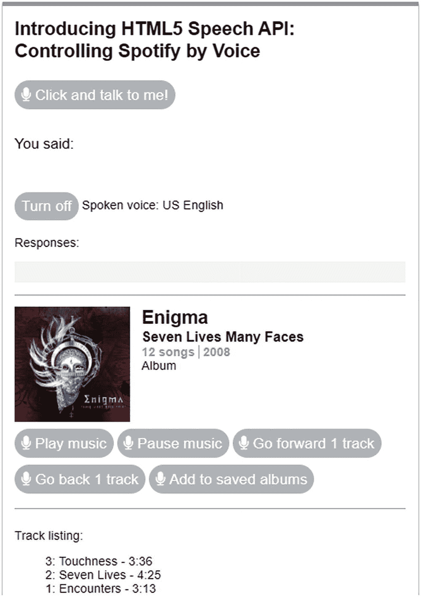
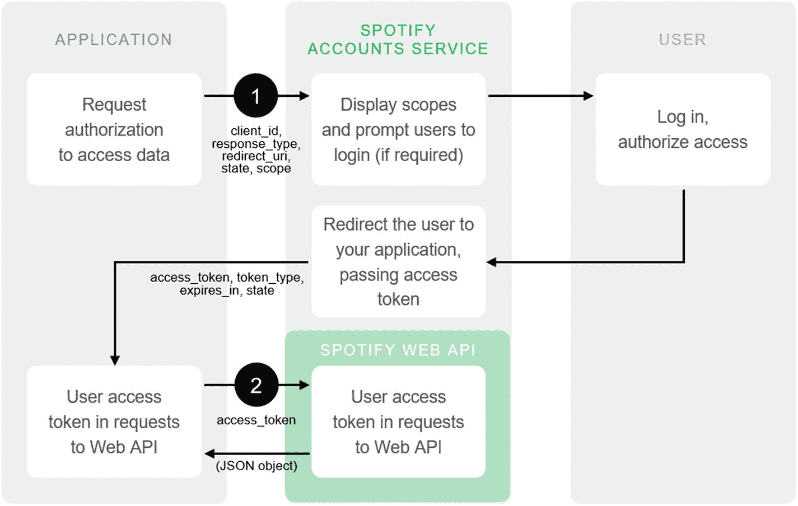
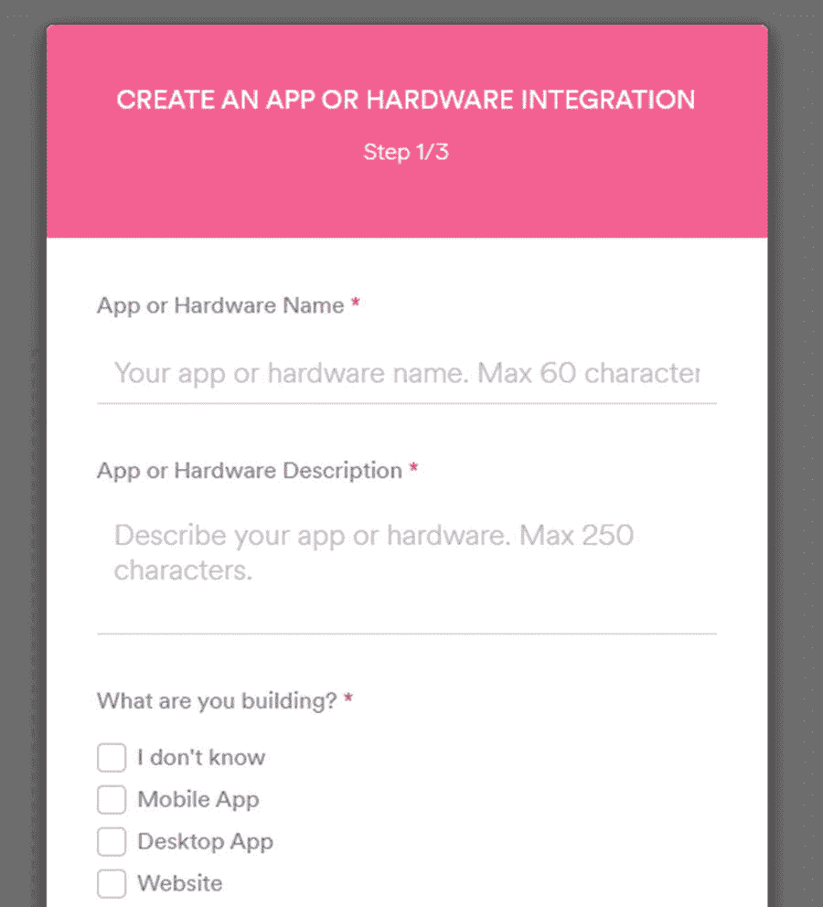
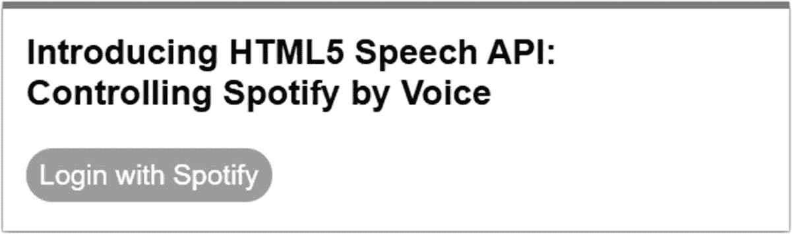
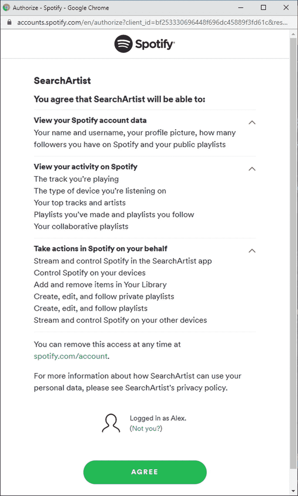
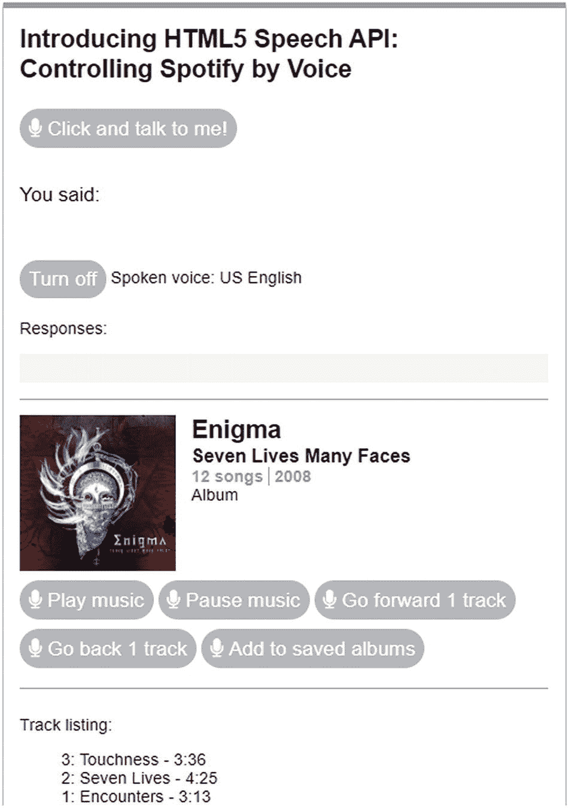
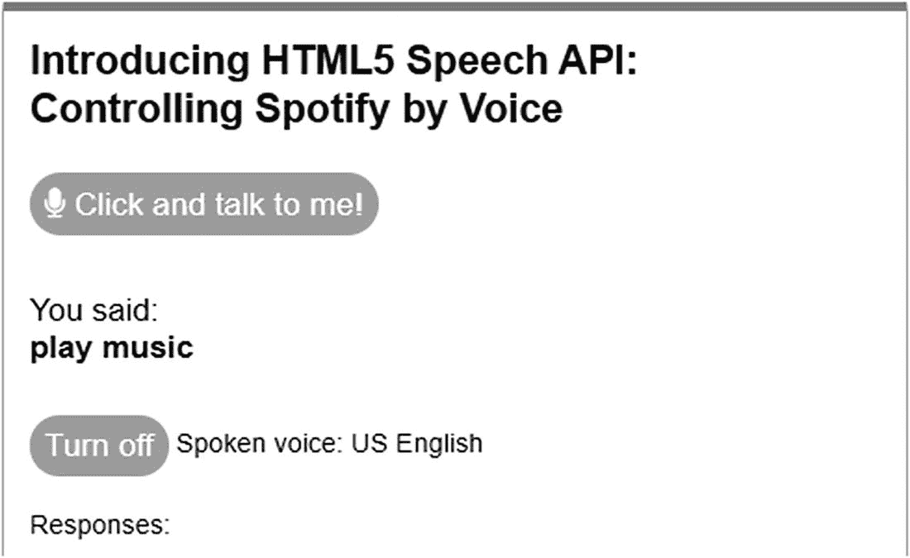

# 八、项目：查找和播放音乐

我喜欢听音乐——当我花几个小时开发代码或写书的时候，听听你最喜欢的艺术家的音乐是有道理的。只要我手里也有一杯酒，我就很开心。但是我跑题了。

在数字化我的全部音乐收藏和发现在线音乐流的乐趣之前，我常常费力地翻阅数百张 CD。我们只能说这是一个折衷的收藏；它是什么并不重要——它是一张 CD，然后点击播放。自从改用 Spotify 以来，那些日子已经一去不复返了——找到我的音乐变得容易多了，我也不用担心空间问题了！

自从改用 Spotify 后，我开始思考，有没有可能用我的声音来控制它？在我的研究过程中，我还没有发现任何人做过类似的事情，至少在 Spotify 上；这是否意味着没有人设法做到这一点，或有这样做的愿望？我想知道。由于我热衷于划船，探索未知的领域，我想，*为什么不试一试呢？*

## 为我们的项目设置背景

在本章的过程中，我们将组装一个快速而肮脏的应用，从我们的浏览器中使用 Spotify API 来播放选定的专辑。作为其中的一部分，我们将增加以下功能:

*   该应用将(几乎)完全通过语音控制，使用语音识别 API——唯一不可控的部分将是初始授权过程和从真正的 Spotify 客户端的第一次播放(更多信息请见下文)。

*   我们将能够执行基本任务，例如播放或暂停音乐，向前或向后跳过一首歌曲，以及将专辑添加到 Spotify 中您保存的专辑列表中。

*   我们将显示一个曲目列表，以及每个曲目的长度，加上同一艺术家的专辑列表-后者将包括专辑名称和图像。

*   我们将提供一个选项来搜索相似名字的艺术家-结果将显示他们的名字和 Spotify ID，我们也将使用它们来获得他们的专辑。

这只是我们使用 Spotify API 所能实现的一小部分——我们还可以做一大堆其他事情，但空间限制意味着我们无法涵盖所有内容！

希望这会给你一个平衡的混合功能，我们可以用我们的声音控制，以及如何在这种情况下使用 Spotify API 的感觉；作为预览，你可以在图 8-1 中看到一张完整演示的截图。



图 8-1

我们完成演示的预览

好吧，我们继续。我相信你会问一个问题:当我们有很多其他服务可以使用时，比如 Deezer，Google Play Music，甚至亚马逊音乐，为什么还要选择 Spotify？这是一个很好的问题，所以我们来看看选择使用 Spotify 的原因。

## 为什么选择 Spotify？

当与在线音乐流媒体服务合作时，我们有一个相当健康的选项列表可供选择——有些你可能从 Spotify 或 Deezer 等电视广告中了解到，其他则来自已经涉足这一领域的老牌公司，如亚马逊或谷歌 Play Music。对于这一章，我选择使用 Spotify，有几个原因:

*   与许多服务一样，你总是需要注册——Spotify 的帐户要求很低，并且很容易用代码建立一个基本的认证系统(正如我们将在后面的演示中看到的)。

*   使用 Spotify 的一个重要原因是，我已经是付费用户了——当然，还有其他渠道提供类似的服务，但如果你已经使用了市场领导者，那么使用它们就没有意义了。他们提供各种各样的音乐，尽管分辨率不高，但这一限制并不重要，因为这个练习是关于用我们的声音远程控制服务，而不是服务提供的声音质量水平！

*   随着 Deezer、Spotify 和 Amazon Music 等公司的出现，在线音乐流媒体正在发展成为一个健康的市场，但它们中的大多数都有一个共同点——它们似乎都很难使用标准的客户端技术与每个服务的 API 进行交互！唯一的例外是 Spotify——你很快就会看到，我们将利用第三方包装库来帮助运行我们的代码，这是 Spotify 可用的有限数量之一。(事实上，有一个服务甚至不让我登录他们的 API 区域……)

好吧，我们继续。现在我们已经讨论了我们将使用的音乐服务，我们需要探索如何构建我们的演示。除了 Spotify 和语音 API 之外，我们还将使用许多工具(当然！)，所以让我们深入了解一下我们将使用什么来更详细地构建我们的演示。

## 构建我们的演示

为了构建我们的演示，除了 Spotify 和 Speech APIs 之外，我们还将使用几个工具。我选择使用的方法如下:

*   Vue.js 用于授权框架代码——我可以使用 React 之类的工具，但是这增加了不必要的复杂性。Vue.js 让事情变得美好而简单，默认情况下不需要使用 Node.js 等服务器端工具来展示使用 Spotify 的基本操作。授权访问 Spotify 的一个很好的例子是李·马汀在 [`https://codepen.io/leemartin/pen/EOxxYR`](https://codepen.io/leemartin/pen/EOxxYR) 进行的 CodePen 演示——我们将以此为基础进行演示。

    我们稍后将更多地讨论这个过程的授权部分。

*   我们可以直接与 Spotify 的 API 交互，但为了简单起见，我们将使用 José Perez 的包装库，该库可从 [`https://github.com/JMPerez/spotify-web-api-js`](https://github.com/JMPerez/spotify-web-api-js) 获得。

*   jQuery——这纯粹是为了方便；在理想的情况下，我们应该重构代码来使用 Vue 或者普通的 JavaScript！为了透明起见，我们将使用 jQuery 的最新版本，在撰写本文时是 3.4.1。可以使用 jQuery 的其他版本，尽管您需要测试以确保您的代码仍然工作。

好了，有了我们的主要工具，我们现在可以开始编码了！但是——我听到你说——授权是怎么回事？是的，与任何 API 一样，我们需要成为授权用户才能访问服务；服务提供商需要一种方法来跟踪使用情况，并为所有用户维持适当的服务水平。尽管这并不影响我们对语音 API 的使用，但它仍然是我们演示的一个关键部分，所以让我们深入研究一下，更详细地看一下我们的选项。

## 授权我们的演示

当使用 Spotify API 时，我们应用的一个关键部分将是我们和 Spotify 之间的授权过程；这是为了允许注册访问的 API，所以我们可以流音乐。

这是一个由两部分组成的过程。第一个，我们向 Spotify 注册应用的地方，我们稍后会介绍；现在，让我们假设这种情况已经发生，并看看在与 Spotify 合作时授权可能发生的各种方式。

### 选择方法

假设我们已经向 Spotify 注册了我们的应用，有三种方法可以授权我们使用 Spotify API。它们如下:

*   将我们自己授权为用户，可以定期刷新——使用**授权码**方法。

*   为用户设置临时授权–使用**隐式授权**方法。

*   为应用设置授权，授权可以定期刷新-使用**客户端凭证流**方法。

我们可以在表 8-1 中看到这些对比。

表 8-1

授权访问 Spotify API 的方法

<colgroup><col class="tcol1 align-left"> <col class="tcol2 align-left"> <col class="tcol3 align-left"> <col class="tcol4 align-left"></colgroup> 
| 

流动

 | 

访问用户资源

 | 

需要密钥(服务器端)

 | 

访问令牌刷新

 |
| --- | --- | --- | --- |
| 授权代码 | 是 | 是 | 是 |
| 客户端凭据 | 不 | 是 | 不 |
| 隐性资助 | 是 | 不 | 不 |

*来源:Spotify 开发者门户*

出于演示的目的，我们将使用隐式授权流选项——这是为完全用 JavaScript 编写的客户端设计的，不需要使用服务器端代码来操作。确实有一个以`spotify-web-api-node`形式存在的服务器端选项，但是为了展示语音 API 是如何工作的，在服务器端运行它只是增加了一层不必要的复杂性。毕竟，为什么要把事情复杂化，对吗？

### 使用我们选择的方法的含义

对于我们的演示，我们选择使用隐式授权流方法来授权访问——这个标准是由互联网工程任务组或 IEFT 创建的 RFC-6749。在我们的情况下，使用这种方法是最好的选择，原因如下:

*   隐式授权流适用于完全使用 JavaScript 实现并在资源所有者的浏览器中运行的客户端。

*   您不需要任何服务器端代码来使用它——这消除了对复杂的服务器端工具的需要，例如 Node.js

*   改进了请求的速率限制，但是没有提供刷新令牌。

    你可以在 IETF 网站的 [`https://tools.ietf.org/html/rfc6749#section-4.2`](https://tools.ietf.org/html/rfc6749%2523section-4.2) 上看到关于这种方法如何工作的更深入的讨论。

这对我们意味着什么？我们可以直接访问 Spotify 账户服务，使用 API 提供的访问令牌，该令牌以类似于 [`https://accounts.spotify.com/authorize`](https://accounts.spotify.com/authorize) 的东西开始。

整个过程是在客户端执行的，不涉及密钥，但是访问令牌是短暂的，需要手动刷新，并且当它们过期时没有选项来延长它们。完整的请求将包括查询字符串中的参数，我们可以在表 8-2 中看到这些参数(以及我们演示的后面部分)。

表 8-2

隐式流授权所需的各种属性

<colgroup><col class="tcol1 align-left"> <col class="tcol2 align-left"></colgroup> 
| 

询问参数

 | 

价值

 |
| --- | --- |
| 客户端 id | *必选。*Spotify 在注册时向您提供的客户 ID。 |
| 响应类型 | *必选。*设置为“令牌” |
| 重定向 uri | *必选。*用户授予/拒绝权限后重定向到的注册 URI。 |
| 状态 | 可选，但强烈推荐。状态对于关联请求和响应非常有用——使用值可以额外保证连接是真正的请求。 |
| 范围 | *可选。*用空格分隔的作用域列表。 |
| 显示对话框 | *可选。*如果应用已经获得批准，则强制用户再次批准该应用。 |

*来源:Spotify 开发者门户*

除了看到它的运行，理解它如何组合在一起的最好方法是把它看作一个流程图——我们可以在图 8-2 中看到流程是如何运行的。



图 8-2

我们的演示源的授权过程:Spotify 开发者门户

尽管选择一种方法会有一些限制，但理解这一点很重要——毕竟，我们不可能免费得到任何东西，没有可能影响我们做事方式的东西！

幸运的是，这些限制并不太严重，如果我们决定使用 Spotify 提供的其他授权方法之一，它们的影响可能会减少。不过，那是另一个故事了。与此同时，让我们更详细地看看约束可能如何影响我们的演示。

### 使用这种方法的限制

虽然我们选择的方法使事情变得简单，并且最适合我们的需求，但仍然有一些约束需要我们注意，这意味着我们不能完全通过语音控制一切。让我们来看看它们是什么:

*   在运行我们的演示之前，我们需要启动 Spotify 并运行一首歌曲几秒钟(这是我们必须定期做的事情)。如果我们根本不运行 Spotify，你会看到控制台出现错误，专辑也不会播放。

*   我们需要使用 Spotify 的浏览器版本来进行演示；如果您尝试使用桌面应用，您会发现这两者互不影响，并且您还可能会发现桌面应用中播放的另一张专辑与您的演示中播放的专辑无关！

*   当运行演示的授权部分时，我们必须为 Spotify 单击 Accept 按钮以允许访问。不幸的是，这在我们的演示中不能通过语音实现，因此我们不能完全用声音控制事情！

好了，现在我们已经介绍了授权访问 Spotify 的基础知识，是时候开始开发代码了。我知道在我们这么做之前，这可能看起来像是一个漫长的等待，但是 Spotify API 并不像它应该的那样简单；我们已经讨论了一些关于如何访问 API 的要点。

现在我们已经讨论了这个问题，我们可以开始设置我们的应用了；第一项任务是建立一个集成，以便 Spotify 将来自我们应用的呼叫识别为正版，并提供适当的内容。

## 设置先决条件

当使用 API 时，我们经常不得不建立某种形式的帐户或集成——这是必要的，但也是重要的，以便服务提供商可以管理需求并保证注册用户的访问安全。

使用 Spotify 也是一样——我们演示的第一步是设置一个集成，所以让我们深入了解一下为我们的应用创建集成所需的步骤。

Dealing With Prerequisites

要设置集成，请执行以下步骤:

1.  继续填写所需的详细信息(用红星表示)–您可以使用以下内容作为向导来帮助您完成向导:*(我们目前正在以纯粹的开发能力工作，但是如果您决定进行商业化，请确保您相应地设置了一个集成。需要注意的是，一旦集成被启用，您就不能编辑该选项。*
    *   你在开发商业整合吗？–**否**

    *   我知道这个应用不是用于商业用途的-**否**

    *   我知道我不能迁移…–**不**

    *   我理解并同意…–**否**

2.  点击提交。此时，将显示详细信息，并向您展示您的应用的仪表盘。

3.  您将会看到一个标记为“显示客户端机密”的链接，以及您的客户端 ID。单击该链接，然后记下这两个 id，因为我们将在稍后的演示中使用这两个 id。

1.  我们将从下载本书附带的代码下载副本开始——继续将`spotify`文件夹保存到我们的项目区域。这将包含相关的样式和 Vue.js 和 jQuery 库，供我们使用。

2.  接下来，我们需要在 [`https://developer.spotify.com/dashboard/`](https://developer.spotify.com/dashboard/) 登录 Spotify 的开发者仪表盘——为此，你需要创建一个免费账户，或者如果你已经是该服务的现有订户，也可以使用现有账户。

3.  Once logged in, click Create a Client ID – you will see a modal appear, similar to the (partial) screenshot shown in Figure 8-3.

    

    图 8-3

    在显示器上创建客户端 ID 模式

我们现在准备开始开发代码了！在我们这样做之前，有几件事需要注意:

*   我们将利用 Flaticon 网站上的 Spotify 图标——这纯粹是为了给我们的网站创建一个 favicon。我使用的图标可以从 [`https://www.flaticon.com/free-icon/spotify-logo_49097`](https://www.flaticon.com/free-icon/spotify-logo_49097) 获得。

*   位于 [`https://favicon.io/favicon-converter/`](https://favicon.io/favicon-converter/) 的 Favicon 网站非常便于设置正确显示 Favicon 所需的代码——我们将把从该网站生成的代码整合到我们的应用中。

添加一个图标完全是自愿的；你当然可以决定不使用它，它不会影响你的演示如何运行！我这样做纯粹是为了防止我们的应用抛出找不到合适图标的错误。

您可能会发现，如果您在每次演示后都测试代码，并不是所有的代码都能正常工作。不要惊慌；这是意料之中的！我们覆盖了很多代码，所以我们需要分部分来做——在最终演示结束时，一切都会迎刃而解。

在这个阶段，具备了所有的先决条件，我们现在可以开始编写代码了。有相当多的代码需要处理，所以我们将分阶段完成——第一项任务是建立基本的授权框架，这样我们就可以开始添加代码来与 Spotify 的 API 进行交互。

## 创建框架

我们现在真的到了可以写一些代码的阶段了！我们的应用集成已经设置好并准备好使用，我们可以将注意力转向为我们的应用设置代码。在这个项目的过程中，有相当多的代码需要完成，所以我把它分成了三个阶段的过程；第一阶段负责基本的授权过程。

为了避免重复发明轮子，我将使用李·马汀的 CodePen 演示(你可以在 [`https://codepen.io/leemartin/pen/EOxxYR?editors=1010`](https://codepen.io/leemartin/pen/EOxxYR%253Feditors%253D1010) 看到原文)。这使用 Vue.js 框架来布局代码。如果您不熟悉这个框架，也不用担心——在基本层面上，它保持了标记和 JavaScript 代码之间的分离。练习结束后，我们将详细讲解每一部分。

Setting Up Our Skeleton Code

要设置我们的授权框架并准备好投入使用，请执行以下步骤:

1.  我们首先打开`index.html`的副本，然后向下滚动(或寻找)标记为`<!—INSERT CODE HERE -->`的评论。

2.  我们有相当多的代码要添加，所以我们将分阶段完成——首先，删除注释，然后添加几个空行。

3.  接下来，继续插入这个块——这将负责我们的语音工具周围的标记:

    ```html
    <main id="app">
      <h2>Introducing HTML5 Speech API: <br>Controlling Spotify by Voice</h2>
      <template v-if="me">
        <div id="speech">
          <button>
             <i class="fa fa-microphone"></i> Click and talk to me!
          </button>

          <p class="output">You said: <br><strong class="output_result"></strong></p>
          <span class="voice">Spoken voice: US English</span>
          <p>Responses:</p>
          <div class="response">
            <span class="output_log"></span>
          </div>
        </div>

    ```

4.  我们还有几个模块要介绍——我们需要添加的下一个模块将通过提供图像、艺术家和曲目数量等细节来处理我们正在播放的专辑的显示。在前一个代码块之后留出一行空白，然后添加以下代码:

    ```html
    <div id="currentalbum">
    <span class="albumimage"></span>
    <span class="albumartist"></span>
    <span class="albumname"></span>
    <span class="trackcount"></span>
    <span class="year"></span>
    <span class="albumtype"></span>
    <span class="albumID"></span>
    <span class="artistID"></span>
    </div>

    ```

5.  授权过程不需要下一个块，但现在添加它更容易——这个块将设置控制音乐播放所需的按钮。继续添加下面的代码，在前一个代码块之后留下一个空行:

    ```html
    <button @click="playmusic"><i class="fa fa-microphone"></i> Play music</button>
    <button @click="pausemusic"><i class="fa fa-microphone"></i> Pause music</button>
    <button @click="playnexttrack"><i class="fa fa-microphone"></i> Go forward 1 track</button>
    <button @click="playprevioustrack"><i class="fa fa-microphone"></i> Go back 1 track</button>
    <button @click="addtosavedalbums"><i class="fa fa-microphone"></i> Add to saved albums</button>

    ```

6.  我们正在取得良好的进展。下一部分为曲目列表设置了占位符，用于我们在演示中播放的专辑。继续添加以下代码行，首先在前一个代码块之后留下一个空行:

    ```html
    <div id="albumlist">
      <p>Track listing:</p>
      <ul></ul>
    </div>

    ```

7.  下一部分负责显示同一艺术家的其他专辑——在前一部分之后留出一个空行，然后插入以下代码:

    ```html
    <div id="otheralbums">
      <span>Other albums by Artist:</span><button @click="getalbumsbyartist"><i class="fa fa-microphone"></i> Get Albums</button>
      <ul></ul>
    </div>

    ```

8.  我们还有一个显示其他同名艺术家的部分——为此，在前面的块之后添加以下代码:

    ```html
    <div id="artistlisting">
      Search for Artist: <input v-model="searchartist"><button @click="searchartistsbyname"><i class="fa fa-microphone"></i> Search</button>
      <span>Chosen artist: {{searchartist}}</span>
      <div id="artistlist"><ul></ul></div>
    </div>

    ```

9.  我们几乎完成了标记。还有两个部分需要添加:一个确认你已经登录的隐藏信息块和我们的 Vue 模板的结束代码。继续在上一步之后添加以下代码，中间留一个空行:

    ```html
        <div id="info">{{ me }}</div>

      </template>
      <template v-else>
        <button @click="login">Login with Spotify</button>
      </template>
    </main>

    ```

10.  在这一点上，保存文件-让它暂时打开。我们将稍作休息，但很快将继续代码。

我们现在已经准备好了我们的标记，可以使用了——但是它不会做很多事情，因为我们还没有添加脚本代码来使它可以操作。

我们将很快添加这一点。请随意去喝杯咖啡或饮料，休息一下，因为我们还有很多代码要添加！假设您准备好了，让我们继续演示的下一部分，添加授权代码。

### 从 Spotify 获得授权

在我们的下一个演示中，我们应该开始看到事情的发生——这是我们添加代码来启动授权请求并希望得到批准的地方！好吧，这听起来比实际情况更复杂，因为这一切都发生在后台，只需要我们点击一下按钮。为了理解我的意思，让我们在下一个演示中加入代码。

Making Our Authentication Process Operational

要让我们的演示授权使用 Spotify，请执行以下步骤:

1.  本演示的第一项任务是在上一个演示的结束标签`</main>`后添加几个空行，然后插入以下代码——这将为我们提供基本的 Vue 对象，我们将使用该对象启动对 Spotify 的授权:

    ```html
    <script>
      const app = new Vue({
        el: '#app',
        data() {
          return {
            client_id: 'bf253330696448f696dc45889f3fd61c',
            scopes: 'user-top-read playlist-read-collaborative playlist-read-collaborative playlist-modify-public playlist-read-private playlist-modify-private streaming app-remote-control user-modify-playback-state user-read-currently-playing user-read-playback-state user-library-modify',
            redirect_uri: 'https://speech/spotify',
            me: null,
            albumname: 'Not listed',
            searchartist: null,
            createplist: null
          }
        },
        methods: {
          <!—ADD IN ADDITIONAL METHODS HERE -->
        }
        })
    </script>

    ```

2.  我们需要添加更多的配置功能——首先是实际调用 Spotify 来请求授权。继续在 methods 对象中添加以下代码，替换标记为`<!-- ADD IN ADDITIONAL METHODS HERE -->`的注释:

    ```html
    login() {
      let popup = window.open(`https://accounts.spotify.com/authorize?client_id=${this.client_id}&response_type=token&redirect_uri=${this.redirect_uri}&scope=${this.scopes}&show_dialog=true`, 'Login with Spotify', 'width=600,height=800')

              window.spotifyCallback = (payload) => {
                popup.close()

                fetch('https://api.spotify.com/v1/me', {
                  headers: {
                    'Authorization': `Bearer ${payload}`
                  }
                }).then(response => {
                  return response.json()
                }).then(data => {
                  this.me = data
                })
                spotifyApi = new SpotifyWebApi({
                clientId: '<ADD IN CLIENT ID HERE>',
                clientSecret: '<ADD IN CLIENT SECRET HERE>'
              });
              spotifyApi.setAccessToken(payload);
              }
            },

    ```

    您将看到几行与 clientID 和 clientSecret 值相关的代码；这里需要它们是有原因的，尽管它们不用于授权过程。在这个演示之后，我们将讨论它的重要性。

3.  我们还需要添加一个对象——这将触发调用，向 Spotify 发起请求。为此，在我们的 Vue 对象的结束})之前，紧接着前一个块的结束}之后添加以下代码:

    ```html
    mounted() {
         this.token = window.location.hash.substr(1).
                      split('&')[0].split("=")[1]

                 if (this.token) {
                   // alert(this.token)
                   window.opener.spotifyCallback(this.token)
                 }
            }

    ```

4.  Go ahead and save the file, but leave it open (or minimized) – we’re now ready to test our work! For this, browse to `https://speech/spotify/`. If all is well, we should see the initial login button displayed, as indicated in Figure 8-4.

    

    图 8-4

    我们演示中 Spotify 的初始登录按钮

如果我们单击 Login with Spotify 按钮，我们应该会看到一个弹出窗口，请求访问我们的演示以使用 Spotify API。图 8-5 显示了该请求的(部分)截图。



图 8-5

授权我们演示的(部分)请求

### 破解密码

在上两次演示过程中，我们已经建立了授权访问 Spotify API 所需的基本框架；这暴露了一些有用的指针，所以让我们更详细地看一下代码，以了解它们是如何组合在一起的。

第一个演示的第一部分很简单；在本章的后面，我们设置了所有的标记，包括操作语音功能所需的标记。唯一需要注意的是在演示的第 5 步中使用了`@`符号；这些是对我们在第二个演示中创建的 Vue 对象中的函数的调用(它们的操作方式与普通 JavaScript 中的`onclick="...."`类似)。我们还使用了双花括号——这些只是占位符，它们由 Vue 中捆绑的 Handlebars 库代替实际值。

这两个演示的真正关键在第二部分——对于外行来说，Vue 的工作原理是创建(并初始化)一个配置对象。我们通过将 app const 定义为 Vue 的一个新实例来单击 off，并向其中传递一个目标元素(`"#app"`)；然后，我们在数据对象中定义一些值——分别是我们的客户端 ID、允许的范围、用于授权的重定向 URL，以及用于演示的一些其他占位符。

接下来，我们创建一个方法对象，在其中我们设置了`login()`对象(或函数)；这定义了一个包含我们用来请求访问的 URL 的弹出变量。一旦 Vue 实例在演示中被挂载()，这将启动一个回调，调用`login()`对象。这会向 Spotify 发出请求，然后 Spotify 会相应地进行处理。假设它成功了，我们得到了一个响应——它隐藏在演示中，因为我们不需要一直显示它。同时，我们创建了一个新的`spotify-web-api`库实例，在其中定义了 clientID 和 clientSecret 值，为我们开始使用 Spotify 做好了准备。

## 来自 Spotify 的流媒体内容

随着我们的授权流程现在开始运作，是时候添加代码来从 Spotify 流式传输内容了。为此，我们将利用 José Perez 的`spotify-web-api-js`包装器库；这使用基于承诺的语法包装了对每个 Spotify 端点的相关调用。

剧透这是一个冗长的演示。如果你需要休息，请随时暂停！

为了提醒您完成后它会是什么样子，我们可以在图 8-6 中看到我们完成的应用的部分截图，一旦我们点击登录 Spotify 并确定以允许授权。



图 8-6

预览我们的 Spotify 演示…

好吧，让我们开始我们的代码。

Making Use Of The Spotify Api

要将 Spotify 中的内容流式传输到我们的演示中，请按照以下步骤操作:

1.  返回到我们在之前的练习中打开的`index.html`文件，然后向下滚动到开始的`<script>`标记，并在它的正下方添加这行代码，如下所示:

    ```html
      <script>
        var spotifyApi, albumIDplaying, artistimage;

    ```

2.  我们需要添加一个助手函数来将时间从毫秒转换成更合理的形式。为此，将此代码添加到上一步中变量声明的下方，中间留一个空行:

    ```html
        function msToMinAndSec(millis) {
          var minutes = Math.floor(millis / 60000);
          var seconds = ((millis % 60000) / 1000).toFixed(0);
          return minutes + ":" + (seconds < 10 ? '0' : ") + seconds;
        }

    ```

3.  接下来，回头看看我们创建的`login()`对象。您应该会看到类似这样的内容:

1.  我们需要从我们的 Spotify 帐户中添加客户端 ID 和客户端 secrets 值；为此，继续用您在本章前面创建的客户机和秘密 id 替换注释。

2.  下一个任务是开始添加在我们的演示中操作各种特性的函数。首先是添加一些东西，让我们做最重要的部分:播放音乐！为此，我们有一个实质性的功能要添加进去；它的第一部分负责从 Spotify 获取当前状态，并在屏幕上显示专辑详细信息:

    ```html
    playmusic() {
    // get current playing album
    spotifyApi.getMyCurrentPlaybackState()
    .then(function(data) {
      spotifyApi.play(data);
      sessionStorage.setItem("chosenalbum", data.item.album.id);
      sessionStorage.setItem("chosenartist", data.item.artists[0]
    .id);

         var albumtype = data.item.album.album_type;

         $(".year").html(data.item.album.release_date.substring(0,4));
         $(".albumtype").html(albumtype.charAt(0).toUpperCase() + albumtype.slice(1));
         $(".trackcount").html(data.item.album.total_tracks + " tracks");
         $(".albumID").html(data.item.album.id);
         $(".artistID").html(data.item.artists[0].id);
         $("#currentalbum > span.albumname").html(data.item.album.name);
         $("#currentalbum > span.albumartist").html(data.item.artists[0].name);
         $("#currentalbum > span.albumimage > img").attr("src", data.item.album.images[1].url);
       }, function(err) {
         console.error(err);
       });

    ```

3.  接下来，留下一个空行——我们现在需要添加`play()`函数的右半部分。为此，加入以下代码，它负责在屏幕上显示曲目的详细信息和时间:

    ```html
       // get album tracks
       spotifyApi.getAlbumTracks(sessionStorage.getItem("chosenalbum"))
       .then(function(data) {
         var tracklength;

         $("#albumlist > ul > li").remove();

         data.items.map( function(item) {
           spotifyApi.getAudioFeaturesForTrack(item.id)
           .then(function(response) {
             tracklength = response.duration_ms;
             $("#albumlist > ul").append(`<li>${item.track_number}: ${item.name} - ${msToMinAndSec(tracklength)}</li>`);
           });
         });
       }, function(err) {
         console.error(err);
       });
     },

    ```

4.  相比之下，接下来我们需要添加的三个对象看起来很小！三个函数中的第一个是允许我们暂停音乐所需的函数——继续，将它添加到步骤 6 中函数的结尾`}`的正下方:

    ```html
    pausemusic() {
      // stop music
      spotifyApi.pause();
    },

    ```

5.  其次，类似地，我们需要添加一些东西，让我们能够前进一个轨道——将它添加到`pausemusic()`函数的正下方:

    ```html
    playnexttrack() {
      // play next track
      spotifyApi.skipToNext();
    },

    ```

6.  对于这些小函数中的第三个，在前一个块的正下方添加以下代码，以允许我们返回一个轨道:

    ```html
          playprevioustrack() {
            // play previous track
            spotifyApi.skipToPrevious();
          },

    ```

7.  我们正在取得良好的进展，尽管仍有大量代码需要添加。下一个功能将允许我们按名称搜索艺术家。继续添加以下代码，紧跟在`playprevioustrack()`对象的结束`},`之后:

    ```html
    searchartistsbyname() {
      // search artists by name
    var artistquery = $("#artistlisting > input").val();

    spotifyApi.searchArtists(artistquery)
     .then(function(data) {
      data.artists.items.map( function(item) {
        if (item.images.length == 0) {
          artistimage = "https://speech/spotify/img/noimage.png";
        } else {
          artistimage = item.images[2].url
        }

        $("#artistlist > ul").append(`<li><span></span><span>${item.name} - ${item.id}</span>
    </li>`);
      });
    }, function(err) {
      console.error(err);
    });
    },

    ```

8.  我们需要添加的下一个函数是检索我们选择的艺术家的专辑列表——这由下面的代码负责，我们需要将它添加到步骤 10 中的上一个对象的正下方:

    ```html
    getalbumsbyartist() {
      // get albums by a certain artist
      var selectedartist = sessionStorage.getItem("chosenartist");

      spotifyApi.getArtistAlbums(selectedartist)
        .then(function(data) {
          data.items.map( function(item) {
            $("#otheralbums > ul").append(`<li><span></span><span>${item.name}</span></li>`);
        });
      }, function(err) {
        console.error(err);
      });
    },

    ```

9.  我们快完成了。添加的最后一个功能将负责将选择的专辑添加到我们在 Spotify 中保存的专辑中。与其他函数相比，这是一个短函数；继续在`getalbumsbyartist()`对象的结束`}`下面添加以下代码:

    ```html
      addtosavedalbums() {
        // add to saved albums
        var getalbum = $(".albumID").text();
        spotifyApi.addToMySavedAlbums([getalbum]);
      },
    },

    ```

10.  不可否认，这最后一段代码有点骗人——我们用它来帮助将我们选择的艺术家的 Spotify ID 设置到会话存储中。向下滚动到结束的`</script>`标签，然后留下一行，并添加以下代码:

    ```html
    <script>
      $(document).ready(function() {
        $("body").on("click", "#artistlist ul li", function() {
          var chosenartist = $(this).text();
          var chosen = chosenartist.split(" ");
          sessionStorage.setItem("chosenartist", chosen.pop());
        });
      });
    </script>

    ```

11.  现在，我们可以保存我们的工作了——继续，休息一下！这可能看起来有很多代码，但是我向你保证，我们已经添加了大部分代码，相比之下，下一部分(通过语音控制我们的演示)会短得多。

12.  当你准备好了，让我们预览一下我们的工作成果——为此，请浏览`https://speech/spotify/`；如果一切顺利，我们应该会看到类似于这个庞大练习开始时显示的屏幕截图。

```html
    spotifyApi = new SpotifyWebApi({
      clientId: '<ADD IN CLIENT ID HERE>',
    clientSecret: '<ADD IN CLIENT SECRET HERE>'
    });
  spotifyApi.setAccessToken(payload);
  }
},

```

在这一点上，我们可以让 index.html 文件打开，但最小化-我们将在这个项目的最后一部分重新访问它。

如果你成功地用一个工作演示做到了这一点，我必须向你表示祝贺——最后一个练习肯定是一个怪物！虽然很高兴看到这个庞然大物开始变得像一些可操作的东西，但是这是一个更详细地研究代码的好机会；它展示了几个有用的点，值得更多的关注。

### 理解代码

我们首先设置了一些在代码中使用的变量，比如 SpotifyAPI 包装器实例和相册图像的新占位符。然后，我们添加了一个 helper 函数，将 Spotify 为每个曲目返回的时间转换为更有用的时间，然后使用包装器库用我们的客户端详细信息启动 Spotify 实例。

接下来，我们添加了许多不同的事件处理程序，它们利用了包装器库；尽管它们都以不同的方式工作，但大多数都基于相同的原则，即使用基于承诺的语法。一个很好的例子是`playmusic()`函数，它看起来像这样:

```html
playmusic() {  // get current playing album
  spotifyApi.getMyCurrentPlaybackState()
  .then(function(data) {
    spotifyApi.play(data);
    sessionStorage.setItem("chosenalbum", data.item.album.id);
    sessionStorage.setItem("chosenartist", data.item.artists[0].id);

    $(".year").html(data.item.album.release_date
.substring(0,4));
    $(".albumtype").html(data.item.album.album_type);
    $(".trackcount").html(data.item.album.total_tracks + " tracks");
    $(".albumID").html(data.item.album.id);
    ...
    albumIDplaying = data.item.album.id;
    sessionStorage.setItem("chosenartist", data.item.artists[0].id);
  }, function(err) {
    console.error(err);
  });

```

在我们的演示中，当我们点击播放按钮时，该功能被触发——我们首先从 Spotify 获取当前播放状态(因此我们需要运行 web 客户端几秒钟！).然后，我们将当前艺术家和专辑的值压入会话存储，然后开始播放并输出各种值，如专辑图像、曲目数量和每首曲目的名称。使用会话存储有点麻烦，但却是必要的。它强制 spotifyApi 库在正确的时间为专辑获取正确的 ID；否则，我们可能会以它试图传递一个空值而告终，结果得到一个 400 错误(或者没有列表)！

其他函数以类似的方式工作(有一些例外)——每个函数都使用基于承诺的语法从 Spotify 请求带有数据的 JSON 对象，然后提取相关数据并在屏幕上的适当位置显示。

## 与 Spotify 交谈

最后，我们可以让我们的应用识别我们的声音！是的，看起来我们在触及项目的真正关键(和本书的重点)之前已经讨论了很多。然而，如前所述，Spotify API 并不是最容易使用的；Jose 的库向抽象出大量代码迈出了一大步，但这仍然意味着我们必须向项目中添加相当多的代码。

谢天谢地，您将要看到的大部分代码现在应该已经相当熟悉了；我们已经使用了以前演示中的大部分内容，这有利于重用。唯一真正的变化是在`result()`处理程序中，我们告诉我们的演示程序当它识别出有效的语音时该做什么。一旦我们完成了修改，我们可以在图 8-7 中看到事情的预览。



图 8-7

我们的 Spotify 演示，支持语音控制

考虑到这一点，让我们深入研究一下让我们的应用更详细地识别口头命令所需的代码。

Talking To Our Demo

要添加语音功能，请按照下列步骤操作:

1.  我们将从返回到之前演示中打开的 index.html 开始。向下滚动到底部的第二个`<script>`块，然后在`DOM.ready()`功能的结束`});`前添加一个空行。

2.  我们现在需要添加代码，使我们的演示能够通过语音识别命令——我们有大量的代码要添加，所以让我们一个块一个块地做吧。第一个块放在我们刚刚添加的空行下面，它将为语音识别 API 的操作声明一些变量和属性:

    ```html
    const output = $(".output_result");
    navigator.mediaDevices.getUserMedia({ audio: true }).then(function(stream) {

      const SpeechRecognition = window.SpeechRecognition || window.webkitSpeechRecognition;
      const recognition = new SpeechRecognition();

      recognition.interimResults = false;
      recognition.maxAlternatives = 1;
      recognition.continuous = true;

    ```

3.  我们有一系列的事件监听器要添加——第一个将在我们点击“点击并跟我说话”时触发语音识别服务！按钮。对于每个事件处理程序，在前一个事件处理程序之后留一个空行，然后依次添加代码块:

    ```html
    $("body").on("click", "#speech > button", function() {
      let recogLang = "en-US";
      recognition.lang = recogLang.value;
      recognition.start();
    });

    ```

4.  下一个事件处理程序是我们在之前的演示中使用过的——当演示检测到麦克风处于活动状态，并且检测到声音，但不一定识别为语音时触发:

    ```html
    recognition.addEventListener("speechstart", () => {
      $(".output_log").text("Speech has been detected.");
    });

    ```

5.  我们之前已经看到了这个下一个处理程序的开始——它决定了所说的任何东西是否可以被识别为语音，如果是这样的话，就对其进行操作:

    ```html
    recognition.addEventListener("result", (e) => {
      $(".output_log").html("Result has been detected.");

      let last = e.results.length - 1;
      let text = e.results[last][0].transcript;

      $(".output_result").html(text);

      /* Play music */
      if (text.indexOf("play music") != -1) {
        $("#app > button:nth-child(4)").trigger("click");
      }

      /* Pause music */
      if (text.indexOf("pause music") != -1) {
        $("#app > button:nth-child(5)").trigger("click");
      }

      /* Go forward */
      if (text.indexOf("go forward") != -1) {
        $("#app > button:nth-child(7)").trigger("click");
      }

      /* Go back */
      if (text.indexOf("go back") != -1) {
        $("#app > button:nth-child(8)").trigger("click");
      }

      /* Save album */
      if (text.indexOf("save album") != -1) {
        $("#app > button:nth-child(9)").trigger("click");
      }

      /* Get other albums */
      if (text.indexOf("get other albums") != -1) {
        $("#otheralbums > button").trigger("click");
      }

      /* Search artist */
      if (text.indexOf("search artist") != -1) {
        $("#artistlist > input").val("enigma");
        $("#artistlist > button").trigger("click");
      }

      $(".output_log").html("Confidence: " + (e.results[0][0].confidence * 100).toFixed(2) + "%");
    });

    ```

6.  我们又添加了三个事件处理程序——下一个程序检测我们是否停止了说话，如果是这种情况，就会触发`onspeechend`处理程序:

    ```html
    recognition.addEventListener("speechend", () => {
      recognition.stop();
    });

    recognition.onspeechend = function() {
      $(".output_log").html("You were quiet for a while so voice recognition turned itself off.");
      //console.log("off");
    };

    ```

7.  最后一个事件处理程序负责基本的错误处理——在生产环境中，这可能会更深入，但是对于我们的目的来说，只需在控制台中呈现原始的错误消息就足够了:

    ```html
      recognition.addEventListener("error", e => {
        if (e.error == "no-speech") {
          $(".output_result").html("Error: no speech detected");
        } else {
          $(".output_result").html("Error: " + e.error);
        }
      });
    }).catch(function(err){
      console.log(err);
    });

    ```

8.  我们已经完成了对文件的编辑，请继续并保存它。我们现在可以预览我们的工作结果；为此，请浏览至`https://speech/spotify/`。如果一切正常，我们应该首先看到类似于图 8-7 所示的截图。

在这最后一个演示的过程中，我们回顾了在本书前面的第一个项目中看到的一些函数；它显示了添加语音功能是多么容易，而且大部分代码可以轻而易举地重用。与许多项目一样，结果处理程序经常改变；记住这一点，让我们更详细地看一下代码，看看它们是如何组合在一起的。

### 详细研究代码

我们在本演示中使用的许多代码现在应该开始看起来有点熟悉了 API 的美妙之处在于我们可以设置许多股票处理程序，并在我们的项目中重用它们。当然，有些(比如结果处理器——more anon)可能需要改变，但是许多(比如`onspeechend`)可以在不同的项目中保持不变。考虑到这一点，让我们更详细地看一下代码。

我们首先声明了一些变量和属性，包括缓存`.output_result`，定义一个语音识别 API 实例为`SpeechRecognition` `,`，并为 API 设置`interimResults`、`maxAlternatives,`和`continuous`属性。

然后我们开始设置事件处理程序来响应 API——第一个允许我们使用`en-US`作为默认语言来触发 API。请注意，这不是使用事件处理程序的标准 jQuery 语法——我们必须推迟它，以便一旦按钮出现在页面上就可以分配它(直到我们登录后才可用)。

我们添加的下一个处理程序是针对`speechstart`事件的——这是直接从一个早期的项目中提取的，这表明在使用语音 API 时重用代码是多么容易。然后，我们转向一个相当长的结果事件处理程序——它看起来很长，但是大部分都是定义当 API 识别某些短语时应该发生什么。该处理程序转录结果属性的内容，然后将其输出到屏幕上，并确定是否可以执行所提供的任何操作。

然后，我们添加了三个事件处理程序，它们是从以前的项目中继承来的:两个用于确定我们是否已经停止说话(`speechend`和`onspeechend`)，最后一个用于提供基本的错误日志记录(error)。值得注意的是，两个`speechend`处理程序的工作方式略有不同——第一个决定我们是否已经停止说话，第二个控制当我们停止说话时会发生什么，因此可以关闭 API。

## 更进一步

希望到现在为止，你已经有机会玩这个演示了——当然有些地方有点粗糙，但我们应该记住，这一章不是关于使用 Spotify，而是我们如何设置语音 API 来与 Spotify 内容进行交互！

然而，我们可以做一些事情来改善界面，并开始为我们的应用添加更多的润色:

*   你可能已经注意到，曲目列表的排序顺序似乎不正确。这是有原因的；一旦从 API 中检索到列表，它就与每个条目在包含列表的`<span>`元素中的插入顺序有关。为了解决这个问题，我们可以将条目推入一个对象数组，然后在屏幕上显示新的顺序之前使用`.sort`方法对它们进行排序。(只是确认一下，曲目 id 是正确的，只是顺序不对！)

*   对于你们当中的纯粹主义者来说，你们可能已经发现了一些曲目的时间稍微有点晚；这很可能是由于我们将原来的毫秒值转换成更容易阅读和识别的值。这可能不是一个真正的问题，但可能值得试验一下这个函数，看看是否可以改进。

*   回想一下本书前面的内容——在许多项目中，我们实现了对另一种语言(法语)的支持。我们没有理由不能在这里添加同样的支持；我们需要更新 UI 来反映这些变化，并为每个特性添加正确的触发命令，比如播放音乐。

*   这个演示中非常缺乏的一个方面是来自应用的任何形式的反馈——我们可以看到我们口头发出的命令，但是使用语音合成 API 来确认某个操作已经发生怎么样？

*   返回的相册列表可能相当大；这是我们绝对可以改进的一个方面！我们的演示显示了从 API 返回的前 20 个项目，但是我们应该考虑将它限制为前五个(？)，如果需要，可以选择显示扩展列表。

*   我们已经实现了`navigator.mediaDevices.getUserMedia`方法来启动对麦克风的访问(我们在第一章中使用过)，但是目前关闭按钮是不可操作的。理想情况下，我们应该提供一个关闭语音功能的选项，但这需要对代码进行重构，因为按钮最初是不可见的。

这应该给你一个我们可以去的地方的味道和一些想法让你开始。在 José的 wrapper 库中，我们可以使用更多的选项，所以我建议通读他的网站和 Spotify 开发者门户的文档——有很多内容可以帮助你将应用开发成未来某个时候可以成为语音制作解决方案的东西。

## 摘要

为任何应用添加语音功能都开启了一个可能性的世界，尤其是对于我们这些能力较弱的人——或者可能只是懒惰的人！在本章的过程中，我们一直致力于为使用 Spotify API 的项目添加语音功能；让我们花一点时间来回顾一下我们在本章中所讲的内容。

在探索为什么我们选择 Spotify 作为我们的 API 提供商之前，我们首先设置了我们项目的背景。然后，我们进入了一个简短的讨论，围绕我们将如何设计我们的项目，以及如何获得 Spotify 授权的 API(以及这对我们的项目意味着什么)。

然后，我们设置了基本的认证过程，首先解决了一些先决条件；然后，我们将注意力转向添加代码，以允许我们从 Spotify 流式播放内容。最后但并非最不重要的是，我们随后添加了代码，允许我们与 Spotify 进行口头交互，然后探索一些想法，以帮助我们开始将我们的项目进一步开发成可以在生产环境中使用的东西。

好了，休息一下，伙计们，因为我们有另一个大项目要做了！人们不会不注意到网上购物在过去几年中是如何真正起飞的；越来越多的人使用设备在线购物，他们不一定需要在屏幕上看到结果。解决这个问题的一个方法是在结账过程中加入语音功能——听我说，我会在下一章向你展示如何做到这一点。