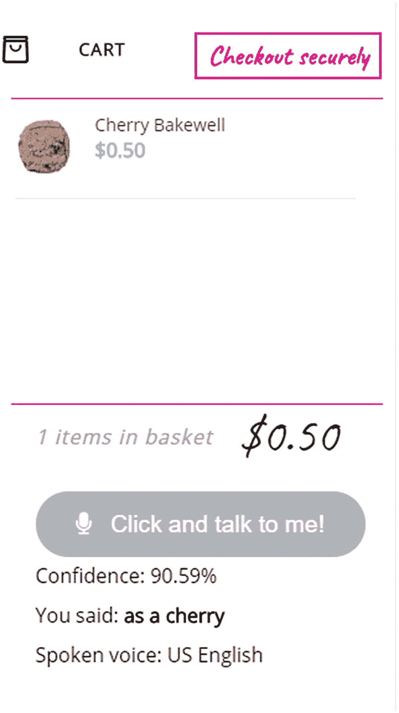

# 九、项目：采购流程自动化

我们几乎就要完成这本书了，但是我们还有一个项目等待着我们！我敢肯定，你已经花了几个小时试图找到一个特定的产品，然后把它放在一个篮子里，并通过了几个屏幕来完成结帐，对不对？用更复杂的篮子真的很痛苦。如果我们能够利用我们声音的力量来自动化这个过程的一部分，会怎么样？

借助语音 API 的强大功能，我们应该能够口头要求网站找到产品并将其添加到购物篮中，然后使用支付请求 API 结账——所有这一切都无需触摸任何键盘。听起来不可能？在本章的过程中，我将向你展示这个想法的大部分现在可能只是现实。我们将介绍将语音功能添加到流程核心部分所需的各个步骤，以便您可以看到我们可以为客户节省多少时间和精力。

## 设置场景

在我们深入研究如何实现这样一个项目的细节之前，我想回答一个问题，我相信至少你们中的一些人会提出这个问题:我们为什么要这样做？嗯，有两个很好的理由，如果不是三个的话:亚马逊(或谷歌——取决于你的亲和力)，可访问性，以及…嗯，为什么不呢？在你们都认为我已经完全失去了情节之前，让我解释一下我说的那个有点神秘的答案是什么意思。

首先，亚马逊，或者谷歌，是因为智能助理的发明。我们在书的前面提到过这个主题，越来越多的搜索是如何在没有视觉显示的情况下实现的。他们是如何做到的？嗯，是通过智能助手的使用！当你可以让亚马逊的 Alexa 或苹果的 Siri 为你工作时，为什么要花时间在网站上搜索呢？

第二，或可访问性，是当今包容世界的一个关键因素——我们已经有了屏幕阅读器，它可以(或多或少地)在网站周围帮助视力有缺陷的人。问题是，它要求我们开发人员花费大量的时间和资源来增加基于 ARIA 的可访问性能力——这是有用的，但存在风险，它可能不会对每个网站都很好，或限制我们如何做事。相反，为什么不让网站为我们做这项工作呢？我们总是可以从提供基本功能和可访问性标签开始，但是添加语音功能将使我们更加灵活，并提供更加个性化的内容。

“为什么不”的第三个也是最后一个原因和罐头上说的一模一样——为什么不呢？我们永远不应该因为需要保证安全或只做我们知道的事情而感到压抑；过了一段时间，这变得很无聊，我们开始没有食欲！我们绝对应该寻求突破我们所能达到的极限——它可能总是有效，也可能不总是有效，但毕竟，你只有尝试过才会知道，对吗？

带着那个惊天动地的想法，我们继续吧。我们将很快看看我们将如何为这一章设计我们的项目，但在此之前，让我们把注意力转向我们将如何保持事情在范围内，并确保这个项目保持在正轨上。

## 保持事物在范围内

在这一点上，我们必须小心——如果我们不小心，建立一个电子商务商店，更不用说添加语音功能，可以很容易地填满整本书的页面！

考虑到这一点，我们将把自己限制在几个关键的过程中，这样您就可以了解如何设置语音选项，并将其扩展到您自己项目的其他领域。我们将涉及的两个关键领域是

*   将产品添加到购物车中——我们将为一个有四种产品的商店设置代码(这应该足以显示一点多样性；不管我们卖的是限量系列还是上百种产品，流程都是一样的)。

*   通过输入卡的详细信息并点击支付按钮来结帐-这将模拟付款被发送并收到积极的回应作为回报。

我们将不讨论如何构建我们的商店，因为所需的代码量太大了，在本章的篇幅中我们无法做到。相反，我们将假设我们有一个基本的，但功能，商店工作，并在此基础上继续，我们将增加语音功能。

在本章的最后，我们将通过一些提示让你开始将商店扩展到其他领域。

好了，现在我们已经设置好了场景，是时候深入研究我们将要使用的工具了；我们已经遇到并使用了两个(以语音 API 的形式)，但是我们将在我们的项目中使用一些其他的。

## 设计项目

与任何项目一样，我们可以使用各种不同工具中的任何一种来完成工作——不言而喻，显然没有一种工具是我们可以(或者应该)使用的！我们已经知道我们将使用我们之前看到的语音 API，但是为了让它工作，我们需要引入一些额外的技术。它们如下:

*   CompressPNG.com([`https://compresspng.com`](https://compresspng.com))——这是我用来压缩演示中使用的 PNG 图像；这在开发能力中不是绝对必要的，但是原件比需要的要大！

*   谷歌字体——我们正在使用来自 [`https://fonts.google.com`](https://fonts.google.com) 的开放 Sans 和警告字体；如果需要的话，可以下载并在本地设置。

*   jQuery–在 [`https://code.jquery.com/jquery-3.4.1.min.js`](https://code.jquery.com/jquery-3.4.1.min.js) 从 jQuery CDN 下载并重命名。

*   Stripe——我们使用 Stripe 的基于 jQuery 的插件库，帮助格式化和管理信用卡信息；这可从 [` stripe 获得。github。io/ jquery。支付/库/查询。付款。js`](https://stripe.github.io/jquery.payment/lib/jquery.payment.js) 。

*   字体真棒–为此我们在 [`https://maxcdn.bootstrapcdn.com/font-awesome/4.5.0/css/font-awesome.min.css`](https://maxcdn.bootstrapcdn.com/font-awesome/4.5.0/css/font-awesome.min.css) 使用 MaxCDN 链接–这用于购物车中的篮子图标。

Note

使用 jQuery 只是为了方便；在一个理想的世界中，我们会设法不再使用它，并可能专注于使用普通的 JavaScript 或 React 或 Vue 等框架。

好了，说完了，让我们继续。是时候陷进编码了！在接下来的几页中，我们将涉及相当多的代码；由于篇幅原因，我们将主要关注用于语音功能的 JavaScript，因为 HTML 标记和 CSS 样式是标准的。考虑到这一点，让我们深入研究一下代码的细节。

## 准备我们的购物车

是时候开始设置东西了。对于这本书的最后一个项目，我们将创建一个基本的商店来销售有限范围的饼干——不仅仅是我妈妈常说的任何一种老饼干，而是那些非常柔软和耐嚼的饼干……嗯……但是我跑题了！

从技术角度来看，我们的演示将是基于两个 CodePen 演示的代码和来自早期演示的语音识别代码的融合；该店铺是维吉尔·帕纳从 [`https://codepen.io/virgilpana/pen/ZYqJXN`](https://codepen.io/virgilpana/pen/ZYqJXN) 的一支笔的删减版，弹出的支付形式是基于梅康·路易斯在 [`https://codepen.io/mycnlz/pen/reLOZV`](https://codepen.io/mycnlz/pen/reLOZV) 的那支笔。从头开始创造一些东西是可能的，但是考虑到本书中可用空间的限制，我们不可能公正地完成它！

Setting up the Shopping Cart

先不说这个，让我们从开店开始:


图 9-1

我们最初的商店

1.  我们将从本书附带的代码下载中提取一个`shop`文件夹的副本开始；继续并将其保存到我们的项目区域。

2.  启动浏览器，然后前往`https://speech/shop/`。如果一切正常，我们应该会看到商店出现，类似于图 9-1 中的截图。

## 设定期望

在这一点上，我们有了一个(各种)功能商店——当然它不会是完美的，但它足以满足我们的需求。尽管设定正确的期望值很重要，但为了保持透明度，本章中有几点需要牢记:

*   代码**还没有**投入生产——事实上，人们期望在商店展厅和结账流程中看到的许多功能还没有出现。这一章不是关于建立购物车，而是建立如何通过使用口头命令使它们可用。正是因为这个原因，我们将更多地关注这样做的技术，而不是商店本身。

*   由于篇幅原因，我将重点介绍从画廊选择产品并进行(模拟)购买的关键部分——有人可能会说搜索产品也是必不可少的，但如果我们不能将它添加到我们的购物篮中，那就没有任何好处了！关键是，我们网站的“支持语音”的原则对网站的大部分都是一样的，所以我们总是可以修改现有的代码来为其他领域工作。

解决了这个问题，让我们把注意力转向我知道你们都在等待的一点——更新我们的演示！别担心。它只有几行，但是在我们开始之前，让我们更详细地看看更新我们的演示所涉及的步骤。

## 添加语音功能

好了，关键时刻到了！嗯，也许这有点太俗气了，因为我们店里的产品是饼干，但我离题了…总之，回到现实。

在添加语音功能时，我们可以分阶段进行；以下是我们需要遵循的步骤:

*   为我们的麦克风和响应添加标记和样式。

*   调整产品的价格。

*   添加脚本功能以使其可操作。

*   添加基本样式，使我们的演示看起来像样。

我们流程的第一步是添加控制麦克风并在屏幕上呈现任何响应的标记——一旦进入，我们就可以测试它以确认我们的网站正在接收语音，并且一旦我们的产品标记和脚本就绪，我们就能够对其采取行动。让我们深入研究一下如何添加标记，这样我们就可以开始看到我们的语音能力正在形成。

### 为我们的麦克风插入标记

更新演示的第一部分非常简单——我们首先需要为麦克风和各种消息或响应添加标记，然后添加可视指示器，以便客户知道使用麦克风时要说什么。

在第一部分中没有什么特别复杂的东西，尽管数据标签有一个有趣的用法；演示结束后，我们将探究使用它们的原因。让我们首先继续更新或添加相关的标记到我们的演示中。

Adding Speech Part 1: The Microphone Markup

要添加我们的标记，请按照下列步骤操作:

1.  我们所有的修改都在作为下载一部分的商店文件夹中的`index.html`文件中——继续并在您常用的文本编辑器中打开它。

2.  接下来，查找`<div id="sidebar" ....`块，并在它的结束`</div>`元素之前添加这个标记。我们最终应该得到这样的结果:

    ```html
      <button id="microphone">
        <i class="fa fa-microphone"></i> Click and talk to me!
      </button>
      <div class="response">
        <span class="output_log"></span>
      </div>
      <p class="output">You said: <strong class="output_result">
    </strong></p>
      <span class="voice">Spoken voice: US English</span>
    </div>

    ```

3.  继续保存文件，然后最小化它，我们将需要在下一个练习中恢复它。

4.  接下来，我们需要为麦克风按钮和响应文本添加一些基本样式。为此，打开`styles.css`文件，一直滚动到底部。

5.  在底部，添加以下样式规则:

    ```html
    /* SPEECH RECOGNITION --------------------------- */
    .speechterm { padding-left: 15px; font-style: italic; }
    i.fa.fa-microphone { padding-right: 10px; }
    p.output { padding: 10px 0; }
    #microphone { margin-top: 20px; }
    #microphone:hover { background-color: darkgrey; }

    ```

6.  此时，保存您的工作，并关闭 styles.css 文件–我们已经添加了本演示所需的所有内容。

7.  We can now preview the results of our work – for this, browse to `https://speech/shop/`. If all is well, we should see something akin to the screenshot shown in Figure 9-2.

    

    图 9-2

    更新的商店，增加了麦克风选项

在这个阶段，我们还没有真正做出任何重大的改变——我们现在有了麦克风按钮的基础，以及用于用户各种响应或 API 返回消息的空间。我们将在下一个练习结束时进行，而不是在此时探索代码更改。所以，事不宜迟，让我们快速前进，更详细地探索需要更新哪些内容来支持 API 图库中的每个产品。

### 改变我们的产品价格

插入麦克风标记后，我们现在可以将注意力转向“启用”每个 cookie 以用于我们的语音识别功能。

我说“启用”是因为没有更好的方式来表达它，但我们所做的只是调整我们的标记，使我们的代码更容易识别并向我们的篮子中添加正确的 cookie。相信我——现在可能没有意义，但一旦我们完成练习，一切都会变得清晰！记住这一点，让我们开始更新标记。

Adding Speech Part 2: Updating Product Markup

要更新我们的产品标记，请按照下列步骤操作:


图 9-3

“我们现在可以和我们的饼干说话了……”

1.  第一阶段是恢复到我们在之前的练习中打开的`index.html`文件——演示的这一部分的所有更改都在这个文件中。

2.  第一个变化是更新 Cherry bake well cookie——查找`add_to_cart`元素，并按照指示添加数据标签:

    ```html
    <div class="add_to_cart" data-product="cherry bakewell">Add to cart</div>

    ```

3.  Next, scroll down a couple of lines and insert this markup immediately below the `<span class="product_price"...` line:

    ```html
      <span class="product_price">$0.50</span>
      <span class="speechterm"><i class="fa fa-microphone"></i>"Add a cherry"</span>

    ```

    这将为 cookie 添加一个麦克风和合适的文本，这样我们的客户就可以知道如何口头请求。

4.  我们需要对剩下的三种产品重复步骤 2 和 3——对于下一种饼干(黑巧克力),按照指示添加数据标签:

    ```html
    <div class="add_to_cart" data-product="dark chocolate">Add to cart</div>

    ```

5.  在 cookie 的`product_price`标记的正下方，添加这行代码——这将为我们的语音识别功能“启用”黑巧克力 cookie:

    ```html
    <span class="speechterm"><i class="fa fa-microphone"></i>"Add a dark"</span>

    ```

6.  我们还需要对树莓和白巧克力曲奇进行类似的修改——为此，添加高亮显示的代码:

    ```html
    <div class="add_to_cart" data-product="raspberry">Add to cart</div>

    ```

7.  与之前的 cookie 类似，我们也需要添加麦克风标记，为此，在该 cookie 的 product_price 行的正下方添加以下行:

    ```html
    <span class="speechterm"><i class="fa fa-microphone"></i>"Add a raspberry"</span>

    ```

8.  最后，但绝不是最不重要的，继续添加数据标签，如太妃糖 cookie 所示:

    ```html
    <div class="add_to_cart" data-product="toffee">Add to cart</div>

    ```

9.  对于这个产品，我们还需要做一个修改——在它的 product_price 加价行的正下方，添加以下代码:

    ```html
    <span class="speechterm"><i class="fa fa-microphone"></i>"Add a toffee"</span>

    ```

10.  继续保存文件-我们现在预览结果！为此，浏览至`https://speech/shop`；如果一切正常，我们应该看到所有四个 cookies 现在都有一个视觉指示器，指示在使用我们的麦克风时需要什么(图 9-3 )。

嗯，光是看着那块饼干就让我觉得很饿。*咯咯！暂时把食物的想法放在一边，我们添加到代码中的变化可能看起来有点不寻常，但正如所承诺的，疯狂中有方法！在我解释更多之前，让我们更详细地看一下代码。*

#### 剖析代码

我们使用的大部分标记非常相似——我们所做的改变分为两个阵营:第一个是在麦克风按钮周围添加标记，第二个是为每个产品调整我们的标记。

第一个块将一个标准的`<button>`元素添加到我们的标记中，加上一个 div 元素和两个 spans 后者用于显示来自 API 的响应(例如任何错误)、来自用户的响应以及 API 使用的声音的指示。接着，我们在每个 cookie 中添加了一个`data-product`标签，以及一个使用麦克风时要求什么的可视化指示，以。`speechterm`斯潘。

现在，正如所承诺的，使用数据标签是有原因的。正如您将在后面的代码中看到的，我们使用一个通用的`.add_to_cart`类来触发将任何 cookie 添加到篮子中。原则上，这似乎是一个明智的想法，对不对？

错误——如果我们单独使用它，我们会有一个问题:它会一次添加同一个 cookie 的四个实例！原因在于 jQuery 的工作方式——`.add_to_cart`类将应用于所有四个产品，因为我们对每个产品使用相同的类。

为了解决这个问题，我们添加了数据标签，这样我们就有了对每个 cookie 的特定引用。然而关键在于*如何*触发添加项目的调用——我们使用绑定到每个`add_to_cart` div 的数据标签属性。动态引用意味着我们可以将一个`add_to_cart` div 的实例传递给事件处理程序:

```html
$('[data-product="' + cookieChosen + '"]').trigger("click");

```

如果它现在不完全有意义，请不要担心——当我们检查为使我们的演示工作而添加的代码时，我们将再次讨论它！

### 添加脚本功能

继续，我们清单上的下一个任务是添加我们需要操作语音特性的代码。这其中的大部分你会在之前的演示中看到，所以现在应该不会完全陌生；它的关键在于我们如何将我们的语音响应转换成我们的代码可以识别的东西，并用来添加到适当的 cookie 中。为了让你感受一下它的样子，你可以在图 9-4 中看到完整的文章。



图 9-4

一个曲奇用我们的声音加入了篮子

记住这一点，让我们把注意力转向设置我们的演示。

Adding Speech Part 3: Making IT Work

让我们开始添加演示脚本:

1.  在本练习中，我们所做的所有更改都将保存在`script.js`文件中，所以请在您常用的文本编辑器中打开它。

2.  向下滚动到底部，直到你看到这些评论:

    ```html
    /* SPEECH RECOGNITION ------------------------------ */
    /* Code to be added here */

    ```

3.  这就是我们要添加代码的地方——有相当多的部分要添加，所以我们将一个一个地进行。

4.  第一块是添加一些变量或对象声明，并为一些语音识别 API 设置值。继续留一个空行，然后在上一步的第二个注释下面添加以下代码:

    ```html
    const log = document.querySelector(".output_log");
    const output = document.querySelector(".output_result");

    const SpeechRecognition = window.SpeechRecognition || window.webkitSpeechRecognition;
    const recognition = new SpeechRecognition();

    recognition.interimResults = false;
    recognition.maxAlternatives = 1;
    recognition.continuous = true;

    ```

5.  我们需要添加的第一个事件处理程序负责启用我们的麦克风——这里我们设置了几个属性来配置语音识别 API 的实例。添加以下代码，在上一步的代码后留下一个空行:

    ```html
    document.querySelector("#microphone").addEventListener("click", () => {
        let recogLang = "en-GB";
        recognition.lang = recogLang.value;
        recognition.start();
      });

    ```

6.  我们添加的下一个处理程序在检测到语音时触发——包括背景噪音！为此，添加以下代码，在上一步的代码后留下一个空行:

    ```html
      recognition.addEventListener("speechstart", () => {
        log.textContent = "Speech has been detected.";
      });

    ```

7.  下一步是魔法开始发生的地方——在这里，我们检测说了什么，解析内容，并决定最终采取什么行动。这是一段相当长的代码，所以我们将把它分成几个部分——要设置基本的处理程序，继续添加这段代码，在上一步的代码后留下一个空行:

    ```html
      recognition.addEventListener("result", (e) => {
        log.textContent = "Result has been detected.";

        let last = e.results.length - 1;
        let text = e.results[last][0].transcript;

        output.textContent = text;

        // ACTION CODE HERE

        log.textContent = "Confidence: " + (e.results[0][0].confidence * 100).toFixed(2) + "%";
      });

    ```

8.  现在有了基本的处理程序，我们可以开始扩展它了。在前面的步骤中查找这行代码——`// ACTION CODE HERE`——然后用这个条件块替换它:

    ```html
        // SR - "Add an X to the basket"
        if (text.search(/\badd\b/)) {
          var request = text.split(" ").pop();

          console.log(request);
          var cookieChosen;

          if (request == "cherry") {
            cookieChosen = "cherry bakewell";
          }

          if (request == "dark") {
            cookieChosen = "dark chocolate";
          }

          if (request == "raspberry") {
            cookieChosen = "raspberry";
          }

          if (request == "toffee") {
            cookieChosen = "toffee";
          }

          $('[data-product="' + cookieChosen + '"]').trigger("click");

    ```

9.  对于这个条件块的第三和最后一部分，继续在上一步的`data-product`赋值下面添加以下行，中间留一个空行:

    ```html
          /* ----------------- */

          /* click on checkout */
          if (text.indexOf("check") != -1) {
            $("#checkout").trigger("click");
          }

          /* ----------------- */

          /* enter credit card number */
          if (text.indexOf("credit card") != -1) {
            $("#cardnumber").val("4111111111111111");
          }

          /* ----------------- */
          /* enter card date   */
          if (text.indexOf("expiry") != -1) {
            $("#cardexpiration").val("10/2022");
          }

          /* ----------------- */
          /* enter CVV number  */
          if (text.indexOf("security") != -1) {
            $("#cardcvc").val("672");
          }

          /* ----------------- */
          /* click on purchase */
          if (text.indexOf("purchase") != -1) {
            $("div.card-form > button > span").trigger("click");
          }
        }

    ```

10.  我们还剩下三个事件处理程序，与上一个事件处理程序相比，它们看起来很简单！当 API 检测到听不到更多的语音时，下一个要添加的将被触发:

    ```html
      recognition.addEventListener("speechend", () => {
        recognition.stop();
      });

    ```

11.  下一个事件处理程序也在没有检测到更多语音时触发，但是有一个微妙的区别——这个事件处理程序在 API 关闭时触发。继续添加下面的代码，在前面的事件处理程序后留下一个空行:

    ```html
      recognition.onspeechend = function() {
        log.textContent = 'You were quiet for a while so voice recognition turned itself off.';
        console.log("off");
      };

    ```

12.  最后但绝不是最不重要的，我们需要实现一些基本的错误处理——现在，我们只是在屏幕上呈现 API 生成的任何错误。继续添加以下代码:

    ```html
      recognition.addEventListener("error", e => {
        if (e.error == "no-speech") {
          output.textContent = "Error: no speech detected";
        } else {
          output.textContent = "Error: " + e.error;
        }
      });

    ```

13.  至此，我们完成了对文件的编辑。继续保存它，然后关闭文件。我们现在可以预览我们的结果。浏览到`https://speech/shop/`，点击麦克风按钮，然后尝试对着麦克风说“加一颗樱桃”。如果一切正常，我们应该会看到类似于本练习开始时显示的屏幕截图。

我们现在有了一个添加到购物车的工作流程——我们应该能够将四个 cookies 中的任何一个添加到我们的购物车中。我们已经看到它与 Cherry Bakewell 一起工作(如图 9-4 所示)，但对一些人来说，这个故事可能有刺！这是我们以前见过的事情(还记得 Alexa 克隆演示吗？)–在我们探索它是什么之前，让我们更详细地浏览一下代码，因为与我们在早期演示中使用的代码相比，有几个关键的变化。

#### 打破我们的代码

在本章的过程中，我们已经讲述了相当多的代码，作为添加语音功能的一部分——其中大部分现在应该看起来很熟悉了，特别是因为我们已经使用了本书早期演示中的部分内容。也就是说，更详细地浏览我们添加的代码仍然是一个好主意——有一个关键部分我们需要知道，所以让我们深入并更详细地看一看。

我们通过定义几个常数开始了语音识别部分——我们使用`.output_log`显示来自 API 的消息，使用`.output_result`显示来自客户的转录文本。然后，我们创建一个语音识别 API 的新实例；这使用本机实现或供应商前缀版本，具体取决于所使用的浏览器。除此之外，我们还设置了三个属性——`interimResults`为 false(因此我们只得到最终结果)，`maxAlternatives`为 1(我们专注于获得原始的、检测到的单词，而不是可能的替代词)，以及`continuous`为 true(因此语音识别 API 不会太快关闭)。

然后我们有了一系列事件处理程序。第一种允许客户在浏览器中启用他们的麦克风；这将在启动识别服务之前，将语言设置为美国英语(`"en-US"`)。接下来是`speechstart`事件处理程序，一旦检测到任何语音文本(不一定是来自客户的！).

接下来是这个演示的关键部分——这是一个扩展的结果事件处理程序。在将口述文本的内容分配给 text 变量之前，它首先检测服务是否识别了口述文本。然后，我们使用`pop()`方法分割这个变量的内容，并获取最后一个条目。这很重要，因为它存储在`cookieChosen`变量中；我们用它来触发右边的添加到购物车按钮。

值得暂停一会儿，因为浏览代码不会发现任何可以被称为纯粹的添加到购物车按钮处理程序的东西！我们在本章的前面提到了这一点，这是有充分理由的——我们可以创建一些分配一个唯一的 ID 或类的东西，但是正确地做到这一点是很棘手的。我们最终可能会有很多处理程序，或者一个非常丑陋的一刀切的方法。

相反，我们使用了一个`data-product`标签——我们动态地将从`cookieChosen`保存的值连接到触发点击处理程序的事件中，该处理程序触发右按钮。这是可行的，如果你仔细观察我们的标记，你会看到数据标签与`add_to_cart` div 相对，如图 9-5 所示。


图 9-5

标记中使用的数据标签的示例

对于该事件处理程序的其余部分，我们简单地使用了一组条件检查——如果我们转录的文本结果包含某些词，如`card`、`security,`或`expiry`，我们就在适当的字段中输入测试值。事件处理程序的最后一步是添加一个提交付款的触发机制——我们在演示中模拟了这一点，但如果这是在生产中使用的话，付款将在这一点上进行。

你会注意到在这个演示中使用了伪造的信用卡信息。这是**而不是**推荐的做法；它们是为了说明这个演示的一个缺陷。我们将在本章的后面讨论这对我们意味着什么。

代码的剩余部分包含我们在之前的演示中使用的事件处理程序——我们有两个`speechend`处理程序和一个处理程序来处理我们演示中的基本错误。不过，有两个`speechend`处理程序是有原因的:第一个(`speechend`)在服务检测到我们已经停止说话时触发(因此关闭它自己)；一旦发生这种情况，第二个(`onspeechend`)就会启动，并在屏幕上为我们的客户显示适当的信息。

好吧，我们继续。我们已经构建了一个基本的购物车，它使用自定义的结账流程。有一个相对较新的 API，旨在跨所有浏览器标准化结帐表单。问题是，我们能把同样的原理应用到语音上吗？在一个理想的世界里，不应该有任何不同，除了这一次我们可能没有那么幸运。为了理解我的意思，让我们看看这种变化会如何影响我们的战略，以及我们是否需要重新考虑我们的计划。

## 退房的另一种方法

从我记事起(这要追溯到 20 多年前！)，任何通过互联网购买商品的人无疑都经历过定制的或从诸如光化学等商业产品开发的结账过程。这(当时)没什么问题，但现在许多都被视为笨重且难以维护——这通常是整个采购流程中最容易遗漏的地方！

在过去的几年中，W3C 和浏览器供应商一直在开发一种可以直接在浏览器中使用的标准化 API——现在被称为支付请求 API。虽然它在每个浏览器中看起来都不一样，但它提供了一个标准框架，支付提供商可以在其中插入自己的支付处理程序，而不必担心 UI 或用户体验。

在我们的下一个练习中，我们将利用这个 API 来生成一个简单的付款结账——它不会有 API 附带的所有功能，但至少允许我们运行结账流程。作为一个品尝者，图 9-6 展示了一旦我们实现了请求支付 API 所需的更改，我们的演示将会是什么样子。


图 9-6

我们的另一种支付方式

现在我们已经看到了它的样子，让我们开始修改我们的演示。

Using the Payment Request API

对于这个演示，我建议从上一个演示中复制一份完整的`shop`文件夹，然后保存为`shop-alternative`；我们将以此为基础，用付款申请 API 取代人工结账。

如果您遇到困难，在本书附带的代码下载中有这个演示的完整版本；它在车间-替代-完成版本文件夹中。

要完成交换，请执行以下步骤:

1.  我们编辑完了。继续保存 index.html 和 script.js 它们现在可以关闭了。

2.  现在，我们可以预览更改的结果了——启动浏览器，然后导航到`https://speech/shop-alternative`。如果一切正常，我们应该会看到类似于图 9-6 所示的视图，这里显示的是我们的可选结帐表单。

1.  第一个任务是在我们的标记文件中去掉付款部分——为此，寻找以`<!--- PAYMENT....`开始的行，然后从这里向下移动到`<div id="header">`之前的结束`</div>`标记。

2.  接下来，切换到 script.js，这样我们可以删除 modal，因为不再需要它了。查找以`/* MODAL ----`开始的行，然后删除它，并将代码向下移动到`/* PAYMENT FORM...`行之前的结束`});`。

3.  我们还需要删除原来的支付冻结–查找并删除从`/* PAYMENT FORM ---...`开始的冻结–删除到`/* SPEECH RECOGNITION ---...`之前。

4.  我们有一个新的代码块要插入，作为我们的支付处理程序的替换——继续插入这个代码，作为我们的处理程序的第一部分:

    ```html
      /* PAYMENT FORM USING PAYMENT REQUEST API---------- */
      const methodData = [{
        supportedMethods: 'basic-card',
        data: {
          supportedNetworks: ['visa', 'mastercard', 'amex']
        }
      }];

    ```

5.  付款请求的真正内容来自下一个事件处理程序——保留一行空白，然后在`methodData`常量下面添加以下代码:

    ```html
      document.getElementById('checkout').onclick = function (e) {
        if(window.PaymentRequest) {
          let subtotal = Number(countCookies * 0.50);
          let tax = 1.99;
          let shipping = 2.99;

          const details = {
            total: {
              label: 'Total due',
              amount: { currency: 'USD', value: (subtotal + tax + shipping).toFixed(2) }
            },
            displayItems: [{
              label: 'Sub-total',
              amount: { currency: 'USD', value: subtotal.toFixed(2) }
            }, {
              label: 'Delivery',
              amount: { currency: 'USD', value: 2.99 }
            }, {
              label: 'Sales Tax',
              amount: { currency: 'USD', value: tax.toFixed(2) }
            }]
          };

        const options = { requestPayerEmail: true };
        const request = new PaymentRequest(methodData, details, options);

        //Show the Native UI
        request
          .show()
          .then(function(result) {
            result.complete('success')
              .then(console.log(JSON.stringify(result)));
          }).catch(function(err) {
            console.error(err.message);
          });
        } else {
          // Fallback to traditional checkout
        }
      };

    ```

6.  We’re almost done. There is one last block of code to remove. In the Speech Recognition block , look for and remove this code, as it is no longer needed:

    ```html
          /* ----------------- */
          /* enter credit card number */
          if (text.indexOf("credit card") != -1) {
            $("#cardnumber").val("4111111111111111");
          }

          /* ----------------- */
          /* enter card date   */
          if (text.indexOf("expiry") != -1) {
            $("#cardexpiration").val("10/2022");
          }

          /* ----------------- */
          /* enter CVV number  */
          if (text.indexOf("security") != -1) {
            $("#cardcvc").val("672");
          }

    ```

    这可能看起来有点奇怪，但删除它有一个很好的理由——一切将很快揭晓。

在这个练习的过程中，我们已经剥离了原始的付款表单，并用付款请求 API 中的一个实例替换了它。这看起来没问题，但是请注意，作为步骤 6 的一部分，我们是如何删除在原始版本中完成的一些检查的？我暗示这在当时看起来很奇怪，但这是有很好的理由的——为了解释和更多，让我们深入了解一下更详细的变化。

### 破解密码

在这一章的过程中，我们做了一些彻底的改变。我们首先从标记文件中删除了原始的支付代码，以及模态代码。这两个都不是必需的，因为表单将由浏览器中的支付请求 API 提供。

接下来，我们做了类似的事情，但是在`script.js`文件中——我们驱逐了那里的整个支付块，因为一旦我们输入新的支付请求代码，原始代码将是多余的。

我们演示的真正关键是新的支付请求 API 代码；我们从声明一个`methodData`常量开始，它定义了我们的浏览器允许的可接受的支付方式。我们坚持使用`basic-card`，这是现成可用的方法；这是一种不安全的方法，不应该在实践中使用，但只用于测试目的是可以的。

然后，我们添加了一个事件处理程序，只要单击#checkout div 就会触发该事件处理程序；这可以通过鼠标或口头进行，就像我们在本演示的原始版本中所做的那样。这首先是对`window.PaymentRequest`的检查，看看我们的浏览器是否支持它——假设它支持，我们为`subtotal`、`tax,`和`shipping`定义一组变量(所有其他变量已经在代码的其他地方声明了)。

在下一个常量(details)中，我们定义了一个对象，该对象包含要在表单中显示的标签文本和金额，然后将付款请求 API 的实例初始化为 Request。这就是所谓的承诺；我们首先`show()`表单，然后要么触发在控制台显示结果的`.complete()`方法，要么通过`catch()`陷阱抛出一个错误，以声明我们的支付过程出现了问题。

如果你有兴趣了解更多关于支付请求 API 的知识，那么你可以参考我的书，由 Apress 出版的《用支付请求 API 结账》。

### 减少功能:注意

在我们结束这个演示之前，有一些事情我们应该考虑一下——还记得我说过我们需要从代码中删除一大块条件检查吗？你可以在图 9-7 中看到我的意思，这里我们已经删除了用于检查信用卡号、有效期和 CVV 安全号码的原始 if 语句。


图 9-7

我们更新的演示，无条件检查

我们不能包含这些支票的原因很简单——付款申请 API 表单内置于浏览器中，因此不能暴露出来让我们与之交互。这意味着，虽然我们篮子的其余部分可以通过语音控制，但我们无法控制结账表单本身！

在某些方面，这可以被视为降低了网站的可访问性——因此，这意味着我们必须提供一个后备或设置它，以便支付请求 API 可以在标准支付结帐过程中启用。伟大的事情是，虽然 API 仍然处于不断变化的状态；虽然它现在使用起来足够稳定，但在它获得官方地位之前，事情可能会发生变化，所以谁知道呢？对语音 API 的支持可以得到很好的改进！

我们继续吧。我们的演示已经完成，但这并不是故事的结尾！不幸的是，这个故事有一点刺痛，这将影响我们的商店。为了理解其中的原因，让我们深入了解一下在给电子商务网站添加语音功能时可能会遇到的一些陷阱。

## 探索我们解决方案的缺陷

是时候坦白了。是的，我听到了。你可能在想，啊哦…我想知道他指的是什么？小心谨慎是对的，但不要担心。事情并不像看起来那么糟！语音 API 仍然非常新，还没有达到 W3C 推荐的候选标准。这并不意味着我们不能使用它们，而是我们需要保持一定的谨慎。让我们更详细地看看这些陷阱:

*   第一个是你可能会对使用的一些视觉标签感到惊讶——注意它们都没有给出全名，而是像“加一颗樱桃”这样的东西？有一个很好的理由-如果我们使用全名，我们会发现不是所有的 cookies 都可以添加！原因是我们在 Alexa clone 演示中提到的:API 很难识别某些单词，特别是在不同音节之间几乎没有差异的情况下。这不是可以固定的，但是可以微调；我们需要小心选择哪些词来选择我们的产品，只有测试才能确定使用的最佳组合。

*   如果您尝试点击麦克风按钮来启用语音，然后口头要求网站添加一个产品，您很可能会发现，对于第一个产品，您必须这样做两次。API 需要一段时间才能完全激活，因此它的潜在客户会在麦克风完全准备好之前尝试添加产品。为了解决这个问题，我们可以实现一个`Promise()`来使麦克风提示只在特定时间后出现——这是一个微小的变化，但绝对值得一做！

*   正如我们在支付请求 API 中看到的那样，我们的能力有限——我们将能够使用语音显示表单，但从那以后，就必须打字或点击按钮。这确实意味着(至少目前)这可能是一个不太有吸引力的选择，并且可能只对那些不想使用语音服务的人开放。这并不好，因为支付请求 API 旨在简化流程；然而，由于这个 API 还没有成为主流，我们将不得不使用现有的 API！

*   我们在代码中设置的属性是我们需要仔细考虑的——在我们生活的这个多元文化世界中，不是每个人都能说英语，更不用说美国英语了，这是语音 API 的默认值！虽然设定一个值很容易，但是设定正确的*值*值就比较难了——我们是根据一个网站的固定语言来设定，还是根据我们的客户来自哪个国家来设定？这很大程度上取决于你如何运营你的网站——是一个单一的多语言网站(不利于搜索引擎优化)还是多个网站，具有相同的品牌但使用不同的语言？

*   你会从演示中注意到我们硬编码了信用卡的详细信息——实际上，我们这样做是为了提供提交结账表单的*流程*,而不是以**为借口将任何值硬编码到我们的解决方案中！我们可以使用现有的 API 作为识别每个输入数字的基础，但是要做到这一点，我们可能必须说“数字一”，而不仅仅是“一”。这是一个平衡可靠性和不激怒客户的愿望的问题，因为输入任何细节都需要太长时间！**

希望这能给我们一些思考。它不应该阻止我们使用 API 我们可以解决这些限制。它确实强调了确保我们仔细考虑使用 API 的更广泛含义的重要性，并且我们将这一点考虑到在我们的解决方案中使用这些 API 的任何开发工作中。

好吧，我们继续。既然我们已经构建了基本的演示并为其添加了语音功能，那么是时候考虑如何扩展我们的演示了。我想到了一些事情，可以帮助你开始；让我们深入研究一下，更详细地看看它们。

## 更进一步

如果有人问我我们如何进一步推进我们的项目，我想我通常的回答会是“世界是你的牡蛎”——因为你可以去你想去的任何地方，只要你能让它工作起来！似乎有点讽刺的是，这个短语并不是来自于一个技术起源，而是可以追溯到莎士比亚的*温莎的风流娘儿们*，已经有 400 多年的历史了！但是我跑题了…

反正回到现实，一个人能做什么？嗯，除了添加人们期望在购物篮和结账流程中看到的剩余功能之外，我们还可以查看和实现一些东西。让我们更详细地看看这些想法:

*   其中一个明显的优势是更好的语言支持——还记得我们在演示中如何将 recognition.lang 设置为“en-US”吗？嗯，我们可以研究实现一个你经常在网站上看到的语言选择器的可能性，以及为页面设置语言；它可以用于同时设置合适的语言值。例如，对于位于爱沙尼亚等国家的站点，他们说芬兰语、俄语和英语以及其他语言，您可以设置诸如`fi-FI`、`ru-RU`、`en-US`和`et-EE`(用于爱沙尼亚)之类的值。这将允许我们的语音 API 更好地识别基于该国方言的文本。

*   继续语言支持的主题，我们将如何着手本地化我们的网站，接受其他语言的请求？一种解决方案可能是使用 JSON 来提供每个触发短语的本地语言等价物(例如我们的演示中每个麦克风符号所使用的那些)。我们可以调用其中的每一个，而不是将它们硬编码到我们的演示中。

*   我们已经使用语音识别 API 来添加产品或触发结账过程——使用语音合成 API 来给出已完成操作的口头指示怎么样？我们没有任何东西来指示每个动作发生的时间(除了在屏幕上看到它)——如果有东西来告诉那些有视力障碍的人一个动作已经完成，那将会很有帮助。

*   完全避免使用信用卡，实施 Google Pay 等更现代的支付方式如何？有许多不同的公司提供这种支持，如 Braintree 你可以在 [`https://developers.braintreepayments.com/guides/google-pay/client-side/javascript/v3`](https://developers.braintreepayments.com/guides/google-pay/client-side/javascript/v3) 看到他们如何使用 JavaScript 设置支付的例子。这里的想法是，如果我们可以实现一些东西(当然，假设您有一个合适的帐户)，那么提供一个链接来发起支付请求应该很容易。

这只是让你开始的几个想法——我相信你能想出更多，但是正如本节的导语所说，世界真的是你的牡蛎！这完全是一个思考的问题，你可以在你的网站中使用语音功能，并给予适当的考虑，它是否真的会帮助客户，或者只是被视为一个噱头，客户会很高兴没有它！

## 摘要

Web Speech API 是一个实现起来很简单的工具，但是对于使站点更容易访问来说是非常棒的——尽管它仍处于开发阶段！在本章的过程中，我们已经探索了如何在一个基本的购物车和结帐过程中使用它；让我们复习一下我们所学的内容。

我们以介绍这一章和设置场景开始。然后，在介绍用于构建最终解决方案的工具之前，我们讨论了本章的内容。同时，我们简要地讨论了设定期望值，因为我们不可能涵盖购买过程的每一个部分，而是将重点放在本章的核心要素上。

接下来，我们深入研究添加代码，使我们的语音能力滴答作响；在为我们的演示添加脚本之前，我们研究了修改标记所需的更改。然后，我们继续探索使用相对较新的付款请求 API 的另一种结账流程，看看这会如何影响我们在演示中使用语音。

然后，在探索一些我们可以遵循的途径来帮助扩展和扩充我们的演示以供生产使用之前，我们通过查看在结帐过程的上下文中使用 Speech APIs 时需要注意的一些陷阱来结束这一章。

唷！我们已经到了这本书的结尾。多好的旅程啊！我希望你能像我写这本书一样喜欢在这个项目中工作，并且你现在对如何在你未来的项目中使用 Speech APIs 有了更好的理解。