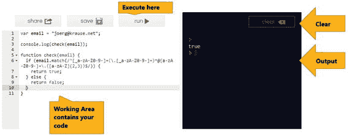
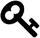

# 一、正则表达式简介

为了开始介绍正则表达式，我将从一个例子开始。这是一个你已经经历了几百次的问题。当您在线输入客户数据时，许多 web 表单会要求您提供电子邮件地址。为了避免输入错误的地址，立即验证是有意义的。一种方法是将字符串分成几部分(在`@`字符之前和之后)，分析点的位置和最后一个点(即顶级域名)之后的字符数。

几个如果和循环之后，你就差不多完成了。或者你简单地使用一个正则表达式:

```js
ˆ[_a-zA-Z0-9-]+(\.[_a-zA-Z0-9-]+)* @ [a-zA-Z0-9-]+\.([azA-Z]{2,3})$

```

你明白了吗？如果这是你第一次使用正则表达式，可能很难读懂。

正则表达式是正则文本中模式识别的一种形式。正则表达式将模式与文本进行比较。在脚本或编程语言中封装为对象的整个表达式将返回`true`或`false`。结果显然会告诉调用者比较是否成功。因此，如果你把它放在实际语言的语境中看，就能更好地理解这个表达。因为本书专门介绍 JavaScript，所以该语言的用法如下:

```js
 1   var email = "joerg@krause.net";
 2   
 3   console.log(check(email));
 4   
 5   function check(email) {
 6     if (email.match(/^[_a-zA-Z0-9-]+(\.[_a-zA-Z0-9-]+)*@[a-zA-Z0-9-]+\\
 7   .([a-zA-Z]{2,3})$/)) {
 8        return true;
 9     } else {
10        return false;
11     }
12   }

```

这里，表达式是通过使用典型的文字作为边界`/expression/`来实现的，比较是通过每个字符串对象提供的`match`函数来实现的。请注意，斜线不能放在引号中。它是创建对象的文字。

 A Test Environment

对于第一步，使用在线提供的 JavaScript 测试控制台很有帮助。我推荐用 [Repl。it](https://repl.it/languages/JavaScript) 。 <sup>1</sup>



图 1-1。

The example in Repl.it  REPL

术语 REPL 是读取-评估-打印-循环的缩写。这是一种与脚本语言交互工作的方法。在维基百科上阅读更多相关信息。 <sup>2</sup>

## 抄袭还是脚手架？

我将在第四章展示许多有用的表达。然而，第一章展示了可以使用的普通和非普通表达式。因为表达式有时很难理解，你可以下载所有的例子。

 Website

访问本书的[支持网站](http://www.joergkrause.de/?p=219)。??

如果您想成为一名专业的 JavaScript 开发人员，正则表达式是您工具集的一部分。你应该试着完全理解这些表达，并开始创造你自己的表达。

## 它是如何工作的？

您可能很想知道前面的表达式是如何工作的。

如果你开始分析这样的表达式，最好从特殊字符的提取开始。在这个特定的表达式中，它们包括下列之一:`ˆ, $, +, *, ?, [], ()`。所有其他字符在这里没有特殊的含义。常规字符是少数。通常，这种模式使用占位符和描述性字符多于单词中的实际字母。

以下是特殊字符的概述:

*   让识别从头开始。如果您写`ˆx`，只有当字母“x”出现在第一个字符时，表达式才会匹配它。
*   `$`让您定义图案的结束位置。
*   `*`是一个占位符，表示没有或有任意数量的字符。
*   `+`是一个占位符，表示一个或任意数量的字符。
*   `?`是一个占位符，表示没有字符或只有一个字符。
*   `[a-z]`定义一组字母或数字中的一个字符。您可以使用大写字母、小写字母或数字，只需将它们放在括号中，或者您可以将它们定义为一个范围，如示例所示。
*   `()`分组字符或字符串。您也可以在这样的组中使用集合操作符`*`、+和`?`。
*   `{}`是定义大括号前字符的重复标记。可以重复多次。范围可以用数字来定义；如果开头和结尾分别给出，数字用逗号(`{3,7}`)书写。
*   `\`(反斜杠)屏蔽元字符和特殊字符，使它们不再具有特殊含义。
*   `.`恰好代表一个字符。如果你真的需要一个点，就写`\.`。

现在你可以很容易地将表达式拆分得很好。`@`字符代表其自身，第一步拆分表达式:

```js
1   ^[_a-zA-Z0-9-]+(\.[_a-zA-Z0-9-]+)*
2   @
3   [a-zA-Z0-9-]+\.([a-zA-Z]{2,3})$

```

`@`字符之前的部分必须至少有一个字符。这是由第一个字符定义`[_a-zA-Z0-9-]`强制的，所有可接受的字符都带有`+`符号。然后，表达式后面可能会跟一个实际的点`\.`，它本身后面可以跟一个或多个字符。整个“点加更多字符”组是可选的，可以无休止地重复(`*`)。第二部分类似。集合定义缺少下划线字符，该字符可能不会出现在常规域名中。点不是可选的(没有设置操作符)，其余部分可以是两个或三个字符长(这是忽略了四个或更多字符的新域名，但我想你明白了)。

## 解析表达式

这个表达式可能会出现在这里，但它还远远不够完美。

在少数情况下，表达式可能拒绝可接受的电子邮件地址，也接受不规则的电子邮件地址。一个表情还是很难解释。因为您很快会遇到更复杂的例子，所以我将在这里使用另一种布局:

```js
 1   ^                           // Start at the beginning

 2      [_a-zA-Z0-9-]            // Define a group

 3      +                        // One or more times

 4        (                      // Group 1

 5            \.                 // a "real" dot

 6            [_a-zA-Z0-9-]      // Another group

 7            +                  // One or more times

 8        )                      // /* End group 1 */

 9        *                      // Group optional or multiple times

10     @                         // The @ character

11     [a-zA-Z0-9-]              // Character definition

12     +                         // On or multiple times

13     \.                        // A "real" dot

14       (                       // Group 2

15           [a-zA-Z]            // A character definition

16           {2,3}               // Two or three characters

17       )                       // /* End group 2 */

18   $                           // End of text must come now

```

那就简单多了，不是吗？不幸的是，你不能用 JavaScript 那样写。我将只使用这种形式来分解棘手的表达式。如果你对这本书里的一个表达感到困惑，试着通过把每个字符放在一行并写下它的意思来解决这个模式。

Footnotes 1

[`repl.it/languages/JavaScript`](https://repl.it/languages/JavaScript)

  2

[` en。维基百科。org/wiki/read %和 2% 80% 93 eval %和 2%80%93print_ loop`](https://en.wikipedia.org/wiki/Read%E2%80%93eval%E2%80%93print_loop)

  3

[`www . joergkrause . de/？p = 219`](http://www.joergkrause.de/?p=219)