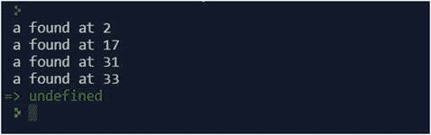
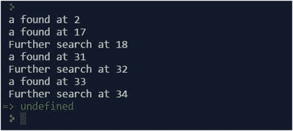

# 3.JavaScript 函数

JavaScript 提供了一个名为`RegExp`的对象。您可以通过使用`new`或文字`//`来创建一个实例。

## RegExp 对象

我将从一个概述开始，然后是几个例子。

### 方法

除了`RegExp`对象，您可以在 JavaScript 中使用几个内置的字符串函数来处理正则表达式。对象知道这些方法:

*   `exec()`:执行测试并返回第一次命中。
*   `test()`:执行测试并返回`true`或`false`。
*   `toString()`:以字符串形式返回表达式。

`exec`方法返回一个包含以下内容的对象:

*   包含组的数组(仅计数组):
    *   第一个捕获在索引[0]中
    *   如果有更多的组，这些组遵循[1]..[n]
*   名为`index`的属性包含第一次命中的位置，其值从零开始。
*   名为`input`的属性包含搜索到的文本。

`RegExp`对象本身包含更多的信息。当然，您找到了表达式的定义，也找到了迭代到进一步结果的方法(因为`exec`只返回第一个结果)。

Option g

如果您希望有多个匹配项，您应该使用选项`g`，这意味着“全局”并在第一个匹配项之后继续搜索。

下面的脚本包含一个非常简单的表达式，它导致了多次点击。同一表达式的后续调用通过增加内部指针贯穿所有命中。这迫使`do`-循环进行迭代。

```js
 1   var text = "Than Ann answers all questions again.";
 2   var patt = /a/g;
 3   var match = patt.exec(text);
 4   console.log(match[0] + " found at " + match.index);
 5   
 6   match = patt.exec(text);
 7   do {
 8       match = patt.exec(text);
 9       if (!match) break;
10       console.log(match[0] +
11                   " found at " + match.index);
12   } while(true);

```

输出显示结果，如图 [3-1](#Fig1) 所示。



图 3-1。

Output of the script

### 性能

以下是一些有助于保持表达式灵活性的属性:

*   `constructor`:创建`RegExp`对象的函数。
*   `global`:检查选项`g`(布尔)，全局。
*   `ignoreCase`:检查选项`i`(布尔值)，不区分大小写。
*   `lastIndex`:最后一次点击的索引。
*   `multiline`:检查选项`m`(布尔值)，多行。
*   `source`:表情本身。

以下脚本显示了`lastIndex`属性的作用:

```js
 1   var text = "Than Ann answers all questions again.";
 2   var patt = /a/g;
 3   var match = patt.exec(text);
 4   console.log(match[0] + " found at " + match.index);
 5
 6   match = patt.exec(text);
 7   do {
 8        match = patt.exec(text);
 9        if (!match) break;
10        console.log(match[0] + " found at " + match.index);
11        console.log( "Further search at " + patt.lastIndex);
12   } while(true);

```

输出显示结果，如图 [3-2](#Fig2) 所示。



图 3-2。

Output of the script

### 动态性能

如果表达式中有组，它们将显示为动态属性。名字分别是`$1`到`$9`。如果你不想让一群人这样被抓，考虑使用非计数组`(?:)`。

```js
1   var patt = /(abc)|(def)/;
2   var text = "anton def";
3   console.log(patt.test(text));
4   console.log(RegExp.$1);

```

第二个输出(第 4 行)返回第一个匹配的内容。那其实就是`def`。

### 字面形式

文字形式是创建表达式的最简单方法:

```js
1   var patt = /web/i;
2   patt.test("Look for our Web courses!");

```

这只是返回`true`。结尾没有了`i`，结果就是`false`。`i`取消了区分大小写，使“web”与“Web”匹配，反之亦然。你甚至可以把这个和`exec`结合起来:

```js
1   /web/i.exec("Look for our Web courses!");

```

这将返回一个对象，在第一个位置点击“Web ”,值为 13 用于`index`。如果没有命中，`exec`简单地返回`null`。使用`if(//.exec(""))`来处理这个问题，因为 JavaScript 会将`null`视为`false`。使用`new`操作符，它看起来像这样:

```js
1   var patt = new RegExp("web");

```

 Literals and Regex

虽然`//`对 RegExp 有效，但常规字符串在这里也适用——但仅限于这里。

### 执行选项

已经显示了一些选项。选项不是表达式的一部分；相反，它们修改 regex 引擎的行为。

```js
var pattern = /[A-Z]/i;

```

以下是所有可用的选项:

*   `i`:搜索时不区分大小写
*   `g`:全局搜索，即使已经找到匹配项
*   `m`:在多行中搜索(如果没有，行尾会停止搜索)

## 字符串函数

正则表达式不限于`RegExp`对象。一些常规字符串函数也可以处理这些表达式。

### 概观

增强了以下函数来处理表达式:

*   `search`
*   `replace`
*   `match`
*   `split`

```js
1   var str = "Look for our Web courses!";
2   var res = str.search(/Web/i);
3   console.log(res);

```

`res`变量包含 13。这是点击量的指数。没有命中，你得到-1。

如果需要布尔值，只需使用`match`:

```js
1   var str = "Look for our Web courses!";
2   var res = str.match(/Web/);
3   if (res) {
4     console.log("Hit");
5   } else {
6     console.log("No Hit");
7   }

```

这里你在控制台上被击中。用`replace`挺像的:

```js
1   var str = "Look for our Web courses!";
2   var res = str.replace(/Web/i, ".NET");
3   console.log(res);

```

`res`变量现在包含了查找我们的。网络课程！。