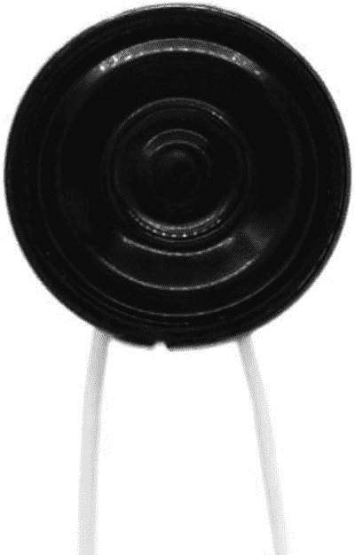
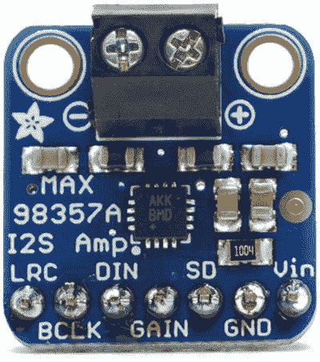
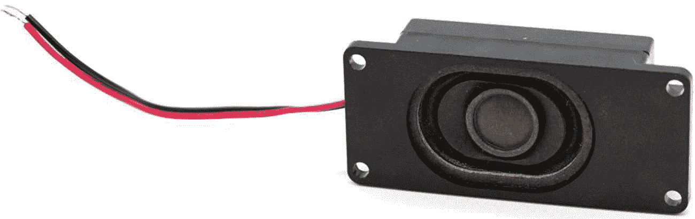
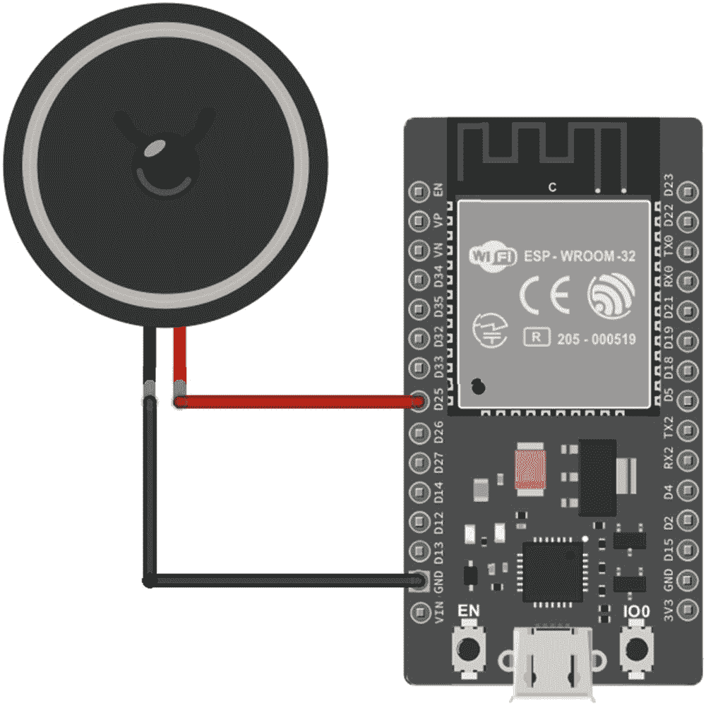
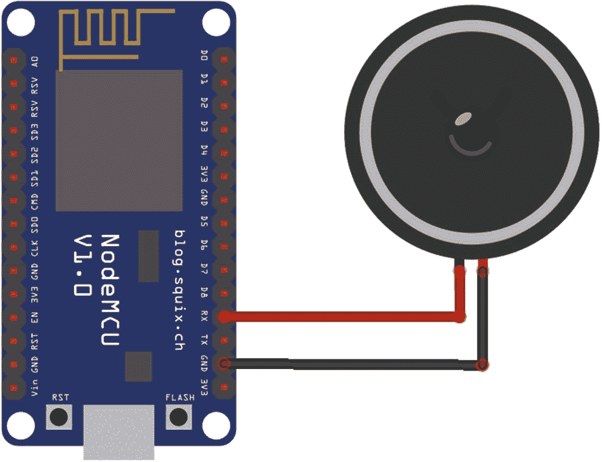
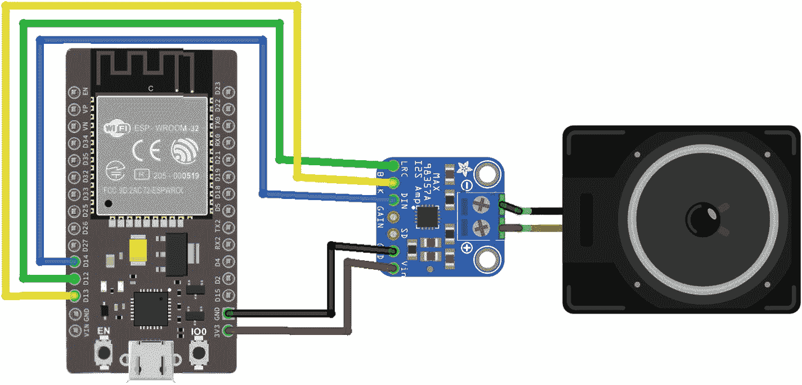
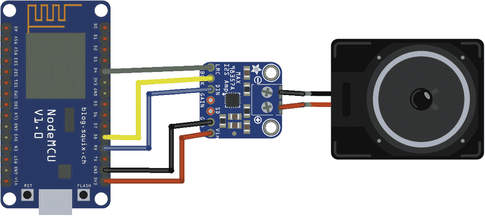

# 七、声音

声音是向设备用户传达信息的一种很好的方式。您可以使用声音为用户操作(如点击按钮)提供反馈，在后台任务(如计时器或下载)完成时提醒用户，等等。

ESP32 和 ESP8266 都支持音频回放。包括 M5Stack FIRE 在内的一些开发板都内置了扬声器。如果您的主板没有扬声器，您可以自己安装一个。在本章中，您将学习如何使用便宜的扬声器播放声音，这种扬声器很容易直接连接到 ESP32 或 ESP8266。您还将了解如何使用外部 I <sup>2</sup> S 音频驱动器实现更高质量的音频回放，以及如何为您的项目选择最佳音频格式，平衡质量和存储空间。

## 扬声器选项

如果您没有使用带有内置扬声器的开发板，您需要在运行示例之前将扬声器连接到您的设备。

图 7-1 显示了 Adafruit(产品 ID 1890)生产的迷你金属扬声器，可与 ESP32 和 ESP8266 配合使用。这是一个简单的模拟扬声器，阻抗为 8 欧姆，功耗为 0.5W。你可以找到许多类似的不同阻抗和功耗的产品。8 欧姆、0.5W 扬声器是一个很好的起点，因为它可以与 ESP32 和 ESP8266 使用相同的电源，而更大的扬声器需要外部电源。



图 7-1

Adafruit 的迷你金属扬声器

迷你金属扬声器可以直接连接到您的设备上，这是一种快速入门的简单方法。但是，你可以通过增加一个 I <sup>2</sup> S 芯片来获得更好的音质。图 7-2 显示了一个来自 Adafruit 的 I <sup>2</sup> S 芯片(产品 ID 3006)。这个芯片也能放大声音。



图 7-2

我从阿达果公司买了 2 块芯片

I <sup>2</sup> S 芯片本身不播放声音；你还得给它装一个扬声器。迷你金属扬声器与 I <sup>2</sup> S 芯片一起工作；然而，廉价的扬声器会影响质量。对于更高质量的音频，使用更高质量的扬声器，例如图 7-3 所示的 Adafruit 公司生产的单声道封闭式扬声器(产品 ID 3351)。



图 7-3

Adafruit 的单声道封闭式扬声器

一个 I <sup>2</sup> S 芯片增加了额外的成本，但如果你的产品需要高质量的声音，这可能是必要的。此外，使用 I <sup>2</sup> S 芯片在 ESP8266 上的 CPU 开销更低，这也可能使其物有所值。你可以决定哪个选项最适合你。

如果您只是想尝试一下可修改的 SDK 的音频播放功能，最快的方法是从模拟扬声器开始。如果你后来决定想要更高质量的音频，你可以随时切换到使用 I <sup>2</sup> S 芯片和单声道封闭式扬声器。无论您选择哪种设置，播放音频的 JavaScript APIs 都是相同的，因此您不必更改应用程序代码。但是，您必须为每个选项配置不同的音频设置。本章的主持人负责他们的`manifest.json`文件中的音频配置。他们假设你正在使用图 7-1 所示的扬声器或者图 7-2 和 7-3 所示的 I <sup>2</sup> S 芯片和扬声器。

## 添加模拟扬声器

本节说明如何将模拟扬声器连接到您的 ESP32 或 ESP8266。

### ESP32 接线说明

表 7-1 和图 7-4 显示了如何将扬声器连接到 ESP32。

表 7-1

将扬声器连接到 ESP32 的接线

<colgroup><col class="tcol1 align-left"> <col class="tcol2 align-left"></colgroup> 
| 

扬声器

 | 

ESP32

 |
| --- | --- |
| 电线 1 | GPIO25 (D25) |
| 电线 2 | 地线 |

扬声器的哪根线连接到 GPIO25，哪根线连接到 ESP32 上的 GND，都无关紧要。



图 7-4

将扬声器连接到 ESP32 的接线图

### ESP8266 接线说明

表 7-2 和图 7-5 显示了如何将扬声器连接到 ESP8266。



图 7-5

将扬声器连接到 ESP8266 的接线图

表 7-2

将扬声器连接到 ESP8266 的接线

<colgroup><col class="tcol1 align-left"> <col class="tcol2 align-left"></colgroup> 
| 

扬声器

 | 

ESP8266

 |
| --- | --- |
| 电线 1 | GPIO3 (RX) |
| 电线 2 | 地线 |

请注意，ESP8266 上的 GPIO3 用于与您的计算机进行串行通信，用于安装和调试。这意味着您不能使用`xsbug`来调试音频示例，并且安装音频示例需要一些额外的步骤:

1.  断开扬声器与 GPIO3 的连接。

2.  照常安装一个例子。

3.  将扬声器重新连接到 GPIO3。

4.  重置 ESP8266 以运行该示例。

如果你使用的是 Moddable One，GPIO3 在你连接编程适配器的小连接器上。安装音频示例后，断开编程适配器，连接扬声器，并使用 USB 电缆为可修改的音频示例供电。

在 ESP8266 上，扬声器的哪根线连接到 GPIO3，哪根线连接到 GND 都无关紧要。

## 增加一个 I <sup>2</sup> S 芯片和数字扬声器

本节介绍如何将 I <sup>2</sup> S 芯片连接到您的 ESP32 或 ESP8266，以及如何将数字扬声器连接到 I <sup>2</sup> S 芯片。

### ESP32 接线说明

表 7-3 显示了如何将 I <sup>2</sup> S 芯片连接到 ESP32。

表 7-3

将 I <sup>2</sup> S 芯片连接到 ESP32 的接线

<colgroup><col class="tcol1 align-left"> <col class="tcol2 align-left"></colgroup> 
| 

我的芯片

 | 

ESP32

 |
| --- | --- |
| 法律改革委员会(Law Reform Commission) | GPIO12 (D12) |
| BCLK 公司 | GPIO13 (D13) |
| 联邦德国工业标准 | GPIO14 (D14) |
| 地线 | 地线 |
| 酒 | 3V3 |

表 7-4 显示了如何将扬声器连接到 I <sup>2</sup> S 芯片。

表 7-4

将扬声器连接到 I <sup>2</sup> S 芯片的接线

<colgroup><col class="tcol1 align-left"> <col class="tcol2 align-left"></colgroup> 
| 

扬声器

 | 

我的芯片

 |
| --- | --- |
| 黑线 | – |
| 红线 | + |

图 7-6 显示了完整设置的接线图。



图 7-6

扬声器、I <sup>2</sup> S 芯片和 ESP32 的接线图

### ESP8266 接线说明

表 7-5 显示了如何将 I <sup>2</sup> S 芯片连接到 ESP8266。请注意，GPIO2 和 GPIO15 在可修改的设备上不可用，因此您不能在可修改的设备上使用 I <sup>2</sup> S。

表 7-5

将 I <sup>2</sup> S 芯片连接到 ESP8266 的接线

<colgroup><col class="tcol1 align-left"> <col class="tcol2 align-left"></colgroup> 
| 

我的芯片

 | 

ESP8266

 |
| --- | --- |
| 法律改革委员会(Law Reform Commission) | GPIO2 (D4) |
| BCLK 公司 | GPIO15 (D8) |
| 联邦德国工业标准 | GPIO3 (RX) |
| 地线 | 地线 |
| 酒 | 3V3 |

表 7-6 显示了如何将扬声器连接到 I <sup>2</sup> S 芯片。

表 7-6

将扬声器连接到 I <sup>2</sup> S 芯片的接线

<colgroup><col class="tcol1 align-left"> <col class="tcol2 align-left"></colgroup> 
| 

扬声器

 | 

我的芯片

 |
| --- | --- |
| 黑线 | – |
| 红线 | + |

图 7-7 显示了完整设置的接线图。



图 7-7

扬声器、I <sup>2</sup> S 芯片和 ESP8266 的接线图

## 安装音频主机

本章中的示例使用第一章中描述的模式进行安装:您使用`mcconfig`在您的设备上安装主机，然后使用`mcrun`安装示例应用程序。

在`$EXAMPLES/ch7-audio/host-pdm`和`$EXAMPLES/ch7-audio/host-i2s`目录中有两个可用的主机应用程序。两者的区别在于它们如何配置音频设置。如果您使用 I <sup>2</sup> S 芯片和扬声器组合，请使用`host-i2s`，如果您仅使用扬声器，请使用`host-pdm`。从命令行导航到目录，用`mcconfig`安装。

## `AudioOut`类

使用`AudioOut`类将声音传送到扬声器:

```js
import AudioOut from "pins/audioout";

```

`AudioOut`类支持以每样本 8 或 16 位回放未压缩的单声道或立体声音频，以及回放使用 IMA ADPCM 算法压缩的单声道音频。内置混音器可以组合多达四个声道的音频进行同步播放。它可以在音频回放期间的指定点生成回调，例如，将屏幕绘图与音频回放同步。`AudioOut`产生 8 位或 16 位音频输出，并将其发送至伪模拟输出或数字 I <sup>2</sup> S 数模转换器。

有了这么多的功能，使用音频需要了解可用选项的权衡，以帮助您决定在产品中播放音频的最佳方式。

## `AudioOut`配置

本节描述了音频硬件协议、数据格式和`AudioOut`类的其他配置选项。对于本章中的示例，设置是在主机的清单中配置的。

### 音频硬件协议

如本节所述，`AudioOut`类支持两种不同的硬件协议，PDM 和 I <sup>2</sup> 。

#### 脉冲密度调制(PDM)

*脉冲密度调制*或 *PDM* ，是 PWM 的一种变体，它快速切换数字输出引脚，以创建与所需输出信号相对应的能量水平。这种播放音频的方式有时被称为模拟音频输出，因为 PDM 转换会合成一个信号，该信号经过一段时间的平均后，与模拟信号输出的能量水平相匹配。

PDM 的优势在于它只与微控制器的内置数字输出硬件一起工作。PDM 的一个缺点是音频质量较低；因此，PDM audio 主要用于用户界面或游戏中的音效，而不是音乐或口语。

ESP32 具有内置硬件，可将音频数据转换为 PDM，因此使用该协议时没有 CPU 开销。然而，ESP8266 没有 PDM 转换硬件；转换在软件中进行，因此会占用一些 CPU 周期。

清单的`defines`部分配置 PDM 输出。对于 ESP32，它看起来像清单 7-1 。

```js
"defines": {
    "audioOut": {
        "i2s": {
            "DAC": 1
        }
    }
}

Listing 7-1.

```

当设置为 1 时，`DAC`属性告诉`AudioOut`实现使用 PDM 输出。没有指定输出引脚，因为只有 ESP32 上的数字引脚 25 支持 PDM 输出。

对于 ESP8266，清单部分略有不同(清单 7-2 )。

```js
"defines": {
    "audioOut": {
        "i2s": {
            "pdm": 32
        }
    }
}

Listing 7-2.

```

非零值的`pdm`属性表示使用 PDM 输出。该值必须是 32、64 或 128。值 32 指定在转换中不应执行过采样；这需要较少的时间和内存，但会导致较低质量的输出。值越大，质量越好。

#### 一秒钟

`AudioOut`类支持的另一个硬件协议是 *I* <sup>*2*</sup> *S，*一个专为连接数字音频设备而设计的协议。I <sup>2</sup> S 通过数字连接将未修改的音频样本从微控制器传输到专用音频输出组件，该组件使用专门的算法和硬件执行数模转换，以生成高质量的结果。ESP32 和 ESP8266 都有内置的硬件支持，可使用 I <sup>2</sup> 传输音频数据，因此微控制器上播放音频的 CPU 开销非常小。

使用 I <sup>2</sup> S 需要一个外部元件，这是一个额外的成本，并且使用至少两个，通常是三个数字引脚，而 PDM 输出仅使用一个数字引脚。另一方面，I <sup>2</sup> S 音频硬件产生了非常高质量的音频输出，因此质量的限制因素变成了用于输出的扬声器，而不是数字样本转换成模拟信号的方式。

I <sup>2</sup> S 零件千差万别。一些没有配置选项，而另一些包括 I <sup>2</sup> C 连接来配置器件，并且在配置完成之前不能正常工作。本节假设您正在使用不需要配置或已经配置的 I <sup>2</sup> S 部件。

清单的`defines`部分配置 I <sup>2</sup> 的输出。对于 ESP32，这看起来像清单 7-3 。

```js
"defines": {
    "audioOut": {
        "i2s": {
            "bck_pin": 13,
            "lr_pin": 12,
            "dataout_pin": 14,
            "bitsPerSample": 16
        }
    }
}

Listing 7-3.

```

`bck_pin`、`lr_pin`、`dataout_pin`属性对应于 I <sup>2</sup> S 硬件协议的三个管脚。默认值分别为 26、25 和 22。`bitsPerSample`属性表示通过 I <sup>2</sup> S 连接传输的样本大小(以位为单位)。对于许多 I <sup>2</sup> S 组件，这是 16，默认值，但对于其他组件，需要 32 位。

对于 ESP8266，清单部分要简单得多，如清单 7-4 所示，因为 I <sup>2</sup> S 引脚是在硬件中定义的，不能更改。将`pdm`属性设置为 0 会禁用 PDM 输出，而使用 I <sup>2</sup> S 硬件协议。I <sup>2</sup> S 引脚为 15 ( `bck_pin`)、2 ( `lr_pin`)和 3 ( `dataout_pin`)。

```js
"defines": {
    "audioOut": {
        "i2s": {
            "pdm": 0
        }
    }
}

Listing 7-4.

```

ESP8266 实现只支持 16 位样本输出，所以没有`bitsPerSample`属性。

### 音频数据格式

您的应用程序播放的音频数据必须以与`AudioOut`类和连接到微控制器的音频输出硬件兼容的格式存储。为了最大化效率和简单性，`AudioOut`使用自定义数据格式来存储数字音频；这种格式被称为 MAUD，是 Moddable Audio 的缩写。它由一个简单的标题和音频样本组成。您用来构建应用程序的工具知道如何将包含未压缩音频的标准 WAVE 音频文件(文件扩展名为`.wav`的文件)转换为 MAUD 资源，无需您自己创建 MAUD 文件。转换工具名为`wav2maud`，由`mcconfig`和`mcrun`自动调用。如果您的音频以另一种格式存储，例如 MP3，您必须先将其转换为 WAVE 文件；免费的 Audacity 应用程序是完成这项任务的好工具。

为简单起见，`AudioOut`类要求所有播放的音频样本具有与音频输出相同的每样本位数、通道数和采样率。这消除了在微控制器上用软件执行格式转换的需要。这些`AudioOut`属性在清单中配置，如清单 7-5 所示。

```js
"defines": {
    "audioOut": {
        "bitsPerSample": 16,
        "numChannels": 1,
        "sampleRate": 11025
    }
}

Listing 7-5.

```

属性可以是 8 或 16，尽管 16 更常见。同样的，`numChannels`属性可能是 1(单声道)或者 2(立体声)；然而，很少在微控制器上为用户界面交互播放立体声，因此该值通常为 1。

要在应用程序中包含音频数据，需要将它们作为资源添加到清单中，如清单 7-6 所示。

```js
"resources": {
    "*": [
        "./bflatmajor"
    ]
},

Listing 7-6.

```

当`mcconfig`和`mcrun`处理清单时，它们调用`wav2maud`将文件`bflatmajor.wav`转换成 MAUD 格式的资源。音频被转换，使得 MAUD 资源中音频的每样本比特数、通道数和采样率与清单的`audioOut`部分中定义的相匹配。根据前面的示例，音频样本是 16 位单声道，采样速率为 11，025 Hz。

### 音频压缩

音频数据会占用大量的存储空间。10 秒钟 8 KHz 的 16 位单声道音频使用 160，000 字节的存储空间，约为 ESP8266 的 1 MB 闪存地址空间的 15%,仍仅相当于模拟电话呼叫的质量。音频压缩通常用于减小存储在数字设备上并通过互联网传输的音频的大小。那里使用的算法，包括 MP3、AAC 和 Ogg，几乎不能在大多数微控制器上运行，所以它们在这里不实用。IMA ADPCM(自适应差分脉码调制)是一种更简单的音频压缩格式，可对 16 位音频样本进行 4:1 压缩，复杂度远低于 MP3、AAC 或 Ogg，适合在 ESP32 和 ESP8266 上实时使用。

要使用 IMA ADPCM，将`format`属性添加到您的`manifest.json`文件的`audioOut`部分:

```js
"audioOut": {
    ... // other audioOut configuration
    "format": "ima"
}

```

在构建过程中，您的音频会自动压缩。前面提到的 10 秒 16 位单声道 8 KHz 音频从 160，000 字节缩减到 40，000 字节。质量有所下降，但对于许多目的来说，例如，用户界面声音效果，这种差异可能是不明显的。

### 设置音频队列长度

音频队列的长度在构建时是固定的，通过在修改队列时消除对内存分配的需求来提高音频回放的运行时效率。默认的队列长度是八个条目，这对于大多数目的来说已经足够了，包括本章中的所有例子。如果需要更多的队列条目，可以通过在清单的`audioOut`部分定义`queueLength`属性来更改队列长度。

```js
"audioOut": {
    ... // other audioOut configuration
    "queueLength": 20
}

```

每个队列条目都使用一些内存(在撰写本文时为 24 个字节)，所以您不应该分配超过您需要的内存。如果您的项目简单地使用音频，您可以降低默认值来恢复该内存。

## 使用`AudioOut`播放音频

`AudioOut`类提供了各种不同的音频回放功能，帮助您将音频反馈整合到项目的用户体验中。回放引擎能够无缝地回放样本序列。它提供了一种回调机制来同步音频和用户体验的其他部分。它甚至支持多通道音频的实时混合，这种功能在微控制器上很少见。本节将介绍这些功能以及许多其他功能。

### 实例化`AudioOut`

`AudioOut`构造函数接受一个字典来配置音频输出。`$EXAMPLES/ch7-audio/sound`示例如下配置`AudioOut`实例:

```js
let speaker = new AudioOut({streams: 1});

```

流的数量表示可以同时播放的声音的数量，最多四个。因为每个流都使用一些额外的内存，所以最好只根据需要配置`AudioOut`实例。基本的`sound`示例播放单个声音，因此它只需要一个流。

采样率、每个样本的位数和通道数是在清单中定义的，所以它们不会作为属性在字典中传递来配置`AudioOut`实例。音频资源以相同的格式存储，因为`mcconfig`、`mcrun`和`wav2maud`执行任何需要的格式转换。

### 播放单个声音

要播放声音，首先使用`enqueue`方法将一个音频样本加入到`AudioOut`实例的流中。`$EXAMPLES/ch7-audio/sound`示例将音频资源`bflatmajor.maud`排入流 0，如下所示:

```js
speaker.enqueue(0, AudioOut.Samples,
                new Resource("bflatmajor.maud"));

```

要开始播放排队的音频样本，请调用`start`方法:

```js
speaker.start();

```

要停止`AudioOut`实例上的所有音频回放，调用`stop`方法:

```js
speaker.stop();

```

### 重复一个声音

如果您想不止一次地播放一个声音，您可以向`enqueue`方法传递一个可选的`repeat`参数。以下是如何播放一个声音四次:

```js
speaker.enqueue(0, AudioOut.Samples,
                new Resource("bflatmajor.maud"), 4);

```

要无限重复声音，为`repeat`值传递`Infinity`:

```js
speaker.enqueue(0, AudioOut.Samples,
                new Resource("bflatmajor.maud"), Infinity);

```

### 使用回调来同步音频

`enqueue`方法不仅可以用于声音入队；例如，您可以将回调排队，以便在流回放的特定点调用。回调入队对于触发其他事件以响应声音的完成非常有用，就像在屏幕动画中一样。在清单 7-7 中，回调只是追踪到调试控制台，并在声音播放结束时闪烁一次板上 LED。

```js
speaker.enqueue(0, AudioOut.Samples,
                new Resource("bflatmajor.maud"));
speaker.callback = function() {
    trace("Sound finished\n");
    Digital.write(2, 1);
    Timer.delay(500);
    Digital.write(2, 0);
};
speaker.enqueue(0, AudioOut.Callback, 0);

Listing 7-7.

```

### 使用命令改变音量

您还可以将命令加入队列，以调整单个声音的音量。该命令会更改其后排队的样本量；它不会改变已经排队的样本量。清单 7-8 中的代码连续播放声音三次:一次以最低音量(1)，一次以中等音量(128)，一次以最大音量(256)。

```js
let bFlatMajor = new Resource("bflatmajor.maud");
speaker.enqueue(0, AudioOut.Volume, 1);
speaker.enqueue(0, AudioOut.Samples, bFlatMajor);
speaker.enqueue(0, AudioOut.Volume, 128);
speaker.enqueue(0, AudioOut.Samples, bFlatMajor);
speaker.enqueue(0, AudioOut.Volume, 256);
speaker.enqueue(0, AudioOut.Samples, bFlatMajor);

Listing 7-8.

```

### 播放一系列声音

`$EXAMPLES/ch7-audio/sound-sequence`示例播放一系列声音。因为它一次只播放一个声音，所以它只需要一个流，所以用与基本的`sound`示例中的`AudioOut`实例相同的设置进行配置。

```js
let speaker = new AudioOut({streams: 1});

```

然后使用`AudioOut`实例的`enqueue`方法将每个声音排队。如清单 7-9 所示，`sound-sequence`示例中的所有声音都在同一个流中排队，使得它们按照排队的顺序依次播放。

```js
speaker.callback = function() {
    speaker.enqueue(0, AudioOut.Samples,
                    new Resource("ding.maud"));
    speaker.enqueue(0, AudioOut.Samples,
                    new Resource("tick-tock.maud"));
    speaker.enqueue(0, AudioOut.Samples,
                    new Resource("tada.maud"));
    speaker.enqueue(0, AudioOut.Callback, 0);
}
speaker.callback();
speaker.start();

Listing 7-9.

```

回调在样本之后排队；一旦所有样本都播放完毕，回调就会被调用，并再次将样本排入队列，从而导致序列重复播放。

### 同时播放声音

`$EXAMPLES/ch7-audio/` `sound-simultaneous`示例同时播放两个声音，因此`AudioOut`实例需要两个流。

```js
let speaker = new AudioOut({streams: 2});

```

调用一次`AudioOut`实例的`enqueue`方法，将滴答声排入流 0。这种声音不断重复。

```js
speaker.enqueue(0, AudioOut.Samples,
                new Resource("tick.maud"), Infinity);
speaker.start();

```

然后，该示例设置一个重复计时器，其回调将一个丁丁声排入流 1。因为声音和滴答声在不同的流中排队，所以两种声音同时播放。

```js
Timer.repeat(() => {
    speaker.enqueue(1, AudioOut.Samples,
                    new Resource("ding.maud"));
}, 5000);

```

### 播放声音的一部分

这个例子演示了如何播放一段声音。使用与基本的`sound`示例相同的设置来配置`AudioOut`实例。

```js
let speaker = new AudioOut({streams: 1});

```

`tick-tock`音频文件是一个时钟的录音。首先播放完整的声音。

```js
let tickTock = new Resource("tick-tock.maud");
speaker.enqueue(0, AudioOut.Samples, tickTock);

```

然后前半秒打两遍。要播放部分声音，您需要指定`enqueue`方法的可选`repeat`、`offset`和`count`参数。在下面一行中，`repeat`是 2，所以声音播放两次；`offset`为 0，所以从音的开头开始；而`count`是 11，025/2，所以半秒播放:

```js
speaker.enqueue(0, AudioOut.Samples, tickTock, 2, 0, 11025 / 2);

```

### 刷新音频队列

在某些情况下，您想要停止播放一个频道上的音频，而继续播放其他频道上的音频。方法是刷新您想要停止的流的音频队列。

```js
speaker.enqueue(0, AudioOut.Flush);

```

一种有用的情况是，当一个通道使用通道 0 无限重复播放背景声音效果，而使用通道 1 播放交互式音频声音效果。您可以通过刷新频道 0 来停止背景声音效果，这将允许频道 1 继续播放而不会中断。这与在`AudioOut`实例上调用`stop`形成对比，后者会立即结束所有通道上的回放。

## 结论

现在您已经了解了如何配置音频设置并使用`AudioOut`类的许多功能来播放音频，您已经准备好开始向您的项目添加声音了。本章中的信息在与其他章节的信息结合使用时最为有用:

*   在第五章中，您学习了如何与传感器和执行器交互。现在，您可以触发声音效果来响应传感器读数或指示执行器何时执行某个操作。

*   在接下来的几章中，您将学习如何使用触摸屏。您可以为屏幕上的用户操作提供音频反馈，或者添加提醒声音以将用户的注意力吸引回显示屏。音频反馈和视觉反馈的结合提供了更完整的用户体验。