# 8.图形基础

本章和接下来的两章将向您展示只使用低成本微控制器和小型廉价触摸屏来创建现代用户界面是多么简单。本章首先阐述如何为物联网产品添加显示器，从而提供更好的用户体验，并比过去更具成本效益和实用性。之后的章节涵盖了微控制器上图形的基础知识，包括优化和约束的重要背景知识、如何将图形素材添加到项目中的信息，以及各种绘图方法的介绍。在接下来的两章中提供了更详细的信息，这两章描述了可修改的 SDK 中的以下内容:

*   *Poco，*一个用于嵌入式系统的渲染引擎，您可以使用它在显示器上绘图

*   Piu，一个面向对象的用户界面框架，使用 Poco 进行绘图，简化了创建复杂用户交互的过程

有了这些知识，你就可以开始构建内置显示器的物联网产品，并向你的朋友和同事解释这一目标对你的产品来说触手可及。

## 为什么要加显示器？

在今天的电脑和手机上，具有漂亮用户界面的显示器被认为是理所当然的；然而，它们在物联网产品上仍然很少见。你可能很熟悉设置和使用用户界面极其有限的物联网产品有多困难，例如只有一个按钮和几个闪烁灯的设备。很明显，在这些产品中增加显示器可以提供更好的用户体验，使产品对客户更有价值。以下是需要考虑的一些好处:

*   显示屏传达的信息远比几个脉冲状态灯或警报声要多。显示屏向用户详细展示产品正在做什么，如果有问题，它会告诉用户哪里出了问题。

*   显示屏可以包含产品所有功能的完整配置选项。用几个按钮和旋钮通常无法实现如此高的配置精度。

*   显示器使用户能够直接执行复杂的交互，而不需要其他设备。相比之下，用户下载并安装移动应用程序以与产品交互，并在能够开始配置之前将应用程序与产品配对。

*   丰富的图形显示让您可以将图像和动画结合起来，为产品带来风格和特色，使用户更加愉快，并强化制造商的品牌形象。

集成显示器有这么多好处，为什么更多的物联网产品不包括一个呢？主要原因是成本。包含显示器的物联网产品往往是高端型号，通常是所谓的“英雄”产品，旨在展示品牌，但预计不会卖出多少台。但是给产品加个屏幕真的贵得让人望而却步吗？曾经，答案是肯定的。以下是制造商不在产品中添加显示屏的一些常见原因:

*   显示器本身很贵。在添加微控制器和通信组件之前，一个小触摸屏的价格可以轻松达到 20 美元。

*   与显示器交互的软件需要增加更多的 RAM，用于构建用户界面的图形素材(图像和字体)需要增加更多的存储空间。

*   为了获得可接受的动画帧速率，需要一个具有硬件图形加速功能的特殊微处理器，即 GPU。

*   微控制器的图形编程需要高度专业化的技能，这使得找到合格的工程师更加困难，雇佣他们也更加昂贵。

*   微控制器的图形和用户界面 SDK 的许可成本太高。

*   为嵌入式系统准备图形素材既耗时又容易出错。

这些在过去都是合理的理由，但今天的情况完全不同。不幸的是，大多数从事物联网产品的产品规划者、设计师和工程师都没有意识到，可以用不到 10 美元的价格获得触摸屏、微控制器、RAM 和 ROM 来提供精美的现代用户界面，即使是非常小批量的产品(轻松地低于 10，000 台)。此外，同一微控制器还可以提供 Wi-Fi 和蓝牙支持。软件和素材问题由 Poco 和 Piu 解决。

## 克服硬件限制

今天的计算机和移动电话中的硬件被设计成以惊人的效率执行极其复杂的图形操作。这种非凡的性能是通过复杂的硬件和软件的结合实现的。不足为奇的是，典型的微控制器没有相同的图形硬件，也缺乏运行相同复杂图形算法的速度和内存。

这些差异的自然结果是，当由微控制器驱动的物联网产品包含显示器时，它们提供的用户界面往往显得非常原始，就像 20 世纪 80 年代和 90 年代初个人计算机时代初期的计算机和视频游戏一样。在某些方面，这是有道理的，因为像早期的个人电脑和视频游戏一样，这些微控制器远不如现代电脑强大。但今天的 ESP32 运行速度比顶级 1992 年 Macintosh IIfx 中的微处理器快 6 倍，因此现代微控制器的性能足以达到或超过早期硬件的性能。

可修改的 SDK 通过应用在现代高速显示总线、大量内存和 GPU 之前的早期硬件上使用的技术，在微控制器上实现了出色的图形效果。这些实现的灵感来自于已经成功用于计算机动画、视频游戏、字体等的经典技术。现代微控制器仍然受内存限制，但它们更快，因此更多的计算是可能的。这使得一些旧硬件上没有的技术成为可能。

这些技术如何工作的细节超出了本书的范围。如果您有兴趣了解更多，可以在可修改的 SDK 中找到实现它们的所有代码。这本书着重于如何使用这些功能为你的产品构建一个优秀的用户界面。

### 像素速率影响帧速率

在现代移动应用和网页中，帧速率是图形性能的基本衡量标准。帧速率越高，动画越流畅。电脑和手机中的 GPU 非常强大，它能够更新每一帧显示的每一个像素。出于多种原因，微控制器无法做到这一点；然而，可以实现每秒 30 帧甚至 60 帧(fps)的动画。

因为微控制器在更新整个显示器时不能呈现高帧速率，所以解决方案是仅更新显示器的子集。您可以设计您的用户界面，以便每次只更新相对较小的显示部分。这大大减少了微控制器所需的工作，因此用户可以看到流畅的高帧率动画，就像在移动应用程序或网页上一样。

为了使用微控制器实现高帧速率，从像素速率(每秒更新的像素数)的角度考虑会有所帮助。ESP32 和 ESP8266 使用 SPI 总线与显示器通信，这种连接以 40 MHz 的频率运行，像素速率约为每秒 1，000，000 像素，约为 15 fps。由于其他因素，实现全部理论像素速率通常是不可能的；尽管如此，如果您的应用程序仅更新每帧中约 40%的像素(每帧约 30，000 像素的像素速率)，它可以实现 30 fps 的可靠帧速率。在本书中使用的 QVGA (320 x 240)显示器上，30，000 像素约占总显示面积的 40%，这足以创建一个流畅、引人注目的用户界面。每帧仅更新 10，000 个像素可实现 60 fps。

您可能希望在每一帧上更新的屏幕区域必须是一个矩形。这将通过将运动限制在显示器的一个区域来限制设计的可能性。幸运的是，情况并非如此。您很快就会知道，您可以同时更新几个不同的区域，这可以让用户在整个屏幕上产生运动的印象，即使实际像素中只有一小部分在变化。

### 绘图框架

大多数用于微控制器的图形库都是*即时模式*API，这意味着当您调用绘图函数时，渲染器会执行所请求的绘图操作。另一方面，Poco 是一个*保留模式*渲染器，其工作方式如下:

1.  你告诉 Poco 你什么时候开始画画。

2.  当您调用绘图函数时，它们不会立即绘制，而是添加到绘图命令列表中。

3.  当你告诉 Poco 你已经画好了，它会执行所有的绘图命令。

显然，保留模式呈现更复杂，维护绘图命令列表需要额外的内存。通常，在微控制器上，您试图保持软件简单和内存使用尽可能少，但保留模式的以下优势证明了其成本的合理性:

*   保留模式渲染消除了闪烁。例如，当您在即时模式渲染器中绘制屏幕背景时，屏幕的所有像素都以背景色绘制；当您随后绘制组成用户界面的控件、文本和图片时，用户可能会首先看到没有这些用户界面元素的背景屏幕，从而导致令人分心的瞬间闪烁。由于保留模式渲染会在将结果发送到屏幕之前执行所有绘制命令，因此它会在将背景擦除与微控制器上用户界面元素的绘制传输到显示器之前，将它们结合起来，从而消除闪烁。

*   保留模式通过减少从微控制器传输到显示器的像素数量来提高性能。考虑到在每个用户界面中都有一些重叠的像素，例如，按钮的背景和它的文本标签。在即时模式渲染器中，重叠像素被发送到显示器两次，而在保留模式渲染器中，每个像素每帧仅被发送一次。因为渲染像素比将其传输到显示器要快得多，所以这提高了整体像素速率。

*   保留模式通过启用高效的像素混合来提高渲染质量。现代计算机图形大量使用混合来平滑对象的边缘，例如，使用反锯齿字体来消除锐边(“锯齿”)。这就是为什么今天的电脑和手机上的文字看起来比 20 世纪 80 年代的屏幕文字清晰得多。混合在计算上更加复杂，而且有足够的性能来完成它，因为微控制器要快得多；然而，混合也需要访问当前正在绘制的像素后面的像素*。在典型的微控制器硬件中，前一个像素存储在显示器的存储器中，而不是微控制器的存储器中，这使得它要么完全不可用，要么访问速度慢得不切实际。保留模式渲染器，因为它只在完全渲染时将像素传输到显示器，所以内存中始终有可用的像素的当前值，因此能够有效地执行混合。*

保留模式渲染器还有其他优点，但这三个优点应该足以让您相信，内存和复杂性成本证明使用像 Poco 这样的保留模式渲染器而不是更常见的即时模式渲染器是合理的。用户界面渲染的质量如此之高，以至于用户感觉他们正在使用一种更高质量的产品——一种属于他们的计算机和手机而不是计算机历史博物馆的产品。

### 扫描线渲染

QVGA 显示器有 76，800 个像素，这意味着 16 位像素的显示器需要 153，600 字节的内存来存储一个完整的帧。ESP8266 的总内存约为 80 KB，如果您的物联网产品不使用任何其他内存，则仅够半帧使用！ESP32 有更多，但在启动时，在内存中保存整个帧会占用总空闲内存的 50%或更多。本书中使用的显示器包括单帧的内存，因此微控制器不必存储整个帧，但它需要内存来呈现帧。为了最大限度地减少所需的内存，Poco 渲染器实现了*扫描线渲染*，这是一种将帧分成水平条带的技术，小至单行像素；在每一条被渲染后，它立即被传输到显示器。这种方法比一次渲染整个帧更复杂，但它将单个 16 位 QVGA 显示器的渲染内存需求从 153，600 字节减少到 480 字节，即一条 240 像素扫描线每像素两个字节，内存节省了 99.68%！

每个渲染的条带都有一些性能开销，因此通过增加条带的大小来减少条带的数量是有好处的——但当然这也会增加所需的内存。随着每一行被添加到一个条中，性能优势会有所下降，因此增加超过大约八条扫描线通常是不值得的。如果您的项目有一些空闲内存或需要最高性能的渲染，您可能希望让 Poco 一次渲染几条扫描线；接下来的章节将解释如何进行配置。

许多现代微控制器，包括 ESP32 和 ESP8266，都能够使用 SPI 异步向显示器传输数据，这意味着微控制器可以在传输数据的同时执行其他工作。Poco 使用异步 SPI 传输来呈现显示器的下一部分，同时将前一部分传输到显示器，这种简单的并行处理可以显著提升性能。要使用这种技术，Poco 必须有足够的内存来容纳至少两条扫描线:正在传输的先前渲染的扫描线和正在渲染的当前扫描线。因为这种技术提供了如此显著的性能提升，所以默认情况下，Poco 分配两条扫描线。

### 限制绘图区域

正如您在“像素速率影响帧速率”和“扫描线渲染”部分看到的，微控制器上图形使用的一项关键技术是部分更新显示，而不是一次更新全部。请注意 Poco 和 Piu 中该技术的以下方面:

*   **在 Poco** 中——Poco 渲染引擎支持将绘图限制在显示器的子部分的特性被称为*剪辑*。Poco 用单个矩形来描述*裁剪区域*；每个绘制操作中与该裁剪矩形相交的部分被绘制，而落在裁剪矩形之外的任何操作部分都不被绘制。Poco 使用此功能实现扫描线渲染(Piu 使用此功能实现部分帧更新)。它也可用于您的应用程序中，例如，绘制图像的子集。

*   **在 Piu** 中–更新显示器的最小可能区域可提高微控制器的渲染性能；然而，在一般情况下，确定要更新的最小可能区域是相当困难的。Poco 无法为您确定最佳的绘图区域，因为作为一个渲染引擎，它不知道您的代码正在绘制什么。另一方面，Piu 是一个用户界面框架，它完全了解组成屏幕显示的不同对象。因此，Piu 能够在后台自动为您计算最小的可能更新区域。

为了理解计算最小可能更新区域的挑战，让我们看一个弹跳球的例子。在每一帧中，球移动一定数量的像素。在图 [8-1](#Fig1) 中，球向右下方移动了几个像素。包围球的先前和当前位置的最小矩形是对屏幕上要更新的最小可能区域的良好的第一估计。

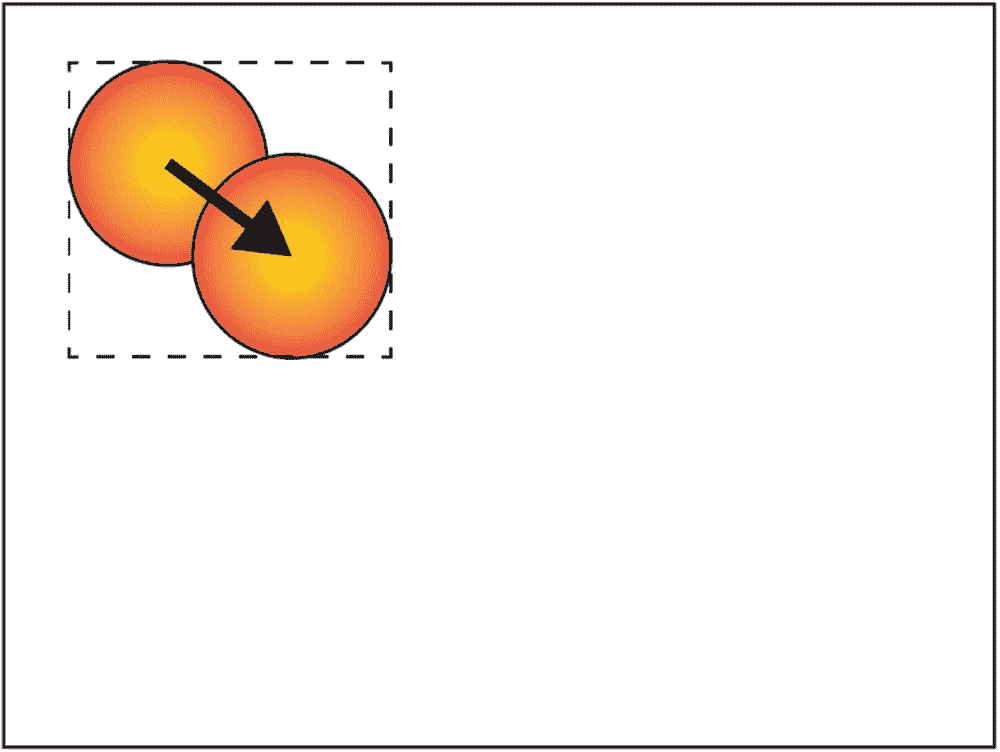

图 8-1

球轻微移动，一个更新矩形

现在考虑球移动更长距离的情况(图 [8-2](#Fig2) ):包围先前和当前位置的最小矩形包括许多实际上没有改变的像素，但是它们被重新绘制，因为它们包含在要更新的区域中。


图 8-2

球移动得更远，一个更新矩形

如图 [8-3](#Fig3) 所示，在这种情况下，Piu 认为更新两个独立的区域更有效:包围球的先前位置的区域，填充为背景色，以及包围球的当前位置的区域。

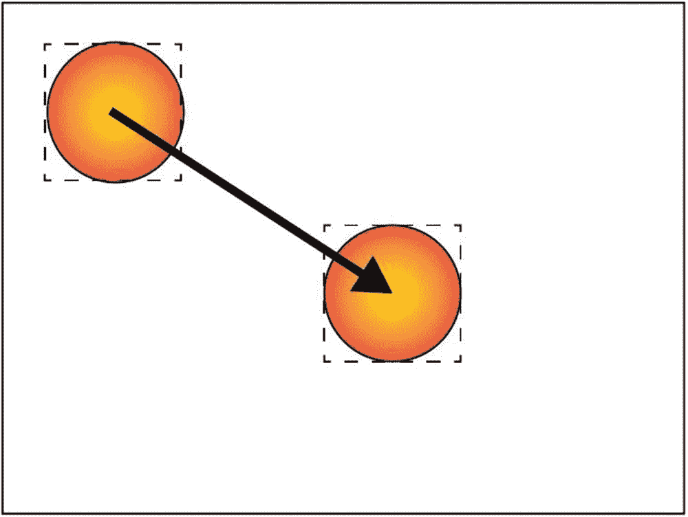

图 8-3

球移动得更远，两个更新矩形

Piu 实际上更进一步。在第一个示例中，球只移动了一小段距离——这段距离导致当前位置与前一个位置重叠——Piu 识别出单个封闭矩形不是最小的可能更新区域；因此(如图 [8-4](#Fig4) 所示)，在这种情况下，它更新*三个*单独的矩形，这避免了不必要地更新许多没有改变的背景像素。

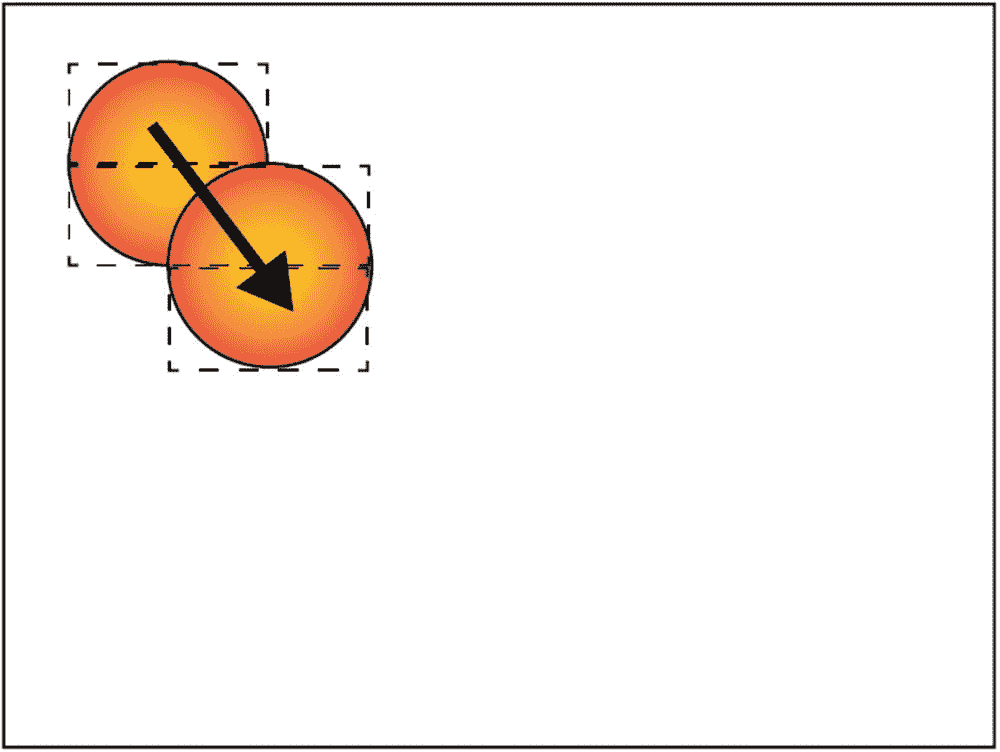

图 8-4

球轻微移动，三个更新矩形

优化单个弹跳球的绘图区域所涉及的计算已经非常复杂，在有多个弹跳球有时会重叠的应用程序中，这些计算甚至会更加复杂。Piu 自动为您计算最小矩形集；这确实需要时间和内存，但是它带来的性能提升是值得的。这是因为渲染性能在很大程度上受到应用程序像素速率的限制，Piu 会自动最小化代码的像素速率。

## 像素

每个显示器都包含像素，但并非所有显示器都有相同种类的像素。像素有不同的大小和颜色。这种情况一直存在，但很容易忘记，因为几乎所有现代计算机和移动设备都支持相同的 24 位彩色像素格式。像嵌入式开发的许多领域一样，像素格式的多样性在一定程度上是试图保持低硬件成本的结果。能够显示颜色的显示器往往价格更高，但除了价格之外，还有其他因素会影响所使用的像素格式。例如，ePaper 显示器(通常指的是开发它的公司的名字，E Ink)使用的技术只能显示几种颜色，通常是黑色、白色和一些灰色阴影，不需要存储多种颜色的像素格式。

### 像素格式

大多数显示器支持单一类型的像素。本书大多数示例中使用的 QVGA 彩色显示器使用 16 位彩色像素，其中 5 位用于红色，6 位用于绿色，5 位用于蓝色。你的手机可能有 24 位的彩色像素，红色、绿色和蓝色各有 8 位。虽然这两种像素都足以显示全色用户体验，但 24 位彩色像素能够显示 256 倍多的颜色(16，777，216 对 65，536)。这种差异意味着嵌入式设备上的图像可能没有那么精致，特别是在充满相似颜色的区域，如日落。对于照片来说，这可能是个问题，但对于由微控制器驱动的用户界面来说，如果界面设计考虑到这一限制，这通常不是问题。

除了 16 位颜色，少数显示器仅支持 8 位颜色。这是非常有限的，只允许 256 种颜色。每个像素包含 3 位红色、3 位绿色和 2 位蓝色。使用这种像素类型的显示器可以构建一个合理的用户界面，但在限制范围内仔细选择看起来不错的颜色需要一些工作。在某些情况下，在支持 16 位像素的显示器上使用 8 位彩色像素可能是有益的。这显然不会提高质量，但它确实减少了资源所需的存储空间和渲染图像所需的时间。如果您发现您的项目很难适应可用的存储空间，或者如果渲染性能不是您所需要的，在 16 位显示器上使用 8 位彩色像素可能是一个可行的解决方案。

也有 4 位彩色像素，但用这些很难达到专业的效果，所以这里不讨论。然而，4 位灰度像素——可以显示 14 级灰度加上黑白——非常有用。不能显示颜色的 ePaper 显示器只需要灰色像素；由于大多数 ePaper 显示器只能显示几级灰度，所以 4 位灰度像素就足够了。灰度渲染甚至比彩色渲染更快。您可以在 16 位彩色显示器上使用 4 位灰色像素，以节省更多存储空间。还有 8 位灰度像素，可以显示 254 级灰度加黑白；这些提供了极好的质量，但是对于许多实际目的，4 位灰度渲染在质量上与 8 位灰度像素几乎没有区别。

有些显示器只是黑白的。这些显示器往往体积小、质量低，更多地用于工业物联网产品，而不是消费物联网产品。对于这些显示器来说，1 位像素就足够了；然而，以每像素 1 位的速度渲染是非常困难的。Poco 渲染器不直接支持 1 位像素显示。相反，显示驱动器接收 4 位灰色像素，然后在将图像传输到显示器时将其缩小为 1 位。

### 为像素格式配置主机

在第 [1](01.html) 章中，你学习了如何使用`mcconfig`命令行工具构建一个主机。在命令行上，使用`-p`选项传递目标硬件平台的名称——例如，`-p esp32`来构建 ESP32。对于包含显示器的设备目标，如 Moddable 和 M5Stack 的开发板，会自动为您配置默认像素格式。例如，当你为 Moddable One、Moddable Two 或 M5Stack FIRE 构建时，像素格式设置为`rgb565le`，为 16 位彩色像素；对于带有 ePaper 显示屏的 Moddable Three，它被设置为`gray16`，用于 4 位灰色像素。

16 位像素最常见的显示驱动程序是 ILI9341 驱动程序，它实现了 Moddable 和 M5Stack 开发板中的显示控制器所使用的 MIPI 显示标准。硬件使用 16 位像素，但驱动程序也支持其他像素格式。您可以通过使用`-f`选项在命令行上指定格式来试验不同的像素格式。例如，要使用 4 位灰色像素:

```js
> mcconfig -d -m -p esp32/moddable_two -f gray16

```

以这种方式配置主机时，ILI9341 驱动程序会在将 Poco 渲染的 4 位灰色像素传输到显示器时，将其转换为 16 位彩色像素。但是还有更多的变化在发生:

*   当您更改像素格式时，Poco 渲染器本身会重新编译。在此示例中，对 16 位像素渲染的所有支持都被移除，并替换为对 4 位灰色像素渲染的支持。这是 Poco 使用的一种技术，它在保持代码小的同时仍然支持许多不同的像素格式。

*   Poco 要求某些图形素材以与显示器相同的像素格式存储，这通常要求您以兼容的格式重新创建图形。但是因为这是乏味的、耗时的、容易出错的，`mcconfig`自动调用可修改的 SDK 中的其他工具来将您的素材转换成兼容的格式。这意味着您可以通过指定不同的格式来切换像素格式，这就像重新构建您的项目来尝试不同的格式并权衡利弊一样简单。

ILI9341 驱动程序还支持 8 位彩色和 8 位灰色像素。您可以通过在`-f`命令行选项中分别指定`rgb332`和`gray256`来使用带有`mcconfig`的选项。

如果您发现最适合您产品的像素格式不同于默认格式，您可以在项目清单中指定您的首选格式。这样，您就不需要在每次构建时都记得在命令行中包含它。为此，在清单的`config`部分定义一个`format`属性:

```js
"config": {
    "format": "gray256"
},

```

### 选择显示器的自由

虽然大量可用的像素格式看起来令人困惑，但它在创建产品时为您提供了多种选择。您可以选择最符合质量、成本和尺寸要求的显示器。Poco 能够渲染适合您显示器的像素，因此您不必根据软件堆栈的限制来选择显示器。在下一节中，您将学习如何自动转换项目中的图形资源，以匹配您正在使用的显示器。

## 图形素材

使用 Poco 和 Piu 构建的用户界面由三种不同的元素组成:矩形、位图图像和文本。这就是一切；没有绘制直线、圆、圆角矩形、圆弧、样条曲线或渐变的图形操作。起初，这似乎有点太简单了，您可能会得出结论，用这么少的绘图操作来构建一个现代化的用户界面是不可能的。在接下来的章节中，您将看到如何将这些元素结合起来，以创建一个在廉价微控制器上运行良好的丰富用户体验。这一节重点介绍图形素材，即用于构建用户界面的图像和字体。

### 面具

使用 Poco 和 Piu 构建用户界面时，最常见的资源类型是遮罩。蒙版是灰度图像；你可以把它想象成一个形状。因为蒙版包含灰色像素，而不仅仅是黑色和白色像素，所以它可以具有平滑的边缘。图 [8-5](#Fig5) 显示了一个圆的两个版本，第一个是灰度蒙版，第二个是简单的 1 位蒙版，它们的边缘被放大以示区别；请注意灰度蒙版放大中的灰色边缘。

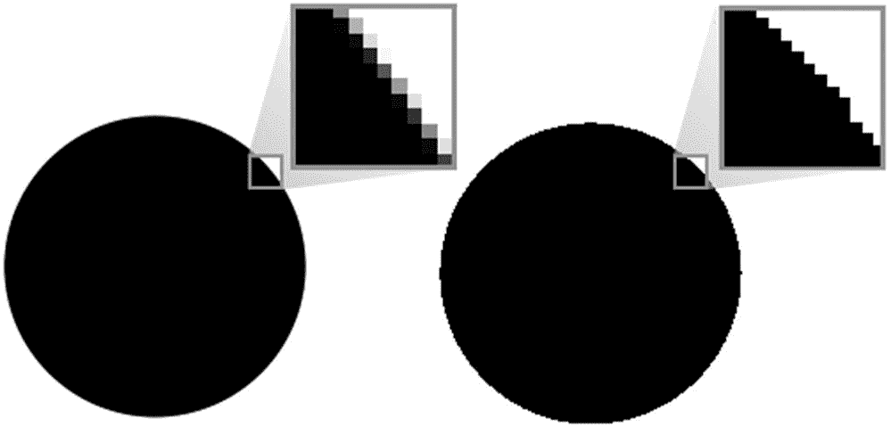

图 8-5

灰度掩码(左)和 1 位掩码(右)

当 Poco 渲染灰度遮罩时，它不会将其绘制为图像。如果是这样，白色像素会隐藏背景，如图 [8-6](#Fig6) 所示。

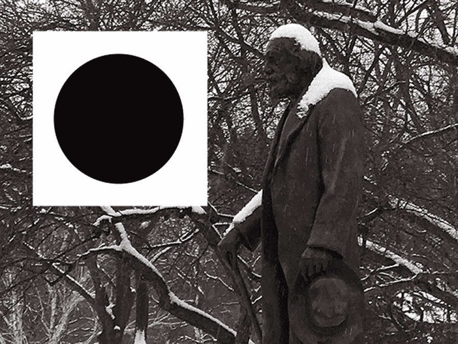

图 8-6

如果绘制为图像，则使用灰度遮罩

相反，Poco 通过将黑色像素视为纯色(完全不透明)，将白色像素视为透明(完全不可见)，并将两者之间的灰度级别视为不同的混合级别来渲染遮罩。对应于图 [8-6](#Fig6) 的结果如图 [8-7](#Fig7) 所示，其中黑色圆圈叠加在背景上(通过透明白色像素可见)，圆圈的灰色边缘与背景融合，消除了任何锯齿边缘。

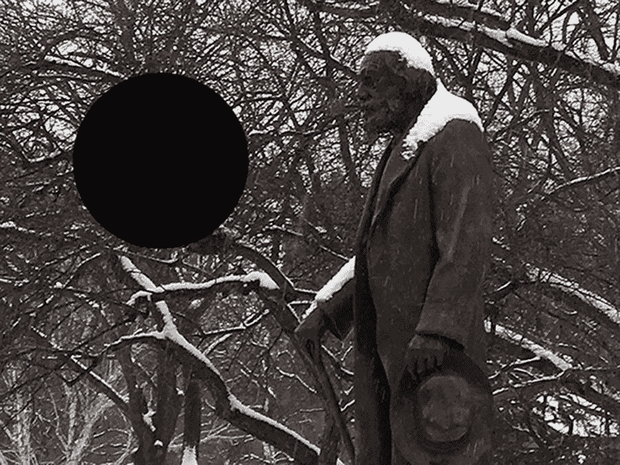

图 8-7

绘制为蒙版的灰度蒙版

你可能想在你的用户界面中包含颜色，在这种情况下，灰色图像似乎不是一个显而易见的解决方案。但是，Poco 允许您以任何颜色绘制灰度蒙版。黑色像素被您选择的颜色替换，灰色像素将该颜色与背景混合。图 [8-8](#Fig8) 显示了用蓝色绘制的相同圆形遮罩(在本书的印刷版本中显示为灰色)。

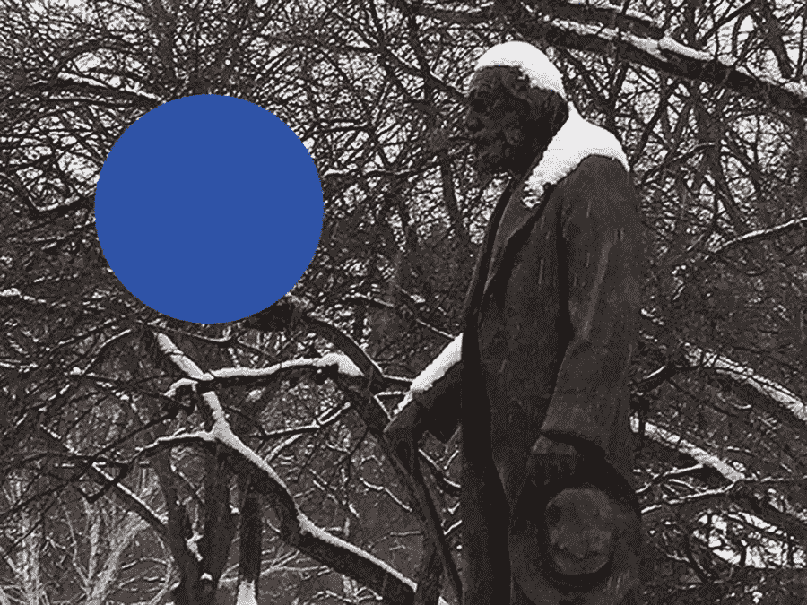

图 8-8

绘制为彩色蒙版的灰度蒙版

以各种颜色绘制单个灰度遮罩的能力非常强大，因为它使单个图形资源能够以不同的颜色显示。这减少了所需资源的数量，节省了项目中的存储空间。

图 [8-9](#Fig9) 显示了一些用作用户界面元素的灰度遮罩示例。

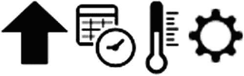

图 8-9

用作用户界面元素的灰度遮罩

正如您在“像素格式”一节中所知道的，Poco 定义了两种不同的灰度像素:4 位和 8 位。所有 Poco 遮罩都是 4 位灰度，这允许最小的存储大小和最快的渲染，而不会牺牲太多质量。

#### 将遮罩添加到项目中

您可以将遮罩作为 PNG 文件添加到项目中，PNG 文件是桌面应用程序、移动应用程序和用户界面元素网页使用的同一种图像文件。能够在您的项目中使用 PNG 文件是很方便的；但是，ESP32 和 ESP8266 不能有效地处理 PNG 图像，因为解码 PNG 图像需要内存和 CPU 开销。相反，构建工具将您的 PNG 文件转换成可以在这些微控制器上有效处理的格式。由于这种自动转换，您没有必要理解这些非标准图像格式的细节(尽管细节可以在可修改的 SDK 中找到)。

要在您的项目中包含一个 PNG 蒙版图像，将其添加到您的项目清单文件的`resources`部分，如清单 [8-1](#PC3) 所示。

```js
"resources": {
    "*-mask": [
        "./assets/arrow",
        "./assets/thermometer"
    ]
}

Listing 8-1.

```

请记住，清单中指定的资源不包括文件扩展名。在清单 [8-1](#PC3) 的例子中，图像文件的文件名为`arrow.png`和`thermometer.png`。

#### 掩模压缩

灰度掩模足够小，可以用在针对微控制器的产品中。之前在图 [8-9](#Fig9) 中显示的温度计图像存储为 4 位灰度掩模时为 2458 字节。尽管如此，如果再小一点就好了。Poco 有一个解决方案:它包括一个专门针对 4 位灰度图像的压缩算法。该算法针对微控制器进行了优化，因此不需要太多的 CPU 时间或额外的内存。

对于温度计图像，压缩算法将数据大小减少到 813 字节，比原始未压缩版本小 67%。压缩率因图像而异。对于包含较大连续黑白区域的图像，Poco 蒙版压缩率会有所提高。

#### 未压缩的遮罩

在绘制用户界面的遮罩时，将几个相关元素组合在一个图形文件中通常会很方便。许多图形设计师更喜欢这种工作方式，因为它使修改蒙版更快更容易。因为 Poco 支持裁剪渲染，所以它在绘制时只能使用遮罩的一部分，所以您可以选择以这种方式组织图形文件。图 [8-10](#Fig10) 中的遮罩显示了 Wi-Fi 连接的几种不同状态，它们被组合在一个图形文件中。


图 8-10

多个遮罩组合在一个图形文件中

如前所述，您可以压缩这些组合的遮罩图像。但是，对包含多个图像的遮罩使用压缩会有性能损失。这是因为要渲染压缩图像的一部分，解压缩器必须跳过目标区域上方和左侧的图像部分，这需要额外的时间。对于某些项目，压缩带来的存储大小减少的好处比性能降低更重要。您可以通过将掩码添加到清单的`*-alpha`部分而不是`*-mask`部分来保持其不被压缩(参见清单 [8-2](#PC4) )。当然，您的清单可能同时包含`*-mask`和`*-alpha`，以压缩一些遮罩，而不压缩其他遮罩。

```js
"resources": {
    "*-alpha": [
        "./assets/wifi-states"
    ]
}

Listing 8-2.

```

### 字体

字体是嵌入式开发中一个独特的挑战。你的电脑和手机有几十种，甚至几百种内置字体。这些字体中的一种或多种包括 Unicode 标准中定义的几乎所有字符，这意味着没有您的设备不能显示的文本字符。在微控制器上，没有内置字体；项目中唯一可用的字体是您包含在项目中的字体。

有许多字体可供您的计算机使用，如果能够在您的物联网产品中使用这些相同的字体，将会非常方便。您电脑上的大多数字体(如果不是全部的话)都是以基于由 Apple 创建的 TrueType 可缩放字体技术的格式存储的(OpenType 字体格式是 TrueType 的衍生)。在微控制器上渲染这些字体是可能的，但具有挑战性，渲染所需的代码、内存和 CPU 资源的数量使其在许多项目中不切实际。本书中的示例使用了一种更简单的字体格式，一种高质量的位图字体。ESP32 上提供了 TrueType 兼容的渲染器，本节将对此进行介绍。

#### 将 TrueType 字体转换为位图字体

尽管在所有项目中使用 TrueType 字体可能不切实际，但您仍然可以在您的计算机上使用这些字体，方法是使用您的计算机将 TrueType 字体转换为微控制器可以轻松处理的格式。TrueType 字体以特定的磅值呈现在位图中，所有字符都存储在一个位图中。位图使用 4 位灰色像素，而不是黑白像素，以保持原始字体的抗锯齿效果。此外，还会生成一个`.fnt`文件，该文件在 Unicode 字符代码和字体位图中的矩形之间进行映射。这种结合了位图图像和地图文件的字体格式被称为 *BMFont* ，意为“位图字体”BMFont 有几种变体；可修改的 SDK 使用二进制 BMFont 格式。图 [8-11](#Fig11) 显示了 16 磅大小的开放 Sans 字体在 BMFont 格式下的样子。

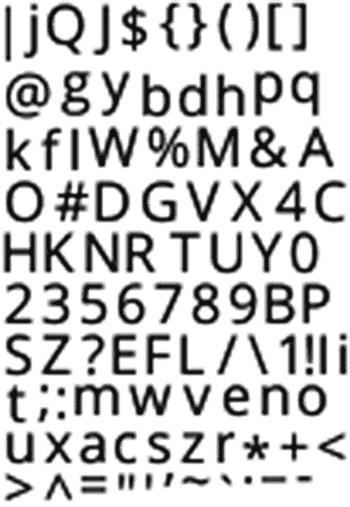

图 8-11

BMFont 格式的字体字符图像

请注意，字符的排列顺序不同于 Unicode 或 ASCII 标准中的顺序。例如，字母 A、B 和 C 不会按顺序出现。相反，字符是按高度排列的，通过最大限度地减少未使用的空白空间，使位图图像尽可能小。

可用于创建这些位图文件的工具不是可修改 SDK 的一部分。71 Squared 的字形设计器很好用。可修改的 SDK 包括一套 BMFont 格式的预建字体，因此您可以开始开发，而无需在工具上进行任何额外投资。

BMFont 格式的每种字体都有两个文件:一个图像文件，通常是 PNG 格式，一个字体映射文件，文件扩展名为`.fnt`。这两个文件应该有相同的名称，不同的文件扩展名，如`OpenSans-Regular-16.png`和`OpenSans-Regular-16.fnt`。要将这些添加到您的项目中，请在您的项目清单中包含该名称，如清单 [8-3](#PC5) 所示。

```js
"resources": {
    "*-mask": [
        "./assets/OpenSans-Regular-16"
    ]
}

Listing 8-3.

```

请注意，`*-mask`部分与用于压缩灰度蒙版的部分相同。以这种方式包含的字体也被压缩；然而，不是压缩整个图像，而是单独压缩每个字符。这使得每个字符能够被直接解压缩，避免了跳过每个字形上方和左侧的像素所需的开销。

压缩的字形与来自`.fnt`文件的数据合并成一个资源。这导致紧凑的字体文件仍然保持优良的质量，并可以有效地渲染。前面的 Open Sans 16-point 字体示例总共仅使用 6228 字节的存储空间来存储压缩字符以及布局和呈现所需的字体度量信息。此外，因为字体使用与灰度蒙版相同的压缩格式存储，所以它们也可以用任何颜色渲染。

BMFont 格式不要求字体为灰度。这种格式很受游戏设计者的欢迎，因为它使他们能够在游戏中包含创造性的、丰富多彩的字体。Poco 和 Piu 支持全色字体。它们不常用在微控制器上，因为它们需要更多的存储空间。如果您想尝试一下，可修改的 SDK 包含一些示例，可以帮助您入门。

#### 使用可缩放字体

BMFont 格式既方便又高效，但是它消除了 TrueType 字体的一个主要优点:将字体缩放到任意大小的能力。如果您的项目使用三种不同大小的相同字体，您需要包括它的三个不同版本，每个版本对应一个点大小。可以在一些更强大的微控制器上直接使用可缩放字体，包括 ESP32。Monotype Imaging 是一家领先的字体和字体技术提供商，它提供了一种针对微控制器优化的可缩放 TrueType 字体的高质量实现。Monotype Spark 可缩放字体渲染器已经与可修改的 SDK 集成，因此可以与 Poco 和 Piu 一起使用。有关更多信息，请联系 Moddable 或 Monotype。

#### 版权字体

对于商业产品，您需要确保您有权使用您产品中包含的任何字体。就像书籍和计算机软件一样，字体可以由它们的创作者拥有版权。幸运的是，在公共领域或在自由和开源软件许可下，有许多优秀的字体可用。谷歌为 Android 创建的 Open Sans 字体就是这样一种字体，在物联网产品的用户界面中工作良好。

### 彩色图像

虽然灰度蒙版是构建用户界面的强大工具，但有时您需要全色图像。Poco 使用未压缩的位图来支持彩色图像。这些位图提供了极好的质量和性能；然而，它们可能非常大，因此通常在微控制器的接口中很少使用。

对于彩色图像，可以使用标准的 JPEG 和 PNG 文件。与灰度遮罩一样，`mcconfig`在构建时将它们转换为构建目标的最佳格式。要在您的项目中包含彩色图像，请将它们添加到清单的`resources`部分的`*-color`部分(参见清单 [8-4](#PC6) )。请注意，`.jpg`或`.png`文件扩展名被省略。

```js
"resources": {
    "*-color": [
        "./quack"
    ]
}

Listing 8-4.

```

全色图像是完全不透明的；它们没有混合或透明区域。图 [8-12](#Fig12) 显示了在一个简单的用户界面中呈现的来自前面清单片段的`quack` JPEG 图像。

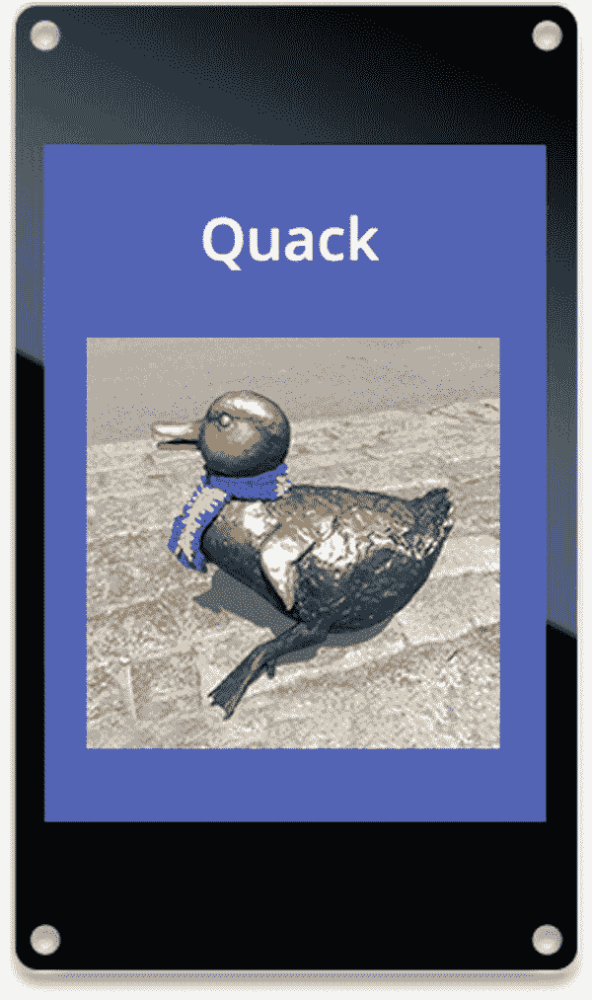

图 8-12

全色图像的渲染

该形状是一个矩形，因为图像中的所有像素都是绘制的。存储在 PNG 文件中的图像可能包含可选的 *alpha 通道。*alpha 通道就像一个灰度蒙版:它指示图像中的哪些像素应该被绘制，哪些应该被跳过，以及哪些应该与背景混合。Alpha 通道通常是在使用 Adobe Photoshop 等工具编辑图像时创建的。Poco 支持渲染 alpha 通道；您通过将图像放入清单的 resources 部分的`*-alpha`部分来表明您想要保留 alpha 通道(参见清单 [8-5](#PC7) )。

```js
"resources": {
    "*-alpha": [
        "./quack-with-alpha"
    ]
}

Listing 8-5.

```

图 [8-13](#Fig13) 显示了结果。鸭子图像与图 [8-12](#Fig12) 中使用的图像相同；但是，增加了一个 alpha 通道来遮盖背景。因此，在渲染图像时，只绘制了鸭子。

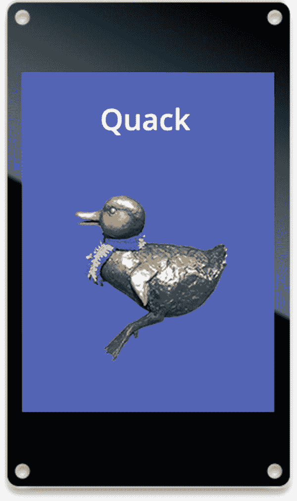

图 8-13

用 alpha 通道渲染全色图像

当您在项目中包含带有 alpha 通道的图像时，构建工具会创建两个单独的图像:全色图像(就像您将图像放入了`*-color`部分一样)和未压缩的 alpha 通道(作为 4 位灰度蒙版)。颜色资源命名为`quack-color.bmp`，压缩后的蒙版资源命名为`quack-alpha.bm4`。图 [8-14](#Fig14) 显示了用于遮蔽鸭子图像绘制的 alpha 通道。

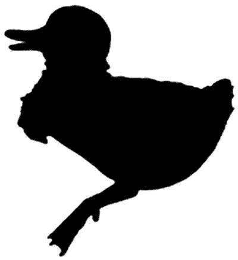

图 8-14

图 [8-13](#Fig13) 中使用的阿尔法通道

当 Poco 和 Piu 渲染图像时，它们同时使用彩色图像和遮罩。您将在接下来的两章中学习如何做到这一点。

## 显示旋转

每个显示器都有一个自然方向，这意味着有一个边缘是“顶部”这个方向由硬件绘制的第一个像素的位置和从那里开始绘制的方向来定义。自然方向由硬件决定，不能更改。不过，为了有效地旋转显示器上的图像，通常需要将屏幕的不同边缘视为顶部。这在自动旋转显示器上的图像以匹配用户手持设备的方向的移动设备上很常见。这种能力也存在于大多数 LCD 电视中，因此用户可以最方便地安装显示器，然后手动调整方向以“正面朝上”显示图像

虽然许多物联网产品不允许用户通过配置或旋转设备来改变方向，但这些产品可能仍然需要旋转显示器，例如，当产品的设计要求横向方向，但显示器的原生方向是纵向模式时，或者当显示器在产品中颠倒安装以节省空间时(这似乎不常见，但确实会发生)。此外，有时硬件设计人员错误地将显示器装反了，为了节省时间，要求软件团队进行补偿。出于这些原因以及更多原因，在 0 度、90 度、180 度和 270 度方向渲染用户界面的能力对于许多物联网产品来说是必要的。

如以下部分所述，旋转显示器有两种不同的方法:适用于所有显示器的软件方法和适用于某些显示器的硬件方法。

### 在软件中旋转

旋转用户界面的最常见技术是将整个界面绘制到屏幕外存储缓冲区中，就好像显示器处于旋转的方向一样。然后，当像素被传输到显示器时，它们被转换以匹配硬件方向。这种方法在低成本的微控制器上是不可行的，因为没有足够的内存在屏幕外缓冲区中存储一个完整的帧。

Poco 采用了一种非常不同的方法:它在构建期间将所有图像素材旋转到所需的方向，这样它们就不需要在运行时旋转。这种旋转与任何所需的像素格式转换同时执行。然后，当嵌入式设备上的应用程序进行绘图调用时，Poco 只需要将绘图坐标旋转到目标方向。完成这两个步骤后，Poco 照常渲染，结果在显示器上旋转显示。这种方法几乎没有可测量的运行时开销——不使用额外的内存，并且只运行少量的额外代码来执行坐标转换——因此它几乎是一个零成本的特性。因为软件旋转完全在 Poco 渲染器中实现，所以它适用于所有显示器。

当使用软件旋转时，您可以通过将`-r`命令行选项改为`mcconfig`来改变方向。支持的旋转值为 0、90、180 和 270。

```js
> mcconfig -d -m -p esp/moddable_one -r 90

```

与像素格式配置一样，您也可以在项目清单中指定软件旋转:

```js
"config": {
    "rotation": 90
}

```

软件轮换有一个明显的限制:轮换在构建时是固定的，因此在运行时不能改变。因此，这种技术适用于物联网产品用户界面需要与显示器的自然方向不同的方向的情况，但不适用于需要响应用户操作(如转动屏幕)的情况。硬件轮换(如果可用)克服了这一限制。

### 硬件旋转

当显示器从微控制器接收像素时，硬件旋转使用显示控制器的功能来旋转图像。使用硬件旋转要求显示控制器和显示驱动程序都支持该功能。对于 MIPI 兼容的显示控制器，ILI9341 驱动程序完全支持硬件旋转。

硬件轮换完全是在运行时执行的，所以在您的构建命令行或项目清单中没有什么需要定义的。事实上，不要在项目中同时使用硬件和软件轮换，这一点很重要；它们不是为协同工作而设计的，所以结果是不可预测的。

使用硬件轮换时，您在运行时设置轮换，而不是在构建时配置它。您使用`screen`全局变量与显示驱动程序通信。对于支持硬件旋转的显示器，`screen`全局有一个`rotation`属性；您可以通过查看是否定义了该属性来检查是否支持硬件旋转。

```js
if (screen.rotation === undefined)
    trace("no hardware rotation\n");
else
    trace("hardware rotation!\n");

```

要更改旋转，请设置`rotation`属性:

```js
screen.rotation = 270;

```

您的代码可以读取`screen.rotation`来检索当前旋转:

```js
trace(`Rotation is now ${screen.rotation}\n`);

```

当硬件旋转改变时，显示不变。在用户看到改变的方向之前，必须重新绘制显示的全部内容。如果您在更改旋转后只更新了屏幕的一部分，用户将看到以原始方向绘制的部分显示和以新方向绘制的其他部分。

M5Stack 目标的主机支持使用 Piu 自动旋转项目的用户界面，以匹配硬件方向。这导致了与移动电话相同的行为，该移动电话具有根据用户如何握持该设备来调整的显示器。该功能之所以成为可能，是因为 M5Stack 内置了一个加速度传感器，可提供当前的设备方向。对于不想使用此功能的 M5Stack 项目，可以在项目清单中禁用它。

```js
"config": {
    "autorotate": false
}

```

## 差不多吧？

在本章中，您已经了解了用于图形的 Poco 渲染引擎和 Piu 用户界面框架，这两者都可以用于构建运行在廉价微控制器(包括 ESP32 和 ESP8266)上的物联网产品的用户界面。Poco 和 Piu 具有相似的图形功能，因为 Piu 使用 Poco 进行渲染。当您开始创建自己的项目时，您必须决定是使用 Poco API、Piu API，还是两者都使用。本节解释了一些不同之处，以帮助您做出选择。

Poco 和 Piu 是本质上不同的 API:

*   Poco 是一个图形 API。您进行函数调用，最终导致部分屏幕被绘制。

*   Piu 是一个面向对象的 API，用于构建用户体验。您可以使用 Piu 创建用户界面对象，如文本标签、按钮和图像。将这些对象添加到应用程序会导致部分屏幕被绘制；您不需要自己调用绘图函数。

Piu 会为您处理许多细节，因此您可能会编写较少的代码；例如，它调用 Poco 在必要时呈现用户界面对象。因为您告诉 Piu 当前屏幕上所有活动的用户界面对象，所以当您移动、更改、显示或隐藏一个元素时，Piu 能够最小化所需的绘图量。例如，使用 Piu，您只需一行代码就可以使用遮罩来更改用户界面元素的颜色；Piu 确定屏幕上哪些像素必须更新，并自动绘制改变的元素以及与其相交的任何对象。相比之下，Poco 不了解应用程序的用户界面，因此您必须编写代码来刷新屏幕并最小化更新区域。这样做的代码通常从简单开始，但是随着用户界面变得越来越复杂，维护起来就变得越来越困难。

Piu 使用内存来跟踪活动的用户界面对象，因此比单独使用 Poco 使用更多的内存。当然，如果您不使用 Piu，您的代码必须跟踪活动的用户界面对象本身，这也需要内存。

Piu 内置了对触摸事件的响应支持。事实上，Piu 自动支持多点触控。(可改装一号和可改装二号的显示屏都支持两个触摸点。)作为图形引擎，Poco 专注于画图，不支持触摸输入，所以你的应用必须直接与触摸输入驱动交互；虽然这并不难做到，但是您需要编写和维护更多的代码。

也许使用 Piu 的最大好处是，作为一个框架，它提供了你的项目的基本结构。以下预定义的对象为您的项目提供了一个定义明确、设计良好的组织，由 Piu 本身的高效实现提供支持:

*   `Application`对象维护全局状态，并在整个应用程序生命周期内存在。

*   `Texture`和`Skin`对象组织您的图形资源。

*   `Style`对象使用级联样式表(如 web 上的 CSS)来管理字体、大小和样式。

*   `Container`和`Content`对象定义了用户界面的元素。

*   `Behavior`对象将用于特定目的的事件处理程序组合在一起，例如提供触摸按钮行为。

*   每个对象都实现了一个独特的过渡，或者是整个显示，或者是部分显示。

当您使用 Poco 时，您必须自己设计和实现应用程序结构。如果您的项目用户界面看起来有点类似于移动应用程序、桌面应用程序或网页，使用 Piu 可能是个好主意，因为它是为此而设计和优化的。如果您喜欢编写用户界面框架，或者如果您的用户体验非常不同(例如，一个游戏)，那么直接使用 Poco 可能是正确的选择。

有些项目有标准的用户界面风格，但需要提供部分屏幕的特殊呈现。这方面的一个例子是显示传感器数据实时图表的物联网产品；屏幕上的按钮和标签非常适合 Piu，但是使用 Poco 可以更有效地呈现图形。像这样的项目的解决方案是在屏幕上使用 Piu，为了绘制图形，嵌入一个 Piu `Port`对象，它允许您在 Piu 布局中发出类似于 Poco 的绘制命令。

## 结论

下一章将进一步讨论 Poco 及其图形框架 Commodetto，下一章将讨论 Piu。当您通读这两章时，请考虑您自己项目的需求，以及是高级 Piu 用户界面 API 还是低级 Poco 图形渲染 API 更合适。Poco 和 Piu 使用起来非常不同，因此值得对它们进行试验，以了解哪一个最适合您的需求。