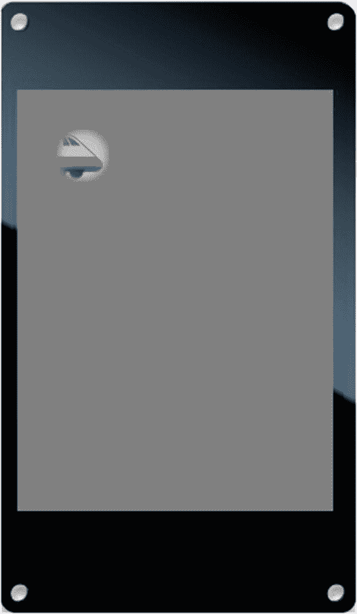

# 九、使用 Poco 绘制图形

Poco 渲染器是本书中所有图形和用户界面代码的核心。正如您在第 [8](08.html) 章中了解到的，Poco 的设计和实施经过优化，可在许多物联网产品中使用的廉价微控制器上提供高质量、高性能的图形。本章通过一系列例子介绍了 Poco API 的所有主要功能。Poco 这个名称是古典音乐中的一个术语，意思是“一点点”，反映了渲染引擎的紧凑大小和范围。

Poco 是 *Commodetto、*的一部分，Commodetto 是一个图形库，它提供位图、来自资源的图形素材实例、屏幕外图形缓冲区、显示驱动程序等等。本章中的一些例子使用了这些 Commodetto 特性。Commodetto 这个名字也是一个来自古典音乐的术语，意思是“悠闲”，反映了图形库的易用性。

## 安装 Poco 主机

您可以按照第 [1](01.html) 章中描述的模式运行本章的所有示例:使用`mcconfig`在您的设备上安装主机，然后使用`mcrun`安装示例应用程序。

所有 Poco 示例都需要使用屏幕，这使得您的`mcconfig`命令行必须为您的开发板指定一个带有屏幕驱动程序的平台。这些示例旨在在分辨率为 240 x 320 的屏幕上运行。以下命令行用于可修改 1、可修改 2 和 M5Stack FIRE:

```js
> mcconfig -d -m -p esp/moddable_one
> mcconfig -d -m -p esp32/moddable_two
> mcconfig -d -m -p esp32/m5stack_fire

```

如果使用试验板和跳线将屏幕连接到开发板，请遵循第 [1](01.html) 章中的说明。为 ESP32 提供的接线与`esp32/moddable_zero`目标一起工作；对于 ESP8266 和`esp/moddable_zero`目标也是如此。

如果你的设备没有屏幕，你可以在可修改的 SDK 提供的桌面模拟器上运行本章的例子。以下命令行适用于 macOS、Windows 和 Linux:

```js
> mcconfig -d -m -p mac
> mcconfig -d -m -p win
> mcconfig -d -m -p lin

```

本章的主机在`$EXAMPLES/ch9-poco/host`目录中。从命令行导航到这个目录，用`mcconfig`安装它。

如果您正在使用桌面模拟器，请确保在安装示例之前将屏幕尺寸更改为 240 x 320。你可以通过从应用程序工具栏的**尺寸**菜单中选择 **240 x 320** 来实现。

## 准备画画

要使用 Poco 渲染器，您需要从`commodetto/Poco`模块导入`Poco`类:

```js
import Poco from "commodetto/Poco";

```

Poco 是一个通用渲染器。它呈现的像素可以发送到屏幕、内存缓冲区、文件或网络。Poco 不知道如何向这些目的地发送像素；相反，它将像素输出到`PixelsOut`类的实例，并且`PixelsOut`的每个子类都知道如何将像素发送到特定的目的地。例如，显示驱动程序是`PixelsOut`的一个子类，它知道如何向屏幕发送像素。`PixelsOut`的另一个子类`BufferOut`，将像素发送到一个内存缓冲区(你将在本章的“高效渲染渐变”一节中看到)。

当您实例化`Poco`时，您为 Poco 提供了一个`PixelsOut`类的实例来调用渲染像素。本章的主持人自动为开发板的显示驱动程序创建一个`PixelsOut`的实例，并将其存储在`screen`全局变量中。要使用屏幕，只需将`screen`传递给`Poco`构造函数。

```js
let poco = new Poco(screen);

```

显示驱动程序的像素格式和显示尺寸在主机清单中配置。`screen`实例有`width`和`height`属性，但是这些不包括软件旋转的影响。相反，在使用 Poco 时，使用`Poco`实例的`width`和`height`属性来获取应用了任何旋转调整(硬件或软件)的显示边界。

```js
trace(`Display width is ${poco.width} pixels.`);
trace(`Display height is ${poco.height} pixels.`);

```

正如在第 [8](08.html) 章中提到的，Poco 是一个保留模式渲染器，这意味着它不是立即执行绘图命令，而是建立一个绘图操作列表来一次渲染所有内容。这个显示列表需要内存。默认显示列表是 1，024 字节。如果图形溢出了显示列表分配，则需要增加显示列表分配。如果您的项目没有使用所有默认的显示列表分配，您可以减少它以释放内存供其他用途。以下示例将显示列表调整为 4 KB:

```js
let poco = new Poco(screen, {displayListLength: 4096});

```

您可以通过查看`xsbug`中仪表板的“Poco display list used”行来监控您的项目使用了多少显示列表(参见图 [9-1](#Fig1) )。


图 9-1

在`xsbug`仪表板中使用的监控显示列表

Poco 还为渲染分配内存。默认渲染缓冲区是两条硬件扫描线。一条硬件扫描线的宽度从`screen.width`开始。如果你的产品内存非常紧张，你可以减少到一条扫描线，尽管不能更小。

```js
let poco = new Poco(screen, {pixels: screen.width});

```

当 Poco 一次渲染几条扫描线时，它能够更快地渲染。下面的代码将渲染缓冲区增加到八条完整的扫描线，同时将显示列表设置为 2 KB。

```js
let poco = new Poco(screen,
          {displayListLength: 2048, pixels: screen.width * 8});

```

作为优化，Poco 共享为显示列表和渲染缓冲区分配的内存。如果正在渲染的帧的显示列表没有完全填满，Poco 会在渲染缓冲区中包含那些未使用的字节，这通常会使渲染速度稍快一些。

Poco 提供的三种基本绘图操作是绘制矩形、位图和文本。正如在第 8 章中提到的，这听起来可能不多，但是你可以结合这些元素来创造丰富的用户体验。下一节将详细介绍它们。

## 绘制矩形

绘制矩形是 Poco 提供的三种基本绘制操作中最简单的一种。在介绍第一个绘图操作时，本节还介绍了一些使用 Poco 绘图的基础知识。

### 填满屏幕

`$EXAMPLES/ch9-poco/rectangle`示例简单地用纯色填充整个屏幕。代码如清单 [9-1](#PC9) 所示。

```js
let poco = new Poco(screen);
let white = poco.makeColor(255, 255, 255);
poco.begin();
    poco.fillRectangle(white, 0, 0, poco.width, poco.height);
poco.end();

Listing 9-1.

```

第一行调用`Poco`构造函数来创建`Poco`的实例。该实例将渲染像素传送给`screen`。这一步对于本章中的所有示例都是通用的，因此将从这里显示的其余示例中省略。

让我们依次看看本例中调用的每个方法:

1.  `poco.makeColor`的三个参数接收红色、绿色和蓝色分量，每个分量的范围从 0(无)到 255(全)。这里指定的颜色是白色，所以红色、绿色和蓝色分量都是 255。`makeColor`方法将这三个值组合成一个值，这个值最适合呈现给目的地(本例中为`screen`)。根据目的地，Poco 使用不同的算法从颜色分量创建颜色值。因此，您应该只将由`makeColor`返回的值传递给创建它的同一个`Poco`实例。

2.  对`poco.begin`的调用告诉 Poco 你开始渲染一个新的帧。在此之后发生的所有绘图操作都将添加到框架的显示列表中。

3.  调用`poco.fillRectangle`向显示列表添加一个命令来绘制一个全屏白色矩形。颜色是第一个参数，接着是 *x* 和 *y* 坐标，然后是宽度和高度。坐标平面将(0，0)放在屏幕的左上角，高度和宽度向下和向右移动。

4.  对`poco.end`的调用告诉 Poco 您已经完成了对该帧的绘制操作。Poco 然后渲染像素，并发送给`screen`；这可能需要一些时间，取决于显示器的大小、微控制器的速度以及渲染帧的难度。在可修改的一个或可修改的两个上，它很快完成。

Important

Poco 不会自动用颜色填充背景，因为这会降低渲染性能。这意味着您的代码必须绘制到帧中的每个像素。如果不为像素指定颜色，Poco 会输出未定义的颜色。确保您的代码用一种颜色填充背景，如本例所示，或者确保您进行的绘图调用组合覆盖每个像素。

### 更新部分屏幕

当您调用`begin`方法时，您可以选择指定要更新的屏幕区域。您可能还记得，更新屏幕的较小部分是实现更高帧速率的一种技术。

下面的示例用红色填充 20 x 20 像素的正方形；显示器上的其他像素保持不变。如果将这段代码添加到前面的`rectangle`示例中，屏幕将是白色的，除了左上角的一个红色小方块。

```js
let red = poco.makeColor(255, 0, 0);
poco.begin(0, 0, 20, 20);
    poco.fillRectangle(red, 0, 0, 20, 20);
poco.end();

```

在这里，对`begin`的调用定义了要绘制的区域——称为*更新区域—* ,即显示屏左上角的 20 x 20 的正方形。仅绘制更新区域中的像素，因此更新区域外的白色像素保持不变。当您不带参数调用`begin`时，就像在`rectangle`的例子中，更新区域是整个屏幕。在这个例子中，对`fillRectangle`的调用使用了与对`begin`的调用相同的坐标和尺寸，用红色像素填充了整个更新区域。

如前所述，`begin`和`end`之间的代码必须进行覆盖每个像素的绘制调用，以生成正确的结果——但是如果代码在对`begin`的调用中指定的区域之外绘制，会发生什么呢？考虑下面的例子，它用指定全屏的参数调用`fillRectangle`:

```js
let red = poco.makeColor(255, 0, 0);
poco.begin(0, 0, 20, 20);
    poco.fillRectangle(red, 0, 0, poco.width, poco.height);
poco.end();

```

此示例产生的结果与前面的示例完全相同。Poco 没有响应`fillRectangle`的全屏绘制请求，而是将`fillRectangle`的输出限制在对`begin`的调用中指定的更新区域。这种方法对于许多呈现情况都很方便，尤其是对于动画，因为它使您能够限制要更新的区域，而无需更改代码来将其绘制限制在更新区域。

### 绘制随机矩形

一个经典的计算机图形演示是在随机位置连续渲染随机大小的随机彩色矩形。`$EXAMPLES/ch9-poco/random-rectangles`示例正是这样做的，通过在对 Poco 的`begin`方法的调用中指定坐标，将绘制限制到当前正在绘制的矩形。如果你运行这个例子，你会看到如图 [9-2](#Fig2) 所示的动画版本。


图 9-2

从`random-rectangles`动画渲染

第一步是实例化`Poco`并清空屏幕:

```js
let black = poco.makeColor(0, 0, 0);
poco.begin();
    poco.fillRectangle(black, 0, 0, poco.width, poco.height);
poco.end();

```

接下来，一个重复计时器(列表 [9-2](#PC13) )被安排以每秒 60 帧的速度运行。当计时器触发时，随机坐标和矩形尺寸连同随机颜色一起生成。`begin`方法将绘制限制在矩形区域。

```js
Timer.repeat(function() {
    let x = Math.random() * poco.width;
    let y = Math.random() * poco.height;
    let width = (Math.random() * 50) + 5;
    let height = (Math.random() * 50) + 5;
    let color = poco.makeColor(255 * Math.random(),
                     255 * Math.random(), 255 * Math.random());
    poco.begin(x, y, width, height);
        poco.fillRectangle(color, 0, 0, poco.width,
                           poco.height);
    poco.end();
}, 16);

Listing 9-2.

```

随机值都是浮点的，因为对`Math.random`的调用返回一个从 0 到 1 的数。所有 Poco 函数都期望坐标的整数值，因此`makeColor`和`begin`自动将提供的浮点数四舍五入为最接近的整数。在第 [11 章](11.html)中，你将学习如何添加你自己的随机整数函数，通过消除这些浮点运算来提高性能。

### 绘制混合矩形

到目前为止绘制的矩形都是实心的:像素是完全不透明的，完全遮住了后面的像素。混合矩形将单一颜色与其后面的像素结合在一起，产生了一种如同戴着有色眼镜一样的效果。混合矩形在用户界面中用于提供分层效果和绘制阴影。

要绘制一个混合矩形，使用`blendRectangle`方法。参数与`fillRectangle`类似，增加了混合级别作为第二个参数。混合级别是一个从 0 到 255 的数字，其中 0 表示完全透明(完全不可见)，255 表示完全不透明。下面的线条以 128 (50%)的混合级别在整个屏幕上混合红色。像所有其他绘图操作一样，这必须发生在调用`begin`和`end`之间。

```js
poco.blendRectangle(red, 128, 0, 0, poco.width, poco.height);

```

如果你给`blendRectangle`一个 0 的混合级别，它会完全忽略绘制操作，甚至不会添加一个条目到显示列表。如果您传递的混合级别为 255，`blendRectangle`的行为与`fillRectangle`完全一样。

为了探究混合矩形的外观及其渲染性能，`$EXAMPLES/ch9-poco/blended-rectangle`示例制作了一个混合矩形的动画。图 [9-3](#Fig3) 显示了混合矩形在屏幕上几个位置的图像。


图 9-3

来自`blended-rectangle`动画的渲染图

动画的背景由四个彩色条组成—白色、红色、绿色和蓝色。这些条由`drawBars`辅助函数绘制，如清单 [9-3](#PC15) 所示。

```js
function drawBars(poco) {
    let w = poco.width;
    let h = poco.height / 4;
    poco.fillRectangle(poco.makeColor(255, 255, 255),
                       0, 0, w, h);
    poco.fillRectangle(poco.makeColor(255, 0, 0),
                       0, h, w, h);
    poco.fillRectangle(poco.makeColor(0, 255, 0),
                       0, h * 2, w, h);
    poco.fillRectangle(poco.makeColor(0, 0, 255),
                       0, h * 3, w, h);
}

Listing 9-3.

```

当示例开始时，它通过绘制彩色条覆盖整个屏幕。请注意，`drawBars`并不是以一次调用`fillRectangle`来用纯色填充整个屏幕开始的，而是绘制了四个独立的条带，它们组合起来覆盖了整个屏幕区域。

```js
poco.begin();
    drawBars(poco);
poco.end();

```

接下来，定义变量来控制混合黑盒的动画，该黑盒从屏幕的顶部中心下降到底部(参见清单 [9-4](#PC17) )。

```js
let boxSize = 30;
let boxBlend = 64;
let boxStep = 2;
let boxColor = poco.makeColor(0, 0, 0);
let x = (poco.width - boxSize) / 2, y = 0;

Listing 9-4.

```

以像素为单位的框的大小由`boxSize`定义。混合水平是 64 (25%)。在动画的每一帧上，盒子步进两个像素，如`boxStep`所定义的。`boxColor`变量定义了要用黑色绘制的盒子。最后，盒子左上角的初始坐标被设置在`x`和`y`变量中。

盒子的运动通过一个重复的计时器来激活，如清单 [9-5](#PC18) 所示。对`begin`的调用指定了一个包含盒子的当前和先前位置的绘图区域，确保在一次操作中完全擦除先前位置并完全绘制新位置。对`drawBars`的调用指定了填充屏幕的坐标，但是这些坐标仅限于传递给`begin`的更新区域。定时器回调函数结束时， *y* 坐标增加`boxStep`。一旦盒子滑离屏幕底部，y 坐标将被重置为 0，以继续从屏幕顶部开始制作动画。

```js
Timer.repeat(function() {
    poco.begin(x, y - boxStep, boxSize, boxSize + boxStep * 2);
        drawBars(poco);
        poco.blendRectangle(boxColor, boxBlend, x, y, boxSize,
                            boxSize);
    poco.end();

    y += boxStep;
    if (y >= poco.height)
        y = 0;
}, 16);

Listing 9-5.

```

该动画在 ESP32 和 ESP8266 上以每秒 60 帧的速度流畅运行。这是因为代码优化了绘图区域，因此微控制器每秒仅向显示器发送约 60，000 像素，或不到一个完整的帧。这些像素的渲染和传输分布在 60 个帧中。与渲染全帧相比，这将渲染和传输的像素数量减少了 98.6%。通过更改控制动画的变量进行实验，以查看更改长方体大小、混合级别和长方体颜色的效果。

当运行这个示例时，当盒子返回到顶部时，您可能会注意到在屏幕底部有一个小的盒子假象。可以修改代码来消除工件，但是这样做会使代码更加复杂。这是 Piu 自动处理的细节之一，您将在第 [10](10.html) 章中看到。

## 绘制位图

绘制位图是 Poco 提供的第二个基本绘制操作。它用于遮罩位图和图像位图。因为有这么多不同种类的位图，而且在构建用户界面时位图有这么多的用途，所以有几个不同的函数来绘制位图。本节向您介绍一些最常用的函数。

### 绘画蒙版

正如您在第 [8](08.html) 章中了解到的，掩码是微控制器构建用户界面时最常用的位图类型。原因有很多:它们提供了出色的质量，因为它们支持抗锯齿，它们可以用不同的颜色渲染，它们可以快速渲染，并且它们可以被压缩以最小化存储需求。

掩码存储在资源中。您可以通过将遮罩图像包含在项目清单中来选择要在项目中使用的遮罩图像，如清单 [9-6](#PC19) 所示(正如您在第 [8](08.html) 章的“向项目添加遮罩”一节中所学)。

```js
"resources": {
    "*-mask": [
        "./assets/mask"
    ]
}

Listing 9-6.

```

要使用蒙版位图，您必须首先访问存储它的资源。资源只是数据；使用 Poco API 渲染遮罩需要 Poco 位图对象。Commodetto 提供了从资源数据创建 Poco 对象的函数。

要从压缩蒙版实例化一个位图对象，使用 Commodetto 的`parseRLE`函数。(“RLE”代表“游程编码”，用于压缩掩码的算法。)下面的代码检索资源并使用`parseRLE`创建位图对象:

```js
import parseRLE from "commodetto/parseRLE";

let mask = parseRLE(new Resource("mask-alpha.bm4"));

```

在这个小例子中，有一些重要的细节需要理解:

*   正如您在第 [5](05.html) 章中看到的，`Resource`构造函数引用闪存中的资源数据，而不是将其加载到 RAM 中。`parseRLE`函数还引用数据，而不是将数据从闪存复制到 RAM 然而，`parseRLE`确实为引用该数据的 Poco 位图对象分配了少量的 RAM。

*   注意，加载资源的路径是`mask-alpha.bm4`，而不是`mask.png`。记住，在构建时运行的工具将 PNG 文件转换成微控制器的优化格式，这些工具将优化的图像数据放入`bm4`类型的文件中。因为图像被用作 alpha 通道，所以名称后会附加`-alpha`。因此，运行在微控制器上的代码需要加载不同于原始名称的数据。(Piu 会自动为您使用正确的名称和分机。)

一旦有了蒙版的位图对象，就可以通过调用`drawGray`方法来绘制蒙版:

```js
poco.drawGray(mask, red, 10, 20);

```

第一个参数是遮罩，第二个参数是要应用的颜色，最后两个参数是 *x* 和 *y* 坐标。请注意，您没有指定尺寸；Poco 总是以原始大小渲染位图，而不应用任何缩放。这样做是因为高质量的缩放会使用更多的 CPU 时间，并增加 Poco 中的渲染代码量。

由`parseRLE`返回的蒙版位图对象具有`width`和`height`属性，以像素为单位给出位图的尺寸。当您更改图形资源的尺寸时，通过使绘图自动适应，这些在您的绘图中会很有用。例如，下面的代码在蒙版后面的区域绘制了一个蓝色矩形，因此蒙版没有绘制的任何像素都是蓝色的，并且蒙版中具有透明度的任何像素都与蓝色背景混合。蓝色背景矩形的大小总是与蒙版的大小精确匹配。

```js
poco.fillRectangle(blue, 10, 20, mask.width, mask.height);
poco.drawGray(mask, red, 10, 20);

```

#### 使用未压缩的遮罩

从第 8 章[到](08.html)你知道，只画一个压缩蒙版的子集会有一些低效，因为解压缩器必须跳过你想要画的图像上面和左边的部分。您可以使用未压缩的遮罩。为此，将掩码图像放在清单资源的`*-alpha`部分(而不是`*-mask`部分),使其以未压缩的形式存储。然后，不使用`parseRLE`来加载它，而是使用资源扩展为`.bmp`的`parseBMP`。

```js
import parseBMP from "commodetto/parseBMP";

let mask = parseBMP(new Resource("mask-alpha.bmp"));

```

在压缩和未压缩遮罩之间切换时，请记住执行以下操作:

*   将资源放在正确的部分:`*-alpha`表示未压缩，`*-mask`表示压缩。

*   使用正确的加载函数实例化位图:`parseBMP`表示未压缩，`parseRLE`表示压缩。

*   在资源名中使用正确的扩展名:`.bmp`表示未压缩，而`.bm4`表示压缩。

一旦你有了位图，你就可以使用`drawGray`来渲染蒙版，不管它们是压缩的还是未压缩的。

#### 绘制遮罩的一部分

图 [9-4](#Fig4) (你在第 [8](08.html) 章中第一次看到的)中的图像是一张未压缩的蒙版图像，其中包含描绘几种不同 Wi-Fi 状态的图标。


图 9-4

Wi-Fi 图标条

这个图像的一个明显用途是绘制一个反映当前 Wi-Fi 状态的图标。您的应用程序将希望一次只绘制一个图标，以反映当前状态。如前一节所述，出于效率的原因，组合不同状态的图像不应被压缩。

要仅绘制位图的一部分，您需要指定一个*源矩形*，即要使用的位图区域。在`$EXAMPLES/ch9-poco/wifi-icons`示例中，源矩形的 *x* 和 *y* 坐标、宽度和高度作为绘图坐标后的可选参数传递给`drawGray`。每个单独的状态图标为 27 像素见方。来自`wifi-icons`示例的以下代码绘制了四个状态图标，如图 [9-5](#Fig5) 所示:


图 9-5

从 Wi-Fi 图标条创建的图标

```js
poco.drawGray(mask, black, 10, 20, 0, 0, 27, 27);    // top left
poco.drawGray(mask, black, 37, 20, 0, 27, 27, 27);   // bottom left
poco.drawGray(mask, black, 10, 47, 112, 0, 27, 27);  // top right
poco.drawGray(mask, black, 37, 47, 112, 27, 27, 27); // bottom right

```

#### 淡入淡出遮罩

淡入或淡出图像是用户界面中常见的过渡。`drawGray`方法有一个将蒙版与背景像素混合的选项。这与混合矩形的想法是一样的，但是使用遮罩可以混合任何形状。`$EXAMPLES/ch9-poco/fade-mask`示例淡入淡出一个音量图标，如图 [9-6](#Fig6) 所示。


图 9-6

来自`fade-mask`动画的渲染图

混合级别在`drawGray`的可选第九个参数中指定。与`blendRectangle`中一样，混合级别是一个从 0 到 255 的数字，其中 0 表示完全透明，255 表示完全不透明。

清单 [9-7](#PC25) 显示了来自`fade-mask`示例的代码，它将遮罩资源从透明渐变为不透明。与`blended-rectangle`示例中相同的`drawBars`函数(列表 [9-3](#PC15) )在背景上绘制蒙版。

```js
let mask = parseRLE(new Resource("mask-alpha.bm4"));
let maskBlend = 0;
let blendStep = 4;
let maskColor = poco.makeColor(0, 0, 255);
Timer.repeat(function() {
    let y = (poco.height / 4) - (mask.height / 2);
    poco.begin(30, y, mask.width, mask.height);
        drawBars(poco);
        poco.drawGray(mask, maskColor, 30, y,
                     0, 0, mask.width, mask.height, maskBlend);
    poco.end();

    maskBlend += blendStep;
    if (maskBlend > 255)
        maskBlend = 0;
}, 16);

Listing 9-7.

```

请注意，要使用混合级别，您还必须提供源矩形，即使是在绘制整个蒙版时。位图矩形的尺寸—在本例中为`mask.width`和`mask.height`—用于源矩形；这确保了当素材的维度改变时，代码不需要改变。

### 绘制彩色图像

您可以使用 JPEG 和 PNG 文件将彩色图像添加到项目中。构建工具将它们转换为未压缩的位图，以便在设备上呈现，因为在微控制器上使用 JPEG 和 PNG 压缩格式来构建高性能用户界面通常是不切实际的。位图存储在 BMP 文件中(扩展名为`.bmp`),因为没有压缩，所以可能会很大。例如，对于使用 16 位像素的显示器，40 像素见方的图像占用 3200 字节的存储空间。

如前所述，使用`parseBMP`函数为 BMP 图像创建 Poco 位图，并使用`drawBitmap`方法绘制它，将绘制图像的位置的 *x* 和 *y* 坐标作为参数传递。

```js
let image = parseBMP(new Resource("quack-color.bmp"));
poco.drawBitmap(image, 30, 40);

```

与`drawGray`一样，通过指定源矩形，您可以选择只绘制图像的一部分。以下示例仅绘制图像的左上象限:

```js
poco.drawBitmap(image, 30, 40, 0, 0,
                image.width / 2, image.height / 2);

```

### 绘制 JPEG 图像

由于它们的内存和 CPU 需求，压缩的 JPEG 图像不是在微控制器上存储图像的好的通用方式；但是，当您需要在相对较小的空间内存储大量图像时，它们非常有用，例如，幻灯片放映或在用户界面中使用的图像集合。Commodetto 包括一个 JPEG 解压缩器，您可以与 Poco 一起使用，在您的项目中绘制 JPEG 图像。本节解释了两种不同的方法。

#### 在资源中存储 JPEG 数据

如您所知，构建工具会自动将清单中的图像转换为 BMP 文件。如果您想保持 JPEG 文件的原始压缩格式，请将 JPEG 图像放在清单的`data`部分，而不是`resources`部分(参见清单 [9-8](#PC28) )。`data`部分的内容总是被复制而没有任何转换。

```js
"data": {
    "*": [
        "./piano"
    ]
}

Listing 9-8.

```

下一节介绍的绘制 JPEG 图像的方法与软件显示旋转不兼容。这是因为软件旋转依赖于在构建时旋转映像，这里清单告诉构建工具不要转换映像。这些绘制 JPEG 图像的技术仅在您使用硬件旋转或软件旋转为 0 度时有效。

#### 从内存中绘制 JPEG 图像

在电脑和手机上，JPEG 图像通常会被解压缩为屏幕外位图；然后，当需要 JPEG 图像时，绘制位图。这种方法提供了出色的渲染性能，因为解压缩 JPEG 图像的复杂操作只发生一次。但是，存储解压缩的 JPEG 图像会占用大量内存。因此，这种方法通常只适用于相对较小图像的微控制器。

以下示例使用`loadJPEG`函数将包含 JPEG 数据的资源解压缩为 Poco 位图。一旦图像在位图中，您使用`drawBitmap`来渲染它，如前所述。

```js
import loadJPEG from "commodetto/loadJPEG";

let piano = loadJPEG(new Resource("piano.jpg"));
poco.drawBitmap(piano, 0, 0);

```

对`loadJPEG`的调用需要一些时间来完成，因为解压缩 JPEG 图像对于微控制器来说是一个相对困难的操作。该时间因图像大小、压缩级别和微控制器性能而异。

#### 在解压缩过程中绘制 JPEG 图像

如果您没有足够的内存来保存完整的解压缩 JPEG 图像，您仍然可以显示图像，方法是在解压缩时按块显示图像。这个例子演示了如何将一个全屏(240 x 320)的 JPEG 图像直接解压缩到屏幕上。当你运行这个例子时，你会看到如图 [9-7](#Fig7) 所示的屏幕。


图 9-7

来自`draw-jpeg`示例的 JPEG 图像

首先使用`JPEG`类为 JPEG 图像创建一个 Poco 位图:

```js
import JPEG from "commodetto/readJPEG";
let jpeg = new JPEG(new Resource("harvard.jpg"));

```

JPEG 解压缩程序总是一次解码一个块。块的大小因 JPEG 图像的压缩方式而异，介于 8 x 8 和 16 x 16 像素之间。随着块被解压缩，您的代码可以将它们直接绘制到屏幕上。

清单 [9-9](#PC31) 显示了来自`draw-jpeg`示例的代码，它将 JPEG 图像解压缩到屏幕上。`read`方法解压缩图像的一个块，并将其作为 Poco 位图返回。位图对象包括提供 JPEG 图像中块的坐标的`x`和`y`属性，以及提供块的尺寸的`width`和`height`属性。当有更多的块要显示时，`JPEG`类的`ready`属性返回`true`，当所有的块都被解码后返回`false`。

```js
while (jpeg.ready) {
    let block = jpeg.read();
    poco.begin(block.x, block.y, block.width, block.height);
        poco.drawBitmap(block, block.x, block.y);
    poco.end();
}

Listing 9-9.

```

### 用彩色图像填充

用纹理填充屏幕区域可以创建比纯色更有趣的用户界面。`$EXAMPLES/ch9-poco/pattern-fill`示例演示了如何平铺一幅地球图像来覆盖屏幕的一部分，如图 [9-8](#Fig8) 所示。


图 9-8

来自`pattern-fill`示例的重复地球纹理

使用纹理图案的大图像需要更多的存储空间。一个好的替代方法是使用可以平铺的小图案。您的代码可以简单地多次绘制小图像；然而，向`drawBitmap`发出所有这些调用需要时间，这样做可能会溢出 Poco 的显示列表。更好的选择是使用 Poco 的`fillPattern`方法，用 Poco 位图平铺一个矩形区域。例如，下面是如何用存储在名为`tile`的变量中的位图填充整个屏幕:

```js
poco.fillPattern(tile, 0, 0, poco.width, poco.height);

```

位图后的参数是要填充的矩形的 *x* 和 *y* 坐标、宽度和高度。`fillPattern`方法还支持可选的源矩形，这使您可以只使用位图的一部分来显示图块。例如(如图 [9-9](#Fig9) 所示)，来自`pattern-fill`示例的图像组合了同一纹理的 11 个不同版本，每个版本位于动画的不同步骤。


图 9-9

图片来自`pattern-fill`示例

`pattern-fill`示例使用源矩形用动画图案填充屏幕区域。清单 [9-10](#PC33) 显示了创建动画的代码。定时器用于在组合图像中的八个不同图像中顺序移动。`phase`变量跟踪动画模式的八个步骤中的哪一个要绘制。

```js
let tile = parseBMP(new Resource("tiles-color.bmp"));
let size = 30;
let x = 40, y = 50;
let phase = 0;
Timer.repeat(function() {
    poco.begin(x, y, size * 5, size * 5);
        poco.fillPattern(tile, x, y, size * 5, size * 5,
                         phase * size, 0, size, size);
    poco.end();

    phase = (phase + 1) % 8;
}, 66);

Listing 9-10.

```

### 绘制蒙版彩色图像

通过蒙版(alpha 通道)绘制彩色图像是移动应用程序和网页中的一种常见技术。正如你在第 8 章中看到的，它能让你画出任何形状的全色图像，而不仅仅是矩形。使用 Poco 的`drawMasked`方法，可以通过未压缩的灰度蒙版绘制未压缩的彩色图像。

调用接受许多参数，除了一个之外，其余都是必需的。这些是按顺序排列的参数:

*   `image`–彩色位图图像。

*   `x`，`y`–要绘制的坐标。

*   `sx`、`sy`、`sw`、`sh`–要从彩色位图中使用的源矩形。

*   `mask`–掩膜位图(未压缩的 4 位灰度；不支持压缩掩码)。

*   `mask_sx`，`mask_sy`–要从掩码位图中使用的源矩形左上角的坐标。(宽度和高度与彩色位图源矩形的宽度和高度相同。)

*   `blend`–*(可选)*混合等级，从 0 到 255；默认为 255(完全不透明)。

要尝试通过蒙版绘制彩色图像，您需要一个图像和一个蒙版。`$EXAMPLES/ch9-poco/masked-image`示例使用图 [9-10](#Fig10) 中的圆形蒙版，用图 [9-11](#Fig11) 中的火车图像创建聚光灯效果。


图 9-11

来自`masked-image`示例的列车图像


图 9-10

来自`masked-image`示例的圆形遮罩

蒙版和彩色图像是用`parseBMP`加载的，因为它们都是未压缩的:

```js
let image = parseBMP(new Resource("train-color.bmp"));
let mask = parseBMP(new Resource("mask_circle.bmp"));

```

如以下代码所示，绘图位置被设置为`x`和`y`变量中的坐标(30，30)。变量`sx`是源矩形的左侧；它被初始化到图像的右侧，因此火车渲染从火车的前面开始。`step`变量被设置为 2，以在每帧上将训练推进两个像素。

```js
let x = 30, y = 30;
let sx = image.width - mask.width;
let step = 2;

```

清单 [9-11](#PC36) 显示了制作动画的代码。计时器被用来定时开动火车。画的位置总是不变的，火车穿过遮罩。通过调整图像源矩形的左边缘`sx`，火车移动。

```js
Timer.repeat(function() {
    poco.begin(x, y, mask.width, mask.height);
        poco.fillRectangle(gray, x, y, mask.width, mask.height);
        poco.drawMasked(image, x, y,
                   sx, 0, mask.width, mask.height, mask, 0, 0);
    poco.end();

    sx -= step;
    if (sx <= 0)
        sx = image.width - mask.width;
}, 16);

Listing 9-11.

```

图 [9-12](#Fig12) 显示了通过蒙版绘制部分列车的结果。请注意，蒙版的边缘与灰色背景融合在一起。


图 9-12

具有默认混合级别(255)的掩蔽序列

`drawMasked`的可选`blend`参数改变每个像素的相对不透明度。图 [9-13](#Fig13) 显示了使用 128(大约 50%)的混合级别渲染的相同火车图像。请注意，所有的像素，不仅仅是边缘，都与背景融为一体。



图 9-13

混合等级为 128 的掩蔽序列

## 绘图文本

Poco 支持的第三个也是最后一个基本绘图操作是绘制文本。要绘制文本，首先需要一种字体。字体存储为位图，通常被压缩。

在您的应用程序中，使用`parseBMF`函数从资源中加载字体。对于压缩字体，扩展名为`.bf4`。本章根据在用 Piu 构建的应用程序中通常使用的惯例，确定一个名称由连字符分隔部分组成的字体资源(如第 [10](10.html) 章中进一步描述的)。

```js
import parseBMF from "commodetto/parseBMF";

let regular16 = parseBMF(new Resource("OpenSans-Regular-16.bf4"));
let bold28 = parseBMF(new Resource("OpenSans-Semibold-28.bf4"));

```

Poco 对您的项目可能包含的字体数量没有限制。当然，目标微控制器上可用的闪存存储空间会限制项目中字体的数量和大小。

字体中的字符是灰度遮罩，因此可以用任何颜色绘制。`drawText`方法需要文本字符串、字体、颜色和绘图坐标作为参数。坐标指定绘制的第一个字符左上角的位置。下面一行从屏幕的左上角开始，用 16 磅、常规粗细的黑色 Open Sans 绘制字符串`Hello`:

```js
poco.drawText("Hello", regular16, black, 0, 0);

```

### 绘制文本阴影

您可以通过绘制文本两次来实现投影效果，每次使用不同的坐标，首先作为阴影，然后作为主要文本。`$EXAMPLES/ch9-poco/text-shadow`示例首先在主文本要去的地方的右边向下画阴影颜色的文本，然后用在主坐标上画的主颜色的相同字符串覆盖它。这导致文本如图 [9-14](#Fig14) 所示。


图 9-14

由`text-shadow`示例绘制的文本

```js
let text = "Drop Shadow";
poco.drawText(text, bold28, lightGray, 0 + 2, 100 + 2);
poco.drawText(text, bold28, blue, 0, 100);

```

### 测量文本

所绘制文本的高度与字体的高度相同，字体的高度包含在 font 对象的`height`属性中。使用`getTextWidth`方法确定所绘制文本的宽度。下面的代码在绘制文本之前用绿色填充文本后面的区域:

```js
let text = "Hello";
let width = poco.getTextWidth(text, regular16);
poco.fillRectangle(green, 0, 0, width, regular16.height);
poco.drawText(text, regular16, black, 0, 0);

```

Note

字体被传递给`getTextWidth`，因为它包含每个字符的尺寸。注意不要用一种字体量，用另一种字体画；它们的测量值可能不同，因此您可能会得到意想不到的结果。

### 截断文本

如果要绘制的文本宽度超过了可用空间，常见的解决方案是绘制省略号(...)在文字被截断的地方。当您告诉方法可用于绘制的宽度时，`drawText`方法会自动为您完成这项工作。

下面的示例在单行上绘制一个句子，将其截断到屏幕的宽度。结果如图 [9-15](#Fig15) 所示。


图 9-15

两种不同字体的截断文本

```js
let text = "JavaScript is one of the world's most widely used
            programming languages.";
poco.drawText(text, regular16, black, 0, 0, poco.width);
poco.drawText(text, bold28, black, 0, 40, poco.width);

```

### 环绕文本

在某些情况下，您可能想要在显示器的多行上绘制文本。在支持来自世界各地的书面语言的一般情况下，这种自动换行是有挑战性的。这个例子展示了一种基本的方法，这种方法足以应付使用罗马字符编写的语言的常见情况。

该示例使用`String`对象的`split`方法创建一个包含字符串单词的数组:

```js
let text = "JavaScript is one of the world's most widely used
            programming languages.";
text = text.split(" ");

```

然后它遍历所有的单词，一次一个，如清单 [9-12](#PC43) 所示。如果行上有足够的空间来容纳当前单词，或者如果单词比整行宽，则绘制文本；否则，`width`被重置为全行宽度，`y`增加字体高度，以便在下一行继续绘图。

```js
let width = poco.width;
let y = 0;
let font = regular16;
let spaceWidth = poco.getTextWidth(" ", font);
while (text.length) {
    let wordWidth = poco.getTextWidth(text[0], font);
    if ((wordWidth < width) || (width === poco.width)) {
        poco.drawText(text[0], font, black, poco.width - width, y);
        text.shift();
    }
    width -= wordWidth + spaceWidth;
    if (width <= 0) {
        width = poco.width;
        y += font.height;
    }
}

Listing 9-12.

```

图 [9-16](#Fig16) 显示了字体分别设置为`regular16`和`bold28`时运行该示例的结果。


图 9-16

`text-wrap`字体大小为 16(左)和 28(右)的示例

## 其他绘图技术

Poco 和 Commodetto 提供了许多工具来简化和优化特定需求的绘图。下面几节介绍其中的三种:使用裁剪将文本限制在一个框内，使用原点轻松地重用绘图代码，以及在屏幕外绘制以有效地呈现渐变。

### 将文本限制在一个框中

如你所知，Poco 不在你调用 Poco 的`begin`方法时定义的更新区域外绘制；通过将初始剪辑区域设置为与更新区域相同，它剪辑到该区域。您的代码还可以在绘制过程中调整剪辑区域。剪辑区域总是被`begin`定义的更新区域所限制；您可以缩小剪裁区域，但可以将其扩展到初始绘图区域之外。

一个有用的地方是滚动条——适合屏幕一部分的滚动文本信息。文本决不能画在滚动条的边界之外，而是应该一直画到它的边缘。`$EXAMPLES/ch9-poco/text-ticker`示例演示了如何做到这一点；图 [9-17](#Fig17) 显示了该示例的渲染图。


图 9-17

由`text-ticker`示例绘制的滚动条

列表 [9-13](#PC44) 显示了一些贯穿绘图代码的变量。外面有一个黑色的框架，它的像素大小存储在`frame`变量中。框架内有一个小的空白，不能画文字；它的像素大小存储在`margin`变量中。为跑马灯文本保留的区域的宽度存储在`tickerWidth`中。总的`width`和`height`由这些值计算得出。

```js
let frame = 3;
let margin = 2;
let x = 10, y = 60;
let tickerWidth = 200;
let width = tickerWidth + frame * 2 + margin * 2;
let height = regular16.height + frame * 2 + margin * 2;

Listing 9-13.

```

在开始绘制之前，将对文本进行一次测量，以避免渲染过程中的冗余计算。结果存储在`textWidth`中。

```js
let text = "JavaScript is one of the world's most widely used
            programming languages.";
let textWidth = poco.getTextWidth(text, regular16);

```

变量`dx`存储文本相对于滚动条文本区域左边缘的当前水平偏移量。文本从右边缘开始，并从那里滚动。

```js
let dx = tickerWidth;

```

股票代码由两部分组成。首先，绘制黑色框架和黄色股票背景:

```js
poco.fillRectangle(black, x, y, width, height);
poco.fillRectangle(yellow, x + frame, y + frame,
                   tickerWidth + margin * 2,
                   regular16.height + margin * 2);

```

接下来，绘制文本(列表 [9-14](#PC48) )。该示例首先使用`clip`方法来更改剪辑区域。它用裁剪矩形的 *x* 和 *y* 坐标、宽度和高度调用`clip`。这会将当前剪辑区域推送到栈上，然后将其与所请求的剪辑相交。不带参数调用`clip`弹出剪辑栈并恢复前一个剪辑。这种方法使得嵌套裁剪区域更改变得容易。

```js
poco.clip(x + frame + margin, y + frame + margin, tickerWidth,
          regular16.height);
poco.drawText(text, regular16, black, x + frame + margin + dx,
              y + frame);
poco.clip();

Listing 9-14.

```

最后，滚动条的水平偏移量被提前，为下一个动画帧做准备。当文本完全滚离左边缘时，它会重置为从右边缘再次滚入。

```js
dx -= 2;
if (dx < -textWidth)
    dx = tickerWidth;

```

### 轻松重用绘图代码

在调用 Poco 的`begin`方法后，绘图的原点(0，0)位于屏幕的左上角，到目前为止，在所有示例中原点都保持在那里。您可以使用`origin`方法来偏移原点。这简化了编写在屏幕上不同位置绘制用户界面元素的函数。`$EXAMPLES/ch9-poco/origin`示例使用`origin`方法在不同位置绘制相同的带黑框的黄色矩形，如图 [9-18](#Fig18) 所示。


图 9-18

由`origin`示例绘制的矩形

以下来自`origin`示例的函数绘制了一个带有黑框的黄色矩形:

```js
function drawFrame() {
    poco.fillRectangle(black, 0, 0, 20, 20);
    poco.fillRectangle(yellow, 2, 2, 16, 16);
}

```

在此功能中，绘图在原点完成。在调用`drawFrame`之前移动原点会导致图形出现在屏幕上的不同位置。清单 [9-15](#PC51) 显示了来自`origin`示例的代码，该示例在每次调用`drawFrame`之前调用`origin`方法来偏移原点。结果就是你在图 [9-19](#Fig19) 中看到的四个矩形。

```js
drawFrame();
poco.origin(20, 20);
drawFrame();
poco.origin(20, 20);
drawFrame();
poco.origin();
poco.origin();
poco.origin(0, 65);
drawFrame();
poco.origin();

Listing 9-15.

```

原点从(0，0)开始。对`poco.origin(20, 20)`的第一次调用将原点移动到(20，20)。因为这些值是相对的，所以第二次调用`poco.origin(20, 20)`会将原点移动到(40，40)。

方法将当前原点存储在栈上。不带参数调用`origin`弹出原点栈，恢复之前的原点。与`clip`方法一样，这种方法使得嵌套原点的改变变得容易。在这个例子中，对`poco.origin(0, 65)`的调用发生在栈上的所有项目都被移除之后，所以原点回到(0，0)。调用后，原点在(0，65)。

虽然最后一次调用`origin`可能看起来没有必要，因为没有执行进一步的绘制，但是如果在调用`end`方法之前没有完全清除原点或剪辑栈，Poco 认为这是一个错误。如果出现这种不平衡的情况，`end`方法会报告一个错误。

### 高效渲染渐变

您的项目不限于在构建时创建的位图；您也可以在项目运行时创建位图。您已经看到了一个这样的例子:`loadJPEG`函数在内存中从压缩的 JPEG 数据创建一个位图。因为这些位图必须存储在 RAM 中，所以它们受到可用内存量的限制。您可以使用`BufferOut`类在运行时创建一个位图，这也为位图创建了一个虚拟屏幕。这使您能够像在物理屏幕上绘图一样，使用 Poco 在屏幕外绘制位图。

```js
import BufferOut from "commodetto/BufferOut";

```

`$EXAMPLES/ch9-poco/offscreen`示例创建一个屏幕外位图，给位图绘制一个简单的渐变，然后在屏幕上将位图动画化。创建屏幕外位图时，需要指定其宽度和高度以及新位图的像素格式。这里像素格式设置为`poco.pixelsOut.pixelFormat`,这样屏幕外位图和屏幕具有相同的像素格式。

```js
let offscreen = new BufferOut({width: 64, height: 64,
                     pixelFormat: poco.pixelsOut.pixelFormat});

```

这个屏幕外位图是一个 64 x 64 像素的正方形。为了绘制它，您创建另一个绑定到`offscreen`的`Poco`实例，而不是像第一个实例那样绑定到`screen`。

```js
let pocoOff = new Poco(offscreen);

```

然后，该示例使用`pocoOff`绘制位图，就像绘制到屏幕上一样。清单 [9-16](#PC55) 显示了它用来绘制如图 [9-19](#Fig19) 所示的灰度渐变的代码。


图 9-19

由`offscreen`示例绘制的灰度渐变

```js
pocoOff.begin();
    for (let i = 64; i >= 1; i--) {
        let gray = (i * 4) - 1;
        let color = pocoOff.makeColor(gray, gray, gray);
        pocoOff.fillRectangle(color, 0, 0, i, i);
    }
pocoOff.end();

Listing 9-16.

```

附加到`offscreen`的位图可从其`bitmap`属性中获得。下面一行将屏幕外位图绘制到屏幕上:

```js
poco.drawBitmap(offscreen.bitmap, 0, 0);

```

渲染这个屏幕外位图的内容需要绘制 64 个不同的矩形，每个矩形的大小和颜色都略有不同。在动画中一遍又一遍地绘制这些矩形对于微控制器来说计算量太大。幸运的是，绘制屏幕外位图要容易得多。

`offscreen`的例子通过以不同的速度左右滑动屏幕外位图的 19 个副本来制作动画。清单 [9-17](#PC57) 显示了动画代码，图 [9-20](#Fig20) 显示了动画的渲染。


图 9-20

`offscreen`动画的渲染

```js
let step = 1;
let direction = +1;
Timer.repeat(function() {
    poco.begin(0, 0, 240, 240);
        poco.fillRectangle(white, 0, 0, poco.width, poco.height);
        for (let i = 0; i < 19; i += 1)
            poco.drawBitmap(offscreen.bitmap, i * step, i * 10);

        step += direction;
        if (step > 40) {
            step = 40;
            direction = -1;
        }
        else if (step < 1) {
             step = 0;
             direction = +1;
        }
    poco.end();
}, 33);

Listing 9-17.

```

## 触摸输入

如果您使用 Poco 来绘制产品的用户界面，并且希望加入触摸功能，您需要通过直接从触摸输入驱动程序中读取来实现对触摸输入的支持。当您使用 Piu 时，触摸输入会自动为您处理。幸运的是，阅读触摸输入并不十分困难。

### 访问触摸驱动程序

最常见的电容式触摸输入是 FocalTech FT6206。该部件用于可修改的一个和可修改的两个板。您将 touch 驱动程序导入到项目中，并创建一个实例，如下所示:

```js
import FT6206 from "ft6206";
let touch = new FT6206;

```

旧的电阻式触摸屏通常使用 XPT2046 触摸控制器。

```js
import XPT2046 from "xpt2046";
let touch = new XPT2046;

```

两个触摸驱动程序实现了相同的 API，所以一旦你实例化了驱动程序，你从它们读取的代码对两者来说是相同的。

### 读取触摸输入

要从触摸驱动程序中检索触摸点，您需要调用`read`方法。您将一个接触点数组传递给`read`调用，驱动程序更新这些点。通常，在实例化触摸驱动程序以最小化内存管理器和垃圾收集器所做的工作之后，分配一次触摸点。下面的代码分配了一个只有一个接触点的数组。该数组被分配给触摸输入驱动程序实例的`points`属性。

```js
touch.points = [{}];

```

要检索当前触摸点，用点数组调用`read`:

```js
touch.read(touch.points);

```

驱动程序为每个触摸点设置`state`属性。`state`属性的值如下:

*   **0**–无接触

*   **1**–触摸输入开始(手指向下)

*   **2**–触摸输入继续(手指仍向下)

*   **3**–触摸输入端(手指抬起)

对于除 0 之外的所有状态值，触摸点的`x`和`y`属性指示当前触摸位置。清单 [9-18](#PC62) 中的代码，摘自`$EXAMPLES/ch9-poco/touch`，每秒钟对触控驱动进行 30 次采样，将当前状态输出到调试控制台。

```js
Timer.repeat(function() {
    let points = touch.points;
    let point = points[0];
    touch.read(points);
    switch (point.state) {
        case 0:
            trace("no touch\n");
            break;
        case 1:
            trace(`touch begin @ ${point.x}, ${point.y}\n`);
            break;
        case 2:
            trace(`touch continue @ ${point.x}, ${point.y}\n`);
            break;
        case 3:
            trace(`touch end @ ${point.x}, ${point.y}\n`);
            break;
    }
}, 33);

Listing 9-18.

```

FT6206 的某些版本不能可靠地产生触摸结束状态。运行该示例时，可以看到组件的行为。如果没有产生触摸结束状态，当触摸点进入状态 0(无触摸)时，可以确定触摸序列已经结束。

### 使用多点触控

`read`方法采用点的数组而不是单个点的原因是它可以支持多点触摸。FT6206 电容式触摸传感器支持两个同时触摸点，只要它们不是靠得太近。要使用多点触摸，只需要传递一个包含两个点的数组。

```js
touch.points = [{}, {}];
touch.read(touch.points);

```

### 应用旋转

触摸驱动程序总是提供既没有应用硬件旋转也没有应用软件旋转的点。如果您使用旋转，您需要将其应用到触摸点。如您所料，Piu 会为您旋转接触点。

您可以使用清单 [9-19](#PC64) 中的代码来转换 90 度、180 度和 270 度旋转的坐标。

```js
if (90 === rotation) {
    const x = point.x;
    point.x = point.y;
    point.y = screen.height - x;
}
else if (180 === rotation) {
    point.x = screen.width - point.x;
    point.y = screen.height - point.y;
}
else if (270 === rotation) {
    const x = point.x;
    point.x = screen.width - point.y;
    point.y = x;
}

Listing 9-19.

```

## 结论

Poco 渲染器提供了构建物联网产品用户界面所需的所有基本工具。您可以使用许多不同的选项来绘制矩形、位图和文本。渲染功能包括消除文本锯齿、以任何颜色绘制的灰度蒙版，以及通过 alpha 通道蒙版渲染彩色图像。您可以使用裁剪来限制更新的屏幕区域，从而优化渲染性能。

Poco 给了你很大的控制权——但是这种权力也带来了一些不便。您必须加载资源并调用适当的函数来解析它们，您必须计算要更新的屏幕区域，并且您必须注意旋转的一些细节。下一章将介绍 Piu 用户界面框架，它将为您处理这些细节。