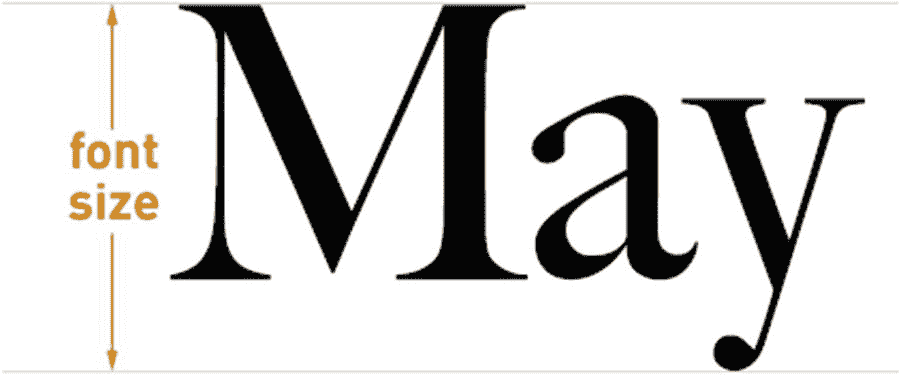
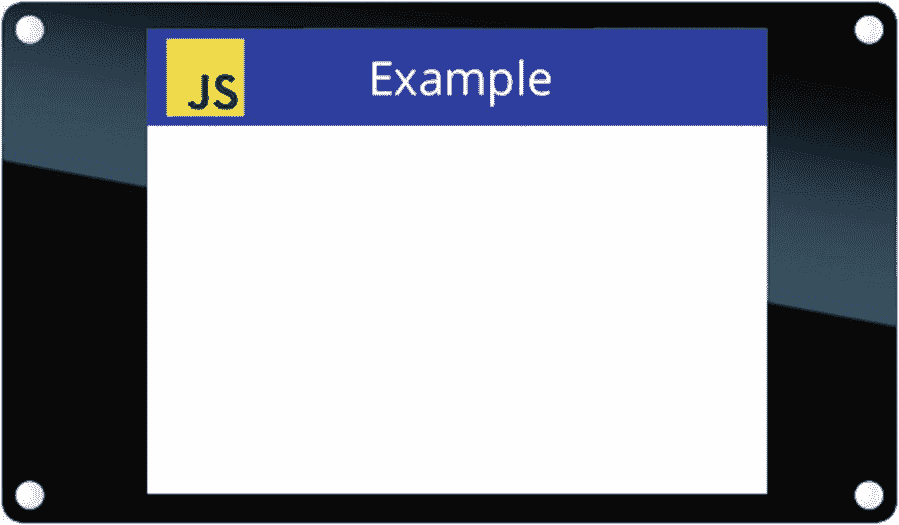

# 十、使用 Piu 构建用户界面

Piu 是一个面向对象的用户界面框架，它简化了创建复杂用户界面的过程。它使用 Poco 渲染器进行绘制。本章概述了 Piu 的工作原理，并通过一系列例子介绍了它的一些主要功能。Piu 这个名字在古典音乐中的意思是“更多”,反映了 Piu 在 Poco 基础上构建的非常丰富的功能集。

请记住，学习一个新的用户界面框架可能具有挑战性。每个框架都有自己的方式来解决构建用户界面的问题，并有自己的 API 套件来解决这个问题。要完全理解 Piu 的复杂性，仅仅遵循本章中的例子是不够的。本章的目的是教你 Piu 最重要和最常用的特性，展示它们的简单使用示例，并充分解释它们，以便你可以在自己的产品的用户界面中使用它们。

如果你已经知道*层叠样式表*，或者 *CSS* ，一种定义样式的语言——例如，文本——最常用于设计用 HTML 编写的网页，那么 Piu 的某些部分对你来说会很熟悉。Piu 和 CSS 的相似之处绝非偶然；Piu 整合了许多 CSS 约定，为开发 web 和物联网产品的开发人员提供一致性。

## 关键概念

在深入研究代码之前，理解 Piu 背后的一些关键概念是很重要的。如果您是使用面向对象的用户界面框架的新手，本节中的信息尤其重要，因为它能让您以正确的心态使用 Piu。如果您已经习惯了使用面向对象的框架，这一节仍然很重要，因为它介绍了 Piu 特有的信息。

### 一切都是物体

需要掌握的最重要的概念是，Piu 应用程序中用户界面的每个元素都有相应的 JavaScript 对象。JavaScript 对象是 Piu 提供的类的实例。Piu 与本书中介绍的其他可修改的 SDK 特性不同，因为您不必导入大多数 Piu 类。相反，Piu 将常用类的构造函数存储在全局变量中，使您可以在应用程序的任何模块中轻松使用它们。

每个 Piu 应用程序都从同一个对象开始:Piu `Application`类的一个实例。本章的宿主创建实例，因此本章中的示例都不需要创建它。清单 [10-1](#PC1) 展示了主机如何通过调用`Application`构造函数来实例化`Application`实例。

```js
new Application(null, {
    displayListLength: 8192,
    commandListLength: 4096,
    skin: new Skin({fill: "white"}),
    Behavior: AppBehavior
});

Listing 10-1.

```

现在不要担心各种属性的细节。请注意，这里使用了 Poco 的`displayListLength`属性，因为 Piu 使用 Poco 进行绘图。

作为`Application`构造函数的一部分，Piu 将实例存储在`application`全局变量中。这些例子通过`application`全局变量访问`Application`实例。

`application`对象是 Piu 应用程序的根。可以把它想象成一个容器，容纳所有出现在屏幕上的图形元素。添加到容器中的图形元素被称为*内容对象*。要在屏幕上显示一个内容对象，需要创建它的一个实例，并将其添加到`application`对象中。例如，为了显示一行文本，您创建 Piu 的`Label`类的一个实例，一种内容对象，并将其添加到`application`对象中。

Note

本章通过类的大写名称引用类，如“the `Label` class”，并通过未大写的类名引用类的实例，如“a `label` object”(或简称为“a label”)。

您可以创建 Piu 内容对象，而不需要将它们添加到`application`对象中，但是它们只有在添加后才会被绘制。当你使用 Piu 时，你不会自己调用绘图函数。内容对象知道如何绘制自己；它们会根据需要调用绘图函数来更新屏幕。

当然，您也可以从屏幕上删除内容对象。正如您可能已经猜到的，您可以通过将它们从`application`对象中移除来实现这一点。

### 每个用户界面元素都是一个内容对象

如您所知，Piu 应用程序中用户界面的每个元素都与一个内容对象相关联。更具体地说，每个用户界面元素都与一个从`Content`类继承的类的实例相关联。这样的类有很多，包括前面提到的`Label`类。在本章中，您将了解各种类型的内容对象。

Note

在本章中，“`content`对象”指的是`Content`类的实例，而通用术语*内容对象*指的是从`Content`类继承的任何类的实例。

创建内容对象时，在 JavaScript 字典中指定其属性。对于`label`对象，属性包括标签的字符串和文本样式。字典被传递给类的构造函数。

```js
let sampleLabel = new Label(null, {
    style: textStyle,
    string: "Hello"
});

```

内容对象的属性可以随时更改。通过在实例中设置属性的值来更改属性，通常使用调用构造函数时用于初始化属性的相同属性名。

```js
sampleLabel.style = OpenSansBold12;
sampleLabel.string = "Goodbye";

```

当您更改添加到`application`对象的内容对象的属性时，屏幕会自动更新。Piu 通过使显示的适当部分无效来进行更新，内容对象调用所需的绘图函数来更新屏幕。

### 并非所有 Piu 对象都是内容对象

除了内容对象之外，Piu 还有其他几种对象，本节将介绍其中最常见的对象。它们都用于以某种方式修改内容对象——它们的外观、行为方式或动画方式。这些对象都不是从`Content`类继承的。定义它们的类将在这里介绍，并在本章后面更详细地描述。

#### 定义外观

`Skin`、`Texture`和`Style`类修改内容对象的外观:`skin`和`texture`对象被内容对象用来用颜色和图像填充区域，而`style`对象定义文本的外观，包括它的字体和颜色。例如，在前面的部分中，`sampleLabel`用一个字典实例化，该字典包含一个设置为名为`textStyle`的`style`对象的`style`属性。`style`对象不与单个内容对象相关联；相反，它可以应用于一个或多个`label`对象和其他内容对象。

类似地，`skin`对象通过内容对象的`skin`属性与内容对象相关联，并且像`style`对象一样，它们可以由许多内容对象共享。另一方面，`Texture`类不被内容对象直接使用；`texture`对象通过`skin`对象的`texture`属性与`skin`对象相关联，并且可以被多个`skin`对象共享。

与内容对象一样，您可以使用传递给构造函数的字典来指定`skin`、`texture`和`style`对象的属性。与内容对象不同，`skin`、`texture`和`style`对象的属性不能更改。这意味着，例如，要更改标签使用的字体，您需要更改`label`对象的`style`属性，而不是`style`对象的`font`属性。

#### 控制行为

*行为*执行动作以响应*事件*，例如屏幕上的轻击、传感器值的变化或定时器的到期。内容对象的行为由`Behavior`类的子类定义。行为是 Piu 实现事件驱动编程风格的一部分。如果你是事件驱动编程的新手，不要担心；本章详细解释了`behavior`对象和事件如何在 Piu 中工作。

内容对象必须具有分配给它的行为，才能响应事件。内容对象不需要有指定的行为，但是如果没有行为，它就不会响应事件。通常一个内容对象有自己的一个`Behavior`子类的实例，尽管多个内容对象可能共享一个`behavior`实例。

#### 鼓舞

要制作内容对象的动画，可以使用`Timeline`和`Transition`类。您可以通过更改内容对象的属性使其移动、改变颜色、淡入或淡出等来制作动画，并且可以将一个内容对象替换为另一个内容对象，例如，在屏幕之间移动。

内容对象没有`timeline`或`transition`属性；相反，`timeline`和`transition`对象是指它们动画化的内容对象。

## 安装 Piu 主机

您可以按照第 [1](01.html) 章中描述的模式运行本章的所有示例:使用`mcconfig`在您的设备上安装主机，然后使用`mcrun`安装示例应用程序。

所有 Piu 示例都需要使用屏幕，这使得您的`mcconfig`命令行必须为您的开发板指定一个带有屏幕驱动程序的平台。这些示例旨在 320 x 240 分辨率的屏幕上运行。以下命令行用于可修改 1、可修改 2 和 M5Stack FIRE:

```js
> mcconfig -d -m -p esp/moddable_one
> mcconfig -d -m -p esp32/moddable_two
> mcconfig -d -m -p esp32/m5stack_fire

```

如果使用试验板和跳线将屏幕连接到开发板，请遵循第 [1](01.html) 章中的说明。为 ESP32 提供的接线与`esp32/moddable_zero`目标一起工作；对于 ESP8266 和`esp/moddable_zero`目标也是如此。

可修改零、可修改一、可修改二和 M5Stack FIRE 的屏幕驱动程序支持使用硬件旋转。主机配置屏幕旋转，使其以横向(320 x 240)方向呈现像素，而不是默认的纵向(240 x 320)方向。

如果你的设备没有屏幕，你可以在可修改的 SDK 提供的桌面模拟器上运行本章的例子。以下命令行适用于 macOS、Windows 和 Linux:

```js
> mcconfig -d -m -p mac
> mcconfig -d -m -p win
> mcconfig -d -m -p lin

```

本章的主机在`$EXAMPLES/ch10-piu/host`目录中。从命令行导航到这个目录，用`mcconfig`安装它。

如果您正在使用桌面模拟器，请确保在安装示例之前将屏幕尺寸更改为 320 x 240。你可以通过从应用程序工具栏的**尺寸**菜单中选择 **320 x 240** 来实现。

## Piu 的“你好，世界”

当您运行`$EXAMPLES/ch10-piu/helloworld`示例时，您会看到如图 [10-1](#Fig1) 所示的屏幕。


图 10-1

`helloworld`举例

这不是最令人兴奋的用户界面，但它是演示创建 Piu 对象以构建简单屏幕的基础的良好起点。显示的文本在一个`label`对象中定义，示例中的第一行代码创建了一个*样式—`Style`类的一个实例—* ,以定义文本的外观。

```js
const textStyle = new Style({
    font: "24px Open Sans"
});

```

下一节将介绍`font`属性的细节。现在，请注意，`style`对象的属性是在传递给`Style`类的构造函数的字典中定义的。正如您之前所了解的，这是 Piu 内容对象和定义其外观的对象的约定。每个 Piu 对象都需要指定某些属性，而其他属性是可选的。例如，`Style`构造函数需要一个`font`属性，但是与颜色、水平和垂直对齐以及行高相关的属性是可选的。

然后，`helloworld`示例创建一个内容对象:一个名为`sampleLabel`的`label`对象(参见清单 [10-2](#PC7) )。一个`label`对象用一种样式在一行上呈现文本。

```js
const sampleLabel = new Label(null, {
    style: textStyle,
    string: "Hello, World",
    top: 0, bottom: 0, left: 0, right: 0
});

Listing 10-2.

```

`string`属性指定标签显示的文本，`style`属性定义文本的样式(`textStyle`，如前所述)。`top`、`bottom`、`left`和`right`属性通过指定`label`对象和其容器`application`对象之间的边距来定义标签的位置；将这些全部设置为 0 会使`label`对象充满整个屏幕。默认情况下，文本水平和垂直居中，因此文本绘制在屏幕中央。

Note

请记住，`top`、`bottom`、`left`和`right`不是绝对坐标，而是指定从父容器的相应边缘开始的边距。

正如您在前面所学的，简单地创建一个内容对象并不能让它出现在屏幕上。您必须将内容对象添加到`application`对象中，以便 Piu 绘制它们。这是通过调用`application.add`来完成的。

```js
application.add(sampleLabel);

```

在这个例子中，`textStyle`仅被附加到一个内容对象，但是回想一下，一个`style`对象可以被附加到多个内容对象。您可以添加第二个标签，该标签使用相同的样式，但在不同的位置显示不同的文本。例如，将清单 [10-3](#PC9) 中的代码添加到示例中，会在屏幕的右下角显示文本`Second string`。

```js
application.add(new Label(null, {
    style: textStyle,
    string: "Second string",
    bottom: 0, right: 0
}));

Listing 10-3.

```

注意，这个标签没有指定`top`和`left`属性。如果指定了标签的`bottom`属性，但没有指定`top`，反之亦然，标签的高度就是其`style`属性指定的样式中文本的高度。同样，如果您只指定了`left`和`right`中的一个，标签的宽度就是其样式中文本的宽度。

### 字体

当`style`应用于内容对象时，`style`对象的`font`属性指示用于绘制文本的字体。字体通常是存储在资源中的压缩位图，如第 8 章所述。Piu 不包含任何内置字体；相反，宿主和应用程序可以在其清单中包含字体。本章的宿主提供了两种字体，所有绘制文本的示例都使用这两种字体。清单 [10-4](#PC10) 显示了包含字体的清单片段。

```js
"resources": {
    "*-alpha": [
        "./OpenSans-Regular-24",
        "./OpenSans-Semibold-16"
    ]
},

Listing 10-4.

```

#### 字体名称

Piu 使用样式的`font`属性来定位要使用的字体资源。本节介绍字体的命名约定，下一节解释这些名称如何映射到字体资源。

在`helloworld`示例中，字体名称由字符串`"24px Open Sans"`指定。字体名称的 Piu 格式是 CSS 字体名称格式的子集。Piu 字体名称由五部分组成，顺序如下:

表 10-2

大小关键字

<colgroup><col class="tcol1 align-left"> <col class="tcol2 align-left"></colgroup> 
| 

关键字

 | 

等效尺寸

 |
| --- | --- |
| `xx-small` | `9px` |
| `x-small` | `10px` |
| `small` | `13px` |
| `medium` | `16px` |
| `large` | `18px` |
| `x-large` | `24px` |
| `xx-large` | `32px` |

表 10-1

权重关键词

<colgroup><col class="tcol1 align-left"> <col class="tcol2 align-left"></colgroup> 
| 

关键字

 | 

等价数

 |
| --- | --- |
| `ultralight` | `100` |
| `thin` | `200` |
| `light` | `300` |
| `normal` | `400` |
| `medium` | `500` |
| `semibold` | `600` |
| `bold` | `700` |
| `heavy` | `800` |
| `black` | `900` |



图 10-2

字体大小

1.  **样式**–*(可选)*字体样式，指定为`italic`，正常则省略。

2.  **粗细**–*(可选)*字体的粗细。您可以使用与 CSS 中相同的关键字和数值(例如，`light`、`bold`或`800`)。每个关键字都有一个等价的数值；比如重量`light`相当于`300`，`bold`就是`700`。表 [10-1](#Tab1) 列出了重量关键字及其等效数值。如果省略了字体名称的这一部分，则使用默认值`normal` ( `400`)。

3.  **拉伸**–*(可选)*字符之间的间距，指定为`condensed`或正常时省略。

4.  **大小**–字体的高度，以像素为单位。高度从下行字母的底部延伸到典型大写字母的顶部，如图 [10-2](#Fig2) 所示。您可以使用 CSS 中的绝对大小关键字(例如，`x-small`或`medium`)或以像素为单位指定大小(如在`24px`)。请注意，实际高度因字体系列而异。表 [10-2](#Tab2) 列出了尺寸关键字及其对应的像素尺寸。

5.  **系列**–字体系列的名称(例如`Times New Roman`或`Open Sans`)。

表 [10-3](#Tab3) 列出并解释了可能在文本样式的`font`属性中指定的字体名称示例。

表 10-3

字体名称示例

<colgroup><col class="tcol1 align-left"> <col class="tcol2 align-left"></colgroup> 
| 

更多字体 Name

 | 

说明

 |
| --- | --- |
| `24px Open Sans` | 字体家族为`Open Sans`，大小为`24px`。没有指定弹力，重量，或者款式，所以都是正常的。 |
| `bold 16px Fira Sans` | 字体家族为`Fira Sans`，大小为`16px`，粗细为`bold`(相当于`700`)。没有指定拉伸或样式，所以它们都是正常的。 |
| `italic bold medium Open Sans` | 字体系列为`Open Sans`，字号为`medium`，或`16px`。重量为`bold`(相当于`700`)，样式为`italic`。没有指定拉伸，所以很正常。 |
| `italic bold condensed small Open Sans` | 字体系列为`Open Sans`，字号为`small`，或`13px`。拉伸为`condensed`，重量为`bold`(相当于`700`，款式为`italic`。 |

#### 字体资源

字体名`24px Open Sans`是指存储在名为`OpenSans-Regular-24.fnt`的资源中的字体。尽管字体名称和资源名称明显相似，但它们并不完全相同。Piu 通过应用一组规则从字体名称创建资源名称，从字体名称获取字体的资源数据。您需要了解这些规则，以便将代码中指定的字体名称与项目清单中包含的字体资源相匹配。

下面的列表按顺序显示了资源名的各个部分(不包括`.fnt`扩展名),并解释了 Piu 如何从字体名生成它们。

Note

这里的关键字(比如`Light`和`Regular`)是区分大小写的，所以它们的大写是有意义的。

1.  **系列**–字体系列的名称，去掉任何空格。比如`Open Sans`变成了`OpenSans`。

2.  **连字符(**`-`**)**–将字体系列名称与其后面的部分分开的连字符。

3.  **拉伸**–字体拉伸正常时省略；否则，`Condensed`。

4.  **粗细**–字体粗细正常时省略；否则，字体粗细—例如，`Light`、`Bold`，或数值，如`200`。

5.  **样式**——字体样式正常时省略；否则，`Italic`。

6.  `Regular`–如果 stretch、weight 和 style 都正常，资源名称将包含关键字`Regular`来代替这三个关键字。

7.  **连字符(**`-`**)**–将弹力、重量和款式(或`Regular`)与后面的尺码分开的连字符。

8.  **大小**–以像素为单位的高度，以数字表示——例如，`16`或`24`。

表 [10-4](#Tab4) 给出了 Piu 字体名称和它们映射到的资源名称的例子。

表 10-4

映射到资源名称的字体名称示例

<colgroup><col class="tcol1 align-left"> <col class="tcol2 align-left"> <col class="tcol3 align-left"></colgroup> 
| 

更多字体 Name

 | 

资源名称

 | 

笔记

 |
| --- | --- | --- |
| `24px Open Sans` | `OpenSans-Regular-24.fnt` | 字体系列名称中的空格将被删除。因为 stretch、weight 和 style 都是正常的，所以在资源名称中使用了`Regular`来代替这三个部分。 |
| `bold 16px Fira Sans` | `FiraSans-Bold-16.fnt` | 字体大小移动到末尾，样式`bold`在资源名称中大写。 |
| `italic bold 16px Open Sans` | `OpenSans-BoldItalic-16.fnt` | 虽然字体名称将`italic`放在`bold`之前，但是资源名称指定了`BoldItalic`，因为权重总是在样式之前。还要注意在`Bold`和`Italic`之间没有空格或连字符。 |

当创建您自己的位图字体文件时，根据 Piu 的资源命名约定命名文件。这样做可以确保当您的代码指定字体名称时，Piu 会在您的资源中找到相应的字体数据。

#### 关于字体的附加说明

Piu 从 CSS 中提取的字体命名约定是为了方便开发人员，同时又有足够的表现力来构建复杂的用户界面。它们还为 web 开发人员提供了一致性。然而，尽管 CSS 功能强大，但一些开发人员发现它更令人困惑，而不是有所帮助。如果您愿意，您可以简单地使用字体资源的名称作为字体名称。例如，`helloworld`示例中的`textStyle`可以定义如下:

```js
const textStyle = new Style({
    font: "OpenSans-Regular-24"
});

```

请记住，只有那些包含在清单中或由宿主提供的字体才可用于您的项目。在许多情况下，那只是一些字体。如果您指定了未安装的字体，Piu 将无法渲染它。这不同于桌面和 web 开发环境，在那里总是有后备字体。

因为每个字体资源只对应一个系列、宽度、粗细、样式和大小，所以每个变体都需要一个单独的资源。如果你创建了一个文本样式，它的`font`属性是`24px Open Sans`，你必须有一个名为`OpenSans-Regular-24.fnt`的字体资源。即使您有相关的字体资源可用，如`OpenSans-Regular-12.fnt`，Piu 也无法调整其大小以匹配您的文本样式中指定的`24px`大小。这也不同于桌面和 web 开发环境，在这些环境中，可调整大小的字体很常见。

### 添加颜色

`$EXAMPLES/ch10-piu/helloworld-color`示例为`helloworld`示例添加了颜色，使其更加有趣。它与`helloworld`相比有一些变化。

首先，`helloworld-color`中的`style`对象指定了一个`color`属性，该属性使标签用黄色绘制字符串:

```js
const textStyle = new Style({
    font: "24px Open Sans",
    color: "yellow"
});

```

该示例还创建了一个名为`labelBackground`的`skin`对象。*皮肤*控制内容对象背景的绘制。这里的`skin`对象用十六进制表示法指定了`fill`属性，颜色为蓝色的`#1932ab`。

```js
const labelBackground = new Skin({
    fill: "#1932ab"
});

```

`sampleLabel`对象(清单 [10-5](#PC14) )添加了一个`skin`属性来设置其背景，使得标签用`labelBackground`中指定的蓝色阴影填充其背景。

```js
const sampleLabel = new Label(null, {
    left: 0, right: 0, top: 0, bottom: 0,
    style: textStyle,
    string: "Hello, World",
    skin: labelBackground
});

Listing 10-5.

```

当您在设备上运行`helloworld-color`示例时，您会看到与`helloworld`相同的文本和布局，但是是蓝色背景上的黄色文本，而不是白色背景上的黑色文本。

当没有指定`skin`属性时，如在`helloworld`示例中，标签不为其背景绘制任何东西，导致文本出现在它后面的任何东西的前面。背景是白色的，因为在没有皮肤的情况下，文本出现在`application`对象本身的前面(由主机创建，如“一切都是对象”一节所示)；因为主机将应用程序的`skin`属性设置为白色，这是整个屏幕的背景色。

#### 指定颜色

`helloworld-color`示例的`style`对象中的`color`属性被设置为一个颜色名称，而`skin`对象中的`fill`属性用十六进制表示一种颜色。如本节所述，您可以用任何一种方式为这两个属性指定颜色。

示例的`style`对象中的`color`属性被设置为字符串`"yellow"`。Piu 支持 18 种颜色名称:`black`、`silver`、`gray`、`white`、`maroon`、`red`、`purple`、`fuchsia`、`green`、`lime`、`olive`、`yellow`、`navy`、`blue`、`teal`、`aqua`、`orange`和`transparent`。颜色及其 RGB 值取自 CSS Level 2 规范。

示例的`skin`对象中的`fill`属性是`"#1932ab"`，用十六进制表示法指定的蓝色阴影。如清单 [10-6](#PC15) 所示，Piu 支持将颜色指定为四种十六进制符号中任意一种的字符串:`"#RGB"`、`"#RGBA"`、`"#RRGGBB"`和`"#RRGGBBAA"`。在这些符号中，`A`代表“alpha 通道”,代表颜色的透明度:alpha 值为`0xFF`表示完全不透明，0 表示完全透明，介于两者之间的值执行混合。(alpha 值与某些 Poco 渲染函数中使用的混合级别相同，如`blendRectangle`和`drawGray`。)

```js
const redSkin = new Skin({
    fill: "#f00"
});
const blendedRedSkin = new Skin({
    fill: "#f008"
});
const greenSkin = new Skin({
    fill: "#00ff00"
});
const blendedGreenSkin = new Skin({
    fill: "#00ff0080"
});

Listing 10-6.

```

CSS 中也使用了所有这些形式的十六进制颜色符号。

#### 根据状态改变颜色

在本章的前面，你已经知道了`skin`和`style`对象的属性是不能改变的。因此，例如，您不能通过改变内容对象的`skin`和`style`对象的`color`属性来改变内容对象的颜色；相反，您创建一个不同的`skin`或`style`对象来改变颜色。然而，还有另一种更常见、更方便的改变颜色的方法。

通常你想改变用户界面元素的颜色是为了显示它的当前状态。例如，一个按钮可能有三种状态:禁用、启用但未被点击，以及启用并被点击。或者显示传感器读数的标签可以具有当读数在目标值的 5%以内、在目标值的 15%以内以及偏离目标值超过 15%时的状态。为了支持这些情况，每个内容对象都有一个`state`属性，一个指示其当前状态的数字。Piu 使用`state`属性和`style`对象的属性来改变用户界面元素的外观。

`state`属性只是一个数字；数字对应的州由你作为开发者决定。当内容对象改变状态时，用户界面如何改变也由您决定。例如，您可以选择使按钮在禁用时为浅灰色，在启用但未被点击时为绿色，在启用并被点击时为深绿色。

改变内容对象颜色的一个简单方法是使用它们的`state`属性作为`skin`和`style`对象中属性的索引。通过将`skin`或`style`对象的`fill`或`color`属性设置为两种、三种或四种颜色的数组，而不是表示单一颜色的字符串，可以做到这一点。例如:

```js
const blackAndWhiteStyle = new Style({
    color: ["black", "white"]
});

```

根据这个例子，清单 [10-7](#PC17) 创建了一个带有黑色文本的标签，因为状态为 0，索引 0 处的颜色为`"black"`。

```js
const sampleLabel = new Label(null, {
    top: 0, bottom: 0, left: 0, right: 0,
    style: blackAndWhiteStyle,
    state: 0,
    string: "Hello, World"
});

Listing 10-7.

```

当您更改`state`属性时，用户界面元素将使用其样式中的相应颜色重新绘制。将此处的状态更改为 1 会导致用白色文本重新绘制标签。

```js
sampleLabel.state = 1;

```

您也可以对状态使用非整数值，从而混合周围状态的颜色。例如，您可以将本例中的文本设置为灰色，如下所示:

```js
sampleLabel.state = 0.5;

```

从概念上来说，为状态指定小数值的能力似乎有些奇怪；例如，一个按钮处于禁用和启用状态之间意味着什么？然而，有一些有趣的用途，比如当你在两种状态之间制作动画时:你可以创建一个有两种颜色的`style`，并通过以小的增量将标签的`state`从 0 变到 1，将标签从第一种颜色慢慢淡化到第二种颜色。

### 用行为回应事件

一旦在屏幕上有了一些内容对象，下一步就是让它们执行动作来响应事件。您可以对`behavior`对象执行此操作。

对象是方法的集合。通过设置内容对象的`behavior`属性，可以将一个`behavior`对象附加到内容对象上。当内容对象接收到一个事件时，它在它的`behavior`对象中查找对应于该事件的方法；如果找到与事件同名的方法，它将调用该方法来处理事件。

Piu 定义了一组根据需要触发的事件。例如，当手指放在内容对象上时触发`onTouchBegan`事件，当手指移开时触发`onTouchEnded`事件。清单 [10-8](#PC20) 中的`TraceBehavior`类包含通过跟踪调试控制台来响应 Piu 的`onTouchBegan`和`onTouchEnded`事件的方法。

```js
class TraceBehavior extends Behavior {
    onTouchBegan(label) {
        trace("touch began\n");
    }
    onTouchEnded(label) {
        trace("touch ended\n");
    }
}

Listing 10-8.

```

由 Piu 定义和触发的事件称为*低级事件*。你也可以定义你自己的事件，使用任何你喜欢的名字；这些被称为*高水平赛事*。例如，您可以创建一个`onSensorValueChanged`事件，当传感器的值改变时，您的应用程序会触发该事件。本节的其余部分介绍一些常用的低级事件；在本章的后面，你将学习如何定义和触发你自己的高级事件。

#### “你好，世界”与行为

`$EXAMPLES/ch10-piu/helloworld-behavior`示例向`helloworld`示例添加了一个行为，使字符串`"Hello, World"`在您点击屏幕时一次显示一个字符。这个简单的行为展示了 Piu 如何将事件传递给内容对象。

在`helloworld-behavior`例子中的`sampleLabel`对象(列表 [10-9](#PC21) )类似于来自`helloworld`的对象。然而，有三个重要的区别:

*   `sampleLabel`的`string`属性以空字符串开始，因此它可以响应点击一次填充一个字符。

*   `active`属性被设置为`true`。此属性指定内容对象是否应响应触摸事件。如果设置为`true`，Piu 将触发`onTouchBegan`等触摸相关事件。默认值是`false`，所以你必须显式设置`active`到`true`来使内容可点击。

*   在传递给构造函数的字典中指定了一个`Behavior`属性。这将`sampleLabel`的行为设置为`LabelBehavior`类。

```js
const sampleLabel = new Label(null, {
    top: 0, bottom: 0, left: 0, right: 0,
    style: textStyle,
    string: "",
    active: true,
    Behavior: LabelBehavior
});
sampleLabel.message = "Hello, World";

Listing 10-9.

```

`LabelBehavior`是扩展内置`Behavior`类的类:

```js
class LabelBehavior extends Behavior {
    ...
}

```

当`sampleLabel`被创建时，Piu 也会创建一个`LabelBehavior`的实例，并将其赋给`sampleLabel`的`behavior`属性。注意，`Behavior`属性在传递给`Label`构造函数的字典中是大写的，而创建的实例的`behavior`属性是小写的；这是因为属性名遵循与它们所取值相同的大小写约定:类被传递给`Behavior`属性中的构造函数(按照约定，JavaScript 中的类名是大写的)，而`sampleLabel`的`behavior`属性包含类的一个实例(按照约定，JavaScript 中的实例名是小写的)。

`LabelBehavior`只有一个方法`onTouchBegan`，如清单 [10-10](#PC23) 所示。这个方法的参数是`label`对象本身。行为中调用的所有事件处理程序方法的第一个参数是它们所附加的内容对象。当被调用时，该方法将字符串`"Hello, World"`中的下一个字符添加到`label`对象中，直到添加完所有字符。然后，它将`label`对象的`active`属性设置为`false`，以阻止其接收进一步的触摸事件。

```js
onTouchBegan(label) {
    const message = label.message;
    label.string = message.substring(0, label.string.length + 1);
    if (label.string === message)
        label.active = false;
}

Listing 10-10.

```

这就是实现一个基本触摸行为所要做的一切。当您运行该示例并点击`label`对象(覆盖整个屏幕)时，Piu 触发该对象的`onTouchBegan`事件。然后，`label`对象检查它的行为，看它是否有一个`onTouchBegan`方法；确实如此，所以它调用该方法，将对自身的引用作为第一个参数传递。

许多低级事件都有可能对您的项目有用的附加参数。例如，`onTouchBegan`事件也传递这四个参数:

*   `id`–用于支持多点触摸的触摸点的标识符。这个例子只支持一个触摸点，所以`id`总是 0。`id`值是一个来自触摸控制器的数字，使您能够区分屏幕上的不同触摸点。

*   `x`和`y`–事件的全局坐标，即触摸点的坐标，以像素为单位。

*   `ticks`–事件的全局时间，以毫秒为单位。该值不是一天中的时间，与 UTC 无关；它仅用于确定两个事件之间经过的时间。

当您第一次处理一个事件时，很好地理解它的一个好方法是向行为添加一个方法来跟踪它接收到的调试控制台的参数。例如，为了观察如何以及何时调用`onTouchBegan`的细节，将`helloworld-behavior`示例更改为清单 [10-11](#PC24) 中所示的函数。

```js
onTouchBegan(label, id, x, y, ticks) {
    trace(`id: ${id}\n`);
    trace(`{x, y}: {${x}, ${y}}\n`);
    trace(`ticks: ${ticks}\n`);
}

Listing 10-11.

```

#### `onTimeChanged`和`onDisplaying`事件

本节介绍这些常用的低级事件:

*   `onTimeChanged`事件让您可以访问内置于每个 Piu 内容对象中的时钟。

*   在内容对象出现在屏幕上之前，`onDisplaying`事件给你的行为一个自我配置的机会。

这些事件是通过`$EXAMPLES/ch10-piu/helloworld-ticking`示例引入的，它与`helloworld-behavior`示例相似，都是一次将一个角色`"Hello, World"`添加到屏幕上；然而，它不是在轻击屏幕时添加字符，而是每隔一段时间添加一次。请注意以下关于此示例的内容:

*   除了其`active`属性没有设置为`true`之外，`sampleLabel`对象与`helloworld-behavior`中的对象相同，因为它不响应触摸事件。

*   `LabelBehavior`类包括`onDisplaying`和`onTimeChanged`方法(清单 [10-12](#PC25) )而不是`onTouchBegan`方法。他们的第一个参数是对与行为相关的`label`对象的引用，就像 Piu 定义的所有事件一样。

```js
class LabelBehavior extends Behavior {
    onDisplaying(label) {
        ...
    }
    onTimeChanged(label) {
        ...
    }
}

Listing 10-12.

```

在内容对象被添加到`application`对象之后，但在用户看到它之前，`onDisplaying`事件被触发。这对于初始化对象的状态非常有用，尤其是那些可能被隐藏并在以后显示多次的内容对象。`onDisplaying`事件的一个常见用途是启动一个计时器，该计时器用于动画显示内容对象的外观。

因为动画是现代用户界面中如此普遍的一部分，Piu 给每个内容对象一个内置时钟。时钟以内容对象的`interval`属性指定的时间间隔“滴答”作响。属性和时钟都以毫秒表示时间。每当时钟滴答声响起，它就会产生一个`onTimeChanged`事件。时钟并不总是运行，最初是停止的；您使用内容对象的`start`和`stop`方法来控制它的时钟何时运行。

在这个例子中，行为的`onDisplaying`方法(清单 [10-13](#PC26) )通过重置`index`属性开始，该属性存储在任何给定时间`label`对象中的字符串的字符数。代码将`interval`属性设置为 250 毫秒，以请求每四分之一秒生成一次`onTimeChanged`事件。最后，该方法通过调用其`start`方法启动标签的时钟。

```js
onDisplaying(label) {
    this.index = 0;
    label.interval = 250;
    label.start();
}

Listing 10-13.

```

行为的`onTimeChanged`方法(清单 [10-14](#PC27) )在每个间隔向`label`对象的`string`属性添加一个新字符。它使用了`substring`方法，返回字符串的一部分。`substring`的参数分别指定要包含的第一个字符和要排除的第一个字符的索引。当显示完完整的字符串后，`onTimeChanged`调用标签的`stop`方法来阻止时钟滴答作响，这样`onTimeChanged`就不再被触发。

```js
onTimeChanged(label) {
    const message = label.message;
    this.index += 1;
    if (this.index > message.length)
        label.stop();
    else
        label.string = message.substring(0, this.index);
}

Listing 10-14.

```

后面的例子展示了如何使用内容对象的时钟来驱动动画。

## 添加图像

图像是构建用户界面的基础部分。正如 Piu 使用`skin`对象用纯色填充屏幕区域一样，它也使用它们用图像填充屏幕区域，使任何内容对象都能绘制图像。`skin`对象中的*纹理*指定了要使用的图像。

为了展示如何呈现图像，`$EXAMPLES/ch10-piu/js-icon`示例绘制了 JavaScript 徽标。该示例绘制了如图 [10-3](#Fig3) 所示的屏幕。


图 10-3

`js-icon`举例

一个`skin`对象用于创建图标。第一步是通过实例化一个`texture`对象来创建对要使用的图像文件的引用。传递给`Texture`构造函数的字典的`path`属性是包含图像的资源的名称。

```js
const jsLogoTexture = new Texture({
    path: "js.png"
});

```

注意资源名有一个`.png`扩展名，而不是第 [9](09.html) 章中 Poco 的`.bmp`。虽然 PNG 图像仍被转换为另一种格式以在微控制器上呈现，但 Piu 知道这种转换，并自动将`.png`扩展名更改为设备的正确扩展名。

在`helloworld-color`示例中，您使用了一个带有`fill`属性的`skin`对象来创建纯色背景。在这个例子中，您使用了一个`texture`属性以及`height`和`width`属性来创建一个皮肤`jsLogoSkin`，它使用`jsLogoTexture`来填充内容对象。`height`和`width`属性被设置为匹配`js.png`图像文件的尺寸，100 x 100 像素。

```js
const jsLogoSkin = new Skin({
    texture: jsLogoTexture,
    height: 100, width: 100
});

```

最后一步是创建一个引用`jsLogoSkin`的`content`对象:

```js
const jsLogo = new Content(null, {
    skin: jsLogoSkin
});

```

因为皮肤被定义为 100 x 100 像素，所以默认情况下,`jsLogo`内容对象具有相同的尺寸。

### 绘制图像的一部分

您可能想知道为什么之前必须在`Skin`构造函数中指定`height`和`width`属性。为什么皮肤没有默认使用整个图像？原因是`skin`对象的一个特性，它允许你只绘制部分纹理。要指定要绘制的纹理区域，可以使用`x`、`y`、`height`和`width`属性以像素为单位定义源矩形。`x`和`y`属性默认为 0，但是`height`和`width`属性是必需的。

清单 [10-15](#PC31) 中的代码是`js-icon`示例中`jsLogoSkin`的替代。在这里，皮肤被定义为从图像的右下角开始绘制一个 70 x 70 像素的正方形。结果如图 [10-4](#Fig4) 所示。


图 10-4

`js-icon`裁剪示例`jsLogoSkin`

```js
const jsLogoSkin = new Skin({
    texture: jsLogoTexture,
    x: 24, y: 30,
    height: 70, width: 70
});

Listing 10-15.

```

很少绘制单个图标的一部分。毕竟，如果你只想画右下角，不妨把图像文件裁剪掉，节省一些存储空间。然而，在单个图像中存储几个图标通常很方便，在这种情况下，能够绘制图像的一部分非常有用。下一节将介绍一个例子。

### 从一幅图像中绘制多个图标

回想一下图 [10-5](#Fig5) 中的图标，你第一次看到这些图标是在第 [8](08.html) 章中。这些图标显示 Wi-Fi 连接的几种不同状态，并组合成一个图像。


图 10-5

Wi-Fi 图标

图标被组织成统一的网格，其中的列和行如下:

*   每列是 Wi-Fi 图标的不同状态，代表信号强度从弱到强。

*   每一行都是 Wi-Fi 图标的不同变体。顶行是开放式 Wi-Fi 接入点变体，底行是安全 Wi-Fi 接入点变体。

正如 Piu 使用内容对象的`state`属性来确定从样式中绘制哪种颜色一样，它可以使用内容对象的`state`和`variant`属性来确定从包含图标网格的纹理中绘制哪个图标。为此，这里包含纹理的皮肤必须指定每列的宽度和每行的高度，分别使用用于创建皮肤的字典中的`states`和`variants`属性(参见清单 [10-16](#PC32) )。

```js
const wifiTexture = new Texture({
    path: "wifi-strip.png"
});

const wifiSkin = new Skin({
    texture: wifiTexture,
    width: 28, height: 28,
    states: 28,
    variants: 28
});

Listing 10-16.

```

本例中的图像包含 28 像素见方的图标，因此`states`和`variants`属性都是 28。此外，`height`和`width`属性都被设置为 28，这样皮肤的大小正好是一个图标的大小。

`$EXAMPLES/ch10-piu/wifi-status`示例一次从该图像中绘制一个图标，每秒改变一次图标。它从左上角的图标开始(`state`和`variant`都是 0)，如清单 [10-17](#PC33) 所示。

```js
const wifiIcon = new Content(null, {
    skin: wifiSkin,
    state: 0,
    variant: 0,
    Behavior: WifiIconBehavior
});

Listing 10-17.

```

内容对象的`state`和`variant`属性可以随时更新。本示例将它们更改为从左到右一次移动一个图标，首先穿过顶行，然后穿过底行；然后，它返回到最上面一行，无限期地重复这个过程。如清单 [10-18](#PC34) 所示，`wifiIcon`行为中的`onDisplaying`和`onTimeChanged`事件处理程序使用内容对象的内置时钟来驱动动画(正如您在`helloworld-ticking`示例中看到的那样):该行为在每个 tick 上改变`variant`属性，移动一行图标；当到达一行中的最后一个图标时，它改变`state`属性以切换到另一行。

```js
class WifiIconBehavior extends Behavior {
    onDisplaying(content) {
        content.interval = 1000;
        content.start();
    }
    onTimeChanged(content) {
        let variant = content.variant + 1;
        if (variant > 4) {
            variant = 0;
            content.state = content.state ? 0 : 1;
        }
        content.variant = variant;
    }
}

Listing 10-18.

```

### 使用面具

压缩的灰度蒙版比全彩色位图图像更有效地存储灰度图像，而且(正如你在第 [8](08.html) 章中了解到的)蒙版可以用任何颜色绘制。用户界面中绘制的许多图标只有一种颜色，因此可以存储为遮罩。一个`texture`对象可以引用一个蒙版图像资源和一个彩色位图资源，使你的用户界面可以同时包含这两种资源。

向应用程序添加蒙版图像与添加全色位图非常相似。`$EXAMPLES/ch10-piu/mask-icon`示例显示一个存储为遮罩的图标。当你点击图标时，它会改变颜色。

这个例子的`texture`和`skin`属性(清单 [10-19](#PC35) )应该看起来很熟悉。关键的区别在于，`maskSettingsSkin`用两种颜色指定了一个`color`属性，`"orange"`用于当内容对象的`state`属性的值为 0 时，`"yellow"`用于当内容对象的值为 1 时。(注意，指定一个皮肤的颜色有两种不同的方法:当你使用一个皮肤绘制蒙版纹理时，你指定`color`属性；要创建纯色背景，需要指定`fill`属性。)

```js
const maskSettingsTexture = new Texture({
    path: "settings-mask.png"
});

const maskSettingsSkin = new Skin({
    texture: maskSettingsTexture,
    width: 80, height: 80,
    color: ["orange", "yellow"]
});

Listing 10-19.

```

像往常一样，您必须创建一个引用皮肤的内容对象。清单 [10-20](#PC36) 展示了本例中创建的对象:一个`content`对象，它也有一个行为和一个`active`属性(设置为`true`，这样该对象可以接收触摸事件)。

```js
const maskSettingsIcon = new Content(null, {
    skin: maskSettingsSkin,
    state: 0,
    active: true,
    Behavior: SettingsIconBehavior
});

Listing 10-20.

```

第一次绘制图标时，遮罩被绘制为橙色，因为`state`值为 0 意味着它使用了`color`属性中数组索引 0 处的颜色。

如清单 [10-21](#PC37) 所示，该示例使用在点击开始和结束时触发的`onTouchBegan`和`onTouchEnded`事件来提供触摸反馈:

*   当`maskSettingsIcon`接收到一个`onTouchBegan`事件时，它的行为将它的状态设置为 1，导致它用其`color`属性的索引 1 处的颜色重画——在本例中是黄色。

*   当`maskSettingsIcon`接收到一个`onTouchEnded`事件时，它的行为将其状态更改为 0，使图标再次变为橙色。

```js
class SettingsIconBehavior extends Behavior {
    onTouchBegan(content) {
        content.state = 1;
    }
    onTouchEnded(content) {
        content.state = 0;
    }
}

Listing 10-21.

```

### 平铺图像

您可以通过平铺皮肤纹理来绘制重复的图案。这是减少存储空间的另一种方法，因为您可以使用单个背景拼贴而不是整个屏幕大小的图像文件。

#### 平铺单个图像

`$EXAMPLES/ch10-piu/tiled-background`示例使用图 [10-6](#Fig6) 中的图像创建如图 [10-7](#Fig7) 所示的平铺背景。


图 10-7

`tiled-background`举例


图 10-6

图片来自`tiled-background`示例

像图标的皮肤一样，平铺的皮肤使用一个`texture`对象并定义`height`和`width`属性来指定要绘制的纹理区域(在本例中是所有区域)。如清单 [10-22](#PC38) 所示，您还包含了一个`tiles`属性——一个具有`left`、`right`、`top`和`bottom`属性的对象，指示纹理的不同部分要平铺；这里它们都是 0，因为这个例子使用整个图像作为重复的图块。(下一节，关于绘制 9 片图像，解释了如何将这四个属性与其他值一起使用。)

```js
const tileTexture = new Texture({
    path: "tile.png"
});

const tileSkin = new Skin({
    texture: tileTexture,
    height: 50, width: 50,
    tiles: {
        left: 0, right: 0, top: 0, bottom: 0
    }
});

Listing 10-22.

```

当你将`tileSkin`附加到一个全屏`content`对象上时，它会绘制如图 [10-7](#Fig7) 所示:

```js
const background = new Content(null, {
    left: 0, right: 0, top: 0, bottom: 0,
    skin: tileSkin
});

```

#### 绘制 9-用拼贴修补图像

9 片图像用于有效地绘制不同大小的矩形，例如圆角矩形。术语“9 补丁”来自 Android 移动操作系统，尽管这个概念在其他地方也广泛使用；它指的是将图像素材分成九个部分的方式，稍后您会看到这一点。许多有趣的效果可以用 9 片图像来创建。Piu 通过使用平铺的表皮融入了这一概念。

回想一下前面的内容，一个`tiles`对象的属性表示纹理的不同部分需要平铺。更具体地说，这些属性通过指定距离图像边缘的像素数来定义 9 片图像的各个部分，如图 [10-8](#Fig8) 所示，其中一个`tiles`对象的属性都指定为 14。图中的浅灰色线条描绘了九个部分，并为每个部分分配了一个编号。整个图像是 56 像素的正方形。


图 10-8

用九个部分描绘的圆角矩形

该图像的平铺皮肤将如清单 [10-23](#PC40) 中所定义。

```js
const tileSkin = new Skin({
    texture: tileTexture,
    height: 56, width: 56,
    tiles: {
        left: 14, right: 14, top: 14, bottom: 14
    }
});

Listing 10-23.

```

当此皮肤应用于内容对象时，Piu 使用以下规则绘制图像的九个部分:

*   区域 1、3、7 和 9 分别在内容对象的相应角落绘制一次。

*   区域 2 和 8 分别在内容对象的顶部和底部水平重复。

*   区域 4 和 6 分别沿着内容对象的左侧和右侧垂直重复。

*   区域 5 垂直和水平重复，以填充内容对象中间未被其他区块覆盖的空间。

图 [10-9](#Fig9) 显示了这个平铺的皮肤是如何被具有以下尺寸(从左到右)的内容对象渲染的:28 x 28、56 x 56、110 x 100 和 70 x 165。请注意，图像的九个部分只是重复，从不调整大小。


图 10-9

`tileSkin`以不同的尺寸渲染

`$EXAMPLES/ch10-piu/rounded-buttons`示例使用一个简单的纯色圆角矩形来创建不同大小的按钮(图 [10-10](#Fig10) )。


图 10-10

`rounded-buttons`举例

本例中的皮肤定义如清单 [10-24](#PC41) 所示。它看起来类似于前面的皮肤示例，但是图像素材更小，并且`tiles`对象的`left`、`right`、`top`和`bottom`属性都被设置为 5。它还指定了一个`color`属性；平铺的皮肤可以使用遮罩。

```js
const roundedTexture = new Texture({
    path: "button.png"
});

const roundedSkin = new Skin({
    texture: roundedTexture,
    width: 30, height: 30,
    color: ["#ff9900", "#ffd699"],
    tiles: {
        top: 5, bottom: 5, left: 5, right: 5
    }
});

Listing 10-24.

```

这个例子中的三个按钮是`label`和`text`对象(列表 [10-25](#PC42) )。它们有不同的高度和宽度，但是`roundedSkin`如前所述平铺其纹理以适应所有不同的尺寸。

```js
const button1 = new Label(null, {
    top: 10, left: 10,
    skin: roundedSkin,
    style: smallTextStyle,
    string: "Option 1",
    active: true,
    Behavior: ButtonBehavior
});

const button2 = new Label(null, {
    top: 60, left: 10,
    skin: roundedSkin,
    style: textStyle,
    string: "Option 2",
    active: true,
    Behavior: ButtonBehavior
});

const button3 = new Text(null, {
    top: 120, left: 10, width: 90,
    skin: roundedSkin,
    style: textStyle,
    string: "Option 3",
    active: true,
    Behavior: ButtonBehavior
});

Listing 10-25.

```

回想一下，`label`对象在单行上呈现文本；这个例子为第三个按钮使用了一个`text`对象来说明`text`对象，不同于`label`对象，可以在多行上呈现文本。

这个例子中的行为`ButtonBehavior`与`mask-icon`例子中的`SettingsIconBehavior`是相同的，当点击按钮时`onTouchBegan`和`onTouchEnded`方法提供反馈。

## 构建复合用户界面元素

真实产品的用户界面由更复杂的元素组成，而不仅仅是屏幕中间的一串文本或一个图标。本章最初的例子使用一个简单的结构来介绍基本的 Piu 概念；现在，您已经准备好将这些元素放在一起构建更复杂的界面了。

向`application`对象添加内容对象创建了一个名为*包容层次的树形数据结构。*到目前为止，简单的例子已经创建了一个两层的容器层次结构，其中`application`对象位于根，内容对象作为叶，但是层次结构中可以有许多层。

容器层次结构通过将内容对象放入称为*容器*的组中来组织用户界面中的内容对象。容器由`Container`类实现，这是一个关键的内置 Piu 类。`application`对象本身是一个容器，这就是它能够保存其他内容对象的方式。包容层次结构不仅仅是将内容对象组合在一起；它还会影响对象的绘制方式以及它们接收事件的方式。

如果您曾经用 HTML 或其他面向对象的用户界面框架构建过用户界面，那么对包容层次结构的概念应该很熟悉。如果没有，下一节中的例子将引导您完成构建包容层次结构的步骤。

### 创建标题

像本章前面的例子一样，`$EXAMPLES/ch10-piu/header`例子向屏幕添加了文本和图标。但是它没有像那些例子中那样把它们当作独立的元素，而是把它们组合成一个复合用户界面元素，如图 [10-11](#Fig11) 所示的标题。



图 10-11

`header`举例

在`header`示例中的`jsLogo`和`headerText`对象(列表 [10-26](#PC43) )类似于前面示例中的`content`和`label`对象。

```js
const jsLogo = new Content(null, {
    left: 10,
    skin: jsLogoSkin
});

const headerText = new Label(null, {
    style: textStyle,
    string: "Example"
});

Listing 10-26.

```

`header`对象(清单 [10-27](#PC44) )是`Container`类的一个实例。`Container`类继承了`Content`类，并扩展了它持有其他内容对象的能力。

```js
const header = new Container(null, {
    top: 0, height: 50, left: 0, right: 0,
    skin: headerSkin,
    contents: [
        jsLogo,
        headerText
    ]
});

Listing 10-27.

```

`header`对象包含`jsLogo`和`headerText`对象，它们被放在`contents`属性数组中。`skin`属性给`header`对象一个蓝色背景(因为`headerSkin`有一个`fill`属性`"#1932ab"`)。

因为`jsLogo`和`headerText`对象包含在`header`对象中，当`header`对象被添加到`application`对象中时，所有的元素——蓝色背景、图标和文本——都会出现在屏幕上:

```js
application.add(header);

```

同样，移除`header`对象会使所有元素消失，在屏幕上移动`header`对象会同时移动它包含的所有元素。

当一个内容对象被添加到一个容器中时，该内容对象被称为该容器的一个*子对象*，或者简称为*子对象*；相应地，容器被称为内容对象的*父对象*，或者简称为*父对象*。在本例中，标题是父容器，文本和图标是标题的子对象。

您可以使用对象的`container`属性来访问其父容器对象，并使用`length`属性来确定容器中子对象的数量。如果一个对象没有父容器，它的`container`属性就是`null`。如果没有子对象，`length`属性为 0。本章后面的“访问容器中的内容对象”一节将介绍几种不同的访问容器中的对象的方法。

#### 相对和绝对坐标

如您所知，传递给内容对象的构造函数的`left`、`right`、`top`和`bottom`属性通过指定对象与其容器之间的边距来定义内容对象的位置。因为这些属性表达了点相对于父容器的位置，所以它们被称为*相对坐标*。比如，当你用值 10 传递`left`时，并不一定意味着内容对象在绘制时会离屏幕左侧 10 个像素；这意味着无论内容放在哪个容器中，它的左边都是 10 个像素。

一旦内容对象被绘制在屏幕上，它的坐标就被称为*绝对坐标*，它将点的位置表示为离屏幕边缘的距离。当容器是整个屏幕时，这通常是`application`对象的情况，容器子对象的相对和绝对坐标是相同的。

当容器移动时，Piu 会调整容器的所有子内容对象的绝对坐标。这使得制作复合用户界面元素的动画更加容易，比如`header`例子中的标题，因为你的代码只需要移动复合元素的容器，而不是每个单独的内容元素。

#### 添加和删除容器内容

容器的内容不是固定的。正如您可以从`application`对象中添加和删除对象一样，您可以随时从`container`对象中添加和删除对象。`Container`类和所有从它继承的类都有`add`和`remove`方法，您可以用它们来修改它们的`contents`数组。`Application`类是一个继承自`Container`类的公共类。

您可以随时调用容器的`add`方法，不管该容器是否是容器层次结构的一部分。例如，不是在创建`header`对象时将一个`contents`数组传递给构造函数(如前面的清单 [10-27](#PC44) 所示)，而是在实例化所有对象之后，在将标题添加到`application`对象之前，将每个内容对象添加到标题中(参见清单 [10-28](#PC46) )。

```js
const header = new Container(null, {
    top: 0, height: 50, left: 0, right: 0,
    skin: headerSkin
});

header.add(jsLogo);
header.add(headerText);
application.add(header);

Listing 10-28.

```

无论哪种方式，结果都是一样的:`jsLogo`和`headerText`被`header`包含，`header`被`application`对象包含。这就创建了一个三层的包含层次结构，其中`application`对象是根，`header`是分支，`jsLogo`和`headerText`是叶子。

下面是如何使用`remove`方法从标题的子列表中取出`jsLogo`:

```js
header.remove(jsLogo);

```

方法从容器中移除所有子元素。这在您需要重新构建复合节点的内容时非常有用，比如移动到另一个屏幕时(您将在后面的“应用程序逻辑”一节中看到)。

```js
header.empty();

```

#### 每个内容对象一个容器

一个内容对象在任何时候只能是一个容器的子对象。您可以在容器中添加和移除对象，次数不限，也可以通过从当前容器中移除对象并将其添加到新容器中，将对象移动到新容器中。但是，您不能同时将相同的内容对象添加到多个容器中。如果您试图将一个容器中已经存在的内容对象添加到另一个容器中，Piu 会抛出一个错误。

这可能看起来很奇怪。您可能认为将同一个对象添加到多个容器中只会创建进入不同容器的相同对象，但事实并非如此。屏幕上显示的每个图形元素都与单个内容对象相关联。

如果这看起来仍然很奇怪，一个真实世界的隐喻可能会帮助你理解它。假设你有两个盒子和一个实物，比如一支笔。你可以把笔放在任何一个盒子里，但不能同时放在两个盒子里。同样的规则也适用于 Piu 中的内容对象和容器。

当然，您总是可以创建相同的内容，并将它们放在不同的容器中。在本章的后面，你将学习一种简单的方法来创建相似或相同的内容，使用模板。

## 构建响应式布局

图 [10-12](#Fig12) 所示的屏幕显示了一个由三个按钮组成的导航栏，每个按钮都有一个图标和文本来标识其用途。如果被要求描述这些按钮的位置，大多数人会说，“在屏幕中间有一排均匀间隔的按钮。”很少有人会说，“有一个按钮距离屏幕左侧 20 像素，距离屏幕顶部 74 像素，一个距离屏幕左侧 120 像素，距离屏幕顶部 74 像素，另一个距离屏幕左侧 220 像素，距离屏幕顶部 74 像素。”换句话说，人们最可能描述的是布局规则，而不是每个按钮的坐标。


图 10-12

居中导航栏中的一行按钮

布局规则是描述如何在容器中排列内容对象的简洁方式。布局规则可以独立于当前的容器大小，根据当前的大小进行调整。例如，无论容器(屏幕)的宽度是 320 还是 480 像素，这里显示的布局都可以均匀地分隔按钮。智能调整其父容器大小的布局规则被称为*响应布局*。

如果你有网页设计或编写移动应用的背景，你可能对响应式布局的概念很熟悉。无论浏览器窗口或屏幕的大小如何，好的网页都设计得很好；换句话说，它们对大小的差异做出反应。许多移动应用基于屏幕的方向旋转；也就是说，它们对方向的变化做出反应。

Piu 还具有使您能够创建响应性布局的功能。这些功能通常是有用的，如下面几个例子所示，即使产品的所有型号的屏幕尺寸都相同。

### 行和列布局

`$EXAMPLES/ch10-piu/nav-bar`示例显示如图 [10-12](#Fig12) 所示的导航栏。一个`column`对象将三个复合按钮元素的图标和标签组合在一起。清单 [10-29](#PC49) 显示了最左边按钮的代码。其他两个按钮的代码遵循相同的模式，但每个按钮有不同的皮肤和标签。(为了保持示例简单，每个按钮的行为都被省略了。)

```js
const settingsButton = new Column(null, {
    skin: outlineSkin, width: 80,
    contents: [
        Content(null, {
            top: 5,
            skin: settingsSkin
        }),
        Label(null, {
            top: 0,
            style: textStyle,
            string: "Settings"
        })
    ]
});

Listing 10-29.

```

`Column`类用一个布局规则扩展了`Container`类，以在垂直列中排列其内容。在本例中，`content`对象的上边距为 5，`label`对象的上边距为 0。如果你把它们放在一个容器里，它们会重叠；但是，因为它们在一个`column`对象中，`content`对象的上边距相对于`column`对象，而`label`对象的上边距相对于`content`对象的下边距。如果添加另一个对象，其上边距将相对于`label`对象的底部，依此类推。

所有三个按钮的`column`对象都放在一个`row`对象中，如清单 [10-30](#PC50) 所示。`Row`类是`Container`类的另一个子类。

```js
const navBar = new Row(null, {
    left: 0, right: 0,
    contents: [
        Content(null, {left: 0, right: 0}),
        settingsButton,
        Content(null, {left: 0, right: 0}),
        weatherButton,
        Content(null, {left: 0, right: 0}),
        timeButton,
        Content(null, {left: 0, right: 0})
    ]
});

Listing 10-30.

```

一个`row`对象水平排列它的内容，并且像一个`column`对象一样，相对于彼此。在一个`row`对象的`contents`数组中，第一项的左边距相对于行的左边，第二项的左边距相对于第一项，依此类推。

您可能想知道为什么清单 [10-30](#PC50) 中有`content`个对象。以下是一些需要注意的重要事项:

*   它们没有皮肤，因此是透明的。它们表示该行中按钮周围的空白区域。

*   没有为它们指定宽度；相反，`row`对象计算按钮周围的空白空间。

*   它们的`left`和`right`边距(和三个按钮一样)都是 0；否则，边距会像`row`对象一样被计算在内，这通常不是你想要的。

为了进一步理解这一点，让我们先来看看如果从行中删除了`content`对象，只留下三个按钮，结果会是什么。因为这些按钮都有一个 80 的定义宽度，但是没有左右边距，所以将它们单独放置在`navBar`行会导致它们被一起推到屏幕左侧的 240 个像素中，如图 [10-13](#Fig13) 所示。


图 10-13

`navBar`不带`content`物体

如果你给每个按钮留出 20 的左边距，你会在 320 x 240 的屏幕上得到想要的布局，如图 [10-12](#Fig12) 所示。但是现在想象使用不同尺寸的屏幕——比如 480 x 320 图 [10-14](#Fig14) 显示了这种情况下的结果。


图 10-14

`navBar`不带`content`对象，但有页边距，屏幕更大

`content`对象使布局能够响应不同的屏幕尺寸。由于`content`对象没有宽度，因此`row`对象计算出它们的宽度，以实现所需的布局:它计算三个按钮各自占用的宽度——在本例中为 240——并且该行中剩余的可用像素均匀分布在剩余的内容中(导致第一个按钮之前、按钮之间以及最后一个按钮之后的空间量相同)。在图 [10-12](#Fig12) 的 320 x 240 屏幕上，这达到(320–240)/4，或者每个`content`对象 20 个像素；在一个 480 x 320 的屏幕上(图 [10-15](#Fig15) )，每个像素为 60。


图 10-15

`navBar`在大屏幕上，适当居中

如果您希望本例中的按钮相距正好 20 像素，但仍在屏幕中央，您可以为两个中间的`content`对象指定宽度 20。然后，`row`对象将只计算第一个按钮之前和最后一个按钮之后的空间量。

如果你确定屏幕的大小不会改变或旋转，添加透明的`content`对象是没有必要的；您可以根据需要定义项目的左边距和右边距。不过，知道你是否在为多种屏幕尺寸设计是一个有用的技巧。

### 滚动内容

当内容太多而无法一次显示在屏幕上时，一种常见的解决方案是使用滚动来浏览内容。`$EXAMPLES/ch10-piu/scrolling-text`示例使用滚动来显示太大而不适合 320 x 240 屏幕的内容。图 [10-16](#Fig16) 显示了最初出现的屏幕。


图 10-16

`scrolling-text`举例

本例滚动标题、灰色条和样本文本，分别由`label`、`content`和`text`对象定义。这些对象放在一个`column`容器中，垂直放置。该列是一个`scroller`对象的`contents`数组中的第一项，如清单 [10-31](#PC51) 所示。

```js
const sampleVerticalScroller = new Scroller(null, {
    left: 0, right: 0, top: 0, bottom: 0,
    contents: [
        Column(null, {
            left: 0, right: 0, top: 0,
            contents: [
                sampleHeader,
                grayBar,
                sampleText
            ]
        })
    ],
    active: true,
    Behavior: VerticalScrollerBehavior
});

Listing 10-31.

```

`Scroller`类用一个布局规则扩展了`Container`类，该规则滚动其`contents`数组中的第一项，同时让其他内容(本例中为 none)遵循默认的容器布局行为。`Scroller`类可以水平、垂直或两者滚动；本示例垂直滚动。一个`scroller`物体滚动的方式是由其行为决定的。

本例中的行为`VerticalScrollerBehavior`(清单 [10-32](#PC52) )使用触摸输入来控制滚动。当您触摸屏幕并上下拖动时，滚动条会上下移动内容。`onTouchMoved`事件是一个低级事件，当手指在屏幕上移动时触发。一个内容对象可以在一个`onTouchBegan`事件之后(和在`onTouchEnded`事件之前，如果有的话)接收许多`onTouchMoved`事件。

```js
class VerticalScrollerBehavior extends Behavior {
    onTouchBegan(scroller, id, x, y, ticks) {
        this.initialScrollY = scroller.scroll.y;
        this.initialY = y;
        scroller.captureTouch(id, x, y, ticks);
    }
    onTouchMoved(scroller, id, x, y, ticks) {
        const dy = y - this.initialY;
        scroller.scrollTo(0, this.initialScrollY - dy);
    }
}

Listing 10-32.

```

请注意以下关于此代码的内容:

*   `onTouchBegan`方法调用`scroller`对象的`captureTouch`方法，防止其他内容对象触发与触摸相关的触摸事件。这在这里是不必要的，因为没有其他活动的内容对象来接收触摸事件，但是包含它是因为它使行为更可重用。

*   `onTouchMoved`方法调用`scroller`对象的`scrollTo`方法，根据手指移动垂直滚动内容。最好使用`scrollTo`而不是改变内容的坐标；`scrollTo`防止内容移出屏幕，因此您不必编写额外的代码来避免这样做。

*   没有`onTouchEnded`方法，因为触摸结束时没有反馈。

## 内容对象的模板

用户界面经常在许多地方使用相同的元素，有时会有小的变化。例如，一个应用程序的每个屏幕可能使用一个标题，标题中有相同的图标，但有不同的文本，或者导航条中的每个按钮可能有不同的图标和文本，如`nav-bar`示例所示。为了创建三个按钮中的每一个，`nav-bar`示例使用了基本相同的代码。Piu *模板*是达到相同结果的更简洁有效的方法。模板是使用内容对象的`template`方法创建的类。像这样在运行时创建类的能力是 Piu 构建的 JavaScript 的一个强大特性。

### 创建按钮模板类

回想一下，`nav-bar`示例使用三个`column`对象创建按钮行，每个对象包含一个`content`对象(用于图标)和一个`label`对象。这些`column`对象的不同之处仅在于`content`对象的`skin`属性和`label`对象的`string`属性。按钮与不可见的`content`对象一起被放置在一个`row`对象中，以使布局响应多种屏幕尺寸。

编写几乎相同的代码来创建三个按钮中的每一个似乎并不不合理，但是想象一下您想要创建十个按钮:您将有超过一百行看起来相似的代码。如果你决定让每个按钮都变宽几个像素，那么单独改变每个`width`属性将会很乏味并且容易出错。

`$EXAMPLES/ch10-piu/nav-bar-template`示例为`nav-bar`按钮创建了一个`Button`类。它通过调用`Column`类的静态`template`方法来做到这一点，如清单 [10-33](#PC53) 所示。

```js
const Button = Column.template($ => ({
    skin: outlineSkin,
    width: 80,
    contents: [
        Content(null, {
            top: 5,
            skin: $.skin
        }),
        Label(null, {
            top: 0,
            style: textStyle,
            string: $.string
        })
    ]
}));

Listing 10-33.

```

这里调用的`template`方法为`Button`类创建并返回一个构造函数。这个新类扩展了`Column`，因为`template`方法是`Column`类的一部分。所有 Piu 内容对象都有一个静态的`template`方法。

即使`Button`类不是使用`class`关键字创建的，您仍然可以使用`new`关键字创建实例，就像在`new Button`中一样。在开始讨论如何使用`Button`类之前，让我们先看看这个类的实现。

`Column.template`的唯一参数是一个返回对象的函数。语法有点不寻常，因为 arrow 函数体是一个值，而不是一系列语句；该值成为函数的返回值。为了用一个简单的例子来说明这一点，下面的代码定义了一个名为`test`的箭头函数:

```js
let test = () => ({one: 1});
test();    // returns {one: 1}

```

当调用 arrow 函数时，它返回对象。现在考虑这个例子，它定义了一个接受单个参数的版本`test`:

```js
let test = $ => ({one: $});
test(1);    // returns {one: 1}

```

arrow 函数的参数被分配给一个名为`$`的变量。尽管`$`是一个不常见的变量名，但它是有效的 JavaScript，并且`$`变量的行为和其他变量一样。(注意这与用于字符串替换的模板文字中使用的`$`无关，如第 [2](02.html) 章所述。)

类似地，在清单 [10-33](#PC53) 所示的`Button`类实现中，`Column.template`的参数是一个匿名箭头函数，它返回一个对象，该对象的一些属性值取自传入的`$`变量。当您调用`Button`构造函数时，如下面代码中的`settingsButton`所示，您传递一个字典，该字典包含要在使用`$`变量的模板中替换的属性，这里替换`$.skin`和`$.string`；构造函数调用在它的实现中指定的 arrow 函数，传递这里显示的字典作为`$`参数:

```js
const settingsButton = new Button({
    skin: settingsSkin,
    string: "Settings"
});

```

使用`Button`模板，每个额外的按钮都是通过简洁调用`Button`构造函数创建的，如清单 [10-34](#PC57) 所示。(创建导航栏的其余代码与`nav-bar`示例中的相同。)

```js
const weatherButton = new Button({
    skin: sunSkin,
    string: "Weather"
});

const timeButton = new Button({
    skin: clockSkin,
    string: "Time"
});

Listing 10-34.

```

如您所见，定义模板类有以下优点:

*   它通过消除定义每个按钮的冗余代码，显著提高了代码的可读性(这也节省了闪存)。

*   这使得你的代码更容易维护。要更改一个公共属性，比如每列的宽度，您所要做的就是更改模板的该属性。

### 内容构造函数参数

您可能已经注意到，`nav-bar-template`示例中的`Button`构造函数调用看起来与前面示例中的内容对象构造函数不同:对`Button`构造函数的调用将字典作为第一个参数而不是`null`传递，并且它们省略了第二个参数(如果存在的话，就是配置对象的字典)。通过更仔细地观察这两个参数(每个 Piu 内容构造器都采用这两个参数),本节将解释这些差异。

#### 实例化数据参数

内容构造器的第一个参数叫做实例化数据的*。这一概念在使用模板时最为相关。例如，前面创建的`Button`模板类使用作为第一个参数传递的数据来创建字典，从字典中实例化该类(换句话说，字典通常作为第二个参数传递)。*

 *实例化数据可以是任何 JavaScript 值或对象。您实例化的类决定了什么数据是有效的。例如，清单 [10-33](#PC53) 中定义的`Button`类模板期望实例化数据是具有`skin`和`string`属性的对象。清单 [10-35](#PC58) 显示了`Button`类的另一个实现。

```js
const Button = Column.template($ => ({
    skin: outlineSkin,
    width: 80,
    contents: [
        Label(null, {
            top: 0,
            style: textStyle,
            string: $
        })
    ]
}));

Listing 10-35.

```

这个`Button`类没有图标，并期望一个字符串作为`$`参数传递，如下例所示:

```js
const weatherButton = new Button("Weather");
const timeButton = new Button("Time");

```

实例化数据还有另一个有趣的属性:它被传递给所创建实例的行为的`onCreate`方法。例如，清单 [10-36](#PC60) 展示了从清单 [10-35](#PC58) 实现`Button`类的另一种方式。

```js
const Button = Column.template($ => ({
    skin: outlineSkin,
    width: 80,
    contents: [
        Label(null, {
            top: 0,
            style: textStyle
        })
    ],
    Behavior: class extends Behavior {
        onCreate(column, $) {
            column.first.string = $;
        }
    }
}));

Listing 10-36.

```

实例化数据的功能不限于模板；任何内容对象构造器都可以使用它。例如，清单 [10-37](#PC61) 创建了一个带有字符串`"Hello, World"`的标签。

```js
const sampleLabel = new Label("Hello, World", {
    top: 0, bottom: 0, left: 0, right: 0,
    style: textStyle,
    Behavior: class extends Behavior {
        onCreate(label, data) {
            label.string = data;
        }
    }
});

Listing 10-37.

```

在本章的后面，您将学习实例化数据参数的高级用法:定义内容锚。

#### 内容字典参数

内容构造函数的第二个参数是一个字典，它定义了创建的实例的属性。您在这个内容字典中包含的属性与您正在实例化的内容类的内置属性相关联，例如，实例的皮肤或宽度。除了前面展示的`Button`模板例子，本章所有例子都定义了内容字典参数；然而，它是可选的，默认为`undefined`。

清单 [10-37](#PC61) 展示了使用实例化数据参数和内容字典参数来创建一个`label`对象。`$EXAMPLES/ch10-piu/colored-squares`示例演示了如何在调用模板构造函数时使用这两个参数来创建如图 [10-17](#Fig17) 所示的彩色方块。


图 10-17

`colored-squares`举例

清单 [10-38](#PC62) 显示了创建模板和构建方块的代码。

```js
const Square = Content.template($ => ({
    width: 80, height: 80,
    skin: new Skin({fill: $})
}));

const redSquare = new Square("red", {left: 20, top: 20});
const yellowSquare = new Square("yellow");
const blueSquare = new Square("blue", {right: 20, bottom: 20});

Listing 10-38.

```

在此示例中，实例化数据是定义正方形填充颜色的字符串。红色和蓝色方块的位置由第二个字典参数定义，而黄色方块省略了第二个参数，因此默认位于其父容器的中心。

## 访问容器中的内容对象

在目前为止看到的例子中，您已经通过局部变量访问了内容对象，但是您还没有看到当您在局部变量中没有对内容对象的引用时，如何访问内容对象。在许多情况下，您可能需要直接从容器层次结构中访问对象，例如在处理使用模板创建的复合对象时。

您已经了解到一个容器对象包含一个子对象列表，其数量可以从容器的`length`属性中获得。以下部分介绍了访问容器层次结构中的内容对象的几种方法。

### 使用`first`、`last`、`next`和`previous`

您可以使用容器的`first`属性检索它的第一个子容器，使用`last`属性检索它的最后一个子容器。如果一个容器没有子对象，`first`和`last`就是`null`。

每个内容对象都有一个`next`属性，您可以使用它来访问其容器中的下一个内容对象，如果没有属性，则为`null`。同样，`previous`属性返回前面的内容对象(或`null`)。

使用这些属性是访问容器中内容的简单方法。它们适用于某些情况，但不是所有情况。例如，使用`first`和`next`访问一个名为`myContainer`的容器的第四个子容器的代码很难阅读，编写起来也很繁琐。

```js
let button = myContainer.first.next.next.next;

```

下一节将介绍针对这些情况的更好的解决方案。

### 通过索引和名称访问子项

`content`方法通过索引提供对容器子对象的访问。索引值从 0 开始，因此您可以访问名为`myContainer`的容器中的第三个子节点，如下所示:

```js
myContainer.content(2);

```

像`first`、`last`、`next`和`previous`属性一样，这种访问子对象的方法很简单，但是当容器中内容的顺序改变时，需要修改代码。或者，您可以使用`content`方法通过名称访问子对象。您在传递给构造函数的字典中为内容对象定义了一个`name`属性。

```js
let myContent = new Content(null, {
    name: "foo"
});

```

如果`myContent`是`myContainer`的子节点，您可以如下访问它:

```js
let foo = myContainer.content("foo");

```

这种方法适用于许多容器层次结构，但是请注意，内容对象必须是容器的直接子对象才能工作。您不能使用`content`方法来访问容器的孙辈、曾孙辈等等。

### 使用锚点访问内容

*锚*是对作为属性保存在内容对象的实例化数据中的内容对象的引用。锚是访问复杂接口中的内容的最佳方法，这些复杂接口在其包含层次中有许多级别；然而，它们是最难理解的。试图从概念上解释锚往往是令人困惑而非有益的，所以让我们通过一个例子来看看它们。

这个例子演示了使用锚点创建一个动画用户界面的基本方法。当你点击**开始**按钮时，背景和一个彩色方块在两种不同的颜色之间闪烁。图 [10-18](#Fig18) 显示了点击**开始**按钮时屏幕切换的两种状态。


图 10-18

`anchors`举例

该界面由三个内容对象组成:

*   **开始**按钮(一个`StartButton`类的实例)

*   一个彩色正方形(`AnimatedSquare`类的一个实例)

*   用颜色填充背景的背景对象(`MainContainer`类的一个实例)，如清单 [10-39](#PC67) 所示，包含**开始**按钮和彩色方块

```js
const MainContainer = Container.template($ => ({
    ...
    contents: [
        new StartButton($),
        new AnimatedSquare($)
    ],
    ...
}));

Listing 10-39.

```

注意，所有三个对象都通过`$`变量传递了相同的实例化数据。在这个例子中，实例化数据从一个空字典开始。

```js
let instantiatingData = {};
application.add(new MainContainer(instantiatingData));

```

当内部时钟运行时，即当每个对象的`start`方法被调用并且对象开始接收`onTimeChanged`事件时，彩色正方形和背景对象具有每秒改变其填充颜色两次的行为。点击**开始**按钮负责调用这些对象的`start`方法；彩色方块和背景对象创建锚点，以便**开始**按钮可以引用它们来完成此操作。

要为内容对象创建锚点，需要在传递给构造函数的字典中指定一个`anchor`属性。`MainContainer`模板将`anchor`属性设置为字符串`"BACKGROUND"`，如清单 [10-40](#PC69) 所示。

```js
const MainContainer = Container.template($ => ({
    ...
    anchor: "BACKGROUND",
    ...
}));

Listing 10-40.

```

同样，`AnimatedSquare`模板将`anchor`属性设置为字符串`"SQUARE"`(列表 [10-41](#PC70) )。

```js
const AnimatedSquare = Content.template($ => ({
    ...
    anchor: "SQUARE",
    ...
}));

Listing 10-41.

```

当实例化带有`anchor`属性的内容对象时，Piu 将实例分配给实例化数据中带有锚点名称的属性。回想一下`instantiatingData`一开始是一个空字典；如果使用锚，实例化数据必须是一个字典，这样锚就可以添加到其中。在彩色方块和背景对象被实例化后，`instantiatingData`看起来是这样的:

```js
{
    BACKGROUND: <reference to the background object>,
    SQUARE: <reference to the colored square object>
}

```

`instantiatingData`的`BACKGROUND`和`SQUARE`属性是背景和彩色正方形对象的锚点。任何可以访问`instantiatingData`的东西都可以使用这些锚来引用这些对象。在这个例子中， **Start** 按钮使用锚点来触发背景和方块动画的开始。使用锚点和触发动画的代码都包含在`StartButton`模板的行为中。

如您所知，传递给内容对象的构造函数的实例化数据被传递给所创建内容的行为的`onCreate`方法。`StartButtonBehavior`在`data`属性中保存对实例化数据的引用，以便它可以在其他方法中使用。

```js
class StartButtonBehavior extends Behavior {
    onCreate(label, data) {
        this.data = data;
    }

```

然后，`StartButtonBehavior`在它的`onTouchEnded`方法(清单 [10-42](#PC73) )中使用它的`data`属性来访问背景和彩色方块的锚点，这样它就可以调用它们的`start`方法，这又会导致动画开始。

```js
onTouchEnded(label) {
    ...
    this.data.SQUARE.start();
    this.data.BACKGROUND.start();
}

Listing 10-42.

```

请注意，当您使用锚点时，容器层次结构中内容对象的级别并不重要。在这个例子中，**开始**按钮和彩色方块都是背景对象的子对象，但是您可以重新安排容器层次结构——例如，您可以使彩色方块成为`application`对象的子对象——而不必改变`StartButtonBehavior`的实现来触发动画。这种灵活性使得锚点在创建可能改变的包容层次结构时非常有用。

## 定义和触发您自己的事件

您已经看到了几个使用`behavior`对象响应由 Piu 定义和触发的低级事件的例子。您的应用程序可能需要其他事件，即 Piu 未定义的高级事件；例如，当传感器检测到变化时，连接有传感器的产品可以触发`onSensorValueChanged`事件，以便应用程序可以更新显示或将变化报告给网络服务。要处理高级别事件，您可以像处理低级别的事件一样，向您的行为添加方法。

通常几个内容对象需要响应一个事件。例如，当传感器值改变时，用户界面中的多个元素可能需要更新。一个对象的事件处理程序可以将事件(它接收的事件或它创建的其他事件)传播到整个容器层次结构中的其他对象。Piu 提供了用于传播事件的`delegate`、`distribute`和`bubble`方法。

本节展示了如何定义和触发您自己的事件。它还引入了将事件传播到容器层次结构中的一个或多个内容对象的方法。

### 触发内容对象上的事件

`$EXAMPLES/ch10-piu/counter`示例将一个计数器存储在一个`label`对象中，并启用另一个对象，在本例中是一个按钮，使用一个高级`increment`事件来递增计数器。图 [10-19](#Fig19) 显示了示例中的步骤，计数器从 0 开始，用户触摸按钮，最后当触摸结束时计数器增加到 1。


图 10-19

`counter`举例

如清单 [10-43](#PC74) 所示，计数器是一个行为名为`CounterBehavior`的`label`对象。

```js
const counter = new Label(null, {
    top: 70, height: 30, left: 0, right: 0,
    style: textStyle,
    string: "0",
    Behavior: CounterBehavior
});

Listing 10-43.

```

计数器存储在标签行为的`count`属性中(列表 [10-44](#PC75) )，并由`CounterBehavior`的`onDisplaying`事件处理程序初始化为 0。该行为还实现了一个`increment`事件处理程序，它递增`label`对象的计数器，并用新值更新其`string`属性。

```js
class CounterBehavior extends Behavior {
    onDisplaying(label) {
        this.count = 0;
    }
    increment(label) {
        label.string = ++this.count;
    }
}

Listing 10-44.

```

`incrementButton`对象(清单 [10-45](#PC76) )也是一个`label`对象，其行为名为`IncrementButtonBehavior`。

```js
const incrementButton = new Label(null, {
    top: 120, height: 40, left: 140, width: 40,
    style: textStyle,
    string: "+",
    skin: buttonSkin,
    active: true,
    Behavior: IncrementButtonBehavior
});

Listing 10-45.

```

当点击按钮时，`IncrementButtonBehavior`(清单 [10-46](#PC77) )通过在`onTouchBegan`和`onTouchEnded`方法中改变按钮的`state`属性来提供反馈。`onTouchEnded`方法也*将`increment`事件*委托给`counter`对象。content 对象的`delegate`方法会立即触发该方法第一个参数中指定的事件。这里的`increment`事件是在`counter`对象上触发的。

```js
class IncrementButtonBehavior extends Behavior {
    onTouchBegan(label) {
        label.state = 1;
    }
    onTouchEnded(label) {
        label.state = 0;
        counter.delegate("increment");
    }
}

Listing 10-46.

```

您可以将附加参数传递给事件处理程序，方法是将它们传递给事件名称后面的`delegate`方法；例如，`onSensorValueChanged`事件可以接收新的传感器读数作为事件的一部分。要将`counter`示例更改为递增任意数字，您可以更改清单 [10-44](#PC75) 中的`increment`方法，以接受一个额外的参数来指定递增的数量，如清单 [10-47](#PC78) 所示。

```js
class CounterBehavior extends Behavior {
    ...
    increment(label, delta) {
        this.count += delta;
        label.string = this.count;
    }
}

Listing 10-47.

```

然后在`onTouchEnded`方法中将一个数字传递给`delegate`方法。例如:

```js
counter.delegate("increment", 1); // increments by 1
counter.delegate("increment", 5); // increments by 5

```

### 在容器内分发事件

`$EXAMPLES/ch10-piu/color-scheme`示例提供了在亮暗模式之间改变应用程序外观的按钮。当用户点击**亮**或**暗**按钮时，按钮触发应用程序容器内所有对象的事件。对象通过将其颜色更新为所请求的模式来做出响应。图 [10-20](#Fig20) 显示界面以亮模式启动，轻击**暗**按钮，界面处于暗模式。按钮上方显示的文本表示当前模式。


图 10-20

`color-scheme`举例

**亮**和**暗**按钮触发名为`onModeChanged`的事件。每个按钮都是一个`ModeButton`的实例，一个基于`Label`的模板，如清单 [10-48](#PC80) 所示。

```js
const ModeButton = Label.template($ => ({
    top: 110, height: 40, width: 120,
    skin: buttonSkin,
    active: true,
    Behavior: ModeButtonBehavior
}));

Listing 10-48.

```

`ModeButtonBehavior`(清单 [10-49](#PC81) )通过在`onTouchBegan`和`onTouchEnded`方法中改变按钮的`state`属性，在点击按钮时提供反馈。通过调用`application`对象的`distribute`方法，`onTouchEnded`方法还*在整个`application`容器中分发*事件。`distribute`方法触发容器中每个内容对象的事件。在对`application.distribute`的调用中，`ModeButtonBehavior`传递按钮的名称，在本例中是`"Light"`或`"Dark"`，作为指示要更改到的模式的参数。

```js
class ModeButtonBehavior extends Behavior {
    onTouchBegan(label) {
        label.state = 1;
    }
    onTouchEnded(label) {
        label.state = 0;
        application.distribute("onModeChanged", label.string);
    }
}

Listing 10-49.

```

所有容器对象都有一个`distribute`方法，它触发容器和容器层次结构中所有向下的内容对象上的指定事件。当事件被传递给容器中的所有对象时，或者当其中一个事件处理程序返回`true`指示事件已经被完全处理时，事件的分发结束。您可以将`distribute`方法视为一种向容器内容广播事件的方式。在这个例子中，用行为中的`onModeChanged`处理程序直接调用几个内容对象上的`delegate`会很容易；然而，随着应用程序变得越来越复杂，使用`distribute`方法自动遍历容器中的所有内容变得更加容易。

既然您已经知道了`distribute`如何触发容器内容上的事件，让我们看看内容对象如何响应这些事件。`state`属性起着关键的作用。保存按钮和文本字符串的`LightDarkScreen`容器有一个皮肤，当其`state`属性为 0 时是白色的，当其`state`属性为 1 时是黑色的。

```js
const backgroundSkin = new Skin({
    fill: ["white", "black"]
});

```

文本字符串是一个`label`对象，它的样式正好相反，当它的`state`属性为 0 时文本是黑色的，当它的`state`属性为 1 时文本是白色的。(参见清单 [10-50](#PC83) 。)

```js
const textStyle = new Style({
    font: "24px Open Sans",
    color: ["black", "white"],
    top: 10, bottom: 10, left: 10, right: 10
});

Listing 10-50.

```

`LightDarkScreen`的代码如清单 [10-51](#PC84) 所示。

```js
const LightDarkScreen = new Container(null, {
    top: 0, bottom: 0, left: 0, right: 0,
    skin: backgroundSkin,
    style: textStyle,
    contents: [
        Label(null, {
            top: 50, height: 30, left: 0, right: 0,
            string: "Light",
            Behavior: TextBehavior
        }),
        ModeButton(null, {
            left: 30,
            string: "Dark"
        }),
        ModeButton(null, {
            right: 30,
            string: "Light"
        })
    ],
    Behavior: LightDarkScreenBehavior
});

Listing 10-51.

```

当收到一个`onModeChanged`事件时，`LightDarkScreen`和它包含的`label`对象都有改变它们的`state`属性的行为。标签改变它的`string`属性来反映哪个按钮被点击了。清单 [10-52](#PC85) 展示了这些行为。

```js
class LightDarkScreenBehavior extends Behavior {
    onModeChanged(container, mode) {
        container.state = (mode === "Dark")? 1 : 0;
    }
}

class TextBehavior extends Behavior {
    onModeChanged(label, mode) {
        label.state = (mode === "Dark")? 1 : 0;        label.string = mode;
    }
}

Listing 10-52.

```

### 使事件在容器层次结构中冒泡

`$EXAMPLES/ch10-piu/background-color`示例提供了改变屏幕背景颜色的按钮。当用户点击按钮时，它们触发容器层次结构中向上的事件。按钮的父容器横跨整个屏幕，并更新其`skin`属性以响应事件。图 [10-21](#Fig21) 显示背景为初始白色状态，轻点**按钮为黄色**，变为黄色后的背景。


图 10-21

`background-color`举例

如清单 [10-53](#PC86) 所示，按钮是用一个模板创建的，该模板创建一个带有名为`ColorButtonBehavior`的行为的`label`对象。

```js
const ColorButton = Label.template($ => ({
    height: 40, left: 10, right: 10,
    skin: buttonSkin,
    active: true,
    Behavior: ColorButtonBehavior
}));

Listing 10-53.

```

`ColorButtonBehavior`(清单 [10-54](#PC87) )通过在`onTouchBegan`和`onTouchEnded`方法中改变按钮的`state`属性，在点击按钮时提供反馈。`onTouchEnded`方法还通过调用`bubble`方法并将其作为事件处理程序的参数传递给按钮的`string`属性— `"Yellow"`、`"Red"`或`"Blue"`—*使`onColorSelected`事件在容器层次结构中冒泡*。

```js
class ColorButtonBehavior extends Behavior {
    onTouchBegan(label) {
        label.state = 1;
    }
    onTouchEnded(label) {
        label.state = 0;
        label.bubble("onColorSelected", label.string);
    }
}

Listing 10-54.

```

所有内容对象都有一个`bubble`方法，这使得它们、它们的父容器以及容器层次结构中所有向上的容器对象触发一个指定的事件。当事件已经被传递到所有对象直到`application`对象时，或者当一个事件处理程序返回`true`指示事件已经被完全处理时，事件的传播结束。与`delegate`和`distribute`方法一样，事件由名称指定，并作为第一个参数传递给`bubble`方法。

既然您已经知道了如何使用`bubble`方法来触发事件，那么在探究`onColorSelected`事件如何在这个特定的容器层次结构中传播的细节之前，让我们来看看这个例子的容器层次结构是如何组织的。

按钮包含在一个`row`对象中。这一行是名为`colorScreen`的`container`对象的一部分，它被添加到`application`对象中。如清单 [10-55](#PC88) 所示，该行没有与之关联的行为，但是`colorScreen`引用了一个名为`ColorScreenBehavior`的行为。

```js
const colorScreen = new Container(null, {
    top: 0, bottom: 0, left: 0, right: 0,
    skin: whiteSkin,
    style: textStyle,
    contents: [
        Row(null, {
            height: 50, width: 320,
            contents: [
                new ColorButton(null, {string: "Red"}),
                new ColorButton(null, {string: "Yellow"}),
                new ColorButton(null, {string: "Blue"})
            ]
        })
    ],
    Behavior: ColorScreenBehavior
});

application.add(colorScreen);

Listing 10-55.

```

`ColorScreenBehavior`接收到`onColorSelected`事件时改变背景颜色；如清单 [10-56](#PC89) 所示，新的颜色作为一个参数被传递。每个按钮字符串的第一个字母都是大写的(`"Red"`)，但是 CSS 颜色都是小写的，所以事件处理程序使用`toLowerCase`将字符串转换成全部小写的字母。

```js
class ColorScreenBehavior extends Behavior {
    onColorSelected(container, color) {
        container.skin = new Skin({            fill: color.toLowerCase()        });
    }
}

Listing 10-56.

```

点击其中一个按钮会发生以下情况:

1.  `onColorSelected`事件首先在按钮本身上触发。按钮的行为没有对应的`onColorSelected`方法，所以事件会上升到它的父容器。

2.  按钮的父容器是`row`对象。这个对象没有行为，因此也没有`onColorSelected`方法，所以事件转移到行的父容器。

3.  该行的父容器是`colorScreen`容器。这个容器的行为有一个`onColorSelected`方法，所以当行为触发`onColorSelected`事件时，这个方法被调用。然后，事件转移到该容器的父容器。

4.  `colorScreen`容器的父容器是`application`对象。这个对象没有`onColorSelected`方法，并且是容器层次结构的根，所以遍历是完整的。

和其他传播事件的例子一样，简单地将事件委托给行为中有相应的`onColorSelected`方法的所有内容是很容易的。但是在容器层次结构中有许多级别的应用程序可以使用 content objects 的`bubble`方法来简化传播事件的代码，并在容器层次结构改变时最小化所需的代码更改。

## 动画

将动画整合到用户界面中可以显著改善用户体验。动画用于有意义的功能目的，例如当用户点击按钮时提供反馈。它们也用于美学目的，给产品一种特殊的感觉——例如，在屏幕之间移动时创建动画过渡。

### 放松方程式

线性修改内容对象属性的动画通常看起来不自然。缓动方程式是实现感觉更自然的动画或添加视觉样式的常用工具。

Piu 用 Robert Penner 著名的放松方程扩展了 JavaScript `Math`对象。Piu 中这些函数的名称是不言自明的——例如，`bounceEaseInOut`在动画开始和结束时创建一个反弹效果。有关彭纳方程的详细信息，请访问 [`robertpenner.com/easing/`](http://robertpenner.com/easing/) 。

这些缓动方程的 Piu 实现都采用单个参数，即范围[0，1]内的一个数字，并返回应用了缓动函数的范围[0，1]内的一个数字。这些方程式在所有类型的动画中广泛使用。输入值是已经完成的动画的分数；缓动函数将分数调整为另一个值，然后用于计算动画中值的状态。在接下来的章节中，您将会看到这样的例子。

一些缓动方程创建了一个微妙的效果，使动画感觉更自然。例如，四重缓动功能— `Math.quadEaseIn`、`Math.quadEaseOut`和`Math.quadEaseInOut`—在整个动画持续时间内稍微改变速度，以使动画的开始和/或结束不那么突然。其他人创造了一个大胆的效果。例如，反弹缓动功能— `Math.bounceEaseIn`、`Math.bounceEaseOut`和`Math.bounceEaseInOut`—使对象在动画开始和/或结束时反弹。

当然，您并不局限于默认包含的缓解功能；您可以轻松添加自己的缓动方程，以满足您产品的需求。创建你自己的放松方程的细节超出了本书的范围，但是如果你认为这对你的产品是必要的，网上有大量的信息。

### 动画内容对象

`helloworld-ticking`示例展示了如何使用内容对象的内置时钟来创建一个简单的动画。创建更复杂的动画，尤其是那些同时独立移动几个界面元素的动画，是很困难的。

这个例子演示了如何在屏幕上创建一个包含多个对象的动画序列。本例中的动画很简单，但是理解代码将为您创建自己的更复杂的动画打下基础。图 [10-22](#Fig22) 显示了动画中几个点的用户界面。


图 10-22

`timeline`举例

示例中的接口由一个名为`animatedContainer`(列表 [10-57](#PC90) )的`container`对象组成，其中包含一个`label`对象和一个`content`对象。

```js
const animatedContainer = new Container(null, {
    top: 0, bottom: 0, left: 0, right: 0, skin: whiteSkin,
    contents: [
        new Label(null, {
            style: textStyle, top: 80, left: 0, right: 0, string: "Hello, World"
        }),
        new Content(null, {
            top: 115, height: 3, left: 0, width: 320, skin: colorfulSkin
        })
    ],
    Behavior: TimelineBehavior
});

Listing 10-57.

```

动画由`TimelineBehavior`驱动，即`animatedContainer`的行为。`TimelineBehavior`在其`onDisplaying`事件处理程序中实例化一个`timeline`对象。Piu 提供了`Timeline`类来简化和构建实现动画的代码。这个类既可以用于动画单个屏幕中的元素，也可以用于动画屏幕之间的过渡。使用`Timeline`类通常是组织和实现多个内容对象动画的最佳方式；例如，它很容易处理每个内容对象开始动画的时间交错的情况。Piu `Timeline`类的 API 基于 GreenSock 的 timeline lite API，这是一个流行的 JavaScript 库，用于制作网页动画。

`onDisplaying`事件处理程序还初始化`reverse`属性，该属性用于使时间轴动画向前和向后运行。清单 [10-58](#PC91) 显示了相关代码。

```js
class TimelineBehavior extends Behavior {
    onDisplaying(container) {
        let timeline = this.timeline = new Timeline();
        this.reverse = false;
        ...

Listing 10-58.

```

一个`timeline`对象由一组*补间*组成，每个补间描述一个内容对象的一个或多个属性如何从初始值和结束值变化。补间通过时间轴的`from`和`to`方法添加到时间轴中，这两个方法基于以下参数定义补间:

1.  `target`–要制作动画的内容对象

2.  `properties`–一个字典，其关键字是要制作动画的目标对象的属性

3.  `duration`–补间的持续时间，以毫秒为单位

4.  `easing`–*(可选)*用于补间的缓动函数

5.  `delay`–*(可选)*时间轴中上一个补间完成后，此补间应开始的毫秒数；默认为 0

由时间轴的`from`方法添加的补间(称为 *from-tween—* )在`duration`毫秒内将`target`对象的属性从`properties`对象中指定的值缓和为`target`对象的原始值。清单 [10-58](#PC91) 中的`onDisplaying`方法继续添加以下表格。在这个例子中，`label`对象从屏幕顶部的`y`位置移动到距离屏幕顶部 80 像素的原始位置。同时，它的状态从状态 1 变为状态 0，使它从白色变为黑色。注意，这里的标签被访问为`container.first`，因为它是添加到容器中的第一个内容对象。补间的持续时间为 750 毫秒，并使用`quadEaseOut`缓动功能。

```js
timeline.from(container.first, {
        y: -container.first.height,
        state: 1
    }, 750, Math.quadEaseOut, 0);

```

如下面的代码所示，对时间轴的`from`方法的第二次调用将添加一个补间，以将颜色条从屏幕左边缘的`x`位置移动到距左边缘 0 像素的原始位置。对`from`的每次调用都会延长时间轴的动画时长，除非使用`delay`参数，否则对`from`的下一次调用所添加的补间动画会从时间轴的末尾开始。为了使两个补间同时运行，本示例将`delay`属性设置为–750 毫秒，这使得它与第一个补间同时开始。此补间不会更改时间轴的持续时间，因为它与第一个补间同时结束。

```js
timeline.from(container.last, {
        x: -320
    }, 750, Math.linearEase, -750);

```

由时间轴的`to`方法添加的补间(称为 *to-tween—* )在`duration`毫秒内将`target`对象的属性从其当前值缓和到在`properties`对象中指定的目标值。`onDisplaying`方法继续添加补间动画，如下所示。在本例中，颜色条从其当前状态 0 变为状态 1。这里没有指定`delay`属性，所以它默认为 0，这使得这个补间在前一个补间完成后立即开始。

```js
timeline.to(container.last, {
        state: 1
    }, 750, Math.linearEase, 0);

```

添加完所有补间后，时间轴就可以使用了，如下面的代码所示，这些代码是对`onDisplaying`方法的其余调用。时间轴有一个当前时间，在 0 和时间轴的持续时间之间，表示动画的进度，可以使用它的`seekTo`方法设置。像`duration`属性(和一个内容对象的时钟)一样，`seekTo`以毫秒表示时间。此示例通过使用`seekTo`将时间轴的当前时间设置为 0，将时间轴倒回到起点。然后，它使用内容对象的时钟(在本例中是容器的时钟)来驱动动画:在将容器的持续时间设置为与时间轴的持续时间相匹配后，它会倒带容器的时钟并开始计时。

```js
timeline.seekTo(0);
container.duration = timeline.duration;
container.time = 0;
container.start();

```

`TimelineBehavior`包括两个额外的事件处理程序，`onTimeChanged`和`onFinished`(列表 [10-59](#PC96) ):

*   随着时钟滴答作响，`onTimeChanged`被定期调用。因为时间轴的持续时间等于容器时钟的持续时间，`onTimeChanged`使用`seekTo`将时间轴与容器时钟的`time`属性同步。

*   当容器的时钟到达其持续时间时，触发`onFinished`事件。这也意味着动画序列是完整的。在本例中，时间轴到达终点后会反向移动，并无限循环往复。

```js
onTimeChanged(container) {
    let time = container.time;
    if (this.reverse)         time = container.duration - time;
    this.timeline.seekTo(time);
}
onFinished(container) {
    this.reverse = !this.reverse;
    this.timeline.seekTo(0);
    container.time = 0;
    container.start();
}

Listing 10-59.

```

### 动画过渡

Piu `Transition`类提供了另一种实现动画的方法。它最常用于在容器层次结构中用一个内容对象替换另一个内容对象——例如，在屏幕之间移动。本节重点介绍内置的擦拭和梳理过渡，它们是`Transition`类的子类。与修改内容对象的属性的时间线动画不同，擦拭和梳理过渡是在显示器的像素上操作的纯图形操作。因为它们经过优化，可以最大限度地减少每帧中绘制的像素数量，所以这些过渡可以实现高帧速率，即使在 ESP8266 微控制器上也是如此。你也可以通过子类化`Transition`类来创建你自己的过渡，但是这超出了本书的范围。

您可以从模块中导入擦拭和梳理过渡类:

```js
import WipeTransition from "piu/WipeTransition";
import CombTransition from "piu/CombTransition";

```

擦除过渡从屏幕的边缘或角落开始显示新屏幕。此转换的构造函数具有以下参数来控制擦除:

1.  以毫秒为单位的持续时间

2.  宽松的等式

3.  水平方向，如`"center"`、`"left"`或`"right"`

4.  垂直方向，如`"middle"`、`"top"`或`"bottom"`

水平和垂直方向决定了过渡开始的位置。例如，如果它们是`center`和`top`，过渡从顶部边缘开始；如果他们是`right`和`bottom`，过渡从右下角开始。

```js
const wipeFromCenter = new WipeTransition(250,
                            Math.quadEaseOut, "center", "top");
const wipeFromTopRight = new WipeTransition(250,
                          Math.quadEaseOut, "right", "bottom");

```

梳状过渡通过一系列交错的条显示新屏幕，这些条从屏幕的顶部和底部边缘或屏幕的左侧和右侧边缘出现。梳状转换的构造函数具有以下参数:

1.  以毫秒为单位的持续时间

2.  宽松的等式

3.  方向，如`"horizontal"`或`"vertical"`

4.  酒吧的数量

如果方向设置为`horizontal`，条从左右边缘出现；如果设置为`vertical`，条从顶部和底部边缘出现。

```js
const horizontalComb = new CombTransition(250,                             Math.quadEaseOut, "horizontal", 4);
const verticalComb = new CombTransition(250,                               Math.quadEaseOut, "vertical", 8);

```

一旦有了一个过渡实例，就调用要过渡的对象的父容器的`run`方法，将过渡、要过渡的内容对象和要过渡的内容对象作为参数传递。转换异步运行，因此不会阻止代码的执行。当过渡完成时，要从其过渡的内容对象在容器层次结构中被要过渡到的内容对象替换。例如，清单 [10-60](#PC100) 中的代码运行`wipeFromTopRightTransition`转换，用`nextScreen`替换`firstScreen`。

```js
const firstScreen = new Content(...);
const nextScreen = new Content(...);
const sampleContainer = new Container(null, {
    ...
    contents: [
        firstScreen
    ]
});

sampleContainer.run(wipeFromTopRightTransition, firstScreen,                     nextScreen);

Listing 10-60.

```

`$EXAMPLES/ch10-piu/transitions`示例显示了擦拭和梳理过渡的几种变化。它定期在两个屏幕之间切换。

## 实时绘制图表

有时，使用 Poco 提供的绘图功能来呈现用户界面的某些元素会更方便、更高效，而不是像 Piu 那样创建和更新对象。例如，假设您想要创建一个如图 [10-23](#Fig23) 所示的条形图，它根据传感器的读数实时更新。


图 10-23

实时更新的条形图

您可以使用 Piu 内容对象，但这不是最有效的实现。您需要跟踪和更新许多内容对象——图表中的每个条形和图表的背景至少有一个`content`对象，再加上一个或多个`label`对象作为 *y* 轴上的标签。每个对象都会占用一些内存，所以你的内存使用量会很快增加。

幸运的是，您不必在 Piu 和 Poco 的方法之间进行选择；您可以通过使用 Piu 的`Port`类来组合它们。端口是一个内容对象，允许您在 Piu 布局中发出类似于 Poco 的绘制命令，这对于图形等用户界面元素来说非常有用，否则这些用户界面元素将需要许多内容对象。

`$EXAMPLES/ch10-piu/graph`示例使用单个`port`对象高效地渲染实时条形图，如图 [10-23](#Fig23) 所示:

```js
const graph = new Port(null, {
    top: 0, bottom: 0, left: 0, right: 0,
    Behavior: GraphBehavior
});

```

这个端口的行为，`GraphBehavior`(列表 [10-61](#PC102) )维护一个样本值列表，并将其绘制到存储在`values`属性中的数组中。每隔 100 毫秒，`onTimeChanged`事件处理程序删除列表中的第一个值，并用一个从 0 到 100 的随机数替换它。这些随机数是模拟的传感器读数。在生成一个新值后，`onTimeChanged`调用端口的`invalidate`方法，该方法告诉 Piu 需要重画端口。

```js
class GraphBehavior extends Behavior {
    onDisplaying(port) {
        this.values = new Array(20);
        this.values.fill(0);
        port.interval = 100;
        port.start();
    }
    onTimeChanged(port) {
        this.values.shift();
        this.values.push(Math.random() * 100);
        port.invalidate();
    }

Listing 10-61.

```

对`invalidate`的调用导致`port`对象触发自身的`onDraw`事件。请注意，`onDraw`不是从对`invalidate`方法的调用中调用的，而是在一小段时间后调用的。如清单 [10-62](#PC103) 所示，在这种情况下`onDraw`事件处理程序用白色填充背景，绘制 *y* 轴标签和相应的灰色线条，然后为每个随机生成的值绘制一个蓝色条。

```js
onDraw(port, x, y, width, height) {
    port.fillColor(WHITE, x, y, width, height);

    for (let i = 100, yOffset = 0; yOffset < height;
            yOffset += height / 5, i -= 20) {
        port.drawString(i, textStyle, "black",
                        30 - textStyle.measure(i).width,
                        yOffset);
        port.fillColor(GRAY, 35, yOffset + 10, width, 1);
    }

    let xOffset = 35;
    const values = this.values;
    for (let i = 0; i < values.length; i++) {
        let value = values[i];
        let barHeight = (value / 100) * (height - 10);
        port.fillColor(BLUE, xOffset, height - barHeight,
                       12, barHeight);
        xOffset += 14;
    }
}

Listing 10-62.

```

这个例子使用了由`port`内容对象提供的两种绘制方法:

*   它调用`drawString`按照`label`对象的方式绘制一行文本，并指定样式和颜色。调用`textStyle`对象的`measure`方法来计算标签字符串的宽度，以便精确定位它们。

*   它调用`fillColor`以指定的颜色绘制一个矩形。

`port`对象有几个其他的绘制方法，包括用`drawTexture`绘制由纹理指定的图像，用`drawSkin`绘制带有皮肤的矩形，就像任何内容对象一样。关于所有可用于`port`对象的绘图命令的详细信息，参见可修改 SDK 中的 Piu 文档。

## 添加屏幕键盘

在许多物联网产品中，有些情况需要用户输入文本，例如，在设置产品时输入 Wi-Fi 密码。如今，这种操作通常是在手机上的配套应用程序中完成的，需要用户安装新的移动应用程序，并遵循复杂、容易出错的流程来配置 Wi-Fi。在包含触摸屏的物联网产品上，用户可以直接在产品上配置 Wi-Fi，并为其他目的输入文本。要做到这一点，你只需要一个屏幕键盘。

挑战在于，当键盘更大时，准确打字更容易，但更大的触摸屏更贵。为了解决这个问题，可修改的 SDK 包括一个提供扩展屏幕键盘的模块，使在小触摸屏上准确输入文本成为可能。在这个键盘上输入一个字符是一个两步的过程:首先你在你想要输入的字符附近轻击(或者在那个字符上或者在那个字符附近)；键盘会在您轻按的位置周围展开，然后您轻按您想要的字符。输入完文本后，点击 **OK** 。

您可以通过运行`$EXAMPLES/ch10-piu/keyboard`示例来尝试一下。当该示例启动时，您会看到键盘处于未展开状态(图 [10-24](#Fig24) ，在键盘上方的文本字段中有一个闪烁的光标。


图 10-24

未展开的键盘

在图 [10-25](#Fig25) 中，左图显示了你点击字母 *a* 或其附近后键盘如何展开，右图显示了你点击字母 *g* 或其附近后键盘如何展开。


图 10-25

键盘围绕字母 a(左)和 g(右)展开

然后轻按您想要的字符，该字符出现在文本栏中闪烁的光标之前，键盘返回到未展开状态。(注意在展开状态下， **OK** 按钮变为显示键盘图标；如果你根本不想输入字符，而是想返回到未展开的键盘和 **OK** 按钮，你可以点击它。)

有两种扩展键盘可供选择:`VerticalExpandingKeyboard`用于 240 像素宽的屏幕，而`HorizontalExpandingKeyboard`用于 320 像素宽的屏幕。`keyboard`示例使用了水平变量，所以它从键盘模块导入了`HorizontalExpandingKeyboard`和`KeyboardField`对象。

```js
import {HorizontalExpandingKeyboard} from "keyboard";
import {KeyboardField} from "common/keyboard";

```

这些模块是可修改的 SDK 的一部分，因此您可以看到它们的源代码和完整文档。既然你已经阅读了这一章，模块中的一切看起来都很熟悉；键盘的所有元素都是用你学过的 Piu 类构建的，包括`Port`、`Timeline`和`Behavior`。本节不描述键盘模块的实现，而只关注如何使用这些模块将键盘合并到您的项目中。

`KeyboardContainer`模板(清单 [10-63](#PC105) )是开始探索这个例子的好地方。其内容中的第一项是从`common/keyboard`模块导入的内容对象类`KeyboardField`的实例。此字段是您键入文本的位置。`KeyboardField`类有一个响应文本输入和闪烁光标的行为。第二项是容纳键盘的容器，尽管它最初是一个空容器。注意，这两个内容对象都有一个`anchor`属性，所以它们的锚是在实例化数据中创建的。

```js
const KeyboardContainer = Column.template($ => ({
    left: 0, right: 0, top: 0, bottom: 0,
    contents: [
        KeyboardField($, {
            anchor: "FIELD",
            left: 32, right: 0, top: 0, bottom: 0,
            style: fieldStyle
        }),
        Container($, {
            anchor: "KEYBOARD",
            left: 0, right: 0, bottom: 0, height: 164
        })
    ],
    active: true,
    Behavior: KeyboardContainerBehavior
}));

Listing 10-63.

```

在`KeyboardContainerBehavior`(清单 [10-64](#PC106) )中，与`onDisplaying`和`onTouchEnded`事件相关联的方法(你已经熟悉了)都做同样的事情:它们调用`addKeyboard`方法。

```js
class KeyboardContainerBehavior extends Behavior {
    ...
    onDisplaying(column) {
        this.addKeyboard();
    }
    onTouchEnded(column) {
        this.addKeyboard();
    }
    ...
}

Listing 10-64.

```

方法`addKeyboard`(清单 [10-65](#PC107) )检查由`data.KEYBOARD`引用的`container`对象是否已经包含一个键盘。如果没有，该方法将根据传入的三个参数向空的`container`对象添加一个`HorizontalExpandingKeyboard`实例:

*   样式是键盘按键上字符的样式。

*   目标是当一个键被点击时应该接收事件的对象，在本例中是由`data.FIELD`引用的`KeyboardField`对象。

*   `doTransition`参数指定键盘是否应该过渡。如果`true`，键盘一次一行地过渡进来；如果`false`，它会立刻出现。

```js
addKeyboard() {
    if (1 !== this.data.KEYBOARD.length) {
        this.data.KEYBOARD.add(HorizontalExpandingKeyboard(     this.data, {
                style: keyboardStyle,
                target: this.data.FIELD,
                doTransition: true
            }
        ));
    }
}

Listing 10-65.

```

当用户点击 **OK** 按钮时，键盘将`onKeyboardOK`事件分配给`application`容器，容器中包含用户输入的文本字符串。在本例中，`KeyboardContainerBehavior`通过跟踪输入的字符串并隐藏显示字符串和光标的字段来响应事件。

```js
onKeyboardOK(application, string) {
    trace(`User entered: ${string}\n`);
    this.data.FIELD.visible = false;
}

```

当用户点击 **OK** 时，键盘出现滑入过渡，滑出消失。当这些转换中的任何一个完成时，键盘产生一个带有参数的`onKeyboardTransitionFinished`事件，该参数指示转换是针对键盘的出现还是消失。您的代码可以使用这些事件来执行操作，例如在使用键盘时隐藏用户界面元素。

在这个例子中，`onKeyboardTransitionFinished`方法(清单 [10-66](#PC109) )通过从容器层次结构中移除键盘来响应键盘的消失，并且该方法通过使键盘上方的文本字段可见来响应键盘的出现。

```js
onKeyboardTransitionFinished(application, out) {
    if (out) {
        let keyboard = this.data.KEYBOARD;
        keyboard.remove(keyboard.first);
    }
    else
        this.data.FIELD.visible = true;
}

Listing 10-66.

```

请注意，键盘在被转移出来后不必从容器层次结构中移除；您可以不断地将同一个实例移入和移出视图。然而，在许多应用程序中，点击 **OK** 会触发到另一个屏幕的转换，因此最好将键盘从容器层次结构中移除，以便可以对其进行垃圾收集。

## 使用模块组织用户界面代码

本章中的每个例子都包含在一个模块中，也就是一个源代码文件中。随着您的应用程序变得越来越复杂——具有多个屏幕、与云服务和其他设备的交互等等——您可能希望将代码划分到多个模块中。将代码分成模块有以下好处:

*   重用代码更容易，因为不特定于某个产品的代码可以存储在单独的源代码文件中。键盘模块就是一个例子。

*   当代码被组织在逻辑模块中时，编辑和维护代码更容易。

*   在团队中分配工作更容易。

本节讨论的`$EXAMPLES/ch10-piu/multiple-screens`示例展示了一种组织用户界面的常用方法。这是一个简单的应用程序，有两个屏幕:闪屏和主屏幕，如图 [10-26](#Fig26) 所示。该应用程序首先显示一个动画启动屏幕，然后转换到一个主屏幕，该屏幕上有一个重启按钮和标签。点击重启按钮返回到初始屏幕。在此过程中，该示例展示了构建具有多个模块和屏幕的可维护、高内存效率的应用程序的有用技术。


图 10-26

`multiple-screens`示例中的闪屏(左)和主屏幕(右)

### 模块

`multiple-screens`示例由三个模块组成:

*   `example.js`–在屏幕间导航的应用程序逻辑

*   整个应用程序中使用的`assets.js`–`texture`、`skin`和`style`对象

*   `screens.js`–应用程序两个屏幕的模板

在这个例子中，`assets`和`screens`模块并不是特别长，因此将它们分开可能看起来很奇怪，因为`assets`模块导出只有`screens`模块使用的对象。然而，在较大的应用程序中，这通常是一种有用的分离，因为您只需要修改一个文件就可以更改所有屏幕上使用的颜色和资源。当你在建立一系列相似品牌的产品时，这也很有用；你可以通过创建一个共享的`assets`文件来定义你的屏幕使用的通用纹理、皮肤和风格，从而给你所有的产品一个一致的外观和感觉。

在本章中你已经看到了许多关于`texture`、`skin`和`style`对象的例子，所以这里不再详细描述`assets`模块。接下来的部分集中在`example`和`screens`模块以及它们如何交互。

### 应用程序逻辑

`example`模块包含所有特定于应用程序的逻辑，在这个应用程序中是在屏幕之间移动的简单逻辑。在启动时，该示例实例化了`MainContainer`模板(清单 [10-67](#PC110) )并将其添加到`application`对象中。这个容器是示例用来保存屏幕的。

```js
const MainContainer = Container.template($ => ({
    top: 0, bottom: 0, left: 0, right: 0,
    Behavior: MainContainerBehavior
}));

application.add(new MainContainer({}));

Listing 10-67.

```

`MainContainer`的实例最初是空的。它的行为是添加和删除在`screens`模块中定义的屏幕。如清单 [10-68](#PC111) 所示，该行为通过调用带有屏幕名称`"SPLASH"`的`switchScreen`方法，在`onDisplaying`事件处理程序中添加第一个屏幕。

```js
class MainContainerBehavior extends Behavior {
    onCreate(container, data) {
        this.data = data;
    }
    onDisplaying(container) {
        this.switchScreen(container, "SPLASH");
    }
    ...
}

Listing 10-68.

```

行为中的下一个事件处理程序是`switchScreen`，应用程序每次需要切换到新屏幕时都会调用它。`switchScreen`方法触发`doSwitchScreen`事件，以便移动到新屏幕；然而，它没有使用`delegate`方法触发事件，而是使用了`defer`方法，后者将事件的交付推迟到事件循环的下一次迭代。`defer`和`delegate`的唯一区别是事件传递的时间。

```js
switchScreen(container, nextScreenName) {
    container.defer("doSwitchScreen", nextScreenName);
}

```

您希望延迟事件交付的一个原因是为了避免堆栈溢出。微控制器上的堆栈很小，创建屏幕的代码通常会占用相当多的堆栈空间。如果您立即切换屏幕，一些堆栈已经被调用您的行为的事件处理程序的调用所使用。通过延迟事件的传递，您的事件处理程序在几乎空的堆栈上运行，从而减少了堆栈的使用峰值。

推迟事件交付的另一个原因是为了减少切换屏幕时的内存使用高峰。由于垃圾收集的工作方式，如果您立即提交`doSwitchScreen`事件，垃圾收集器会将前一个和下一个屏幕都保存在内存中一小段时间。使用`defer`可以在实例化下一个屏幕之前先释放上一个屏幕。`MainContainer`的`doSwitchScreen`方法(清单 [10-69](#PC113) )就是这么做的，如下:

1.  它使用`empty`方法清空当前屏幕。因为这是通过延迟事件完成的，所以与该屏幕关联的对象有资格进行垃圾回收。

2.  它调用`application.purge`，释放 Piu 创建的缓存并运行垃圾收集器，从旧屏幕中释放对象使用的内存。

3.  它实例化并添加下一个屏幕。

```js
doSwitchScreen(container, nextScreenName) {
    container.empty();
    application.purge();
    switch (nextScreenName) {
        case "SPLASH":
            container.add(new SCREENS.SplashScreen(this.data));
            break;
        case "HOME":
            container.add(new SCREENS.HomeScreen(this.data));
            break;
    }
}

Listing 10-69.

```

这个过程是管理应用程序 RAM 使用的好方法，因为它有助于确保 RAM 中永远不会同时有两个屏幕的对象。将切换屏幕的逻辑放在`MainContainer`的行为中也是有用的，因为它避免了您必须在每个屏幕模板的行为中重复它；取而代之的是，当到了转到新屏幕的时候，每个屏幕可以简单地委托`switchScreen`事件。

### 闪屏

像许多移动和 web 应用程序一样，这个例子在应用程序启动时显示一个简单的闪屏。如清单 [10-70](#PC114) 所示，这个屏幕上的标志是通过层叠三个`content`对象创建的，这使得每一个部分都可以用一个`timeline`对象单独制作动画。屏幕上的标题是一个简单的`label`物体。

```js
const SplashScreen = Container.template($ => ({
    top: 0, bottom: 0, left: 0, right: 0,
    skin: ASSETS.backgroundSkin,
    contents: [
        Content($, {
            anchor: "LOGO1",
            top: 30,
            skin: ASSETS.logoSkin1
        }),
        Content($, {
            anchor: "LOGO2",
            top: 30,
            skin: ASSETS.logoSkin2
        }),
        Content($, {
            anchor: "LOGO3",
            top: 30,
            skin: ASSETS.logoSkin3
        }),
        Label($, {
            anchor: "TITLE",
            top: 155,
            style: ASSETS.bigTextStyle,
            string: "lorem ipsum"
        })
    ],
    Behavior: SplashScreenBehavior
}));

Listing 10-70.

```

像往常一样，时间线是在行为中定义的(清单 [10-71](#PC115) )，由`container`对象的内部时钟驱动。

```js
class SplashScreenBehavior extends Behavior {
    ...
    onDisplaying(container) {
        let data = this.data;
        let timeline = this.timeline = new Timeline;
        ...
    }
    onTimeChanged(container) {
        this.timeline.seekTo(container.time);
    }
}

Listing 10-71.

```

当动画完成时，行为的`onFinished`方法(清单 [10-72](#PC116) )执行以下操作:

*   它删除屏幕上所有内容对象的锚点。注意，这并没有删除内容对象本身，而只是删除了在`data`对象中对它们的引用。删除这些引用很重要，因为`data`对象由`MainContainer`对象共享，并传递给它创建的所有屏幕；如果引用没有被删除，当在`doSwitchScreen`方法中调用`application.purge`时，垃圾收集器将不能释放与内容对象相关的 RAM。

*   然后它使`switchScreen`事件冒泡，最终到达`MainContainer`对象。它将字符串`"HOME"`作为第二个参数传递，因此`MainContainer`接下来加载主屏幕。

```js
onFinished(container) {
    let data = this.data;
    // Delete anchors
    delete data.LOGO1;
    delete data.LOGO2;
    delete data.LOGO3;
    delete data.TITLE;
    // Transition to next screen
    container.bubble("switchScreen", "HOME");
}

Listing 10-72.

```

### 主屏幕

主屏幕(列表 [10-73](#PC117) )是一个以重启按钮和标签为中心的行。重启按钮和主屏幕分别有名为`RestartButtonBehavior`和`HomeScreenBehavior`的行为。

```js
const HomeScreen = Row.template($ => ({
    top: 0, bottom: 0, left: 0, right: 0,
    skin: ASSETS.backgroundSkin,
    contents: [
        Content($, {
            left: 0, right: 0
        }),
        Container($, {
            anchor: "BUTTON",
            skin: ASSETS.buttonBackgroundSkin,
            contents: [
                Content($, {
                    skin: ASSETS.restartArrowSkin
                })
            ],
            active: true,
            Behavior: RestartButtonBehavior
        }),
        Label($, {
            anchor: "TEXT",
            left: 10,
            style: ASSETS.bigTextStyle,
            string: "Restart",
            left: 0, right: 0
        })
    ],
    Behavior: HomeScreenBehavior
}));

Listing 10-73.

```

`HomeScreenBehavior`类的`onDisplaying`事件处理程序激活重启按钮和标签，如清单 [10-74](#PC118) 所示。

```js
class HomeScreenBehavior extends Behavior {
    onCreate(container, data) {
        this.data = data;
    }
    onDisplaying(container) {
        let data = this.data;
        let timeline = this.timeline = new Timeline();
        ...
        container.start();
    }
    ...
}

Listing 10-74.

```

与闪屏不同，主屏幕在动画出现后不会自动切换屏幕。相反，它等待接收一个`animateOut`事件；其行为的`animateOut`方法(清单 [10-75](#PC119) )创建一个`timeline`对象并将`transitioningOut`属性设置为`true`。

```js
animateOut(container) {
    let data = this.data;
    this.transitioningOut = true;
    let timeline = this.timeline = new Timeline();
    ...
    container.start();
}

Listing 10-75.

```

当`onFinished`事件在动画结束时被触发，相应的事件处理程序(列表 [10-76](#PC120) )检查`transitioningOut`属性以决定采取哪一个动作:

*   如果`transitioningOut`是`true`，按钮和标签的锚点被删除，`switchScreen`事件被冒泡到`MainContainer`对象。

*   如果`transitioningOut`为`false`，则删除`timeline`属性，使`timeline`对象符合垃圾回收条件。由于垃圾收集器仅在需要释放 RAM 时运行，并且在输入和输出转换之间没有实例化其他对象，所以垃圾收集器不会运行，所以这里没有必要删除`timeline`属性。尽管如此，养成删除不再使用的对象的引用的习惯还是有好处的。

```js
onFinished(container) {
    if (this.transitioningOut) {
        let data = this.data;
        // Delete anchors
        delete data.BUTTON;
        delete data.TEXT;
        // Transition to next screen
        container.bubble("switchScreen", "SPLASH");
    }
    else
        delete this.timeline;
}

Listing 10-76.

```

重启按钮的行为(清单 [10-77](#PC121) )只响应一个事件:`onTouchEnded`。行为的`onTouchEnded`方法只是将`onAnimateOut`事件委托给按钮的容器，这是`HomeScreen`模板的一个实例。正如你刚才看到的，这触发了动画，并最终导致过渡回闪屏。

```js
class RestartButtonBehavior extends Behavior {
    onTouchEnded(content) {
        content.container.delegate("animateOut");
    }
}

Listing 10-77.

```

### 添加更多屏幕

既然您已经知道如何在两个屏幕之间切换，那么添加更多屏幕就很简单了。这些是步骤:

1.  为新屏幕定义模板。

2.  将其添加到`screens`模块的默认导出中。

3.  在`example`模块中，给`MainContainerBehavior`的`doSwitchScreen`方法中的`switch`语句添加一个 case，实例化屏幕模板并添加到`MainContainer`。

4.  在代码中根据需要触发`switchScreen`事件，在`switch`语句中传递您用于新屏幕的名称。

## 结论

在本章中，您学习了使用 Piu 构建用户界面的基础知识，包括如何添加图形和文本、赋予它们事件驱动的行为以及创建动画。您学习了几种节省 RAM 的技术，比如重用纹理和皮肤，以及删除对未使用对象的引用。您还学习了保存 ROM 的技巧，包括使用模板。根据本章的信息，你可以用便宜的硬件构建漂亮的现代用户界面。

本章介绍了用于构建嵌入式产品用户界面的 Piu 的主要特性。Piu 还有许多其他特性，您可能会发现这些特性在您的产品中很有用——例如，支持为必须支持多种语言的产品有效地本地化文本字符串。有关 Piu 所有特性的详细文档以及使用这些特性的示例链接，请参见可修改 SDK 中的 Piu 文档。*