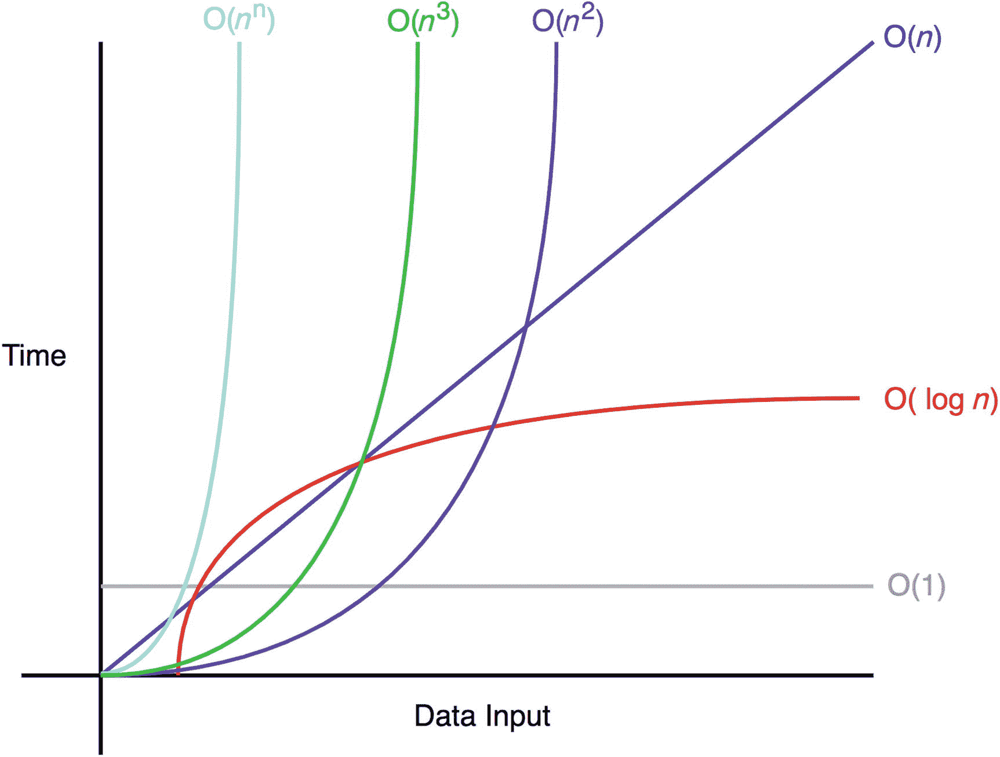

# 一、大 O 符号

> *O①是神圣的。*
> 
> -哈米德·提胡什

在学习如何实现算法之前，你应该了解如何分析算法的有效性。这一章将集中在时间和算法空间复杂性分析的 Big-O 符号的概念上。本章结束时，你将理解如何从时间(执行时间)和空间(消耗的内存)两方面分析一个算法的实现。

## 大 O 符号初级读本

Big-O 符号衡量算法的最坏情况复杂度。在 Big-O 符号中， *n* 表示输入的数量。问 Big-O 的问题如下:“当 *n* 接近无穷大时会发生什么？”

当你实现一个算法时，Big-O 符号很重要，因为它告诉你这个算法有多有效。图 [1-1](#Fig1) 显示了一些常见的 Big-O 符号。



图 1-1

常见的大 O 复杂性

下面几节用一些简单的例子说明了这些常见的时间复杂性。

### 常见示例

O(1)相对于输入空间不变。因此，O(1)被称为恒定时间。O(1)算法的一个例子是通过索引访问数组中的项。O( *n* )是*线性时间*，适用于在最坏情况下必须做 *n* 运算的算法。

O( *n* )算法的一个例子是打印从 0 到 *n* -1 的数字，如下所示:

```js
1 function  exampleLinear(n) {
2                   for  (var  i = 0 ; i <  n; i++ ) {
3                              console.log(i);
4                   }
5  }

```

同样，O(*n*T2【2】T3)是二次时间，O(*n*T6】3 是三次时间。这些复杂性的例子如下所示:

```js
1 function  exampleQuadratic(n) {
2                   for  (var  i = 0 ; i <  n; i++ ) {
3                                 console.log(i);
4                                for  (var  j =  i; j <  n; j++ ) {
5                                             console.log(j);
6                              }
7                   }
8  }

```

```js
1 function  exampleCubic(n) {
2                   for  (var  i = 0 ; i <  n; i++ ) {
3                                  console.log(i);
4                                for  (var  j =  i; j <  n; j++ ) {
5                                              console.log(j);
6                                                  for  (var  k =  j; j <  n; j++ ) {
7                                                          console.log(k);
8                                                  }
9                                }
10           }
11 }

```

最后，对数时间复杂度的一个示例算法是打印 2 和 *n* 之间的 2 的幂的元素。例如，`exampleLogarithmic(10)`将打印以下内容:

```js
2,4,8,16,32,64

```

对数时间复杂性的效率在大量输入(如一百万项)的情况下是显而易见的。虽然 *n* 是一百万，但是`exampleLogarithmic`将只打印 19 项，因为 log <sub>2</sub> (1，000，000) = 19.9315686。实现这种对数行为的代码如下:

```js
1 function  exampleLogarithmic(n) {
2                   for  (var  i = 2 ; i <=  n; i= i*2 ) {
3                          console.log(i);
4                  }
5  }

```

## 大 O 符号的规则

让我们把一个算法的复杂度表示为 f( *n* )。 *n* 表示输入次数，f( *n* ) <sub>time</sub> 表示需要的时间，f( *n* ) <sub>space</sub> 表示算法需要的空间(附加内存)。算法分析的目标是通过计算 f( *n* )来了解算法的效率。然而，计算 f( *n* )可能具有挑战性。Big-O 符号提供了一些帮助开发人员计算 f( *n* )的基本规则。

*   *系数法则*:若 f( *n* )为 O(g( *n* )，则 kf( *n* )为 O(g( *n* ))，对于任意常数 k > 0。第一个规则是*系数规则*，它排除与输入大小 *n* 无关的系数。这是因为随着 *n* 接近无穷大，另一个系数变得可以忽略不计。

*   *求和规则*:若 f( *n* )为 O(h( *n* )、g( *n* )为 O(p( *n* ))，则 f( *n* )+g( *n* )为 O(h( *n* )+p( *n* )。求和规则简单地说明，如果合成的时间复杂度是两个不同时间复杂度的和，则合成的 Big-O 符号也是两个不同的 Big-O 符号的和。

*   *乘积法则*:如果 f( *n* )是 O(h(*n*))g(*n*)是 O(p( *n* ))，那么 f( *n* )g( *n* )是 O(h( *n* )p( *n* ))。类似地，乘积法则表明，当时间复杂性增加时，Big-O 也会增加。

*   *传递规则*:若 f( *n* )为 O(g( *n* ))，g( *n* )为 O(h( *n* ))，则 f( *n* )为 O(h( *n* ))。传递规则是一种简单的方式来说明相同的时间复杂度具有相同的 Big-O。

*   *多项式法则*:若 f( *n* 为 k 次多项式，则 f( *n* )为 O(*n*T8】k)。直观地说，多项式规则表明多项式时间复杂性具有相同多项式次数的 Big-O。

*   *对数幂法则*:对数( *n* k)对于任意常数 k > 0 为 O(对数( *n* ))。对于幂规则的对数，对数函数中的常数在 Big-O 符号中也会被忽略。

应特别注意前三条规则和多项式规则，因为它们是最常用的。我将在下面的小节中讨论这些规则。

### 系数法则:“去掉常数”

我们先来回顾一下系数法则。这个规则是最容易理解的规则。它只需要您忽略任何与输入大小无关的常量。输入大时，Big-O 中的系数可以忽略不计。因此，这是 Big-O 记数法最重要的规则。

*   若 f( *n* )为 O(g( *n* ))，则 kf( *n* )为 O(g( *n* ))，对于任意常数 k > 0。

这意味着 5f( *n* )和 f( *n* )都有相同的大 O 符号 O(f( *n* ))。

下面是一个时间复杂度为 O( *n* )的代码块的例子:

```js
1   function a(n){
2       var count =0;
3       for (var i=0;i<n;i++){
4           count+=1;
5       }
6       return count;
7   }

```

这段代码有 f( *n* ) = *n* 。这是因为它增加了`count` *n* 次。因此，该函数的时间复杂度为 O( *n* ):

```js
1   function a(n){
2       var count =0;
3       for (var i=0;i<5*n;i++){
4           count+=1;
5       }
6       return count;
7   }

```

这个块有 f( *n* ) = 5 *n* 。这是因为它从 0 运行到 5 *n* 。然而，前两个例子都有 O( *n* )的 Big-O 符号。简单来说，这是因为如果 *n* 接近无穷大或者另一个大数，那四个额外的运算就没有意义了。它将执行第*次*次。任何常数在 Big-O 符号中都是可以忽略的。

下面的代码块演示了另一个具有线性时间复杂度的函数，但是在第 6 行中有一个额外的操作:

```js
1   function a(n){
2       var count =0;
3       for (var i=0;i<n;i++){
4           count+=1;
5       }
6       count+=3;
7       return count;
8   }

```

最后，这段代码有 f( *n* ) = *n* +1。上一次操作的结果是+1(计数+=3)。这仍然有一个大 O 符号 O( *n* )。这是因为 1 操作不依赖于输入 *n* 。随着 *n* 趋近于无穷大，它将变得可以忽略不计。

### 求和规则:“将 Big-Os 相加”

求和规则理解起来很直观；可以增加时间复杂度。想象一个包含两个其他算法的主算法。主算法 Big-O 符号只是另外两个 Big-O 符号的总和。

*   如果 f( *n* )是 O(h(*n*))g(*n*)是 O(p( *n* ))，那么 f( *n* )+g( *n* )是 O(h( *n* )+p( *n* )。

在应用这个规则之后，记住应用系数规则是很重要的。

下面的代码块演示了一个带有两个主循环的函数，这两个循环的时间复杂度必须单独考虑，然后求和:

```js
 1   function a(n){
 2       var count =0;
 3       for (var i=0;i<n;i++){
 4           count+=1;
 5       }
 6       for (var i=0;i<5*n;i++){
 7           count+=1;
 8       }
 9       return count;
10   }

```

在这个例子中，第 4 行有 f( *n* ) = *n* ，第 7 行有 f( *n* ) = 5 *n* 。这导致 6 个 *n 个*。但是应用系数法则，最后的结果是 O( *n* ) = *n* 。

### 产品规则:“乘以大操作系统”

乘积法则简单地说明了 Big-Os 可以相乘到什么程度。

*   如果 f( *n* )是 O(h(*n*))g(*n*)是 O(p( *n* ))，那么 f( *n* )g( *n* )是 O(h( *n* )p( *n* ))。

以下代码块演示了一个具有两个嵌套的`for`循环的函数，该函数应用了乘积规则:

```js
 1   function (n){
 2       var count =0;
 3       for (var i=0;i<n;i++){
 4           count+=1;
 5           for (var i=0;i<5*n;i++){
 6               count+=1;
 7           }
 8       }
 9       return count;
10   }

```

在这个例子中，f(*n*)= 5*n***n*，因为第 7 行运行 5 *n* 次，总共 *n* 次迭代。因此，这导致总共 5 个 *n 个*2 个操作。应用系数法则，结果是 O(*n*)=*n*<sup>2</sup>。

### 多项式规则:“大到 k 的幂”

多项式规则表明，多项式时间复杂性具有相同多项式次数的 Big-O 符号。

数学上，它如下:

*   如果 f( *n* )是 k 次多项式，那么 f( *n* )是 O(*n*T6】k)。

下面的代码块只有一个二次时间复杂度的`for`循环:

```js
1   function a(n){
2       var count =0;
3       for (var i=0;i<n*n;i++){
4           count+=1;
5       }
6       return count;
7   }

```

在这个例子中，f(*n*)=*n*ˇ2，因为第 4 行运行了 *n* * *n* 次迭代。

这是对 Big-O 符号的一个快速概述。随着这本书的进展，还会有更多的内容。

## 摘要

Big-O 对于分析和比较算法的效率非常重要。对 Big-O 的分析从查看代码和应用规则来简化 Big-O 符号开始。以下是最常用的规则:

*   消除系数/常数(系数规则)

*   将大 0 相加(求和规则)

*   乘法大操作系统(产品规则)

*   通过查看循环来确定 Big-O 符号的多项式(多项式规则)

## 练习

计算每个练习代码片段的时间复杂度。

### 练习 1

```js
1   function someFunction(n) {
2
3       for (var i=0;i<n*1000;i++) {
4           for (var j=0;j<n*20;j++) {
5               console.log(i+j);
6           }
7       }
8
9   }

```

### 练习 2

```js
 1   function someFunction(n) {
 2
 3       for (var i=0;i<n;i++) {
 4           for (var j=0;j<n;j++) {
 5               for (var k=0;k<n;k++) {
 6                   for (var l=0;l<10;l++) {
 7                       console.log(i+j+k+l);
 8                   }
 9               }
10           }
11       }
12
13   }

```

### 练习 3

```js
1   function someFunction(n) {
2
3       for (var i=0;i<1000;i++) {
4           console.log("hi");
5       }
6
7   }

```

### 练习

```js
1   function someFunction(n) {
2
3       for (var i=0;i<n*10;i++) {
4           console.log(n);
5       }
6
7   }

```

### 练习 5

```js
1   function someFunction(n) {
2
3       for (var i=0;i<n;i*2) {
4           console.log(n);
5       }
6
7   }

```

### 练习 6

```js
1   function someFunction(n) {
2
3       while (true){
4           console.log(n);
5       }
6   }

```

### 答案

1.  o(*n*T2】2

    有两个嵌套循环。忽略 *n* 前面的常数。

2.  o(*n*T2】3

    有四个嵌套循环，但最后一个循环只运行到 10。

3.  O(1)

    持续的复杂性。该函数从 0 到 1000。这个不取决于 *n* 。

4.  O( *n* )

    线性复杂度。该功能从 0 到 10 *n* 运行。常量在 Big-O 中被忽略。

5.  o(日志<sub>2</sub>T2】n

    对数复杂度。对于给定的 *n* ，这只运行 log <sub>*2*</sub> *n* 次，因为 I 是通过乘以 2 来递增的，而不是像其他例子中那样加 1。

6.  O（∞）

    无限循环。这个功能不会结束。