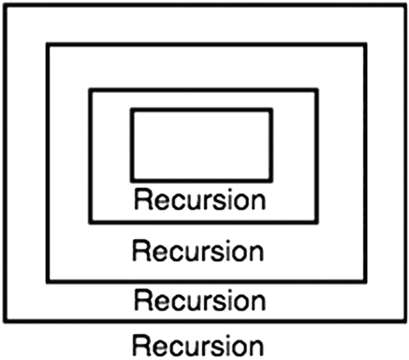
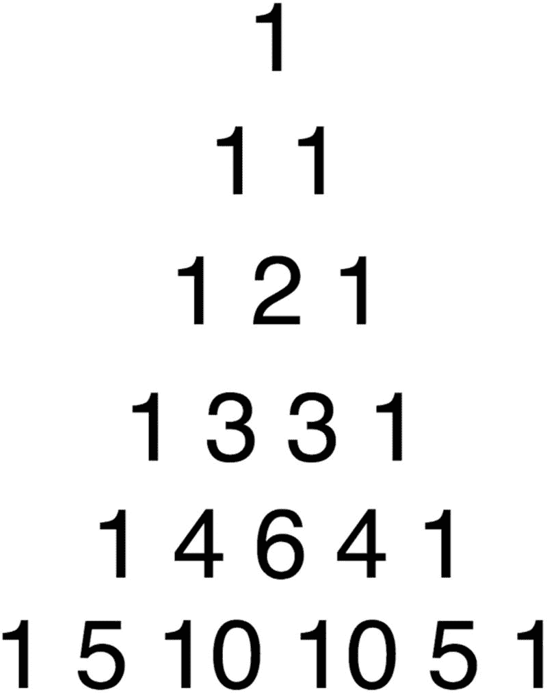
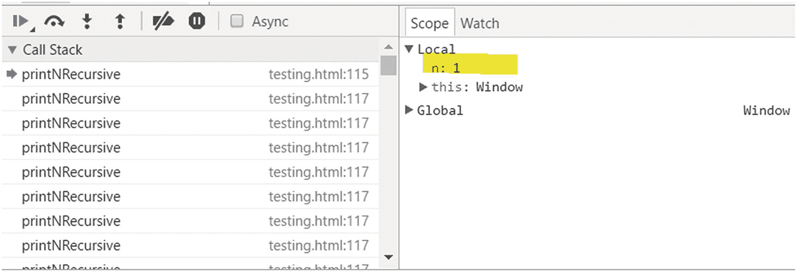
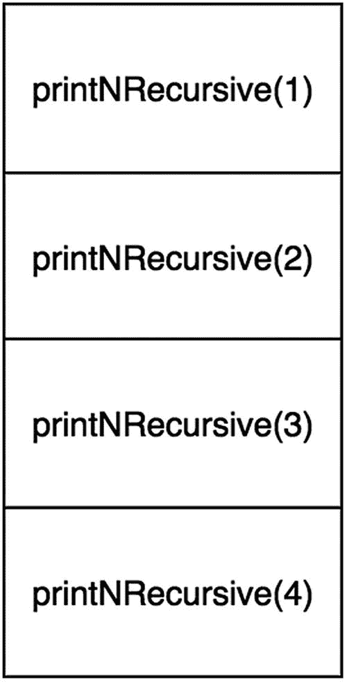
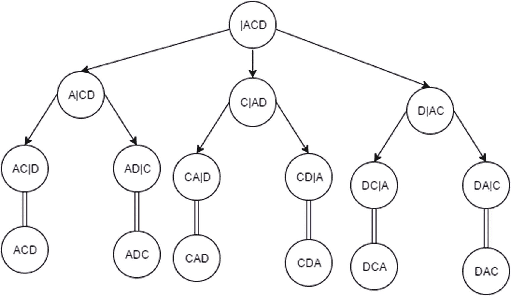
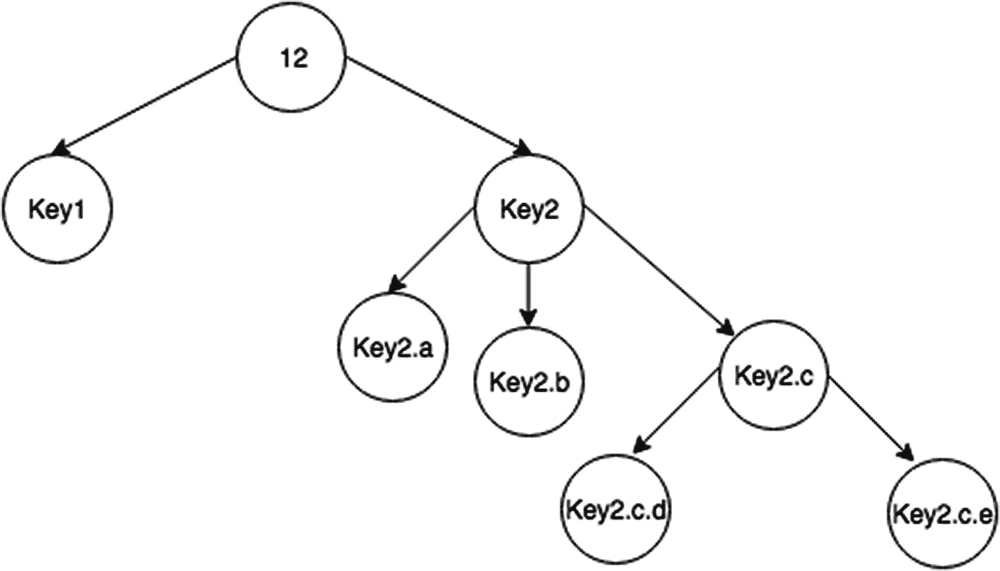

# 八、递归

本章介绍递归和递归算法的概念。首先，将探索递归的定义和递归算法的基本规则。此外，分析递归函数效率的方法将使用数学符号详细介绍。最后，章节练习将有助于巩固这些信息。

## 引入递归

在数学、语言学和艺术中，*递归*指的是根据自身定义的事物的发生。在计算机科学中，*递归函数*是一个调用自身的函数。递归函数通常很优雅，通过“分而治之”的方法解决复杂的问题。递归很重要，因为你会在各种数据结构的实现中一次又一次地看到它。图 8-1 展示了一个递归的可视化说明，其中图片有自己的更小的图片。



图 8-1

图解递归

## 递归规则

当递归函数实现不正确时，会导致致命的问题，因为程序会被卡住而不会终止。无限递归调用导致栈溢出。*栈溢出*是程序的调用栈的最大数量超过了地址空间(内存)的限量。

为了正确实现递归函数，它们必须遵循一定的规则，以避免栈溢出。这些规则将在下面介绍。

### 基础案例

在递归中，必须有一个基础用例(也称为*终止用例*)。因为递归方法调用它们自己，除非达到这个基本情况，否则它们永远不会停止。递归导致的栈溢出很可能是因为没有合适的基本用例。在基本情况下，有*没有*递归函数调用。

让我们看看下面的函数，它打印从`n`到 0 的数字作为例子:

```js
 1   function countDownToZero(n) {
 2       // base case. Stop at 0
 3       if (n < 0) {
 4           return; // stop the function
 5       } else {
 6           console.log(n);
 7           countDownToZero(n - 1); // count down 1
 8       }
 9   }
10   countDownToZero(12);

```

该功能的基本情况是当`n`小于或等于 0 时。这是因为期望的结果是从 0 开始停止计数。如果输入的是负数，由于基本情况，它不会打印该数字。除了一个基本案例，这个递归函数还展示了分治法。

### 分治法

在计算机科学中，*分而治之*方法是指通过解决一个问题的所有较小部分来解决该问题。以倒计时为例，从 2 开始倒计时可以通过打印 2 然后*从 1 开始倒计时*来解决。这里，从 1 开始倒数的*是通过“分而治之”解决的部分有必要将问题变小以达到基本情况。否则，如果递归调用没有收敛到基本情况，就会发生栈溢出。*

现在让我们检查一个更复杂的递归函数，称为*斐波那契数列*。

### 经典例子:斐波那契数列

斐波那契数列是一个无限数字的列表，每个数字都是过去两项的总和(从 1 开始)。

*   1, 1, 2, 3, 5, 8, 13, 21 …

你如何编写程序来打印斐波那契数列的第 n 项？

#### 迭代解法:斐波那契数列

使用`for`循环的迭代解决方案可能如下所示:

```js
 1   function getNthFibo(n) {
 2       if ( n <= 1)  return n;
 3       var sum = 0,
 4           last = 1,
 5           lastlast = 0;
 6
 7       for (var i = 1; i < n; i++) {
 8           sum = lastlast + last;
 9           lastlast = last;
10           last = sum;
11       }
12       return sum;
13   }

```

一个`for`循环可以用来跟踪斐波纳契数列的最后两个元素，它的和产生斐波纳契数。

现在，这是如何递归完成的呢？

#### 递归解:斐波那契

下面显示了递归解决方案:

```js
1   function getNthFibo(n) {
2       if (n <= 1) {
3           return n;
4       } else {
5           return getNthFibo(n - 1) + getNthFibo(n - 2);
6       }
7   }

```

**基本情况:**斐波纳契数列的基本情况是第一个元素是 1。

**分而治之:**根据斐波那契数列的定义，第 n 个斐波那契数是第( *n* -1)个和第( *n* -2)个斐波那契数之和。但是，这种实现的时间复杂度为 O(2 <sup>*n*</sup> )，这将在本章后面详细讨论。在下一节中，我们将使用尾部递归来探索斐波那契数列的更有效的递归算法。

### 斐波那契数列:尾部递归

*尾递归*函数是递归函数，其中递归调用是函数中最后执行的东西。首先让我们看看迭代解:

```js
 1   function getNthFibo(n) {
 2       if ( n <= 1)  return n;
 3       var sum = 0,
 4           last = 1,
 5          lastlast = 0;
 6
 7       for (var i = 1; i < n; i++) {
 8           sum = lastlast + last;
 9           lastlast = last;
10           last = sum;
11       }
12       return sum;
13   }

```

在每次迭代中，会发生以下更新:`(lastlast, last) = (last, lastlast+last)`。利用这种结构，可以形成下面的递归函数:

```js
1   function getNthFiboBetter(n, lastlast, last) {
2       if (n == 0) {
3           return lastlast;
4       }
5       if (n == 1) {
6           return last;
7       }
8       return getNthFiboBetter(n-1, last, lastlast + last);
9   }

```

**时间复杂度:** O( *n*

这个函数最多执行 *n* 次，因为每次只有一次递归调用，它就递减 *n* -1。

**空间复杂度** : O( *n*

因为这个函数使用了栈调用，所以空间复杂度也是 O( *n* )。这将在本章后面的“递归调用栈内存”一节中进一步解释。

为了总结递归的规则，让我们检查另一个更复杂的例子。

### 帕斯卡三角形

在这个例子中，将探索用于计算帕斯卡三角形的一项的函数。*帕斯卡三角形*是一个三角形，其元素值是其顶两(左、右)值之和，如图 8-2 。



图 8-2

帕斯卡三角形

**基本情况:**帕斯卡三角形的基本情况是顶元素(row=1，col=1)为 1。其他的一切都是单单从这个事实推导出来的。因此，当列为 1 时，返回 1，当行为 0 时，返回 0。

**分而治之:**根据帕斯卡三角形的数学定义，帕斯卡三角形的一项定义为其上项之和。因此，这可以表述为:`pascalTriangle(row - 1, col) + pascalTriangle(row - 1, col - 1)`。

```js
 1   function pascalTriangle(row, col) {
 2       if (col == 0) {
 3           return 1;
 4       } else if (row == 0) {
 5           return 0;
 6       } else {
 7           return pascalTriangle(row - 1, col) + pascalTriangle(row - 1, col - 1);
 8       }
 9   }
10   pascalTriangle(5, 2); // 10

```

这就是递归的妙处！接下来看看这段代码有多短多优雅。

## 大 O 代表递归

在第一章中，没有涉及递归算法的 Big-O 分析。这是因为递归算法很难分析。为了对递归算法进行 Big-O 分析，必须分析其递归关系。

### 递推关系

在迭代实现的算法中，Big-O 分析要简单得多，因为循环清楚地定义了何时停止以及每次迭代增加多少。为了分析递归算法，使用递归关系。递归关系由两部分分析组成:基础情况的 Big-O 和递归情况的 Big-O。

让我们重温一下简单的斐波那契数列例子:

```js
function getNthFibo(n) {
    if (n <= 1) {
        return n;
    } else {
        return getNthFibo(n - 1) + getNthFibo(n - 2);
    }
}
getNthFibo(3);

```

基本情况的时间复杂度为 O(1)。递归情况调用自己两次。我们把这个表示为*T*(*n*)=*T*(*n*1)+*T*(*n*2)+O(1)。

*   **基本情况:** *T* ( *n* ) = O(1)

*   **递归情况:***T*(*n*)=*T*(*n*1)+*T*(*n*2)+O(1)

现在，这个关系意味着，既然*T*(*n*)=*T*(*n*1)+*T*(*n*2)+O(1)，那么(通过将 *n* 替换为*n*1)，*T*(*n*1)=*用*n*2 替换*n*1 得到*T*(*n*2)=*T*(*n*3)+*T*(*n*4)+O(1)。因此，你可以看到，对于每个调用，每个调用都有两个以上的调用。换句话说，这有 O 的时间复杂度(2 <sup>*n*</sup> )。*

把它想象成这样会有所帮助:

```js
F(6)                * <-- only once
F(5)                *
F(4)                **
F(3)               ****
F(2)             ********
F(1)         ****************         <-- 16
F(0) ******************************** <-- 32

```

用这种方法计算 Big-O 很困难，而且容易出错。谢天谢地，有一个叫做*主定理*的概念可以帮忙。主定理帮助程序员轻松分析递归算法的时间和空间复杂性。

### 主定理

主定理陈述如下:

*   给定一个形式为*T*(*n*)=*aT*(*n*/*b*)+O(*n*<sup>*c*</sup>)的递推关系，其中 a > = 1，b > =1，有三种情况。

*a* 是与递归调用相乘的系数。 *b* 是“对数”项，是递归调用过程中划分 *n* 的项。最后， *c* 是方程非递归分量上的多项式项。

第一种情况是非递归分量 O( *n* <sup>*c*</sup> )上的多项式项小于*log*<sub>*b*</sub>(*a*)时。

*   **案例一:***c<log*<sub>b</sub>(*a*)*然后 T*(*n*)= O(*n*<sup>(*logb*(*a*))。</sup>

*   比如*T*(*n*)= 8*T*(*n*/2)+1000*n*<sup>2</sup>

*   **识别 a，b，c:** *a* = 8， *b* = 2， *c* = 2

*   **评估:** *日志* <sub>2</sub> (8) = 3。*c<3 满足。*

*   **结果:***T*(*n*)= O(*n*3)

第二种情况是当 c 为*等于*对*log*<sub>b</sub>(*a*)。

*   **案例二:***c*=*log*<sub>*b*</sub>(*a*)*然后 T*(*n*)= O(*n*<sup>*c*</sup>*log*(*n*)。

*   比如*T*(*n*)= 2*T*(*n*/2)+10*n*。

*   **确定 a，b，c:** *a* = 2， *b* = 2， *c* = 1

*   **求值:** *日志* <sub>2</sub> (2) = 1。 *c* = 1 满足。

*   **结果:***(*n*)= o(*n**【c】**日志**

 **第三种也是最后一种情况是当 *c* 大于*log*<sub>*b*</sub>(*a*)时*。*

*   **案例三:***c>log*<sub>b</sub>(*a*)*然后 T*(*n*)= O(*f*(*n*))。

*   比如*T*(*n*)= 2*T*(*n*/2)+*n*<sup>2</sup>。

*   **确定 a，b，c:** a = 2，b = 2，c = 2

*   **求值:** *日志* <sub>2</sub> (2) = 1。*c>1 满足。*

*   **结果:***T*(*n*)=*f*(*n*)= O(*n*<sup>2</sup>)

这一节介绍了很多关于分析递归算法的时间复杂度。空间复杂性分析同样重要。递归函数调用使用的内存也应该记录下来，并进行空间复杂度分析。

## 递归调用栈内存

当一个递归函数调用它自己时，会占用内存，这在 Big-O *space* 复杂性分析中非常重要。

例如，这个从 *n* 到 1 的简单打印函数在空间中递归地取 O( *n* ):

```js
1   function printNRecursive(n) {
2       console.log(n);
3       if (n > 1){
4           printNRecursive(n-1);
5       }
6   }
7   printNRecursive(10);

```

开发人员可以在浏览器或任何 JavaScript 引擎上运行该程序，并将在调用栈中看到如图 8-3 所示的结果。



图 8-3

开发人员工具中的调用栈

如图 8-3 和 8-4 所示，每个递归调用都必须存储在内存中，直到基本情况得到解决。由于调用栈，递归算法需要额外的内存。



图 8-4

调用栈内存

递归函数有一个额外的空间复杂性成本，它来自需要存储在操作系统内存栈中的递归调用。栈被累积，直到基础案例被解决。事实上，这通常是迭代解决方案优于递归解决方案的原因。在最坏的情况下，如果基本情况实现不正确，递归函数将导致程序崩溃，因为当内存栈中的元素超过允许的数量时，会出现栈溢出错误。

## 摘要

递归是实现复杂算法的强大工具。回想一下，所有递归函数都由两部分组成:基本情况和分治法(解决子问题)。

分析这些递归算法的 Big-O 可以凭经验(不推荐)或通过使用主定理来完成。回想一下，主定理需要以下形式的递推关系:*T*(*n*)=*aT*(*n*/*b*)+O(*n*<sup>*c*</sup>)。使用主定理时，识别 *a* 、 *b* 和 *c* 来确定它属于主定理三种情况中的哪一种。

最后，在实现和分析递归算法时，要考虑递归函数调用的调用栈所导致的额外内存。每个递归调用在运行时都需要在调用栈中有一个位置；当调用栈累计 *n 次*调用时，那么函数的空间复杂度为 O( *n* )。

## 练习

这些递归练习涵盖了不同的问题，有助于巩固从本章学到的知识。重点应该是在解决整个问题之前首先确定正确的基础案例。你可以在 GitHub 上找到所有练习的代码。 <sup>1</sup>

### 将十进制(以 10 为基数)转换为二进制数

要做到这一点，请将数字除以 2，每次计算模数(余数)和除法。

**基本情况:**这个问题的基本情况是当 *n* 小于 2 时。小于 2 时，只能是 0 或 1。

```js
 1   function base10ToString(n) {
 2       var binaryString = "";
 3
 4       function base10ToStringHelper(n) {
 5           if (n < 2) {
 6               binaryString += n;
 7               return;
 8           } else {
 9               base10ToStringHelper(Math.floor(n / 2));
10               base10ToStringHelper(n % 2);
11           }
12       }
13       base10ToStringHelper(n);
14
15       return binaryString;
16   }
17
18   console.log(base10ToString(232)); // 11101000

```

**时间复杂度:**O(*log*<sub>2</sub>(*n*))

时间复杂度是对数的，因为递归调用将 *n* 除以 2，这使得算法很快。例如，对于 *n* = 8，它只执行三次。对于 *n* =1024，它执行 10 次。

**空间复杂度:**O(*log*<sub>2</sub>(*n*))

### 打印数组的所有排列

这是一个经典的递归问题，也是一个很难解决的问题。问题的前提是在每个可能的位置交换数组的元素。

先来画一下这个问题的递归树(见图 8-5 )。



图 8-5

数组递归树的排列

**基本情况:** `beginIndex`等于`endIndex`。

当这种情况发生时，函数应该打印当前的排列。

**排列:**我们需要一个函数来交换元素:

```js
 1   function swap(strArr, index1, index2) {
 2       var temp = strArr[index1];
 3       strArr[index1] = strArr[index2];
 4       strArr[index2] = temp;
 5   }

 1   function permute(strArr, begin, end) {
 2       if (begin == end) {
 3           console.log(strArr);
 4       } else {
 5           for (var i = begin; i < end + 1; i++) {
 6               swap(strArr, begin, i);
 7               permute(strArr, begin + 1, end);
 8               swap(strArr, begin, i);
 9           }
10       }
11   }
12
13   function permuteArray(strArr) {
14       permute(strArr, 0, strArr.length - 1);
15   }
16
17   permuteArray(["A", "C", "D"]);
18   // ["A", "C", "D"]
19   // ["A", "D", "C"]
20   // ["C", "A", "D"]
21   // ["C", "D", "A"]
22   // ["D", "C", "A"]
23   // ["D", "A", "C"]

```

**时间复杂度:** O( *n* ！)

**空间复杂度:** O( *n* ！)

有`n!`种排列，它创建了`n!`个调用栈。

### 弄平一个物体

给定这样一个 JavaScript 数组:

```js
 1   var dictionary = {
 2       'Key1': '1',
 3       'Key2': {
 4           'a' : '2',
 5           'b' : '3',
 6           'c' : {
 7               'd' : '3',
 8               'e' : '1'
 9           }
10       }
11   }

```

展平成`{'Key1': '1', 'Key2.a': '2','Key2.b' : '3', 'Key2.c.d' : '3', 'Key2.c.e' : '1'}`，在父子之间用`.`表示子(见图 8-6 )。



图 8-6

展平字典递归树

要做到这一点，迭代任何属性并递归地检查它的子属性，传入连接的字符串名称。

**基本情况:**这个问题的基本情况是输入不是对象的时候。

```js
 1   function flattenDictionary(dictionary) {
 2       var flattenedDictionary = {};
 3
 4       function flattenDitionaryHelper(dictionary, propName) {
 5           if (typeof dictionary != 'object') {
 6               flattenedDictionary[propName] = dictionary;
 7               return;
 8           }
 9           for (var prop in dictionary) {
10               if (propName == "){
11                   flattenDitionaryHelper(dictionary[prop], propName+prop);
12               } else {
13                   flattenDitionaryHelper(dictionary[prop], propName+'.'+prop);
14               }
15           }
16       }
17
18       flattenDitionaryHelper(dictionary, ");
19       return flattenedDictionary;
20   }

```

**时间复杂度:** O( *n*

**空间复杂度:** O( *n*

每个属性只被访问一次，并且每 *n* 个属性存储一次。

### 写一个程序，递归地确定一个字符串是否是回文

一个*回文*是一个向后和向前拼写相同的单词，如*神化*、*赛车*、 *testset* 和 *aibohphobia* (对回文的恐惧)。

```js
 1   function isPalindromeRecursive(word) {
 2       return isPalindromeHelper(word, 0, word.length-1);
 3   }
 4
 5   function isPalindromeHelper(word, beginPos, endPos) {
 6       if (beginPos >= endPos) {
 7           return true;
 8       }
 9       if (word.charAt(beginPos) != word.charAt(endPos)) {
10           return false;
11       } else {
12           return isPalindromeHelper(word, beginPos + 1, endPos - 1);
13       }
14   }
15
16   isPalindromeRecursive('hi'); // false
17   isPalindromeRecursive('iii'); // true
18   isPalindromeRecursive('ii'); // true
19   isPalindromeRecursive('aibohphobia'); // true
20   isPalindromeRecursive('racecar'); // true

```

这背后的想法是，用两个索引(一个在前面，一个在后面)，你检查每一步，直到前面和后面相遇。

**时间复杂度:** O( *n*

**空间复杂度:** O( *n*

由于递归调用栈，这里的空间复杂度仍然是 O( *n* )。请记住，调用栈仍然是内存的一部分，即使它没有声明变量或存储在数据结构中。

<aside class="FootnoteSection" epub:type="footnotes">Footnotes 1

[`https://github.com/Apress/js-data-structures-and-algorithms`](https://github.com/Apress/js-data-structures-and-algorithms)

 </aside>**