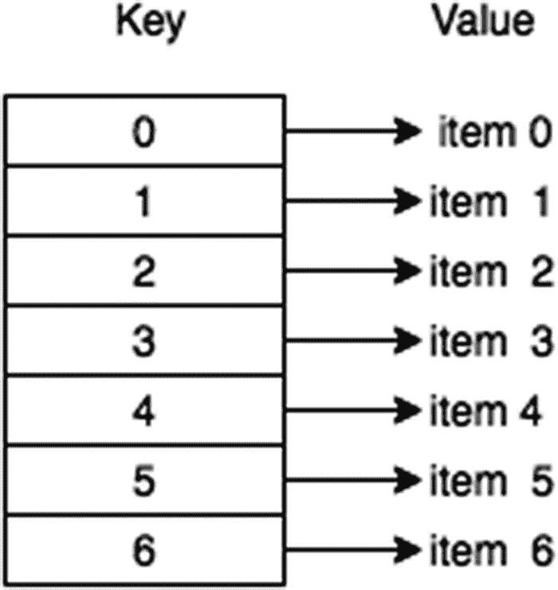
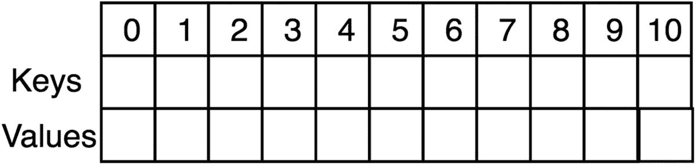
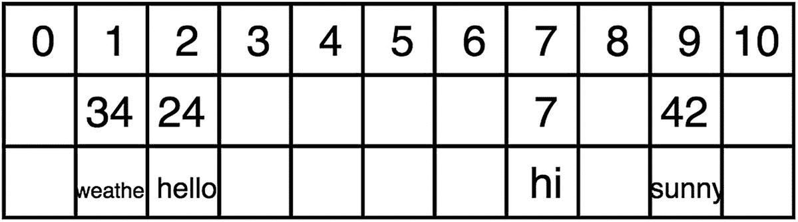
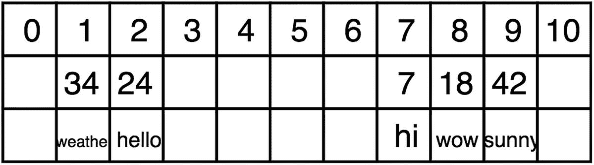
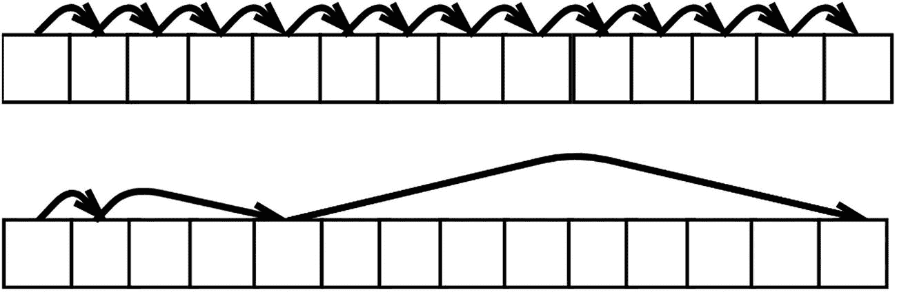

# 十一、哈希表

*哈希表*是一种固定大小的数据结构，其大小是在开始时定义的。本章通过重点介绍哈希(生成唯一键的方法)来解释哈希表是如何工作的。本章结束时，你将理解各种散列技术，并知道如何从头开始实现一个散列表。

## 哈希表简介

哈希表非常适合基于键值对快速存储和检索数据。在 JavaScript 中，JavaScript 对象通过定义一个键(属性)及其相关值来实现这种工作方式。图 11-1 显示了每个按键及其相关项目。



图 11-1

简单哈希表概述

哈希表包含两个主要函数:`put()`和`get()`。`put()`用于将数据存储到哈希表中，而`get()`用于从哈希表中检索数据。这两个函数的时间复杂度都是 O(1)。

简而言之，哈希表类似于一个数组，其索引是用哈希函数计算的，以唯一地标识内存中的空间。

`localStorage`是基于散列表的数据结构的例子。它是所有主流浏览器都支持的原生 JavaScript 对象。它允许开发人员将数据保存在浏览器中，这意味着可以在会话后访问这些数据。

```js
1   localStorage.setItem("testKey","testValue");
2   location = location; // refreshes the page
3
4   //-----------------------------------
5   localStorage.getItem("testKey"); // prints "testValue"

```

## 哈希技术

哈希表最重要的部分是哈希函数。hash 函数将指定的键转换为存储所有数据的数组的索引。一个好的散列函数的三个主要要求如下:

*   *确定性*:相等的键产生相等的哈希值。

*   *效率*:在时间上应该是 O(1)。

*   *均匀分布*:最大限度利用数组。

第一种散列技术是使用质数。通过对素数使用模数运算符，可以保证索引的均匀分布。

### 素数散列法

质数在散列法中很重要。这是因为使用质数的模数除法以分布式方式产生数组索引。

```js
Modulus number: 11
        4 % 11     = 4
        7 % 11     = 7
        9 % 11     = 9
       15 % 11     = 4

```

可以看到 15 和 4 产生相同密钥的冲突；本章稍后将讨论如何处理这种冲突。这里重要的是素数的模保证了固定大小的最佳分布。小的非质数(如 4)的模数只能保证从 0 到 3 的范围，并且会导致大量的冲突。

```js
Modulus number: 4
        6 % 4      = 2
       10 % 4      = 2

```

这是我们将观察到的第一种散列技术。看一下图 11-2 ，这是一个散列表，有两个大小为 11 的数组，11 个元素都是空的。一个数组用于键，另一个用于值。



图 11-2

大小为 11 的哈希表，所有元素都为空

在这个例子中，键是整数，字符串被存储为键。让我们散列下面的键值对:

```js
{key:7, value: "hi"}
{key:24, value: "hello"}
{key:42, value: "sunny"}
{key:34, value: "weather"}

Prime number: 11
7 % 11  = 7
24 % 11 = 2
42 % 11 = 9
34 % 11 = 1

```

在插入所有的键值对之后，产生的散列表如图 11-3 所示。



图 11-3

插入值对后的哈希表

现在我们散列{key:18，value:“wow”}。

```js
Prime number: 11
18 % 11  = 7

```

这是一个问题，因为 7 已经存在于 7 的索引中，并会导致索引冲突。有了完美的散列函数，就不会有冲突。然而，在大多数情况下，无冲突哈希几乎是不可能的。因此，哈希表需要处理冲突的策略。

### 探索

为了解决发生的冲突，探测散列技术在数组中查找下一个可用的索引。*线性探测*技术通过增量试验寻找下一个可用索引来解决冲突，而*二次探测*使用二次函数来生成增量试验。

#### 线性探测

线性探测通过一次递增一个索引来寻找下一个可用的索引。例如，在 18 和 7 散列到同一个键的情况下，18 将被散列到键 8 中，因为那是下一个空位(参见图 11-4 )。



图 11-4

使用线性探测后的哈希表 1

然而，现在当使用`get(key)`函数时，它必须从原始散列结果(7)开始，然后迭代直到找到 18。

线性探测的主要缺点是它容易创建*簇*，这是不好的，因为它们创建了更多的数据来迭代。

#### 二次探测

二次探测是解决集群问题的好方法。二次探测使用完美的平方，而不是每次递增 1，这有助于在可用索引中均匀分布，如图 11-5 所示。



图 11-5

线性探测(顶部)和二次探测(底部)

```js
h + (1)², h + (2)², h + (3)², h + (4)²
h + 1, h + 4, h + 9, h + 16

```

### 重新散列/双重散列

另一个统一分配密钥的好方法是使用第二个散列函数，对原始结果进行散列。这是良好的第二散列函数的三个主要要求:

*   *不同*:需要不同才能更好的分配。

*   *效率*:时间上应该还是 O(1)。

*   *非零*:永远不应该评估为零。零表示初始哈希值。

常用的第二种散列函数如下:

*   *哈希 2（x） = R − （x % R）*

这里， *x* 是第一次哈希的结果， *R* 小于哈希表的大小。每个哈希冲突通过以下方式解决，其中 *i* 是迭代试验次数:

*   *我* * *【散列】**(*x**

## 哈希表实现

既然已经解释了哈希表，让我们从头实现一个。在本节中，您将对同一个示例应用三种不同的技术。下面是将要使用的键-值对示例:

*   7、“嗨”

*   20、“你好”

*   33、《阳光灿烂》

*   46、《天气》

*   59、“哇”

*   72、《四十》

*   85、“快乐”

*   98、《伤心》

### 使用线性探测

让我们从简单的线性探测开始这个例子。

```js
 1   function HashTable(size) {
 2       this.size = size;
 3       this.keys = this.initArray(size);
 4       this.values = this.initArray(size);
 5       this.limit = 0;
 6   }
 7
 8   HashTable.prototype.put = function(key, value) {
 9       if (this.limit >= this.size) throw 'hash table is full'
10
11       var hashedIndex = this.hash(key);
12
13       // Linear probing
14       while (this.keys[hashedIndex] != null) {
15           hashedIndex++;
16
17           hashedIndex = hashedIndex % this.size;
18
19       }
20
21       this.keys[hashedIndex] = key;
22       this.values[hashedIndex] = value;
23       this.limit++;
24   }
25
26   HashTable.prototype.get = function(key) {
27       var hashedIndex = this.hash(key);
28
29       while (this.keys[hashedIndex] != key) {
30           hashedIndex++;
31
32           hashedIndex = hashedIndex % this.size;
33
34       }
35       return this.values[hashedIndex];
36   }
37
38   HashTable.prototype.hash = function(key) {

39       // Check if int
40       if (!Number.isInteger(key)) throw 'must be int';
41           return key % this.size;
42   }
43
44   HashTable.prototype.initArray = function(size) {
45       var array = [];
46       for (var i = 0; i < size; i++) {
47           array.push(null);
48       }
49       return array;
50   }
51
52   var exampletable = new HashTable(13);
53   exampletable.put(7, "hi");
54   exampletable.put(20, "hello");
55   exampletable.put(33, "sunny");
56   exampletable.put(46, "weather");
57   exampletable.put(59, "wow");
58   exampletable.put(72, "forty");
59   exampletable.put(85, "happy");
60   exampletable.put(98, "sad");

```

结果如下:

```js
Keys:
        [ 85, 98, null, null, null, null, null, 7, 20, 33, 46, 59, 72 ]
Values:
        [ 'happy', 'sad', null, null, null, null, null, 'hi', 'hello', 'sunny', 'weather', 'wow', 'forty' ]

```

### 使用二次探测

现在，让我们将`put()`和`get()`方法改为使用二次探测。

```js
 1   HashTable.prototype.put = function (key, value) {
 2       if (this.limit >= this.size) throw 'hash table is full'
 3
 4       var hashedIndex = this.hash(key), squareIndex = 1;
 5
 6       // quadratic probing
 7       while (this.keys[hashedIndex] != null) {
 8           hashedIndex += Math.pow(squareIndex,2);
 9
10           hashedIndex
11           squareIndex++;
12       }
13
14       this.keys[hashedIndex] = key;
15       this.values[hashedIndex] = value;
16       this.limit++;
17   }
18
19   HashTable.prototype.get = function (key) {
20       var hashedIndex = this.hash(key), squareIndex = 1;
21
22       while ( this.keys[hashedIndex] != key ) {
23           hashedIndex += Math.pow(squareIndex, 2);
24
25           hashedIndex = hashedIndex % this.size;
26           squareIndex++;
27       }
28
29       return this.values[hashedIndex];
30   }

```

结果如下:

```js
Keys:
        [ null, null, null, 85, 72, null, 98, 7, 20, null, 59, 46, 33 ]
Values:
        [ null, null,  null, 'happy', 'forty', null, 'sad', 'hi', 'hello', null, 'wow', 'weather',  'sunny' ]

```

该结果比线性探测的结果分布更均匀。更大的数组和更多的元素会更容易看到。

### 使用带有线性探测的双重散列

最后，让我们结合双重散列和线性探测。回想一下常见的第二个哈希函数，*hash*<sub>2</sub>(*x*)=*R—*(*x % R*)，其中 *x* 是第一次哈希的结果， *R* 小于哈希表的大小。

```js
 1   HashTable.prototype.put = function(key, value) {
 2       if (this.limit >= this.size) throw 'hash table is full'
 3
 4       var hashedIndex = this.hash(key);
 5
 6       while (this.keys[hashedIndex] != null) {
 7           hashedIndex++;
 8
 9           hashedIndex = hashedIndex % this.size;
10
11       }
12       this.keys[hashedIndex] = key;
13       this.values[hashedIndex] = value;
14       this.limit++;
15   }
16
17   HashTable.prototype.get = function(key) {
18       var hashedIndex = this.hash(key);
19
20       while (this.keys[hashedIndex] != key) {
21           hashedIndex++;
22
23           hashedIndex = hashedIndex % this.size;
24
25       }
26       return this.values[hashedIndex];
27   }
28
29   HashTable.prototype.hash = function(key) {
30       if (!Number.isInteger(key)) throw 'must be int'; // check if int
31       return this.secondHash(key % this.size);
32   }
33
34   HashTable.prototype.secondHash = function(hashedKey) {
35       var R = this.size - 2;
36       return R - hashedKey % R;
37   }

```

结果如下:

```js
Keys:
        [ null, 59, 20, 85, 98, 72, null, 7, null, 46, null, 33, null ]
Values:
        [ null, 'wow', 'hello', 'happy', 'sad', 'forty', null, 'hi', null, 'weather', null, 'sunny', null ]

```

同样，与线性探测的结果相比，双重散列产生更均匀分布的阵列。二次探测和双重散列都是减少哈希表中冲突数量的很好的技术。有比这些技术更高级的冲突解决算法，但是它们超出了本书的范围。

## 摘要

哈希表是一种固定大小的数据结构，其大小是在开始时定义的。哈希表是使用哈希函数为数组生成索引来实现的。一个好的散列函数是确定的、高效的和均匀分布的。使用一个好的均匀分布的散列函数应该可以最小化散列冲突，但是有些冲突是不可避免的。哈希冲突处理技术包括但不限于线性探测(将索引递增 1)、二次探测(使用二次函数来递增索引)和双重哈希(使用多个哈希函数)。

下一章探索栈和队列，它们是动态调整大小的数据结构。