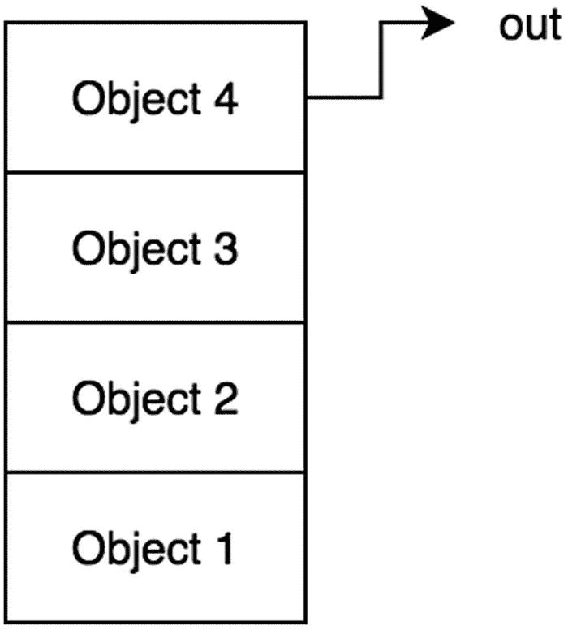
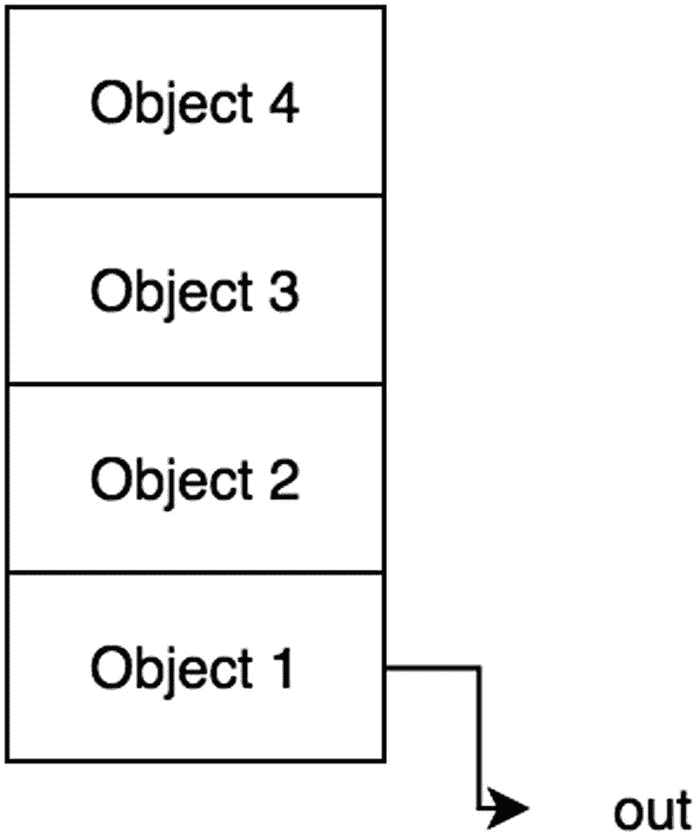

# 十二、栈和队列

本章介绍栈和队列；两者都是通用的数据结构，通常用于实现其他更复杂的数据结构。您将了解什么是栈和队列，如何以及何时使用它们，以及如何实现它们。最后，练习将帮助你理解这些概念，以及什么时候应用栈和队列来解决算法问题。

## 大量

一个*栈*是一个数据结构，其中只有最后插入的元素可以被移除和访问(见图 [12-1](#Fig1) )。想象一下把盘子堆在桌子上。要到达底部的一个，你必须移除顶部的所有其他的。这就是所谓的*后进先出* (LIFO)原则。栈很棒，因为它很快。因为已知最后一个元素将被移除，所以查找和插入发生在常数时间 O(1)内。当您需要处理 LIFO 形式的数据时，应该使用栈而不是数组，在这种情况下，算法只需要访问最后添加的元素。栈的限制是它们不能像数组那样直接访问非最后添加的元素；此外，访问更深层次的元素需要从数据结构中删除元素。



图 12-1

栈，后进先出

在 JavaScript 中，数组有定义栈类的方法:`pop`和`push`(如第 [5](05.html) 章所讨论的)。这样，可以很容易地实现栈。

下面是一些基本代码。你可以在 GitHub 上找到代码。 <sup>[1](#Fn1)</sup>

```js
 1   function Stack(array){
 2       this.array = [];
 3       if(array) this.array = array;
 4   }
 5
 6   Stack.prototype.getBuffer = function(){
 7       return this.array.slice();
 8   }
 9
10   Stack.prototype.isEmpty = function(){
11       return this.array.length == 0;
12   }
13
14   //instance of the stack class
15   var stack1 = new Stack();
16
17   console.log(stack1); // {array: []}

```

让我们首先考虑“偷看”最近添加的元素。这可以简单地通过使用数组的最大索引来完成。

### 偷看

*窥视*栈最后添加的元素意味着返回最后添加的元素，而不从数据结构中移除它。扫视通常用于将最后添加的元素与其他变量进行比较，并评估最后添加的元素是否应该从数据结构中删除。

```js
1   Stack.prototype.peek = function(){
2       return this.array[this.array.length-1];
3   }
4   stack1.push(10);
5   console.log(stack1.peek()); // 10
6   stack1.push(5);
7   console.log(stack1.peek()); // 5

```

**时间复杂度:** O(1)

### 插入

插入栈可以通过 JavaScript 数组本身支持的`push`函数来完成。

```js
1   Stack.prototype.push = function(value){
2       this.array.push(value);
3   }
4
5   stack1.push(1);
6   stack1.push(2);
7   stack1.push(3);
8   console.log(stack1); // {array: [1,2,3]}

```

**时间复杂度:** O(1)

### 删除

删除也可以使用本地 JavaScript 数组方法实现，称为`pop`。

```js
1   Stack.prototype.pop = function() {
2       return this.array.pop();
3   };
4
5   stack1.pop(1);
6   stack1.pop(2);
7   stack1.pop(3);
8
9   console.log(stack1); // {array: []}

```

**时间复杂度:** O(1)

### 接近

访问数据结构中的特定元素非常重要。这里，让我们看看如何根据顺序访问元素。

要从顶部访问第 *n* 个节点，需要调用`pop` *n* 次。

```js
 1   function stackAccessNthTopNode(stack, n){
 2       var bufferArray = stack.getBuffer();
 3       if(n<=0) throw 'error'
 4
 5       var bufferStack = new Stack(bufferArray);
 6
 7       while(--n!==0){
 8           bufferStack.pop();
 9       }
10       return bufferStack.pop();
11   }
12
13   var stack2 = new Stack();
14   stack2.push(1);
15   stack2.push(2);
16   stack2.push(3);
17   stackAccessNthTopNode(stack2,2); // 2

```

**时间复杂度:** O( *n*

搜索将以类似的方式实现。

### 搜索

在栈数据结构中搜索特定元素是一项非常关键的操作。为此，您必须首先创建一个缓冲栈，以便可以在该缓冲栈上调用`pop`。这样，原始栈不会发生变化，也不会从中删除任何内容。

```js
 1       function stackSearch(stack, element) {
 2       var bufferArray = stack.getBuffer();
 3
 4       var bufferStack = new Stack(bufferArray); // copy into  buffer
 5
 6       while(!bufferStack.isEmpty()){
 7           if(bufferStack.pop()==element){
 8               return true;
 9           }
10       }
11       return false;
12   }

```

**时间复杂度:** O( *n*

## 行列

队列也是一种数据结构，但是您只能删除第一个添加的元素(参见图 [12-2](#Fig2) )。这是一个被称为*先进先出* (FIFO)的原则。队列之所以伟大，还因为它的操作时间是恒定的。与栈类似，它也有局限性，因为一次只能访问一项。当您需要处理 FIFO 形式的数据时，应该使用队列而不是数组，在 FIFO 形式中，算法只需要访问第一个添加的元素。



图 12-2

伫列，FIFO

在 JavaScript 中，数组有定义队列类的方法:`shift()`和`push()`(如第 [5](05.html) 章所述)。回想一下 JavaScript 中数组的`shift()`方法移除并返回数组的第一个元素。添加到队列中通常称为*入队*，从队列中移除通常称为*出队*。`shift()`可用于出列，和。`push()`可用于入队。

下面是一些基本代码。你可以在 GitHub 上找到代码。 <sup>[2](#Fn2)</sup>

```js
 1   function Queue(array){
 2       this.array = [];
 3       if(array) this.array = array;
 4   }
 5
 6   Queue.prototype.getBuffer = function(){
 7       return this.array.slice();
 8   }
 9
10   Queue.prototype.isEmpty = function(){
11       return this.array.length == 0;
12   }
13
14   //instance of the queue class
15   var queue1 = new Queue();
16
17   console.log(queue1); // { array: [] }

```

### 偷看

`peek`函数查看第一个项目，而不将它从队列中弹出。在栈实现中，返回数组中的最后一个元素，但是由于 FIFO 的原因，队列返回数组中的第一个元素。

```js
1   Queue.prototype.peek = function(){
2       return this.array[0];
3   }

```

### 插入

如上所述，队列的插入被称为*入队*。由于使用数组来保存栈数据，因此可以使用`push()`方法来实现`enqueue`。

```js
1   Queue.prototype.enqueue = function(value){
2       return this.array.push(value);
3   }

```

**时间复杂度:** O(1)

### 删除

如上所述，队列的删除也被称为*出列*。因为数组用于保存栈数据，所以可以使用`shift()`方法移除并返回队列中的第一个元素。

```js
 1   Queue.prototype.dequeue = function() {
 2       return this.array.shift();
 3   };
 4
 5   var queue1 = new Queue();
 6
 7   queue1.enqueue(1);
 8   queue1.enqueue(2);
 9   queue1.enqueue(3);
10
11   console.log(queue1); // {array: [1,2,3]}
12
13   queue1.dequeue();
14   console.log(queue1); // {array: [2,3]}
15
16   queue1.dequeue();
17   console.log(queue1); // {array: [3]}

```

**时间复杂度:** O(n)

因为`shift()`实现移除了零索引处的元素，然后连续向下移动剩余的索引，所以数组中的所有其他元素都需要改变它们的索引，这需要 O( *n* )。如第 [13 章](13.html)所述，对于链表实现，这可以简化为 O(1)。

### 接近

与数组不同，队列中的项不能通过索引来访问。要访问最后添加的第 *n* 个节点，需要调用`dequeue` *n* 次。需要一个缓冲区来防止对原始队列的修改。

```js
 1   function queueAccessNthTopNode(queue, n){
 2       var bufferArray = queue.getBuffer();
 3       if(n<=0) throw 'error'
 4
 5       var bufferQueue = new Queue(bufferArray);
 6
 7       while(--n!==0){
 8           bufferQueue.dequeue();
 9       }
10       return bufferQueue.dequeue();
11   }

```

**时间复杂度:** O( *n*

### 搜索

您可能需要搜索队列来检查队列中是否存在某个元素。同样，这需要首先创建一个缓冲队列，以避免修改原始队列。

```js
 1   function queueSearch(queue, element){
 2       var bufferArray = queue.getBuffer();
 3
 4       var bufferQueue = new Queue(bufferArray);
 5
 6       while(!bufferQueue.isEmpty()){
 7           if(bufferQueue.dequeue()==element){
 8               return true;
 9           }
10       }
11       return false;
12   }

```

**时间复杂度:** O( *n*

## 摘要

栈和队列都支持 O(1)中的查看、插入和删除。栈和队列之间最重要的区别是栈是后进先出的，而队列是先进先出的。表 [12-1](#Tab1) 总结了时间复杂度。

表 12-1

队列和栈时间复杂度摘要

<colgroup><col class="tcol1 align-left"> <col class="tcol2 align-left"> <col class="tcol3 align-left"> <col class="tcol4 align-left"> <col class="tcol5 align-left"> <col class="tcol6 align-left"></colgroup> 
|   | 

接近

 | 

搜索

 | 

偷看

 | 

插入

 | 

删除

 |
| --- | --- | --- | --- | --- | --- |
| 长队 | O(n) | O(n) | O(1) | O(1) | o(*n*)<sup>T3】3T5】</sup> |
| 堆 | O(n) | O(n) | O(1) | O(1) | O(1) |

## 练习

所有练习的代码都可以在 GitHub 上找到。 <sup>[4](#Fn4)</sup>

### 仅使用队列设计栈，然后仅使用栈设计队列

**使用队列栈**

一个队列可以由两个栈组成。队列是一种数据结构，它使用`dequeue()`方法返回第一个添加的元素。栈是一种数据结构，它通过`pop`返回最后添加的元素。换句话说，队列以与栈相反的方向移除元素。

例如，检查具有[1，2，3，4，5]的栈数组。

为了颠倒顺序，可以将所有的元素推到第二个栈上，并弹出第二个栈。因此，第二个栈数组将是这样的:[5，4，3，2，1]。

当这个被弹出时，最后一个元素被删除，即 1。所以，1 本来就是第一个元素。因此，只使用两个栈就实现了一个队列。

```js
 1   function TwoStackQueue(){
 2       this.inbox = new Stack();
 3       this.outbox= new Stack();
 4   }
 5
 6   TwoStackQueue.prototype.enqueue = function(val) {
 7       this.inbox.push(val);
 8   }
 9
10   TwoStackQueue.prototype.dequeue = function() {
11       if(this.outbox.isEmpty()){
12           while(!this.inbox.isEmpty()){
13               this.outbox.push(this.inbox.pop());
14           }
15       }
16       return this.outbox.pop();
17   };
18   var queue = new TwoStackQueue();
19   queue.enqueue(1);
20   queue.enqueue(2);
21   queue.enqueue(3);
22   queue.dequeue(); // 1
23   queue.dequeue(); // 2
24   queue.dequeue(); // 3

```

**使用栈排队**

栈可以由两个队列组成。栈是返回最后一个元素的数据结构。要使用队列实现这一点，只需将除最后一个元素之外的所有元素排入主队列。然后返回最后一个元素。

```js
 1   function QueueStack(){
 2       this.inbox = new Queue(); // first stack
 3   }
 4
 5   QueueStack.prototype.push = function(val) {
 6       this.inbox.enqueue(val);
 7   };
 8
 9   QueueStack.prototype.pop = function() {
10       var size = this.inbox.array.length-1;
11       var counter =0;
12       var bufferQueue = new Queue();
13
14       while(++counter<=size){
15           bufferQueue.enqueue(this.inbox.dequeue());
16       }
17       var popped = this.inbox.dequeue();
18       this.inbox = bufferQueue;
19       return popped
20   };
21
22   var stack = new QueueStack();
23
24   stack.push(1);
25   stack.push(2);
26   stack.push(3);
27   stack.push(4);
28   stack.push(5);
29
30   console.log(stack.pop()); // 5
31   console.log(stack.pop()); // 4
32   console.log(stack.pop()); // 3
33   console.log(stack.pop()); // 2
34   console.log(stack.pop()); // 1

```

### 设计一个收银员类，它接受一个客户对象，并根据先来先服务的原则处理食物订购

以下是要求:

1.  收银员需要订单的客户名称和订单项目。

2.  首先被服务的顾客首先被处理。

以下是必需的实现:

*   `addOrder(customer)`:将`deliverOrder()`处理的客户对象入队

*   `deliverOrder()`:打印下一个待处理客户的名称和订单

对于这个练习，`Cashier`类应该用一个队列将客户类对象入队，并在完成时将它们出队。

```js
 1   function Customer(name, order){
 2       this.name = name;
 3       this.order = order;
 4   }
 5
 6   function Cashier(){
 7       this.customers = new Queue();
 8   }
 9
10   Cashier.prototype.addOrder = function (customer){
11       this.customers.enqueue(customer);
12   }
13
14   Cashier.prototype.deliverOrder = function(){
15       var finishedCustomer = this.customers.dequeue();
16
17       console.log(finishedCustomer.name+", your "+finishedCustomer.order+" is ready!");
18   }
19
20   var cashier = new Cashier();
21   var customer1 = new Customer('Jim',"Fries");
22   var customer2 = new Customer('Sammie',"Burger");
23   var customer3 = new Customer('Peter',"Drink");
24
25   cashier.addOrder(customer1);
26   cashier.addOrder(customer2);
27   cashier.addOrder(customer3);
28
29   cashier.deliverOrder(); // Jim, your Fries is ready!
30   cashier.deliverOrder(); // Sammie, your Burger is ready!
31   cashier.deliverOrder(); // Peter, your Drink is ready!

```

### 使用栈设计括号验证检查器

`((()))`是有效的括号集，而`((()`和`)))`不是。通过存储左括号和使用`push`并在看到右括号时触发`pop`，可以使用栈来检查括号的有效性。

如果之后栈中还有任何东西，那就不是有效的括号集。此外，如果右括号比左括号多，则不是有效的括号集。使用这些规则，使用栈来存储最近的括号。

```js
 1   function isParenthesisValid(validationString){
 2       var stack = new Stack();
 3       for(var pos=0;pos<validationString.length;pos++){
 4           var currentChar = validationString.charAt(pos);
 5           if(currentChar=="("){
 6               stack.push(currentChar);
 7           }else if(currentChar==")"){
 8
 9               if(stack.isEmpty())
10                   return false;
11
12               stack.pop();
13           }
14       }
15       return stack.isEmpty();
16   }
17   isParenthesisValid("((()"); // false;
18   isParenthesisValid("(((("); // false;
19   isParenthesisValid("()()"); // true;

```

**时间复杂度:** O( *n*

该算法逐字符处理字符串。因此，它的时间复杂度是 O( *n* )，其中 *n* 是字符串的长度。

### 设计一个便携式栈

这个想法是有两个栈，一个是排序的，一个是非排序的。当排序时，从未排序的栈中弹出，当排序后的栈中任何较小(如果降序)或较大(如果升序)的数字在顶部时，排序后的栈元素应该移回未排序，因为它是无序的。运行一个循环，直到栈全部排序。

```js
 1   function sortableStack(size){
 2       this.size = size;
 3
 4       this.mainStack = new Stack();
 5       this.sortedStack = new Stack();
 6
 7       // let's initialize it with some random ints
 8       for(var i=0;i<this.size;i++){
 9           this.mainStack.push(Math.floor(Math.random()*11));
10       }
11   }
12
13   sortableStack.prototype.sortStackDescending = function(){
14       while(!this.mainStack.isEmpty()){
15           var temp = this.mainStack.pop();
16           while(!this.sortedStack.isEmpty() && this.sortedStack.peek()< temp){
17               this.mainStack.push(this.sortedStack.pop());
18           }
19           this.sortedStack.push(temp);
20       }
21   }
22
23   var ss = new sortableStack(10);
24   console.log(ss);     // [ 8, 3, 4, 4, 1, 2, 0, 9, 7, 8 ]
25   ss.sortStackDescending();
26   console.log(ss.sortedStack);     // [ 9, 8, 8, 7, 4, 4, 3, 2, 1, 0 ]

```

**时间复杂度:**O(*n*<sup>T5】2</sup>

该算法涉及两个栈之间的元素的重排，这在最坏的情况下可能需要 O( *n* <sup>2</sup> )，其中 *n* 是要排序的元素的数量。

<aside class="FootnoteSection" epub:type="footnotes">Footnotes [1](#Fn1_source)

[T2`https://github.com/Apress/js-data-structures-and-algorithms`](https://github.com/Apress/js-data-structures-and-algorithms)

  [2](#Fn2_source)

[T2`https://github.com/Apress/js-data-structures-and-algorithms`](https://github.com/Apress/js-data-structures-and-algorithms)

  [3](#Fn3_source)

这可以通过链表实现提高到 O(1)。

  [4](#Fn4_source)

[T2`https://github.com/Apress/js-data-structures-and-algorithms`](https://github.com/Apress/js-data-structures-and-algorithms)

 </aside>